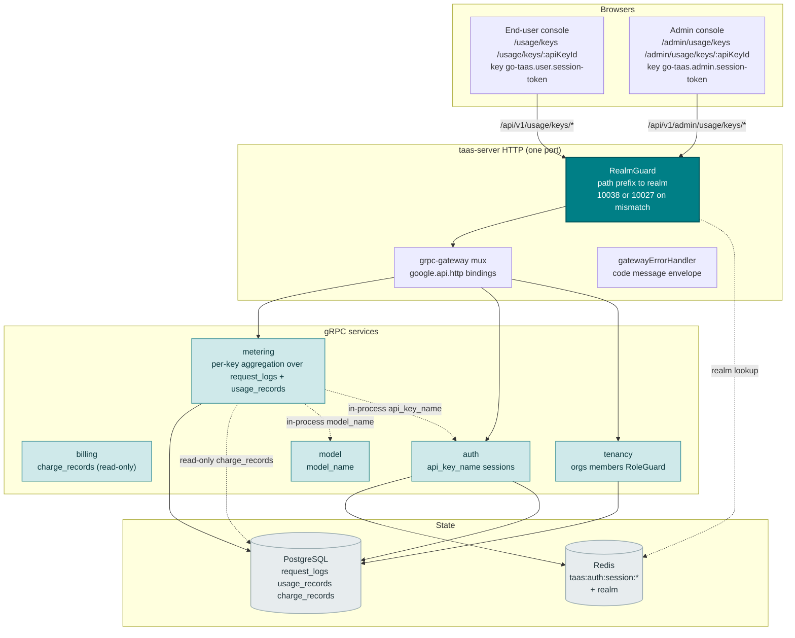
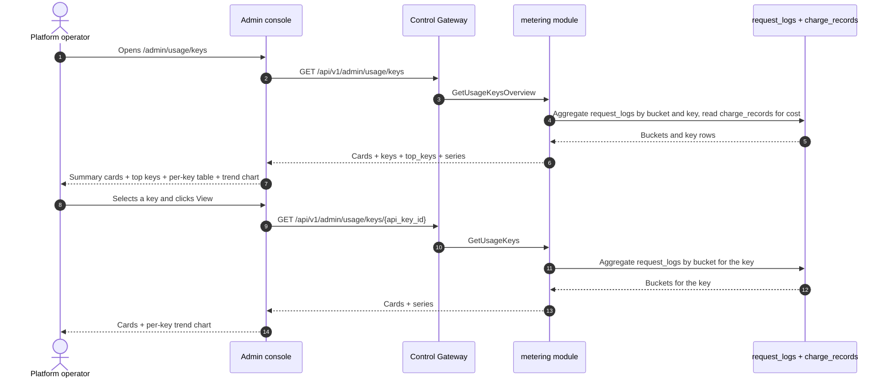
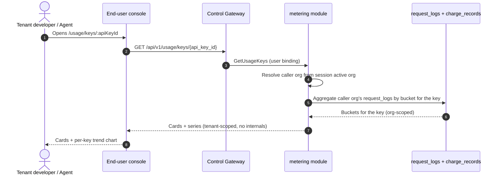
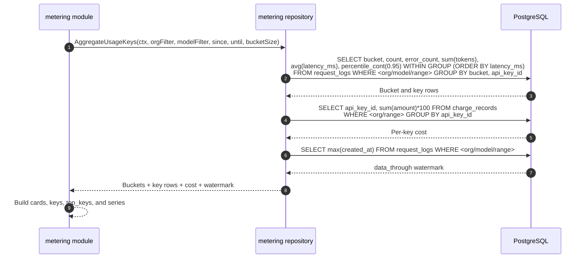

# API Key Usage Analytics — Architecture and Detailed Design

| Attribute | Content |
| --- | --- |
| Feature point | API key usage analytics — per-API-key usage and cost breakdown over time (requests, tokens, cost, error rate), top keys, and per-key trend charts (backlog row 28) |
| Document scope | Architecture and detailed design for feature-28: read-only per-API-key analytics in the `metering` module (reading `billing`'s `charge_records` read-only over the shared database); the `GetUsageKeysOverview` (admin fleet) and `GetUsageKeys` (dual-bound) RPCs on `MeteringService`; the admin Usage Keys pages (`/admin/usage/keys`, `/admin/usage/keys/:apiKeyId`) and the end-user Usage Keys pages (`/usage/keys`, `/usage/keys/:apiKeyId`); plus error handling, configuration, security, rollout, and function-level design per layer |
| Owning modules | `metering` (read-only aggregation over `request_logs` and `usage_records` for per-key metrics, plus the two RPCs), `billing` (read-only: per-key cost from `charge_records` over the shared database), `model` (read-only: `model_name` resolution), `auth` (read-only: `api_key_name` resolution, session realm, session active org), `tenancy` (RoleGuard, read-only), `pkg/server` gateway (admin-prefix and user-prefix bindings), console web app (admin `UsageKeysPage`/`UsageKeyDetailPage`, end-user `UserUsageKeysPage`/`UserUsageKeyDetailPage`) |
| Related documents | [Requirement Analysis and UI/UX Design](../design/api-key-usage-analytics.md) · [Architecture Design](../design/architecture.md) §2.5 (`metering`), §2.6 (`billing`) · [Usage Dashboards & Per-Request Cost Attribution](./usage-dashboard.md) (the sibling read-only dashboard and its inline-SVG chart, freshness, range, and group-by conventions) · [Model Observability Dashboard](./model-observability.md) (the sibling read-only aggregation over `request_logs` and its per-key breakdown) · [Request Logs & API Playground](./request-logs-playground.md) (the `request_logs` table and its `api_key_id`/`status`/`error`/token fields this feature aggregates) · [Console Surface Separation](./console-surface-separation.md) (the two surfaces this feature spans, the `UserShell`/`AdminShell` conventions, the masked-projection rule) |
| Status | Architecture complete, handed to the Developer agent |

---

## 1. Overview and Goals

go-taas records every inference request's metadata — latency, status, error, and token counts — in `request_logs` (feature #12), settles usage into `usage_records` per key per hour (feature #4), and turns settled usage into `charge_records` with amounts per key × model × card × hour (feature #5). The usage dashboard (feature #9) shows cost and token counts with a group-by toggle, and the model observability dashboard (feature #24) shows per-key breakdowns within a single model. What the console still cannot answer is the operator's and tenant's question: *which API key is driving my usage and cost, and how is each key trending?* The usage dashboard groups by key but does not lead with a per-key ranking; the observability dashboard shows per-key breakdowns only within one model; and neither shows a per-key error rate or a per-key trend chart. There is no surface that ranks keys by usage and cost, shows each key's trend over time, and attributes error rate per key.

This feature adds **API key usage analytics**: per-API-key usage and cost breakdown over time (requests, tokens, cost, error rate), top keys, and per-key trend charts. It is a **read-only** aggregation layer — nothing in the inference, metering, or billing pipelines changes. It is the smallest independently valuable increment of Phase 4's productionization roadmap item: it turns "usage is high" into "key `prod-app` drove 60% of this month's cost, with a rising error rate".

**Goals**: a `GetUsageKeysOverview` RPC (admin fleet: cards + top-keys ranking + per-key table + per-key trend) and a `GetUsageKeys` RPC (admin per-key drill-down and end-user per-key view: cards + trend for one key), both on `MeteringService`; an admin Usage Keys page (`/admin/usage/keys`) and per-key drill-down (`/admin/usage/keys/:apiKeyId`), and an end-user Usage Keys page (`/usage/keys`) and drill-down (`/usage/keys/:apiKeyId`); new error code 11201 `CodeUsageKeyNotFound`; the page → route → API-prefix table with exact prefixes; per-page interactive states including empty, error, and permission-denied; and numbered acceptance criteria testable in Nightwatch against the compose stack.

**Non-goals** (deferred, design §8): real-time streaming metrics (the request-log cadence stands); anomaly detection or threshold alerts (feature #26 consumes observability events in-console — out of scope here); saved custom views or dashboards; comparing keys side-by-side in a chart (v1 shows a per-key table and a single-key chart; a comparison chart is future work); exposing service ids, replica counts, or other operator internals to tenants (D7); any change to the inference, metering, or billing pipelines (read-only feature); new audit events (D9).

### 1.1 Reading order of this document

Section 2 records the architecture decisions (AD1–AD9, mirroring the design's D1–D9). Sections 3–5 are the component view, data model, and API design. Section 6 is the frontend architecture (page → route → API-prefix table for both consoles, auth guard per surface). Sections 7–8 are the sequence flows and error handling. Sections 9–11 are configuration, security, and rollout. Sections 12–14 are the acceptance-criteria traceability, the function-level detailed design, and the ordered implementation task list.

---

## 2. Architecture Decisions

| # | Decision | Rationale |
| --- | --- | --- |
| AD1 | **The usage-keys RPCs live in `MeteringService`** and **read `billing`'s `charge_records` directly over the shared database** — no cross-service RPC | Both modules resolve the same `server.Components` PostgreSQL handle (`s.components.DB().GormDB()`), so a direct SQL read is the established pattern (usage-dashboard AD1). The design doc's "owning modules: metering + billing" is honored: metering owns the aggregation and reads billing's charge records read-only (design D3) |
| AD2 | **The usage-keys error block is 11201–11299, the next free block after tracing's 111xx.** The tracing module owns 11101 (feature #27). The design's "fresh block after the tracing block (111xx)" intent is honored by taking the next free block after 111xx | Each module has its own error block (`pkg/errors/codes.go`); tracing took 111xx, so usage-keys takes 112xx. This is the interpretation most consistent with the existing architecture (design D8, confirmed) |
| AD3 | **Metrics are derived from `request_logs` and `usage_records`** (which carry `api_key_id`, `status`, `error`, and the four token counts per request, feature #12), aggregated server-side per key. The metric families are **requests** (count), **tokens** (input + output + cached + reasoning), **cost** (from `charge_records`, integer cents), and **error rate** (error requests ÷ total requests) | `request_logs` already captures everything needed and is written alongside the voucher in the same idempotent handler (feature #12); `charge_records` carry the authoritative per-key cost (feature #5). Aggregating server-side keeps the payload small and the client dependency-light (design D2) |
| AD4 | **One new RPC per surface shape** rather than extending `GetUsageDashboard`: `GetUsageKeysOverview` (admin fleet: cards + top-keys ranking + per-key table + per-key trend) and `GetUsageKeys` (admin per-key drill-down and end-user per-key view: cards + trend for one key). The end-user surface reuses `GetUsageKeys` scoped to the tenant's own keys | The analytics page needs several shapes at once (headline cards, a ranking, a table, a trend); bolting them onto `GetUsageDashboard` would break its established group-by semantics, while separate calls recreate the N+1 slow console. A dedicated pair of RPCs keeps the per-key concern out of the usage dashboard's group-by surface (design D3) |
| AD5 | **Time buckets adapt to the range**: hourly buckets for ranges ≤ 7 days, daily buckets for ranges > 7 days. The range is capped at **92 days** and validation reuses **10404** (the metering range contract) | Hourly granularity for short ranges shows intra-day spikes (the per-key signal); daily for long ranges keeps the payload small. The 92-day cap and 10404 reuse keep the range contract uniform with every metering query (usage-dashboard AD7) (design D4) |
| AD6 | **The chart renders with inline SVG** — one bar (or line) per bucket, with a metric switcher (requests / tokens / cost / error rate) — no new charting dependency | The console is deliberately dependency-light; a small, testable SVG component matches the usage-dashboard AD8 decision (design D5) |
| AD7 | **Freshness is explicit**: every response carries `data_through` (the last complete bucket covered by request logs) and the console shows a "data through <time>" note plus a pending/partial marker when the selected range extends past it | Usage-lag confusion is the most consistently recorded pitfall (OpenAI, usage-dashboard AD8); the marker keeps the freshness story honest with zero new pipeline work (design D6) |
| AD8 | **The end-user surface is tenant-scoped and masked**: `GetUsageKeys` on the user prefix returns only the tenant's own keys, with no service ids, no replica counts, and no other tenants' data | Follows feature #17's masked-projection rule and the observability AD4 pattern: tenants get their own key analytics, not operator internals (design D7) |
| AD9 | **The admin usage-keys RPCs are fleet-wide by default, not org-scoped.** `GetUsageKeysOverview` and the admin binding of `GetUsageKeys` aggregate across all orgs, with an optional `organization_id` filter read from `X-Organization-Id`. They are gated by `tenancy.RoleGuard` (admin role, 10036). The user binding of `GetUsageKeys` is hard-scoped to the caller's org (session active org authoritative, `X-Organization-Id` ignored) | The operator needs a cross-org fleet view to spot a misbehaving or dominant key; the tenant needs only their own key analytics. This is the one deliberate deviation from the "admin queries resolve the org" pattern — the fleet view is the point of the admin surface, and RoleGuard keeps it admin-only (design D1, D7) |

---

## 3. Component View

### 3.1 Ownership

| Layer / component | Owns | Changes in this feature |
| --- | --- | --- |
| **Control Gateway (`grpc-gateway`)** | HTTP/JSON facade for the usage-keys RPCs; realm guard (feature #17) already rejects a wrong-realm session with 10038; passes `X-Organization-Id` through as gRPC metadata | New bindings for the two HTTP usage-keys RPCs (Section 5); no change to the realm guard |
| **`metering` module (`services/metering`)** | The read-only per-key aggregation over `request_logs` and `usage_records`, the two RPCs, the range validation, the bucket builder, the `data_through` watermark | New RPCs on the existing `MeteringService` (AD1, AD4) |
| **`billing` module** | `charge_records` (the per-key cost source) | Read-only: the metering module reads `charge_records` over the shared database (AD1); no code change |
| **`model` module** | Model metadata (`model_id` → `model_name`) | Read-only: the metering module resolves `model_name` in-process (AD3) |
| **`auth` module** | API key identity (`api_key_id` → `api_key_name`), session realm, session active org | Read-only: the metering module resolves `api_key_name` in-process and the session active org for the user binding (AD8, AD9) |
| **`tenancy` module** | Organizations, members, roles, RoleGuard | Read-only: `RoleGuard` gates the admin usage-keys RPCs by the caller's role (10036) |
| **PostgreSQL** | `request_logs`, `usage_records`, `charge_records` (existing) | No new tables; the existing indexes serve the range scans (Section 4) |
| **Console** | Admin Usage Keys pages and end-user Usage Keys pages | Four new pages on the two surfaces (Section 6) |

### 3.2 Runtime component view



### 3.3 Request identity chain

The usage-keys RPCs reuse the established identity chain (console-surface-separation §3.3), with one deliberate difference for the admin fleet view (AD9):

1. `RealmGuard` (HTTP, `pkg/server/realm.go`) — path prefix decides the expected realm. `/api/v1/admin/usage/keys/*` expects `admin`; `/api/v1/usage/keys/*` expects `user`. With no `Authorization` header: pass through (transitional, AD4 of feature #17). With a header: resolve the session realm from Redis; mismatch → 10038, unknown/expired/realm-less → 10027.
2. grpc-gateway mux — routes by the annotated path and forwards `authorization` and `x-organization-id`.
3. Service handler — **admin binding**: the fleet view is cross-org by default; `organization_id` is an optional filter read from `X-Organization-Id` (or the session active org when the caller wants to scope to their own org). **User binding**: `SessionActiveOrg` makes the session's active organization authoritative and ignores `X-Organization-Id`; without a session, `resolveOrganizationID` reads the transitional header and returns 10001 when it is absent or empty.
4. `tenancy.RoleGuard` — gates the admin usage-keys RPCs by the caller's role in the resolved org context (10036). The end-user usage-keys RPC is hard-scoped to the caller's org and needs no role check.

---

## 4. Data Model

### 4.1 No New Tables

The usage-keys feature is a pure read-only aggregation over the existing `request_logs`, `usage_records`, and `charge_records` tables (AD1, design D9). No new tables, no new MQ subjects, no new runners, and no writes on any path. The columns consumed are:

| Table | Column | Used for |
| --- | --- | --- |
| `request_logs` | `organization_id` | Org scoping (user binding) and the optional admin org filter |
| | `api_key_id` | The per-key grouping |
| | `model_id` | The optional model filter |
| | `status` | Error count (status = `error`) |
| | `prompt_tokens` / `completion_tokens` / `cached_tokens` / `reasoning_tokens` | Token totals |
| | `latency_ms` | Latency percentiles (p50/p90/p95/p99) and averages |
| | `created_at` | Bucket assignment and the `data_through` watermark |
| `usage_records` | `api_key_id`, `period_start`, token columns | The settled token totals (reconciliation) |
| `charge_records` | `api_key_id`, `organization_id`, `period_start`, `amount` | The per-key cost (integer cents) |

### 4.2 Indexes

The existing `request_logs` indexes `idx_request_logs_org_created (organization_id, created_at)` and `idx_request_logs_key_created (api_key_id, created_at)` serve the org-scoped and key-scoped range scans. The admin fleet view (AD9) scans across all orgs, so the `idx_request_logs_created (created_at)` index added by the observability feature (feature #24) serves the fleet-wide range scan. The `charge_records` index `idx_charge_records_org_period (organization_id, period_start)` serves the org-scoped cost scan. **No new indexes are required** — the existing indexes cover the usage-keys range scans.

### 4.3 Migration Notes

- No new tables, no new indexes, no data migration, and no init-SQL upgrade path. The feature is a pure read-only aggregation over existing tables (AD1, design D9).

---

## 5. API Design

All usage-keys RPCs belong to the existing **`taas.metering.v1.MeteringService`** (`proto/taas/metering/v1/metering.proto`), served as HTTP via the Control Gateway. `GetUsageKeysOverview` is admin-only; `GetUsageKeys` is dual-bound (admin + user). The surface is derived from the request path (Section 3.3).

| RPC | HTTP (admin) | HTTP (user) | Status | Purpose |
| --- | --- | --- | --- | --- |
| `GetUsageKeysOverview` | `GET /api/v1/admin/usage/keys` | — | **new** | Fleet cards + top-keys ranking + per-key table + per-key trend |
| `GetUsageKeys` | `GET /api/v1/admin/usage/keys/{api_key_id}` | `GET /api/v1/usage/keys/{api_key_id}` | **new** | Single-key cards + per-key trend (admin: any key; user: tenant-scoped) |

### 5.1 Proto contract

```protobuf
syntax = "proto3";

package taas.metering.v1;

import "google/api/annotations.proto";
import "taas/common/v1/common.proto";

// (Additive to the existing MeteringService.)

// GetUsageKeysOverview returns fleet-wide per-key analytics: summary
// cards, a top-keys ranking, a per-key table, and a per-key trend.
// Admin-surface API: served under /api/v1/admin.
rpc GetUsageKeysOverview(GetUsageKeysOverviewRequest) returns (GetUsageKeysOverviewResponse) {
  option (google.api.http) = {get: "/api/v1/admin/usage/keys"};
}

// GetUsageKeys returns single-key analytics: summary cards and a per-key
// trend. The admin binding covers any key; the user binding is
// tenant-scoped.
rpc GetUsageKeys(GetUsageKeysRequest) returns (GetUsageKeysResponse) {
  option (google.api.http) = {
    get: "/api/v1/admin/usage/keys/{api_key_id}"
    additional_bindings: {get: "/api/v1/usage/keys/{api_key_id}"}
  };
}

message GetUsageKeysOverviewRequest {
  // organization_id is an optional fleet filter. On the admin surface
  // it is read from X-Organization-Id (or the session active org);
  // absent means fleet-wide (AD9).
  string organization_id = 1;
  // since/until bound the range, unix seconds. Defaults: until = now,
  // since = until - 24h. A range > 92 days is rejected (10404).
  int64 since = 2;
  int64 until = 3;
  // model_id optionally filters the cards, keys, and series to one model.
  string model_id = 4;
}

message GetUsageKeysOverviewResponse {
  taas.common.v1.Response response = 1;
  UsageKeysCard cards = 2;
  repeated UsageKeyRow keys = 3;
  repeated UsageKeyTopRow top_keys = 4;
  repeated UsageKeysSeriesPoint series = 5;
}

message GetUsageKeysRequest {
  // organization_id is derived from the session active org (user
  // binding) or X-Organization-Id (admin binding); the field exists for
  // gRPC-direct callers.
  string organization_id = 1;
  // api_key_id is the path parameter.
  string api_key_id = 2;
  // since/until bound the range, unix seconds. Defaults: until = now,
  // since = until - 24h. A range > 92 days is rejected (10404).
  int64 since = 3;
  int64 until = 4;
}

message GetUsageKeysResponse {
  taas.common.v1.Response response = 1;
  UsageKeysCard cards = 2;
  repeated UsageKeysSeriesPoint series = 3;
}

// UsageKeysCard is the headline summary of the range. error_rate and
// share_pct are derived client-side; the wire carries integer counts,
// integer milliseconds, and integer cents only.
message UsageKeysCard {
  int64 request_count = 1;
  int64 error_count = 2;
  int64 total_tokens = 3;
  int64 total_cost_cents = 4;
  int64 avg_latency_ms = 5;
  int64 p95_latency_ms = 6;
  // data_through is the start of the last complete bucket covered by
  // request logs (AD7); buckets past it are pending.
  int64 data_through = 7;
}

// UsageKeyRow is one API key's aggregate in the per-key table.
message UsageKeyRow {
  string api_key_id = 1;
  string api_key_name = 2;
  string organization_id = 3;
  int64 request_count = 4;
  int64 error_count = 5;
  int64 total_tokens = 6;
  int64 total_cost_cents = 7;
  int64 avg_latency_ms = 8;
  int64 p95_latency_ms = 9;
  // data_through is the key's last complete bucket (AD7).
  int64 data_through = 10;
}

// UsageKeyTopRow is one key in the top-keys ranking (default 5 by cost).
message UsageKeyTopRow {
  string api_key_id = 1;
  string api_key_name = 2;
  int64 total_cost_cents = 3;
  int64 request_count = 4;
  int64 total_tokens = 5;
  // share_pct is derived client-side as key cost / total cost.
  int64 share_pct = 6;
}

// UsageKeysSeriesPoint is one time bucket of the series.
message UsageKeysSeriesPoint {
  // bucket is the bucket start, unix seconds (hourly for ranges <= 7
  // days, daily otherwise, AD5).
  int64 bucket = 1;
  int64 request_count = 2;
  int64 error_count = 3;
  int64 total_tokens = 4;
  int64 total_cost_cents = 5;
  int64 avg_latency_ms = 6;
  int64 p95_latency_ms = 7;
}
```

### 5.2 Contract notes (pinned for the Developer agent)

1. `GetUsageKeysOverview` validates `since`/`until` (int64 unix seconds; defaults `until = now`, `since = until − 24h`); `since > until` or a range > 92 days returns 10404 (AD5). `model_id` and `organization_id` are optional filters.
2. `GetUsageKeys` validates the same range contract; an unknown `api_key_id` returns 11201 `CodeUsageKeyNotFound` (AD2). On the user prefix it is scoped to the caller's organization (AD8) and exposes no service ids or operator internals.
3. Buckets are hourly for ranges ≤ 7 days and daily otherwise (AD5); each bucket carries `bucket`, `request_count`, `error_count`, `total_tokens`, `total_cost_cents`, `avg_latency_ms`, `p95_latency_ms`. `error_rate` and `share_pct` are derived client-side; the wire carries integer counts, integer milliseconds, and integer cents only (AD3).
4. Every response carries `data_through` (the last complete bucket covered by request logs) for the freshness marker (AD7).
5. Aggregation reads `request_logs` (feature #12) — `api_key_id`, `status`, `error`, and the four token counts per request — and `charge_records` (feature #5) for per-key cost; it writes nothing (AD1, design D9).
6. Wire conventions unchanged: dotted pagination where lists apply, HTTP 200 on success, business errors as `{"code": <int>, "message": "..."}`, int64 fields serialized as JSON strings.

### 5.3 Error codes

Error codes (usage-keys block 11201–11299, `pkg/errors/codes.go`):

| Condition | Code | Constant | Notes |
| --- | --- | --- | --- |
| An unknown `api_key_id` | 11201 | `CodeUsageKeyNotFound` | **New** (AD2) |
| A malformed or over-long range | 10404 | `CodeMeteringRangeInvalid` | Reused (AD5) — the metering range contract |
| Database / infrastructure failure | 500 | `CodeInternal` | Via error normalization |

---

## 6. Frontend Architecture

### 6.1 Page → Route → API-prefix table

| Page / component | Surface | Web route | API prefix | Auth guard |
| --- | --- | --- | --- | --- |
| **Usage Keys page** | admin | `/admin/usage/keys` | `/api/v1/admin/usage/keys` | admin session; RoleGuard (admin role) |
| **Usage Key Detail page** | admin | `/admin/usage/keys/:apiKeyId` | `/api/v1/admin/usage/keys/{api_key_id}` | admin session; RoleGuard (admin role) |
| **Usage Keys page** | end-user | `/usage/keys` | `/api/v1/usage/keys` | user session; hard-scoped to caller's org |
| **Usage Key Detail page** | end-user | `/usage/keys/:apiKeyId` | `/api/v1/usage/keys/{api_key_id}` | user session; hard-scoped to caller's org |

> The admin Usage Keys pages call only `/api/v1/admin/usage/keys/*`; the end-user Usage Keys pages call only `/api/v1/usage/keys/*`. The two surfaces never share a session token (feature #17).

### 6.2 Navigation placement

- **Admin console**: a new **Usage Keys** item (`/admin/usage/keys`, testid `nav-usage-keys`) in the admin nav, in the operations group alongside Usage, Cost, and Observability.
- **End-user console**: a new **Usage Keys** item (`/usage/keys`, testid `user-nav-usage-keys`) in the user nav, alongside Usage and Cost.

### 6.3 Shared components and state to reuse

- **API client** (`web/src/api.ts`): the realm-scoped client (`createApi(realm)`) already sends `Authorization: Bearer <realm>.session-token` and `X-Organization-Id` (only when the realm token key is empty). The usage-keys pages reuse it unchanged; no new client is added.
- **Inline-SVG chart**: a new shared `UsageKeysChart.tsx` component (one bar/line per bucket with a metric switcher), following the usage-dashboard `UsageChart.tsx` pattern (AD6). The metric switcher toggles requests / tokens / cost / error rate client-side with no refetch.
- **Time-range filter**: the preset control (24 h / 7 d / 30 d / custom with a date-time picker) is shared with the Usage, Request Logs, and Observability pages.
- **Summary cards**: a new shared `UsageKeysCards.tsx` component rendering the card row with the "data through <time>" freshness note (AD7).
- **Top-keys ranking**: a new shared `TopKeysList.tsx` component rendering the ranked list with share bars.
- **Status / freshness badge**: the pending/partial marker past `data_through` reuses the usage-dashboard pending-badge styling.
- **Empty state / data-freshness note**: the Request Logs page pattern (a note that metrics appear within the ingestion window) is reused.

### 6.4 Auth guard per surface

- **Admin Usage Keys pages** (`/admin/usage/keys`, `/admin/usage/keys/:apiKeyId`): rendered inside `AdminShell`, which runs the admin session guard when `go-taas.admin.session-token` is non-empty; a missing/expired session redirects to `/admin/login?reason=expired`; a wrong-realm session is rejected by the gateway with 10038. The pages' API calls go to `/api/v1/admin/usage/keys/*`. A session without the required role receives 10036 and the page shows the standard permission-denied state (feature #17).
- **End-user Usage Keys pages** (`/usage/keys`, `/usage/keys/:apiKeyId`): rendered inside `UserShell`, which runs the user session guard when `go-taas.user.session-token` is non-empty; a missing/expired session redirects to `/login?reason=expired`. The pages' API calls go to `/api/v1/usage/keys/*`. The pages expose no service ids or operator internals (AD8).
- **Unauthenticated visitors**: an unauthenticated visitor to either page is redirected to the correct login (`/admin/login` vs `/login`) by the shell guard.

### 6.5 Console contract (pinned for the Developer agent)

**Usage Keys page** (`/admin/usage/keys`): a page header ("Usage Keys", subtitle "Per-API-key usage and cost over time") with a **Refresh** action (`usage-keys-refresh`). Below: a **filter bar** — a **Time range** control (`usage-keys-filter-range`, presets 24 h / 7 d / 30 d / custom) and a **Model** filter (`usage-keys-filter-model`, dropdown, "All models" default); a row of **summary cards** (`usage-keys-cards`): Requests, Error rate, Total tokens, Total cost, Avg latency, p95 latency, each with a "data through <time>" note; a **top-keys ranking** (`usage-keys-top`, `usage-keys-top-{api_key_id}`) of the top N keys (default 5) by cost, each with a share bar; a **per-key table** (`usage-keys-table`, `usage-keys-row-{api_key_id}`) with columns API key (link to the drill-down), Organization, Requests, Error rate, Total tokens, Total cost, Avg latency, p95 latency, Data through; and an inline-SVG **trend chart** (`usage-keys-chart`) with a metric switcher (`usage-keys-metric-toggle`). Sortable by Requests, Error rate, Total tokens, Total cost, Avg latency, and p95 latency; filterable by the Model dropdown; paginated. Empty state: "No usage data in this range." with a hint to widen the range. Error state: an error banner with a Retry button and a "Showing stale data" banner. Permission-denied: the standard state with a link back to the admin home.

**Usage Key Detail page** (`/admin/usage/keys/:apiKeyId`): a back link to the overview, a header with the key name, a filter bar (Time range), summary cards, and the inline-SVG trend chart with the metric switcher. Empty copy: "No usage data for this key in this range." Not-found state (11201) shows the standard not-found state with a link back to the overview.

**End-user Usage Keys page** (`/usage/keys`): identical to the admin page, scoped to the tenant's own keys. No Organization column (the tenant sees only their own org). Empty copy "No usage data in this range." and the tenant's own permission-denied copy (10005 org gone / 10017 org disabled from feature #17 §8.2).

**End-user Usage Key Detail page** (`/usage/keys/:apiKeyId`): identical to the admin detail, scoped to the tenant's own usage of the key. Not-found copy for an unknown `api_key_id` (11201) and the tenant's own permission-denied copy (10005/10017).

---

## 7. Sequence Flows

### 7.1 Admin fleet per-key overview load



### 7.2 End-user tenant-scoped per-key view load



### 7.3 The aggregation query



---

## 8. Error Handling

All errors are `pkg/errors` business codes in the unified envelope (Section 5.3). The usage-keys module is read-only, so there are no runner-side failures and no writes to fail. A database failure is normalized to 500 `CodeInternal`.

The console branches on the body `code` (as `web/src/api.ts` already does), never on the HTTP status. Each new code renders a specific inline message: 11201 "usage key not found", 10404 "invalid range" (the metering range contract). The admin pages map 10036 to the standard permission-denied state; the end-user pages map 10005/10017 to the tenant's permission-denied copy (feature #17 §8.2).

---

## 9. Configuration Additions

None. The usage-keys feature is a pure read-only aggregation over existing tables and reuses the metering range contract (10404) and the existing `metering.maxRangeSeconds`-style cap. No new config keys, runners, or MQ subjects are added (AD1, design D9).

---

## 10. Security Considerations

- **Surface separation**: the admin Usage Keys pages call only `/api/v1/admin/usage/keys/*`; the end-user Usage Keys pages call only `/api/v1/usage/keys/*`. The realm guard rejects a wrong-realm session with 10038 before any handler runs (feature #17).
- **Admin fleet view gated by role**: the admin usage-keys RPCs are fleet-wide by default (AD9) and gated by `tenancy.RoleGuard` — only a caller with the required admin role can see the cross-org fleet view; an inaccessible org returns 10036.
- **End-user hard scoping**: the user binding of `GetUsageKeys` is hard-scoped to the caller's org (session active org authoritative, `X-Organization-Id` ignored); a caller can never see another tenant's key analytics.
- **Masked projection**: the end-user surface exposes no service ids, replica counts, or other operator orchestration internals (AD8). The admin surface is operator-scoped.
- **Read-only by construction**: the usage-keys module issues only `SELECT`s; no writes on any path (AD1, design D9). No new audit events are needed — the underlying request-log and charge-record writes are already audited (feature #15).

---

## 11. Rollout / Upgrade Notes

- **No schema change**: the feature reads existing tables only; deploy `taas-server` alone. No new tables, no new indexes, no data migration, no init-SQL upgrade path.
- **The proto change is additive**: two new RPCs on the existing `MeteringService`; no existing RPC or message changes. The gateway mux gains the new bindings; the realm guard is unchanged.
- **Console**: the four new pages are added to the existing bundle; the admin nav gains Usage Keys, the end-user nav gains Usage Keys. No existing route changes.
- **Backward compatibility**: the transitional (session-less, `X-Organization-Id`) path is preserved for the CLI, FVT, and e2e suites; the realm guard passes through requests without an `Authorization` header (feature #17 AD4).
- **Empty until data exists**: the usage-keys RPCs return empty cards/keys/series until request logs and charge records exist; the pages render the empty state with a hint to widen the range.

---

## 12. Acceptance-Criteria Traceability

| # | Criterion | Where addressed |
| --- | --- | --- |
| AC1 | `GetUsageKeysOverview` with a valid range returns summary cards, a top-keys ranking, a per-key table, and a time-series; a range > 92 days or `since > until` returns 10404 | §5.1, §5.2, §5.3 |
| AC2 | `GetUsageKeysOverview` returns `top_keys[]` sorted by cost descending with a client-derived `share_pct` | §5.1, §7.3 |
| AC3 | `GetUsageKeys` (admin) returns single-key cards and a per-key trend; an unknown `api_key_id` returns 11201 | §5.1, §5.2, §5.3 |
| AC4 | `GetUsageKeys` (user) returns only the caller's organization's usage of the key, with no service ids or operator internals | §3.3, §6.4, §10 |
| AC5 | Buckets are hourly for ranges ≤ 7 days and daily for ranges > 7 days; every response carries `data_through` | §5.2, §7.3 |
| AC6 | The `/admin/usage/keys` page renders the filter bar, summary cards, the top-keys ranking, the per-key table, and the inline-SVG trend chart from the first successful load, with a last-updated timestamp | §6.5 |
| AC7 | Changing the time range or model filter refetches and re-renders the cards, table, and chart; the metric switcher toggles the chart metric | §6.3, §6.5 |
| AC8 | The empty state ("No usage data in this range.") renders when no data matches; a failed load keeps the last good data with a "Showing stale data" banner and a Retry action | §6.5 |
| AC9 | The `/admin/usage/keys/:apiKeyId` page renders the key's cards and per-key trend chart; an unknown key shows the not-found state | §6.5 |
| AC10 | The `/usage/keys` and `/usage/keys/:apiKeyId` pages render the tenant's own cards, ranking, table, and trend, with no service ids or operator internals visible | §6.5, §10 |
| AC11 | The admin usage-keys pages are reachable only on the admin surface: routes `/admin/usage/keys` and `/admin/usage/keys/:apiKeyId`, every API call uses the `/api/v1/admin/usage/keys/*` prefix with no `/api/v1/usage/keys/*` string | §6.1, §6.4, §10 |
| AC12 | The end-user usage-keys pages are reachable only on the end-user surface: routes `/usage/keys` and `/usage/keys/:apiKeyId`, every API call uses the `/api/v1/usage/keys/*` prefix with no `/api/v1/admin/*` string | §6.1, §6.4, §10 |
| AC13 | A session without the required role receives 10036 on the admin usage-keys pages and the page shows the standard permission-denied state | §3.3, §6.4, §10 |

---

## 13. Detailed Design (function-level responsibilities per layer)

### 13.1 Proto → service → repository → controller

| Layer | File | Responsibilities |
| --- | --- | --- |
| `proto/taas/metering/v1` | `metering.proto` | Additive: `GetUsageKeysOverview`/`GetUsageKeys` RPCs + `GetUsageKeysOverviewRequest/Response`, `GetUsageKeysRequest/Response`, `UsageKeysCard`, `UsageKeyRow`, `UsageKeyTopRow`, `UsageKeysSeriesPoint` messages (Section 5.1). Regenerate `metering.pb.go`/`metering_grpc.pb.go`/`metering.pb.gw.go` via `buf generate` |
| `services/metering` | `usage_keys_model.go` | The aggregation row structs (`UsageKeysBucketRow`, `UsageKeyRow`, `UsageKeyTopRow`) and the `bucketSizeForRange` helper (hourly ≤ 7 d, daily otherwise, AD5) |
| | `usage_keys_repository.go` | `AggregateUsageKeys(ctx, orgFilter, modelFilter, since, until, bucketSize)` — the fleet aggregation (cards + per-key rows + series) with SQL `percentile_cont` (AD3); `AggregateUsageKey(ctx, orgID, apiKeyID, since, until, bucketSize)` — the single-key aggregation (cards + series); `ChargeCostByKey(ctx, orgFilter, since, until)` — the per-key cost from `charge_records` (AD1); `DataThrough(ctx, orgFilter, modelFilter, since, until)` — the `max(created_at)` watermark (AD7) |
| | `service.go` | New RPCs `GetUsageKeysOverview`, `GetUsageKeys`; the range validation (10404, AD5); the admin fleet scope vs user hard-scope resolution (AD9); the `SessionActiveOrg`/`resolveOrganizationID` seam; the `RoleGuard` seam for admin org scoping; the in-process `model_name`/`api_key_name` resolution (AD3) |
| `services/billing` | `service.go` | **Unchanged** — its `charge_records` are read read-only by the metering module over the shared database (AD1) |
| `services/model` | `service.go` | Read-only: expose a `ModelName(ctx, modelID) (string, error)` seam (or reuse `GetModel`) for the metering module to resolve `model_name` in-process (AD3) |
| `services/auth` | `service.go` | Read-only: expose an `APIKeyName(ctx, apiKeyID) (string, error)` seam for the metering module to resolve `api_key_name` in-process (AD3) |
| `pkg/errors` | `codes.go`/`messages.go` | `CodeUsageKeyNotFound` (11201) constant + canonical message "usage key not found" (AD2) |
| `apps/taas-server` | `main.go` | No change — the usage-keys RPCs ride the existing metering service registration; wire the `model`/`auth` name-resolution seams and the `tenancy` RoleGuard into the metering service |
| `web/src` | `pages/UsageKeysPage.tsx`, `pages/UsageKeyDetailPage.tsx`, `pages/user/UserUsageKeysPage.tsx`, `pages/user/UserUsageKeyDetailPage.tsx`, `components/UsageKeysChart.tsx`, `components/UsageKeysCards.tsx`, `components/TopKeysList.tsx`, `App.tsx`, `api.ts`, `shells/AdminShell.tsx`, `shells/UserShell.tsx` | Routes `/admin/usage/keys`, `/admin/usage/keys/:apiKeyId`, `/usage/keys`, `/usage/keys/:apiKeyId`; `GetUsageKeysOverview`/`GetUsageKeys` API types and calls; nav items (Section 6.5) |
| `test` | `fvt/usage_keys_fvt_test.go`, `e2e/tests/usageKeys.js` | Section 14 |

### 13.2 Which React page/module implements each screen

| Screen | React module | Route | API calls |
| --- | --- | --- | --- |
| Usage Keys page (admin) | `web/src/pages/UsageKeysPage.tsx` | `/admin/usage/keys` | `GetUsageKeysOverview` |
| Usage Key Detail page (admin) | `web/src/pages/UsageKeyDetailPage.tsx` | `/admin/usage/keys/:apiKeyId` | `GetUsageKeys` |
| Usage Keys page (end-user) | `web/src/pages/user/UserUsageKeysPage.tsx` | `/usage/keys` | `GetUsageKeysOverview` |
| Usage Key Detail page (end-user) | `web/src/pages/user/UserUsageKeyDetailPage.tsx` | `/usage/keys/:apiKeyId` | `GetUsageKeys` |
| Inline-SVG chart | `web/src/components/UsageKeysChart.tsx` (shared) | (on all four pages) | (client-side; metric switcher, no refetch) |
| Summary cards | `web/src/components/UsageKeysCards.tsx` (shared) | (on all four pages) | (client-side; renders the returned cards) |
| Top-keys ranking | `web/src/components/TopKeysList.tsx` (shared) | (on the two overview pages) | (client-side; renders the returned ranking) |

---

## 14. Testing Strategy

- **Unit** (`services/metering`, sqlite in-memory): `usage_keys_repository_test.go` — `AggregateUsageKeys` returns correct cards/key rows/series for a seeded `request_logs` set (AC1, AC2), `AggregateUsageKey` returns the single-key cards/series (AC3), `ChargeCostByKey` returns the per-key cost from `charge_records` (AC1), `DataThrough` returns the last complete bucket (AC5), the bucket size switches at the 7-day boundary (AC5). `service_test.go` — range validation returns 10404 for `since > until` and a range > 92 days (AC1); an unknown `api_key_id` returns 11201 (AC3); the user binding is hard-scoped to the caller's org and exposes no service ids (AC4); admin org scoping returns 10036 (AC13). Coverage ≥ 80% on the new files.
- **FVT** (`test/fvt/usage_keys_fvt_test.go`, the metering FVT pattern: file-backed sqlite + `MigrateSchemaForFVT` + `NewForFVT` + gRPC server with the production interceptor + gateway mux with `FVTHeaderMatcher`): seed `request_logs` and `charge_records` rows across orgs/keys/models, then assert `GetUsageKeysOverview` cards/keys/top_keys/series (AC1), the `top_keys[]` cost-descending sort and `share_pct` (AC2), `GetUsageKeys` admin single-key cards/series and 11201 (AC3), the user binding returns only the caller org's rows with no internals (AC4), hourly vs daily buckets and `data_through` (AC5), and 10404 inline (AC1).
- **E2E** (`test/e2e/tests/usageKeys.js`, the `usageDashboard.js` pattern): against the compose stack — the admin `/admin/usage/keys` page renders `usage-keys-cards`, `usage-keys-top`, `usage-keys-table`, and `usage-keys-chart` from the first successful load (AC6); changing the time range or model filter refetches and the metric switcher toggles the chart metric (AC7); the empty state and stale-data banner render (AC8); the admin drill-down renders the key's cards and trend and the not-found state (AC9); the end-user `/usage/keys` and `/usage/keys/:apiKeyId` pages render the tenant's own cards/ranking/table/trend with no service ids (AC10); each page calls only its own prefix and an unauthenticated visitor is redirected to the correct login (AC11/AC12); a session without the required role receives 10036 and shows the permission-denied state (AC13).