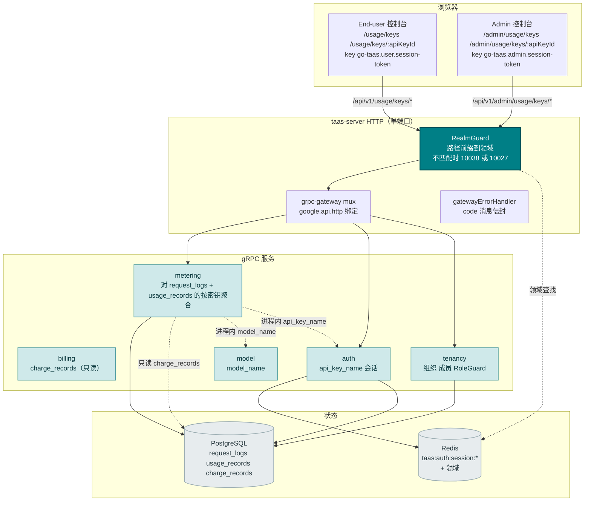
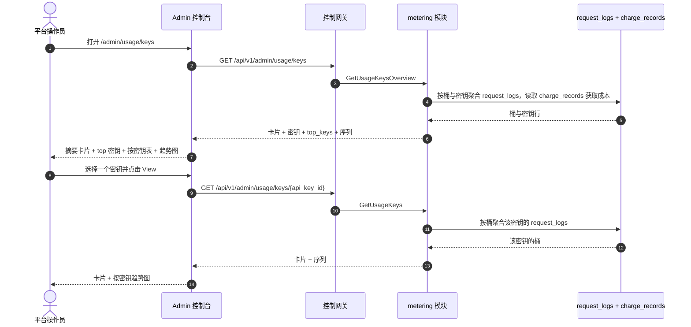
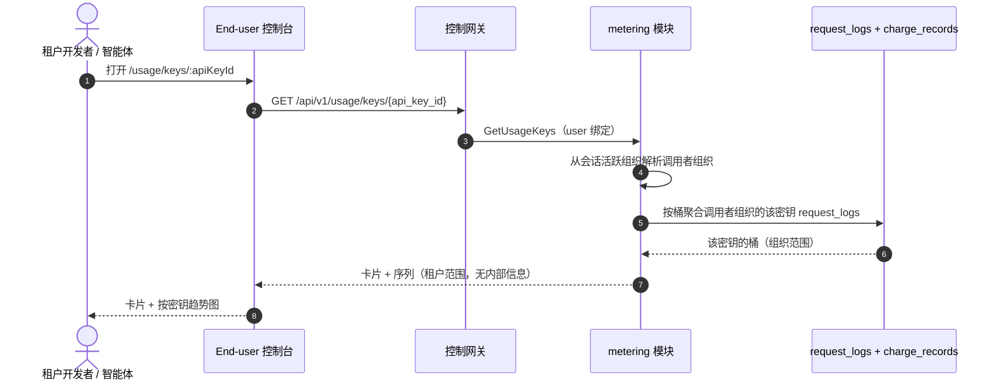
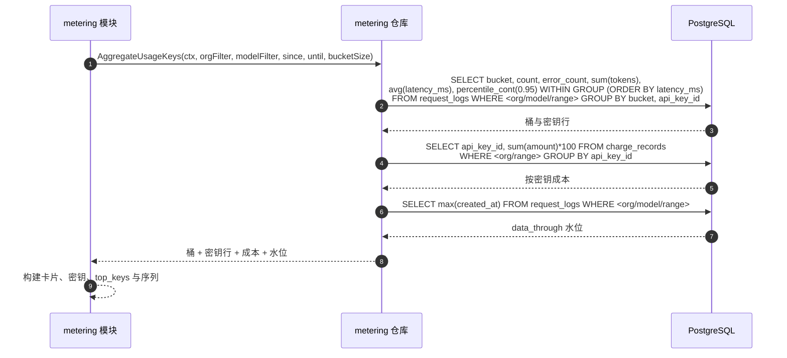

# API 密钥用量分析 — 架构与详细设计

| 属性 | 内容 |
| --- | --- |
| 功能点 | API 密钥用量分析 — 按 API 密钥的用量与成本随时间分解（请求、token、成本、错误率）、top 密钥、以及按密钥趋势图（backlog 第 28 行） |
| 文档范围 | 功能 28 的架构与详细设计：`metering` 模块中的只读按密钥分析（通过共享数据库只读读取 `billing` 的 `charge_records`）；`MeteringService` 上的 `GetUsageKeysOverview`（admin 舰队）与 `GetUsageKeys`（双绑定）RPC；admin 用量密钥页面（`/admin/usage/keys`、`/admin/usage/keys/:apiKeyId`）与 end-user 用量密钥页面（`/usage/keys`、`/usage/keys/:apiKeyId`）；以及错误处理、配置、安全、上线与逐层函数级设计 |
| 拥有模块 | `metering`（对 `request_logs` 与 `usage_records` 的只读聚合以获取按密钥指标，以及两个 RPC）、`billing`（只读：通过共享数据库从 `charge_records` 获取按密钥成本）、`model`（只读：`model_name` 解析）、`auth`（只读：`api_key_name` 解析、会话领域、会话活跃组织）、`tenancy`（RoleGuard，只读）、`pkg/server` 网关（admin 前缀与 user 前缀绑定）、控制台 Web 应用（admin `UsageKeysPage`/`UsageKeyDetailPage`，end-user `UserUsageKeysPage`/`UserUsageKeyDetailPage`） |
| 相关文档 | [需求分析与 UI/UX 设计](../design/api-key-usage-analytics.md) · [架构设计](../design/architecture.md) §2.5（`metering`）、§2.6（`billing`）· [用量仪表盘与按请求成本归因](./usage-dashboard.md)（同类只读仪表盘及其内联 SVG 图表、新鲜度、范围与分组约定）· [模型可观测性仪表盘](./model-observability.md)（对 `request_logs` 的同类只读聚合及其按密钥分解）· [请求日志与 API 游乐场](./request-logs-playground.md)（`request_logs` 表及其本功能聚合的 `api_key_id`/`status`/`error`/token 字段）· [控制台表面分离](./console-surface-separation.md)（本功能跨越的两个表面、`UserShell`/`AdminShell` 约定、掩码投影规则） |
| 状态 | 架构完成，已移交给 Developer 智能体 |

---

## 1. 概述与目标

go-taas 将每个推理请求的元数据 — 延迟、状态、错误与 token 计数 — 记录在 `request_logs`（功能 #12）中，将用量按密钥每小时结算到 `usage_records`（功能 #4），并将已结算用量转为带金额的 `charge_records`（按密钥 × 模型 × 卡 × 小时，功能 #5）。用量仪表盘（功能 #9）以分组切换展示成本与 token 计数，模型可观测性仪表盘（功能 #24）在单个模型内展示按密钥分解。控制台仍无法回答的是操作员与租户的问题：*哪个 API 密钥在驱动我的用量与成本，每个密钥如何趋势？* 用量仪表盘按密钥分组但不以按密钥排名开头；可观测性仪表盘仅在单个模型内展示按密钥分解；两者都不展示按密钥错误率或按密钥趋势图。没有表面按用量与成本对密钥排名、展示每个密钥随时间趋势、并按密钥归因错误率。

本功能新增**API 密钥用量分析**：按 API 密钥的用量与成本随时间分解（请求、token、成本、错误率）、top 密钥、以及按密钥趋势图。它是**只读**聚合层 — 推理、计量或计费管线均无变化。它是 Phase 4 生产化路线图条目中最小且有独立价值的增量：它将"用量很高"变成"密钥 `prod-app` 驱动了本月 60% 的成本，且错误率在上升"。

**目标**：`GetUsageKeysOverview` RPC（admin 舰队：卡片 + top 密钥排名 + 按密钥表 + 按密钥趋势）与 `GetUsageKeys` RPC（admin 按密钥钻取与 end-user 按密钥视图：单密钥卡片 + 趋势），两者都在 `MeteringService` 上；admin 用量密钥页面（`/admin/usage/keys`）与按密钥钻取（`/admin/usage/keys/:apiKeyId`），以及 end-user 用量密钥页面（`/usage/keys`）与钻取（`/usage/keys/:apiKeyId`）；新错误码 11201 `CodeUsageKeyNotFound`；页面 → 路由 → API 前缀表，含精确前缀；各页面交互状态，包括空、错误与权限拒绝；以及可在 compose 栈上以 Nightwatch 测试的编号验收标准。

**非目标**（延后，设计 §8）：实时流式指标（请求日志节奏不变）；异常检测或阈值告警（功能 #26 在控制台内消费可观测性事件 — 此处不在范围内）；保存的自定义视图或仪表盘；在图表中并排比较密钥（v1 展示按密钥表与单密钥图表；比较图表是未来工作）；向租户暴露服务 ID、副本数或其他操作员编排内部信息（D7）；对推理、计量或计费管线的任何更改（只读功能）；新审计事件（D9）。

### 1.1 本文档的阅读顺序

第 2 节记录架构决策（AD1–AD9，对应设计的 D1–D9）。第 3–5 节是组件视图、数据模型与 API 设计。第 6 节是前端架构（两个控制台的页面 → 路由 → API 前缀表，各表面的认证守卫）。第 7–8 节是时序流与错误处理。第 9–11 节是配置、安全与上线。第 12–14 节是验收标准追溯、函数级详细设计与有序实现任务清单。

---

## 2. 架构决策

| # | 决策 | 理由 |
| --- | --- | --- |
| AD1 | **用量密钥 RPC 位于 `MeteringService`**，并**通过共享数据库直接读取 `billing` 的 `charge_records`** — 无跨服务 RPC | 两个模块解析同一 `server.Components` PostgreSQL 句柄（`s.components.DB().GormDB()`），因此直接 SQL 读取是既定模式（usage-dashboard AD1）。设计文档的"拥有模块：metering + billing"得到实现：metering 拥有聚合并通过共享数据库只读读取 billing 的 charge records（设计 D3） |
| AD2 | **用量密钥错误块为 11201–11299，即 tracing 111xx 之后的下一个空闲块。** tracing 模块拥有 11101（功能 #27）。设计"tracing 块（111xx）之后的新块"的意图通过取 111xx 之后的下一个空闲块来实现 | 每个模块有自己的错误块（`pkg/errors/codes.go`）；tracing 占用 111xx，因此 usage-keys 占用 112xx。这是与现有架构最一致的解读（设计 D8，已确认） |
| AD3 | **指标从 `request_logs` 与 `usage_records` 派生**（它们携带 `api_key_id`、`status`、`error` 与每个请求的四个 token 计数，功能 #12），在服务端按密钥聚合。指标族为**请求**（计数）、**token**（输入 + 输出 + 缓存 + 推理）、**成本**（来自 `charge_records`，整数分）与**错误率**（错误请求 ÷ 总请求） | `request_logs` 已捕获所需一切，并在同一幂等处理器中随凭证一起写入（功能 #12）；`charge_records` 携带权威按密钥成本（功能 #5）。服务端聚合保持负载小、客户端依赖轻（设计 D2） |
| AD4 | **每个表面形状一个 RPC**，而非扩展 `GetUsageDashboard`：`GetUsageKeysOverview`（admin 舰队：卡片 + top 密钥排名 + 按密钥表 + 按密钥趋势）与 `GetUsageKeys`（admin 按密钥钻取与 end-user 按密钥视图：单密钥卡片 + 趋势）。end-user 表面复用 `GetUsageKeys`，限定到租户自己的密钥 | 分析页面需要同时多个形状（头条卡片、排名、表、趋势）；把它们硬塞进 `GetUsageDashboard` 会破坏其既定的分组语义，而单独调用会重现 N+1 慢控制台。专用 RPC 对将按密钥关注点从用量仪表盘的分组表面分离（设计 D3） |
| AD5 | **时间桶随范围自适应**：范围 ≤ 7 天为小时桶，否则为天桶。范围上限为 **92 天**，验证复用 **10404**（metering 范围契约） | 短范围的小时粒度展示日内尖峰（按密钥信号）；长范围的天粒度保持负载小。92 天上限与 10404 复用使范围契约与每个 metering 查询统一（usage-dashboard AD7）（设计 D4） |
| AD6 | **图表以内联 SVG 渲染** — 每桶一个条（或线），带指标切换器（requests / tokens / cost / error rate）— 无新图表依赖 | 控制台刻意依赖轻；小型可测试 SVG 组件匹配 usage-dashboard AD8 决策（设计 D5） |
| AD7 | **新鲜度是显式的**：每个响应携带 `data_through`（请求日志覆盖的最后一个完整桶），控制台在所选范围超出时显示"data through <time>"说明加待处理/部分标记 | 用量滞后混淆是最常记录到的陷阱（OpenAI，usage-dashboard AD8）；标记以零新管线工作保持新鲜度故事诚实（设计 D6） |
| AD8 | **end-user 表面是租户范围且掩码的**：user 前缀上的 `GetUsageKeys` 仅返回租户自己的密钥，无服务 ID、无副本数、无其他租户数据 | 遵循功能 #17 的掩码投影规则与可观测性 AD4 模式：租户获得自己的密钥分析，而非操作员内部信息（设计 D7） |
| AD9 | **admin 用量密钥 RPC 默认全舰队，而非组织范围。** `GetUsageKeysOverview` 与 `GetUsageKeys` 的 admin 绑定跨所有组织聚合，带从 `X-Organization-Id` 读取的可选 `organization_id` 过滤。它们由 `tenancy.RoleGuard`（admin 角色，10036）门控。`GetUsageKeys` 的 user 绑定硬性限定到调用者组织（会话活跃组织权威，忽略 `X-Organization-Id`） | 操作员需要跨组织舰队视图来发现行为异常或占主导的密钥；租户只需要自己的密钥分析。这是对"admin 查询解析组织"模式的刻意偏离 — 舰队视图是 admin 表面的要点，RoleGuard 使其保持 admin 专属（设计 D1、D7） |

---

## 3. 组件视图

### 3.1 归属

| 层 / 组件 | 拥有 | 本功能的变更 |
| --- | --- | --- |
| **控制网关（`grpc-gateway`）** | 用量密钥 RPC 的 HTTP/JSON 门面；领域守卫（功能 #17）已以 10038 拒绝错误领域会话；将 `X-Organization-Id` 作为 gRPC 元数据传递 | 两个 HTTP 用量密钥 RPC 的新绑定（第 5 节）；领域守卫无变更 |
| **`metering` 模块（`services/metering`）** | 对 `request_logs` 与 `usage_records` 的只读按密钥聚合、两个 RPC、范围验证、桶构建器、`data_through` 水位 | 现有 `MeteringService` 上的新 RPC（AD1、AD4） |
| **`billing` 模块** | `charge_records`（按密钥成本来源） | 只读：metering 模块通过共享数据库读取 `charge_records`（AD1）；无代码变更 |
| **`model` 模块** | 模型元数据（`model_id` → `model_name`） | 只读：metering 模块进程内解析 `model_name`（AD3） |
| **`auth` 模块** | API 密钥身份（`api_key_id` → `api_key_name`）、会话领域、会话活跃组织 | 只读：metering 模块进程内解析 `api_key_name` 以及 user 绑定的会话活跃组织（AD8、AD9） |
| **`tenancy` 模块** | 组织、成员、角色、RoleGuard | 只读：`RoleGuard` 按调用者角色门控 admin 用量密钥 RPC（10036） |
| **PostgreSQL** | `request_logs`、`usage_records`、`charge_records`（现有） | 无新表；现有索引服务范围扫描（第 4 节） |
| **控制台** | admin 用量密钥页面与 end-user 用量密钥页面 | 两个表面上的四个新页面（第 6 节） |

### 3.2 运行时组件视图



### 3.3 请求身份链

用量密钥 RPC 复用已建立的身份链（console-surface-separation §3.3），admin 舰队视图有一处刻意差异（AD9）：

1. `RealmGuard`（HTTP，`pkg/server/realm.go`）— 路径前缀决定期望领域。`/api/v1/admin/usage/keys/*` 期望 `admin`；`/api/v1/usage/keys/*` 期望 `user`。无 `Authorization` 头：放行（过渡，功能 #17 的 AD4）。有头：从 Redis 解析会话领域；不匹配 → 10038，未知/过期/无领域 → 10027。
2. grpc-gateway mux — 按注解路径路由并转发 `authorization` 与 `x-organization-id`。
3. 服务处理器 — **admin 绑定**：舰队视图默认跨组织；`organization_id` 是从 `X-Organization-Id`（或调用者想限定到自己组织时的会话活跃组织）读取的可选过滤。**user 绑定**：`SessionActiveOrg` 使会话活跃组织权威并忽略 `X-Organization-Id`；无会话时，`resolveOrganizationID` 读取过渡头，缺失或为空时返回 10001。
4. `tenancy.RoleGuard` — 按调用者在已解析组织上下文中的角色门控 admin 用量密钥 RPC（10036）。end-user 用量密钥 RPC 硬性限定到调用者组织，无需角色检查。

---

## 4. 数据模型

### 4.1 无新表

用量密钥功能是对现有 `request_logs`、`usage_records` 与 `charge_records` 表的纯只读聚合（AD1，设计 D9）。无新表、无新 MQ 主题、无新运行器、任何路径上无写入。消费的列：

| 表 | 列 | 用途 |
| --- | --- | --- |
| `request_logs` | `organization_id` | 组织限定（user 绑定）与可选 admin 组织过滤 |
| | `api_key_id` | 按密钥分组 |
| | `model_id` | 可选模型过滤 |
| | `status` | 错误计数（status = `error`） |
| | `prompt_tokens` / `completion_tokens` / `cached_tokens` / `reasoning_tokens` | token 总计 |
| | `latency_ms` | 延迟百分位（p50/p90/p95/p99）与平均值 |
| | `created_at` | 桶分配与 `data_through` 水位 |
| `usage_records` | `api_key_id`、`period_start`、token 列 | 已结算 token 总计（对账） |
| `charge_records` | `api_key_id`、`organization_id`、`period_start`、`amount` | 按密钥成本（整数分） |

### 4.2 索引

现有 `request_logs` 索引 `idx_request_logs_org_created (organization_id, created_at)` 与 `idx_request_logs_key_created (api_key_id, created_at)` 服务组织范围与密钥范围的范围扫描。admin 舰队视图（AD9）跨所有组织扫描，因此可观测性功能（功能 #24）添加的 `idx_request_logs_created (created_at)` 索引服务全舰队范围扫描。`charge_records` 索引 `idx_charge_records_org_period (organization_id, period_start)` 服务组织范围成本扫描。**无需新索引** — 现有索引覆盖用量密钥范围扫描。

### 4.3 迁移说明

- 无新表、无新索引、无数据迁移、无 init-SQL 升级路径。该功能是对现有表的纯只读聚合（AD1，设计 D9）。

---

## 5. API 设计

所有用量密钥 RPC 属于现有 **`taas.metering.v1.MeteringService`**（`proto/taas/metering/v1/metering.proto`），通过控制网关以 HTTP 服务。`GetUsageKeysOverview` 与 `GetUsageKeys` 均双绑定（admin + user）。表面由请求路径派生（第 3.3 节）。

| RPC | HTTP（admin） | HTTP（user） | 状态 | 用途 |
| --- | --- | --- | --- | --- |
| `GetUsageKeysOverview` | `GET /api/v1/admin/usage/keys` | `GET /api/v1/usage/keys` | **新** | 卡片 + top 密钥排名 + 按密钥表 + 按密钥趋势（admin：舰队；user：租户范围） |
| `GetUsageKeys` | `GET /api/v1/admin/usage/keys/{api_key_id}` | `GET /api/v1/usage/keys/{api_key_id}` | **新** | 单密钥卡片 + 按密钥趋势（admin：任意密钥；user：租户范围） |

### 5.1 Proto 契约

```protobuf
syntax = "proto3";

package taas.metering.v1;

import "google/api/annotations.proto";
import "taas/common/v1/common.proto";

// （对现有 MeteringService 的增量。）

// GetUsageKeysOverview 返回全舰队按密钥分析：摘要卡片、top 密钥排名、
// 按密钥表与按密钥趋势。Admin 表面 API：在 /api/v1/admin 下服务。
rpc GetUsageKeysOverview(GetUsageKeysOverviewRequest) returns (GetUsageKeysOverviewResponse) {
  option (google.api.http) = {get: "/api/v1/admin/usage/keys"};
}

// GetUsageKeys 返回单密钥分析：摘要卡片与按密钥趋势。admin 绑定覆盖任意
// 密钥；user 绑定是租户范围。
rpc GetUsageKeys(GetUsageKeysRequest) returns (GetUsageKeysResponse) {
  option (google.api.http) = {
    get: "/api/v1/admin/usage/keys/{api_key_id}"
    additional_bindings: {get: "/api/v1/usage/keys/{api_key_id}"}
  };
}

message GetUsageKeysOverviewRequest {
  // organization_id 是可选舰队过滤。在 admin 表面从 X-Organization-Id
  // （或会话活跃组织）读取；缺失表示全舰队（AD9）。
  string organization_id = 1;
  // since/until 界定范围，unix 秒。默认：until = now，since = until - 24h。
  // 范围 > 92 天被拒绝（10404）。
  int64 since = 2;
  int64 until = 3;
  // model_id 可选地将卡片、密钥与序列过滤到一个模型。
  string model_id = 4;
}

message GetUsageKeysOverviewResponse {
  taas.common.v1.Response response = 1;
  UsageKeysCard cards = 2;
  repeated UsageKeyRow keys = 3;
  repeated UsageKeyTopRow top_keys = 4;
  repeated UsageKeysSeriesPoint series = 5;
}

message GetUsageKeysRequest {
  // organization_id 从会话活跃组织（user 绑定）或 X-Organization-Id
  // （admin 绑定）派生；该字段为 gRPC 直连调用者存在。
  string organization_id = 1;
  // api_key_id 是路径参数。
  string api_key_id = 2;
  // since/until 界定范围，unix 秒。默认：until = now，since = until - 24h。
  // 范围 > 92 天被拒绝（10404）。
  int64 since = 3;
  int64 until = 4;
}

message GetUsageKeysResponse {
  taas.common.v1.Response response = 1;
  UsageKeysCard cards = 2;
  repeated UsageKeysSeriesPoint series = 3;
}

// UsageKeysCard 是范围的头条摘要。error_rate 与 share_pct 在客户端派生；
// 线上仅携带整数计数、整数毫秒与整数分。
message UsageKeysCard {
  int64 request_count = 1;
  int64 error_count = 2;
  int64 total_tokens = 3;
  int64 total_cost_cents = 4;
  int64 avg_latency_ms = 5;
  int64 p95_latency_ms = 6;
  // data_through 是请求日志覆盖的最后一个完整桶（AD7）；其后的桶待处理。
  int64 data_through = 7;
}

// UsageKeyRow 是按密钥表中的一个 API 密钥聚合。
message UsageKeyRow {
  string api_key_id = 1;
  string api_key_name = 2;
  string organization_id = 3;
  int64 request_count = 4;
  int64 error_count = 5;
  int64 total_tokens = 6;
  int64 total_cost_cents = 7;
  int64 avg_latency_ms = 8;
  int64 p95_latency_ms = 9;
  // data_through 是密钥的最后一个完整桶（AD7）。
  int64 data_through = 10;
}

// UsageKeyTopRow 是 top 密钥排名中的一个密钥（默认按成本取 5）。
message UsageKeyTopRow {
  string api_key_id = 1;
  string api_key_name = 2;
  int64 total_cost_cents = 3;
  int64 request_count = 4;
  int64 total_tokens = 5;
  // share_pct 在客户端派生为密钥成本 / 总成本。
  int64 share_pct = 6;
}

// UsageKeysSeriesPoint 是序列的一个时间桶。
message UsageKeysSeriesPoint {
  // bucket 是桶开始，unix 秒（范围 <= 7 天为小时，否则为天，AD5）。
  int64 bucket = 1;
  int64 request_count = 2;
  int64 error_count = 3;
  int64 total_tokens = 4;
  int64 total_cost_cents = 5;
  int64 avg_latency_ms = 6;
  int64 p95_latency_ms = 7;
}
```

### 5.2 契约说明（为 Developer 智能体固定）

1. `GetUsageKeysOverview` 验证 `since`/`until`（int64 unix 秒；默认 `until = now`，`since = until − 24h`）；`since > until` 或范围 > 92 天返回 10404（AD5）。`model_id` 与 `organization_id` 是可选过滤。
2. `GetUsageKeys` 验证同一范围契约；未知 `api_key_id` 返回 11201 `CodeUsageKeyNotFound`（AD2）。在 user 前缀上限定到调用者组织（AD8），且不暴露服务 ID 或操作员内部信息。
3. 桶在范围 ≤ 7 天为小时，否则为天（AD5）；每个桶携带 `bucket`、`request_count`、`error_count`、`total_tokens`、`total_cost_cents`、`avg_latency_ms`、`p95_latency_ms`。`error_rate` 与 `share_pct` 在客户端派生；线上仅携带整数计数、整数毫秒与整数分（AD3）。
4. 每个响应携带 `data_through`（请求日志覆盖的最后一个完整桶）用于新鲜度标记（AD7）。
5. 聚合读取 `request_logs`（功能 #12）— 每个请求的 `api_key_id`、`status`、`error` 与四个 token 计数 — 以及 `charge_records`（功能 #5）获取按密钥成本；它不写入任何内容（AD1，设计 D9）。
6. 线上约定不变：列表适用点分分页，成功 HTTP 200，业务错误为 `{"code": <int>, "message": "..."}`，int64 字段序列化为 JSON 字符串。

### 5.3 错误码

错误码（usage-keys 块 11201–11299，`pkg/errors/codes.go`）：

| 条件 | 码 | 常量 | 说明 |
| --- | --- | --- | --- |
| 未知 `api_key_id` | 11201 | `CodeUsageKeyNotFound` | **新**（AD2） |
| 格式错误或超长范围 | 10404 | `CodeMeteringRangeInvalid` | 复用（AD5）— metering 范围契约 |
| 数据库 / 基础设施失败 | 500 | `CodeInternal` | 经错误归一化 |

---

## 6. 前端架构

### 6.1 页面 → 路由 → API 前缀表

| 页面 / 组件 | 表面 | Web 路由 | API 前缀 | 认证守卫 |
| --- | --- | --- | --- | --- |
| **用量密钥页面** | admin | `/admin/usage/keys` | `/api/v1/admin/usage/keys` | admin 会话；RoleGuard（admin 角色） |
| **用量密钥详情页面** | admin | `/admin/usage/keys/:apiKeyId` | `/api/v1/admin/usage/keys/{api_key_id}` | admin 会话；RoleGuard（admin 角色） |
| **用量密钥页面** | end-user | `/usage/keys` | `/api/v1/usage/keys` | user 会话；硬性限定到调用者组织 |
| **用量密钥详情页面** | end-user | `/usage/keys/:apiKeyId` | `/api/v1/usage/keys/{api_key_id}` | user 会话；硬性限定到调用者组织 |

> admin 用量密钥页面仅调用 `/api/v1/admin/usage/keys/*`；end-user 用量密钥页面仅调用 `/api/v1/usage/keys/*`。两个表面绝不共享会话 token（功能 #17）。

### 6.2 导航位置

- **Admin 控制台**：admin 导航中新增 **Usage Keys** 项（`/admin/usage/keys`，testid `nav-usage-keys`），位于操作组，与 Usage、Cost 和 Observability 并列。
- **End-user 控制台**：user 导航中新增 **Usage Keys** 项（`/usage/keys`，testid `user-nav-usage-keys`），与 Usage 和 Cost 并列。

### 6.3 复用共享组件与状态

- **API 客户端**（`web/src/api.ts`）：领域范围客户端（`createApi(realm)`）已发送 `Authorization: Bearer <realm>.session-token` 与 `X-Organization-Id`（仅当领域 token 键为空时）。用量密钥页面原样复用；不新增客户端。
- **内联 SVG 图表**：新的共享 `UsageKeysChart.tsx` 组件（每桶一个条/线，带指标切换器），遵循 usage-dashboard `UsageChart.tsx` 模式（AD6）。指标切换器在客户端切换 requests / tokens / cost / error rate，无需重新获取。
- **时间范围过滤**：预设控件（24 h / 7 d / 30 d / 自定义日期时间选择器）与 Usage、Request Logs 和 Observability 页面共享。
- **摘要卡片**：新的共享 `UsageKeysCards.tsx` 组件渲染卡片行，带 "data through <time>" 新鲜度说明（AD7）。
- **top 密钥排名**：新的共享 `TopKeysList.tsx` 组件渲染带份额条的排名列表。
- **状态 / 新鲜度徽章**：`data_through` 之后的待处理/部分标记复用 usage-dashboard 待处理徽章样式。
- **空状态 / 数据新鲜度说明**：复用 Request Logs 页面模式（说明指标在摄取窗口内出现）。

### 6.4 各表面认证守卫

- **Admin 用量密钥页面**（`/admin/usage/keys`、`/admin/usage/keys/:apiKeyId`）：在 `AdminShell` 内渲染，当 `go-taas.admin.session-token` 非空时运行 admin 会话守卫；缺失/过期会话重定向到 `/admin/login?reason=expired`；错误领域会话被网关以 10038 拒绝。页面 API 调用发往 `/api/v1/admin/usage/keys/*`。无所需角色的会话收到 10036，页面显示标准权限拒绝状态（功能 #17）。
- **End-user 用量密钥页面**（`/usage/keys`、`/usage/keys/:apiKeyId`）：在 `UserShell` 内渲染，当 `go-taas.user.session-token` 非空时运行 user 会话守卫；缺失/过期会话重定向到 `/login?reason=expired`。页面 API 调用发往 `/api/v1/usage/keys/*`。页面不暴露服务 ID 或操作员内部信息（AD8）。
- **未认证访客**：任一页面的未认证访客由 shell 守卫重定向到正确的登录页（`/admin/login` 对 `/login`）。

### 6.5 控制台契约（为 Developer 智能体固定）

**用量密钥页面**（`/admin/usage/keys`）：页面头部（"Usage Keys"，副标题 "Per-API-key usage and cost over time"）带 **Refresh** 动作（`usage-keys-refresh`）。下方：**过滤栏** — **时间范围**控件（`usage-keys-filter-range`，预设 24 h / 7 d / 30 d / 自定义）与**模型**过滤（`usage-keys-filter-model`，下拉，"All models" 默认）；一行**摘要卡片**（`usage-keys-cards`）：Requests、Error rate、Total tokens、Total cost、Avg latency、p95 latency，各带 "data through <time>" 说明；**top 密钥排名**（`usage-keys-top`，`usage-keys-top-{api_key_id}`）按成本取 top N 密钥（默认 5），各带份额条；**按密钥表**（`usage-keys-table`，`usage-keys-row-{api_key_id}`）列：API key（链接到钻取）、Organization、Requests、Error rate、Total tokens、Total cost、Avg latency、p95 latency、Data through；以及内联 SVG **趋势图**（`usage-keys-chart`）带指标切换器（`usage-keys-metric-toggle`）。可按 Requests、Error rate、Total tokens、Total cost、Avg latency 与 p95 latency 排序；可按 Model 下拉过滤；分页。空状态："No usage data in this range."，提示扩大范围。错误状态：错误横幅带 Retry 按钮与 "Showing stale data" 横幅。权限拒绝：标准状态，带返回 admin 首页的链接。

**用量密钥详情页面**（`/admin/usage/keys/:apiKeyId`）：返回概览的链接、带密钥名称的头部、过滤栏（时间范围）、摘要卡片与带指标切换器的内联 SVG 趋势图。空文案："No usage data for this key in this range." 未找到状态（11201）显示标准未找到状态，带返回概览的链接。

**End-user 用量密钥页面**（`/usage/keys`）：与 admin 页面相同，限定到租户自己的密钥。无 Organization 列（租户只看到自己的组织）。空文案 "No usage data in this range." 与租户自己的权限拒绝文案（10005 组织消失 / 10017 组织禁用，来自功能 #17 §8.2）。

**End-user 用量密钥详情页面**（`/usage/keys/:apiKeyId`）：与 admin 详情相同，限定到租户自己对密钥的用量。未知 `api_key_id`（11201）的未找到文案与租户自己的权限拒绝文案（10005/10017）。

---

## 7. 时序流

### 7.1 Admin 全舰队按密钥概览加载



### 7.2 End-user 租户范围按密钥视图加载



### 7.3 聚合查询



---

## 8. 错误处理

所有错误都是统一信封中的 `pkg/errors` 业务码（第 5.3 节）。用量密钥模块只读，因此无运行器侧失败、无写入可失败。数据库失败归一化为 500 `CodeInternal`。

控制台按 body `code` 分支（`web/src/api.ts` 已如此），绝不按 HTTP 状态。每个新码渲染特定内联消息：11201 "usage key not found"、10404 "invalid range"（metering 范围契约）。admin 页面将 10036 映射到标准权限拒绝状态；end-user 页面将 10005/10017 映射到租户的权限拒绝文案（功能 #17 §8.2）。

---

## 9. 配置新增

无。用量密钥功能是对现有表的纯只读聚合，复用 metering 范围契约（10404）与现有 `metering.maxRangeSeconds` 风格上限。不新增配置键、运行器或 MQ 主题（AD1，设计 D9）。

---

## 10. 安全考量

- **表面分离**：admin 用量密钥页面仅调用 `/api/v1/admin/usage/keys/*`；end-user 用量密钥页面仅调用 `/api/v1/usage/keys/*`。领域守卫在任何处理器运行前以 10038 拒绝错误领域会话（功能 #17）。
- **admin 舰队视图按角色门控**：admin 用量密钥 RPC 默认全舰队（AD9），由 `tenancy.RoleGuard` 门控 — 只有具备所需 admin 角色的调用者能看跨组织舰队视图；不可访问组织返回 10036。
- **end-user 硬性限定**：`GetUsageKeys` 的 user 绑定硬性限定到调用者组织（会话活跃组织权威，忽略 `X-Organization-Id`）；调用者绝不可能看到另一租户的密钥分析。
- **掩码投影**：end-user 表面不暴露服务 ID、副本数或其他操作员编排内部信息（AD8）。admin 表面是操作员范围。
- **构造上只读**：用量密钥模块仅发出 `SELECT`；任何路径上无写入（AD1，设计 D9）。无需新审计事件 — 底层请求日志与 charge-record 写入已被审计（功能 #15）。

---

## 11. 上线 / 升级说明

- **无模式变更**：该功能仅读取现有表；单独部署 `taas-server`。无新表、无新索引、无数据迁移、无 init-SQL 升级路径。
- **proto 变更是增量的**：现有 `MeteringService` 上两个新 RPC；无现有 RPC 或消息变更。网关 mux 增加新绑定；领域守卫不变。
- **控制台**：四个新页面加入现有 bundle；admin 导航增加 Usage Keys，end-user 导航增加 Usage Keys。无现有路由变更。
- **向后兼容**：过渡（无会话、`X-Organization-Id`）路径为 CLI、FVT 与 e2e 套件保留；领域守卫放行无 `Authorization` 头的请求（功能 #17 AD4）。
- **数据存在前为空**：用量密钥 RPC 在请求日志与 charge records 存在前返回空卡片/密钥/序列；页面渲染空状态，提示扩大范围。

---

## 12. 验收标准追溯

| # | 标准 | 覆盖位置 |
| --- | --- | --- |
| AC1 | `GetUsageKeysOverview` 带有效范围返回摘要卡片、top 密钥排名、按密钥表与时间序列；范围 > 92 天或 `since > until` 返回 10404 | §5.1、§5.2、§5.3 |
| AC2 | `GetUsageKeysOverview` 返回按成本降序排序的 `top_keys[]`，带客户端派生的 `share_pct` | §5.1、§7.3 |
| AC3 | `GetUsageKeys`（admin）返回单密钥卡片与按密钥趋势；未知 `api_key_id` 返回 11201 | §5.1、§5.2、§5.3 |
| AC4 | `GetUsageKeys`（user）仅返回调用者组织对该密钥的用量，无服务 ID 或操作员内部信息 | §3.3、§6.4、§10 |
| AC5 | 桶在范围 ≤ 7 天为小时，范围 > 7 天为天；每个响应携带 `data_through` | §5.2、§7.3 |
| AC6 | `/admin/usage/keys` 页面从首次成功加载渲染过滤栏、摘要卡片、top 密钥排名、按密钥表与内联 SVG 趋势图，带最后更新时间戳 | §6.5 |
| AC7 | 更改时间范围或模型过滤会重新获取并重新渲染卡片、表与图表；指标切换器切换图表指标 | §6.3、§6.5 |
| AC8 | 无数据匹配时渲染空状态（"No usage data in this range."）；失败加载保留最后好数据，带 "Showing stale data" 横幅与 Retry 动作 | §6.5 |
| AC9 | `/admin/usage/keys/:apiKeyId` 页面渲染密钥的卡片与按密钥趋势图；未知密钥显示未找到状态 | §6.5 |
| AC10 | `/usage/keys` 与 `/usage/keys/:apiKeyId` 页面渲染租户自己的卡片、排名、表与趋势，无服务 ID 或操作员内部信息可见 | §6.5、§10 |
| AC11 | admin 用量密钥页面仅在 admin 表面可达：路由 `/admin/usage/keys` 与 `/admin/usage/keys/:apiKeyId`，每个 API 调用使用 `/api/v1/admin/usage/keys/*` 前缀且无 `/api/v1/usage/keys/*` 字符串 | §6.1、§6.4、§10 |
| AC12 | end-user 用量密钥页面仅在 end-user 表面可达：路由 `/usage/keys` 与 `/usage/keys/:apiKeyId`，每个 API 调用使用 `/api/v1/usage/keys/*` 前缀且无 `/api/v1/admin/*` 字符串 | §6.1、§6.4、§10 |
| AC13 | 无所需角色的会话在 admin 用量密钥页面收到 10036，页面显示标准权限拒绝状态 | §3.3、§6.4、§10 |

---

## 13. 详细设计（逐层函数级职责）

### 13.1 Proto → 服务 → 仓库 → 控制器

| 层 | 文件 | 职责 |
| --- | --- | --- |
| `proto/taas/metering/v1` | `metering.proto` | 增量：`GetUsageKeysOverview`/`GetUsageKeys` RPC + `GetUsageKeysOverviewRequest/Response`、`GetUsageKeysRequest/Response`、`UsageKeysCard`、`UsageKeyRow`、`UsageKeyTopRow`、`UsageKeysSeriesPoint` 消息（第 5.1 节）。经 `buf generate` 重新生成 `metering.pb.go`/`metering_grpc.pb.go`/`metering.pb.gw.go` |
| `services/metering` | `usage_keys_model.go` | 聚合行结构体（`UsageKeysBucketRow`、`UsageKeyRow`、`UsageKeyTopRow`）与 `bucketSizeForRange` 辅助函数（范围 ≤ 7 天为小时，否则为天，AD5） |
| | `usage_keys_repository.go` | `AggregateUsageKeys(ctx, orgFilter, modelFilter, since, until, bucketSize)` — 舰队聚合（卡片 + 按密钥行 + 序列），带 SQL `percentile_cont`（AD3）；`AggregateUsageKey(ctx, orgID, apiKeyID, since, until, bucketSize)` — 单密钥聚合（卡片 + 序列）；`ChargeCostByKey(ctx, orgFilter, since, until)` — 来自 `charge_records` 的按密钥成本（AD1）；`DataThrough(ctx, orgFilter, modelFilter, since, until)` — `max(created_at)` 水位（AD7） |
| | `service.go` | 新 RPC `GetUsageKeysOverview`、`GetUsageKeys`；范围验证（10404，AD5）；admin 舰队范围对 user 硬性限定解析（AD9）；`SessionActiveOrg`/`resolveOrganizationID` 接缝；admin 组织限定的 `RoleGuard` 接缝；进程内 `model_name`/`api_key_name` 解析（AD3） |
| `services/billing` | `service.go` | **无变更** — 其 `charge_records` 由 metering 模块通过共享数据库只读读取（AD1） |
| `services/model` | `service.go` | 只读：为 metering 模块暴露 `ModelName(ctx, modelID) (string, error)` 接缝（或复用 `GetModel`）以进程内解析 `model_name`（AD3） |
| `services/auth` | `service.go` | 只读：为 metering 模块暴露 `APIKeyName(ctx, apiKeyID) (string, error)` 接缝以进程内解析 `api_key_name`（AD3） |
| `pkg/errors` | `codes.go`/`messages.go` | `CodeUsageKeyNotFound`（11201）常量 + 规范消息 "usage key not found"（AD2） |
| `apps/taas-server` | `main.go` | 无变更 — 用量密钥 RPC 搭乘现有 metering 服务注册；将 `model`/`auth` 名称解析接缝与 `tenancy` RoleGuard 接入 metering 服务 |
| `web/src` | `pages/UsageKeysPage.tsx`、`pages/UsageKeyDetailPage.tsx`、`pages/user/UserUsageKeysPage.tsx`、`pages/user/UserUsageKeyDetailPage.tsx`、`components/UsageKeysChart.tsx`、`components/UsageKeysCards.tsx`、`components/TopKeysList.tsx`、`App.tsx`、`api.ts`、`shells/AdminShell.tsx`、`shells/UserShell.tsx` | 路由 `/admin/usage/keys`、`/admin/usage/keys/:apiKeyId`、`/usage/keys`、`/usage/keys/:apiKeyId`；`GetUsageKeysOverview`/`GetUsageKeys` API 类型与调用；导航项（第 6.5 节） |
| `test` | `fvt/usage_keys_fvt_test.go`、`e2e/tests/usageKeys.js` | 第 14 节 |

### 13.2 哪个 React 页面/模块实现每个屏幕

| 屏幕 | React 模块 | 路由 | API 调用 |
| --- | --- | --- | --- |
| 用量密钥页面（admin） | `web/src/pages/UsageKeysPage.tsx` | `/admin/usage/keys` | `GetUsageKeysOverview` |
| 用量密钥详情页面（admin） | `web/src/pages/UsageKeyDetailPage.tsx` | `/admin/usage/keys/:apiKeyId` | `GetUsageKeys` |
| 用量密钥页面（end-user） | `web/src/pages/user/UserUsageKeysPage.tsx` | `/usage/keys` | `GetUsageKeysOverview` |
| 用量密钥详情页面（end-user） | `web/src/pages/user/UserUsageKeyDetailPage.tsx` | `/usage/keys/:apiKeyId` | `GetUsageKeys` |
| 内联 SVG 图表 | `web/src/components/UsageKeysChart.tsx`（共享） | （四个页面） | （客户端；指标切换器，无需重新获取） |
| 摘要卡片 | `web/src/components/UsageKeysCards.tsx`（共享） | （四个页面） | （客户端；渲染返回的卡片） |
| top 密钥排名 | `web/src/components/TopKeysList.tsx`（共享） | （两个概览页面） | （客户端；渲染返回的排名） |

---

## 14. 测试策略

- **单元**（`services/metering`，sqlite 内存）：`usage_keys_repository_test.go` — `AggregateUsageKeys` 为种子 `request_logs` 集返回正确卡片/密钥行/序列（AC1、AC2），`AggregateUsageKey` 返回单密钥卡片/序列（AC3），`ChargeCostByKey` 从 `charge_records` 返回按密钥成本（AC1），`DataThrough` 返回最后一个完整桶（AC5），桶大小在 7 天边界切换（AC5）。`service_test.go` — 范围验证对 `since > until` 与范围 > 92 天返回 10404（AC1）；未知 `api_key_id` 返回 11201（AC3）；user 绑定硬性限定到调用者组织且不暴露服务 ID（AC4）；admin 组织限定返回 10036（AC13）。新文件覆盖率 ≥ 80%。
- **FVT**（`test/fvt/usage_keys_fvt_test.go`，metering FVT 模式：文件支持 sqlite + `MigrateSchemaForFVT` + `NewForFVT` + 带生产拦截器的 gRPC 服务器 + 带 `FVTHeaderMatcher` 的网关 mux）：跨组织/密钥/模型种子 `request_logs` 与 `charge_records` 行，然后断言 `GetUsageKeysOverview` 卡片/密钥/top_keys/序列（AC1）、`top_keys[]` 成本降序排序与 `share_pct`（AC2）、`GetUsageKeys` admin 单密钥卡片/序列与 11201（AC3）、user 绑定仅返回调用者组织的行且无内部信息（AC4）、小时对天桶与 `data_through`（AC5）、以及内联 10404（AC1）。
- **E2E**（`test/e2e/tests/usageKeys.js`，`usageDashboard.js` 模式）：针对 compose 栈 — admin `/admin/usage/keys` 页面从首次成功加载渲染 `usage-keys-cards`、`usage-keys-top`、`usage-keys-table` 与 `usage-keys-chart`（AC6）；更改时间范围或模型过滤会重新获取且指标切换器切换图表指标（AC7）；空状态与陈旧数据横幅渲染（AC8）；admin 钻取渲染密钥的卡片与趋势及未找到状态（AC9）；end-user `/usage/keys` 与 `/usage/keys/:apiKeyId` 页面渲染租户自己的卡片/排名/表/趋势且无服务 ID（AC10）；每个页面仅调用自己的前缀且未认证访客被重定向到正确登录页（AC11/AC12）；无所需角色的会话收到 10036 并显示权限拒绝状态（AC13）。