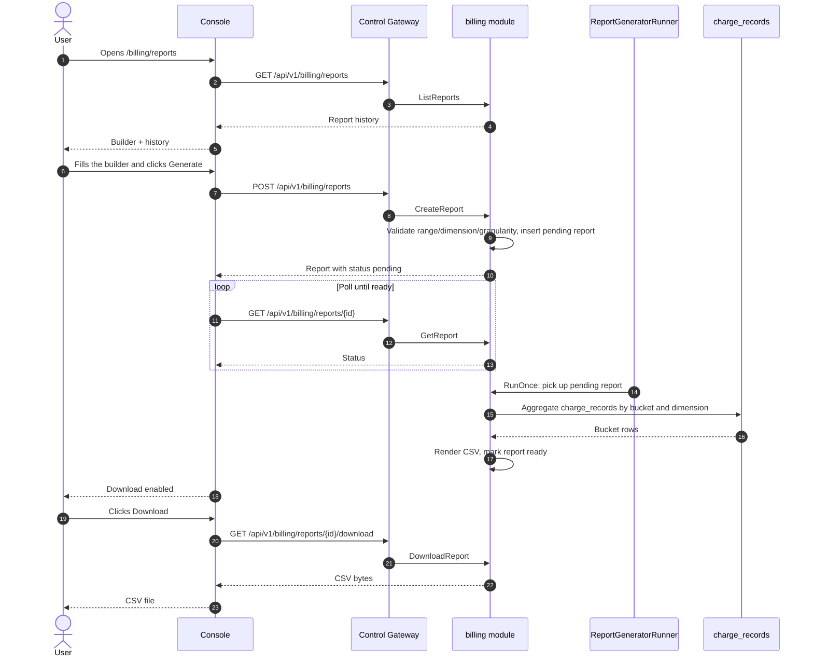
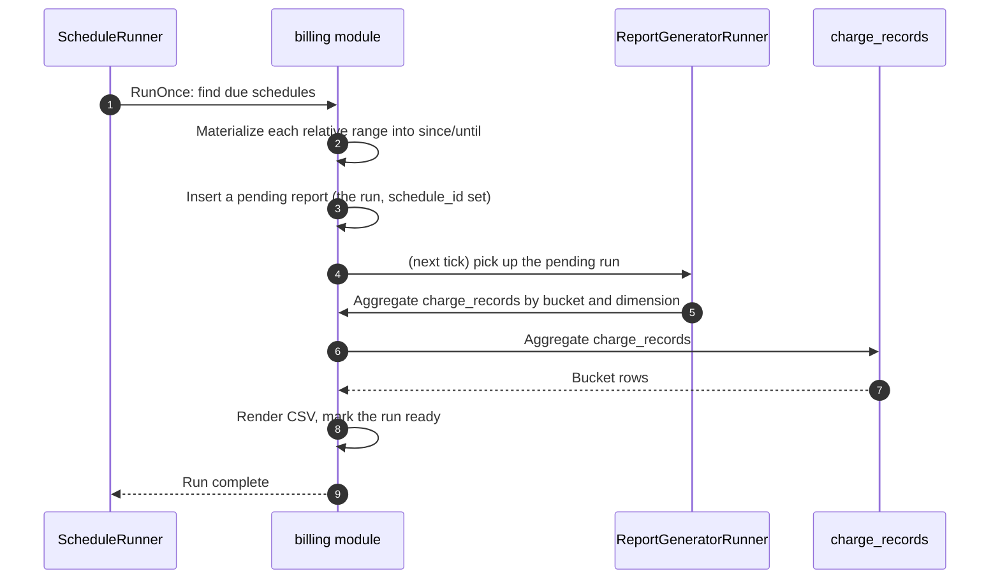
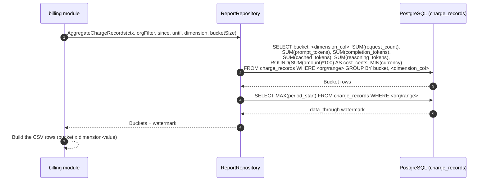

# Billing Reports & CSV Export — Architecture and Detailed Design

| Attribute | Content |
| --- | --- |
| Feature point | Billing reports & CSV export — generate and download usage/billing reports (per org, per API key, per model, per time range) as CSV, with scheduled report history (backlog row 25) |
| Document scope | Architecture and detailed design for feature-25: the async report-generation job model, the report/schedule data model, the CSV rendering contract, the scheduled-report runner with run history, the admin and end-user billing reports pages, the page → route → API-prefix table, and the surface/auth mapping |
| Owning modules | `billing` (extended — owns report generation, CSV rendering, and schedule execution over `charge_records`), `web` (admin console `AdminBillingReportsPage` and end-user console `UserBillingReportsPage`), `pkg/server` gateway (admin-prefix and user-prefix bindings) |
| Related documents | [Requirement Analysis and UI/UX Design](../design/billing-reports.md) · [Architecture Design](../design/architecture.md) — §2.5 `metering`, §2.6 `billing` · [Usage Dashboards & Per-Request Cost Attribution](./usage-dashboard.md) — the sibling read-only dashboard and its `charge_records` aggregation · [Payments, Invoices & Auto-Recharge](./payments-invoices-auto-recharge.md) — the invoice and cost-currency model this feature reports on · [Metering Vouchers & Async Settlement](./metering.md) — the `usage_records` this feature can aggregate · [Request Logs & API Playground](./request-logs-playground.md) — the `request_logs` table · [Console Surface Separation](./console-surface-separation.md) — the two surfaces this feature spans, the `UserShell`/`AdminShell` conventions, the masked-projection rule · [Model Observability](./model-observability.md) — the sibling read-only aggregation and its service/repository/runner conventions |
| Status | Architecture complete, handed to the Developer agent |

---

## 1. Overview and Goals

Feature #9 delivered a live usage dashboard (in-browser, no export), feature #12 a raw per-request request-log table (no aggregation), and feature #14 invoices (a fixed billing artifact, not an ad-hoc report). What the platform still cannot do is turn accumulated usage into a **downloadable, shareable billing report** — a CSV a tenant can hand to their finance team, or an operator can use to reconcile a tenant's bill. This feature adds a **billing reports & CSV export** capability: generate and download usage/billing reports (per org, per API key, per model, per time range) as CSV, with scheduled report history.

**Goals**: an admin page `/admin/billing/reports` that builds fleet-wide reports (any org / key / model), lists report history with download links, and manages scheduled reports with a run history; an end-user page `/billing/reports` that builds tenant-scoped reports and manages the tenant's own schedules; the page → API surface table with exact prefixes; per-page interactive states including loading, empty, error, disabled, and permission-denied; activation of the new error codes.

**Non-goals** (deferred): PDF or XLSX export (v1 is CSV only); email delivery of scheduled reports (v1 schedules generate reports in the console history); report templates or saved custom views beyond schedules; comparing dimensions side-by-side in one report (v1 is one dimension per report); real-time streaming of report progress (v1 polls status); any change to the inference, metering, or billing pipelines (read-only feature); cross-tenant reports on the end-user surface.

## 2. Architecture Decisions

| # | Decision | Rationale |
| --- | --- | --- |
| AD1 | **Reports are generated asynchronously as jobs.** `CreateReport` inserts a `pending` report and returns it; a `ReportGeneratorRunner` (a `server.Runner`, the auto-recharge pattern) picks up `pending` reports, aggregates `charge_records`, renders the CSV, and marks the report `ready` (with the CSV) or `failed`. The console polls `GetReport` until `ready`, then enables the download | Large ranges take time to aggregate; a synchronous export would block or time out. Job-based generation is the universal pattern (design D2). Generation is a pure DB aggregation within the billing module — no K8s resource is involved — so an in-process runner is appropriate, not the MQ→controller path (design D8: writes only report artifacts) |
| AD2 | **The aggregation source is `charge_records` (billing's table), not `usage_records` or `request_logs`.** `charge_records` is the authoritative billing evidence: one row per (org, api_key, model, card, hour) with the four token counts, `request_count`, `amount`, and `currency` — exactly the columns a billing report needs. It is the same source the usage dashboard (feature #9) aggregates | The report is a **billing** report: it must carry cost, and cost lives only in `charge_records` (the priced, settled evidence). `usage_records` carries tokens but no cost; `request_logs` is diagnostic metadata with 30-day retention. Aggregating `charge_records` keeps the report consistent with the dashboard and the invoices (design D3, D8) |
| AD3 | **A report is defined by a dimension, a time range, and a granularity.** The dimension is one of `organization` (per-org rows), `api_key` (per-key rows), or `model` (per-model rows); the range is `since`/`until` (unix seconds, capped at **366 days**); the granularity is `daily` or `hourly`. The CSV carries one row per (bucket × dimension-value) with request count, input/output/total tokens, and cost | The three dimensions are exactly the ones the comparable products expose; the range + granularity pair is the universal report shape. Cost and tokens together make the report usable by both finance and engineering (design D3) |
| AD4 | **Scheduled reports reuse the same report definition plus a frequency.** A schedule holds a report definition (dimension, granularity, and a **relative** range such as "last 7 days" or "last month") and a frequency (`daily` / `weekly` / `monthly`). Each scheduled run produces a report in the same history list, with its own status and download | A schedule is just a report definition that runs on a cadence; reusing the definition keeps the builder and the schedule consistent, and the run history is the same report history the user already knows (design D4) |
| AD5 | **The CSV is Excel-friendly and timezone-explicit.** The CSV is UTF-8 with a BOM, quoted fields, a header row, and a `timezone` column; the report's timezone is chosen at build time and applied to every bucket. The CSV is stored in a `csv` text column on the report row | Excel is the most common consumer of a billing export; a BOM and quoted fields prevent mojibake and comma-splitting. An explicit timezone avoids the reconciliation pitfall. Storing the CSV on the report row keeps the download a single-row read and matches "writes only report artifacts" (design D5, D8) |
| AD6 | **The end-user surface is tenant-scoped and masked.** `CreateReport` on the user prefix accepts only the caller's own organization and own API keys; the `organization` dimension on the user prefix yields a single row for the caller's org. No other tenants' data ever appears in a user report | Follows feature #17's masked-projection rule: a tenant's report must never leak another tenant's usage. The admin surface is the only place a cross-tenant report can be built (design D6) |
| AD7 | **New error codes in a billing-reports block 10901–10999.** **10901 `CodeReportNotFound`**, **10902 `CodeScheduleNotFound`**, **10903 `CodeReportInvalidDimension`**, **10904 `CodeReportInvalidGranularity`**, **10905 `CodeReportInvalidFrequency`**, **10906 `CodeReportNameConflict`**, **10907 `CodeReportNotReady`**. Range validation reuses **10404** (the metering range contract) with a report-specific cap of 366 days | The design doc's "fresh block after the observability block (107xx)" intent is honored by taking the **next free block after observability's 108xx** — observability already owns 10801 (feature #24, e2e-passed). Each module has its own error block (`pkg/errors/codes.go`); billing-reports takes 109xx. This is the interpretation most consistent with the existing architecture (design D7, refined) |
| AD8 | **Billing reports are read-only and audited for access and generation.** Report generation and schedule changes are audited (feature #15) as `billing.report.generate` / `billing.schedule.create` / `billing.schedule.update` / `billing.schedule.delete`; the underlying usage is already audited by the metering writes. No billing pipeline changes | The feature aggregates existing data and writes only report artifacts and schedules; the audit trail (feature #15) already covers the underlying usage writes, so only the new report/schedule actions need new audit events (design D8). The action names follow the repo convention `<module>.<resource>.<verb>` (e.g. `billing.account.create`, `webhook.create`), refining the design's `report.generated`/`schedule.created` wording |

## 3. Component Design

```mermaid
flowchart TD
    subgraph cp["Control Plane"]
        direction TB
        CGW["Control Gateway (grpc-gateway)<br/>HTTP management API"]
        BILL["billing module<br/>reports · schedules (new)<br/>ReportGeneratorRunner (new)<br/>ScheduleRunner (new)"]
        PG[("PostgreSQL<br/>billing_reports · billing_report_schedules (new)<br/>charge_records (read-only)"]
        CGW --> BILL
        BILL --> PG
    end
    ADMIN["Admin Console<br/>Billing reports (fleet)"]
    USER["End-user Console<br/>Billing reports (tenant-scoped)"]
    ADMIN --> CGW
    USER --> CGW
```

| Component | Responsibility in this feature |
| --- | --- |
| Control Gateway (`grpc-gateway`) | HTTP/JSON facade for the billing-report RPCs under `/api/v1/billing/reports/*` (user) and `/api/v1/admin/billing/reports/*` (admin); passes `X-Organization-Id` through as gRPC metadata |
| `billing` module (`services/billing`) | Report definition validation, async report generation (aggregate `charge_records` → render CSV), report/schedule persistence, schedule execution, CSV download |
| PostgreSQL | `billing_reports`, `billing_report_schedules` tables (new); reads `charge_records` (existing) read-only |
| Console | Admin Billing Reports page, end-user Billing Reports page |

### 3.1 File Layout and Function-Level Responsibilities

| Module | File | Contents |
| --- | --- | --- |
| `services/billing` | `report_model.go` | GORM models `BillingReport`, `BillingReportSchedule` + `TableName`; the `ReportDimension`/`ReportGranularity`/`ReportFrequency`/`RelativeRange` string constants |
| | `report_repository.go` | `ReportRepository`: `CreateReport`, `FindReportByID`, `ListReports`, `UpdateReportStatus` (pending→ready/failed, one tx: set status + row_count + data_through + csv), `CreateSchedule`, `FindScheduleByID`, `ListSchedules`, `UpdateSchedule`, `DeleteSchedule`, `ListScheduleRuns`, `NextPendingReport` (for the generator), `DueSchedules` (for the schedule runner), `AggregateChargeRecords` (the bucketed aggregation over `charge_records`) |
| | `report_service.go` | RPCs: `CreateReport`, `GetReport`, `ListReports`, `DownloadReport`, `CreateSchedule`, `ListSchedules`, `UpdateSchedule`, `DeleteSchedule`, `ListScheduleRuns`; the range/dimension/granularity/frequency validation; the user tenant-scope vs admin fleet-scope resolution; the audit events |
| | `report_generator_runner.go` | `ReportGeneratorRunner` (server.Runner, ticker) + `RunOnce(ctx)` extracted for tests; picks up `pending` reports, calls the repository aggregation, renders the CSV, marks `ready`/`failed` |
| | `report_schedule_runner.go` | `ScheduleRunner` (server.Runner, ticker) + `RunOnce(ctx)`; finds due schedules, materializes each relative range into `since`/`until`, creates a `pending` report (the run), and lets the generator produce it |
| | `report_csv.go` | `renderCSV(report, rows) (string, error)` — the UTF-8-BOM, quoted-field CSV renderer (AD5) |
| `proto/taas/billing/v1` | `billing.proto` | Additive: billing-report RPCs and messages (Section 5) |
| `pkg/errors` + `pkg/config` | `codes.go`/`messages.go`; `api.go`/`configuration.go` | New error codes (AD7); `BillingReportsConfig{GeneratorInterval, ScheduleInterval}` under `billing.reports` |
| `apps/taas-server` + `web/src` + `test` | `main.go`; `pages/BillingReportsPage.tsx`, `pages/user/UserBillingReportsPage.tsx`; `fvt/billing_reports_fvt_test.go`/`e2e/tests/billingReports.js` | Runner registration after `srv.Init()`; console pages; Section 14 |

### 3.2 Configuration Additions

| Key | Default | Description |
| --- | --- | --- |
| `billing.reports.generatorInterval` | `5s` | The report-generator runner's tick interval |
| `billing.reports.scheduleInterval` | `1m` | The schedule runner's tick interval |

## 3.3 Console Contract (pinned for the Developer agent)

| Page / component | Purpose | Key testids |
| --- | --- | --- |
| **Admin Billing Reports page** (`/admin/billing/reports`) | Fleet report builder, report history, schedule list | `billing-reports-page`, `report-builder`, `report-name`, `report-dimension`, `report-org`, `report-range`, `report-granularity`, `report-timezone`, `generate-report`, `reports-table`, `report-row-{id}`, `report-download-{id}`, `report-status-{id}`, `schedule-builder`, `schedule-name`, `schedule-frequency`, `create-schedule`, `schedules-table`, `schedule-row-{id}`, `schedule-runs-{id}`, `schedule-edit-{id}`, `schedule-delete-{id}`, `schedule-runs-drawer`, `run-download-{id}` |
| **End-user Billing Reports page** (`/billing/reports`) | Tenant-scoped report builder, report history, schedule list (no org dropdown) | same testids as admin, minus `report-org` |

## 4. Data Model

### 4.1 The `billing_reports` Table

| Column | PostgreSQL type | Constraints | Description |
| --- | --- | --- | --- |
| `id` | `uuid` | PRIMARY KEY | Server-generated UUID v4, exposed as `report_id` |
| `organization_id` | `varchar(64)` | NOT NULL, index | The owning org (the caller's org on the user surface; the filter or all-orgs on the admin surface) |
| `name` | `varchar(128)` | NOT NULL | The report name |
| `dimension` | `varchar(16)` | NOT NULL | `organization` / `api_key` / `model` |
| `since` | `bigint` | NOT NULL | Range start, unix seconds |
| `until` | `bigint` | NOT NULL | Range end, unix seconds |
| `granularity` | `varchar(8)` | NOT NULL | `daily` / `hourly` |
| `timezone` | `varchar(64)` | NOT NULL default `UTC` | IANA name applied to every bucket |
| `status` | `varchar(8)` | NOT NULL, index | `pending` / `ready` / `failed` |
| `row_count` | `bigint` | NOT NULL default 0 | Number of CSV data rows |
| `data_through` | `bigint` | NOT NULL default 0 | The last complete bucket covered (the charge watermark), unix seconds |
| `csv` | `text` | | The rendered CSV (UTF-8 BOM + quoted fields); NULL until `ready` |
| `schedule_id` | `uuid` | NULL, index | Set when the report is a scheduled run; NULL for on-demand |
| `error` | `varchar(512)` | NOT NULL default '' | The failure reason when `status = failed` |
| `created_at` | `timestamptz` | NOT NULL | Creation time |

### 4.2 The `billing_report_schedules` Table

| Column | PostgreSQL type | Constraints | Description |
| --- | --- | --- | --- |
| `id` | `uuid` | PRIMARY KEY | Server-generated UUID v4, exposed as `schedule_id` |
| `organization_id` | `varchar(64)` | NOT NULL, index | The owning org (the caller's org on the user surface; the filter or all-orgs on the admin surface) |
| `name` | `varchar(128)` | NOT NULL, unique per org | The schedule name (duplicate → 10906) |
| `dimension` | `varchar(16)` | NOT NULL | `organization` / `api_key` / `model` |
| `relative_range` | `varchar(16)` | NOT NULL | `last_7_days` / `last_30_days` / `last_month` |
| `granularity` | `varchar(8)` | NOT NULL | `daily` / `hourly` |
| `frequency` | `varchar(8)` | NOT NULL | `daily` / `weekly` / `monthly` |
| `timezone` | `varchar(64)` | NOT NULL default `UTC` | IANA name |
| `status` | `varchar(8)` | NOT NULL default `active` | `active` / `paused` (v1: always `active`) |
| `last_run_at` | `timestamptz` | | When the last run was created |
| `created_at` | `timestamptz` | NOT NULL | Creation time |
| `updated_at` | `timestamptz` | NOT NULL | Last update time |

### 4.3 Migration Notes

- The two new tables are created by GORM `AutoMigrate` on `taas-server` startup (additive; no data migration). `Migrate`/`MigrateSchemaForFVT` gain the two new models.
- No init-SQL upgrade path is needed: no existing table changes, and the new tables are created automatically on startup.
- The feature reads `charge_records` (existing) read-only; no index changes are needed on it — the existing `idx_charge_records_org_period (organization_id, period_start)` and `idx_charge_records_group_period (api_key_id, model_id, accelerator_type, period_start)` indexes serve the aggregation. The admin fleet view (no org filter) scans by `period_start`; the existing `period_start` index on `idx_charge_records_group_period` covers it.

## 5. API Design

All billing-report RPCs belong to **`taas.billing.v1.BillingService`** (extended), served as HTTP via the Control Gateway. Admin routes are on the admin prefix `/api/v1/admin/billing/reports/*`; the end-user routes are on the user prefix `/api/v1/billing/reports/*`. The surface is derived from the request path (Section 3.3).

| RPC | HTTP (user) | HTTP (admin) | Status | Purpose |
| --- | --- | --- | --- | --- |
| `CreateReport` | `POST /api/v1/billing/reports` | `POST /api/v1/admin/billing/reports` | **new** | Create an on-demand report job |
| `GetReport` | `GET /api/v1/billing/reports/{report_id}` | `GET /api/v1/admin/billing/reports/{report_id}` | **new** | Report status and definition |
| `ListReports` | `GET /api/v1/billing/reports` | `GET /api/v1/admin/billing/reports` | **new** | Report history |
| `DownloadReport` | `GET /api/v1/billing/reports/{report_id}/download` | `GET /api/v1/admin/billing/reports/{report_id}/download` | **new** | CSV download |
| `CreateSchedule` | `POST /api/v1/billing/reports/schedules` | `POST /api/v1/admin/billing/reports/schedules` | **new** | Create a scheduled report |
| `ListSchedules` | `GET /api/v1/billing/reports/schedules` | `GET /api/v1/admin/billing/reports/schedules` | **new** | List schedules |
| `UpdateSchedule` | `PATCH /api/v1/billing/reports/schedules/{schedule_id}` | `PATCH /api/v1/admin/billing/reports/schedules/{schedule_id}` | **new** | Update a schedule |
| `DeleteSchedule` | `DELETE /api/v1/billing/reports/schedules/{schedule_id}` | `DELETE /api/v1/admin/billing/reports/schedules/{schedule_id}` | **new** | Delete a schedule |
| `ListScheduleRuns` | `GET /api/v1/billing/reports/schedules/{schedule_id}/runs` | `GET /api/v1/admin/billing/reports/schedules/{schedule_id}/runs` | **new** | Schedule run history |

### 5.1 Proto contract

```protobuf
syntax = "proto3";

package taas.billing.v1;

import "google/api/annotations.proto";
import "taas/common/v1/common.proto";

option go_package = "github.com/go-taas/go-taas/proto/taas/billing/v1;billingv1";

// BillingService is extended with the billing-reports RPCs (feature-25).
// CreateReport/GetReport/ListReports/DownloadReport and the schedule
// RPCs are dual-bound: the user binding is tenant-scoped under
// /api/v1/billing/reports/*, the admin binding is fleet-wide under
// /api/v1/admin/billing/reports/*.
service BillingService {
  // CreateReport creates an on-demand report job (status = pending).
  // User-surface API: tenant-scoped under /api/v1/billing/reports.
  // Admin-surface API: fleet-wide under /api/v1/admin/billing/reports.
  rpc CreateReport(CreateReportRequest) returns (CreateReportResponse) {
    option (google.api.http) = {
      post: "/api/v1/billing/reports"
      body: "*"
      additional_bindings: {
        post: "/api/v1/admin/billing/reports"
        body: "*"
      }
    };
  }

  // GetReport returns a report's status, definition, row count and
  // data_through.
  // User-surface API: served under /api/v1/billing/reports.
  // Admin-surface API: served under /api/v1/admin/billing/reports.
  rpc GetReport(GetReportRequest) returns (GetReportResponse) {
    option (google.api.http) = {
      get: "/api/v1/billing/reports/{report_id}"
      additional_bindings: {get: "/api/v1/admin/billing/reports/{report_id}"}
    };
  }

  // ListReports returns the report history, newest first.
  // User-surface API: served under /api/v1/billing/reports.
  // Admin-surface API: served under /api/v1/admin/billing/reports.
  rpc ListReports(ListReportsRequest) returns (ListReportsResponse) {
    option (google.api.http) = {
      get: "/api/v1/billing/reports"
      additional_bindings: {get: "/api/v1/admin/billing/reports"}
    };
  }

  // DownloadReport returns the CSV when status = ready.
  // User-surface API: served under /api/v1/billing/reports.
  // Admin-surface API: served under /api/v1/admin/billing/reports.
  rpc DownloadReport(DownloadReportRequest) returns (DownloadReportResponse) {
    option (google.api.http) = {
      get: "/api/v1/billing/reports/{report_id}/download"
      additional_bindings: {get: "/api/v1/admin/billing/reports/{report_id}/download"}
    };
  }

  // CreateSchedule creates a scheduled report (status = active).
  // User-surface API: served under /api/v1/billing/reports.
  // Admin-surface API: served under /api/v1/admin/billing/reports.
  rpc CreateSchedule(CreateScheduleRequest) returns (CreateScheduleResponse) {
    option (google.api.http) = {
      post: "/api/v1/billing/reports/schedules"
      body: "*"
      additional_bindings: {
        post: "/api/v1/admin/billing/reports/schedules"
        body: "*"
      }
    };
  }

  // ListSchedules returns the caller's schedules.
  // User-surface API: served under /api/v1/billing/reports.
  // Admin-surface API: served under /api/v1/admin/billing/reports.
  rpc ListSchedules(ListSchedulesRequest) returns (ListSchedulesResponse) {
    option (google.api.http) = {
      get: "/api/v1/billing/reports/schedules"
      additional_bindings: {get: "/api/v1/admin/billing/reports/schedules"}
    };
  }

  // UpdateSchedule updates a schedule's name, frequency or relative
  // range.
  // User-surface API: served under /api/v1/billing/reports.
  // Admin-surface API: served under /api/v1/admin/billing/reports.
  rpc UpdateSchedule(UpdateScheduleRequest) returns (UpdateScheduleResponse) {
    option (google.api.http) = {
      patch: "/api/v1/billing/reports/schedules/{schedule_id}"
      body: "*"
      additional_bindings: {
        patch: "/api/v1/admin/billing/reports/schedules/{schedule_id}"
        body: "*"
      }
    };
  }

  // DeleteSchedule deletes a schedule.
  // User-surface API: served under /api/v1/billing/reports.
  // Admin-surface API: served under /api/v1/admin/billing/reports.
  rpc DeleteSchedule(DeleteScheduleRequest) returns (DeleteScheduleResponse) {
    option (google.api.http) = {
      delete: "/api/v1/billing/reports/schedules/{schedule_id}"
      additional_bindings: {delete: "/api/v1/admin/billing/reports/schedules/{schedule_id}"}
    };
  }

  // ListScheduleRuns returns the runs a schedule has produced.
  // User-surface API: served under /api/v1/billing/reports.
  // Admin-surface API: served under /api/v1/admin/billing/reports.
  rpc ListScheduleRuns(ListScheduleRunsRequest) returns (ListScheduleRunsResponse) {
    option (google.api.http) = {
      get: "/api/v1/billing/reports/schedules/{schedule_id}/runs"
      additional_bindings: {get: "/api/v1/admin/billing/reports/schedules/{schedule_id}/runs"}
    };
  }
}

// ReportDimension is the aggregation dimension of a report.
enum ReportDimension {
  REPORT_DIMENSION_UNSPECIFIED = 0;
  REPORT_DIMENSION_ORGANIZATION = 1;
  REPORT_DIMENSION_API_KEY = 2;
  REPORT_DIMENSION_MODEL = 3;
}

// ReportGranularity is the bucket size of a report.
enum ReportGranularity {
  REPORT_GRANULARITY_UNSPECIFIED = 0;
  REPORT_GRANULARITY_DAILY = 1;
  REPORT_GRANULARITY_HOURLY = 2;
}

// ReportFrequency is the cadence of a scheduled report.
enum ReportFrequency {
  REPORT_FREQUENCY_UNSPECIFIED = 0;
  REPORT_FREQUENCY_DAILY = 1;
  REPORT_FREQUENCY_WEEKLY = 2;
  REPORT_FREQUENCY_MONTHLY = 3;
}

// RelativeRange is the relative time range of a scheduled report.
enum RelativeRange {
  RELATIVE_RANGE_UNSPECIFIED = 0;
  RELATIVE_RANGE_LAST_7_DAYS = 1;
  RELATIVE_RANGE_LAST_30_DAYS = 2;
  RELATIVE_RANGE_LAST_MONTH = 3;
}

message CreateReportRequest {
  // name is the report name.
  string name = 1;
  // dimension is organization / api_key / model.
  ReportDimension dimension = 2;
  // since/until bound the range, unix seconds. Defaults: until = now,
  // since = until - 30d. A range > 366 days is rejected (10404).
  int64 since = 3;
  int64 until = 4;
  // granularity is daily or hourly.
  ReportGranularity granularity = 5;
  // timezone is an IANA name, default UTC.
  string timezone = 6;
  // organization_id is an optional fleet filter on the admin surface;
  // absent means all orgs. On the user surface it is ignored (the
  // caller's org is implicit).
  string organization_id = 7;
}

message CreateReportResponse {
  taas.common.v1.Response response = 1;
  Report report = 2;
}

message GetReportRequest {
  string report_id = 1;
}

message GetReportResponse {
  taas.common.v1.Response response = 1;
  Report report = 2;
}

message ListReportsRequest {
  taas.common.v1.PageRequest page = 1;
  // dimension/status are optional filters.
  ReportDimension dimension = 2;
  string status = 3;
}

message ListReportsResponse {
  taas.common.v1.Response response = 1;
  repeated Report reports = 2;
  taas.common.v1.PageMeta page_meta = 3;
}

message DownloadReportRequest {
  string report_id = 1;
}

message DownloadReportResponse {
  taas.common.v1.Response response = 1;
  // csv is the UTF-8-BOM CSV content when status = ready.
  string csv = 2;
  // filename is the Content-Disposition filename.
  string filename = 3;
}

message CreateScheduleRequest {
  string name = 1;
  ReportDimension dimension = 2;
  RelativeRange relative_range = 3;
  ReportGranularity granularity = 4;
  ReportFrequency frequency = 5;
  string timezone = 6;
  // organization_id is an optional fleet filter on the admin surface;
  // absent means all orgs. On the user surface it is ignored.
  string organization_id = 7;
}

message CreateScheduleResponse {
  taas.common.v1.Response response = 1;
  ReportSchedule schedule = 2;
}

message ListSchedulesRequest {
  taas.common.v1.PageRequest page = 1;
  // organization_id is an optional admin filter.
  string organization_id = 2;
}

message ListSchedulesResponse {
  taas.common.v1.Response response = 1;
  repeated ReportSchedule schedules = 2;
  taas.common.v1.PageMeta page_meta = 3;
}

message UpdateScheduleRequest {
  string schedule_id = 1;
  string name = 2;
  ReportFrequency frequency = 3;
  RelativeRange relative_range = 4;
}

message UpdateScheduleResponse {
  taas.common.v1.Response response = 1;
  ReportSchedule schedule = 2;
}

message DeleteScheduleRequest {
  string schedule_id = 1;
}

message DeleteScheduleResponse {
  taas.common.v1.Response response = 1;
}

message ListScheduleRunsRequest {
  taas.common.v1.PageRequest page = 1;
  string schedule_id = 2;
}

message ListScheduleRunsResponse {
  taas.common.v1.Response response = 1;
  repeated Report runs = 2;
  taas.common.v1.PageMeta page_meta = 3;
}

// Report is one report (on-demand or a scheduled run).
message Report {
  string report_id = 1;
  string name = 2;
  ReportDimension dimension = 3;
  int64 since = 4;
  int64 until = 5;
  ReportGranularity granularity = 6;
  string timezone = 7;
  string status = 8; // pending / ready / failed
  int64 row_count = 9;
  int64 data_through = 10;
  int64 created_at = 11;
  // schedule_id is set when the report is a scheduled run.
  string schedule_id = 12;
}

// ReportSchedule is one scheduled report definition.
message ReportSchedule {
  string schedule_id = 1;
  string name = 2;
  ReportDimension dimension = 3;
  RelativeRange relative_range = 4;
  ReportGranularity granularity = 5;
  ReportFrequency frequency = 6;
  string timezone = 7;
  string status = 8; // active
  int64 last_run_at = 9;
  int64 created_at = 10;
}
```

### 5.2 Contract notes (pinned for the Developer agent)

1. `CreateReport` validates `since`/`until` (int64 unix seconds; defaults `until = now`, `since = until − 30d`); `since > until` or a range > 366 days returns 10404 (AD7). `dimension` must be `organization` / `api_key` / `model` (else 10903); `granularity` must be `daily` / `hourly` (else 10904). `timezone` is an IANA name, default `UTC`.
2. On the user prefix, `CreateReport` is tenant-scoped (AD6): no `organization_id` filter is accepted (it is ignored), and the report aggregates only the caller's org and own API keys. On the admin prefix, an optional `organization_id` scopes a fleet report to one org.
3. Reports are async (AD1): `CreateReport` returns `status = pending`; the report becomes `ready` (with a downloadable CSV) or `failed`. `DownloadReport` before `ready` returns 10907 (AD7).
4. The CSV is UTF-8 with a BOM, quoted fields, a header row, and one row per (bucket × dimension-value) with `bucket`, `timezone`, `organization_id`, `organization_name`, `api_key_id`, `api_key_name`, `model_id`, `model_name`, `request_count`, `input_tokens`, `output_tokens`, `total_tokens`, `cost`, `currency` (AD3, AD5). Columns not relevant to the chosen dimension are empty.
5. Schedules hold a report definition plus `frequency` (`daily` / `weekly` / `monthly`, else 10905) and a relative range (`last_7_days` / `last_30_days` / `last_month`). A duplicate schedule `name` (per org) returns 10906 (AD7). Each scheduled run produces a report in the same history list (AD4).
6. Aggregation reads `charge_records` (AD2) for token and cost totals; it writes only report artifacts and schedules (AD8). Report generation and schedule changes are audited (feature #15) as `billing.report.generate` / `billing.schedule.create` / `billing.schedule.update` / `billing.schedule.delete`.
7. Wire conventions unchanged: dotted pagination where lists apply, HTTP 200 on success, business errors as `{"code": <int>, "message": "..."}`, int64 fields serialized as JSON strings.

### 5.3 Error codes

Error codes (billing-reports block 10901–10999, `pkg/errors/codes.go`):

| Condition | Code | Constant | Notes |
| --- | --- | --- | --- |
| An unknown `report_id` | 10901 | `CodeReportNotFound` | **New** (AD7) |
| An unknown `schedule_id` | 10902 | `CodeScheduleNotFound` | **New** (AD7) |
| An invalid `dimension` | 10903 | `CodeReportInvalidDimension` | **New** (AD7) |
| An invalid `granularity` | 10904 | `CodeReportInvalidGranularity` | **New** (AD7) |
| An invalid `frequency` | 10905 | `CodeReportInvalidFrequency` | **New** (AD7) |
| A duplicate schedule `name` | 10906 | `CodeReportNameConflict` | **New** (AD7) |
| A download before `ready` | 10907 | `CodeReportNotReady` | **New** (AD7) |
| A malformed or over-long range | 10404 | `CodeMeteringRangeInvalid` | Reused (AD7) — the metering range contract, capped at 366 days for reports |
| Database / infrastructure failure | 500 | `CodeInternal` | Via error normalization |

## 6. Frontend Architecture

### 6.1 Page → Route → API-prefix table

| Page / component | Surface | Web route | API prefix | Auth guard |
| --- | --- | --- | --- | --- |
| **Billing Reports page** | admin | `/admin/billing/reports` | `/api/v1/admin/billing/reports/*` | admin session; RoleGuard (admin role) |
| **Billing Reports page** | end-user | `/billing/reports` | `/api/v1/billing/reports/*` | user session; hard-scoped to caller's org |

> The admin Billing Reports page calls only `/api/v1/admin/billing/reports/*`; the end-user Billing Reports page calls only `/api/v1/billing/reports/*`. The two surfaces never share a session token (feature #17).

### 6.2 Navigation placement

- **Admin console**: a new **Billing reports** item (`/admin/billing/reports`, testid `nav-billing-reports`) in the admin nav, in the billing group alongside Pricing, Bills, Accounts, Payments, and Invoices.
- **End-user console**: a new **Billing reports** item (`/billing/reports`, testid `nav-billing-reports`) in the user nav, in the billing group alongside Bills.

### 6.3 Shared components and state to reuse

- **API client** (`web/src/api.ts`): the realm-scoped client (`createApi(realm)`) already sends `Authorization: Bearer <realm>.session-token` and `X-Organization-Id` (only when the realm token key is empty). The billing reports pages reuse it unchanged; no new client is added.
- **Time-range filter**: the preset control (24 h / 7 d / 30 d / 90 d / custom with a date-time picker) is shared with the Usage and Request Logs pages.
- **Dotted pagination**: the shared pagination component used by the Usage and Request Logs tables.
- **Status badge**: the pending/ready/failed badge styling reuses the usage-dashboard pending-badge styling.
- **Empty / error / stale-data states**: the Request Logs page pattern (empty copy, error banner with Retry, "Showing stale data" banner) is reused.
- **Confirmation dialog**: the delete-schedule confirmation reuses the shared confirm-dialog component used by the Webhooks and API Keys pages.

### 6.4 Auth guard per surface

- **Admin Billing Reports page** (`/admin/billing/reports`): rendered inside `AdminShell`, which runs the admin session guard when `go-taas.admin.session-token` is non-empty; a missing/expired session redirects to `/admin/login?reason=expired`; a wrong-realm session is rejected by the gateway with 10038. The page's API calls go to `/api/v1/admin/billing/reports/*`. A session without the required role receives 10036 and the page shows the standard permission-denied state (feature #17).
- **End-user Billing Reports page** (`/billing/reports`): rendered inside `UserShell`, which runs the user session guard when `go-taas.user.session-token` is non-empty; a missing/expired session redirects to `/login?reason=expired`. The page's API calls go to `/api/v1/billing/reports/*`. The page exposes no other tenants' data (AD6).
- **Unauthenticated visitors**: an unauthenticated visitor to either page is redirected to the correct login (`/admin/login` vs `/login`) by the shell guard.

### 6.5 Console contract (pinned for the Developer agent)

**Admin Billing Reports page** (`/admin/billing/reports`): a page header ("Billing reports", subtitle "Generate and download usage and cost reports") with a **New report** primary action (`new-report`). Below the header, two tabs: **Reports** (`reports-tab`) and **Schedules** (`schedules-tab`).

**Reports tab**: a collapsible report builder (`report-builder`, open by default when the history is empty) with fields **Name** (`report-name`, required), **Dimension** (`report-dimension`, radio: Organization / API key / Model), **Organization** (`report-org`, dropdown, admin-only, "All organizations" default), **Time range** (`report-range`, presets 24 h / 7 d / 30 d / 90 d / custom), **Granularity** (`report-granularity`, radio: Daily / Hourly), **Timezone** (`report-timezone`, dropdown, default UTC). A **Generate report** primary action (`generate-report`) and a **Cancel** secondary action. Below, the report history table (`reports-table`, `report-row-{id}`) with columns Name, Dimension, Range, Granularity, Status (`report-status-{id}`), Rows, Created, Actions (Download `report-download-{id}` enabled when `status = ready`, View). A **Refresh** action (`reports-refresh`) above the table. Sortable by Name, Status, Rows, Created; filterable by Dimension and Status; dotted pagination.

**Schedules tab**: a schedule builder (`schedule-builder`) with fields **Name** (`schedule-name`, required, unique), **Dimension** (`schedule-dimension`, radio), **Organization** (`schedule-org`, dropdown, admin-only), **Relative range** (`schedule-relative-range`, dropdown: Last 7 days / Last 30 days / Last month), **Granularity** (`schedule-granularity`, radio), **Frequency** (`schedule-frequency`, radio: Daily / Weekly / Monthly), **Timezone** (`schedule-timezone`, dropdown). A **Create schedule** primary action (`create-schedule`) and a **Cancel** secondary action. Below, the schedule list table (`schedules-table`, `schedule-row-{id}`) with columns Name, Dimension, Relative range, Frequency, Status, Last run, Actions (View runs `schedule-runs-{id}`, Edit `schedule-edit-{id}`, Delete `schedule-delete-{id}`). Sortable by Name, Frequency, Last run; dotted pagination.

**Interactive states**: Default (builder + tables render from the first successful load, last-updated shows the load time); Loading (skeleton rows, Generate/Create disabled); Empty ("No reports yet." / "No schedules yet." with a hint, builder stays visible); Error (error banner with Retry, "Showing stale data" banner); Disabled (Generate/Create disabled while a request is in flight, Download disabled while `status != ready`, builder fields disabled while a report is generating); Permission-denied (10036 → standard permission-denied state with a link back to the admin home).

**Dialogs and confirmation flows**: Generate report (submitting shows a "Generating…" progress state on the row and polls `GetReport` until `ready`, then enables Download; a failed generation shows "Generation failed" with a Retry action); Delete schedule (confirmation dialog "Delete schedule <name>? This does not delete past reports." with Cancel/Delete danger, calls `DeleteSchedule` and removes the row); View runs (a drawer `schedule-runs-drawer` listing the schedule's runs from `ListScheduleRuns` with Download per ready run `run-download-{id}`).

**End-user Billing Reports page** (`/billing/reports`): identical to the admin page except the **Organization** dropdown is absent (the caller's org is implicit, AD6) and the Dimension radio's Organization choice yields a single-row report for the caller's org. Identical empty/error/permission-denied states, with the tenant's own permission-denied copy (10005 org gone / 10017 org disabled from feature #17 §8.2). The page exposes no other tenants' data (AD6).

## 7. Sequence Flows

### 7.1 On-demand report generation and download



### 7.2 Scheduled report run



### 7.3 The aggregation query



## 8. Error Handling

All errors are `pkg/errors` business codes in the unified envelope (Section 5.3). The billing-reports module writes only report artifacts and schedules; a generation failure is captured on the report row (`status = failed`, `error` set) rather than returned to the caller, because generation is async. A database failure during a synchronous RPC is normalized to 500 `CodeInternal`.

The console branches on the body `code` (as `web/src/api.ts` already does), never on the HTTP status. Each new code renders a specific inline message: 10901 "report not found", 10902 "schedule not found", 10903 "invalid dimension", 10904 "invalid granularity", 10905 "invalid frequency", 10906 "schedule name already exists", 10907 "report not ready", 10404 "invalid range" (the metering range contract). The admin page maps 10036 to the standard permission-denied state; the end-user page maps 10005/10017 to the tenant's permission-denied copy (feature #17 §8.2).

## 9. Configuration Additions

| Key | Default | Description |
| --- | --- | --- |
| `billing.reports.generatorInterval` | `5s` | The report-generator runner's tick interval (AD1) |
| `billing.reports.scheduleInterval` | `1m` | The schedule runner's tick interval (AD4) |

The `billing.reports` config block is new in `pkg/config` (`BillingReportsConfig`), nested under `BillingConfig`, following the `autoRecharge` block pattern. `applyDefaults`/`Validate` set the defaults above. No other config keys, runners, or MQ subjects are added — the feature is read-only over existing data (AD8).

## 10. Security Considerations

- **Surface separation**: the admin Billing Reports page calls only `/api/v1/admin/billing/reports/*`; the end-user Billing Reports page calls only `/api/v1/billing/reports/*`. The realm guard rejects a wrong-realm session with 10038 before any handler runs (feature #17).
- **Admin fleet view gated by role**: the admin billing-report RPCs are fleet-wide by default (AD6) and gated by `tenancy.RoleGuard` — only a caller with the required admin role can build a cross-org report; an inaccessible org returns 10036.
- **End-user hard scoping**: the user binding of the billing-report RPCs is hard-scoped to the caller's org (session active org authoritative, `X-Organization-Id` ignored); a caller can never see another tenant's usage (AD6).
- **Masked projection**: the end-user surface exposes no other tenants' data and never builds a cross-tenant report (AD6). The admin surface is operator-scoped.
- **CSV injection prevention**: the CSV renderer (AD5) prefixes any cell that begins with `=`, `+`, `-`, or `@` with a single quote (`'`), so a model name, org name, or API key name cannot inject a formula into Excel. This is applied to every string cell (organization_name, api_key_name, model_name, and the report name if it appears).
- **Read-only by construction**: the billing-reports module issues `SELECT`s on `charge_records` and writes only the report/schedule tables; no inference, metering, or billing pipeline changes (AD8).
- **No new privilege**: billing reports grant no new capability; they are a read-only aggregation over data the caller could already query via charges and the usage dashboard (within their scope).

## 11. Rollout / Upgrade Notes

- **Two new tables** (`billing_reports`, `billing_report_schedules`) via AutoMigrate on `taas-server` startup; deploy `taas-server` alone. No data migration, no init-SQL upgrade path.
- **The proto change is additive**: new RPCs and messages on the existing `taas.billing.v1.BillingService`; no existing RPC or message changes. The gateway mux gains the new bindings; the realm guard is unchanged.
- **Console**: the two new pages are added to the existing bundle; the admin and user navs each gain a Billing reports item. No existing route changes.
- **Backward compatibility**: the transitional (session-less, `X-Organization-Id`) path is preserved for the CLI, FVT, and e2e suites; the realm guard passes through requests without an `Authorization` header (feature #17 AD4).
- **Empty until data exists**: the billing-report RPCs return empty history/schedules until reports exist; the pages render the empty state with a hint to generate one.

## 12. Acceptance-Criteria Traceability

| # | Criterion | Where addressed |
| --- | --- | --- |
| AC1 | `CreateReport` with a valid definition returns a report with `status = pending`; a range > 366 days or `since > until` returns 10404; an invalid `dimension` returns 10903 and an invalid `granularity` returns 10904 | §5.1, §5.2, §5.3 |
| AC2 | `GetReport` returns the report's status, definition, row count, and `data_through`; an unknown `report_id` returns 10901 | §5.1, §5.2, §5.3 |
| AC3 | `DownloadReport` returns a UTF-8-BOM CSV with the header row and one row per (bucket × dimension-value) when `status = ready`; a download before `ready` returns 10907 | §5.1, §5.2, §5.3, §7.1 |
| AC4 | `CreateSchedule` with a valid definition and frequency returns an active schedule; a duplicate `name` returns 10906 and an invalid `frequency` returns 10905; `UpdateSchedule` and `DeleteSchedule` work and an unknown `schedule_id` returns 10902 | §5.1, §5.2, §5.3 |
| AC5 | `ListScheduleRuns` returns the runs a schedule has produced, each a report in the same history list | §5.1, §7.2 |
| AC6 | `CreateReport` on the user prefix is tenant-scoped: it accepts no `organization_id` filter and aggregates only the caller's org and own API keys | §3.3, §5.2, §6.4, §10 |
| AC7 | The `/admin/billing/reports` page renders the builder, the report history, and the schedule list from the first successful load, with a last-updated timestamp | §6.5 |
| AC8 | Generating a report shows a "Generating…" progress state, polls until `ready`, then enables **Download**; clicking **Download** fetches the CSV | §6.5, §7.1 |
| AC9 | The empty states ("No reports yet." / "No schedules yet.") render when no data matches; a failed load keeps the last good data with a "Showing stale data" banner and a Retry action | §6.5 |
| AC10 | Creating a schedule adds it to the schedule list; deleting a schedule shows the confirmation dialog and removes the row without deleting past reports; **View runs** shows the run history with **Download** per ready run | §6.5, §7.2 |
| AC11 | The `/billing/reports` page renders the tenant-scoped builder, history, and schedules, with no other tenants' data and no organization dropdown | §6.5, §10 |
| AC12 | The admin billing reports page is reachable only on the admin surface: route `/admin/billing/reports`, every API call uses the `/api/v1/admin/billing/reports/*` prefix with no `/api/v1/billing/reports/*` string | §6.1, §6.4, §10 |
| AC13 | The end-user billing reports page is reachable only on the end-user surface: route `/billing/reports`, every API call uses the `/api/v1/billing/reports/*` prefix with no `/api/v1/admin/*` string | §6.1, §6.4, §10 |
| AC14 | A session without the required role receives 10036 on the admin billing reports page and the page shows the standard permission-denied state | §3.3, §6.4, §10 |

## 13. Detailed Design (function-level responsibilities per layer)

### 13.1 Proto → service → repository → controller

| Layer | File | Responsibilities |
| --- | --- | --- |
| `proto/taas/billing/v1` | `billing.proto` | Additive: the nine billing-report RPCs and messages (Section 5.1); enums `ReportDimension`, `ReportGranularity`, `ReportFrequency`, `RelativeRange`; messages `CreateReportRequest/Response`, `GetReportRequest/Response`, `ListReportsRequest/Response`, `DownloadReportRequest/Response`, `CreateScheduleRequest/Response`, `ListSchedulesRequest/Response`, `UpdateScheduleRequest/Response`, `DeleteScheduleRequest/Response`, `ListScheduleRunsRequest/Response`, `Report`, `ReportSchedule`. Regenerate `billing.pb.go`/`billing_grpc.pb.go`/`billing.pb.gw.go` via `buf generate` |
| `services/billing` | `report_model.go` | GORM models `BillingReport`, `BillingReportSchedule` + `TableName`; the `ReportDimension`/`ReportGranularity`/`ReportFrequency`/`RelativeRange` string constants and their proto-enum ↔ string mapping helpers |
| | `report_repository.go` | `ReportRepository`: `CreateReport`, `FindReportByID`, `ListReports`, `UpdateReportStatus` (pending→ready/failed, one tx: set status + row_count + data_through + csv + error), `CreateSchedule`, `FindScheduleByID`, `ListSchedules`, `UpdateSchedule`, `DeleteSchedule`, `ListScheduleRuns`, `NextPendingReport` (for the generator), `DueSchedules` (for the schedule runner), `AggregateChargeRecords(ctx, orgFilter, since, until, dimension, bucketSize)` — the bucketed aggregation over `charge_records` (AD2), `ChargeWatermark(ctx, orgFilter, since, until)` — the `max(period_start)` watermark |
| | `report_service.go` | New RPCs `CreateReport`, `GetReport`, `ListReports`, `DownloadReport`, `CreateSchedule`, `ListSchedules`, `UpdateSchedule`, `DeleteSchedule`, `ListScheduleRuns`; the range validation (10404, AD7); the dimension/granularity/frequency validation (10903/10904/10905); the duplicate-name check (10906); the user tenant-scope vs admin fleet-scope resolution (AD6); the `SessionActiveOrg`/`resolveOrganizationID` seam; the `RoleGuard` seam for admin org scoping; the audit events (AD8); `Migrate`/`MigrateSchemaForFVT` gain the two new models (Section 4.3) |
| | `report_generator_runner.go` | `ReportGeneratorRunner` (server.Runner, ticker) + `RunOnce(ctx)` extracted for tests; picks up `pending` reports via `NextPendingReport`, calls `AggregateChargeRecords`, renders the CSV via `renderCSV`, marks `ready`/`failed` via `UpdateReportStatus` |
| | `report_schedule_runner.go` | `ScheduleRunner` (server.Runner, ticker) + `RunOnce(ctx)`; finds due schedules via `DueSchedules`, materializes each relative range into `since`/`until`, creates a `pending` report (the run, `schedule_id` set) via `CreateReport`, updates `last_run_at` |
| | `report_csv.go` | `renderCSV(report, rows) (string, error)` — the UTF-8-BOM, quoted-field CSV renderer (AD5); the CSV-injection guard (Section 10) |
| `pkg/errors` | `codes.go`/`messages.go` | `CodeReportNotFound` (10901), `CodeScheduleNotFound` (10902), `CodeReportInvalidDimension` (10903), `CodeReportInvalidGranularity` (10904), `CodeReportInvalidFrequency` (10905), `CodeReportNameConflict` (10906), `CodeReportNotReady` (10907) constants + canonical messages (AD7) |
| `pkg/config` | `api.go`/`configuration.go` | `BillingReportsConfig{GeneratorInterval, ScheduleInterval}` nested under `BillingConfig` (Section 9) + `applyDefaults`/`Validate` |
| `apps/taas-server` | `main.go` | Register the two runners (`ReportGeneratorRunner`, `ScheduleRunner`) after `srv.Init()` when `cfg.Billing.Reports` is enabled; wire the `tenancy` RoleGuard and the `auth` session-org resolver into the billing service (already wired for the existing billing RPCs) |
| `web/src` | `pages/BillingReportsPage.tsx`, `pages/user/UserBillingReportsPage.tsx`, `App.tsx`, `api.ts`, `shells/AdminShell.tsx`, `shells/UserShell.tsx` | Routes `/admin/billing/reports`, `/billing/reports`; the billing-report API types and calls; nav items (Section 6.5) |
| `test` | `fvt/billing_reports_fvt_test.go`, `e2e/tests/billingReports.js` | Section 14 |

### 13.2 Which React page/module implements each screen

| Screen | React module | Route | API calls |
| --- | --- | --- | --- |
| Billing Reports page (admin) | `web/src/pages/BillingReportsPage.tsx` | `/admin/billing/reports` | `CreateReport`, `GetReport`, `ListReports`, `DownloadReport`, `CreateSchedule`, `ListSchedules`, `UpdateSchedule`, `DeleteSchedule`, `ListScheduleRuns` |
| Billing Reports page (end-user) | `web/src/pages/user/UserBillingReportsPage.tsx` | `/billing/reports` | same RPCs, tenant-scoped |
| Report builder | shared component within each page | (on both pages) | `CreateReport` |
| Schedule builder | shared component within each page | (on both pages) | `CreateSchedule` |
| Report history table | shared component within each page | (on both pages) | `ListReports`, `GetReport` (poll), `DownloadReport` |
| Schedule list + runs drawer | shared component within each page | (on both pages) | `ListSchedules`, `UpdateSchedule`, `DeleteSchedule`, `ListScheduleRuns` |

## 14. Testing Strategy

- **Unit** (`services/billing`, sqlite in-memory): `report_repository_test.go` — `CreateReport`/`FindReportByID`/`ListReports`/`UpdateReportStatus` (AC1, AC2), `CreateSchedule`/`FindScheduleByID`/`ListSchedules`/`UpdateSchedule`/`DeleteSchedule`/`ListScheduleRuns` (AC4, AC5), `AggregateChargeRecords` returns correct bucket rows for a seeded `charge_records` set (AC3), `ChargeWatermark` returns the last complete bucket (AC2), `NextPendingReport`/`DueSchedules` (AC1, AC5). `report_service_test.go` — range validation returns 10404 for `since > until` and a range > 366 days (AC1); an invalid `dimension` returns 10903 and an invalid `granularity` returns 10904 (AC1); an unknown `report_id` returns 10901 (AC2); a download before `ready` returns 10907 (AC3); a duplicate schedule `name` returns 10906 and an invalid `frequency` returns 10905 (AC4); the user binding is hard-scoped to the caller's org (AC6); admin org scoping returns 10036 (AC14). `report_csv_test.go` — the CSV has a UTF-8 BOM, quoted fields, a header row, and one row per (bucket × dimension-value) (AC3); the CSV-injection guard prefixes formula-leading cells (Section 10). Coverage ≥ 80% on the new files.
- **FVT** (`test/fvt/billing_reports_fvt_test.go`, the billing FVT pattern: file-backed sqlite + `MigrateSchemaForFVT` + `NewForFVT` + gRPC server with the production interceptor + gateway mux with `FVTHeaderMatcher`): seed `charge_records` rows across orgs/keys/models, then assert `CreateReport` returns `pending` (AC1), `GetReport` returns status/definition/row_count/data_through and 10901 (AC2), `DownloadReport` returns the BOM CSV and 10907 before ready (AC3), `CreateSchedule`/`UpdateSchedule`/`DeleteSchedule` and 10906/10905/10902 (AC4), `ListScheduleRuns` (AC5), the user binding is tenant-scoped (AC6), and 10404 inline (AC1).
- **E2E** (`test/e2e/tests/billingReports.js`, the `usageDashboard.js` pattern): against the compose stack — the admin `/admin/billing/reports` page renders the builder, report history, and schedule list from the first successful load (AC7); generating a report shows the "Generating…" progress, polls until `ready`, then enables Download, and Download fetches the CSV (AC8); the empty states and stale-data banner render (AC9); creating/deleting a schedule and View runs work (AC10); the end-user `/billing/reports` page renders the tenant-scoped builder/history/schedules with no org dropdown (AC11); each page calls only its own prefix and an unauthenticated visitor is redirected to the correct login (AC12/AC13); a session without the required role receives 10036 and shows the permission-denied state (AC14).