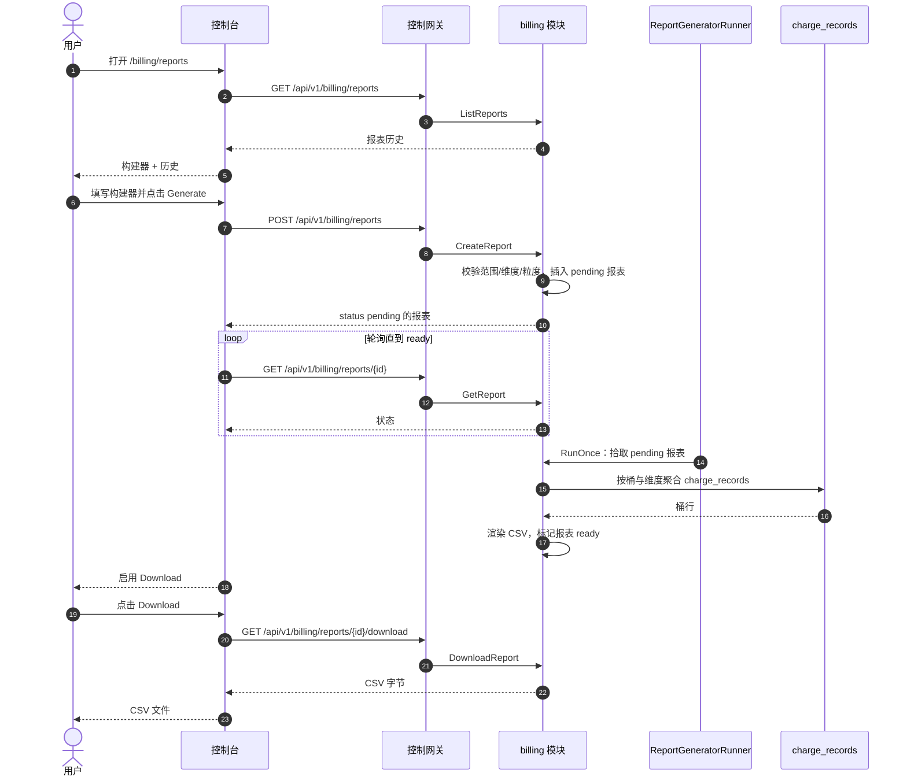
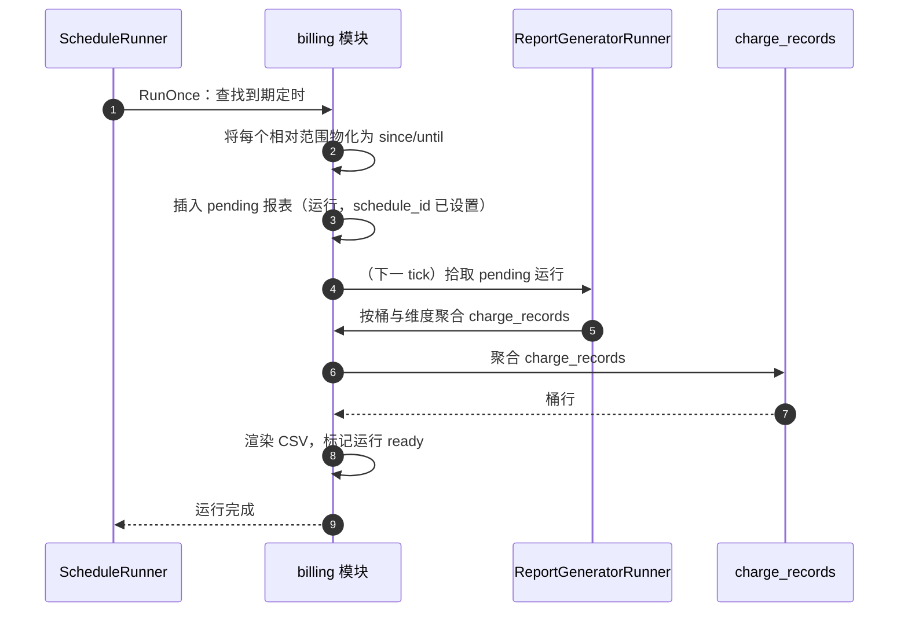
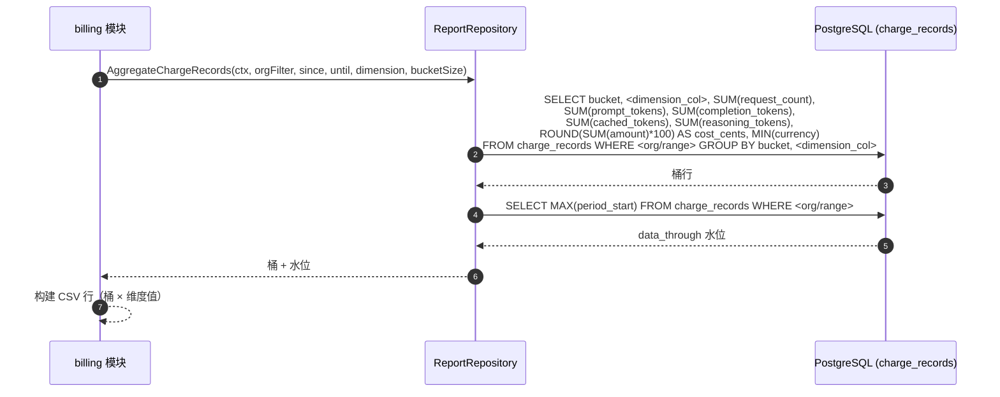

# 计费报表与 CSV 导出 — 架构与详细设计

| 属性 | 内容 |
| --- | --- |
| 特性点 | 计费报表与 CSV 导出 — 生成并下载用量/计费报表（按组织、按 API 密钥、按模型、按时间范围）为 CSV，带定时报表历史（backlog 第 25 行） |
| 文档范围 | 特性-25 的架构与详细设计：异步报表生成任务模型、报表/定时数据模型、CSV 渲染契约、带运行历史的定时报表运行器、管理面与终端用户面计费报表页面、页面 → 路由 → API 前缀映射表、面与鉴权映射 |
| 归属模块 | `billing`（扩展 — 拥有对 `charge_records` 的报表生成、CSV 渲染与定时执行），`web`（管理控制台 `AdminBillingReportsPage` 与终端用户控制台 `UserBillingReportsPage`），`pkg/server` 网关（管理前缀与用户前缀绑定） |
| 相关文档 | [需求分析与 UI/UX 设计](../design/billing-reports.zh-cn.md) · [架构设计](../design/architecture.zh-cn.md) — 第 2.5 节 `metering`、第 2.6 节 `billing` · [用量仪表盘与按请求成本归因](./usage-dashboard.zh-cn.md) — 姊妹只读仪表盘及其 `charge_records` 聚合 · [支付、发票与自动充值](./payments-invoices-auto-recharge.zh-cn.md) — 本特性报告的发票与成本货币模型 · [计量凭证与异步结算](./metering.zh-cn.md) — 本特性可聚合的 `usage_records` · [请求日志与 API 游乐场](./request-logs-playground.zh-cn.md) — `request_logs` 表 · [控制台面分离](./console-surface-separation.zh-cn.md) — 本特性横跨的两个面、`UserShell`/`AdminShell` 约定、掩码投影规则 · [模型可观测性](./model-observability.zh-cn.md) — 姊妹只读聚合及其 service/repository/runner 约定 |
| 状态 | 架构完成，已移交开发者代理 |

---

## 1. 概述与目标

特性 #9 交付了实时用量仪表盘（浏览器内，无导出），特性 #12 交付了原始、按请求的请求日志表（无聚合），特性 #14 交付了发票（固定的计费产物，而非临时报表）。平台仍然无法把累积的用量转化为**可下载、可分享的计费报表** — 租户可以交给财务团队的 CSV，或运营者用来对账租户账单的 CSV。本特性新增**计费报表与 CSV 导出**能力：生成并下载用量/计费报表（按组织、按 API 密钥、按模型、按时间范围）为 CSV，带定时报表历史。

**目标**：管理页面 `/admin/billing/reports` 构建集群级报表（任意组织 / 密钥 / 模型）、列出带下载链接的报表历史、并管理带运行历史的定时报表；终端用户页面 `/billing/reports` 构建租户作用域报表并管理租户自己的定时；页面 → API 面映射表，带精确前缀；每个页面的交互状态，包括加载、空、错误、禁用与权限拒绝；激活新错误码。

**非目标**（延后）：PDF 或 XLSX 导出（v1 仅 CSV）；定时报表的邮件投递（v1 定时在控制台历史中生成报表）；超出定时的报表模板 / 已保存自定义视图；在一份报表中并排比较维度（v1 每份报表一个维度）；报表进度的实时流式（v1 轮询状态）；对推理、计量或计费流水线的任何变更（只读特性）；终端用户面上的跨租户报表。

## 2. 架构决策

| # | 决策 | 依据 |
| --- | --- | --- |
| AD1 | **报表异步生成为任务。** `CreateReport` 插入 `pending` 报表并返回；`ReportGeneratorRunner`（`server.Runner`，自动充值模式）拾取 `pending` 报表、聚合 `charge_records`、渲染 CSV，并将报表标记为 `ready`（带 CSV）或 `failed`。控制台轮询 `GetReport` 直到 `ready`，然后启用下载 | 大范围聚合耗时；同步导出会阻塞或超时。基于任务的生成是通用模式（设计 D2）。生成是 billing 模块内的纯数据库聚合 — 不涉及 K8s 资源 — 因此进程内运行器合适，而非 MQ→controller 路径（设计 D8：仅写入报表产物） |
| AD2 | **聚合源是 `charge_records`（billing 的表），而非 `usage_records` 或 `request_logs`。** `charge_records` 是权威计费证据：每（组织、api_key、model、card、小时）一行，带四个 token 计数、`request_count`、`amount` 与 `currency` — 正是计费报表所需的列。它与用量仪表盘（特性 #9）聚合的源相同 | 报表是**计费**报表：必须携带成本，而成本只存在于 `charge_records`（已定价、已结算的证据）。`usage_records` 携带 token 但无成本；`request_logs` 是带 30 天保留期的诊断元数据。聚合 `charge_records` 使报表与仪表盘和发票保持一致（设计 D3、D8） |
| AD3 | **报表由维度、时间范围与粒度定义。** 维度为 `organization`（按组织行）、`api_key`（按密钥行）或 `model`（按模型行）之一；范围为 `since`/`until`（unix 秒，上限 **366 天**）；粒度为 `daily` 或 `hourly`。CSV 每（桶 × 维度值）一行，携带请求数、输入/输出/总 token 与成本 | 三个维度正是竞品暴露的维度；范围 + 粒度对是通用报表形态。成本与 token 并存使报表对财务与工程都可用（设计 D3） |
| AD4 | **定时报表复用相同的报表定义加频率。** 定时持有报表定义（维度、粒度与**相对**范围，如「最近 7 天」或「上月」）与频率（`daily` / `weekly` / `monthly`）。每次定时运行在相同的历史列表中产生一份报表，带自己的状态与下载 | 定时只是按节奏运行的报表定义；复用定义使构建器与定时保持一致，运行历史就是用户已知的同一报表历史（设计 D4） |
| AD5 | **CSV 对 Excel 友好且时区显式。** CSV 为带 BOM 的 UTF-8、带引号字段、有表头行，并有 `timezone` 列；报表时区在构建时选择并应用于每个桶。CSV 存储在报表行的 `csv` 文本列中 | Excel 是计费导出最常见的消费者；BOM 与带引号字段防止乱码与逗号拆分。显式时区避免对账陷阱。将 CSV 存储在报表行上使下载成为单行读取，并符合「仅写入报表产物」（设计 D5、D8） |
| AD6 | **终端用户面是租户作用域且掩码。** 用户前缀的 `CreateReport` 只接受调用者自己的组织与自己的 API 密钥；用户前缀的 `organization` 维度为调用者组织产生单行。用户报表中绝不出现其他租户数据 | 遵循特性 #17 的掩码投影规则：租户报表绝不能泄露另一租户的用量。管理面是唯一可构建跨租户报表之处（设计 D6） |
| AD7 | **计费报表块（10901–10999）中的新错误码。** **10901 `CodeReportNotFound`**、**10902 `CodeScheduleNotFound`**、**10903 `CodeReportInvalidDimension`**、**10904 `CodeReportInvalidGranularity`**、**10905 `CodeReportInvalidFrequency`**、**10906 `CodeReportNameConflict`**、**10907 `CodeReportNotReady`**。范围校验复用 **10404**（计量范围契约），报表上限为 366 天 | 设计文档「可观测性块（107xx）之后的新块」的意图通过取**可观测性 108xx 之后的下一个空闲块**来兑现 — 可观测性已拥有 10801（特性 #24，e2e 通过）。每个模块有自己的错误块（`pkg/errors/codes.go`）；计费报表取 109xx。这是与现有架构最一致的解读（设计 D7，细化） |
| AD8 | **计费报表只读，且对访问与生成审计。** 报表生成与定时变更被审计（特性 #15）为 `billing.report.generate` / `billing.schedule.create` / `billing.schedule.update` / `billing.schedule.delete`；底层用量已由计量写入审计。计费流水线无变化 | 该特性聚合现有数据，仅写入报表产物与定时；审计追踪（特性 #15）已覆盖底层用量写入，因此只需为新的报表/定时动作新增审计事件（设计 D8）。动作名遵循仓库约定 `<module>.<resource>.<verb>`（如 `billing.account.create`、`webhook.create`），细化了设计的 `report.generated`/`schedule.created` 措辞 |

## 3. 组件设计

```mermaid
flowchart TD
    subgraph cp["控制面"]
        direction TB
        CGW["控制网关 (grpc-gateway)<br/>HTTP 管理 API"]
        BILL["billing 模块<br/>reports · schedules (新增)<br/>ReportGeneratorRunner (新增)<br/>ScheduleRunner (新增)"]
        PG[("PostgreSQL<br/>billing_reports · billing_report_schedules (新增)<br/>charge_records (只读)"]
        CGW --> BILL
        BILL --> PG
    end
    ADMIN["管理控制台<br/>计费报表（集群级）"]
    USER["终端用户控制台<br/>计费报表（租户作用域）"]
    ADMIN --> CGW
    USER --> CGW
```

| 组件 | 本特性中的职责 |
| --- | --- |
| 控制网关（`grpc-gateway`） | 计费报表 RPC 在 `/api/v1/billing/reports/*`（用户）与 `/api/v1/admin/billing/reports/*`（管理）下的 HTTP/JSON 门面；将 `X-Organization-Id` 作为 gRPC 元数据透传 |
| `billing` 模块（`services/billing`） | 报表定义校验、异步报表生成（聚合 `charge_records` → 渲染 CSV）、报表/定时持久化、定时执行、CSV 下载 |
| PostgreSQL | `billing_reports`、`billing_report_schedules` 表（新增）；只读读取 `charge_records`（现有） |
| 控制台 | 管理计费报表页面、终端用户计费报表页面 |

### 3.1 文件布局与函数级职责

| 模块 | 文件 | 内容 |
| --- | --- | --- |
| `services/billing` | `report_model.go` | GORM 模型 `BillingReport`、`BillingReportSchedule` + `TableName`；`ReportDimension`/`ReportGranularity`/`ReportFrequency`/`RelativeRange` 字符串常量 |
| | `report_repository.go` | `ReportRepository`：`CreateReport`、`FindReportByID`、`ListReports`、`UpdateReportStatus`（pending→ready/failed，单事务：设置 status + row_count + data_through + csv）、`CreateSchedule`、`FindScheduleByID`、`ListSchedules`、`UpdateSchedule`、`DeleteSchedule`、`ListScheduleRuns`、`NextPendingReport`（供生成器）、`DueSchedules`（供定时运行器）、`AggregateChargeRecords`（对 `charge_records` 的分桶聚合） |
| | `report_service.go` | RPC：`CreateReport`、`GetReport`、`ListReports`、`DownloadReport`、`CreateSchedule`、`ListSchedules`、`UpdateSchedule`、`DeleteSchedule`、`ListScheduleRuns`；范围/维度/粒度/频率校验；用户租户作用域 vs 管理集群作用域解析；审计事件 |
| | `report_generator_runner.go` | `ReportGeneratorRunner`（server.Runner，ticker）+ 为测试抽取的 `RunOnce(ctx)`；拾取 `pending` 报表、调用仓库聚合、渲染 CSV、标记 `ready`/`failed` |
| | `report_schedule_runner.go` | `ScheduleRunner`（server.Runner，ticker）+ `RunOnce(ctx)`；查找到期定时、将每个相对范围物化为 `since`/`until`、创建 `pending` 报表（运行）、更新 `last_run_at` |
| | `report_csv.go` | `renderCSV(report, rows) (string, error)` — 带 UTF-8 BOM、带引号字段的 CSV 渲染器（AD5） |
| `proto/taas/billing/v1` | `billing.proto` | 增量：计费报表 RPC 与消息（第 5 节） |
| `pkg/errors` + `pkg/config` | `codes.go`/`messages.go`；`api.go`/`configuration.go` | 新错误码（AD7）；`BillingReportsConfig{GeneratorInterval, ScheduleInterval}` 位于 `billing.reports` 下 |
| `apps/taas-server` + `web/src` + `test` | `main.go`；`pages/BillingReportsPage.tsx`、`pages/user/UserBillingReportsPage.tsx`；`fvt/billing_reports_fvt_test.go`/`e2e/tests/billingReports.js` | `srv.Init()` 后注册运行器；控制台页面；第 14 节 |

### 3.2 配置新增

| 键 | 默认 | 描述 |
| --- | --- | --- |
| `billing.reports.generatorInterval` | `5s` | 报表生成运行器的 tick 间隔 |
| `billing.reports.scheduleInterval` | `1m` | 定时运行器的 tick 间隔 |

## 3.3 控制台契约（为开发者代理钉定）

| 页面 / 组件 | 用途 | 关键 testid |
| --- | --- | --- |
| **管理计费报表页面**（`/admin/billing/reports`） | 集群级报表构建器、报表历史、定时列表 | `billing-reports-page`、`report-builder`、`report-name`、`report-dimension`、`report-org`、`report-range`、`report-granularity`、`report-timezone`、`generate-report`、`reports-table`、`report-row-{id}`、`report-download-{id}`、`report-status-{id}`、`schedule-builder`、`schedule-name`、`schedule-frequency`、`create-schedule`、`schedules-table`、`schedule-row-{id}`、`schedule-runs-{id}`、`schedule-edit-{id}`、`schedule-delete-{id}`、`schedule-runs-drawer`、`run-download-{id}` |
| **终端用户计费报表页面**（`/billing/reports`） | 租户作用域报表构建器、报表历史、定时列表（无组织下拉） | 与管理页相同的 testid，减去 `report-org` |

## 4. 数据模型

### 4.1 `billing_reports` 表

| 列 | PostgreSQL 类型 | 约束 | 描述 |
| --- | --- | --- | --- |
| `id` | `uuid` | PRIMARY KEY | 服务端生成的 UUID v4，暴露为 `report_id` |
| `organization_id` | `varchar(64)` | NOT NULL, index | 归属组织（用户面为调用者组织；管理面为过滤或全部组织） |
| `name` | `varchar(128)` | NOT NULL | 报表名称 |
| `dimension` | `varchar(16)` | NOT NULL | `organization` / `api_key` / `model` |
| `since` | `bigint` | NOT NULL | 范围起点，unix 秒 |
| `until` | `bigint` | NOT NULL | 范围终点，unix 秒 |
| `granularity` | `varchar(8)` | NOT NULL | `daily` / `hourly` |
| `timezone` | `varchar(64)` | NOT NULL default `UTC` | 应用于每个桶的 IANA 名称 |
| `status` | `varchar(8)` | NOT NULL, index | `pending` / `ready` / `failed` |
| `row_count` | `bigint` | NOT NULL default 0 | CSV 数据行数 |
| `data_through` | `bigint` | NOT NULL default 0 | 覆盖的最后一个完整桶（计费水位），unix 秒 |
| `csv` | `text` | | 渲染的 CSV（UTF-8 BOM + 带引号字段）；`ready` 前为 NULL |
| `schedule_id` | `uuid` | NULL, index | 报表为定时运行时设置；按需为空 |
| `error` | `varchar(512)` | NOT NULL default '' | `status = failed` 时的失败原因 |
| `created_at` | `timestamptz` | NOT NULL | 创建时间 |

### 4.2 `billing_report_schedules` 表

| 列 | PostgreSQL 类型 | 约束 | 描述 |
| --- | --- | --- | --- |
| `id` | `uuid` | PRIMARY KEY | 服务端生成的 UUID v4，暴露为 `schedule_id` |
| `organization_id` | `varchar(64)` | NOT NULL, index | 归属组织（用户面为调用者组织；管理面为过滤或全部组织） |
| `name` | `varchar(128)` | NOT NULL, 每组织唯一 | 定时名称（重复 → 10906） |
| `dimension` | `varchar(16)` | NOT NULL | `organization` / `api_key` / `model` |
| `relative_range` | `varchar(16)` | NOT NULL | `last_7_days` / `last_30_days` / `last_month` |
| `granularity` | `varchar(8)` | NOT NULL | `daily` / `hourly` |
| `frequency` | `varchar(8)` | NOT NULL | `daily` / `weekly` / `monthly` |
| `timezone` | `varchar(64)` | NOT NULL default `UTC` | IANA 名称 |
| `status` | `varchar(8)` | NOT NULL default `active` | `active` / `paused`（v1：始终 `active`） |
| `last_run_at` | `timestamptz` | | 上次运行创建时间 |
| `created_at` | `timestamptz` | NOT NULL | 创建时间 |
| `updated_at` | `timestamptz` | NOT NULL | 最后更新时间 |

### 4.3 迁移说明

- 两张新表由 `taas-server` 启动时的 GORM `AutoMigrate` 创建（增量；无数据迁移）。`Migrate`/`MigrateSchemaForFVT` 增加两个新模型。
- 无需 init-SQL 升级路径：无现有表变更，新表在启动时自动创建。
- 该特性只读读取 `charge_records`（现有）；无需对其做索引变更 — 现有 `idx_charge_records_org_period (organization_id, period_start)` 与 `idx_charge_records_group_period (api_key_id, model_id, accelerator_type, period_start)` 索引服务聚合。管理集群视图（无组织过滤）按 `period_start` 扫描；`idx_charge_records_group_period` 上的现有 `period_start` 索引覆盖之。

## 5. API 设计

所有计费报表 RPC 属于 **`taas.billing.v1.BillingService`**（扩展），经控制网关以 HTTP 提供。管理路由位于管理前缀 `/api/v1/admin/billing/reports/*`；终端用户路由位于用户前缀 `/api/v1/billing/reports/*`。面由请求路径派生（第 3.3 节）。

| RPC | HTTP（用户） | HTTP（管理） | 状态 | 用途 |
| --- | --- | --- | --- | --- |
| `CreateReport` | `POST /api/v1/billing/reports` | `POST /api/v1/admin/billing/reports` | **新增** | 创建按需报表任务 |
| `GetReport` | `GET /api/v1/billing/reports/{report_id}` | `GET /api/v1/admin/billing/reports/{report_id}` | **新增** | 报表状态与定义 |
| `ListReports` | `GET /api/v1/billing/reports` | `GET /api/v1/admin/billing/reports` | **新增** | 报表历史 |
| `DownloadReport` | `GET /api/v1/billing/reports/{report_id}/download` | `GET /api/v1/admin/billing/reports/{report_id}/download` | **新增** | CSV 下载 |
| `CreateSchedule` | `POST /api/v1/billing/reports/schedules` | `POST /api/v1/admin/billing/reports/schedules` | **新增** | 创建定时报表 |
| `ListSchedules` | `GET /api/v1/billing/reports/schedules` | `GET /api/v1/admin/billing/reports/schedules` | **新增** | 列出定时 |
| `UpdateSchedule` | `PATCH /api/v1/billing/reports/schedules/{schedule_id}` | `PATCH /api/v1/admin/billing/reports/schedules/{schedule_id}` | **新增** | 更新定时 |
| `DeleteSchedule` | `DELETE /api/v1/billing/reports/schedules/{schedule_id}` | `DELETE /api/v1/admin/billing/reports/schedules/{schedule_id}` | **新增** | 删除定时 |
| `ListScheduleRuns` | `GET /api/v1/billing/reports/schedules/{schedule_id}/runs` | `GET /api/v1/admin/billing/reports/schedules/{schedule_id}/runs` | **新增** | 定时运行历史 |

### 5.1 Proto 契约

```protobuf
syntax = "proto3";

package taas.billing.v1;

import "google/api/annotations.proto";
import "taas/common/v1/common.proto";

option go_package = "github.com/go-taas/go-taas/proto/taas/billing/v1;billingv1";

// BillingService 扩展计费报表 RPC（特性-25）。
// CreateReport/GetReport/ListReports/DownloadReport 与定时 RPC 双绑定：
// 用户绑定在 /api/v1/billing/reports/* 下租户作用域，管理绑定在
// /api/v1/admin/billing/reports/* 下集群级。
service BillingService {
  // CreateReport 创建按需报表任务（status = pending）。
  // 用户面 API：/api/v1/billing/reports 下租户作用域。
  // 管理面 API：/api/v1/admin/billing/reports 下集群级。
  rpc CreateReport(CreateReportRequest) returns (CreateReportResponse) {
    option (google.api.http) = {
      post: "/api/v1/billing/reports"
      body: "*"
      additional_bindings: {
        post: "/api/v1/admin/billing/reports"
        body: "*"
      }
    };
  }

  // GetReport 返回报表状态、定义、行数与 data_through。
  // 用户面 API：/api/v1/billing/reports 下。
  // 管理面 API：/api/v1/admin/billing/reports 下。
  rpc GetReport(GetReportRequest) returns (GetReportResponse) {
    option (google.api.http) = {
      get: "/api/v1/billing/reports/{report_id}"
      additional_bindings: {get: "/api/v1/admin/billing/reports/{report_id}"}
    };
  }

  // ListReports 返回报表历史，最新在前。
  // 用户面 API：/api/v1/billing/reports 下。
  // 管理面 API：/api/v1/admin/billing/reports 下。
  rpc ListReports(ListReportsRequest) returns (ListReportsResponse) {
    option (google.api.http) = {
      get: "/api/v1/billing/reports"
      additional_bindings: {get: "/api/v1/admin/billing/reports"}
    };
  }

  // DownloadReport 在 status = ready 时返回 CSV。
  // 用户面 API：/api/v1/billing/reports 下。
  // 管理面 API：/api/v1/admin/billing/reports 下。
  rpc DownloadReport(DownloadReportRequest) returns (DownloadReportResponse) {
    option (google.api.http) = {
      get: "/api/v1/billing/reports/{report_id}/download"
      additional_bindings: {get: "/api/v1/admin/billing/reports/{report_id}/download"}
    };
  }

  // CreateSchedule 创建定时报表（status = active）。
  // 用户面 API：/api/v1/billing/reports 下。
  // 管理面 API：/api/v1/admin/billing/reports 下。
  rpc CreateSchedule(CreateScheduleRequest) returns (CreateScheduleResponse) {
    option (google.api.http) = {
      post: "/api/v1/billing/reports/schedules"
      body: "*"
      additional_bindings: {
        post: "/api/v1/admin/billing/reports/schedules"
        body: "*"
      }
    };
  }

  // ListSchedules 返回调用者的定时。
  // 用户面 API：/api/v1/billing/reports 下。
  // 管理面 API：/api/v1/admin/billing/reports 下。
  rpc ListSchedules(ListSchedulesRequest) returns (ListSchedulesResponse) {
    option (google.api.http) = {
      get: "/api/v1/billing/reports/schedules"
      additional_bindings: {get: "/api/v1/admin/billing/reports/schedules"}
    };
  }

  // UpdateSchedule 更新定时的 name、frequency 或相对范围。
  // 用户面 API：/api/v1/billing/reports 下。
  // 管理面 API：/api/v1/admin/billing/reports 下。
  rpc UpdateSchedule(UpdateScheduleRequest) returns (UpdateScheduleResponse) {
    option (google.api.http) = {
      patch: "/api/v1/billing/reports/schedules/{schedule_id}"
      body: "*"
      additional_bindings: {
        patch: "/api/v1/admin/billing/reports/schedules/{schedule_id}"
        body: "*"
      }
    };
  }

  // DeleteSchedule 删除定时。
  // 用户面 API：/api/v1/billing/reports 下。
  // 管理面 API：/api/v1/admin/billing/reports 下。
  rpc DeleteSchedule(DeleteScheduleRequest) returns (DeleteScheduleResponse) {
    option (google.api.http) = {
      delete: "/api/v1/billing/reports/schedules/{schedule_id}"
      additional_bindings: {delete: "/api/v1/admin/billing/reports/schedules/{schedule_id}"}
    };
  }

  // ListScheduleRuns 返回定时产生的运行。
  // 用户面 API：/api/v1/billing/reports 下。
  // 管理面 API：/api/v1/admin/billing/reports 下。
  rpc ListScheduleRuns(ListScheduleRunsRequest) returns (ListScheduleRunsResponse) {
    option (google.api.http) = {
      get: "/api/v1/billing/reports/schedules/{schedule_id}/runs"
      additional_bindings: {get: "/api/v1/admin/billing/reports/schedules/{schedule_id}/runs"}
    };
  }
}

// ReportDimension 是报表的聚合维度。
enum ReportDimension {
  REPORT_DIMENSION_UNSPECIFIED = 0;
  REPORT_DIMENSION_ORGANIZATION = 1;
  REPORT_DIMENSION_API_KEY = 2;
  REPORT_DIMENSION_MODEL = 3;
}

// ReportGranularity 是报表的桶大小。
enum ReportGranularity {
  REPORT_GRANULARITY_UNSPECIFIED = 0;
  REPORT_GRANULARITY_DAILY = 1;
  REPORT_GRANULARITY_HOURLY = 2;
}

// ReportFrequency 是定时报表的节奏。
enum ReportFrequency {
  REPORT_FREQUENCY_UNSPECIFIED = 0;
  REPORT_FREQUENCY_DAILY = 1;
  REPORT_FREQUENCY_WEEKLY = 2;
  REPORT_FREQUENCY_MONTHLY = 3;
}

// RelativeRange 是定时报表的相对时间范围。
enum RelativeRange {
  RELATIVE_RANGE_UNSPECIFIED = 0;
  RELATIVE_RANGE_LAST_7_DAYS = 1;
  RELATIVE_RANGE_LAST_30_DAYS = 2;
  RELATIVE_RANGE_LAST_MONTH = 3;
}

message CreateReportRequest {
  // name 是报表名称。
  string name = 1;
  // dimension 为 organization / api_key / model。
  ReportDimension dimension = 2;
  // since/until 界定范围，unix 秒。默认：until = now，since = until - 30d。
  // 范围 > 366 天被拒绝（10404）。
  int64 since = 3;
  int64 until = 4;
  // granularity 为 daily 或 hourly。
  ReportGranularity granularity = 5;
  // timezone 为 IANA 名称，默认 UTC。
  string timezone = 6;
  // organization_id 是管理面的可选集群过滤；缺省表示全部组织。
  // 用户面上被忽略（调用者组织是隐式的）。
  string organization_id = 7;
}

message CreateReportResponse {
  taas.common.v1.Response response = 1;
  Report report = 2;
}

message GetReportRequest {
  string report_id = 1;
}

message GetReportResponse {
  taas.common.v1.Response response = 1;
  Report report = 2;
}

message ListReportsRequest {
  taas.common.v1.PageRequest page = 1;
  // dimension/status 为可选过滤。
  ReportDimension dimension = 2;
  string status = 3;
}

message ListReportsResponse {
  taas.common.v1.Response response = 1;
  repeated Report reports = 2;
  taas.common.v1.PageMeta page_meta = 3;
}

message DownloadReportRequest {
  string report_id = 1;
}

message DownloadReportResponse {
  taas.common.v1.Response response = 1;
  // csv 为 status = ready 时的 UTF-8-BOM CSV 内容。
  string csv = 2;
  // filename 为 Content-Disposition 文件名。
  string filename = 3;
}

message CreateScheduleRequest {
  string name = 1;
  ReportDimension dimension = 2;
  RelativeRange relative_range = 3;
  ReportGranularity granularity = 4;
  ReportFrequency frequency = 5;
  string timezone = 6;
  // organization_id 是管理面的可选集群过滤；缺省表示全部组织。
  // 用户面上被忽略。
  string organization_id = 7;
}

message CreateScheduleResponse {
  taas.common.v1.Response response = 1;
  ReportSchedule schedule = 2;
}

message ListSchedulesRequest {
  taas.common.v1.PageRequest page = 1;
  // organization_id 是可选管理过滤。
  string organization_id = 2;
}

message ListSchedulesResponse {
  taas.common.v1.Response response = 1;
  repeated ReportSchedule schedules = 2;
  taas.common.v1.PageMeta page_meta = 3;
}

message UpdateScheduleRequest {
  string schedule_id = 1;
  string name = 2;
  ReportFrequency frequency = 3;
  RelativeRange relative_range = 4;
}

message UpdateScheduleResponse {
  taas.common.v1.Response response = 1;
  ReportSchedule schedule = 2;
}

message DeleteScheduleRequest {
  string schedule_id = 1;
}

message DeleteScheduleResponse {
  taas.common.v1.Response response = 1;
}

message ListScheduleRunsRequest {
  taas.common.v1.PageRequest page = 1;
  string schedule_id = 2;
}

message ListScheduleRunsResponse {
  taas.common.v1.Response response = 1;
  repeated Report runs = 2;
  taas.common.v1.PageMeta page_meta = 3;
}

// Report 是一份报表（按需或定时运行）。
message Report {
  string report_id = 1;
  string name = 2;
  ReportDimension dimension = 3;
  int64 since = 4;
  int64 until = 5;
  ReportGranularity granularity = 6;
  string timezone = 7;
  string status = 8; // pending / ready / failed
  int64 row_count = 9;
  int64 data_through = 10;
  int64 created_at = 11;
  // schedule_id 在报表为定时运行时设置。
  string schedule_id = 12;
}

// ReportSchedule 是一份定时报表定义。
message ReportSchedule {
  string schedule_id = 1;
  string name = 2;
  ReportDimension dimension = 3;
  RelativeRange relative_range = 4;
  ReportGranularity granularity = 5;
  ReportFrequency frequency = 6;
  string timezone = 7;
  string status = 8; // active
  int64 last_run_at = 9;
  int64 created_at = 10;
}
```

### 5.2 契约说明（为开发者代理钉定）

1. `CreateReport` 校验 `since`/`until`（int64 unix 秒；默认 `until = now`、`since = until − 30d`）；`since > until` 或范围 > 366 天返回 10404（AD7）。`dimension` 必须为 `organization` / `api_key` / `model`（否则 10903）；`granularity` 必须为 `daily` / `hourly`（否则 10904）。`timezone` 为 IANA 名称，默认 `UTC`。
2. 在用户前缀上，`CreateReport` 是租户作用域（AD6）：不接受 `organization_id` 过滤（被忽略），报表只聚合调用者自己的组织与自己的 API 密钥。在管理前缀上，可选的 `organization_id` 将集群报表限定到一个组织。
3. 报表是异步的（AD1）：`CreateReport` 返回 `status = pending`；报表变为 `ready`（带可下载 CSV）或 `failed`。就绪前 `DownloadReport` 返回 10907（AD7）。
4. CSV 为带 BOM 的 UTF-8、带引号字段、有表头行，每（桶 × 维度值）一行，含 `bucket`、`timezone`、`organization_id`、`organization_name`、`api_key_id`、`api_key_name`、`model_id`、`model_name`、`request_count`、`input_tokens`、`output_tokens`、`total_tokens`、`cost`、`currency`（AD3、AD5）。与所选维度无关的列为空。
5. 定时持有报表定义加 `frequency`（`daily` / `weekly` / `monthly`，否则 10905）与相对范围（`last_7_days` / `last_30_days` / `last_month`）。定时 `name` 重复（每组织）返回 10906（AD7）。每次定时运行在相同的历史列表中产生一份报表（AD4）。
6. 聚合读取 `charge_records`（AD2）的 token 与成本总计；仅写入报表产物与定时（AD8）。报表生成与定时变更被审计（特性 #15）为 `billing.report.generate` / `billing.schedule.create` / `billing.schedule.update` / `billing.schedule.delete`。
7. 线上约定不变：列表用点分页，成功 HTTP 200，业务错误为 `{"code": <int>, "message": "..."}`，int64 字段序列化为 JSON 字符串。

### 5.3 错误码

错误码（计费报表块 10901–10999，`pkg/errors/codes.go`）：

| 条件 | 码 | 常量 | 说明 |
| --- | --- | --- | --- |
| 未知 `report_id` | 10901 | `CodeReportNotFound` | **新增**（AD7） |
| 未知 `schedule_id` | 10902 | `CodeScheduleNotFound` | **新增**（AD7） |
| 无效 `dimension` | 10903 | `CodeReportInvalidDimension` | **新增**（AD7） |
| 无效 `granularity` | 10904 | `CodeReportInvalidGranularity` | **新增**（AD7） |
| 无效 `frequency` | 10905 | `CodeReportInvalidFrequency` | **新增**（AD7） |
| 定时 `name` 重复 | 10906 | `CodeReportNameConflict` | **新增**（AD7） |
| 就绪前下载 | 10907 | `CodeReportNotReady` | **新增**（AD7） |
| 格式错误或超长范围 | 10404 | `CodeMeteringRangeInvalid` | 复用（AD7）— 计量范围契约，报表上限 366 天 |
| 数据库 / 基础设施故障 | 500 | `CodeInternal` | 经错误归一化 |

## 6. 前端架构

### 6.1 页面 → 路由 → API 前缀表

| 页面 / 组件 | 面 | Web 路由 | API 前缀 | 鉴权守卫 |
| --- | --- | --- | --- | --- |
| **计费报表页面** | 管理 | `/admin/billing/reports` | `/api/v1/admin/billing/reports/*` | 管理会话；RoleGuard（管理角色） |
| **计费报表页面** | 终端用户 | `/billing/reports` | `/api/v1/billing/reports/*` | 用户会话；硬限定到调用者组织 |

> 管理计费报表页面只调用 `/api/v1/admin/billing/reports/*`；终端用户计费报表页面只调用 `/api/v1/billing/reports/*`。两个面绝不共享会话 token（特性 #17）。

### 6.2 导航位置

- **管理控制台**：新增 **Billing reports** 项（`/admin/billing/reports`，testid `nav-billing-reports`），位于管理导航的计费组，与 Pricing、Bills、Accounts、Payments、Invoices 并列。
- **终端用户控制台**：新增 **Billing reports** 项（`/billing/reports`，testid `nav-billing-reports`），位于用户导航的计费组，与 Bills 并列。

### 6.3 复用共享组件与状态

- **API 客户端**（`web/src/api.ts`）：realm 作用域客户端（`createApi(realm)`）已发送 `Authorization: Bearer <realm>.session-token` 与 `X-Organization-Id`（仅当 realm token 键为空时）。计费报表页面原样复用；不新增客户端。
- **时间范围过滤**：预设控件（24 h / 7 d / 30 d / 90 d / custom 带日期时间选择器）与 Usage 和 Request Logs 页面共享。
- **点分页**：Usage 与 Request Logs 表格使用的共享分页组件。
- **状态徽章**：pending/ready/failed 徽章样式复用用量仪表盘的 pending 徽章样式。
- **空 / 错误 / 过期数据状态**：复用 Request Logs 页面模式（空文案、带 Retry 的错误横幅、「Showing stale data」横幅）。
- **确认对话框**：删除定时确认复用 Webhooks 与 API Keys 页面使用的共享确认对话框组件。

### 6.4 每面的鉴权守卫

- **管理计费报表页面**（`/admin/billing/reports`）：在 `AdminShell` 内渲染，当 `go-taas.admin.session-token` 非空时运行管理会话守卫；缺失/过期会话重定向到 `/admin/login?reason=expired`；错误 realm 会话被网关以 10038 拒绝。页面 API 调用发往 `/api/v1/admin/billing/reports/*`。无所需角色的会话收到 10036，页面显示标准权限拒绝状态（特性 #17）。
- **终端用户计费报表页面**（`/billing/reports`）：在 `UserShell` 内渲染，当 `go-taas.user.session-token` 非空时运行用户会话守卫；缺失/过期会话重定向到 `/login?reason=expired`。页面 API 调用发往 `/api/v1/billing/reports/*`。页面不暴露其他租户数据（AD6）。
- **未认证访客**：任一页面的未认证访客由 shell 守卫重定向到正确的登录页（`/admin/login` vs `/login`）。

### 6.5 控制台契约（为开发者代理钉定）

**管理计费报表页面**（`/admin/billing/reports`）：页面头部（「Billing reports」，副标题「Generate and download usage and cost reports」）带 **New report** 主操作（`new-report`）。头部下方两个标签页：**Reports**（`reports-tab`）与 **Schedules**（`schedules-tab`）。

**Reports 标签页**：可折叠报表构建器（`report-builder`，历史为空时默认展开），字段 **Name**（`report-name`，必填）、**Dimension**（`report-dimension`，单选：Organization / API key / Model）、**Organization**（`report-org`，下拉，仅管理，默认「All organizations」）、**Time range**（`report-range`，预设 24 h / 7 d / 30 d / 90 d / custom）、**Granularity**（`report-granularity`，单选：Daily / Hourly）、**Timezone**（`report-timezone`，下拉，默认 UTC）。**Generate report** 主操作（`generate-report`）与 **Cancel** 次操作。下方报表历史表格（`reports-table`、`report-row-{id}`），列：Name、Dimension、Range、Granularity、Status（`report-status-{id}`）、Rows、Created、Actions（Download `report-download-{id}` 在 `status = ready` 时启用，View）。表格上方 **Refresh** 操作（`reports-refresh`）。可按 Name、Status、Rows、Created 排序；可按 Dimension 与 Status 过滤；点分页。

**Schedules 标签页**：定时构建器（`schedule-builder`），字段 **Name**（`schedule-name`，必填，唯一）、**Dimension**（`schedule-dimension`，单选）、**Organization**（`schedule-org`，下拉，仅管理）、**Relative range**（`schedule-relative-range`，下拉：Last 7 days / Last 30 days / Last month）、**Granularity**（`schedule-granularity`，单选）、**Frequency**（`schedule-frequency`，单选：Daily / Weekly / Monthly）、**Timezone**（`schedule-timezone`，下拉）。**Create schedule** 主操作（`create-schedule`）与 **Cancel** 次操作。下方定时列表表格（`schedules-table`、`schedule-row-{id}`），列：Name、Dimension、Relative range、Frequency、Status、Last run、Actions（View runs `schedule-runs-{id}`、Edit `schedule-edit-{id}`、Delete `schedule-delete-{id}`）。可按 Name、Frequency、Last run 排序；点分页。

**交互状态**：默认（构建器 + 表格从首次成功加载渲染，last-updated 显示加载时间）；加载中（骨架行，Generate/Create 禁用）；空（「No reports yet.」/「No schedules yet.」带提示，构建器保持可见）；错误（带 Retry 的错误横幅、「Showing stale data」横幅）；禁用（请求进行中 Generate/Create 禁用，`status != ready` 时 Download 禁用，报表生成中构建器字段禁用）；权限拒绝（10036 → 标准权限拒绝状态带返回管理首页的链接）。

**对话框与确认流程**：生成报表（提交后行上显示「Generating…」进度状态并轮询 `GetReport` 直到 `ready`，然后启用 Download；生成失败显示「Generation failed」带 Retry 操作）；删除定时（确认对话框「Delete schedule <name>? This does not delete past reports.」带 Cancel/Delete 危险，调用 `DeleteSchedule` 并移除该行）；查看运行（抽屉 `schedule-runs-drawer` 列出定时的运行，来自 `ListScheduleRuns`，每个就绪运行带 Download `run-download-{id}`）。

**终端用户计费报表页面**（`/billing/reports`）：与管理页相同，但**无 Organization 下拉**（调用者组织是隐式的，AD6），且 Dimension 单选中的 Organization 选择为调用者组织产生单行报表。空/错误/权限拒绝状态相同，权限拒绝文案为租户自己的（特性 #17 第 8.2 节的 10005 组织消失 / 10017 组织禁用）。页面不暴露其他租户数据（AD6）。

## 7. 时序流程

### 7.1 按需报表生成与下载



### 7.2 定时报表运行



### 7.3 聚合查询



## 8. 错误处理

所有错误都是统一信封中的 `pkg/errors` 业务码（第 5.3 节）。计费报表模块仅写入报表产物与定时；生成失败被捕获在报表行上（`status = failed`、`error` 已设置）而非返回给调用者，因为生成是异步的。同步 RPC 期间的数据库故障被归一化为 500 `CodeInternal`。

控制台按 body `code` 分支（`web/src/api.ts` 已如此），绝不按 HTTP 状态。每个新码渲染特定内联消息：10901「report not found」、10902「schedule not found」、10903「invalid dimension」、10904「invalid granularity」、10905「invalid frequency」、10906「schedule name already exists」、10907「report not ready」、10404「invalid range」（计量范围契约）。管理页面将 10036 映射到标准权限拒绝状态；终端用户页面将 10005/10017 映射到租户的权限拒绝文案（特性 #17 第 8.2 节）。

## 9. 配置新增

| 键 | 默认 | 描述 |
| --- | --- | --- |
| `billing.reports.generatorInterval` | `5s` | 报表生成运行器的 tick 间隔（AD1） |
| `billing.reports.scheduleInterval` | `1m` | 定时运行器的 tick 间隔（AD4） |

`billing.reports` 配置块在 `pkg/config` 中新增（`BillingReportsConfig`），嵌套于 `BillingConfig` 下，遵循 `autoRecharge` 块模式。`applyDefaults`/`Validate` 设置上述默认值。不新增其他配置键、运行器或 MQ 主题 — 该特性对现有数据只读（AD8）。

## 10. 安全考量

- **面分离**：管理计费报表页面只调用 `/api/v1/admin/billing/reports/*`；终端用户计费报表页面只调用 `/api/v1/billing/reports/*`。realm 守卫在任何处理器运行前以 10038 拒绝错误 realm 会话（特性 #17）。
- **管理集群视图按角色门控**：管理计费报表 RPC 默认集群级（AD6），由 `tenancy.RoleGuard` 门控 — 只有具备所需管理角色的调用者能构建跨组织报表；不可访问组织返回 10036。
- **终端用户硬作用域**：计费报表 RPC 的用户绑定硬限定到调用者组织（会话活动组织权威，`X-Organization-Id` 被忽略）；调用者绝看不到另一租户的用量（AD6）。
- **掩码投影**：终端用户面不暴露其他租户数据，绝不构建跨租户报表（AD6）。管理面是运营者作用域。
- **CSV 注入防护**：CSV 渲染器（AD5）为任何以 `=`、`+`、`-` 或 `@` 开头的单元格加单引号（`'`）前缀，使模型名、组织名或 API 密钥名无法向 Excel 注入公式。这应用于每个字符串单元格（organization_name、api_key_name、model_name，以及出现的报表名）。
- **构造上只读**：计费报表模块对 `charge_records` 只发 `SELECT`，仅写入报表/定时表；推理、计量或计费流水线无变化（AD8）。
- **无新特权**：计费报表不授予新能力；它是对调用者已可通过 charges 与用量仪表盘查询的数据（在其作用域内）的只读聚合。

## 11. 上线 / 升级说明

- **两张新表**（`billing_reports`、`billing_report_schedules`）经 `taas-server` 启动时的 AutoMigrate 创建；单独部署 `taas-server`。无数据迁移，无 init-SQL 升级路径。
- **Proto 变更是增量的**：在现有 `taas.billing.v1.BillingService` 上新增 RPC 与消息；无现有 RPC 或消息变更。网关 mux 增加新绑定；realm 守卫不变。
- **控制台**：两个新页面加入现有 bundle；管理导航与用户导航各增加 Billing reports 项。无现有路由变更。
- **向后兼容**：过渡（无会话、`X-Organization-Id`）路径为 CLI、FVT 与 e2e 套件保留；realm 守卫透传无 `Authorization` 头的请求（特性 #17 AD4）。
- **数据存在前为空**：在报表存在前，计费报表 RPC 返回空历史/定时；页面渲染空状态带生成提示。

## 12. 验收标准可追溯性

| # | 标准 | 覆盖位置 |
| --- | --- | --- |
| AC1 | `CreateReport` 带有效定义返回 `status = pending` 的报表；范围 > 366 天或 `since > until` 返回 10404；无效 `dimension` 返回 10903，无效 `granularity` 返回 10904 | §5.1、§5.2、§5.3 |
| AC2 | `GetReport` 返回报表状态、定义、行数与 `data_through`；未知 `report_id` 返回 10901 | §5.1、§5.2、§5.3 |
| AC3 | `DownloadReport` 在 `status = ready` 时返回带 UTF-8 BOM 的 CSV，含表头行与每（桶 × 维度值）一行；就绪前下载返回 10907 | §5.1、§5.2、§5.3、§7.1 |
| AC4 | `CreateSchedule` 带有效定义与频率返回 active 定时；重复 `name` 返回 10906，无效 `frequency` 返回 10905；`UpdateSchedule` 与 `DeleteSchedule` 生效，未知 `schedule_id` 返回 10902 | §5.1、§5.2、§5.3 |
| AC5 | `ListScheduleRuns` 返回定时产生的运行，每次运行是相同历史列表中的一份报表 | §5.1、§7.2 |
| AC6 | 用户前缀的 `CreateReport` 是租户作用域：不接受 `organization_id` 过滤，只聚合调用者自己的组织与自己的 API 密钥 | §3.3、§5.2、§6.4、§10 |
| AC7 | `/admin/billing/reports` 页面从首次成功加载渲染构建器、报表历史与定时列表，带 last-updated 时间戳 | §6.5 |
| AC8 | 生成报表显示「Generating…」进度状态，轮询直到 `ready`，然后启用 **Download**；点击 **Download** 获取 CSV | §6.5、§7.1 |
| AC9 | 空状态（「No reports yet.」/「No schedules yet.」）在无数据匹配时渲染；失败加载保留最后的好数据并显示「Showing stale data」横幅与 Retry 操作 | §6.5 |
| AC10 | 创建定时将其加入定时列表；删除定时显示确认对话框并移除该行而不删除过去的报表；**View runs** 显示运行历史，每个就绪运行带 **Download** | §6.5、§7.2 |
| AC11 | `/billing/reports` 页面渲染租户作用域的构建器、历史与定时，无其他租户数据且无组织下拉 | §6.5、§10 |
| AC12 | 管理计费报表页面仅在管理面可达：路由 `/admin/billing/reports`，每个 API 调用使用 `/api/v1/admin/billing/reports/*` 前缀，无 `/api/v1/billing/reports/*` 字符串 | §6.1、§6.4、§10 |
| AC13 | 终端用户计费报表页面仅在终端用户面可达：路由 `/billing/reports`，每个 API 调用使用 `/api/v1/billing/reports/*` 前缀，无 `/api/v1/admin/*` 字符串 | §6.1、§6.4、§10 |
| AC14 | 无所需角色的会话在管理计费报表页面收到 10036，页面显示标准权限拒绝状态 | §3.3、§6.4、§10 |

## 13. 详细设计（各层函数级职责）

### 13.1 Proto → service → repository → controller

| 层 | 文件 | 职责 |
| --- | --- | --- |
| `proto/taas/billing/v1` | `billing.proto` | 增量：九个计费报表 RPC 与消息（第 5.1 节）；枚举 `ReportDimension`、`ReportGranularity`、`ReportFrequency`、`RelativeRange`；消息 `CreateReportRequest/Response`、`GetReportRequest/Response`、`ListReportsRequest/Response`、`DownloadReportRequest/Response`、`CreateScheduleRequest/Response`、`ListSchedulesRequest/Response`、`UpdateScheduleRequest/Response`、`DeleteScheduleRequest/Response`、`ListScheduleRunsRequest/Response`、`Report`、`ReportSchedule`。经 `buf generate` 重新生成 `billing.pb.go`/`billing_grpc.pb.go`/`billing.pb.gw.go` |
| `services/billing` | `report_model.go` | GORM 模型 `BillingReport`、`BillingReportSchedule` + `TableName`；`ReportDimension`/`ReportGranularity`/`ReportFrequency`/`RelativeRange` 字符串常量及其 proto 枚举 ↔ 字符串映射辅助函数 |
| | `report_repository.go` | `ReportRepository`：`CreateReport`、`FindReportByID`、`ListReports`、`UpdateReportStatus`（pending→ready/failed，单事务：设置 status + row_count + data_through + csv + error）、`CreateSchedule`、`FindScheduleByID`、`ListSchedules`、`UpdateSchedule`、`DeleteSchedule`、`ListScheduleRuns`、`NextPendingReport`（供生成器）、`DueSchedules`（供定时运行器）、`AggregateChargeRecords(ctx, orgFilter, since, until, dimension, bucketSize)` — 对 `charge_records` 的分桶聚合（AD2）、`ChargeWatermark(ctx, orgFilter, since, until)` — `max(period_start)` 水位 |
| | `report_service.go` | 新 RPC `CreateReport`、`GetReport`、`ListReports`、`DownloadReport`、`CreateSchedule`、`ListSchedules`、`UpdateSchedule`、`DeleteSchedule`、`ListScheduleRuns`；范围校验（10404，AD7）；维度/粒度/频率校验（10903/10904/10905）；重复名检查（10906）；用户租户作用域 vs 管理集群作用域解析（AD6）；`SessionActiveOrg`/`resolveOrganizationID` 接缝；`RoleGuard` 接缝用于管理组织作用域；审计事件（AD8）；`Migrate`/`MigrateSchemaForFVT` 增加两个新模型（第 4.3 节） |
| | `report_generator_runner.go` | `ReportGeneratorRunner`（server.Runner，ticker）+ 为测试抽取的 `RunOnce(ctx)`；经 `NextPendingReport` 拾取 `pending` 报表、调用 `AggregateChargeRecords`、经 `renderCSV` 渲染 CSV、经 `UpdateReportStatus` 标记 `ready`/`failed` |
| | `report_schedule_runner.go` | `ScheduleRunner`（server.Runner，ticker）+ `RunOnce(ctx)`；经 `DueSchedules` 查找到期定时、将每个相对范围物化为 `since`/`until`、经 `CreateReport` 创建 `pending` 报表（运行，`schedule_id` 已设置）、更新 `last_run_at` |
| | `report_csv.go` | `renderCSV(report, rows) (string, error)` — 带 UTF-8 BOM、带引号字段的 CSV 渲染器（AD5）；CSV 注入防护（第 10 节） |
| `pkg/errors` | `codes.go`/`messages.go` | `CodeReportNotFound`（10901）、`CodeScheduleNotFound`（10902）、`CodeReportInvalidDimension`（10903）、`CodeReportInvalidGranularity`（10904）、`CodeReportInvalidFrequency`（10905）、`CodeReportNameConflict`（10906）、`CodeReportNotReady`（10907）常量 + 规范消息（AD7） |
| `pkg/config` | `api.go`/`configuration.go` | `BillingReportsConfig{GeneratorInterval, ScheduleInterval}` 嵌套于 `BillingConfig` 下（第 9 节）+ `applyDefaults`/`Validate` |
| `apps/taas-server` | `main.go` | 当 `cfg.Billing.Reports` 启用时，在 `srv.Init()` 后注册两个运行器（`ReportGeneratorRunner`、`ScheduleRunner`）；将 `tenancy` RoleGuard 与 `auth` 会话组织解析器接入 billing 服务（现有 billing RPC 已接入） |
| `web/src` | `pages/BillingReportsPage.tsx`、`pages/user/UserBillingReportsPage.tsx`、`App.tsx`、`api.ts`、`shells/AdminShell.tsx`、`shells/UserShell.tsx` | 路由 `/admin/billing/reports`、`/billing/reports`；计费报表 API 类型与调用；导航项（第 6.5 节） |
| `test` | `fvt/billing_reports_fvt_test.go`、`e2e/tests/billingReports.js` | 第 14 节 |

### 13.2 每个界面由哪个 React 页面/模块实现

| 界面 | React 模块 | 路由 | API 调用 |
| --- | --- | --- | --- |
| 计费报表页面（管理） | `web/src/pages/BillingReportsPage.tsx` | `/admin/billing/reports` | `CreateReport`、`GetReport`、`ListReports`、`DownloadReport`、`CreateSchedule`、`ListSchedules`、`UpdateSchedule`、`DeleteSchedule`、`ListScheduleRuns` |
| 计费报表页面（终端用户） | `web/src/pages/user/UserBillingReportsPage.tsx` | `/billing/reports` | 相同 RPC，租户作用域 |
| 报表构建器 | 每个页面内的共享组件 | （两个页面） | `CreateReport` |
| 定时构建器 | 每个页面内的共享组件 | （两个页面） | `CreateSchedule` |
| 报表历史表格 | 每个页面内的共享组件 | （两个页面） | `ListReports`、`GetReport`（轮询）、`DownloadReport` |
| 定时列表 + 运行抽屉 | 每个页面内的共享组件 | （两个页面） | `ListSchedules`、`UpdateSchedule`、`DeleteSchedule`、`ListScheduleRuns` |

## 14. 测试策略

- **单元**（`services/billing`，sqlite 内存）：`report_repository_test.go` — `CreateReport`/`FindReportByID`/`ListReports`/`UpdateReportStatus`（AC1、AC2）、`CreateSchedule`/`FindScheduleByID`/`ListSchedules`/`UpdateSchedule`/`DeleteSchedule`/`ListScheduleRuns`（AC4、AC5）、`AggregateChargeRecords` 为种子 `charge_records` 集返回正确的桶行（AC3）、`ChargeWatermark` 返回最后一个完整桶（AC2）、`NextPendingReport`/`DueSchedules`（AC1、AC5）。`report_service_test.go` — 范围校验对 `since > until` 与范围 > 366 天返回 10404（AC1）；无效 `dimension` 返回 10903，无效 `granularity` 返回 10904（AC1）；未知 `report_id` 返回 10901（AC2）；就绪前下载返回 10907（AC3）；定时 `name` 重复返回 10906，无效 `frequency` 返回 10905（AC4）；用户绑定硬限定到调用者组织（AC6）；管理组织作用域返回 10036（AC14）。`report_csv_test.go` — CSV 有 UTF-8 BOM、带引号字段、表头行与每（桶 × 维度值）一行（AC3）；CSV 注入防护为公式开头单元格加前缀（第 10 节）。新文件覆盖率 ≥ 80%。
- **FVT**（`test/fvt/billing_reports_fvt_test.go`，billing FVT 模式：文件备份 sqlite + `MigrateSchemaForFVT` + `NewForFVT` + 带生产拦截器的 gRPC 服务器 + 带 `FVTHeaderMatcher` 的网关 mux）：跨组织/密钥/模型种子 `charge_records` 行，然后断言 `CreateReport` 返回 `pending`（AC1）、`GetReport` 返回状态/定义/行数/data_through 与 10901（AC2）、`DownloadReport` 返回 BOM CSV 且就绪前 10907（AC3）、`CreateSchedule`/`UpdateSchedule`/`DeleteSchedule` 与 10906/10905/10902（AC4）、`ListScheduleRuns`（AC5）、用户绑定租户作用域（AC6）、内联 10404（AC1）。
- **E2E**（`test/e2e/tests/billingReports.js`，`usageDashboard.js` 模式）：针对 compose 栈 — 管理 `/admin/billing/reports` 页面从首次成功加载渲染构建器、报表历史与定时列表（AC7）；生成报表显示「Generating…」进度、轮询直到 `ready`、然后启用 Download，Download 获取 CSV（AC8）；空状态与过期数据横幅渲染（AC9）；创建/删除定时与 View runs 生效（AC10）；终端用户 `/billing/reports` 页面渲染租户作用域构建器/历史/定时且无组织下拉（AC11）；每个页面只调用自己的前缀，未认证访客被重定向到正确的登录页（AC12/AC13）；无所需角色的会话收到 10036 并显示权限拒绝状态（AC14）。