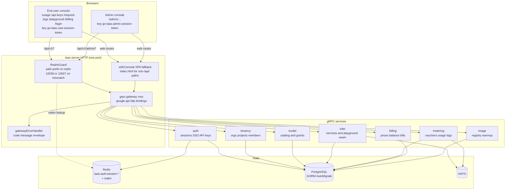
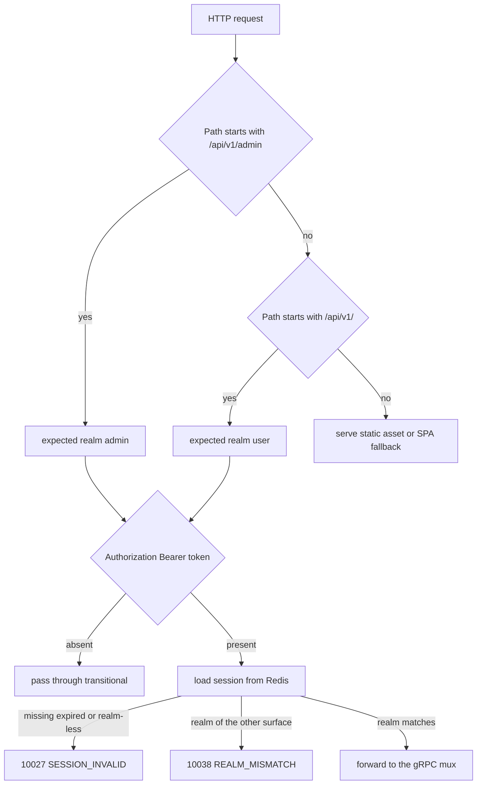
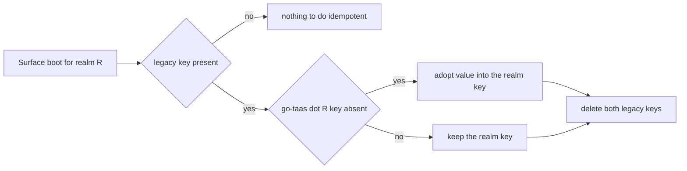
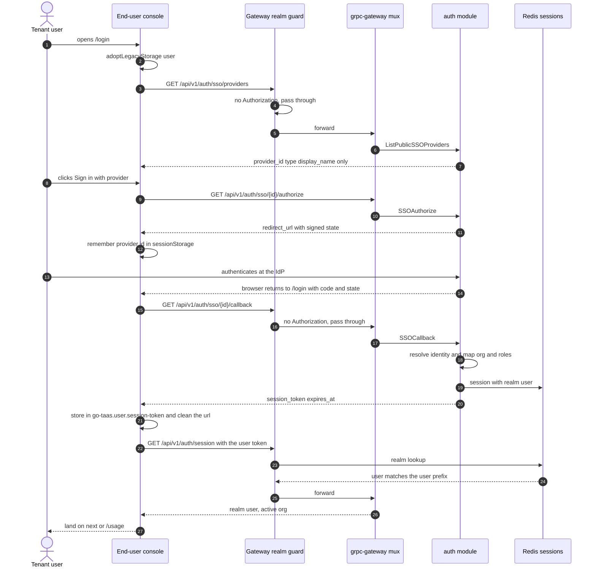
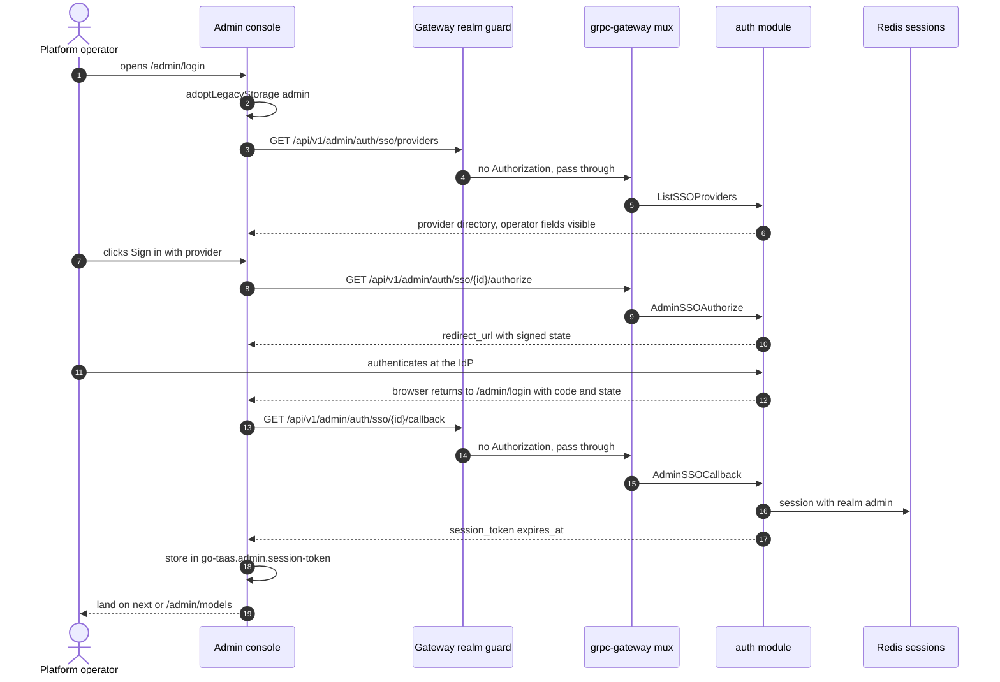
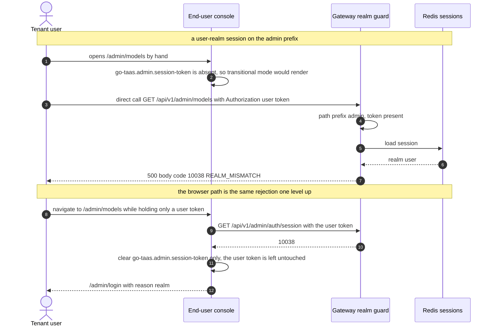
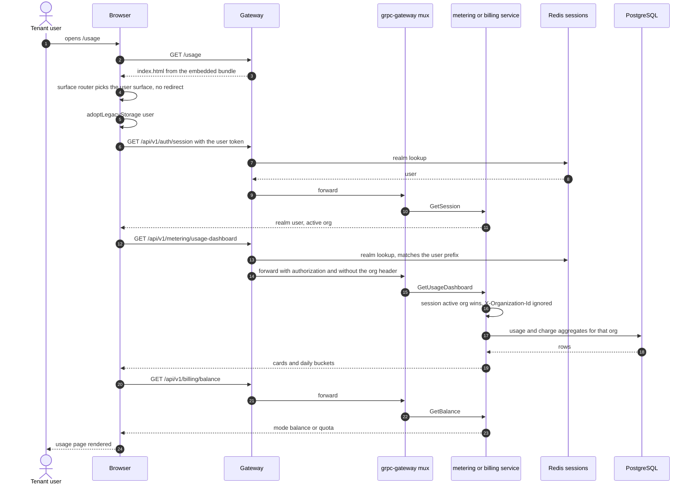

# Console Surface Separation (End-User Console and Admin Console) — Architecture and Detailed Design

| Attribute | Content |
| --- | --- |
| Feature point | Console surface separation — end-user console at `/` (API `/api/v1/*`) split out of the admin console at `/admin` (API `/api/v1/admin/*`), with independent, realm-pinned sessions (backlog row 17) |
| Document scope | Architecture and detailed design for feature-17: the two surface route trees and shells, the realm-pinned session model, the gateway realm guard, the exact `google.api.http` routing for every added / re-prefixed / dual-bound route, the browser storage model with legacy-key migration, the page → route → API-prefix mapping for both consoles, error handling, configuration, security, rollout, and a function-level task list per layer |
| Owning modules | `pkg/server` (gateway composition, realm guard, SPA fallback), `services/auth` (session realm, realm-pinned login bindings, public provider projection, admin session bindings), `services/model` (masked user-realm catalog), `services/infer` (model-based playground), `services/metering` + `services/billing` (user-prefix bindings, explicit organization filter), `web/` (both consoles), `pkg/errors` (10038) |
| Related documents | [Requirement Analysis and UI/UX Design](../design/console-surface-separation.md) · [Architecture Design](../design/architecture.md) §3.1 (Control Gateway) and §"Admin/user surface separation" · [SSO Federation & Account Binding](./sso-federation.md) (session issuance, `GetSession`, provider directory) · [Multi-Tenancy & Organization Isolation](./multi-tenancy.md) (the transitional `X-Organization-Id` identity) · [Organization Members, Roles & Invitations](./org-members-rbac.md) (`SessionResolver`, 10036) · [API Key Management](./api-key-management.md) · [Request Logs & API Playground](./request-logs-playground.md) (the two pages that move to the end-user console) · [Usage Dashboards & Per-Request Cost Attribution](./usage-dashboard.md) · [Balance (Prepaid) & Quota (Postpaid)](./balance-quota.md) · [Per-Tenant Model Authorization](./model-authorization.md) (the default-allow rule the masked user catalog reuses) |
| Status | Architecture complete, handed to the Developer agent |

---

## 1. Overview and Goals

go-taas ships one web console: `web/src/App.tsx` registers every route under `/admin/...`, `web/src/api.ts` keeps one session key (`go-taas.session-token`) and one `Authorization: Bearer` header for every page, and every page calls `/api/v1/admin/...`. Tenant self-service capabilities (own API keys, own usage, own request logs, playground, own bills) therefore live inside the operator's navigation tree, and a request cannot be attributed to a surface by its path prefix.

This feature splits the console into two surfaces with **independent sessions**, and makes the split enforceable by path prefix at every layer:

| Surface | Web routes | API prefix | Session realm |
| --- | --- | --- | --- |
| End-user console | `/usage`, `/api-keys`, `/request-logs`, `/playground`, `/billing`, `/login` | `/api/v1/*` | `user` |
| Admin console | `/admin/...` (16 routes, 3 of them redirects) | `/api/v1/admin/*` | `admin` |

**Goals**: two route trees and two shells in one bundle; realm-pinned sessions with separate browser storage; a new error code **10038 `REALM_MISMATCH`** for a session presented on the other realm's prefix; realm-pinned login bindings; user-prefix bindings for the tenant-self-service RPCs (with the admin bindings kept functional but deprecated); masked user-realm projections for the provider list and the model catalog; a model-based user playground; organization-wide variants of the admin Usage and Bills pages; the three moved pages plus client-side redirects from their old admin URLs; per-surface guards that turn a cross-realm or expired session into a redirect to the correct sign-in page; and preservation of transitional (session-less, `X-Organization-Id`) access so the CLI, the FVT suite and the twelve running e2e suites keep working.

**Non-goals**: first-party credential accounts (`Login` / `CreateUser` stay stubs); platform-administrator entitlement for the admin realm; requiring a session on `/api/v1/admin/*` (the transitional path stays, hardening is a follow-up row); retiring the deprecated admin-prefix bindings (migration window); a tenant-facing catalog or price page; self-service payments (#14); a surface switcher between the consoles; changing data-plane (inference gateway) behaviour; and any change to Postgres schema (Section 6).

### 1.1 Reading order of this document

Section 2 records the architecture decisions (including the three points where the architecture refines the UI/UX design, each with its rationale). Sections 3–5 are the component, routing and session model. Sections 6–8 are the data model, the frontend architecture and the key sequences. Sections 9–12 are error handling, configuration, security and rollout. Sections 13–15 are the acceptance-criteria traceability, the function-level detailed design and the ordered implementation task list.

---

## 2. Architecture Decisions

AD1–AD8 restate the UI/UX design's decisions as implementation-level rules. **AD9–AD11 are refinements** the architecture adds, each marked as such with the design decision it refines; they preserve the design's intent and are recorded here so the Developer and Test agents implement one reading.

| # | Decision | Rationale |
| --- | --- | --- |
| AD1 | **The surface is a pure function of the request path.** `/api/v1/admin/...` is the admin API surface, every other `/api/v1/...` path is the user API surface, `/admin/...` is the admin web surface, every other web path is the user web surface. No request parameter, header or cookie selects a surface | Design D1/D2/D8. A prefix-derived surface is auditable and cannot be spoofed by the caller. It is the single rule the router, the API client, the gateway guard and the static conformance check all use |
| AD2 | **Realm is a session property minted from the login route prefix and enforced at the gateway.** `Session.Realm ∈ {user, admin}` is set at issuance by the *binding* that completed the login, never by a request field. Enforcement is a gateway-level, prefix-scoped check (`RealmGuard`) that runs before the gRPC mux, so a wrong-realm session never reaches a handler | Design D3/D5. Enforcement at one seam keeps the twelve session-bearing RPCs free of per-RPC realm plumbing: after the guard, "a session is present" implies "its realm matches the prefix the request arrived on" |
| AD3 | **A wrong-realm session fails with 10038 `REALM_MISMATCH` on both prefixes**, carrying the ordinary unified error envelope. A realm-less session (minted before this feature) and any unknown/expired session fail with the existing 10027 `SESSION_INVALID`, as does a realm value outside the two known ones | Design D5. Three operator problems stay distinguishable: "sign in again" (10027), "you are signed in to the other console" (10038), "your role does not permit this" (10036). 10038 is the only new code in this feature |
| AD4 | **The realm guard treats a missing `Authorization` header as "no session" and passes the request through unchanged** | Design D6. This is exactly what keeps the CLI, FVT and the twelve e2e suites working: they never send a token, so nothing about them changes |
| AD5 | **Separate browser storage per realm, with a one-time absorb-and-delete migration of the legacy keys at boot** — `go-taas.user.session-token` / `go-taas.user.org-id` and `go-taas.admin.session-token` / `go-taas.admin.org-id`, and the pre-split `go-taas.session-token` / `go-taas.org-id` are adopted by the realm that boots first and then removed. No page ever reads a legacy key | Design D4 + FR2.5. "No page falls back to the legacy key" is satisfied by *reading* only realm keys; see AD9 for why the adoption (rather than a bare delete) is required |
| AD6 | **Tenant-self-service RPCs are dual-bound**, user path primary and admin path in `additional_bindings` marked deprecated; `GetSession` / `UpdateSessionOrg` / `Logout` keep the user path primary and gain the admin path; the masking-sensitive reads are **new RPCs with their own message types** | Design D7/D15/D16. Dual binding shares one handler, so it is used only where the response is surface-neutral. Where the payload must differ (provider directory, model catalog) a separate RPC with a separate, smaller message makes the mask structural instead of conditional |
| AD7 | **The three moved admin URLs are redirected by a pure path table evaluated before any surface, shell or API call** | Design D12/FR4.5. A redirect that ran inside `AdminShell` would first run the admin session guard (an API call) and could turn a bookmark into a login prompt |
| AD8 | **The user-realm model list and playground are new RPCs (`ListAvailableModels`, `PlaygroundModel`)**; the user playground is model-based and never names an inference service | Design D14/D15. The masked projection cannot leak `weight_path` or service identifiers if the wire type has no field for them; the tenant contract mirrors the OpenAI-compatible endpoint |
| AD9 | **REFINEMENT of design D4/FR2.5 — the legacy keys are *adopted* into the booting realm's keys and then deleted, not deleted outright.** `go-taas.session-token` → `go-taas.<realm>.session-token`, `go-taas.org-id` → `go-taas.<realm>.org-id`, each only when the realm key is absent; then both legacy keys are removed | Five running e2e suites seed `go-taas.org-id` immediately before navigating (`balanceQuota`, `orgMembersRbac`, `rateLimitsSpendLimits`, `requestLogsPlayground`, `usageDashboard`). A bare delete would drop those suites to `org-default` and fail AC23/AC15. Adoption preserves them while still satisfying "no page reads the legacy key". Adopting the legacy *token* deliberately produces one guard redirect with `reason=expired`, which is design D5's "forcing one re-login" and is what AC24's browser half observes |
| AD10 | **REFINEMENT of design §11/FR5.4 — "all organizations" is an explicit selector (`organization_id=*`), not the absence of the parameter.** Absence on an admin-prefix metering/billing read stays 10001 `UNAUTHORIZED` as it is today | The design's literal reading ("absent = all organizations") turns a forgotten header into a cross-tenant read on a shared API — a fail-open change, and a behaviour change that existing suites may assert. The capability the design requires (an "All organizations" option in the admin Usage/Bills filter, FR5.4) is fully delivered; only the wire spelling of "all" is explicit. Rejected alternative: absence means all |
| AD11 | **The masked user catalog and provider projection are separate RPCs on the same service** (`ListAvailableModels` in `taas.model.v1`, `ListPublicSSOProviders` in `taas.auth.v1`) rather than a per-request surface flag threaded through a shared handler | A "surface" metadata flag would have to be injected by the gateway and protected against a client-supplied `Grpc-Metadata-X-Taas-Surface` header — a spoofing surface for no benefit. Distinct messages are checkable by the compiler and by `GetPublicSurface`-style review |
| AD12 | **REFINEMENT of design AC8 — the browser half of "sessions do not cross over" is observed on the realm that owns the token, not across realms.** `UserShell` and `AdminShell` run their session guard only when **their own** key is non-empty (design FR4.1, D4), so a user token sitting in the browser cannot make the admin console redirect: the admin console stays in transitional mode and never reads that key. AC8 is therefore verified as two observable facts: (a) with only a bogus `go-taas.user.session-token` seeded, the admin console renders in transitional mode, the seeded value is byte-identical and `go-taas.admin.session-token` is absent; (b) with a bogus `go-taas.admin.session-token` seeded, the admin console redirects to `/admin/login` with `reason=expired`, that key is cleared, and a seeded user token is byte-identical | The design's literal AC8 ("a seeded user token ⇒ the admin shell redirects to `/admin/login`") is unsatisfiable together with D4 ("no key is read by both surfaces") and FR4.1 ("validate only when its own token key is non-empty"): producing that redirect requires the admin shell to read the user realm's key. Both alternatives were rejected — reading the other key breaks D4 outright, and a presence-only cross-read is still a cross-realm read and makes D4 unassertable. The reformulated pair proves the same property in both directions (a credential of one realm is never used by, and never touched by, the other) and is directly testable in Nightwatch |

---

## 3. Component View

### 3.1 Ownership

| Layer / component | Owns | Changes in this feature |
| --- | --- | --- |
| **Static bundle (SPA)** | One Vite bundle (`web/dist`), embedded into `taas-server` at `pkg/server/console/`; served by the gateway's SPA fallback | Two route trees, two shells, a realm-scoped API client, the legacy-key migration, the redirect table |
| **Gateway (`pkg/server`)** | HTTP composition: `RealmGuard` → `withConsole` → `runtime.ServeMux`; the incoming header matcher (`X-Organization-Id`); the unified error renderer; the SPA fallback that serves `index.html` for every non-`/api/` path | New `RealmGuard` + `SessionRealmResolver` seam + service-registration wiring; no change to the fallback (it already serves `/admin/...`) |
| **grpc-gateway mux** | Path → RPC routing from `google.api.http` annotations | New bindings for 5 new RPCs and 14 existing RPCs (Section 5) |
| **`auth`** | Users, SSO providers, identity bindings, API keys, Redis sessions, session identity for other services | Session `realm`; realm-pinned login bindings; `ListPublicSSOProviders`; `SessionRealm`; `SessionActiveOrg` seam implementation; `CreateSessionForTest` unchanged |
| **`tenancy`** | Organizations, projects, members, invitations, `OrgGuard`, `MembershipResolver`, `SessionResolver` | Unchanged |
| **`model`** | Model catalog, versions, weight paths, tenant authorization grants | `ListAvailableModels` (masked, user realm, default-allow rule) |
| **`infer`** | Inference-service lifecycle, endpoints, change publication, the playground proxy seam | `PlaygroundModel` (model-based tenant playground) |
| **`metering`** | Metering events, vouchers, usage records, usage summary/dashboard, request logs | User-prefix bindings; session-derived organization; explicit admin organization filter + `group_by=organization` |
| **`billing`** | Prices, balances, bills, charges, accounts | User-prefix bindings for balance/bills/charges; explicit admin organization filter |
| **`image`**, `internal/controller` | Image registry, warmup; Kubernetes reconciliation | Unchanged (admin surface only) |
| **`pkg/errors`** | Code blocks per module | One new auth code: **10038 `CodeRealmMismatch`** |

### 3.2 Runtime component view



### 3.3 Request identity chain

There is no per-RPC authentication interceptor chain in this codebase; identity is resolved inside the handlers from gRPC metadata that the gateway forwards. The chain is therefore:

1. `RealmGuard` (HTTP, `pkg/server/realm.go`) — path prefix decides the expected realm. With no `Authorization` header: pass through (transitional, AD4). With a header: resolve the session realm from Redis; mismatch → 10038, unknown/expired/realm-less → 10027. Nothing else is inspected.
2. grpc-gateway mux — routes by the annotated path and forwards `authorization` (grpc-gateway passes the `Authorization` header through unprefixed for backwards compatibility) and `x-organization-id` (the custom `incomingHeaderMatcher`).
3. Service handler — for a session-bearing call, `SessionActiveOrg` (implemented by `auth`) makes the session's active organization authoritative and ignores `X-Organization-Id`; without a session, `resolveOrganizationID` reads the transitional header and returns 10001 when it is absent or empty.
4. `tenancy.RoleGuard` — unchanged, and still the only role enforcement (member and invitation administration, 10036).

Because step 1 already rejected the wrong realm, no handler needs to know which binding it was reached through: `GetSession` returns `realm` and is reached only by a session of its own realm.

---

## 4. Session and Realm Architecture

### 4.1 Session model

`auth.Session` (Redis hash `taas:auth:session:<session_id>`) gains one field:

| Redis hash field | Type | Meaning |
| --- | --- | --- |
| `realm` | string | `user` or `admin`. Empty for a session minted before this feature (or by a caller that does not set it) — which is exactly the 10027 case of AD3 |

`Session` (Go) gains `Realm string \`json:"realm"\``, and `SessionStore.Create` writes the field like the others. `GetSessionResponse` gains `string realm = 8` so the browser can show which realm it is in, and so a caller can assert realm pinning (AC10).

A realm value outside `{user, admin}` (including empty) is **not** a third realm: `SessionRealm` normalises it to 10027. Realm is an audience marker, not an authorization grant — what a session may *do* is still governed by the existing organization roles (`tenancy.RoleGuard`).

### 4.2 Where the realm comes from

| Login route (binding) | Realm minted | Handler |
| --- | --- | --- |
| `GET /api/v1/auth/sso/{provider_id}/callback` | `user` | `SSOCallback` → `ssoCallback(ctx, req, RealmUser)` |
| `GET /api/v1/admin/auth/sso/{provider_id}/callback` | `admin` | `AdminSSOCallback` → `ssoCallback(ctx, req, RealmAdmin)` |

The realm is derived from the **binding**, i.e. from the HTTP path the browser completed the flow on. There is no request field that selects a realm (design D3): `SSOCallbackRequest` is unchanged and carries no realm. `AdminSSOAuthorize` / `AdminSSOCallback` are new RPCs (AD11/Section 5) precisely so that each binding's handler knows its realm without a spoofable marker.

The signed `state` format is unchanged (`<random>.<hmac>`), so `SSOAuthorize`/`SSOCallback` and the existing FVT flow are untouched. Binding the realm into the signed state is recorded as the follow-up hardening item in Section 11 (Security), because a realm carries no privilege today.

### 4.3 Enforcement: the gateway realm guard

```go
// pkg/server/realm.go
const (
    surfaceUser  = "user"
    surfaceAdmin = "admin"
)

// surfaceForPath maps a request path to its surface. The empty string
// means "not an API surface" (static assets, SPA routes).
func surfaceForPath(path string) string {
    if path == "/api/v1/admin" || strings.HasPrefix(path, "/api/v1/admin/") {
        return surfaceAdmin
    }
    if strings.HasPrefix(path, "/api/v1/") {
        return surfaceUser
    }
    return ""
}

// SessionRealmResolver resolves a session token to its realm.
type SessionRealmResolver interface {
    SessionRealm(ctx context.Context, token string) (string, error)
}

func RealmGuard(next http.Handler, resolver SessionRealmResolver) http.Handler
```

Behaviour, in order:

| Condition | Result |
| --- | --- |
| `surfaceForPath` is empty | call `next` — static assets and web routes are public |
| no `Authorization` header, or the value is not `Bearer <token>` with a non-empty token | call `next` — transitional access (AD4, design D6) |
| resolver not wired (unit tests, API-only gateways) | call `next`, and log a warning once at startup |
| session not found, expired, or its realm is empty/unknown | `500` with body `{"code":10027,"message":"<session invalid>"}` |
| session realm ≠ surface realm | `500` with body `{"code":10038,"message":"<realm mismatch>"}` |
| session realm = surface realm | call `next` |

The HTTP status is `500` and the `code` lives in the body, matching every other business error in this platform: the gRPC status code *is* the business code (`pkg/grpcmiddleware`), and grpc-gateway's `DefaultHTTPErrorHandler` maps a non-HTTP code to 500 while copying the code into the JSON body. Clients branch on the body `code` (as `web/src/api.ts` already does), never on the status.

The guard is mounted outside the console handler, so unsupported methods, unknown paths and static assets are unaffected:

```go
Handler: RealmGuard(withConsole(s.gatewayMux), resolver)
```

Cost: one Redis `HGETALL` per request that carries a session; requests without a token (every transitional caller, including the CLI and the suites) pay nothing. No cache is introduced, because the guard is on the control plane only.

Wiring: `pkg/server` collects a `RealmResolver` (`SessionRealm`) from the registered services in the same loop that already collects `Migrator`; `auth.Service` implements it. Production wires it; a gateway built without it behaves exactly as before the feature.

### 4.4 Realm decision, end to end



### 4.5 Transitional session-less access

Preserved byte-for-byte on both prefixes (design D6, FR5.1):

- No `Authorization` header ⇒ the guard passes the request through; handlers resolve the organization from `X-Organization-Id` exactly as today (`resolveOrganizationID`, 10001 when absent).
- The browser still sends `X-Organization-Id` **only when its own realm's token key is empty** (existing `api.ts` behaviour, now realm-scoped), so a signed-in console never mixes the two identities.
- With a session present, `X-Organization-Id` is ignored and the session's active organization wins (`SessionActiveOrg`), so a user-realm page cannot be pointed at another organization from the browser (AC18).
- Requiring a session on `/api/v1/admin/*` is a follow-up row, not part of this feature.

### 4.6 Browser storage and the legacy-key migration

| Key | Written by | Read by | Contents |
| --- | --- | --- | --- |
| `go-taas.user.session-token` | `/login` after a successful callback | user shell, user pages | user-realm session id, sent as `Authorization: Bearer` on `/api/v1/*` |
| `go-taas.user.org-id` | user shell organization selector | user shell, user pages | active organization for transitional mode |
| `go-taas.admin.session-token` | `/admin/login` after a successful callback | admin shell, admin pages | admin-realm session id, sent on `/api/v1/admin/*` |
| `go-taas.admin.org-id` | admin shell organization selector | admin shell, admin pages | working organization for org-scoped admin pages |
| `go-taas.user.sso-provider` / `go-taas.admin.sso-provider` (sessionStorage) | login pages | login pages | provider id pending an IdP redirect |
| `go-taas.session-token`, `go-taas.org-id` (legacy) | nobody | nobody | **adopted then deleted on boot** (AD9) |

Migration algorithm, executed synchronously once per surface boot, before the first render:

```ts
// web/src/surface.tsx
export function adoptLegacyStorage(realm: Realm): void {
  const map: [string, string][] = [
    ['go-taas.session-token', tokenKey(realm)],
    ['go-taas.org-id',        orgKey(realm)],
  ];
  for (const [legacy, target] of map) {
    const value = localStorage.getItem(legacy);
    if (value && !localStorage.getItem(target)) localStorage.setItem(target, value);
    localStorage.removeItem(legacy);
  }
}
```



Consequences, all intended:

- A pre-split browser keeps its organization context in whichever console boots first; the other realm starts from the seeded default (`org-default`) until the selector is used. The legacy state was single-valued, so no information is lost that could be preserved.
- A pre-split **session** token is adopted into the realm key, and the guard then answers 10027 (realm-less) → one redirect to `/login?reason=expired`. This is design D5's "one re-login" and is what makes AC24's browser half observable.
- `test/e2e/page-objects/api.js:ssoLogin` writes the legacy key. It has no callers today, so nothing breaks; if a suite starts using it, it must write `go-taas.<realm>.session-token` instead (Test-agent follow-up, Section 12).

---

## 5. Gateway Routing

### 5.1 Static fallback and redirects

**Static fallback** — unchanged and already correct: `pkg/server/console.go` serves a real file when it exists and otherwise `index.html` for every path that does not start with `/api/`, so `/usage`, `/playground`, `/admin/usage` and deep links inside both trees all boot the SPA. No server route table is added for the web surfaces; both route trees are client-side (Section 7).

**Client-side redirects** — evaluated by the surface router before any shell or API call (AD7):

| From | To | Note |
| --- | --- | --- |
| `/` | `/usage` | was `/` → `/admin` |
| `/admin` | `/admin/models` | unchanged |
| `/admin/api-keys` | `/api-keys` | moved page (design D12) |
| `/admin/request-logs` | `/request-logs` | moved page |
| `/admin/playground` | `/playground` | moved page, now model-based |
| any other non-admin path | rendered inside `UserShell` (404) | design D17 |
| any other `/admin/...` path | rendered inside `AdminShell` (404) | design D17 |

Redirects use `history.replaceState` (a new `replace()` in `web/src/router.tsx`) so a bookmark does not create a back-button loop, and they carry no token or organization value.

### 5.2 Exact `google.api.http` annotations

Status legend: **new** = a new RPC, **dual** = the existing binding stays, the other prefix is added via `additional_bindings`, **deprecated** = the admin-prefix binding is kept for the migration window and marked deprecated in the proto comment.

#### `proto/taas/auth/v1/auth.proto`

| RPC | Method + path (canonical) | Change |
| --- | --- | --- |
| `ListAPIKeys` | `GET /api/v1/auth/api-keys` | **dual** — `/api/v1/admin/auth/api-keys` becomes `additional_bindings` + deprecated |
| `CreateAPIKey` | `POST /api/v1/auth/api-keys` (body `*`) | **dual** — admin path deprecated |
| `RevokeAPIKey` | `POST /api/v1/auth/api-keys/{key_id}:revoke` (body `*`) | **dual** — admin path deprecated |
| `UpdateAPIKey` | `PUT /api/v1/auth/api-keys/{key_id}` (body `*`) | **dual** — admin path deprecated |
| `GetSession` | `GET /api/v1/auth/session` | **dual** — `GET /api/v1/admin/auth/session` added (**new** binding, admin realm) |
| `UpdateSessionOrg` | `POST /api/v1/auth/session/org` (body `*`) | **dual** — `POST /api/v1/admin/auth/session/org` added |
| `Logout` | `POST /api/v1/auth/logout` (body `*`) | **dual** — `POST /api/v1/admin/auth/logout` added |
| `ListPublicSSOProviders` | `GET /api/v1/auth/sso/providers` | **new RPC**, anonymous, masked projection |
| `SSOAuthorize` | `GET /api/v1/auth/sso/{provider_id}/authorize` | unchanged, mints realm `user` |
| `SSOCallback` | `GET /api/v1/auth/sso/{provider_id}/callback` | unchanged, mints realm `user` |
| `AdminSSOAuthorize` | `GET /api/v1/admin/auth/sso/{provider_id}/authorize` | **new RPC** |
| `AdminSSOCallback` | `GET /api/v1/admin/auth/sso/{provider_id}/callback` | **new RPC**, mints realm `admin` |
| `ListSSOProviders`, `GetSSOProvider`, `Create/Update/Enable/Disable/DeleteSSOProvider`, identity bindings | `/api/v1/admin/auth/...` | unchanged (admin surface) |
| `CreateUser`, `Login` | `/api/v1/auth/users`, `/api/v1/auth/login` | unchanged (still stubs) |

Exact syntax for the two shapes used:

```proto
  // ListAPIKeys returns the API keys of the caller's organization.
  // User-surface API: served under /api/v1; the session's active org
  // wins and X-Organization-Id is ignored (feature-17 AD6).
  rpc ListAPIKeys(ListAPIKeysRequest) returns (ListAPIKeysResponse) {
    option (google.api.http) = {
      get: "/api/v1/auth/api-keys"
      additional_bindings {
        // Deprecated (console-surface-separation): kept functional for
        // the transitional migration window.
        get: "/api/v1/admin/auth/api-keys"
      }
    };
  }

  // GetSession returns the current session of the realm the request
  // arrived on (user realm on this binding, admin realm on the
  // additional binding, enforced by the gateway realm guard).
  rpc GetSession(GetSessionRequest) returns (GetSessionResponse) {
    option (google.api.http) = {
      get: "/api/v1/auth/session"
      additional_bindings { get: "/api/v1/admin/auth/session" }
    };
  }
```

#### `proto/taas/model/v1/model.proto`

| RPC | Method + path | Change |
| --- | --- | --- |
| `ListAvailableModels` | `GET /api/v1/models` | **new RPC** — masked user-realm catalog (`AvailableModel{model_id, name, latest_version}`) |
| `RegisterModel`, `ListModels`, `GetModel`, `DeleteModel`, `GrantModelAccess`, `RevokeModelAccess`, `ListModelAuthorizations` | `/api/v1/admin/models...` | unchanged (admin surface) |

#### `proto/taas/infer/v1/infer.proto`

| RPC | Method + path | Change |
| --- | --- | --- |
| `PlaygroundModel` | `POST /api/v1/models/{model_id}:playground` (body `*`) | **new RPC** on `InferServiceService` — model-based tenant playground |
| `CreateInferenceService`, `ListInferenceServices`, `GetInferenceService`, `ScaleInferenceService`, `DeleteInferenceService`, `PlaygroundInfer` | `/api/v1/admin/inference-services...` | unchanged; `PlaygroundInfer` keeps working for the CLI and tests but has no console page after this feature |

`PlaygroundModel` lives in the `infer` service because resolving a ready inference service for a model and proxying the prompt to the data plane is orchestration; the *path* follows the tenant's model-centric contract because grpc-gateway maps paths, not proto packages.

#### `proto/taas/metering/v1/metering.proto`

| RPC | Method + path (canonical) | Change |
| --- | --- | --- |
| `GetUsageSummary` | `GET /api/v1/metering/usage-summary` | **dual** — `/api/v1/admin/metering/usage-summary` becomes additional + deprecated |
| `GetUsageDashboard` | `GET /api/v1/metering/usage-dashboard` | **dual** — admin path deprecated; `group_by` gains `organization` on the admin binding |
| `ListVouchers` | `GET /api/v1/metering/vouchers` | **dual** — admin path deprecated |
| `ListRequestLogs` | `GET /api/v1/metering/request-logs` | **dual** — admin path deprecated |
| `GetVoucher`, `GetRequestLog`, `ListUsageRecords`, `IngestMeteringEvent` | `/api/v1/admin/metering/...` | unchanged (operator/diagnostic surfaces) |

#### `proto/taas/billing/v1/billing.proto`

| RPC | Method + path (canonical) | Change |
| --- | --- | --- |
| `GetBalance` | `GET /api/v1/billing/balance` | **dual** — `/api/v1/admin/billing/balance` becomes additional + deprecated |
| `ListBills` | `GET /api/v1/billing/bills` | **dual** — admin path deprecated; `BillSummary.organization_id` already exists (no field change) |
| `ListCharges` | `GET /api/v1/billing/charges` | **dual** — admin path deprecated |
| `SetPrice`, `ListPrices`, `CreateAccount`, `ListAccounts`, `GetAccount`, `UpdateAccount`, `Recharge`, `Refund`, `ListTransactions` | `/api/v1/admin/billing/...` | unchanged (admin surface) |

No metering or billing **message** changes are required: the organization parameter already exists as `organization_id` on `GetUsageSummaryRequest`, `GetUsageDashboardRequest`, `ListVouchersRequest`, `GetBalanceRequest`, `ListBillsRequest` and `ListChargesRequest`, and `BillSummary`/`ChargeRecordSummary`/`VoucherSummary` already carry `organization_id`. Only the annotations and the parameter semantics change.

### 5.3 Surface rules the routing must satisfy

1. No admin capability is reachable on `/api/v1/*`, and no tenant-self-service capability is defined only on `/api/v1/admin/*` (dual bindings make the user prefix canonical).
2. Every session-bearing route on a prefix requires that prefix's realm (AD2/AD3).
3. The anonymous routes are exactly: `/api/v1/auth/sso/providers` (new), `/api/v1/auth/sso/{id}/authorize|callback`, `/api/v1/admin/auth/sso/providers`, `/api/v1/admin/auth/sso/{id}/authorize|callback`, `/api/v1/auth/login`, `/api/v1/auth/users`. They are reachable without a token, and they mint or list, never act.
4. `GET /api/v1/models` (masked) and `POST /api/v1/models/{model_id}:playground` are user-realm; the admin catalog keeps `/api/v1/admin/models...`.

---

## 6. Data Model

### 6.1 No Postgres change

This feature adds **no table, no column, no index and no constraint**. The realm lives in the Redis session hash (`taas:auth:session:<id>` field `realm`, Section 4.1), which is a runtime cache with a TTL, not a durable table: sessions are created and expired at runtime and are never migrated (the same reasoning as `docs/architecture/sso-federation.md` §3.6).

The organization filter, the masked catalog and the playground introduce no persistence: they are query-time projections over existing tables (`organizations`, `models`, `model_authorizations`, `vouchers`, `request_logs`, `bills`, `charge_records`).

### 6.2 Init-SQL / upgrade path (developer constraint 15)

Constraint 15 ("if database tables change, add upgrade support to the init SQL scripts") is satisfied **vacuously and explicitly**: this repository keeps **no hand-written DDL and no init SQL scripts** — GORM `AutoMigrate` is the single source of truth for the schema, invoked through the `Migrator` hook in `pkg/server` (`pkg/server/server.go`, `Migrator` doc comment: "The GORM model is the single source of truth for the schema (AutoMigrate), so no hand-written DDL is kept"; see also `docs/architecture/api-key-management.md` §3.3). Because this feature changes no GORM model, there is nothing to add to any SQL script and the ORM-model-versus-DDL consistency invariant is not exercised. If a future row needs a column, the path is: add it to the GORM model, let `AutoMigrate` apply it at startup, and update the model-versus-DDL consistency test if such a test is introduced.

### 6.3 Redis session compatibility

| Session stored before the upgrade | After the upgrade |
| --- | --- |
| hash without `realm` | `Get` returns the session with `Realm == ""`; `SessionRealm` maps it to nothing valid, the guard answers **10027**, the shell clears its own key and redirects to its realm's login page (AC24). No manual cleanup is needed: keys expire after `sessionTTL` (24 h) |

So the upgrade is a rolling restart with no data migration and a single forced re-login for browsers holding a pre-split session.

---

## 7. Frontend Architecture

### 7.1 Module plan

| Concern | File | Notes |
| --- | --- | --- |
| Realm type, storage keys, realm-scoped API client | `web/src/api.ts` (rewritten) | `Realm`, `tokenKey`, `orgKey`, `apiPrefix`, `createApi(realm)`; the client **refuses** a path whose prefix does not belong to its realm (runtime mirror of AC6), sets `Authorization` from its own key or `X-Organization-Id` from its own org key |
| Surface context, legacy adoption | `web/src/surface.tsx` (new) | `SurfaceProvider({realm})`, `useApi()`, `useRealm()`, `adoptLegacyStorage(realm)` |
| Pure routing rules | `web/src/surface-routes.ts` (new) | `surfaceForPath`, `MOVED_ADMIN_ROUTES`, `realmHome`, `realmLoginPath`, `isAllowedNext(realm, next)` |
| Surface router, route trees | `web/src/App.tsx` (rewritten) | `App` → `SurfaceRouter` (redirects, then surface choice) → `UserSurface` / `AdminSurface` |
| Shells | `web/src/shells/UserShell.tsx`, `web/src/shells/AdminShell.tsx` (new) | each owns its realm, its navigation array, its guard and its test ids; shared presentation only (`ShellChrome`) |
| Org context | `web/src/org.tsx` (rewritten) | `OrgProvider({realm})`, realm-keyed storage, realm-scoped session route, user-realm selector disabled in transitional mode |
| Shared components | `web/src/components.tsx`, `web/src/components/*` | unchanged except `BalanceWidget` taking the client from `useApi()` |
| End-user pages | `web/src/pages/user/*.tsx` (new directory) | 5 pages + the user login page, all calling `/api/v1/*` |
| Admin pages | `web/src/pages/*.tsx` (in place) | adapted to the realm-scoped client, admin prefix, and the new admin variants of Usage/Bills; the 3 moved pages leave the tree |
| Router | `web/src/router.tsx` | add `replace(path)` (`history.replaceState` + emit); everything else unchanged |

Keeping the fifteen admin pages where they are (rather than relocating them into `pages/admin/`) keeps the diff and the merge risk with concurrent work low while still giving the static conformance check (AC6) a precise, documented scope: `web/src/pages/user/**` plus `web/src/shells/UserShell.tsx` are the user-realm sources, `web/src/pages/*.tsx` plus `web/src/shells/AdminShell.tsx` are the admin-realm sources.

### 7.2 End-user console: page → route → API

| Route | Component | Purpose | API prefix (exact calls) |
| --- | --- | --- | --- |
| `/` | redirect | → `/usage` | — |
| `/login` | `pages/user/UserLoginPage.tsx` (shell-less) | realm-pinned sign-in | `GET /api/v1/auth/sso/providers`, `GET /api/v1/auth/sso/{id}/authorize`, `GET /api/v1/auth/sso/{id}/callback`, `GET /api/v1/auth/session` |
| `/usage` | `pages/user/UsagePage.tsx` | own usage, cost, balance | `GET /api/v1/metering/usage-summary`, `GET /api/v1/metering/usage-dashboard`, `GET /api/v1/metering/vouchers`, `GET /api/v1/billing/balance` |
| `/api-keys` | `pages/user/ApiKeysPage.tsx` | own API keys | `GET|POST /api/v1/auth/api-keys`, `PUT /api/v1/auth/api-keys/{key_id}`, `POST /api/v1/auth/api-keys/{key_id}:revoke` |
| `/request-logs` | `pages/user/RequestLogsPage.tsx` | own request logs | `GET /api/v1/metering/request-logs`, `GET /api/v1/auth/api-keys?page.limit=100`, `GET /api/v1/models` |
| `/playground` | `pages/user/PlaygroundPage.tsx` | model-based playground | `GET /api/v1/models`, `GET /api/v1/auth/api-keys?page.limit=100&active_only=true`, `POST /api/v1/models/{model_id}:playground` |
| `/billing` | `pages/user/BillsPage.tsx` | own bills (read-only) | `GET /api/v1/billing/bills`, `GET /api/v1/billing/charges` |
| anything else | `pages/NotFoundPage.tsx` inside `UserShell` | 404 | none |

Shell auxiliaries: `GET /api/v1/auth/session` on boot (only when the user token key is non-empty), `POST /api/v1/auth/session/org` on an organization switch, `POST /api/v1/auth/logout` on sign-out.

### 7.3 Admin console: page → route → API

| Route | Component | API prefix |
| --- | --- | --- |
| `/admin` | redirect → `/admin/models` | — |
| `/admin/login` | `pages/AdminLoginPage.tsx` (shell-less) | `GET /api/v1/admin/auth/sso/providers`, `GET /api/v1/admin/auth/sso/{id}/authorize|callback`, `GET /api/v1/admin/auth/session` |
| `/admin/organizations` | `pages/OrganizationsPage.tsx` | `/api/v1/admin/tenancy/organizations...` |
| `/admin/projects` | `pages/ProjectsPage.tsx` | `/api/v1/admin/tenancy/projects...` |
| `/admin/members` | `pages/MembersPage.tsx` | `/api/v1/admin/tenancy/organizations/{org_id}/members...` |
| `/admin/invitations` | `pages/InvitationsPage.tsx` | `/api/v1/admin/tenancy/...invitations...` |
| `/admin/sso` | `pages/SSOProvidersPage.tsx` | `/api/v1/admin/auth/sso/providers...` |
| `/admin/identity-bindings` | `pages/IdentityBindingsPage.tsx` | `/api/v1/admin/auth/identity-bindings...` |
| `/admin/models`, `/admin/models/:id` | `pages/ModelsPage.tsx`, `pages/ModelDetailPage.tsx` | `/api/v1/admin/models...` |
| `/admin/images`, `/admin/images/:id` | `pages/ImagesPage.tsx`, `pages/ImageDetailPage.tsx` | `/api/v1/admin/images...` |
| `/admin/inference-services`, `/admin/inference-services/:id` | `pages/InferenceServicesPage.tsx`, `pages/ServiceDetailPage.tsx` | `/api/v1/admin/inference-services...` |
| `/admin/usage` | `pages/UsagePage.tsx` (admin variant: `admin-org-filter` with All organizations, four group-by dimensions) | `/api/v1/admin/metering/*`, `/api/v1/admin/billing/balance` |
| `/admin/billing` | `pages/BillsPage.tsx` (admin variant: Organization column + filter) | `/api/v1/admin/billing/bills`, `/api/v1/admin/billing/charges` |
| `/admin/billing/accounts` | `pages/AccountsPage.tsx` | `/api/v1/admin/billing/accounts...` |
| `/admin/pricing` | `pages/PricingPage.tsx` | `/api/v1/admin/billing/prices` |
| `/admin/api-keys` | redirect → `/api-keys` | — |
| `/admin/request-logs` | redirect → `/request-logs` | — |
| `/admin/playground` | redirect → `/playground` | — |
| anything else | `pages/NotFoundPage.tsx` inside `AdminShell` | none |

Navigation arrays: user `user-nav-{usage, api-keys, request-logs, playground, billing}` (5 items, no `/admin` link of any kind); admin `nav-{organizations, projects, members, invitations, sso-providers, identity-bindings, models, inference-services, images, usage, pricing, bills, accounts}` (13 items). `nav-api-keys`, `nav-request-logs` and `nav-playground` must not exist anywhere.

### 7.4 Route registration in `web/src/App.tsx`

```tsx
export default function App() {
  return <SurfaceRouter />;
}

function SurfaceRouter() {
  const path = useRoute();               // subscribes to navigate() and popstate
  const moved = MOVED_ADMIN_ROUTES[path]; // pure table, evaluated first (AD7)
  if (moved) return <Redirect to={moved} />;
  if (path === '/') return <Redirect to={realmHome('user')} />;
  if (path === '/admin') return <Redirect to={realmHome('admin')} />;
  return isAdminPath(path) ? <AdminSurface path={path} /> : <UserSurface path={path} />;
}

function UserSurface({ path }: { path: string }) {
  adoptLegacyStorage('user');            // synchronous, idempotent, before first render
  return (
    <SurfaceProvider realm="user">
      {path === '/login' ? <UserLoginPage /> : <UserShell><UserRoutes /></UserShell>}
    </SurfaceProvider>
  );
}
```

`AdminSurface` mirrors it with realm `admin`, `/admin/login` and `AdminRoutes`. `UserRoutes` / `AdminRoutes` are separate `<Routes>` trees, each ending in `path="*"` (the existing router matches the first child whose segment count and literals match and treats `path="*"` as the fallback, so the catch-all must stay last). The login routes are the two documented shell-less exceptions: they must not render authenticated chrome, and their only session call is the `already signed in` check (FR3.5).

### 7.5 Per-surface auth guard

| Step | `UserShell` | `AdminShell` |
| --- | --- | --- |
| boot | read `go-taas.user.session-token` | read `go-taas.admin.session-token` |
| token empty | transitional mode: render the pages, `X-Organization-Id` from `go-taas.user.org-id`, notice `user-console-transitional-banner` | same with `go-taas.admin.org-id` and `admin-console-transitional-banner` |
| token present | `GET /api/v1/auth/session` | `GET /api/v1/admin/auth/session` |
| success | render; the session's `activeOrg` becomes the org context | render |
| failure 10027 | clear the user token only, redirect `/login?next=<path>&reason=expired` | clear the admin token only, redirect `/admin/login?next=<path>&reason=expired` |
| failure 10038 | clear the user token only, redirect `/login?next=<path>&reason=realm` | clear the admin token only, redirect `/admin/login?next=<path>&reason=realm` |
| other failure | keep the token, render the page-level error banner; the guard never guesses | same |

The other realm's key is never read, written, cleared or echoed. `next` is validated (`isAllowedNext`): for the user realm it must be a non-`/admin` path, for the admin realm it must start with `/admin`; otherwise it is dropped and the realm home is used. The login page shows the notice (`signin-notice`) mapped from `reason`.

### 7.6 `data-testid` hooks the Test agent can drive

Shells and guards: `user-shell`, `admin-shell` (plus the existing `sidebar`), `user-nav-usage`, `user-nav-api-keys`, `user-nav-request-logs`, `user-nav-playground`, `user-nav-billing`, `nav-*` (13 admin items), `user-console-transitional-banner`, `admin-console-transitional-banner`, `signin-notice`, `user-account-block`, `user-menu-logout`, `org-switcher-select`, `org-switcher-notice`, `admin-org-filter`, `not-found-home`.

User login: `sso-login-list`, `sso-login-{provider_id}`, `login-loading`, `login-no-providers`, `login-error`, `login-signing-in`, `ldap-username`, `ldap-password`, `ldap-submit`.

User pages: `usage-balance-widget`, `usage-dashboard-cards`, `usage-metric-toggle`, `usage-groupby-select`, `usage-export-csv`, `usage-table`, `usage-empty`, `usage-unpriced-badge`; `create-api-key`, `api-keys-table`, `api-keys-empty`, `api-keys-endpoint-copy`, `api-keys-filter-status`, `create-dialog`, `key-name-input`, `key-expiry-select`, `rate-limit-rpm`, `rate-limit-tpm`, `created-dialog`, `created-secret`, `created-copy`, `created-confirm`, `edit-dialog`, `revoke-dialog`; `request-log-filters`, `request-log-range-24h`, `request-log-range-7d`, `request-log-range-30d`, `request-log-filter-status`, `request-log-filter-key`, `request-log-filter-model`, `request-log-clear-filters`, `request-logs-table`, `request-logs-empty`, `request-log-detail-{request_log_id}`; `playground-model-select`, `playground-key-select`, `playground-prompt-input`, `playground-temperature`, `playground-max-tokens`, `playground-send`, `playground-response`, `playground-copy-curl`, `playground-no-models`, `playground-no-keys`; `bills-table`, `bills-empty`, `bill-charges-{bill_id}`.

Preserved from today (the tests and the admin pages depend on them): `models-table`, `sso-providers-table`, `create-sso-provider`, `create-identity-binding`, `identity-bindings-table`, `identity-bindings-empty`, `create-account-button`, `accounts-table`, `accounts-empty`, `usage-dashboard-cards`, `usage-chart`, `usage-metric-cost|tokens|requests`, `usage-balance-widget`.

The one id that changes by design is the playground's service selector: the user page offers a **model** selector (`playground-model-select`), the old `playground-service-select` no longer exists (Section 12, risk R1).

---

## 8. Sequence Diagrams

### 8.1 User login (realm `user`)



### 8.2 Admin login (realm `admin`)



### 8.3 Wrong-realm request rejection



### 8.4 End-user page load through the gateway



---

## 9. Error Handling

### 9.1 Codes

| Condition | Code | Constant | Where produced |
| --- | --- | --- | --- |
| A session of the other realm is presented on this prefix | **10038** | `CodeRealmMismatch` (**new**) | gateway realm guard |
| No session, unknown session, expired session, realm-less session, realm value outside the two known ones | 10027 | `CodeSessionInvalid` | gateway realm guard, session handlers |
| Missing or empty `X-Organization-Id` on a transitional call that needs an organization | 10001 | `CodeUnauthorized` | service handlers |
| Valid session and role, insufficient organization role | 10036 | `CodeForbidden` | `tenancy.RoleGuard` (unchanged) |
| Organization gone / disabled | 10005 / 10017 | `CodeOrganizationNotFound` / `CodeOrganizationDisabled` | unchanged |
| Model not authorized for the organization | 10105 | `CodeModelUnauthorized` | model service |
| No ready inference service for the model | 10301 / 10303 | `CodeInferServiceNotFound` / `CodeInferServiceStateInvalid` | infer service |
| Malformed metering range | 10404 | `CodeMeteringRangeInvalid` | metering service |
| No billing account / unknown bill | 10503 / 10504 | `CodeAccountNotFound` / `CodeBillNotFound` | billing service |
| API key unknown / revoked (playground key validation) | 10007 / 10009 | `CodeAPIKeyNotFound` / existing revoked constant | auth service |
| Sign-in failures | 10002, 10012, 10022, 10023, 10024, 10025 | existing SSO codes | auth service |

The gateway guard emits the same envelope shape as every handler (`{"code":<business code>,"message":"<text>"}`) with HTTP status 500, because a business code is not an HTTP status and grpc-gateway's default renderer maps unknown codes to 500. Clients — including the Nightwatch suites, whose `assertOk` is only used on success paths — must read the body `code`.

### 9.2 Browser behaviour per failure

| Failure | Console behaviour |
| --- | --- |
| 10038 on a shell session call | clear **own** token, redirect to own login with `reason=realm` |
| 10027 on a shell session call | clear **own** token, redirect to own login with `reason=expired` |
| 10038 or 10027 on a page API call | the same redirect (the shell guard owns it); pages do not invent their own session handling |
| 10001 on a page API call | the page's `ErrorBanner` with the mapped copy; in transitional mode this means the stored organization was rejected by the operator |
| 10036 / 10005 / 10017 / 10503 / 10504 / 10105 / 10301 / 10303 / 10404 | page-level `permission-denied` or `error` state with the mapped copy from the design's §13 table; never a bare code |
| transport error (non-JSON body) | `ErrorBanner` with a generic message and a Retry control |

No page renders a numeric code, and no page clears the other realm's key: the realm boundary is also a storage boundary.

---

## 10. Configuration

**No new configuration key is introduced by this feature.** Concretely:

- The realm guard is wired by service registration (`auth.Service.SessionRealm`), not by a flag; there is no "enable realm check" switch to misconfigure.
- The adoption of the legacy storage keys is unconditional and idempotent; there is no migration flag.
- `sessionTTL` (already in `configs/server.yaml` under `auth`, 24 h) is unchanged and is what the login page's expiry hint and the session lifetime use.
- `X-Organization-Id` transitional access is unchanged, so nothing about `incomingHeaderMatcher` is configurable.

Should a follow-up row need a key (for example a flag to require admin sessions), the repository convention applies and must be followed in all three places, or the key silently does nothing:

1. add it to the shipped `configs/server.yaml` (Viper's `CONFIG_` env override does not apply to keys absent from the YAML);
2. copy it explicitly in any getter that rebuilds a config struct field by field;
3. map it in `deploy/compose/docker-compose.yaml` only if the compose stack needs a non-default value, and prove it with a test.

There is **no helm chart** in this repository, so no `deploy/` manifest needs updating (`deploy/` holds the compose stack only), and no `.env` key is added.

---

## 11. Security Considerations

| # | Consideration | Handling |
| --- | --- | --- |
| S1 | **The realm must not be client-selectable** | The realm is derived from the path prefix (guard) and from the login binding (issuance). No request field names a realm. `SSOCallbackRequest` is unchanged |
| S2 | **Token isolation is a storage fact, not a convention** | Each realm reads only its own key; a page that cannot read the other realm's key cannot leak it, and the redirects never carry a credential |
| S3 | **No new privilege is granted by a realm** | A realm is an audience marker; RBAC stays in `tenancy.RoleGuard`. Any authenticated principal may use either entry point, exactly as today (design non-goal). Entitlement gating for the admin realm is the follow-up row |
| S4 | **Masked projections are structural** | `AvailableModel` and `PublicSSOProvider` have no field for `weight_path`, image or service identifiers, issuer, client id, default org or JIT flags, so a re-prefixed response cannot leak operator fields (AD8/AD11) |
| S5 | **Fail-open risk on the admin organization filter** | "All organizations" requires the explicit `organization_id=*`; absence stays 10001 (AD10). The capability is admin-prefix only |
| S6 | **Session-less access to `/api/v1/admin/*` remains** | Deliberate (design D6): closing it would break the CLI, FVT and twelve suites. It is a documented transitional state with a follow-up row, and the realm guard already rejects *wrong-realm* sessions, so a browser cannot silently act across consoles. Twelve suites navigate the console; the four that reach a moved URL are checked in Section 12 (R1) |
| S7 | **`next` parameter is realm-validated** | A user-realm redirect can only return to a non-`/admin` path, an admin-realm redirect only to `/admin...`, which prevents using the login page as a surface-crossing redirector |
| S8 | **Residual: a signed state is not realm-bound** | `SSOAuthorize` on the user prefix followed by `AdminSSOCallback` on the admin prefix mints an admin-realm session for that identity. The state format is deliberately left unchanged (the existing FVT flow and the plugin contract stay intact) because a realm grants no privilege today (S3). The follow-up entitlement row must also bind the realm into the signed state, and this is recorded as an item for that row. Upholding it here would mean changing the state format in the same iteration as the split, for no present security gain |
| S9 | **The guard adds one Redis lookup per session-bearing request** | No session ⇒ no lookup. The lookup is a single `HGETALL` on the control plane, which is not latency-critical. A negative cache is explicitly not introduced: it would trade correctness for nothing |
| S10 | **Static assets stay public on both surfaces** | Both consoles are the same public bundle served by the same gateway, so no isolation is claimed or lost there; the isolation that matters is tokens and API prefixes |

---

## 12. Rollout and Upgrade Notes

1. **Deploy order**: one binary. `taas-server` carries the gateway, the services and the embedded console bundle, so proto regeneration, the guard and the SPA ship together. No ordering constraint between services exists (they share one process).
2. **Database**: none — no table, column, index or SQL script changes (Section 6). The upgrade path is a rolling restart.
3. **Sessions**: sessions minted before the upgrade have no realm and answer 10027 once, forcing a single re-login per browser (AC24). Nothing is deleted server-side; the keys expire on their own.
4. **Browser storage**: the first console that boots adopts the legacy keys and removes them (AD9). A browser that only ever used the old console therefore keeps its organization context; a pre-split session token causes one redirect to the sign-in page with `reason=expired`.
5. **Deprecated bindings**: the admin paths for API keys, metering reads and billing reads keep working for the migration window. They must not be removed in this feature; removing them is the follow-up row, and its precondition is that `test/e2e`, FVT and the CLI call only the user prefix.
6. **Console-visible changes** (release notes): the admin navigation loses API Keys, Request Logs and Playground; the tenant pages move to the end-user console; `/` is now the tenant home (`/usage`) instead of the admin console; the admin console gains organization filtering on Usage and Bills.
7. **Concurrency with feature-13**: this feature's proto changes touch `proto/taas/model/v1/model.proto`, `auth.proto`, `metering.proto`, `billing.proto` and `infer.proto`, and the frontend touches `web/src/pages/*` — the same files as the in-flight model-authorization work. Feature-13 lands first (its `arch-ready` message was claimed first) and this feature rebases on top; `ListAvailableModels` reuses feature-13's default-allow predicate rather than re-implementing it.
8. **Known risks to carry into implementation**:

| # | Risk | Resolution |
| --- | --- | --- |
| R1 | `test/e2e/tests/requestLogsPlayground.js` asserts `playground-service-select` on `/admin/playground`, which now redirects to the model-based page | By design (D14); the assertion must become `playground-model-select`. The other eleven suites are unaffected: the four that navigate to moved URLs keep passing because the redirects preserve the pages and the transitional path preserves session-less API calls, and no suite asserts a `nav-` item or a removed page's test id |
| R2 | Existing FVT code seeds realm-less sessions (`auth.Session{...}` without `Realm`) and then drives session RPCs; after the guard those calls answer 10027 | The FVT seeding must set `Realm: auth.RealmUser` (or `RealmAdmin`) for the flows it drives — this is exactly AC24's new negative case, so add one deliberately realm-less session as well |
| R3 | The admin organization filter changes parameter semantics on shared read APIs | AD10 keeps absence = 10001; only the explicit `organization_id=*` selects all organizations, so no existing assertion on a missing header changes meaning |
| R4 | The static prefix conformance check (AC6) is easy to state and easy to over-apply | Its exact scope is documented in Section 7.1, and the runtime client assertion (AD1) makes a violation fail loudly in the console rather than only in CI |
| R5 | `test/e2e/page-objects/api.js:ssoLogin` writes the legacy key | It has no callers; if a suite adopts it, it must write the realm key (Test-agent follow-up) |

---

## 13. Acceptance-Criteria Traceability

Every criterion of the UI/UX design maps onto a mechanism in this document. `E2E` = Nightwatch against the compose stack, `FVT` = Go integration tests through a real gateway, `static` = repository check.

| AC | Mechanism | Verification |
| --- | --- | --- |
| AC1 Two entry points | surface router redirects `/` → `/usage` and `/admin` → `/admin/models` (7.4) | E2E |
| AC2 Shell and navigation inventory | `USER_NAV_ITEMS` (5 ids) and `ADMIN_NAV_ITEMS` (13 ids) in the two shells (7.3, 7.6) | E2E |
| AC3 Admin console loses the tenant pages | the admin route tree has no `api-keys` / `request-logs` / `playground` route and no nav item (7.3) | E2E |
| AC4 Admin surface not reachable from the user console | user shell and user pages contain no `/admin` link, breadcrumb or form target (7.3, 7.6) | E2E |
| AC5 Prefix conformance, runtime | realm-scoped API client + the runtime prefix assertion (7.1) | E2E with `window.fetch` instrumentation |
| AC6 Prefix conformance, static | documented source scope (7.1) and a repository grep | static |
| AC7 Separate storage keys | `tokenKey(realm)` / `orgKey(realm)` (4.6) | E2E |
| AC8 Sessions do not cross over | per-realm keys and the per-realm guard (7.5), verified as the two observable facts of AD12 | E2E |
| AC9 Cross-realm rejection at the API (negative) | gateway realm guard, 10038 / 10027 (4.3) | FVT |
| AC10 Realm-pinned session routes | `additional_bindings` on `GetSession` and the guard (5.2) | FVT |
| AC11 Realm-pinned login bindings | `AdminSSOCallback` mints `admin`, `SSOCallback` mints `user` (4.2) | FVT |
| AC12 Login page uses its own prefix | `UserLoginPage` calls only `/api/v1/auth/sso/providers`; `AdminLoginPage` only the admin directory (7.2, 7.3) | E2E |
| AC13 LDAP sign-in form | inline form (`ldap-username`, `ldap-password`, `ldap-submit`), no `window.prompt` (7.6) | E2E |
| AC14 Guard redirect with return path | guard redirect with `?next=…&reason=expired`, only the own key cleared (7.5) | E2E |
| AC15 Transitional compatibility | guard pass-through (4.5) + adopt-then-delete (4.6) + moved-URL redirects (5.1) | E2E |
| AC16 Moved-page redirects | `MOVED_ADMIN_ROUTES` evaluated before any shell (7.4) | E2E |
| AC17 User-page states | the six interactive states per page, test ids in 7.6 | E2E + FVT |
| AC18 User-surface API keys are session-scoped | `SessionActiveOrg` ignores `X-Organization-Id` when a session exists (4.5) | FVT |
| AC19 Model-based playground is metered and logged | `PlaygroundModel` returns a `request_id` and forwards over the normal metered path (14.4) | E2E + FVT |
| AC20 Playground permission-denied | 10105 surfaced with the mapped copy, previous response kept (9.2) | E2E |
| AC21 Usage and billing differ by surface | user page: 2 group-by dimensions; admin page: 4 + `admin-org-filter`; admin Bills: Organization column (7.3) | E2E |
| AC22 404 belongs to a shell | the catch-all lives inside each shell's route tree with `not-found-home` (7.4) | E2E |
| AC23 No regression in the existing console behaviour | moved-URL redirects, transitional path, deprecated admin bindings; the one testid change is R1 (12) | E2E regression |
| AC24 Realm-less legacy sessions are rejected | realm-less session ⇒ 10027 in the guard, plus the browser-side adoption (4.1, 4.6) | FVT + E2E |

Two implementation notes for the Test agent: the new `consoleSurfaces` suite needs an enabled provider seeded through the admin API before AC12/AC13 can render a provider button (the pattern `sso.js` already uses with `api.ensureSSOProvider`), and the compose stack ships no identity provider, so AC9/AC10/AC11 stay FVT-verified exactly as the design's testability notes state.

One self-review finding about the design's own numbering: FR1.4 calls the admin navigation "thirteen items" but enumerates twelve, omitting **Pricing**. AC2 also says thirteen, and §9 "Kept and upgraded in place" keeps Pricing on the admin surface, so this architecture resolves it as thirteen with Pricing retained: `nav-{organizations, projects, members, invitations, sso-providers, identity-bindings, models, inference-services, images, usage, pricing, bills, accounts}`.

---

## 14. Detailed Design — Function Level

### 14.1 Proto (`proto/taas/**`)

| File | Change |
| --- | --- |
| `auth/v1/auth.proto` | `additional_bindings` on `ListAPIKeys`, `CreateAPIKey`, `RevokeAPIKey`, `UpdateAPIKey` (user path primary, admin path deprecated) and on `GetSession`, `UpdateSessionOrg`, `Logout` (admin path added). New RPCs `ListPublicSSOProviders`, `AdminSSOAuthorize`, `AdminSSOCallback`. New messages `ListPublicSSOProvidersRequest{page}`, `ListPublicSSOProvidersResponse{response, providers, page_meta}`, `PublicSSOProvider{provider_id, type, display_name}`. `GetSessionResponse` gains `string realm = 8` |
| `model/v1/model.proto` | New RPC `ListAvailableModels(ListAvailableModelsRequest) returns (ListAvailableModelsResponse)` with `GET /api/v1/models`. New messages `ListAvailableModelsRequest{page}`, `AvailableModel{model_id, name, latest_version}`, `ListAvailableModelsResponse{response, models, page_meta}` |
| `infer/v1/infer.proto` | New RPC `PlaygroundModel(PlaygroundModelRequest) returns (PlaygroundModelResponse)` with `POST /api/v1/models/{model_id}:playground` body `*`. Messages `PlaygroundModelRequest{model_id, api_key_id, prompt, temperature, max_tokens}`, `PlaygroundModelResponse{response, request_id, completion, prompt_tokens, completion_tokens, latency_ms}` |
| `metering/v1/metering.proto` | `additional_bindings` on `GetUsageSummary`, `GetUsageDashboard`, `ListVouchers`, `ListRequestLogs` (user path primary, admin path deprecated). `GetUsageDashboardRequest.group_by` documentation gains `organization` |
| `billing/v1/billing.proto` | `additional_bindings` on `GetBalance`, `ListBills`, `ListCharges` (user path primary, admin path deprecated) |
| `common/v1/common.proto` | unchanged |

Generated code (`*.pb.go`, `*.pb.gw.go`, `docs/api/`) is regenerated with `make pbgen` and never committed.

### 14.2 `pkg/errors`

| Symbol | Change |
| --- | --- |
| `CodeRealmMismatch Code = 10038` | new constant in the auth block, comment `REALM_MISMATCH` |
| `messages.go` | `CodeRealmMismatch: "session belongs to the other console"` (the wire message; the UI maps the code to its own copy) |

### 14.3 `pkg/server`

| Symbol | Responsibility |
| --- | --- |
| `surfaceForPath(path string) string` | `admin` for `/api/v1/admin` and `/api/v1/admin/...`, `user` for `/api/v1/...`, `""` otherwise (pure, unit-tested) |
| `SessionRealmResolver` interface | `SessionRealm(ctx, token) (realm string, err error)` |
| `RealmResolver` service interface | implemented by the session-owning service; collected during registration like `Migrator` |
| `RealmGuard(next http.Handler, resolver SessionRealmResolver) http.Handler` | the AD2/AD3/AD4 logic; writes the envelope on rejection; logs a single warning when the resolver is nil |
| `writeBusinessError(w, code, message)` | JSON `{"code":…,"message":…}` with status 500, shared with any future HTTP-level business error |
| `common_server.Init` | collect the `RealmResolver`, keep it on the server struct |
| `common_server.Serve` | `Handler: RealmGuard(withConsole(s.gatewayMux), s.realmResolver)` |
| `console.go` | unchanged (`withConsole(null)`-safe behaviour and the SPA fallback already satisfy both trees) |

### 14.4 `services/auth`

| Symbol | Responsibility |
| --- | --- |
| `RealmUser`, `RealmAdmin` consts + `Session.Realm` | the realm vocabulary and the session field |
| `SessionStore.Create` | also write the `realm` hash field |
| `(*Service).SessionRealm(ctx, token) (string, error)` | load the session; error → 10027; empty or unknown realm → 10027; else the realm. Implements `SessionRealmResolver` |
| `(*Service).SessionActiveOrg(ctx) (string, error)` | `("", nil)` when no `authorization` metadata (transitional); the session's active org when present; `("", CodeOrganizationNotFound)` when the session has no active org. Implements the seam consumed by model/infer/metering/billing |
| `(*Service).ssoAuthorize(ctx, req)` | the existing body, shared by `SSOAuthorize` and `AdminSSOAuthorize` |
| `(*Service).ssoCallback(ctx, req, realm)` | the existing body (identity resolution, attribute mapping, session creation) with `Realm: realm` |
| `SSOCallback` / `AdminSSOCallback` | thin wrappers passing `RealmUser` / `RealmAdmin` |
| `(*Service).ListPublicSSOProviders(ctx, req)` | enabled providers only, projected to `PublicSSOProvider` (anonymous, no organization required) |
| `(*Service).GetSession` | additionally returns `Realm: sess.Realm`; realm pinning itself is enforced by the guard |
| `CreateSessionForTest` | unchanged signature; FVT seeds `Realm` on the struct |
| `(*Service).resolveOrgContext` | unchanged (session wins, header fallback) and reused by the auth-owned org-scoped handlers |

### 14.5 `services/model`

| Symbol | Responsibility |
| --- | --- |
| `SetSessionOrgResolver(r SessionOrgResolver)` | new seam (the `SetDeleteModelGuard` pattern); production and FVT wire it |
| `(*Service).resolveOrg(ctx)` | session active org first, `X-Organization-Id` fallback, 10001 when neither |
| `(*Service).ListAvailableModels(ctx, req)` | resolve the org, list the catalog under feature-13's default-allow rule (zero grants ⇒ visible, otherwise granted only), project to `AvailableModel` — no `weight_path`, no version list, no grant rows |
| `(*ModelRepository).ListForOrganization(ctx, orgID, offset, limit)` | the read used above; reuses feature-13's predicate (or `ListModels`'s filtered query) rather than duplicating the rule |

`ListModels` and the rest of the admin catalog are untouched.

### 14.6 `services/infer`

| Symbol | Responsibility |
| --- | --- |
| `SetSessionOrgResolver(r)` / `SetModelAuthorizer(a)` | organization resolution and the feature-13 authorization predicate for the playground |
| `(*Service).PlaygroundModel(ctx, req)` | resolve the org; validate `model_id` exists and is authorized (10003 / 10105); validate `api_key_id` belongs to the org and is active (10007 / revoked constant); validate `prompt` non-empty; find a **ready** service for the model (none ⇒ 10301, not-ready ⇒ 10303); forward over the same data-plane seam as `PlaygroundInfer`; return `request_id` plus whatever the seam supplies (completion text and token counts) and the measured latency. Metering and request-logging happen in the data-plane gateway on the normal path |
| `PlaygroundInfer` | unchanged (kept for the CLI and tests, no console page) |

### 14.7 `services/metering`

| Symbol | Responsibility |
| --- | --- |
| `SetSessionOrgResolver(r)` | new seam |
| `(*Service).resolveOrg(ctx)` | session first, header fallback |
| `GetUsageSummary`, `ListVouchers`, `ListRequestLogs` | use `resolveOrg` instead of `resolveOrganizationID` |
| `GetUsageDashboard` | use `resolveOrg`; accept `group_by` values `api_key`, `model`, `accelerator_type` and `organization` (a single group for a session-scoped caller); `organization` is not offered by the user UI |
| admin organization filter | `resolveAdminOrgFilter(ctx) (orgID string, all bool, err error)`: `X-Organization-Id` present and not `*` ⇒ that org; exactly `*` ⇒ all organizations; absent or empty ⇒ 10001 (AD10). Only the admin-prefix bindings use it (the user bindings use `resolveOrg`) |

### 14.8 `services/billing`

| Symbol | Responsibility |
| --- | --- |
| `SetSessionOrgResolver(r)`, `(*Service).resolveOrg(ctx)` | as in metering |
| `GetBalance`, `ListBills`, `ListCharges` | use `resolveOrg` for the user bindings; the admin bindings use the explicit organization filter of 14.7, so `/admin/billing` can render an Organization column and an All-organizations view |

`BillSummary.organization_id` and `ChargeRecordSummary.organization_id` already exist, so the admin Organization column needs no proto change.

### 14.9 `web/` — file by file

| File | Responsibility |
| --- | --- |
| `src/api.ts` | `Realm`, `tokenKey`, `orgKey`, `apiPrefix`, `createApi(realm)` (prefix assertion, realm token/org headers, envelope unwrapping as today), and the shared response types |
| `src/surface.tsx` | `SurfaceContext {realm, api}`, `SurfaceProvider`, `useApi`, `useRealm`, `adoptLegacyStorage(realm)` |
| `src/surface-routes.ts` | `surfaceForPath`, `isAdminPath`, `MOVED_ADMIN_ROUTES`, `realmHome`, `realmLoginPath`, `isAllowedNext` |
| `src/router.tsx` | add `replace(path)` |
| `src/App.tsx` | `App`, `SurfaceRouter`, `Redirect`, `UserSurface`, `AdminSurface`, `UserRoutes`, `AdminRoutes`, `USER_NAV_ITEMS`, `ADMIN_NAV_ITEMS` |
| `src/shells/UserShell.tsx` / `AdminShell.tsx` | nav arrays, guard, transitional banner, realm notice, account block, sign-out (`user-menu-logout`), `org-switcher-select`, `ShellChrome` presentation |
| `src/org.tsx` | `OrgProvider({realm})`, realm-keyed storage, realm-scoped session call and org switch; user realm: selector disabled in transitional mode (no operator API call), admin realm: the existing tenancy fallback |
| `src/pages/user/UserLoginPage.tsx` | providers from `/api/v1/auth/sso/providers`, inline LDAP form, pending-provider handling, `next`/`reason` notices, already-signed-in redirect |
| `src/pages/AdminLoginPage.tsx` | the same card against the admin prefix; replaces `src/pages/LoginPage.tsx` (deleted) |
| `src/pages/user/UsagePage.tsx` | user variant of the dashboard (two group-by dimensions, widget links to `/billing`) |
| `src/pages/user/ApiKeysPage.tsx` | moved from `src/pages/ApiKeysPage.tsx`, realm-scoped client, same test ids and dialogs |
| `src/pages/user/RequestLogsPage.tsx` | moved, model filter from `GET /api/v1/models`, detail without `service_id` |
| `src/pages/user/PlaygroundPage.tsx` | rewritten model-based form and response pane |
| `src/pages/user/BillsPage.tsx` | moved, read-only, no recharge or account controls |
| `src/pages/UsagePage.tsx`, `src/pages/BillsPage.tsx` | admin variants: `admin-org-filter` (All organizations), four group-by dimensions, Organization column |
| `src/pages/NotFoundPage.tsx` | takes `homePath` / `homeLabel`, renders `not-found-home` |
| other `src/pages/*.tsx` | realm-scoped client (`useApi()`), no path or test-id changes |
| `src/components/BalanceWidget.tsx` | uses `useApi()`; muted "No billing account" on 10503 |

---

## 15. Implementation Task List (ordered)

Backend first, so the frontend has real prefixes to talk to; each step is independently verifiable.

1. **Proto**: apply the Section 14.1 changes; `make pbgen`; confirm the generated gateway registers the new paths.
2. **Errors**: add `CodeRealmMismatch = 10038` and its message.
3. **Session realm**: `Session.Realm`, `SessionStore.Create`, `SessionRealm`, `SessionActiveOrg`, `GetSessionResponse.realm`, and the realm-taking `ssoCallback` plus the two new login RPCs.
4. **Gateway guard**: `pkg/server/realm.go` (`surfaceForPath`, `SessionRealmResolver`, `RealmGuard`, `writeBusinessError`), the `RealmResolver` collection in `Init`, and the handler composition in `Serve`; unit-test `surfaceForPath` and the guard's six branches with a stub resolver.
5. **Public provider projection**: `ListPublicSSOProviders` (+ test that only three fields are exposed).
6. **Session-origin organization seam**: `SessionActiveOrg` in `auth`, `SetSessionOrgResolver` + `resolveOrg` in model/infer/metering/billing, wired in `pkg/server`.
7. **Masked catalog**: `ListAvailableModels` reusing feature-13's default-allow predicate (+ test: no `weight_path` in the payload for a granted and a zero-grant model).
8. **Playground**: `PlaygroundModel` (+ test: 10105 for an unauthorized model, 10301 when no ready service, `request_id` returned).
9. **Admin organization filter**: `resolveAdminOrgFilter` and its use in the admin metering/billing reads (+ tests for header, `*`, and absent ⇒ 10001); `group_by=organization`.
10. **FVT**: realm seeding (`RealmUser` / `RealmAdmin` / realm-less), then AC9, AC10, AC11, AC18, AC19, AC24 through the real gateway, and the guard's negative cases.
11. **Frontend foundation**: `api.ts`, `surface.tsx`, `surface-routes.ts`, `router.replace`, shells, `App.tsx` route trees, `org.tsx`.
12. **Frontend pages**: user login, usage, API keys, request logs, playground, billing; the admin login page; the admin Usage/Bills variants; `NotFoundPage`; migrate the remaining pages onto `useApi()`.
13. **Static conformance**: run the AC6 checks (Section 7.1) and fix every hit.
14. **Compose verification**: build the images, bring the stack up, walk both consoles (routes, redirects, transitional mode, storage keys, guard redirects) and tear down.
15. **Commit** one conventional commit (`feat(console): …`) on `main`, `git pull --rebase` before and `git push` after, then hand off to the Test agent with the routes, prefixes and test ids.

---

## 16. Open Items

Carried over from the design's open questions and unchanged by this architecture: platform-administrator entitlement for the admin realm (and binding the realm into the signed SSO state, S8); requiring a session on `/api/v1/admin/*` and retiring the transitional header there; retiring the deprecated admin-prefix bindings; role-gating API key management; a tenant-facing model catalog and price page; an operator request-log view with an audited impersonation story. The Test agent additionally owns the `requestLogsPlayground.js` selector update (R1) and, if the helper is ever used, the `api.js:ssoLogin` storage key (R5).
