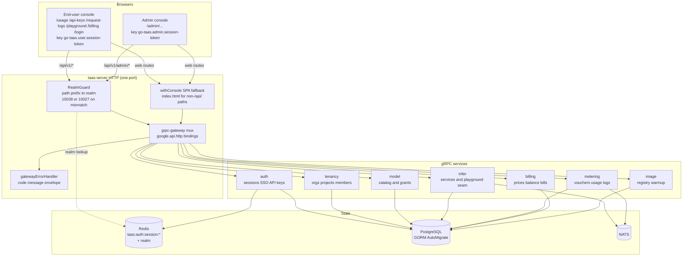
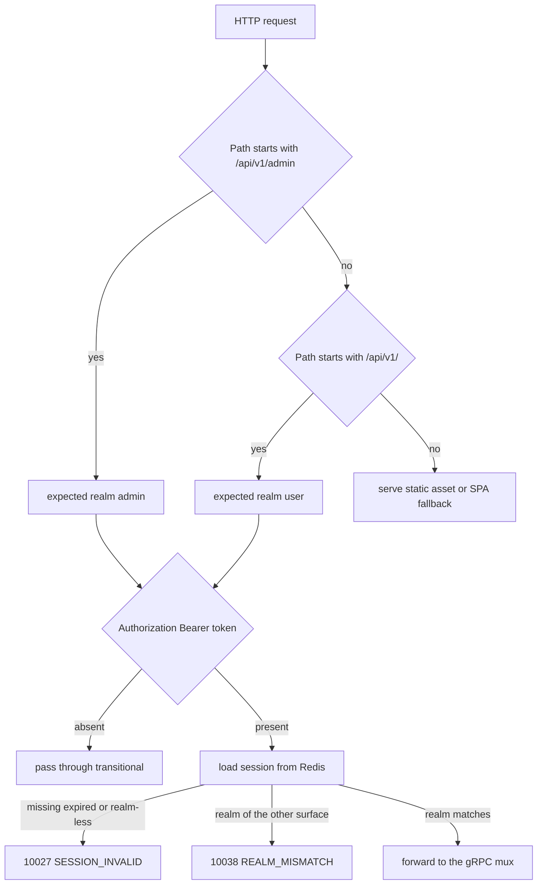
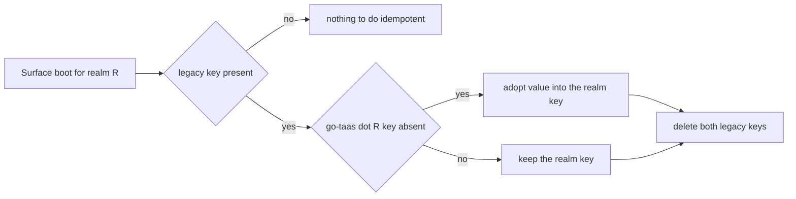
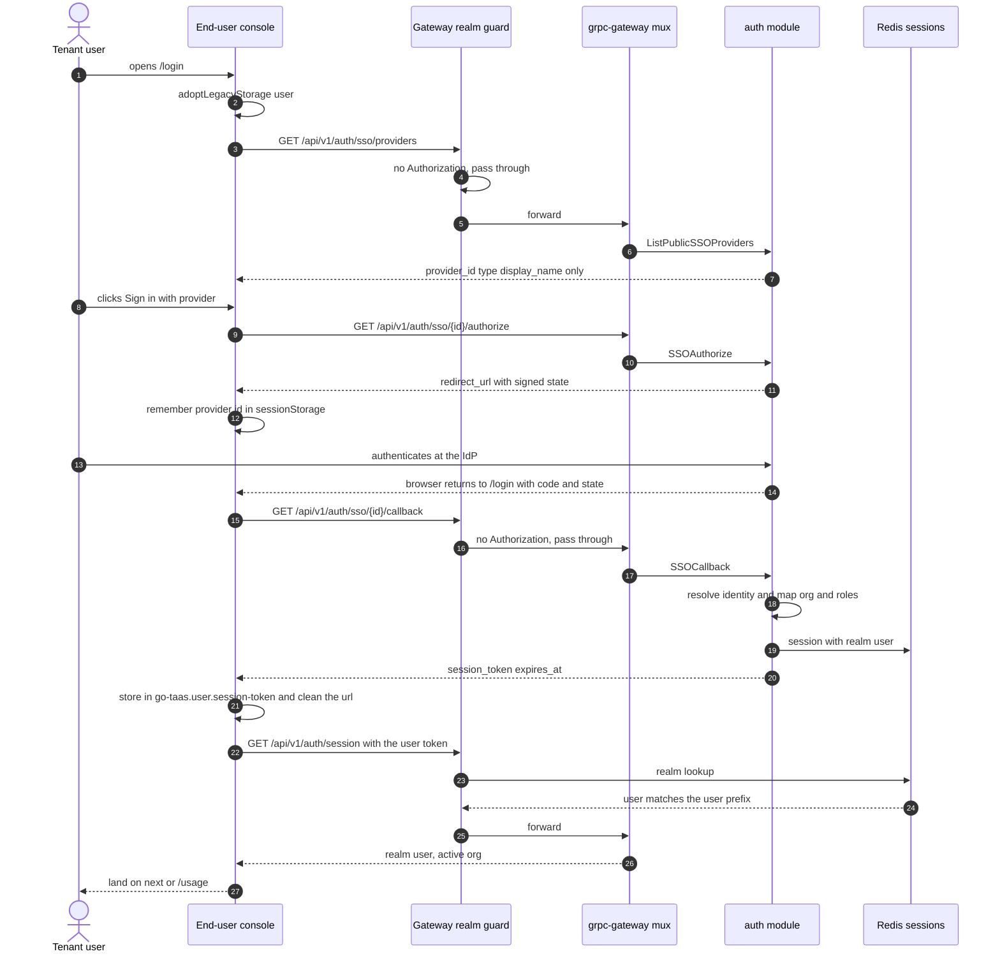
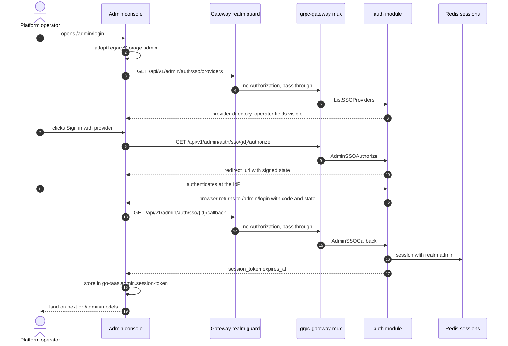
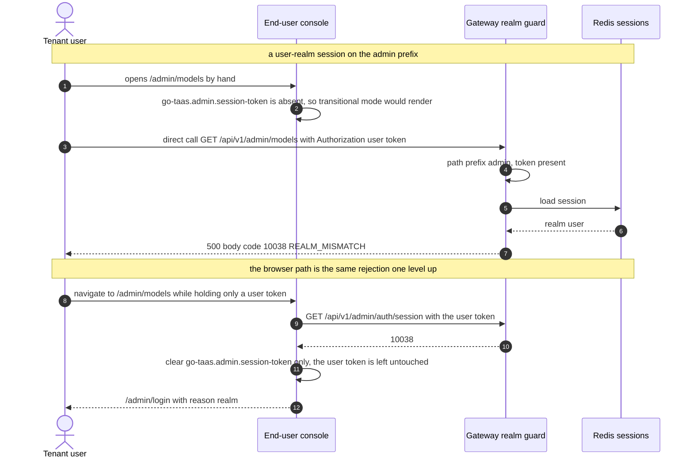
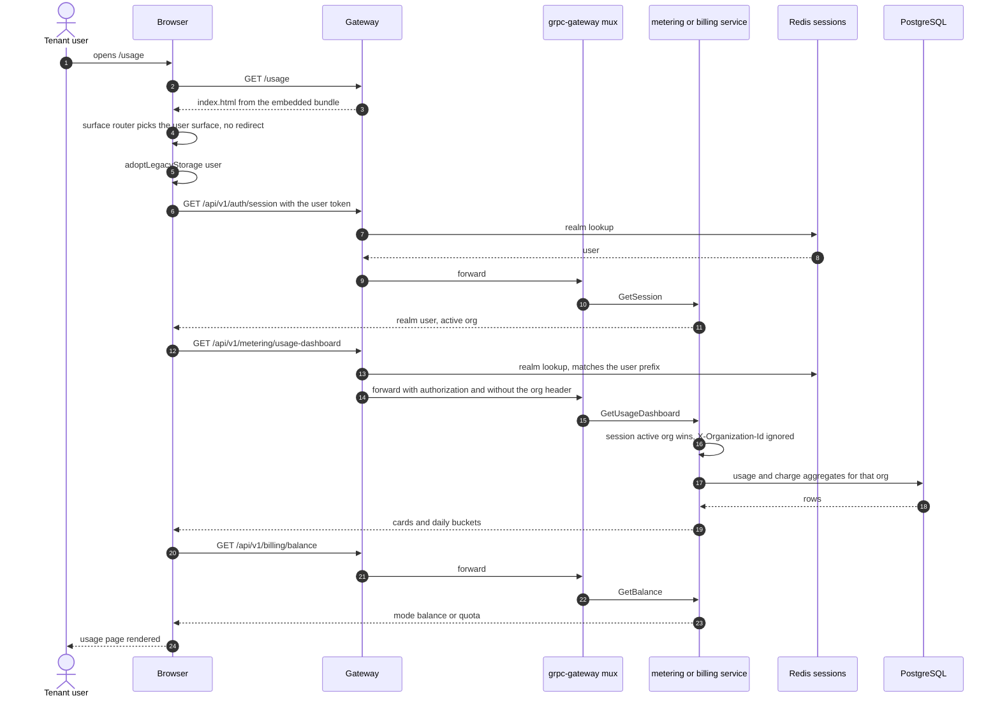

# 控制台面分离（端用户控制台与管理控制台）—— 架构设计与详细设计

| 属性 | 内容 |
| --- | --- |
| 功能点 | 控制台面分离 —— 把端用户控制台 `/`（API `/api/v1/*`）从管理控制台 `/admin`（API `/api/v1/admin/*`）中拆出，两侧会话互相独立并按 realm 绑定（backlog 第 17 行） |
| 文档范围 | 功能 17 的架构与详细设计：两棵路由树与两个外壳、按 realm 绑定的会话模型、网关 realm 守卫、每一条新增／改前缀／双绑定路由的精确 `google.api.http` 注解、浏览器存储模型与遗留键迁移、两侧控制台的「页面 → 路由 → API 前缀」映射、错误处理、配置、安全、发布，以及逐层的函数级任务清单 |
| 归属模块 | `pkg/server`（网关组装、realm 守卫、SPA 回退）、`services/auth`（会话 realm、按 realm 绑定的登录绑定、公开 provider 投影、管理员会话绑定）、`services/model`（用户 realm 的掩码模型清单）、`services/infer`（以模型为维度的 Playground）、`services/metering` + `services/billing`（用户前缀绑定、显式组织过滤）、`web/`（两侧控制台）、`pkg/errors`（10038） |
| 相关文档 | [需求分析与 UI/UX 设计](../design/console-surface-separation.zh-cn.md) · [架构设计](../design/architecture.zh-cn.md) §3.1（控制面 Gateway）与「管理／用户面分离」 · [SSO 联邦与账号绑定](./sso-federation.zh-cn.md)（会话签发、`GetSession`、provider 目录） · [多租户与组织隔离](./multi-tenancy.zh-cn.md)（过渡期的 `X-Organization-Id` 身份） · [组织成员、角色与邀请](./org-members-rbac.zh-cn.md)（`SessionResolver`、10036） · [API Key 管理](./api-key-management.zh-cn.md) · [请求日志与 API Playground](./request-logs-playground.zh-cn.md)（迁往端用户控制台的两个页面） · [用量仪表盘与按请求成本归因](./usage-dashboard.zh-cn.md) · [余额（预付）与额度（后付）](./balance-quota.zh-cn.md) · [按租户的模型授权](./model-authorization.zh-cn.md)（掩码用户模型清单复用的默认放行规则） |
| 状态 | 架构完成，已交付开发者智能体 |

---

## 1. 概述与目标

go-taas 目前只有一个 Web 控制台：`web/src/App.tsx` 把每条路由都注册在 `/admin/...` 之下，`web/src/api.ts` 用同一个会话键（`go-taas.session-token`）和同一个 `Authorization: Bearer` 头服务所有页面，每个页面都调用 `/api/v1/admin/...`。于是租户自助能力（自己的 API Key、自己的用量、自己的请求日志、Playground、自己的账单）住在运维的导航树里，而一次请求无法仅凭路径前缀归属于某个面。

本功能把控制台拆成两个**会话互相独立**的面，并让这条分界在每一层都能由路径前缀强制：

| 面 | Web 路由 | API 前缀 | 会话 realm |
| --- | --- | --- | --- |
| 端用户控制台 | `/usage`、`/api-keys`、`/request-logs`、`/playground`、`/billing`、`/login` | `/api/v1/*` | `user` |
| 管理控制台 | `/admin/...`（16 条路由，其中 3 条为重定向） | `/api/v1/admin/*` | `admin` |

**目标**：单个 bundle 内两棵路由树与两个外壳；按 realm 绑定的会话与彼此独立的浏览器存储；把「在另一 realm 前缀上出示的会话」判为新错误码 **10038 `REALM_MISMATCH`**；按 realm 绑定的登录绑定；租户自助 RPC 增加用户前缀绑定（管理前缀绑定保留但标记为弃用）；provider 列表与模型清单提供用户 realm 的掩码投影；以模型为维度的用户 Playground；管理侧 Usage 与 Bills 的「全组织」变体；三个被迁移页面及其旧管理 URL 的客户端重定向；各面的守卫把跨 realm 或过期会话变成跳转到正确登录页；并保留过渡期（无会话、`X-Organization-Id`）访问，使 CLI、FVT 与十二个在跑的 e2e 套件继续工作。

**非目标**：自建用户名密码账号（`Login` / `CreateUser` 仍是 stub）；管理 realm 的平台管理员资格；在 `/api/v1/admin/*` 上强制要求会话（过渡路径保留，加固为后续行）；退役弃用的管理前缀绑定（迁移窗口）；面向租户的模型清单页与价格页；自助支付（#14）；两侧控制台之间的切换器；改动数据面（推理 Gateway）行为；以及任何 Postgres schema 变更（见第 6 节）。

### 1.1 本文档的阅读顺序

第 2 节记录架构决策（含架构对 UI/UX 设计的三处**细化**，每处都给出理由）。第 3–5 节是组件、路由与会话模型。第 6–8 节是数据模型、前端架构与关键时序。第 9–12 节是错误处理、配置、安全与发布。第 13–15 节是验收标准追溯、函数级详细设计与有序实现任务清单。

---

## 2. 架构决策

AD1–AD8 把 UI/UX 设计的决策落成实现级规则。**AD9–AD11 是架构新增的细化**，每条都标注其所细化的设计决策；它们保留设计意图，并在此记录，使开发者智能体与测试智能体按同一种读法实现。

| # | 决策 | 理由 |
| --- | --- | --- |
| AD1 | **面是请求路径的纯函数。**`/api/v1/admin/...` 是管理 API 面，其他 `/api/v1/...` 路径都是用户 API 面；`/admin/...` 是管理 Web 面，其他 Web 路径都是用户 Web 面。没有任何请求参数、头或 Cookie 能选择面 | 设计 D1/D2/D8。由前缀推导的面可审计，且调用方无法伪造。它是路由、API 客户端、网关守卫与静态合规检查共用的唯一规则 |
| AD2 | **realm 是会话属性，由登录路由前缀铸造，并在网关处强制。**`Session.Realm ∈ {user, admin}` 在签发时由**完成登录的那个绑定**写入，绝不由请求字段决定。强制点是一处网关级、以前缀为作用域的检查（`RealmGuard`），位于 gRPC mux 之前，因此错误 realm 的会话永远不会到达处理器 | 设计 D3/D5。把强制集中在一个接缝，十二个带会话的 RPC 都不必做 per-RPC 的 realm 管道：守卫之后，「存在会话」即意味着「其 realm 与请求到达的前缀一致」 |
| AD3 | **错误 realm 的会话在两个前缀上都以 10038 `REALM_MISMATCH` 失败**，返回统一的错误信封。无 realm 的会话（本功能之前签发的）、未知会话与过期会话，以及取值不属于已知两种的 realm，都以既有的 10027 `SESSION_INVALID` 失败 | 设计 D5。三类运维问题保持可区分：「请重新登录」（10027）、「你登录的是另一个控制台」（10038）、「你的角色不允许」（10036）。10038 是本功能唯一的新错误码 |
| AD4 | **缺少 `Authorization` 头时，realm 守卫视为「无会话」并原样放行** | 设计 D6。这正是 CLI、FVT 与十二个 e2e 套件继续工作的原因：它们从不发送 token，因此行为毫无变化 |
| AD5 | **两侧浏览器存储彼此独立，并在启动时对遗留键做一次性的「吸收后删除」迁移** —— `go-taas.user.session-token` / `go-taas.user.org-id` 与 `go-taas.admin.session-token` / `go-taas.admin.org-id`；拆分前的 `go-taas.session-token` / `go-taas.org-id` 由先启动的那个 realm 吸收，随后移除。任何页面都不再读取遗留键 | 设计 D4 + FR2.5。「没有页面回退到遗留键」由**只读** realm 键来满足；为什么要「吸收」而非直接删除，见 AD9 |
| AD6 | **租户自助 RPC 采用双绑定**：用户路径为主绑定，管理路径置于 `additional_bindings` 并标注弃用；`GetSession` / `UpdateSessionOrg` / `Logout` 保留用户路径为主绑定并新增管理路径；对掩码敏感的读取使用**各自消息类型的新 RPC** | 设计 D7/D15/D16。双绑定共用一个处理器，因此只用于响应与面无关的地方。当载荷必须不同（provider 目录、模型清单）时，独立 RPC 配独立且更小的消息，使掩码成为结构性事实而非条件判断 |
| AD7 | **三条被迁移的管理 URL 由一张纯路径表重定向**，该表在任何面、外壳或 API 调用之前求值 | 设计 D12/FR4.5。若重定向发生在 `AdminShell` 内，它会先跑管理侧会话守卫（一次 API 调用），从而可能把一个书签变成登录提示 |
| AD8 | **用户 realm 的模型清单与 Playground 是新 RPC（`ListAvailableModels`、`PlaygroundModel`）**；用户 Playground 以模型为维度，绝不出现推理服务 | 设计 D14/D15。线上类型里没有 `weight_path` 或服务标识字段，掩码投影就不可能泄漏；租户契约与 OpenAI 兼容端点保持一致 |
| AD9 | **对设计 D4/FR2.5 的细化 —— 遗留键被**吸收**进启动 realm 的键后删除，而不是直接删除。**`go-taas.session-token` → `go-taas.<realm>.session-token`，`go-taas.org-id` → `go-taas.<realm>.org-id`，各自仅在 realm 键缺失时执行；随后移除两个遗留键 | 五个在跑的 e2e 套件在导航前写入 `go-taas.org-id`（`balanceQuota`、`orgMembersRbac`、`rateLimitsSpendLimits`、`requestLogsPlayground`、`usageDashboard`）。直接删除会让这些套件回落到 `org-default` 并使 AC23/AC15 失败。吸收既保住它们，又仍然满足「没有页面读取遗留键」。吸收遗留 **token** 会刻意产生一次 `reason=expired` 的守卫重定向，这正是设计 D5 所说的「强制一次重新登录」，也是 AC24 浏览器侧要观察的现象 |
| AD10 | **对设计 §11/FR5.4 的细化 ——「全组织」是显式选择器（`organization_id=*`），而不是省略该参数。**在管理前缀的 metering/billing 读取上，参数缺失仍与今天一样返回 10001 `UNAUTHORIZED` | 按设计的字面读法（「缺失 = 全部组织」），一个忘带的头就会在共享 API 上变成跨租户读取 —— 这是一处 fail-open 变更，也可能与既有套件的断言冲突。设计要求的**能力**（管理侧 Usage/Bills 过滤器的「All organizations」选项，FR5.4）被完整交付，只有「全部」的线上拼写变为显式。已否决的替代方案：缺失即全部 |
| AD11 | **掩码的用户模型清单与 provider 投影是在同一服务上的独立 RPC**（`taas.model.v1` 的 `ListAvailableModels`、`taas.auth.v1` 的 `ListPublicSSOProviders`），而不是在共享处理器里穿一条 per-request 的「面」标志 | 那种标志必须由网关注入，并额外防御客户端自带的 `Grpc-Metadata-X-Taas-Surface` 头 —— 白白引入一个可伪造面。独立消息可由编译器与类 `GetPublicSurface` 的评审直接核查 |
| AD12 | **对设计 AC8 的细化 ——「会话不跨面」的浏览器侧观察发生在持有 token 的那个 realm 上，而非跨 realm。**`UserShell` 与 `AdminShell` 仅当**自己的**键非空时才运行会话守卫（设计 FR4.1、D4），因此浏览器里存在用户 token 并不能让管理控制台发生跳转：管理控制台会留在过渡模式，且从不读取该键。因此 AC8 以两个可观察事实来验证：(a) 只播种一个伪造的 `go-taas.user.session-token` 时，管理控制台以过渡模式渲染，播种值逐字节不变且 `go-taas.admin.session-token` 不存在；(b) 播种一个伪造的 `go-taas.admin.session-token` 时，管理控制台带 `reason=expired` 跳转到 `/admin/login`，该键被清除，而播种的用户 token 逐字节不变 | 设计的字面 AC8（「播种用户 token ⇒ 管理外壳跳转到 `/admin/login`」）与 D4（「没有任何键被两侧同时读取」）和 FR4.1（「仅当自己的 token 键非空时才校验」）无法同时成立：产生那个跳转需要管理外壳读取用户 realm 的键。两条替代路均被否决 —— 读取对方的键直接破坏 D4；只读「存在与否」的跨面读取仍是跨 realm 读取，并会让 D4 变得不可断言。改写后的这对事实双向证明了同一性质（一个 realm 的凭据既不会被另一个 realm 使用，也不会被它触碰），且可直接在 Nightwatch 中测试 |

---

## 3. 组件视图

### 3.1 归属

| 层 / 组件 | 负责 | 本功能的变更 |
| --- | --- | --- |
| **静态 bundle（SPA）** | 一个 Vite bundle（`web/dist`），构建时嵌入 `taas-server` 的 `pkg/server/console/`，由网关的 SPA 回退服务 | 两棵路由树、两个外壳、按 realm 作用域的 API 客户端、遗留键迁移、重定向表 |
| **网关（`pkg/server`）** | HTTP 组装：`RealmGuard` → `withConsole` → `runtime.ServeMux`；入站头匹配器（`X-Organization-Id`）；统一错误渲染；对所有非 `/api/` 路径回退 `index.html` | 新增 `RealmGuard` + `SessionRealmResolver` 接缝 + 服务注册接线；回退逻辑不变（它本来就服务 `/admin/...`） |
| **grpc-gateway mux** | 由 `google.api.http` 注解完成「路径 → RPC」路由 | 5 个新 RPC 与 14 个既有 RPC 的新绑定（第 5 节） |
| **`auth`** | 用户、SSO provider、身份绑定、API Key、Redis 会话、供其他服务使用的会话身份 | 会话 `realm`；按 realm 绑定的登录绑定；`ListPublicSSOProviders`；`SessionRealm`；`SessionActiveOrg` 接缝实现；`CreateSessionForTest` 不变 |
| **`tenancy`** | 组织、项目、成员、邀请、`OrgGuard`、`MembershipResolver`、`SessionResolver` | 不变 |
| **`model`** | 模型清单、版本、权重路径、租户授权 | `ListAvailableModels`（掩码、用户 realm、默认放行规则） |
| **`infer`** | 推理服务生命周期、端点、变更发布、Playground 代理接缝 | `PlaygroundModel`（以模型为维度的租户 Playground） |
| **`metering`** | 计量事件、凭证、用量记录、用量汇总／仪表盘、请求日志 | 用户前缀绑定；会话推导的组织；显式管理侧组织过滤 + `group_by=organization` |
| **`billing`** | 价格、余额、账单、计费行、账户 | balance/bills/charges 的用户前缀绑定；显式管理侧组织过滤 |
| **`image`**、`internal/controller` | 镜像仓库、预热；Kubernetes 调谐 | 不变（仅管理面） |
| **`pkg/errors`** | 各模块错误码段 | 一个新增 auth 错误码：**10038 `CodeRealmMismatch`** |

### 3.2 运行时组件视图



### 3.3 请求身份链

本仓没有 per-RPC 的认证拦截器链；身份在处理器内部由网关转发的 gRPC metadata 解析。因此链条是：

1. `RealmGuard`（HTTP，`pkg/server/realm.go`）—— 由路径前缀决定期望 realm。无 `Authorization` 头：放行（过渡期，AD4）。有该头：从 Redis 解析会话 realm；不匹配 → 10038，未知／过期／无 realm → 10027。除此之外不检查任何东西。
2. grpc-gateway mux —— 按注解路径路由，并转发 `authorization`（出于向后兼容，grpc-gateway 会不加前缀地透传 `Authorization` 头）与 `x-organization-id`（自定义 `incomingHeaderMatcher`）。
3. 服务处理器 —— 带会话的调用里，`SessionActiveOrg`（由 `auth` 实现）使会话的当前组织成为权威并忽略 `X-Organization-Id`；无会话时，`resolveOrganizationID` 读取过渡期头，缺失或为空则返回 10001。
4. `tenancy.RoleGuard` —— 不变，仍是唯一的角色强制点（成员与邀请管理，10036）。

由于第 1 步已拒绝错误 realm，任何处理器都不需要知道自己来自哪个绑定：`GetSession` 返回 `realm`，且只会被本 realm 的会话到达。

---

## 4. 会话与 realm 架构

### 4.1 会话模型

`auth.Session`（Redis 哈希 `taas:auth:session:<session_id>`）新增一个字段：

| Redis 哈希字段 | 类型 | 含义 |
| --- | --- | --- |
| `realm` | string | `user` 或 `admin`。本功能之前签发（或调用方未设置）的会话为空 —— 这正是 AD3 中 10027 的情形 |

Go 结构体 `Session` 新增 `Realm string \`json:"realm"\``，`SessionStore.Create` 与其他字段一样写入它。`GetSessionResponse` 新增 `string realm = 8`，让浏览器能知道自己处在哪个 realm，也让调用方可以断言 realm 绑定（AC10）。

取值不属于 `{user, admin}` 的 realm（含空值）**不是**第三种 realm：`SessionRealm` 把它们归一为 10027。realm 只是受众标记，不是授权授予 —— 会话能**做什么**仍由既有的组织角色（`tenancy.RoleGuard`）决定。

### 4.2 realm 的来源

| 登录路由（绑定） | 铸造成的 realm | 处理器 |
| --- | --- | --- |
| `GET /api/v1/auth/sso/{provider_id}/callback` | `user` | `SSOCallback` → `ssoCallback(ctx, req, RealmUser)` |
| `GET /api/v1/admin/auth/sso/{provider_id}/callback` | `admin` | `AdminSSOCallback` → `ssoCallback(ctx, req, RealmAdmin)` |

realm 由**绑定**推导，也就是由浏览器完成流程所在的 HTTP 路径决定。没有任何请求字段能选择 realm（设计 D3）：`SSOCallbackRequest` 不变且不携带 realm。`AdminSSOAuthorize` / `AdminSSOCallback` 是新 RPC（AD11/第 5 节），正是为了让每个绑定的处理器无需可伪造的标记就知道自己的 realm。

签名 `state` 的格式不变（`<random>.<hmac>`），因此 `SSOAuthorize`/`SSOCallback` 与既有 FVT 流程不受影响。把 realm 绑进签名 state 记录为第 11 节（安全）中的后续加固项，因为今天的 realm 不携带任何权限。

### 4.3 强制点：网关 realm 守卫

```go
// pkg/server/realm.go
const (
    surfaceUser  = "user"
    surfaceAdmin = "admin"
)

// surfaceForPath maps a request path to its surface. The empty string
// means "not an API surface" (static assets, SPA routes).
func surfaceForPath(path string) string {
    if path == "/api/v1/admin" || strings.HasPrefix(path, "/api/v1/admin/") {
        return surfaceAdmin
    }
    if strings.HasPrefix(path, "/api/v1/") {
        return surfaceUser
    }
    return ""
}

// SessionRealmResolver resolves a session token to its realm.
type SessionRealmResolver interface {
    SessionRealm(ctx context.Context, token string) (string, error)
}

func RealmGuard(next http.Handler, resolver SessionRealmResolver) http.Handler
```

行为按顺序如下：

| 条件 | 结果 |
| --- | --- |
| `surfaceForPath` 为空 | 调用 `next` —— 静态资源与 Web 路由是公开的 |
| 无 `Authorization` 头，或取值不是非空的 `Bearer <token>` | 调用 `next` —— 过渡期访问（AD4，设计 D6） |
| 未接 resolver（单元测试、纯 API 网关） | 调用 `next`，并在启动时警告一次 |
| 会话不存在、已过期，或其 realm 为空／未知 | `500`，响应体 `{"code":10027,"message":"<session invalid>"}` |
| 会话 realm ≠ 面 realm | `500`，响应体 `{"code":10038,"message":"<realm mismatch>"}` |
| 会话 realm = 面 realm | 调用 `next` |

HTTP 状态是 `500`、`code` 放在响应体里，这与本平台其他业务错误一致：gRPC status code **就是**业务码（`pkg/grpcmiddleware`），grpc-gateway 的 `DefaultHTTPErrorHandler` 把非 HTTP 码映射为 500 并把该码写入 JSON 响应体。客户端按响应体 `code` 分支（`web/src/api.ts` 已经如此），从不依赖状态码。

守卫挂载在控制台处理器之外，因此不支持的方法、未知路径与静态资源都不受影响：

```go
Handler: RealmGuard(withConsole(s.gatewayMux), resolver)
```

成本：每个携带会话的请求多一次 Redis `HGETALL`；不带 token 的请求（所有过渡期调用方，含 CLI 与各套件）零成本。不引入缓存，因为该守卫只在控制面。

接线：`pkg/server` 在已经收集 `Migrator` 的同一个循环里，从注册的服务中收集 `RealmResolver`（`SessionRealm`）；由 `auth.Service` 实现。生产环境会接线；未接线的网关行为与功能上线前完全一致。

### 4.4 realm 判定端到端



### 4.5 过渡期无会话访问

在两个前缀上逐字节保留（设计 D6、FR5.1）：

- 无 `Authorization` 头 ⇒ 守卫放行；处理器与今天一样由 `X-Organization-Id` 解析组织（`resolveOrganizationID`，缺失时 10001）。
- 浏览器**仅在自己 realm 的 token 键为空时**才发送 `X-Organization-Id`（既有 `api.ts` 行为，现在按 realm 作用域化），因此已登录的控制台不会混用两种身份。
- 存在会话时忽略 `X-Organization-Id`，会话的当前组织优先（`SessionActiveOrg`），因此用户 realm 的页面无法从浏览器被指向另一个组织（AC18）。
- 在 `/api/v1/admin/*` 上强制要求会话属于后续行，不属于本功能。

### 4.6 浏览器存储与遗留键迁移

| 键 | 写入者 | 读取者 | 内容 |
| --- | --- | --- | --- |
| `go-taas.user.session-token` | `/login` 回调成功后 | 用户外壳、用户页面 | 用户 realm 会话 id，作为 `Authorization: Bearer` 发往 `/api/v1/*` |
| `go-taas.user.org-id` | 用户外壳的组织选择器 | 用户外壳、用户页面 | 过渡模式下的当前组织 |
| `go-taas.admin.session-token` | `/admin/login` 回调成功后 | 管理外壳、管理页面 | 管理 realm 会话 id，发往 `/api/v1/admin/*` |
| `go-taas.admin.org-id` | 管理外壳的组织选择器 | 管理外壳、管理页面 | 组织作用域管理页面的工作组织 |
| `go-taas.user.sso-provider` / `go-taas.admin.sso-provider`（sessionStorage） | 登录页 | 登录页 | 等待 IdP 跳转的 provider id |
| `go-taas.session-token`、`go-taas.org-id`（遗留） | 无 | 无 | **启动时吸收后删除**（AD9） |

迁移算法：每个面启动时同步执行一次，在首次渲染之前：

```ts
// web/src/surface.tsx
export function adoptLegacyStorage(realm: Realm): void {
  const map: [string, string][] = [
    ['go-taas.session-token', tokenKey(realm)],
    ['go-taas.org-id',        orgKey(realm)],
  ];
  for (const [legacy, target] of map) {
    const value = localStorage.getItem(legacy);
    if (value && !localStorage.getItem(target)) localStorage.setItem(target, value);
    localStorage.removeItem(legacy);
  }
}
```



后果均为预期：

- 拆分前的浏览器会把它唯一的组织上下文留在先启动的那个控制台；另一个 realm 在用户使用选择器之前从种子默认值（`org-default`）开始。遗留状态本来就是单值的，因此没有可保留的信息被丢掉。
- 拆分前的**会话** token 会被吸收进 realm 键，随后守卫回以 10027（无 realm）→ 一次跳转到 `/login?reason=expired`。这正是设计 D5 的「一次重新登录」，也是 AC24 浏览器侧可观察的原因。
- `test/e2e/page-objects/api.js:ssoLogin` 写入遗留键。它今天没有任何调用方，因此不会破坏什么；若未来有套件使用它，必须改写 `go-taas.<realm>.session-token`（测试智能体后续项，第 12 节）。

---

## 5. 网关路由

### 5.1 静态回退与重定向

**静态回退** —— 不变且已正确：`pkg/server/console.go` 在文件存在时返回真实文件，否则对所有不以 `/api/` 开头的路径返回 `index.html`，因此 `/usage`、`/playground`、`/admin/usage` 以及两棵树内部的深链都能启动 SPA。Web 面不新增服务端路由表；两棵路由树都是客户端路由（第 7 节）。

**客户端重定向** —— 由面路由在任何外壳或 API 调用之前求值（AD7）：

| 从 | 到 | 备注 |
| --- | --- | --- |
| `/` | `/usage` | 原为 `/` → `/admin` |
| `/admin` | `/admin/models` | 不变 |
| `/admin/api-keys` | `/api-keys` | 被迁移页面（设计 D12） |
| `/admin/request-logs` | `/request-logs` | 被迁移页面 |
| `/admin/playground` | `/playground` | 被迁移页面，现为以模型为维度 |
| 其他任何非 `/admin` 路径 | 在 `UserShell` 内渲染（404） | 设计 D17 |
| 其他任何 `/admin/...` 路径 | 在 `AdminShell` 内渲染（404） | 设计 D17 |

重定向使用 `history.replaceState`（`web/src/router.tsx` 新增 `replace()`），因此书签不会造成后退按钮回环，且不携带任何 token 或组织值。

### 5.2 精确的 `google.api.http` 注解

状态图例：**new** = 新 RPC，**dual** = 既有绑定保留，另一前缀通过 `additional_bindings` 新增，**deprecated** = 管理前缀绑定为迁移窗口保留并在 proto 注释中标记弃用。

#### `proto/taas/auth/v1/auth.proto`

| RPC | 方法 + 路径（规范） | 变更 |
| --- | --- | --- |
| `ListAPIKeys` | `GET /api/v1/auth/api-keys` | **dual** —— `/api/v1/admin/auth/api-keys` 变为 `additional_bindings` + 弃用 |
| `CreateAPIKey` | `POST /api/v1/auth/api-keys`（body `*`） | **dual** —— 管理路径弃用 |
| `RevokeAPIKey` | `POST /api/v1/auth/api-keys/{key_id}:revoke`（body `*`） | **dual** —— 管理路径弃用 |
| `UpdateAPIKey` | `PUT /api/v1/auth/api-keys/{key_id}`（body `*`） | **dual** —— 管理路径弃用 |
| `GetSession` | `GET /api/v1/auth/session` | **dual** —— 新增 `GET /api/v1/admin/auth/session`（**新**绑定，管理 realm） |
| `UpdateSessionOrg` | `POST /api/v1/auth/session/org`（body `*`） | **dual** —— 新增 `POST /api/v1/admin/auth/session/org` |
| `Logout` | `POST /api/v1/auth/logout`（body `*`） | **dual** —— 新增 `POST /api/v1/admin/auth/logout` |
| `ListPublicSSOProviders` | `GET /api/v1/auth/sso/providers` | **新 RPC**，匿名，掩码投影 |
| `SSOAuthorize` | `GET /api/v1/auth/sso/{provider_id}/authorize` | 不变，铸造 realm `user` |
| `SSOCallback` | `GET /api/v1/auth/sso/{provider_id}/callback` | 不变，铸造 realm `user` |
| `AdminSSOAuthorize` | `GET /api/v1/admin/auth/sso/{provider_id}/authorize` | **新 RPC** |
| `AdminSSOCallback` | `GET /api/v1/admin/auth/sso/{provider_id}/callback` | **新 RPC**，铸造 realm `admin` |
| `ListSSOProviders`、`GetSSOProvider`、`Create/Update/Enable/Disable/DeleteSSOProvider`、身份绑定 | `/api/v1/admin/auth/...` | 不变（管理面） |
| `CreateUser`、`Login` | `/api/v1/auth/users`、`/api/v1/auth/login` | 不变（仍是 stub） |

两种写法的精确语法：

```proto
  // ListAPIKeys returns the API keys of the caller's organization.
  // User-surface API: served under /api/v1; the session's active org
  // wins and X-Organization-Id is ignored (feature-17 AD6).
  rpc ListAPIKeys(ListAPIKeysRequest) returns (ListAPIKeysResponse) {
    option (google.api.http) = {
      get: "/api/v1/auth/api-keys"
      additional_bindings {
        // Deprecated (console-surface-separation): kept functional for
        // the transitional migration window.
        get: "/api/v1/admin/auth/api-keys"
      }
    };
  }

  // GetSession returns the current session of the realm the request
  // arrived on (user realm on this binding, admin realm on the
  // additional binding, enforced by the gateway realm guard).
  rpc GetSession(GetSessionRequest) returns (GetSessionResponse) {
    option (google.api.http) = {
      get: "/api/v1/auth/session"
      additional_bindings { get: "/api/v1/admin/auth/session" }
    };
  }
```

#### `proto/taas/model/v1/model.proto`

| RPC | 方法 + 路径 | 变更 |
| --- | --- | --- |
| `ListAvailableModels` | `GET /api/v1/models` | **新 RPC** —— 掩码的用户 realm 清单（`AvailableModel{model_id, name, latest_version}`） |
| `RegisterModel`、`ListModels`、`GetModel`、`DeleteModel`、`GrantModelAccess`、`RevokeModelAccess`、`ListModelAuthorizations` | `/api/v1/admin/models...` | 不变（管理面） |

#### `proto/taas/infer/v1/infer.proto`

| RPC | 方法 + 路径 | 变更 |
| --- | --- | --- |
| `PlaygroundModel` | `POST /api/v1/models/{model_id}:playground`（body `*`） | `InferServiceService` 上的**新 RPC** —— 以模型为维度的租户 Playground |
| `CreateInferenceService`、`ListInferenceServices`、`GetInferenceService`、`ScaleInferenceService`、`DeleteInferenceService`、`PlaygroundInfer` | `/api/v1/admin/inference-services...` | 不变；`PlaygroundInfer` 对 CLI 与测试继续可用，但本功能之后不再有控制台页面 |

`PlaygroundModel` 放在 `infer` 服务里，是因为「为一个模型解析出就绪的推理服务并把提示词代理到数据面」属于编排；而**路径**遵循租户以模型为中心的契约，因为 grpc-gateway 映射的是路径而非 proto 包。

#### `proto/taas/metering/v1/metering.proto`

| RPC | 方法 + 路径（规范） | 变更 |
| --- | --- | --- |
| `GetUsageSummary` | `GET /api/v1/metering/usage-summary` | **dual** —— `/api/v1/admin/metering/usage-summary` 变为 additional + 弃用 |
| `GetUsageDashboard` | `GET /api/v1/metering/usage-dashboard` | **dual** —— 管理路径弃用；`group_by` 在管理绑定上新增 `organization` |
| `ListVouchers` | `GET /api/v1/metering/vouchers` | **dual** —— 管理路径弃用 |
| `ListRequestLogs` | `GET /api/v1/metering/request-logs` | **dual** —— 管理路径弃用 |
| `GetVoucher`、`GetRequestLog`、`ListUsageRecords`、`IngestMeteringEvent` | `/api/v1/admin/metering/...` | 不变（运维／诊断面） |

#### `proto/taas/billing/v1/billing.proto`

| RPC | 方法 + 路径（规范） | 变更 |
| --- | --- | --- |
| `GetBalance` | `GET /api/v1/billing/balance` | **dual** —— `/api/v1/admin/billing/balance` 变为 additional + 弃用 |
| `ListBills` | `GET /api/v1/billing/bills` | **dual** —— 管理路径弃用；`BillSummary.organization_id` 已存在（无字段变更） |
| `ListCharges` | `GET /api/v1/billing/charges` | **dual** —— 管理路径弃用 |
| `SetPrice`、`ListPrices`、`CreateAccount`、`ListAccounts`、`GetAccount`、`UpdateAccount`、`Recharge`、`Refund`、`ListTransactions` | `/api/v1/admin/billing/...` | 不变（管理面） |

metering 与 billing 都**不需要消息变更**：组织参数已经作为 `organization_id` 存在于 `GetUsageSummaryRequest`、`GetUsageDashboardRequest`、`ListVouchersRequest`、`GetBalanceRequest`、`ListBillsRequest`、`ListChargesRequest`，且 `BillSummary`/`ChargeRecordSummary`/`VoucherSummary` 已经携带 `organization_id`。只有注解与参数语义变化。

### 5.3 路由必须满足的面规则

1. 没有任何管理能力可在 `/api/v1/*` 上到达，也没有任何租户自助能力只定义在 `/api/v1/admin/*`（双绑定使用户前缀成为规范）。
2. 某前缀上所有带会话的路由都要求该前缀的 realm（AD2/AD3）。
3. 匿名路由恰好是：`/api/v1/auth/sso/providers`（新）、`/api/v1/auth/sso/{id}/authorize|callback`、`/api/v1/admin/auth/sso/providers`、`/api/v1/admin/auth/sso/{id}/authorize|callback`、`/api/v1/auth/login`、`/api/v1/auth/users`。它们无需 token 即可到达，只做「铸造或列出」，从不「操作」。
4. `GET /api/v1/models`（掩码）与 `POST /api/v1/models/{model_id}:playground` 属于用户 realm；管理侧清单保留 `/api/v1/admin/models...`。

---

## 6. 数据模型

### 6.1 无 Postgres 变更

本功能**不新增表、列、索引与约束**。realm 存在于 Redis 会话哈希（`taas:auth:session:<id>` 的 `realm` 字段，第 4.1 节），那是带 TTL 的运行时缓存而非持久表：会话在运行时创建与过期，从不迁移（与 [SSO 联邦](./sso-federation.zh-cn.md) §3.6 同一理由）。

组织过滤、掩码清单与 Playground 不引入持久化：它们是在既有表（`organizations`、`models`、`model_authorizations`、`vouchers`、`request_logs`、`bills`、`charge_records`）之上的查询期投影。

### 6.2 init SQL / 升级路径（开发者约束 15）

约束 15（「若数据库表变更，须为 init SQL 脚本增加升级支持」）被**明确地以空集满足**：本仓**不维护手写 DDL，也没有 init SQL 脚本** —— GORM `AutoMigrate` 是 schema 的唯一事实来源，通过 `pkg/server` 的 `Migrator` 钩子调用（`pkg/server/server.go` 的 `Migrator` 文档注释：「The GORM model is the single source of truth for the schema (AutoMigrate), so no hand-written DDL is kept」；另见 [API Key 管理](./api-key-management.zh-cn.md) §3.3）。由于本功能不改动任何 GORM 模型，没有任何内容需要加入 SQL 脚本，「ORM 模型与 DDL 一致」这条不变量也不会被触及。若未来某行需要新增列，路径是：把它加到 GORM 模型，由 `AutoMigrate` 在启动时应用；若将来引入「模型与 DDL 一致性」测试，则同步更新该测试。

### 6.3 Redis 会话兼容性

| 升级前存储的会话 | 升级后 |
| --- | --- |
| 不含 `realm` 的哈希 | `Get` 返回 `Realm == ""` 的会话；`SessionRealm` 无法映射为合法值，守卫回以 **10027**，外壳只清除自己的键并跳转到本 realm 的登录页（AC24）。无需手工清理：键在 `sessionTTL`（24 小时）后自然过期 |

因此升级是一次滚动重启，无数据迁移，只对持有拆分前会话的浏览器强制一次重新登录。

---

## 7. 前端架构

### 7.1 模块规划

| 关注点 | 文件 | 说明 |
| --- | --- | --- |
| realm 类型、存储键、按 realm 作用域的 API 客户端 | `web/src/api.ts`（重写） | `Realm`、`tokenKey`、`orgKey`、`apiPrefix`、`createApi(realm)`；客户端**拒绝**前缀不属于自己 realm 的路径（AC6 的运行时镜像），并从自己的键设置 `Authorization` 或从自己的组织键设置 `X-Organization-Id` |
| 面上下文、遗留键吸收 | `web/src/surface.tsx`（新） | `SurfaceProvider({realm})`、`useApi()`、`useRealm()`、`adoptLegacyStorage(realm)` |
| 纯路由规则 | `web/src/surface-routes.ts`（新） | `surfaceForPath`、`MOVED_ADMIN_ROUTES`、`realmHome`、`realmLoginPath`、`isAllowedNext(realm, next)` |
| 面路由、路由树 | `web/src/App.tsx`（重写） | `App` → `SurfaceRouter`（先重定向，再选面）→ `UserSurface` / `AdminSurface` |
| 外壳 | `web/src/shells/UserShell.tsx`、`web/src/shells/AdminShell.tsx`（新） | 各自持有自己的 realm、导航数组、守卫与测试 id；仅共享表现层（`ShellChrome`） |
| 组织上下文 | `web/src/org.tsx`（重写） | `OrgProvider({realm})`、按 realm 键存储、按 realm 作用域的会话路由；用户 realm 在过渡模式禁用选择器 |
| 共享组件 | `web/src/components.tsx`、`web/src/components/*` | 除 `BalanceWidget` 改为从 `useApi()` 取客户端外不变 |
| 端用户页面 | `web/src/pages/user/*.tsx`（新目录） | 5 个页面 + 用户登录页，全部调用 `/api/v1/*` |
| 管理页面 | `web/src/pages/*.tsx`（原地） | 改用按 realm 作用域的客户端与管理前缀，并提供 Usage/Bills 的新管理侧变体；三个被迁移页面离开路由树 |
| 路由 | `web/src/router.tsx` | 新增 `replace(path)`（`history.replaceState` + emit）；其余不变 |

让十五个管理页面留在原地（而不是迁到 `pages/admin/`），可把 diff 与并发工作的合并风险降到最低，同时仍为静态合规检查（AC6）给出精确且成文的范围：`web/src/pages/user/**` 与 `web/src/shells/UserShell.tsx` 是用户 realm 源，`web/src/pages/*.tsx` 与 `web/src/shells/AdminShell.tsx` 是管理 realm 源。

### 7.2 端用户控制台：页面 → 路由 → API

| 路由 | 组件 | 用途 | API 前缀（精确调用） |
| --- | --- | --- | --- |
| `/` | 重定向 | → `/usage` | — |
| `/login` | `pages/user/UserLoginPage.tsx`（无外壳） | 按 realm 绑定的登录 | `GET /api/v1/auth/sso/providers`、`GET /api/v1/auth/sso/{id}/authorize`、`GET /api/v1/auth/sso/{id}/callback`、`GET /api/v1/auth/session` |
| `/usage` | `pages/user/UsagePage.tsx` | 自己的用量与成本 | `GET /api/v1/metering/usage-summary`、`GET /api/v1/metering/usage-dashboard`、`GET /api/v1/metering/vouchers`、`GET /api/v1/billing/balance` |
| `/api-keys` | `pages/user/ApiKeysPage.tsx` | 自己的 API Key | `GET|POST /api/v1/auth/api-keys`、`PUT /api/v1/auth/api-keys/{key_id}`、`POST /api/v1/auth/api-keys/{key_id}:revoke` |
| `/request-logs` | `pages/user/RequestLogsPage.tsx` | 自己的请求日志 | `GET /api/v1/metering/request-logs`、`GET /api/v1/auth/api-keys?page.limit=100`、`GET /api/v1/models` |
| `/playground` | `pages/user/PlaygroundPage.tsx` | 以模型为维度的 Playground | `GET /api/v1/models`、`GET /api/v1/auth/api-keys?page.limit=100&active_only=true`、`POST /api/v1/models/{model_id}:playground` |
| `/billing` | `pages/user/BillsPage.tsx` | 自己的账单（只读） | `GET /api/v1/billing/bills`、`GET /api/v1/billing/charges` |
| 其他任何路径 | `UserShell` 内的 `pages/NotFoundPage.tsx` | 404 | 无 |

外壳辅助调用：启动时的 `GET /api/v1/auth/session`（仅当用户 token 键非空）、切换组织时的 `POST /api/v1/auth/session/org`、登出时的 `POST /api/v1/auth/logout`。

### 7.3 管理控制台：页面 → 路由 → API

| 路由 | 组件 | API 前缀 |
| --- | --- | --- |
| `/admin` | 重定向 → `/admin/models` | — |
| `/admin/login` | `pages/AdminLoginPage.tsx`（无外壳） | `GET /api/v1/admin/auth/sso/providers`、`GET /api/v1/admin/auth/sso/{id}/authorize|callback`、`GET /api/v1/admin/auth/session` |
| `/admin/organizations` | `pages/OrganizationsPage.tsx` | `/api/v1/admin/tenancy/organizations...` |
| `/admin/projects` | `pages/ProjectsPage.tsx` | `/api/v1/admin/tenancy/projects...` |
| `/admin/members` | `pages/MembersPage.tsx` | `/api/v1/admin/tenancy/organizations/{org_id}/members...` |
| `/admin/invitations` | `pages/InvitationsPage.tsx` | `/api/v1/admin/tenancy/...invitations...` |
| `/admin/sso` | `pages/SSOProvidersPage.tsx` | `/api/v1/admin/auth/sso/providers...` |
| `/admin/identity-bindings` | `pages/IdentityBindingsPage.tsx` | `/api/v1/admin/auth/identity-bindings...` |
| `/admin/models`、`/admin/models/:id` | `pages/ModelsPage.tsx`、`pages/ModelDetailPage.tsx` | `/api/v1/admin/models...` |
| `/admin/images`、`/admin/images/:id` | `pages/ImagesPage.tsx`、`pages/ImageDetailPage.tsx` | `/api/v1/admin/images...` |
| `/admin/inference-services`、`/admin/inference-services/:id` | `pages/InferenceServicesPage.tsx`、`pages/ServiceDetailPage.tsx` | `/api/v1/admin/inference-services...` |
| `/admin/usage` | `pages/UsagePage.tsx`（管理侧变体：`admin-org-filter` 含 All organizations、四种 group-by） | `/api/v1/admin/metering/*`、`/api/v1/admin/billing/balance` |
| `/admin/billing` | `pages/BillsPage.tsx`（管理侧变体：Organization 列 + 过滤） | `/api/v1/admin/billing/bills`、`/api/v1/admin/billing/charges` |
| `/admin/billing/accounts` | `pages/AccountsPage.tsx` | `/api/v1/admin/billing/accounts...` |
| `/admin/pricing` | `pages/PricingPage.tsx` | `/api/v1/admin/billing/prices` |
| `/admin/api-keys` | 重定向 → `/api-keys` | — |
| `/admin/request-logs` | 重定向 → `/request-logs` | — |
| `/admin/playground` | 重定向 → `/playground` | — |
| 其他任何路径 | `AdminShell` 内的 `pages/NotFoundPage.tsx` | 无 |

导航数组：用户侧 `user-nav-{usage, api-keys, request-logs, playground, billing}`（5 项，绝无任何指向 `/admin` 的链接）；管理侧 `nav-{organizations, projects, members, invitations, sso-providers, identity-bindings, models, inference-services, images, usage, pricing, bills, accounts}`（13 项）。`nav-api-keys`、`nav-request-logs`、`nav-playground` 不得在任何地方存在。

### 7.4 `web/src/App.tsx` 中的路由注册

```tsx
export default function App() {
  return <SurfaceRouter />;
}

function SurfaceRouter() {
  const path = useRoute();               // subscribes to navigate() and popstate
  const moved = MOVED_ADMIN_ROUTES[path]; // pure table, evaluated first (AD7)
  if (moved) return <Redirect to={moved} />;
  if (path === '/') return <Redirect to={realmHome('user')} />;
  if (path === '/admin') return <Redirect to={realmHome('admin')} />;
  return isAdminPath(path) ? <AdminSurface path={path} /> : <UserSurface path={path} />;
}

function UserSurface({ path }: { path: string }) {
  adoptLegacyStorage('user');            // synchronous, idempotent, before first render
  return (
    <SurfaceProvider realm="user">
      {path === '/login' ? <UserLoginPage /> : <UserShell><UserRoutes /></UserShell>}
    </SurfaceProvider>
  );
}
```

`AdminSurface` 镜像实现，realm 为 `admin`，登录页为 `/admin/login`，路由树为 `AdminRoutes`。`UserRoutes` / `AdminRoutes` 是彼此独立的 `<Routes>` 树，各自以 `path="*"` 结尾（现有路由器挑选第一个段数与字面量都匹配的子节点，并把 `path="*"` 当作兜底，因此兜底必须放最后）。登录路由是两个成文的「无外壳」例外：它们不能渲染已认证的框架，其唯一的会话调用是「已登录」检查（FR3.5）。

### 7.5 各面的鉴权守卫

| 步骤 | `UserShell` | `AdminShell` |
| --- | --- | --- |
| 启动 | 读取 `go-taas.user.session-token` | 读取 `go-taas.admin.session-token` |
| token 为空 | 过渡模式：渲染页面，`X-Organization-Id` 取自 `go-taas.user.org-id`，提示 `user-console-transitional-banner` | 同上，取 `go-taas.admin.org-id`，提示 `admin-console-transitional-banner` |
| token 存在 | `GET /api/v1/auth/session` | `GET /api/v1/admin/auth/session` |
| 成功 | 渲染；会话的 `activeOrg` 成为组织上下文 | 渲染 |
| 失败 10027 | 只清除用户 token，跳转 `/login?next=<path>&reason=expired` | 只清除管理 token，跳转 `/admin/login?next=<path>&reason=expired` |
| 失败 10038 | 只清除用户 token，跳转 `/login?next=<path>&reason=realm` | 只清除管理 token，跳转 `/admin/login?next=<path>&reason=realm` |
| 其他失败 | 保留 token，渲染页面级错误横幅；守卫绝不猜测 | 同上 |

另一个 realm 的键从不被读取、写入、清除或回显。`next` 会被校验（`isAllowedNext`）：用户 realm 必须是非 `/admin` 路径，管理 realm 必须以 `/admin` 开头；否则丢弃并使用本 realm 首页。登录页按 `reason` 映射显示提示（`signin-notice`）。

### 7.6 测试智能体可驱动的 `data-testid` 钩子

外壳与守卫：`user-shell`、`admin-shell`（以及既有的 `sidebar`）、`user-nav-usage`、`user-nav-api-keys`、`user-nav-request-logs`、`user-nav-playground`、`user-nav-billing`、`nav-*`（13 个管理项）、`user-console-transitional-banner`、`admin-console-transitional-banner`、`signin-notice`、`user-account-block`、`user-menu-logout`、`org-switcher-select`、`org-switcher-notice`、`admin-org-filter`、`not-found-home`。

用户登录：`sso-login-list`、`sso-login-{provider_id}`、`login-loading`、`login-no-providers`、`login-error`、`login-signing-in`、`ldap-username`、`ldap-password`、`ldap-submit`。

用户页面：`usage-balance-widget`、`usage-dashboard-cards`、`usage-metric-toggle`、`usage-groupby-select`、`usage-export-csv`、`usage-table`、`usage-empty`、`usage-unpriced-badge`；`create-api-key`、`api-keys-table`、`api-keys-empty`、`api-keys-endpoint-copy`、`api-keys-filter-status`、`create-dialog`、`key-name-input`、`key-expiry-select`、`rate-limit-rpm`、`rate-limit-tpm`、`created-dialog`、`created-secret`、`created-copy`、`created-confirm`、`edit-dialog`、`revoke-dialog`；`request-log-filters`、`request-log-range-24h`、`request-log-range-7d`、`request-log-range-30d`、`request-log-filter-status`、`request-log-filter-key`、`request-log-filter-model`、`request-log-clear-filters`、`request-logs-table`、`request-logs-empty`、`request-log-detail-{request_log_id}`；`playground-model-select`、`playground-key-select`、`playground-prompt-input`、`playground-temperature`、`playground-max-tokens`、`playground-send`、`playground-response`、`playground-copy-curl`、`playground-no-models`、`playground-no-keys`；`bills-table`、`bills-empty`、`bill-charges-{bill_id}`。

从今天保留（测试与管理页面依赖它们）：`models-table`、`sso-providers-table`、`create-sso-provider`、`create-identity-binding`、`identity-bindings-table`、`identity-bindings-empty`、`create-account-button`、`accounts-table`、`accounts-empty`、`usage-dashboard-cards`、`usage-chart`、`usage-metric-cost|tokens|requests`、`usage-balance-widget`。

唯一按设计改变的 id 是 Playground 的服务选择器：用户页面提供的是**模型**选择器（`playground-model-select`），旧的 `playground-service-select` 不再存在（第 12 节风险 R1）。

---

## 8. 时序图

### 8.1 用户登录（realm `user`）



### 8.2 管理员登录（realm `admin`）



### 8.3 跨 realm 请求拒绝



### 8.4 端用户页面通过网关加载



---

## 9. 错误处理

### 9.1 错误码

| 条件 | 码 | 常量 | 产出位置 |
| --- | --- | --- | --- |
| 在本前缀上出示了另一 realm 的会话 | **10038** | `CodeRealmMismatch`（**新增**） | 网关 realm 守卫 |
| 无会话、未知会话、过期会话、无 realm 的会话、取值不属于已知两种的 realm | 10027 | `CodeSessionInvalid` | 网关 realm 守卫、会话处理器 |
| 过渡期调用需要组织但 `X-Organization-Id` 缺失或为空 | 10001 | `CodeUnauthorized` | 服务处理器 |
| 会话与角色有效，但组织角色不足 | 10036 | `CodeForbidden` | `tenancy.RoleGuard`（不变） |
| 组织不存在／已禁用 | 10005 / 10017 | `CodeOrganizationNotFound` / `CodeOrganizationDisabled` | 不变 |
| 组织未被授权使用该模型 | 10105 | `CodeModelUnauthorized` | model 服务 |
| 该模型没有就绪的推理服务 | 10301 / 10303 | `CodeInferServiceNotFound` / `CodeInferServiceStateInvalid` | infer 服务 |
| 计量区间不合法 | 10404 | `CodeMeteringRangeInvalid` | metering 服务 |
| 无计费账户／账单不存在 | 10503 / 10504 | `CodeAccountNotFound` / `CodeBillNotFound` | billing 服务 |
| API Key 未知／已撤销（Playground 的 key 校验） | 10007 / 10009 | `CodeAPIKeyNotFound` / 既有已撤销常量 | auth 服务 |
| 登录失败 | 10002、10012、10022、10023、10024、10025 | 既有 SSO 码 | auth 服务 |

网关守卫发出的信封形状与所有处理器一致（`{"code":<业务码>,"message":"<文本>"}`），HTTP 状态为 500 —— 因为业务码不是 HTTP 状态，而 grpc-gateway 的默认渲染器会把未知码映射为 500。客户端 —— 包括 Nightwatch 套件，其 `assertOk` 只用于成功路径 —— 必须读取响应体的 `code`。

### 9.2 各失败下浏览器的行为

| 失败 | 控制台行为 |
| --- | --- |
| 外壳会话调用返回 10038 | 清除**本 realm** token，带 `reason=realm` 跳转到本 realm 登录页 |
| 外壳会话调用返回 10027 | 清除**本 realm** token，带 `reason=expired` 跳转到本 realm 登录页 |
| 页面 API 调用返回 10038 或 10027 | 同一套跳转（由外壳守卫负责）；页面不自造会话处理 |
| 页面 API 调用返回 10001 | 页面 `ErrorBanner` 显示映射文案；在过渡模式下意味着存储的组织被运维侧拒绝 |
| 10036 / 10005 / 10017 / 10503 / 10504 / 10105 / 10301 / 10303 / 10404 | 页面级 `permission-denied` 或 `error` 状态，显示设计 §13 表中的映射文案；绝不显示裸数字码 |
| 传输错误（非 JSON 响应体） | `ErrorBanner` 显示通用文案与 Retry 控件 |

没有页面渲染数字码，也没有页面清除另一个 realm 的键：realm 边界同时就是存储边界。

---

## 10. 配置

**本功能不引入任何新配置键。**具体而言：

- realm 守卫由服务注册接线（`auth.Service.SessionRealm`），不是由开关控制；不存在可被配错的「启用 realm 检查」开关。
- 遗留存储键的吸收是无条件且幂等的；没有迁移开关。
- `sessionTTL`（已存在于 `configs/server.yaml` 的 `auth` 段，24 小时）不变，登录页的有效期提示与会话生命周期都使用它。
- `X-Organization-Id` 过渡访问不变，因此 `incomingHeaderMatcher` 与配置无关。

若后续行需要新增键（例如一个「强制管理员会话」的开关），必须遵循本仓约定并在**三处**同时落实，否则该键静默失效：

1. 写入随仓发布的 `configs/server.yaml`（Viper 的 `CONFIG_` 环境变量覆盖对 YAML 中不存在的键不生效）；
2. 在任何「逐字段重建配置结构」的 getter 中显式拷贝该字段；
3. 仅当 compose 栈需要非默认值时才在 `deploy/compose/docker-compose.yaml` 中映射，并用测试证明其生效。

本仓**没有 helm chart**，因此无需更新任何 `deploy/` 清单（`deploy/` 只放 compose 栈），也不新增 `.env` 键。

---

## 11. 安全考量

| # | 考量 | 处理 |
| --- | --- | --- |
| S1 | **realm 不得由客户端选择** | realm 由路径前缀（守卫）与登录绑定（签发）推导。没有请求字段能指定 realm。`SSOCallbackRequest` 不变 |
| S2 | **token 隔离是存储事实，而非约定** | 每个 realm 只读自己的键；读不到另一个 realm 键的页面就无法泄漏它，重定向也从不携带凭据 |
| S3 | **realm 不授予任何新权限** | realm 是受众标记；RBAC 仍在 `tenancy.RoleGuard`。任何已认证主体都可使用任一侧登录入口，与今天完全一致（设计非目标）。管理 realm 的资格门控属于后续行 |
| S4 | **掩码投影是结构性的** | `AvailableModel` 与 `PublicSSOProvider` 没有 `weight_path`、镜像／服务标识、issuer、client id、默认组织或 JIT 标志的字段，因此改前缀的响应无法泄漏运维字段（AD8/AD11） |
| S5 | **管理侧组织过滤的 fail-open 风险** | 「全部组织」需要显式的 `organization_id=*`；缺失仍是 10001（AD10）。该能力仅限管理前缀 |
| S6 | **`/api/v1/admin/*` 的无会话访问仍然存在** | 这是刻意的（设计 D6）：关闭它会破坏 CLI、FVT 与十二个套件。它是成文的过渡状态并有后续行；同时 realm 守卫已经拒绝**错误 realm** 的会话，因此浏览器无法静默跨控制台操作。共有十二个套件会导航控制台，其中到达被迁移 URL 的四个在第 12 节（R1）核查 |
| S7 | **`next` 参数按 realm 校验** | 用户 realm 的重定向只能回到非 `/admin` 路径，管理 realm 只能回到 `/admin...`，从而防止把登录页当作跨面重定向器 |
| S8 | **残余风险：签名 state 未绑定 realm** | 在用户前缀发起 `SSOAuthorize`、再到管理前缀完成 `AdminSSOCallback`，会为该身份铸造一个管理 realm 会话。state 格式被刻意保持不变（既有 FVT 流程与插件契约不受影响），因为今天的 realm 不授予任何权限（S3）。后续的「资格门控」行必须同时把 realm 绑进签名 state，本条已记录为该行的工作项。在本功能中一并改 state 格式，等于在没有现实安全收益的情况下与拆分同批改动 |
| S9 | **守卫为每个带会话请求增加一次 Redis 查询** | 无会话 ⇒ 无查询。该查询只是控制面上的一次 `HGETALL`，而控制面不是延迟敏感路径。明确**不**引入负缓存：那等于用正确性换不到任何东西 |
| S10 | **两侧的静态资源都是公开的** | 两个控制台是同一份公开 bundle、由同一网关服务，因此在那里不宣称也不丧失任何隔离；真正重要的隔离是 token 与 API 前缀 |

---

## 12. 发布与升级说明

1. **部署顺序**：单个二进制。`taas-server` 同时承载网关、服务与内嵌的控制台 bundle，因此 proto 重新生成、守卫与 SPA 一起上线。服务之间没有顺序约束（它们在同一进程内）。
2. **数据库**：无 —— 不改表、列、索引或 SQL 脚本（第 6 节）。升级路径是一次滚动重启。
3. **会话**：升级前签发的会话没有 realm，会返回一次 10027，对每个浏览器强制一次重新登录（AC24）。服务端不删除任何东西；键自行过期。
4. **浏览器存储**：先启动的控制台吸收遗留键并移除它们（AD9）。因此只用过旧控制台的浏览器会保留其组织上下文；拆分前的会话 token 会导致一次带 `reason=expired` 的登录页跳转。
5. **弃用绑定**：API Key、metering 读取与 billing 读取的管理路径在迁移窗口内继续可用。它们不得在本功能中被移除；移除属于后续行，且其前提是 `test/e2e`、FVT 与 CLI 只调用用户前缀。
6. **控制台可见变化**（发布说明）：管理导航移除 API Keys、Request Logs 与 Playground；租户页面迁至端用户控制台；`/` 现在是租户首页（`/usage`）而不再是管理控制台；管理控制台的 Usage 与 Bills 新增组织过滤。
7. **与功能 13 的并发**：本功能的 proto 变更触及 `proto/taas/model/v1/model.proto`、`auth.proto`、`metering.proto`、`billing.proto` 与 `infer.proto`，前端触及 `web/src/pages/*` —— 与在途的模型授权工作相同。功能 13 先落地（它的 `arch-ready` 消息先被认领），本功能在其之上 rebase；`ListAvailableModels` 复用功能 13 的默认放行谓词，而不是另写一套。
8. **需带入实现的已知风险**：

| # | 风险 | 处置 |
| --- | --- | --- |
| R1 | `test/e2e/tests/requestLogsPlayground.js` 在 `/admin/playground` 上断言 `playground-service-select`，而该 URL 现在重定向到以模型为维度的页面 | 这是设计使然（D14）；断言须改为 `playground-model-select`。其余十一个套件不受影响：导航到被迁移 URL 的四个套件继续通过，因为重定向保留了页面、过渡路径保留了无会话 API 调用，且没有任何套件断言 `nav-` 项或被移除页面的测试 id |
| R2 | 既有 FVT 代码播种无 realm 的会话（`auth.Session{...}` 未设 `Realm`）后驱动会话 RPC；守卫上线后这些调用会返回 10027 | FVT 的播种需为其驱动的流程设置 `Realm: auth.RealmUser`（或 `RealmAdmin`）—— 这恰好是 AC24 的新负例，因此还要刻意加一个无 realm 的会话 |
| R3 | 管理侧组织过滤改变了共享读取 API 的参数语义 | AD10 让「缺失」仍为 10001；只有显式的 `organization_id=*` 才选择全部组织，因此没有任何「缺少该头」的既有断言改变含义 |
| R4 | 静态前缀合规检查（AC6）易表述、也易过度套用 | 其精确范围已在第 7.1 节成文，且运行时的客户端断言（AD1）会让违规在控制台里立刻失败，而不只在 CI 里失败 |
| R5 | `test/e2e/page-objects/api.js:ssoLogin` 写入遗留键 | 它没有调用方；若有套件采用它，必须改写 realm 键（测试智能体后续项） |

---

## 13. 验收标准追溯

UI/UX 设计的每一条标准都对应本文档中的某个机制。`E2E` = 针对 compose 栈的 Nightwatch，`FVT` = 通过真实网关的 Go 集成测试，`static` = 仓库检查。

| AC | 机制 | 验证 |
| --- | --- | --- |
| AC1 两个入口 | 面路由把 `/` 重定向到 `/usage`、`/admin` 重定向到 `/admin/models`（7.4） | E2E |
| AC2 外壳与导航清点 | 两个外壳中的 `USER_NAV_ITEMS`（5 个 id）与 `ADMIN_NAV_ITEMS`（13 个 id）（7.3、7.6） | E2E |
| AC3 管理控制台不再包含租户页面 | 管理路由树没有 `api-keys` / `request-logs` / `playground` 路由，也没有对应导航项（7.3） | E2E |
| AC4 用户控制台无法到达管理面 | 用户外壳与用户页面不含任何指向 `/admin` 的链接、面包屑或表单目标（7.3、7.6） | E2E |
| AC5 前缀合规（运行时） | 按 realm 作用域的 API 客户端 + 运行时前缀断言（7.1） | E2E，配合 `window.fetch` 插桩 |
| AC6 前缀合规（静态） | 已成文的源码范围（7.1）与一次仓库 grep | static |
| AC7 存储键分离 | `tokenKey(realm)` / `orgKey(realm)`（4.6） | E2E |
| AC8 会话不跨面 | 按 realm 的键与按 realm 的守卫（7.5），按 AD12 的两个可观察事实验证 | E2E |
| AC9 API 层跨 realm 拒绝（负例） | 网关 realm 守卫、10038 / 10027（4.3） | FVT |
| AC10 按 realm 绑定的会话路由 | `GetSession` 的 `additional_bindings` 与守卫（5.2） | FVT |
| AC11 按 realm 绑定的登录绑定 | `AdminSSOCallback` 铸造 `admin`，`SSOCallback` 铸造 `user`（4.2） | FVT |
| AC12 登录页只用自己的前缀 | `UserLoginPage` 只调用 `/api/v1/auth/sso/providers`；`AdminLoginPage` 只用管理目录（7.2、7.3） | E2E |
| AC13 LDAP 登录表单 | 内联表单（`ldap-username`、`ldap-password`、`ldap-submit`），不用 `window.prompt`（7.6） | E2E |
| AC14 守卫重定向与返回路径 | 守卫跳转带 `?next=…&reason=expired`，只清除本 realm 的键（7.5） | E2E |
| AC15 过渡期兼容 | 守卫放行（4.5）+ 吸收后删除（4.6）+ 被迁移 URL 的重定向（5.1） | E2E |
| AC16 被迁移页面的重定向 | 在任何外壳之前求值的 `MOVED_ADMIN_ROUTES`（7.4） | E2E |
| AC17 用户页面各状态 | 每页的六种交互状态，测试 id 见 7.6 | E2E + FVT |
| AC18 用户面 API Key 以会话为作用域 | 存在会话时 `SessionActiveOrg` 忽略 `X-Organization-Id`（4.5） | FVT |
| AC19 以模型为维度的 Playground 被计量与记录 | `PlaygroundModel` 返回 `request_id` 并走通常的计量路径（14.6） | E2E + FVT |
| AC20 Playground 权限拒绝 | 10105 以映射文案呈现，并保留上一次响应（9.2） | E2E |
| AC21 两侧的用量与账单不同 | 用户页面：2 个 group-by 维度；管理页面：4 个 + `admin-org-filter`；管理侧 Bills：Organization 列（7.3） | E2E |
| AC22 404 归属某个外壳 | 兜底路由位于各外壳的路由树内，带 `not-found-home`（7.4） | E2E |
| AC23 既有控制台行为无回归 | 被迁移 URL 的重定向、过渡路径、弃用的管理绑定；唯一的测试 id 变化是 R1（12） | E2E 回归 |
| AC24 无 realm 的遗留会话被拒绝 | 守卫对无 realm 会话返回 10027，加上浏览器侧的吸收（4.1、4.6） | FVT + E2E |

两条给测试智能体的实现提示：新的 `consoleSurfaces` 套件需要先通过管理 API 播种一个启用中的 provider，AC12/AC13 才能渲染出 provider 按钮（`sso.js` 已在使用 `api.ensureSSOProvider` 的模式）；compose 栈不提供身份提供方，因此 AC9/AC10/AC11 与设计的可测试性说明一致，仍由 FVT 验证。

一处针对设计自身编号的自查发现：FR1.4 称管理导航为「thirteen items」却只列举了十二个，遗漏了 **Pricing**。AC2 同样说十三项，且 §9「Kept and upgraded in place」把 Pricing 保留在管理面，因此本架构按十三项解析并保留 Pricing：`nav-{organizations, projects, members, invitations, sso-providers, identity-bindings, models, inference-services, images, usage, pricing, bills, accounts}`。

---

## 14. 详细设计 —— 函数级

### 14.1 Proto（`proto/taas/**`）

| 文件 | 变更 |
| --- | --- |
| `auth/v1/auth.proto` | `ListAPIKeys`、`CreateAPIKey`、`RevokeAPIKey`、`UpdateAPIKey` 增加 `additional_bindings`（用户路径为主，管理路径弃用）；`GetSession`、`UpdateSessionOrg`、`Logout` 增加管理路径。新增 RPC `ListPublicSSOProviders`、`AdminSSOAuthorize`、`AdminSSOCallback`。新增消息 `ListPublicSSOProvidersRequest{page}`、`ListPublicSSOProvidersResponse{response, providers, page_meta}`、`PublicSSOProvider{provider_id, type, display_name}`。`GetSessionResponse` 新增 `string realm = 8` |
| `model/v1/model.proto` | 新增 RPC `ListAvailableModels(ListAvailableModelsRequest) returns (ListAvailableModelsResponse)`，注解 `GET /api/v1/models`。新增消息 `ListAvailableModelsRequest{page}`、`AvailableModel{model_id, name, latest_version}`、`ListAvailableModelsResponse{response, models, page_meta}` |
| `infer/v1/infer.proto` | 新增 RPC `PlaygroundModel(PlaygroundModelRequest) returns (PlaygroundModelResponse)`，注解 `POST /api/v1/models/{model_id}:playground` body `*`。消息 `PlaygroundModelRequest{model_id, api_key_id, prompt, temperature, max_tokens}`、`PlaygroundModelResponse{response, request_id, completion, prompt_tokens, completion_tokens, latency_ms}` |
| `metering/v1/metering.proto` | `GetUsageSummary`、`GetUsageDashboard`、`ListVouchers`、`ListRequestLogs` 增加 `additional_bindings`（用户路径为主，管理路径弃用）。`GetUsageDashboardRequest.group_by` 的文档增加 `organization` |
| `billing/v1/billing.proto` | `GetBalance`、`ListBills`、`ListCharges` 增加 `additional_bindings`（用户路径为主，管理路径弃用） |
| `common/v1/common.proto` | 不变 |

生成代码（`*.pb.go`、`*.pb.gw.go`、`docs/api/`）用 `make pbgen` 重新生成，不入库。

### 14.2 `pkg/errors`

| 符号 | 变更 |
| --- | --- |
| `CodeRealmMismatch Code = 10038` | auth 段新增常量，注释 `REALM_MISMATCH` |
| `messages.go` | `CodeRealmMismatch: "session belongs to the other console"`（线上文案；UI 按码映射自己的文案） |

### 14.3 `pkg/server`

| 符号 | 职责 |
| --- | --- |
| `surfaceForPath(path string) string` | `/api/v1/admin` 与 `/api/v1/admin/...` 返回 `admin`，`/api/v1/...` 返回 `user`，其他返回 `""`（纯函数，有单测） |
| `SessionRealmResolver` 接口 | `SessionRealm(ctx, token) (realm string, err error)` |
| `RealmResolver` 服务接口 | 由持有会话的服务实现；在注册阶段像 `Migrator` 一样被收集 |
| `RealmGuard(next http.Handler, resolver SessionRealmResolver) http.Handler` | AD2/AD3/AD4 的逻辑；被拒时写错误信封；resolver 为 nil 时只警告一次 |
| `writeBusinessError(w, code, message)` | 以 500 输出 JSON `{"code":…,"message":…}`，与未来任何 HTTP 层业务错误共用 |
| `common_server.Init` | 收集 `RealmResolver` 并保存在 server 结构上 |
| `common_server.Serve` | `Handler: RealmGuard(withConsole(s.gatewayMux), s.realmResolver)` |
| `console.go` | 不变（`withConsole(null)` 的安全性提示与 SPA 回退已满足两棵树） |

### 14.4 `services/auth`

| 符号 | 职责 |
| --- | --- |
| `RealmUser`、`RealmAdmin` 常量 + `Session.Realm` | realm 词表与会话字段 |
| `SessionStore.Create` | 同时写入 `realm` 哈希字段 |
| `(*Service).SessionRealm(ctx, token) (string, error)` | 加载会话；出错 → 10027；realm 为空或未知 → 10027；否则返回 realm。实现 `SessionRealmResolver` |
| `(*Service).SessionActiveOrg(ctx) (string, error)` | 无 `authorization` metadata 时返回 `("", nil)`（过渡期）；有会话时返回其当前组织；会话无当前组织时返回 `("", CodeOrganizationNotFound)`。实现被 model/infer/metering/billing 消费的接缝 |
| `(*Service).ssoAuthorize(ctx, req)` | 既有实现，由 `SSOAuthorize` 与 `AdminSSOAuthorize` 共用 |
| `(*Service).ssoCallback(ctx, req, realm)` | 既有实现（身份解析、属性映射、会话创建），并以 `Realm: realm` 落库 |
| `SSOCallback` / `AdminSSOCallback` | 分别传入 `RealmUser` / `RealmAdmin` 的薄包装 |
| `(*Service).ListPublicSSOProviders(ctx, req)` | 仅启用中的 provider，投影为 `PublicSSOProvider`（匿名，不要求组织） |
| `(*Service).GetSession` | 额外返回 `Realm: sess.Realm`；realm 绑定本身由守卫强制 |
| `CreateSessionForTest` | 签名不变；FVT 在结构体上设置 `Realm` |
| `(*Service).resolveOrgContext` | 不变（会话优先、头回退），由 auth 自有的组织作用域处理器复用 |

### 14.5 `services/model`

| 符号 | 职责 |
| --- | --- |
| `SetSessionOrgResolver(r SessionOrgResolver)` | 新接缝（`SetDeleteModelGuard` 模式）；生产与 FVT 接线 |
| `(*Service).resolveOrg(ctx)` | 会话当前组织优先，`X-Organization-Id` 回退，两者皆无则 10001 |
| `(*Service).ListAvailableModels(ctx, req)` | 解析组织，按功能 13 的默认放行规则列出清单（零授权 ⇒ 可见，否则仅被授权者可见），投影为 `AvailableModel` —— 不含 `weight_path`、版本列表与授权行 |
| `(*ModelRepository).ListForOrganization(ctx, orgID, offset, limit)` | 上述读取所用查询；复用功能 13 的谓词（或 `ListModels` 的过滤查询），不重写规则 |

`ListModels` 与管理侧清单其余部分不动。

### 14.6 `services/infer`

| 符号 | 职责 |
| --- | --- |
| `SetSessionOrgResolver(r)` / `SetModelAuthorizer(a)` | Playground 的组织解析与功能 13 的授权谓词 |
| `(*Service).PlaygroundModel(ctx, req)` | 解析组织；校验 `model_id` 存在且被授权（10003 / 10105）；校验 `api_key_id` 属于该组织且处于活动状态（10007 / 已撤销常量）；校验 `prompt` 非空；为该模型找到**就绪**的服务（没有 ⇒ 10301，未就绪 ⇒ 10303）；通过与 `PlaygroundInfer` 相同的数据面接缝转发；返回 `request_id` 以及接缝提供的完成文本与 token 数，并返回实测延迟。计量与请求日志在数据面 Gateway 按通常路径发生 |
| `PlaygroundInfer` | 不变（供 CLI 与测试使用，本功能后无控制台页面） |

### 14.7 `services/metering`

| 符号 | 职责 |
| --- | --- |
| `SetSessionOrgResolver(r)` | 新接缝 |
| `(*Service).resolveOrg(ctx)` | 会话优先，头回退 |
| `GetUsageSummary`、`ListVouchers`、`ListRequestLogs` | 改用 `resolveOrg`，不再用 `resolveOrganizationID` |
| `GetUsageDashboard` | 改用 `resolveOrg`；`group_by` 接受 `api_key`、`model`、`accelerator_type` 与 `organization`（对会话作用域调用方是单一分组）；`organization` 不在用户 UI 中提供 |
| 管理侧组织过滤 | `resolveAdminOrgFilter(ctx) (orgID string, all bool, err error)`：`X-Organization-Id` 存在且不为 `*` ⇒ 该组织；恰为 `*` ⇒ 全部组织；缺失或为空 ⇒ 10001（AD10）。只有管理前缀绑定使用它（用户绑定使用 `resolveOrg`） |

### 14.8 `services/billing`

| 符号 | 职责 |
| --- | --- |
| `SetSessionOrgResolver(r)`、`(*Service).resolveOrg(ctx)` | 与 metering 相同 |
| `GetBalance`、`ListBills`、`ListCharges` | 用户绑定使用 `resolveOrg`；管理绑定使用 14.7 的显式组织过滤，使 `/admin/billing` 能渲染 Organization 列与「全部组织」视图 |

`BillSummary.organization_id` 与 `ChargeRecordSummary.organization_id` 已存在，因此管理侧 Organization 列不需要 proto 变更。

### 14.9 `web/` —— 逐文件

| 文件 | 职责 |
| --- | --- |
| `src/api.ts` | `Realm`、`tokenKey`、`orgKey`、`apiPrefix`、`createApi(realm)`（前缀断言、按 realm 的 token/org 头、与今天相同的信封解包）以及共享响应类型 |
| `src/surface.tsx` | `SurfaceContext {realm, api}`、`SurfaceProvider`、`useApi`、`useRealm`、`adoptLegacyStorage(realm)` |
| `src/surface-routes.ts` | `surfaceForPath`、`isAdminPath`、`MOVED_ADMIN_ROUTES`、`realmHome`、`realmLoginPath`、`isAllowedNext` |
| `src/router.tsx` | 新增 `replace(path)` |
| `src/App.tsx` | `App`、`SurfaceRouter`、`Redirect`、`UserSurface`、`AdminSurface`、`UserRoutes`、`AdminRoutes`、`USER_NAV_ITEMS`、`ADMIN_NAV_ITEMS` |
| `src/shells/UserShell.tsx` / `AdminShell.tsx` | 导航数组、守卫、过渡横幅、realm 提示、账户区、登出（`user-menu-logout`）、`org-switcher-select`、`ShellChrome` 表现层 |
| `src/org.tsx` | `OrgProvider({realm})`、按 realm 键存储、按 realm 作用域的会话调用与组织切换；用户 realm 在过渡模式禁用选择器（不调用运维 API），管理 realm 保留既有 tenancy 回退 |
| `src/pages/user/UserLoginPage.tsx` | provider 取自 `/api/v1/auth/sso/providers`，内联 LDAP 表单，待跳转 provider 的处理，`next`/`reason` 提示，已登录重定向 |
| `src/pages/AdminLoginPage.tsx` | 针对管理前缀的同一套卡片；替代 `src/pages/LoginPage.tsx`（删除） |
| `src/pages/user/UsagePage.tsx` | 仪表盘的用户变体（两种 group-by，组件链向 `/billing`） |
| `src/pages/user/ApiKeysPage.tsx` | 自 `src/pages/ApiKeysPage.tsx` 迁来，按 realm 作用域客户端，测试 id 与对话框保持不变 |
| `src/pages/user/RequestLogsPage.tsx` | 迁来；模型过滤取自 `GET /api/v1/models`；详情不显示 `service_id` |
| `src/pages/user/PlaygroundPage.tsx` | 重写为以模型为维度的表单与响应面板 |
| `src/pages/user/BillsPage.tsx` | 迁来；只读，无充值或账户控件 |
| `src/pages/UsagePage.tsx`、`src/pages/BillsPage.tsx` | 管理侧变体：`admin-org-filter`（All organizations）、四种 group-by、Organization 列 |
| `src/pages/NotFoundPage.tsx` | 接收 `homePath` / `homeLabel`，渲染 `not-found-home` |
| 其他 `src/pages/*.tsx` | 改用按 realm 作用域客户端（`useApi()`），路径与测试 id 不变 |
| `src/components/BalanceWidget.tsx` | 使用 `useApi()`；10503 时显示弱化的「No billing account」 |

---

## 15. 实现任务清单（有序）

后端优先，使前端有真实前缀可对接；每一步都可独立验证。

1. **Proto**：应用第 14.1 节的变更；`make pbgen`；确认生成的网关注册了新路径。
2. **错误码**：新增 `CodeRealmMismatch = 10038` 及其文案。
3. **会话 realm**：`Session.Realm`、`SessionStore.Create`、`SessionRealm`、`SessionActiveOrg`、`GetSessionResponse.realm`，以及带 realm 的 `ssoCallback` 与两个新登录 RPC。
4. **网关守卫**：`pkg/server/realm.go`（`surfaceForPath`、`SessionRealmResolver`、`RealmGuard`、`writeBusinessError`），`Init` 中的 `RealmResolver` 收集，`Serve` 中的处理器组装；用桩 resolver 单测 `surfaceForPath` 与守卫的六个分支。
5. **公开 provider 投影**：`ListPublicSSOProviders`（+ 测试：只暴露三个字段）。
6. **会话来源的组织接缝**：`auth` 的 `SessionActiveOrg`，model/infer/metering/billing 的 `SetSessionOrgResolver` + `resolveOrg`，并在 `pkg/server` 接线。
7. **掩码清单**：`ListAvailableModels` 复用功能 13 的默认放行谓词（+ 测试：被授权模型与零授权模型的载荷中都没有 `weight_path`）。
8. **Playground**：`PlaygroundModel`（+ 测试：未授权模型 10105、无就绪服务 10301、返回 `request_id`）。
9. **管理侧组织过滤**：`resolveAdminOrgFilter` 及其在管理侧 metering/billing 读取中的应用（+ 测试：有头、`*`、缺失 ⇒ 10001）；`group_by=organization`。
10. **FVT**：realm 播种（`RealmUser` / `RealmAdmin` / 无 realm），然后通过真实网关验证 AC9、AC10、AC11、AC18、AC19、AC24 以及守卫的负例。
11. **前端基础**：`api.ts`、`surface.tsx`、`surface-routes.ts`、`router.replace`、外壳、`App.tsx` 路由树、`org.tsx`。
12. **前端页面**：用户登录、用量、API Key、请求日志、Playground、账单；管理员登录页；管理侧 Usage/Bills 变体；`NotFoundPage`；把其余页面迁到 `useApi()`。
13. **静态合规**：运行 AC6 检查（第 7.1 节）并修掉每一处命中。
14. **compose 验证**：构建镜像、起栈、走查两侧控制台（路由、重定向、过渡模式、存储键、守卫重定向），然后拆栈。
15. **提交**：在 `main` 上以一条 conventional commit（`feat(console): …`）提交，提交前 `git pull --rebase`、提交后 `git push`，随后把路由、前缀与测试 id 交给测试智能体。

---

## 16. 待办事项

从设计的待定问题继承而来，本架构未作改动：管理 realm 的平台管理员资格（以及把 realm 绑进签名的 SSO state，S8）；在 `/api/v1/admin/*` 上强制要求会话并退役过渡头；退役弃用的管理前缀绑定；为 API Key 管理加角色门控；面向租户的模型清单页与价格页；带可审计代操作故事的运维请求日志视图。此外测试智能体负责 `requestLogsPlayground.js` 的选择器更新（R1），以及——若该辅助函数被使用——`api.js:ssoLogin` 的存储键（R5）。
