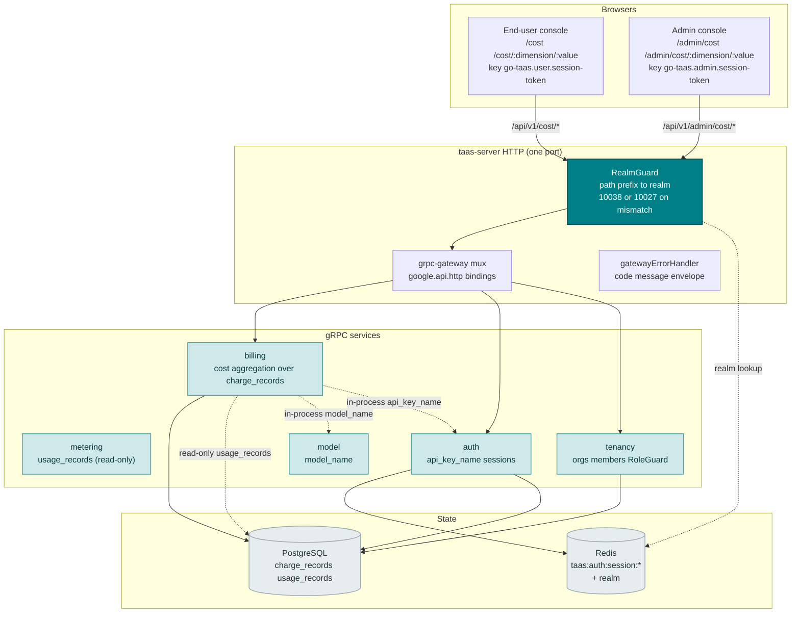
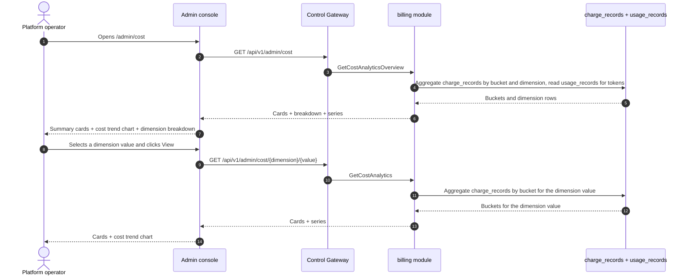
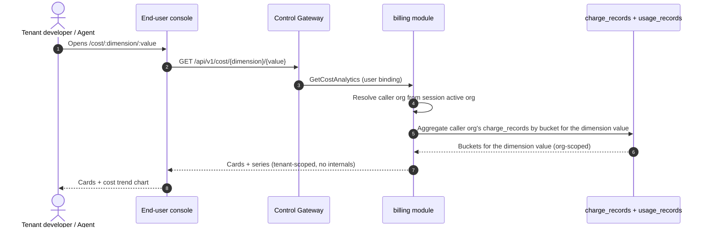
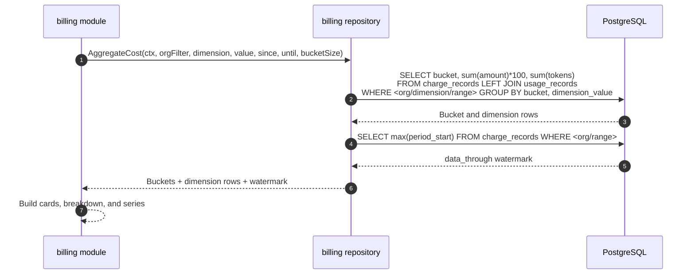

# Cost Analytics Dashboard — Architecture and Detailed Design

| Attribute | Content |
| --- | --- |
| Feature point | Cost analytics dashboard — per-org / per-model / per-key cost attribution with trends, cost-per-token, and cost breakdown by dimension over a time range (backlog row 29) |
| Document scope | Architecture and detailed design for feature-29: read-only cost analytics in the `billing` module (reading `metering`'s `usage_records` read-only over the shared database); the `GetCostAnalyticsOverview` (admin fleet) and `GetCostAnalytics` (dual-bound) RPCs on `BillingService`; the admin Cost pages (`/admin/cost`, `/admin/cost/:dimension/:value`) and the end-user Cost pages (`/cost`, `/cost/:dimension/:value`); plus error handling, configuration, security, rollout, and function-level design per layer |
| Owning modules | `billing` (read-only aggregation over `charge_records` for cost attribution, plus the two RPCs), `metering` (read-only: token totals from `usage_records` over the shared database), `model` (read-only: `model_name` resolution), `auth` (read-only: `api_key_name` resolution, session realm, session active org), `tenancy` (RoleGuard, read-only), `pkg/server` gateway (admin-prefix and user-prefix bindings), console web app (admin `CostAnalyticsPage`/`CostDetailPage`, end-user `UserCostAnalyticsPage`/`UserCostDetailPage`) |
| Related documents | [Requirement Analysis and UI/UX Design](../design/cost-analytics-dashboard.md) · [Architecture Design](../design/architecture.md) §2.6 (`billing`) · [Usage Dashboards & Per-Request Cost Attribution](./usage-dashboard.md) (the sibling read-only dashboard and its inline-SVG chart, freshness, range, and group-by conventions) · [API Key Usage Analytics](./api-key-usage-analytics.md) (the sibling per-key analytics and its top-keys ranking) · [Model × Card-Type Price Matrix & Tiered Pricing](./pricing.md) (the charge formula and effective-dated prices behind every cost figure) · [Console Surface Separation](./console-surface-separation.md) (the two surfaces this feature spans, the `UserShell`/`AdminShell` conventions, the masked-projection rule) |
| Status | Architecture complete, handed to the Developer agent |

---

## 1. Overview and Goals

go-taas turns settled usage into `charge_records` with amounts per key × model × card × hour (feature #5), and the usage dashboard (feature #9) and API key usage analytics (feature #28) attribute cost per key. What the console still cannot answer is the operator's and tenant's question: *where is my money going, and how is cost trending?* The usage dashboard shows cost with a group-by toggle but does not lead with a cost attribution by dimension; the API key analytics page ranks keys by cost but does not break cost down by model or org; and neither shows cost-per-token or a cost trend chart. There is no surface that attributes cost by dimension (org, model, key), shows cost trends over time, and reports cost-per-token.

This feature adds a **cost analytics dashboard**: per-org / per-model / per-key cost attribution with trends, cost-per-token, and cost breakdown by dimension over a time range. It is a **read-only** aggregation layer — nothing in the inference, metering, or billing pipelines changes. It is the smallest independently valuable increment of Phase 4's productionization roadmap item: it turns "cost is high" into "this month's cost is 60% model X, 40% org Y, with a rising cost-per-token".

**Goals**: a `GetCostAnalyticsOverview` RPC (admin fleet: cards + dimension breakdown + cost trend + cost-per-token) and a `GetCostAnalytics` RPC (admin per-dimension drill-down and end-user per-dimension view: cards + trend for one dimension value), both on `BillingService`; an admin Cost page (`/admin/cost`) and per-dimension drill-down (`/admin/cost/:dimension/:value`), and an end-user Cost page (`/cost`) and drill-down (`/cost/:dimension/:value`); new error codes 11301 `CodeCostDimensionInvalid` and 11302 `CodeCostDimensionValueNotFound`; the page → route → API-prefix table with exact prefixes; per-page interactive states including empty, error, and permission-denied; and numbered acceptance criteria testable in Nightwatch against the compose stack.

**Non-goals** (deferred, design §8): real-time streaming metrics (the charge-record cadence stands); forecasts (AWS's 18-month forecast is out of scope); anomaly detection or threshold alerts (feature #26 consumes observability events in-console — out of scope here); saved custom views or dashboards; comparing dimensions side-by-side in a chart (v1 shows a dimension breakdown and a single-dimension trend; a comparison chart is future work); exposing service ids, replica counts, or other operator internals to tenants (D8); any change to the inference, metering, or billing pipelines (read-only feature); new audit events (D10).

### 1.1 Reading order of this document

Section 2 records the architecture decisions (AD1–AD10, mirroring the design's D1–D10). Sections 3–5 are the component view, data model, and API design. Section 6 is the frontend architecture (page → route → API-prefix table for both consoles, auth guard per surface). Sections 7–8 are the sequence flows and error handling. Sections 9–11 are configuration, security, and rollout. Sections 12–14 are the acceptance-criteria traceability, the function-level detailed design, and the ordered implementation task list.

---

## 2. Architecture Decisions

| # | Decision | Rationale |
| --- | --- | --- |
| AD1 | **The cost RPCs live in `BillingService`** and **read `metering`'s `usage_records` directly over the shared database** — no cross-service RPC | Both modules resolve the same `server.Components` PostgreSQL handle (`s.components.DB().GormDB()`), so a direct SQL read is the established pattern (usage-dashboard AD1). The design doc's "owning modules: billing + metering" is honored: billing owns the aggregation and reads metering's usage records read-only (design D3) |
| AD2 | **The cost error block is 11301–11399, the next free block after usage-keys' 112xx.** The usage-keys module owns 11201 (feature #28). The design's "fresh block after the usage-keys block (112xx)" intent is honored by taking the next free block after 112xx | Each module has its own error block (`pkg/errors/codes.go`); usage-keys took 112xx, so cost takes 113xx. This is the interpretation most consistent with the existing architecture (design D9, confirmed) |
| AD3 | **Cost is derived from `charge_records`** (which carry amounts per key × model × card × hour, feature #5), aggregated server-side by dimension. The metric families are **cost** (integer cents), **tokens** (from `usage_records`, input + output + cached + reasoning), and **cost-per-token** (derived client-side as cost ÷ tokens) | `charge_records` carry the authoritative per-key cost (feature #5); `usage_records` carry the token totals (feature #4). Aggregating server-side keeps the payload small and the client dependency-light (design D2) |
| AD4 | **One new RPC per surface shape** rather than extending `GetUsageDashboard`: `GetCostAnalyticsOverview` (admin fleet: cards + dimension breakdown + cost trend + cost-per-token) and `GetCostAnalytics` (admin per-dimension drill-down and end-user per-dimension view: cards + trend for one dimension value). The end-user surface reuses `GetCostAnalytics` scoped to the tenant's own org | The cost page needs several shapes at once (headline cards, a dimension breakdown, a trend); bolting them onto `GetUsageDashboard` would break its established group-by semantics, while separate calls recreate the N+1 slow console. A dedicated pair of RPCs keeps the cost concern out of the usage dashboard's surface (design D3) |
| AD5 | **`dimension` is server-side** — `organization` (admin only), `model`, `api_key` — and switching it refetches. **The metric toggle (cost / tokens / cost-per-token) is client-side** because every bucket carries all three metrics | Payload stays one dimension wide; the toggle feels instant (the AWS/OpenAI pattern). The admin surface supports the `organization` dimension; the end-user surface supports `model` and `api_key` only (the tenant sees only their own org) (design D4) |
| AD6 | **Time buckets adapt to the range**: hourly buckets for ranges ≤ 7 days, daily buckets for ranges > 7 days. The range is capped at **92 days** and validation reuses **10404** (the metering range contract) | Hourly granularity for short ranges shows intra-day cost spikes; daily for long ranges keeps the payload small. The 92-day cap and 10404 reuse keep the range contract uniform with every metering query (usage-dashboard AD7) (design D5) |
| AD7 | **The chart renders with inline SVG** — one bar (or line) per bucket, with a metric switcher (cost / tokens / cost-per-token) — no new charting dependency | The console is deliberately dependency-light; a small, testable SVG component matches the usage-dashboard AD8 decision (design D6) |
| AD8 | **Freshness is explicit**: every response carries `data_through` (the last complete bucket covered by charge records) and the console shows a "data through <time>" note plus a pending/partial marker when the selected range extends past it | Cost-lag confusion is the most consistently recorded pitfall (AWS 24-hour lag, OpenAI usage lag); the marker keeps the freshness story honest with zero new pipeline work (design D7) |
| AD9 | **The end-user surface is tenant-scoped and masked**: `GetCostAnalytics` on the user prefix returns only the tenant's own org's cost, with no service ids, no replica counts, and no other tenants' data | Follows feature #17's masked-projection rule and the observability AD4 pattern: tenants get their own cost attribution, not operator internals (design D8) |
| AD10 | **The admin cost RPCs are fleet-wide by default, not org-scoped.** `GetCostAnalyticsOverview` and the admin binding of `GetCostAnalytics` aggregate across all orgs, with an optional `organization_id` filter read from `X-Organization-Id`. They are gated by `tenancy.RoleGuard` (admin role, 10036). The user binding of `GetCostAnalytics` is hard-scoped to the caller's org (session active org authoritative, `X-Organization-Id` ignored) | The operator needs a cross-org fleet view to manage platform spend; the tenant needs only their own cost attribution. This is the one deliberate deviation from the "admin queries resolve the org" pattern — the fleet view is the point of the admin surface, and RoleGuard keeps it admin-only (design D1, D8) |

---

## 3. Component View

### 3.1 Ownership

| Layer / component | Owns | Changes in this feature |
| --- | --- | --- |
| **Control Gateway (`grpc-gateway`)** | HTTP/JSON facade for the cost RPCs; realm guard (feature #17) already rejects a wrong-realm session with 10038; passes `X-Organization-Id` through as gRPC metadata | New bindings for the two HTTP cost RPCs (Section 5); no change to the realm guard |
| **`billing` module (`services/billing`)** | The read-only cost aggregation over `charge_records`, the two RPCs, the dimension validation, the range validation, the bucket builder, the `data_through` watermark | New RPCs on the existing `BillingService` (AD1, AD4) |
| **`metering` module** | `usage_records` (the token totals for cost-per-token) | Read-only: the billing module reads `usage_records` over the shared database (AD1); no code change |
| **`model` module** | Model metadata (`model_id` → `model_name`) | Read-only: the billing module resolves `model_name` in-process (AD3) |
| **`auth` module** | API key identity (`api_key_id` → `api_key_name`), session realm, session active org | Read-only: the billing module resolves `api_key_name` in-process and the session active org for the user binding (AD9, AD10) |
| **`tenancy` module** | Organizations, members, roles, RoleGuard | Read-only: `RoleGuard` gates the admin cost RPCs by the caller's role (10036) |
| **PostgreSQL** | `charge_records`, `usage_records` (existing) | No new tables; the existing indexes serve the range scans (Section 4) |
| **Console** | Admin Cost pages and end-user Cost pages | Four new pages on the two surfaces (Section 6) |

### 3.2 Runtime component view



### 3.3 Request identity chain

The cost RPCs reuse the established identity chain (console-surface-separation §3.3), with one deliberate difference for the admin fleet view (AD10):

1. `RealmGuard` (HTTP, `pkg/server/realm.go`) — path prefix decides the expected realm. `/api/v1/admin/cost/*` expects `admin`; `/api/v1/cost/*` expects `user`. With no `Authorization` header: pass through (transitional, AD4 of feature #17). With a header: resolve the session realm from Redis; mismatch → 10038, unknown/expired/realm-less → 10027.
2. grpc-gateway mux — routes by the annotated path and forwards `authorization` and `x-organization-id`.
3. Service handler — **admin binding**: the fleet view is cross-org by default; `organization_id` is an optional filter read from `X-Organization-Id` (or the session active org when the caller wants to scope to their own org). **User binding**: `SessionActiveOrg` makes the session's active organization authoritative and ignores `X-Organization-Id`; without a session, `resolveOrganizationID` reads the transitional header and returns 10001 when it is absent or empty.
4. `tenancy.RoleGuard` — gates the admin cost RPCs by the caller's role in the resolved org context (10036). The end-user cost RPC is hard-scoped to the caller's org and needs no role check.

---

## 4. Data Model

### 4.1 No New Tables

The cost feature is a pure read-only aggregation over the existing `charge_records` and `usage_records` tables (AD1, design D10). No new tables, no new MQ subjects, no new runners, and no writes on any path. The columns consumed are:

| Table | Column | Used for |
| --- | --- | --- |
| `charge_records` | `organization_id` | Org scoping (user binding) and the optional admin org filter |
| | `api_key_id` | The `api_key` dimension |
| | `model_id` | The `model` dimension |
| | `period_start` | Bucket assignment and the `data_through` watermark |
| | `amount` | The cost (integer cents) |
| `usage_records` | `api_key_id`, `period_start`, token columns | The token totals for cost-per-token |

### 4.2 Indexes

The existing `charge_records` index `idx_charge_records_org_period (organization_id, period_start)` serves the org-scoped range scan. The admin fleet view (AD10) scans across all orgs, so the `idx_charge_records_group_period (api_key_id, model_id, accelerator_type, period_start)` unique index serves the fleet-wide range scan (it is a leading-column index on the group columns). **No new indexes are required** — the existing indexes cover the cost range scans.

### 4.3 Migration Notes

- No new tables, no new indexes, no data migration, and no init-SQL upgrade path. The feature is a pure read-only aggregation over existing tables (AD1, design D10).

---

## 5. API Design

All cost RPCs belong to the existing **`taas.billing.v1.BillingService`** (`proto/taas/billing/v1/billing.proto`), served as HTTP via the Control Gateway. `GetCostAnalyticsOverview` is admin-only; `GetCostAnalytics` is dual-bound (admin + user). The surface is derived from the request path (Section 3.3).

| RPC | HTTP (admin) | HTTP (user) | Status | Purpose |
| --- | --- | --- | --- | --- |
| `GetCostAnalyticsOverview` | `GET /api/v1/admin/cost` | — | **new** | Fleet cards + dimension breakdown + cost trend + cost-per-token |
| `GetCostAnalytics` | `GET /api/v1/admin/cost/{dimension}/{value}` | `GET /api/v1/cost/{dimension}/{value}` | **new** | Single-dimension-value cards + cost trend (admin: any dimension value; user: tenant-scoped) |

### 5.1 Proto contract

```protobuf
syntax = "proto3";

package taas.billing.v1;

import "google/api/annotations.proto";
import "taas/common/v1/common.proto";

// (Additive to the existing BillingService.)

// GetCostAnalyticsOverview returns fleet-wide cost analytics: summary
// cards, a dimension breakdown, a cost trend, and cost-per-token.
// Admin-surface API: served under /api/v1/admin.
rpc GetCostAnalyticsOverview(GetCostAnalyticsOverviewRequest) returns (GetCostAnalyticsOverviewResponse) {
  option (google.api.http) = {get: "/api/v1/admin/cost"};
}

// GetCostAnalytics returns single-dimension-value cost analytics:
// summary cards and a cost trend. The admin binding covers any dimension
// value; the user binding is tenant-scoped.
rpc GetCostAnalytics(GetCostAnalyticsRequest) returns (GetCostAnalyticsResponse) {
  option (google.api.http) = {
    get: "/api/v1/admin/cost/{dimension}/{value}"
    additional_bindings: {get: "/api/v1/cost/{dimension}/{value}"}
  };
}

message GetCostAnalyticsOverviewRequest {
  // organization_id is an optional fleet filter. On the admin surface
  // it is read from X-Organization-Id (or the session active org);
  // absent means fleet-wide (AD10).
  string organization_id = 1;
  // since/until bound the range, unix seconds. Defaults: until = now,
  // since = until - 24h. A range > 92 days is rejected (10404).
  int64 since = 2;
  int64 until = 3;
  // dimension is one of organization / model / api_key (default
  // organization). An unsupported value returns 11301 (AD2).
  string dimension = 4;
}

message GetCostAnalyticsOverviewResponse {
  taas.common.v1.Response response = 1;
  CostAnalyticsCard cards = 2;
  repeated CostBreakdownRow breakdown = 3;
  repeated CostSeriesPoint series = 4;
}

message GetCostAnalyticsRequest {
  // organization_id is derived from the session active org (user
  // binding) or X-Organization-Id (admin binding); the field exists for
  // gRPC-direct callers.
  string organization_id = 1;
  // dimension is one of organization / model / api_key (admin) or
  // model / api_key (user). An unsupported value returns 11301 (AD2).
  string dimension = 2;
  // value is the dimension value (e.g. a model_id or api_key_id).
  string value = 3;
  // since/until bound the range, unix seconds. Defaults: until = now,
  // since = until - 24h. A range > 92 days is rejected (10404).
  int64 since = 4;
  int64 until = 5;
}

message GetCostAnalyticsResponse {
  taas.common.v1.Response response = 1;
  CostAnalyticsCard cards = 2;
  repeated CostSeriesPoint series = 3;
}

// CostAnalyticsCard is the headline summary of the range. cost_per_token
// and top_dimension_share_pct are derived client-side; the wire carries
// integer cents and integer tokens only.
message CostAnalyticsCard {
  int64 total_cost_cents = 1;
  int64 total_tokens = 2;
  // top_dimension_value is the top dimension value by cost.
  string top_dimension_value = 3;
  // top_dimension_share_pct is derived client-side as top value cost /
  // total cost.
  int64 top_dimension_share_pct = 4;
  // data_through is the start of the last complete bucket covered by
  // charge records (AD8); buckets past it are pending.
  int64 data_through = 5;
}

// CostBreakdownRow is one dimension value's aggregate in the breakdown.
message CostBreakdownRow {
  string dimension_value = 1;
  string dimension_name = 2;
  int64 total_cost_cents = 3;
  int64 total_tokens = 4;
  // cost_per_token and share_pct are derived client-side.
  int64 cost_per_token = 5;
  int64 share_pct = 6;
}

// CostSeriesPoint is one time bucket of the series.
message CostSeriesPoint {
  // bucket is the bucket start, unix seconds (hourly for ranges <= 7
  // days, daily otherwise, AD6).
  int64 bucket = 1;
  int64 total_cost_cents = 2;
  int64 total_tokens = 3;
  // cost_per_token is derived client-side as cost / tokens.
  int64 cost_per_token = 4;
}
```

### 5.2 Contract notes (pinned for the Developer agent)

1. `GetCostAnalyticsOverview` validates `since`/`until` (int64 unix seconds; defaults `until = now`, `since = until − 24h`); `since > until` or a range > 92 days returns 10404 (AD6). `dimension` is one of `organization` / `model` / `api_key` (default `organization`); an unsupported value returns 11301 `CodeCostDimensionInvalid` (AD2). `organization_id` is an optional filter.
2. `GetCostAnalytics` validates the same range contract; an unsupported `dimension` returns 11301, and an unknown dimension value returns 11302 `CodeCostDimensionValueNotFound` (AD2). On the user prefix it is scoped to the caller's organization (AD9) and exposes no service ids or operator internals.
3. Buckets are hourly for ranges ≤ 7 days and daily otherwise (AD6); each bucket carries `bucket`, `total_cost_cents`, `total_tokens`, `cost_per_token`. `cost_per_token` and `share_pct` are derived client-side; the wire carries integer cents and integer tokens only (AD3).
4. Every response carries `data_through` (the last complete bucket covered by charge records) for the freshness marker (AD8).
5. Aggregation reads `charge_records` (feature #5) — `organization_id`, `api_key_id`, `model_id`, `period_start`, `amount` — and `usage_records` (feature #4) for token totals; it writes nothing (AD1, design D10).
6. Wire conventions unchanged: dotted pagination where lists apply, HTTP 200 on success, business errors as `{"code": <int>, "message": "..."}`, int64 fields serialized as JSON strings.

### 5.3 Error codes

Error codes (cost block 11301–11399, `pkg/errors/codes.go`):

| Condition | Code | Constant | Notes |
| --- | --- | --- | --- |
| An unsupported `dimension` | 11301 | `CodeCostDimensionInvalid` | **New** (AD2) |
| An unknown dimension value | 11302 | `CodeCostDimensionValueNotFound` | **New** (AD2) |
| A malformed or over-long range | 10404 | `CodeMeteringRangeInvalid` | Reused (AD6) — the metering range contract |
| Database / infrastructure failure | 500 | `CodeInternal` | Via error normalization |

---

## 6. Frontend Architecture

### 6.1 Page → Route → API-prefix table

| Page / component | Surface | Web route | API prefix | Auth guard |
| --- | --- | --- | --- | --- |
| **Cost Analytics page** | admin | `/admin/cost` | `/api/v1/admin/cost` | admin session; RoleGuard (admin role) |
| **Cost Detail page** | admin | `/admin/cost/:dimension/:value` | `/api/v1/admin/cost/{dimension}/{value}` | admin session; RoleGuard (admin role) |
| **Cost Analytics page** | end-user | `/cost` | `/api/v1/cost` | user session; hard-scoped to caller's org |
| **Cost Detail page** | end-user | `/cost/:dimension/:value` | `/api/v1/cost/{dimension}/{value}` | user session; hard-scoped to caller's org |

> The admin Cost pages call only `/api/v1/admin/cost/*`; the end-user Cost pages call only `/api/v1/cost/*`. The two surfaces never share a session token (feature #17).

### 6.2 Navigation placement

- **Admin console**: a new **Cost** item (`/admin/cost`, testid `nav-cost`) in the admin nav, in the operations group alongside Usage, Usage Keys, and Observability.
- **End-user console**: a new **Cost** item (`/cost`, testid `user-nav-cost`) in the user nav, alongside Usage and Usage Keys.

### 6.3 Shared components and state to reuse

- **API client** (`web/src/api.ts`): the realm-scoped client (`createApi(realm)`) already sends `Authorization: Bearer <realm>.session-token` and `X-Organization-Id` (only when the realm token key is empty). The cost pages reuse it unchanged; no new client is added.
- **Inline-SVG chart**: a new shared `CostChart.tsx` component (one bar/line per bucket with a metric switcher), following the usage-dashboard `UsageChart.tsx` pattern (AD7). The metric switcher toggles cost / tokens / cost-per-token client-side with no refetch.
- **Time-range filter**: the preset control (24 h / 7 d / 30 d / custom with a date-time picker) is shared with the Usage, Request Logs, and Observability pages.
- **Summary cards**: a new shared `CostCards.tsx` component rendering the card row with the "data through <time>" freshness note (AD8).
- **Dimension breakdown**: a new shared `CostBreakdownTable.tsx` component rendering the dimension values with share bars.
- **Status / freshness badge**: the pending/partial marker past `data_through` reuses the usage-dashboard pending-badge styling.
- **Empty state / data-freshness note**: the Request Logs page pattern (a note that metrics appear within the ingestion window) is reused.

### 6.4 Auth guard per surface

- **Admin Cost pages** (`/admin/cost`, `/admin/cost/:dimension/:value`): rendered inside `AdminShell`, which runs the admin session guard when `go-taas.admin.session-token` is non-empty; a missing/expired session redirects to `/admin/login?reason=expired`; a wrong-realm session is rejected by the gateway with 10038. The pages' API calls go to `/api/v1/admin/cost/*`. A session without the required role receives 10036 and the page shows the standard permission-denied state (feature #17).
- **End-user Cost pages** (`/cost`, `/cost/:dimension/:value`): rendered inside `UserShell`, which runs the user session guard when `go-taas.user.session-token` is non-empty; a missing/expired session redirects to `/login?reason=expired`. The pages' API calls go to `/api/v1/cost/*`. The pages expose no service ids or operator internals (AD9).
- **Unauthenticated visitors**: an unauthenticated visitor to either page is redirected to the correct login (`/admin/login` vs `/login`) by the shell guard.

### 6.5 Console contract (pinned for the Developer agent)

**Cost Analytics page** (`/admin/cost`): a page header ("Cost", subtitle "Cost attribution by dimension over time") with a **Refresh** action (`cost-refresh`). Below: a **filter bar** — a **Time range** control (`cost-filter-range`, presets 24 h / 7 d / 30 d / custom), a **Dimension** control (`cost-filter-dimension`, dropdown: Organization / Model / API key; default Organization), and a **Model** filter (`cost-filter-model`, dropdown, "All models" default, shown when the dimension is not Model); a row of **summary cards** (`cost-cards`): Total cost, Total tokens, Cost per token, Top dimension (the top dimension value with its share), each with a "data through <time>" note; an inline-SVG **cost trend chart** (`cost-chart`) with a metric switcher (`cost-metric-toggle`); and a **dimension breakdown** table (`cost-breakdown`, `cost-breakdown-row-{dimension_value}`) with columns Dimension value (link to the drill-down), Cost, Tokens, Cost per token, Share. Sortable by Cost, Tokens, Cost per token, and Share; filterable by the Model dropdown (when applicable); paginated. Empty state: "No cost data in this range." with a hint to widen the range. Error state: an error banner with a Retry button and a "Showing stale data" banner. Permission-denied: the standard state with a link back to the admin home.

**Cost Detail page** (`/admin/cost/:dimension/:value`): a back link to the overview, a header with the dimension name and value, a filter bar (Time range), summary cards, and the inline-SVG cost trend chart with the metric switcher. Empty copy: "No cost data for this dimension value in this range." Not-found state (11302) shows the standard not-found state with a link back to the overview.

**End-user Cost Analytics page** (`/cost`): identical to the admin page, scoped to the tenant's own usage. The **Dimension** control offers Model / API key only (default Model). Empty copy "No cost data in this range." and the tenant's own permission-denied copy (10005 org gone / 10017 org disabled from feature #17 §8.2).

**End-user Cost Detail page** (`/cost/:dimension/:value`): identical to the admin detail, scoped to the tenant's own usage of the dimension value. Not-found copy for an unknown dimension value (11302) and the tenant's own permission-denied copy (10005/10017).

---

## 7. Sequence Flows

### 7.1 Admin fleet cost overview load



### 7.2 End-user tenant-scoped cost view load



### 7.3 The aggregation query



---

## 8. Error Handling

All errors are `pkg/errors` business codes in the unified envelope (Section 5.3). The cost module is read-only, so there are no runner-side failures and no writes to fail. A database failure is normalized to 500 `CodeInternal`.

The console branches on the body `code` (as `web/src/api.ts` already does), never on the HTTP status. Each new code renders a specific inline message: 11301 "invalid dimension", 11302 "dimension value not found", 10404 "invalid range" (the metering range contract). The admin pages map 10036 to the standard permission-denied state; the end-user pages map 10005/10017 to the tenant's permission-denied copy (feature #17 §8.2).

---

## 9. Configuration Additions

None. The cost feature is a pure read-only aggregation over existing tables and reuses the metering range contract (10404) and the existing `billing`-module range cap. No new config keys, runners, or MQ subjects are added (AD1, design D10).

---

## 10. Security Considerations

- **Surface separation**: the admin Cost pages call only `/api/v1/admin/cost/*`; the end-user Cost pages call only `/api/v1/cost/*`. The realm guard rejects a wrong-realm session with 10038 before any handler runs (feature #17).
- **Admin fleet view gated by role**: the admin cost RPCs are fleet-wide by default (AD10) and gated by `tenancy.RoleGuard` — only a caller with the required admin role can see the cross-org fleet view; an inaccessible org returns 10036.
- **End-user hard scoping**: the user binding of `GetCostAnalytics` is hard-scoped to the caller's org (session active org authoritative, `X-Organization-Id` ignored); a caller can never see another tenant's cost.
- **Masked projection**: the end-user surface exposes no service ids, replica counts, or other operator orchestration internals (AD9). The admin surface is operator-scoped.
- **Read-only by construction**: the cost module issues only `SELECT`s; no writes on any path (AD1, design D10). No new audit events are needed — the underlying charge-record writes are already audited (feature #15).

---

## 11. Rollout / Upgrade Notes

- **No schema change**: the feature reads existing tables only; deploy `taas-server` alone. No new tables, no new indexes, no data migration, no init-SQL upgrade path.
- **The proto change is additive**: two new RPCs on the existing `BillingService`; no existing RPC or message changes. The gateway mux gains the new bindings; the realm guard is unchanged.
- **Console**: the four new pages are added to the existing bundle; the admin nav gains Cost, the end-user nav gains Cost. No existing route changes.
- **Backward compatibility**: the transitional (session-less, `X-Organization-Id`) path is preserved for the CLI, FVT, and e2e suites; the realm guard passes through requests without an `Authorization` header (feature #17 AD4).
- **Empty until data exists**: the cost RPCs return empty cards/breakdown/series until charge records exist; the pages render the empty state with a hint to widen the range.

---

## 12. Acceptance-Criteria Traceability

| # | Criterion | Where addressed |
| --- | --- | --- |
| AC1 | `GetCostAnalyticsOverview` with a valid range returns summary cards, a dimension breakdown, a cost trend, and cost-per-token; a range > 92 days or `since > until` returns 10404 | §5.1, §5.2, §5.3 |
| AC2 | `GetCostAnalyticsOverview` with an unsupported `dimension` returns 11301 | §5.1, §5.2, §5.3 |
| AC3 | `GetCostAnalytics` (admin) returns single-dimension-value cards and a cost trend; an unsupported `dimension` returns 11301 and an unknown dimension value returns 11302 | §5.1, §5.2, §5.3 |
| AC4 | `GetCostAnalytics` (user) returns only the caller's organization's cost, with no service ids or operator internals | §3.3, §6.4, §10 |
| AC5 | Buckets are hourly for ranges ≤ 7 days and daily for ranges > 7 days; every response carries `data_through` | §5.2, §7.3 |
| AC6 | The `/admin/cost` page renders the filter bar, summary cards, the cost trend chart, and the dimension breakdown from the first successful load, with a last-updated timestamp | §6.5 |
| AC7 | Changing the time range, dimension, or model filter refetches and re-renders the cards, chart, and breakdown; the metric switcher toggles the chart metric | §6.3, §6.5 |
| AC8 | The empty state ("No cost data in this range.") renders when no data matches; a failed load keeps the last good data with a "Showing stale data" banner and a Retry action | §6.5 |
| AC9 | The `/admin/cost/:dimension/:value` page renders the dimension value's cards and cost trend chart; an unknown dimension value shows the not-found state | §6.5 |
| AC10 | The `/cost` and `/cost/:dimension/:value` pages render the tenant's own cards, breakdown, and trend, with no service ids or operator internals visible | §6.5, §10 |
| AC11 | The admin cost pages are reachable only on the admin surface: routes `/admin/cost` and `/admin/cost/:dimension/:value`, every API call uses the `/api/v1/admin/cost/*` prefix with no `/api/v1/cost/*` string | §6.1, §6.4, §10 |
| AC12 | The end-user cost pages are reachable only on the end-user surface: routes `/cost` and `/cost/:dimension/:value`, every API call uses the `/api/v1/cost/*` prefix with no `/api/v1/admin/*` string | §6.1, §6.4, §10 |
| AC13 | A session without the required role receives 10036 on the admin cost pages and the page shows the standard permission-denied state | §3.3, §6.4, §10 |

---

## 13. Detailed Design (function-level responsibilities per layer)

### 13.1 Proto → service → repository → controller

| Layer | File | Responsibilities |
| --- | --- | --- |
| `proto/taas/billing/v1` | `billing.proto` | Additive: `GetCostAnalyticsOverview`/`GetCostAnalytics` RPCs + `GetCostAnalyticsOverviewRequest/Response`, `GetCostAnalyticsRequest/Response`, `CostAnalyticsCard`, `CostBreakdownRow`, `CostSeriesPoint` messages (Section 5.1). Regenerate `billing.pb.go`/`billing_grpc.pb.go`/`billing.pb.gw.go` via `buf generate` |
| `services/billing` | `cost_analytics_model.go` | The aggregation row structs (`CostBucketRow`, `CostBreakdownRow`) and the `bucketSizeForRange` helper (hourly ≤ 7 d, daily otherwise, AD6) |
| | `cost_analytics_repository.go` | `AggregateCost(ctx, orgFilter, dimension, value, since, until, bucketSize)` — the aggregation (cards + breakdown rows + series) over `charge_records` LEFT JOIN `usage_records` (AD3); `DataThrough(ctx, orgFilter, since, until)` — the `max(period_start)` watermark (AD8) |
| | `service.go` | New RPCs `GetCostAnalyticsOverview`, `GetCostAnalytics`; the dimension validation (11301, AD2); the dimension-value not-found (11302, AD2); the range validation (10404, AD6); the admin fleet scope vs user hard-scope resolution (AD10); the `SessionActiveOrg`/`resolveOrganizationID` seam; the `RoleGuard` seam for admin org scoping; the in-process `model_name`/`api_key_name` resolution (AD3) |
| `services/metering` | `service.go` | **Unchanged** — its `usage_records` are read read-only by the billing module over the shared database (AD1) |
| `services/model` | `service.go` | Read-only: expose a `ModelName(ctx, modelID) (string, error)` seam (or reuse `GetModel`) for the billing module to resolve `model_name` in-process (AD3) |
| `services/auth` | `service.go` | Read-only: expose an `APIKeyName(ctx, apiKeyID) (string, error)` seam for the billing module to resolve `api_key_name` in-process (AD3) |
| `pkg/errors` | `codes.go`/`messages.go` | `CodeCostDimensionInvalid` (11301) + `CodeCostDimensionValueNotFound` (11302) constants + canonical messages "invalid cost dimension" / "cost dimension value not found" (AD2) |
| `apps/taas-server` | `main.go` | No change — the cost RPCs ride the existing billing service registration; wire the `model`/`auth` name-resolution seams and the `tenancy` RoleGuard into the billing service |
| `web/src` | `pages/CostAnalyticsPage.tsx`, `pages/CostDetailPage.tsx`, `pages/user/UserCostAnalyticsPage.tsx`, `pages/user/UserCostDetailPage.tsx`, `components/CostChart.tsx`, `components/CostCards.tsx`, `components/CostBreakdownTable.tsx`, `App.tsx`, `api.ts`, `shells/AdminShell.tsx`, `shells/UserShell.tsx` | Routes `/admin/cost`, `/admin/cost/:dimension/:value`, `/cost`, `/cost/:dimension/:value`; `GetCostAnalyticsOverview`/`GetCostAnalytics` API types and calls; nav items (Section 6.5) |
| `test` | `fvt/cost_analytics_fvt_test.go`, `e2e/tests/costAnalytics.js` | Section 14 |

### 13.2 Which React page/module implements each screen

| Screen | React module | Route | API calls |
| --- | --- | --- | --- |
| Cost Analytics page (admin) | `web/src/pages/CostAnalyticsPage.tsx` | `/admin/cost` | `GetCostAnalyticsOverview` |
| Cost Detail page (admin) | `web/src/pages/CostDetailPage.tsx` | `/admin/cost/:dimension/:value` | `GetCostAnalytics` |
| Cost Analytics page (end-user) | `web/src/pages/user/UserCostAnalyticsPage.tsx` | `/cost` | `GetCostAnalyticsOverview` |
| Cost Detail page (end-user) | `web/src/pages/user/UserCostDetailPage.tsx` | `/cost/:dimension/:value` | `GetCostAnalytics` |
| Inline-SVG chart | `web/src/components/CostChart.tsx` (shared) | (on all four pages) | (client-side; metric switcher, no refetch) |
| Summary cards | `web/src/components/CostCards.tsx` (shared) | (on all four pages) | (client-side; renders the returned cards) |
| Dimension breakdown | `web/src/components/CostBreakdownTable.tsx` (shared) | (on the two overview pages) | (client-side; renders the returned breakdown) |

---

## 14. Testing Strategy

- **Unit** (`services/billing`, sqlite in-memory): `cost_analytics_repository_test.go` — `AggregateCost` returns correct cards/breakdown rows/series for a seeded `charge_records` set (AC1, AC3), `DataThrough` returns the last complete bucket (AC5), the bucket size switches at the 7-day boundary (AC5). `service_test.go` — range validation returns 10404 for `since > until` and a range > 92 days (AC1); an unsupported `dimension` returns 11301 (AC2, AC3); an unknown dimension value returns 11302 (AC3); the user binding is hard-scoped to the caller's org and exposes no service ids (AC4); admin org scoping returns 10036 (AC13). Coverage ≥ 80% on the new files.
- **FVT** (`test/fvt/cost_analytics_fvt_test.go`, the billing FVT pattern: file-backed sqlite + `MigrateSchemaForFVT` + `NewForFVT` + gRPC server with the production interceptor + gateway mux with `FVTHeaderMatcher`): seed `charge_records` and `usage_records` rows across orgs/models/keys, then assert `GetCostAnalyticsOverview` cards/breakdown/series (AC1), the 11301 invalid-dimension (AC2), `GetCostAnalytics` admin single-dimension-value cards/series and 11301/11302 (AC3), the user binding returns only the caller org's rows with no internals (AC4), hourly vs daily buckets and `data_through` (AC5), and 10404 inline (AC1).
- **E2E** (`test/e2e/tests/costAnalytics.js`, the `usageDashboard.js` pattern): against the compose stack — the admin `/admin/cost` page renders `cost-cards`, `cost-chart`, and `cost-breakdown` from the first successful load (AC6); changing the time range, dimension, or model filter refetches and the metric switcher toggles the chart metric (AC7); the empty state and stale-data banner render (AC8); the admin drill-down renders the dimension value's cards and trend and the not-found state (AC9); the end-user `/cost` and `/cost/:dimension/:value` pages render the tenant's own cards/breakdown/trend with no service ids (AC10); each page calls only its own prefix and an unauthenticated visitor is redirected to the correct login (AC11/AC12); a session without the required role receives 10036 and shows the permission-denied state (AC13).