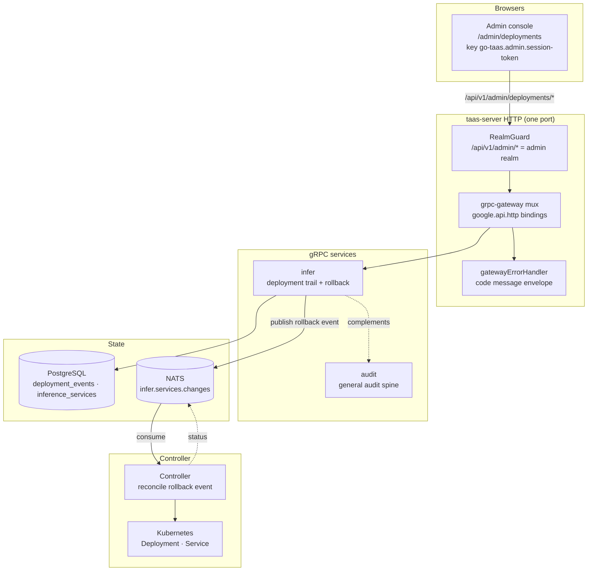
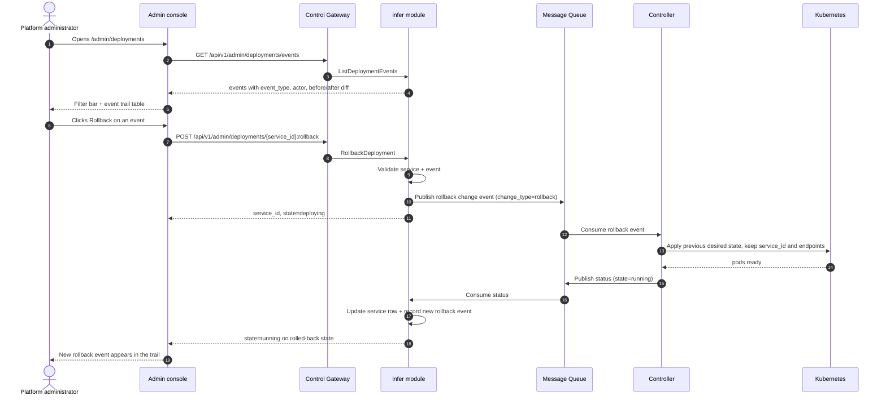

# Deployment History & Audit — Architecture and Detailed Design

| Attribute | Content |
| --- | --- |
| Feature point | Deployment history & audit — deployment audit trail (create/update/scale/rollback events) with timestamps, actor, and diff, plus rollback from history (backlog row 34) |
| Document scope | Architecture and detailed design for feature-34: the `deployment_events` table, the `ListDeploymentEvents` and `RollbackDeployment` RPCs on `InferServiceService`, the admin Deployment History page (`/admin/deployments`), plus error handling, configuration, security, rollout, and function-level design per layer |
| Owning modules | `infer` (deployment-event trail over the inference-service lifecycle, the diff computation, and the rollback-from-history RPC), `audit` (read-only: the general audit spine this feature's deployment trail complements), `web` admin console (`DeploymentHistoryPage`), `controller` (read-only: reconcile a rollback event) |
| Related documents | [Requirement Analysis and UI/UX Design](../design/deployment-history-audit.md) · [Architecture Design](../design/architecture.md) §2.4 (`infer`), §2.7 Controller, §4.2 one-click deployment flow · [Model Catalog & One-Click Deployment](./model-catalog-deployment.md) (the inference-service lifecycle and the change-event structure) · [Audit Logging & Activity Export](./audit-logging.md) (the general control-plane audit spine this feature's deployment trail complements) · [Model Versioning & Rollback](./model-versioning.md) (the sibling rollback surface this feature extends to the deployment level) · [Console Surface Separation](./console-surface-separation.md) (the two surfaces, the `AdminShell` conventions, the masked-projection rule) |
| Status | Architecture complete, handed to the Developer agent |

---

## 1. Overview and Goals

go-taas runs inference services as Kubernetes Deployments (model-catalog-deployment §4.2) and already records every control-plane mutation in the general audit spine (`audit_events`, feature #15). What the console still cannot answer is the deployment-specific question: *what happened to this inference service over its life?* The general audit log records `infer.service.create` / `infer.service.scale` / `infer.service.delete` events, but it does not carry a **diff** (what exactly changed — replicas 2→4, version A→B) and it does not offer **rollback from history** (revert a service to a previous desired state). The operator must reconstruct the change from the audit metadata and manually re-apply it.

This feature adds a **deployment history & audit** surface: a per-service deployment audit trail (create/update/scale/rollback events) with timestamps, actor, and diff, plus rollback from history.

**Goals**:

- A `deployment_events` table recording the inference-service lifecycle trail (create/update/scale/rollback), each event with `service_id`, `event_type`, `actor`, `before`/`after` (the field-level diff), and `created_at`.
- A `ListDeploymentEvents` RPC returning the trail for a service (or across services), filtered by event type, actor, and time range, with the field-level diff per event.
- A `RollbackDeployment` RPC reverting a service to a selected historical state (the `before` of a chosen event), keeping the same `service_id` and endpoints.
- An admin Deployment History page (`/admin/deployments`).
- New error codes in a deployment-history block (118xx).
- The page → route → API-prefix table with the exact admin prefix; per-page interactive states including empty, error, and permission-denied; numbered acceptance criteria testable in Nightwatch against the compose stack.

**Non-goals** (deferred, design §8): the general control-plane audit log and export (#15); request-level traces (#27); model version-level rollback (#32); the inference service logs viewer (#33); canary/blue-green upgrades; a user-realm deployment-history surface (D1).

### 1.1 Reading order of this document

Section 2 records the architecture decisions (AD1–AD7, mirroring the design's D1–D7). Sections 3–5 are the component view, data model, and API design. Section 6 is the frontend architecture (page → route → API-prefix table, auth guard). Sections 7–8 are the sequence flows and error handling. Sections 9–11 are configuration, security, and rollout. Sections 12–14 are the acceptance-criteria traceability, the function-level detailed design, and the ordered implementation task list.

---

## 2. Architecture Decisions

| # | Decision | Rationale |
| --- | --- | --- |
| AD1 | **Deployment history lives on the admin surface only**: `/admin/deployments` + `/api/v1/admin/deployments/*`. There is **no end-user surface** — deployment internals are operator-orchestration (feature #17's masked-projection rule); tenants consume the service's endpoints, not its deployment history | Design D1. The operator needs the deployment trail to audit and roll back; tenants need the endpoint, not the internals. Consistent with the admin-only accelerator inventory (feature #18) and system status (feature #30) |
| AD2 | **A new `deployment_events` table** records the inference-service lifecycle trail (create/update/scale/rollback), each event with `service_id`, `event_type`, `actor`, `before`/`after` (the field-level diff), and `created_at`. It is written by the `infer` module on every lifecycle mutation, complementing (not replacing) the general `audit_events` spine | Design D2. The general audit log (feature #15) records the mutation but not the field-level diff; a deployment-specific trail with before/after is the actionable history the operator needs. It is a separate table with its own lifecycle, mirroring how `audit_events` is separate from `request_logs` |
| AD3 | **The diff is field-level** — each event carries `before`/`after` for the mutable spec fields (replicas, model/version, image, accelerator, card type, autoscaling policy). The console renders a compact before/after diff, not a full spec dump | Design D3. A field-level diff is actionable (pattern 2); a full spec dump is not (pitfall) |
| AD4 | **A new `ListDeploymentEvents` RPC** returns the trail for a service (or across services), filtered by event type, actor, and time range, with the field-level diff per event | Design D4. The page needs the trail with diffs; a dedicated RPC keeps the deployment-history concern out of the general audit surface |
| AD5 | **A new `RollbackDeployment` RPC** reverts a service to a selected historical state (the `before` of a chosen event), keeping the same `service_id` and endpoints; the service goes through `deploying` then back to `running` | Design D5. "Roll back from history" means the same endpoint serves the previous desired state; delete+recreate would change the `service_id` and break Agents. The Controller reconciles the rollback event by applying the previous desired state |
| AD6 | **Rollback is confirmable and guarded** — the console shows a confirmation dialog naming the target state and warning that Agents on the endpoints will see the change; rollback is disabled for a service in a state that cannot be updated (e.g. `terminated`) | Design D6. Rollback is a destructive change to a live service (pitfall); a guard prevents accidental rollback and a warning sets expectations |
| AD7 | **The deployment trail is read-only except for rollback** — the page writes nothing except the rollback action; it is reachable only by authenticated admin sessions | Design D7. The trail is a pure record of lifecycle events; the only mutation is the deliberate rollback (D5). No new audit events are needed beyond the rollback itself |

---

## 3. Component View

### 3.1 Ownership

| Layer / component | Owns | Changes in this feature |
| --- | --- | --- |
| **Control Gateway (`grpc-gateway`)** | HTTP/JSON facade for the two RPCs; realm guard (feature #17) already rejects a wrong-realm session with 10038; passes `X-Organization-Id` through as gRPC metadata | New bindings for `ListDeploymentEvents` and `RollbackDeployment` (Section 5); no change to the realm guard |
| **`infer` module (`services/infer`)** | The `deployment_events` table, the event recorder on every lifecycle mutation, the diff computation, the `ListDeploymentEvents` and `RollbackDeployment` RPCs | New RPCs on the existing `InferServiceService` (AD4, AD5); the event recorder (AD2) |
| **`audit` module** | The general `audit_events` spine | Read-only: the deployment trail complements it; no code change |
| **`controller`** | Reconciles a rollback event by applying the previous desired state | Read/write: the reconciler handles the rollback event type (AD5) |
| **PostgreSQL** | `deployment_events` (new); `inference_services` (unchanged) | One new table via AutoMigrate (Section 4) |
| **Console** | Admin Deployment History page | One new page on the admin surface (Section 6) |

### 3.2 Runtime component view



### 3.3 Request identity chain

The deployment-history RPCs are **admin-surface** (AD1). The chain is:

1. `RealmGuard` (HTTP, `pkg/server/realm.go`) — path prefix `/api/v1/admin/deployments/*` decides the expected realm `admin`. With no `Authorization` header: pass through (transitional, feature-17 AD4). With a header: resolve the session realm from Redis; mismatch → 10038, unknown/expired/realm-less → 10027.
2. grpc-gateway mux — routes by the annotated path and forwards `authorization` and `x-organization-id`.
3. Service handler — the `infer` module resolves the service by `service_id` (the service carries its own `organization_id`).
4. `tenancy.RoleGuard` — gates the admin deployment RPCs by the caller's role (10036). The permission-denied state (design FR5.1, AC9) is produced by the role check.

---

## 4. Data Model

### 4.1 The `deployment_events` Table (new)

| Column | PostgreSQL type | Constraints | Description |
| --- | --- | --- | --- |
| `id` | `uuid` | PRIMARY KEY | Server-generated UUID v4, exposed as `event_id` |
| `service_id` | `uuid` | NOT NULL, indexed | The inference service the event belongs to |
| `service_name` | `varchar(63)` | NOT NULL | The service name (denormalized for display) |
| `event_type` | `varchar(16)` | NOT NULL | `create` / `update` / `scale` / `rollback` / `delete` |
| `actor` | `varchar(128)` | NOT NULL | User id or `system` |
| `before` | `jsonb` | NOT NULL DEFAULT '{}' | The field-level diff `before` (mutable spec fields) |
| `after` | `jsonb` | NOT NULL DEFAULT '{}' | The field-level diff `after` (mutable spec fields) |
| `created_at` | `timestamptz` | NOT NULL | Event time (UTC) |

Indexes:

| Index | Definition | Purpose |
| --- | --- | --- |
| Primary key | `(id)` | Event identity |
| Composite | `(service_id, created_at DESC)` | Per-service trail, newest first |
| Composite | `(created_at DESC)` | Cross-service trail, newest first |
| Composite | `(event_type)` | Event-type filter |

The `before`/`after` JSON covers the mutable spec fields: `replicas`, `model_version`, `image_id`, `accelerator`, `accelerator_type`, and `autoscaling` (the effective policy). Fields unchanged between `before` and `after` are omitted (AD3).

### 4.2 Migration Notes

- The `deployment_events` table is created by **GORM `AutoMigrate` at startup** through the `Migrator` hook. The `infer` module's `Migrate`/`MigrateSchemaForFVT` gain the `DeploymentEvent` model.
- The change is additive-only; no backfill is needed (the trail starts recording from the feature's deployment onward).
- The `inference_services` table is unchanged.

---

## 5. API Design

### 5.1 RPC Surface

Two new RPCs on `taas.infer.v1.InferServiceService`. Both are served as HTTP via the Control Gateway on the **admin prefix** `/api/v1/admin/deployments/*` (AD1). There is **no user-prefix binding** (AD1).

| Service | RPC | HTTP | Status | Purpose |
| --- | --- | --- | --- | --- |
| `taas.infer.v1` | `ListDeploymentEvents` | `GET /api/v1/admin/deployments/events` | **new** | Deployment event trail with field-level diffs, filtered and paginated |
| `taas.infer.v1` | `RollbackDeployment` | `POST /api/v1/admin/deployments/{service_id}:rollback` | **new** | Revert a service to a previous state in place (AD5) |

### 5.2 Proto Messages

```proto
// infer.proto (additive)

// ListDeploymentEvents returns the deployment event trail, newest first,
// with field-level diffs, filtered by service/event type/actor/time range.
// Admin-surface API: served under /api/v1/admin.
rpc ListDeploymentEvents(ListDeploymentEventsRequest) returns (ListDeploymentEventsResponse) {
  option (google.api.http) = {get: "/api/v1/admin/deployments/events"};
}

message ListDeploymentEventsRequest {
  // service_id is optional; when empty the trail spans all services.
  string service_id = 1;
  // event_type is optional: create / update / scale / rollback / delete.
  string event_type = 2;
  // actor is optional.
  string actor = 3;
  // since / until are unix seconds; optional.
  int64 since = 4;
  int64 until = 5;
  taas.common.v1.PageRequest page = 6;
}

message DeploymentEvent {
  string event_id = 1;
  string service_id = 2;
  string service_name = 3;
  string event_type = 4;
  string actor = 5;
  // before / after are the field-level diff (mutable spec fields).
  string before = 6;
  string after = 7;
  int64 created_at = 8;
}

message ListDeploymentEventsResponse {
  taas.common.v1.Response response = 1;
  repeated DeploymentEvent events = 2;
  taas.common.v1.PageMeta page_meta = 3;
}

// RollbackDeployment reverts a service to a selected historical state
// (the before of a chosen event), keeping the same service_id and
// endpoints. The service goes through deploying then back to running.
// Admin-surface API: served under /api/v1/admin.
rpc RollbackDeployment(RollbackDeploymentRequest) returns (RollbackDeploymentResponse) {
  option (google.api.http) = {
    post: "/api/v1/admin/deployments/{service_id}:rollback"
    body: "*"
  };
}

message RollbackDeploymentRequest {
  string service_id = 1; // path
  // event_id is the event whose before is the rollback target.
  string event_id = 2;
}

message RollbackDeploymentResponse {
  taas.common.v1.Response response = 1;
  string service_id = 2;
  string state = 3; // deploying
}
```

### 5.3 Wire Format (established conventions)

- Pagination binds as `?page.offset=0&page.limit=20` (dotted form); bare `offset`/`limit` are silently ignored. Default limit 20, cap 100.
- Success responses are HTTP 200 (grpc-gateway default for unary RPCs).
- Business errors render as `{"code": <int>, "message": "..."}` with HTTP 500 for out-of-range codes (platform-wide status quo).
- int64 fields serialize as JSON strings.

### 5.4 Validation Matrix

`ListDeploymentEvents` validates: if `service_id` is present, it must exist (10301); `since`/`until` must form a valid range (10404). `RollbackDeployment` validates, in order:

| # | Check | Failure code | Canonical message |
| --- | --- | --- | --- |
| 1 | `service_id` exists | 10301 `CodeInferServiceNotFound` | inference service not found |
| 2 | service state is updatable (not `terminated`) | 10303 `CodeInferServiceStateInvalid` | inference service state invalid |
| 3 | `event_id` exists and belongs to the service | 10304 `CodeInferEndpointNotFound` | inference endpoint not found |

### 5.5 State Machine

`RollbackDeployment` reuses the existing inference-service state machine (model-catalog-deployment §4.4): `running → deploying → running`. The rollback event is a new event type on the existing `infer.services.changes` subject; the Controller reconciles it by applying the previous desired state (the `before` of the target event) while keeping the service identity and endpoints.

---

## 5.6 Message Contract

### 5.6.1 Rollback Event (`infer.services.changes`)

The `infer` module publishes a rollback event on the existing `infer.services.changes` subject. The event body is the existing desired-state change envelope with a new `change_type` field:

```json
{
  "change_type": "rollback",
  "service_id": "<uuid>",
  "organization_id": "<org>",
  "model_id": "<uuid>",
  "model_version": "<target-version>",
  "image_id": "<uuid>",
  "replicas": 2,
  "accelerator": "nvidia",
  "accelerator_type": "A800"
}
```

The Controller decodes `change_type=rollback`, applies the previous desired state (the `before` of the target event), keeps the Service and endpoints, and reports observed state on `infer.services.status`. The `infer` status consumer updates the service row and records a new `rollback` event in the trail (FR2.3).

---

## 6. Frontend Architecture

### 6.1 Page → Route → API-Prefix Table

| Page | Surface | Web route | API prefix |
| --- | --- | --- | --- |
| Deployment History page | admin | `/admin/deployments` | `/api/v1/admin/deployments/events` |
| Rollback dialog | admin | `/admin/deployments` (dialog) | `/api/v1/admin/deployments/{service_id}:rollback` |

Every page and API call is on the **admin surface**; there is no end-user surface (AD1). Admin pages never call a `/api/v1/*` route, and the admin session realm is used throughout.

### 6.2 Navigation Placement

The Deployment History page is a top-level admin nav item ("Deployments") under the operations group. It renders inside `AdminShell` (feature #17).

### 6.3 Shared Components and State

- `AdminShell` (feature #17) — the page shell, session guard, and permission-denied state.
- The shared time-range preset control (24 h / 7 d / 30 d / custom) from the Usage/Observability pages.
- The inference-services list (from `ListInferenceServices`) for the Service dropdown filter.
- Standard table, badge, dialog, and skeleton components from the existing admin pages.

### 6.4 Auth Guard per Surface

The page is admin-surface. The `RealmGuard` (feature #17) rejects a wrong-realm session with 10038 and an unknown/expired/realm-less session with 10027. `tenancy.RoleGuard` gates the RPCs by the caller's role (10036). The page's permission-denied handling is the standard feature-17 state.

### 6.5 Page: `/admin/deployments` — Deployment History (admin)

**Purpose**: give the platform administrator a single surface to audit an inference service's deployment history — view the event trail with timestamps, actors, and field-level diffs, and roll a service back to a previous state.

**Layout**: rendered inside `AdminShell`. A page header ("Deployment History", subtitle "Inference service lifecycle events") with a **Refresh** action (secondary). Below:

1. **Filter bar** — a **Service** dropdown (optional, from the inference-services list), an **Event type** dropdown (All / Create / Update / Scale / Rollback / Delete), an **Actor** box (optional), and a **Time range** control (the shared preset: 24 h / 7 d / 30 d / custom).
2. **Event trail table** — columns: **Time** (created_at), **Service** (name), **Event** (type badge), **Actor**, **Diff** (a compact before/after summary, e.g. "replicas 2 → 4"), **Actions** (Rollback, when the event's `before` is a valid rollback target).

**Interactive states**:

| State | Behaviour |
| --- | --- |
| Default | Filter bar + event trail table render from the first successful load |
| Loading | Skeleton table; Refresh is disabled |
| Empty | "No deployment events in this window." with a hint to widen the time range or clear filters; the filter bar stays visible |
| Error | An error banner with the message and a Retry button; the page keeps its last good data with a "Showing stale data" banner |
| Disabled | Refresh is disabled while a load is in flight; Rollback is disabled on events whose `before` is not a valid rollback target (e.g. the service is `terminated`) |
| Permission-denied | A session without the required role receives 10036 and the page shows the standard permission-denied state (feature #17) with a link back to the admin home |

**Event trail table columns**: Time, Service, Event (type badge), Actor, Diff (compact before/after), Actions (Rollback). Sortable by Time. Filterable by event type, actor, and time range. Paginated (`offset`/`limit`, default 20, max 100).

**Rollback confirmation dialog**: "Roll `<service>` back to the state before this event? The diff is `<summary>`. Agents calling this service's endpoints will see the change." with **Cancel** (secondary) and **Roll back** (primary). On success the service goes through `deploying` then `running`, and a new `rollback` event appears in the trail.

---

## 7. Sequence Flows

### 7.1 Roll back from history



---

## 8. Error Handling

| Condition | Code | Constant | Notes |
| --- | --- | --- | --- |
| Unknown `service_id` | 10301 | `CodeInferServiceNotFound` | `ListDeploymentEvents`, `RollbackDeployment` |
| Service state not updatable | 10303 | `CodeInferServiceStateInvalid` | `RollbackDeployment` on e.g. `terminated` (FR2.2) |
| Unknown `event_id` | 10304 | `CodeInferEndpointNotFound` | Reused for an unknown deployment event (FR2.2) |
| Invalid time range | 10404 | `CodeMeteringRangeInvalid` | Reused — the metering range contract (FR1.2) |
| Wrong-realm session | 10038 | `CodeRealmMismatch` | gateway realm guard |
| Unknown/expired/realm-less session | 10027 | `CodeSessionInvalid` | gateway realm guard |
| Insufficient role | 10036 | `CodeForbidden` | `tenancy.RoleGuard` |

The design doc allocates a **deployment-history error block 118xx** for this feature. The existing codes above (10301/10303/10304/10404) already cover every failure mode the design names; the 118xx block is reserved for any future deployment-history-specific code the Developer agent needs. If a new code is required, it must be added to `pkg/errors/codes.go` in the 118xx block with a comment naming this feature.

---

## 9. Configuration

No new configuration is required for this feature. The rollback event reuses the existing `infer.services.changes` subject and the existing controller reconciliation path. The event recorder (AD2) runs in-process on every lifecycle mutation; no retention runner is needed in v1 (the trail grows with the service lifecycle; retention is a future refinement).

---

## 10. Security Considerations

- **Admin-only surface** (AD1): deployment internals are operator-orchestration; tenants never see them. The `RealmGuard` and `RoleGuard` enforce the surface and role.
- **Actor attribution** (AD2): every event carries who performed it (user or `system`), so a change is attributable.
- **Field-level diff, not a full spec dump** (AD3): the console renders a compact before/after diff, never raw pod names, revision numbers, or Deployment specs (feature #17's masked-projection rule).
- **Guarded rollback** (AD6): rollback is confirmable and disabled for a service in a state that cannot be updated; the dialog warns that Agents on the endpoints will see the change.

---

## 11. Rollout / Upgrade Notes

- The `deployment_events` table is additive via AutoMigrate; no data migration or backfill is needed.
- The new RPCs bind under the existing admin prefix; the realm guard already treats that prefix as the admin surface.
- The rollback event is a new `change_type` on the existing `infer.services.changes` subject; the Controller must be deployed with the new reconciler before the `infer` module publishes `rollback` events (or the Controller must ignore unknown change types gracefully).
- The event recorder starts recording from the feature's deployment onward; historical events before the upgrade are not backfilled.

---

## 12. Acceptance-Criteria Traceability

| AC | Design | Architecture section | Level |
| --- | --- | --- | --- |
| AC1 | `ListDeploymentEvents` returns the trail newest first with service_id/service_name/event_type/actor/before-after diff/created_at; unknown service_id → 10301 | §5.1, §5.2, §5.4 | FVT |
| AC2 | The before/after diff covers replicas/model_version/image_id/accelerator/accelerator_type/autoscaling, omitting unchanged fields | §4.1, §5.2 | FVT |
| AC3 | `RollbackDeployment` reverts to the target event's before, keeps service_id/endpoints, transitions running→deploying→running, records a new rollback event; unknown service → 10301, unknown event → 10304, terminated → 10303 | §5.1, §5.2, §5.4, §5.5 | FVT |
| AC4 | `/admin/deployments` renders filter bar + event trail table from first load with event-type badges, actors, compact diffs | §6.5 | E2E |
| AC5 | Changing event-type/actor/time-range filter refetches; event-type filter shows only matching events | §6.5 | E2E |
| AC6 | Clicking Rollback shows a confirmation dialog naming the service and diff; confirming calls `RollbackDeployment` and a new rollback event appears | §6.5, §7.1 | E2E |
| AC7 | Rollback is disabled on events whose before is not a valid rollback target (e.g. the service is terminated) | §6.5 | E2E |
| AC8 | Admin surface only: route `/admin/deployments`, every API call uses `/api/v1/admin/deployments/*` with no `/api/v1/*` string | §6.1 | E2E (surface separation) |
| AC9 | A session without the required role receives 10036 and the page shows the standard permission-denied state | §6.4, §8 | E2E |

---

## 13. Function-Level Detailed Design

### 13.1 `infer` module (`services/infer`)

| File | Function | Responsibility |
| --- | --- | --- |
| `deployment_event_model.go` (new) | `DeploymentEvent` GORM model | The `deployment_events` table schema (AD2) |
| `deployment_event_repository.go` (new) | `RecordEvent(ctx, service, eventType, actor, before, after)` | Insert a deployment event row (AD2) |
| | `ListEvents(ctx, filter)` | Query the trail newest first, filtered by service/event type/actor/time range, paginated (AD4) |
| | `GetEvent(ctx, eventID)` | Return one event or `CodeInferEndpointNotFound` (reused for an unknown event) |
| `service.go` | `ListDeploymentEvents(ctx, req)` | Validate `service_id` (10301) and range (10404); call `ListEvents`; build the response |
| | `RollbackDeployment(ctx, req)` | Validate `service_id` (10301), state not `terminated` (10303), `event_id` exists and belongs to the service (10304); apply the event's `before` as the new desired state; set `state=deploying`; publish a rollback event (`change_type=rollback`); return `service_id` + `state=deploying` |
| | `recordLifecycleEvent(...)` | Called on every lifecycle mutation (create/update/scale/delete) to record the trail (AD2) |
| `status_consumer.go` | (existing) | On the status report for a rollback reconcile, update the service row and record a new `rollback` event (FR2.3) |

### 13.2 `controller` (`internal/controller`)

| File | Function | Responsibility |
| --- | --- | --- |
| `reconciler.go` | `ApplyInferServiceChange` | Decode `change_type=rollback`; apply the previous desired state (the `before` of the target event), keep the Service and endpoints; report observed state on `infer.services.status` |

### 13.3 `web` admin console

| File | Page | Responsibility |
| --- | --- | --- |
| `pages/DeploymentHistoryPage.tsx` | `/admin/deployments` | Filter bar (service/event type/actor/time range), event trail table with compact diffs, rollback dialog (AD6) |
| `App.tsx` / `router.tsx` | route registration | Register `/admin/deployments` on the admin surface |

---

## 14. Ordered Implementation Task List

1. `pkg/errors/codes.go` — reserve the 118xx block comment for deployment-history (no new code needed unless a failure mode requires it).
2. `proto/taas/infer/v1/infer.proto` — add `ListDeploymentEvents` + `RollbackDeployment` RPCs and messages; regenerate.
3. `services/infer/deployment_event_model.go` — the `DeploymentEvent` GORM model.
4. `services/infer/deployment_event_repository.go` — `RecordEvent`, `ListEvents`, `GetEvent`.
5. `services/infer/service.go` — `ListDeploymentEvents`, `RollbackDeployment`, `recordLifecycleEvent`; wire the recorder into the existing lifecycle mutations.
6. `internal/controller/reconciler.go` — handle `change_type=rollback`.
7. `web/src/pages/DeploymentHistoryPage.tsx` — the page; register the route.
8. FVT + E2E tests for AC1–AC9.