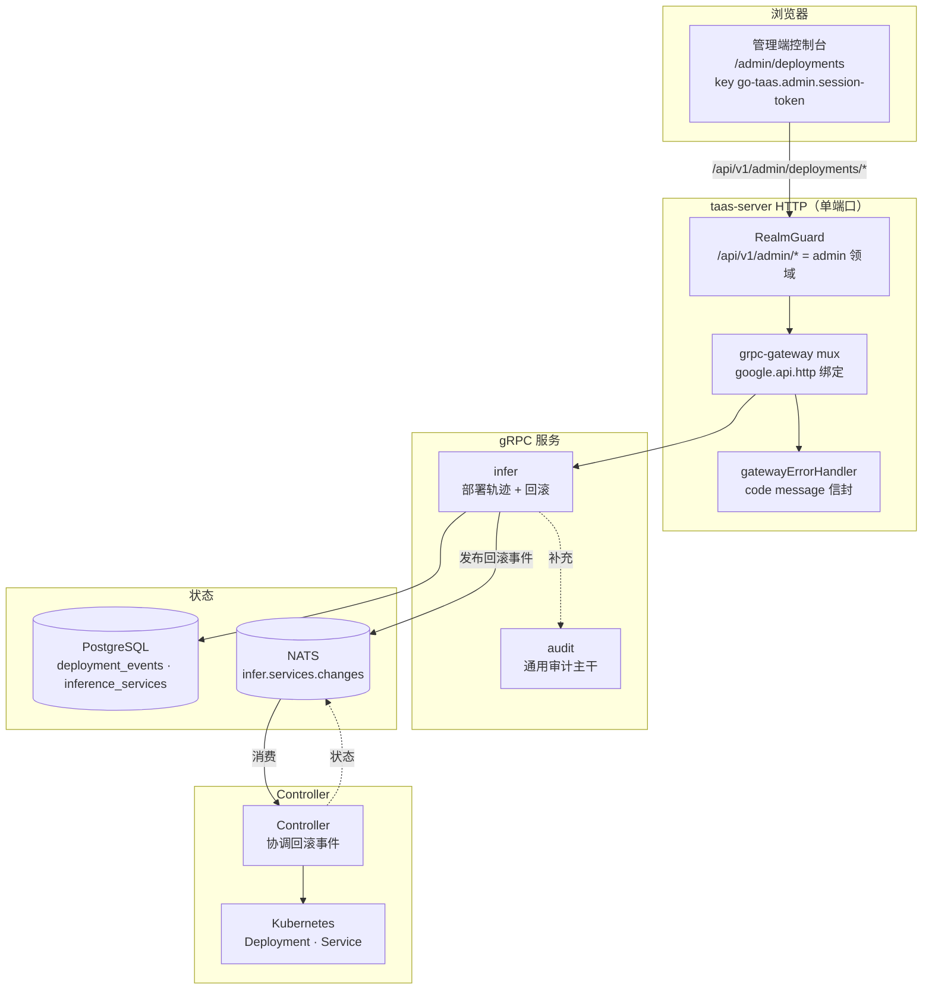
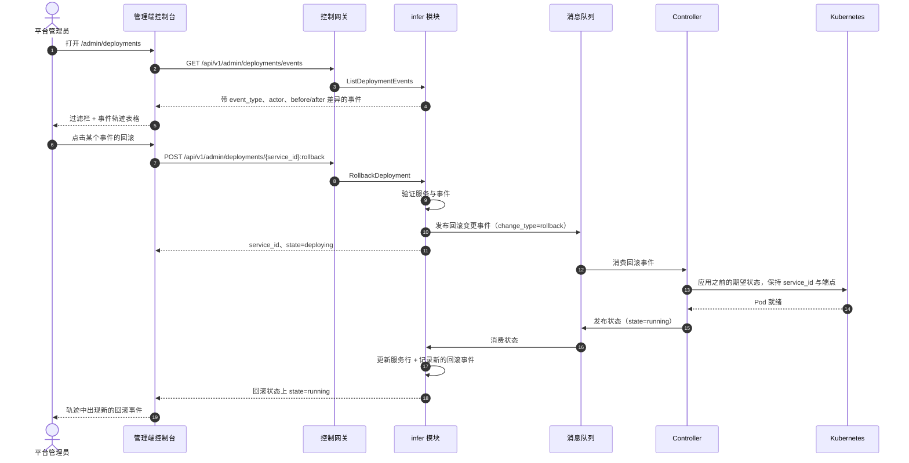

# 部署历史与审计 —— 架构与详细设计

| 属性 | 内容 |
| --- | --- |
| 功能点 | 部署历史与审计 —— 部署审计轨迹（创建/更新/扩缩容/回滚事件），带时间戳、操作者与差异，以及从历史回滚（backlog 第 34 行） |
| 文档范围 | 功能点 34 的架构与详细设计：`deployment_events` 表、`InferServiceService` 上的 `ListDeploymentEvents` 与 `RollbackDeployment` RPC、管理端部署历史页面（`/admin/deployments`），以及错误处理、配置、安全、上线与各层函数级设计 |
| 所属模块 | `infer`（推理服务生命周期上的部署事件轨迹、差异计算与从历史回滚 RPC）、`audit`（只读：本功能的部署轨迹所补充的通用审计主干）、`web` 管理端控制台（`DeploymentHistoryPage`）、`controller`（只读：协调回滚事件） |
| 相关文档 | [需求分析与 UI/UX 设计](../design/deployment-history-audit.md) · [架构设计](../design/architecture.md) §2.4（`infer`）、§2.7 Controller、§4.2 一键部署流程 · [模型目录与一键部署](./model-catalog-deployment.md)（推理服务生命周期与变更事件结构）· [审计日志与活动导出](./audit-logging.md)（本功能的部署轨迹所补充的通用控制面审计主干）· [模型版本管理与回滚](./model-versioning.md)（本功能扩展到部署级别的同级回滚表面）· [控制台表面分离](./console-surface-separation.md)（两个表面、`AdminShell` 约定、掩码投影规则） |
| 状态 | 架构完成，已移交给开发智能体 |

---

## 1. 概述与目标

go-taas 将推理服务作为 Kubernetes Deployment 运行（model-catalog-deployment §4.2），并已在通用审计主干（`audit_events`，功能点 #15）中记录每个控制面变更。控制台目前仍无法回答部署特定的问题：*这个推理服务在其生命周期内发生了什么？* 通用审计日志记录 `infer.service.create` / `infer.service.scale` / `infer.service.delete` 事件，但它不携带**差异**（到底改了什么 —— 副本 2→4、版本 A→B），也不提供**从历史回滚**（将服务恢复到之前的期望状态）。操作员必须从审计元数据重建变更并手动重新应用。

本功能新增**部署历史与审计**表面：带时间戳、操作者与差异的每服务部署审计轨迹（创建/更新/扩缩容/回滚事件），以及从历史回滚。

**目标**：

- 一个 `deployment_events` 表，记录推理服务生命周期轨迹（创建/更新/扩缩容/回滚），每个事件带 `service_id`、`event_type`、`actor`、`before`/`after`（字段级差异）与 `created_at`。
- 一个 `ListDeploymentEvents` RPC，返回单个服务（或跨服务）的轨迹，按事件类型、操作者与时间范围过滤，每个事件带字段级差异。
- 一个 `RollbackDeployment` RPC，将服务恢复到所选历史状态（所选事件的 `before`），保持相同的 `service_id` 与端点。
- 一个管理端部署历史页面（`/admin/deployments`）。
- 部署历史错误块（118xx）中的新错误码。
- 页面 → 路由 → API 前缀表，带精确的管理端前缀；包括空、错误、权限拒绝在内的各页面交互状态；可在 compose 栈上通过 Nightwatch 测试的编号验收标准。

**非目标**（延后，设计 §8）：通用控制面审计日志与导出（#15）；请求级追踪（#27）；模型版本级回滚（#32）；推理服务日志查看器（#33）；金丝雀/蓝绿升级；用户端部署历史表面（D1）。

### 1.1 本文档阅读顺序

第 2 节记录架构决策（AD1–AD7，对应设计的 D1–D7）。第 3–5 节是组件视图、数据模型与 API 设计。第 6 节是前端架构（页面 → 路由 → API 前缀表、认证守卫）。第 7–8 节是时序流程与错误处理。第 9–11 节是配置、安全与上线。第 12–14 节是验收标准可追溯性、函数级详细设计与有序实现任务清单。

---

## 2. 架构决策

| # | 决策 | 理由 |
| --- | --- | --- |
| AD1 | **部署历史仅存在于管理端表面**：`/admin/deployments` + `/api/v1/admin/deployments/*`。**没有用户端表面** —— 部署内部信息是操作员编排（功能点 #17 的掩码投影规则）；租户消费服务的端点，而非其部署历史 | 设计 D1。操作员需要部署轨迹来审计与回滚；租户需要端点，而非内部信息。与仅管理端的加速器清单（功能点 #18）和系统状态（功能点 #30）一致 |
| AD2 | **新增 `deployment_events` 表**，记录推理服务生命周期轨迹（创建/更新/扩缩容/回滚），每个事件带 `service_id`、`event_type`、`actor`、`before`/`after`（字段级差异）与 `created_at`。它由 `infer` 模块在每次生命周期变更时写入，补充（而非替代）通用 `audit_events` 主干 | 设计 D2。通用审计日志（功能点 #15）记录变更但不记录字段级差异；带 before/after 的部署特定轨迹是操作员需要的可操作历史。它是带自身生命周期的独立表，镜像 `audit_events` 与 `request_logs` 分离的方式 |
| AD3 | **差异是字段级的** —— 每个事件为可变 spec 字段（replicas、model/version、image、accelerator、card type、autoscaling policy）携带 `before`/`after`。控制台渲染紧凑的 before/after 差异，而非完整 spec 转储 | 设计 D3。字段级差异是可操作的（模式 2）；完整 spec 转储不可操作（陷阱） |
| AD4 | **新增 `ListDeploymentEvents` RPC**，返回单个服务（或跨服务）的轨迹，按事件类型、操作者与时间范围过滤，每个事件带字段级差异 | 设计 D4。页面需要带差异的轨迹；专用 RPC 将部署历史关注点排除在通用审计表面之外 |
| AD5 | **新增 `RollbackDeployment` RPC**，将服务恢复到所选历史状态（所选事件的 `before`），保持相同的 `service_id` 与端点；服务经历 `deploying` 然后回到 `running` | 设计 D5。"从历史回滚"意味着同一端点服务之前的期望状态；删除+重建会改变 `service_id` 并破坏智能体。Controller 通过应用之前的期望状态来协调回滚事件 |
| AD6 | **回滚是可确认且有守卫的** —— 控制台显示命名目标状态并警告端点上的智能体将看到变更的确认对话框；对处于无法更新状态（如 `terminated`）的服务禁用回滚 | 设计 D6。回滚是对活动服务的破坏性变更（陷阱）；守卫防止意外回滚，警告设定预期 |
| AD7 | **部署轨迹除回滚外是只读的** —— 页面除回滚操作外不写入任何内容；仅可由已认证的管理端会话访问 | 设计 D7。轨迹是生命周期事件的纯记录；唯一变更是刻意的回滚（D5）。除回滚本身外无需新审计事件 |

---

## 3. 组件视图

### 3.1 职责归属

| 层 / 组件 | 拥有 | 本功能的变更 |
| --- | --- | --- |
| **控制网关（`grpc-gateway`）** | 两个 RPC 的 HTTP/JSON 门面；领域守卫（功能点 #17）已用 10038 拒绝错误领域的会话；将 `X-Organization-Id` 作为 gRPC 元数据传递 | `ListDeploymentEvents` 与 `RollbackDeployment` 的新绑定（第 5 节）；领域守卫无变更 |
| **`infer` 模块（`services/infer`）** | `deployment_events` 表、每次生命周期变更上的事件记录器、差异计算、`ListDeploymentEvents` 与 `RollbackDeployment` RPC | 现有 `InferServiceService` 上的新 RPC（AD4、AD5）；事件记录器（AD2） |
| **`audit` 模块** | 通用 `audit_events` 主干 | 只读：部署轨迹补充它；无代码变更 |
| **`controller`** | 通过应用之前的期望状态来协调回滚事件 | 读写：协调器处理回滚事件类型（AD5） |
| **PostgreSQL** | `deployment_events`（新）；`inference_services`（不变） | 通过 AutoMigrate 新增一个表（第 4 节） |
| **控制台** | 管理端部署历史页面 | 管理端表面上的一个新页面（第 6 节） |

### 3.2 运行时组件视图



### 3.3 请求身份链

部署历史 RPC 是**管理端表面**（AD1）。链路为：

1. `RealmGuard`（HTTP，`pkg/server/realm.go`）—— 路径前缀 `/api/v1/admin/deployments/*` 决定期望领域 `admin`。无 `Authorization` 头：放行（过渡期，功能点-17 AD4）。有头：从 Redis 解析会话领域；不匹配 → 10038，未知/过期/无领域 → 10027。
2. grpc-gateway mux —— 按注解路径路由并转发 `authorization` 与 `x-organization-id`。
3. 服务处理器 —— `infer` 模块按 `service_id` 解析服务（服务自带 `organization_id`）。
4. `tenancy.RoleGuard` —— 按调用者角色门控管理端部署 RPC（10036）。权限拒绝状态（设计 FR5.1、AC9）由角色检查产生。

---

## 4. 数据模型

### 4.1 `deployment_events` 表（新）

| 列 | PostgreSQL 类型 | 约束 | 描述 |
| --- | --- | --- | --- |
| `id` | `uuid` | PRIMARY KEY | 服务器生成的 UUID v4，暴露为 `event_id` |
| `service_id` | `uuid` | NOT NULL，已索引 | 事件所属的推理服务 |
| `service_name` | `varchar(63)` | NOT NULL | 服务名（为显示反规范化） |
| `event_type` | `varchar(16)` | NOT NULL | `create` / `update` / `scale` / `rollback` / `delete` |
| `actor` | `varchar(128)` | NOT NULL | 用户 id 或 `system` |
| `before` | `jsonb` | NOT NULL DEFAULT '{}' | 字段级差异 `before`（可变 spec 字段） |
| `after` | `jsonb` | NOT NULL DEFAULT '{}' | 字段级差异 `after`（可变 spec 字段） |
| `created_at` | `timestamptz` | NOT NULL | 事件时间（UTC） |

索引：

| 索引 | 定义 | 用途 |
| --- | --- | --- |
| 主键 | `(id)` | 事件身份 |
| 复合 | `(service_id, created_at DESC)` | 每服务轨迹，最新在前 |
| 复合 | `(created_at DESC)` | 跨服务轨迹，最新在前 |
| 复合 | `(event_type)` | 事件类型过滤 |

`before`/`after` JSON 覆盖可变 spec 字段：`replicas`、`model_version`、`image_id`、`accelerator`、`accelerator_type` 与 `autoscaling`（有效策略）。`before` 与 `after` 之间未变化的字段被省略（AD3）。

### 4.2 迁移说明

- `deployment_events` 表通过 **GORM `AutoMigrate` 在启动时**通过 `Migrator` 钩子创建。`infer` 模块的 `Migrate`/`MigrateSchemaForFVT` 新增 `DeploymentEvent` 模型。
- 变更是加性的；无需回填（轨迹从功能部署起开始记录）。
- `inference_services` 表不变。

---

## 5. API 设计

### 5.1 RPC 表面

`taas.infer.v1.InferServiceService` 上两个新 RPC。两者都通过控制网关在**管理端前缀** `/api/v1/admin/deployments/*` 上以 HTTP 提供（AD1）。**没有用户前缀绑定**（AD1）。

| 服务 | RPC | HTTP | 状态 | 用途 |
| --- | --- | --- | --- | --- |
| `taas.infer.v1` | `ListDeploymentEvents` | `GET /api/v1/admin/deployments/events` | **新** | 带字段级差异的部署事件轨迹，过滤与分页 |
| `taas.infer.v1` | `RollbackDeployment` | `POST /api/v1/admin/deployments/{service_id}:rollback` | **新** | 将服务原地恢复到之前的状态（AD5） |

### 5.2 Proto 消息

```proto
// infer.proto（加性）

// ListDeploymentEvents 返回部署事件轨迹，最新在前，带字段级差异，按服务/事件类型/操作者/时间范围过滤。
// 管理端表面 API：在 /api/v1/admin 下提供。
rpc ListDeploymentEvents(ListDeploymentEventsRequest) returns (ListDeploymentEventsResponse) {
  option (google.api.http) = {get: "/api/v1/admin/deployments/events"};
}

message ListDeploymentEventsRequest {
  // service_id 可选；为空时轨迹跨所有服务。
  string service_id = 1;
  // event_type 可选：create / update / scale / rollback / delete。
  string event_type = 2;
  // actor 可选。
  string actor = 3;
  // since / until 是 unix 秒；可选。
  int64 since = 4;
  int64 until = 5;
  taas.common.v1.PageRequest page = 6;
}

message DeploymentEvent {
  string event_id = 1;
  string service_id = 2;
  string service_name = 3;
  string event_type = 4;
  string actor = 5;
  // before / after 是字段级差异（可变 spec 字段）。
  string before = 6;
  string after = 7;
  int64 created_at = 8;
}

message ListDeploymentEventsResponse {
  taas.common.v1.Response response = 1;
  repeated DeploymentEvent events = 2;
  taas.common.v1.PageMeta page_meta = 3;
}

// RollbackDeployment 将服务恢复到所选历史状态（所选事件的 before），保持相同的 service_id 与端点。
// 服务经历 deploying 然后回到 running。
// 管理端表面 API：在 /api/v1/admin 下提供。
rpc RollbackDeployment(RollbackDeploymentRequest) returns (RollbackDeploymentResponse) {
  option (google.api.http) = {
    post: "/api/v1/admin/deployments/{service_id}:rollback"
    body: "*"
  };
}

message RollbackDeploymentRequest {
  string service_id = 1; // path
  // event_id 是其 before 为回滚目标的事件。
  string event_id = 2;
}

message RollbackDeploymentResponse {
  taas.common.v1.Response response = 1;
  string service_id = 2;
  string state = 3; // deploying
}
```

### 5.3 线上格式（既定约定）

- 分页绑定为 `?page.offset=0&page.limit=20`（点形式）；裸 `offset`/`limit` 被静默忽略。默认 limit 20，上限 100。
- 成功响应为 HTTP 200（grpc-gateway 对一元 RPC 的默认）。
- 业务错误渲染为 `{"code": <int>, "message": "..."}`，越界码为 HTTP 500（平台现状）。
- int64 字段序列化为 JSON 字符串。

### 5.4 校验矩阵

`ListDeploymentEvents` 校验：若存在 `service_id`，它必须存在（10301）；`since`/`until` 必须构成有效范围（10404）。`RollbackDeployment` 按顺序校验：

| # | 检查 | 失败码 | 规范消息 |
| --- | --- | --- | --- |
| 1 | `service_id` 存在 | 10301 `CodeInferServiceNotFound` | inference service not found |
| 2 | 服务状态可更新（非 `terminated`） | 10303 `CodeInferServiceStateInvalid` | inference service state invalid |
| 3 | `event_id` 存在且属于该服务 | 10304 `CodeInferEndpointNotFound` | inference endpoint not found |

### 5.5 状态机

`RollbackDeployment` 复用现有推理服务状态机（model-catalog-deployment §4.4）：`running → deploying → running`。回滚事件是现有 `infer.services.changes` 主题上的新事件类型；Controller 通过应用之前的期望状态（目标事件的 `before`）同时保持服务身份与端点来协调它。

---

## 5.6 消息契约

### 5.6.1 回滚事件（`infer.services.changes`）

`infer` 模块在现有 `infer.services.changes` 主题上发布回滚事件。事件体是带新 `change_type` 字段的现有期望状态变更信封：

```json
{
  "change_type": "rollback",
  "service_id": "<uuid>",
  "organization_id": "<org>",
  "model_id": "<uuid>",
  "model_version": "<target-version>",
  "image_id": "<uuid>",
  "replicas": 2,
  "accelerator": "nvidia",
  "accelerator_type": "A800"
}
```

Controller 解码 `change_type=rollback`，应用之前的期望状态（目标事件的 `before`），保持 Service 与端点，并在 `infer.services.status` 上报告观察状态。`infer` 状态消费者更新服务行并在轨迹中记录新的 `rollback` 事件（FR2.3）。

---

## 6. 前端架构

### 6.1 页面 → 路由 → API 前缀表

| 页面 | 表面 | Web 路由 | API 前缀 |
| --- | --- | --- | --- |
| 部署历史页面 | admin | `/admin/deployments` | `/api/v1/admin/deployments/events` |
| 回滚对话框 | admin | `/admin/deployments`（对话框） | `/api/v1/admin/deployments/{service_id}:rollback` |

每个页面和 API 调用都在**管理端表面**上；没有用户端表面（AD1）。管理端页面从不调用 `/api/v1/*` 路由，全程使用管理端会话领域。

### 6.2 导航位置

部署历史页面是操作组下的顶层管理端导航项（"部署"）。它在 `AdminShell`（功能点 #17）内渲染。

### 6.3 共享组件与状态

- `AdminShell`（功能点 #17）—— 页面外壳、会话守卫与权限拒绝状态。
- 来自使用/可观测性页面的共享时间范围预设控件（24 小时 / 7 天 / 30 天 / 自定义）。
- 用于服务下拉过滤的推理服务列表（来自 `ListInferenceServices`）。
- 来自现有管理端页面的标准表格、徽章、对话框与骨架组件。

### 6.4 各表面认证守卫

页面是管理端表面。`RealmGuard`（功能点 #17）用 10038 拒绝错误领域的会话，用 10027 拒绝未知/过期/无领域会话。`tenancy.RoleGuard` 按调用者角色门控 RPC（10036）。页面的权限拒绝处理是标准的功能点-17 状态。

### 6.5 页面：`/admin/deployments` —— 部署历史（admin）

**用途**：为平台管理员提供审计推理服务部署历史的单一表面 —— 查看带时间戳、操作者与字段级差异的事件轨迹，并将服务回滚到之前的状态。

**布局**：在 `AdminShell` 内渲染。页面头部（"部署历史"，副标题"推理服务生命周期事件"），带**刷新**操作（次要）。下方：

1. **过滤栏** —— **服务**下拉（可选，来自推理服务列表）、**事件类型**下拉（全部/创建/更新/扩缩容/回滚/删除）、**操作者**框（可选）与**时间范围**控件（共享预设：24 小时 / 7 天 / 30 天 / 自定义）。
2. **事件轨迹表格** —— 列：**时间**（created_at）、**服务**（名称）、**事件**（类型徽章）、**操作者**、**差异**（紧凑的 before/after 摘要，如"replicas 2 → 4"）、**操作**（回滚，当事件的 `before` 是有效回滚目标时）。

**交互状态**：

| 状态 | 行为 |
| --- | --- |
| 默认 | 过滤栏 + 事件轨迹表格在首次成功加载时渲染 |
| 加载中 | 骨架表格；刷新被禁用 |
| 空 | "此窗口内没有部署事件。"并提示加宽时间范围或清除过滤；过滤栏保持可见 |
| 错误 | 带消息的错误横幅与重试按钮；页面保留最后的好数据并显示"显示过期数据"横幅 |
| 禁用 | 加载进行中时刷新被禁用；`before` 不是有效回滚目标（如服务 `terminated`）的事件上回滚被禁用 |
| 权限拒绝 | 无所需角色的会话收到 10036，页面显示标准权限拒绝状态（功能点 #17），带返回管理端首页的链接 |

**事件轨迹表格列**：时间、服务、事件（类型徽章）、操作者、差异（紧凑 before/after）、操作（回滚）。可按时间排序。可按事件类型、操作者与时间范围过滤。分页（`offset`/`limit`，默认 20，最大 100）。

**回滚确认对话框**："将 `<service>` 回滚到此事件之前的状态？差异为 `<summary>`。调用此服务端点的智能体将看到变更。"带**取消**（次要）与**回滚**（主要）。成功后服务经历 `deploying` 然后 `running`，轨迹中出现新的 `rollback` 事件。

---

## 7. 时序流程

### 7.1 从历史回滚



---

## 8. 错误处理

| 条件 | 码 | 常量 | 说明 |
| --- | --- | --- | --- |
| 未知 `service_id` | 10301 | `CodeInferServiceNotFound` | `ListDeploymentEvents`、`RollbackDeployment` |
| 服务状态不可更新 | 10303 | `CodeInferServiceStateInvalid` | `RollbackDeployment` 在如 `terminated` 上（FR2.2） |
| 未知 `event_id` | 10304 | `CodeInferEndpointNotFound` | 复用于未知部署事件（FR2.2） |
| 无效时间范围 | 10404 | `CodeMeteringRangeInvalid` | 复用 —— 计量范围契约（FR1.2） |
| 错误领域会话 | 10038 | `CodeRealmMismatch` | 网关领域守卫 |
| 未知/过期/无领域会话 | 10027 | `CodeSessionInvalid` | 网关领域守卫 |
| 角色不足 | 10036 | `CodeForbidden` | `tenancy.RoleGuard` |

设计文档为本功能分配**部署历史错误块 118xx**。上述现有码（10301/10303/10304/10404）已覆盖设计命名的每个失败模式；118xx 块保留给开发智能体未来可能需要的任何部署历史特定码。如需新码，必须将其添加到 `pkg/errors/codes.go` 的 118xx 块中，并带命名本功能的注释。

---

## 9. 配置

本功能无需新配置。回滚事件复用现有 `infer.services.changes` 主题与现有 Controller 协调路径。事件记录器（AD2）在每次生命周期变更时进程内运行；v1 中无需保留 runner（轨迹随服务生命周期增长；保留是未来的细化）。

---

## 10. 安全考虑

- **仅管理端表面**（AD1）：部署内部信息是操作员编排；租户从不看到它们。`RealmGuard` 与 `RoleGuard` 强制表面与角色。
- **操作者归属**（AD2）：每个事件携带执行者（用户或 `system`），因此变更可归属。
- **字段级差异，而非完整 spec 转储**（AD3）：控制台渲染紧凑的 before/after 差异，绝不渲染原始 Pod 名、修订号或 Deployment spec（功能点 #17 的掩码投影规则）。
- **有守卫的回滚**（AD6）：回滚可确认，并对处于无法更新状态的服务禁用；对话框警告端点上的智能体将看到变更。

---

## 11. 上线/升级说明

- `deployment_events` 表通过 AutoMigrate 加性添加；无需数据迁移或回填。
- 新 RPC 绑定在现有管理端前缀下；领域守卫已将该前缀视为管理端表面。
- 回滚事件是现有 `infer.services.changes` 主题上的新 `change_type`；在 `infer` 模块发布 `rollback` 事件之前，必须部署带新协调器的 Controller（或 Controller 必须优雅地忽略未知变更类型）。
- 事件记录器从功能部署起开始记录；升级前的历史事件不回填。

---

## 12. 验收标准可追溯性

| AC | 设计 | 架构章节 | 级别 |
| --- | --- | --- | --- |
| AC1 | `ListDeploymentEvents` 返回最新在前的轨迹，带 service_id/service_name/event_type/actor/before-after 差异/created_at；未知 service_id → 10301 | §5.1、§5.2、§5.4 | FVT |
| AC2 | before/after 差异覆盖 replicas/model_version/image_id/accelerator/accelerator_type/autoscaling，省略未变化字段 | §4.1、§5.2 | FVT |
| AC3 | `RollbackDeployment` 恢复到目标事件的 before，保持 service_id/端点，转换 running→deploying→running，记录新的回滚事件；未知服务 → 10301、未知事件 → 10304、terminated → 10303 | §5.1、§5.2、§5.4、§5.5 | FVT |
| AC4 | `/admin/deployments` 在首次加载时渲染过滤栏 + 事件轨迹表格，带事件类型徽章、操作者、紧凑差异 | §6.5 | E2E |
| AC5 | 更改事件类型/操作者/时间范围过滤重新获取；事件类型过滤仅显示匹配事件 | §6.5 | E2E |
| AC6 | 点击回滚显示命名服务与差异的确认对话框；确认调用 `RollbackDeployment`，轨迹中出现新的回滚事件 | §6.5、§7.1 | E2E |
| AC7 | `before` 不是有效回滚目标（如服务 `terminated`）的事件上回滚被禁用 | §6.5 | E2E |
| AC8 | 仅管理端表面：路由 `/admin/deployments`，每个 API 调用使用 `/api/v1/admin/deployments/*`，无 `/api/v1/*` 字符串 | §6.1 | E2E（表面分离） |
| AC9 | 无所需角色的会话收到 10036，页面显示标准权限拒绝状态 | §6.4、§8 | E2E |

---

## 13. 函数级详细设计

### 13.1 `infer` 模块（`services/infer`）

| 文件 | 函数 | 职责 |
| --- | --- | --- |
| `deployment_event_model.go`（新） | `DeploymentEvent` GORM 模型 | `deployment_events` 表模式（AD2） |
| `deployment_event_repository.go`（新） | `RecordEvent(ctx, service, eventType, actor, before, after)` | 插入部署事件行（AD2） |
| | `ListEvents(ctx, filter)` | 查询最新在前的轨迹，按服务/事件类型/操作者/时间范围过滤，分页（AD4） |
| | `GetEvent(ctx, eventID)` | 返回一个事件或 `CodeInferEndpointNotFound`（复用于未知事件） |
| `service.go` | `ListDeploymentEvents(ctx, req)` | 校验 `service_id`（10301）与范围（10404）；调用 `ListEvents`；构建响应 |
| | `RollbackDeployment(ctx, req)` | 校验 `service_id`（10301）、状态非 `terminated`（10303）、`event_id` 存在且属于该服务（10304）；将事件的 `before` 应用为新期望状态；设 `state=deploying`；发布回滚事件（`change_type=rollback`）；返回 `service_id` + `state=deploying` |
| | `recordLifecycleEvent(...)` | 在每次生命周期变更（创建/更新/扩缩容/删除）时调用以记录轨迹（AD2） |
| `status_consumer.go` | （现有） | 在回滚协调的状态报告上，更新服务行并记录新的 `rollback` 事件（FR2.3） |

### 13.2 `controller`（`internal/controller`）

| 文件 | 函数 | 职责 |
| --- | --- | --- |
| `reconciler.go` | `ApplyInferServiceChange` | 解码 `change_type=rollback`；应用之前的期望状态（目标事件的 `before`），保持 Service 与端点；在 `infer.services.status` 上报告观察状态 |

### 13.3 `web` 管理端控制台

| 文件 | 页面 | 职责 |
| --- | --- | --- |
| `pages/DeploymentHistoryPage.tsx` | `/admin/deployments` | 过滤栏（服务/事件类型/操作者/时间范围）、带紧凑差异的事件轨迹表格、回滚对话框（AD6） |
| `App.tsx` / `router.tsx` | 路由注册 | 在管理端表面注册 `/admin/deployments` |

---

## 14. 有序实现任务清单

1. `pkg/errors/codes.go` —— 为部署历史保留 118xx 块注释（除非失败模式需要，否则无需新码）。
2. `proto/taas/infer/v1/infer.proto` —— 添加 `ListDeploymentEvents` + `RollbackDeployment` RPC 与消息；重新生成。
3. `services/infer/deployment_event_model.go` —— `DeploymentEvent` GORM 模型。
4. `services/infer/deployment_event_repository.go` —— `RecordEvent`、`ListEvents`、`GetEvent`。
5. `services/infer/service.go` —— `ListDeploymentEvents`、`RollbackDeployment`、`recordLifecycleEvent`；将记录器接入现有生命周期变更。
6. `internal/controller/reconciler.go` —— 处理 `change_type=rollback`。
7. `web/src/pages/DeploymentHistoryPage.tsx` —— 页面；注册路由。
8. AC1–AC9 的 FVT + E2E 测试。