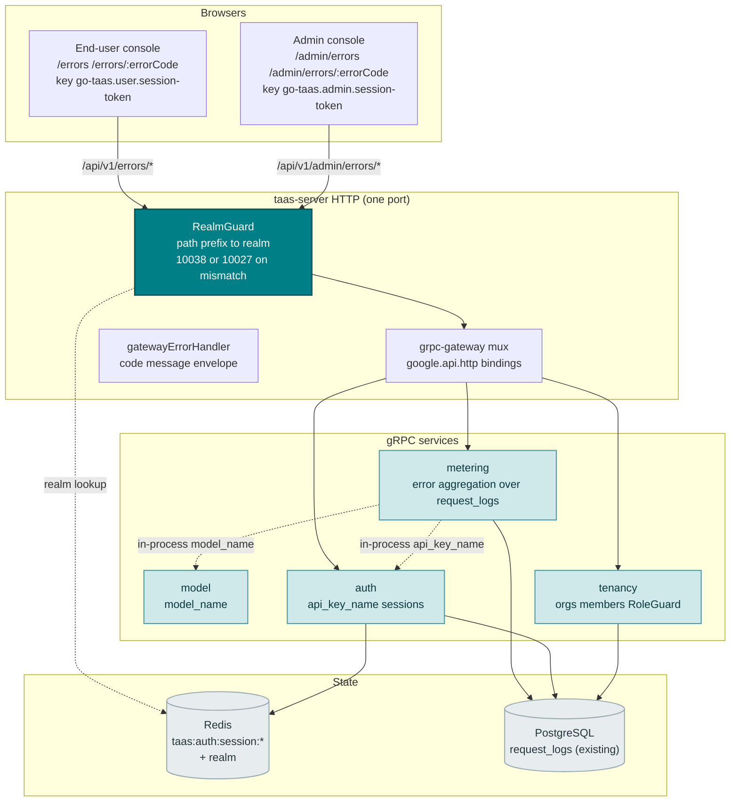
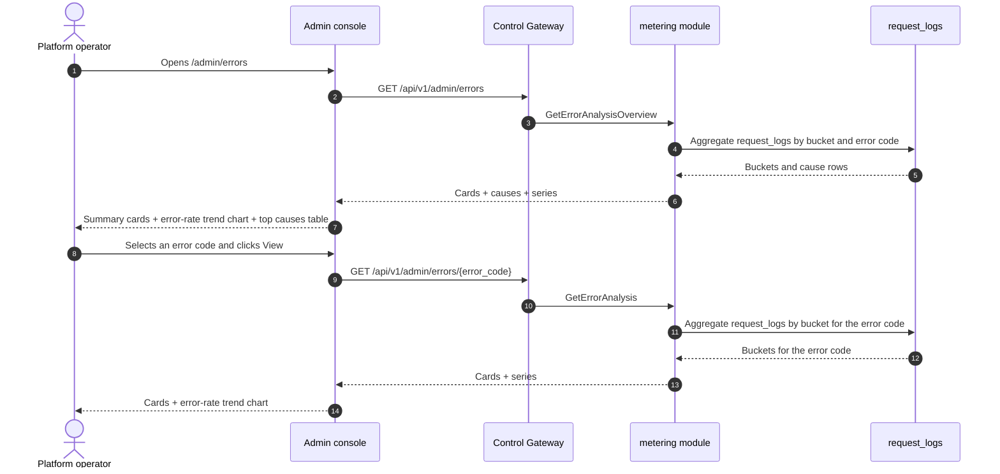
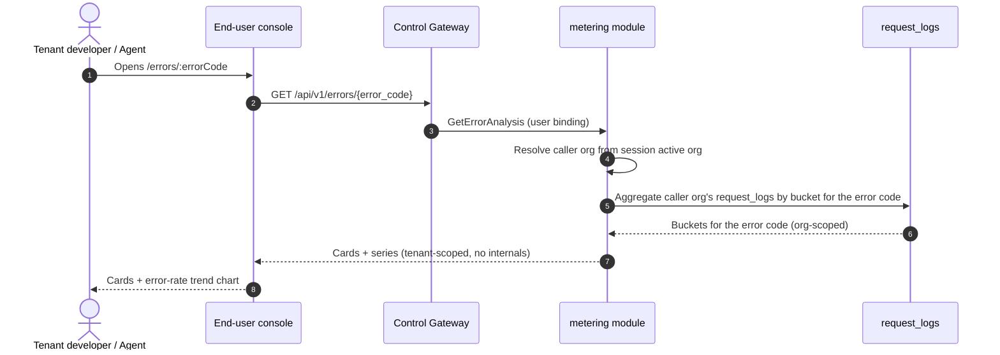
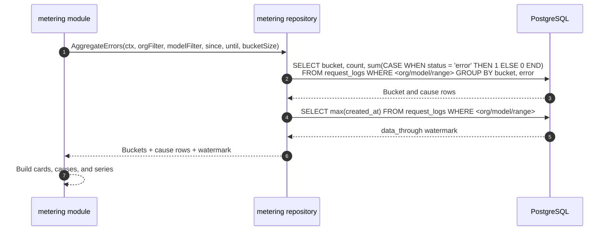

# Error Analysis — Architecture and Detailed Design

| Attribute | Content |
| --- | --- |
| Feature point | Error analysis — aggregate error codes and rates over time, top error causes, error-rate trends, and per-error drill-down (backlog row 31) |
| Document scope | Architecture and detailed design for feature-31: read-only error analysis in the `metering` module; the `GetErrorAnalysisOverview` (admin fleet) and `GetErrorAnalysis` (dual-bound) RPCs on `MeteringService`; the admin Error Analysis pages (`/admin/errors`, `/admin/errors/:errorCode`) and the end-user Error Analysis pages (`/errors`, `/errors/:errorCode`); plus error handling, configuration, security, rollout, and function-level design per layer |
| Owning modules | `metering` (read-only aggregation over `request_logs` for error metrics, plus the two RPCs), `model` (read-only: `model_name` resolution), `auth` (read-only: `api_key_name` resolution, session realm, session active org), `tenancy` (RoleGuard, read-only), `pkg/server` gateway (admin-prefix and user-prefix bindings), console web app (admin `ErrorAnalysisPage`/`ErrorDetailPage`, end-user `UserErrorAnalysisPage`/`UserErrorDetailPage`) |
| Related documents | [Requirement Analysis and UI/UX Design](../design/error-analysis.md) · [Architecture Design](../design/architecture.md) §2.5 (`metering`) · [Request Logs & API Playground](./request-logs-playground.md) (the `request_logs` table and its `status`/`error` fields this feature aggregates) · [Model Observability Dashboard](./model-observability.md) (the sibling read-only aggregation over `request_logs` and its error-rate metric) · [Request Tracing & Latency Breakdown](./request-tracing.md) (the sibling per-request drill-down this feature complements with error aggregation) · [Console Surface Separation](./console-surface-separation.md) (the two surfaces this feature spans, the `UserShell`/`AdminShell` conventions, the masked-projection rule) |
| Status | Architecture complete, handed to the Developer agent |

---

## 1. Overview and Goals

go-taas records every inference request's metadata — latency, status, error, and token counts — in `request_logs` (feature #12), and the model observability dashboard (feature #24) aggregates error rate per model. What the console still cannot answer is the operator's and tenant's question: *what is failing, and why?* The observability dashboard shows error rate as a metric but does not break errors down by error code or cause; request logs (feature #12) show individual error rows but no aggregation; and request tracing (feature #27) drills into a single request but does not aggregate errors. There is no surface that aggregates error codes and rates over time, ranks top error causes, shows error-rate trends, and drills into a single error.

This feature adds **error analysis**: aggregate error codes and rates over time, top error causes, error-rate trends, and per-error drill-down. It is a **read-only** aggregation layer — nothing in the inference, metering, or billing pipelines changes. It is the smallest independently valuable increment of Phase 4's productionization roadmap item: it turns "errors are high" into "error rate is 5%, the top cause is `rate_limit_exceeded` at 60% of errors, and it is trending up".

**Goals**: a `GetErrorAnalysisOverview` RPC (admin fleet: cards + top-causes ranking + error-rate trend) and a `GetErrorAnalysis` RPC (admin per-error drill-down and end-user per-error view: cards + trend for one error code), both on `MeteringService`; an admin Error Analysis page (`/admin/errors`) and per-error drill-down (`/admin/errors/:errorCode`), and an end-user Error Analysis page (`/errors`) and drill-down (`/errors/:errorCode`); new error code 11501 `CodeErrorCauseNotFound`; the page → route → API-prefix table with exact prefixes; per-page interactive states including empty, error, and permission-denied; and numbered acceptance criteria testable in Nightwatch against the compose stack.

**Non-goals** (deferred, design §8): real-time streaming metrics (the request-log cadence stands); anomaly detection or threshold alerts (feature #26 consumes observability events in-console — out of scope here); saved custom views or dashboards; fuzzy fingerprint grouping (D2 — group by the exact `error` code); exposing service ids, replica counts, or other operator internals to tenants (D7); any change to the inference, metering, or billing pipelines (read-only feature); new audit events (D9).

### 1.1 Reading order of this document

Section 2 records the architecture decisions (AD1–AD9, mirroring the design's D1–D9). Sections 3–5 are the component view, data model, and API design. Section 6 is the frontend architecture (page → route → API-prefix table for both consoles, auth guard per surface). Sections 7–8 are the sequence flows and error handling. Sections 9–11 are configuration, security, and rollout. Sections 12–14 are the acceptance-criteria traceability, the function-level detailed design, and the ordered implementation task list.

---

## 2. Architecture Decisions

| # | Decision | Rationale |
| --- | --- | --- |
| AD1 | **The error-analysis RPCs live in `MeteringService`** — the module that owns `request_logs` (feature #12) | The error metrics are derived from `request_logs`; metering owns that table and its query surface, so the aggregation belongs there (design D3) |
| AD2 | **The error-analysis error block is 11501–11599, the next free block after status' 114xx.** The status module owns 11401 (feature #30). The design's "fresh block after the status block (114xx)" intent is honored by taking the next free block after 114xx | Each module has its own error block (`pkg/errors/codes.go`); status took 114xx, so error-analysis takes 115xx. This is the interpretation most consistent with the existing architecture (design D8, confirmed) |
| AD3 | **Errors are derived from `request_logs`** (which carry `status` and `error` per request, feature #12), aggregated server-side by error code. The metric families are **error count** (count of `status = error` rows), **error rate** (error requests ÷ total requests), and **top causes** (the `error` codes ranked by count) | `request_logs` already captures everything needed and is written alongside the voucher in the same idempotent handler (feature #12); aggregating server-side keeps the payload small and the client dependency-light (design D2) |
| AD4 | **One new RPC per surface shape** rather than extending `ListRequestLogs`: `GetErrorAnalysisOverview` (admin fleet: cards + top-causes ranking + error-rate trend) and `GetErrorAnalysis` (admin per-error drill-down and end-user per-error view: cards + trend for one error code). The end-user surface reuses `GetErrorAnalysis` scoped to the tenant's own errors | The error page needs several shapes at once (headline cards, a top-causes ranking, a trend); bolting them onto `ListRequestLogs` would break its established row semantics, while separate calls recreate the N+1 slow console. A dedicated pair of RPCs keeps the error concern out of the raw-log surface (design D3) |
| AD5 | **Time buckets adapt to the range**: hourly buckets for ranges ≤ 7 days, daily buckets for ranges > 7 days. The range is capped at **92 days** and validation reuses **10404** (the metering range contract) | Hourly granularity for short ranges shows intra-day error spikes; daily for long ranges keeps the payload small. The 92-day cap and 10404 reuse keep the range contract uniform with every metering query (usage-dashboard AD7) (design D4) |
| AD6 | **The chart renders with inline SVG** — one bar (or line) per bucket, with a metric switcher (error count / error rate) — no new charting dependency | The console is deliberately dependency-light; a small, testable SVG component matches the usage-dashboard AD8 decision (design D5) |
| AD7 | **Freshness is explicit**: every response carries `data_through` (the last complete bucket covered by request logs) and the console shows a "data through <time>" note plus a pending/partial marker when the selected range extends past it | Error-lag confusion is a recorded pitfall; the marker keeps the freshness story honest with zero new pipeline work (design D6) |
| AD8 | **The end-user surface is tenant-scoped and masked**: `GetErrorAnalysis` on the user prefix returns only the tenant's own errors, with no service ids, no replica counts, and no other tenants' data | Follows feature #17's masked-projection rule and the observability AD4 pattern: tenants get their own error aggregation, not operator internals (design D7) |
| AD9 | **The admin error-analysis RPCs are fleet-wide by default, not org-scoped.** `GetErrorAnalysisOverview` and the admin binding of `GetErrorAnalysis` aggregate across all orgs, with an optional `organization_id` filter read from `X-Organization-Id`. They are gated by `tenancy.RoleGuard` (admin role, 10036). The user binding of `GetErrorAnalysis` is hard-scoped to the caller's org (session active org authoritative, `X-Organization-Id` ignored) | The operator needs a cross-org fleet view to spot platform-wide failures; the tenant needs only their own error aggregation. This is the one deliberate deviation from the "admin queries resolve the org" pattern — the fleet view is the point of the admin surface, and RoleGuard keeps it admin-only (design D1, D7) |

---

## 3. Component View

### 3.1 Ownership

| Layer / component | Owns | Changes in this feature |
| --- | --- | --- |
| **Control Gateway (`grpc-gateway`)** | HTTP/JSON facade for the error-analysis RPCs; realm guard (feature #17) already rejects a wrong-realm session with 10038; passes `X-Organization-Id` through as gRPC metadata | New bindings for the two HTTP error-analysis RPCs (Section 5); no change to the realm guard |
| **`metering` module (`services/metering`)** | The read-only error aggregation over `request_logs`, the two RPCs, the range validation, the bucket builder, the `data_through` watermark | New RPCs on the existing `MeteringService` (AD1, AD4) |
| **`model` module** | Model metadata (`model_id` → `model_name`) | Read-only: the metering module resolves `model_name` in-process (AD3) |
| **`auth` module** | API key identity (`api_key_id` → `api_key_name`), session realm, session active org | Read-only: the metering module resolves `api_key_name` in-process and the session active org for the user binding (AD8, AD9) |
| **`tenancy` module** | Organizations, members, roles, RoleGuard | Read-only: `RoleGuard` gates the admin error-analysis RPCs by the caller's role (10036) |
| **PostgreSQL** | `request_logs` (existing) | No new tables; the existing indexes serve the range scans (Section 4) |
| **Console** | Admin Error Analysis pages and end-user Error Analysis pages | Four new pages on the two surfaces (Section 6) |

### 3.2 Runtime component view



### 3.3 Request identity chain

The error-analysis RPCs reuse the established identity chain (console-surface-separation §3.3), with one deliberate difference for the admin fleet view (AD9):

1. `RealmGuard` (HTTP, `pkg/server/realm.go`) — path prefix decides the expected realm. `/api/v1/admin/errors/*` expects `admin`; `/api/v1/errors/*` expects `user`. With no `Authorization` header: pass through (transitional, AD4 of feature #17). With a header: resolve the session realm from Redis; mismatch → 10038, unknown/expired/realm-less → 10027.
2. grpc-gateway mux — routes by the annotated path and forwards `authorization` and `x-organization-id`.
3. Service handler — **admin binding**: the fleet view is cross-org by default; `organization_id` is an optional filter read from `X-Organization-Id` (or the session active org when the caller wants to scope to their own org). **User binding**: `SessionActiveOrg` makes the session's active organization authoritative and ignores `X-Organization-Id`; without a session, `resolveOrganizationID` reads the transitional header and returns 10001 when it is absent or empty.
4. `tenancy.RoleGuard` — gates the admin error-analysis RPCs by the caller's role in the resolved org context (10036). The end-user error-analysis RPC is hard-scoped to the caller's org and needs no role check.

---

## 4. Data Model

### 4.1 No New Tables

The error-analysis feature is a pure read-only aggregation over the existing `request_logs` table (AD1, design D9). No new tables, no new MQ subjects, no new runners, and no writes on any path. The columns consumed are:

| Column | Used for |
| --- | --- |
| `organization_id` | Org scoping (user binding) and the optional admin org filter |
| `api_key_id` | The optional API-key filter |
| `model_id` | The optional model filter |
| `status` | Error count (status = `error`) and total request count |
| `error` | The error-code grouping (top causes) |
| `created_at` | Bucket assignment and the `data_through` watermark |

### 4.2 Indexes

The existing `request_logs` indexes `idx_request_logs_org_created (organization_id, created_at)` and `idx_request_logs_key_created (api_key_id, created_at)` serve the org-scoped and key-scoped range scans. The admin fleet view (AD9) scans across all orgs, so the `idx_request_logs_created (created_at)` index added by the observability feature (feature #24) serves the fleet-wide range scan. **No new indexes are required** — the existing indexes cover the error-analysis range scans.

### 4.3 Migration Notes

- No new tables, no new indexes, no data migration, and no init-SQL upgrade path. The feature is a pure read-only aggregation over existing tables (AD1, design D9).

---

## 5. API Design

All error-analysis RPCs belong to the existing **`taas.metering.v1.MeteringService`** (`proto/taas/metering/v1/metering.proto`), served as HTTP via the Control Gateway. `GetErrorAnalysisOverview` is admin-only; `GetErrorAnalysis` is dual-bound (admin + user). The surface is derived from the request path (Section 3.3).

| RPC | HTTP (admin) | HTTP (user) | Status | Purpose |
| --- | --- | --- | --- | --- |
| `GetErrorAnalysisOverview` | `GET /api/v1/admin/errors` | — | **new** | Fleet cards + top-causes ranking + error-rate trend |
| `GetErrorAnalysis` | `GET /api/v1/admin/errors/{error_code}` | `GET /api/v1/errors/{error_code}` | **new** | Single-error-code cards + error-rate trend (admin: any error; user: tenant-scoped) |

### 5.1 Proto contract

```protobuf
syntax = "proto3";

package taas.metering.v1;

import "google/api/annotations.proto";
import "taas/common/v1/common.proto";

// (Additive to the existing MeteringService.)

// GetErrorAnalysisOverview returns fleet-wide error analysis: summary
// cards, a top-causes ranking, and an error-rate trend.
// Admin-surface API: served under /api/v1/admin.
rpc GetErrorAnalysisOverview(GetErrorAnalysisOverviewRequest) returns (GetErrorAnalysisOverviewResponse) {
  option (google.api.http) = {get: "/api/v1/admin/errors"};
}

// GetErrorAnalysis returns single-error-code analysis: summary cards and
// an error-rate trend. The admin binding covers any error; the user
// binding is tenant-scoped.
rpc GetErrorAnalysis(GetErrorAnalysisRequest) returns (GetErrorAnalysisResponse) {
  option (google.api.http) = {
    get: "/api/v1/admin/errors/{error_code}"
    additional_bindings: {get: "/api/v1/errors/{error_code}"}
  };
}

message GetErrorAnalysisOverviewRequest {
  // organization_id is an optional fleet filter. On the admin surface
  // it is read from X-Organization-Id (or the session active org);
  // absent means fleet-wide (AD9).
  string organization_id = 1;
  // since/until bound the range, unix seconds. Defaults: until = now,
  // since = until - 24h. A range > 92 days is rejected (10404).
  int64 since = 2;
  int64 until = 3;
  // model_id optionally filters the cards, causes, and series to one
  // model.
  string model_id = 4;
}

message GetErrorAnalysisOverviewResponse {
  taas.common.v1.Response response = 1;
  ErrorAnalysisCard cards = 2;
  repeated ErrorCauseRow causes = 3;
  repeated ErrorSeriesPoint series = 4;
}

message GetErrorAnalysisRequest {
  // organization_id is derived from the session active org (user
  // binding) or X-Organization-Id (admin binding); the field exists for
  // gRPC-direct callers.
  string organization_id = 1;
  // error_code is the path parameter.
  string error_code = 2;
  // since/until bound the range, unix seconds. Defaults: until = now,
  // since = until - 24h. A range > 92 days is rejected (10404).
  int64 since = 3;
  int64 until = 4;
}

message GetErrorAnalysisResponse {
  taas.common.v1.Response response = 1;
  ErrorAnalysisCard cards = 2;
  repeated ErrorSeriesPoint series = 3;
}

// ErrorAnalysisCard is the headline summary of the range. error_rate and
// top_cause_share_pct are derived client-side; the wire carries integer
// counts only.
message ErrorAnalysisCard {
  int64 error_count = 1;
  int64 request_count = 2;
  // top_cause is the top error code by count.
  string top_cause = 3;
  // top_cause_share_pct is derived client-side as top cause count /
  // total error count.
  int64 top_cause_share_pct = 4;
  // data_through is the start of the last complete bucket covered by
  // request logs (AD7); buckets past it are pending.
  int64 data_through = 5;
}

// ErrorCauseRow is one error code's aggregate in the top-causes table.
message ErrorCauseRow {
  string error_code = 1;
  string error_message = 2;
  int64 error_count = 3;
  // error_rate and share_pct are derived client-side.
  int64 error_rate = 4;
  int64 share_pct = 5;
}

// ErrorSeriesPoint is one time bucket of the series.
message ErrorSeriesPoint {
  // bucket is the bucket start, unix seconds (hourly for ranges <= 7
  // days, daily otherwise, AD5).
  int64 bucket = 1;
  int64 error_count = 2;
  int64 request_count = 3;
  // error_rate is derived client-side as error_count / request_count.
  int64 error_rate = 4;
}
```

### 5.2 Contract notes (pinned for the Developer agent)

1. `GetErrorAnalysisOverview` validates `since`/`until` (int64 unix seconds; defaults `until = now`, `since = until − 24h`); `since > until` or a range > 92 days returns 10404 (AD5). `model_id` and `organization_id` are optional filters.
2. `GetErrorAnalysis` validates the same range contract; an unknown `error_code` returns 11501 `CodeErrorCauseNotFound` (AD2). On the user prefix it is scoped to the caller's organization (AD8) and exposes no service ids or operator internals.
3. Buckets are hourly for ranges ≤ 7 days and daily otherwise (AD5); each bucket carries `bucket`, `error_count`, `request_count`, `error_rate`. `error_rate` and `share_pct` are derived client-side; the wire carries integer counts only (AD3).
4. Every response carries `data_through` (the last complete bucket covered by request logs) for the freshness marker (AD7).
5. Aggregation reads `request_logs` (feature #12) — `status`, `error`, and the four token counts per request; it writes nothing (AD1, design D9).
6. Wire conventions unchanged: dotted pagination where lists apply, HTTP 200 on success, business errors as `{"code": <int>, "message": "..."}`, int64 fields serialized as JSON strings.

### 5.3 Error codes

Error codes (error-analysis block 11501–11599, `pkg/errors/codes.go`):

| Condition | Code | Constant | Notes |
| --- | --- | --- | --- |
| An unknown `error_code` | 11501 | `CodeErrorCauseNotFound` | **New** (AD2) |
| A malformed or over-long range | 10404 | `CodeMeteringRangeInvalid` | Reused (AD5) — the metering range contract |
| Database / infrastructure failure | 500 | `CodeInternal` | Via error normalization |

---

## 6. Frontend Architecture

### 6.1 Page → Route → API-prefix table

| Page / component | Surface | Web route | API prefix | Auth guard |
| --- | --- | --- | --- | --- |
| **Error Analysis page** | admin | `/admin/errors` | `/api/v1/admin/errors` | admin session; RoleGuard (admin role) |
| **Error Detail page** | admin | `/admin/errors/:errorCode` | `/api/v1/admin/errors/{error_code}` | admin session; RoleGuard (admin role) |
| **Error Analysis page** | end-user | `/errors` | `/api/v1/errors` | user session; hard-scoped to caller's org |
| **Error Detail page** | end-user | `/errors/:errorCode` | `/api/v1/errors/{error_code}` | user session; hard-scoped to caller's org |

> The admin Error Analysis pages call only `/api/v1/admin/errors/*`; the end-user Error Analysis pages call only `/api/v1/errors/*`. The two surfaces never share a session token (feature #17).

### 6.2 Navigation placement

- **Admin console**: a new **Errors** item (`/admin/errors`, testid `nav-errors`) in the admin nav, in the operations group alongside Inference Services, Observability, and Traces.
- **End-user console**: a new **Errors** item (`/errors`, testid `user-nav-errors`) in the user nav, alongside Usage, Cost, and Traces.

### 6.3 Shared components and state to reuse

- **API client** (`web/src/api.ts`): the realm-scoped client (`createApi(realm)`) already sends `Authorization: Bearer <realm>.session-token` and `X-Organization-Id` (only when the realm token key is empty). The error-analysis pages reuse it unchanged; no new client is added.
- **Inline-SVG chart**: a new shared `ErrorChart.tsx` component (one bar/line per bucket with a metric switcher), following the usage-dashboard `UsageChart.tsx` pattern (AD6). The metric switcher toggles error count / error rate client-side with no refetch.
- **Time-range filter**: the preset control (24 h / 7 d / 30 d / custom with a date-time picker) is shared with the Usage, Request Logs, and Observability pages.
- **Summary cards**: a new shared `ErrorCards.tsx` component rendering the card row with the "data through <time>" freshness note (AD7).
- **Top-causes table**: a new shared `ErrorCausesTable.tsx` component rendering the error codes with share bars.
- **Status / freshness badge**: the pending/partial marker past `data_through` reuses the usage-dashboard pending-badge styling.
- **Empty state / data-freshness note**: the Request Logs page pattern (a note that metrics appear within the ingestion window) is reused.

### 6.4 Auth guard per surface

- **Admin Error Analysis pages** (`/admin/errors`, `/admin/errors/:errorCode`): rendered inside `AdminShell`, which runs the admin session guard when `go-taas.admin.session-token` is non-empty; a missing/expired session redirects to `/admin/login?reason=expired`; a wrong-realm session is rejected by the gateway with 10038. The pages' API calls go to `/api/v1/admin/errors/*`. A session without the required role receives 10036 and the page shows the standard permission-denied state (feature #17).
- **End-user Error Analysis pages** (`/errors`, `/errors/:errorCode`): rendered inside `UserShell`, which runs the user session guard when `go-taas.user.session-token` is non-empty; a missing/expired session redirects to `/login?reason=expired`. The pages' API calls go to `/api/v1/errors/*`. The pages expose no service ids or operator internals (AD8).
- **Unauthenticated visitors**: an unauthenticated visitor to either page is redirected to the correct login (`/admin/login` vs `/login`) by the shell guard.

### 6.5 Console contract (pinned for the Developer agent)

**Error Analysis page** (`/admin/errors`): a page header ("Errors", subtitle "Error codes and rates over time") with a **Refresh** action (`errors-refresh`). Below: a **filter bar** — a **Time range** control (`errors-filter-range`, presets 24 h / 7 d / 30 d / custom) and a **Model** filter (`errors-filter-model`, dropdown, "All models" default); a row of **summary cards** (`errors-cards`): Error rate, Error count, Request count, Top cause (the top error code with its share), each with a "data through <time>" note; an inline-SVG **error-rate trend chart** (`errors-chart`) with a metric switcher (`errors-metric-toggle`); and a **top causes table** (`errors-causes`, `errors-cause-{error_code}`) with columns Error code (link to the drill-down), Error message, Error count, Error rate, Share. Sortable by Error count, Error rate, and Share; filterable by the Model dropdown; paginated. Empty state: "No error data in this range." with a hint to widen the range. Error state: an error banner with a Retry button and a "Showing stale data" banner. Permission-denied: the standard state with a link back to the admin home.

**Error Detail page** (`/admin/errors/:errorCode`): a back link to the overview, a header with the error code, a filter bar (Time range), summary cards, and the inline-SVG error-rate trend chart with the metric switcher. Empty copy: "No error data for this cause in this range." Not-found state (11501) shows the standard not-found state with a link back to the overview.

**End-user Error Analysis page** (`/errors`): identical to the admin page, scoped to the tenant's own errors. Empty copy "No error data in this range." and the tenant's own permission-denied copy (10005 org gone / 10017 org disabled from feature #17 §8.2).

**End-user Error Detail page** (`/errors/:errorCode`): identical to the admin detail, scoped to the tenant's own usage of the error code. Not-found copy for an unknown `error_code` (11501) and the tenant's own permission-denied copy (10005/10017).

---

## 7. Sequence Flows

### 7.1 Admin fleet error overview load



### 7.2 End-user tenant-scoped error view load



### 7.3 The aggregation query



---

## 8. Error Handling

All errors are `pkg/errors` business codes in the unified envelope (Section 5.3). The error-analysis module is read-only, so there are no runner-side failures and no writes to fail. A database failure is normalized to 500 `CodeInternal`.

The console branches on the body `code` (as `web/src/api.ts` already does), never on the HTTP status. Each new code renders a specific inline message: 11501 "error cause not found", 10404 "invalid range" (the metering range contract). The admin pages map 10036 to the standard permission-denied state; the end-user pages map 10005/10017 to the tenant's permission-denied copy (feature #17 §8.2).

---

## 9. Configuration Additions

None. The error-analysis feature is a pure read-only aggregation over existing tables and reuses the metering range contract (10404) and the existing `metering.maxRangeSeconds`-style cap. No new config keys, runners, or MQ subjects are added (AD1, design D9).

---

## 10. Security Considerations

- **Surface separation**: the admin Error Analysis pages call only `/api/v1/admin/errors/*`; the end-user Error Analysis pages call only `/api/v1/errors/*`. The realm guard rejects a wrong-realm session with 10038 before any handler runs (feature #17).
- **Admin fleet view gated by role**: the admin error-analysis RPCs are fleet-wide by default (AD9) and gated by `tenancy.RoleGuard` — only a caller with the required admin role can see the cross-org fleet view; an inaccessible org returns 10036.
- **End-user hard scoping**: the user binding of `GetErrorAnalysis` is hard-scoped to the caller's org (session active org authoritative, `X-Organization-Id` ignored); a caller can never see another tenant's error aggregation.
- **Masked projection**: the end-user surface exposes no service ids, replica counts, or other operator orchestration internals (AD8). The admin surface is operator-scoped.
- **Read-only by construction**: the error-analysis module issues only `SELECT`s; no writes on any path (AD1, design D9). No new audit events are needed — the underlying request-log writes are already audited (feature #15).

---

## 11. Rollout / Upgrade Notes

- **No schema change**: the feature reads existing tables only; deploy `taas-server` alone. No new tables, no new indexes, no data migration, no init-SQL upgrade path.
- **The proto change is additive**: two new RPCs on the existing `MeteringService`; no existing RPC or message changes. The gateway mux gains the new bindings; the realm guard is unchanged.
- **Console**: the four new pages are added to the existing bundle; the admin nav gains Errors, the end-user nav gains Errors. No existing route changes.
- **Backward compatibility**: the transitional (session-less, `X-Organization-Id`) path is preserved for the CLI, FVT, and e2e suites; the realm guard passes through requests without an `Authorization` header (feature #17 AD4).
- **Empty until data exists**: the error-analysis RPCs return empty cards/causes/series until request logs exist; the pages render the empty state with a hint to widen the range.

---

## 12. Acceptance-Criteria Traceability

| # | Criterion | Where addressed |
| --- | --- | --- |
| AC1 | `GetErrorAnalysisOverview` with a valid range returns summary cards, a top-causes ranking, and an error-rate trend; a range > 92 days or `since > until` returns 10404 | §5.1, §5.2, §5.3 |
| AC2 | `GetErrorAnalysisOverview` returns `causes[]` sorted by error count descending with a client-derived `share_pct` | §5.1, §7.3 |
| AC3 | `GetErrorAnalysis` (admin) returns single-error-code cards and an error-rate trend; an unknown `error_code` returns 11501 | §5.1, §5.2, §5.3 |
| AC4 | `GetErrorAnalysis` (user) returns only the caller's organization's errors, with no service ids or operator internals | §3.3, §6.4, §10 |
| AC5 | Buckets are hourly for ranges ≤ 7 days and daily for ranges > 7 days; every response carries `data_through` | §5.2, §7.3 |
| AC6 | The `/admin/errors` page renders the filter bar, summary cards, the error-rate trend chart, and the top causes table from the first successful load, with a last-updated timestamp | §6.5 |
| AC7 | Changing the time range or model filter refetches and re-renders the cards, chart, and table; the metric switcher toggles the chart metric | §6.3, §6.5 |
| AC8 | The empty state ("No error data in this range.") renders when no data matches; a failed load keeps the last good data with a "Showing stale data" banner and a Retry action | §6.5 |
| AC9 | The `/admin/errors/:errorCode` page renders the error code's cards and error-rate trend chart; an unknown error code shows the not-found state | §6.5 |
| AC10 | The `/errors` and `/errors/:errorCode` pages render the tenant's own cards, ranking, and trend, with no service ids or operator internals visible | §6.5, §10 |
| AC11 | The admin error pages are reachable only on the admin surface: routes `/admin/errors` and `/admin/errors/:errorCode`, every API call uses the `/api/v1/admin/errors/*` prefix with no `/api/v1/errors/*` string | §6.1, §6.4, §10 |
| AC12 | The end-user error pages are reachable only on the end-user surface: routes `/errors` and `/errors/:errorCode`, every API call uses the `/api/v1/errors/*` prefix with no `/api/v1/admin/*` string | §6.1, §6.4, §10 |
| AC13 | A session without the required role receives 10036 on the admin error pages and the page shows the standard permission-denied state | §3.3, §6.4, §10 |

---

## 13. Detailed Design (function-level responsibilities per layer)

### 13.1 Proto → service → repository → controller

| Layer | File | Responsibilities |
| --- | --- | --- |
| `proto/taas/metering/v1` | `metering.proto` | Additive: `GetErrorAnalysisOverview`/`GetErrorAnalysis` RPCs + `GetErrorAnalysisOverviewRequest/Response`, `GetErrorAnalysisRequest/Response`, `ErrorAnalysisCard`, `ErrorCauseRow`, `ErrorSeriesPoint` messages (Section 5.1). Regenerate `metering.pb.go`/`metering_grpc.pb.go`/`metering.pb.gw.go` via `buf generate` |
| `services/metering` | `error_analysis_model.go` | The aggregation row structs (`ErrorBucketRow`, `ErrorCauseRow`) and the `bucketSizeForRange` helper (hourly ≤ 7 d, daily otherwise, AD5) |
| | `error_analysis_repository.go` | `AggregateErrors(ctx, orgFilter, modelFilter, since, until, bucketSize)` — the fleet aggregation (cards + cause rows + series) over `request_logs` (AD3); `AggregateError(ctx, orgID, errorCode, since, until, bucketSize)` — the single-error-code aggregation (cards + series); `DataThrough(ctx, orgFilter, modelFilter, since, until)` — the `max(created_at)` watermark (AD7) |
| | `service.go` | New RPCs `GetErrorAnalysisOverview`, `GetErrorAnalysis`; the range validation (10404, AD5); the admin fleet scope vs user hard-scope resolution (AD9); the `SessionActiveOrg`/`resolveOrganizationID` seam; the `RoleGuard` seam for admin org scoping; the in-process `model_name`/`api_key_name` resolution (AD3) |
| `services/model` | `service.go` | Read-only: expose a `ModelName(ctx, modelID) (string, error)` seam (or reuse `GetModel`) for the metering module to resolve `model_name` in-process (AD3) |
| `services/auth` | `service.go` | Read-only: expose an `APIKeyName(ctx, apiKeyID) (string, error)` seam for the metering module to resolve `api_key_name` in-process (AD3) |
| `pkg/errors` | `codes.go`/`messages.go` | `CodeErrorCauseNotFound` (11501) constant + canonical message "error cause not found" (AD2) |
| `apps/taas-server` | `main.go` | No change — the error-analysis RPCs ride the existing metering service registration; wire the `model`/`auth` name-resolution seams and the `tenancy` RoleGuard into the metering service |
| `web/src` | `pages/ErrorAnalysisPage.tsx`, `pages/ErrorDetailPage.tsx`, `pages/user/UserErrorAnalysisPage.tsx`, `pages/user/UserErrorDetailPage.tsx`, `components/ErrorChart.tsx`, `components/ErrorCards.tsx`, `components/ErrorCausesTable.tsx`, `App.tsx`, `api.ts`, `shells/AdminShell.tsx`, `shells/UserShell.tsx` | Routes `/admin/errors`, `/admin/errors/:errorCode`, `/errors`, `/errors/:errorCode`; `GetErrorAnalysisOverview`/`GetErrorAnalysis` API types and calls; nav items (Section 6.5) |
| `test` | `fvt/error_analysis_fvt_test.go`, `e2e/tests/errorAnalysis.js` | Section 14 |

### 13.2 Which React page/module implements each screen

| Screen | React module | Route | API calls |
| --- | --- | --- | --- |
| Error Analysis page (admin) | `web/src/pages/ErrorAnalysisPage.tsx` | `/admin/errors` | `GetErrorAnalysisOverview` |
| Error Detail page (admin) | `web/src/pages/ErrorDetailPage.tsx` | `/admin/errors/:errorCode` | `GetErrorAnalysis` |
| Error Analysis page (end-user) | `web/src/pages/user/UserErrorAnalysisPage.tsx` | `/errors` | `GetErrorAnalysisOverview` |
| Error Detail page (end-user) | `web/src/pages/user/UserErrorDetailPage.tsx` | `/errors/:errorCode` | `GetErrorAnalysis` |
| Inline-SVG chart | `web/src/components/ErrorChart.tsx` (shared) | (on all four pages) | (client-side; metric switcher, no refetch) |
| Summary cards | `web/src/components/ErrorCards.tsx` (shared) | (on all four pages) | (client-side; renders the returned cards) |
| Top-causes table | `web/src/components/ErrorCausesTable.tsx` (shared) | (on the two overview pages) | (client-side; renders the returned causes) |

---

## 14. Testing Strategy

- **Unit** (`services/metering`, sqlite in-memory): `error_analysis_repository_test.go` — `AggregateErrors` returns correct cards/cause rows/series for a seeded `request_logs` set (AC1, AC2), `AggregateError` returns the single-error-code cards/series (AC3), `DataThrough` returns the last complete bucket (AC5), the bucket size switches at the 7-day boundary (AC5). `service_test.go` — range validation returns 10404 for `since > until` and a range > 92 days (AC1); an unknown `error_code` returns 11501 (AC3); the user binding is hard-scoped to the caller's org and exposes no service ids (AC4); admin org scoping returns 10036 (AC13). Coverage ≥ 80% on the new files.
- **FVT** (`test/fvt/error_analysis_fvt_test.go`, the metering FVT pattern: file-backed sqlite + `MigrateSchemaForFVT` + `NewForFVT` + gRPC server with the production interceptor + gateway mux with `FVTHeaderMatcher`): seed `request_logs` rows across orgs/models/keys with error codes, then assert `GetErrorAnalysisOverview` cards/causes/series (AC1), the `causes[]` error-count-descending sort and `share_pct` (AC2), `GetErrorAnalysis` admin single-error-code cards/series and 11501 (AC3), the user binding returns only the caller org's rows with no internals (AC4), hourly vs daily buckets and `data_through` (AC5), and 10404 inline (AC1).
- **E2E** (`test/e2e/tests/errorAnalysis.js`, the `usageDashboard.js` pattern): against the compose stack — the admin `/admin/errors` page renders `errors-cards`, `errors-chart`, and `errors-causes` from the first successful load (AC6); changing the time range or model filter refetches and the metric switcher toggles the chart metric (AC7); the empty state and stale-data banner render (AC8); the admin drill-down renders the error code's cards and trend and the not-found state (AC9); the end-user `/errors` and `/errors/:errorCode` pages render the tenant's own cards/ranking/trend with no service ids (AC10); each page calls only its own prefix and an unauthenticated visitor is redirected to the correct login (AC11/AC12); a session without the required role receives 10036 and shows the permission-denied state (AC13).