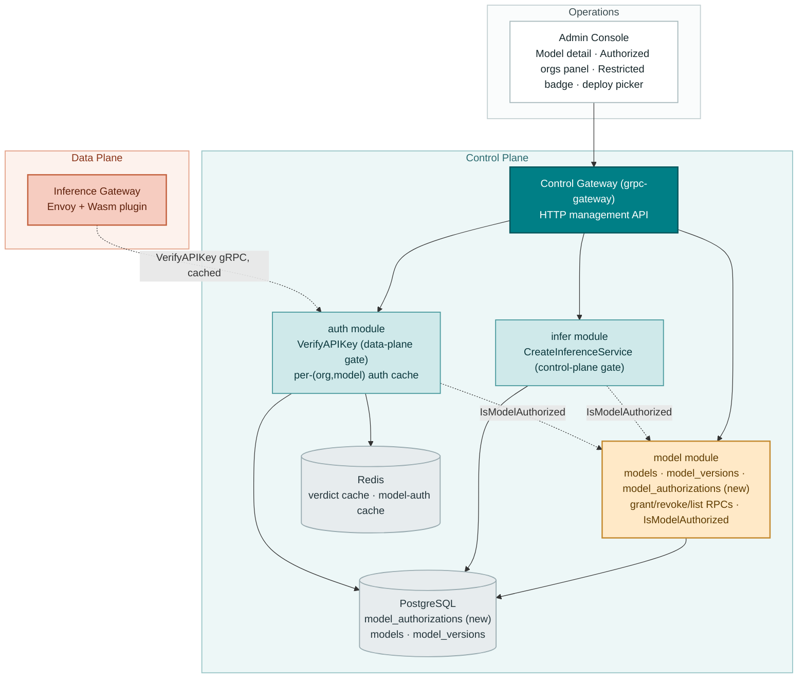
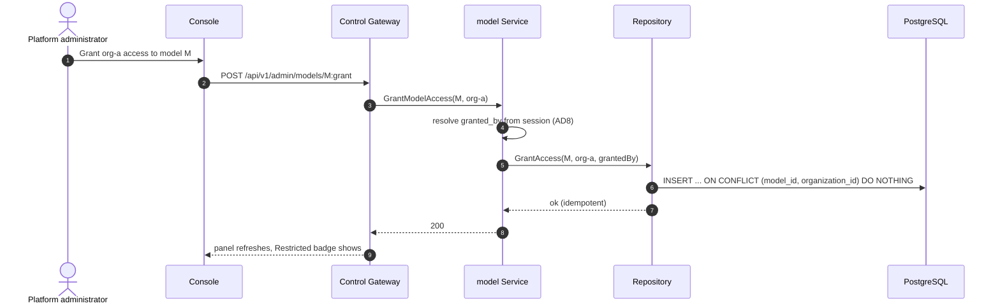
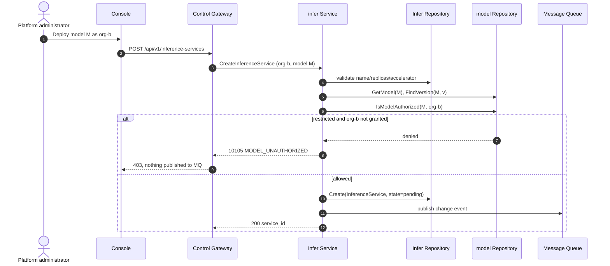
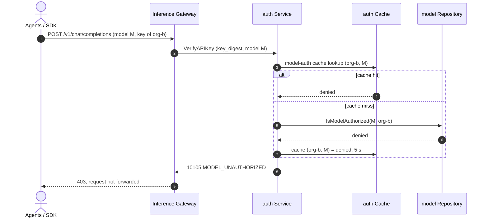

# Per-Tenant Model Authorization — Architecture and Detailed Design

| Attribute | Content |
| --- | --- |
| Feature point | Per-tenant model authorization |
| Document scope | Architecture and detailed design for feature-13: the `model_authorizations` table and the default-allow rule, the four `ModelService` RPCs (grant, revoke, list authorizations, org-filtered model list), control-plane enforcement in `CreateInferenceService`, data-plane enforcement in `VerifyAPIKey` (activating the dormant `model` field), activation of the dead code 10105 `CodeModelUnauthorized`, the console "Authorized organizations" panel, the "Restricted" badge, and org-aware deploy filtering, plus error handling, configuration, rollout, and function-level design per layer |
| Owning modules | `model` (the `model_authorizations` table, the four authorization RPCs, the shared `IsModelAuthorized` check), `infer` (control-plane enforcement in `CreateInferenceService`), `auth` (data-plane enforcement in `VerifyAPIKey`, activating the dormant `model` field, the per-(org, model) authorization cache); console web app |
| Related documents | [Requirement Analysis and UI/UX Design](../design/model-authorization.md) · [Architecture Design](../design/architecture.md) §2.2 (`model`), §2.4 (`infer`), §2.1 (`auth`) · [Model Catalog & One-Click Deployment](./model-catalog-deployment.md) — the catalog and `CreateInferenceService` this feature gates (its §1.4 defers tenant-level model authorization here) · [Multi-Tenancy Isolation](./multi-tenancy.md) — the organization entity this feature grants against · [Organization Members, Roles & Invitations (RBAC)](./org-members-rbac.md) — the session identity this feature records as `granted_by` |
| Status | Architecture complete, handed to the Developer agent |

---

## 1. Overview and Goals

Features #2 and #6 delivered the catalog and tenancy spine: models register and deploy one-click, and every resource is owned by an organization. What the platform still cannot express is **"which organizations may use which models"**. Today any organization can deploy any catalog model and any API key can call any deployed endpoint. For a Token-as-a-Service platform that sells access to curated open models, that is a governance gap: an operator may want to reserve a premium model for specific tenants, gate a model behind a contract, or keep a model internal while it is validated. This feature adds a per-tenant authorization layer over the catalog with a **default-allow** rule that preserves every existing deployment, plus enforcement at both the control plane (who may deploy) and the data plane (who may call).

**Goals**: a per-organization grant list per model (`model_authorizations`); the default-allow rule that keeps the catalog open until restricted; enforcement at both deploy time (`CreateInferenceService`) and call time (`VerifyAPIKey`); the four authorization RPCs; activation of the dead code 10105 `CodeModelUnauthorized`; a console "Authorized organizations" panel, a "Restricted" badge on the catalog, and org-aware filtering in the deploy form.

**Non-goals** (deferred): default-deny enforcement; per-project model grants (after the feature-#6 project-column deferral); approval/application workflows; model visibility tiers beyond the binary restricted/open; per-model spend limits; tenant self-service authorization; audit of who granted what beyond the `granted_by` column.

## 2. Architecture Decisions

| # | Decision | Rationale |
| --- | --- | --- |
| AD1 | **`model_authorizations` is a separate table** — `model_id`, `organization_id`, composite unique `(model_id, organization_id)`, `granted_by`, `created_at` — **not a field on the `models` table** | A grant list is inherently many-to-many; a boolean field cannot name the allowed orgs, and a JSON array column would be unqueryable. The table is the single source of truth and keeps `models` unchanged (design D1) |
| AD2 | **Default-allow rule**: a model with **zero** grant rows is accessible to all organizations; once **any** grant row exists, only the granted organizations may access it | Preserves backward compatibility — every existing model and every e2e flow keeps working with no migration; the first grant is the explicit act that restricts a model (design D2) |
| AD3 | **Enforce at two points**: `CreateInferenceService` (control plane) rejects a deploy by a non-granted org, and `VerifyAPIKey` (data plane) rejects inference calls for a restricted model by a non-granted org — activating the already-present-but-ignored `model` field on the key-verification request | Gating only deployment leaves a revoked tenant's live service running; gating only calls lets a tenant deploy a model it cannot use. Both gates share the same authorization check (design D3) |
| AD4 | **Reuse the existing 10105 `CodeModelUnauthorized`** (currently dead code) for both blocked deploys and blocked calls, mapped to HTTP 403 | The code was reserved for exactly this; reusing it keeps the error surface stable and documented, and avoids a redundant new code (design D4) |
| AD5 | **The authorization check is a shared read-only interface `IsModelAuthorized(modelID, orgID)` owned by the `model` module**, injected into `infer` (already holds a `model.Repository`) and `auth` (newly wired) | One implementation of the default-allow rule, two enforcement points; the `SetDeleteModelGuard`/`SetOrgGuard` injection pattern is reused so unit tests can substitute a fake |
| AD6 | **The data-plane check is cached per (org, model) for 5 s** in `auth`, mirroring the billing `CheckFunds` gating cache; the control-plane check is synchronous and uncached | The data plane is the hot path; a short positive/negative cache keeps it fast while bounding the revoke-propagation window to 5 s (accepted, same as billing gating). The control plane runs once per deploy and needs no cache |
| AD7 | **The four RPCs belong to `taas.model.v1.ModelService`**; grant/revoke/list-authorizations are platform-global (no `X-Organization-Id` — the admin console manages all grants), while the `ListModels` org filter is org-scoped | The model module already owns the catalog; the grant surface is an admin concern, and the org filter drives the deploy form's picker (design §7) |
| AD8 | **`granted_by` is the caller's user id resolved from the session** via the `SessionResolver` pattern (feature #10), not the org id | The audit column should name the person who granted, not the org they acted for; the tenancy `sessionUserID` pattern is reused, with a placeholder fallback when the resolver is unwired |

## 3. Component Design



| Component | Responsibility in this feature |
| --- | --- |
| Inference Gateway (data plane) | Calls `VerifyAPIKey` with the request's `model` field populated; on a 10105 verdict it returns HTTP 403 and does not forward the request. Out of repository scope — the contract is pinned here, the established synthetic-verification pattern |
| Control Gateway (`grpc-gateway`) | HTTP/JSON facade for the four `ModelService` RPCs under `/api/v1/admin/models/*`; passes `X-Organization-Id` through as gRPC metadata for the org-scoped `ListModels` filter |
| `model` module (`services/model`) | The `model_authorizations` table, the four authorization RPCs, and the shared `IsModelAuthorized` read interface consumed by `infer` and `auth` |
| `infer` module (`services/infer`) | Control-plane gate in `CreateInferenceService`: before any desired-state write, calls `IsModelAuthorized` and returns 10105 (publishing nothing) when a restricted model is deployed by a non-granted org |
| `auth` module (`services/auth`) | Data-plane gate in `VerifyAPIKey`: activates the dormant `model` field, resolves the model's authorization for the key's org, returns 10105 when blocked, cached per (org, model) for 5 s |
| PostgreSQL | `model_authorizations` table (new); `models`/`model_versions` untouched |
| Redis | The existing verdict cache; a new model-authorization cache keyed by `(org, model)` with a 5 s TTL |
| Message Queue | **Unchanged** — authorization is RPC-only; no new subjects, no consumers, no runners |
| Console | Model detail "Authorized organizations" panel, catalog "Restricted" badge, org-aware deploy picker (contract in Section 3.3) |

### 3.1 File Layout and Function-Level Responsibilities

| Module | File | Contents |
| --- | --- | --- |
| `proto/taas/model/v1` | `model.proto` | Additive: `GrantModelAccess`/`RevokeModelAccess`/`ListModelAuthorizations` RPCs + messages; `ListModelsRequest` gains `organization_id` (2); `ModelSummary` gains `restricted` (6) (Section 5) |
| `services/model` | `authorization_model.go` | GORM model `ModelAuthorization` + `TableName` (Section 4) |
| | `authorization_repository.go` | `GrantAccess(ctx, modelID, orgID, grantedBy)` — idempotent INSERT ON CONFLICT DO NOTHING; `RevokeAccess(ctx, modelID, orgID)` — idempotent DELETE; `ListAuthorizations(ctx, modelID, offset, limit)` — newest first, paginated; `IsModelAuthorized(ctx, modelID, orgID)` — the default-allow rule (AD5); `CountAuthorizations(ctx, modelID)` — the restricted flag |
| | `service.go` | New RPCs `GrantModelAccess`, `RevokeModelAccess`, `ListModelAuthorizations`; `ListModels` org filter; `Migrate`/`MigrateSchemaForFVT` gain `ModelAuthorization`; `SetSessionResolver` setter for `granted_by` (AD8) |
| `services/infer` | `service.go` | `CreateInferenceService` calls `modelRepo.IsModelAuthorized(ctx, modelID, orgID)` after the model/version lookup and before the desired-state write; blocked → 10105, nothing published (AC5) |
| `services/auth` | `model_authorizer.go` | `ModelAuthorizer` interface (implemented by `model.Repository`) + `SetModelAuthorizer` setter (the `SetOrgGuard` pattern); `modelAuthCache` keyed by `(org, model)` with 5 s TTL |
| | `service.go` | `VerifyAPIKey` activates the `model` field: when non-empty, resolve the key's org, check `IsModelAuthorized` (cached), return 10105 when blocked (AC7) |
| `pkg/errors` | `codes.go`/`messages.go` | Activate `CodeModelUnauthorized` (10105) — add the canonical message "model not authorized" and the HTTP 403 mapping (AD4) |
| `pkg/config` | `api.go`/`configuration.go` | `model.auth.cacheTTL` (default 5 s) + `applyDefaults`/`Validate` (Section 3.2) |
| `apps/taas-server` | `main.go` | Wire `modelSvc.SetSessionResolver(authSvc)` (AD8) and `authSvc.SetModelAuthorizer(model.NewRepository(gormDB))` (AD5) after `srv.Init()` |
| `web/src` | `pages/ModelDetailPage.tsx`, `pages/ModelsPage.tsx`, `components/DeployDialog.tsx`, `api.ts` | The "Authorized organizations" panel, the "Restricted" badge, and the org-aware deploy picker (Section 3.3) |
| `test` | `fvt/model_authorization_fvt_test.go`, `e2e/tests/modelAuthorization.js` | Section 8 |

### 3.2 Configuration Additions

| Key | Default | Description |
| --- | --- | --- |
| `model.auth.cacheTTL` | `5s` | TTL of the data-plane per-(org, model) authorization cache in `auth` (AD6) |

A new `model` config block is added to the root `Configuration` (the `infer`/`image`/`tenancy` pattern), carrying `auth.cacheTTL`. `applyDefaults`/`Validate` follow the `auth.apiKeyCacheTTL` pattern (non-negative). The control-plane check is uncached and needs no configuration.

### 3.3 Console Contract (pinned for the Developer agent)

Nav: the existing **Models** group gains the authorization surface on the model detail page; the catalog and deploy form are extended in place — no new nav items.

| Page / component | Purpose | Key testids |
| --- | --- | --- |
| **Model detail page** (`/models/{model_id}`) | Adds the "Authorized organizations" panel: grant rows (org, granted by, created), revoke per row, grant control with org selector | `model-auth-panel`, `model-auth-row-{orgId}`, `model-auth-revoke-{orgId}`, `model-auth-grant`, `model-auth-org-select` |
| **Models page** (`/models`) | Catalog rows gain a "Restricted" badge on restricted models | `model-restricted-badge` |
| **Deploy dialog** | Model picker filtered by the current org via `ListModels?organization_id={org}` | (reuses the existing deploy form) |

Empty states: the panel shows "No organizations authorized — this model is open to all organizations" when the grant list is empty; the grant selector lists organizations from `ListOrganizations`. Color language: restricted = amber badge; granted rows = neutral; revoke = destructive red. The panel refreshes on a 60-second poll while visible.

### 3.4 Security and Rollout Notes

- **Default-allow is the safe default**: a model with zero grants is open to all — no existing tenant or e2e flow breaks, and no migration is required (AD2). The first grant is the explicit act that restricts a model.
- **Both gates share one check**: `IsModelAuthorized` is the single implementation of the default-allow rule (AD5); the control plane and data plane cannot drift.
- **Data-plane cache window**: a revoked org may keep calling for up to 5 s (AD6) — accepted, identical to the billing gating cache; the control-plane gate is immediate.
- **`granted_by` is a person, not an org**: resolved from the session (AD8); when the resolver is unwired (unit tests), a placeholder is recorded and the RPC still succeeds.
- **Rollout**: one new table via AutoMigrate (additive); deploy `taas-server` alone. Existing models have zero grants → default-allow → nothing changes. The `model` field on `VerifyAPIKey` was already accepted-but-ignored, so the data-plane gateway needs no change to keep working; activating it only adds a rejection path for restricted models. The four RPCs are new; the `ListModels` org filter is additive (absent filter = current behavior).

## 4. Data Model

### 4.1 The `model_authorizations` Table

| Column | PostgreSQL type | Constraints | Description |
| --- | --- | --- | --- |
| `id` | `uuid` | PRIMARY KEY | Server-generated UUID v4 |
| `model_id` | `uuid` | NOT NULL, composite unique `(model_id, organization_id)` | The granted model |
| `organization_id` | `varchar(64)` | NOT NULL, composite unique `(model_id, organization_id)` | The granted organization |
| `granted_by` | `varchar(64)` | NOT NULL | The caller's user id who granted access (AD8) |
| `created_at` | `timestamptz` | NOT NULL, index (composite) | Grant time (UTC) |

Design notes:

- The composite unique index `(model_id, organization_id)` is the idempotency mechanism: `GrantModelAccess` does INSERT … ON CONFLICT DO NOTHING, so a duplicate grant writes no second row (AC2); `RevokeModelAccess` does a plain DELETE, so revoking a non-granted org is a no-op (AC4).
- Composite index `idx_model_auth_model_created (model_id, created_at)` for the newest-first list; the composite unique index already covers the `IsModelAuthorized` existence probe.
- No foreign keys to `models` or `organizations`: a grant row must survive a model being deleted (the model module cascades its own rows) and an org being disabled (grants are inert until the org is re-enabled). The `model_id` is a `uuid` matching `models.id`; `organization_id` is a transitional plain string, as on `vouchers`/`request_logs`.
- The default-allow rule is derived, not stored: a model is restricted iff `CountAuthorizations(model_id) > 0`. There is no `restricted` column on `models` — the grant table is the single source of truth (AD1).

## 5. API Design

All four RPCs belong to **`taas.model.v1.ModelService`** (`proto/taas/model/v1/model.proto`), served as HTTP via the Control Gateway under `/api/v1/admin/models/*`. Grant/revoke/list are platform-global (no `X-Organization-Id`); the `ListModels` org filter is org-scoped.

| RPC | HTTP | Status | Purpose |
| --- | --- | --- | --- |
| `GrantModelAccess` | `POST /api/v1/admin/models/{model_id}:grant` | **new** | Add an org to a model's grant list (idempotent) |
| `RevokeModelAccess` | `POST /api/v1/admin/models/{model_id}:revoke` | **new** | Remove an org from a model's grant list (idempotent) |
| `ListModelAuthorizations` | `GET /api/v1/admin/models/{model_id}/authorizations` | **new** | The model's grant rows, newest first, paginated |
| `ListModels` (org filter) | `GET /api/v1/admin/models?organization_id={org}` | **extended** | `ListAuthorizedModels`: models the org may use |

Message sketches (new; field numbers continue each message's sequence):

```protobuf
message GrantModelAccessRequest {
  string model_id = 1;          // path
  string organization_id = 2;
}
message GrantModelAccessResponse {
  taas.common.v1.Response response = 1;
}

message RevokeModelAccessRequest {
  string model_id = 1;          // path
  string organization_id = 2;
}
message RevokeModelAccessResponse {
  taas.common.v1.Response response = 1;
}

message ModelAuthorization {
  string organization_id = 1;
  string granted_by = 2;
  int64 created_at = 3;
}

message ListModelAuthorizationsRequest {
  string model_id = 1;          // path
  taas.common.v1.PageRequest page = 2;
}
message ListModelAuthorizationsResponse {
  taas.common.v1.Response response = 1;
  repeated ModelAuthorization authorizations = 2;
  taas.common.v1.PageMeta page_meta = 3;
}
```

`ListModelsRequest` gains one additive field, and `ModelSummary` gains the restricted flag:

```protobuf
message ListModelsRequest {
  taas.common.v1.PageRequest page = 1;
  string organization_id = 2;   // optional; when present, apply the default-allow rule
}

message ModelSummary {
  string model_id = 1;
  string name = 2;
  string latest_version = 3;
  string weight_path = 4;
  int64 created_at = 5;
  bool restricted = 6;          // true iff the model has >= 1 grant row
}
```

Constraints on the contract:

1. `GrantModelAccess`/`RevokeModelAccess` are idempotent — repeating the same call is a no-op success, never an error (AC2, AC4). Unknown model → 10003; unknown org on grant → 10005.
2. `ListModels` with `organization_id` present applies the default-allow rule: zero-grant models are always returned; restricted models are returned only if the org is granted (AC11). The `restricted` flag on `ModelSummary` is always populated so the catalog can render the badge (AC13).
3. `CreateInferenceService` (unchanged on the wire) now returns 10105 for a restricted model the requesting org lacks access to (AC5); `VerifyAPIKey` (unchanged on the wire) now honors its `model` field and returns 10105 for a blocked call (AC7).
4. Wire conventions unchanged: dotted pagination, HTTP 200 on success, business errors as `{"code": <int>, "message": "..."}`, int64 timestamps as JSON strings.

## 6. Sequence Flows

### 6.1 Grant and Revoke



### 6.2 Control-Plane Enforcement (deploy)



### 6.3 Data-Plane Enforcement (call)



## 7. Error Handling

All errors are `pkg/errors` business codes in the unified envelope. One code is activated (AD4); the rest already exist.

| Condition | Code | Constant | Notes |
| --- | --- | --- | --- |
| Deploy or call blocked — model is restricted and the org is not granted | 10105 | `CodeModelUnauthorized` | **Activated** (was dead code, AD4); HTTP 403 |
| Unknown model on grant/revoke/list | 10003 | `CodeModelNotFound` | Existing |
| Unknown organization on grant | 10005 | `CodeOrganizationNotFound` | Existing |
| Database failure | 500 | `CodeInternal` | Via error normalization |

The 10105 activation is purely additive: the constant already exists in `pkg/errors/codes.go`; the work is adding the canonical message and the HTTP 403 mapping so the gateway renders `{"code": 10105, "message": "model not authorized"}` with status 403. No new code is allocated.

## 8. Testing Strategy

- **Unit** (`services/model`, sqlite in-memory): `authorization_repository_test.go` — `GrantAccess` idempotency (a duplicate `(model_id, organization_id)` writes no second row, AC2), `RevokeAccess` idempotency (revoking a non-granted org is a no-op, AC4), `ListAuthorizations` newest-first + pagination (AC10), `IsModelAuthorized` default-allow (zero grants → true, AC9) and restricted (granted → true, non-granted → false, AC5/AC7), `CountAuthorizations` (AC1/AC3). `service_test.go` — `GrantModelAccess` unknown model → 10003, unknown org → 10005 (AC1); `ListModels` org filter (AC11); `ModelSummary.restricted` flag (AC13). Coverage ≥ 80% on the new files.
- **Unit** (`services/infer`, sqlite in-memory): `service_test.go` — `CreateInferenceService` returns 10105 and publishes nothing for a restricted model deployed by a non-granted org (AC5); proceeds normally for a granted org (AC6); default-allow preserved for a zero-grant model (AC9).
- **Unit** (`services/auth`, sqlite in-memory + fake cache): `service_test.go` — `VerifyAPIKey` with a `model` field returns 10105 for a restricted model the key's org lacks access to (AC7); forwards for a granted org (AC8); the per-(org, model) cache is consulted and populated (AD6); a zero-grant model is allowed (AC9).
- **FVT** (`test/fvt/model_authorization_fvt_test.go`, the model FVT pattern: file-backed sqlite + `MigrateSchemaForFVT` + `NewForFVT` + gRPC server with the production interceptor + gateway mux with `FVTHeaderMatcher`): grant → row stored with `granted_by`/`created_at` and the model becomes restricted (AC1); duplicate grant idempotent (AC2); revoke last grant returns to default-allow (AC3); blocked deploy returns 10105 and publishes nothing (AC5); granted deploy proceeds to `pending` (AC6); blocked call returns 10105 (AC7); granted call forwarded (AC8); default-allow regression (AC9); `ListModelAuthorizations` newest-first paginated (AC10); `ListModels` org filter (AC11).
- **E2E** (`test/e2e/tests/modelAuthorization.js`, the `orgMembersRbac.js` pattern): against the compose stack — the model detail panel renders `model-auth-panel` and `model-auth-row-{orgId}`; grant via `model-auth-grant` + `model-auth-org-select` adds a row and shows `model-restricted-badge` (AC12); revoke via `model-auth-revoke-{orgId}` removes the row and hides the badge (AC12); the catalog shows `model-restricted-badge` on restricted models and none on open ones (AC13); the deploy picker hides a restricted model the current org lacks access to and shows it once granted (AC14).
- **Regression**: the existing e2e suites stay green; the `VerifyAPIKey` `model` field was already accepted-but-ignored, so existing data-plane traffic is unaffected; the `ListModels` org filter is additive (absent filter = current behavior).

## 9. Open Questions

| Question | Leaning |
| --- | --- |
| Should the data-plane check cache be longer than 5 s to reduce gateway load? | Keep 5 s default; a revoked org may keep calling for up to the cache window — accepted, same as billing gating |
| Should restricted models be hidden entirely from non-granted orgs' catalog, or shown with a lock? | Hidden in the deploy picker (FR5.3); the catalog itself stays visible to the admin console, which manages all grants |
| Should grants be per-project once projects carry resources (#7)? | Yes, add an optional `project_id` column later; the org-level table is the v1 scope |
| Should a `granted_by` audit trail be extended with revoke history? | No in v1 — revoke deletes the row; a full audit trail is future operations tooling |
| Should default-allow eventually become configurable default-deny? | Yes, behind config (`model.auth.defaultDeny`) once tenants exist (#6/#7); the grant table is the same either way |