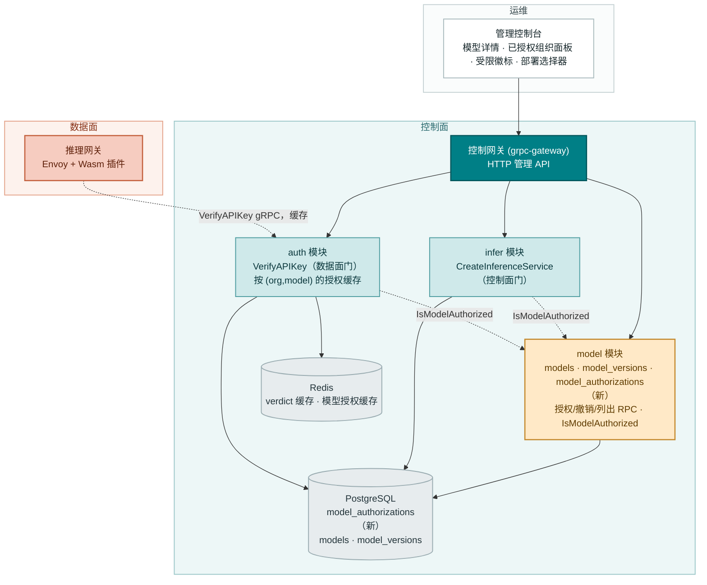
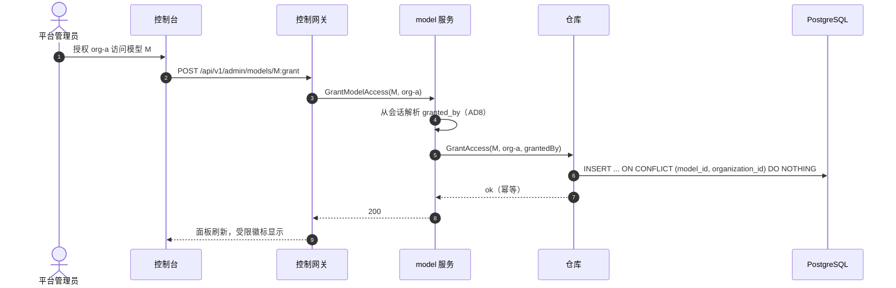
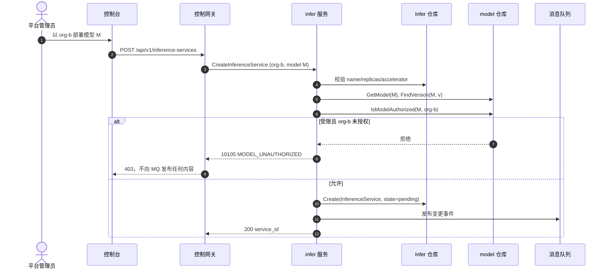
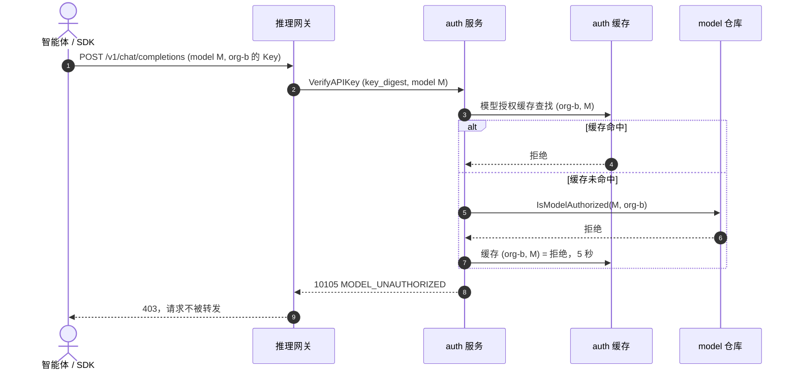

# 按租户模型授权 — 架构与详细设计

| 属性 | 内容 |
| --- | --- |
| 特性点 | 按租户模型授权 |
| 文档范围 | 特性-13 的架构与详细设计：`model_authorizations` 表与默认放行规则、四个 `ModelService` RPC（授权、撤销、列出授权、按组织过滤的模型列表）、`CreateInferenceService` 中的控制面强制、`VerifyAPIKey` 中的数据面强制（激活休眠的 `model` 字段）、激活死代码 10105 `CodeModelUnauthorized`、控制台「已授权组织」面板、「受限」徽标与组织感知部署过滤，外加错误处理、配置、发布，以及各层的函数级设计 |
| 归属模块 | `model`（`model_authorizations` 表、四个授权 RPC、共享的 `IsModelAuthorized` 检查）、`infer`（`CreateInferenceService` 中的控制面强制）、`auth`（`VerifyAPIKey` 中的数据面强制，激活休眠的 `model` 字段，按 (org, model) 的授权缓存）；控制台 Web 应用 |
| 相关文档 | [需求分析与 UI/UX 设计](../design/model-authorization.zh-cn.md) · [架构设计](../design/architecture.zh-cn.md) 第 2.2 节（`model`）、第 2.4 节（`infer`）、第 2.1 节（`auth`） · [模型目录与一键部署](./model-catalog-deployment.zh-cn.md) — 本特性所门控的目录与 `CreateInferenceService`（其第 1.4 节把租户级模型授权延后至此） · [多租户隔离](./multi-tenancy.zh-cn.md) — 本特性所授予的组织实体 · [组织成员、角色与邀请（RBAC）](./org-members-rbac.zh-cn.md) — 本特性记录为 `granted_by` 的会话身份 |
| 状态 | 架构完成，已移交开发代理 |

---

## 1. 概述与目标

特性 #2 与 #6 交付了目录与租户主干：模型可注册并一键部署，且每个资源都归属于某个组织。平台仍无法表达的是 **「哪些组织可以使用哪些模型」**。今天任何组织都可以部署任何目录模型，任何 API Key 都可以调用任何已部署端点。对于一个销售精选开放模型访问权的 Token-as-a-Service 平台，这是一个治理缺口：运营者可能想把某个高级模型保留给特定租户、把模型门控在合同之后，或在模型验证期间保持其内部可用。本特性在目录之上增加一层按租户授权，采用**默认放行**规则以保留每一个既有部署，并在控制面（谁可以部署）与数据面（谁可以调用）同时强制。

**目标**：每个模型的按组织授权列表（`model_authorizations`）；保持目录开放直至受限的默认放行规则；在部署时（`CreateInferenceService`）与调用时（`VerifyAPIKey`）两处强制；四个授权 RPC；激活死代码 10105 `CodeModelUnauthorized`；控制台「已授权组织」面板、目录上的「受限」徽标、以及部署表单中的组织感知过滤。

**非目标**（延后）：默认拒绝强制；按项目模型授权（在特性 #6 项目列延后之后）；审批/申请工作流；超出二元受限/开放的模型可见性层级；按模型消费限制；租户自助授权；除 `granted_by` 列之外对谁授权了什么进行审计。

## 2. 架构决策

| # | 决策 | 理由 |
| --- | --- | --- |
| AD1 | **`model_authorizations` 是独立的表** — `model_id`、`organization_id`、复合唯一 `(model_id, organization_id)`、`granted_by`、`created_at` — **而非 `models` 表上的字段** | 授权列表本质上是多对多；布尔字段无法命名被允许的组织，JSON 数组列不可查询。该表是唯一事实来源，且保持 `models` 不变（设计 D1） |
| AD2 | **默认放行规则**：**零**授权行的模型对所有组织可访问；一旦存在**任何**授权行，只有被授权的组织可访问 | 保持向后兼容 — 每个既有模型与每个 e2e 流程无需迁移即可继续工作；第一个授权是限制模型的显式动作（设计 D2） |
| AD3 | **在两处强制**：`CreateInferenceService`（控制面）拒绝未被授权组织的部署，`VerifyAPIKey`（数据面）拒绝受限模型被未授权组织的推理调用 — 激活已存在但被忽略的 key 验证请求上的 `model` 字段 | 只门控部署会让被撤销租户的在线服务继续运行；只门控调用会让租户部署其无法使用的模型。两个门共享同一授权检查（设计 D3） |
| AD4 | **复用既有 10105 `CodeModelUnauthorized`**（当前为死代码）用于被阻止的部署与调用，映射为 HTTP 403 | 该码正是为此预留；复用它保持错误面稳定且有文档，避免冗余新码（设计 D4） |
| AD5 | **授权检查是 `model` 模块拥有的共享只读接口 `IsModelAuthorized(modelID, orgID)`**，注入 `infer`（已持有 `model.Repository`）与 `auth`（新装配） | 一个默认放行规则的实现，两个强制点；复用 `SetDeleteModelGuard`/`SetOrgGuard` 注入模式，使单元测试可替换为假实现 |
| AD6 | **数据面检查在 `auth` 中按 (org, model) 缓存 5 秒**，镜像计费 `CheckFunds` 门控缓存；控制面检查是同步且不缓存的 | 数据面是热路径；短的正/负缓存保持其快速，同时把撤销传播窗口约束到 5 秒（接受，与计费门控相同）。控制面每次部署只运行一次，无需缓存 |
| AD7 | **四个 RPC 属于 `taas.model.v1.ModelService`**；授权/撤销/列出授权是平台全局的（无需 `X-Organization-Id` — 管理控制台管理所有授权），而 `ListModels` 组织过滤是组织限定的 | model 模块已拥有目录；授权面是管理关注点，组织过滤驱动部署表单的选择器（设计第 7 节） |
| AD8 | **`granted_by` 是经 `SessionResolver` 模式（特性 #10）从会话解析的调用者用户 id，而非组织 id** | 审计列应命名授权的人，而非其代表的组织；复用 tenancy `sessionUserID` 模式，解析器未装配时使用占位符回退 |

## 3. 组件设计



| 组件 | 本特性中的职责 |
| --- | --- |
| 推理网关（数据面） | 携带请求的 `model` 字段调用 `VerifyAPIKey`；收到 10105 判定时返回 HTTP 403 且不转发请求。不在仓库范围内 — 契约在此钉死，既定合成验证模式 |
| 控制网关（`grpc-gateway`） | `/api/v1/admin/models/*` 下四个 `ModelService` RPC 的 HTTP/JSON 门面；将 `X-Organization-Id` 作为 gRPC metadata 透传，用于组织限定的 `ListModels` 过滤 |
| `model` 模块（`services/model`） | `model_authorizations` 表、四个授权 RPC、以及被 `infer` 与 `auth` 消费的共享 `IsModelAuthorized` 只读接口 |
| `infer` 模块（`services/infer`） | `CreateInferenceService` 中的控制面门：在任何期望状态写入之前调用 `IsModelAuthorized`，当受限模型被未授权组织部署时返回 10105（不发布任何内容） |
| `auth` 模块（`services/auth`） | `VerifyAPIKey` 中的数据面门：激活休眠的 `model` 字段，为 Key 的组织解析模型的授权，被阻止时返回 10105，按 (org, model) 缓存 5 秒 |
| PostgreSQL | `model_authorizations` 表（新）；`models`/`model_versions` 不动 |
| Redis | 既有 verdict 缓存；按 `(org, model)` 键控、5 秒 TTL 的新模型授权缓存 |
| 消息队列 | **不变** — 授权仅 RPC；无新 subject、无消费者、无 runner |
| 控制台 | 模型详情「已授权组织」面板、目录「受限」徽标、组织感知部署选择器（第 3.3 节契约） |

### 3.1 文件布局与函数级职责

| 模块 | 文件 | 内容 |
| --- | --- | --- |
| `proto/taas/model/v1` | `model.proto` | 增量：`GrantModelAccess`/`RevokeModelAccess`/`ListModelAuthorizations` RPC + 消息；`ListModelsRequest` 新增 `organization_id`（2）；`ModelSummary` 新增 `restricted`（6）（第 5 节） |
| `services/model` | `authorization_model.go` | GORM 模型 `ModelAuthorization` + `TableName`（第 4 节） |
| | `authorization_repository.go` | `GrantAccess(ctx, modelID, orgID, grantedBy)` — 幂等 INSERT ON CONFLICT DO NOTHING；`RevokeAccess(ctx, modelID, orgID)` — 幂等 DELETE；`ListAuthorizations(ctx, modelID, offset, limit)` — 最新在前，分页；`IsModelAuthorized(ctx, modelID, orgID)` — 默认放行规则（AD5）；`CountAuthorizations(ctx, modelID)` — 受限标志 |
| | `service.go` | 新 RPC `GrantModelAccess`、`RevokeModelAccess`、`ListModelAuthorizations`；`ListModels` 组织过滤；`Migrate`/`MigrateSchemaForFVT` 新增 `ModelAuthorization`；`SetSessionResolver` setter 用于 `granted_by`（AD8） |
| `services/infer` | `service.go` | `CreateInferenceService` 在模型/版本查找之后、期望状态写入之前调用 `modelRepo.IsModelAuthorized(ctx, modelID, orgID)`；被阻止 → 10105，不发布任何内容（AC5） |
| `services/auth` | `model_authorizer.go` | `ModelAuthorizer` 接口（由 `model.Repository` 实现）+ `SetModelAuthorizer` setter（`SetOrgGuard` 模式）；按 `(org, model)` 键控、5 秒 TTL 的 `modelAuthCache` |
| | `service.go` | `VerifyAPIKey` 激活 `model` 字段：非空时解析 Key 的组织，检查 `IsModelAuthorized`（缓存），被阻止时返回 10105（AC7） |
| `pkg/errors` | `codes.go`/`messages.go` | 激活 `CodeModelUnauthorized`（10105）— 新增规范消息 "model not authorized" 与 HTTP 403 映射（AD4） |
| `pkg/config` | `api.go`/`configuration.go` | `model.auth.cacheTTL`（默认 5 秒）+ `applyDefaults`/`Validate`（第 3.2 节） |
| `apps/taas-server` | `main.go` | `srv.Init()` 之后装配 `modelSvc.SetSessionResolver(authSvc)`（AD8）与 `authSvc.SetModelAuthorizer(model.NewRepository(gormDB))`（AD5） |
| `web/src` | `pages/ModelDetailPage.tsx`、`pages/ModelsPage.tsx`、`components/DeployDialog.tsx`、`api.ts` | 「已授权组织」面板、「受限」徽标、组织感知部署选择器（第 3.3 节） |
| `test` | `fvt/model_authorization_fvt_test.go`、`e2e/tests/modelAuthorization.js` | 第 8 节 |

### 3.2 配置增量

| 键 | 默认值 | 描述 |
| --- | --- | --- |
| `model.auth.cacheTTL` | `5s` | `auth` 中数据面按 (org, model) 授权缓存的 TTL（AD6） |

根 `Configuration` 新增 `model` 配置块（`infer`/`image`/`tenancy` 模式），携带 `auth.cacheTTL`。`applyDefaults`/`Validate` 沿用 `auth.apiKeyCacheTTL` 模式（非负）。控制面检查不缓存，无需配置。

### 3.3 控制台契约（为开发代理钉死）

导航：既有 **Models** 组在模型详情页上增加授权面；目录与部署表单就地扩展 — 无新导航项。

| 页面 / 组件 | 用途 | 关键 testid |
| --- | --- | --- |
| **模型详情页**（`/models/{model_id}`） | 增加「已授权组织」面板：授权行（组织、授权者、创建时间）、每行撤销、带组织选择器的授权控件 | `model-auth-panel`、`model-auth-row-{orgId}`、`model-auth-revoke-{orgId}`、`model-auth-grant`、`model-auth-org-select` |
| **模型页**（`/models`） | 目录行在受限模型上增加「受限」徽标 | `model-restricted-badge` |
| **部署对话框** | 模型选择器通过 `ListModels?organization_id={org}` 按当前组织过滤 | （复用既有部署表单） |

空状态：授权列表为空时面板显示「未授权任何组织 — 此模型对所有组织开放」；授权选择器从 `ListOrganizations` 列出组织。颜色语言：受限 = 琥珀色徽标；已授权行 = 中性；撤销 = 破坏性红色。面板可见时每 60 秒轮询刷新。

### 3.4 安全与发布说明

- **默认放行是安全默认**：零授权的模型对所有组织开放 — 无既有租户或 e2e 流程被破坏，无需迁移（AD2）。第一个授权是限制模型的显式动作。
- **两个门共享一个检查**：`IsModelAuthorized` 是默认放行规则的唯一实现（AD5）；控制面与数据面不会漂移。
- **数据面缓存窗口**：被撤销的组织最多可在 5 秒内继续调用（AD6）— 接受，与计费门控缓存相同；控制面门是即时的。
- **`granted_by` 是人而非组织**：从会话解析（AD8）；解析器未装配时（单元测试），记录占位符且 RPC 仍成功。
- **发布**：一张新表经 AutoMigrate（增量）；单独部署 `taas-server`。既有模型零授权 → 默认放行 → 无变化。`VerifyAPIKey` 上的 `model` 字段此前已被接受但忽略，故数据面网关无需改动即可继续工作；激活它仅为受限模型增加一条拒绝路径。四个 RPC 是新增的；`ListModels` 组织过滤是增量的（无过滤 = 当前行为）。

## 4. 数据模型

### 4.1 `model_authorizations` 表

| 列 | PostgreSQL 类型 | 约束 | 描述 |
| --- | --- | --- | --- |
| `id` | `uuid` | PRIMARY KEY | 服务端生成的 UUID v4 |
| `model_id` | `uuid` | NOT NULL，复合唯一 `(model_id, organization_id)` | 被授权的模型 |
| `organization_id` | `varchar(64)` | NOT NULL，复合唯一 `(model_id, organization_id)` | 被授权的组织 |
| `granted_by` | `varchar(64)` | NOT NULL | 授权访问的调用者用户 id（AD8） |
| `created_at` | `timestamptz` | NOT NULL，索引（复合） | 授权时间（UTC） |

设计说明：

- 复合唯一索引 `(model_id, organization_id)` 是幂等机制：`GrantModelAccess` 做 INSERT … ON CONFLICT DO NOTHING，重复授权不写第二行（AC2）；`RevokeModelAccess` 做普通 DELETE，撤销未授权组织是无操作（AC4）。
- 复合索引 `idx_model_auth_model_created (model_id, created_at)` 用于最新在前列表；复合唯一索引已覆盖 `IsModelAuthorized` 的存在性探测。
- 无指向 `models` 或 `organizations` 的外键：授权行必须在模型被删除（model 模块级联自己的行）与组织被禁用（授权在组织重新启用前保持惰性）时存活。`model_id` 是匹配 `models.id` 的 `uuid`；`organization_id` 是过渡性纯字符串，与 `vouchers`/`request_logs` 相同。
- 默认放行规则是派生的，而非存储的：模型受限当且仅当 `CountAuthorizations(model_id) > 0`。`models` 上无 `restricted` 列 — 授权表是唯一事实来源（AD1）。

## 5. API 设计

四个 RPC 都属于 **`taas.model.v1.ModelService`**（`proto/taas/model/v1/model.proto`），经控制网关以 HTTP 形式在 `/api/v1/admin/models/*` 下提供。授权/撤销/列出是平台全局的（无需 `X-Organization-Id`）；`ListModels` 组织过滤是组织限定的。

| RPC | HTTP | 状态 | 用途 |
| --- | --- | --- | --- |
| `GrantModelAccess` | `POST /api/v1/admin/models/{model_id}:grant` | **新增** | 把组织添加到模型的授权列表（幂等） |
| `RevokeModelAccess` | `POST /api/v1/admin/models/{model_id}:revoke` | **新增** | 从模型的授权列表移除组织（幂等） |
| `ListModelAuthorizations` | `GET /api/v1/admin/models/{model_id}/authorizations` | **新增** | 模型的授权行，最新在前，分页 |
| `ListModels`（组织过滤） | `GET /api/v1/admin/models?organization_id={org}` | **扩展** | `ListAuthorizedModels`：组织可用的模型 |

消息草图（新增；字段号延续各消息的序列）：

```protobuf
message GrantModelAccessRequest {
  string model_id = 1;          // path
  string organization_id = 2;
}
message GrantModelAccessResponse {
  taas.common.v1.Response response = 1;
}

message RevokeModelAccessRequest {
  string model_id = 1;          // path
  string organization_id = 2;
}
message RevokeModelAccessResponse {
  taas.common.v1.Response response = 1;
}

message ModelAuthorization {
  string organization_id = 1;
  string granted_by = 2;
  int64 created_at = 3;
}

message ListModelAuthorizationsRequest {
  string model_id = 1;          // path
  taas.common.v1.PageRequest page = 2;
}
message ListModelAuthorizationsResponse {
  taas.common.v1.Response response = 1;
  repeated ModelAuthorization authorizations = 2;
  taas.common.v1.PageMeta page_meta = 3;
}
```

`ListModelsRequest` 新增一个增量字段，`ModelSummary` 新增受限标志：

```protobuf
message ListModelsRequest {
  taas.common.v1.PageRequest page = 1;
  string organization_id = 2;   // 可选；存在时应用默认放行规则
}

message ModelSummary {
  string model_id = 1;
  string name = 2;
  string latest_version = 3;
  string weight_path = 4;
  int64 created_at = 5;
  bool restricted = 6;          // 当且仅当模型有 >= 1 授权行时为 true
}
```

契约约束：

1. `GrantModelAccess`/`RevokeModelAccess` 是幂等的 — 重复同一调用是无操作成功，绝非错误（AC2、AC4）。未知模型 → 10003；授权时未知组织 → 10005。
2. 存在 `organization_id` 的 `ListModels` 应用默认放行规则：零授权模型始终返回；受限模型仅在组织被授权时返回（AC11）。`ModelSummary` 上的 `restricted` 标志始终填充，使目录可渲染徽标（AC13）。
3. `CreateInferenceService`（线上不变）现在对请求组织无访问权的受限模型返回 10105（AC5）；`VerifyAPIKey`（线上不变）现在遵循其 `model` 字段并对被阻止的调用返回 10105（AC7）。
4. 线上约定不变：点分分页、成功 HTTP 200、业务错误为 `{"code": <int>, "message": "..."}`、int64 时间戳为 JSON 字符串。

## 6. 时序流程

### 6.1 授权与撤销



### 6.2 控制面强制（部署）



### 6.3 数据面强制（调用）



## 7. 错误处理

所有错误都是统一信封中的 `pkg/errors` 业务码。激活一个码（AD4）；其余已存在。

| 条件 | 码 | 常量 | 备注 |
| --- | --- | --- | --- |
| 部署或调用被阻止 — 模型受限且组织未授权 | 10105 | `CodeModelUnauthorized` | **激活**（曾是死代码，AD4）；HTTP 403 |
| 授权/撤销/列出时未知模型 | 10003 | `CodeModelNotFound` | 既有 |
| 授权时未知组织 | 10005 | `CodeOrganizationNotFound` | 既有 |
| 数据库失败 | 500 | `CodeInternal` | 经错误归一化 |

10105 激活纯粹是增量的：常量已存在于 `pkg/errors/codes.go`；工作是新增规范消息与 HTTP 403 映射，使网关以状态 403 渲染 `{"code": 10105, "message": "model not authorized"}`。不分配新码。

## 8. 测试策略

- **单元**（`services/model`，sqlite 内存）：`authorization_repository_test.go` — `GrantAccess` 幂等（重复 `(model_id, organization_id)` 不写第二行，AC2）、`RevokeAccess` 幂等（撤销未授权组织是无操作，AC4）、`ListAuthorizations` 最新在前 + 分页（AC10）、`IsModelAuthorized` 默认放行（零授权 → true，AC9）与受限（已授权 → true，未授权 → false，AC5/AC7）、`CountAuthorizations`（AC1/AC3）。`service_test.go` — `GrantModelAccess` 未知模型 → 10003、未知组织 → 10005（AC1）；`ListModels` 组织过滤（AC11）；`ModelSummary.restricted` 标志（AC13）。新文件覆盖率 ≥ 80%。
- **单元**（`services/infer`，sqlite 内存）：`service_test.go` — `CreateInferenceService` 对未授权组织部署受限模型返回 10105 且不发布任何内容（AC5）；对已授权组织正常进行（AC6）；零授权模型保留默认放行（AC9）。
- **单元**（`services/auth`，sqlite 内存 + 假缓存）：`service_test.go` — 带 `model` 字段的 `VerifyAPIKey` 对 Key 组织无访问权的受限模型返回 10105（AC7）；对已授权组织转发（AC8）；按 (org, model) 缓存被查询与填充（AD6）；零授权模型被允许（AC9）。
- **FVT**（`test/fvt/model_authorization_fvt_test.go`，model FVT 模式：文件型 sqlite + `MigrateSchemaForFVT` + `NewForFVT` + 带生产拦截器的 gRPC 服务器 + 带 `FVTHeaderMatcher` 的网关 mux）：授权 → 存储带 `granted_by`/`created_at` 的行且模型变为受限（AC1）；重复授权幂等（AC2）；撤销最后一个授权回到默认放行（AC3）；被阻止的部署返回 10105 且不发布任何内容（AC5）；已授权部署进行到 `pending`（AC6）；被阻止的调用返回 10105（AC7）；已授权调用被转发（AC8）；默认放行回归（AC9）；`ListModelAuthorizations` 最新在前分页（AC10）；`ListModels` 组织过滤（AC11）。
- **E2E**（`test/e2e/tests/modelAuthorization.js`，`orgMembersRbac.js` 模式）：针对 compose 栈 — 模型详情面板渲染 `model-auth-panel` 与 `model-auth-row-{orgId}`；经 `model-auth-grant` + `model-auth-org-select` 授权添加一行并显示 `model-restricted-badge`（AC12）；经 `model-auth-revoke-{orgId}` 撤销移除一行并隐藏徽标（AC12）；目录在受限模型上显示 `model-restricted-badge`，开放模型不显示（AC13）；部署选择器隐藏当前组织无访问权的受限模型，授权后显示（AC14）。
- **回归**：既有 e2e 套件保持绿色；`VerifyAPIKey` 的 `model` 字段此前已被接受但忽略，故既有数据面流量不受影响；`ListModels` 组织过滤是增量的（无过滤 = 当前行为）。

## 9. 开放问题

| 问题 | 倾向 |
| --- | --- |
| 数据面检查缓存是否应长于 5 秒以减少网关负载？ | 保持 5 秒默认；被撤销的组织最多可在缓存窗口内继续调用 — 接受，与计费门控相同 |
| 受限模型是否应从未授权组织的目录中完全隐藏，还是带锁显示？ | 在部署选择器中隐藏（FR5.3）；目录本身对管理所有授权的管理控制台保持可见 |
| 一旦项目承载资源（#7），授权是否应按项目？ | 是，稍后增加可选 `project_id` 列；组织级表是 v1 范围 |
| 是否应把 `granted_by` 审计轨迹扩展为撤销历史？ | v1 否 — 撤销删除行；完整审计轨迹是未来的运维工具 |
| 默认放行最终是否应变为可配置的默认拒绝？ | 是，一旦租户存在（#6/#7），在配置 `model.auth.defaultDeny` 之后；授权表无论哪种方式都相同 |