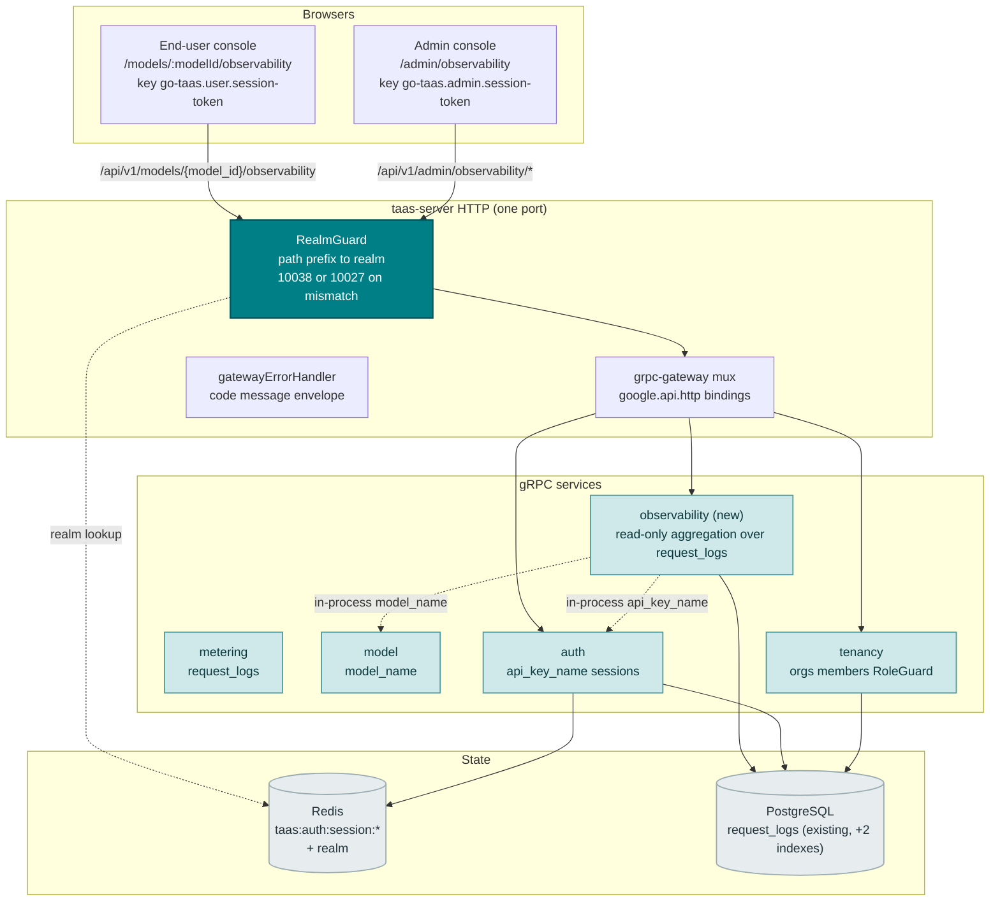
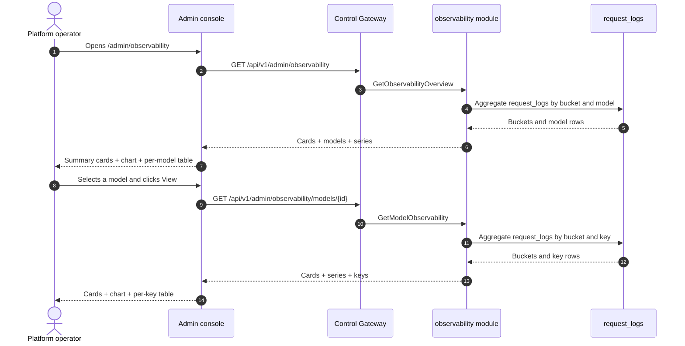
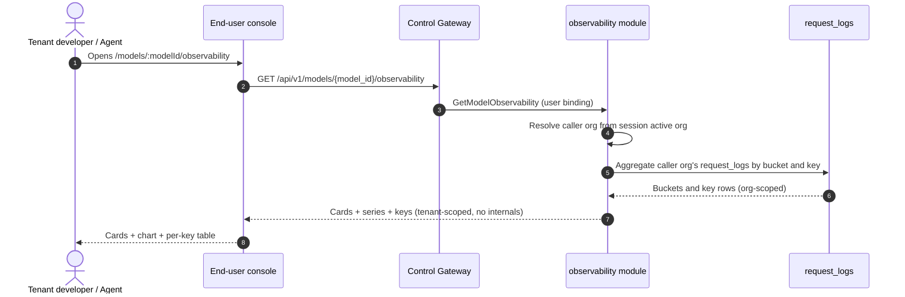
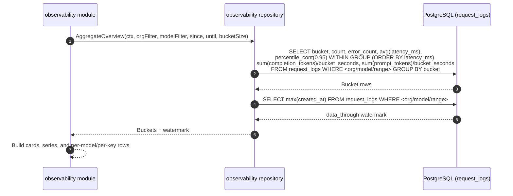

# Model Observability Dashboard — Architecture and Detailed Design

| Attribute | Content |
| --- | --- |
| Feature point | Model observability dashboard — per-model latency / throughput / error-rate / token-throughput metrics over time, with time-range and model filters, derived from metering + request logs (backlog row 24) |
| Document scope | Architecture and detailed design for feature-24: a new `observability` module owning the read-only aggregation over `request_logs`; the `taas.observability.v1.ObservabilityService` proto with `GetObservabilityOverview` (admin fleet) and `GetModelObservability` (dual admin/user bindings); the admin Observability pages (`/admin/observability`, `/admin/observability/models/:modelId`) and the end-user Model Observability page (`/models/:modelId/observability`); plus error handling, configuration, security, rollout, and function-level design per layer |
| Owning modules | New `observability` module (`services/observability`): the read-only aggregation RPCs over `request_logs`; `model` (read-only: `model_name` resolution); `auth` (session active org, read-only); `tenancy` (RoleGuard, read-only); `pkg/server` gateway (admin-prefix and user-prefix bindings); console web app (admin `ObservabilityPage`/`ModelObservabilityPage`, end-user `UserModelObservabilityPage`) |
| Related documents | [Requirement Analysis and UI/UX Design](../design/model-observability.md) · [Architecture Design](../design/architecture.md) §2.5 (`metering`), §3.1 (admin/user surface separation) · [Request Logs & API Playground](./request-logs-playground.md) (the `request_logs` table and its `latency_ms`/`status`/`error`/token fields this feature aggregates) · [Usage Dashboards & Per-Request Cost Attribution](./usage-dashboard.md) (the sibling read-only dashboard and its inline-SVG chart, freshness, and range conventions) · [Console Surface Separation](./console-surface-separation.md) (the two surfaces this feature spans, the `UserShell`/`AdminShell` conventions, the masked-projection rule) |
| Status | Architecture complete, handed to the Developer agent |

---

## 1. Overview and Goals

go-taas deploys inference services (feature #2), autoscales them (feature #16), meters and bills usage (features #4, #5, #8, #14), and records every request's metadata — latency, status, error, and token counts — in `request_logs` (feature #12). What the console still cannot answer is the operator's and tenant's recurring question: *how is this model actually performing over time?* The load-testing feature (feature #20) measures a service at a point in time under synthetic load; the usage dashboard (feature #9) shows cost and token counts but not latency, throughput, or error rate; and request logs (feature #12) are a raw, per-request table with no aggregation. There is no surface that turns the accumulated request metadata into the continuous performance picture — latency percentiles, requests per second, error rate, and tokens per second — that an operator needs to tune autoscaling targets (feature #16), and that a tenant needs to choose between models and set expectations.

This feature adds a **model observability dashboard**: per-model latency / throughput / error-rate / token-throughput metrics over time, with time-range and model filters, derived from the `request_logs` the platform already writes. It is a **read-only** aggregation layer — nothing in the inference, metering, or billing pipelines changes. It is the smallest independently valuable increment of Phase 4's productionization roadmap item: it turns "the model is serving" into "the model is serving at X req/s with Y ms p95 latency and Z% errors".

**Goals**: a new `observability` module owning the read-only aggregation over `request_logs`; a `taas.observability.v1.ObservabilityService` with two RPCs — `GetObservabilityOverview` (admin fleet: cards + per-model table + model-filtered time-series) and `GetModelObservability` (dual-bound: admin per-model drill-down and end-user single-model view, each with cards + time-series + per-key breakdown); an admin Observability page (`/admin/observability`) and per-model drill-down (`/admin/observability/models/:modelId`), and an end-user Model Observability page (`/models/:modelId/observability`); new error code 10801 `CodeObservabilityModelNotFound`; the page → route → API-prefix table with exact prefixes; per-page interactive states including empty, error, and permission-denied; and numbered acceptance criteria testable in Nightwatch against the compose stack.

**Non-goals** (deferred, design §8): real-time streaming metrics (the request-log cadence stands); anomaly detection or threshold alerts (feature #26 consumes observability events in-console — out of scope here); saved custom views or dashboards; comparing models side-by-side in a chart (v1 shows a per-model table and a single-model chart); TTFT/TPOT split (v1 reports end-to-end latency percentiles and tokens/sec); exposing service ids, replica counts, or other operator internals to tenants (design D7); any change to the inference, metering, or billing pipelines (read-only feature); new audit events (design D9).

### 1.1 Reading order of this document

Section 2 records the architecture decisions (AD1–AD9, mirroring the design's D1–D9 plus the refinements the Architect made). Sections 3–5 are the component view, data model, and API design. Section 6 is the frontend architecture (page → route → API-prefix table for both consoles, auth guard per surface). Sections 7–8 are the sequence flows and error handling. Sections 9–11 are configuration, security, and rollout. Sections 12–14 are the acceptance-criteria traceability, the function-level detailed design, and the ordered implementation task list.

---

## 2. Architecture Decisions

| # | Decision | Rationale |
| --- | --- | --- |
| AD1 | **New `observability` module** (`services/observability`) owning the read-only aggregation over `request_logs`, with its own error block **108xx** | The dashboard needs several shapes at once (headline cards, a time series, a per-model/per-key table); a dedicated module keeps the aggregation concern out of `metering`'s raw-log surface and gives it one home (design D3) |
| AD2 | **The observability error block is 10801–10899, not 10701–10799.** The webhook module already owns 10701–10705 (feature #23, e2e-passed). The design's "fresh block after the webhook block (106xx)" intent is honored by taking the next free block after webhook's 107xx | Each module has its own error block (`pkg/errors/codes.go`); webhook took 107xx, so observability takes 108xx. This is the interpretation most consistent with the existing architecture (design D8, refined) |
| AD3 | **Observability is a pure read-only aggregation over `request_logs`** — no new tables, no MQ subjects, no runners, no writes on any path. `model_name` is resolved in-process from the `model` module; `api_key_name` is resolved from the `auth` module | The feature is a pure aggregation over existing data (design D9); the request-log cadence stands. Resolving names in-process avoids a join against tables that may have deleted the model/key (request logs outlive them) |
| AD4 | **The admin observability RPCs are fleet-wide by default, not org-scoped.** `GetObservabilityOverview` and the admin binding of `GetModelObservability` aggregate across all orgs, with an optional `organization_id` filter read from `X-Organization-Id`. They are gated by `tenancy.RoleGuard` (admin role, 10036). The user binding of `GetModelObservability` is hard-scoped to the caller's org (session active org authoritative, `X-Organization-Id` ignored) | The operator needs a cross-org fleet view to tune autoscaling and capacity (design D1); the tenant needs only their own usage (design D7). This is the one deliberate deviation from the "admin queries resolve the org" pattern — the fleet view is the point of the admin surface, and RoleGuard keeps it admin-only |
| AD5 | **Metrics are derived from `request_logs`** (`latency_ms`, `status`, `error`, and the four token counts per request, feature #12), aggregated server-side into time buckets. The four metric families are **latency** (p50/p90/p95/p99 of `latency_ms`), **throughput** (requests/sec), **error rate** (error requests ÷ total requests), and **token throughput** (output tokens/sec, plus input tokens/sec and total tokens) | `request_logs` already captures everything needed and is written alongside the voucher in the same idempotent handler (feature #12); aggregating server-side keeps the payload small and the client dependency-light (design D2) |
| AD6 | **Latency percentiles are computed in SQL** with `percentile_cont(0.95) WITHIN GROUP (ORDER BY latency_ms)` (and p50/p90/p99) in the aggregation query, not in Go | A single SQL pass computes count, error count, latency sums, token sums, and the percentiles together, avoiding fetching every latency value into memory. The wire carries integer counts and integer milliseconds only; `error_rate` is derived client-side as error ÷ requests (design contract note 3) |
| AD7 | **Time buckets adapt to the range**: hourly buckets for ranges ≤ 7 days, daily buckets for ranges > 7 days. The range is capped at **92 days** and validation reuses **10404** `CodeMeteringRangeInvalid` | Hourly granularity for short ranges shows intra-day spikes (the autoscaling-relevant signal); daily for long ranges keeps the payload small. The 92-day cap and 10404 reuse keep the range contract uniform with every metering query (design D4) |
| AD8 | **Freshness is explicit**: every response carries `data_through` — the start of the last complete bucket covered by request logs (the most recent request-log `created_at` truncated to the bucket boundary, minus one bucket). The console shows a "data through <time>" note plus a pending/partial marker when the selected range extends past it | Usage-lag confusion is the most consistently recorded pitfall (design D6); the marker keeps the freshness story honest with zero new pipeline work |
| AD9 | **The chart renders with inline SVG** — one bar (or line) per bucket, with a metric switcher (latency / throughput / error rate / tokens/sec) — no new charting dependency | The console is deliberately dependency-light; a small, testable SVG component matches the usage-dashboard D7 decision (design D5) |

---

## 3. Component View

### 3.1 Ownership

| Layer / component | Owns | Changes in this feature |
| --- | --- | --- |
| **Control Gateway (`grpc-gateway`)** | HTTP/JSON facade for the observability RPCs; realm guard (feature #17) already rejects a wrong-realm session with 10038; passes `X-Organization-Id` through as gRPC metadata | New bindings for the two HTTP observability RPCs (Section 5); no change to the realm guard |
| **`observability` module (`services/observability`)** | The read-only aggregation over `request_logs`: the two RPCs, the range validation, the bucket builder, the aggregation repository, the `data_through` watermark | **New module** (AD1) |
| **`model` module** | Model metadata (`model_id` → `model_name`) | Read-only: the observability module resolves `model_name` in-process (AD3) |
| **`auth` module** | API key identity (`api_key_id` → `api_key_name`), session realm, session active org | Read-only: the observability module resolves `api_key_name` in-process and the session active org for the user binding (AD3, AD4) |
| **`tenancy` module** | Organizations, members, roles, RoleGuard | Read-only: `RoleGuard` gates the admin observability RPCs by the caller's role (10036) |
| **PostgreSQL** | `request_logs` (existing); two new indexes for the fleet-wide and model-filtered range scans | Two additive indexes via AutoMigrate (Section 4); no new tables |
| **Console** | Admin Observability pages and end-user Model Observability page | Three new pages on the two surfaces (Section 6) |

### 3.2 Runtime component view



### 3.3 Request identity chain

The observability RPCs reuse the established identity chain (console-surface-separation §3.3), with one deliberate difference for the admin fleet view (AD4):

1. `RealmGuard` (HTTP, `pkg/server/realm.go`) — path prefix decides the expected realm. `/api/v1/admin/observability/*` expects `admin`; `/api/v1/models/{model_id}/observability` expects `user`. With no `Authorization` header: pass through (transitional, AD4 of feature #17). With a header: resolve the session realm from Redis; mismatch → 10038, unknown/expired/realm-less → 10027.
2. grpc-gateway mux — routes by the annotated path and forwards `authorization` and `x-organization-id`.
3. Service handler — **admin binding**: the fleet view is cross-org by default; `organization_id` is an optional filter read from `X-Organization-Id` (or the session active org when the caller wants to scope to their own org). **User binding**: `SessionActiveOrg` makes the session's active organization authoritative and ignores `X-Organization-Id`; without a session, `resolveOrganizationID` reads the transitional header and returns 10001 when it is absent or empty.
4. `tenancy.RoleGuard` — gates the admin observability RPCs by the caller's role in the resolved org context (10036). The end-user observability RPC is hard-scoped to the caller's org and needs no role check.

---

## 4. Data Model

### 4.1 No New Tables

The observability feature is a pure read-only aggregation over the existing `request_logs` table (feature #12). No new tables, no new MQ subjects, no new runners, and no writes on any path (AD3, design D9). The `request_logs` columns consumed are:

| Column | Used for |
| --- | --- |
| `organization_id` | Org scoping (user binding) and the optional admin org filter |
| `api_key_id` | The per-key breakdown (`keys[]`) |
| `model_id` | The per-model table and the model filter |
| `prompt_tokens` / `completion_tokens` / `cached_tokens` / `reasoning_tokens` | Token throughput (output = completion, input = prompt) |
| `latency_ms` | Latency percentiles (p50/p90/p95/p99) and averages |
| `status` | Error count (status = `error`) |
| `created_at` | Bucket assignment and the `data_through` watermark |

### 4.2 New Indexes

The existing `request_logs` indexes are `idx_request_logs_org_created (organization_id, created_at)` and `idx_request_logs_key_created (api_key_id, created_at)`. The admin fleet view (AD4) scans across all orgs, and the model filter scans by `model_id`, so two additive indexes are added via AutoMigrate to keep the range scans efficient:

| Index | Columns | Serves |
| --- | --- | --- |
| `idx_request_logs_created` | `created_at` | The fleet-wide range scan (no org filter) |
| `idx_request_logs_model_created` | `model_id`, `created_at` | The model-filtered range scan (admin drill-down and user single-model view) |

These are additive and non-destructive; they do not change the inference, metering, or billing pipelines (design non-goal).

### 4.3 Migration Notes

- The two indexes are created by GORM `AutoMigrate` on `taas-server` startup (additive; no data migration). `Migrate`/`MigrateSchemaForFVT` gain the index definitions on the existing `RequestLog` model.
- No init-SQL upgrade path is needed: no new tables, and the indexes are created automatically on startup.
- The observability module writes nothing; the request-log retention runner (feature #12) remains the only deleter of `request_logs`.

---

## 5. API Design

All observability RPCs belong to a new **`taas.observability.v1.ObservabilityService`** (`proto/taas/observability/v1/observability.proto`), served as HTTP via the Control Gateway. `GetObservabilityOverview` is admin-only; `GetModelObservability` is dual-bound (admin + user). The surface is derived from the request path (Section 3.3).

| RPC | HTTP (admin) | HTTP (user) | Status | Purpose |
| --- | --- | --- | --- | --- |
| `GetObservabilityOverview` | `GET /api/v1/admin/observability` | — | **new** | Fleet cards + per-model table + model-filtered time-series |
| `GetModelObservability` | `GET /api/v1/admin/observability/models/{model_id}` | `GET /api/v1/models/{model_id}/observability` | **new** | Single-model cards + time-series + per-key breakdown (admin: all orgs; user: tenant-scoped) |

### 5.1 Proto contract

```protobuf
syntax = "proto3";

package taas.observability.v1;

import "google/api/annotations.proto";
import "taas/common/v1/common.proto";

option go_package = "github.com/go-taas/go-taas/proto/taas/observability/v1;observabilityv1";

// ObservabilityService serves read-only model performance metrics
// aggregated from request_logs. GetObservabilityOverview is admin-only
// (fleet view); GetModelObservability is dual-bound (admin drill-down
// and tenant-scoped single-model view).
service ObservabilityService {
  // GetObservabilityOverview returns fleet-wide observability: summary
  // cards, a per-model table, and a model-filtered time series.
  // Admin-surface API: served under /api/v1/admin.
  rpc GetObservabilityOverview(GetObservabilityOverviewRequest) returns (GetObservabilityOverviewResponse) {
    option (google.api.http) = {get: "/api/v1/admin/observability"};
  }

  // GetModelObservability returns single-model observability: summary
  // cards, a time series, and a per-API-key breakdown. The admin
  // binding covers all orgs; the user binding is tenant-scoped.
  rpc GetModelObservability(GetModelObservabilityRequest) returns (GetModelObservabilityResponse) {
    option (google.api.http) = {
      get: "/api/v1/admin/observability/models/{model_id}"
      additional_bindings: {get: "/api/v1/models/{model_id}/observability"}
    };
  }
}

message GetObservabilityOverviewRequest {
  // organization_id is an optional fleet filter. On the admin surface
  // it is read from X-Organization-Id (or the session active org);
  // absent means fleet-wide (AD4).
  string organization_id = 1;
  // since/until bound the range, unix seconds. Defaults: until = now,
  // since = until - 24h. A range > 92 days is rejected (10404).
  int64 since = 2;
  int64 until = 3;
  // model_id optionally filters the cards and series to one model.
  string model_id = 4;
}

message GetObservabilityOverviewResponse {
  taas.common.v1.Response response = 1;
  ObservabilityCard cards = 2;
  repeated ModelObservabilityRow models = 3;
  repeated ObservabilitySeriesPoint series = 4;
}

message GetModelObservabilityRequest {
  // organization_id is derived from the session active org (user
  // binding) or X-Organization-Id (admin binding); the field exists for
  // gRPC-direct callers.
  string organization_id = 1;
  // model_id is the path parameter.
  string model_id = 2;
  // since/until bound the range, unix seconds. Defaults: until = now,
  // since = until - 24h. A range > 92 days is rejected (10404).
  int64 since = 3;
  int64 until = 4;
}

message GetModelObservabilityResponse {
  taas.common.v1.Response response = 1;
  ObservabilityCard cards = 2;
  repeated ObservabilitySeriesPoint series = 3;
  repeated ObservabilityKeyRow keys = 4;
}

// ObservabilityCard is the headline summary of the range. error_rate is
// derived client-side as error_count / request_count; the wire carries
// integer counts and integer milliseconds only.
message ObservabilityCard {
  int64 request_count = 1;
  int64 error_count = 2;
  int64 avg_latency_ms = 3;
  int64 p95_latency_ms = 4;
  int64 output_tokens_per_sec = 5;
  int64 input_tokens_per_sec = 6;
  // data_through is the start of the last complete bucket covered by
  // request logs (AD8); buckets past it are pending.
  int64 data_through = 7;
}

// ModelObservabilityRow is one model's aggregate in the fleet table.
message ModelObservabilityRow {
  string model_id = 1;
  string model_name = 2;
  int64 request_count = 3;
  int64 error_count = 4;
  int64 avg_latency_ms = 5;
  int64 p95_latency_ms = 6;
  int64 output_tokens_per_sec = 7;
  // data_through is the model's last complete bucket (AD8).
  int64 data_through = 8;
}

// ObservabilitySeriesPoint is one time bucket of the series.
message ObservabilitySeriesPoint {
  // bucket is the bucket start, unix seconds (hourly for ranges <= 7
  // days, daily otherwise, AD7).
  int64 bucket = 1;
  int64 request_count = 2;
  int64 error_count = 3;
  int64 avg_latency_ms = 4;
  int64 p95_latency_ms = 5;
  int64 output_tokens_per_sec = 6;
  int64 input_tokens_per_sec = 7;
}

// ObservabilityKeyRow is one API key's aggregate in the per-key table.
message ObservabilityKeyRow {
  string api_key_id = 1;
  string api_key_name = 2;
  int64 request_count = 3;
  int64 error_count = 4;
  int64 avg_latency_ms = 5;
  int64 p95_latency_ms = 6;
  int64 output_tokens_per_sec = 7;
}
```

### 5.2 Contract notes (pinned for the Developer agent)

1. `GetObservabilityOverview` validates `since`/`until` (int64 unix seconds; defaults `until = now`, `since = until − 24h`); `since > until` or a range > 92 days returns 10404 (AD7). `model_id` and `organization_id` are optional filters.
2. `GetModelObservability` validates the same range contract; an unknown `model_id` returns 10801 `CodeObservabilityModelNotFound` (AD2). On the user prefix it is scoped to the caller's organization (AD4) and exposes no service ids or operator internals (design D7).
3. Buckets are hourly for ranges ≤ 7 days and daily otherwise (AD7); each bucket carries `bucket`, `request_count`, `error_count`, `avg_latency_ms`, `p95_latency_ms`, `output_tokens_per_sec`, `input_tokens_per_sec`. `error_rate` is derived client-side (error ÷ requests); the wire carries integer counts and integer milliseconds only (AD6).
4. Every response carries `data_through` (the start of the last complete bucket covered by request logs) for the freshness marker (AD8).
5. Aggregation reads `request_logs` (feature #12) — `latency_ms`, `status`, `error`, and the four token counts per request; it writes nothing (AD3, design D9).
6. Wire conventions unchanged: dotted pagination where lists apply, HTTP 200 on success, business errors as `{"code": <int>, "message": "..."}`, int64 fields serialized as JSON strings.

### 5.3 Error codes

Error codes (observability block 10801–10899, `pkg/errors/codes.go`):

| Condition | Code | Constant | Notes |
| --- | --- | --- | --- |
| An unknown `model_id` | 10801 | `CodeObservabilityModelNotFound` | **New** (AD2) |
| A malformed or over-long range | 10404 | `CodeMeteringRangeInvalid` | Reused (AD7) — the metering range contract |
| Database / infrastructure failure | 500 | `CodeInternal` | Via error normalization |

---

## 6. Frontend Architecture

### 6.1 Page → Route → API-prefix table

| Page / component | Surface | Web route | API prefix | Auth guard |
| --- | --- | --- | --- | --- |
| **Observability page** | admin | `/admin/observability` | `/api/v1/admin/observability` | admin session; RoleGuard (admin role) |
| **Model Observability page** | admin | `/admin/observability/models/:modelId` | `/api/v1/admin/observability/models/{id}` | admin session; RoleGuard (admin role) |
| **Model Observability page** | end-user | `/models/:modelId/observability` | `/api/v1/models/{model_id}/observability` | user session; hard-scoped to caller's org |

> The admin Observability pages call only `/api/v1/admin/observability/*`; the end-user Model Observability page calls only `/api/v1/models/{model_id}/observability`. The two surfaces never share a session token (feature #17).

### 6.2 Navigation placement

- **Admin console**: a new **Observability** item (`/admin/observability`, testid `nav-observability`) in the admin nav, in the operations group alongside Inference Services and Autoscaling.
- **End-user console**: no new top-level nav item. The Model Observability page is reached from the model detail page `/models/:modelId` (feature #19) via an **Observability** tab or link (testid `user-model-observability-link`).

### 6.3 Shared components and state to reuse

- **API client** (`web/src/api.ts`): the realm-scoped client (`createApi(realm)`) already sends `Authorization: Bearer <realm>.session-token` and `X-Organization-Id` (only when the realm token key is empty). The observability pages reuse it unchanged; no new client is added.
- **Inline-SVG chart**: a new shared `ObservabilityChart.tsx` component (one bar/line per bucket with a metric switcher), following the usage-dashboard `UsageChart.tsx` pattern (AD9). The metric switcher toggles latency / throughput / error rate / tokens/sec client-side with no refetch.
- **Time-range filter**: the preset control (24 h / 7 d / 30 d / custom with a date-time picker) is shared with the Usage and Request Logs pages.
- **Summary cards**: a new shared `ObservabilityCards.tsx` component rendering the card row with the "data through <time>" freshness note (AD8).
- **Status / freshness badge**: the pending/partial marker past `data_through` reuses the usage-dashboard pending-badge styling.
- **Empty state / data-freshness note**: the Request Logs page pattern (a note that metrics appear within the ingestion window) is reused.

### 6.4 Auth guard per surface

- **Admin Observability pages** (`/admin/observability`, `/admin/observability/models/:modelId`): rendered inside `AdminShell`, which runs the admin session guard when `go-taas.admin.session-token` is non-empty; a missing/expired session redirects to `/admin/login?reason=expired`; a wrong-realm session is rejected by the gateway with 10038. The pages' API calls go to `/api/v1/admin/observability/*`. A session without the required role receives 10036 and the page shows the standard permission-denied state (feature #17).
- **End-user Model Observability page** (`/models/:modelId/observability`): rendered inside `UserShell`, which runs the user session guard when `go-taas.user.session-token` is non-empty; a missing/expired session redirects to `/login?reason=expired`. The page's API calls go to `/api/v1/models/{model_id}/observability`. The page exposes no service ids or operator internals (design D7).
- **Unauthenticated visitors**: an unauthenticated visitor to either page is redirected to the correct login (`/admin/login` vs `/login`) by the shell guard.

### 6.5 Console contract (pinned for the Developer agent)

**Observability page** (`/admin/observability`): a page header ("Observability", subtitle "Model performance over time") with a **Refresh** action (`observability-refresh`). Below: a filter bar — a **Time range** control (`observability-filter-range`, presets 24 h / 7 d / 30 d / custom) and a **Model** filter (`observability-filter-model`, dropdown, "All models" default); a row of summary cards (`observability-cards`): Requests, Error rate, Avg latency, p95 latency, Output tokens/sec, Input tokens/sec, each with a "data through <time>" note; an inline-SVG chart (`observability-chart`) with a metric switcher (`observability-metric-toggle`); and a per-model table (`observability-table`, `observability-row-{model_id}`) with columns Model (link to the drill-down), Requests, Error rate, Avg latency, p95 latency, Output tokens/sec, Data through, and a row action **View**. Sortable by Requests, Error rate, Avg latency, p95 latency, and Output tokens/sec; filterable by the Model dropdown; paginated. Empty state: "No request data in this range." with a hint to widen the range. Error state: an error banner with a Retry button and a "Showing stale data" banner. Permission-denied: the standard state with a link back to the admin home.

**Model Observability page** (`/admin/observability/models/:modelId`): a back link to the overview, a header with the model name, a filter bar (Time range), summary cards, the inline-SVG chart with the metric switcher, and a per-key table (`observability-key-table`, `observability-key-row-{api_key_id}`) with columns API key (name), Requests, Error rate, Avg latency, p95 latency, Output tokens/sec. Sortable and paginated. Empty copy: "No request data for this model in this range." Not-found state (10801) shows the standard not-found state with a link back to the overview.

**End-user Model Observability page** (`/models/:modelId/observability`): a back link to the model detail page `/models/:modelId`, a header with the model name, a filter bar (Time range), summary cards, the inline-SVG chart with the metric switcher, and a per-key table scoped to the tenant's own keys. Identical empty/error/permission-denied states, with the tenant's own permission-denied copy (10005 org gone / 10017 org disabled from feature #17 §8.2). The page exposes no service ids or operator internals (design D7).

---

## 7. Sequence Flows

### 7.1 Admin fleet overview load



### 7.2 End-user single-model view load



### 7.3 The aggregation query



---

## 8. Error Handling

All errors are `pkg/errors` business codes in the unified envelope (Section 5.3). The observability module is read-only, so there are no runner-side failures and no writes to fail. A database failure is normalized to 500 `CodeInternal`.

The console branches on the body `code` (as `web/src/api.ts` already does), never on the HTTP status. Each new code renders a specific inline message: 10801 "model not found", 10404 "invalid range" (the metering range contract). The admin pages map 10036 to the standard permission-denied state; the end-user page maps 10005/10017 to the tenant's permission-denied copy (feature #17 §8.2).

---

## 9. Configuration Additions

| Key | Default | Description |
| --- | --- | --- |
| `observability.maxRangeSeconds` | `7948800` (92 d) | The maximum range accepted by the observability RPCs (AD7). Mirrors the metering `maxRangeSeconds` constant; kept configurable for operational tuning |

The `observability` config block is new in `pkg/config` (`ObservabilityConfig`), following the `loadtest` block pattern. `applyDefaults`/`Validate` set the default above. The observability module reads `maxRangeSeconds` in its range validation. No other config keys, runners, or MQ subjects are added — the feature is read-only over existing data (AD3).

---

## 10. Security Considerations

- **Surface separation**: the admin Observability pages call only `/api/v1/admin/observability/*`; the end-user Model Observability page calls only `/api/v1/models/{model_id}/observability`. The realm guard rejects a wrong-realm session with 10038 before any handler runs (feature #17).
- **Admin fleet view gated by role**: the admin observability RPCs are fleet-wide by default (AD4) and gated by `tenancy.RoleGuard` — only a caller with the required admin role can see the cross-org fleet view; an inaccessible org returns 10036.
- **End-user hard scoping**: the user binding of `GetModelObservability` is hard-scoped to the caller's org (session active org authoritative, `X-Organization-Id` ignored); a caller can never see another tenant's usage.
- **Masked projection**: the end-user surface exposes no service ids, replica counts, or other operator orchestration internals (design D7). The admin surface is operator-scoped.
- **Read-only by construction**: the observability module issues only `SELECT`s; no writes on any path (AD3, design D9). No new audit events are needed — the underlying request-log writes are already audited (feature #15).
- **No new privilege**: observability grants no new capability; it is a read-only aggregation over data the caller could already query via request logs (within their scope).

---

## 11. Rollout / Upgrade Notes

- **Two additive indexes** via AutoMigrate on the existing `request_logs` table; deploy `taas-server` alone. No new tables, no data migration, no init-SQL upgrade path.
- **The proto change is additive**: a new `taas.observability.v1.ObservabilityService` with two new RPCs; no existing RPC or message changes. The gateway mux gains the new bindings; the realm guard is unchanged.
- **Console**: the three new pages are added to the existing bundle; the admin nav gains Observability, the end-user model detail page gains an Observability tab/link. No existing route changes.
- **Backward compatibility**: the transitional (session-less, `X-Organization-Id`) path is preserved for the CLI, FVT, and e2e suites; the realm guard passes through requests without an `Authorization` header (feature #17 AD4).
- **Empty until data exists**: the observability RPCs return empty cards/series/tables until request logs exist; the pages render the empty state with a hint to widen the range.

---

## 12. Acceptance-Criteria Traceability

| # | Criterion | Where addressed |
| --- | --- | --- |
| AC1 | `GetObservabilityOverview` with a valid range returns summary cards, a per-model table, and a time-series; a range > 92 days or `since > until` returns 10404 | §5.1, §5.2, §5.3 |
| AC2 | `GetObservabilityOverview` with a `model_id` filter returns cards and a series scoped to that model | §5.1, §7.3 |
| AC3 | `GetModelObservability` (admin) returns single-model cards, a time-series, and a per-key breakdown; an unknown `model_id` returns 10801 | §5.1, §5.2, §5.3 |
| AC4 | `GetModelObservability` (user) returns only the caller's organization's usage of the model, aggregated by the tenant's own API keys, with no service ids or operator internals | §3.3, §6.4, §10 |
| AC5 | Buckets are hourly for ranges ≤ 7 days and daily for ranges > 7 days; every response carries `data_through` | §5.2, §7.3 |
| AC6 | The `/admin/observability` page renders the filter bar, summary cards, the inline-SVG chart, and the per-model table from the first successful load, with a last-updated timestamp | §6.5 |
| AC7 | Changing the time range or model filter refetches and re-renders the cards, chart, and table; the metric switcher toggles the chart metric | §6.3, §6.5 |
| AC8 | The empty state ("No request data in this range.") renders when no data matches; a failed load keeps the last good data with a "Showing stale data" banner and a Retry action | §6.5 |
| AC9 | The `/admin/observability/models/:modelId` page renders the model's cards, chart, and per-key table; an unknown model shows the not-found state | §6.5 |
| AC10 | The `/models/:modelId/observability` page renders the tenant's own cards, chart, and per-key table, with no service ids or operator internals visible | §6.5, §10 |
| AC11 | The admin observability pages are reachable only on the admin surface: routes `/admin/observability` and `/admin/observability/models/:modelId`, every API call uses the `/api/v1/admin/observability/*` prefix with no `/api/v1/models/*` string | §6.1, §6.4, §10 |
| AC12 | The end-user observability page is reachable only on the end-user surface: route `/models/:modelId/observability`, every API call uses the `/api/v1/models/{model_id}/observability` prefix with no `/api/v1/admin/*` string | §6.1, §6.4, §10 |
| AC13 | A session without the required role receives 10036 on the admin observability pages and the page shows the standard permission-denied state | §3.3, §6.4, §10 |

---

## 13. Detailed Design (function-level responsibilities per layer)

### 13.1 Proto → service → repository → controller

| Layer | File | Responsibilities |
| --- | --- | --- |
| `proto/taas/observability/v1` | `observability.proto` | New `ObservabilityService` with the two RPCs (Section 5.1); messages `GetObservabilityOverviewRequest/Response`, `GetModelObservabilityRequest/Response`, `ObservabilityCard`, `ModelObservabilityRow`, `ObservabilitySeriesPoint`, `ObservabilityKeyRow`. Regenerate `observability.pb.go`/`observability_grpc.pb.go`/`observability.pb.gw.go` via `buf generate` |
| `services/observability` | `observability_model.go` | The aggregation row structs (`ObservabilityBucketRow`, `ObservabilityModelRow`, `ObservabilityKeyRow`) and the `bucketSizeForRange` helper (hourly ≤ 7 d, daily otherwise, AD7) |
| | `observability_repository.go` | `AggregateOverview(ctx, orgFilter, modelFilter, since, until, bucketSize)` — the fleet aggregation (cards + per-model rows + series) with SQL `percentile_cont` (AD6); `AggregateModel(ctx, orgID, modelID, since, until, bucketSize)` — the single-model aggregation (cards + series + per-key rows); `DataThrough(ctx, orgFilter, modelFilter, since, until)` — the `max(created_at)` watermark (AD8) |
| | `service.go` | New RPCs `GetObservabilityOverview`, `GetModelObservability`; the range validation (10404, AD7); the admin fleet scope vs user hard-scope resolution (AD4); the `SessionActiveOrg`/`resolveOrganizationID` seam; the `RoleGuard` seam for admin org scoping; the in-process `model_name`/`api_key_name` resolution (AD3); `Migrate`/`MigrateSchemaForFVT` gain the two new indexes on `RequestLog` (Section 4.2) |
| `services/model` | `service.go` | Read-only: expose a `ModelName(ctx, modelID) (string, error)` seam (or reuse `GetModel`) for the observability module to resolve `model_name` in-process (AD3) |
| `services/auth` | `service.go` | Read-only: expose an `APIKeyName(ctx, apiKeyID) (string, error)` seam for the observability module to resolve `api_key_name` in-process (AD3) |
| `pkg/errors` | `codes.go`/`messages.go` | `CodeObservabilityModelNotFound` (10801) constant + canonical message "model not found" (AD2) |
| `pkg/config` | `api.go`/`configuration.go` | `ObservabilityConfig` + `maxRangeSeconds` (Section 9) + `applyDefaults`/`Validate` |
| `apps/taas-server` | `main.go` | Register the `ObservabilityService` with the gRPC server and gateway mux; wire the `model`/`auth` name-resolution seams and the `tenancy` RoleGuard into the observability service |
| `web/src` | `pages/ObservabilityPage.tsx`, `pages/ModelObservabilityPage.tsx`, `pages/user/UserModelObservabilityPage.tsx`, `components/ObservabilityChart.tsx`, `components/ObservabilityCards.tsx`, `App.tsx`, `api.ts`, `shells/AdminShell.tsx`, `shells/UserShell.tsx` | Routes `/admin/observability`, `/admin/observability/models/:modelId`, `/models/:modelId/observability`; `GetObservabilityOverview`/`GetModelObservability` API types and calls; nav items and the model-detail Observability link (Section 6.5) |
| `test` | `fvt/model_observability_fvt_test.go`, `e2e/tests/modelObservability.js` | Section 14 |

### 13.2 Which React page/module implements each screen

| Screen | React module | Route | API calls |
| --- | --- | --- | --- |
| Observability page (admin) | `web/src/pages/ObservabilityPage.tsx` | `/admin/observability` | `GetObservabilityOverview` |
| Model Observability page (admin) | `web/src/pages/ModelObservabilityPage.tsx` | `/admin/observability/models/:modelId` | `GetModelObservability` |
| Model Observability page (end-user) | `web/src/pages/user/UserModelObservabilityPage.tsx` | `/models/:modelId/observability` | `GetModelObservability` |
| Inline-SVG chart | `web/src/components/ObservabilityChart.tsx` (shared) | (on all three pages) | (client-side; metric switcher, no refetch) |
| Summary cards | `web/src/components/ObservabilityCards.tsx` (shared) | (on all three pages) | (client-side; renders the returned cards) |

---

## 14. Testing Strategy

- **Unit** (`services/observability`, sqlite in-memory): `observability_repository_test.go` — `AggregateOverview` returns correct cards/model rows/series for a seeded `request_logs` set (AC1, AC2), `AggregateModel` returns the per-key breakdown (AC3), `DataThrough` returns the last complete bucket (AC5), the bucket size switches at the 7-day boundary (AC5). `service_test.go` — range validation returns 10404 for `since > until` and a range > 92 days (AC1); an unknown `model_id` returns 10801 (AC3); the user binding is hard-scoped to the caller's org and exposes no service ids (AC4); admin org scoping returns 10036 (AC13). Coverage ≥ 80% on the new files.
- **FVT** (`test/fvt/model_observability_fvt_test.go`, the metering FVT pattern: file-backed sqlite + `MigrateSchemaForFVT` + `NewForFVT` + gRPC server with the production interceptor + gateway mux with `FVTHeaderMatcher`): seed `request_logs` rows across orgs/models/keys, then assert `GetObservabilityOverview` cards/models/series (AC1), the `model_id` filter (AC2), `GetModelObservability` admin per-key breakdown and 10801 (AC3), the user binding returns only the caller org's rows with no internals (AC4), hourly vs daily buckets and `data_through` (AC5), and 10404 inline (AC1).
- **E2E** (`test/e2e/tests/modelObservability.js`, the `usageDashboard.js` pattern): against the compose stack — the admin `/admin/observability` page renders `observability-cards`, `observability-chart`, and `observability-table` from the first successful load (AC6); changing the time range or model filter refetches and the metric switcher toggles the chart metric (AC7); the empty state and stale-data banner render (AC8); the admin drill-down renders the per-key table and the not-found state (AC9); the end-user `/models/:modelId/observability` page renders the tenant's own cards/chart/table with no service ids (AC10); each page calls only its own prefix and an unauthenticated visitor is redirected to the correct login (AC11/AC12); a session without the required role receives 10036 and shows the permission-denied state (AC13).