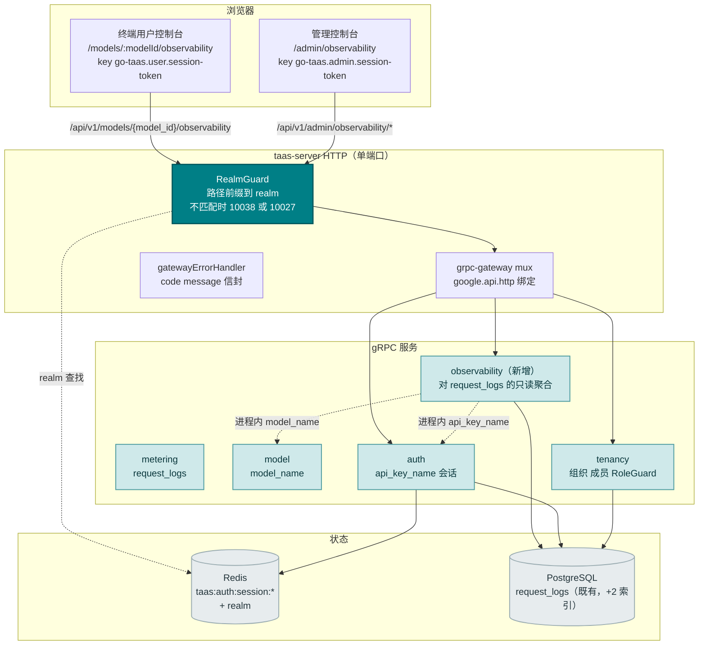
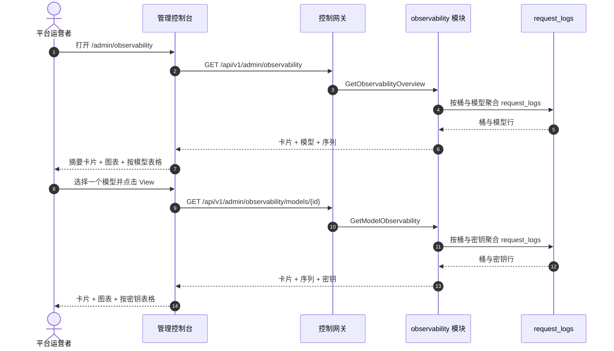
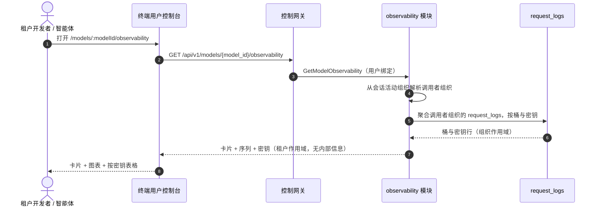
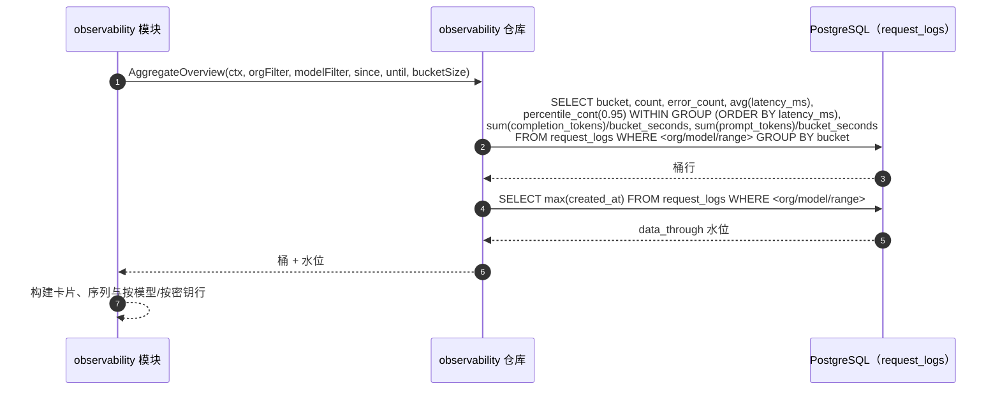

# 模型可观测性仪表盘 — 架构与详细设计

| 属性 | 内容 |
| --- | --- |
| 特性点 | 模型可观测性仪表盘 — 按模型展示随时间变化的延迟 / 吞吐 / 错误率 / Token 吞吐指标，带时间范围与模型过滤，由计量与请求日志派生（backlog 第 24 行） |
| 文档范围 | 特性 #24 的架构与详细设计：新增 `observability` 模块，拥有对 `request_logs` 的只读聚合；`taas.observability.v1.ObservabilityService` proto，含 `GetObservabilityOverview`（管理面集群）与 `GetModelObservability`（管理/用户双绑定）；管理面可观测性页面（`/admin/observability`、`/admin/observability/models/:modelId`）与终端用户面模型可观测性页面（`/models/:modelId/observability`）；外加错误处理、配置、安全、上线与逐层函数级设计 |
| 归属模块 | 新增 `observability` 模块（`services/observability`）：对 `request_logs` 的只读聚合 RPC；`model`（只读：`model_name` 解析）；`auth`（会话活动组织，只读）；`tenancy`（RoleGuard，只读）；`pkg/server` 网关（管理前缀与用户前缀绑定）；控制台 Web 应用（管理面 `ObservabilityPage`/`ModelObservabilityPage`、终端用户面 `UserModelObservabilityPage`） |
| 相关文档 | [需求分析与 UI/UX 设计](../design/model-observability.zh-cn.md) · [架构设计](../design/architecture.zh-cn.md) 第 2.5 节（`metering`）、第 3.1 节（管理/用户面分离）· [请求日志与 API 游乐场](./request-logs-playground.zh-cn.md)（本特性聚合的 `request_logs` 表及其 `latency_ms`/`status`/`error`/token 字段）· [用量仪表盘与按请求成本归因](./usage-dashboard.zh-cn.md)（姊妹只读仪表盘及其内联 SVG 图表、新鲜度与范围约定）· [控制台面分离](./console-surface-separation.zh-cn.md)（本特性横跨的两个面、`UserShell`/`AdminShell` 约定、掩码投影规则） |
| 状态 | 架构完成，已移交开发代理 |

---

## 1. 概述与目标

go-taas 部署推理服务（特性 #2）、自动扩缩（特性 #16）、计量与计费（特性 #4、#5、#8、#14），并在 `request_logs` 中记录每个请求的元数据 — 延迟、状态、错误与 token 计数（特性 #12）。控制台仍然无法回答运营者与租户反复提出的问题：*这个模型随时间表现如何？* 负载测试特性（特性 #20）在合成负载下于某个时点测量服务；用量仪表盘（特性 #9）显示成本与 token 计数，但不显示延迟、吞吐或错误率；请求日志（特性 #12）是原始、按请求的表格，没有聚合。没有任何面把累积的请求元数据转化为运营者调优自动扩缩目标（特性 #16）所需的连续性能图景 — 延迟百分位、每秒请求数、错误率与每秒 token 数 — 以及租户在模型间选择并设定预期所需的图景。

本特性新增**模型可观测性仪表盘**：按模型展示随时间变化的延迟 / 吞吐 / 错误率 / Token 吞吐指标，带时间范围与模型过滤，由平台已写入的 `request_logs` 派生。它是**只读**聚合层 — 推理、计量或计费流水线没有任何变化。这是 Phase 4 生产化路线图项中最小可独立交付的增量：它把「模型在服务」变成「模型以 X req/s、Y ms p95 延迟与 Z% 错误率在服务」。

**目标**：新增 `observability` 模块，拥有对 `request_logs` 的只读聚合；`taas.observability.v1.ObservabilityService` 含两个 RPC — `GetObservabilityOverview`（管理面集群：卡片 + 按模型表格 + 按模型过滤的时间序列）与 `GetModelObservability`（双绑定：管理面按模型下钻与终端用户面单模型视图，各含卡片 + 时间序列 + 按密钥拆分）；管理面可观测性页面（`/admin/observability`）与按模型下钻（`/admin/observability/models/:modelId`），以及终端用户面模型可观测性页面（`/models/:modelId/observability`）；新增错误码 10801 `CodeObservabilityModelNotFound`；页面 → 路由 → API 前缀映射表，含精确前缀；每页交互状态，包括空、错误与权限拒绝；以及可在 Nightwatch 中针对 compose 栈测试的编号验收标准。

**非目标**（延后，设计第 8 节）：实时流式指标（请求日志节奏不变）；异常检测或阈值告警（特性 #26 在控制台内消费可观测性事件 — 此处不在范围内）；保存的自定义视图 / 仪表盘；在图表中并排比较模型（v1 显示按模型表格与单模型图表）；TTFT/TPOT 拆分（v1 报告端到端延迟百分位与 token/秒）；向租户暴露服务 id、副本数或其他运营者内部信息（设计 D7）；对推理、计量或计费流水线的任何更改（只读特性）；新增审计事件（设计 D9）。

### 1.1 本文档阅读顺序

第 2 节记录架构决策（AD1–AD9，镜像设计的 D1–D9 外加架构师所做的细化）。第 3–5 节为组件视图、数据模型与 API 设计。第 6 节为前端架构（两个控制台的页面 → 路由 → API 前缀表、各面认证守卫）。第 7–8 节为时序流程与错误处理。第 9–11 节为配置、安全与上线。第 12–14 节为验收标准追溯、函数级详细设计与有序实现任务清单。

---

## 2. 架构决策

| # | 决策 | 依据 |
| --- | --- | --- |
| AD1 | **新增 `observability` 模块**（`services/observability`），拥有对 `request_logs` 的只读聚合，错误块为 **108xx** | 仪表盘需要多种形状（头部卡片、时间序列、按模型/按密钥表格）；专用模块把聚合关注点从 `metering` 的原始日志面中分离出来，并给它一个归属（设计 D3） |
| AD2 | **observability 错误块为 10801–10899，而非 10701–10799。** webhook 模块已占用 10701–10705（特性 #23，e2e 已通过）。设计「webhook 块（106xx）之后的全新块」的意图通过取 webhook 107xx 之后的下一个空闲块来满足 | 每个模块有自己的错误块（`pkg/errors/codes.go`）；webhook 取了 107xx，因此 observability 取 108xx。这是与既有架构最一致的解读（设计 D8，已细化） |
| AD3 | **可观测性是对 `request_logs` 的纯只读聚合** — 无新表、无 MQ subject、无 runner、任何路径都不写。`model_name` 从 `model` 模块进程内解析；`api_key_name` 从 `auth` 模块解析 | 该特性是对既有数据的纯聚合（设计 D9）；请求日志节奏不变。进程内解析名称避免与可能已删除模型/密钥的表做 join（请求日志比它们存活更久） |
| AD4 | **管理面可观测性 RPC 默认集群级，而非组织作用域。** `GetObservabilityOverview` 与管理面 `GetModelObservability` 绑定跨所有组织聚合，可选 `organization_id` 过滤从 `X-Organization-Id` 读取。它们由 `tenancy.RoleGuard` 门控（管理角色，10036）。用户面 `GetModelObservability` 绑定硬作用域为调用者的组织（会话活动组织权威，忽略 `X-Organization-Id`） | 运营者需要跨组织集群视图来调优自动扩缩与容量（设计 D1）；租户只需要自己的用量（设计 D7）。这是对「管理查询解析组织」模式的一次刻意偏离 — 集群视图正是管理面的意义所在，而 RoleGuard 使其仅限管理员 |
| AD5 | **指标由 `request_logs` 派生**（每请求的 `latency_ms`、`status`、`error` 与四个 token 计数，特性 #12），在服务端聚合为时间桶。四个指标族为**延迟**（`latency_ms` 的 p50/p90/p95/p99）、**吞吐**（每秒请求数）、**错误率**（错误请求 ÷ 总请求）与 **token 吞吐**（每秒输出 token，外加每秒输入 token 与总 token） | `request_logs` 已捕获所需的一切，并在同一幂等处理器中与 voucher 一起写入（特性 #12）；服务端聚合保持负载小且客户端依赖精简（设计 D2） |
| AD6 | **延迟百分位在 SQL 中计算**，用 `percentile_cont(0.95) WITHIN GROUP (ORDER BY latency_ms)`（以及 p50/p90/p99），而非在 Go 中计算 | 单次 SQL 遍历同时计算计数、错误计数、延迟求和、token 求和与百分位，避免把每个延迟值取入内存。线上只携带整数计数与整数毫秒；`error_rate` 由客户端派生为 error ÷ requests（设计契约说明 3） |
| AD7 | **时间桶随范围自适应**：范围 ≤ 7 天用小时桶，范围 > 7 天用日桶。范围上限 **92 天**，校验复用 **10404** `CodeMeteringRangeInvalid` | 短范围的小时粒度显示日内尖峰（自动扩缩相关信号）；长范围的日粒度保持负载小。92 天上限与 10404 复用让范围契约与每个计量查询统一（设计 D4） |
| AD8 | **新鲜度显式**：每个响应携带 `data_through` — 请求日志覆盖的最后一个完整桶的起始（最近的请求日志 `created_at` 截断到桶边界，再减一个桶）。控制台显示「data through <time>」说明，并在所选范围超出它时显示 pending/partial 标记 | 用量滞后困惑是最常被记录的陷阱（设计 D6）；标记以零新流水线工作保持新鲜度故事诚实 |
| AD9 | **图表用内联 SVG 渲染** — 每桶一个柱（或线），带指标切换器（延迟 / 吞吐 / 错误率 / token/秒）— 无新图表依赖 | 控制台刻意依赖精简；小而可测试的 SVG 组件与 usage-dashboard D7 决策一致（设计 D5） |

---

## 3. 组件视图

### 3.1 归属

| 层 / 组件 | 拥有 | 本特性的变更 |
| --- | --- | --- |
| **控制网关（`grpc-gateway`）** | 可观测性 RPC 的 HTTP/JSON 门面；realm 守卫（特性 #17）已用 10038 拒绝错误 realm 会话；把 `X-Organization-Id` 作为 gRPC metadata 透传 | 两个 HTTP 可观测性 RPC 的新绑定（第 5 节）；realm 守卫不变 |
| **`observability` 模块（`services/observability`）** | 对 `request_logs` 的只读聚合：两个 RPC、范围校验、桶构建器、聚合仓库、`data_through` 水位 | **新模块**（AD1） |
| **`model` 模块** | 模型元数据（`model_id` → `model_name`） | 只读：observability 模块进程内解析 `model_name`（AD3） |
| **`auth` 模块** | API Key 身份（`api_key_id` → `api_key_name`）、会话 realm、会话活动组织 | 只读：observability 模块进程内解析 `api_key_name`，并为用户绑定解析会话活动组织（AD3、AD4） |
| **`tenancy` 模块** | 组织、成员、角色、RoleGuard | 只读：`RoleGuard` 按调用者角色门控管理面可观测性 RPC（10036） |
| **PostgreSQL** | `request_logs`（既有）；集群级与按模型范围扫描的两个新索引 | 经 AutoMigrate 新增两个索引（第 4 节）；无新表 |
| **控制台** | 管理面可观测性页面与终端用户面模型可观测性页面 | 两个面上的三个新页面（第 6 节） |

### 3.2 运行时组件视图



### 3.3 请求身份链

可观测性 RPC 复用既有的身份链（console-surface-separation 第 3.3 节），管理面集群视图有一处刻意差异（AD4）：

1. `RealmGuard`（HTTP，`pkg/server/realm.go`）— 路径前缀决定期望 realm。`/api/v1/admin/observability/*` 期望 `admin`；`/api/v1/models/{model_id}/observability` 期望 `user`。无 `Authorization` 头：透传（过渡期，特性 #17 AD4）。有头：从 Redis 解析会话 realm；不匹配 → 10038，未知/过期/无 realm → 10027。
2. grpc-gateway mux — 按注解路径路由，并转发 `authorization` 与 `x-organization-id`。
3. 服务处理器 — **管理面绑定**：集群视图默认跨组织；`organization_id` 是可选过滤，从 `X-Organization-Id`（或调用者想作用域到自己组织时的会话活动组织）读取。**用户面绑定**：`SessionActiveOrg` 使会话活动组织权威并忽略 `X-Organization-Id`；无会话时，`resolveOrganizationID` 读取过渡期头，缺失或为空时返回 10001。
4. `tenancy.RoleGuard` — 按调用者在解析出的组织上下文中的角色门控管理面可观测性 RPC（10036）。终端用户面可观测性 RPC 硬作用域为调用者的组织，无需角色检查。

---

## 4. 数据模型

### 4.1 无新表

可观测性特性是对既有 `request_logs` 表（特性 #12）的纯只读聚合。无新表、无新 MQ subject、无新 runner、任何路径都不写（AD3，设计 D9）。消费的 `request_logs` 列：

| 列 | 用途 |
| --- | --- |
| `organization_id` | 组织作用域（用户绑定）与可选的管理面组织过滤 |
| `api_key_id` | 按密钥拆分（`keys[]`） |
| `model_id` | 按模型表格与模型过滤 |
| `prompt_tokens` / `completion_tokens` / `cached_tokens` / `reasoning_tokens` | Token 吞吐（输出 = completion，输入 = prompt） |
| `latency_ms` | 延迟百分位（p50/p90/p95/p99）与平均值 |
| `status` | 错误计数（status = `error`） |
| `created_at` | 桶分配与 `data_through` 水位 |

### 4.2 新索引

既有 `request_logs` 索引为 `idx_request_logs_org_created (organization_id, created_at)` 与 `idx_request_logs_key_created (api_key_id, created_at)`。管理面集群视图（AD4）跨所有组织扫描，模型过滤按 `model_id` 扫描，因此经 AutoMigrate 新增两个索引以保持范围扫描高效：

| 索引 | 列 | 服务 |
| --- | --- | --- |
| `idx_request_logs_created` | `created_at` | 集群级范围扫描（无组织过滤） |
| `idx_request_logs_model_created` | `model_id`, `created_at` | 按模型过滤的范围扫描（管理面下钻与终端用户面单模型视图） |

这两个索引是增量的、非破坏性的；它们不改变推理、计量或计费流水线（设计非目标）。

### 4.3 迁移说明

- 两个索引由 GORM `AutoMigrate` 在 `taas-server` 启动时创建（增量；无数据迁移）。`Migrate`/`MigrateSchemaForFVT` 在既有 `RequestLog` 模型上增加索引定义。
- 无需 init-SQL 升级路径：无新表，索引在启动时自动创建。
- observability 模块不写任何东西；请求日志保留 runner（特性 #12）仍是 `request_logs` 的唯一删除者。

---

## 5. API 设计

所有可观测性 RPC 都属于新的 **`taas.observability.v1.ObservabilityService`**（`proto/taas/observability/v1/observability.proto`），通过控制网关以 HTTP 提供。`GetObservabilityOverview` 仅管理面；`GetModelObservability` 双绑定（管理 + 用户）。面由请求路径派生（第 3.3 节）。

| RPC | HTTP（管理） | HTTP（用户） | 状态 | 目的 |
| --- | --- | --- | --- | --- |
| `GetObservabilityOverview` | `GET /api/v1/admin/observability` | — | **新增** | 集群卡片 + 按模型表格 + 按模型过滤的时间序列 |
| `GetModelObservability` | `GET /api/v1/admin/observability/models/{model_id}` | `GET /api/v1/models/{model_id}/observability` | **新增** | 单模型卡片 + 时间序列 + 按密钥拆分（管理：所有组织；用户：租户作用域） |

### 5.1 Proto 契约

```protobuf
syntax = "proto3";

package taas.observability.v1;

import "google/api/annotations.proto";
import "taas/common/v1/common.proto";

option go_package = "github.com/go-taas/go-taas/proto/taas/observability/v1;observabilityv1";

// ObservabilityService 提供从 request_logs 聚合的只读模型性能指标。
// GetObservabilityOverview 仅管理面（集群视图）；GetModelObservability
// 双绑定（管理面下钻与租户作用域单模型视图）。
service ObservabilityService {
  // GetObservabilityOverview 返回集群级可观测性：摘要卡片、按模型表格
  // 与按模型过滤的时间序列。管理面 API：在 /api/v1/admin 下提供。
  rpc GetObservabilityOverview(GetObservabilityOverviewRequest) returns (GetObservabilityOverviewResponse) {
    option (google.api.http) = {get: "/api/v1/admin/observability"};
  }

  // GetModelObservability 返回单模型可观测性：摘要卡片、时间序列与按
  // API Key 拆分。管理面绑定覆盖所有组织；用户面绑定为租户作用域。
  rpc GetModelObservability(GetModelObservabilityRequest) returns (GetModelObservabilityResponse) {
    option (google.api.http) = {
      get: "/api/v1/admin/observability/models/{model_id}"
      additional_bindings: {get: "/api/v1/models/{model_id}/observability"}
    };
  }
}

message GetObservabilityOverviewRequest {
  // organization_id 是可选集群过滤。管理面上从 X-Organization-Id（或
  // 会话活动组织）读取；缺失表示集群级（AD4）。
  string organization_id = 1;
  // since/until 界定范围，unix 秒。默认：until = now，since = until - 24h。
  // 范围 > 92 天被拒绝（10404）。
  int64 since = 2;
  int64 until = 3;
  // model_id 可选地把卡片与序列过滤到一个模型。
  string model_id = 4;
}

message GetObservabilityOverviewResponse {
  taas.common.v1.Response response = 1;
  ObservabilityCard cards = 2;
  repeated ModelObservabilityRow models = 3;
  repeated ObservabilitySeriesPoint series = 4;
}

message GetModelObservabilityRequest {
  // organization_id 从会话活动组织（用户绑定）或 X-Organization-Id
  // （管理面绑定）派生；该字段为 gRPC 直连调用者存在。
  string organization_id = 1;
  // model_id 是路径参数。
  string model_id = 2;
  // since/until 界定范围，unix 秒。默认：until = now，since = until - 24h。
  // 范围 > 92 天被拒绝（10404）。
  int64 since = 3;
  int64 until = 4;
}

message GetModelObservabilityResponse {
  taas.common.v1.Response response = 1;
  ObservabilityCard cards = 2;
  repeated ObservabilitySeriesPoint series = 3;
  repeated ObservabilityKeyRow keys = 4;
}

// ObservabilityCard 是范围的头条摘要。error_rate 由客户端派生为
// error_count / request_count；线上只携带整数计数与整数毫秒。
message ObservabilityCard {
  int64 request_count = 1;
  int64 error_count = 2;
  int64 avg_latency_ms = 3;
  int64 p95_latency_ms = 4;
  int64 output_tokens_per_sec = 5;
  int64 input_tokens_per_sec = 6;
  // data_through 是请求日志覆盖的最后一个完整桶的起始（AD8）；
  // 超出它的桶为 pending。
  int64 data_through = 7;
}

// ModelObservabilityRow 是集群表格中一个模型的聚合。
message ModelObservabilityRow {
  string model_id = 1;
  string model_name = 2;
  int64 request_count = 3;
  int64 error_count = 4;
  int64 avg_latency_ms = 5;
  int64 p95_latency_ms = 6;
  int64 output_tokens_per_sec = 7;
  // data_through 是该模型的最后一个完整桶（AD8）。
  int64 data_through = 8;
}

// ObservabilitySeriesPoint 是序列中的一个时间桶。
message ObservabilitySeriesPoint {
  // bucket 是桶起始，unix 秒（范围 <= 7 天为小时，否则为日，AD7）。
  int64 bucket = 1;
  int64 request_count = 2;
  int64 error_count = 3;
  int64 avg_latency_ms = 4;
  int64 p95_latency_ms = 5;
  int64 output_tokens_per_sec = 6;
  int64 input_tokens_per_sec = 7;
}

// ObservabilityKeyRow 是按密钥表格中一个 API Key 的聚合。
message ObservabilityKeyRow {
  string api_key_id = 1;
  string api_key_name = 2;
  int64 request_count = 3;
  int64 error_count = 4;
  int64 avg_latency_ms = 5;
  int64 p95_latency_ms = 6;
  int64 output_tokens_per_sec = 7;
}
```

### 5.2 契约说明（为开发代理钉定）

1. `GetObservabilityOverview` 校验 `since`/`until`（int64 unix 秒；默认 `until = now`、`since = until − 24h`）；`since > until` 或范围 > 92 天返回 10404（AD7）。`model_id` 与 `organization_id` 为可选过滤。
2. `GetModelObservability` 校验相同的范围契约；未知 `model_id` 返回 10801 `CodeObservabilityModelNotFound`（AD2）。在用户前缀上它作用域为调用者的组织（AD4），且不暴露服务 id 或运营者内部信息（设计 D7）。
3. 桶在范围 ≤ 7 天时为小时，否则为日（AD7）；每个桶携带 `bucket`、`request_count`、`error_count`、`avg_latency_ms`、`p95_latency_ms`、`output_tokens_per_sec`、`input_tokens_per_sec`。`error_rate` 由客户端派生（error ÷ requests）；线上只携带整数计数与整数毫秒（AD6）。
4. 每个响应携带 `data_through`（请求日志覆盖的最后一个完整桶的起始）用于新鲜度标记（AD8）。
5. 聚合读取 `request_logs`（特性 #12）— 每请求的 `latency_ms`、`status`、`error` 与四个 token 计数；它不写任何东西（AD3，设计 D9）。
6. 线上约定不变：列表用点分页，成功返回 HTTP 200，业务错误为 `{"code": <int>, "message": "..."}`，int64 字段序列化为 JSON 字符串。

### 5.3 错误码

错误码（observability 块 10801–10899，`pkg/errors/codes.go`）：

| 条件 | 代码 | 常量 | 说明 |
| --- | --- | --- | --- |
| 未知 `model_id` | 10801 | `CodeObservabilityModelNotFound` | **新增**（AD2） |
| 格式错误或超长范围 | 10404 | `CodeMeteringRangeInvalid` | 复用（AD7）— 计量范围契约 |
| 数据库 / 基础设施故障 | 500 | `CodeInternal` | 经错误归一化 |

---

## 6. 前端架构

### 6.1 页面 → 路由 → API 前缀表

| 页面 / 组件 | 面 | Web 路由 | API 前缀 | 认证守卫 |
| --- | --- | --- | --- | --- |
| **Observability 页面** | admin | `/admin/observability` | `/api/v1/admin/observability` | 管理会话；RoleGuard（管理角色） |
| **Model Observability 页面** | admin | `/admin/observability/models/:modelId` | `/api/v1/admin/observability/models/{id}` | 管理会话；RoleGuard（管理角色） |
| **Model Observability 页面** | end-user | `/models/:modelId/observability` | `/api/v1/models/{model_id}/observability` | 用户会话；硬作用域为调用者组织 |

> 管理面可观测性页面只调用 `/api/v1/admin/observability/*`；终端用户面模型可观测性页面只调用 `/api/v1/models/{model_id}/observability`。两个面绝不共享会话 token（特性 #17）。

### 6.2 导航位置

- **管理控制台**：管理导航新增 **Observability** 项（`/admin/observability`，testid `nav-observability`），位于操作组，与 Inference Services 和 Autoscaling 并列。
- **终端用户控制台**：无新顶层导航项。模型可观测性页面从模型详情页 `/models/:modelId`（特性 #19）经 **Observability** 标签或链接（testid `user-model-observability-link`）到达。

### 6.3 复用共享组件与状态

- **API 客户端**（`web/src/api.ts`）：realm 作用域客户端（`createApi(realm)`）已发送 `Authorization: Bearer <realm>.session-token` 与 `X-Organization-Id`（仅当 realm token key 为空时）。可观测性页面原样复用；不新增客户端。
- **内联 SVG 图表**：新增共享 `ObservabilityChart.tsx` 组件（每桶一个柱/线，带指标切换器），遵循 usage-dashboard `UsageChart.tsx` 模式（AD9）。指标切换器在客户端切换延迟 / 吞吐 / 错误率 / token/秒，无需重新获取。
- **时间范围过滤**：预设控件（24 h / 7 d / 30 d / custom，带日期时间选择器）与 Usage 和 Request Logs 页面共享。
- **摘要卡片**：新增共享 `ObservabilityCards.tsx` 组件，渲染卡片行并带「data through <time>」新鲜度说明（AD8）。
- **状态 / 新鲜度徽章**：超出 `data_through` 的 pending/partial 标记复用 usage-dashboard 的 pending 徽章样式。
- **空状态 / 数据新鲜度说明**：复用 Request Logs 页面模式（说明指标在摄取窗口内出现）。

### 6.4 各面认证守卫

- **管理面可观测性页面**（`/admin/observability`、`/admin/observability/models/:modelId`）：在 `AdminShell` 内渲染，当 `go-taas.admin.session-token` 非空时运行管理会话守卫；缺失/过期会话重定向到 `/admin/login?reason=expired`；错误 realm 会话被网关以 10038 拒绝。页面 API 调用发往 `/api/v1/admin/observability/*`。无所需角色的会话收到 10036，页面显示标准权限拒绝状态（特性 #17）。
- **终端用户面模型可观测性页面**（`/models/:modelId/observability`）：在 `UserShell` 内渲染，当 `go-taas.user.session-token` 非空时运行用户会话守卫；缺失/过期会话重定向到 `/login?reason=expired`。页面 API 调用发往 `/api/v1/models/{model_id}/observability`。页面不暴露服务 id 或运营者内部信息（设计 D7）。
- **未认证访客**：任一页面的未认证访客由 shell 守卫重定向到正确的登录页（`/admin/login` 或 `/login`）。

### 6.5 控制台契约（为开发代理钉定）

**Observability 页面**（`/admin/observability`）：页面头部（「Observability」，副标题「Model performance over time」）带 **Refresh** 操作（`observability-refresh`）。下方：过滤栏 — **Time range** 控件（`observability-filter-range`，预设 24 h / 7 d / 30 d / custom）与 **Model** 过滤（`observability-filter-model`，下拉，默认「All models」）；一行摘要卡片（`observability-cards`）：Requests、Error rate、Avg latency、p95 latency、Output tokens/sec、Input tokens/sec，各带「data through <time>」说明；内联 SVG 图表（`observability-chart`）带指标切换器（`observability-metric-toggle`）；按模型表格（`observability-table`、`observability-row-{model_id}`），列：Model（链接到下钻）、Requests、Error rate、Avg latency、p95 latency、Output tokens/sec、Data through，行操作 **View**。可按 Requests、Error rate、Avg latency、p95 latency 与 Output tokens/sec 排序；可按 Model 下拉过滤；分页。空状态：「No request data in this range.」带提示扩大范围。错误状态：带 Retry 按钮的错误横幅与「Showing stale data」横幅。权限拒绝：标准状态，带返回管理首页的链接。

**Model Observability 页面**（`/admin/observability/models/:modelId`）：返回总览的返回链接、含模型名称的头部、过滤栏（Time range）、摘要卡片、带指标切换器的内联 SVG 图表、按密钥表格（`observability-key-table`、`observability-key-row-{api_key_id}`），列：API key（名称）、Requests、Error rate、Avg latency、p95 latency、Output tokens/sec。可排序与分页。空文案：「No request data for this model in this range.」未找到状态（10801）显示标准未找到状态，带返回总览的链接。

**终端用户面 Model Observability 页面**（`/models/:modelId/observability`）：返回模型详情页 `/models/:modelId` 的返回链接、含模型名称的头部、过滤栏（Time range）、摘要卡片、带指标切换器的内联 SVG 图表、作用域为租户自己密钥的按密钥表格。空/错误/权限拒绝状态与第 5.2 节相同，权限拒绝文案为租户自身错误（10005 组织消失 / 10017 组织禁用，来自特性 #17 第 8.2 节）。页面不暴露服务 id 或运营者内部信息（设计 D7）。

---

## 7. 时序流程

### 7.1 管理面集群总览加载



### 7.2 终端用户面单模型视图加载



### 7.3 聚合查询



---

## 8. 错误处理

所有错误都是统一信封中的 `pkg/errors` 业务码（第 5.3 节）。observability 模块是只读的，因此没有 runner 侧失败，也没有可失败的写入。数据库故障归一化为 500 `CodeInternal`。

控制台按 body `code` 分支（`web/src/api.ts` 已如此），绝不按 HTTP 状态。每个新码渲染特定内联消息：10801「model not found」、10404「invalid range」（计量范围契约）。管理面页面把 10036 映射到标准权限拒绝状态；终端用户面页面把 10005/10017 映射到租户的权限拒绝文案（特性 #17 第 8.2 节）。

---

## 9. 配置新增

| 键 | 默认 | 说明 |
| --- | --- | --- |
| `observability.maxRangeSeconds` | `7948800`（92 天） | 可观测性 RPC 接受的最大范围（AD7）。镜像计量 `maxRangeSeconds` 常量；保留为可配置以利运维调优 |

`observability` 配置块在 `pkg/config` 中新增（`ObservabilityConfig`），遵循 `loadtest` 块模式。`applyDefaults`/`Validate` 设置上述默认值。observability 模块在其范围校验中读取 `maxRangeSeconds`。不新增其他配置键、runner 或 MQ subject — 该特性是对既有数据的只读聚合（AD3）。

---

## 10. 安全考量

- **面分离**：管理面可观测性页面只调用 `/api/v1/admin/observability/*`；终端用户面模型可观测性页面只调用 `/api/v1/models/{model_id}/observability`。realm 守卫在任何处理器运行前以 10038 拒绝错误 realm 会话（特性 #17）。
- **管理面集群视图按角色门控**：管理面可观测性 RPC 默认集群级（AD4），由 `tenancy.RoleGuard` 门控 — 只有具备所需管理角色的调用者能看跨组织集群视图；不可访问的组织返回 10036。
- **终端用户面硬作用域**：`GetModelObservability` 的用户绑定硬作用域为调用者的组织（会话活动组织权威，忽略 `X-Organization-Id`）；调用者绝不可能看到其他租户的用量。
- **掩码投影**：终端用户面不暴露服务 id、副本数或其他运营者编排内部信息（设计 D7）。管理面为运营者作用域。
- **构造性只读**：observability 模块只发 `SELECT`；任何路径都不写（AD3，设计 D9）。无需新增审计事件 — 底层请求日志写入已被审计（特性 #15）。
- **无新特权**：可观测性不授予新能力；它是对调用者已能通过请求日志（在其作用域内）查询的数据的只读聚合。

---

## 11. 上线 / 升级说明

- **两个增量索引**经 AutoMigrate 加到既有 `request_logs` 表；单独部署 `taas-server`。无新表、无数据迁移、无 init-SQL 升级路径。
- **proto 变更是增量的**：新增 `taas.observability.v1.ObservabilityService` 与两个新 RPC；无既有 RPC 或消息变更。网关 mux 获得新绑定；realm 守卫不变。
- **控制台**：三个新页面加入既有 bundle；管理导航新增 Observability，终端用户面模型详情页新增 Observability 标签/链接。无既有路由变更。
- **向后兼容**：过渡期（无会话、`X-Organization-Id`）路径为 CLI、FVT 与 e2e 套件保留；realm 守卫透传无 `Authorization` 头的请求（特性 #17 AD4）。
- **数据存在前为空**：在请求日志存在前，可观测性 RPC 返回空卡片/序列/表格；页面渲染空状态并提示扩大范围。

---

## 12. 验收标准追溯

| # | 标准 | 处理位置 |
| --- | --- | --- |
| AC1 | `GetObservabilityOverview` 用有效范围返回摘要卡片、按模型表格与时间序列；范围 > 92 天或 `since > until` 返回 10404 | §5.1、§5.2、§5.3 |
| AC2 | `GetObservabilityOverview` 带 `model_id` 过滤返回作用域为该模型的卡片与序列 | §5.1、§7.3 |
| AC3 | `GetModelObservability`（admin）返回单模型卡片、时间序列与按密钥拆分；未知 `model_id` 返回 10801 | §5.1、§5.2、§5.3 |
| AC4 | `GetModelObservability`（user）只返回调用者组织对模型的用量，按租户自己的 API Key 聚合，无服务 id 或运营者内部信息 | §3.3、§6.4、§10 |
| AC5 | 桶在范围 ≤ 7 天时为小时，范围 > 7 天时为日；每个响应携带 `data_through` | §5.2、§7.3 |
| AC6 | `/admin/observability` 页面在首次成功加载后渲染过滤栏、摘要卡片、内联 SVG 图表与按模型表格，带 last-updated 时间戳 | §6.5 |
| AC7 | 更改时间范围或模型过滤会重新获取并重新渲染卡片、图表与表格；指标切换器切换图表指标 | §6.3、§6.5 |
| AC8 | 无数据匹配时渲染空状态（「No request data in this range.」）；加载失败保留最后的好数据并显示「Showing stale data」横幅与 Retry 操作 | §6.5 |
| AC9 | `/admin/observability/models/:modelId` 页面渲染模型的卡片、图表与按密钥表格；未知模型显示未找到状态 | §6.5 |
| AC10 | `/models/:modelId/observability` 页面渲染租户自己的卡片、图表与按密钥表格，无服务 id 或运营者内部信息可见 | §6.5、§10 |
| AC11 | 管理面可观测性页面仅在管理面可达：路由 `/admin/observability` 与 `/admin/observability/models/:modelId`，每个 API 调用使用 `/api/v1/admin/observability/*` 前缀且不含 `/api/v1/models/*` 字符串 | §6.1、§6.4、§10 |
| AC12 | 终端用户面可观测性页面仅在终端用户面可达：路由 `/models/:modelId/observability`，每个 API 调用使用 `/api/v1/models/{model_id}/observability` 前缀且不含 `/api/v1/admin/*` 字符串 | §6.1、§6.4、§10 |
| AC13 | 无所需角色的会话在管理面可观测性页面收到 10036，页面显示标准权限拒绝状态 | §3.3、§6.4、§10 |

---

## 13. 详细设计（逐层函数级职责）

### 13.1 Proto → 服务 → 仓库 → 控制器

| 层 | 文件 | 职责 |
| --- | --- | --- |
| `proto/taas/observability/v1` | `observability.proto` | 新 `ObservabilityService` 与两个 RPC（第 5.1 节）；消息 `GetObservabilityOverviewRequest/Response`、`GetModelObservabilityRequest/Response`、`ObservabilityCard`、`ModelObservabilityRow`、`ObservabilitySeriesPoint`、`ObservabilityKeyRow`。经 `buf generate` 重新生成 `observability.pb.go`/`observability_grpc.pb.go`/`observability.pb.gw.go` |
| `services/observability` | `observability_model.go` | 聚合行结构体（`ObservabilityBucketRow`、`ObservabilityModelRow`、`ObservabilityKeyRow`）与 `bucketSizeForRange` 辅助函数（≤ 7 天小时，否则日，AD7） |
| | `observability_repository.go` | `AggregateOverview(ctx, orgFilter, modelFilter, since, until, bucketSize)` — 集群聚合（卡片 + 按模型行 + 序列），用 SQL `percentile_cont`（AD6）；`AggregateModel(ctx, orgID, modelID, since, until, bucketSize)` — 单模型聚合（卡片 + 序列 + 按密钥行）；`DataThrough(ctx, orgFilter, modelFilter, since, until)` — `max(created_at)` 水位（AD8） |
| | `service.go` | 新 RPC `GetObservabilityOverview`、`GetModelObservability`；范围校验（10404，AD7）；管理面集群作用域 vs 用户面硬作用域解析（AD4）；`SessionActiveOrg`/`resolveOrganizationID` seam；`RoleGuard` seam 用于管理面组织作用域；进程内 `model_name`/`api_key_name` 解析（AD3）；`Migrate`/`MigrateSchemaForFVT` 在 `RequestLog` 上增加两个新索引（第 4.2 节） |
| `services/model` | `service.go` | 只读：暴露 `ModelName(ctx, modelID) (string, error)` seam（或复用 `GetModel`），供 observability 模块进程内解析 `model_name`（AD3） |
| `services/auth` | `service.go` | 只读：暴露 `APIKeyName(ctx, apiKeyID) (string, error)` seam，供 observability 模块进程内解析 `api_key_name`（AD3） |
| `pkg/errors` | `codes.go`/`messages.go` | `CodeObservabilityModelNotFound`（10801）常量 + 规范消息「model not found」（AD2） |
| `pkg/config` | `api.go`/`configuration.go` | `ObservabilityConfig` + `maxRangeSeconds`（第 9 节）+ `applyDefaults`/`Validate` |
| `apps/taas-server` | `main.go` | 把 `ObservabilityService` 注册到 gRPC 服务器与网关 mux；把 `model`/`auth` 名称解析 seam 与 `tenancy` RoleGuard 接入 observability 服务 |
| `web/src` | `pages/ObservabilityPage.tsx`、`pages/ModelObservabilityPage.tsx`、`pages/user/UserModelObservabilityPage.tsx`、`components/ObservabilityChart.tsx`、`components/ObservabilityCards.tsx`、`App.tsx`、`api.ts`、`shells/AdminShell.tsx`、`shells/UserShell.tsx` | 路由 `/admin/observability`、`/admin/observability/models/:modelId`、`/models/:modelId/observability`；`GetObservabilityOverview`/`GetModelObservability` API 类型与调用；导航项与模型详情 Observability 链接（第 6.5 节） |
| `test` | `fvt/model_observability_fvt_test.go`、`e2e/tests/modelObservability.js` | 第 14 节 |

### 13.2 哪个 React 页面/模块实现哪个屏幕

| 屏幕 | React 模块 | 路由 | API 调用 |
| --- | --- | --- | --- |
| Observability 页面（管理） | `web/src/pages/ObservabilityPage.tsx` | `/admin/observability` | `GetObservabilityOverview` |
| Model Observability 页面（管理） | `web/src/pages/ModelObservabilityPage.tsx` | `/admin/observability/models/:modelId` | `GetModelObservability` |
| Model Observability 页面（终端用户） | `web/src/pages/user/UserModelObservabilityPage.tsx` | `/models/:modelId/observability` | `GetModelObservability` |
| 内联 SVG 图表 | `web/src/components/ObservabilityChart.tsx`（共享） | （三个页面） | （客户端；指标切换器，无重新获取） |
| 摘要卡片 | `web/src/components/ObservabilityCards.tsx`（共享） | （三个页面） | （客户端；渲染返回的卡片） |

---

## 14. 测试策略

- **单元**（`services/observability`，sqlite 内存）：`observability_repository_test.go` — `AggregateOverview` 对种子 `request_logs` 集合返回正确的卡片/模型行/序列（AC1、AC2），`AggregateModel` 返回按密钥拆分（AC3），`DataThrough` 返回最后一个完整桶（AC5），桶大小在 7 天边界切换（AC5）。`service_test.go` — 范围校验对 `since > until` 与范围 > 92 天返回 10404（AC1）；未知 `model_id` 返回 10801（AC3）；用户绑定硬作用域为调用者组织且不暴露服务 id（AC4）；管理面组织作用域返回 10036（AC13）。新文件覆盖率 ≥ 80%。
- **FVT**（`test/fvt/model_observability_fvt_test.go`，计量 FVT 模式：文件备份 sqlite + `MigrateSchemaForFVT` + `NewForFVT` + 带生产拦截器的 gRPC 服务器 + 带 `FVTHeaderMatcher` 的网关 mux）：跨组织/模型/密钥种子 `request_logs` 行，然后断言 `GetObservabilityOverview` 卡片/模型/序列（AC1）、`model_id` 过滤（AC2）、`GetModelObservability` 管理面按密钥拆分与 10801（AC3）、用户绑定只返回调用者组织的行且无内部信息（AC4）、小时 vs 日桶与 `data_through`（AC5）、以及内联 10404（AC1）。
- **E2E**（`test/e2e/tests/modelObservability.js`，`usageDashboard.js` 模式）：针对 compose 栈 — 管理面 `/admin/observability` 页面在首次成功加载后渲染 `observability-cards`、`observability-chart` 与 `observability-table`（AC6）；更改时间范围或模型过滤会重新获取，指标切换器切换图表指标（AC7）；空状态与 stale-data 横幅渲染（AC8）；管理面下钻渲染按密钥表格与未找到状态（AC9）；终端用户面 `/models/:modelId/observability` 页面渲染租户自己的卡片/图表/表格且无服务 id（AC10）；每个页面只调用自己的前缀，未认证访客被重定向到正确的登录页（AC11/AC12）；无所需角色的会话收到 10036 并显示权限拒绝状态（AC13）。