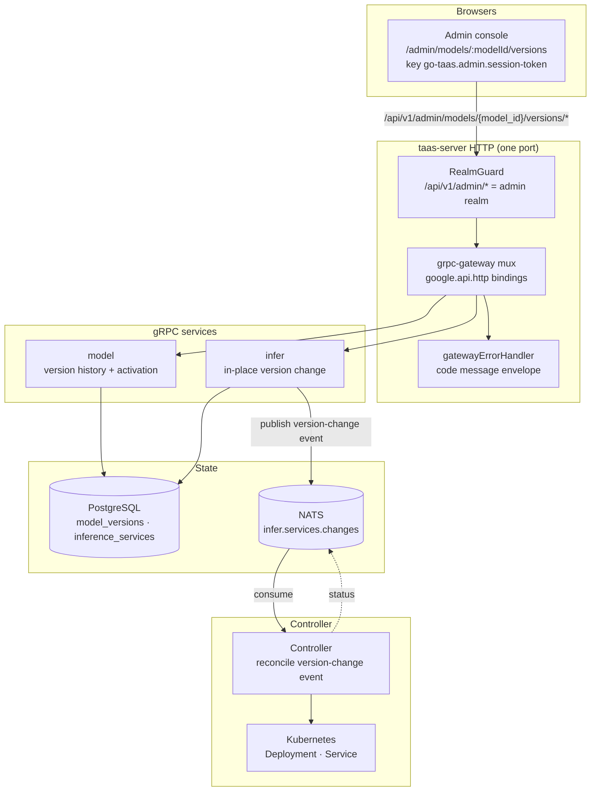
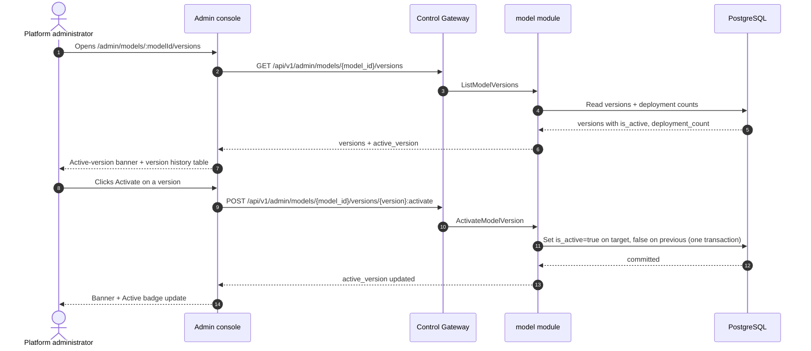
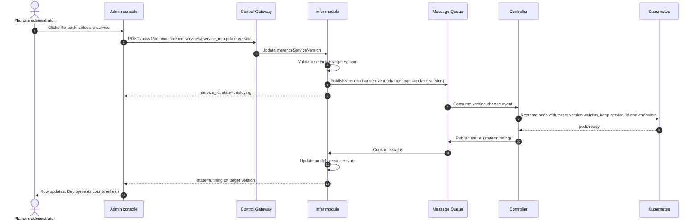

# Model Versioning & Rollback — Architecture and Detailed Design

| Attribute | Content |
| --- | --- |
| Feature point | Model versioning & rollback — manage model versions (register, activate, rollback), view version history, and roll back a deployment to a previous version (backlog row 32) |
| Document scope | Architecture and detailed design for feature-32: the `is_active` column on `model_versions`, the `ListModelVersions` and `ActivateModelVersion` RPCs on `ModelService`, the `UpdateInferenceServiceVersion` RPC on `InferServiceService`, the admin Model Versions page (`/admin/models/:modelId/versions`), plus error handling, configuration, security, rollout, and function-level design per layer |
| Owning modules | `model` (version history, activation, registration), `infer` (in-place version change / rollback of an inference service), `controller` (reconcile a version-change event), `web` admin console (`ModelVersionsPage`) |
| Related documents | [Requirement Analysis and UI/UX Design](../design/model-versioning.md) · [Architecture Design](../design/architecture.md) §2.2 (`model`), §2.4 (`infer`), §3.1 (admin/user surface separation) · [Model Catalog & One-Click Deployment](./model-catalog-deployment.md) (the catalog, the `model_versions` table, the deploy form, and the delete+recreate rule) · [Console Surface Separation](./console-surface-separation.md) (the two surfaces, the `AdminShell` conventions, the masked-projection rule) · [Deployment History & Audit](./deployment-history-audit.md) (the sibling deployment-level rollback surface) |
| Status | Architecture complete, handed to the Developer agent |

---

## 1. Overview and Goals

go-taas registers model versions (`model_versions` rows under a `models` catalog entry) and pins a `model_version` on every inference service (model-catalog-deployment §3.2/§3.3). What the console still cannot do is *manage* those versions: there is no version-history page, no notion of a default/active version that new deployments honor, and no way to roll a running deployment back to a previous version when a new one misbehaves. The operator must delete and recreate a service to change its version, which changes the `service_id` and breaks Agents pointing at the old endpoints.

This feature adds a **model versioning & rollback** surface: view a model's full version history, register a new version, activate a version as the default for new deployments, and roll a deployment back to a previous version in place (same `service_id`, same endpoints).

**Goals**:

- A `ListModelVersions` RPC returning the full version history with per-version metadata (version, weight path, created_at, is_active, deployment_count), newest first.
- An `ActivateModelVersion` RPC setting the active/default version, idempotent, one active version per model.
- An `UpdateInferenceServiceVersion` RPC changing a service's `model_version` in place (same `service_id`, same endpoints), transitioning `running → deploying → running`.
- The `is_active` column on `model_versions` with a partial unique index `(model_id) WHERE is_active`.
- The deploy form (model-catalog-deployment FR3.1) defaults to the active version when one is set.
- An admin Model Versions page (`/admin/models/:modelId/versions`) with version history, register/activate/rollback actions.
- New error codes in a model-versioning block (116xx).
- The page → route → API-prefix table with the exact admin prefix; per-page interactive states including empty, error, and permission-denied; numbered acceptance criteria testable in Nightwatch against the compose stack.

**Non-goals** (deferred, design §8): the model catalog list and one-click deployment form (#2); image versioning and the image×card adaptation matrix (#3); tenant-level model authorization (#6); deployment history & audit (#34 — the audit trail of create/update/scale/rollback events); canary/blue-green upgrades; a user-realm version picker (D1 — tenants consume the active/latest version through the gateway).

### 1.1 Reading order of this document

Section 2 records the architecture decisions (AD1–AD8, mirroring the design's D1–D8). Sections 3–5 are the component view, data model, and API design. Section 6 is the frontend architecture (page → route → API-prefix table, auth guard). Sections 7–8 are the sequence flows and error handling. Sections 9–11 are configuration, security, and rollout. Sections 12–14 are the acceptance-criteria traceability, the function-level detailed design, and the ordered implementation task list.

---

## 2. Architecture Decisions

| # | Decision | Rationale |
| --- | --- | --- |
| AD1 | **Version management lives on the admin surface only**: `/admin/models/:modelId/versions` + `/api/v1/admin/models/{model_id}/versions/*`. There is **no end-user surface** — tenants consume the active/latest version through the gateway and never manage versions | Design D1. Version management is operator-orchestration (feature #17's masked-projection rule); tenants pick a model, not a version. Consistent with the admin-only accelerator inventory (feature #18) |
| AD2 | **Add an active-version concept**: one version per model is marked active (the default for new deployments). Stored as `is_active` on `model_versions` with a partial unique index `(model_id) WHERE is_active` | Design D2. Activation is the go-taas analogue of MLflow's Production stage / Vertex's `default` alias; it decouples "the version new deployments default to" from "the newest registered version" |
| AD3 | **Registering a new version reuses the existing `RegisterModel` RPC** (name + version + weight_path + description); the version page's "Register Version" dialog pre-fills the model name and calls it | Design D3. `RegisterModel` already appends a version to an existing model (model-catalog-deployment FR1.2); no new registration RPC is needed |
| AD4 | **A new `ListModelVersions` RPC** returns the full version history with per-version metadata (version, weight_path, created_at, is_active, deployment_count) — richer than `GetModel`'s `repeated string versions` | Design D4. The version page needs weight paths, active state, and per-version deployment counts; `GetModel`'s string list is insufficient |
| AD5 | **A new `ActivateModelVersion` RPC** sets the active version; activating is idempotent and only one version can be active per model | Design D5. Activation is a first-class operation (feature-point scope); the partial unique index enforces one active per model |
| AD6 | **Rollback is an in-place version change on the inference service**: a new `UpdateInferenceServiceVersion` RPC changes a service's `model_version` while keeping the same `service_id` and endpoints; the service goes through `deploying` then back to `running` | Design D6. "Roll back a deployment to a previous version" means the same endpoint serves the old version; delete+recreate (model-catalog-deployment D5) would change the `service_id` and break Agents. The Controller reconciles a version-change event by recreating pods with the new weights while keeping the service identity |
| AD7 | **The rollback entry point is on the version-history page**: each version row offers "Rollback", opening a dialog listing the deployments currently running a different version, with checkboxes to select which to roll back | Design D7. Keeps the feature self-contained on the feature point's route while the underlying API lives on the infer module |
| AD8 | **The deploy form (model-catalog-deployment FR3.1) defaults to the active version when one is set**, falling back to `latest_version` otherwise | Design D8. Activation is meaningful only if new deployments honor it; the fallback preserves existing behavior |

---

## 3. Component View

### 3.1 Ownership

| Layer / component | Owns | Changes in this feature |
| --- | --- | --- |
| **Control Gateway (`grpc-gateway`)** | HTTP/JSON facade for the three RPCs; realm guard (feature #17) already rejects a wrong-realm session with 10038; passes `X-Organization-Id` through as gRPC metadata | New bindings for `ListModelVersions`, `ActivateModelVersion`, `UpdateInferenceServiceVersion` (Section 5); no change to the realm guard |
| **`model` module (`services/model`)** | The `is_active` column on `model_versions`, the version-history query with per-version deployment counts, the activation transaction, the `ListModelVersions` and `ActivateModelVersion` RPCs | New RPCs on the existing `ModelService` (AD4, AD5); `is_active` on the `Version` GORM model (AD2) |
| **`infer` module (`services/infer`)** | The `UpdateInferenceServiceVersion` RPC: validates the service and target version, changes only `model_version`, publishes a version-change event, keeps `service_id` and endpoints | New RPC on the existing `InferServiceService` (AD6) |
| **`controller`** | Reconciles a version-change event by recreating pods with the new weights while keeping the service identity and endpoints | Read/write: the reconciler handles the new version-change event type (AD6) |
| **PostgreSQL** | `model_versions` (add `is_active`), `inference_services` (unchanged) | One additive column via AutoMigrate (Section 4) |
| **Console** | Admin Model Versions page | One new page on the admin surface (Section 6) |

### 3.2 Runtime component view



### 3.3 Request identity chain

The version RPCs are **admin-surface** (AD1). The chain is:

1. `RealmGuard` (HTTP, `pkg/server/realm.go`) — path prefix `/api/v1/admin/models/*` and `/api/v1/admin/inference-services/*` decides the expected realm `admin`. With no `Authorization` header: pass through (transitional, feature-17 AD4). With a header: resolve the session realm from Redis; mismatch → 10038, unknown/expired/realm-less → 10027.
2. grpc-gateway mux — routes by the annotated path and forwards `authorization` and `x-organization-id`.
3. Service handler — `ListModelVersions` and `ActivateModelVersion` are platform-scoped catalog operations (no org scoping, like the existing model catalog); `UpdateInferenceServiceVersion` resolves the service by `service_id` (the service carries its own `organization_id`).
4. `tenancy.RoleGuard` — gates the admin version RPCs by the caller's role (10036). The permission-denied state (design FR5.1, AC9) is produced by the role check.

---

## 4. Data Model

### 4.1 The `model_versions` Table (additive change)

The `model_versions` table (model-catalog-deployment §3.2) gains one additive column:

| Column | PostgreSQL type | Constraints | Description |
| --- | --- | --- | --- |
| `is_active` | `boolean` | NOT NULL DEFAULT false | Whether this version is the active/default version for new deployments (AD2) |

Indexes (additive):

| Index | Definition | Purpose |
| --- | --- | --- |
| Partial unique | `(model_id) WHERE is_active` | Enforces at most one active version per model (AD2, AD5) |

The GORM `Version` model gains `IsActive bool` with the partial unique index tag. The partial unique index is expressed in GORM via a `gorm:"uniqueIndex:idx_model_versions_active,where:is_active"` tag on `IsActive` combined with `ModelID`; the Developer agent must verify the generated DDL produces `CREATE UNIQUE INDEX ... ON model_versions (model_id) WHERE is_active` on PostgreSQL (SQLite in tests does not enforce partial unique indexes the same way — the FVT must assert the one-active invariant at the service layer, not rely on the index).

### 4.2 Migration Notes

- The `is_active` column is added by **GORM `AutoMigrate` at startup** through the `Migrator` hook (`pkg/server`, optional interface invoked by `Init`). The `model` module's `Migrate`/`MigrateSchemaForFVT` gain the `IsActive` field on `Version`.
- The change is additive-only: existing rows get `is_active=false`, and no backfill is needed (no version is active until an operator activates one).
- No new tables are created.

---

## 5. API Design

### 5.1 RPC Surface

Two new RPCs on `taas.model.v1.ModelService` and one new RPC on `taas.infer.v1.InferServiceService`. All are served as HTTP via the Control Gateway on the **admin prefix** `/api/v1/admin/*` (AD1). There is **no user-prefix binding** (AD1).

| Service | RPC | HTTP | Status | Purpose |
| --- | --- | --- | --- | --- |
| `taas.model.v1` | `ListModelVersions` | `GET /api/v1/admin/models/{model_id}/versions` | **new** | Version history with metadata + per-version deployment counts |
| `taas.model.v1` | `ActivateModelVersion` | `POST /api/v1/admin/models/{model_id}/versions/{version}:activate` | **new** | Set the active/default version |
| `taas.model.v1` | `RegisterModel` | `POST /api/v1/admin/models` | existing | Register a new version (reused, AD3) |
| `taas.infer.v1` | `UpdateInferenceServiceVersion` | `POST /api/v1/admin/inference-services/{service_id}:update-version` | **new** | Roll a deployment back to a previous version in place (AD6) |

### 5.2 Proto Messages

```proto
// model.proto (additive)

// ListModelVersions returns the full version history of a model, newest
// first, with per-version metadata and deployment counts.
// Admin-surface API: served under /api/v1/admin.
rpc ListModelVersions(ListModelVersionsRequest) returns (ListModelVersionsResponse) {
  option (google.api.http) = {get: "/api/v1/admin/models/{model_id}/versions"};
}

message ListModelVersionsRequest {
  string model_id = 1; // path
  taas.common.v1.PageRequest page = 2;
}

message ModelVersion {
  string version = 1;
  string weight_path = 2;
  int64 created_at = 3;
  bool is_active = 4;
  // deployment_count is the number of non-terminated inference services
  // pinned to this version.
  int64 deployment_count = 5;
}

message ListModelVersionsResponse {
  taas.common.v1.Response response = 1;
  string model_id = 2;
  string name = 3;
  // active_version is the currently active version string, empty when
  // none is set.
  string active_version = 4;
  repeated ModelVersion versions = 5;
  taas.common.v1.PageMeta page_meta = 6;
}

// ActivateModelVersion sets a version active and clears the previous
// active version. Idempotent: activating the already-active version is a
// no-op success.
// Admin-surface API: served under /api/v1/admin.
rpc ActivateModelVersion(ActivateModelVersionRequest) returns (ActivateModelVersionResponse) {
  option (google.api.http) = {
    post: "/api/v1/admin/models/{model_id}/versions/{version}:activate"
    body: "*"
  };
}

message ActivateModelVersionRequest {
  string model_id = 1; // path
  string version = 2;  // path
}

message ActivateModelVersionResponse {
  taas.common.v1.Response response = 1;
  string active_version = 2;
}
```

```proto
// infer.proto (additive)

// UpdateInferenceServiceVersion changes a service's model_version in
// place, keeping the same service_id and endpoints. The service goes
// through deploying then back to running.
// Admin-surface API: served under /api/v1/admin.
rpc UpdateInferenceServiceVersion(UpdateInferenceServiceVersionRequest) returns (UpdateInferenceServiceVersionResponse) {
  option (google.api.http) = {
    post: "/api/v1/admin/inference-services/{service_id}:update-version"
    body: "*"
  };
}

message UpdateInferenceServiceVersionRequest {
  string service_id = 1; // path
  string model_version = 2;
}

message UpdateInferenceServiceVersionResponse {
  taas.common.v1.Response response = 1;
  string service_id = 2;
  string state = 3; // deploying
}
```

### 5.3 Wire Format (established conventions)

- Pagination binds as `?page.offset=0&page.limit=20` (dotted form); bare `offset`/`limit` are silently ignored. Default limit 20, cap 100.
- Success responses are HTTP 200 (grpc-gateway default for unary RPCs), including creates.
- Business errors render as `{"code": <int>, "message": "..."}` with HTTP 500 for out-of-range codes (platform-wide status quo).
- int64 fields serialize as JSON strings.

### 5.4 Validation Matrix

`ListModelVersions` validates: `model_id` exists (10101). `ActivateModelVersion` validates: `model_id` exists (10101); `version` is a registered version of the model (10103). `UpdateInferenceServiceVersion` validates, in order:

| # | Check | Failure code | Canonical message |
| --- | --- | --- | --- |
| 1 | `service_id` exists | 10301 `CodeInferServiceNotFound` | inference service not found |
| 2 | service state is updatable (not `terminated`) | 10303 `CodeInferServiceStateInvalid` | inference service state invalid |
| 3 | `model_version` is a registered version of the service's model | 10103 `CodeModelVersionNotFound` | model version not found |

### 5.5 State Machine

`UpdateInferenceServiceVersion` reuses the existing inference-service state machine (model-catalog-deployment §4.4): `running → deploying → running`. The version-change event is a new event type on the existing `infer.services.changes` subject; the Controller reconciles it by recreating pods with the new weights while keeping the service identity and endpoints.

---

## 5.6 Message Contract

### 5.6.1 Version-Change Event (`infer.services.changes`)

The `infer` module publishes a version-change event on the existing `infer.services.changes` subject. The event body is the existing desired-state change envelope with a new `change_type` field:

```json
{
  "change_type": "update_version",
  "service_id": "<uuid>",
  "organization_id": "<org>",
  "model_id": "<uuid>",
  "model_version": "<new-version>",
  "image_id": "<uuid>",
  "replicas": 2,
  "accelerator": "nvidia",
  "accelerator_type": "A800"
}
```

The Controller decodes `change_type=update_version`, recreates the Kubernetes Deployment pods with the new weights (the `model_version` maps to a weight path via the model module), keeps the Service and endpoints, and reports observed state on `infer.services.status` (the existing status subject). The `infer` status consumer updates the service row's `model_version` and `state`.

---

## 6. Frontend Architecture

### 6.1 Page → Route → API-Prefix Table

| Page | Surface | Web route | API prefix |
| --- | --- | --- | --- |
| Model Versions page | admin | `/admin/models/:modelId/versions` | `/api/v1/admin/models/{model_id}/versions` |
| Register Version dialog | admin | `/admin/models/:modelId/versions` (dialog) | `/api/v1/admin/models` |
| Activate dialog | admin | `/admin/models/:modelId/versions` (dialog) | `/api/v1/admin/models/{model_id}/versions/{version}:activate` |
| Rollback dialog | admin | `/admin/models/:modelId/versions` (dialog) | `/api/v1/admin/inference-services/{service_id}:update-version` |

Every page and API call is on the **admin surface**; there is no end-user surface (AD1). Admin pages never call a `/api/v1/*` route, and the admin session realm is used throughout.

### 6.2 Navigation Placement

The Model Versions page is reached from the Model Detail page (`/admin/models/:modelId`) via a "Versions" link/tab. It renders inside `AdminShell` (feature #17). The nav item is not a top-level entry; it is a drill-down from the model catalog.

### 6.3 Shared Components and State

- `AdminShell` (feature #17) — the page shell, session guard, and permission-denied state.
- The shared time-range preset control is **not** used here (no time filter); the page reuses the standard table, badge, dialog, and skeleton components from the existing admin pages.
- The deploy form (model-catalog-deployment FR3.1) reuses the active-version default (AD8): it pre-fills the active version when one is set, falling back to `latest_version`.

### 6.4 Auth Guard per Surface

The page is admin-surface. The `RealmGuard` (feature #17) rejects a wrong-realm session with 10038 and an unknown/expired/realm-less session with 10027. `tenancy.RoleGuard` gates the RPCs by the caller's role (10036). The page's permission-denied handling is the standard feature-17 state.

### 6.5 Page: `/admin/models/:modelId/versions` — Model Versions (admin)

**Purpose**: give the platform administrator a single surface to manage a model's versions — view history, register a new version, activate a default, and roll deployments back to a previous version.

**Layout**: rendered inside `AdminShell`. A page header ("Model Versions", subtitle with the model name and `model_id`) with a **Back to Models** link (secondary) and a **Register Version** action (primary). Below:

1. **Active-version banner** — a card showing the currently active version (or "No active version — new deployments use the latest") and a note that new deployments default to it (AD2, AD8).
2. **Version history table** — columns: **Version**, **Status** (Active / Latest badges, independent), **Weight path**, **Created**, **Deployments** (count of non-terminated services on this version), **Actions** (Activate / Rollback / Deploy).

**Interactive states**:

| State | Behaviour |
| --- | --- |
| Default | Active-version banner + version history table render from the first successful load |
| Loading | Skeleton table; Register Version is disabled |
| Empty | "No versions registered for this model." with a hint to register the first version; the banner stays visible |
| Error | An error banner with the message and a Retry button; the page keeps its last good data with a "Showing stale data" banner |
| Disabled | Register Version is disabled while a load or a mutation is in flight; Activate/Rollback are disabled on the active version's row |
| Permission-denied | A session without the required role receives 10036 and the page shows the standard permission-denied state (feature #17) with a link back to the admin home |

**Register Version dialog**: fields **Version** (required, 1–64 chars), **Weight path** (required, object-storage path, syntax-validated), **Description** (optional, ≤ 1024 chars). Model name shown read-only. Validation errors inline; duplicate version shows "A version with this name already exists." Submit calls `RegisterModel`; on success the dialog closes and the new row appears.

**Activate confirmation dialog**: "Set `<version>` as the active version? New deployments will default to it." with **Cancel** (secondary) and **Activate** (primary). On success the banner and the row badges update.

**Rollback dialog**: lists the non-terminated services pinned to a different version, each with a checkbox, service name, current version, and state. A warning: "Agents calling the selected services' endpoints will see the version change." **Cancel** (secondary) and **Roll back** (primary, disabled until at least one service is selected). On success the affected rows' Deployments counts and the services' versions update.

---

## 7. Sequence Flows

### 7.1 Activate a version



### 7.2 Roll back a deployment



---

## 8. Error Handling

| Condition | Code | Constant | Notes |
| --- | --- | --- | --- |
| Unknown `model_id` | 10101 | `CodeModelNotFound` | `ListModelVersions`, `ActivateModelVersion` |
| Duplicate name+version | 10102 | `CodeModelExists` | `RegisterModel` (FR2.2) |
| Unknown version | 10103 | `CodeModelVersionNotFound` | `ActivateModelVersion`, `UpdateInferenceServiceVersion` |
| Unknown service | 10301 | `CodeInferServiceNotFound` | `UpdateInferenceServiceVersion` |
| Service state not updatable | 10303 | `CodeInferServiceStateInvalid` | `UpdateInferenceServiceVersion` on e.g. `terminated` (FR4.3) |
| Wrong-realm session | 10038 | `CodeRealmMismatch` | gateway realm guard |
| Unknown/expired/realm-less session | 10027 | `CodeSessionInvalid` | gateway realm guard |
| Insufficient role | 10036 | `CodeForbidden` | `tenancy.RoleGuard` |

The design doc allocates a **model-versioning error block 116xx** for this feature. The existing codes above (10101/10102/10103/10301/10303) already cover every failure mode the design names; the 116xx block is reserved for any future model-versioning-specific code the Developer agent needs. If a new code is required, it must be added to `pkg/errors/codes.go` in the 116xx block with a comment naming this feature.

---

## 9. Configuration

No new configuration is required for this feature. The version-change event reuses the existing `infer.services.changes` subject and the existing controller reconciliation path. The deploy-form active-version default (AD8) is a read of the `is_active` column, not a configuration value.

---

## 10. Security Considerations

- **Admin-only surface** (AD1): version management is operator-orchestration; tenants never see it. The `RealmGuard` and `RoleGuard` enforce the surface and role.
- **In-place rollback preserves service identity** (AD6): the `service_id` and endpoints are unchanged, so Agents pointing at the endpoints are not broken; the rollback dialog warns that Agents will see the version change.
- **One active version per model** (AD2): the partial unique index and the activation transaction enforce the invariant; the FVT asserts it at the service layer.
- **No new privilege**: the feature adds no new role or entitlement; it reuses the existing admin role gate.

---

## 11. Rollout / Upgrade Notes

- The `is_active` column is additive via AutoMigrate; no data migration or backfill is needed.
- The new RPCs bind under the existing admin prefix; the realm guard already treats that prefix as the admin surface.
- The version-change event is a new `change_type` on the existing `infer.services.changes` subject; the Controller must be deployed with the new reconciler before the `infer` module publishes `update_version` events (or the Controller must ignore unknown change types gracefully).
- The deploy form's active-version default is a read-only change; existing deployments are unaffected.

---

## 12. Acceptance-Criteria Traceability

| AC | Design | Architecture section | Level |
| --- | --- | --- | --- |
| AC1 | `ListModelVersions` returns name/model_id/active_version/versions[] newest first with weight_path/created_at/is_active/deployment_count; unknown model_id → 10101 | §5.1, §5.2, §5.4 | FVT |
| AC2 | `ActivateModelVersion` sets target active, clears previous, one active per model, idempotent; unknown version → 10103 | §5.1, §5.2, §5.4, §4.1 | FVT |
| AC3 | `UpdateInferenceServiceVersion` changes only model_version, keeps service_id/endpoints, transitions running→deploying→running; unknown service → 10301, unknown version → 10103, terminated → 10303 | §5.1, §5.2, §5.4, §5.5 | FVT |
| AC4 | `/admin/models/:modelId/versions` renders banner + table from first load with badges, weight path, created date, deployment counts | §6.5 | E2E |
| AC5 | Registering a new version calls `RegisterModel`, new row appears with is_active=false and deployment_count=0; duplicate shows inline conflict | §6.5, §5.4 | E2E |
| AC6 | Activating updates banner + Active badge; confirmation dialog shown before the call | §6.5 | E2E |
| AC7 | Rollback dialog lists only non-terminated services on a different version, disables confirm until one selected, transitions services to target version | §6.5, §7.2 | E2E |
| AC8 | Admin surface only: route `/admin/models/:modelId/versions`, every API call uses `/api/v1/admin/*` with no `/api/v1/*` string | §6.1 | E2E (surface separation) |
| AC9 | A session without the required role receives 10036 and the page shows the standard permission-denied state | §6.4, §8 | E2E |

---

## 13. Function-Level Detailed Design

### 13.1 `model` module (`services/model`)

| File | Function | Responsibility |
| --- | --- | --- |
| `model_model.go` | `Version.IsActive bool` | Add the `is_active` column with the partial unique index tag (AD2) |
| `model_repository.go` | `ListVersionsWithCounts(ctx, modelID, page)` | Query `model_versions` newest first (`created_at DESC, version DESC`), left-join `inference_services` counting non-terminated services per version; return `[]ModelVersion` + `active_version` |
| | `ActivateVersion(ctx, modelID, version)` | In one transaction: set `is_active=false` on the current active version, set `is_active=true` on the target; return the new active version. Idempotent: if the target is already active, no-op success |
| | `FindVersion(ctx, modelID, version)` | Return the version row or `CodeModelVersionNotFound` (reused by infer's validation) |
| `service.go` | `ListModelVersions(ctx, req)` | Validate `model_id` (10101), call `ListVersionsWithCounts`, build the response |
| | `ActivateModelVersion(ctx, req)` | Validate `model_id` (10101) and `version` (10103), call `ActivateVersion`, return the new active version |
| | `Migrate`/`MigrateSchemaForFVT` | Gain the `IsActive` field on `Version` |

### 13.2 `infer` module (`services/infer`)

| File | Function | Responsibility |
| --- | --- | --- |
| `service.go` | `UpdateInferenceServiceVersion(ctx, req)` | Validate `service_id` (10301), state not `terminated` (10303), target `model_version` registered for the service's model (10103, via the model repository); update the service row's `model_version` and set `state=deploying`; publish a version-change event (`change_type=update_version`) on `infer.services.changes`; return `service_id` + `state=deploying` |
| `change_publisher.go` | `PublishVersionChange(ctx, svc, newVersion)` | Build and publish the version-change event envelope (AD6) |
| `status_consumer.go` | (existing) | On the status report for a version-change reconcile, update `model_version` and `state` |

### 13.3 `controller` (`internal/controller`)

| File | Function | Responsibility |
| --- | --- | --- |
| `reconciler.go` | `ApplyInferServiceChange` | Decode `change_type=update_version`; recreate the Kubernetes Deployment pods with the new weights (resolve `model_version` → weight path via the model module), keep the Service and endpoints; report observed state on `infer.services.status` |

### 13.4 `web` admin console

| File | Page | Responsibility |
| --- | --- | --- |
| `pages/ModelVersionsPage.tsx` | `/admin/models/:modelId/versions` | Version history table, active-version banner, register/activate/rollback dialogs (AD7) |
| `App.tsx` / `router.tsx` | route registration | Register `/admin/models/:modelId/versions` on the admin surface |

---

## 14. Ordered Implementation Task List

1. `pkg/errors/codes.go` — reserve the 116xx block comment for model-versioning (no new code needed unless a failure mode requires it).
2. `proto/taas/model/v1/model.proto` — add `ListModelVersions` + `ActivateModelVersion` RPCs and messages; regenerate.
3. `proto/taas/infer/v1/infer.proto` — add `UpdateInferenceServiceVersion` RPC and messages; regenerate.
4. `services/model/model_model.go` — add `IsActive` to `Version`.
5. `services/model/model_repository.go` — `ListVersionsWithCounts`, `ActivateVersion`, `FindVersion`.
6. `services/model/service.go` — `ListModelVersions`, `ActivateModelVersion`, `Migrate`.
7. `services/infer/service.go` — `UpdateInferenceServiceVersion`; `change_publisher.go` — `PublishVersionChange`.
8. `internal/controller/reconciler.go` — handle `change_type=update_version`.
9. `web/src/pages/ModelVersionsPage.tsx` — the page + dialogs; register the route.
10. Deploy-form default (model-catalog-deployment FR3.1) — pre-fill the active version.
11. FVT + E2E tests for AC1–AC9.