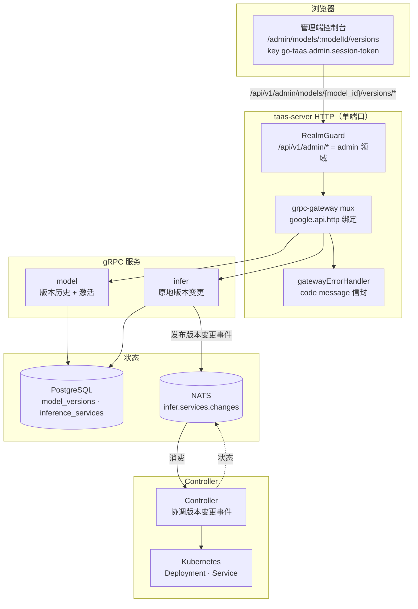
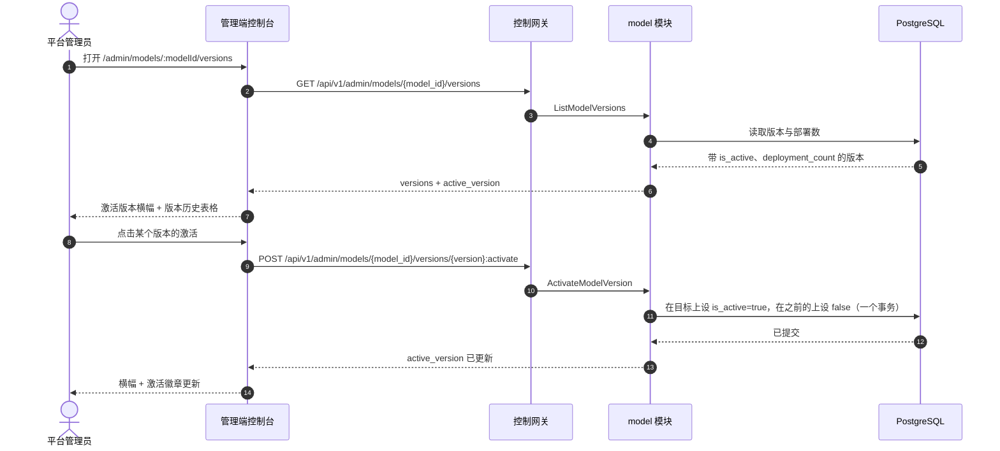
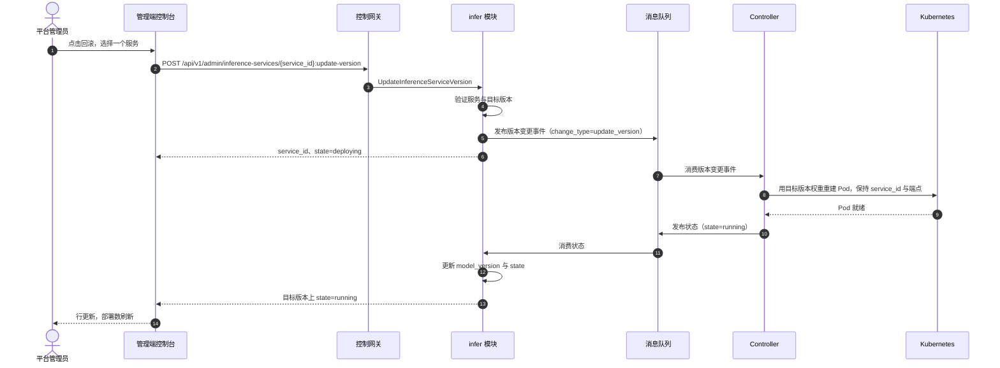

# 模型版本管理与回滚 —— 架构与详细设计

| 属性 | 内容 |
| --- | --- |
| 功能点 | 模型版本管理与回滚 —— 管理模型版本（注册、激活、回滚），查看版本历史，并将部署回滚到之前的版本（backlog 第 32 行） |
| 文档范围 | 功能点 32 的架构与详细设计：`model_versions` 上的 `is_active` 列、`ModelService` 上的 `ListModelVersions` 与 `ActivateModelVersion` RPC、`InferServiceService` 上的 `UpdateInferenceServiceVersion` RPC、管理端模型版本页面（`/admin/models/:modelId/versions`），以及错误处理、配置、安全、上线与各层函数级设计 |
| 所属模块 | `model`（版本历史、激活、注册）、`infer`（推理服务的原地版本变更/回滚）、`controller`（协调版本变更事件）、`web` 管理端控制台（`ModelVersionsPage`） |
| 相关文档 | [需求分析与 UI/UX 设计](../design/model-versioning.md) · [架构设计](../design/architecture.md) §2.2（`model`）、§2.4（`infer`）、§3.1（管理端/用户端分离）· [模型目录与一键部署](./model-catalog-deployment.md)（目录、`model_versions` 表、部署表单、删除+重建规则）· [控制台表面分离](./console-surface-separation.md)（两个表面、`AdminShell` 约定、掩码投影规则）· [部署历史与审计](./deployment-history-audit.md)（同级的部署级回滚表面） |
| 状态 | 架构完成，已移交给开发智能体 |

---

## 1. 概述与目标

go-taas 注册模型版本（`models` 目录条目下的 `model_versions` 行），并在每个推理服务上固定 `model_version`（model-catalog-deployment §3.2/§3.3）。控制台目前仍无法*管理*这些版本：没有版本历史页面，没有新部署遵循的默认/激活版本概念，也没有在新版本异常时将运行中的部署回滚到之前版本的方法。操作员必须删除并重建服务才能更改其版本，这会改变 `service_id` 并破坏指向旧端点的智能体。

本功能新增**模型版本管理与回滚**表面：查看模型的完整版本历史、注册新版本、激活一个版本作为新部署的默认版本，并将部署原地回滚到之前的版本（相同的 `service_id`、相同的端点）。

**目标**：

- 一个 `ListModelVersions` RPC，返回带每版本元数据（版本、权重路径、创建时间、is_active、部署数）的完整版本历史，最新在前。
- 一个 `ActivateModelVersion` RPC，设置激活/默认版本，幂等，每个模型只有一个激活版本。
- 一个 `UpdateInferenceServiceVersion` RPC，原地更改服务的 `model_version`（相同的 `service_id`、相同的端点），状态转换 `running → deploying → running`。
- `model_versions` 上的 `is_active` 列，带部分唯一索引 `(model_id) WHERE is_active`。
- 部署表单（model-catalog-deployment FR3.1）在设置了激活版本时默认使用它。
- 一个管理端模型版本页面（`/admin/models/:modelId/versions`），包含版本历史、注册/激活/回滚操作。
- 模型版本管理错误块（116xx）中的新错误码。
- 页面 → 路由 → API 前缀表，带精确的管理端前缀；包括空、错误、权限拒绝在内的各页面交互状态；可在 compose 栈上通过 Nightwatch 测试的编号验收标准。

**非目标**（延后，设计 §8）：模型目录列表与一键部署表单（#2）；镜像版本管理与镜像×卡适配矩阵（#3）；租户级模型授权（#6）；部署历史与审计（#34 —— 创建/更新/扩缩容/回滚事件的审计轨迹）；金丝雀/蓝绿升级；用户端版本选择器（D1 —— 租户通过网关消费激活/最新版本）。

### 1.1 本文档阅读顺序

第 2 节记录架构决策（AD1–AD8，对应设计的 D1–D8）。第 3–5 节是组件视图、数据模型与 API 设计。第 6 节是前端架构（页面 → 路由 → API 前缀表、认证守卫）。第 7–8 节是时序流程与错误处理。第 9–11 节是配置、安全与上线。第 12–14 节是验收标准可追溯性、函数级详细设计与有序实现任务清单。

---

## 2. 架构决策

| # | 决策 | 理由 |
| --- | --- | --- |
| AD1 | **版本管理仅存在于管理端表面**：`/admin/models/:modelId/versions` + `/api/v1/admin/models/{model_id}/versions/*`。**没有用户端表面** —— 租户通过网关消费激活/最新版本，从不管理版本 | 设计 D1。版本管理是操作员编排（功能点 #17 的掩码投影规则）；租户选择模型而非版本。与仅管理端的加速器清单（功能点 #18）一致 |
| AD2 | **新增激活版本概念**：每个模型有一个版本被标记为激活（新部署的默认版本）。存储在 `model_versions` 的 `is_active` 上，带部分唯一索引 `(model_id) WHERE is_active` | 设计 D2。激活是 go-taas 对 MLflow Production 阶段 / Vertex `default` 别名的类比；它将"新部署默认使用的版本"与"最新注册的版本"解耦 |
| AD3 | **注册新版本复用现有 `RegisterModel` RPC**（name + version + weight_path + description）；版本页面的"注册版本"对话框预填模型名并调用它 | 设计 D3。`RegisterModel` 已向现有模型追加版本（model-catalog-deployment FR1.2）；无需新的注册 RPC |
| AD4 | **新增 `ListModelVersions` RPC**，返回带每版本元数据（version、weight_path、created_at、is_active、deployment_count）的完整版本历史 —— 比 `GetModel` 的 `repeated string versions` 更丰富 | 设计 D4。版本页面需要权重路径、激活状态与每版本部署数；`GetModel` 的字符串列表不足 |
| AD5 | **新增 `ActivateModelVersion` RPC** 设置激活版本；激活是幂等的，每个模型只能有一个激活版本 | 设计 D5。激活是一等操作（功能点范围）；部分唯一索引强制每个模型一个激活版本 |
| AD6 | **回滚是推理服务上的原地版本变更**：新增 `UpdateInferenceServiceVersion` RPC，在保持相同 `service_id` 和端点的同时更改服务的 `model_version`；服务经历 `deploying` 然后回到 `running` | 设计 D6。"将部署回滚到之前的版本"意味着同一端点服务旧版本；删除+重建（model-catalog-deployment D5）会改变 `service_id` 并破坏智能体。Controller 通过用新权重重建 Pod 同时保持服务身份来协调版本变更事件 |
| AD7 | **回滚入口在版本历史页面上**：每个版本行提供"回滚"，打开一个对话框，列出当前运行不同版本的部署，带复选框选择要回滚的部署 | 设计 D7。使功能自包含在功能点的路由上，而底层 API 位于 infer 模块 |
| AD8 | **部署表单（model-catalog-deployment FR3.1）在设置了激活版本时默认使用它**，否则回退到 `latest_version` | 设计 D8。只有新部署遵循激活版本，激活才有意义；回退保留现有行为 |

---

## 3. 组件视图

### 3.1 职责归属

| 层 / 组件 | 拥有 | 本功能的变更 |
| --- | --- | --- |
| **控制网关（`grpc-gateway`）** | 三个 RPC 的 HTTP/JSON 门面；领域守卫（功能点 #17）已用 10038 拒绝错误领域的会话；将 `X-Organization-Id` 作为 gRPC 元数据传递 | `ListModelVersions`、`ActivateModelVersion`、`UpdateInferenceServiceVersion` 的新绑定（第 5 节）；领域守卫无变更 |
| **`model` 模块（`services/model`）** | `model_versions` 上的 `is_active` 列、带每版本部署数的版本历史查询、激活事务、`ListModelVersions` 与 `ActivateModelVersion` RPC | 现有 `ModelService` 上的新 RPC（AD4、AD5）；`Version` GORM 模型上的 `is_active`（AD2） |
| **`infer` 模块（`services/infer`）** | `UpdateInferenceServiceVersion` RPC：验证服务与目标版本，仅更改 `model_version`，发布版本变更事件，保持 `service_id` 和端点 | 现有 `InferServiceService` 上的新 RPC（AD6） |
| **`controller`** | 通过用新权重重建 Pod 同时保持服务身份和端点来协调版本变更事件 | 读写：协调器处理新的版本变更事件类型（AD6） |
| **PostgreSQL** | `model_versions`（新增 `is_active`）、`inference_services`（不变） | 通过 AutoMigrate 新增一个加性列（第 4 节） |
| **控制台** | 管理端模型版本页面 | 管理端表面上的一个新页面（第 6 节） |

### 3.2 运行时组件视图



### 3.3 请求身份链

版本 RPC 是**管理端表面**（AD1）。链路为：

1. `RealmGuard`（HTTP，`pkg/server/realm.go`）—— 路径前缀 `/api/v1/admin/models/*` 与 `/api/v1/admin/inference-services/*` 决定期望领域 `admin`。无 `Authorization` 头：放行（过渡期，功能点-17 AD4）。有头：从 Redis 解析会话领域；不匹配 → 10038，未知/过期/无领域 → 10027。
2. grpc-gateway mux —— 按注解路径路由并转发 `authorization` 与 `x-organization-id`。
3. 服务处理器 —— `ListModelVersions` 与 `ActivateModelVersion` 是平台范围的目录操作（无组织范围，与现有模型目录一致）；`UpdateInferenceServiceVersion` 按 `service_id` 解析服务（服务自带 `organization_id`）。
4. `tenancy.RoleGuard` —— 按调用者角色门控管理端版本 RPC（10036）。权限拒绝状态（设计 FR5.1、AC9）由角色检查产生。

---

## 4. 数据模型

### 4.1 `model_versions` 表（加性变更）

`model_versions` 表（model-catalog-deployment §3.2）新增一个加性列：

| 列 | PostgreSQL 类型 | 约束 | 描述 |
| --- | --- | --- | --- |
| `is_active` | `boolean` | NOT NULL DEFAULT false | 该版本是否为新部署的激活/默认版本（AD2） |

索引（加性）：

| 索引 | 定义 | 用途 |
| --- | --- | --- |
| 部分唯一 | `(model_id) WHERE is_active` | 强制每个模型至多一个激活版本（AD2、AD5） |

GORM `Version` 模型新增 `IsActive bool`，带部分唯一索引标签。部分唯一索引通过 `IsActive` 上的 `gorm:"uniqueIndex:idx_model_versions_active,where:is_active"` 标签与 `ModelID` 组合表达；开发智能体必须验证生成的 DDL 在 PostgreSQL 上产生 `CREATE UNIQUE INDEX ... ON model_versions (model_id) WHERE is_active`（测试中的 SQLite 不会以相同方式强制部分唯一索引 —— FVT 必须在服务层断言单激活不变量，而非依赖索引）。

### 4.2 迁移说明

- `is_active` 列通过 **GORM `AutoMigrate` 在启动时**通过 `Migrator` 钩子（`pkg/server`，由 `Init` 调用的可选接口）添加。`model` 模块的 `Migrate`/`MigrateSchemaForFVT` 在 `Version` 上新增 `IsActive` 字段。
- 变更是加性的：现有行获得 `is_active=false`，无需回填（在操作员激活一个版本之前没有版本是激活的）。
- 不创建新表。

---

## 5. API 设计

### 5.1 RPC 表面

`taas.model.v1.ModelService` 上两个新 RPC，`taas.infer.v1.InferServiceService` 上一个新 RPC。全部通过控制网关在**管理端前缀** `/api/v1/admin/*` 上以 HTTP 提供（AD1）。**没有用户前缀绑定**（AD1）。

| 服务 | RPC | HTTP | 状态 | 用途 |
| --- | --- | --- | --- | --- |
| `taas.model.v1` | `ListModelVersions` | `GET /api/v1/admin/models/{model_id}/versions` | **新** | 带元数据与每版本部署数的版本历史 |
| `taas.model.v1` | `ActivateModelVersion` | `POST /api/v1/admin/models/{model_id}/versions/{version}:activate` | **新** | 设置激活/默认版本 |
| `taas.model.v1` | `RegisterModel` | `POST /api/v1/admin/models` | 现有 | 注册新版本（复用，AD3） |
| `taas.infer.v1` | `UpdateInferenceServiceVersion` | `POST /api/v1/admin/inference-services/{service_id}:update-version` | **新** | 将部署原地回滚到之前的版本（AD6） |

### 5.2 Proto 消息

```proto
// model.proto（加性）

// ListModelVersions 返回模型的完整版本历史，最新在前，带每版本元数据与部署数。
// 管理端表面 API：在 /api/v1/admin 下提供。
rpc ListModelVersions(ListModelVersionsRequest) returns (ListModelVersionsResponse) {
  option (google.api.http) = {get: "/api/v1/admin/models/{model_id}/versions"};
}

message ListModelVersionsRequest {
  string model_id = 1; // path
  taas.common.v1.PageRequest page = 2;
}

message ModelVersion {
  string version = 1;
  string weight_path = 2;
  int64 created_at = 3;
  bool is_active = 4;
  // deployment_count 是固定到该版本的非终止推理服务数量。
  int64 deployment_count = 5;
}

message ListModelVersionsResponse {
  taas.common.v1.Response response = 1;
  string model_id = 2;
  string name = 3;
  // active_version 是当前激活版本字符串，未设置时为空。
  string active_version = 4;
  repeated ModelVersion versions = 5;
  taas.common.v1.PageMeta page_meta = 6;
}

// ActivateModelVersion 设置一个版本激活并清除之前的激活版本。幂等：激活已激活的版本是无操作成功。
// 管理端表面 API：在 /api/v1/admin 下提供。
rpc ActivateModelVersion(ActivateModelVersionRequest) returns (ActivateModelVersionResponse) {
  option (google.api.http) = {
    post: "/api/v1/admin/models/{model_id}/versions/{version}:activate"
    body: "*"
  };
}

message ActivateModelVersionRequest {
  string model_id = 1; // path
  string version = 2;  // path
}

message ActivateModelVersionResponse {
  taas.common.v1.Response response = 1;
  string active_version = 2;
}
```

```proto
// infer.proto（加性）

// UpdateInferenceServiceVersion 原地更改服务的 model_version，保持相同的 service_id 与端点。
// 服务经历 deploying 然后回到 running。
// 管理端表面 API：在 /api/v1/admin 下提供。
rpc UpdateInferenceServiceVersion(UpdateInferenceServiceVersionRequest) returns (UpdateInferenceServiceVersionResponse) {
  option (google.api.http) = {
    post: "/api/v1/admin/inference-services/{service_id}:update-version"
    body: "*"
  };
}

message UpdateInferenceServiceVersionRequest {
  string service_id = 1; // path
  string model_version = 2;
}

message UpdateInferenceServiceVersionResponse {
  taas.common.v1.Response response = 1;
  string service_id = 2;
  string state = 3; // deploying
}
```

### 5.3 线上格式（既定约定）

- 分页绑定为 `?page.offset=0&page.limit=20`（点形式）；裸 `offset`/`limit` 被静默忽略。默认 limit 20，上限 100。
- 成功响应为 HTTP 200（grpc-gateway 对一元 RPC 的默认），包括创建。
- 业务错误渲染为 `{"code": <int>, "message": "..."}`，越界码为 HTTP 500（平台现状）。
- int64 字段序列化为 JSON 字符串。

### 5.4 校验矩阵

`ListModelVersions` 校验：`model_id` 存在（10101）。`ActivateModelVersion` 校验：`model_id` 存在（10101）；`version` 是该模型的已注册版本（10103）。`UpdateInferenceServiceVersion` 按顺序校验：

| # | 检查 | 失败码 | 规范消息 |
| --- | --- | --- | --- |
| 1 | `service_id` 存在 | 10301 `CodeInferServiceNotFound` | inference service not found |
| 2 | 服务状态可更新（非 `terminated`） | 10303 `CodeInferServiceStateInvalid` | inference service state invalid |
| 3 | `model_version` 是服务模型的已注册版本 | 10103 `CodeModelVersionNotFound` | model version not found |

### 5.5 状态机

`UpdateInferenceServiceVersion` 复用现有推理服务状态机（model-catalog-deployment §4.4）：`running → deploying → running`。版本变更事件是现有 `infer.services.changes` 主题上的新事件类型；Controller 通过用新权重重建 Pod 同时保持服务身份和端点来协调它。

---

## 5.6 消息契约

### 5.6.1 版本变更事件（`infer.services.changes`）

`infer` 模块在现有 `infer.services.changes` 主题上发布版本变更事件。事件体是带新 `change_type` 字段的现有期望状态变更信封：

```json
{
  "change_type": "update_version",
  "service_id": "<uuid>",
  "organization_id": "<org>",
  "model_id": "<uuid>",
  "model_version": "<new-version>",
  "image_id": "<uuid>",
  "replicas": 2,
  "accelerator": "nvidia",
  "accelerator_type": "A800"
}
```

Controller 解码 `change_type=update_version`，用新权重重建 Kubernetes Deployment Pod（`model_version` 通过 model 模块映射到权重路径），保持 Service 和端点，并在 `infer.services.status`（现有状态主题）上报告观察状态。`infer` 状态消费者更新服务行的 `model_version` 与 `state`。

---

## 6. 前端架构

### 6.1 页面 → 路由 → API 前缀表

| 页面 | 表面 | Web 路由 | API 前缀 |
| --- | --- | --- | --- |
| 模型版本页面 | admin | `/admin/models/:modelId/versions` | `/api/v1/admin/models/{model_id}/versions` |
| 注册版本对话框 | admin | `/admin/models/:modelId/versions`（对话框） | `/api/v1/admin/models` |
| 激活对话框 | admin | `/admin/models/:modelId/versions`（对话框） | `/api/v1/admin/models/{model_id}/versions/{version}:activate` |
| 回滚对话框 | admin | `/admin/models/:modelId/versions`（对话框） | `/api/v1/admin/inference-services/{service_id}:update-version` |

每个页面和 API 调用都在**管理端表面**上；没有用户端表面（AD1）。管理端页面从不调用 `/api/v1/*` 路由，全程使用管理端会话领域。

### 6.2 导航位置

模型版本页面从模型详情页面（`/admin/models/:modelId`）通过"版本"链接/标签页到达。它在 `AdminShell`（功能点 #17）内渲染。导航项不是顶层入口；它是从模型目录下钻的。

### 6.3 共享组件与状态

- `AdminShell`（功能点 #17）—— 页面外壳、会话守卫与权限拒绝状态。
- 此处**不**使用共享时间范围预设控件（无时间过滤）；页面复用现有管理端页面的标准表格、徽章、对话框与骨架组件。
- 部署表单（model-catalog-deployment FR3.1）复用激活版本默认值（AD8）：在设置了激活版本时预填它，否则回退到 `latest_version`。

### 6.4 各表面认证守卫

页面是管理端表面。`RealmGuard`（功能点 #17）用 10038 拒绝错误领域的会话，用 10027 拒绝未知/过期/无领域会话。`tenancy.RoleGuard` 按调用者角色门控 RPC（10036）。页面的权限拒绝处理是标准的功能点-17 状态。

### 6.5 页面：`/admin/models/:modelId/versions` —— 模型版本（admin）

**用途**：为平台管理员提供管理模型版本的单一表面 —— 查看历史、注册新版本、激活默认版本、将部署回滚到之前的版本。

**布局**：在 `AdminShell` 内渲染。页面头部（"模型版本"，副标题带模型名与 `model_id`），带**返回模型**链接（次要）与**注册版本**操作（主要）。下方：

1. **激活版本横幅** —— 一张卡片，显示当前激活版本（或"无激活版本 —— 新部署使用最新版本"），并注明新部署默认使用它（AD2、AD8）。
2. **版本历史表格** —— 列：**版本**、**状态**（激活/最新徽章，独立）、**权重路径**、**创建时间**、**部署数**（该版本上的非终止服务数）、**操作**（激活/回滚/部署）。

**交互状态**：

| 状态 | 行为 |
| --- | --- |
| 默认 | 激活版本横幅 + 版本历史表格在首次成功加载时渲染 |
| 加载中 | 骨架表格；注册版本被禁用 |
| 空 | "该模型尚未注册任何版本。"并提示注册第一个版本；横幅保持可见 |
| 错误 | 带消息的错误横幅与重试按钮；页面保留最后的好数据并显示"显示过期数据"横幅 |
| 禁用 | 加载或变更进行中时注册版本被禁用；激活/回滚在激活版本的行上被禁用 |
| 权限拒绝 | 无所需角色的会话收到 10036，页面显示标准权限拒绝状态（功能点 #17），带返回管理端首页的链接 |

**注册版本对话框**：字段**版本**（必填，1–64 字符）、**权重路径**（必填，对象存储路径，语法校验）、**描述**（可选，≤ 1024 字符）。模型名只读显示。校验错误内联；重复版本显示"已存在同名版本。"提交调用 `RegisterModel`；成功后对话框关闭，新行出现。

**激活确认对话框**："将 `<version>` 设为激活版本？新部署将默认使用它。"带**取消**（次要）与**激活**（主要）。成功后横幅与行徽章更新。

**回滚对话框**：列出固定到不同版本的非终止服务，每个带复选框、服务名、当前版本与状态。警告："调用所选服务端点的智能体将看到版本变更。"**取消**（次要）与**回滚**（主要，直到至少选择一个服务才启用）。成功后受影响行的部署数与服务的版本更新。

---

## 7. 时序流程

### 7.1 激活一个版本



### 7.2 回滚一个部署



---

## 8. 错误处理

| 条件 | 码 | 常量 | 说明 |
| --- | --- | --- | --- |
| 未知 `model_id` | 10101 | `CodeModelNotFound` | `ListModelVersions`、`ActivateModelVersion` |
| 重复 name+version | 10102 | `CodeModelExists` | `RegisterModel`（FR2.2） |
| 未知版本 | 10103 | `CodeModelVersionNotFound` | `ActivateModelVersion`、`UpdateInferenceServiceVersion` |
| 未知服务 | 10301 | `CodeInferServiceNotFound` | `UpdateInferenceServiceVersion` |
| 服务状态不可更新 | 10303 | `CodeInferServiceStateInvalid` | `UpdateInferenceServiceVersion` 在如 `terminated` 上（FR4.3） |
| 错误领域会话 | 10038 | `CodeRealmMismatch` | 网关领域守卫 |
| 未知/过期/无领域会话 | 10027 | `CodeSessionInvalid` | 网关领域守卫 |
| 角色不足 | 10036 | `CodeForbidden` | `tenancy.RoleGuard` |

设计文档为本功能分配**模型版本管理错误块 116xx**。上述现有码（10101/10102/10103/10301/10303）已覆盖设计命名的每个失败模式；116xx 块保留给开发智能体未来可能需要的任何模型版本管理特定码。如需新码，必须将其添加到 `pkg/errors/codes.go` 的 116xx 块中，并带命名本功能的注释。

---

## 9. 配置

本功能无需新配置。版本变更事件复用现有 `infer.services.changes` 主题与现有 Controller 协调路径。部署表单激活版本默认值（AD8）是对 `is_active` 列的读取，不是配置值。

---

## 10. 安全考虑

- **仅管理端表面**（AD1）：版本管理是操作员编排；租户从不看到它。`RealmGuard` 与 `RoleGuard` 强制表面与角色。
- **原地回滚保持服务身份**（AD6）：`service_id` 与端点不变，因此指向端点的智能体不会被破坏；回滚对话框警告智能体将看到版本变更。
- **每个模型一个激活版本**（AD2）：部分唯一索引与激活事务强制该不变量；FVT 在服务层断言它。
- **无新特权**：本功能不新增角色或授权；复用现有管理端角色门控。

---

## 11. 上线/升级说明

- `is_active` 列通过 AutoMigrate 加性添加；无需数据迁移或回填。
- 新 RPC 绑定在现有管理端前缀下；领域守卫已将该前缀视为管理端表面。
- 版本变更事件是现有 `infer.services.changes` 主题上的新 `change_type`；在 `infer` 模块发布 `update_version` 事件之前，必须部署带新协调器的 Controller（或 Controller 必须优雅地忽略未知变更类型）。
- 部署表单的激活版本默认值是只读变更；现有部署不受影响。

---

## 12. 验收标准可追溯性

| AC | 设计 | 架构章节 | 级别 |
| --- | --- | --- | --- |
| AC1 | `ListModelVersions` 返回 name/model_id/active_version/versions[] 最新在前，带 weight_path/created_at/is_active/deployment_count；未知 model_id → 10101 | §5.1、§5.2、§5.4 | FVT |
| AC2 | `ActivateModelVersion` 设置目标激活、清除之前、每模型一个激活、幂等；未知版本 → 10103 | §5.1、§5.2、§5.4、§4.1 | FVT |
| AC3 | `UpdateInferenceServiceVersion` 仅更改 model_version，保持 service_id/端点，转换 running→deploying→running；未知服务 → 10301、未知版本 → 10103、terminated → 10303 | §5.1、§5.2、§5.4、§5.5 | FVT |
| AC4 | `/admin/models/:modelId/versions` 在首次加载时渲染横幅 + 表格，带徽章、权重路径、创建日期、部署数 | §6.5 | E2E |
| AC5 | 从对话框注册新版本调用 `RegisterModel`，新行以 is_active=false 与 deployment_count=0 出现；重复显示内联冲突 | §6.5、§5.4 | E2E |
| AC6 | 激活更新横幅 + 激活徽章；调用前显示确认对话框 | §6.5 | E2E |
| AC7 | 回滚对话框仅列出不同版本上的非终止服务，直到选择一个才启用确认，确认后服务转换到目标版本 | §6.5、§7.2 | E2E |
| AC8 | 仅管理端表面：路由 `/admin/models/:modelId/versions`，每个 API 调用使用 `/api/v1/admin/*`，无 `/api/v1/*` 字符串 | §6.1 | E2E（表面分离） |
| AC9 | 无所需角色的会话收到 10036，页面显示标准权限拒绝状态 | §6.4、§8 | E2E |

---

## 13. 函数级详细设计

### 13.1 `model` 模块（`services/model`）

| 文件 | 函数 | 职责 |
| --- | --- | --- |
| `model_model.go` | `Version.IsActive bool` | 添加带部分唯一索引标签的 `is_active` 列（AD2） |
| `model_repository.go` | `ListVersionsWithCounts(ctx, modelID, page)` | 查询 `model_versions` 最新在前（`created_at DESC, version DESC`），左连接 `inference_services` 统计每版本的非终止服务数；返回 `[]ModelVersion` + `active_version` |
| | `ActivateVersion(ctx, modelID, version)` | 在一个事务中：在当前激活版本上设 `is_active=false`，在目标上设 `is_active=true`；返回新激活版本。幂等：若目标已激活，无操作成功 |
| | `FindVersion(ctx, modelID, version)` | 返回版本行或 `CodeModelVersionNotFound`（被 infer 的校验复用） |
| `service.go` | `ListModelVersions(ctx, req)` | 校验 `model_id`（10101），调用 `ListVersionsWithCounts`，构建响应 |
| | `ActivateModelVersion(ctx, req)` | 校验 `model_id`（10101）与 `version`（10103），调用 `ActivateVersion`，返回新激活版本 |
| | `Migrate`/`MigrateSchemaForFVT` | 在 `Version` 上新增 `IsActive` 字段 |

### 13.2 `infer` 模块（`services/infer`）

| 文件 | 函数 | 职责 |
| --- | --- | --- |
| `service.go` | `UpdateInferenceServiceVersion(ctx, req)` | 校验 `service_id`（10301）、状态非 `terminated`（10303）、目标 `model_version` 是服务模型的已注册版本（10103，通过 model 仓库）；更新服务行的 `model_version` 并设 `state=deploying`；在 `infer.services.changes` 上发布版本变更事件（`change_type=update_version`）；返回 `service_id` + `state=deploying` |
| `change_publisher.go` | `PublishVersionChange(ctx, svc, newVersion)` | 构建并发布版本变更事件信封（AD6） |
| `status_consumer.go` | （现有） | 在版本变更协调的状态报告上，更新 `model_version` 与 `state` |

### 13.3 `controller`（`internal/controller`）

| 文件 | 函数 | 职责 |
| --- | --- | --- |
| `reconciler.go` | `ApplyInferServiceChange` | 解码 `change_type=update_version`；用新权重重建 Kubernetes Deployment Pod（通过 model 模块将 `model_version` 解析为权重路径），保持 Service 与端点；在 `infer.services.status` 上报告观察状态 |

### 13.4 `web` 管理端控制台

| 文件 | 页面 | 职责 |
| --- | --- | --- |
| `pages/ModelVersionsPage.tsx` | `/admin/models/:modelId/versions` | 版本历史表格、激活版本横幅、注册/激活/回滚对话框（AD7） |
| `App.tsx` / `router.tsx` | 路由注册 | 在管理端表面注册 `/admin/models/:modelId/versions` |

---

## 14. 有序实现任务清单

1. `pkg/errors/codes.go` —— 为模型版本管理保留 116xx 块注释（除非失败模式需要，否则无需新码）。
2. `proto/taas/model/v1/model.proto` —— 添加 `ListModelVersions` + `ActivateModelVersion` RPC 与消息；重新生成。
3. `proto/taas/infer/v1/infer.proto` —— 添加 `UpdateInferenceServiceVersion` RPC 与消息；重新生成。
4. `services/model/model_model.go` —— 在 `Version` 上添加 `IsActive`。
5. `services/model/model_repository.go` —— `ListVersionsWithCounts`、`ActivateVersion`、`FindVersion`。
6. `services/model/service.go` —— `ListModelVersions`、`ActivateModelVersion`、`Migrate`。
7. `services/infer/service.go` —— `UpdateInferenceServiceVersion`；`change_publisher.go` —— `PublishVersionChange`。
8. `internal/controller/reconciler.go` —— 处理 `change_type=update_version`。
9. `web/src/pages/ModelVersionsPage.tsx` —— 页面 + 对话框；注册路由。
10. 部署表单默认值（model-catalog-deployment FR3.1）—— 预填激活版本。
11. AC1–AC9 的 FVT + E2E 测试。