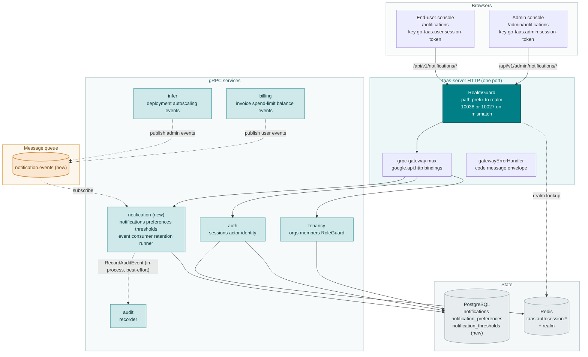
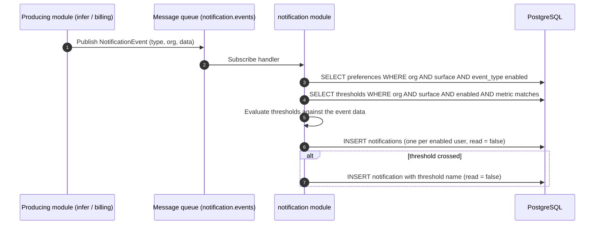
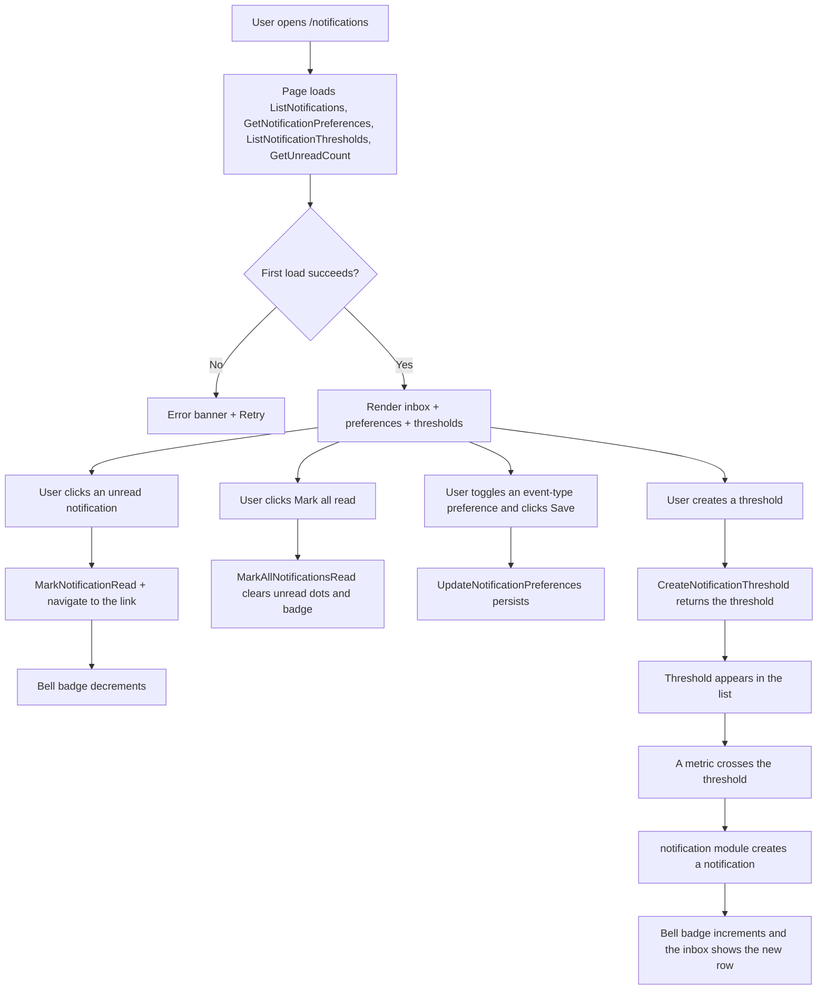
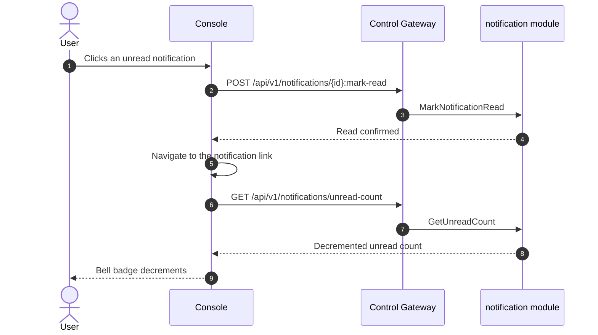

# Notification Center & Threshold Alerts — Architecture and Detailed Design

| Attribute | Content |
| --- | --- |
| Feature point | Notification center & threshold alerts — per-user notification preferences and an in-console notification center for balance-low, spend-limit, deployment and autoscaling events, with read/unread state (backlog row 26) |
| Document scope | Architecture and detailed design for feature-26: a new `notification` module owning notification persistence, per-user preferences, threshold-alert evaluation, and read/unread state; the `notifications`, `notification_preferences`, and `notification_thresholds` tables; the `taas.notification.v1.NotificationService` proto with dual admin/user HTTP bindings; the `notification.events` MQ subject and the producing-module publish points (reusing the feature-23 event catalog); the admin Notifications page (`/admin/notifications`) and the end-user Notifications page (`/notifications`); plus error handling, configuration, security, rollout, and function-level design per layer |
| Owning modules | New `notification` module (`services/notification`): `notifications` + `notification_preferences` + `notification_thresholds` tables, CRUD/query RPCs, the event subscription, threshold evaluation, the notification-creation fan-out, and the retention runner; `infer` and `billing` (publish the event catalog to `notification.events`); `audit` (notification mutations are audited); `pkg/mq` (new `NotificationEvents` subject); `pkg/server` gateway (admin-prefix and user-prefix bindings); console web app (admin `AdminNotificationsPage`, end-user `UserNotificationsPage`) |
| Related documents | [Requirement Analysis and UI/UX Design](../design/notification-center.md) · [Architecture Design](../design/architecture.md) §1.2 (message queue), §2 (module responsibilities), §3.1 (admin/user surface separation) · [Console Surface Separation](./console-surface-separation.md) (the two surfaces this feature spans, the `UserShell`/`AdminShell` conventions, the masked-projection rule) · [Webhook Notifications & Event Subscriptions](./webhook-notifications.md) (the event catalog this feature consumes in-console, feature #23) · [Inference Autoscaling](./inference-autoscaling.md) (the autoscaling events) · [Balance & Quota](./balance-quota.md) (the balance-low and spend-limit events) · [Payments, Invoices & Auto-Recharge](./payments-invoices-auto-recharge.md) (the billing/invoice events) · [Audit Logging](./audit-logging.md) (the audit recorder notification mutations must invoke) |
| Status | Architecture complete, handed to the Developer agent |

---

## 1. Overview and Goals

go-taas is a Token-as-a-Service platform: it deploys inference services (feature #2), autoscales them (feature #16), meters and bills usage (features #4, #5, #8, #14), and enforces spend limits (feature #11). Feature #23 added **outbound webhooks** so an external system can be pushed the events it cares about. But the operator and the tenant themselves still have **no in-console view** of those events: a balance that runs low, a spend limit that is breached, a deployment that fails, or a service that scales are only discoverable by opening the relevant page and polling. There is no single place that collects these events, marks which ones the user has seen, and lets the user choose which event types they care about.

This feature adds a **notification center with threshold alerts**: the platform persists the same event catalog feature #23 delivers outbound, surfaces it in-console as a notification list with read/unread state, lets each user choose which event types generate notifications (per-user preferences), and lets the user define **threshold alerts** (balance-low, spend-limit, autoscaling replica count, deployment failure) that generate a notification when a metric crosses a threshold. It is the smallest independently valuable increment of Phase 4's productionization roadmap item: it turns "the platform changed state" into "the user sees it in the console and can act on it".

**Goals**: a new `notification` module owning the `notifications`, `notification_preferences`, and `notification_thresholds` tables and their lifecycle; a `taas.notification.v1.NotificationService` with twelve RPCs, each dual-bound to the admin prefix `/api/v1/admin/notifications/*` and the user prefix `/api/v1/notifications/*`; a `notification.events` MQ subject carrying the event catalog, with `infer` publishing the admin events and `billing` publishing the end-user events (reusing the feature-23 catalog); per-user preferences that choose which event types generate notifications; configurable threshold alerts that generate a notification when a metric crosses a threshold; read/unread, mark-all-read, and delete on notifications; a bell with an unread badge in both shells; a 90-day notification retention runner; new error codes 11001–11005; an admin Notifications page (`/admin/notifications`) and an end-user Notifications page (`/notifications`).

**Non-goals** (deferred, design §8): email or SMS delivery of notifications (v1 is in-console only; webhooks feature #23 already covers outbound delivery); a notification digest or scheduling; notification grouping/dedup beyond a simple per-event notification; push notifications; cross-surface notification visibility (the surface split is binding); a notification replay API; any change to the inference, metering, or billing pipelines (read-only consumer of the event catalog).

### 1.1 Reading order of this document

Section 2 records the architecture decisions (AD1–AD12, mirroring the design's D1–D10 plus the two refinements the Architect made). Sections 3–5 are the component view, data model, and API design. Section 6 is the frontend architecture (page → route → API-prefix table for both consoles, auth guard per surface). Sections 7–8 are the sequence flows and error handling. Sections 9–11 are configuration, security, and rollout. Sections 12–14 are the acceptance-criteria traceability, the function-level detailed design, and the ordered implementation task list.

---

## 2. Architecture Decisions

| # | Decision | Rationale |
| --- | --- | --- |
| AD1 | **New `notification` module** (`services/notification`) owning the `notifications`, `notification_preferences`, and `notification_thresholds` tables, the CRUD/query RPCs, the event subscription, threshold evaluation, the notification-creation fan-out, and the retention runner, with its own error block **110xx** | Notifications consume events from `infer` and `billing`; a dedicated module keeps the notification concern out of the producing modules and gives it one home, mirroring how `webhook` owns delivery (design D8) |
| AD2 | **The notification error block is 11001–11099, the next free block after billing-reports' 109xx.** The billing-reports module owns 10901–10907 (feature #25, e2e-passed). The design's "fresh block after the billing-reports block (109xx)" intent is honored by taking the next free block after 109xx | Each module has its own error block (`pkg/errors/codes.go`); billing-reports took 109xx, so notification takes 110xx. This is the interpretation most consistent with the existing architecture (design D9, confirmed) |
| AD3 | **A notification is a persisted event with read/unread state.** It carries `notification_id`, `event_type`, `title`, `body`, `severity` (`info` / `warning` / `critical`), `read` (bool), `created_at`, a `data` payload, and an optional `link` deep link. Notifications are created when a subscribed event occurs (or a threshold is crossed) and are retained for 90 days | The notification is the in-console projection of the same event feature #23 delivers outbound; read/unread is the universal inbox pattern. 90-day retention matches the request-log and webhook-delivery retention (design D2) |
| AD4 | **Per-user preferences choose which event types generate notifications.** Each user has a preference set: for every event type in their surface's catalog, an `enabled` boolean (default all enabled). A disabled event type still occurs on the platform but does not create a notification for that user. Preferences are per-user, not per-org | Per-user preferences let each operator or tenant choose what they care about, mirroring feature #23's per-event-type enablement. Per-user (not per-org) because notification read state and relevance are personal (design D3) |
| AD5 | **Threshold alerts are configurable rules that generate notifications when a metric crosses a threshold.** A threshold carries `threshold_id`, `name`, `metric`, `operator` (`lt` / `gt`), `value`, `enabled`, `created_at`, and `updated_at`. The **end-user** metrics are `balance_low` (notify when balance < value) and `spend_limit` (notify when spend in the current period > value). The **admin** metrics are `autoscaling_replicas` (notify when a service's replica count > value) and `deployment_failure` (notify on any deployment failure). A threshold crossing creates a notification with the threshold's name | Configurable thresholds are the Aliyun Bailian high-spend-alert pattern. The metric set maps to the feature's stated event types: balance-low and spend-limit on the end-user surface, deployment and autoscaling on the admin surface (design D4) |
| AD6 | **A bell with an unread badge is the entry point.** Both shells (feature #17) show a bell icon in the header with an unread count badge; clicking it opens the notification center. The badge shows the count of unread notifications and updates when notifications are read or new ones arrive | The bell + badge is the standard notification entry point and gives the user a persistent, always-visible way to see what is new, avoiding the buried-in-billing pitfall (design D5) |
| AD7 | **Notifications support read/unread, mark-all-read, and delete.** A user can mark a single notification read, mark all read, and delete a notification. Read state is per-user and per-notification | Read/unread plus mark-all-read and delete are the minimal inbox operations a notification center needs; they keep the list manageable (design D6) |
| AD8 | **Notifications deep-link to the page where the user can act.** Each notification carries an optional `link` (e.g. the balance page for `billing.balance_low`, the spend-limit page for `billing.spend_limit_breached`, the deployment detail for `deployment.status_changed`, the autoscaling page for `autoscaling.scaled`). Clicking a notification navigates to that page and marks it read | Deep links turn a notification from "something happened" into "here is where you act", which is the point of an in-console notification center (design D7) |
| AD9 | **The event catalog flows over a single new MQ subject `notification.events`, reusing the feature-23 event catalog.** The producing modules (`infer` for the admin events, `billing` for the end-user events) publish a canonical `NotificationEvent` envelope; the `notification` module subscribes and, for each event, creates a notification for every user on that surface whose preferences enable that event type. Threshold evaluation runs on the same event stream | The single-Deployment topology (architecture §1.2) means modules share one broker; a single subject with the event type in the envelope keeps the subscription surface small and the routing logic in one place. Reusing the feature-23 catalog keeps the two consumers consistent and follows feature #17's masked-projection rule (design D1, D8, refined) |
| AD10 | **Notification creation is asynchronous via an event consumer** (a `server.Runner`). When an event matches a user's enabled preferences, the module inserts a notification row for that user. Threshold evaluation runs in the same consumer: when a metric crosses a threshold, the module inserts a notification with the threshold's name | A consumer decouples notification creation from the RPC path and the producing modules, so a slow fan-out never blocks the gateway or the event producer; the fan-out and threshold logic live in one place (design D8, refined) |
| AD11 | **The notification surface is derived from the request path, exactly like the webhook surface.** An admin-prefix request (`/api/v1/admin/notifications/*`) is an admin-surface notification; a user-prefix request (`/api/v1/notifications/*`) is a user-surface notification. The surface constrains which event types are valid in preferences and which metrics are valid in thresholds. The surface is never a request field | The surface is a property of the binding, exactly like the session realm (feature #17). Deriving it from the path keeps the catalog split structural and unspoofable (design D1, FR5.4) |
| AD12 | **Notification mutations are audited** (feature #15): preference changes and threshold create/update/delete each write an audit event. Reading and deleting notifications are not audited (they are high-frequency, low-risk user actions) | Thresholds and preferences are configuration that affects what a user is told; the audit trail must record who changed them. Read/delete are personal inbox actions with no cross-user impact (design D10) |

---

## 3. Component View

### 3.1 Ownership

| Layer / component | Owns | Changes in this feature |
| --- | --- | --- |
| **Control Gateway (`grpc-gateway`)** | HTTP/JSON facade for the notification RPCs; realm guard (feature #17) already rejects a wrong-realm session with 10038; passes `X-Organization-Id` through as gRPC metadata | New bindings for the 12 HTTP notification RPCs (Section 5); no change to the realm guard |
| **`notification` module (`services/notification`)** | `notifications` + `notification_preferences` + `notification_thresholds` tables, the CRUD/query RPCs, the event subscription, threshold evaluation, the notification-creation fan-out, the retention runner | **New module** (AD1) |
| **`infer` module** | The admin event catalog (`deployment.status_changed`, `autoscaling.scaled`, `autoscaling.scale_to_zero`) | Publishes these events to `notification.events` at the status-change and autoscaling points (AD9) |
| **`billing` module** | The end-user event catalog (`billing.invoice_created`, `billing.invoice_paid`, `billing.spend_limit_breached`, `billing.balance_low`) | Publishes these events to `notification.events` at the invoice, spend-limit, and balance points (AD9) |
| **`audit` module** | The audit recorder | Read-only: the notification module calls `RecordAuditEvent` after each mutation (AD12) |
| **`auth` module** | Actor identity, session realm, session active org, session user id | Read-only: the notification module resolves the org and user from the session; `SessionActiveOrg` supplies the org for session-bearing calls; `SessionUserID` supplies the caller's user id for per-user preferences and read state |
| **`tenancy` module** | Organizations, members, roles, RoleGuard | Read-only: `RoleGuard` gates the admin notification RPCs by the caller's role in the resolved org context (10036) |
| **PostgreSQL** | `notifications` + `notification_preferences` + `notification_thresholds` tables (new); all other tables untouched | Three new tables via AutoMigrate (Section 4) |
| **Console** | Admin Notifications page and end-user Notifications page | Two new pages on the two surfaces (Section 6) |

### 3.2 Runtime component view



### 3.3 Request identity chain

The notification RPCs reuse the established identity chain (console-surface-separation §3.3):

1. `RealmGuard` (HTTP, `pkg/server/realm.go`) — path prefix decides the expected realm. `/api/v1/admin/notifications/*` expects `admin`; `/api/v1/notifications/*` expects `user`. With no `Authorization` header: pass through (transitional, AD4 of feature #17). With a header: resolve the session realm from Redis; mismatch → 10038, unknown/expired/realm-less → 10027.
2. grpc-gateway mux — routes by the annotated path and forwards `authorization` and `x-organization-id`.
3. Service handler — for a session-bearing call, `SessionActiveOrg` makes the session's active organization authoritative and ignores `X-Organization-Id`; `SessionUserID` supplies the caller's user id for per-user preferences and read state. Without a session, `resolveOrganizationID` reads the transitional header and returns 10001 when it is absent or empty.
4. `tenancy.RoleGuard` — gates the admin notification RPCs by the caller's role in the resolved org context (10036). The end-user notification RPCs are hard-scoped to the caller's org and need no role check.

### 3.4 The event catalog and its surface split

The catalog is split by surface (design D1, feature #17's masked-projection rule), exactly matching feature #23's catalog:

| Surface | Event types | Producing module | Notification `surface` |
| --- | --- | --- | --- |
| admin | `deployment.status_changed`, `autoscaling.scaled`, `autoscaling.scale_to_zero` | `infer` | `admin` |
| end-user | `billing.invoice_created`, `billing.invoice_paid`, `billing.spend_limit_breached`, `billing.balance_low` | `billing` | `user` |

A notification's `surface` is derived from the request path (admin prefix → `admin`, user prefix → `user`) and constrains which event types are valid in preferences and which metrics are valid in thresholds (AD11). An event type outside the surface's catalog returns 11005; a metric outside the surface's metric set returns 11004. The surface is never a request field — it is a property of the binding, exactly like the session realm.

---

## 4. Data Model

### 4.1 The `notifications` Table

| Column | PostgreSQL type | Constraints | Description |
| --- | --- | --- | --- |
| `notification_id` | `uuid` | PRIMARY KEY | Server-generated UUID v4, exposed as `notification_id` |
| `organization_id` | `varchar(64)` | NOT NULL, index (composite) | Owning organization |
| `user_id` | `varchar(64)` | NOT NULL, index (composite) | Owning user (per-user read state) |
| `surface` | `varchar(16)` | NOT NULL | `admin` / `user` — which surface's catalog this notification belongs to (Section 3.4) |
| `event_type` | `varchar(64)` | NOT NULL, index | The event type that produced this notification |
| `title` | `varchar(256)` | NOT NULL | Display title (≤ 256 chars) |
| `body` | `varchar(1024)` | NOT NULL | Display body (≤ 1024 chars) |
| `severity` | `varchar(16)` | NOT NULL | `info` / `warning` / `critical` (closed enum) |
| `read` | `boolean` | NOT NULL DEFAULT false | Read/unread state (per-user, per-notification) |
| `data` | `jsonb` | NOT NULL | The event payload (or the threshold's metric/value) |
| `link` | `varchar(2048)` | NULL | Optional deep link to the page where the user can act (AD8) |
| `created_at` | `timestamptz` | NOT NULL, index (composite) | Creation time (UTC) |

Design notes:

- Composite index `idx_notifications_user_created (user_id, created_at)` for the per-user inbox list; `event_type` and `read` indexed for filtering (FR1.1).
- No foreign keys to `organizations` / `users`: a notification must outlive a deleted org or user so the inbox remains debuggable (mirrors the audit-event and webhook-delivery reasoning).
- `data` holds the event payload as JSON (the same payload feature #23 delivers outbound) or, for a threshold notification, the metric/value that crossed.
- The notification retention runner is the only deleter of `notifications` (90-day retention, AD3).

### 4.2 The `notification_preferences` Table

| Column | PostgreSQL type | Constraints | Description |
| --- | --- | --- | --- |
| `user_id` | `varchar(64)` | PRIMARY KEY | Owning user (one row per user) |
| `organization_id` | `varchar(64)` | NOT NULL | Owning organization |
| `surface` | `varchar(16)` | NOT NULL | `admin` / `user` — which surface's catalog this preference set covers |
| `enabled_event_types` | `jsonb` | NOT NULL | Array of enabled event type strings (subset of the surface's catalog; default all enabled) |
| `created_at` | `timestamptz` | NOT NULL | Creation time (UTC) |
| `updated_at` | `timestamptz` | NOT NULL | Last update time (UTC) |

Design notes:

- One row per user per surface. The `enabled_event_types` JSON array stores the enabled subset; the full catalog is the module constant (Section 3.4), so a preference set is the enabled subset of a known catalog.
- A user with no row defaults to all event types enabled (AD4). `GetNotificationPreferences` materializes the full catalog with each event type's enabled state from the row (or all-enabled when absent).
- `UpdateNotificationPreferences` upserts the row; an event type outside the surface's catalog returns 11005, a malformed set returns 11002.

### 4.3 The `notification_thresholds` Table

| Column | PostgreSQL type | Constraints | Description |
| --- | --- | --- | --- |
| `threshold_id` | `uuid` | PRIMARY KEY | Server-generated UUID v4, exposed as `threshold_id` |
| `organization_id` | `varchar(64)` | NOT NULL, index (composite) | Owning organization |
| `user_id` | `varchar(64)` | NOT NULL, index (composite) | Owning user (per-user thresholds) |
| `surface` | `varchar(16)` | NOT NULL | `admin` / `user` — which surface's metric set this threshold uses |
| `name` | `varchar(64)` | NOT NULL | Display name (≤ 64 chars) |
| `metric` | `varchar(32)` | NOT NULL | `balance_low` / `spend_limit` (user) or `autoscaling_replicas` / `deployment_failure` (admin) |
| `operator` | `varchar(4)` | NOT NULL | `lt` / `gt` (closed enum) |
| `value` | `double precision` | NOT NULL | The threshold value |
| `enabled` | `boolean` | NOT NULL DEFAULT true | Whether the threshold is active |
| `created_at` | `timestamptz` | NOT NULL, index (composite) | Creation time (UTC) |
| `updated_at` | `timestamptz` | NOT NULL | Last update time (UTC) |

Design notes:

- Composite index `idx_notification_thresholds_user_created (user_id, created_at)` for the per-user threshold list; `enabled` indexed for filtering (FR3.2).
- `metric` is constrained to the surface's metric set (AD5): `balance_low` / `spend_limit` on the user surface, `autoscaling_replicas` / `deployment_failure` on the admin surface. An invalid metric/operator/value returns 11004.
- `operator` is a closed enum (`lt` / `gt`); `value` is a positive number.

### 4.4 Migration Notes

- All three tables are created by GORM `AutoMigrate` on `taas-server` startup (additive; no data migration). `Migrate`/`MigrateSchemaForFVT` gain the `Notification`, `NotificationPreference`, and `NotificationThreshold` models.
- No init-SQL upgrade path is needed: all three tables are new and empty at rollout; the event consumer and the producing-module publishers start filling them as soon as events flow.
- The notification retention runner is the only deleter of `notifications`; it never touches request logs, vouchers, usage records, charge records, audit events, or webhook deliveries.

---

## 5. API Design

All notification RPCs belong to a new **`taas.notification.v1.NotificationService`** (`proto/taas/notification/v1/notification.proto`), served as HTTP via the Control Gateway. Every RPC is dual-bound: an admin binding under `/api/v1/admin/notifications/*` and a user binding under `/api/v1/notifications/*`. The surface is derived from the request path (Section 3.3).

| RPC | HTTP (admin) | HTTP (user) | Status | Purpose |
| --- | --- | --- | --- | --- |
| `ListNotifications` | `GET /api/v1/admin/notifications` | `GET /api/v1/notifications` | **new** | List with read/event filters, pagination |
| `GetNotification` | `GET /api/v1/admin/notifications/{notification_id}` | `GET /api/v1/notifications/{notification_id}` | **new** | One notification with full data; missing → 11001 |
| `MarkNotificationRead` | `POST /api/v1/admin/notifications/{notification_id}:mark-read` | `POST /api/v1/notifications/{notification_id}:mark-read` | **new** | Mark one read; missing → 11001 |
| `MarkAllNotificationsRead` | `POST /api/v1/admin/notifications:mark-all-read` | `POST /api/v1/notifications:mark-all-read` | **new** | Mark all read |
| `DeleteNotification` | `DELETE /api/v1/admin/notifications/{notification_id}` | `DELETE /api/v1/notifications/{notification_id}` | **new** | Delete one; missing → 11001 |
| `GetUnreadCount` | `GET /api/v1/admin/notifications/unread-count` | `GET /api/v1/notifications/unread-count` | **new** | Unread count for the bell badge |
| `GetNotificationPreferences` | `GET /api/v1/admin/notifications/preferences` | `GET /api/v1/notifications/preferences` | **new** | Per-user event-type preferences |
| `UpdateNotificationPreferences` | `PUT /api/v1/admin/notifications/preferences` | `PUT /api/v1/notifications/preferences` | **new** | Update preferences; bad event → 11005, bad set → 11002 |
| `CreateNotificationThreshold` | `POST /api/v1/admin/notifications/thresholds` | `POST /api/v1/notifications/thresholds` | **new** | Create a threshold; invalid → 11004 |
| `ListNotificationThresholds` | `GET /api/v1/admin/notifications/thresholds` | `GET /api/v1/notifications/thresholds` | **new** | List thresholds, enabled filter |
| `UpdateNotificationThreshold` | `PUT /api/v1/admin/notifications/thresholds/{threshold_id}` | `PUT /api/v1/notifications/thresholds/{threshold_id}` | **new** | Update a threshold; missing → 11003, invalid → 11004 |
| `DeleteNotificationThreshold` | `DELETE /api/v1/admin/notifications/thresholds/{threshold_id}` | `DELETE /api/v1/notifications/thresholds/{threshold_id}` | **new** | Delete a threshold; missing → 11003 |

### 5.1 Proto contract

```protobuf
syntax = "proto3";

package taas.notification.v1;

import "google/api/annotations.proto";
import "taas/common/v1/common.proto";

option go_package = "github.com/go-taas/go-taas/proto/taas/notification/v1;notificationv1";

// NotificationService manages the in-console notification center: the
// notification list with read/unread state, per-user event-type
// preferences, and configurable threshold alerts. Every RPC is
// dual-bound: an admin binding under /api/v1/admin/notifications/* and
// a user binding under /api/v1/notifications/*. The surface is derived
// from the request path (console-surface-separation §3.3).
service NotificationService {
  // ListNotifications returns the surface's notifications, newest
  // first, filterable by read state and event type, and paginated.
  rpc ListNotifications(ListNotificationsRequest) returns (ListNotificationsResponse) {
    option (google.api.http) = {
      get: "/api/v1/admin/notifications"
      additional_bindings: {get: "/api/v1/notifications"}
    };
  }

  // GetNotification returns one notification with its full data payload.
  rpc GetNotification(GetNotificationRequest) returns (GetNotificationResponse) {
    option (google.api.http) = {
      get: "/api/v1/admin/notifications/{notification_id}"
      additional_bindings: {get: "/api/v1/notifications/{notification_id}"}
    };
  }

  // MarkNotificationRead marks one notification read.
  rpc MarkNotificationRead(MarkNotificationReadRequest) returns (MarkNotificationReadResponse) {
    option (google.api.http) = {
      post: "/api/v1/admin/notifications/{notification_id}:mark-read"
      additional_bindings: {post: "/api/v1/notifications/{notification_id}:mark-read"}
    };
  }

  // MarkAllNotificationsRead marks all of the caller's notifications
  // read.
  rpc MarkAllNotificationsRead(MarkAllNotificationsReadRequest) returns (MarkAllNotificationsReadResponse) {
    option (google.api.http) = {
      post: "/api/v1/admin/notifications:mark-all-read"
      additional_bindings: {post: "/api/v1/notifications:mark-all-read"}
    };
  }

  // DeleteNotification deletes one notification.
  rpc DeleteNotification(DeleteNotificationRequest) returns (DeleteNotificationResponse) {
    option (google.api.http) = {
      delete: "/api/v1/admin/notifications/{notification_id}"
      additional_bindings: {delete: "/api/v1/notifications/{notification_id}"}
    };
  }

  // GetUnreadCount returns the caller's unread count for the bell badge.
  rpc GetUnreadCount(GetUnreadCountRequest) returns (GetUnreadCountResponse) {
    option (google.api.http) = {
      get: "/api/v1/admin/notifications/unread-count"
      additional_bindings: {get: "/api/v1/notifications/unread-count"}
    };
  }

  // GetNotificationPreferences returns the caller's preferences: for
  // each event type in the surface's catalog, an enabled boolean
  // (default all enabled).
  rpc GetNotificationPreferences(GetNotificationPreferencesRequest) returns (GetNotificationPreferencesResponse) {
    option (google.api.http) = {
      get: "/api/v1/admin/notifications/preferences"
      additional_bindings: {get: "/api/v1/notifications/preferences"}
    };
  }

  // UpdateNotificationPreferences updates the caller's preferences.
  rpc UpdateNotificationPreferences(UpdateNotificationPreferencesRequest) returns (UpdateNotificationPreferencesResponse) {
    option (google.api.http) = {
      put: "/api/v1/admin/notifications/preferences"
      body: "*"
      additional_bindings: {
        put: "/api/v1/notifications/preferences"
        body: "*"
      }
    };
  }

  // CreateNotificationThreshold creates a threshold from name, metric,
  // operator, and value.
  rpc CreateNotificationThreshold(CreateNotificationThresholdRequest) returns (CreateNotificationThresholdResponse) {
    option (google.api.http) = {
      post: "/api/v1/admin/notifications/thresholds"
      body: "*"
      additional_bindings: {
        post: "/api/v1/notifications/thresholds"
        body: "*"
      }
    };
  }

  // ListNotificationThresholds returns the caller's thresholds,
  // filterable by enabled state.
  rpc ListNotificationThresholds(ListNotificationThresholdsRequest) returns (ListNotificationThresholdsResponse) {
    option (google.api.http) = {
      get: "/api/v1/admin/notifications/thresholds"
      additional_bindings: {get: "/api/v1/notifications/thresholds"}
    };
  }

  // UpdateNotificationThreshold updates the threshold's name, operator,
  // value, or enabled state.
  rpc UpdateNotificationThreshold(UpdateNotificationThresholdRequest) returns (UpdateNotificationThresholdResponse) {
    option (google.api.http) = {
      put: "/api/v1/admin/notifications/thresholds/{threshold_id}"
      body: "*"
      additional_bindings: {
        put: "/api/v1/notifications/thresholds/{threshold_id}"
        body: "*"
      }
    };
  }

  // DeleteNotificationThreshold deletes the threshold.
  rpc DeleteNotificationThreshold(DeleteNotificationThresholdRequest) returns (DeleteNotificationThresholdResponse) {
    option (google.api.http) = {
      delete: "/api/v1/admin/notifications/thresholds/{threshold_id}"
      additional_bindings: {delete: "/api/v1/notifications/thresholds/{threshold_id}"}
    };
  }
}

enum NotificationSeverity {
  NOTIFICATION_SEVERITY_UNSPECIFIED = 0;
  NOTIFICATION_SEVERITY_INFO = 1;
  NOTIFICATION_SEVERITY_WARNING = 2;
  NOTIFICATION_SEVERITY_CRITICAL = 3;
}

enum ThresholdOperator {
  THRESHOLD_OPERATOR_UNSPECIFIED = 0;
  THRESHOLD_OPERATOR_LT = 1;
  THRESHOLD_OPERATOR_GT = 2;
}

message Notification {
  string notification_id = 1;
  string organization_id = 2;
  string user_id = 3;
  string surface = 4;             // "admin" / "user"
  string event_type = 5;
  string title = 6;
  string body = 7;
  NotificationSeverity severity = 8;
  bool read = 9;
  string data = 10;               // JSON event payload or threshold metric/value
  string link = 11;               // optional deep link
  int64 created_at = 12;          // unix seconds
}

message NotificationPreference {
  string event_type = 1;
  bool enabled = 2;
}

message NotificationThreshold {
  string threshold_id = 1;
  string organization_id = 2;
  string user_id = 3;
  string surface = 4;             // "admin" / "user"
  string name = 5;
  string metric = 6;
  ThresholdOperator operator = 7;
  double value = 8;
  bool enabled = 9;
  int64 created_at = 10;          // unix seconds
  int64 updated_at = 11;          // unix seconds
}

message ListNotificationsRequest {
  taas.common.v1.PageRequest page = 1;
  bool read_filter = 2;           // set to filter by read state
  bool read = 3;                  // the read state to filter by
  string event_type = 4;          // filter; empty = all
}

message ListNotificationsResponse {
  taas.common.v1.Response response = 1;
  repeated Notification notifications = 2;
  taas.common.v1.PageMeta page_meta = 3;
}

message GetNotificationRequest { string notification_id = 1; }

message GetNotificationResponse {
  taas.common.v1.Response response = 1;
  Notification notification = 2;
}

message MarkNotificationReadRequest { string notification_id = 1; }

message MarkNotificationReadResponse {
  taas.common.v1.Response response = 1;
  Notification notification = 2;
}

message MarkAllNotificationsReadRequest {}

message MarkAllNotificationsReadResponse {
  taas.common.v1.Response response = 1;
  int64 marked_count = 2;
}

message DeleteNotificationRequest { string notification_id = 1; }

message DeleteNotificationResponse {
  taas.common.v1.Response response = 1;
}

message GetUnreadCountRequest {}

message GetUnreadCountResponse {
  taas.common.v1.Response response = 1;
  int64 unread_count = 2;
}

message GetNotificationPreferencesRequest {}

message GetNotificationPreferencesResponse {
  taas.common.v1.Response response = 1;
  repeated NotificationPreference preferences = 2;
}

message UpdateNotificationPreferencesRequest {
  repeated NotificationPreference preferences = 1;
}

message UpdateNotificationPreferencesResponse {
  taas.common.v1.Response response = 1;
  repeated NotificationPreference preferences = 2;
}

message CreateNotificationThresholdRequest {
  string name = 1;
  string metric = 2;
  ThresholdOperator operator = 3;
  double value = 4;
  bool enabled = 5;               // default true
}

message CreateNotificationThresholdResponse {
  taas.common.v1.Response response = 1;
  NotificationThreshold threshold = 2;
}

message ListNotificationThresholdsRequest {
  taas.common.v1.PageRequest page = 1;
  bool enabled_filter = 2;        // set to filter by enabled state
  bool enabled = 3;               // the enabled state to filter by
}

message ListNotificationThresholdsResponse {
  taas.common.v1.Response response = 1;
  repeated NotificationThreshold thresholds = 2;
  taas.common.v1.PageMeta page_meta = 3;
}

message UpdateNotificationThresholdRequest {
  string threshold_id = 1;
  string name = 2;
  ThresholdOperator operator = 3;
  double value = 4;
  bool enabled = 5;
}

message UpdateNotificationThresholdResponse {
  taas.common.v1.Response response = 1;
  NotificationThreshold threshold = 2;
}

message DeleteNotificationThresholdRequest { string threshold_id = 1; }

message DeleteNotificationThresholdResponse {
  taas.common.v1.Response response = 1;
}
```

### 5.2 Contract constraints

1. **Surface separation**: every RPC is dual-bound — an admin binding under `/api/v1/admin/notifications/*` and a user binding under `/api/v1/notifications/*`. The admin binding requires an admin session; the user binding requires a user session. The realm guard rejects a wrong-realm session with 10038 before any handler runs (feature #17). The `surface` of a notification/preference/threshold is derived from the request path, never from a request field (AD11).
2. **Wire-format conventions unchanged**: dotted pagination (`?page.offset=0&page.limit=20`), success HTTP 200, business errors as `{"code": <int>, "message": "..."}`, int64 fields as JSON strings.
3. **`ListNotifications`**: returns the surface's notifications, newest first, filterable by `read` state and `event_type` (a surface-catalog value, else 11005), paginated. Each row carries `notification_id`, `event_type`, `title`, `body`, `severity`, `read`, `created_at`, and `link`. `GetUnreadCount` returns the caller's unread count.
4. **`GetNotification` / `MarkNotificationRead` / `DeleteNotification`**: an unknown `notification_id` returns 11001. `MarkAllNotificationsRead` marks all of the caller's notifications read and returns the count marked.
5. **Preferences**: `GetNotificationPreferences` returns the full surface catalog with each event type's `enabled` state (default all enabled). `UpdateNotificationPreferences` validates that every key is in the surface's catalog (else 11005) and that the set is well-formed (else 11002).
6. **Thresholds**: `CreateNotificationThreshold` validates `name` (non-empty, ≤ 64 chars), `metric` (in the surface's metric set, else 11004), `operator` (`lt` / `gt`, else 11004), and `value` (positive number, else 11004). `UpdateNotificationThreshold` and `DeleteNotificationThreshold` return 11003 for an unknown `threshold_id`; an invalid value returns 11004.
7. **Notification creation (FR4.2)**: when a subscribed event occurs, the `notification` module creates a notification for every user on that surface whose preferences enable that event type. The notification carries the event's `data` payload and a `link` deep link. Threshold evaluation runs on the same event stream (FR3.5).
8. **Notification mutations are audited** (AD12, feature #15): preference changes and threshold create/update/delete each write an audit event. Reading and deleting notifications are not audited.

### 5.3 Error codes

All errors are `pkg/errors` business codes in the unified envelope. Five new codes are allocated in the notification block **11001–11005** (AD2); the rest already exist.

| Condition | Code | Constant | Notes |
| --- | --- | --- | --- |
| Unknown `notification_id` on `GetNotification`/`MarkNotificationRead`/`DeleteNotification` | 11001 | `CodeNotificationNotFound` | **New** (AD2) |
| Malformed preference set on `UpdateNotificationPreferences` | 11002 | `CodeNotificationPreferencesInvalid` | **New** |
| Unknown `threshold_id` on `UpdateNotificationThreshold`/`DeleteNotificationThreshold` | 11003 | `CodeNotificationThresholdNotFound` | **New** |
| Invalid threshold (metric/operator/value) on `CreateNotificationThreshold`/`UpdateNotificationThreshold` | 11004 | `CodeNotificationThresholdInvalid` | **New** |
| An event type not in the surface's catalog on `ListNotifications`/`UpdateNotificationPreferences` | 11005 | `CodeNotificationEventTypeInvalid` | **New** |
| Caller's role below the required role (admin org scope) | 10036 | `CodeForbidden` | Existing (feature #10) |
| Missing/expired/revoked session | 10027 | `CodeSessionInvalid` | Existing (feature #7) |
| Wrong-realm session on the other prefix | 10038 | `CodeRealmMismatch` | Existing (feature #17) |
| Missing `X-Organization-Id` on admin APIs (transitional) | 10001 | `CodeUnauthorized` | The `resolveOrganizationID` pattern |
| Database / MQ infrastructure failure | 500 | `CodeInternal` | Via error normalization |

---

## 6. Frontend Architecture

### 6.1 Page → Route → API-prefix table

| Page / component | Surface | Web route | API prefix | Auth guard |
| --- | --- | --- | --- | --- |
| **Notifications page** | admin | `/admin/notifications` | `/api/v1/admin/notifications` | admin session; RoleGuard org-scoped |
| **Inbox tab** | admin | (on Notifications page) | `/api/v1/admin/notifications` | admin session |
| **Preferences tab** | admin | (on Notifications page) | `/api/v1/admin/notifications/preferences` | admin session |
| **Thresholds tab** | admin | (on Notifications page) | `/api/v1/admin/notifications/thresholds` | admin session |
| **Notifications page** | end-user | `/notifications` | `/api/v1/notifications` | user session; hard-scoped to caller's org |
| **Inbox tab** | end-user | (on Notifications page) | `/api/v1/notifications` | user session |
| **Preferences tab** | end-user | (on Notifications page) | `/api/v1/notifications/preferences` | user session |
| **Thresholds tab** | end-user | (on Notifications page) | `/api/v1/notifications/thresholds` | user session |

> The admin Notifications page calls only `/api/v1/admin/notifications/*`; the end-user Notifications page calls only `/api/v1/notifications/*`. The two surfaces never share a session token (feature #17).

### 6.2 Navigation placement

- **Admin console**: a new **Notifications** item (`/admin/notifications`, testid `nav-notifications`) in the admin nav, in the operations group alongside Inference Services, Autoscaling, and Webhooks. The `AdminShell` header shows a bell with an unread badge (testid `admin-bell-badge`).
- **End-user console**: a new **Notifications** item (`/notifications`, testid `user-nav-notifications`) in the user nav, alongside Billing and Activity. The `UserShell` header shows a bell with an unread badge (testid `user-bell-badge`).

### 6.3 Shared components and state to reuse

- **API client** (`web/src/api.ts`): the realm-scoped client (`createApi(realm)`) already sends `Authorization: Bearer <realm>.session-token` and `X-Organization-Id` (only when the realm token key is empty). The notification pages reuse it unchanged; no new client is added.
- **Status badge**: the `info`/`warning`/`critical` severity badge styling is shared with the webhook and request-log status badges.
- **Empty state / data-freshness note**: the Request Logs page pattern (a note that notifications appear within the ingestion window, a 60-second poll while visible) is reused for the inbox.
- **Filter bar**: the status/event-type filter control is shared with the Request Logs and Webhooks pages.
- **Bell + badge**: a small shared `NotificationBell` component (bell icon + unread count badge) rendered in both shells' headers; it polls `GetUnreadCount` while visible and updates on read/mark-all-read.

### 6.4 Auth guard per surface

- **Admin Notifications page** (`/admin/notifications`): rendered inside `AdminShell`, which runs the admin session guard when `go-taas.admin.session-token` is non-empty; a missing/expired session redirects to `/admin/login?reason=expired`; a wrong-realm session is rejected by the gateway with 10038. The page's API calls go to `/api/v1/admin/notifications/*`.
- **End-user Notifications page** (`/notifications`): rendered inside `UserShell`, which runs the user session guard when `go-taas.user.session-token` is non-empty; a missing/expired session redirects to `/login?reason=expired`. The page's API calls go to `/api/v1/notifications/*`.
- **Unauthenticated visitors**: an unauthenticated visitor to either page is redirected to the correct login (`/admin/login` vs `/login`) by the shell guard (AC13/AC14).

### 6.5 Console contract (pinned for the Developer agent)

**Notifications page** (`/admin/notifications`): a page header ("Notifications", subtitle "Platform orchestration events and alerts") with a **Mark all read** action (primary, `notifications-mark-all-read`) and a **Refresh** action (secondary, `notifications-refresh`). Below the header, three tabs: **Inbox** (`notifications-tab-inbox`), **Preferences** (`notifications-tab-preferences`), **Thresholds** (`notifications-tab-thresholds`).

**Inbox tab**: a notification list, newest first, each row showing the severity badge, title, body, event-type chip, created relative time, and an unread dot for unread rows. Row actions: **Mark read** (for unread rows, `notification-mark-read-{id}`), **Delete** (`notification-delete-{id}`). A **Mark all read** action above the list. Filters: **Status** (all/unread/read, `notification-filter-status`) and **Event type** (dropdown of the surface's catalog, `notification-filter-event`). Paginated (dotted pagination). Empty state: "No notifications yet." with a hint that events will appear here. Error state: an error banner with a Retry button and a "Showing stale data" banner. Testids: `notification-table`, `notification-row-{id}`, `notification-mark-all-read`, `notification-refresh`.

**Preferences tab**: a list of the surface's event types, each with a one-line description and an **enabled** toggle (default on, `preference-toggle-{event_type}`). A **Save** action (`preferences-save`) persists via `UpdateNotificationPreferences`. The three admin event types always render (never empty).

**Thresholds tab**: a threshold table with columns Name, Metric, Condition (operator + value), Status (badge: enabled green / disabled grey), Updated, Actions. Row actions: **Edit** (`threshold-edit-{id}`), **Enable/Disable** (`threshold-toggle-{id}`), **Delete** (`threshold-delete-{id}`). A **New threshold** action (`threshold-new`) above the table. The New/Edit threshold dialog has fields Name, Metric (dropdown: Autoscaling replicas / Deployment failure on admin, Balance low / Spend limit on user), Operator (radio: greater than / less than), Value (number), Enabled (toggle, default on), Cancel / Save. Empty state: "No thresholds yet." with a **New threshold** action. Testids: `threshold-table`, `threshold-row-{id}`, `threshold-dialog-name`, `threshold-dialog-metric`, `threshold-dialog-operator`, `threshold-dialog-value`, `threshold-dialog-submit`.

**End-user Notifications page** (`/notifications`): identical structure under `UserShell`, with the four end-user event types in the preferences tab and the Balance low / Spend limit metrics in the threshold dialog. The inbox is scoped to the tenant's own notifications; the page exposes no other tenants' data.

---

## 7. Sequence Flows

### 7.1 Notification Creation (event-driven)



### 7.2 Notification Center Page Flow (end-user)



### 7.3 Mark Read and Deep Link



---

## 8. Error Handling

All errors are `pkg/errors` business codes in the unified envelope (Section 5.3). Consumer-side failures are not RPC errors: a notification-creation fan-out failure is logged and retried on the next event; a retention delete failure is logged and retried on the next tick (the voucher retention pattern). A producing-module publish failure to `notification.events` is logged and never fails the producing mutation (the audit best-effort pattern).

The console branches on the body `code` (as `web/src/api.ts` already does), never on the HTTP status. Each new code renders a specific inline message: 11001 "notification not found", 11002 "invalid notification preferences", 11003 "threshold not found", 11004 "invalid threshold", 11005 "invalid event type".

---

## 9. Configuration Additions

| Key | Default | Description |
| --- | --- | --- |
| `notification.consumer.workers` | `4` | Concurrent event-handling workers in the notification event consumer |
| `notification.retention.enabled` | `true` | Turns the notification retention runner on or off (incident-triage kill switch) |
| `notification.retention.notificationTTL` | `2160h` (90 d) | Notifications older than this are deleted by the retention runner (AD3) |
| `notification.retention.batchSize` | `1000` | Rows deleted per retention pass |
| `notification.retention.interval` | `1h` | Ticker period between retention passes |

The `notification` config block is new in `pkg/config` (`NotificationConfig` + `NotificationConsumerConfig` + `NotificationRetentionConfig`), following the `webhook.delivery`/`webhook.retention` pattern. `applyDefaults`/`Validate` set the defaults above. The event consumer reads `workers`; the retention runner reads `enabled`/`notificationTTL`/`batchSize`/`interval`.

---

## 10. Security Considerations

- **Surface separation**: the admin Notifications page calls only `/api/v1/admin/notifications/*`; the end-user Notifications page calls only `/api/v1/notifications/*`. The realm guard rejects a wrong-realm session with 10038 before any handler runs (feature #17).
- **Admin org scoping**: every admin notification query resolves the org from the session active org (or the transitional `X-Organization-Id`) and is gated by `tenancy.RoleGuard` — a caller can only manage notifications for orgs they can access; an inaccessible org returns 10036.
- **End-user hard scoping**: the end-user notification RPCs are hard-scoped to the caller's org and user; a caller can never see or manage another tenant's or another user's notifications, preferences, or thresholds.
- **Per-user isolation**: notifications, preferences, and thresholds are keyed by `user_id`; a user never sees another user's read state or preferences (AD4, AD7).
- **Catalog split (masked projection)**: the admin event catalog is never exposed on the end-user surface and vice versa (AD11, feature #17). The end-user preferences list only the four tenant events, the admin preferences only the three operator events.
- **Audit trail**: notification mutations are audited (AD12) — preference changes and threshold create/update/delete each write an audit event, so who changed what a user is told is recorded.
- **Bounded fan-out**: notification creation is bounded by the surface's user count; the event consumer applies the configured worker count so a burst of events cannot overwhelm the database.

---

## 11. Rollout / Upgrade Notes

- **Three new tables** via AutoMigrate (additive); deploy `taas-server` alone. The event consumer and retention runner idle until the first pass; queries return empty until notifications, preferences, and thresholds exist.
- **The producing-module publishers are additive**: `infer` and `billing` publish to `notification.events` at their event points; until a publisher is wired, no events of that type create notifications. The notification module subscribes to `notification.events` and fans out to enabled users.
- **The proto change is additive**: a new `taas.notification.v1.NotificationService` with new RPCs; no existing RPC or message changes. The gateway mux gains the new bindings; the realm guard is unchanged.
- **Console**: the two new pages are added to the existing bundle; the admin nav gains Notifications, the user nav gains Notifications. No existing route changes.
- **No data migration**: all three tables are new and empty at rollout; no init-SQL upgrade path is needed.
- **Backward compatibility**: the transitional (session-less, `X-Organization-Id`) path is preserved for the CLI, FVT, and e2e suites; the realm guard passes through requests without an `Authorization` header (feature #17 AD4).

---

## 12. Acceptance-Criteria Traceability

| # | Criterion | Where addressed |
| --- | --- | --- |
| AC1 | `ListNotifications` returns the surface's notifications with read/event filters and pagination; `GetUnreadCount` returns the caller's unread count | §5.1, §5.2 |
| AC2 | `MarkNotificationRead` marks one notification read and `MarkAllNotificationsRead` marks all read; an unknown `notification_id` returns 11001 | §5.1, §5.2, §5.3 |
| AC3 | `DeleteNotification` deletes one notification; an unknown `notification_id` returns 11001 | §5.1, §5.2, §5.3 |
| AC4 | `GetNotificationPreferences` returns all event types enabled by default; `UpdateNotificationPreferences` persists changes, returns 11005 for an event type outside the catalog and 11002 for a malformed set | §5.1, §5.2, §5.3 |
| AC5 | `CreateNotificationThreshold` with a valid metric/operator/value returns the threshold; an invalid metric/operator/value returns 11004; `UpdateNotificationThreshold` and `DeleteNotificationThreshold` work and an unknown `threshold_id` returns 11003 | §5.1, §5.2, §5.3 |
| AC6 | A subscribed event (e.g. `billing.balance_low` on the end-user surface) creates a notification for every user whose preferences enable that event type; a disabled event type creates no notification | §7.1, §5.2 |
| AC7 | A threshold crossing (e.g. `balance_low` when balance < value) creates a notification with the threshold's name | §7.1, §5.2 |
| AC8 | The `/admin/notifications` page renders the inbox, preferences, and thresholds from the first successful load, with a last-updated timestamp and a bell badge showing the unread count | §6.5 |
| AC9 | Clicking an unread notification marks it read, navigates to its link, and decrements the bell badge; **Mark all read** clears all unread dots and the badge | §7.3, §6.5 |
| AC10 | The empty states ("No notifications yet." / "No thresholds yet.") render when no data matches; a failed load keeps the last good data with a "Showing stale data" banner and a Retry action | §6.5 |
| AC11 | Toggling an event-type preference and saving persists it; creating a threshold adds it to the list; deleting a threshold shows the confirmation dialog and removes the row | §6.5 |
| AC12 | The `/notifications` page renders the tenant-scoped inbox, preferences (only the four tenant events), and thresholds (Balance low / Spend limit), with no other tenants' data | §3.4, §6.5 |
| AC13 | The admin notification center is reachable only on the admin surface: route `/admin/notifications`, every API call uses the `/api/v1/admin/notifications/*` prefix with no `/api/v1/notifications/*` string | §6.1, §6.4, §10 |
| AC14 | The end-user notification center is reachable only on the end-user surface: route `/notifications`, every API call uses the `/api/v1/notifications/*` prefix with no `/api/v1/admin/*` string | §6.1, §6.4, §10 |
| AC15 | A session without the required role receives 10036 on the admin notification center and the page shows the standard permission-denied state | §5.3, §6.4, §10 |

---

## 13. Detailed Design (function-level responsibilities per layer)

### 13.1 Proto → service → repository → controller

| Layer | File | Responsibilities |
| --- | --- | --- |
| `proto/taas/notification/v1` | `notification.proto` | New `NotificationService` with the 12 dual-bound RPCs (Section 5.1); enums `NotificationSeverity` and `ThresholdOperator`; messages `Notification`, `NotificationPreference`, `NotificationThreshold`, `ListNotificationsRequest/Response`, `GetNotificationRequest/Response`, `MarkNotificationReadRequest/Response`, `MarkAllNotificationsReadRequest/Response`, `DeleteNotificationRequest/Response`, `GetUnreadCountRequest/Response`, `GetNotificationPreferencesRequest/Response`, `UpdateNotificationPreferencesRequest/Response`, `CreateNotificationThresholdRequest/Response`, `ListNotificationThresholdsRequest/Response`, `UpdateNotificationThresholdRequest/Response`, `DeleteNotificationThresholdRequest/Response`. Regenerate `notification.pb.go`/`notification_grpc.pb.go`/`notification.pb.gw.go` via `buf generate` |
| `services/notification` | `notification_model.go` | New GORM models `Notification` + `NotificationPreference` + `NotificationThreshold` + `TableName` (Section 4.1, 4.2, 4.3); the surface event catalogs and metric sets (Section 3.4) |
| | `notification_repository.go` | `InsertNotification(ctx, n)` — INSERT; `FindNotificationByID(ctx, orgID, userID, notificationID)` (11001 on unknown); `ListNotifications(ctx, orgID, userID, filter)` (read/event filters, paginated); `MarkNotificationRead(ctx, orgID, userID, notificationID)`; `MarkAllNotificationsRead(ctx, orgID, userID)`; `DeleteNotification(ctx, orgID, userID, notificationID)`; `CountUnread(ctx, orgID, userID)`; `GetPreferences(ctx, orgID, userID)`; `UpsertPreferences(ctx, orgID, userID, enabledEventTypes)`; `InsertThreshold(ctx, t)`; `FindThresholdByID(ctx, orgID, userID, thresholdID)` (11003 on unknown); `ListThresholds(ctx, orgID, userID, filter)` (enabled filter, paginated); `UpdateThreshold(ctx, t)`; `DeleteThreshold(ctx, orgID, userID, thresholdID)`; `FindEnabledUsersForEvent(ctx, orgID, surface, eventType)` (users whose preferences enable the event type); `FindEnabledThresholds(ctx, orgID, surface)` (enabled thresholds for threshold evaluation); `DeleteNotificationsBefore(ctx, cutoff, batch)` |
| | `event_consumer.go` | `EventConsumer` (server.Runner) — subscribes to `notification.events`, parses the `NotificationEvent` envelope, calls `FindEnabledUsersForEvent`, and for each user inserts a notification row (AD9, AD10); evaluates `FindEnabledThresholds` against the event data and inserts a threshold notification when crossed (AD5) |
| | `notification_retention_runner.go` | `NotificationRetentionRunner` (server.Runner) + `RetainOnce(ctx)` — deletes `notifications` older than `notificationTTL` in batches (AD3) |
| | `service.go` | New RPCs `ListNotifications`, `GetNotification`, `MarkNotificationRead`, `MarkAllNotificationsRead`, `DeleteNotification`, `GetUnreadCount`, `GetNotificationPreferences`, `UpdateNotificationPreferences`, `CreateNotificationThreshold`, `ListNotificationThresholds`, `UpdateNotificationThreshold`, `DeleteNotificationThreshold`; `Migrate`/`MigrateSchemaForFVT` gain `Notification` + `NotificationPreference` + `NotificationThreshold`; the `SessionActiveOrg`/`resolveOrganizationID` seam for org resolution; the `SessionUserID` seam for per-user preferences and read state; the `RoleGuard` seam for admin org scoping; the audit-recorder seam (AD12) |
| `services/infer` | `status_consumer.go`, `autoscaling` | Publish `deployment.status_changed` (on a service state transition) and `autoscaling.scaled` / `autoscaling.scale_to_zero` (on an autoscaling replica change) to `notification.events` (AD9) |
| `services/billing` | `service.go`, `payment_service.go`, `account_service.go` | Publish `billing.invoice_created` (on `GenerateInvoice`), `billing.invoice_paid` (on a paid payment intent), `billing.spend_limit_breached` (on a spend-limit breach), `billing.balance_low` (on a balance below threshold) to `notification.events` (AD9) |
| `services/audit` | `recorder.go` | Read-only: the notification module calls `Recorder.Record` after each mutation (AD12) |
| `pkg/mq` | `mq.go` | Add `NotificationEvents string` to `Subjects` + `DefaultSubjects()` returns `"notification.events"` (AD9) |
| `pkg/errors` | `codes.go`/`messages.go` | `CodeNotificationNotFound` (11001), `CodeNotificationPreferencesInvalid` (11002), `CodeNotificationThresholdNotFound` (11003), `CodeNotificationThresholdInvalid` (11004), `CodeNotificationEventTypeInvalid` (11005) constants + canonical messages (AD2) |
| `pkg/config` | `api.go`/`configuration.go` | `NotificationConfig` + `NotificationConsumerConfig` + `NotificationRetentionConfig` (Section 9) + `applyDefaults`/`Validate` |
| `apps/taas-server` | `main.go` | Register the `NotificationService` with the gRPC server and gateway mux; register the `EventConsumer` and `NotificationRetentionRunner` after `srv.Init()`; wire the audit recorder into the notification service |
| `web/src` | `pages/AdminNotificationsPage.tsx`, `pages/user/UserNotificationsPage.tsx`, `components/NotificationBell.tsx`, `App.tsx`, `api.ts`, `shells/AdminShell.tsx`, `shells/UserShell.tsx` | Routes `/admin/notifications`, `/notifications`; `Notification`/`NotificationPreference`/`NotificationThreshold`/`ListNotifications`/`GetNotification`/`MarkNotificationRead`/`MarkAllNotificationsRead`/`DeleteNotification`/`GetUnreadCount`/`GetNotificationPreferences`/`UpdateNotificationPreferences`/`CreateNotificationThreshold`/`ListNotificationThresholds`/`UpdateNotificationThreshold`/`DeleteNotificationThreshold` API types and calls; nav items and bell badges (Section 6.5) |
| `test` | `fvt/notification_center_fvt_test.go`, `e2e/tests/notificationCenter.js` | Section 14 |

### 13.2 Which React page/module implements each screen

| Screen | React module | Route | API calls |
| --- | --- | --- | --- |
| Notifications page (admin) | `web/src/pages/AdminNotificationsPage.tsx` | `/admin/notifications` | `ListNotifications`, `GetNotification`, `MarkNotificationRead`, `MarkAllNotificationsRead`, `DeleteNotification`, `GetUnreadCount`, `GetNotificationPreferences`, `UpdateNotificationPreferences`, `CreateNotificationThreshold`, `ListNotificationThresholds`, `UpdateNotificationThreshold`, `DeleteNotificationThreshold` |
| Inbox tab (admin) | `web/src/pages/AdminNotificationsPage.tsx` (tab component) | (on Notifications page) | `ListNotifications`, `MarkNotificationRead`, `MarkAllNotificationsRead`, `DeleteNotification` |
| Preferences tab (admin) | `web/src/pages/AdminNotificationsPage.tsx` (tab component) | (on Notifications page) | `GetNotificationPreferences`, `UpdateNotificationPreferences` |
| Thresholds tab (admin) | `web/src/pages/AdminNotificationsPage.tsx` (tab component) | (on Notifications page) | `CreateNotificationThreshold`, `ListNotificationThresholds`, `UpdateNotificationThreshold`, `DeleteNotificationThreshold` |
| Bell + badge (admin) | `web/src/components/NotificationBell.tsx` (shared) | (in `AdminShell` header) | `GetUnreadCount` |
| Notifications page (end-user) | `web/src/pages/user/UserNotificationsPage.tsx` | `/notifications` | Same 12 RPCs on the user prefix |
| Bell + badge (end-user) | `web/src/components/NotificationBell.tsx` (shared) | (in `UserShell` header) | `GetUnreadCount` |

---

## 14. Testing Strategy

- **Unit** (`services/notification`, sqlite in-memory): `notification_repository_test.go` — `InsertNotification` round-trip (AC1), `FindNotificationByID` (11001 on unknown), `ListNotifications` filters (read/event/pagination, AC1), `MarkNotificationRead`/`MarkAllNotificationsRead` (AC2), `DeleteNotification` (AC3), `CountUnread` (AC1), `GetPreferences`/`UpsertPreferences` (AC4), `InsertThreshold`/`FindThresholdByID` (11003 on unknown), `ListThresholds` filters (AC5), `UpdateThreshold`/`DeleteThreshold` (AC5), `FindEnabledUsersForEvent` (org + surface + event-type match, AC6), `FindEnabledThresholds` (AC7), `DeleteNotificationsBefore` batching (AC6). `service_test.go` — `ListNotifications`/`GetUnreadCount` (AC1); `MarkNotificationRead`/`MarkAllNotificationsRead` and 11001 on unknown (AC2); `DeleteNotification` and 11001 on unknown (AC3); `GetNotificationPreferences` default all-enabled and `UpdateNotificationPreferences` with 11005/11002 (AC4); `CreateNotificationThreshold` valid/invalid (11004) and `UpdateNotificationThreshold`/`DeleteNotificationThreshold` with 11003 (AC5); admin org scoping returns 10036 (AC15); each mutation writes an audit event (AD12). `event_consumer_test.go` — a subscribed event creates a notification for every enabled user and a disabled event type creates none (AC6); a threshold crossing creates a notification with the threshold's name (AC7). Coverage ≥ 80% on the new files.
- **FVT** (`test/fvt/notification_center_fvt_test.go`, the metering FVT pattern: file-backed sqlite + `MigrateSchemaForFVT` + `NewForFVT` + gRPC server with the production interceptor + gateway mux with `FVTHeaderMatcher`): `ListNotifications` filters and pagination and `GetUnreadCount` (AC1); `MarkNotificationRead`/`MarkAllNotificationsRead` and 11001 (AC2); `DeleteNotification` and 11001 (AC3); `GetNotificationPreferences`/`UpdateNotificationPreferences` with 11005/11002 (AC4); `CreateNotificationThreshold`/`UpdateNotificationThreshold`/`DeleteNotificationThreshold` with 11004/11003 (AC5); publish a `billing.balance_low` event on `notification.events` and assert a notification for every enabled user and none for a disabled event type (AC6); publish a balance-low event that crosses a threshold and assert a threshold notification (AC7); a second org never sees the first org's notifications and an inaccessible org returns 10036 (AC15).
- **E2E** (`test/e2e/tests/notificationCenter.js`, the `auditLogging.js` pattern): against the compose stack — the admin `/admin/notifications` page renders the inbox, preferences, and thresholds with a bell badge (AC8); clicking an unread notification marks it read, navigates to its link, and decrements the badge; Mark all read clears all unread dots and the badge (AC9); the empty states and stale-data banner render (AC10); toggling a preference and saving persists it, creating a threshold adds it, deleting a threshold shows the confirmation and removes the row (AC11); the end-user `/notifications` page shows only the four tenant events and the tenant's notifications (AC12); each page calls only its own prefix and an unauthenticated visitor is redirected to the correct login (AC13/AC14); a session without the required role receives 10036 and shows the permission-denied state (AC15).
- **Regression**: the existing e2e suites stay green; the data plane is unchanged — request logs (feature #12) still capture per-inference diagnostics and notification creation does not gate inference traffic.

---

## 15. Open Questions

| Question | Leaning |
| --- | --- |
| Email or SMS delivery of notifications | Deferred (design §8) — v1 is in-console only; webhooks (feature #23) cover outbound delivery |
| A notification digest or scheduling | Deferred (design §8) |
| Notification grouping/dedup beyond a simple per-event notification | Deferred (design §8) |
| Push notifications | Deferred (design §8) |
| Cross-surface notification visibility | Deliberately absent (AD11, feature #17) |
| A notification replay API | Deferred (design §8) |
| Any change to the inference, metering, or billing pipelines | Deliberately absent — read-only consumer of the event catalog (AD9) |