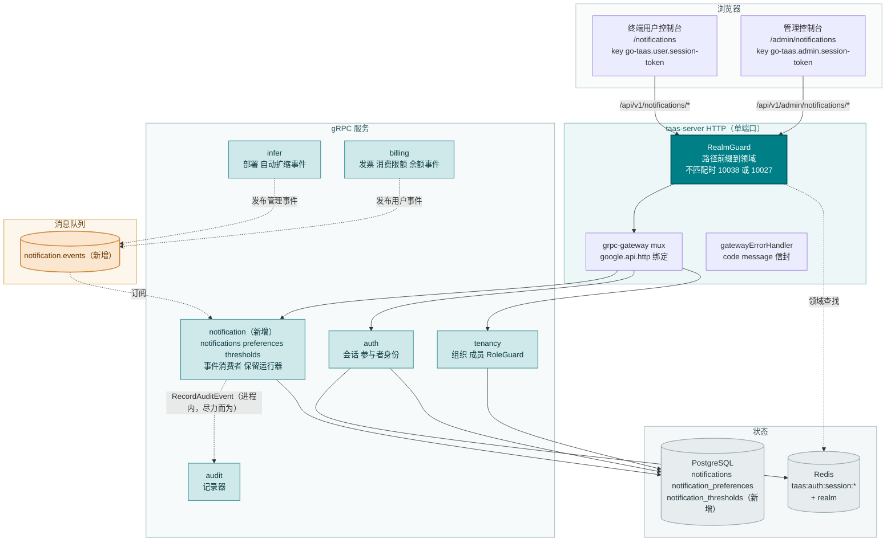
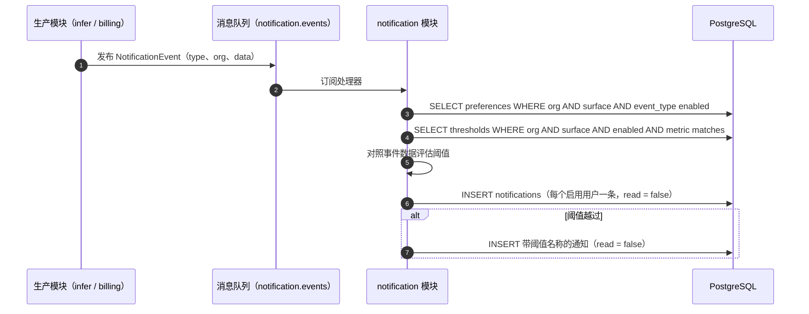
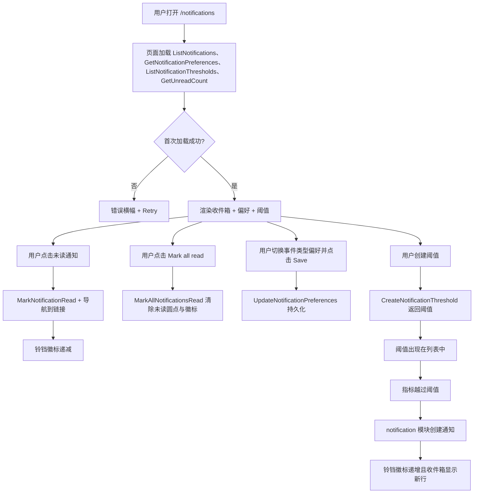
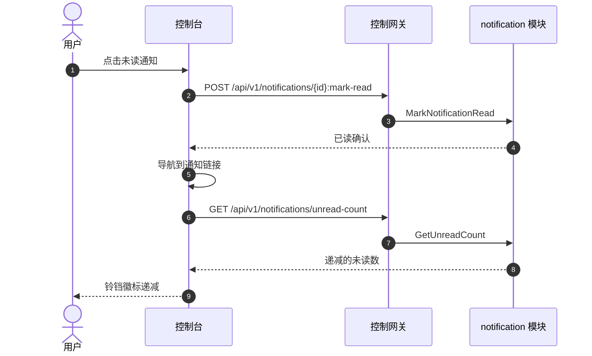

# 通知中心与阈值告警 — 架构与详细设计

| 属性 | 内容 |
| --- | --- |
| 特性点 | 通知中心与阈值告警 — 每用户通知偏好与面向余额不足、消费限额、部署与自动扩缩事件的控制台内通知中心，带已读/未读状态（backlog 第 26 行） |
| 文档范围 | 特性-26 的架构与详细设计：新增 `notification` 模块，拥有通知持久化、每用户偏好、阈值告警评估与已读/未读状态；`notifications`、`notification_preferences` 与 `notification_thresholds` 三张表；`taas.notification.v1.NotificationService` proto，带管理/用户双 HTTP 绑定；`notification.events` MQ 主题与生产模块发布点（复用特性-23 事件目录）；管理通知页（`/admin/notifications`）与终端用户通知页（`/notifications`）；以及错误处理、配置、安全、上线与逐层函数级设计 |
| 归属模块 | 新增 `notification` 模块（`services/notification`）：`notifications` + `notification_preferences` + `notification_thresholds` 三张表、CRUD/查询 RPC、事件订阅、阈值评估、通知创建扇出与保留运行器；`infer` 与 `billing`（向 `notification.events` 发布事件目录）；`audit`（通知变更被审计）；`pkg/mq`（新增 `NotificationEvents` 主题）；`pkg/server` 网关（管理前缀与用户前缀绑定）；控制台 Web 应用（管理 `AdminNotificationsPage`、终端用户 `UserNotificationsPage`） |
| 相关文档 | [需求分析与 UI/UX 设计](../design/notification-center.zh-cn.md) · [架构设计](../design/architecture.zh-cn.md) 第 1.2 节（消息队列）、第 2 节（模块职责）、第 3.1 节（管理/用户面分离）· [控制台面分离](./console-surface-separation.zh-cn.md)（本特性横跨的两个面、`UserShell`/`AdminShell` 约定、掩码投影规则）· [Webhook 通知与事件订阅](./webhook-notifications.zh-cn.md)（本特性在控制台内消费的事件目录，特性 #23）· [推理自动扩缩](./inference-autoscaling.zh-cn.md)（自动扩缩事件）· [余额与配额](./balance-quota.zh-cn.md)（余额不足与消费限额事件）· [支付、发票与自动充值](./payments-invoices-auto-recharge.zh-cn.md)（账单/发票事件）· [审计日志](./audit-logging.zh-cn.md)（通知变更必须产生的审计轨迹） |
| 状态 | 架构完成，已移交开发代理 |

---

## 1. 概述与目标

go-taas 是一个 Token-as-a-Service 平台：它部署推理服务（特性 #2）、自动扩缩（特性 #16）、计量与计费（特性 #4、#5、#8、#14），并执行消费限额（特性 #11）。特性 #23 新增了**出站 webhook**，使外部系统能被推送它所关心的事件。但运营者与租户自己仍然**没有控制台内的视图**来查看这些事件：余额不足、消费限额超限、部署失败或服务扩缩，都只能通过打开相关页面并轮询来发现。没有任何单一位置收集这些事件、标记用户已看过哪些、并让用户选择关心哪些事件类型。

本特性新增**带阈值告警的通知中心**：平台持久化特性 #23 出站投递的同一事件目录，在控制台内以带已读/未读状态的通知列表呈现，让每个用户选择哪些事件类型生成通知（每用户偏好），并让用户定义**阈值告警**（余额不足、消费限额、自动扩缩副本数、部署失败），当指标越过阈值时生成通知。这是 Phase 4 生产化路线图项中最小可独立交付的增量：它把「平台改变了状态」变成「用户在控制台看到它并能采取行动」。

**目标**：新增 `notification` 模块，拥有 `notifications`、`notification_preferences` 与 `notification_thresholds` 三张表及其生命周期；`taas.notification.v1.NotificationService`，含十二个 RPC，每个都双绑定到管理前缀 `/api/v1/admin/notifications/*` 与用户前缀 `/api/v1/notifications/*`；`notification.events` MQ 主题承载事件目录，`infer` 发布管理事件、`billing` 发布终端用户事件（复用特性-23 目录）；每用户偏好选择哪些事件类型生成通知；可配置阈值告警在指标越过阈值时生成通知；通知支持已读/未读、全部标记已读与删除；两个 shell 中带未读徽标的铃铛；90 天通知保留运行器；新增错误码 11001–11005；管理通知页（`/admin/notifications`）与终端用户通知页（`/notifications`）。

**非目标**（延后，设计 §8）：通知的邮件或短信投递（v1 仅控制台内；webhook 特性 #23 已覆盖出站投递）；通知摘要或定时；超出简单按事件通知的通知分组/去重；推送通知；跨面通知可见性（面拆分是强制的）；通知重放 API；对推理、计量或计费流水线的任何变更（事件目录的只读消费者）。

### 1.1 本文档阅读顺序

第 2 节记录架构决策（AD1–AD12，镜像设计的 D1–D10 加上架构师所做的两处细化）。第 3–5 节是组件视图、数据模型与 API 设计。第 6 节是前端架构（两个控制台的页面 → 路由 → API 前缀表、每面认证守卫）。第 7–8 节是时序流程与错误处理。第 9–11 节是配置、安全与上线。第 12–14 节是验收标准追溯、逐层函数级详细设计与有序实现任务清单。

---

## 2. 架构决策

| # | 决策 | 依据 |
| --- | --- | --- |
| AD1 | **新增 `notification` 模块**（`services/notification`），拥有 `notifications`、`notification_preferences` 与 `notification_thresholds` 三张表、CRUD/查询 RPC、事件订阅、阈值评估、通知创建扇出与保留运行器，带自己的错误块 **110xx** | 通知消费来自 `infer` 与 `billing` 的事件；专用模块把通知关注点从产生模块中分离出来并给它一个归属，镜像 `webhook` 拥有投递的方式（设计 D8） |
| AD2 | **通知错误块为 11001–11099，即计费报表 109xx 之后的下一个空闲块。** 计费报表模块拥有 10901–10907（特性 #25，e2e-passed）。设计「计费报表块（109xx）之后的全新块」的意图通过取 109xx 之后的下一个空闲块来实现 | 每个模块有自己的错误块（`pkg/errors/codes.go`）；计费报表取了 109xx，因此通知取 110xx。这是与现有架构最一致的解读（设计 D9，已确认） |
| AD3 | **通知是带已读/未读状态的持久化事件。** 通知携带 `notification_id`、`event_type`、`title`、`body`、`severity`（`info` / `warning` / `critical`）、`read`（布尔）、`created_at`、`data` 负载与可选的 `link` 深链。订阅事件发生时（或阈值越过时）创建通知，保留 90 天 | 通知是特性 #23 出站投递的同一事件的控制台内投影；已读/未读是通用收件箱模式。90 天保留与请求日志与 webhook 投递保留一致（设计 D2） |
| AD4 | **每用户偏好选择哪些事件类型生成通知。** 每个用户有一组偏好：对其面目录中的每个事件类型，一个 `enabled` 布尔（默认全部启用）。禁用的事件类型仍在平台发生，但不为该用户创建通知。偏好按用户而非按组织 | 每用户偏好让每个运营者或租户选择自己关心的内容，镜像特性 #23 的按事件类型启用。按用户（而非按组织）因为通知已读状态与相关性是个人化的（设计 D3） |
| AD5 | **阈值告警是可配置规则，当指标越过阈值时生成通知。** 阈值携带 `threshold_id`、`name`、`metric`、`operator`（`lt` / `gt`）、`value`、`enabled`、`created_at` 与 `updated_at`。**终端用户**指标为 `balance_low`（余额 < value 时通知）与 `spend_limit`（当前周期消费 > value 时通知）。**管理**指标为 `autoscaling_replicas`（服务副本数 > value 时通知）与 `deployment_failure`（任何部署失败时通知）。阈值越过创建带阈值名称的通知 | 可配置阈值是阿里云百炼高额消费预警模式。指标集映射到特性所述的事件类型：终端用户面的余额不足与消费限额，管理面的部署与自动扩缩（设计 D4） |
| AD6 | **带未读徽标的铃铛是入口。** 两个 shell（特性 #17）都在头部显示带未读计数徽标的铃铛图标；点击打开通知中心。徽标显示未读通知数，并在通知被读取或新通知到达时更新 | 铃铛 + 徽标是标准通知入口，给用户一个持久、始终可见的方式查看什么是新的，避免深埋在计费中的陷阱（设计 D5） |
| AD7 | **通知支持已读/未读、全部标记已读与删除。** 用户可标记单条通知已读、全部标记已读、删除通知。已读状态按用户、按通知 | 已读/未读加全部标记已读与删除是通知中心所需的最小收件箱操作；它们保持列表可管理（设计 D6） |
| AD8 | **通知深链到用户可采取行动的页面。** 每条通知携带可选的 `link`（如 `billing.balance_low` 的余额页、`billing.spend_limit_breached` 的消费限额页、`deployment.status_changed` 的部署详情、`autoscaling.scaled` 的自动扩缩页）。点击通知导航到该页面并标记已读 | 深链把通知从「发生了某事」变成「这是你行动之处」，这正是控制台内通知中心的意义（设计 D7） |
| AD9 | **事件目录经单一新 MQ 主题 `notification.events` 流动，复用特性-23 事件目录。** 生产模块（`infer` 发布管理事件、`billing` 发布终端用户事件）发布规范 `NotificationEvent` 信封；`notification` 模块订阅，并为每个事件为面上每个偏好启用该事件类型的用户创建通知。阈值评估在同一事件流上运行 | 单部署拓扑（架构第 1.2 节）意味着模块共享一个 broker；单一主题、事件类型在信封中，保持订阅面小、路由逻辑集中。复用特性-23 目录使两个消费者保持一致，并遵循特性 #17 的掩码投影规则（设计 D1、D8，已细化） |
| AD10 | **通知创建经事件消费者异步进行**（`server.Runner`）。事件匹配用户的启用偏好时，模块为该用户插入通知行。阈值评估在同一消费者中运行：指标越过阈值时，模块插入带阈值名称的通知 | 消费者把通知创建与 RPC 路径及生产模块解耦，慢扇出永不阻塞网关或事件生产者；扇出与阈值逻辑集中在一处（设计 D8，已细化） |
| AD11 | **通知面由请求路径推导，与 webhook 面完全一致。** 管理前缀请求（`/api/v1/admin/notifications/*`）是管理面通知；用户前缀请求（`/api/v1/notifications/*`）是用户面通知。面约束偏好中哪些事件类型有效、阈值中哪些指标有效。面绝不是请求字段 | 面是绑定的属性，与会话领域完全一致（特性 #17）。从路径推导使目录拆分结构化且不可伪造（设计 D1、FR5.4） |
| AD12 | **通知变更被审计**（特性 #15）：偏好变更与阈值创建/更新/删除各写一条审计事件。读取与删除通知不审计（它们是高频、低风险的用户操作） | 阈值与偏好是影响用户被告知内容的配置；审计轨迹必须记录谁改了什么。读取/删除是个人收件箱操作，无跨用户影响（设计 D10） |

---

## 3. 组件视图

### 3.1 归属

| 层 / 组件 | 拥有 | 本特性的变更 |
| --- | --- | --- |
| **控制网关（`grpc-gateway`）** | 通知 RPC 的 HTTP/JSON 门面；领域守卫（特性 #17）已用 10038 拒绝错误领域的会话；透传 `X-Organization-Id` 为 gRPC 元数据 | 12 个 HTTP 通知 RPC 的新绑定（第 5 节）；领域守卫不变 |
| **`notification` 模块（`services/notification`）** | `notifications` + `notification_preferences` + `notification_thresholds` 三张表、CRUD/查询 RPC、事件订阅、阈值评估、通知创建扇出、保留运行器 | **新模块**（AD1） |
| **`infer` 模块** | 管理事件目录（`deployment.status_changed`、`autoscaling.scaled`、`autoscaling.scale_to_zero`） | 在状态变更与自动扩缩点向 `notification.events` 发布这些事件（AD9） |
| **`billing` 模块** | 终端用户事件目录（`billing.invoice_created`、`billing.invoice_paid`、`billing.spend_limit_breached`、`billing.balance_low`） | 在发票、消费限额与余额点向 `notification.events` 发布这些事件（AD9） |
| **`audit` 模块** | 审计记录器 | 只读：通知模块在每次变更后调用 `RecordAuditEvent`（AD12） |
| **`auth` 模块** | 参与者身份、会话领域、会话活动组织、会话用户 id | 只读：通知模块从会话解析组织与用户；`SessionActiveOrg` 为带会话调用提供组织；`SessionUserID` 为每用户偏好与已读状态提供调用者用户 id |
| **`tenancy` 模块** | 组织、成员、角色、RoleGuard | 只读：`RoleGuard` 按调用者在已解析组织上下文中的角色门控管理通知 RPC（10036） |
| **PostgreSQL** | `notifications` + `notification_preferences` + `notification_thresholds` 三张表（新增）；其他表不变 | 经 AutoMigrate 新增三张表（第 4 节） |
| **控制台** | 管理通知页与终端用户通知页 | 两个面上的两个新页面（第 6 节） |

### 3.2 运行时组件视图



### 3.3 请求身份链

通知 RPC 复用已确立的身份链（console-surface-separation §3.3）：

1. `RealmGuard`（HTTP，`pkg/server/realm.go`）— 路径前缀决定期望领域。`/api/v1/admin/notifications/*` 期望 `admin`；`/api/v1/notifications/*` 期望 `user`。无 `Authorization` 头：透传（过渡，特性 #17 AD4）。有头：从 Redis 解析会话领域；不匹配 → 10038，未知/过期/无领域 → 10027。
2. grpc-gateway mux — 按注解路径路由并转发 `authorization` 与 `x-organization-id`。
3. 服务处理器 — 对带会话调用，`SessionActiveOrg` 使会话活动组织权威并忽略 `X-Organization-Id`；`SessionUserID` 为每用户偏好与已读状态提供调用者用户 id。无会话时，`resolveOrganizationID` 读取过渡头，缺失或为空时返回 10001。
4. `tenancy.RoleGuard` — 按调用者在已解析组织上下文中的角色门控管理通知 RPC（10036）。终端用户通知 RPC 硬限定到调用者组织，无需角色检查。

### 3.4 事件目录及其面拆分

目录按面拆分（设计 D1、特性 #17 掩码投影规则），与特性 #23 的目录完全一致：

| 面 | 事件类型 | 生产模块 | 通知 `surface` |
| --- | --- | --- | --- |
| 管理 | `deployment.status_changed`、`autoscaling.scaled`、`autoscaling.scale_to_zero` | `infer` | `admin` |
| 终端用户 | `billing.invoice_created`、`billing.invoice_paid`、`billing.spend_limit_breached`、`billing.balance_low` | `billing` | `user` |

通知的 `surface` 由请求路径推导（管理前缀 → `admin`，用户前缀 → `user`），并约束偏好中哪些事件类型有效、阈值中哪些指标有效（AD11）。面目录之外的事件类型返回 11005；面指标集之外的指标返回 11004。面绝不是请求字段 — 它是绑定的属性，与会话领域完全一致。

---

## 4. 数据模型

### 4.1 `notifications` 表

| 列 | PostgreSQL 类型 | 约束 | 描述 |
| --- | --- | --- | --- |
| `notification_id` | `uuid` | PRIMARY KEY | 服务端生成的 UUID v4，暴露为 `notification_id` |
| `organization_id` | `varchar(64)` | NOT NULL，索引（复合） | 所属组织 |
| `user_id` | `varchar(64)` | NOT NULL，索引（复合） | 所属用户（每用户已读状态） |
| `surface` | `varchar(16)` | NOT NULL | `admin` / `user` — 该通知所属面目录（第 3.4 节） |
| `event_type` | `varchar(64)` | NOT NULL，索引 | 产生该通知的事件类型 |
| `title` | `varchar(256)` | NOT NULL | 显示标题（≤ 256 字符） |
| `body` | `varchar(1024)` | NOT NULL | 显示正文（≤ 1024 字符） |
| `severity` | `varchar(16)` | NOT NULL | `info` / `warning` / `critical`（封闭枚举） |
| `read` | `boolean` | NOT NULL DEFAULT false | 已读/未读状态（每用户、每通知） |
| `data` | `jsonb` | NOT NULL | 事件负载（或阈值的指标/值） |
| `link` | `varchar(2048)` | NULL | 可选深链，指向用户可采取行动的页面（AD8） |
| `created_at` | `timestamptz` | NOT NULL，索引（复合） | 创建时间（UTC） |

设计说明：

- 复合索引 `idx_notifications_user_created (user_id, created_at)` 用于每用户收件箱列表；`event_type` 与 `read` 建立索引用于过滤（FR1.1）。
- 无指向 `organizations` / `users` 的外键：通知必须比已删除的组织或用户存活更久，使收件箱保持可调试（镜像审计事件与 webhook 投递的推理）。
- `data` 以 JSON 保存事件负载（与特性 #23 出站投递的负载相同），或对阈值通知保存越过的指标/值。
- 通知保留运行器是 `notifications` 的唯一删除者（90 天保留，AD3）。

### 4.2 `notification_preferences` 表

| 列 | PostgreSQL 类型 | 约束 | 描述 |
| --- | --- | --- | --- |
| `user_id` | `varchar(64)` | PRIMARY KEY | 所属用户（每用户一行） |
| `organization_id` | `varchar(64)` | NOT NULL | 所属组织 |
| `surface` | `varchar(16)` | NOT NULL | `admin` / `user` — 该偏好集覆盖的面目录 |
| `enabled_event_types` | `jsonb` | NOT NULL | 启用事件类型字符串数组（面目录的子集；默认全部启用） |
| `created_at` | `timestamptz` | NOT NULL | 创建时间（UTC） |
| `updated_at` | `timestamptz` | NOT NULL | 最后更新时间（UTC） |

设计说明：

- 每用户每面一行。`enabled_event_types` JSON 数组保存启用子集；完整目录是模块常量（第 3.4 节），因此偏好集是已知目录的启用子集。
- 无行的用户默认全部事件类型启用（AD4）。`GetNotificationPreferences` 从行物化完整目录及每个事件类型的启用状态（无行时全部启用）。
- `UpdateNotificationPreferences` 更新插入该行；面目录之外的事件类型返回 11005，格式错误的集合返回 11002。

### 4.3 `notification_thresholds` 表

| 列 | PostgreSQL 类型 | 约束 | 描述 |
| --- | --- | --- | --- |
| `threshold_id` | `uuid` | PRIMARY KEY | 服务端生成的 UUID v4，暴露为 `threshold_id` |
| `organization_id` | `varchar(64)` | NOT NULL，索引（复合） | 所属组织 |
| `user_id` | `varchar(64)` | NOT NULL，索引（复合） | 所属用户（每用户阈值） |
| `surface` | `varchar(16)` | NOT NULL | `admin` / `user` — 该阈值使用的面指标集 |
| `name` | `varchar(64)` | NOT NULL | 显示名称（≤ 64 字符） |
| `metric` | `varchar(32)` | NOT NULL | `balance_low` / `spend_limit`（用户）或 `autoscaling_replicas` / `deployment_failure`（管理） |
| `operator` | `varchar(4)` | NOT NULL | `lt` / `gt`（封闭枚举） |
| `value` | `double precision` | NOT NULL | 阈值 |
| `enabled` | `boolean` | NOT NULL DEFAULT true | 阈值是否激活 |
| `created_at` | `timestamptz` | NOT NULL，索引（复合） | 创建时间（UTC） |
| `updated_at` | `timestamptz` | NOT NULL | 最后更新时间（UTC） |

设计说明：

- 复合索引 `idx_notification_thresholds_user_created (user_id, created_at)` 用于每用户阈值列表；`enabled` 建立索引用于过滤（FR3.2）。
- `metric` 约束到面的指标集（AD5）：用户面为 `balance_low` / `spend_limit`，管理面为 `autoscaling_replicas` / `deployment_failure`。无效指标/操作符/值返回 11004。
- `operator` 是封闭枚举（`lt` / `gt`）；`value` 是正数。

### 4.4 迁移说明

- 三张表均由 GORM `AutoMigrate` 在 `taas-server` 启动时创建（增量；无数据迁移）。`Migrate`/`MigrateSchemaForFVT` 增加 `Notification`、`NotificationPreference` 与 `NotificationThreshold` 模型。
- 无需 init-SQL 升级路径：三张表在上线时都是新的且为空；事件消费者与生产模块发布者一旦事件流动即开始填充。
- 通知保留运行器是 `notifications` 的唯一删除者；它绝不触碰请求日志、凭证、用量记录、计费记录、审计事件或 webhook 投递。

---

## 5. API 设计

所有通知 RPC 属于新的 **`taas.notification.v1.NotificationService`**（`proto/taas/notification/v1/notification.proto`），经控制网关以 HTTP 提供。每个 RPC 都双绑定：管理绑定在 `/api/v1/admin/notifications/*` 下，用户绑定在 `/api/v1/notifications/*` 下。面由请求路径推导（第 3.3 节）。

| RPC | HTTP（管理） | HTTP（用户） | 状态 | 用途 |
| --- | --- | --- | --- | --- |
| `ListNotifications` | `GET /api/v1/admin/notifications` | `GET /api/v1/notifications` | **新增** | 带已读/事件过滤、分页的列表 |
| `GetNotification` | `GET /api/v1/admin/notifications/{notification_id}` | `GET /api/v1/notifications/{notification_id}` | **新增** | 带完整数据的单条通知；缺失 → 11001 |
| `MarkNotificationRead` | `POST /api/v1/admin/notifications/{notification_id}:mark-read` | `POST /api/v1/notifications/{notification_id}:mark-read` | **新增** | 标记单条已读；缺失 → 11001 |
| `MarkAllNotificationsRead` | `POST /api/v1/admin/notifications:mark-all-read` | `POST /api/v1/notifications:mark-all-read` | **新增** | 全部标记已读 |
| `DeleteNotification` | `DELETE /api/v1/admin/notifications/{notification_id}` | `DELETE /api/v1/notifications/{notification_id}` | **新增** | 删除单条；缺失 → 11001 |
| `GetUnreadCount` | `GET /api/v1/admin/notifications/unread-count` | `GET /api/v1/notifications/unread-count` | **新增** | 铃铛徽标的未读数 |
| `GetNotificationPreferences` | `GET /api/v1/admin/notifications/preferences` | `GET /api/v1/notifications/preferences` | **新增** | 每用户事件类型偏好 |
| `UpdateNotificationPreferences` | `PUT /api/v1/admin/notifications/preferences` | `PUT /api/v1/notifications/preferences` | **新增** | 更新偏好；坏事件 → 11005，坏集 → 11002 |
| `CreateNotificationThreshold` | `POST /api/v1/admin/notifications/thresholds` | `POST /api/v1/notifications/thresholds` | **新增** | 创建阈值；无效 → 11004 |
| `ListNotificationThresholds` | `GET /api/v1/admin/notifications/thresholds` | `GET /api/v1/notifications/thresholds` | **新增** | 列出阈值，enabled 过滤 |
| `UpdateNotificationThreshold` | `PUT /api/v1/admin/notifications/thresholds/{threshold_id}` | `PUT /api/v1/notifications/thresholds/{threshold_id}` | **新增** | 更新阈值；缺失 → 11003，无效 → 11004 |
| `DeleteNotificationThreshold` | `DELETE /api/v1/admin/notifications/thresholds/{threshold_id}` | `DELETE /api/v1/notifications/thresholds/{threshold_id}` | **新增** | 删除阈值；缺失 → 11003 |

### 5.1 Proto 契约

```protobuf
syntax = "proto3";

package taas.notification.v1;

import "google/api/annotations.proto";
import "taas/common/v1/common.proto";

option go_package = "github.com/go-taas/go-taas/proto/taas/notification/v1;notificationv1";

// NotificationService 管理控制台内通知中心：带已读/未读状态的通知列表、
// 每用户事件类型偏好与可配置阈值告警。每个 RPC 都双绑定：管理绑定在
// /api/v1/admin/notifications/* 下，用户绑定在 /api/v1/notifications/* 下。
// 面由请求路径推导（console-surface-separation §3.3）。
service NotificationService {
  // ListNotifications 返回面的通知，最新在前，可按已读状态与事件类型过滤，分页。
  rpc ListNotifications(ListNotificationsRequest) returns (ListNotificationsResponse) {
    option (google.api.http) = {
      get: "/api/v1/admin/notifications"
      additional_bindings: {get: "/api/v1/notifications"}
    };
  }

  // GetNotification 返回带完整 data 负载的单条通知。
  rpc GetNotification(GetNotificationRequest) returns (GetNotificationResponse) {
    option (google.api.http) = {
      get: "/api/v1/admin/notifications/{notification_id}"
      additional_bindings: {get: "/api/v1/notifications/{notification_id}"}
    };
  }

  // MarkNotificationRead 标记单条通知已读。
  rpc MarkNotificationRead(MarkNotificationReadRequest) returns (MarkNotificationReadResponse) {
    option (google.api.http) = {
      post: "/api/v1/admin/notifications/{notification_id}:mark-read"
      additional_bindings: {post: "/api/v1/notifications/{notification_id}:mark-read"}
    };
  }

  // MarkAllNotificationsRead 标记调用者的所有通知已读。
  rpc MarkAllNotificationsRead(MarkAllNotificationsReadRequest) returns (MarkAllNotificationsReadResponse) {
    option (google.api.http) = {
      post: "/api/v1/admin/notifications:mark-all-read"
      additional_bindings: {post: "/api/v1/notifications:mark-all-read"}
    };
  }

  // DeleteNotification 删除单条通知。
  rpc DeleteNotification(DeleteNotificationRequest) returns (DeleteNotificationResponse) {
    option (google.api.http) = {
      delete: "/api/v1/admin/notifications/{notification_id}"
      additional_bindings: {delete: "/api/v1/notifications/{notification_id}"}
    };
  }

  // GetUnreadCount 返回调用者的未读数，用于铃铛徽标。
  rpc GetUnreadCount(GetUnreadCountRequest) returns (GetUnreadCountResponse) {
    option (google.api.http) = {
      get: "/api/v1/admin/notifications/unread-count"
      additional_bindings: {get: "/api/v1/notifications/unread-count"}
    };
  }

  // GetNotificationPreferences 返回调用者的偏好：对其面目录中的每个事件类型，
  // 一个 enabled 布尔（默认全部启用）。
  rpc GetNotificationPreferences(GetNotificationPreferencesRequest) returns (GetNotificationPreferencesResponse) {
    option (google.api.http) = {
      get: "/api/v1/admin/notifications/preferences"
      additional_bindings: {get: "/api/v1/notifications/preferences"}
    };
  }

  // UpdateNotificationPreferences 更新调用者的偏好。
  rpc UpdateNotificationPreferences(UpdateNotificationPreferencesRequest) returns (UpdateNotificationPreferencesResponse) {
    option (google.api.http) = {
      put: "/api/v1/admin/notifications/preferences"
      body: "*"
      additional_bindings: {
        put: "/api/v1/notifications/preferences"
        body: "*"
      }
    };
  }

  // CreateNotificationThreshold 从 name、metric、operator 与 value 创建阈值。
  rpc CreateNotificationThreshold(CreateNotificationThresholdRequest) returns (CreateNotificationThresholdResponse) {
    option (google.api.http) = {
      post: "/api/v1/admin/notifications/thresholds"
      body: "*"
      additional_bindings: {
        post: "/api/v1/notifications/thresholds"
        body: "*"
      }
    };
  }

  // ListNotificationThresholds 返回调用者的阈值，可按 enabled 状态过滤。
  rpc ListNotificationThresholds(ListNotificationThresholdsRequest) returns (ListNotificationThresholdsResponse) {
    option (google.api.http) = {
      get: "/api/v1/admin/notifications/thresholds"
      additional_bindings: {get: "/api/v1/notifications/thresholds"}
    };
  }

  // UpdateNotificationThreshold 更新阈值的 name、operator、value 或 enabled 状态。
  rpc UpdateNotificationThreshold(UpdateNotificationThresholdRequest) returns (UpdateNotificationThresholdResponse) {
    option (google.api.http) = {
      put: "/api/v1/admin/notifications/thresholds/{threshold_id}"
      body: "*"
      additional_bindings: {
        put: "/api/v1/notifications/thresholds/{threshold_id}"
        body: "*"
      }
    };
  }

  // DeleteNotificationThreshold 删除阈值。
  rpc DeleteNotificationThreshold(DeleteNotificationThresholdRequest) returns (DeleteNotificationThresholdResponse) {
    option (google.api.http) = {
      delete: "/api/v1/admin/notifications/thresholds/{threshold_id}"
      additional_bindings: {delete: "/api/v1/notifications/thresholds/{threshold_id}"}
    };
  }
}

enum NotificationSeverity {
  NOTIFICATION_SEVERITY_UNSPECIFIED = 0;
  NOTIFICATION_SEVERITY_INFO = 1;
  NOTIFICATION_SEVERITY_WARNING = 2;
  NOTIFICATION_SEVERITY_CRITICAL = 3;
}

enum ThresholdOperator {
  THRESHOLD_OPERATOR_UNSPECIFIED = 0;
  THRESHOLD_OPERATOR_LT = 1;
  THRESHOLD_OPERATOR_GT = 2;
}

message Notification {
  string notification_id = 1;
  string organization_id = 2;
  string user_id = 3;
  string surface = 4;             // "admin" / "user"
  string event_type = 5;
  string title = 6;
  string body = 7;
  NotificationSeverity severity = 8;
  bool read = 9;
  string data = 10;               // JSON 事件负载或阈值指标/值
  string link = 11;               // 可选深链
  int64 created_at = 12;          // unix 秒
}

message NotificationPreference {
  string event_type = 1;
  bool enabled = 2;
}

message NotificationThreshold {
  string threshold_id = 1;
  string organization_id = 2;
  string user_id = 3;
  string surface = 4;             // "admin" / "user"
  string name = 5;
  string metric = 6;
  ThresholdOperator operator = 7;
  double value = 8;
  bool enabled = 9;
  int64 created_at = 10;          // unix 秒
  int64 updated_at = 11;          // unix 秒
}

message ListNotificationsRequest {
  taas.common.v1.PageRequest page = 1;
  bool read_filter = 2;           // 设置以按已读状态过滤
  bool read = 3;                  // 要过滤的已读状态
  string event_type = 4;          // 过滤；空 = 全部
}

message ListNotificationsResponse {
  taas.common.v1.Response response = 1;
  repeated Notification notifications = 2;
  taas.common.v1.PageMeta page_meta = 3;
}

message GetNotificationRequest { string notification_id = 1; }

message GetNotificationResponse {
  taas.common.v1.Response response = 1;
  Notification notification = 2;
}

message MarkNotificationReadRequest { string notification_id = 1; }

message MarkNotificationReadResponse {
  taas.common.v1.Response response = 1;
  Notification notification = 2;
}

message MarkAllNotificationsReadRequest {}

message MarkAllNotificationsReadResponse {
  taas.common.v1.Response response = 1;
  int64 marked_count = 2;
}

message DeleteNotificationRequest { string notification_id = 1; }

message DeleteNotificationResponse {
  taas.common.v1.Response response = 1;
}

message GetUnreadCountRequest {}

message GetUnreadCountResponse {
  taas.common.v1.Response response = 1;
  int64 unread_count = 2;
}

message GetNotificationPreferencesRequest {}

message GetNotificationPreferencesResponse {
  taas.common.v1.Response response = 1;
  repeated NotificationPreference preferences = 2;
}

message UpdateNotificationPreferencesRequest {
  repeated NotificationPreference preferences = 1;
}

message UpdateNotificationPreferencesResponse {
  taas.common.v1.Response response = 1;
  repeated NotificationPreference preferences = 2;
}

message CreateNotificationThresholdRequest {
  string name = 1;
  string metric = 2;
  ThresholdOperator operator = 3;
  double value = 4;
  bool enabled = 5;               // 默认 true
}

message CreateNotificationThresholdResponse {
  taas.common.v1.Response response = 1;
  NotificationThreshold threshold = 2;
}

message ListNotificationThresholdsRequest {
  taas.common.v1.PageRequest page = 1;
  bool enabled_filter = 2;        // 设置以按 enabled 状态过滤
  bool enabled = 3;               // 要过滤的 enabled 状态
}

message ListNotificationThresholdsResponse {
  taas.common.v1.Response response = 1;
  repeated NotificationThreshold thresholds = 2;
  taas.common.v1.PageMeta page_meta = 3;
}

message UpdateNotificationThresholdRequest {
  string threshold_id = 1;
  string name = 2;
  ThresholdOperator operator = 3;
  double value = 4;
  bool enabled = 5;
}

message UpdateNotificationThresholdResponse {
  taas.common.v1.Response response = 1;
  NotificationThreshold threshold = 2;
}

message DeleteNotificationThresholdRequest { string threshold_id = 1; }

message DeleteNotificationThresholdResponse {
  taas.common.v1.Response response = 1;
}
```

### 5.2 契约约束

1. **面分离**：每个 RPC 都双绑定 — 管理绑定在 `/api/v1/admin/notifications/*` 下，用户绑定在 `/api/v1/notifications/*` 下。管理绑定需要管理会话；用户绑定需要用户会话。领域守卫在任何处理器运行前用 10038 拒绝错误领域的会话（特性 #17）。通知/偏好/阈值的 `surface` 由请求路径推导，绝不是请求字段（AD11）。
2. **线上格式约定不变**：点分页（`?page.offset=0&page.limit=20`），成功 HTTP 200，业务错误为 `{"code": <int>, "message": "..."}`，int64 字段为 JSON 字符串。
3. **`ListNotifications`**：返回面的通知，最新在前，可按 `read` 状态与 `event_type`（面目录值，否则 11005）过滤，分页。每行携带 `notification_id`、`event_type`、`title`、`body`、`severity`、`read`、`created_at` 与 `link`。`GetUnreadCount` 返回调用者的未读数。
4. **`GetNotification` / `MarkNotificationRead` / `DeleteNotification`**：未知 `notification_id` 返回 11001。`MarkAllNotificationsRead` 标记调用者的所有通知已读并返回标记数量。
5. **偏好**：`GetNotificationPreferences` 返回完整面目录及每个事件类型的 `enabled` 状态（默认全部启用）。`UpdateNotificationPreferences` 校验每个键都在面目录中（否则 11005）且集合格式正确（否则 11002）。
6. **阈值**：`CreateNotificationThreshold` 校验 `name`（非空，≤ 64 字符）、`metric`（在面指标集中，否则 11004）、`operator`（`lt` / `gt`，否则 11004）与 `value`（正数，否则 11004）。`UpdateNotificationThreshold` 与 `DeleteNotificationThreshold` 对未知 `threshold_id` 返回 11003；无效值返回 11004。
7. **通知创建（FR4.2）**：订阅事件发生时，`notification` 模块为面上每个偏好启用该事件类型的用户创建通知。通知携带事件的 `data` 负载与 `link` 深链。阈值评估在同一事件流上运行（FR3.5）。
8. **通知变更被审计**（AD12、特性 #15）：偏好变更与阈值创建/更新/删除各写一条审计事件。读取与删除通知不审计。

### 5.3 错误码

所有错误都是统一信封中的 `pkg/errors` 业务码。通知块 **11001–11005** 分配五个新码（AD2）；其余已存在。

| 条件 | 码 | 常量 | 说明 |
| --- | --- | --- | --- |
| `GetNotification`/`MarkNotificationRead`/`DeleteNotification` 上未知 `notification_id` | 11001 | `CodeNotificationNotFound` | **新增**（AD2） |
| `UpdateNotificationPreferences` 上格式错误的偏好集 | 11002 | `CodeNotificationPreferencesInvalid` | **新增** |
| `UpdateNotificationThreshold`/`DeleteNotificationThreshold` 上未知 `threshold_id` | 11003 | `CodeNotificationThresholdNotFound` | **新增** |
| `CreateNotificationThreshold`/`UpdateNotificationThreshold` 上无效阈值（指标/操作符/值） | 11004 | `CodeNotificationThresholdInvalid` | **新增** |
| `ListNotifications`/`UpdateNotificationPreferences` 上面目录之外的事件类型 | 11005 | `CodeNotificationEventTypeInvalid` | **新增** |
| 调用者角色低于所需角色（管理组织作用域） | 10036 | `CodeForbidden` | 现有（特性 #10） |
| 缺失/过期/撤销的会话 | 10027 | `CodeSessionInvalid` | 现有（特性 #7） |
| 在另一个前缀上的错误领域会话 | 10038 | `CodeRealmMismatch` | 现有（特性 #17） |
| 管理 API 上缺失 `X-Organization-Id`（过渡） | 10001 | `CodeUnauthorized` | `resolveOrganizationID` 模式 |
| 数据库 / MQ 基础设施故障 | 500 | `CodeInternal` | 经错误归一化 |

---

## 6. 前端架构

### 6.1 页面 → 路由 → API 前缀表

| 页面 / 组件 | 面 | Web 路由 | API 前缀 | 认证守卫 |
| --- | --- | --- | --- | --- |
| **通知页** | 管理 | `/admin/notifications` | `/api/v1/admin/notifications` | 管理会话；RoleGuard 组织作用域 |
| **Inbox 标签页** | 管理 | （在通知页上） | `/api/v1/admin/notifications` | 管理会话 |
| **Preferences 标签页** | 管理 | （在通知页上） | `/api/v1/admin/notifications/preferences` | 管理会话 |
| **Thresholds 标签页** | 管理 | （在通知页上） | `/api/v1/admin/notifications/thresholds` | 管理会话 |
| **通知页** | 终端用户 | `/notifications` | `/api/v1/notifications` | 用户会话；硬限定到调用者组织 |
| **Inbox 标签页** | 终端用户 | （在通知页上） | `/api/v1/notifications` | 用户会话 |
| **Preferences 标签页** | 终端用户 | （在通知页上） | `/api/v1/notifications/preferences` | 用户会话 |
| **Thresholds 标签页** | 终端用户 | （在通知页上） | `/api/v1/notifications/thresholds` | 用户会话 |

> 管理通知页只调用 `/api/v1/admin/notifications/*`；终端用户通知页只调用 `/api/v1/notifications/*`。两个面绝不共享会话令牌（特性 #17）。

### 6.2 导航位置

- **管理控制台**：管理导航中新增 **Notifications** 项（`/admin/notifications`，testid `nav-notifications`），位于操作组，与 Inference Services、Autoscaling 和 Webhooks 并列。`AdminShell` 头部显示带未读徽标的铃铛（testid `admin-bell-badge`）。
- **终端用户控制台**：用户导航中新增 **Notifications** 项（`/notifications`，testid `user-nav-notifications`），与 Billing 和 Activity 并列。`UserShell` 头部显示带未读徽标的铃铛（testid `user-bell-badge`）。

### 6.3 复用共享组件与状态

- **API 客户端**（`web/src/api.ts`）：领域作用域客户端（`createApi(realm)`）已发送 `Authorization: Bearer <realm>.session-token` 与 `X-Organization-Id`（仅当领域令牌键为空时）。通知页原样复用；不新增客户端。
- **状态徽标**：`info`/`warning`/`critical` 严重度徽标样式与 webhook 和请求日志状态徽标共享。
- **空状态 / 数据新鲜度说明**：复用请求日志页模式（说明通知在摄取窗口内出现，可见时 60 秒轮询）用于收件箱。
- **过滤栏**：状态/事件类型过滤控件与请求日志和 Webhooks 页共享。
- **铃铛 + 徽标**：小型共享 `NotificationBell` 组件（铃铛图标 + 未读计数徽标）渲染在两个 shell 头部；可见时轮询 `GetUnreadCount`，并在读取/全部标记已读时更新。

### 6.4 每面认证守卫

- **管理通知页**（`/admin/notifications`）：在 `AdminShell` 内渲染，当 `go-taas.admin.session-token` 非空时运行管理会话守卫；缺失/过期会话重定向到 `/admin/login?reason=expired`；错误领域会话被网关以 10038 拒绝。页面 API 调用指向 `/api/v1/admin/notifications/*`。
- **终端用户通知页**（`/notifications`）：在 `UserShell` 内渲染，当 `go-taas.user.session-token` 非空时运行用户会话守卫；缺失/过期会话重定向到 `/login?reason=expired`。页面 API 调用指向 `/api/v1/notifications/*`。
- **未认证访客**：任一页面的未认证访客被 shell 守卫重定向到正确的登录页（`/admin/login` vs `/login`）（AC13/AC14）。

### 6.5 控制台契约（为开发代理固定）

**通知页**（`/admin/notifications`）：页面头部（「Notifications」，副标题「Platform orchestration events and alerts」）带 **Mark all read** 主操作（`notifications-mark-all-read`）与 **Refresh** 次操作（`notifications-refresh`）。头部下方三个标签页：**Inbox**（`notifications-tab-inbox`）、**Preferences**（`notifications-tab-preferences`）、**Thresholds**（`notifications-tab-thresholds`）。

**Inbox 标签页**：通知列表，最新在前，每行显示严重度徽标、标题、正文、事件类型芯片、创建相对时间，未读行带未读圆点。行操作：**Mark read**（未读行，`notification-mark-read-{id}`）、**Delete**（`notification-delete-{id}`）。列表上方 **Mark all read** 操作。过滤器：**Status**（all/unread/read，`notification-filter-status`）与 **Event type**（面目录下拉，`notification-filter-event`）。分页（点分页）。空状态：「No notifications yet.」带事件将出现在此的提示。错误状态：错误横幅带 Retry 按钮与「Showing stale data」横幅。Testids：`notification-table`、`notification-row-{id}`、`notification-mark-all-read`、`notification-refresh`。

**Preferences 标签页**：面的事件类型列表，每个带一行描述与 **enabled** 开关（默认开，`preference-toggle-{event_type}`）。**Save** 操作（`preferences-save`）通过 `UpdateNotificationPreferences` 持久化。三个管理事件类型始终渲染（永不为空）。

**Thresholds 标签页**：阈值表格，列 Name、Metric、Condition（操作符 + 值）、Status（徽标：enabled 绿 / disabled 灰）、Updated、Actions。行操作：**Edit**（`threshold-edit-{id}`）、**Enable/Disable**（`threshold-toggle-{id}`）、**Delete**（`threshold-delete-{id}`）。表格上方 **New threshold** 操作（`threshold-new`）。新建/编辑阈值对话框字段 Name、Metric（下拉：管理为 Autoscaling replicas / Deployment failure，用户为 Balance low / Spend limit）、Operator（单选：greater than / less than）、Value（数字）、Enabled（开关，默认开）、Cancel / Save。空状态：「No thresholds yet.」带 **New threshold** 操作。Testids：`threshold-table`、`threshold-row-{id}`、`threshold-dialog-name`、`threshold-dialog-metric`、`threshold-dialog-operator`、`threshold-dialog-value`、`threshold-dialog-submit`。

**终端用户通知页**（`/notifications`）：在 `UserShell` 内相同结构，偏好标签页为四个终端用户事件类型，阈值对话框为 Balance low / Spend limit 指标。收件箱限定到租户自己的通知；页面不暴露其他租户数据。

---

## 7. 时序流程

### 7.1 通知创建（事件驱动）



### 7.2 通知中心页面流程（终端用户）



### 7.3 标记已读与深链



---

## 8. 错误处理

所有错误都是统一信封中的 `pkg/errors` 业务码（第 5.3 节）。消费者侧失败不是 RPC 错误：通知创建扇出失败被记录并在下一个事件重试；保留删除失败被记录并在下一个 tick 重试（凭证保留模式）。生产模块向 `notification.events` 的发布失败被记录且绝不使生产变更失败（审计尽力而为模式）。

控制台按正文 `code` 分支（`web/src/api.ts` 已如此），绝不按 HTTP 状态。每个新码渲染特定内联消息：11001「notification not found」、11002「invalid notification preferences」、11003「threshold not found」、11004「invalid threshold」、11005「invalid event type」。

---

## 9. 配置新增

| 键 | 默认 | 描述 |
| --- | --- | --- |
| `notification.consumer.workers` | `4` | 通知事件消费者中的并发事件处理 worker 数 |
| `notification.retention.enabled` | `true` | 打开或关闭通知保留运行器（事故排查 kill switch） |
| `notification.retention.notificationTTL` | `2160h`（90 天） | 早于此时长的通知被保留运行器删除（AD3） |
| `notification.retention.batchSize` | `1000` | 每次保留遍历删除的行数 |
| `notification.retention.interval` | `1h` | 保留遍历之间的 ticker 周期 |

`notification` 配置块在 `pkg/config` 中新增（`NotificationConfig` + `NotificationConsumerConfig` + `NotificationRetentionConfig`），遵循 `webhook.delivery`/`webhook.retention` 模式。`applyDefaults`/`Validate` 设置上述默认值。事件消费者读取 `workers`；保留运行器读取 `enabled`/`notificationTTL`/`batchSize`/`interval`。

---

## 10. 安全考量

- **面分离**：管理通知页只调用 `/api/v1/admin/notifications/*`；终端用户通知页只调用 `/api/v1/notifications/*`。领域守卫在任何处理器运行前用 10038 拒绝错误领域的会话（特性 #17）。
- **管理组织作用域**：每个管理通知查询从会话活动组织（或过渡 `X-Organization-Id`）解析组织，并由 `tenancy.RoleGuard` 门控 — 调用者只能管理其可访问组织的通知；不可访问组织返回 10036。
- **终端用户硬作用域**：终端用户通知 RPC 硬限定到调用者的组织与用户；调用者绝不可见或管理其他租户或其他用户的通知、偏好或阈值。
- **每用户隔离**：通知、偏好与阈值按 `user_id` 键控；用户绝不可见其他用户的已读状态或偏好（AD4、AD7）。
- **目录拆分（掩码投影）**：管理事件目录绝不暴露在终端用户面，反之亦然（AD11、特性 #17）。终端用户偏好只列出四个租户事件，管理偏好只列出三个运营者事件。
- **审计轨迹**：通知变更被审计（AD12）— 偏好变更与阈值创建/更新/删除各写一条审计事件，因此谁改了什么用户被告知的内容被记录。
- **有界扇出**：通知创建受面用户数约束；事件消费者应用配置的 worker 数，使事件突发不会压垮数据库。

---

## 11. 上线 / 升级说明

- **三张新表**经 AutoMigrate（增量）；单独部署 `taas-server`。事件消费者与保留运行器在首次遍历前空闲；查询在通知、偏好与阈值存在前返回空。
- **生产模块发布者是增量的**：`infer` 与 `billing` 在其事件点向 `notification.events` 发布；在发布者接线前，该类型事件不创建通知。通知模块订阅 `notification.events` 并扇出到启用用户。
- **proto 变更是增量的**：新增 `taas.notification.v1.NotificationService` 与新 RPC；无现有 RPC 或消息变更。网关 mux 增加新绑定；领域守卫不变。
- **控制台**：两个新页面加入现有 bundle；管理导航增加 Notifications，用户导航增加 Notifications。无现有路由变更。
- **无数据迁移**：三张表在上线时都是新的且为空；无需 init-SQL 升级路径。
- **向后兼容**：过渡（无会话、`X-Organization-Id`）路径为 CLI、FVT 与 e2e 套件保留；领域守卫透传无 `Authorization` 头的请求（特性 #17 AD4）。

---

## 12. 验收标准追溯

| # | 标准 | 覆盖位置 |
| --- | --- | --- |
| AC1 | `ListNotifications` 返回面的通知，带已读/事件过滤与分页；`GetUnreadCount` 返回调用者的未读数 | §5.1、§5.2 |
| AC2 | `MarkNotificationRead` 标记单条通知已读，`MarkAllNotificationsRead` 全部标记已读；未知 `notification_id` 返回 11001 | §5.1、§5.2、§5.3 |
| AC3 | `DeleteNotification` 删除单条通知；未知 `notification_id` 返回 11001 | §5.1、§5.2、§5.3 |
| AC4 | `GetNotificationPreferences` 默认返回全部事件类型启用；`UpdateNotificationPreferences` 持久化变更，面目录之外的事件类型返回 11005，格式错误的集合返回 11002 | §5.1、§5.2、§5.3 |
| AC5 | `CreateNotificationThreshold` 带有效指标/操作符/值返回阈值；无效指标/操作符/值返回 11004；`UpdateNotificationThreshold` 与 `DeleteNotificationThreshold` 生效，未知 `threshold_id` 返回 11003 | §5.1、§5.2、§5.3 |
| AC6 | 订阅事件（如终端用户面的 `billing.balance_low`）为每个偏好启用该事件类型的用户创建通知；禁用的事件类型不创建通知 | §7.1、§5.2 |
| AC7 | 阈值越过（如余额 < value 时的 `balance_low`）创建带阈值名称的通知 | §7.1、§5.2 |
| AC8 | `/admin/notifications` 页面从首次成功加载渲染收件箱、偏好与阈值，带 last-updated 时间戳与显示未读数的铃铛徽标 | §6.5 |
| AC9 | 点击未读通知标记已读、导航到其链接并递减铃铛徽标；**Mark all read** 清除所有未读圆点与徽标 | §7.3、§6.5 |
| AC10 | 空状态（「No notifications yet.」/「No thresholds yet.」）在无数据匹配时渲染；失败加载保留最后的好数据并显示「Showing stale data」横幅与 Retry 操作 | §6.5 |
| AC11 | 切换事件类型偏好并保存会持久化；创建阈值将其加入列表；删除阈值显示确认对话框并移除该行 | §6.5 |
| AC12 | `/notifications` 页面渲染租户作用域的收件箱、偏好（仅四个租户事件）与阈值（Balance low / Spend limit），无其他租户数据 | §3.4、§6.5 |
| AC13 | 管理通知中心仅在管理面可达：路由 `/admin/notifications`，每个 API 调用使用 `/api/v1/admin/notifications/*` 前缀，无 `/api/v1/notifications/*` 字符串 | §6.1、§6.4、§10 |
| AC14 | 终端用户通知中心仅在终端用户面可达：路由 `/notifications`，每个 API 调用使用 `/api/v1/notifications/*` 前缀，无 `/api/v1/admin/*` 字符串 | §6.1、§6.4、§10 |
| AC15 | 无所需角色的会话在管理通知中心收到 10036，页面显示标准权限拒绝状态 | §5.3、§6.4、§10 |

---

## 13. 详细设计（逐层函数级职责）

### 13.1 Proto → 服务 → 仓库 → 控制器

| 层 | 文件 | 职责 |
| --- | --- | --- |
| `proto/taas/notification/v1` | `notification.proto` | 新增 `NotificationService`，含 12 个双绑定 RPC（第 5.1 节）；枚举 `NotificationSeverity` 与 `ThresholdOperator`；消息 `Notification`、`NotificationPreference`、`NotificationThreshold`、`ListNotificationsRequest/Response`、`GetNotificationRequest/Response`、`MarkNotificationReadRequest/Response`、`MarkAllNotificationsReadRequest/Response`、`DeleteNotificationRequest/Response`、`GetUnreadCountRequest/Response`、`GetNotificationPreferencesRequest/Response`、`UpdateNotificationPreferencesRequest/Response`、`CreateNotificationThresholdRequest/Response`、`ListNotificationThresholdsRequest/Response`、`UpdateNotificationThresholdRequest/Response`、`DeleteNotificationThresholdRequest/Response`。经 `buf generate` 重新生成 `notification.pb.go`/`notification_grpc.pb.go`/`notification.pb.gw.go` |
| `services/notification` | `notification_model.go` | 新增 GORM 模型 `Notification` + `NotificationPreference` + `NotificationThreshold` + `TableName`（第 4.1、4.2、4.3 节）；面事件目录与指标集（第 3.4 节） |
| | `notification_repository.go` | `InsertNotification(ctx, n)` — INSERT；`FindNotificationByID(ctx, orgID, userID, notificationID)`（未知 → 11001）；`ListNotifications(ctx, orgID, userID, filter)`（已读/事件过滤，分页）；`MarkNotificationRead(ctx, orgID, userID, notificationID)`；`MarkAllNotificationsRead(ctx, orgID, userID)`；`DeleteNotification(ctx, orgID, userID, notificationID)`；`CountUnread(ctx, orgID, userID)`；`GetPreferences(ctx, orgID, userID)`；`UpsertPreferences(ctx, orgID, userID, enabledEventTypes)`；`InsertThreshold(ctx, t)`；`FindThresholdByID(ctx, orgID, userID, thresholdID)`（未知 → 11003）；`ListThresholds(ctx, orgID, userID, filter)`（enabled 过滤，分页）；`UpdateThreshold(ctx, t)`；`DeleteThreshold(ctx, orgID, userID, thresholdID)`；`FindEnabledUsersForEvent(ctx, orgID, surface, eventType)`（偏好启用该事件类型的用户）；`FindEnabledThresholds(ctx, orgID, surface)`（用于阈值评估的启用阈值）；`DeleteNotificationsBefore(ctx, cutoff, batch)` |
| | `event_consumer.go` | `EventConsumer`（server.Runner）— 订阅 `notification.events`，解析 `NotificationEvent` 信封，调用 `FindEnabledUsersForEvent`，为每个用户插入通知行（AD9、AD10）；对照事件数据评估 `FindEnabledThresholds`，越过时插入阈值通知（AD5） |
| | `notification_retention_runner.go` | `NotificationRetentionRunner`（server.Runner）+ `RetainOnce(ctx)` — 分批删除早于 `notificationTTL` 的 `notifications`（AD3） |
| | `service.go` | 新 RPC `ListNotifications`、`GetNotification`、`MarkNotificationRead`、`MarkAllNotificationsRead`、`DeleteNotification`、`GetUnreadCount`、`GetNotificationPreferences`、`UpdateNotificationPreferences`、`CreateNotificationThreshold`、`ListNotificationThresholds`、`UpdateNotificationThreshold`、`DeleteNotificationThreshold`；`Migrate`/`MigrateSchemaForFVT` 增加 `Notification` + `NotificationPreference` + `NotificationThreshold`；`SessionActiveOrg`/`resolveOrganizationID` 接缝用于组织解析；`SessionUserID` 接缝用于每用户偏好与已读状态；`RoleGuard` 接缝用于管理组织作用域；审计记录器接缝（AD12） |
| `services/infer` | `status_consumer.go`、`autoscaling` | 在服务状态转换时向 `notification.events` 发布 `deployment.status_changed`，在自动扩缩副本变更时发布 `autoscaling.scaled` / `autoscaling.scale_to_zero`（AD9） |
| `services/billing` | `service.go`、`payment_service.go`、`account_service.go` | 在 `GenerateInvoice` 时发布 `billing.invoice_created`、在支付意图已付时发布 `billing.invoice_paid`、在消费限额超限时发布 `billing.spend_limit_breached`、在余额低于阈值时发布 `billing.balance_low` 到 `notification.events`（AD9） |
| `services/audit` | `recorder.go` | 只读：通知模块在每次变更后调用 `Recorder.Record`（AD12） |
| `pkg/mq` | `mq.go` | 向 `Subjects` 增加 `NotificationEvents string`，`DefaultSubjects()` 返回 `"notification.events"`（AD9） |
| `pkg/errors` | `codes.go`/`messages.go` | `CodeNotificationNotFound`（11001）、`CodeNotificationPreferencesInvalid`（11002）、`CodeNotificationThresholdNotFound`（11003）、`CodeNotificationThresholdInvalid`（11004）、`CodeNotificationEventTypeInvalid`（11005）常量 + 规范消息（AD2） |
| `pkg/config` | `api.go`/`configuration.go` | `NotificationConfig` + `NotificationConsumerConfig` + `NotificationRetentionConfig`（第 9 节）+ `applyDefaults`/`Validate` |
| `apps/taas-server` | `main.go` | 用 gRPC 服务器与网关 mux 注册 `NotificationService`；在 `srv.Init()` 后注册 `EventConsumer` 与 `NotificationRetentionRunner`；把审计记录器接入通知服务 |
| `web/src` | `pages/AdminNotificationsPage.tsx`、`pages/user/UserNotificationsPage.tsx`、`components/NotificationBell.tsx`、`App.tsx`、`api.ts`、`shells/AdminShell.tsx`、`shells/UserShell.tsx` | 路由 `/admin/notifications`、`/notifications`；`Notification`/`NotificationPreference`/`NotificationThreshold`/`ListNotifications`/`GetNotification`/`MarkNotificationRead`/`MarkAllNotificationsRead`/`DeleteNotification`/`GetUnreadCount`/`GetNotificationPreferences`/`UpdateNotificationPreferences`/`CreateNotificationThreshold`/`ListNotificationThresholds`/`UpdateNotificationThreshold`/`DeleteNotificationThreshold` API 类型与调用；导航项与铃铛徽标（第 6.5 节） |
| `test` | `fvt/notification_center_fvt_test.go`、`e2e/tests/notificationCenter.js` | 第 14 节 |

### 13.2 哪个 React 页面/模块实现哪个屏幕

| 屏幕 | React 模块 | 路由 | API 调用 |
| --- | --- | --- | --- |
| 通知页（管理） | `web/src/pages/AdminNotificationsPage.tsx` | `/admin/notifications` | `ListNotifications`、`GetNotification`、`MarkNotificationRead`、`MarkAllNotificationsRead`、`DeleteNotification`、`GetUnreadCount`、`GetNotificationPreferences`、`UpdateNotificationPreferences`、`CreateNotificationThreshold`、`ListNotificationThresholds`、`UpdateNotificationThreshold`、`DeleteNotificationThreshold` |
| Inbox 标签页（管理） | `web/src/pages/AdminNotificationsPage.tsx`（标签页组件） | （在通知页上） | `ListNotifications`、`MarkNotificationRead`、`MarkAllNotificationsRead`、`DeleteNotification` |
| Preferences 标签页（管理） | `web/src/pages/AdminNotificationsPage.tsx`（标签页组件） | （在通知页上） | `GetNotificationPreferences`、`UpdateNotificationPreferences` |
| Thresholds 标签页（管理） | `web/src/pages/AdminNotificationsPage.tsx`（标签页组件） | （在通知页上） | `CreateNotificationThreshold`、`ListNotificationThresholds`、`UpdateNotificationThreshold`、`DeleteNotificationThreshold` |
| 铃铛 + 徽标（管理） | `web/src/components/NotificationBell.tsx`（共享） | （在 `AdminShell` 头部） | `GetUnreadCount` |
| 通知页（终端用户） | `web/src/pages/user/UserNotificationsPage.tsx` | `/notifications` | 用户前缀上的相同 12 个 RPC |
| 铃铛 + 徽标（终端用户） | `web/src/components/NotificationBell.tsx`（共享） | （在 `UserShell` 头部） | `GetUnreadCount` |

---

## 14. 测试策略

- **单元**（`services/notification`，sqlite 内存）：`notification_repository_test.go` — `InsertNotification` 往返（AC1）、`FindNotificationByID`（未知 → 11001）、`ListNotifications` 过滤（已读/事件/分页，AC1）、`MarkNotificationRead`/`MarkAllNotificationsRead`（AC2）、`DeleteNotification`（AC3）、`CountUnread`（AC1）、`GetPreferences`/`UpsertPreferences`（AC4）、`InsertThreshold`/`FindThresholdByID`（未知 → 11003）、`ListThresholds` 过滤（AC5）、`UpdateThreshold`/`DeleteThreshold`（AC5）、`FindEnabledUsersForEvent`（组织 + 面 + 事件类型匹配，AC6）、`FindEnabledThresholds`（AC7）、`DeleteNotificationsBefore` 分批（AC6）。`service_test.go` — `ListNotifications`/`GetUnreadCount`（AC1）；`MarkNotificationRead`/`MarkAllNotificationsRead` 与未知 → 11001（AC2）；`DeleteNotification` 与未知 → 11001（AC3）；`GetNotificationPreferences` 默认全部启用与 `UpdateNotificationPreferences` 的 11005/11002（AC4）；`CreateNotificationThreshold` 有效/无效（11004）与 `UpdateNotificationThreshold`/`DeleteNotificationThreshold` 的 11003（AC5）；管理组织作用域返回 10036（AC15）；每个变更写一条审计事件（AD12）。`event_consumer_test.go` — 订阅事件为每个启用用户创建通知，禁用事件类型不创建（AC6）；阈值越过创建带阈值名称的通知（AC7）。新文件覆盖率 ≥ 80%。
- **FVT**（`test/fvt/notification_center_fvt_test.go`，计量 FVT 模式：文件备份 sqlite + `MigrateSchemaForFVT` + `NewForFVT` + 带生产拦截器的 gRPC 服务器 + 带 `FVTHeaderMatcher` 的网关 mux）：`ListNotifications` 过滤与分页及 `GetUnreadCount`（AC1）；`MarkNotificationRead`/`MarkAllNotificationsRead` 与 11001（AC2）；`DeleteNotification` 与 11001（AC3）；`GetNotificationPreferences`/`UpdateNotificationPreferences` 的 11005/11002（AC4）；`CreateNotificationThreshold`/`UpdateNotificationThreshold`/`DeleteNotificationThreshold` 的 11004/11003（AC5）；在 `notification.events` 上发布 `billing.balance_low` 事件并断言为每个启用用户创建通知、禁用事件类型不创建（AC6）；发布越过阈值的余额不足事件并断言阈值通知（AC7）；第二个组织绝不可见第一个组织的通知，不可访问组织返回 10036（AC15）。
- **E2E**（`test/e2e/tests/notificationCenter.js`，`auditLogging.js` 模式）：针对 compose 栈 — 管理 `/admin/notifications` 页面渲染收件箱、偏好与阈值并带铃铛徽标（AC8）；点击未读通知标记已读、导航到其链接并递减徽标；Mark all read 清除所有未读圆点与徽标（AC9）；空状态与陈旧数据横幅渲染（AC10）；切换偏好并保存会持久化、创建阈值将其加入列表、删除阈值显示确认并移除该行（AC11）；终端用户 `/notifications` 页面只显示四个租户事件与租户的通知（AC12）；每个页面只调用自己的前缀，未认证访客被重定向到正确的登录页（AC13/AC14）；无所需角色的会话收到 10036 并显示权限拒绝状态（AC15）。
- **回归**：现有 e2e 套件保持绿色；数据面不变 — 请求日志（特性 #12）仍捕获每次推理诊断，通知创建不门控推理流量。

---

## 15. 未决问题

| 问题 | 倾向 |
| --- | --- |
| 通知的邮件或短信投递 | 延后（设计 §8）— v1 仅控制台内；webhook（特性 #23）覆盖出站投递 |
| 通知摘要或定时 | 延后（设计 §8） |
| 超出简单按事件通知的通知分组/去重 | 延后（设计 §8） |
| 推送通知 | 延后（设计 §8） |
| 跨面通知可见性 | 刻意缺失（AD11、特性 #17） |
| 通知重放 API | 延后（设计 §8） |
| 对推理、计量或计费流水线的任何变更 | 刻意缺失 — 事件目录的只读消费者（AD9） |