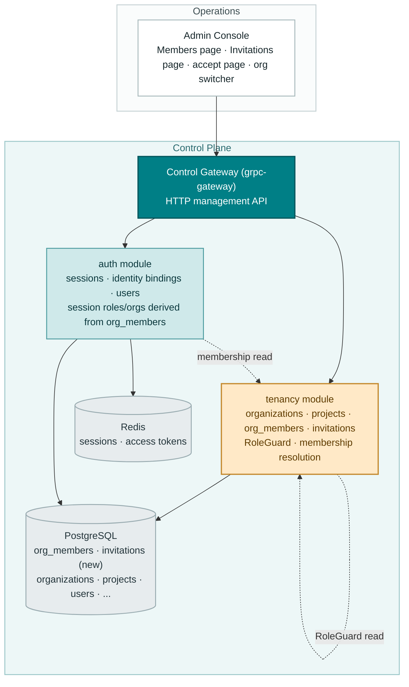
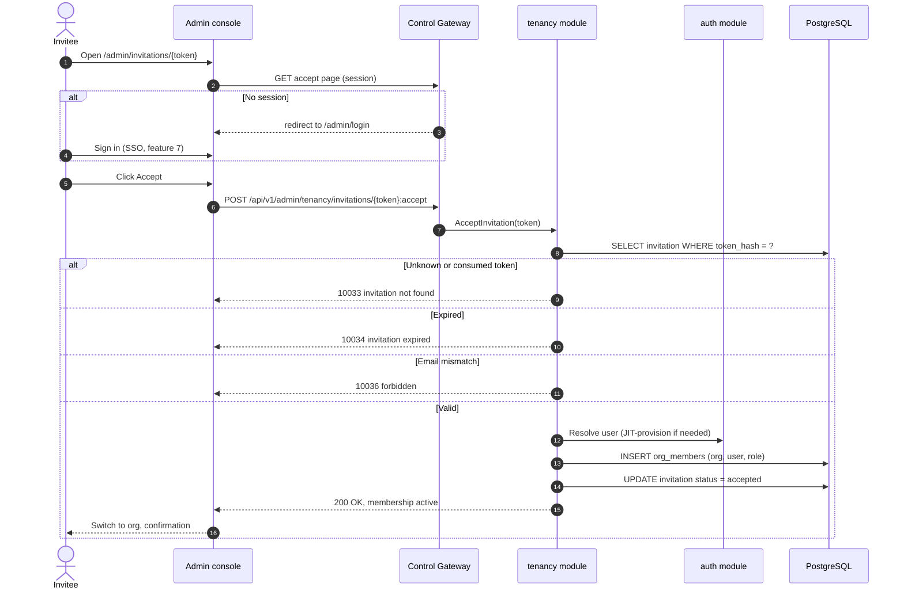
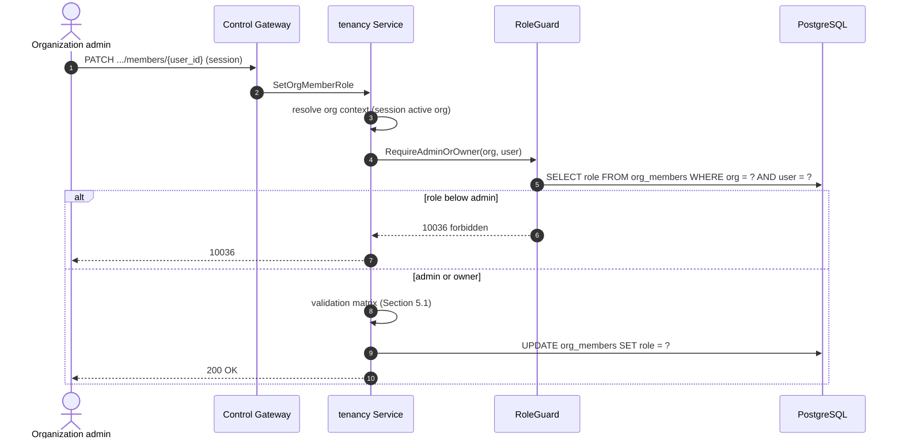

# Organization Members, Roles & Invitations (RBAC) — Architecture and Detailed Design

| Attribute | Content |
| --- | --- |
| Feature point | Organization members, roles & invitations (RBAC) |
| Document scope | Architecture and detailed design for the tenancy module's membership core: the `org_members` and `invitations` tables, member CRUD, the invitation lifecycle (create/list/resend/revoke/accept/reject), the fixed role set (owner/admin/member/viewer), the RoleGuard that gates org-scoped admin APIs by the caller's role, session `AccessibleOrgs`/roles derived from `org_members` (authoritative over IdP claims), the console Members and Invitations pages, the invitation accept flow, error handling, and function-level design per layer |
| Owning modules | `tenancy` (org_members, invitations, RoleGuard, membership resolution), with `auth` (session roles/accessible orgs now derived from `org_members` instead of IdP claims) |
| Related documents | [Requirement Analysis and UI/UX Design](../design/org-members-rbac.md) · [Architecture Design](../design/architecture.md) §2.1 `auth` (RBAC, roles, invitations) · [Multi-Tenancy Isolation](./multi-tenancy.md) — the `organizations` table and `OrgGuard` this feature's membership rows attach to (its D12 defers members/roles here) · [SSO Federation](./sso-federation.md) — the User model, `identity_bindings`, sessions, and attribute-to-role mapping this feature supersedes for membership (its D7 defers RBAC enforcement here) · [Balance & Quota](./balance-quota.md) — the established doc format and the org-scoped admin surface this feature gates |
| Status | Architecture complete, handed to the Developer agent |

---

## 1. Overview and Goals

Features #6 and #7 delivered the tenancy and identity spine: organizations and projects are real rows, and SSO gives the console a login, a session, and an account model. But **membership is still not enforceable**. Feature #7's attribute-to-role mapping (its D7) puts roles and accessible orgs on the session from **IdP claims** — whatever the identity provider says, the platform trusts. There is no `org_members` table, no way to say "who belongs to this organization and what may they do", and no invitation flow to bring a person into a tenant. The console's org switcher lists whatever the IdP claims, and every org-scoped admin API trusts the session's role claim verbatim.

This feature grounds membership in real rows. It delivers the `org_members` table (the authoritative source of who belongs to an org and with what role), the `invitations` table (the self-service path for bringing people in), and the **RoleGuard** — a middleware that gates every org-scoped admin API by the caller's role in the resolved org context. Session `AccessibleOrgs` and roles are now **derived from `org_members`**, not from IdP claims; the IdP claim becomes a hint, never the authority.

**Goals**: the `org_members` table (org_id, user_id, role, composite PK) and the `invitations` table (org_id, email, role, token hash, status, expires_at, created_by); member CRUD RPCs (`ListOrgMembers`/`AddOrgMember`/`RemoveOrgMember`/`SetOrgMemberRole`); invitation lifecycle RPCs (`CreateInvitation`/`ListInvitations`/`RevokeInvitation`/`ResendInvitation`/`AcceptInvitation`/`RejectInvitation`); the RoleGuard gating org-scoped admin APIs; session `AccessibleOrgs`/roles derived from `org_members`; the console Members page, Invitations page, and invitation accept flow; and the new error codes 10029–10036 (AC1–AC13).

**Non-goals** (deferred): owner transfer (explicit handoff of the protected owner row); teams/groups and per-project roles (after the feature-#6 project-column deferral); SCIM directory sync; invitation email delivery (the console surfaces the invite link); role-based visibility of the data plane (the data plane stays key-authenticated); CLI member/invitation commands; invitation audit trail.

## 2. Architecture Decisions

| # | Decision | Rationale |
| --- | --- | --- |
| AD1 | **Fixed role set: `owner`, `admin`, `member`, `viewer`.** Roles are a closed enum, not free text. `owner` is unique per org and protected; `admin` manages members and invitations; `member` uses org resources; `viewer` is read-only | The industry four (design D1); a closed enum is enforceable by the RoleGuard and renderable as a badge |
| AD2 | **`org_members` is the authoritative membership source.** Session `AccessibleOrgs` and roles are derived from `org_members` (feature #7's session now reads membership rows, not IdP claims). The IdP claim is a provisioning hint only — it can seed a pending membership, never grant access the table denies | The core fix for the claims-trust gap (design D2); the session resolver (feature #7's FR4) stays, only its input changes to the membership table |
| AD3 | **Owner is unique and protected.** An org has exactly one `owner`. The owner cannot be removed or demoted by any member (including themselves); the only path is an explicit owner transfer (deferred). Removing/demoting the owner → 10032 | An unowned org is ungovernable (design D3); the transfer flow is a small, separable follow-up |
| AD4 | **Invitation tokens are hashed at rest and single-use.** The `invitations` table stores a hash of the token; the raw token is returned once at creation and never stored. Accept/reject consumes the token (status → `accepted`/`rejected`); reuse → 10033 | A hashed, single-use token is a bounded credential (design D4); reuses the `apikey_crypto` salted-hash pattern |
| AD5 | **Invitations expire by default after 7 days.** `expires_at` is set at creation (default now + 7 days, configurable per invite); an expired invitation cannot be accepted (→ 10034) and is surfaced as `expired` in the list | A bounded window closes the open-door risk (design D5) |
| AD6 | **RoleGuard gates every org-scoped admin API.** A middleware resolves the caller's role in the resolved org context from `org_members` and rejects calls below the required role with **10036 `CodeForbidden`**. `viewer` is read-only: any mutating org-scoped admin API requires at least `member`; member/invitation management requires `admin` or `owner` | RBAC is a control-plane concern (design D6); the guard is one seam every org-scoped API passes through |
| AD7 | **Membership and invitation management are `admin`/`owner`-only.** `ListOrgMembers`/`AddOrgMember`/`RemoveOrgMember`/`SetOrgMemberRole` and all invitation RPCs require `admin` or `owner` in the org context. `owner` additionally is the only role that can manage the owner row (which is protected by AD3) | The admin tier owns the roster; the owner tier owns the owner row (design D7) |
| AD8 | **API surface**: a new `taas.tenancy.v1.TenancyService` extension — member RPCs and invitation RPCs — all under `/api/v1/admin/tenancy/*`, org-scoped via the resolved org context | The tenancy module already owns orgs (feature #6); membership is the org's roster, so it lives beside the org CRUD (design D8) |
| AD9 | **New error codes** in the auth/tenancy block: **10029 `CodeMemberExists`**, **10030 `CodeMemberNotFound`**, **10031 `CodeRoleInvalid`**, **10032 `CodeOwnerProtected`**, **10033 `CodeInvitationNotFound`**, **10034 `CodeInvitationExpired`**, **10035 `CodeInvitationExists`**, **10036 `CodeForbidden`** | The 100xx block is auth's and tenancy's; each failure mode needs its own code so the console can render the right inline message (design D9) |
| AD10 | **RoleGuard composes with, not replaces, the existing `OrgGuard`.** `OrgGuard` validates that the org exists/active (feature #6); the RoleGuard additionally resolves the caller's role in that org from `org_members` and enforces the required role. Both are read-only interfaces over the tenancy tables, injected into consuming services at wiring time | The two guards answer different questions — "does the org exist" vs "may this caller act in it" — and compose additively; the `SetDeleteModelGuard` wiring pattern is reused |
| AD11 | **Session membership is derived at login and refreshed on accept.** `mapAttributes` (feature #7) is replaced by a membership resolver that reads `org_members` for the user and returns the per-org roles and accessible orgs. On `AcceptInvitation`, the session's `AccessibleOrgs`/roles are refreshed so the new membership is immediately visible without a re-login | The session stays the fast path (no DB join per request); the membership table is the source of truth at derivation time (design D2) |

## 3. Component Design



| Component | Responsibility in this feature |
| --- | --- |
| Control Gateway (`grpc-gateway`) | HTTP/JSON facade for the 10 new tenancy RPCs under `/api/v1/admin/tenancy/*`; passes `Authorization: Bearer` through as gRPC metadata for session resolution; passes `X-Organization-Id` through for CLI/transitional callers |
| `tenancy` module (`services/tenancy`) | The `org_members`/`invitations` tables, the 10 member/invitation RPCs, the RoleGuard, and the membership resolver consumed by `auth` for session derivation |
| `auth` module (`services/auth`) | Session `AccessibleOrgs`/roles now derived from `org_members` (via the tenancy membership resolver) instead of IdP claims; `AcceptInvitation` JIT-provisions a user when needed |
| PostgreSQL | `org_members`, `invitations` tables (new); existing tables unchanged |
| Redis | Sessions unchanged; the session hash now carries membership-derived `AccessibleOrgs`/roles |
| Message Queue | **Unchanged** — membership is RPC-only; no new subjects, no consumers, no runners |
| Console | Members page, Invitations page, invitation accept page, session-aware org switcher (contract in Section 3.3) |

### 3.1 File Layout and Function-Level Responsibilities

| Module | File | Contents |
| --- | --- | --- |
| `proto/taas/tenancy/v1` | `tenancy.proto` | Additive: 10 RPCs, `OrgMember`/`Invitation` messages, request/response messages (Section 5) |
| `services/tenancy` | `membership_model.go` | GORM models `OrgMember`, `Invitation` + `TableName`; role and invitation-status constants |
| | `membership_repository.go` | `MembershipRepository`: `FindMember`, `ListMembers`, `AddMember` (unique violation → 10029), `SetMemberRole`, `RemoveMember` (idempotent), `CountOwners`, `ListMemberOrgs` (session derivation), `CreateInvitation` (pending-exists → 10035), `FindInvitationByTokenHash`/`ByID`, `ListInvitations`, `SetInvitationStatus`, `RegenerateInvitationToken` |
| | `membership_service.go` | The 10 RPC implementations on `*Service` + the Section 5.1 validation matrices |
| | `role_guard.go` | `RoleGuard` (the `OrgGuard` pattern): `RequireRole(ctx, orgID, userID, minRole)` → 10036; `RequireAdminOrOwner`; `ResolveRole` |
| | `membership_resolver.go` | `MembershipResolver` (read interface for `auth`): `AccessibleOrgsAndRoles(ctx, userID)` |
| | `service.go` | `Migrate`/`MigrateSchemaForFVT` extended to AutoMigrate `OrgMember`/`Invitation` |
| `services/auth` | `sso_service.go` | `mapAttributes` replaced by a membership-derived resolver: `accessibleOrgs`/`roles` come from `org_members` (via the injected `MembershipResolver`), not IdP claims; the IdP claim seeds a pending membership only |
| | `service.go` | `SetMembershipResolver(*tenancy.MembershipResolver)` setter (the `SetOrgGuard` pattern); `AcceptInvitation` JIT-provision hook |
| `pkg/errors` | `codes.go`/`messages.go` | 10029–10036 constants + canonical messages (Section 7) |
| `apps/taas-server` | `main.go` | Wire the `MembershipResolver` into `auth` after `srv.Init()` (the `SetOrgGuard` wiring pattern) |
| `web/src` | `pages/MembersPage.tsx`, `pages/InvitationsPage.tsx`, `pages/InvitationAcceptPage.tsx`, `App.tsx`, `api.ts`, `org.tsx` | Members/Invitations/accept pages, routes, nav items, API calls (Section 3.3) |
| `test` | `fvt/org_members_rbac_fvt_test.go`, `e2e/tests/orgMembersRbac.js` | Section 8 |

### 3.2 Configuration Additions

| Key | Default | Description |
| --- | --- | --- |
| `tenancy.invitationTTL` | `168h` (7 days) | Default invitation expiry window (AD5); overridable per invite via `expires_in` |

No other configuration is added. The RoleGuard is always on for org-scoped admin APIs (no kill switch — RBAC is a security control, not a feature flag). `applyDefaults`/`Validate` follow the `tenancy` config pattern.

### 3.3 Console Contract (pinned for the Developer agent)

Nav: the Tenancy group (Organizations, Projects) gains **Members** (`/admin/organizations/{id}/members`) and **Invitations** (`/admin/organizations/{id}/invitations`). A standalone **accept page** (`/admin/invitations/{token}`) is reachable without the org context.

- **Members page**: one row per member (`org-member-row-{user_id}`) — user id, display name, role badge, joined time; an "Add member" dialog (`add-member-dialog`: user id input, role select) — `owner` is not offered; row actions: change role (`member-role-select`), remove (`member-remove-{user_id}`) with confirmation, blocked for the owner with a 10032 notice; inline errors for 10029/10030/10031/10032/10036; a role legend (owner/admin/member/viewer).
- **Invitations page**: one row per invitation (`invitation-row-{id}`) — email, role badge, status badge, expires, created by, created time; an "Invite" dialog (`invite-dialog`: `invite-email-input`, `invite-role-select`, optional expiry); row actions: resend (`invite-resend-{id}`) showing the new link, revoke (`invite-revoke-{id}`) with confirmation; inline errors for 10031/10033/10035/10036.
- **Accept page**: renders the org name and the role being granted; Accept (`invitation-accept-{token}`) and Reject buttons; an unauthenticated visitor is redirected to `/admin/login`; on accept the console switches to the org and shows a confirmation.
- **Org switcher** (sidebar): lists the session's `AccessibleOrgs` (now from `org_members`); switching into an org the user is not a member of → 10005.

### 3.4 Security and Rollout Notes

- **Org scoping**: every member/invitation query resolves the org from the session's active org (or `X-Organization-Id` for CLI/transitional callers) and scopes the SQL to it — one org's RPCs never return or mutate another org's rows (AC9).
- **Token hygiene**: invitation tokens are hashed at rest (AD4) and returned once; they are never echoed in list/get responses. The raw token is a single-use, time-bounded credential.
- **Rollout**: two new tables via AutoMigrate (additive); deploy `taas-server` alone. The RoleGuard is a new seam — org-scoped admin APIs that previously trusted the session role claim now enforce it, so the console must be deployed in lockstep. Existing sessions carry stale IdP-claim orgs until they expire (≤ 24h) or the user re-logs-in; the membership resolver re-derives on the next login.

## 4. Data Model

### 4.1 The `org_members` Table

| Column | PostgreSQL type | Constraints | Description |
| --- | --- | --- | --- |
| `organization_id` | `varchar(64)` | NOT NULL, composite PK (priority 1) | The owning organization (FK to `organizations.id` conceptually; no FK in v1) |
| `user_id` | `uuid` | NOT NULL, composite PK (priority 2) | The member platform user |
| `role` | `varchar(16)` | NOT NULL | `owner` / `admin` / `member` / `viewer` (AD1) |
| `joined_at` | `timestamptz` | NOT NULL | When the membership was created (add or accept) |
| `created_at` / `updated_at` | `timestamptz` | NOT NULL | Row timestamps |

Design notes:

- **Composite primary key** `(organization_id, user_id)` via GORM struct tags — the `identity_bindings` pattern (verified in `services/auth/sso_model.go`): `OrganizationID string \`gorm:"size:64;not null;uniqueIndex:idx_org_members_org_user,priority:1"\`` and `UserID string \`gorm:"type:uuid;not null;uniqueIndex:idx_org_members_org_user,priority:2"\``. The composite is the natural key of a membership; a duplicate insert maps to 10029.
- **Owner uniqueness** is enforced in the service layer (AD3): `AddOrgMember` never accepts `owner`, and the owner row is created with the org (feature #6's seed) — so exactly one owner exists by construction. `CountOwners` backstops the invariant.
- `idx_org_members_user (user_id)` serves the session-derivation lookup (`ListMemberOrgs`).
- No delete of the owner row is possible (AD3); `RemoveOrgMember` on the owner → 10032.

### 4.2 The `invitations` Table

| Column | PostgreSQL type | Constraints | Description |
| --- | --- | --- | --- |
| `id` | `uuid` | PRIMARY KEY | Generated invitation id (the `.../invitations/{invitation_id}` path shape) |
| `organization_id` | `varchar(64)` | NOT NULL, index | The inviting organization |
| `email` | `varchar(256)` | NOT NULL | The invitee's email (validated) |
| `role` | `varchar(16)` | NOT NULL | `admin` / `member` / `viewer` (owner cannot be invited, AD1) |
| `token_hash` | `varchar(256)` | NOT NULL, uniqueIndex | The salted hash of the raw token (AD4) |
| `status` | `varchar(16)` | NOT NULL DEFAULT 'pending' | `pending` / `accepted` / `rejected` / `revoked` / `expired` |
| `expires_at` | `bigint` | NOT NULL | Unix seconds; default now + 7 days (AD5) |
| `created_by` | `uuid` | NOT NULL | The inviting user id |
| `created_at` / `updated_at` | `timestamptz` | NOT NULL | Row timestamps |

Design notes:

- **Token hashing** reuses the `apikey_crypto` salted-hash pattern (verified in `services/auth/apikey_crypto.go`): `NewSalt()` (16 random bytes base64) + `HashKey(digest, salt, params)` (Argon2id over the SHA-256 digest) + `VerifyKeyHash` for constant-time comparison. The raw token is generated with `GenerateAPIKey`-style entropy, returned once at creation/resend, and never stored.
- **Single-use**: `token_hash` is unique; accept/reject flips `status` to `accepted`/`rejected` and the token is consumed. Reuse of a consumed token → 10033; an expired token → 10034.
- **Pending uniqueness**: a pending invitation for the same `(organization_id, email)` → 10035. The service checks before insert; a partial unique index on `(organization_id, email) WHERE status = 'pending'` backstops it (sqlite-compatible via a plain check in the FVT path).
- `idx_invitations_org_status (organization_id, status)` serves the org-filtered pipeline listing.

## 5. API Design

All APIs belong to the existing **`taas.tenancy.v1.TenancyService`** (`proto/taas/tenancy/v1/tenancy.proto`), served as HTTP via the Control Gateway under `/api/v1/admin/tenancy/*`. Member and invitation RPCs are org-scoped via the resolved org context and gated by the RoleGuard (AD6/AD7). The data-plane `VerifyAPIKey` RPC is unchanged.

| RPC | HTTP | Status | Purpose |
| --- | --- | --- | --- |
| `ListOrgMembers` | `GET /api/v1/admin/tenancy/organizations/{organization_id}/members` | **new** | The org roster; `admin`/`owner`; paginated |
| `AddOrgMember` | `POST …/organizations/{organization_id}/members` | **new** | Add a member; `admin`/`owner`; 10029/10031/10005 |
| `SetOrgMemberRole` | `PATCH …/organizations/{organization_id}/members/{user_id}` | **new** | Change a role; `admin`/`owner`; 10030/10031/10032 |
| `RemoveOrgMember` | `DELETE …/organizations/{organization_id}/members/{user_id}` | **new** | Remove a member; `admin`/`owner`; 10030/10032 |
| `CreateInvitation` | `POST …/organizations/{organization_id}/invitations` | **new** | Invite by email; `admin`/`owner`; returns token once; 10031/10035 |
| `ListInvitations` | `GET …/organizations/{organization_id}/invitations` | **new** | The invite pipeline; `admin`/`owner`; `status` filter |
| `RevokeInvitation` | `POST …/invitations/{invitation_id}:revoke` | **new** | Cancel a pending invite; `admin`/`owner`; 10033 |
| `ResendInvitation` | `POST …/invitations/{invitation_id}:resend` | **new** | New token + expiry; `admin`/`owner`; returns token once; 10033 |
| `AcceptInvitation` | `POST /api/v1/admin/tenancy/invitations/{token}:accept` | **new** | Join the org; authenticated; JIT-provisions; 10033/10034/10036 |
| `RejectInvitation` | `POST /api/v1/admin/tenancy/invitations/{token}:reject` | **new** | Decline the org; authenticated; 10033/10034 |
| `VerifyAPIKey` | (gRPC, data plane) | unchanged | Data-plane auth; unaffected by RBAC |

Message sketches (new; field numbers continue each message's sequence):

```protobuf
message OrgMember { string user_id = 1; string display_name = 2; string role = 3; int64 joined_at = 4; }
message Invitation { string invitation_id = 1; string email = 2; string role = 3;
  string status = 4; int64 expires_at = 5; string created_by = 6; int64 created_at = 7; }

message ListOrgMembersRequest { string organization_id = 1; taas.common.v1.PageRequest page = 2; }
message ListOrgMembersResponse { taas.common.v1.Response response = 1;
  repeated OrgMember members = 2; taas.common.v1.PageMeta page_meta = 3; }
message AddOrgMemberRequest { string organization_id = 1; string user_id = 2; string role = 3; }
message SetOrgMemberRoleRequest { string organization_id = 1; string user_id = 2; string role = 3; }
message RemoveOrgMemberRequest { string organization_id = 1; string user_id = 2; }

message CreateInvitationRequest { string organization_id = 1; string email = 2;
  string role = 3; int64 expires_in = 4; }  // expires_in seconds; 0 = default 7 days
message CreateInvitationResponse { taas.common.v1.Response response = 1;
  Invitation invitation = 2; string token = 3; }  // token returned once (AD4)
message ListInvitationsRequest { string organization_id = 1; string status = 2;
  taas.common.v1.PageRequest page = 3; }
message ListInvitationsResponse { taas.common.v1.Response response = 1;
  repeated Invitation invitations = 2; taas.common.v1.PageMeta page_meta = 3; }
message RevokeInvitationRequest { string invitation_id = 1; }
message ResendInvitationRequest { string invitation_id = 1; }
message ResendInvitationResponse { taas.common.v1.Response response = 1;
  Invitation invitation = 2; string token = 3; }  // new token, returned once
message AcceptInvitationRequest { string token = 1; }
message RejectInvitationRequest { string token = 1; }
```

### 5.1 Validation Matrices (synchronous, first failure returns, nothing written)

- `AddOrgMember`: `user_id` exists → else **10005**; `role` ∈ {`admin`, `member`, `viewer`} (never `owner`) → else **10031**; `(org_id, user_id)` not already present → else **10029**.
- `SetOrgMemberRole`: member exists → else **10030**; `role` ∈ {`admin`, `member`, `viewer`} → else **10031**; target is not the owner → else **10032**.
- `RemoveOrgMember`: member exists → else **10030** (idempotent on repeat); target is not the owner → else **10032**.
- `CreateInvitation`: `email` valid → else **10031**; `role` ∈ {`admin`, `member`, `viewer`} → else **10031**; no pending invitation for `(org_id, email)` → else **10035**; `expires_in` ≥ 0 (0 = default 7 days) → else **10031**.
- `RevokeInvitation`/`ResendInvitation`: invitation exists and is `pending` → else **10033** (consumed/unknown).
- `AcceptInvitation`/`RejectInvitation`: token resolves to a `pending` invitation → else **10033**; not expired → else **10034**; (accept only) the caller's email matches the invitation's email → else **10036**.

## 6. Sequence Flows

### 6.1 Invitation Accept (console)



### 6.2 RoleGuard Enforcement (org-scoped admin API)



### 6.3 Session Membership Derivation (login)

```mermaid
sequenceDiagram
    autonumber
    participant IDP as External IdP
    participant AUTH as auth module
    participant RES as MembershipResolver
    participant DB as PostgreSQL
    participant RD as Redis
    IDP->>AUTH: SSO callback (identity claims)
    AUTH->>AUTH: resolve identity (binding or JIT)
    AUTH->>RES: AccessibleOrgsAndRoles(user_id)
    RES->>DB: SELECT org_id, role FROM org_members WHERE user_id = ?
    RES-->>AUTH: accessible orgs + per-org roles
    AUTH->>AUTH: active org = default or first accessible
    AUTH->>RD: session hash (roles, accessible_orgs, active_org)
    Note over AUTH,RD: IdP claim is a hint only; org_members is authoritative (AD2)
```

## 7. Error Handling

All errors are `pkg/errors` business codes in the unified envelope.

| Condition | Code | Constant | Notes |
| --- | --- | --- | --- |
| Duplicate `(org_id, user_id)` on add | 10029 | `CodeMemberExists` | **New** (AD9) |
| Unknown member on role change/remove | 10030 | `CodeMemberNotFound` | **New** |
| Invalid role (not in the fixed set, or `owner` assigned) | 10031 | `CodeRoleInvalid` | **New** |
| Removing/demoting the owner | 10032 | `CodeOwnerProtected` | **New** (AD3) |
| Unknown/consumed invitation token or id | 10033 | `CodeInvitationNotFound` | **New** |
| Expired invitation on accept/reject | 10034 | `CodeInvitationExpired` | **New** (AD5) |
| Pending invitation already exists for the email | 10035 | `CodeInvitationExists` | **New** |
| Caller's role below the required role | 10036 | `CodeForbidden` | **New** (AD6) |
| Unknown organization (org context) | 10005 | `CodeOrganizationNotFound` | Existing; reused for inaccessible orgs |
| Unknown user on add | 10005 | `CodeUserNotFound` | Existing; reused |
| Missing/expired/revoked session | 10027 | `CodeSessionInvalid` | Existing (feature #7) |
| Database failure | 500 | `CodeInternal` | Via error normalization |

## 8. Testing Strategy

- **Unit** (`services/tenancy`, sqlite in-memory): `membership_repository_test.go` — composite-PK uniqueness (AC1), owner protection (AC3), pending-invitation uniqueness (AC4), token hash round-trip and single-use (AC4/AC5), expiry (AC6), status transitions (AC7). `membership_service_test.go` — the validation matrices, the RoleGuard truth table (viewer/member/admin/owner, AC8), org scoping (AC9), JIT provisioning on accept (AC6). Coverage ≥ 80% on the new files.
- **FVT** (`test/fvt/org_members_rbac_fvt_test.go`, the balance-quota FVT pattern: file-backed sqlite + `MigrateSchemaForFVT` + `NewForFVT` + gRPC server with the production interceptor + gateway mux with `FVTHeaderMatcher`): member CRUD through the gateway (AC1–AC3), invitation lifecycle end-to-end — create, list, resend, revoke, accept, reject (AC4–AC7), RBAC enforcement across roles (AC8), org scoping (AC9), session derivation from `org_members` (AC8).
- **E2E** (`test/e2e/tests/orgMembersRbac.js`, the `balanceQuota.js` pattern): against the compose stack — the Members page renders `org-member-row-{user_id}`, the add-member dialog, role change, owner-removal 10032 notice (AC10); the Invitations page renders `invitation-row-{id}`, invite/resend/revoke (AC11); the accept page accepts and switches orgs, redirects unauthenticated visitors (AC12).
- **Regression**: the data plane is unchanged — API key verification still works and RBAC does not gate inference traffic (AC13); the existing e2e suites stay green.

## 9. Open Questions

| Question | Leaning |
| --- | --- |
| Owner transfer (explicit handoff of the protected owner row) | Follow-up feature; the `CountOwners` invariant is the hook |
| Teams/groups and per-project roles | After the feature-#6 project-column deferral |
| SCIM directory sync and invitation email delivery | Future infrastructure; the console surfaces the invite link |
| Role-based visibility of the data plane | Future; the data plane stays key-authenticated |
| Invitation audit trail (who invited whom, when) | Future operations tooling |