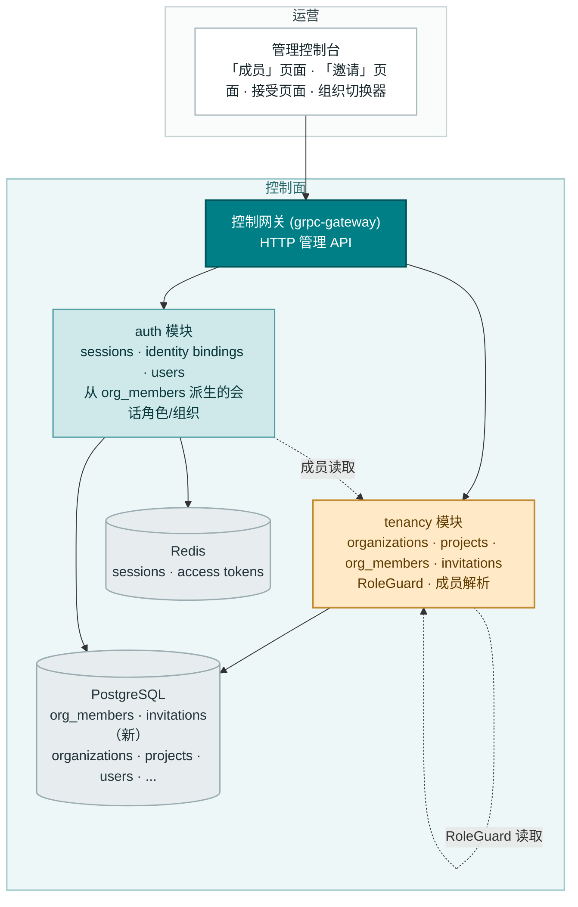
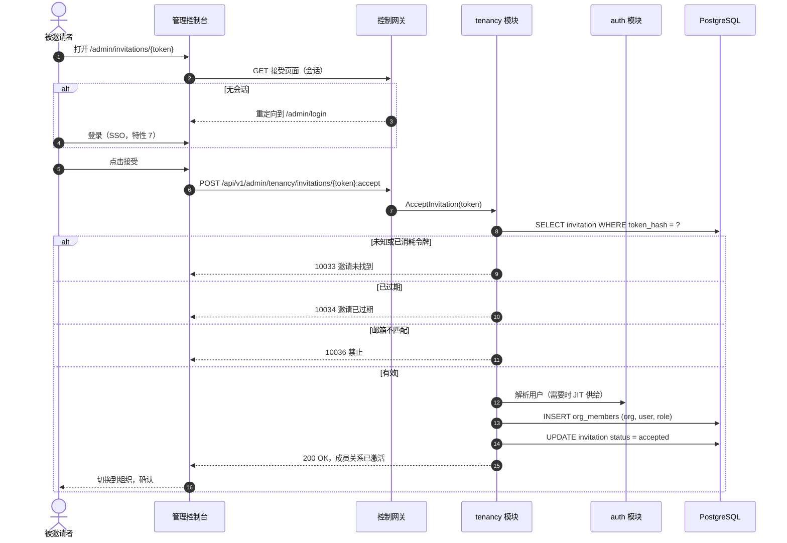
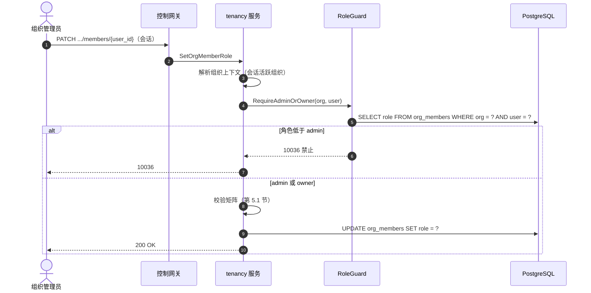
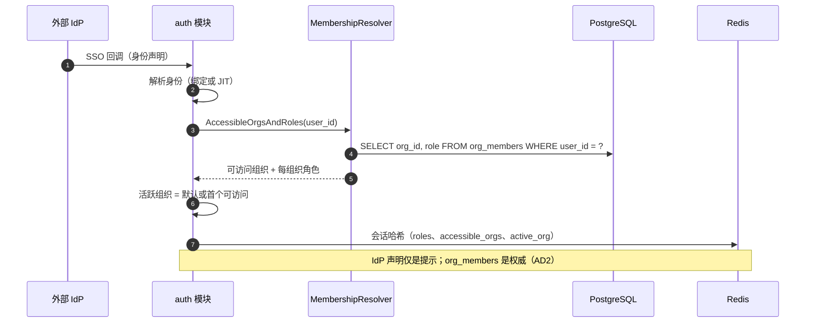

# 组织成员、角色与邀请（RBAC）— 架构与详细设计

| 属性 | 内容 |
| --- | --- |
| 特性点 | 组织成员、角色与邀请（RBAC） |
| 文档范围 | tenancy 模块成员核心的架构与详细设计：`org_members` 与 `invitations` 表、成员 CRUD、邀请生命周期（创建/列表/重发/撤销/接受/拒绝）、固定角色集（owner/admin/member/viewer）、按调用方在已解析组织上下文中的角色门控组织级管理 API 的 RoleGuard、从 `org_members` 派生的会话 `AccessibleOrgs`/角色（对 IdP 声明具有权威性）、控制台「成员」与「邀请」页面、邀请接受流程、错误处理，以及各层的函数级设计 |
| 归属模块 | `tenancy`（org_members、invitations、RoleGuard、成员解析），配合 `auth`（会话角色/可访问组织现改为从 `org_members` 派生，而非 IdP 声明） |
| 相关文档 | [需求分析与 UI/UX 设计](../design/org-members-rbac.zh-cn.md) · [架构设计](../design/architecture.zh-cn.md) 第 2.1 节（`auth`：RBAC、角色、邀请） · [多租户隔离](./multi-tenancy.zh-cn.md) — 本特性成员行挂接的 `organizations` 表与 `OrgGuard`（其 D12 将成员/角色延后至此） · [SSO 联合](./sso-federation.zh-cn.md) — 本特性为成员关系所取代的 User 模型、`identity_bindings`、会话与属性到角色的映射（其 D7 将 RBAC 强制延后至此） · [余额与配额](./balance-quota.zh-cn.md) — 既定的文档格式与本特性门控的组织级管理面 |
| 状态 | 架构完成，已移交开发代理 |

---

## 1. 概述与目标

特性 #6 与 #7 交付了租户与身份主干：组织与项目是真实的行，SSO 为控制台提供了登录、会话与账户模型。但**成员关系仍不可强制**。特性 #7 的属性到角色映射（其 D7）把角色与可访问组织放到**来自 IdP 声明**的会话上 — 身份提供方说什么，平台就信什么。没有 `org_members` 表，没有方式回答「谁属于这个组织、他们能做什么」，也没有把一个人带进租户的邀请流程。控制台的组织切换器列出 IdP 声称的内容，每个组织级管理 API 都逐字信任会话的角色声明。

本特性把成员关系落到真实的行上。它交付 `org_members` 表（谁属于某组织、以何种角色 — 的权威来源）、`invitations` 表（把人带进来的自助路径），以及 **RoleGuard** — 一个按调用方在已解析组织上下文中的角色门控每个组织级管理 API 的中间件。会话 `AccessibleOrgs` 与角色现改为**从 `org_members` 派生**，而非来自 IdP 声明；IdP 声明成为提示，绝非权威。

**目标**：`org_members` 表（org_id、user_id、role、复合主键）与 `invitations` 表（org_id、email、role、token hash、status、expires_at、created_by）；成员 CRUD RPC（`ListOrgMembers`/`AddOrgMember`/`RemoveOrgMember`/`SetOrgMemberRole`）；邀请生命周期 RPC（`CreateInvitation`/`ListInvitations`/`RevokeInvitation`/`ResendInvitation`/`AcceptInvitation`/`RejectInvitation`）；门控组织级管理 API 的 RoleGuard；从 `org_members` 派生的会话 `AccessibleOrgs`/角色；控制台「成员」页面、「邀请」页面与邀请接受流程；以及新错误码 10029–10036（AC1–AC13）。

**非目标**（延后）：所有者转移（受保护 owner 行的显式交接）；团队/分组与按项目角色（在特性 #6 项目列延后之后）；SCIM 目录同步；邀请邮件投递（控制台展示邀请链接）；数据面的基于角色可见性（数据面保持密钥认证）；CLI 成员/邀请命令；邀请审计轨迹。

## 2. 架构决策

| # | 决策 | 理由 |
| --- | --- | --- |
| AD1 | **固定角色集：`owner`、`admin`、`member`、`viewer`。** 角色是封闭枚举，而非自由文本。`owner` 每组织唯一且受保护；`admin` 管理成员与邀请；`member` 使用组织资源；`viewer` 只读 | 业界四角色（设计 D1）；封闭枚举可被 RoleGuard 强制，并可渲染为徽标 |
| AD2 | **`org_members` 是权威成员来源。** 会话 `AccessibleOrgs` 与角色从 `org_members` 派生（特性 #7 的会话现读取成员行，而非 IdP 声明）。IdP 声明仅是供给提示 — 它可以播种一条待定成员关系，绝不授予表所拒绝的访问 | 声明信任缺口（设计 D2）的核心修复；会话解析器（特性 #7 的 FR4）保留，只是其输入改为成员表 |
| AD3 | **Owner 唯一且受保护。** 一个组织恰好一个 `owner`。任何成员（包括其本人）都不能移除或降级 owner；唯一路径是显式所有者转移（延后）。移除/降级 owner → 10032 | 无主组织不可治理（设计 D3）；转移流程是小型、可分离的后续 |
| AD4 | **邀请令牌在静态时哈希且一次性使用。** `invitations` 表存储令牌的哈希；原始令牌在创建时返回一次，绝不存储。接受/拒绝消耗令牌（status → `accepted`/`rejected`）；复用 → 10033 | 哈希、一次性的令牌是有界凭证（设计 D4）；复用 `apikey_crypto` 加盐哈希模式 |
| AD5 | **邀请默认 7 天后过期。** `expires_at` 在创建时设置（默认 now + 7 天，每次邀请可配置）；过期邀请不可接受（→ 10034），并在列表中呈现为 `expired` | 有界窗口关闭敞开大门风险（设计 D5） |
| AD6 | **RoleGuard 门控每个组织级管理 API。** 中间件从 `org_members` 解析调用方在已解析组织上下文中的角色，并以 **10036 `CodeForbidden`** 拒绝低于所需角色的调用。`viewer` 只读：任何变更性的组织级管理 API 至少需要 `member`；成员/邀请管理需要 `admin` 或 `owner` | RBAC 是控制面关注点（设计 D6）；守卫是每个组织级 API 都经过的一个接缝 |
| AD7 | **成员与邀请管理仅限 `admin`/`owner`。** `ListOrgMembers`/`AddOrgMember`/`RemoveOrgMember`/`SetOrgMemberRole` 及所有邀请 RPC 都要求组织上下文中的 `admin` 或 `owner`。此外 `owner` 是唯一能管理 owner 行的角色（受 AD3 保护） | admin 层拥有名册；owner 层拥有 owner 行（设计 D7） |
| AD8 | **API 面**：`taas.tenancy.v1.TenancyService` 的新扩展 — 成员 RPC 与邀请 RPC — 全部位于 `/api/v1/admin/tenancy/*` 下，经已解析组织上下文限定组织范围 | tenancy 模块已拥有组织（特性 #6）；成员关系是组织的名册，故与组织 CRUD 并列（设计 D8） |
| AD9 | **auth/tenancy 块中的新错误码**：**10029 `CodeMemberExists`**、**10030 `CodeMemberNotFound`**、**10031 `CodeRoleInvalid`**、**10032 `CodeOwnerProtected`**、**10033 `CodeInvitationNotFound`**、**10034 `CodeInvitationExpired`**、**10035 `CodeInvitationExists`**、**10036 `CodeForbidden`** | 100xx 块属于 auth 与 tenancy；每个失败模式需要自己的码，控制台才能渲染正确的内联消息（设计 D9） |
| AD10 | **RoleGuard 与既有 `OrgGuard` 组合而非取代。** `OrgGuard` 校验组织存在/活跃（特性 #6）；RoleGuard 额外从 `org_members` 解析调用方在该组织中的角色并强制所需角色。两者都是 tenancy 表上的只读接口，在装配时注入消费服务 | 两个守卫回答不同问题 —「组织是否存在」对「此调用方能否在其中行动」— 且可加性组合；复用 `SetDeleteModelGuard` 装配模式 |
| AD11 | **会话成员关系在登录时派生，并在接受时刷新。** `mapAttributes`（特性 #7）被一个读取该用户 `org_members` 并返回每组织角色与可访问组织的成员解析器取代。在 `AcceptInvitation` 上，会话的 `AccessibleOrgs`/角色被刷新，使新成员关系无需重新登录即可立即可见 | 会话保持快路径（每请求无 DB 连接）；成员表是派生时刻的真相来源（设计 D2） |

## 3. 组件设计



| 组件 | 本特性中的职责 |
| --- | --- |
| 控制网关（`grpc-gateway`） | `/api/v1/admin/tenancy/*` 下 10 个新 tenancy RPC 的 HTTP/JSON 门面；将 `Authorization: Bearer` 作为 gRPC metadata 透传以解析会话；将 `X-Organization-Id` 透传以服务 CLI/过渡调用方 |
| `tenancy` 模块（`services/tenancy`） | `org_members`/`invitations` 表、10 个成员/邀请 RPC、RoleGuard，以及供 `auth` 做会话派生消费的成员解析器 |
| `auth` 模块（`services/auth`） | 会话 `AccessibleOrgs`/角色现改为从 `org_members` 派生（经 tenancy 成员解析器），而非 IdP 声明；`AcceptInvitation` 在需要时 JIT 供给用户 |
| PostgreSQL | `org_members`、`invitations` 表（新）；既有表不动 |
| Redis | 会话不变；会话哈希现携带成员派生的 `AccessibleOrgs`/角色 |
| 消息队列 | **不变** — 成员关系仅 RPC；无新 subject、无消费者、无 runner |
| 控制台 | 「成员」页面、「邀请」页面、邀请接受页面、会话感知的组织切换器（契约见第 3.3 节） |

### 3.1 文件布局与函数级职责

| 模块 | 文件 | 内容 |
| --- | --- | --- |
| `proto/taas/tenancy/v1` | `tenancy.proto` | 增量：10 个 RPC、`OrgMember`/`Invitation` 消息、请求/响应消息（第 5 节） |
| `services/tenancy` | `membership_model.go` | GORM 模型 `OrgMember`、`Invitation` + `TableName`；角色与邀请状态常量 |
| | `membership_repository.go` | `MembershipRepository`：`FindMember`、`ListMembers`、`AddMember`（唯一冲突 → 10029）、`SetMemberRole`、`RemoveMember`（幂等）、`CountOwners`、`ListMemberOrgs`（会话派生）、`CreateInvitation`（待定已存在 → 10035）、`FindInvitationByTokenHash`/`ByID`、`ListInvitations`、`SetInvitationStatus`、`RegenerateInvitationToken` |
| | `membership_service.go` | `*Service` 上的 10 个 RPC 实现 + 第 5.1 节校验矩阵 |
| | `role_guard.go` | `RoleGuard`（`OrgGuard` 模式）：`RequireRole(ctx, orgID, userID, minRole)` → 10036；`RequireAdminOrOwner`；`ResolveRole` |
| | `membership_resolver.go` | `MembershipResolver`（供 `auth` 的只读接口）：`AccessibleOrgsAndRoles(ctx, userID)` |
| | `service.go` | `Migrate`/`MigrateSchemaForFVT` 扩展为 AutoMigrate `OrgMember`/`Invitation` |
| `services/auth` | `sso_service.go` | `mapAttributes` 被成员派生的解析器取代：`accessibleOrgs`/`roles` 来自 `org_members`（经注入的 `MembershipResolver`），而非 IdP 声明；IdP 声明仅播种待定成员关系 |
| | `service.go` | `SetMembershipResolver(*tenancy.MembershipResolver)` setter（`SetOrgGuard` 模式）；`AcceptInvitation` JIT 供给钩子 |
| `pkg/errors` | `codes.go`/`messages.go` | 10029–10036 常量 + 规范消息（第 7 节） |
| `apps/taas-server` | `main.go` | 在 `srv.Init()` 之后把 `MembershipResolver` 装配进 `auth`（`SetOrgGuard` 装配模式） |
| `web/src` | `pages/MembersPage.tsx`、`pages/InvitationsPage.tsx`、`pages/InvitationAcceptPage.tsx`、`App.tsx`、`api.ts`、`org.tsx` | 成员/邀请/接受页面、路由、导航项、API 调用（第 3.3 节） |
| `test` | `fvt/org_members_rbac_fvt_test.go`、`e2e/tests/orgMembersRbac.js` | 第 8 节 |

### 3.2 配置增量

| 键 | 默认值 | 描述 |
| --- | --- | --- |
| `tenancy.invitationTTL` | `168h`（7 天） | 默认邀请过期窗口（AD5）；每次邀请经 `expires_in` 可覆盖 |

不新增其他配置。RoleGuard 对组织级管理 API 始终开启（无 kill switch — RBAC 是安全控制，不是特性开关）。`applyDefaults`/`Validate` 沿用 `tenancy` 配置模式。

### 3.3 控制台契约（为开发代理钉死）

导航：Tenancy 分组（Organizations、Projects）新增**成员**（`/admin/organizations/{id}/members`）与**邀请**（`/admin/organizations/{id}/invitations`）。一个独立的**接受页面**（`/admin/invitations/{token}`）无需组织上下文即可访问。

- **成员页面**：每个成员一行（`org-member-row-{user_id}`）— 用户 id、显示名、角色徽标、加入时间；一个「添加成员」对话框（`add-member-dialog`：用户 id 输入、角色选择）— 不提供 `owner`；行操作：改角色（`member-role-select`）、移除（`member-remove-{user_id}`）带确认，对 owner 阻断并显示 10032 提示；10029/10030/10031/10032/10036 的内联错误；一个角色图例（owner/admin/member/viewer）。
- **邀请页面**：每个邀请一行（`invitation-row-{id}`）— 邮箱、角色徽标、状态徽标、过期时间、创建者、创建时间；一个「邀请」对话框（`invite-dialog`：`invite-email-input`、`invite-role-select`、可选过期时间）；行操作：重发（`invite-resend-{id}`）展示新链接、撤销（`invite-revoke-{id}`）带确认；10031/10033/10035/10036 的内联错误。
- **接受页面**：渲染组织名与被授予的角色；接受（`invitation-accept-{token}`）与拒绝按钮；未认证访客被重定向到 `/admin/login`；接受后控制台切换到该组织并显示确认。
- **组织切换器**（侧边栏）：列出会话的 `AccessibleOrgs`（现来自 `org_members`）；切入用户非成员的组织 → 10005。

### 3.4 安全与发布说明

- **组织范围界定**：每个成员/邀请查询从会话的活跃组织（或 CLI/过渡调用方的 `X-Organization-Id`）解析组织，并将 SQL 限定于它 — 一个组织的 RPC 绝不返回或变更另一个组织的行（AC9）。
- **令牌卫生**：邀请令牌在静态时哈希（AD4）并只返回一次；绝不在列表/获取响应中回显。原始令牌是一次性、有界时限的凭证。
- **发布**：经 AutoMigrate 建两张新表（增量）；只部署 `taas-server`。RoleGuard 是新接缝 — 先前信任会话角色声明的组织级管理 API 现强制它，故控制台必须同步部署。既有会话携带陈旧的 IdP 声明组织，直到它们过期（≤ 24h）或用户重新登录；成员解析器在下次登录时重新派生。

## 4. 数据模型

### 4.1 `org_members` 表

| 列 | PostgreSQL 类型 | 约束 | 描述 |
| --- | --- | --- | --- |
| `organization_id` | `varchar(64)` | NOT NULL，复合主键（优先级 1） | 所属组织（概念上 FK 到 `organizations.id`；v1 无 FK） |
| `user_id` | `uuid` | NOT NULL，复合主键（优先级 2） | 成员平台用户 |
| `role` | `varchar(16)` | NOT NULL | `owner` / `admin` / `member` / `viewer`（AD1） |
| `joined_at` | `timestamptz` | NOT NULL | 成员关系创建时间（添加或接受） |
| `created_at` / `updated_at` | `timestamptz` | NOT NULL | 行时间戳 |

设计说明：

- **复合主键** `(organization_id, user_id)` 经 GORM struct 标签 — `identity_bindings` 模式（在 `services/auth/sso_model.go` 中验证）：`OrganizationID string \`gorm:"size:64;not null;uniqueIndex:idx_org_members_org_user,priority:1"\`` 与 `UserID string \`gorm:"type:uuid;not null;uniqueIndex:idx_org_members_org_user,priority:2"\``。复合键是成员关系的自然键；重复插入映射到 10029。
- **Owner 唯一性**在服务层强制（AD3）：`AddOrgMember` 绝不接受 `owner`，owner 行随组织创建（特性 #6 的种子）— 故按构造恰好一个 owner。`CountOwners` 兜底该不变量。
- `idx_org_members_user (user_id)` 服务会话派生查找（`ListMemberOrgs`）。
- 不可能删除 owner 行（AD3）；对 owner 的 `RemoveOrgMember` → 10032。

### 4.2 `invitations` 表

| 列 | PostgreSQL 类型 | 约束 | 描述 |
| --- | --- | --- | --- |
| `id` | `uuid` | 主键 | 生成的邀请 id（`.../invitations/{invitation_id}` 路径形态） |
| `organization_id` | `varchar(64)` | NOT NULL，索引 | 邀请组织 |
| `email` | `varchar(256)` | NOT NULL | 被邀请者邮箱（已校验） |
| `role` | `varchar(16)` | NOT NULL | `admin` / `member` / `viewer`（owner 不可被邀请，AD1） |
| `token_hash` | `varchar(256)` | NOT NULL，uniqueIndex | 原始令牌的加盐哈希（AD4） |
| `status` | `varchar(16)` | NOT NULL DEFAULT 'pending' | `pending` / `accepted` / `rejected` / `revoked` / `expired` |
| `expires_at` | `bigint` | NOT NULL | Unix 秒；默认 now + 7 天（AD5） |
| `created_by` | `uuid` | NOT NULL | 邀请用户 id |
| `created_at` / `updated_at` | `timestamptz` | NOT NULL | 行时间戳 |

设计说明：

- **令牌哈希**复用 `apikey_crypto` 加盐哈希模式（在 `services/auth/apikey_crypto.go` 中验证）：`NewSalt()`（16 随机字节 base64）+ `HashKey(digest, salt, params)`（对 SHA-256 摘要做 Argon2id）+ 常量时间比较的 `VerifyKeyHash`。原始令牌以 `GenerateAPIKey` 风格熵生成，在创建/重发时返回一次，绝不存储。
- **一次性使用**：`token_hash` 唯一；接受/拒绝把 `status` 翻转为 `accepted`/`rejected`，令牌被消耗。复用已消耗令牌 → 10033；过期令牌 → 10034。
- **待定唯一性**：同一 `(organization_id, email)` 的待定邀请 → 10035。服务在插入前检查；`(organization_id, email) WHERE status = 'pending'` 的部分唯一索引兜底（FVT 路径经普通检查兼容 sqlite）。
- `idx_invitations_org_status (organization_id, status)` 服务组织过滤的管道列表。

## 5. API 设计

所有 API 属于既有 **`taas.tenancy.v1.TenancyService`**（`proto/taas/tenancy/v1/tenancy.proto`），经控制网关以 HTTP 提供，位于 `/api/v1/admin/tenancy/*` 下。成员与邀请 RPC 经已解析组织上下文限定组织范围，并由 RoleGuard 门控（AD6/AD7）。数据面 `VerifyAPIKey` RPC 不变。

| RPC | HTTP | 状态 | 用途 |
| --- | --- | --- | --- |
| `ListOrgMembers` | `GET /api/v1/admin/tenancy/organizations/{organization_id}/members` | **新增** | 组织名册；`admin`/`owner`；分页 |
| `AddOrgMember` | `POST …/organizations/{organization_id}/members` | **新增** | 添加成员；`admin`/`owner`；10029/10031/10005 |
| `SetOrgMemberRole` | `PATCH …/organizations/{organization_id}/members/{user_id}` | **新增** | 变更角色；`admin`/`owner`；10030/10031/10032 |
| `RemoveOrgMember` | `DELETE …/organizations/{organization_id}/members/{user_id}` | **新增** | 移除成员；`admin`/`owner`；10030/10032 |
| `CreateInvitation` | `POST …/organizations/{organization_id}/invitations` | **新增** | 按邮箱邀请；`admin`/`owner`；返回令牌一次；10031/10035 |
| `ListInvitations` | `GET …/organizations/{organization_id}/invitations` | **新增** | 邀请管道；`admin`/`owner`；`status` 过滤 |
| `RevokeInvitation` | `POST …/invitations/{invitation_id}:revoke` | **新增** | 取消待定邀请；`admin`/`owner`；10033 |
| `ResendInvitation` | `POST …/invitations/{invitation_id}:resend` | **新增** | 新令牌 + 过期时间；`admin`/`owner`；返回令牌一次；10033 |
| `AcceptInvitation` | `POST /api/v1/admin/tenancy/invitations/{token}:accept` | **新增** | 加入组织；已认证；JIT 供给；10033/10034/10036 |
| `RejectInvitation` | `POST /api/v1/admin/tenancy/invitations/{token}:reject` | **新增** | 婉拒组织；已认证；10033/10034 |
| `VerifyAPIKey` | （gRPC，数据面） | 不变 | 数据面认证；不受 RBAC 影响 |

消息草案（新增；字段号延续各消息的序列）：

```protobuf
message OrgMember { string user_id = 1; string display_name = 2; string role = 3; int64 joined_at = 4; }
message Invitation { string invitation_id = 1; string email = 2; string role = 3;
  string status = 4; int64 expires_at = 5; string created_by = 6; int64 created_at = 7; }

message ListOrgMembersRequest { string organization_id = 1; taas.common.v1.PageRequest page = 2; }
message ListOrgMembersResponse { taas.common.v1.Response response = 1;
  repeated OrgMember members = 2; taas.common.v1.PageMeta page_meta = 3; }
message AddOrgMemberRequest { string organization_id = 1; string user_id = 2; string role = 3; }
message SetOrgMemberRoleRequest { string organization_id = 1; string user_id = 2; string role = 3; }
message RemoveOrgMemberRequest { string organization_id = 1; string user_id = 2; }

message CreateInvitationRequest { string organization_id = 1; string email = 2;
  string role = 3; int64 expires_in = 4; }  // expires_in 秒；0 = 默认 7 天
message CreateInvitationResponse { taas.common.v1.Response response = 1;
  Invitation invitation = 2; string token = 3; }  // 令牌返回一次（AD4）
message ListInvitationsRequest { string organization_id = 1; string status = 2;
  taas.common.v1.PageRequest page = 3; }
message ListInvitationsResponse { taas.common.v1.Response response = 1;
  repeated Invitation invitations = 2; taas.common.v1.PageMeta page_meta = 3; }
message RevokeInvitationRequest { string invitation_id = 1; }
message ResendInvitationRequest { string invitation_id = 1; }
message ResendInvitationResponse { taas.common.v1.Response response = 1;
  Invitation invitation = 2; string token = 3; }  // 新令牌，返回一次
message AcceptInvitationRequest { string token = 1; }
message RejectInvitationRequest { string token = 1; }
```

### 5.1 校验矩阵（同步，首个失败即返回，不写入任何内容）

- `AddOrgMember`：`user_id` 存在 → 否则 **10005**；`role` ∈ {`admin`, `member`, `viewer`}（绝不 `owner`）→ 否则 **10031**；`(org_id, user_id)` 尚未存在 → 否则 **10029**。
- `SetOrgMemberRole`：成员存在 → 否则 **10030**；`role` ∈ {`admin`, `member`, `viewer`} → 否则 **10031**；目标不是 owner → 否则 **10032**。
- `RemoveOrgMember`：成员存在 → 否则 **10030**（重复时幂等）；目标不是 owner → 否则 **10032**。
- `CreateInvitation`：`email` 有效 → 否则 **10031**；`role` ∈ {`admin`, `member`, `viewer`} → 否则 **10031**；`(org_id, email)` 无待定邀请 → 否则 **10035**；`expires_in` ≥ 0（0 = 默认 7 天）→ 否则 **10031**。
- `RevokeInvitation`/`ResendInvitation`：邀请存在且为 `pending` → 否则 **10033**（已消耗/未知）。
- `AcceptInvitation`/`RejectInvitation`：令牌解析到 `pending` 邀请 → 否则 **10033**；未过期 → 否则 **10034**；（仅接受）调用方邮箱与邀请邮箱匹配 → 否则 **10036**。

## 6. 时序流程

### 6.1 邀请接受（控制台）



### 6.2 RoleGuard 强制（组织级管理 API）



### 6.3 会话成员派生（登录）



## 7. 错误处理

所有错误均为统一信封中 `pkg/errors` 的业务码。

| 条件 | 码 | 常量 | 说明 |
| --- | --- | --- | --- |
| 添加时 `(org_id, user_id)` 重复 | 10029 | `CodeMemberExists` | **新增**（AD9） |
| 改角色/移除时成员未知 | 10030 | `CodeMemberNotFound` | **新增** |
| 无效角色（不在固定集内，或指派 `owner`） | 10031 | `CodeRoleInvalid` | **新增** |
| 移除/降级 owner | 10032 | `CodeOwnerProtected` | **新增**（AD3） |
| 未知/已消耗的邀请令牌或 id | 10033 | `CodeInvitationNotFound` | **新增** |
| 接受/拒绝时邀请已过期 | 10034 | `CodeInvitationExpired` | **新增**（AD5） |
| 该邮箱的待定邀请已存在 | 10035 | `CodeInvitationExists` | **新增** |
| 调用方角色低于所需角色 | 10036 | `CodeForbidden` | **新增**（AD6） |
| 未知组织（组织上下文） | 10005 | `CodeOrganizationNotFound` | 既有；对不可访问组织复用 |
| 添加时用户未知 | 10005 | `CodeUserNotFound` | 既有；复用 |
| 缺失/过期/已撤销的会话 | 10027 | `CodeSessionInvalid` | 既有（特性 #7） |
| 数据库故障 | 500 | `CodeInternal` | 经错误归一化 |

## 8. 测试策略

- **单元**（`services/tenancy`，内存 sqlite）：`membership_repository_test.go` — 复合主键唯一性（AC1）、owner 保护（AC3）、待定邀请唯一性（AC4）、令牌哈希往返与一次性使用（AC4/AC5）、过期（AC6）、状态转换（AC7）。`membership_service_test.go` — 校验矩阵、RoleGuard 真值表（viewer/member/admin/owner，AC8）、组织范围界定（AC9）、接受时 JIT 供给（AC6）。新文件覆盖率 ≥ 80%。
- **FVT**（`test/fvt/org_members_rbac_fvt_test.go`，余额配额 FVT 模式：文件支撑的 sqlite + `MigrateSchemaForFVT` + `NewForFVT` + 带生产拦截器的 gRPC 服务器 + 带 `FVTHeaderMatcher` 的网关 mux）：经网关的成员 CRUD（AC1–AC3）、邀请生命周期端到端 — 创建、列表、重发、撤销、接受、拒绝（AC4–AC7）、跨角色的 RBAC 强制（AC8）、组织范围界定（AC9）、从 `org_members` 的会话派生（AC8）。
- **E2E**（`test/e2e/tests/orgMembersRbac.js`，`balanceQuota.js` 模式）：对 compose 栈 — 成员页面渲染 `org-member-row-{user_id}`、添加成员对话框、角色变更、移除 owner 的 10032 提示（AC10）；邀请页面渲染 `invitation-row-{id}`、邀请/重发/撤销（AC11）；接受页面接受并切换组织、重定向未认证访客（AC12）。
- **回归**：数据面不变 — API 密钥验证仍工作，RBAC 不门控推理流量（AC13）；既有 e2e 套件保持绿色。

## 9. 开放问题

| 问题 | 倾向 |
| --- | --- |
| 所有者转移（受保护 owner 行的显式交接） | 后续特性；`CountOwners` 不变量是挂接点 |
| 团队/分组与按项目角色 | 在特性 #6 项目列延后之后 |
| SCIM 目录同步与邀请邮件投递 | 未来基础设施；控制台展示邀请链接 |
| 数据面的基于角色可见性 | 未来；数据面保持密钥认证 |
| 邀请审计轨迹（谁在何时邀请了谁） | 未来运营工具 |