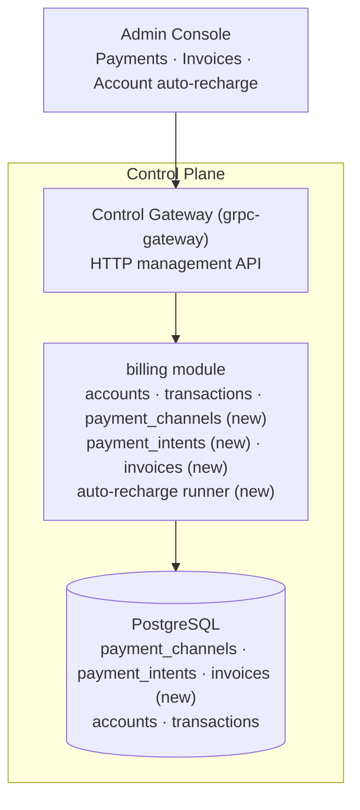
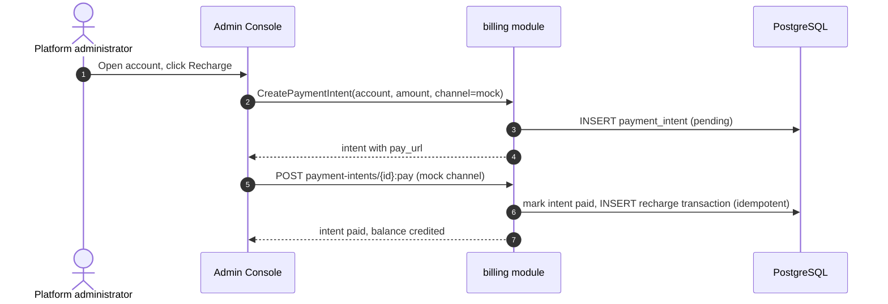
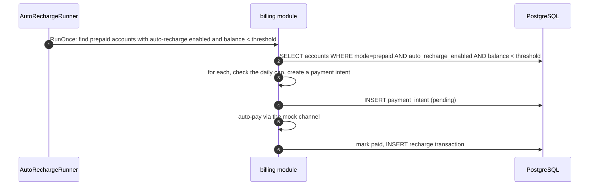

# Payments, Invoices & Auto-Recharge — Architecture and Detailed Design

| Attribute | Content |
| --- | --- |
| Feature point | Payments, invoices & auto-recharge |
| Document scope | Architecture and detailed design for feature-14: the payment channel registry with a mock channel, the idempotent payment-intent flow, invoice generation and download from settled bills, and per-account auto-recharge threshold rules with a daily cap, building on the balance-quota account core (feature #8) |
| Owning modules | `billing` (payment channels, payment intents, invoices, auto-recharge runner), `web` (admin console payment/invoice pages) |
| Related documents | [Requirement Analysis and UI/UX Design](../design/payments-invoices-auto-recharge.md) · [Balance (Prepaid) & Quota (Postpaid)](./balance-quota.md) — the account core this feature builds on (its non-goals defer payments, invoices and auto-recharge here) · [Model × Card-Type Price Matrix & Tiered Pricing](./pricing.md) — the charge engine and bills this feature invoices |
| Status | Architecture complete, handed to the Developer agent |

---

## 1. Overview and Goals

Feature #8 delivered the account core: per-organization prepaid/postpaid accounts, recharge and refund with idempotency keys, settlement-time deduction, inference gating, and an append-only transaction ledger. What the platform still cannot do is take money in automatically. This feature adds the payment surface: **payment channels** (a way to fund a prepaid account), **invoices** (a per-period billing document an organization can download), and **auto-recharge** (a threshold rule that tops up a prepaid account automatically).

**Goals**: a payment channel registry with a mock channel; the payment-intent flow (create → pay → idempotent credit); invoice generation and download from settled bills; per-account auto-recharge threshold rules with a daily cap; console pages for payments, invoices, and auto-recharge configuration; activation of the new error codes.

**Non-goals** (deferred): real PSP adapters (Stripe/Alipay/WeChat); refunds through the payment channel (feature #8's `Refund` stays the mechanism); multi-currency and FX; dunning and collections; tenant self-service payment (admin surface only in v1); invoice email delivery.

## 2. Architecture Decisions

| # | Decision | Rationale |
| --- | --- | --- |
| AD1 | **Payment channels are a pluggable registry** — a `payment_channels` table (channel id, type, display name, config, enabled) and a `PaymentIntent` flow: `CreatePaymentIntent` → channel redirect/QR → channel callback → idempotent credit. v1 ships a **mock channel** (`mock`) that is always available and auto-pays on a `:pay` callback | The flow is the valuable part; a mock channel makes it testable end-to-end in the compose stack (design D1) |
| AD2 | **A payment intent credits the account exactly once** — `payment_intents` table (intent id, account id, amount cents, channel, status, idempotency key, reference, created/paid/expired timestamps); the channel callback marks it paid and writes one `recharge` transaction (reusing feature #8's idempotency-key mechanism) | Mirrors feature #8's recharge idempotency; a retried callback cannot double-credit (design D2) |
| AD3 | **Invoices are derived from bills** — `invoices` table (invoice id, bill id, organization id, period, total cents, currency, status, issued/paid timestamps, download URL); `ListInvoices`/`GetInvoice`/`DownloadInvoice` RPCs. An invoice is generated from a settled bill on demand (or by a runner) and is a presentable rendering of it | The bill is the source of truth; the invoice is a presentation layer over it (design D3) |
| AD4 | **Auto-recharge is a per-account threshold rule** — `auto_recharge` fields on the account (enabled, threshold_cents, topup_cents, daily_cap_cents); a runner checks prepaid accounts and issues a payment intent when the balance falls below the threshold, bounded by the daily cap | Bounded, predictable top-up; the daily cap prevents runaway spend (design D4) |
| AD5 | **New error codes** — `CodePaymentChannelInvalid`, `CodePaymentIntentInvalid`, `CodeInvoiceNotFound`, `CodeAutoRechargeInvalid` | Validation vs not-found stay distinct, mirroring the feature #8 pattern (design D5) |
| AD6 | **The mock channel is a first-class citizen** — it is seeded at startup, always enabled, and its `:pay` callback is a synchronous, idempotent credit. Real PSP adapters implement the same `PaymentChannel` interface | The interface is the contract; the mock proves it and keeps the compose stack self-contained |

## 3. Component Design

| Component | Responsibility in this feature |
| --- | --- |
| Control Gateway (`grpc-gateway`) | HTTP/JSON facade for the payment/invoice RPCs under `/api/v1/admin/billing`; passes `X-Organization-Id` through as gRPC metadata |
| `billing` module (`services/billing`) | Payment channel registry, payment-intent flow, invoice generation/download, auto-recharge runner |
| PostgreSQL | `payment_channels`, `payment_intents`, `invoices` tables (new); `accounts`/`transactions` gain auto-recharge fields |
| Console | Payments page, Invoices page, auto-recharge controls on the account detail page |

### 3.1 File Layout and Function-Level Responsibilities

| Module | File | Contents |
| --- | --- | --- |
| `services/billing` | `payment_model.go` | GORM models `PaymentChannel`, `PaymentIntent`, `Invoice` + `TableName` |
| | `payment_repository.go` | `PaymentRepository`: `ListChannels`, `FindChannel`, `CreateIntent`, `FindIntentByID`, `MarkIntentPaid` (idempotent, one tx: mark paid + write recharge transaction via the account repo), `ListIntents` |
| | `payment_service.go` | RPCs: `CreatePaymentChannel`, `ListPaymentChannels`, `EnablePaymentChannel`, `DisablePaymentChannel`, `CreatePaymentIntent`, `PayPaymentIntent` (mock channel), `ListPaymentIntents` |
| | `invoice_repository.go` | `InvoiceRepository`: `GenerateFromBill` (idempotent: one invoice per bill), `FindInvoiceByID`, `ListInvoices`, `DownloadInvoice` |
| | `invoice_service.go` | RPCs: `GenerateInvoice`, `ListInvoices`, `GetInvoice`, `DownloadInvoice` |
| | `auto_recharge_runner.go` | `AutoRechargeRunner` (server.Runner, ticker) + `RunOnce(ctx)` extracted for tests; checks prepaid accounts with auto-recharge enabled, issues a payment intent bounded by the daily cap, auto-pays via the mock channel |
| | `account_model.go` | `Account` gains auto-recharge fields: `AutoRechargeEnabled`, `AutoRechargeThresholdCents`, `AutoRechargeTopupCents`, `AutoRechargeDailyCapCents` |
| `proto/taas/billing/v1` | `billing.proto` | Additive: payment/invoice RPCs and messages (Section 5) |
| `pkg/errors` + `pkg/config` | `codes.go`/`messages.go`; `api.go`/`configuration.go` | New error codes; `BillingAutoRechargeConfig{Enabled, Interval}` under `billing.autoRecharge` |
| `apps/taas-server` + `web/src` + `test` | `main.go`; `pages/BillingPaymentsPage.tsx`, `pages/BillingInvoicesPage.tsx`, `pages/AccountsPage.tsx`; `fvt/payments_invoices_fvt_test.go`/`e2e/tests/paymentsInvoices.js` | Auto-recharge runner registration after `srv.Init()`; console pages; Section 8 |

### 3.2 Configuration Additions

| Key | Default | Description |
| --- | --- | --- |
| `billing.autoRecharge.enabled` | `true` | Whether the auto-recharge runner runs |
| `billing.autoRecharge.interval` | `1m` | The runner's tick interval |

### 3.3 Console Contract (pinned for the Developer agent)

| Page / component | Purpose | Key testids |
| --- | --- | --- |
| **Payments page** (`/admin/billing/payments`) | Channel list, payment intents, create-intent dialog, mock "simulate payment" | `payments-table`, `payment-intent-row-{id}`, `create-payment-intent`, `payment-intent-amount`, `payment-intent-channel`, `payment-intent-pay-{id}`, `payment-intent-status-{id}` |
| **Invoices page** (`/admin/billing/invoices`) | Invoice list, generate-from-bill dialog, download | `invoices-table`, `invoice-row-{id}`, `generate-invoice`, `invoice-bill-select`, `invoice-download-{id}` |
| **Account detail** | Auto-recharge controls | `auto-recharge-toggle`, `auto-recharge-threshold`, `auto-recharge-topup`, `auto-recharge-cap`, `auto-recharge-save` |

## 4. Data Model

### 4.1 The `payment_channels` Table

| Column | PostgreSQL type | Constraints | Description |
| --- | --- | --- | --- |
| `id` | `varchar(64)` | PRIMARY KEY | Channel id (`mock`) |
| `type` | `varchar(32)` | NOT NULL | `mock` (real PSP types follow) |
| `display_name` | `varchar(128)` | NOT NULL | Human-readable name |
| `config` | `text` | | JSON config (empty for mock) |
| `enabled` | `boolean` | NOT NULL default true | Whether the channel accepts new intents |
| `created_at` | `timestamptz` | NOT NULL | Creation time |

### 4.2 The `payment_intents` Table

| Column | PostgreSQL type | Constraints | Description |
| --- | --- | --- | --- |
| `id` | `uuid` | PRIMARY KEY | Server-generated UUID v4 |
| `account_id` | `uuid` | NOT NULL, index | The funded account |
| `amount_cents` | `bigint` | NOT NULL, > 0 | The payment amount |
| `channel` | `varchar(64)` | NOT NULL | The channel id |
| `status` | `varchar(16)` | NOT NULL | `pending` / `paid` / `failed` / `expired` |
| `idempotency_key` | `varchar(128)` | NOT NULL, unique | Replay guard |
| `reference` | `varchar(255)` | | Free-text note |
| `created_at` | `timestamptz` | NOT NULL | Creation time |
| `paid_at` | `timestamptz` | | When paid |

### 4.3 The `invoices` Table

| Column | PostgreSQL type | Constraints | Description |
| --- | --- | --- | --- |
| `id` | `uuid` | PRIMARY KEY | Server-generated UUID v4 |
| `bill_id` | `uuid` | NOT NULL, unique | The source bill (one invoice per bill) |
| `organization_id` | `varchar(64)` | NOT NULL, index | The billed org |
| `period_start` | `bigint` | NOT NULL | Bill period start (unix) |
| `period_end` | `bigint` | NOT NULL | Bill period end (unix) |
| `total_cents` | `bigint` | NOT NULL | The bill total |
| `currency` | `varchar(8)` | NOT NULL | Platform currency |
| `status` | `varchar(16)` | NOT NULL | `issued` / `paid` |
| `issued_at` | `timestamptz` | NOT NULL | Issue time |
| `paid_at` | `timestamptz` | | When paid |

### 4.4 Account auto-recharge fields

`accounts` gains: `auto_recharge_enabled` (bool), `auto_recharge_threshold_cents` (bigint), `auto_recharge_topup_cents` (bigint), `auto_recharge_daily_cap_cents` (bigint). All default 0/false; a postpaid account ignores them.

## 5. API Design

All RPCs belong to **`taas.billing.v1.BillingService`**, served under `/api/v1/admin/billing/*` (admin surface).

| RPC | HTTP | Status | Purpose |
| --- | --- | --- | --- |
| `CreatePaymentChannel` | `POST /api/v1/admin/billing/payment-channels` | **new** | Register a channel |
| `ListPaymentChannels` | `GET /api/v1/admin/billing/payment-channels` | **new** | List channels |
| `EnablePaymentChannel` | `POST .../payment-channels/{channel_id}:enable` | **new** | Enable |
| `DisablePaymentChannel` | `POST .../payment-channels/{channel_id}:disable` | **new** | Disable |
| `CreatePaymentIntent` | `POST /api/v1/admin/billing/payment-intents` | **new** | Create an intent |
| `PayPaymentIntent` | `POST .../payment-intents/{intent_id}:pay` | **new** | Mock-channel pay |
| `ListPaymentIntents` | `GET /api/v1/admin/billing/payment-intents` | **new** | List intents |
| `GenerateInvoice` | `POST /api/v1/admin/billing/invoices` | **new** | Generate from a bill |
| `ListInvoices` | `GET /api/v1/admin/billing/invoices` | **new** | List invoices |
| `GetInvoice` | `GET .../invoices/{invoice_id}` | **new** | One invoice |
| `DownloadInvoice` | `GET .../invoices/{invoice_id}:download` | **new** | Download the document |

## 6. Sequence Flows

### 6.1 Payment intent (mock channel)

### 6.2 Auto-recharge

## 7. Error Handling

| Condition | Code | Constant |
| --- | --- | --- |
| Unknown/disabled payment channel | **10511** | `CodePaymentChannelInvalid` |
| Invalid payment intent (non-positive amount, unknown account, idempotency reuse) | **10512** | `CodePaymentIntentInvalid` |
| Unknown invoice | **10513** | `CodeInvoiceNotFound` |
| Invalid auto-recharge rule (negative threshold/topup/cap) | **10514** | `CodeAutoRechargeInvalid` |

## 8. Acceptance-Criteria Traceability

| AC | Mechanism | Verification |
| --- | --- | --- |
| AC1 Create intent, not yet credited | `CreatePaymentIntent` inserts a `pending` intent; no recharge transaction | Unit + FVT |
| AC2 Mock pay credits exactly once | `PayPaymentIntent` marks paid and writes one recharge transaction | Unit + FVT |
| AC3 Retried callback is idempotent | the intent's status guard + the recharge idempotency key | Unit |
| AC4 Generate invoice from bill, idempotent | `GenerateInvoice` one invoice per bill (unique bill_id) | Unit + FVT |
| AC5 Download returns a document | `DownloadInvoice` returns a JSON/HTML rendering | FVT |
| AC6 Auto-recharge bounded by daily cap | `AutoRechargeRunner.RunOnce` issues intents bounded by the cap | Unit + FVT |
| AC7 Payments page renders | console Payments page | E2E |
| AC8 Invoices page renders | console Invoices page | E2E |
| AC9 Auto-recharge controls render | account detail page | E2E |

## 9. Rollout and Upgrade Notes

1. **Deploy order**: one binary (`taas-server`). Proto regeneration, the new tables (AutoMigrate), the runner and the console ship together.
2. **Database**: three new tables (`payment_channels`, `payment_intents`, `invoices`) and four new `accounts` columns via GORM AutoMigrate (additive). No hand-written DDL is kept (the repo convention).
3. **Seeding**: the mock channel is seeded at startup if absent (the image-registry first-boot pattern).
4. **Backward compatibility**: existing accounts have auto-recharge disabled by default; no behavior changes until an operator enables it.