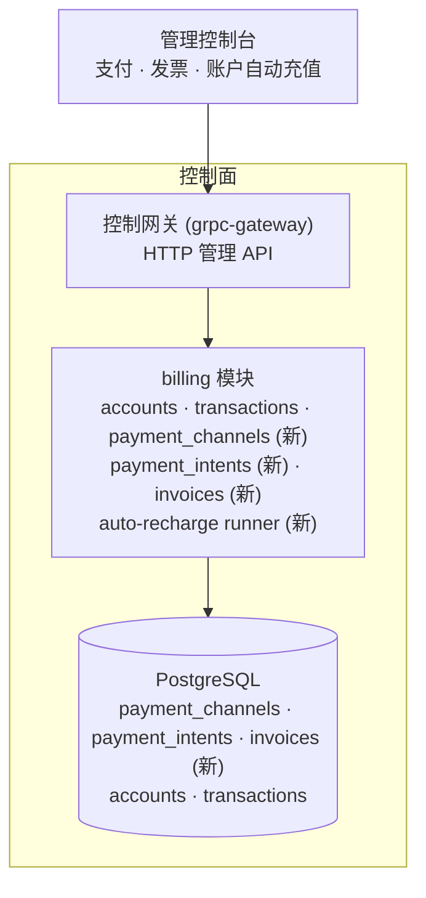
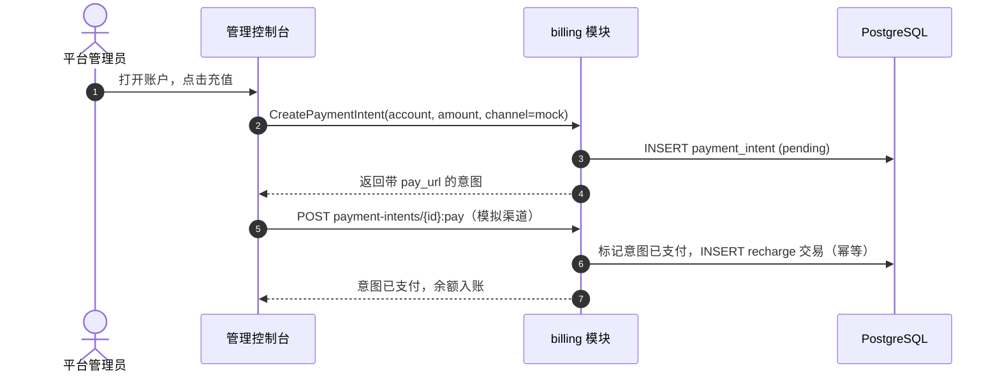
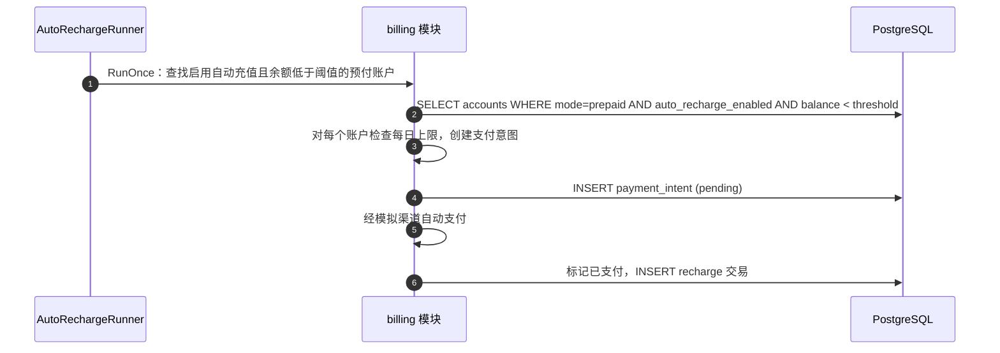

# 支付、发票与自动充值 — 架构与详细设计

| 属性 | 内容 |
| --- | --- |
| 功能点 | 支付、发票与自动充值 |
| 文档范围 | 功能 #14 的架构与详细设计：带模拟渠道的支付渠道注册表、幂等的支付意图流程、从已结算账单生成并下载发票、以及带每日上限的按账户自动充值阈值规则，构建在余额/配额账户核心（功能 #8）之上 |
| 所属模块 | `billing`（支付渠道、支付意图、发票、自动充值 runner）、`web`（管理控制台支付/发票页面） |
| 相关文档 | [需求分析与 UI/UX 设计](../design/payments-invoices-auto-recharge.md) · [余额（预付）与配额（后付）](./balance-quota.md) — 本功能构建的账户核心（其非目标将支付、发票与自动充值延后至此）· [模型 × 卡型价格矩阵与阶梯定价](./pricing.md) — 本功能开票所依据的计费引擎与账单 |
| 状态 | 架构完成，已交付开发者 agent |

---

## 1. 概述与目标

功能 #8 交付了账户核心：按组织的预付/后付账户、带幂等键的充值与退款、结算时扣款、推理门控，以及只追加的交易台账。平台仍然无法做到的是自动收款。本功能增加支付面：**支付渠道**（为预付账户注资的方式）、**发票**（组织可下载的按周期计费单据）、以及**自动充值**（当余额低于阈值时自动为预付账户充值）。

**目标**：带模拟渠道的支付渠道注册表；支付意图流程（创建 → 支付 → 幂等入账）；从已结算账单生成并下载发票；按账户的自动充值阈值规则与每日上限；支付、发票与自动充值配置的控制台页面；激活新增错误码。

**非目标**（延后）：真实 PSP 适配器（Stripe/支付宝/微信）；通过支付渠道退款（功能 #8 的 `Refund` 仍是机制）；多币种与 FX；催收；租户自助支付（v1 仅管理面）；发票邮件投递。

## 2. 架构决策

| # | 决策 | 理由 |
| --- | --- | --- |
| AD1 | **支付渠道是可插拔注册表** —— `payment_channels` 表（渠道 id、类型、显示名、配置、启用状态）与 `PaymentIntent` 流程：`CreatePaymentIntent` → 渠道跳转/二维码 → 渠道回调 → 幂等入账。v1 内置一个**模拟渠道**（`mock`），始终可用，并在 `:pay` 回调时自动支付 | 流程本身才是价值所在；模拟渠道让它在 compose 栈中端到端可测（设计 D1） |
| AD2 | **支付意图恰好入账一次** —— `payment_intents` 表（意图 id、账户 id、金额分、渠道、状态、幂等键、引用、创建/支付/过期时间戳）；渠道回调将其标记为已支付并写入一条 `recharge` 交易（复用功能 #8 的幂等键机制） | 镜像功能 #8 的充值幂等；重试的回调不会重复入账（设计 D2） |
| AD3 | **发票由账单派生** —— `invoices` 表（发票 id、账单 id、组织 id、周期、总金额分、币种、状态、开具/支付时间戳、下载 URL）；`ListInvoices`/`GetInvoice`/`DownloadInvoice` RPC。发票按需（或由 runner）从已结算账单生成，是其可展示的呈现 | 账单是事实来源；发票是其上的呈现层（设计 D3） |
| AD4 | **自动充值是一条按账户的阈值规则** —— 账户上的 `auto_recharge` 字段（启用、阈值分、充值分、每日上限分）；runner 检查预付账户，当余额低于阈值时发起支付意图，受每日上限约束 | 有界、可预测的充值；每日上限防止失控支出（设计 D4） |
| AD5 | **新增错误码** —— `CodePaymentChannelInvalid`、`CodePaymentIntentInvalid`、`CodeInvoiceNotFound`、`CodeAutoRechargeInvalid` | 校验与不存在保持区分，镜像功能 #8 的模式（设计 D5） |
| AD6 | **模拟渠道是一等公民** —— 启动时播种、始终启用，其 `:pay` 回调是同步、幂等的入账。真实 PSP 适配器实现同一 `PaymentChannel` 接口 | 接口即契约；模拟渠道证明它并保持 compose 栈自包含 |

## 3. 组件设计

| 组件 | 在本功能中的职责 |
| --- | --- |
| 控制网关（`grpc-gateway`） | 支付/发票 RPC 在 `/api/v1/admin/billing` 下的 HTTP/JSON 门面；透传 `X-Organization-Id` 为 gRPC metadata |
| `billing` 模块（`services/billing`） | 支付渠道注册表、支付意图流程、发票生成/下载、自动充值 runner |
| PostgreSQL | `payment_channels`、`payment_intents`、`invoices` 表（新）；`accounts`/`transactions` 增加自动充值字段 |
| 控制台 | 支付页、发票页、账户详情页上的自动充值控件 |

### 3.1 文件布局与函数级职责

| 模块 | 文件 | 内容 |
| --- | --- | --- |
| `services/billing` | `payment_model.go` | GORM 模型 `PaymentChannel`、`PaymentIntent`、`Invoice` + `TableName` |
| | `payment_repository.go` | `PaymentRepository`：`ListChannels`、`FindChannel`、`CreateIntent`、`FindIntentByID`、`MarkIntentPaid`（幂等，单事务：标记已支付 + 经账户仓库写入 recharge 交易）、`ListIntents` |
| | `payment_service.go` | RPC：`CreatePaymentChannel`、`ListPaymentChannels`、`EnablePaymentChannel`、`DisablePaymentChannel`、`CreatePaymentIntent`、`PayPaymentIntent`（模拟渠道）、`ListPaymentIntents` |
| | `invoice_repository.go` | `InvoiceRepository`：`GenerateFromBill`（幂等：每张账单一张发票）、`FindInvoiceByID`、`ListInvoices`、`DownloadInvoice` |
| | `invoice_service.go` | RPC：`GenerateInvoice`、`ListInvoices`、`GetInvoice`、`DownloadInvoice` |
| | `auto_recharge_runner.go` | `AutoRechargeRunner`（server.Runner，ticker）+ 为测试抽取的 `RunOnce(ctx)`；检查启用自动充值的预付账户，发起受每日上限约束的支付意图，经模拟渠道自动支付 |
| | `account_model.go` | `Account` 增加自动充值字段：`AutoRechargeEnabled`、`AutoRechargeThresholdCents`、`AutoRechargeTopupCents`、`AutoRechargeDailyCapCents` |
| `proto/taas/billing/v1` | `billing.proto` | 新增：支付/发票 RPC 与消息（第 5 节） |
| `pkg/errors` + `pkg/config` | `codes.go`/`messages.go`；`api.go`/`configuration.go` | 新增错误码；`billing.autoRecharge` 下的 `BillingAutoRechargeConfig{Enabled, Interval}` |
| `apps/taas-server` + `web/src` + `test` | `main.go`；`pages/BillingPaymentsPage.tsx`、`pages/BillingInvoicesPage.tsx`、`pages/AccountsPage.tsx`；`fvt/payments_invoices_fvt_test.go`/`e2e/tests/paymentsInvoices.js` | `srv.Init()` 后注册自动充值 runner；控制台页面；第 8 节 |

### 3.2 配置新增

| 键 | 默认 | 描述 |
| --- | --- | --- |
| `billing.autoRecharge.enabled` | `true` | 自动充值 runner 是否运行 |
| `billing.autoRecharge.interval` | `1m` | runner 的 tick 间隔 |

### 3.3 控制台约定（为开发者 agent 钉死）

| 页面 / 组件 | 用途 | 关键 testid |
| --- | --- | --- |
| **支付页**（`/admin/billing/payments`） | 渠道列表、支付意图、创建意图对话框、模拟"模拟支付" | `payments-table`、`payment-intent-row-{id}`、`create-payment-intent`、`payment-intent-amount`、`payment-intent-channel`、`payment-intent-pay-{id}`、`payment-intent-status-{id}` |
| **发票页**（`/admin/billing/invoices`） | 发票列表、从账单生成对话框、下载 | `invoices-table`、`invoice-row-{id}`、`generate-invoice`、`invoice-bill-select`、`invoice-download-{id}` |
| **账户详情** | 自动充值控件 | `auto-recharge-toggle`、`auto-recharge-threshold`、`auto-recharge-topup`、`auto-recharge-cap`、`auto-recharge-save` |

## 4. 数据模型

### 4.1 `payment_channels` 表

| 列 | PostgreSQL 类型 | 约束 | 描述 |
| --- | --- | --- | --- |
| `id` | `varchar(64)` | PRIMARY KEY | 渠道 id（`mock`） |
| `type` | `varchar(32)` | NOT NULL | `mock`（真实 PSP 类型随后） |
| `display_name` | `varchar(128)` | NOT NULL | 人类可读名称 |
| `config` | `text` | | JSON 配置（mock 为空） |
| `enabled` | `boolean` | NOT NULL 默认 true | 渠道是否接受新意图 |
| `created_at` | `timestamptz` | NOT NULL | 创建时间 |

### 4.2 `payment_intents` 表

| 列 | PostgreSQL 类型 | 约束 | 描述 |
| --- | --- | --- | --- |
| `id` | `uuid` | PRIMARY KEY | 服务端生成的 UUID v4 |
| `account_id` | `uuid` | NOT NULL，索引 | 被注资的账户 |
| `amount_cents` | `bigint` | NOT NULL，> 0 | 支付金额 |
| `channel` | `varchar(64)` | NOT NULL | 渠道 id |
| `status` | `varchar(16)` | NOT NULL | `pending` / `paid` / `failed` / `expired` |
| `idempotency_key` | `varchar(128)` | NOT NULL，唯一 | 重放防护 |
| `reference` | `varchar(255)` | | 自由文本备注 |
| `created_at` | `timestamptz` | NOT NULL | 创建时间 |
| `paid_at` | `timestamptz` | | 支付时间 |

### 4.3 `invoices` 表

| 列 | PostgreSQL 类型 | 约束 | 描述 |
| --- | --- | --- | --- |
| `id` | `uuid` | PRIMARY KEY | 服务端生成的 UUID v4 |
| `bill_id` | `uuid` | NOT NULL，唯一 | 源账单（每张账单一张发票） |
| `organization_id` | `varchar(64)` | NOT NULL，索引 | 被开票的组织 |
| `period_start` | `bigint` | NOT NULL | 账单周期开始（unix） |
| `period_end` | `bigint` | NOT NULL | 账单周期结束（unix） |
| `total_cents` | `bigint` | NOT NULL | 账单总额 |
| `currency` | `varchar(8)` | NOT NULL | 平台币种 |
| `status` | `varchar(16)` | NOT NULL | `issued` / `paid` |
| `issued_at` | `timestamptz` | NOT NULL | 开具时间 |
| `paid_at` | `timestamptz` | | 支付时间 |

### 4.4 账户自动充值字段

`accounts` 增加：`auto_recharge_enabled`（bool）、`auto_recharge_threshold_cents`（bigint）、`auto_recharge_topup_cents`（bigint）、`auto_recharge_daily_cap_cents`（bigint）。全部默认 0/false；后付账户忽略它们。

## 5. API 设计

所有 RPC 属于 **`taas.billing.v1.BillingService`**，在 `/api/v1/admin/billing/*` 下提供（管理面）。

| RPC | HTTP | 状态 | 用途 |
| --- | --- | --- | --- |
| `CreatePaymentChannel` | `POST /api/v1/admin/billing/payment-channels` | **新** | 注册渠道 |
| `ListPaymentChannels` | `GET /api/v1/admin/billing/payment-channels` | **新** | 列出渠道 |
| `EnablePaymentChannel` | `POST .../payment-channels/{channel_id}:enable` | **新** | 启用 |
| `DisablePaymentChannel` | `POST .../payment-channels/{channel_id}:disable` | **新** | 停用 |
| `CreatePaymentIntent` | `POST /api/v1/admin/billing/payment-intents` | **新** | 创建意图 |
| `PayPaymentIntent` | `POST .../payment-intents/{intent_id}:pay` | **新** | 模拟渠道支付 |
| `ListPaymentIntents` | `GET /api/v1/admin/billing/payment-intents` | **新** | 列出意图 |
| `GenerateInvoice` | `POST /api/v1/admin/billing/invoices` | **新** | 从账单生成 |
| `ListInvoices` | `GET /api/v1/admin/billing/invoices` | **新** | 列出发票 |
| `GetInvoice` | `GET .../invoices/{invoice_id}` | **新** | 单张发票 |
| `DownloadInvoice` | `GET .../invoices/{invoice_id}:download` | **新** | 下载文档 |

## 6. 时序流程

### 6.1 支付意图（模拟渠道）

### 6.2 自动充值

## 7. 错误处理

| 条件 | 码 | 常量 |
| --- | --- | --- |
| 未知/停用的支付渠道 | **10511** | `CodePaymentChannelInvalid` |
| 无效支付意图（非正金额、未知账户、幂等键复用） | **10512** | `CodePaymentIntentInvalid` |
| 未知发票 | **10513** | `CodeInvoiceNotFound` |
| 无效自动充值规则（负阈值/充值/上限） | **10514** | `CodeAutoRechargeInvalid` |

## 8. 验收标准可追溯性

| AC | 机制 | 验证 |
| --- | --- | --- |
| AC1 创建意图，尚未入账 | `CreatePaymentIntent` 插入 `pending` 意图；无 recharge 交易 | 单元 + FVT |
| AC2 模拟支付恰好入账一次 | `PayPaymentIntent` 标记已支付并写入一条 recharge 交易 | 单元 + FVT |
| AC3 重试回调幂等 | 意图状态守卫 + recharge 幂等键 | 单元 |
| AC4 从账单生成发票，幂等 | `GenerateInvoice` 每张账单一张发票（bill_id 唯一） | 单元 + FVT |
| AC5 下载返回文档 | `DownloadInvoice` 返回 JSON/HTML 呈现 | FVT |
| AC6 自动充值受每日上限约束 | `AutoRechargeRunner.RunOnce` 发起受上限约束的意图 | 单元 + FVT |
| AC7 支付页渲染 | 控制台支付页 | E2E |
| AC8 发票页渲染 | 控制台发票页 | E2E |
| AC9 自动充值控件渲染 | 账户详情页 | E2E |

## 9. 发布与升级说明

1. **部署顺序**：单一二进制（`taas-server`）。proto 重新生成、新表（AutoMigrate）、runner 与控制台一起发布。
2. **数据库**：三张新表（`payment_channels`、`payment_intents`、`invoices`）与四个新 `accounts` 列，经 GORM AutoMigrate（增量）。不保留手写 DDL（仓库约定）。
3. **播种**：启动时若 mock 渠道不存在则播种（镜像注册表首次启动模式）。
4. **向后兼容**：现有账户默认禁用自动充值；在运维启用前无行为变化。