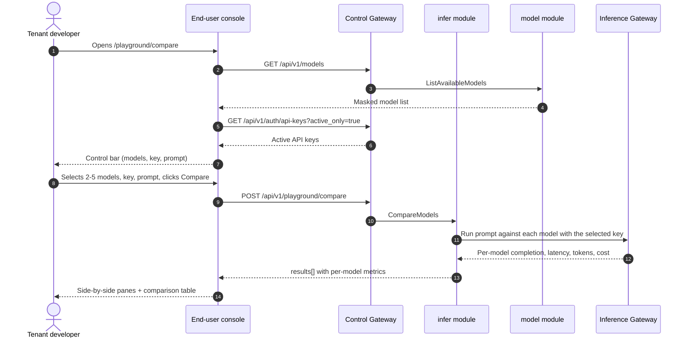

# Model Playground Comparison — Architecture and Detailed Design

| Attribute | Content |
| --- | --- |
| Feature point | Model playground comparison — compare multiple models side by side on the same prompt, with latency/token/cost per model and a comparison table (backlog row 35) |
| Document scope | Architecture and detailed design for feature-35: the `CompareModels` RPC on `InferServiceService`, the end-user Playground Compare page (`/playground/compare`), plus error handling, configuration, security, rollout, and function-level design per layer |
| Owning modules | `infer` (the compare RPC that runs the same prompt against multiple models and returns per-model latency/token/cost), `model` (read-only: the masked user-realm catalog the compare page's model selector draws from), `auth` (read-only: the active API keys the compare page offers), `web` end-user console (`PlaygroundComparePage`) |
| Related documents | [Requirement Analysis and UI/UX Design](../design/playground-comparison.md) · [Architecture Design](../design/architecture.md) §2.4 (`infer`), §3.1 (admin/user surface separation) · [Console Surface Separation](./console-surface-separation.md) (the end-user playground, the `UserShell` conventions, the masked-projection rule) · [Request Logs & API Playground](./request-logs-playground.md) (the existing model-based playground this feature extends into a multi-model comparison) · [Usage Dashboards & Per-Request Cost Attribution](./usage-dashboard.md) (the cost-attribution model this feature's per-model cost column draws from) |
| Status | Architecture complete, handed to the Developer agent |

---

## 1. Overview and Goals

The end-user playground (feature #12, D14) lets a tenant send a prompt to a single model through `POST /api/v1/models/{model_id}:playground` and see the completion, token usage, and latency. What the tenant still cannot do is **choose between models**: when an Agent's developer wants to pick the best model for a task, they must run the same prompt against each model one at a time and compare the results by hand. There is no side-by-side view of latency, token usage, and cost across models on the same prompt.

This feature adds a **model playground comparison**: compare multiple models side by side on the same prompt, with latency/token/cost per model and a comparison table.

**Goals**:

- A `CompareModels` RPC running the same prompt against multiple models (2–5) and returning per-model completion, latency, token usage, and cost in a single call.
- Each comparison call goes through the real metered path (D3): the calls appear in usage and request logs.
- An end-user Playground Compare page (`/playground/compare`) with a multi-model selector, shared prompt editor, side-by-side completion panes, and a comparison table.
- New error codes in a playground-comparison block (119xx).
- The page → route → API-prefix table with the exact user prefix; per-page interactive states including empty, error, and permission-denied; numbered acceptance criteria testable in Nightwatch against the compose stack.

**Non-goals** (deferred, design §8): the single-model playground (#12); request-level traces (#27); cost analytics dashboards (#29); a full evaluation harness or benchmark suite (deliberately absent, D6); an admin-surface comparison (D1).

### 1.1 Reading order of this document

Section 2 records the architecture decisions (AD1–AD6, mirroring the design's D1–D6). Sections 3–5 are the component view, data model, and API design. Section 6 is the frontend architecture (page → route → API-prefix table, auth guard). Sections 7–8 are the sequence flows and error handling. Sections 9–11 are configuration, security, and rollout. Sections 12–14 are the acceptance-criteria traceability, the function-level detailed design, and the ordered implementation task list.

---

## 2. Architecture Decisions

| # | Decision | Rationale |
| --- | --- | --- |
| AD1 | **The playground comparison lives on the end-user surface only**: `/playground/compare` + `/api/v1/playground/compare`. There is **no admin surface** — model selection is a tenant task (which model should my Agent use), not an operator task | Design D1. The tenant picks models for its Agents; the operator manages the catalog and deployment (admin surface). Consistent with the end-user playground (feature #12, D14) being model-based |
| AD2 | **A new `CompareModels` RPC** runs the same prompt against multiple models and returns per-model completion, latency, token usage, and cost in a single call | Design D2. The comparison needs several models' results at once; a dedicated RPC keeps the multi-model concern out of the single-model `PlaygroundInfer` surface and gives it one home |
| AD3 | **Each comparison call goes through the real metered path** — `CompareModels` resolves a ready service for each model, infers with the selected key, and returns the metered cost; the calls are visible in usage and request logs | Design D3. The comparison must exercise the real inference path so the cost column is real and the calls are auditable (feature #12 D5/D14 pattern) |
| AD4 | **The cost column is the actual metered cost** of each prompt, not a static per-M-token price | Design D4. The tenant needs the real economics of the prompt (pattern 2); a static price would be misleading (pitfall) |
| AD5 | **The page is a side-by-side pane layout plus a comparison table** — each selected model gets a completion pane with latency/tokens/cost, and a summary table aggregates the metrics for quick scanning | Design D5. Side-by-side panes are the core interaction (pattern 1); the table complements them for scanning (pattern 3) |
| AD6 | **The model selector draws from the masked user-realm catalog** (`GET /api/v1/models`) and the key selector from the tenant's active API keys (`GET /api/v1/auth/api-keys?active_only=true`), exactly as the existing playground does | Design D6. The tenant picks models and keys from the same masked sources as the existing playground (feature #17 D15); no operator internals leak |

---

## 3. Component View

### 3.1 Ownership

| Layer / component | Owns | Changes in this feature |
| --- | --- | --- |
| **Control Gateway (`grpc-gateway`)** | HTTP/JSON facade for the `CompareModels` RPC; realm guard (feature #17) already rejects a wrong-realm session with 10038; passes `X-Organization-Id` through as gRPC metadata | New binding for `CompareModels` (Section 5); no change to the realm guard |
| **`infer` module (`services/infer`)** | The `CompareModels` RPC: resolves a ready service for each model, infers with the selected key, returns per-model completion/latency/tokens/cost | New RPC on the existing `InferServiceService` (AD2, AD3) |
| **`model` module** | The masked user-realm catalog | Read-only: the compare page's model selector draws from `GET /api/v1/models` (AD6) |
| **`auth` module** | API key identity, session realm, session active org | Read-only: the compare page's key selector draws from `GET /api/v1/auth/api-keys?active_only=true` (AD6) |
| **PostgreSQL** | `inference_services`, `usage_records`, `charge_records` (existing) | No new tables |
| **Console** | End-user Playground Compare page | One new page on the end-user surface (Section 6) |

### 3.2 Runtime component view

```mermaid
flowchart TD
    subgraph browsers["Browsers"]
        UC["End-user console<br/>/playground/compare<br/>key go-taas.user.session-token"]
    end

    subgraph gateway["taas-server HTTP (one port)"]
        GUARD["RealmGuard<br/>/api/v1/* = user realm"]
        MUX["grpc-gateway mux<br/>google.api.http bindings"]
        ERR["gatewayErrorHandler<br/>code message envelope"]
    end

    subgraph services["gRPC services"]
        INF["infer<br/>CompareModels"]
        MOD["model<br/>masked catalog"]
        AUTH["auth<br/>api keys sessions"]
    end

    subgraph dp["Data Plane"]
        GW["Inference Gateway<br/>Envoy + Wasm"]
    end

    UC -->|"/api/v1/playground/compare"| GUARD
    GUARD --> MUX
    MUX --> ERR
    MUX --> INF
    MUX --> MOD
    MUX --> AUTH
    INF -->|"resolve ready service, infer with key"| GW
```



### 3.3 Request identity chain

The compare RPC is **end-user surface** (AD1). The chain is:

1. `RealmGuard` (HTTP, `pkg/server/realm.go`) — path prefix `/api/v1/playground/*` decides the expected realm `user`. With no `Authorization` header: pass through (transitional, feature-17 AD4). With a header: resolve the session realm from Redis; mismatch → 10038, unknown/expired/realm-less → 10027.
2. grpc-gateway mux — routes by the annotated path and forwards `authorization` and `x-organization-id`.
3. Service handler — the `infer` module resolves the caller's organization via `SessionActiveOrg` (the session's active org is authoritative; `X-Organization-Id` is ignored when a session is present). It resolves a ready service for each model, infers with the selected key, and returns the metered cost.
4. `tenancy.RoleGuard` — gates the compare RPC by the caller's role (10036). The permission-denied state (design FR5.1, AC8) is produced by the role check.

---

## 4. Data Model

### 4.1 No New Tables

The playground-comparison feature is a read-only aggregation over the existing inference path (AD3). No new tables, no new MQ subjects, no new runners, and no writes on any path beyond the normal metered inference calls (which produce the existing usage and request-log rows). The `inference_services`, `usage_records`, and `charge_records` tables are read to resolve ready services and the metered cost.

---

## 5. API Design

### 5.1 RPC Surface

One new RPC on `taas.infer.v1.InferServiceService`. It is served as HTTP via the Control Gateway on the **user prefix** `/api/v1/playground/compare` (AD1). There is **no admin-prefix binding** (AD1).

| Service | RPC | HTTP | Status | Purpose |
| --- | --- | --- | --- | --- |
| `taas.infer.v1` | `CompareModels` | `POST /api/v1/playground/compare` | **new** | Run the same prompt against multiple models, return per-model latency/tokens/cost |
| `taas.model.v1` | `ListAvailableModels` | `GET /api/v1/models` | existing | Masked model list for the selector (reused, AD6) |
| `taas.auth.v1` | `ListAPIKeys` | `GET /api/v1/auth/api-keys` | existing | Active API keys for the selector (reused, AD6) |

### 5.2 Proto Messages

```proto
// infer.proto (additive)

// CompareModels runs the same prompt against multiple models and returns
// per-model completion, latency, token usage, and cost in a single call.
// Each comparison call goes through the real metered path.
// User-surface API: served under /api/v1.
rpc CompareModels(CompareModelsRequest) returns (CompareModelsResponse) {
  option (google.api.http) = {
    post: "/api/v1/playground/compare"
    body: "*"
  };
}

message CompareModelsRequest {
  // model_ids is 2-5 models to compare.
  repeated string model_ids = 1;
  // api_key_id is the selected org API key identity.
  string api_key_id = 2;
  string prompt = 3;
}

message CompareModelResult {
  string model_id = 1;
  string model_name = 2;
  string completion = 3;
  int64 latency_ms = 4;
  int64 input_tokens = 5;
  int64 output_tokens = 6;
  // cost is the metered cost of the prompt in integer cents.
  int64 cost = 7;
}

message CompareModelsResponse {
  taas.common.v1.Response response = 1;
  repeated CompareModelResult results = 2;
}
```

### 5.3 Wire Format (established conventions)

- Success responses are HTTP 200 (grpc-gateway default for unary RPCs).
- Business errors render as `{"code": <int>, "message": "..."}` with HTTP 500 for out-of-range codes (platform-wide status quo).
- int64 fields serialize as JSON strings.

### 5.4 Validation Matrix

`CompareModels` validates, in order:

| # | Check | Failure code | Canonical message |
| --- | --- | --- | --- |
| 1 | `model_ids` length in 2–5 | 10404 `CodeMeteringRangeInvalid` | metering range invalid |
| 2 | each `model_id` exists and is available to the caller | 10101 `CodeModelNotFound` | model not found |
| 3 | `api_key_id` exists and belongs to the caller's org | 10007 `CodeAPIKeyNotFound` | api key not found |
| 4 | the key is not blocked by funds/quota | 10502 `CodeInsufficientFunds` | insufficient funds |

### 5.5 Metered Path

`CompareModels` resolves a ready inference service for each model (a non-terminated service in `running` state), infers with the selected key through the data-plane gateway (the real metered path, AD3), and returns the metered cost. The calls appear in usage and request logs for the same organization and key (FR2.1). If a model has no ready service, the per-model result carries an error marker rather than failing the whole comparison (the Developer agent must decide the exact marker shape; the design's AC1/AC2 cover the happy path and the validation errors).

---

## 6. Frontend Architecture

### 6.1 Page → Route → API-Prefix Table

| Page | Surface | Web route | API prefix |
| --- | --- | --- | --- |
| Playground Compare page | end-user | `/playground/compare` | `/api/v1/playground/compare` |
| Model selector source | end-user | `/playground/compare` | `/api/v1/models` |
| Key selector source | end-user | `/playground/compare` | `/api/v1/auth/api-keys` |

Every page and API call is on the **end-user surface**; there is no admin surface (AD1). End-user pages never call a `/api/v1/admin/*` route, and the user session realm is used throughout.

### 6.2 Navigation Placement

The Playground Compare page is reached from the Playground page (`/playground`) via a "Compare" link/tab. It renders inside `UserShell` (feature #17). The nav item is not a top-level entry; it is a sibling of the single-model playground.

### 6.3 Shared Components and State

- `UserShell` (feature #17) — the page shell, session guard, and permission-denied state.
- The model selector and key selector reuse the same masked sources as the existing playground (`GET /api/v1/models`, `GET /api/v1/auth/api-keys?active_only=true`) (AD6).
- Standard multi-select, dropdown, textarea, button, and skeleton components from the existing end-user pages.

### 6.4 Auth Guard per Surface

The page is end-user surface. The `RealmGuard` (feature #17) rejects a wrong-realm session with 10038 and an unknown/expired/realm-less session with 10027. `tenancy.RoleGuard` gates the RPC by the caller's role (10036). The page's permission-denied handling is the standard feature-17 state.

### 6.5 Page: `/playground/compare` — Playground Compare (end-user)

**Purpose**: give a tenant developer a single surface to compare multiple models on the same prompt — pick 2–5 models, run the prompt, and see latency, tokens, and cost side by side.

**Layout**: rendered inside `UserShell`. A page header ("Playground Compare", subtitle "Compare models on the same prompt") with a **Back to Playground** link (secondary). Below:

1. **Control bar** — a **Models** multi-select (2–5, from `GET /api/v1/models`), a **Key** dropdown (from `GET /api/v1/auth/api-keys?active_only=true`), a **Prompt** editor (textarea), and a **Compare** button (primary).
2. **Side-by-side panes** — one completion pane per selected model, each showing the completion, latency, input/output tokens, and cost.
3. **Comparison table** — a summary table with one row per model: **Model**, **Latency**, **Input tokens**, **Output tokens**, **Cost**.

**Interactive states**:

| State | Behaviour |
| --- | --- |
| Default | Control bar renders; panes and table are empty with a hint to select models and write a prompt |
| Loading | Panes show skeletons; Compare is disabled |
| Empty | "Select 2–5 models and write a prompt to compare." with a hint; the control bar stays visible |
| Error | An error banner with the message and a Retry button; the page keeps its last good results with a "Showing stale results" banner |
| Disabled | Compare is disabled until 2–5 models, a key, and a non-empty prompt are chosen; Compare is disabled while a comparison is in flight |
| Permission-denied | A session without the required role receives 10036 and the page shows the standard permission-denied state (feature #17) with a link back to the user home |

**Control bar controls**: Models multi-select (2–5, from `GET /api/v1/models`), Key dropdown (from `GET /api/v1/auth/api-keys?active_only=true`), Prompt textarea, Compare button. Compare is disabled until 2–5 models, a key, and a non-empty prompt are chosen.

**Side-by-side panes**: one pane per selected model, each with the completion text, latency, input/output tokens, and cost. The panes render in a responsive grid.

**Comparison table columns**: Model, Latency, Input tokens, Output tokens, Cost. One row per model; not sortable (the order follows the selection).

---

## 7. Sequence Flows

### 7.1 Compare models



---

## 8. Error Handling

| Condition | Code | Constant | Notes |
| --- | --- | --- | --- |
| Unknown `model_id` | 10101 | `CodeModelNotFound` | `CompareModels` (FR1.3) |
| Unknown `api_key_id` | 10007 | `CodeAPIKeyNotFound` | `CompareModels` (FR1.3) |
| Inference blocked by funds/quota | 10502 | `CodeInsufficientFunds` | `CompareModels` (FR1.3) |
| Fewer than 2 or more than 5 models | 10404 | `CodeMeteringRangeInvalid` | Reused for the model-count validation (FR1.3) |
| Wrong-realm session | 10038 | `CodeRealmMismatch` | gateway realm guard |
| Unknown/expired/realm-less session | 10027 | `CodeSessionInvalid` | gateway realm guard |
| Insufficient role | 10036 | `CodeForbidden` | `tenancy.RoleGuard` |

The design doc allocates a **playground-comparison error block 119xx** for this feature. The existing codes above (10101/10007/10502/10404) already cover every failure mode the design names; the 119xx block is reserved for any future playground-comparison-specific code the Developer agent needs. If a new code is required, it must be added to `pkg/errors/codes.go` in the 119xx block with a comment naming this feature.

---

## 9. Configuration

No new configuration is required for this feature. The compare RPC reuses the existing inference path and the existing data-plane gateway; the model and key selectors reuse the existing user-realm sources.

---

## 10. Security Considerations

- **End-user surface only** (AD1): model selection is a tenant task; the operator manages the catalog and deployment on the admin surface. The `RealmGuard` and `RoleGuard` enforce the surface and role.
- **Masked sources** (AD6): the model selector draws from the masked user-realm catalog and the key selector from the tenant's own active API keys; no operator internals leak.
- **Real metered path** (AD3): each comparison call goes through the real inference path with the selected key, so the cost column is real and the calls are auditable.
- **Tenant-scoped** (AD3): the caller's organization is authoritative; a tenant cannot compare models or keys outside its own org.

---

## 11. Rollout / Upgrade Notes

- No schema changes; no new tables.
- The new RPC binds under the existing user prefix; the realm guard already treats that prefix as the user surface.
- The feature is additive; existing deployments and pages are unaffected.

---

## 12. Acceptance-Criteria Traceability

| AC | Design | Architecture section | Level |
| --- | --- | --- | --- |
| AC1 | `CompareModels` runs the same prompt against 2–5 models and returns results[] with model_id/model_name/completion/latency_ms/input_tokens/output_tokens/cost | §5.1, §5.2, §5.5 | FVT |
| AC2 | `CompareModels` with fewer than 2 or more than 5 models returns a validation error; unknown model → 10101, unknown key → 10007, blocked key → 10502 | §5.1, §5.4 | FVT |
| AC3 | Each comparison call goes through the real metered path and appears in usage and request logs for the same org and key | §5.5 | FVT + E2E |
| AC4 | `/playground/compare` renders the control bar from first load, model selector from `GET /api/v1/models`, key selector from `GET /api/v1/auth/api-keys` | §6.5 | E2E |
| AC5 | Compare is disabled until 2–5 models, a key, and a non-empty prompt; clicking Compare runs the comparison and renders panes + table | §6.5 | E2E |
| AC6 | Each pane shows completion, latency, input/output tokens, cost; the table shows one row per model with Model/Latency/Input tokens/Output tokens/Cost | §6.5 | E2E |
| AC7 | End-user surface only: route `/playground/compare`, every API call uses `/api/v1/*` with no `/api/v1/admin/*` string | §6.1 | E2E (surface separation) |
| AC8 | A session without the required role receives 10036 and the page shows the standard permission-denied state | §6.4, §8 | E2E |

---

## 13. Function-Level Detailed Design

### 13.1 `infer` module (`services/infer`)

| File | Function | Responsibility |
| --- | --- | --- |
| `service.go` | `CompareModels(ctx, req)` | Validate `model_ids` length (10404), each `model_id` (10101), `api_key_id` (10007), key not blocked (10502); resolve a ready service for each model; infer with the selected key through the data-plane gateway; return per-model completion/latency/tokens/cost |
| `playground.go` | `resolveReadyService(ctx, modelID)` | Find a non-terminated `running` inference service for the model (reused from the existing playground) |
| | `inferWithKey(ctx, service, keyID, prompt)` | Forward the prompt to the data-plane gateway with the selected key id (the real metered path, AD3); return completion/latency/tokens/cost |

### 13.2 `web` end-user console

| File | Page | Responsibility |
| --- | --- | --- |
| `pages/user/PlaygroundComparePage.tsx` | `/playground/compare` | Control bar (models multi-select, key dropdown, prompt editor), side-by-side panes, comparison table (AD5) |
| `App.tsx` / `router.tsx` | route registration | Register `/playground/compare` on the end-user surface |

---

## 14. Ordered Implementation Task List

1. `pkg/errors/codes.go` — reserve the 119xx block comment for playground-comparison (no new code needed unless a failure mode requires it).
2. `proto/taas/infer/v1/infer.proto` — add `CompareModels` RPC and messages; regenerate.
3. `services/infer/playground.go` — `resolveReadyService`, `inferWithKey`.
4. `services/infer/service.go` — `CompareModels`.
5. `web/src/pages/user/PlaygroundComparePage.tsx` — the page; register the route.
6. FVT + E2E tests for AC1–AC8.