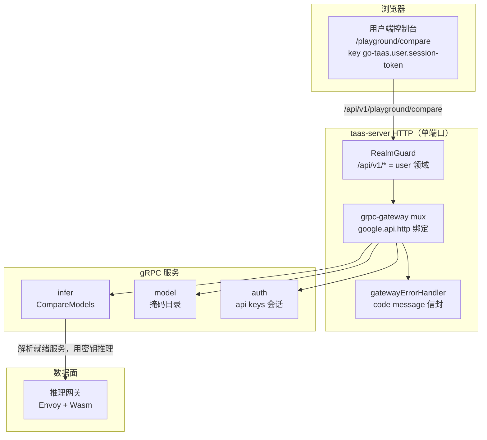
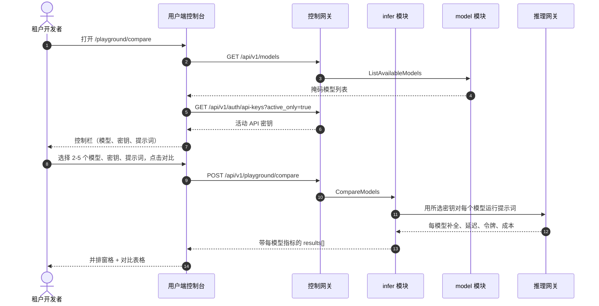

# 模型游乐场对比 —— 架构与详细设计

| 属性 | 内容 |
| --- | --- |
| 功能点 | 模型游乐场对比 —— 在同一提示词上并排比较多个模型，带每模型延迟/令牌/成本与对比表格（backlog 第 35 行） |
| 文档范围 | 功能点 35 的架构与详细设计：`InferServiceService` 上的 `CompareModels` RPC、用户端游乐场对比页面（`/playground/compare`），以及错误处理、配置、安全、上线与各层函数级设计 |
| 所属模块 | `infer`（在同一提示词上对多个模型运行并返回每模型延迟/令牌/成本的对比 RPC）、`model`（只读：对比页面模型选择器所依据的掩码用户端目录）、`auth`（只读：对比页面提供的活动 API 密钥）、`web` 用户端控制台（`PlaygroundComparePage`） |
| 相关文档 | [需求分析与 UI/UX 设计](../design/playground-comparison.md) · [架构设计](../design/architecture.md) §2.4（`infer`）、§3.1（管理端/用户端分离）· [控制台表面分离](./console-surface-separation.md)（用户端游乐场、`UserShell` 约定、掩码投影规则）· [请求日志与 API 游乐场](./request-logs-playground.md)（本功能扩展为多模型对比的现有基于模型的游乐场）· [使用仪表盘与每请求成本归属](./usage-dashboard.md)（本功能每模型成本列所依据的成本归属模型） |
| 状态 | 架构完成，已移交给开发智能体 |

---

## 1. 概述与目标

用户端游乐场（功能点 #12，D14）让租户通过 `POST /api/v1/models/{model_id}:playground` 向单个模型发送提示词，并查看补全、令牌用量与延迟。租户目前仍无法**在模型之间选择**：当智能体的开发者想为任务挑选最佳模型时，他们必须一次一个地对每个模型运行同一提示词并手动比较结果。没有在同一提示词上跨模型的延迟、令牌用量与成本的并排视图。

本功能新增**模型游乐场对比**：在同一提示词上并排比较多个模型，带每模型延迟/令牌/成本与对比表格。

**目标**：

- 一个 `CompareModels` RPC，在同一提示词上对多个模型（2–5）运行，并在单次调用中返回每模型的补全、延迟、令牌用量与成本。
- 每次对比调用都走真实计量路径（D3）：调用出现在使用与请求日志中。
- 一个用户端游乐场对比页面（`/playground/compare`），带多模型选择器、共享提示词编辑器、并排补全窗格与对比表格。
- 游乐场对比错误块（119xx）中的新错误码。
- 页面 → 路由 → API 前缀表，带精确的用户前缀；包括空、错误、权限拒绝在内的各页面交互状态；可在 compose 栈上通过 Nightwatch 测试的编号验收标准。

**非目标**（延后，设计 §8）：单模型游乐场（#12）；请求级追踪（#27）；成本分析仪表盘（#29）；完整评估框架或基准套件（刻意缺失，D6）；管理端对比（D1）。

### 1.1 本文档阅读顺序

第 2 节记录架构决策（AD1–AD6，对应设计的 D1–D6）。第 3–5 节是组件视图、数据模型与 API 设计。第 6 节是前端架构（页面 → 路由 → API 前缀表、认证守卫）。第 7–8 节是时序流程与错误处理。第 9–11 节是配置、安全与上线。第 12–14 节是验收标准可追溯性、函数级详细设计与有序实现任务清单。

---

## 2. 架构决策

| # | 决策 | 理由 |
| --- | --- | --- |
| AD1 | **游乐场对比仅存在于用户端表面**：`/playground/compare` + `/api/v1/playground/compare`。**没有管理端表面** —— 模型选择是租户任务（我的智能体应该用哪个模型），而非操作员任务 | 设计 D1。租户为其智能体挑选模型；操作员管理目录与部署（管理端表面）。与基于模型的用户端游乐场（功能点 #12，D14）一致 |
| AD2 | **新增 `CompareModels` RPC**，在同一提示词上对多个模型运行，并在单次调用中返回每模型的补全、延迟、令牌用量与成本 | 设计 D2。对比需要一次获得多个模型的结果；专用 RPC 将多模型关注点排除在单模型 `PlaygroundInfer` 表面之外，并给它一个归属 |
| AD3 | **每次对比调用都走真实计量路径** —— `CompareModels` 为每个模型解析就绪服务，用所选密钥推理，并返回计量成本；调用出现在使用与请求日志中 | 设计 D3。对比必须走真实推理路径，使成本列真实且调用可审计（功能点 #12 D5/D14 模式） |
| AD4 | **成本列是每个提示词的实际计量成本**，而非静态的每 M 令牌价格 | 设计 D4。租户需要提示词的真实经济性（模式 2）；静态价格会误导（陷阱） |
| AD5 | **页面是并排窗格布局加对比表格** —— 每个所选模型获得一个带延迟/令牌/成本的补全窗格，汇总表格聚合指标以便快速扫描 | 设计 D5。并排窗格是核心交互（模式 1）；表格补充它们以便扫描（模式 3） |
| AD6 | **模型选择器依据掩码用户端目录**（`GET /api/v1/models`），密钥选择器依据租户的活动 API 密钥（`GET /api/v1/auth/api-keys?active_only=true`），与现有游乐场完全一致 | 设计 D6。租户从与现有游乐场相同的掩码来源挑选模型与密钥（功能点 #17 D15）；无操作员内部信息泄露 |

---

## 3. 组件视图

### 3.1 职责归属

| 层 / 组件 | 拥有 | 本功能的变更 |
| --- | --- | --- |
| **控制网关（`grpc-gateway`）** | `CompareModels` RPC 的 HTTP/JSON 门面；领域守卫（功能点 #17）已用 10038 拒绝错误领域的会话；将 `X-Organization-Id` 作为 gRPC 元数据传递 | `CompareModels` 的新绑定（第 5 节）；领域守卫无变更 |
| **`infer` 模块（`services/infer`）** | `CompareModels` RPC：为每个模型解析就绪服务、用所选密钥推理、返回每模型补全/延迟/令牌/成本 | 现有 `InferServiceService` 上的新 RPC（AD2、AD3） |
| **`model` 模块** | 掩码用户端目录 | 只读：对比页面的模型选择器依据 `GET /api/v1/models`（AD6） |
| **`auth` 模块** | API 密钥身份、会话领域、会话活动组织 | 只读：对比页面的密钥选择器依据 `GET /api/v1/auth/api-keys?active_only=true`（AD6） |
| **PostgreSQL** | `inference_services`、`usage_records`、`charge_records`（现有） | 无新表 |
| **控制台** | 用户端游乐场对比页面 | 用户端表面上的一个新页面（第 6 节） |

### 3.2 运行时组件视图



### 3.3 请求身份链

对比 RPC 是**用户端表面**（AD1）。链路为：

1. `RealmGuard`（HTTP，`pkg/server/realm.go`）—— 路径前缀 `/api/v1/playground/*` 决定期望领域 `user`。无 `Authorization` 头：放行（过渡期，功能点-17 AD4）。有头：从 Redis 解析会话领域；不匹配 → 10038，未知/过期/无领域 → 10027。
2. grpc-gateway mux —— 按注解路径路由并转发 `authorization` 与 `x-organization-id`。
3. 服务处理器 —— `infer` 模块通过 `SessionActiveOrg` 解析调用者的组织（会话的活动组织是权威的；存在会话时忽略 `X-Organization-Id`）。它为每个模型解析就绪服务，用所选密钥推理，并返回计量成本。
4. `tenancy.RoleGuard` —— 按调用者角色门控对比 RPC（10036）。权限拒绝状态（设计 FR5.1、AC8）由角色检查产生。

---

## 4. 数据模型

### 4.1 无新表

游乐场对比功能是对现有推理路径的只读聚合（AD3）。无新表、无新 MQ 主题、无新 runner、任何路径上除正常计量推理调用（产生现有使用与请求日志行）外无写入。读取 `inference_services`、`usage_records` 与 `charge_records` 表以解析就绪服务与计量成本。

---

## 5. API 设计

### 5.1 RPC 表面

`taas.infer.v1.InferServiceService` 上一个新 RPC。它通过控制网关在**用户前缀** `/api/v1/playground/compare` 上以 HTTP 提供（AD1）。**没有管理端前缀绑定**（AD1）。

| 服务 | RPC | HTTP | 状态 | 用途 |
| --- | --- | --- | --- | --- |
| `taas.infer.v1` | `CompareModels` | `POST /api/v1/playground/compare` | **新** | 在同一提示词上对多个模型运行，返回每模型延迟/令牌/成本 |
| `taas.model.v1` | `ListAvailableModels` | `GET /api/v1/models` | 现有 | 选择器的掩码模型列表（复用，AD6） |
| `taas.auth.v1` | `ListAPIKeys` | `GET /api/v1/auth/api-keys` | 现有 | 选择器的活动 API 密钥（复用，AD6） |

### 5.2 Proto 消息

```proto
// infer.proto（加性）

// CompareModels 在同一提示词上对多个模型运行，并在单次调用中返回每模型的补全、延迟、令牌用量与成本。
// 每次对比调用都走真实计量路径。
// 用户端表面 API：在 /api/v1 下提供。
rpc CompareModels(CompareModelsRequest) returns (CompareModelsResponse) {
  option (google.api.http) = {
    post: "/api/v1/playground/compare"
    body: "*"
  };
}

message CompareModelsRequest {
  // model_ids 是要对比的 2-5 个模型。
  repeated string model_ids = 1;
  // api_key_id 是所选组织 API 密钥身份。
  string api_key_id = 2;
  string prompt = 3;
}

message CompareModelResult {
  string model_id = 1;
  string model_name = 2;
  string completion = 3;
  int64 latency_ms = 4;
  int64 input_tokens = 5;
  int64 output_tokens = 6;
  // cost 是提示词的计量成本，整数分。
  int64 cost = 7;
}

message CompareModelsResponse {
  taas.common.v1.Response response = 1;
  repeated CompareModelResult results = 2;
}
```

### 5.3 线上格式（既定约定）

- 成功响应为 HTTP 200（grpc-gateway 对一元 RPC 的默认）。
- 业务错误渲染为 `{"code": <int>, "message": "..."}`，越界码为 HTTP 500（平台现状）。
- int64 字段序列化为 JSON 字符串。

### 5.4 校验矩阵

`CompareModels` 按顺序校验：

| # | 检查 | 失败码 | 规范消息 |
| --- | --- | --- | --- |
| 1 | `model_ids` 长度在 2–5 | 10404 `CodeMeteringRangeInvalid` | metering range invalid |
| 2 | 每个 `model_id` 存在且对调用者可用 | 10101 `CodeModelNotFound` | model not found |
| 3 | `api_key_id` 存在且属于调用者的组织 | 10007 `CodeAPIKeyNotFound` | api key not found |
| 4 | 密钥未被资金/配额阻止 | 10502 `CodeInsufficientFunds` | insufficient funds |

### 5.5 计量路径

`CompareModels` 为每个模型解析就绪推理服务（`running` 状态的非终止服务），通过数据面网关用所选密钥推理（真实计量路径，AD3），并返回计量成本。调用出现在同一组织与密钥的使用与请求日志中（FR2.1）。若某模型无就绪服务，每模型结果携带错误标记而非使整个对比失败（开发智能体必须决定确切的标记形状；设计的 AC1/AC2 覆盖正常路径与校验错误）。

---

## 6. 前端架构

### 6.1 页面 → 路由 → API 前缀表

| 页面 | 表面 | Web 路由 | API 前缀 |
| --- | --- | --- | --- |
| 游乐场对比页面 | end-user | `/playground/compare` | `/api/v1/playground/compare` |
| 模型选择器来源 | end-user | `/playground/compare` | `/api/v1/models` |
| 密钥选择器来源 | end-user | `/playground/compare` | `/api/v1/auth/api-keys` |

每个页面和 API 调用都在**用户端表面**上；没有管理端表面（AD1）。用户端页面从不调用 `/api/v1/admin/*` 路由，全程使用用户会话领域。

### 6.2 导航位置

游乐场对比页面从游乐场页面（`/playground`）通过"对比"链接/标签页到达。它在 `UserShell`（功能点 #17）内渲染。导航项不是顶层入口；它是单模型游乐场的同级。

### 6.3 共享组件与状态

- `UserShell`（功能点 #17）—— 页面外壳、会话守卫与权限拒绝状态。
- 模型选择器与密钥选择器复用与现有游乐场相同的掩码来源（`GET /api/v1/models`、`GET /api/v1/auth/api-keys?active_only=true`）（AD6）。
- 来自现有用户端页面的标准多选、下拉、文本域、按钮与骨架组件。

### 6.4 各表面认证守卫

页面是用户端表面。`RealmGuard`（功能点 #17）用 10038 拒绝错误领域的会话，用 10027 拒绝未知/过期/无领域会话。`tenancy.RoleGuard` 按调用者角色门控 RPC（10036）。页面的权限拒绝处理是标准的功能点-17 状态。

### 6.5 页面：`/playground/compare` —— 游乐场对比（end-user）

**用途**：为租户开发者提供在同一提示词上比较多个模型的单一表面 —— 选择 2–5 个模型、运行提示词、并排查看延迟、令牌与成本。

**布局**：在 `UserShell` 内渲染。页面头部（"游乐场对比"，副标题"在同一提示词上比较模型"），带**返回游乐场**链接（次要）。下方：

1. **控制栏** —— **模型**多选（2–5，来自 `GET /api/v1/models`）、**密钥**下拉（来自 `GET /api/v1/auth/api-keys?active_only=true`）、**提示词**编辑器（文本域）与**对比**按钮（主要）。
2. **并排窗格** —— 每个所选模型一个补全窗格，每个显示补全、延迟、输入/输出令牌与成本。
3. **对比表格** —— 每模型一行的汇总表格：**模型**、**延迟**、**输入令牌**、**输出令牌**、**成本**。

**交互状态**：

| 状态 | 行为 |
| --- | --- |
| 默认 | 控制栏渲染；窗格与表格为空，带选择模型并编写提示词的提示 |
| 加载中 | 窗格显示骨架；对比被禁用 |
| 空 | "选择 2–5 个模型并编写提示词以对比。"并提示；控制栏保持可见 |
| 错误 | 带消息的错误横幅与重试按钮；页面保留最后的好结果并显示"显示过期结果"横幅 |
| 禁用 | 直到选择 2–5 个模型、一个密钥与非空提示词才启用对比；对比进行中时对比被禁用 |
| 权限拒绝 | 无所需角色的会话收到 10036，页面显示标准权限拒绝状态（功能点 #17），带返回用户首页的链接 |

**控制栏控件**：模型多选（2–5，来自 `GET /api/v1/models`）、密钥下拉（来自 `GET /api/v1/auth/api-keys?active_only=true`）、提示词文本域、对比按钮。直到选择 2–5 个模型、一个密钥与非空提示词才启用对比。

**并排窗格**：每个所选模型一个窗格，每个带补全文本、延迟、输入/输出令牌与成本。窗格在响应式网格中渲染。

**对比表格列**：模型、延迟、输入令牌、输出令牌、成本。每模型一行；不可排序（顺序跟随选择）。

---

## 7. 时序流程

### 7.1 对比模型



---

## 8. 错误处理

| 条件 | 码 | 常量 | 说明 |
| --- | --- | --- | --- |
| 未知 `model_id` | 10101 | `CodeModelNotFound` | `CompareModels`（FR1.3） |
| 未知 `api_key_id` | 10007 | `CodeAPIKeyNotFound` | `CompareModels`（FR1.3） |
| 推理被资金/配额阻止 | 10502 | `CodeInsufficientFunds` | `CompareModels`（FR1.3） |
| 少于 2 或多于 5 个模型 | 10404 | `CodeMeteringRangeInvalid` | 复用于模型数量校验（FR1.3） |
| 错误领域会话 | 10038 | `CodeRealmMismatch` | 网关领域守卫 |
| 未知/过期/无领域会话 | 10027 | `CodeSessionInvalid` | 网关领域守卫 |
| 角色不足 | 10036 | `CodeForbidden` | `tenancy.RoleGuard` |

设计文档为本功能分配**游乐场对比错误块 119xx**。上述现有码（10101/10007/10502/10404）已覆盖设计命名的每个失败模式；119xx 块保留给开发智能体未来可能需要的任何游乐场对比特定码。如需新码，必须将其添加到 `pkg/errors/codes.go` 的 119xx 块中，并带命名本功能的注释。

---

## 9. 配置

本功能无需新配置。对比 RPC 复用现有推理路径与现有数据面网关；模型与密钥选择器复用现有用户端来源。

---

## 10. 安全考虑

- **仅用户端表面**（AD1）：模型选择是租户任务；操作员在管理端表面管理目录与部署。`RealmGuard` 与 `RoleGuard` 强制表面与角色。
- **掩码来源**（AD6）：模型选择器依据掩码用户端目录，密钥选择器依据租户自己的活动 API 密钥；无操作员内部信息泄露。
- **真实计量路径**（AD3）：每次对比调用都用所选密钥走真实推理路径，使成本列真实且调用可审计。
- **租户范围**（AD3）：调用者的组织是权威的；租户不能比较其自身组织之外的模型或密钥。

---

## 11. 上线/升级说明

- 无模式变更；无新表。
- 新 RPC 绑定在现有用户前缀下；领域守卫已将该前缀视为用户端表面。
- 功能是加性的；现有部署与页面不受影响。

---

## 12. 验收标准可追溯性

| AC | 设计 | 架构章节 | 级别 |
| --- | --- | --- | --- |
| AC1 | `CompareModels` 在同一提示词上对 2–5 个模型运行并返回带 model_id/model_name/completion/latency_ms/input_tokens/output_tokens/cost 的 results[] | §5.1、§5.2、§5.5 | FVT |
| AC2 | 少于 2 或多于 5 个模型的 `CompareModels` 返回校验错误；未知模型 → 10101、未知密钥 → 10007、被阻止密钥 → 10502 | §5.1、§5.4 | FVT |
| AC3 | 每次对比调用都走真实计量路径，并出现在同一组织与密钥的使用与请求日志中 | §5.5 | FVT + E2E |
| AC4 | `/playground/compare` 在首次加载时渲染控制栏，模型选择器来自 `GET /api/v1/models`，密钥选择器来自 `GET /api/v1/auth/api-keys` | §6.5 | E2E |
| AC5 | 直到选择 2–5 个模型、一个密钥与非空提示词才启用对比；点击对比运行对比并渲染窗格 + 表格 | §6.5 | E2E |
| AC6 | 每个窗格显示补全、延迟、输入/输出令牌、成本；表格每模型一行，带模型/延迟/输入令牌/输出令牌/成本 | §6.5 | E2E |
| AC7 | 仅用户端表面：路由 `/playground/compare`，每个 API 调用使用 `/api/v1/*`，无 `/api/v1/admin/*` 字符串 | §6.1 | E2E（表面分离） |
| AC8 | 无所需角色的会话收到 10036，页面显示标准权限拒绝状态 | §6.4、§8 | E2E |

---

## 13. 函数级详细设计

### 13.1 `infer` 模块（`services/infer`）

| 文件 | 函数 | 职责 |
| --- | --- | --- |
| `service.go` | `CompareModels(ctx, req)` | 校验 `model_ids` 长度（10404）、每个 `model_id`（10101）、`api_key_id`（10007）、密钥未被阻止（10502）；为每个模型解析就绪服务；通过数据面网关用所选密钥推理；返回每模型补全/延迟/令牌/成本 |
| `playground.go` | `resolveReadyService(ctx, modelID)` | 为模型查找非终止 `running` 推理服务（从现有游乐场复用） |
| | `inferWithKey(ctx, service, keyID, prompt)` | 用所选密钥 id 将提示词转发到数据面网关（真实计量路径，AD3）；返回补全/延迟/令牌/成本 |

### 13.2 `web` 用户端控制台

| 文件 | 页面 | 职责 |
| --- | --- | --- |
| `pages/user/PlaygroundComparePage.tsx` | `/playground/compare` | 控制栏（模型多选、密钥下拉、提示词编辑器）、并排窗格、对比表格（AD5） |
| `App.tsx` / `router.tsx` | 路由注册 | 在用户端表面注册 `/playground/compare` |

---

## 14. 有序实现任务清单

1. `pkg/errors/codes.go` —— 为游乐场对比保留 119xx 块注释（除非失败模式需要，否则无需新码）。
2. `proto/taas/infer/v1/infer.proto` —— 添加 `CompareModels` RPC 与消息；重新生成。
3. `services/infer/playground.go` —— `resolveReadyService`、`inferWithKey`。
4. `services/infer/service.go` —— `CompareModels`。
5. `web/src/pages/user/PlaygroundComparePage.tsx` —— 页面；注册路由。
6. AC1–AC8 的 FVT + E2E 测试。