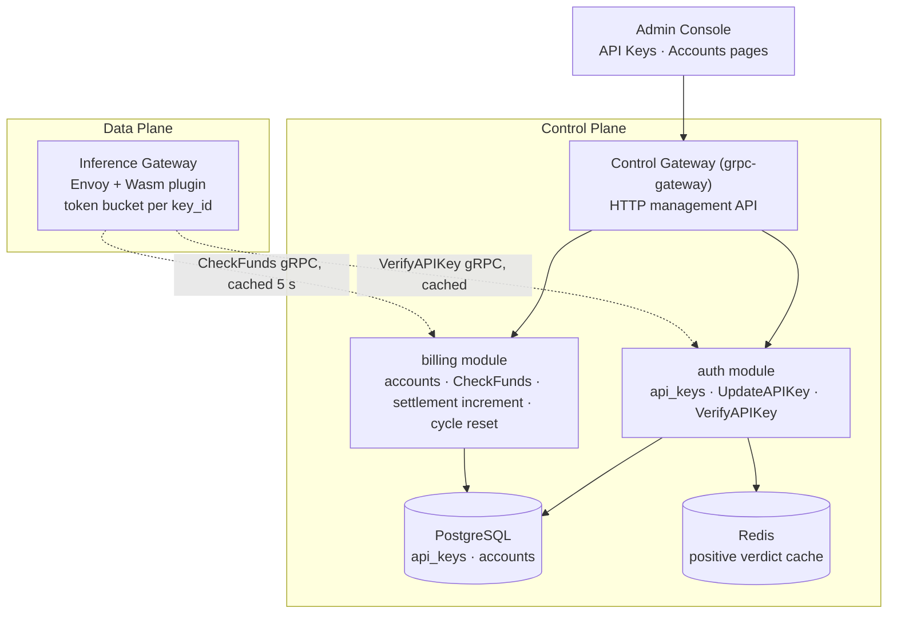
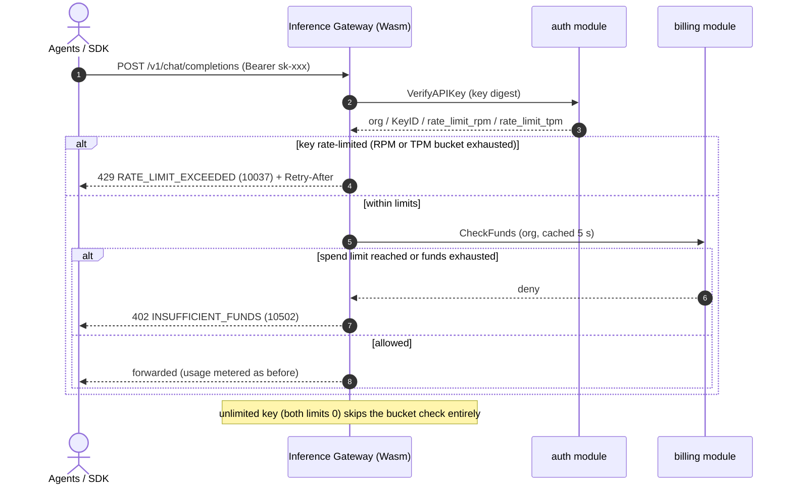
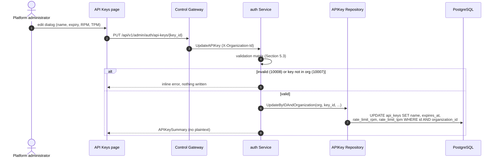
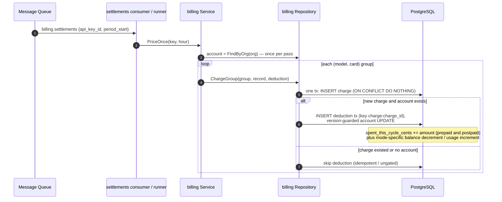
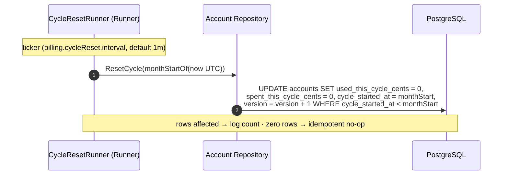

# Per-Key Rate Limits & Org Spend Limits — Architecture and Detailed Design

| Attribute | Content |
| --- | --- |
| Feature point | Per-key rate limits (requests/min, tokens/min) & organization spend limits (monthly cap) |
| Document scope | Architecture and detailed design for two increments: **Increment A** — per-key `rate_limit_rpm` / `rate_limit_tpm` on API keys, enforced at the data-plane gateway via the `VerifyAPIKey` response; **Increment B** — a cross-mode `monthly_spend_limit_cents` on the billing account, enforced in `CheckFunds`. Covers the console API Keys and Accounts pages, the API surface, error handling, and function-level design per layer |
| Owning modules | `auth` (key rate-limit fields, `UpdateAPIKey`), `billing` (spend-limit fields, `CheckFunds` enforcement, settlement increment, cycle reset), `infer` (gateway enforcement point), `metering` (unchanged); console web app |
| Related documents | [Requirement Analysis and UI/UX Design](../design/rate-limits-spend-limits.md) · [Architecture Design](../design/architecture.md) §2.1 `auth`, §2.6 `billing`, §3.3 the Inference Gateway's API Key authentication chain · [API Key Lifecycle Management](./api-key-management.md) — the `api_keys` table and `VerifyAPIKey` being extended · [Balance (Prepaid) & Quota (Postpaid) Account Modes](./balance-quota.md) — the billing account, `CheckFunds`, and 10502 being extended · [Usage Dashboards & Per-Request Cost Attribution](./usage-dashboard.md) — the balance/quota widget that will surface spend-limit progress |
| Status | Architecture complete, handed to the Developer agent |

---

## 1. Overview and Goals

Features #1–#10 closed the accounting loop: keys identify callers, models deploy one-click, every inference request leaves a tamper-evident voucher that settles hourly per key, the price matrix turns settled usage into charge records and bills, organizations own every resource, and billing accounts gate inference with a prepaid balance or a postpaid quota. What the platform still cannot do is **shape traffic and cap spend at the two boundaries operators actually control**: the **key** (the unit an agent/SDK presents on every request) and the **organization** (the unit that owns the money). This feature adds two independent, orthogonal controls: **per-key rate limits** (requests/min and tokens/min, enforced at the gateway) and an **organization spend limit** (a cross-mode monthly cap, enforced at the funds check). They compose: a key can be rate-limited while its org is simultaneously spend-capped, and neither control changes the settlement, charging, or metering pipelines.

**Goals**: per-key `rate_limit_rpm` / `rate_limit_tpm` on `api_keys`, returned by `VerifyAPIKey` and enforced at the gateway with 429 + `Retry-After`; a new `UpdateAPIKey` RPC to edit rate limits/name/expiry post-creation; a cross-mode `monthly_spend_limit_cents` and `spent_this_cycle_cents` on the billing account, enforced in `CheckFunds` (10502/402) and incremented at settlement; console API Keys create/edit dialogs with RPM/TPM fields and a rate-limit column, and an Accounts spend-limit field with a progress bar.

**Non-goals** (deferred): per-key QPS or concurrency limits (RPM/TPM only); burst/refill tuning or token-bucket configuration UI; rate-limit tiers or plans; per-model or per-endpoint rate limits; spend-limit alerts/notifications; auto-raise or auto-recharge on limit; per-request holds (10506 stays reserved); tenant self-service limit management (#6/#7 scoping); any change to the settlement, charging, or metering pipelines beyond the spend-limit increment.

## 2. Architecture Decisions

| # | Decision | Rationale |
| --- | --- | --- |
| AD1 | **Rate limits live on the API key** as `rate_limit_rpm` and `rate_limit_tpm` (int64, **0 = unlimited**), stored on `api_keys` and returned by `VerifyAPIKey` so the gateway enforces them **without any new data-plane round trip** | The key is the unit the agent presents on every request; the gateway already calls `VerifyAPIKey`, so the verdict rides that response (the OpenAI/Together pattern) |
| AD2 | **Enforcement is at the data-plane gateway** (a token bucket per key, keyed by `key_id`), not the control plane; the `VerifyAPIKey` response carries the limits and the gateway applies them locally | Control-plane enforcement cannot see the hot path; gateway-local buckets add no per-request RPC and keep the data path fast (AD1) |
| AD3 | **Rate-limit rejection is HTTP 429 with `Retry-After`**, mapped from a new error code **`CodeRateLimitExceeded`** — distinct from 10502/402 funds | The recognizable industry error (OpenAI `rate_limit_exceeded`); SDKs already honor `Retry-After`; never conflated with funds |
| AD4 | **A new `UpdateAPIKey` RPC** (`PUT /api/v1/admin/auth/api-keys/{key_id}`) edits `name`, `expires_at`, `rate_limit_rpm`, `rate_limit_tpm` post-creation; it never returns the plaintext and never changes the secret | Rate limits and expiry must be adjustable without recreating a key; the plaintext stays one-time (api-key D2) |
| AD5 | **The org spend limit is a cross-mode monthly cap** — `monthly_spend_limit_cents` (int64, **0 = unlimited**) on the billing account, enforced in `CheckFunds` regardless of `mode`; it is **distinct from the postpaid `monthly_quota_cents`** | A spend cap is a safety net over whatever funds exist; the postpaid quota is a mode-specific accounting field, the spend limit is a cross-mode guardrail — two concepts, two fields |
| AD6 | **`spent_this_cycle_cents` is mode-agnostic** — settlement increments it for prepaid and postpaid alike (alongside the mode-specific `balance_cents` decrement / `used_this_cycle_cents` increment), and the existing cycle runner resets it at the UTC month boundary | The spend limit must cap total spend regardless of how it was funded; reusing the existing cycle runner (balance-quota AD6) keeps one reset cadence |
| AD7 | **Spend-limit enforcement reuses 10502 `CodeInsufficientFunds` (HTTP 402)** — when `monthly_spend_limit_cents > 0` and `spent_this_cycle_cents ≥ monthly_spend_limit_cents`, `CheckFunds` denies exactly as it does for an exhausted balance or exceeded quota | One funds error, one SDK story; the spend limit is just another reason the org is out of funds this cycle |
| AD8 | **Rate limits and spend limits are independent and compose** — a key can be rate-limited while its org is spend-capped; the gateway checks rate limits first (429), then funds (402), so a throttled key never even reaches the funds check | Orthogonal controls; the 429-before-402 order matches how the gateway already sequences verification then funds |
| AD9 | **`CodeRateLimitExceeded` is allocated as 10037, not the design doc's 10015** — 10015 is already `CodeOrganizationExists` in `pkg/errors/codes.go`; the auth block runs 10001–10036, so 10037 is the next free code | The design doc's proposed number collides with a shipped tenancy code; the constant name and semantics are unchanged, only the numeric value moves to the first free slot |

## 3. Component Design



| Component | Responsibility in this feature |
| --- | --- |
| Inference Gateway (data plane) | Maintains a token bucket per `key_id` (RPM and TPM independently) from the `VerifyAPIKey` response; returns 429 + `Retry-After` (10037) when a bucket is exhausted, checked **before** the funds check; skips the bucket entirely for unlimited keys. Out of repository scope — the contract is pinned here, the established synthetic-verification pattern |
| Control Gateway (`grpc-gateway`) | HTTP/JSON facade for `UpdateAPIKey` under `/api/v1/admin/auth`; passes `X-Organization-Id` through as gRPC metadata |
| `auth` module (`services/auth`) | `UpdateAPIKey` RPC, rate-limit fields on create/list/verify, verdict cache carrying the limits |
| `billing` module (`services/billing`) | Spend-limit fields on the account, `CheckFunds` enforcement, settlement increment, cycle reset |
| `metering` / `infer` / `internal/controller` | **Unchanged** — the spend-limit increment rides the existing settlement pipeline; accounts and keys are control-plane state, so no Kubernetes resources and no controller involvement |
| PostgreSQL / Redis / Console | `api_keys` and `accounts` gain columns (additive AutoMigrate); the verdict cache carries the limits; API Keys and Accounts pages upgraded in place |

### 3.1 File Layout and Function-Level Responsibilities

| Module | File | Contents |
| --- | --- | --- |
| `proto/taas/auth/v1` | `auth.proto` | Additive: `rate_limit_rpm`/`rate_limit_tpm` on `APIKeySummary` (8, 9), `CreateAPIKeyRequest` (3, 4), `VerifyAPIKeyResponse` (5, 6); new `UpdateAPIKeyRequest`/`UpdateAPIKeyResponse` + `rpc UpdateAPIKey` (Section 5) |
| `proto/taas/billing/v1` | `billing.proto` | Additive: `monthly_spend_limit_cents`/`spent_this_cycle_cents` on `Account` (14, 15), `CreateAccountRequest` (5), `UpdateAccountRequest` (5), `CheckFundsResponse` (8, 9) |
| `services/auth` | `apikey_model.go` | `APIKey` gains `RateLimitRPM int64` and `RateLimitTPM int64` (`gorm:"not null;default:0"`) — 0 = unlimited |
| | `apikey_repository.go` | `UpdateByIDAndOrganization(ctx, orgID, keyID, name, expiresAt, rpm, tpm)` — version-free single-row UPDATE scoped by `id AND organization_id`; returns the row or nil (ownership check → 10007); `Create`/`ListByOrganization`/`FindByLookupHash` read the new columns unchanged |
| | `apikey_cache.go` | `keyVerdict` gains `RateLimitRPM int64` and `RateLimitTPM int64` (JSON tags `rate_limit_rpm`/`rate_limit_tpm`) so the gateway gets the limits from the cache without a DB hit per request |
| | `service.go` | `CreateAPIKey` validates and persists the limits (negative → 10008); `ListAPIKeys`/`summarizeAPIKey` expose them; `VerifyAPIKey` populates them on both the cache-hit and cache-miss paths; new `UpdateAPIKey` RPC (Section 5.2) |
| `services/billing` | `account_model.go` | `Account` gains `MonthlySpendLimitCents int64` and `SpentThisCycleCents int64` (`gorm:"not null;default:0"`) — 0 = unlimited |
| | `account_repository.go` | `CreateAccount`/`UpdateAccount` persist the limit; `ApplyDeduction` increments `SpentThisCycleCents` by `spec.AmountCents` **for both modes** in the same transaction; `ResetCycle` also zeroes `SpentThisCycleCents` and drops the `mode = postpaid` predicate (Section 4.3) |
| | `account_service.go` | `CreateAccount`/`UpdateAccount` accept and validate the limit (negative → 10509); `summarizeAccount` exposes both fields plus a computed `spend_limit_usage_percent`; `fundsAllowed` enforces the spend limit (Section 5.3); `CheckFunds` returns the new fields |
| `pkg/errors` | `codes.go`/`messages.go` | New `CodeRateLimitExceeded Code = 10037` + canonical message "rate limit exceeded" (AD9) |
| `apps/taas-server` + `web/src` + `test` | `main.go`; `pages/ApiKeysPage.tsx`/`pages/AccountsPage.tsx`/`api.ts`; `fvt/rate_limits_spend_limits_fvt_test.go`/`e2e/tests/rateLimitsSpendLimits.js` | Regenerate proto (`make pbgen`); console dialogs/columns/progress bar; Section 8 |

### 3.2 Configuration Additions

None. The 5 s `CheckFunds` cache TTL and the 30 s verdict-cache TTL are existing data-plane gateway parameters (balance-quota AD4, api-key §7); the token-bucket refill window is fixed at 60 s (RPM/TPM are per-minute by definition, AD2). No new config keys ship.

### 3.3 Console Contract (pinned for the Developer agent)

Nav: **API Keys** (`/admin/api-keys`) and **Accounts** (`/admin/billing/accounts`) are upgraded in place — no new nav items.

| Page / component | Purpose | Key testids |
| --- | --- | --- |
| **API Keys create dialog** | Name + expiry + RPM/TPM fields (optional, empty = unlimited) | `rate-limit-rpm`, `rate-limit-tpm` |
| **API Keys edit dialog** | Edit name, expiry, RPM/TPM post-creation; states the secret is unchanged | `edit-rate-limit-{keyId}` |
| **API Keys rate-limit column** | `RPM 100 · TPM 50k` or `Unlimited`; tooltip on 429 + `Retry-After` | `rate-limit-cell-{keyId}` |
| **Accounts set-spend-limit field** | Monthly spend limit (optional, empty = unlimited), distinct from the postpaid quota | `spend-limit-input` |
| **Accounts spend progress bar** | `spent / limit` for the current cycle; amber near cap, red at/over; "No spend limit" when 0 | `spend-limit-progress` |

Empty states: "No spend limit" on the Accounts progress bar. Color language: rate-limit column is neutral; spend progress inherits the usage-dashboard palette — amber near the cap, red at/over it.

### 3.4 Security and Rollout Notes

- **Org scoping**: `UpdateAPIKey` resolves the org from `X-Organization-Id` and scopes the UPDATE to `id AND organization_id`; a key of another org returns 10007 (no existence leak, the api-key §6 pattern). `CheckFunds` stays cluster-internal (no HTTP route).
- **No plaintext, no secret change**: `UpdateAPIKey` never returns the plaintext and never touches `lookup_hash`/`salt`/`salted_hash` — the secret is immutable post-creation (AD4).
- **Verdict cache contents**: Redis now stores `{organization_id, key_id, role, rate_limit_rpm, rate_limit_tpm}` keyed by digest, TTL-bounded, deleted at revoke time. Rate limits are not secrets; the plaintext is never cached.
- **Rollout**: two additive column sets via AutoMigrate; deploy `taas-server` alone. New columns default to 0 (unlimited), so existing keys and accounts are never rate-limited or spend-capped until an operator sets a limit. The `UpdateAPIKey` RPC is new and no existing behavior changes; no feature flag is needed.

## 4. Data Model

### 4.1 The `api_keys` Table (additive)

| Column | PostgreSQL type | Constraints | Description |
| --- | --- | --- | --- |
| `rate_limit_rpm` | `bigint` | NOT NULL DEFAULT 0 | Requests per minute; 0 = unlimited (AD1) |
| `rate_limit_tpm` | `bigint` | NOT NULL DEFAULT 0 | Tokens per minute; 0 = unlimited (AD1) |

Existing columns (`id`, `name`, `prefix`, `lookup_hash`, `salt`, `salted_hash`, `organization_id`, `created_at`, `expires_at`, `revoked`, `revoked_at`) are unchanged. The GORM model is the single source of truth; AutoMigrate adds the two columns additively.

### 4.2 The `accounts` Table (additive)

| Column | PostgreSQL type | Constraints | Description |
| --- | --- | --- | --- |
| `monthly_spend_limit_cents` | `bigint` | NOT NULL DEFAULT 0 | Cross-mode monthly cap; 0 = unlimited (AD5) |
| `spent_this_cycle_cents` | `bigint` | NOT NULL DEFAULT 0 | Total spend within the current UTC cycle, both modes (AD6) |

Existing columns are unchanged. `spent_this_cycle_cents` is **write-only by settlement** — no admin RPC sets it directly; it is read-only on the wire.

### 4.3 Migration Notes

- Both tables are updated by **GORM `AutoMigrate` at startup** through the existing `Migrator` hooks (`auth.Service.Migrate`, `billing.Service.Migrate`). Additive only; no data migration.
- `ResetCycle` changes from a postpaid-only guarded UPDATE to a **mode-agnostic** one: `UPDATE accounts SET used_this_cycle_cents = 0, spent_this_cycle_cents = 0, cycle_started_at = monthStart, version = version + 1 WHERE cycle_started_at < monthStart`. Dropping the `mode = postpaid` predicate is safe because `used_this_cycle_cents` is only ever non-zero for postpaid accounts (prepaid rows keep it 0), and `spent_this_cycle_cents` must reset for both modes (AD6). The reset stays idempotent by condition (balance-quota AD6).

## 5. API Design

### 5.1 RPC Surface

Increment A belongs to **`taas.auth.v1.AuthService`** (`proto/taas/auth/v1/auth.proto`); Increment B belongs to **`taas.billing.v1.BillingService`** (`proto/taas/billing/v1/billing.proto`), both served as HTTP via the Control Gateway, org-scoped via `X-Organization-Id`. Proto changes are additive; int64 cents serialize as JSON strings.

| RPC | HTTP | Status | Purpose |
| --- | --- | --- | --- |
| `CreateAPIKey` | `POST /api/v1/admin/auth/api-keys` | extended | + `rate_limit_rpm`, `rate_limit_tpm` (0 = unlimited) |
| `ListAPIKeys` | `GET /api/v1/admin/auth/api-keys` | extended | + rate-limit fields on `APIKeySummary` |
| `UpdateAPIKey` | `PUT /api/v1/admin/auth/api-keys/{key_id}` | **new** | Edit name, expiry, RPM/TPM post-creation; never returns plaintext |
| `VerifyAPIKey` | gRPC only (no HTTP mapping) | extended | + rate-limit fields for gateway enforcement (AD1) |
| `CreateAccount` | `POST /api/v1/admin/billing/accounts` | extended | + `monthly_spend_limit_cents` |
| `UpdateAccount` | `PUT /api/v1/admin/billing/accounts/{account_id}` | extended | + `monthly_spend_limit_cents` |
| `GetAccount` | `GET /api/v1/admin/billing/accounts/{account_id}` | extended | + limit + `spent_this_cycle_cents` + usage percent |
| `ListAccounts` | `GET /api/v1/admin/billing/accounts` | extended | + limit + `spent_this_cycle_cents` |
| `CheckFunds` | internal gRPC (no HTTP route) | extended | Enforce the spend limit (AD5, AD7) |

### 5.2 Proto Sketches (new fields continue each message's sequence)

```protobuf
// auth.proto
message APIKeySummary {
  // ... existing 1-7 ...
  int64 rate_limit_rpm = 8;  // 0 = unlimited
  int64 rate_limit_tpm = 9;  // 0 = unlimited
}
message CreateAPIKeyRequest {
  string name = 1;
  int64 expires_at = 2;
  int64 rate_limit_rpm = 3;  // 0 = unlimited
  int64 rate_limit_tpm = 4;  // 0 = unlimited
}
message UpdateAPIKeyRequest {
  string key_id = 1;
  string name = 2;
  int64 expires_at = 3;      // 0 = clear (never expires)
  int64 rate_limit_rpm = 4;  // 0 = unlimited
  int64 rate_limit_tpm = 5;  // 0 = unlimited
}
message UpdateAPIKeyResponse {
  taas.common.v1.Response response = 1;
  APIKeySummary key = 2;     // never carries the plaintext
}
message VerifyAPIKeyResponse {
  // ... existing 1-4 ...
  int64 rate_limit_rpm = 5;  // 0 = unlimited
  int64 rate_limit_tpm = 6;  // 0 = unlimited
}
// rpc UpdateAPIKey(UpdateAPIKeyRequest) returns (UpdateAPIKeyResponse) {
//   option (google.api.http) = { put: "/api/v1/admin/auth/api-keys/{key_id}" body: "*" };
// }

// billing.proto
message Account {
  // ... existing 1-13 ...
  int64 monthly_spend_limit_cents = 14;  // 0 = unlimited
  int64 spent_this_cycle_cents = 15;     // read-only on the wire
  int32 spend_limit_usage_percent = 16;  // 0 when unlimited
}
message CreateAccountRequest {
  // ... existing 1-4 ...
  int64 monthly_spend_limit_cents = 5;   // 0 = unlimited
}
message UpdateAccountRequest {
  // ... existing 1-4 ...
  int64 monthly_spend_limit_cents = 5;   // 0 = unlimited
}
message CheckFundsResponse {
  // ... existing 1-7 ...
  int64 monthly_spend_limit_cents = 8;   // 0 = unlimited
  int64 spent_this_cycle_cents = 9;
}
```

### 5.3 Validation Matrices (synchronous, first failure returns, nothing written)

`CreateAPIKey` / `UpdateAPIKey` — every failure is **10008** `CodeAPIKeyInvalid`: `name` 1–64 chars (trimmed); `expires_at` 0 or strictly in the future (a past date on update is rejected); `rate_limit_rpm`/`rate_limit_tpm` ≥ 0 (negative rejected; 0 clears/unlimited). `UpdateAPIKey` additionally: `key_id` non-empty; key exists in the header org → else **10007** `CodeAPIKeyNotFound` (no existence leak).

`CreateAccount` / `UpdateAccount` — the existing balance-quota matrix (10509) plus `monthly_spend_limit_cents` ≥ 0 (negative rejected; 0 clears/unlimited). `spent_this_cycle_cents` is never settable on the wire.

## 6. Sequence Flows

### 6.1 Gateway Enforcement (Increment A + B compose)



### 6.2 Update API Key (console)



### 6.3 Settlement Increment (extends the feature-#5 charge pass)



### 6.4 Monthly Cycle Reset (extended)



## 7. Error Handling

All errors are `pkg/errors` business codes in the unified envelope. `VerifyAPIKey` rejections are turned into 401 by the Wasm plugin; the rate-limit rejection is rendered as 429 + `Retry-After` by the gateway (AD3).

| Condition | Code | Constant | Notes |
| --- | --- | --- | --- |
| Key rate limit exceeded (RPM or TPM) | 10037 | `CodeRateLimitExceeded` | **New** (AD3, AD9); HTTP 429 + `Retry-After`, rendered by the data-plane gateway |
| Inference blocked — spend limit reached, balance exhausted, or quota exceeded under `block` | 10502 | `CodeInsufficientFunds` | **Reused** (AD7); HTTP 402 |
| Key not found / another org's key on `UpdateAPIKey` | 10007 | `CodeAPIKeyNotFound` | Existing ownership check |
| Malformed key — negative rate limit, bad name, past expiry | 10008 | `CodeAPIKeyInvalid` | Existing |
| Malformed account — negative spend limit | 10509 | `CodeAccountInvalid` | Existing (balance-quota AD10) |
| Missing `X-Organization-Id` on admin APIs | 10001 | `CodeUnauthorized` | The `resolveOrganizationID` pattern |
| Database / Redis infrastructure failure | 500 | `CodeInternal` | Via error normalization |

## 8. Testing Strategy

- **Unit** (`services/auth`, `services/billing`, sqlite in-memory): `apikey_model_test.go`/`service_test.go` — create with limits persists and lists/verifies them (AC-A1), negative limit rejected (10008), `UpdateAPIKey` edits name/expiry/RPM/TPM and returns no plaintext, another org's key → 10007, past expiry rejected (AC-A2), the verdict cache round-trips the limits on both hit and miss paths. `account_service_test.go`/`account_repository_test.go` — create/update spend limit persists and rejects negatives (AC-B1), `fundsAllowed` truth table extended with the spend-limit branch for both modes and limit-0 (AC-B2), `ApplyDeduction` increments `spent_this_cycle_cents` for prepaid and postpaid in the same transaction and never double-increments on redelivery (AC-B3), `ResetCycle` zeroes `spent_this_cycle_cents` for both modes and is idempotent (AC-B4). Coverage ≥ 80% on the new files.
- **FVT** (`test/fvt/rate_limits_spend_limits_fvt_test.go`, the balance-quota FVT pattern: file-backed sqlite + `MigrateSchemaForFVT` + `NewForFVT` + gRPC server with the production interceptor + gateway mux with `FVTHeaderMatcher`): create a key with limits and verify via `VerifyAPIKey` over gRPC (AC-A1), `UpdateAPIKey` through the gateway (AC-A2), `CheckFunds` over gRPC for every spend-limit branch (AC-B2), settlement end-to-end — seed price + usage lines, run `PriceOnce`, assert `spent_this_cycle_cents` increased by the charged cents for both modes with exactly one deduction per charge, then redeliver and assert no double-increment (AC-B3), cycle reset via `ResetOnce` (AC-B4). The 429 gateway behavior is FVT-verified at the contract level (the data-plane gateway is out of repository scope — the established pattern).
- **E2E** (`test/e2e/tests/rateLimitsSpendLimits.js`, the `apiKeys.js`/`balanceQuota.js` pattern): against the compose stack — the API Keys create dialog persists `rate-limit-rpm`/`rate-limit-tpm`, the edit dialog (`edit-rate-limit-{keyId}`) updates and the `rate-limit-cell-{keyId}` column refreshes inline (AC-C1); the Accounts `spend-limit-input` persists and `spend-limit-progress` renders spent vs limit, amber near the cap and red at/over it, "No spend limit" when 0 (AC-C2).
- **Regression**: the existing e2e suites stay green; the charge path changes only additively (a nil deduction spec and a 0 spend limit leave orgs byte-for-byte on the old behavior).

## 9. Open Questions

| Question | Leaning |
| --- | --- |
| Burst/refill tuning or token-bucket configuration UI | Future refinement — v1 ships fixed RPM/TPM buckets (AD2) |
| Spend-limit alerts/notifications near the cap | Future feature — v1 surfaces progress only |
| Per-model or per-endpoint rate limits | Future — v1 is per-key only |
| Rate-limit tiers or plans | Future — v1 is free-form RPM/TPM |
| Tenant self-service limit management | Features #6/#7 scoping first |