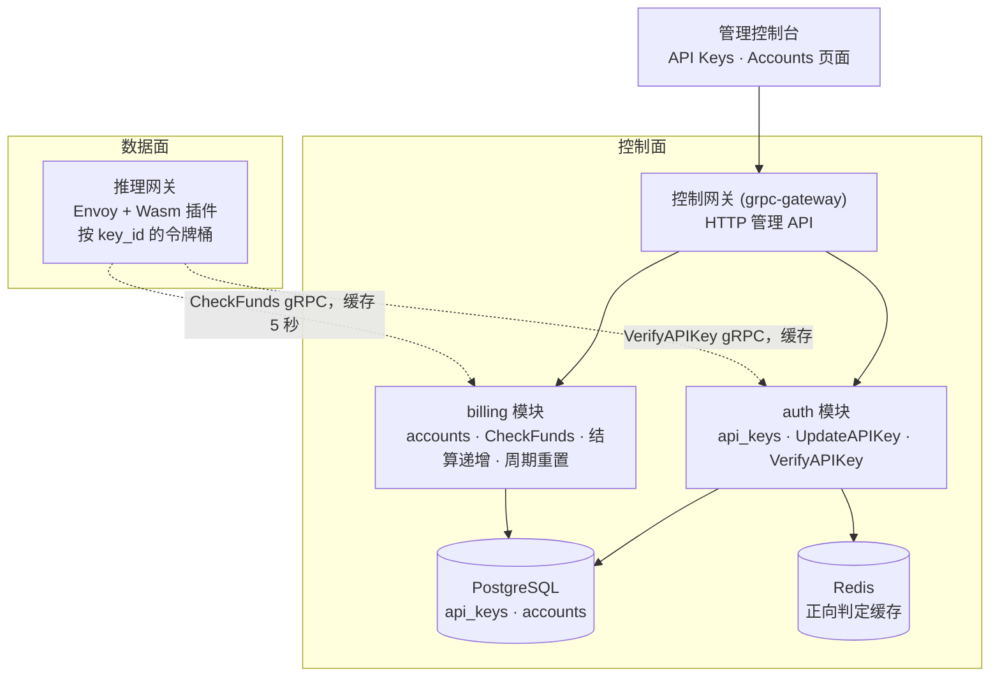
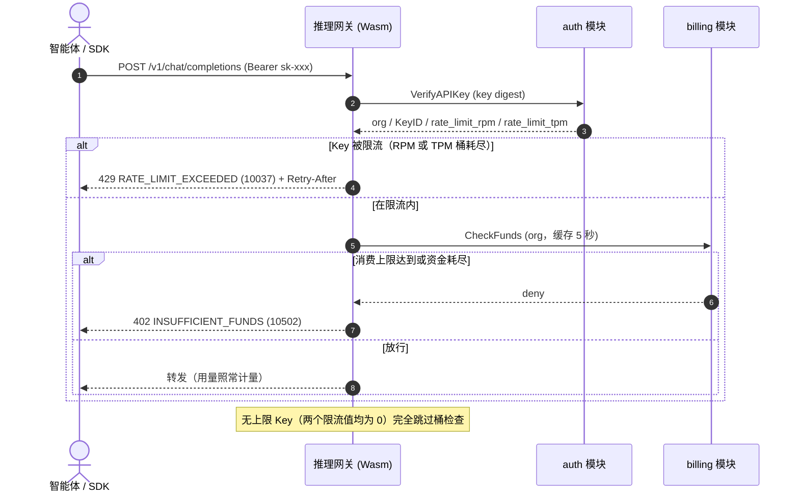
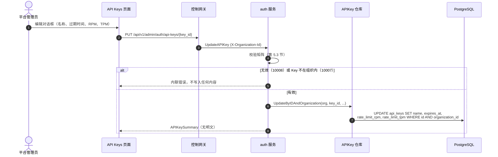
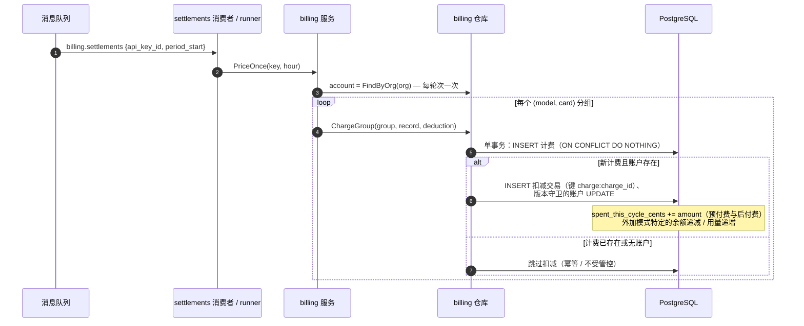
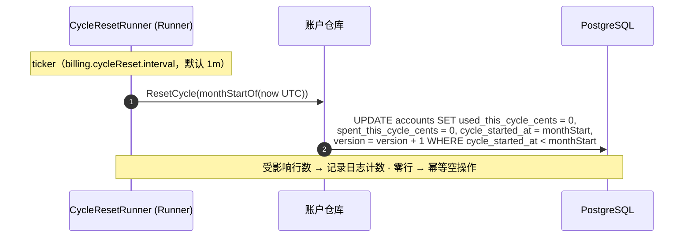

# 按 Key 限流与组织消费上限 — 架构与详细设计

| 属性 | 内容 |
| --- | --- |
| 特性点 | 按 Key 限流（每分钟请求数、每分钟 Token 数）与组织消费上限（月度封顶） |
| 文档范围 | 两个增量的架构与详细设计：**增量 A** — `api_keys` 上的按 Key `rate_limit_rpm` / `rate_limit_tpm`，经 `VerifyAPIKey` 响应在数据面网关执行；**增量 B** — 计费账户上的跨模式 `monthly_spend_limit_cents`，在 `CheckFunds` 中执行。覆盖控制台 API Keys 与 Accounts 页面、API 面、错误处理，以及各层的函数级设计 |
| 归属模块 | `auth`（Key 限流字段、`UpdateAPIKey`）、`billing`（消费上限字段、`CheckFunds` 执行、结算增量、周期重置）、`infer`（网关执行点）、`metering`（不变）；控制台 Web 应用 |
| 相关文档 | [需求分析与 UI/UX 设计](../design/rate-limits-spend-limits.zh-cn.md) · [架构设计](../design/architecture.zh-cn.md) 第 2.1 节（`auth`）、第 2.6 节（`billing`）、第 3.3 节（推理网关的 API Key 认证链） · [API Key 生命周期管理](./api-key-management.zh-cn.md) — 被扩展的 `api_keys` 表与 `VerifyAPIKey` · [余额（预付费）与配额（后付费）账户模式](./balance-quota.zh-cn.md) — 被扩展的计费账户、`CheckFunds` 与 10502 · [用量仪表盘与按请求成本归属](./usage-dashboard.zh-cn.md) — 将展示消费上限进度的余额/配额组件 |
| 状态 | 架构完成，已移交开发代理 |

---

## 1. 概述与目标

特性 #1–#10 闭环了账务链路：Key 标识调用方，模型一键部署，每次推理请求留下防篡改凭证并按小时按 Key 结算，价格矩阵把已结算用量转换为计费记录与账单，组织拥有一切资源，计费账户以预付费余额或后付费配额管控推理。平台仍做不到的是**在运营者实际掌控的两个边界上塑形流量并封顶消费**：**Key**（智能体/SDK 每次请求携带的单位）与**组织**（拥有资金的单位）。本特性新增两个独立、正交的控制：**按 Key 限流**（每分钟请求数与每分钟 Token 数，在网关执行）与**组织消费上限**（跨模式月度封顶，在资金检查处执行）。二者可组合：一个 Key 可被限流，同时其组织被消费封顶；且任一控制都不改动结算、计费或计量管道。

**目标**：`api_keys` 上的按 Key `rate_limit_rpm` / `rate_limit_tpm`，由 `VerifyAPIKey` 返回并在网关以 429 + `Retry-After` 执行；新增 `UpdateAPIKey` RPC 以在创建后编辑限流/名称/过期时间；计费账户上的跨模式 `monthly_spend_limit_cents` 与 `spent_this_cycle_cents`，在 `CheckFunds` 中执行（10502/402）并在结算时递增；控制台 API Keys 创建/编辑对话框带 RPM/TPM 字段与限流列，Accounts 消费上限字段带进度条。

**非目标**（延后）：按 Key 的 QPS 或并发限制（仅 RPM/TPM）；突发/补充调优或令牌桶配置 UI；限流档位或套餐；按模型或按端点的限流；消费上限告警/通知；触顶自动提升或自动充值；按请求冻结（10506 保持预留）；租户自助限流管理（#6/#7 范围界定）；除消费上限增量外对结算、计费或计量管道的任何改动。

## 2. 架构决策

| # | 决策 | 理由 |
| --- | --- | --- |
| AD1 | **限流位于 API Key 上**，为 `rate_limit_rpm` 与 `rate_limit_tpm`（int64，**0 = 无上限**），存于 `api_keys` 并由 `VerifyAPIKey` 返回，网关据此执行而**无需任何新的数据面往返** | Key 是智能体每次请求携带的单位；网关已调用 `VerifyAPIKey`，故判定搭载该响应（OpenAI/Together 模式） |
| AD2 | **执行在数据面网关**（每个 Key 一个令牌桶，以 `key_id` 为键），而非控制面；`VerifyAPIKey` 响应携带限流值，网关本地应用 | 控制面执行看不到热路径；网关本地桶不增加按请求 RPC，保持数据路径快速（AD1） |
| AD3 | **限流拒绝为 HTTP 429 + `Retry-After`**，映射自新错误码 **`CodeRateLimitExceeded`** — 与 10502/402 资金错误区分 | 业界可识别的错误（OpenAI `rate_limit_exceeded`）；SDK 已遵循 `Retry-After`；绝不与资金混淆 |
| AD4 | **新增 `UpdateAPIKey` RPC**（`PUT /api/v1/admin/auth/api-keys/{key_id}`）在创建后编辑 `name`、`expires_at`、`rate_limit_rpm`、`rate_limit_tpm`；它绝不返回明文，也绝不改动密钥 | 限流与过期时间必须可调而无需重建 Key；明文保持一次性（api-key D2） |
| AD5 | **组织消费上限是跨模式月度封顶** — 计费账户上的 `monthly_spend_limit_cents`（int64，**0 = 无上限**），在 `CheckFunds` 中无论 `mode` 如何都执行；它**区别于后付费的 `monthly_quota_cents`** | 消费上限是对既有任何资金的安全网；后付费配额是模式特定的记账字段，消费上限是跨模式护栏 — 两个概念、两个字段 |
| AD6 | **`spent_this_cycle_cents` 与模式无关** — 结算对预付费与后付费一视同仁地递增它（与模式特定的 `balance_cents` 递减 / `used_this_cycle_cents` 递增并列），既有周期 runner 在 UTC 月边界重置它 | 消费上限必须封顶总消费，无论其如何被出资；复用既有周期 runner（balance-quota AD6）保持单一重置节奏 |
| AD7 | **消费上限执行复用 10502 `CodeInsufficientFunds`（HTTP 402）** — 当 `monthly_spend_limit_cents > 0` 且 `spent_this_cycle_cents ≥ monthly_spend_limit_cents` 时，`CheckFunds` 与余额耗尽或配额超限时完全一致地拒绝 | 一个资金错误、一套 SDK 故事；消费上限只是组织本周期资金耗尽的另一个原因 |
| AD8 | **限流与消费上限相互独立且可组合** — 一个 Key 可被限流，同时其组织被消费封顶；网关先查限流（429），再查资金（402），故被限流的 Key 根本到不了资金检查 | 正交控制；429 先于 402 的顺序与网关既有的「先验证后资金」序列一致 |
| AD9 | **`CodeRateLimitExceeded` 分配为 10037，而非设计文档的 10015** — 10015 已是 `pkg/errors/codes.go` 中的 `CodeOrganizationExists`；auth 块占用 10001–10036，故 10037 是下一个空闲码 | 设计文档提议的编号与已上线的租户码冲突；常量名与语义不变，仅数值移到第一个空闲槽位 |

## 3. 组件设计



| 组件 | 本特性中的职责 |
| --- | --- |
| 推理网关（数据面） | 依据 `VerifyAPIKey` 响应为每个 `key_id` 维护一个令牌桶（RPM 与 TPM 独立）；桶耗尽时返回 429 + `Retry-After`（10037），在资金检查**之前**执行；无上限 Key 完全跳过桶。不在仓库范围内 — 契约在此钉死，沿用既定的合成验证模式 |
| 控制网关（`grpc-gateway`） | `/api/v1/admin/auth` 下 `UpdateAPIKey` 的 HTTP/JSON 门面；将 `X-Organization-Id` 作为 gRPC metadata 透传 |
| `auth` 模块（`services/auth`） | `UpdateAPIKey` RPC、创建/列表/验证上的限流字段、携带限流值的判定缓存 |
| `billing` 模块（`services/billing`） | 账户上的消费上限字段、`CheckFunds` 执行、结算递增、周期重置 |
| `metering` / `infer` / `internal/controller` | **不变** — 消费上限增量搭载既有结算管道；账户与 Key 是控制面状态，故无 Kubernetes 资源、无 controller 参与 |
| PostgreSQL / Redis / 控制台 | `api_keys` 与 `accounts` 增加列（增量 AutoMigrate）；判定缓存携带限流值；API Keys 与 Accounts 页面原地升级 |

### 3.1 文件布局与函数级职责

| 模块 | 文件 | 内容 |
| --- | --- | --- |
| `proto/taas/auth/v1` | `auth.proto` | 增量：`APIKeySummary` 上的 `rate_limit_rpm`/`rate_limit_tpm`（8, 9）、`CreateAPIKeyRequest`（3, 4）、`VerifyAPIKeyResponse`（5, 6）；新增 `UpdateAPIKeyRequest`/`UpdateAPIKeyResponse` + `rpc UpdateAPIKey`（第 5 节） |
| `proto/taas/billing/v1` | `billing.proto` | 增量：`Account` 上的 `monthly_spend_limit_cents`/`spent_this_cycle_cents`（14, 15）、`CreateAccountRequest`（5）、`UpdateAccountRequest`（5）、`CheckFundsResponse`（8, 9） |
| `services/auth` | `apikey_model.go` | `APIKey` 增加 `RateLimitRPM int64` 与 `RateLimitTPM int64`（`gorm:"not null;default:0"`）— 0 = 无上限 |
| | `apikey_repository.go` | `UpdateByIDAndOrganization(ctx, orgID, keyID, name, expiresAt, rpm, tpm)` — 以 `id AND organization_id` 限定范围的无版本单行 UPDATE；返回该行或 nil（所有权检查 → 10007）；`Create`/`ListByOrganization`/`FindByLookupHash` 原样读取新列 |
| | `apikey_cache.go` | `keyVerdict` 增加 `RateLimitRPM int64` 与 `RateLimitTPM int64`（JSON 标签 `rate_limit_rpm`/`rate_limit_tpm`），使网关无需每次请求命中 DB 即可从缓存取得限流值 |
| | `service.go` | `CreateAPIKey` 校验并持久化限流值（负数 → 10008）；`ListAPIKeys`/`summarizeAPIKey` 暴露它们；`VerifyAPIKey` 在缓存命中与未命中两条路径上都填充它们；新增 `UpdateAPIKey` RPC（第 5.2 节） |
| `services/billing` | `account_model.go` | `Account` 增加 `MonthlySpendLimitCents int64` 与 `SpentThisCycleCents int64`（`gorm:"not null;default:0"`）— 0 = 无上限 |
| | `account_repository.go` | `CreateAccount`/`UpdateAccount` 持久化上限；`ApplyDeduction` 在同一事务内**对两种模式**都将 `SpentThisCycleCents` 递增 `spec.AmountCents`；`ResetCycle` 同时清零 `SpentThisCycleCents` 并去掉 `mode = postpaid` 谓词（第 4.3 节） |
| | `account_service.go` | `CreateAccount`/`UpdateAccount` 接受并校验上限（负数 → 10509）；`summarizeAccount` 暴露两个字段外加计算的 `spend_limit_usage_percent`；`fundsAllowed` 执行消费上限（第 5.3 节）；`CheckFunds` 返回新字段 |
| `pkg/errors` | `codes.go`/`messages.go` | 新增 `CodeRateLimitExceeded Code = 10037` + 规范消息 "rate limit exceeded"（AD9） |
| `apps/taas-server` + `web/src` + `test` | `main.go`；`pages/ApiKeysPage.tsx`/`pages/AccountsPage.tsx`/`api.ts`；`fvt/rate_limits_spend_limits_fvt_test.go`/`e2e/tests/rateLimitsSpendLimits.js` | 重新生成 proto（`make pbgen`）；控制台对话框/列/进度条；第 8 节 |

### 3.2 配置增量

无。5 秒的 `CheckFunds` 缓存 TTL 与 30 秒的判定缓存 TTL 是既有数据面网关参数（balance-quota AD4、api-key §7）；令牌桶补充窗口固定为 60 秒（RPM/TPM 按定义是每分钟的，AD2）。不新增配置键。

### 3.3 控制台契约（为开发代理钉死）

导航：**API Keys**（`/admin/api-keys`）与 **Accounts**（`/admin/billing/accounts`）原地升级 — 无新导航项。

| 页面 / 组件 | 用途 | 关键 testid |
| --- | --- | --- |
| **API Keys 创建对话框** | 名称 + 过期时间 + RPM/TPM 字段（可选，空 = 无上限） | `rate-limit-rpm`、`rate-limit-tpm` |
| **API Keys 编辑对话框** | 创建后编辑名称、过期时间、RPM/TPM；说明密钥不变 | `edit-rate-limit-{keyId}` |
| **API Keys 限流列** | `RPM 100 · TPM 50k` 或 `Unlimited`；429 + `Retry-After` 上的提示 | `rate-limit-cell-{keyId}` |
| **Accounts 设置消费上限字段** | 月度消费上限（可选，空 = 无上限），区别于后付费配额 | `spend-limit-input` |
| **Accounts 消费进度条** | 当前周期的 `spent / limit`；接近上限琥珀色，达到/超过红色；为 0 时显示「无消费上限」 | `spend-limit-progress` |

空态：Accounts 进度条上的「无消费上限」。颜色语言：限流列中性；消费进度继承用量仪表盘调色板 — 接近上限琥珀色，达到/超过红色。

### 3.4 安全与发布说明

- **组织范围界定**：`UpdateAPIKey` 从 `X-Organization-Id` 解析组织，并将 UPDATE 限定于 `id AND organization_id`；其他组织的 Key 返回 10007（无存在性泄露，api-key §6 模式）。`CheckFunds` 保持集群内部（无 HTTP 路由）。
- **无明文、不改密钥**：`UpdateAPIKey` 绝不返回明文，也绝不触碰 `lookup_hash`/`salt`/`salted_hash` — 密钥创建后不可变（AD4）。
- **判定缓存内容**：Redis 现存储 `{organization_id, key_id, role, rate_limit_rpm, rate_limit_tpm}`，以摘要为键，TTL 有界，撤销时删除。限流值不是秘密；明文绝不缓存。
- **发布**：经 AutoMigrate 两套增量列；只部署 `taas-server`。新列默认 0（无上限），故既有 Key 与账户在运营者设置上限前绝不被限流或消费封顶。`UpdateAPIKey` RPC 是新增的，无既有行为变更；无需特性开关。

## 4. 数据模型

### 4.1 `api_keys` 表（增量）

| 列 | PostgreSQL 类型 | 约束 | 描述 |
| --- | --- | --- | --- |
| `rate_limit_rpm` | `bigint` | NOT NULL DEFAULT 0 | 每分钟请求数；0 = 无上限（AD1） |
| `rate_limit_tpm` | `bigint` | NOT NULL DEFAULT 0 | 每分钟 Token 数；0 = 无上限（AD1） |

既有列（`id`、`name`、`prefix`、`lookup_hash`、`salt`、`salted_hash`、`organization_id`、`created_at`、`expires_at`、`revoked`、`revoked_at`）不变。GORM 模型是唯一事实来源；AutoMigrate 增量添加这两列。

### 4.2 `accounts` 表（增量）

| 列 | PostgreSQL 类型 | 约束 | 描述 |
| --- | --- | --- | --- |
| `monthly_spend_limit_cents` | `bigint` | NOT NULL DEFAULT 0 | 跨模式月度封顶；0 = 无上限（AD5） |
| `spent_this_cycle_cents` | `bigint` | NOT NULL DEFAULT 0 | 当前 UTC 周期内的总消费，两种模式（AD6） |

既有列不变。`spent_this_cycle_cents` **仅由结算写入** — 无管理 RPC 直接设置它；在线上只读。

### 4.3 迁移说明

- 两张表均由 **GORM `AutoMigrate` 在启动时**经既有 `Migrator` 钩子（`auth.Service.Migrate`、`billing.Service.Migrate`）更新。仅增量；无数据迁移。
- `ResetCycle` 从仅后付费的守卫 UPDATE 变为**与模式无关**的：`UPDATE accounts SET used_this_cycle_cents = 0, spent_this_cycle_cents = 0, cycle_started_at = monthStart, version = version + 1 WHERE cycle_started_at < monthStart`。去掉 `mode = postpaid` 谓词是安全的，因为 `used_this_cycle_cents` 仅对后付费账户非零（预付费行保持 0），而 `spent_this_cycle_cents` 必须对两种模式都重置（AD6）。重置仍按条件幂等（balance-quota AD6）。

## 5. API 设计

### 5.1 RPC 面

增量 A 属于 **`taas.auth.v1.AuthService`**（`proto/taas/auth/v1/auth.proto`）；增量 B 属于 **`taas.billing.v1.BillingService`**（`proto/taas/billing/v1/billing.proto`），二者均经控制网关以 HTTP 提供，经 `X-Organization-Id` 限定组织范围。proto 变更为增量；int64 分字段序列化为 JSON 字符串。

| RPC | HTTP | 状态 | 用途 |
| --- | --- | --- | --- |
| `CreateAPIKey` | `POST /api/v1/admin/auth/api-keys` | 扩展 | + `rate_limit_rpm`、`rate_limit_tpm`（0 = 无上限） |
| `ListAPIKeys` | `GET /api/v1/admin/auth/api-keys` | 扩展 | + `APIKeySummary` 上的限流字段 |
| `UpdateAPIKey` | `PUT /api/v1/admin/auth/api-keys/{key_id}` | **新增** | 创建后编辑名称、过期时间、RPM/TPM；绝不返回明文 |
| `VerifyAPIKey` | 仅 gRPC（无 HTTP 映射） | 扩展 | + 供网关执行的限流字段（AD1） |
| `CreateAccount` | `POST /api/v1/admin/billing/accounts` | 扩展 | + `monthly_spend_limit_cents` |
| `UpdateAccount` | `PUT /api/v1/admin/billing/accounts/{account_id}` | 扩展 | + `monthly_spend_limit_cents` |
| `GetAccount` | `GET /api/v1/admin/billing/accounts/{account_id}` | 扩展 | + 上限 + `spent_this_cycle_cents` + 使用百分比 |
| `ListAccounts` | `GET /api/v1/admin/billing/accounts` | 扩展 | + 上限 + `spent_this_cycle_cents` |
| `CheckFunds` | 内部 gRPC（无 HTTP 路由） | 扩展 | 执行消费上限（AD5、AD7） |

### 5.2 Proto 草案（新字段延续各消息的序列）

```protobuf
// auth.proto
message APIKeySummary {
  // ... 既有 1-7 ...
  int64 rate_limit_rpm = 8;  // 0 = 无上限
  int64 rate_limit_tpm = 9;  // 0 = 无上限
}
message CreateAPIKeyRequest {
  string name = 1;
  int64 expires_at = 2;
  int64 rate_limit_rpm = 3;  // 0 = 无上限
  int64 rate_limit_tpm = 4;  // 0 = 无上限
}
message UpdateAPIKeyRequest {
  string key_id = 1;
  string name = 2;
  int64 expires_at = 3;      // 0 = 清除（永不过期）
  int64 rate_limit_rpm = 4;  // 0 = 无上限
  int64 rate_limit_tpm = 5;  // 0 = 无上限
}
message UpdateAPIKeyResponse {
  taas.common.v1.Response response = 1;
  APIKeySummary key = 2;     // 绝不携带明文
}
message VerifyAPIKeyResponse {
  // ... 既有 1-4 ...
  int64 rate_limit_rpm = 5;  // 0 = 无上限
  int64 rate_limit_tpm = 6;  // 0 = 无上限
}
// rpc UpdateAPIKey(UpdateAPIKeyRequest) returns (UpdateAPIKeyResponse) {
//   option (google.api.http) = { put: "/api/v1/admin/auth/api-keys/{key_id}" body: "*" };
// }

// billing.proto
message Account {
  // ... 既有 1-13 ...
  int64 monthly_spend_limit_cents = 14;  // 0 = 无上限
  int64 spent_this_cycle_cents = 15;     // 线上只读
  int32 spend_limit_usage_percent = 16;  // 无上限时为 0
}
message CreateAccountRequest {
  // ... 既有 1-4 ...
  int64 monthly_spend_limit_cents = 5;   // 0 = 无上限
}
message UpdateAccountRequest {
  // ... 既有 1-4 ...
  int64 monthly_spend_limit_cents = 5;   // 0 = 无上限
}
message CheckFundsResponse {
  // ... 既有 1-7 ...
  int64 monthly_spend_limit_cents = 8;   // 0 = 无上限
  int64 spent_this_cycle_cents = 9;
}
```

### 5.3 校验矩阵（同步，首个失败即返回，不写入任何内容）

`CreateAPIKey` / `UpdateAPIKey` — 每个失败均为 **10008** `CodeAPIKeyInvalid`：`name` 1–64 字符（去空白）；`expires_at` 为 0 或严格在未来（更新时过去日期被拒绝）；`rate_limit_rpm`/`rate_limit_tpm` ≥ 0（负数被拒绝；0 清除/无上限）。`UpdateAPIKey` 额外：`key_id` 非空；Key 存在于请求头组织 → 否则 **10007** `CodeAPIKeyNotFound`（无存在性泄露）。

`CreateAccount` / `UpdateAccount` — 既有 balance-quota 矩阵（10509）外加 `monthly_spend_limit_cents` ≥ 0（负数被拒绝；0 清除/无上限）。`spent_this_cycle_cents` 绝不可在线上设置。

## 6. 时序流程

### 6.1 网关执行（增量 A + B 组合）



### 6.2 更新 API Key（控制台）



### 6.3 结算递增（扩展特性 #5 的计费轮次）



### 6.4 月度周期重置（扩展）



## 7. 错误处理

所有错误均为统一信封中 `pkg/errors` 的业务码。`VerifyAPIKey` 拒绝由 Wasm 插件转为 401；限流拒绝由网关渲染为 429 + `Retry-After`（AD3）。

| 条件 | 码 | 常量 | 说明 |
| --- | --- | --- | --- |
| Key 限流超限（RPM 或 TPM） | 10037 | `CodeRateLimitExceeded` | **新增**（AD3、AD9）；HTTP 429 + `Retry-After`，由数据面网关渲染 |
| 推理被阻断 — 消费上限达到、余额耗尽，或 `block` 下配额超限 | 10502 | `CodeInsufficientFunds` | **复用**（AD7）；HTTP 402 |
| `UpdateAPIKey` 上 Key 未找到 / 属于其他组织 | 10007 | `CodeAPIKeyNotFound` | 既有所有权检查 |
| 畸形 Key — 负限流、坏名称、过去过期时间 | 10008 | `CodeAPIKeyInvalid` | 既有 |
| 畸形账户 — 负消费上限 | 10509 | `CodeAccountInvalid` | 既有（balance-quota AD10） |
| 管理 API 缺失 `X-Organization-Id` | 10001 | `CodeUnauthorized` | `resolveOrganizationID` 模式 |
| 数据库 / Redis 基础设施故障 | 500 | `CodeInternal` | 经错误归一化 |

## 8. 测试策略

- **单元**（`services/auth`、`services/billing`，内存 sqlite）：`apikey_model_test.go`/`service_test.go` — 带限流创建并持久化、列表与验证（AC-A1）、负限流被拒绝（10008）、`UpdateAPIKey` 编辑名称/过期时间/RPM/TPM 且不返回明文、其他组织的 Key → 10007、过去过期时间被拒绝（AC-A2）、判定缓存在命中与未命中两条路径上都往返限流值。`account_service_test.go`/`account_repository_test.go` — 创建/更新消费上限持久化并拒绝负数（AC-B1）、`fundsAllowed` 真值表扩展消费上限分支覆盖两种模式与上限 0（AC-B2）、`ApplyDeduction` 在同一事务内对预付费与后付费递增 `spent_this_cycle_cents` 且重投绝不重复递增（AC-B3）、`ResetCycle` 对两种模式清零 `spent_this_cycle_cents` 且幂等（AC-B4）。新文件覆盖率 ≥ 80%。
- **FVT**（`test/fvt/rate_limits_spend_limits_fvt_test.go`，balance-quota FVT 模式：文件支撑的 sqlite + `MigrateSchemaForFVT` + `NewForFVT` + 带生产拦截器的 gRPC 服务器 + 带 `FVTHeaderMatcher` 的网关 mux）：带限流创建 Key 并经 gRPC 用 `VerifyAPIKey` 验证（AC-A1）、经网关的 `UpdateAPIKey`（AC-A2）、经 gRPC 的 `CheckFunds` 覆盖每个消费上限分支（AC-B2）、结算端到端 — 种子价格 + 用量行、运行 `PriceOnce`、断言 `spent_this_cycle_cents` 对两种模式都恰好按计费分数递增且每条计费记录恰有一条扣减，然后重投并断言无重复递增（AC-B3）、经 `ResetOnce` 的周期重置（AC-B4）。429 网关行为在契约层面经 FVT 验证（数据面网关不在仓库范围内 — 既定模式）。
- **E2E**（`test/e2e/tests/rateLimitsSpendLimits.js`，`apiKeys.js`/`balanceQuota.js` 模式）：对 compose 栈 — API Keys 创建对话框持久化 `rate-limit-rpm`/`rate-limit-tpm`，编辑对话框（`edit-rate-limit-{keyId}`）更新且 `rate-limit-cell-{keyId}` 列内联刷新（AC-C1）；Accounts `spend-limit-input` 持久化且 `spend-limit-progress` 渲染 spent vs limit，接近上限琥珀色、达到/超过红色、为 0 时「无消费上限」（AC-C2）。
- **回归**：既有 e2e 套件保持绿色；计费路径变更纯增量（nil 扣减 spec 与 0 消费上限让组织与旧行为逐字节一致）。

## 9. 开放问题

| 问题 | 倾向 |
| --- | --- |
| 突发/补充调优或令牌桶配置 UI | 未来细化 — v1 交付固定 RPM/TPM 桶（AD2） |
| 接近上限的消费上限告警/通知 | 未来特性 — v1 仅展示进度 |
| 按模型或按端点的限流 | 未来 — v1 仅按 Key |
| 限流档位或套餐 | 未来 — v1 为自由形式 RPM/TPM |
| 租户自助限流管理 | 先做 #6/#7 范围界定 |