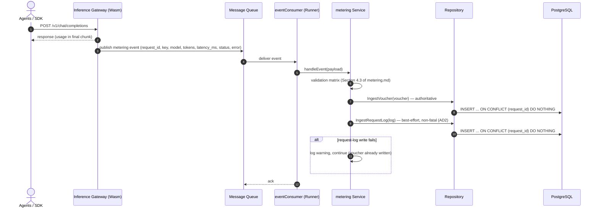
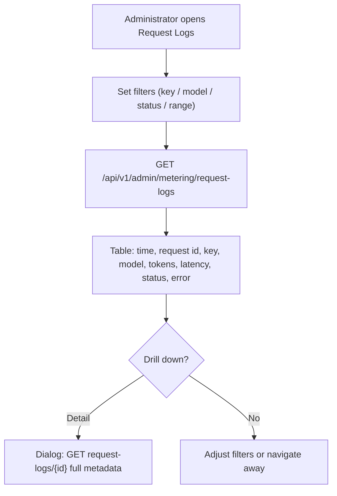
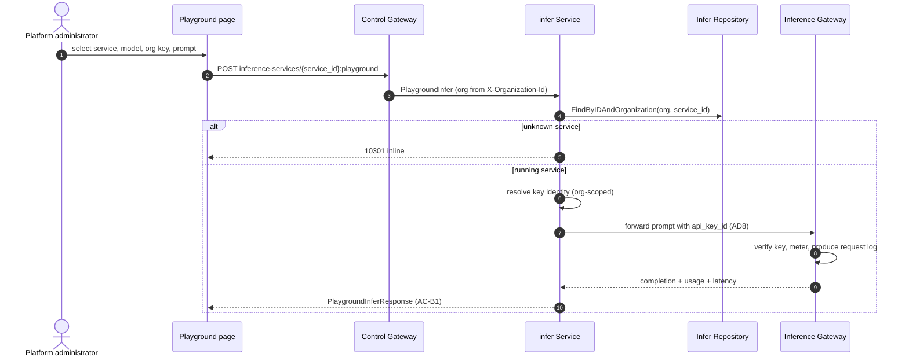

# Request Logs & API Playground — Architecture and Detailed Design

| Attribute | Content |
| --- | --- |
| Feature point | Request logs & API playground |
| Document scope | Architecture and detailed design for feature-12: the per-request `request_logs` table and its query APIs (Increment A), and the console API playground that sends a test inference through a control-gateway proxy RPC (Increment B), plus error handling, configuration, rollout, and function-level design per layer |
| Owning modules | `metering` (request-log capture, list/detail queries, retention), `infer` (playground proxy RPC), console web app; `auth` (API key identity) read-only |
| Related documents | [Requirement Analysis and UI/UX Design](../design/request-logs-playground.md) · [Architecture Design](../design/architecture.md) §2.5 (`metering`), §2.6 (`billing`), §4.3 (the metering/settlement sequence) · [Token Metering Vouchers & Async Settlement](./metering.md) (the voucher pipeline this feature extends with request metadata) · [Usage Dashboards & Per-Request Cost Attribution](./usage-dashboard.md) (the dashboard that attributes cost; its non-goal names feature-12 as the owner of full request context) · [API Key Management](./api-key-management.md) (the key identity on every log row) |
| Status | Architecture complete, handed to the Developer agent |

---

## 1. Overview and Goals

Features #1–#11 closed the accounting and observability loop: every inference request leaves a tamper-evident metering voucher, hourly settlement aggregates vouchers into usage records, pricing turns settled usage into charge records and bills, and the usage dashboard attributes cost per request. What the console still cannot answer is the operator's debugging question — *what actually happened on this request?* The voucher records token counts and identity but not latency, status, or error; the usage dashboard explicitly deferred full request context to this feature. And when an operator wants to try a model or verify a key, there is no in-console way to send a test inference — they must reach for `curl` against the data-plane gateway.

This feature delivers both. **Increment A** captures a per-request metadata log (latency, status, error) alongside the existing voucher, queryable and drillable in the console. **Increment B** adds an API playground that sends a test inference through a control-gateway proxy RPC using a selected org API key.

**Goals (Increment A)**: a `request_logs` table capturing per-request metadata; the metering event extended with `latency_ms`/`status`/`error`; a best-effort, non-fatal log write alongside the voucher in the same idempotent handler; 30-day retention; `ListRequestLogs` (filter by `api_key_id`/`model_id`/`status`/`since`/`until`, 10404 range) and `GetRequestLog` (10405 not-found) admin RPCs; a console Request Logs page with a filterable table and drill-down.

**Goals (Increment B)**: a `PlaygroundInfer` proxy RPC in the `infer` service (`POST /api/v1/admin/inference-services/{service_id}:playground`) that sends a test inference using a selected org API key; a console API Playground page with a three-pane form (service/model selector, prompt editor, response pane showing token usage + latency).

**Non-goals** (deferred): request/response body capture (D3 — privacy/storage); per-request cost on request logs (the usage dashboard owns cost attribution); real-time streaming playground responses (v1 renders the final completion); tenant self-service request-log visibility (#6/#7); changes to the voucher, settlement, or charging pipelines (read-only extension of the metering event); new charting or heavy dependencies in the console.

## 2. Architecture Decisions

| # | Decision | Rationale |
| --- | --- | --- |
| AD1 | **`request_logs` is a separate table from `vouchers`** — same ingestion event, different row, different lifecycle | Vouchers are immutable audit atoms with 90-day retention and settlement coupling; request logs are diagnostic metadata with 30-day retention and no settlement role. Sharing a table would force one lifecycle on both (design D1) |
| AD2 | **The request log is written best-effort and non-fatal** — the metering handler writes the voucher (authoritative) and then attempts the request-log row in the same idempotent handler; a request-log write failure is logged and never fails or retries the voucher | Request logs are diagnostic, not billing evidence; a log write must never jeopardize the authoritative voucher or block ingestion (design D2) |
| AD3 | **No request/response bodies in v1** — the log captures metadata only (identity, model, service, token counts, latency, status, error) | Bodies are a privacy and storage liability and are not needed to answer "what happened on this request"; metadata-only keeps the row small and the 30-day retention cheap (design D3) |
| AD4 | **30-day retention** for request logs, enforced by a periodic cleanup runner; vouchers keep their 90-day window | Request logs are diagnostic and lose value fast; 30 days bounds storage while covering the debugging window. Retention is configuration, not code (design D4) |
| AD5 | **The playground routes through a control-gateway proxy RPC `PlaygroundInfer`** in the `infer` service, using a selected org API key, and produces a real request log through the normal metered path | The playground must exercise the real inference path so test calls are visible in usage and request logs (the Chinese-platform pitfall); the control gateway keeps the data-plane gateway untouched (design D5) |
| AD6 | **New error code 10405 `CodeRequestLogNotFound`**; 10404 `CodeMeteringRangeInvalid` is reused for malformed ranges on request-log queries | The 104xx block is reserved for metering; distinct not-found vs invalid-range codes keep API consumers' handling precise, mirroring the metering D9 pattern (design D6) |
| AD7 | **The console gains a Request Logs page and an API Playground page** — the logs page is a filterable table with drill-down; the playground is a three-pane form (service/model selector, prompt editor, response pane) | Both are operator-facing debugging surfaces; they are separate pages because their tasks are distinct (retrospective inspection vs live experimentation) (design D7) |
| AD8 | **The playground proxy forwards by key identity, not plaintext** — the `infer` service resolves the service's endpoint and forwards the prompt to the data-plane gateway carrying the selected `api_key_id`; the gateway performs key verification and metering | The `auth` module stores only hashes (lookup_hash/salted_hash), never plaintext — the proxy cannot reconstruct the key secret. Forwarding by key id keeps the real metered path intact (D5) and the data-plane gateway remains the key-verification point |

## 3. Component Design

```mermaid
flowchart TD
    subgraph dp["Data Plane"]
        direction LR
        DGW["Inference Gateway<br/>Envoy + Wasm plugin"]
    end
    subgraph cp["Control Plane"]
        direction TB
        CGW["Control Gateway (grpc-gateway)<br/>HTTP management API"]
        MET["metering module<br/>ingestion · request-log capture · queries · retention"]
        INF["infer module<br/>PlaygroundInfer proxy"]
        PG[("PostgreSQL<br/>vouchers · usage_records<br/>request_logs (new)")]
        MQ["Message Queue<br/>metering.events"]
        CGW --> MET
        CGW --> INF
        MET --> PG
        INF --> PG
        MET --> MQ
    end
    subgraph ops["Operations"]
        direction LR
        ADMIN["Admin Console<br/>Request Logs page · Playground page"]
    end
    DGW -.->|metering events (extended)| MQ
    MQ --> MET
    ADMIN --> CGW
    classDef consumer fill:#FFFFFF,stroke:#A9BABD,stroke-width:1.5px,color:#17272B
    classDef edge fill:#007F86,stroke:#00565C,stroke-width:2px,color:#FFFFFF
    classDef svc fill:#CFE9EA,stroke:#4E9CA0,stroke-width:1.5px,color:#0B383D
    classDef store fill:#E7ECEE,stroke:#9AACB1,stroke-width:1.5px,color:#23343A
    classDef dpg fill:#F6CCC0,stroke:#C4623F,stroke-width:2px,color:#5F200A
    class ADMIN consumer
    class CGW edge
    class MET,INF,MQ svc
    class PG store
    class DGW dpg
    style ops fill:#FAFCFC,stroke:#C6D2D4,stroke-width:1.5px,color:#3B4C50
    style cp fill:#EDF7F7,stroke:#9CC7C9,stroke-width:1.5px,color:#2A6A6F
    style dp fill:#FDF2ED,stroke:#E4A48B,stroke-width:1.5px,color:#8A3419
```

| Component | Responsibility in this feature |
| --- | --- |
| Inference Gateway (data plane) | Publishes one metering event per completed inference request to `metering.events`, now carrying `latency_ms`/`status`/`error` (the Wasm plugin; out of repository scope — the event contract is pinned in Section 4.5). Also the key-verification point for playground requests (AD8) |
| Control Gateway (`grpc-gateway`) | HTTP/JSON facade for `ListRequestLogs`/`GetRequestLog` under `/api/v1/admin/metering` and `PlaygroundInfer` under `/api/v1/admin/inference-services`; passes `X-Organization-Id` through as gRPC metadata (the established pattern) |
| `metering` module (`services/metering`) | Event consumer (shared ingestion handler), voucher repository, request-log repository, request-log retention runner, query service |
| `infer` module (`services/infer`) | `PlaygroundInfer` proxy RPC: resolves the service endpoint and forwards the prompt to the data-plane gateway with the selected key id |
| PostgreSQL | `request_logs` table (new); `vouchers`/`usage_records` untouched |
| Message Queue | `metering.events` (consumed; the event body is extended additively) |
| `auth` module | Read-only: the playground resolves the selected key's identity (org scoping); no plaintext is ever exposed (AD8) |
| Console | Request Logs page (filterable table + drill-down) and Playground page (three-pane form) |

### 3.1 File Layout and Function-Level Responsibilities

| Module | File | Contents |
| --- | --- | --- |
| `proto/taas/metering/v1` | `metering.proto` | Additive: `IngestMeteringEventRequest` gains `latency_ms` (9), `status` (10), `error` (11); new `RequestLogStatus` enum, `RequestLog` message, `ListRequestLogs`/`GetRequestLog` RPCs (Section 5) |
| `proto/taas/infer/v1` | `infer.proto` | Additive: `PlaygroundInfer` RPC + request/response messages (Section 5) |
| `services/metering` | `metering_model.go` | New GORM model `RequestLog` + `TableName` (Section 4) |
| | `metering_repository.go` | `IngestRequestLog(ctx, log)` — idempotent INSERT ON CONFLICT (request_id) DO NOTHING, mirroring `IngestVoucher`; `FindRequestLogByID` (10405); `ListRequestLogs(ctx, filter)` (org/key/model/status/range, newest first, paginated); `DeleteRequestLogsBefore(ctx, cutoff, batch)` |
| | `service.go` | `handleEvent` extended: after the voucher write, build and write the request log best-effort (AD2); new RPCs `ListRequestLogs`, `GetRequestLog`; `Migrate`/`MigrateSchemaForFVT` gain `RequestLog` |
| | `event_consumer.go` | `meteringEvent` struct gains `LatencyMs`, `Status`, `Error`; JSON tags `latency_ms`/`status`/`error` |
| | `request_log_retention_runner.go` | `RequestLogRetentionRunner` (server.Runner, separate ticker) + `RetainOnce(ctx)` extracted for tests (the `RetentionRunner`/`ReconcileOnce` pattern) |
| `services/infer` | `service.go` | New RPC `PlaygroundInfer`: resolve org, resolve service (`FindByIDAndOrganization`), resolve key identity, forward to the service endpoint with the key id, return completion + token usage + latency (Section 6.3) |
| | `playground.go` | The forwarding client: builds the OpenAI-compatible request to the service endpoint, carries the key id, parses the completion/usage/latency (AD8) |
| `pkg/errors` | `codes.go`/`messages.go` | `CodeRequestLogNotFound` (10405) constant + canonical message "request log not found" |
| `pkg/config` | `api.go`/`configuration.go` | `metering.retention.requestLogTTL` (default 720h = 30 d) + `applyDefaults`/`Validate` (Section 3.2) |
| `apps/taas-server` | `main.go` | Register the `RequestLogRetentionRunner` after `srv.Init()` (the settlement/retention runner registration pattern) |
| `web/src` | `pages/RequestLogsPage.tsx`, `pages/PlaygroundPage.tsx`, `App.tsx`, `api.ts` | Routes `/admin/request-logs` and `/admin/playground`; `RequestLog`/`PlaygroundInfer` API types and calls (Section 3.3) |
| `test` | `fvt/request_logs_playground_fvt_test.go`, `e2e/tests/requestLogsPlayground.js` | Section 8 |

### 3.2 Configuration Additions

| Key | Default | Description |
| --- | --- | --- |
| `metering.retention.requestLogTTL` | `720h` (30 d) | Request logs older than this are deleted by the request-log retention runner (AD4) |

The existing `metering.retention` block already carries `enabled`/`batchSize`/`interval`; the request-log runner reuses `enabled` and `batchSize`/`interval` (a single retention kill switch and cadence for both tables), adding only `requestLogTTL`. `applyDefaults`/`Validate` follow the `metering.retention.voucherTTL` pattern.

### 3.3 Console Contract (pinned for the Developer agent)

Nav: the **Metering** group gains **Request Logs** (`/admin/request-logs`); a new **Playground** item (`/admin/playground`) sits in the top-level nav.

**Request Logs page** (`/admin/request-logs`): a filter bar (API key, model, status, time range with presets 24 h / 7 d / 30 d / custom) and a table — time, request id, key name, model, service, tokens in/out, latency, status badge (success green / error red / streaming blue), error (truncated). A row action "Detail" opens a drill-down dialog (`GetRequestLog`) showing the full metadata: all four token counts, latency, status, error, request id, key, model, service, created_at. The page shows a data-freshness note ("request logs appear within the ingestion window") and refreshes on a 60-second poll while visible. Empty state: "No request logs in this range" with a hint that logs appear after the first inference calls. Testids: `request-logs-table`, `request-log-row-{id}`, `request-log-filter-status`, `request-log-filter-key`, `request-log-filter-model`, `request-log-filter-range`, `request-log-detail-{id}`.

**Playground page** (`/admin/playground`): a three-pane form — a service/model selector (service dropdown, then model dropdown populated from the service), a prompt editor (textarea), and a response pane. The admin selects an org API key from a dropdown (the key whose identity the proxy forwards). The Send button is disabled until a service, model, key, and non-empty prompt are chosen. On send, the response pane shows the completion text, token usage (in/out/cached/reasoning), and latency; an error renders inline in the pane. Testids: `playground-service-select`, `playground-model-select`, `playground-key-select`, `playground-prompt-input`, `playground-send`, `playground-response`.

### 3.4 Security and Rollout Notes

- **Org scoping**: every request-log query resolves the org from `X-Organization-Id` (10001 when missing) and scopes the SQL to it — one org's header never returns another org's rows (AC-B5). The playground resolves the service and key within the header org.
- **No bodies, no plaintext**: request/response bodies are never captured (AD3); the playground forwards by key id, never a plaintext secret (AD8).
- **Best-effort isolation**: a request-log write failure is logged and never fails or retries the voucher (AD2) — the authoritative metering path is untouched.
- **Rollout**: one new table via AutoMigrate (additive); deploy `taas-server` alone — the request-log runner idles until the first pass, queries return empty until logs exist, and the event body extension is additive (old events carry empty latency/status and are logged as `success` with 0 latency). The infer proto change is additive; the playground route returns not-found until a running service exists.

## 4. Data Model

### 4.1 The `request_logs` Table

| Column | PostgreSQL type | Constraints | Description |
| --- | --- | --- | --- |
| `id` | `uuid` | PRIMARY KEY | Server-generated UUID v4, exposed as `request_log_id` |
| `request_id` | `varchar(128)` | NOT NULL, UNIQUE | The inference request id from the gateway; the idempotency key (AD1) |
| `organization_id` | `varchar(64)` | NOT NULL, index (composite) | Owning organization (transitional plain string, as on `vouchers`) |
| `api_key_id` | `varchar(64)` | NOT NULL, index (composite) | The API Key that made the request |
| `model_id` | `varchar(128)` | NOT NULL | The model that served the request |
| `service_id` | `varchar(64)` | NULL | The inference service that served the request, when known |
| `prompt_tokens` | `bigint` | NOT NULL DEFAULT 0 | Input token count |
| `completion_tokens` | `bigint` | NOT NULL DEFAULT 0 | Output token count |
| `cached_tokens` | `bigint` | NOT NULL DEFAULT 0 | Cache-hit token count |
| `reasoning_tokens` | `bigint` | NOT NULL DEFAULT 0 | Reasoning-trace token count |
| `latency_ms` | `bigint` | NOT NULL DEFAULT 0 | Request latency in milliseconds |
| `status` | `varchar(16)` | NOT NULL | `success` / `error` / `streaming` |
| `error` | `varchar(512)` | NOT NULL DEFAULT '' | Error message; empty on success |
| `created_at` | `timestamptz` | NOT NULL, index (composite) | Log write time (UTC) |

Design notes:

- The unique index on `request_id` is the idempotency mechanism: ingestion does INSERT … ON CONFLICT DO NOTHING, then re-selects by `request_id` — a duplicate event writes no second log row (AD2, AC-A2), mirroring `IngestVoucher`.
- Composite indexes: `idx_request_logs_org_created (organization_id, created_at)` for the list; `idx_request_logs_key_created (api_key_id, created_at)` for key-filtered queries; `status` indexed for status filtering (FR-A1.4).
- No foreign keys to `api_keys` / `models` / `inference_services`: request logs must outlive revoked keys, deleted models, and terminated services — they are diagnostic evidence, not relational state (mirrors the voucher reasoning).
- Request logs are immutable: no API updates or deletes them; the request-log retention runner is the only deleter (AD4).

## 5. API Design

### 5.1 Increment A — request-log queries

All belong to **`taas.metering.v1.MeteringService`** (`proto/taas/metering/v1/metering.proto`), served as HTTP via the Control Gateway, org-scoped via `X-Organization-Id`. Proto changes are additive.

| RPC | HTTP | Status | Purpose |
| --- | --- | --- | --- |
| `ListRequestLogs` | `GET /api/v1/admin/metering/request-logs` | **new** | Filterable request-log list (`api_key_id`, `model_id`, `status`, `since`/`until`) |
| `GetRequestLog` | `GET /api/v1/admin/metering/request-logs/{request_log_id}` | **new** | One request log for drill-down; unknown id returns 10405 |

Message sketches (new; field numbers continue each message's sequence):

```protobuf
enum RequestLogStatus {
  REQUEST_LOG_STATUS_UNSPECIFIED = 0;
  REQUEST_LOG_STATUS_SUCCESS = 1;
  REQUEST_LOG_STATUS_ERROR = 2;
  REQUEST_LOG_STATUS_STREAMING = 3;
}

message RequestLog {
  string request_log_id = 1;
  string request_id = 2;
  string organization_id = 3;
  string api_key_id = 4;
  string model_id = 5;
  string service_id = 6;   // empty when unknown
  int64 prompt_tokens = 7;
  int64 completion_tokens = 8;
  int64 cached_tokens = 9;
  int64 reasoning_tokens = 10;
  int64 latency_ms = 11;
  RequestLogStatus status = 12;
  string error = 13;
  int64 created_at = 14;
}

message ListRequestLogsRequest {
  taas.common.v1.PageRequest page = 1;
  int64 since = 2;
  int64 until = 3;
  string api_key_id = 4;
  string model_id = 5;
  RequestLogStatus status = 6;
}

message ListRequestLogsResponse {
  taas.common.v1.Response response = 1;
  repeated RequestLog request_logs = 2;
  taas.common.v1.PageMeta page_meta = 3;
}

message GetRequestLogRequest { string request_log_id = 1; }
message GetRequestLogResponse {
  taas.common.v1.Response response = 1;
  RequestLog request_log = 2;
}
```

`IngestMeteringEventRequest` gains three additive fields (the event extension, FR-A1.1):

```protobuf
message IngestMeteringEventRequest {
  // ... existing fields 1-8 ...
  int64 latency_ms = 9;          // request latency in milliseconds
  RequestLogStatus status = 10;  // success / error / streaming
  string error = 11;             // error message; empty on success
}
```

Constraints on the contract:

1. `ListRequestLogs` validates `since`/`until` (int64 unix seconds; defaults `until = now`, `since = until − 24h`); `since > until` or a range > 92 days returns 10404 (reusing `validateRange`). `status` is an enum; an unrecognized value fails standard request validation.
2. `RequestLog` rows carry the complete metadata view without a second call.
3. Wire conventions unchanged: dotted pagination, HTTP 200 on success, business errors as `{"code": <int>, "message": "..."}`, int64 fields serialized as JSON strings.

### 5.2 Increment B — playground proxy

Belongs to **`taas.infer.v1.InferServiceService`** (`proto/taas/infer/v1/infer.proto`), served as HTTP via the Control Gateway.

| RPC | HTTP | Status | Purpose |
| --- | --- | --- | --- |
| `PlaygroundInfer` | `POST /api/v1/admin/inference-services/{service_id}:playground` | **new** | Send a test inference using a selected org API key; returns completion, token usage, latency |

Message sketches:

```protobuf
message PlaygroundInferRequest {
  string service_id = 1;   // path
  string api_key_id = 2;   // the selected org API key identity
  string model_id = 3;
  string prompt = 4;
}

message PlaygroundInferResponse {
  taas.common.v1.Response response = 1;
  string completion = 2;
  int64 prompt_tokens = 3;
  int64 completion_tokens = 4;
  int64 cached_tokens = 5;
  int64 reasoning_tokens = 6;
  int64 latency_ms = 7;
}
```

Constraints on the contract:

1. `PlaygroundInfer` takes `service_id` (path), `api_key_id`, `model_id`, and `prompt`; it forwards with the selected key's identity so the call is metered and logged (D5, AD8).
2. The response carries the completion text, the four token counts, and `latency_ms`; an inference failure surfaces the error in the response.
3. An unknown `service_id` returns 10301 `CodeInferServiceNotFound`; an unknown `api_key_id` returns 10007 `CodeAPIKeyNotFound`; a blocked key surfaces the gating error (10502/402) inline.

## 6. Sequence Flows

### 6.1 Request-Log Capture (extends the ingestion handler)



### 6.2 Request Logs Page Flow



### 6.3 Playground Proxy



## 7. Error Handling

All errors are `pkg/errors` business codes in the unified envelope. One new code is allocated (AD6); the rest already exist.

| Condition | Code | Constant | Notes |
| --- | --- | --- | --- |
| Malformed time range on `ListRequestLogs` (`since > until`, range > 92 days) | 10404 | `CodeMeteringRangeInvalid` | **Reused** — the request-log queries join the uniform metering range contract |
| Unknown `request_log_id` on `GetRequestLog` | 10405 | `CodeRequestLogNotFound` | **New** (AD6) |
| Unknown `service_id` on `PlaygroundInfer` | 10301 | `CodeInferServiceNotFound` | Existing |
| Unknown `api_key_id` on `PlaygroundInfer` | 10007 | `CodeAPIKeyNotFound` | Existing |
| Inference blocked by funds/quota on `PlaygroundInfer` | 10502 | `CodeInsufficientFunds` | Existing; surfaced inline in the response pane |
| Missing `X-Organization-Id` on admin APIs | 10001 | `CodeUnauthorized` | The `resolveOrganizationID` pattern |
| Database / MQ infrastructure failure | 500 | `CodeInternal` | Via error normalization |

Runner-side failures are not RPC errors: a request-log retention delete failure is logged and retried on the next tick (the voucher retention pattern). A request-log write failure inside ingestion is logged and never fails or retries the voucher (AD2, AC-A3).

## 8. Testing Strategy

- **Unit** (`services/metering`, sqlite in-memory): `metering_repository_test.go` — `IngestRequestLog` idempotency (a duplicate `request_id` writes no second row, AC-A2), `ListRequestLogs` filters (key/model/status/range, newest first, paginated, AC-A4), `FindRequestLogByID` (10405 on unknown, AC-A5), `DeleteRequestLogsBefore` batching (AC-A7). `service_test.go` — `handleEvent` writes both voucher and request log with the same `request_id` (AC-A1); a request-log write failure still writes and returns the voucher (AC-A3); `ListRequestLogs` range validation returns 10404 (AC-A6); org scoping (AC-B5). Coverage ≥ 80% on the new files.
- **Unit** (`services/infer`, sqlite in-memory): `service_test.go` — `PlaygroundInfer` resolves the service within the org (10301 on unknown), forwards with the key id, returns completion + usage + latency (AC-B1); a blocked key surfaces the gating error (AC-B4).
- **FVT** (`test/fvt/request_logs_playground_fvt_test.go`, the metering FVT pattern: file-backed sqlite + `MigrateSchemaForFVT` + `NewForFVT` + gRPC server with the production interceptor + gateway mux with `FVTHeaderMatcher`): ingest an extended event through the gateway and assert a voucher and a request-log row share the `request_id` (AC-A1); redeliver and assert no second log row (AC-A2); `ListRequestLogs` filters and pagination (AC-A4); `GetRequestLog` full metadata and 10405 (AC-A5); range validation 10404 (AC-A6); retention via `RetainOnce` leaves vouchers untouched (AC-A7); a second org never sees the first org's rows (AC-B5); `PlaygroundInfer` round-trip against a running service (AC-B1) and the resulting request-log row (AC-B2).
- **E2E** (`test/e2e/tests/requestLogsPlayground.js`, the `usageDashboard.js` pattern): against the compose stack — the Request Logs page renders `request-log-row-{id}`, the status filter is `request-log-filter-status`, the empty state shows when no rows match (AC-A8); the Detail dialog `request-log-detail-{id}` shows full metadata (AC-A9); the Playground page controls (`playground-service-select`, `playground-prompt-input`, `playground-send` disabled until all set) (AC-B3); a send renders the response pane `playground-response` with completion/usage/latency (AC-B1); a failed inference renders the error inline (AC-B4); a playground request appears as a normal request-log row (AC-B2).
- **Regression**: the existing e2e suites stay green; the metering event body extension is additive (old events carry empty latency/status and are logged as `success` with 0 latency), and the voucher path is byte-for-byte unchanged.

## 9. Open Questions

| Question | Leaning |
| --- | --- |
| Request/response body capture for deep debugging | Deferred (AD3) — revisit only if metadata-only logs prove insufficient; would need explicit privacy and storage design |
| Streaming playground responses (render tokens as they arrive) | Future refinement — v1 renders the final completion |
| Playground parameter controls (temperature, max tokens, etc.) | Future enhancement — v1 sends a plain prompt |
| Tenant self-service request-log visibility and playground | Features #6/#7 scoping first |
| Server-side export of request logs (CSV/JSON) for large audits | Future console enhancement — v1 offers the filterable table and drill-down |