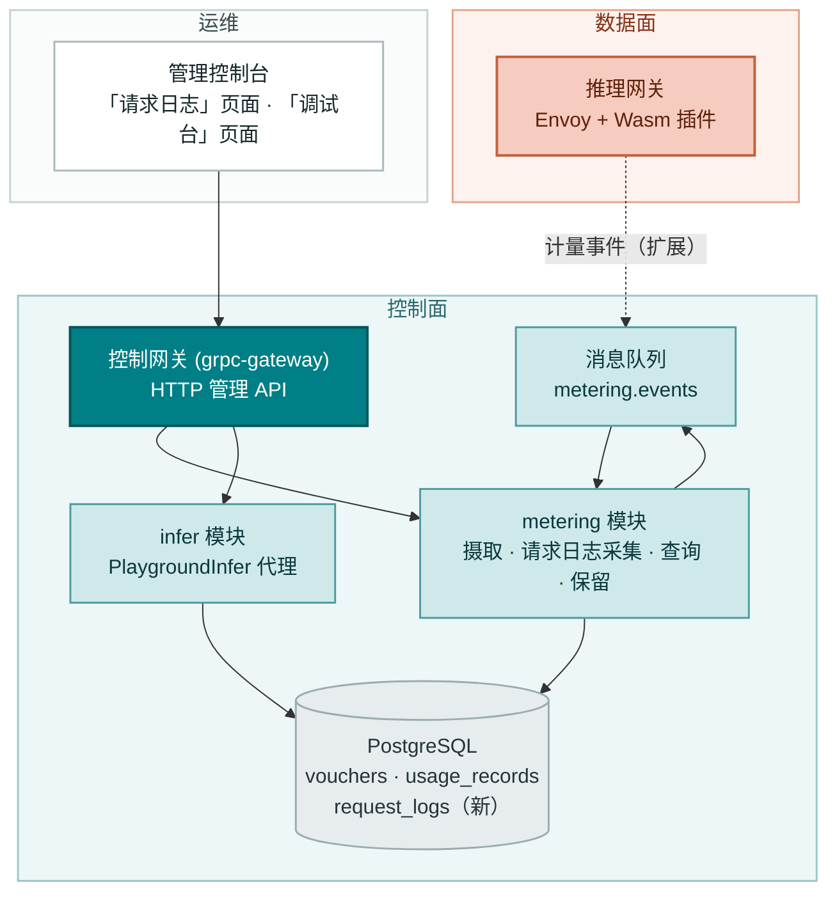
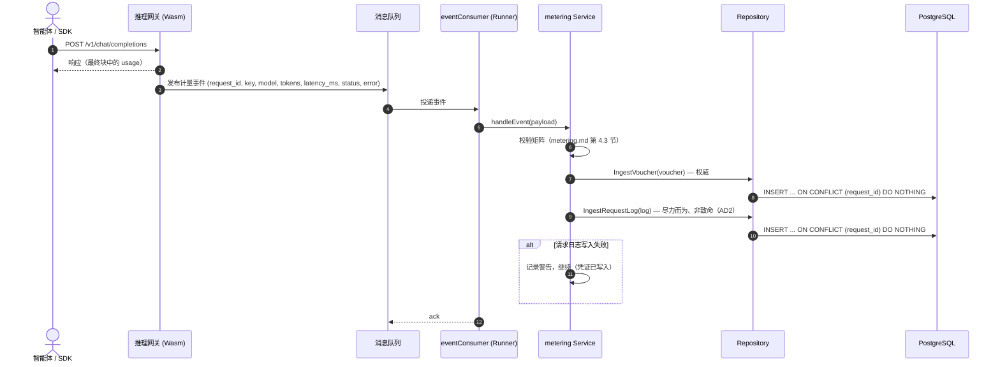
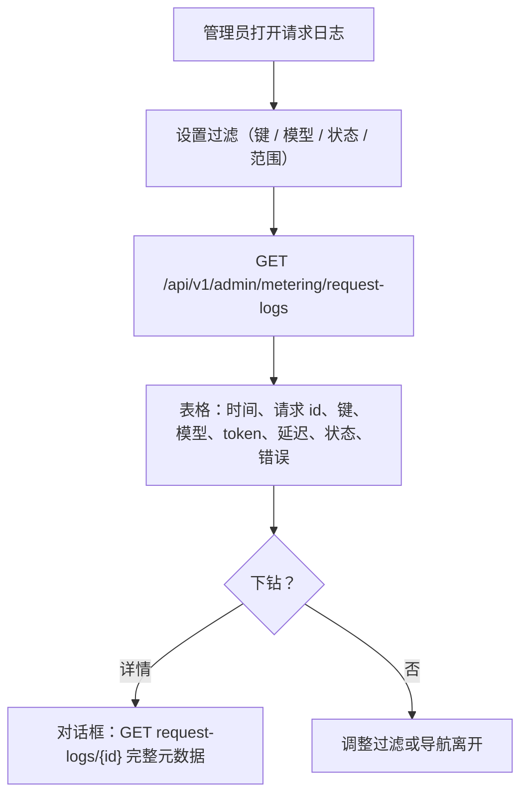
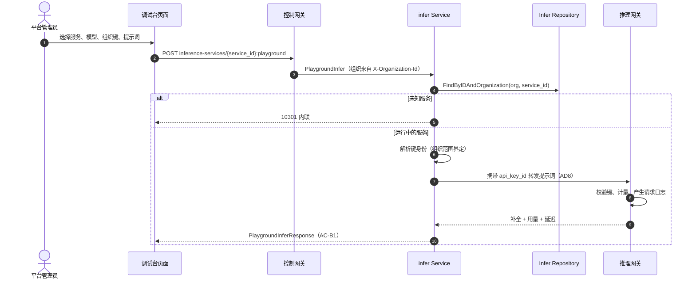

# 请求日志与 API 调试台 — 架构与详细设计

| 属性 | 内容 |
| --- | --- |
| 特性点 | 请求日志与 API 调试台 |
| 文档范围 | 特性-12 的架构与详细设计：按请求的 `request_logs` 表及其查询 API（增量 A），以及经控制网关代理 RPC 发送测试推理的控制台 API 调试台（增量 B），外加错误处理、配置、发布，以及各层的函数级设计 |
| 归属模块 | `metering`（请求日志采集、列表/详情查询、保留）、`infer`（调试台代理 RPC）、控制台 Web 应用；`auth`（API Key 身份）只读 |
| 相关文档 | [需求分析与 UI/UX 设计](../design/request-logs-playground.zh-cn.md) · [架构设计](../design/architecture.zh-cn.md) 第 2.5 节（`metering`）、第 2.6 节（`billing`）、第 4.3 节（计量/结算时序） · [Token 计量凭证与异步结算](./metering.zh-cn.md)（本特性以请求元数据扩展的凭证管道） · [用量看板与按请求成本归因](./usage-dashboard.zh-cn.md)（归因成本的看板；其非目标将完整请求上下文的所有权命名为特性-12） · [API Key 管理](./api-key-management.zh-cn.md)（每条日志行上的键身份） |
| 状态 | 架构完成，已移交开发代理 |

---

## 1. 概述与目标

特性 #1–#11 闭环了账务与可观测性：每次推理请求留下一张防篡改的计量凭证，按小时结算把凭证聚合成用量记录，定价把已结算用量转换为计费记录与账单，用量看板按请求归因成本。但控制台仍无法回答运营者的调试问题 — *这次请求到底发生了什么？* 凭证记录 token 数与身份，却不记录延迟、状态或错误；用量看板明确把完整请求上下文延后到本特性。而当运营者想试一个模型或验证一把 Key 时，控制台内没有任何发送测试推理的方式 — 他们必须对数据面网关使用 `curl`。

本特性两者都交付。**增量 A** 在既有凭证之外采集按请求的元数据日志（延迟、状态、错误），可在控制台查询与下钻。**增量 B** 新增一个 API 调试台，使用所选组织 API Key 经控制网关代理 RPC 发送测试推理。

**目标（增量 A）**：一张 `request_logs` 表采集按请求的元数据；计量事件扩展 `latency_ms`/`status`/`error`；在同一幂等处理器内、凭证旁以尽力而为、非致命的方式写入日志；30 天保留；`ListRequestLogs`（按 `api_key_id`/`model_id`/`status`/`since`/`until` 过滤，10404 范围）与 `GetRequestLog`（10405 未找到）管理 RPC；控制台「请求日志」页面，带可过滤表格与下钻。

**目标（增量 B）**：`infer` 服务中的 `PlaygroundInfer` 代理 RPC（`POST /api/v1/admin/inference-services/{service_id}:playground`），使用所选组织 API Key 发送测试推理；控制台「API 调试台」页面，三栏表单（服务/模型选择器、提示词编辑器、展示 token 用量与延迟的响应面板）。

**非目标**（延后）：请求/响应体采集（D3 — 隐私/存储）；请求日志上的按请求成本（用量看板拥有成本归因）；实时流式调试台响应（v1 渲染最终补全）；租户自助请求日志可见性（#6/#7）；对凭证、结算或计费管道的改动（计量事件的只读扩展）；控制台新增图表或重型依赖。

## 2. 架构决策

| # | 决策 | 理由 |
| --- | --- | --- |
| AD1 | **`request_logs` 是与 `vouchers` 分离的表** — 同一摄取事件，不同行，不同生命周期 | 凭证是不可变的审计原子，90 天保留且与结算耦合；请求日志是诊断元数据，30 天保留且无结算角色。共享一张表会迫使两者共用同一生命周期（设计 D1） |
| AD2 | **请求日志以尽力而为、非致命的方式写入** — 计量处理器先写凭证（权威），再在同一幂等处理器内尝试请求日志行；请求日志写入失败仅记录日志，绝不失败或重试凭证 | 请求日志是诊断而非计费证据；日志写入绝不能危及权威凭证或阻塞摄取（设计 D2） |
| AD3 | **v1 不采集请求/响应体** — 日志仅采集元数据（身份、模型、服务、token 数、延迟、状态、错误） | 请求体是隐私与存储负担，且回答「这次请求发生了什么」并不需要它们；仅元数据让行保持小巧、30 天保留廉价（设计 D3） |
| AD4 | **请求日志 30 天保留**，由周期性清理 runner 强制执行；凭证保持其 90 天窗口 | 请求日志是诊断性的，价值衰减很快；30 天在覆盖调试窗口的同时约束存储。保留是配置而非代码（设计 D4） |
| AD5 | **调试台经 `infer` 服务中的控制网关代理 RPC `PlaygroundInfer` 路由**，使用所选组织 API Key，并经正常计量路径产生真实请求日志 | 调试台必须走真实推理路径，使测试调用在用量与请求日志中可见（中国平台陷阱）；控制网关让数据面网关保持不动（设计 D5） |
| AD6 | **新增错误码 10405 `CodeRequestLogNotFound`**；10404 `CodeMeteringRangeInvalid` 复用于请求日志查询上的畸形范围 | 104xx 块为计量保留；区分未找到与范围无效让 API 消费方的处理更精确，镜像计量 D9 模式（设计 D6） |
| AD7 | **控制台新增「请求日志」页面与「API 调试台」页面** — 日志页是可过滤表格带下钻；调试台是三栏表单（服务/模型选择器、提示词编辑器、响应面板） | 两者都是面向运营者的调试界面；它们是独立页面，因为任务不同（回顾式检查 vs 实时实验）（设计 D7） |
| AD8 | **调试台代理按键身份转发，而非明文** — `infer` 服务解析服务的端点，携带所选 `api_key_id` 把提示词转发给数据面网关；网关执行 Key 校验与计量 | `auth` 模块只存哈希（lookup_hash/salted_hash），从不存明文 — 代理无法重建 Key 密钥。按键 id 转发保持真实计量路径完整（D5），数据面网关仍是 Key 校验点 |

## 3. 组件设计



| 组件 | 本特性中的职责 |
| --- | --- |
| 推理网关（数据面） | 每次完成的推理请求向 `metering.events` 发布一条计量事件，现携带 `latency_ms`/`status`/`error`（Wasm 插件；不在仓库范围内 — 事件契约在第 4.5 节钉死）。也是调试台请求的 Key 校验点（AD8） |
| 控制网关（`grpc-gateway`） | `/api/v1/admin/metering` 下 `ListRequestLogs`/`GetRequestLog` 与 `/api/v1/admin/inference-services` 下 `PlaygroundInfer` 的 HTTP/JSON 门面；将 `X-Organization-Id` 作为 gRPC metadata 透传（既定模式） |
| `metering` 模块（`services/metering`） | 事件消费者（共享摄取处理器）、凭证仓库、请求日志仓库、请求日志保留 runner、查询服务 |
| `infer` 模块（`services/infer`） | `PlaygroundInfer` 代理 RPC：解析服务端点，携带所选键 id 把提示词转发给数据面网关 |
| PostgreSQL | `request_logs` 表（新）；`vouchers`/`usage_records` 不动 |
| 消息队列 | `metering.events`（被消费；事件体以增量方式扩展） |
| `auth` 模块 | 只读：调试台解析所选键的身份（组织范围界定）；绝不暴露明文（AD8） |
| 控制台 | 「请求日志」页面（可过滤表格 + 下钻）与「调试台」页面（三栏表单） |

### 3.1 文件布局与函数级职责

| 模块 | 文件 | 内容 |
| --- | --- | --- |
| `proto/taas/metering/v1` | `metering.proto` | 增量：`IngestMeteringEventRequest` 新增 `latency_ms`（9）、`status`（10）、`error`（11）；新 `RequestLogStatus` 枚举、`RequestLog` 消息、`ListRequestLogs`/`GetRequestLog` RPC（第 5 节） |
| `proto/taas/infer/v1` | `infer.proto` | 增量：`PlaygroundInfer` RPC + 请求/响应消息（第 5 节） |
| `services/metering` | `metering_model.go` | 新 GORM 模型 `RequestLog` + `TableName`（第 4 节） |
| | `metering_repository.go` | `IngestRequestLog(ctx, log)` — 幂等 INSERT ON CONFLICT (request_id) DO NOTHING，镜像 `IngestVoucher`；`FindRequestLogByID`（10405）；`ListRequestLogs(ctx, filter)`（组织/键/模型/状态/范围，最新在前，分页）；`DeleteRequestLogsBefore(ctx, cutoff, batch)` |
| | `service.go` | `handleEvent` 扩展：凭证写入后，以尽力而为的方式构建并写入请求日志（AD2）；新 RPC `ListRequestLogs`、`GetRequestLog`；`Migrate`/`MigrateSchemaForFVT` 新增 `RequestLog` |
| | `event_consumer.go` | `meteringEvent` 结构体新增 `LatencyMs`、`Status`、`Error`；JSON 标签 `latency_ms`/`status`/`error` |
| | `request_log_retention_runner.go` | `RequestLogRetentionRunner`（server.Runner，独立 ticker）+ 为测试提取的 `RetainOnce(ctx)`（`RetentionRunner`/`ReconcileOnce` 模式） |
| `services/infer` | `service.go` | 新 RPC `PlaygroundInfer`：解析组织、解析服务（`FindByIDAndOrganization`）、解析键身份、携带键 id 转发到服务端点，返回补全 + token 用量 + 延迟（第 6.3 节） |
| | `playground.go` | 转发客户端：向服务端点构建 OpenAI 兼容请求，携带键 id，解析补全/用量/延迟（AD8） |
| `pkg/errors` | `codes.go`/`messages.go` | `CodeRequestLogNotFound`（10405）常量 + 规范消息 "request log not found" |
| `pkg/config` | `api.go`/`configuration.go` | `metering.retention.requestLogTTL`（默认 720h = 30 天）+ `applyDefaults`/`Validate`（第 3.2 节） |
| `apps/taas-server` | `main.go` | `srv.Init()` 之后注册 `RequestLogRetentionRunner`（结算/保留 runner 注册模式） |
| `web/src` | `pages/RequestLogsPage.tsx`、`pages/PlaygroundPage.tsx`、`App.tsx`、`api.ts` | 路由 `/admin/request-logs` 与 `/admin/playground`；`RequestLog`/`PlaygroundInfer` API 类型与调用（第 3.3 节） |
| `test` | `fvt/request_logs_playground_fvt_test.go`、`e2e/tests/requestLogsPlayground.js` | 第 8 节 |

### 3.2 配置增量

| 键 | 默认值 | 描述 |
| --- | --- | --- |
| `metering.retention.requestLogTTL` | `720h`（30 天） | 早于该值的请求日志由请求日志保留 runner 删除（AD4） |

既有 `metering.retention` 块已携带 `enabled`/`batchSize`/`interval`；请求日志 runner 复用 `enabled` 与 `batchSize`/`interval`（两张表共用一个保留总开关与节奏），仅新增 `requestLogTTL`。`applyDefaults`/`Validate` 沿用 `metering.retention.voucherTTL` 模式。

### 3.3 控制台契约（为开发代理钉死）

导航：**Metering** 分组新增**请求日志**（`/admin/request-logs`）；新的**调试台**项（`/admin/playground`）位于顶层导航。

**「请求日志」页面**（`/admin/request-logs`）：过滤栏（API Key、模型、状态、时间范围，预设 24 小时 / 7 天 / 30 天 / 自定义）与表格 — 时间、请求 id、键名、模型、服务、输入/输出 token、延迟、状态徽标（成功绿 / 错误红 / 流式蓝）、错误（截断）。行操作「详情」打开下钻对话框（`GetRequestLog`），展示完整元数据：全部四个 token 数、延迟、状态、错误、请求 id、键、模型、服务、created_at。页面显示数据新鲜度提示（「请求日志在摄取窗口内出现」），并在可见时以 60 秒轮询刷新。空态：「该范围内暂无请求日志」，附提示日志在首次推理调用后出现。Testid：`request-logs-table`、`request-log-row-{id}`、`request-log-filter-status`、`request-log-filter-key`、`request-log-filter-model`、`request-log-filter-range`、`request-log-detail-{id}`。

**「调试台」页面**（`/admin/playground`）：三栏表单 — 服务/模型选择器（服务下拉，再按服务填充模型下拉）、提示词编辑器（textarea）、响应面板。管理员从下拉选择组织 API Key（代理转发其身份的键）。发送按钮在服务、模型、键与非空提示词都选定前禁用。发送后，响应面板展示补全文本、token 用量（输入/输出/缓存/推理）与延迟；错误在面板内联渲染。Testid：`playground-service-select`、`playground-model-select`、`playground-key-select`、`playground-prompt-input`、`playground-send`、`playground-response`。

### 3.4 安全与发布说明

- **组织范围界定**：每个请求日志查询从 `X-Organization-Id` 解析组织（缺失时 10001）并将 SQL 限定于该组织 — 一个组织的请求头绝不能返回另一个组织的行（AC-B5）。调试台在请求头组织内解析服务与键。
- **无请求体、无明文**：请求/响应体绝不采集（AD3）；调试台按键 id 转发，绝不明文密钥（AD8）。
- **尽力而为隔离**：请求日志写入失败仅记录日志，绝不失败或重试凭证（AD2）— 权威计量路径不受影响。
- **发布**：AutoMigrate 建一张新表（增量）；只部署 `taas-server` — 请求日志 runner 在首次通过前空转，日志存在前查询返回空，事件体扩展是增量的（旧事件携带空 latency/status，以 `success` 与 0 延迟记录）。infer proto 变更是增量的；调试台路由在存在运行中的服务前返回未找到。

## 4. 数据模型

### 4.1 `request_logs` 表

| 列 | PostgreSQL 类型 | 约束 | 描述 |
| --- | --- | --- | --- |
| `id` | `uuid` | 主键 | 服务端生成的 UUID v4，暴露为 `request_log_id` |
| `request_id` | `varchar(128)` | NOT NULL，UNIQUE | 来自网关的推理请求 id；幂等键（AD1） |
| `organization_id` | `varchar(64)` | NOT NULL，索引（复合） | 所属组织（过渡性纯字符串，同 `vouchers`） |
| `api_key_id` | `varchar(64)` | NOT NULL，索引（复合） | 发起请求的 API Key |
| `model_id` | `varchar(128)` | NOT NULL | 服务该请求的模型 |
| `service_id` | `varchar(64)` | NULL | 服务该请求的推理服务，已知时 |
| `prompt_tokens` | `bigint` | NOT NULL DEFAULT 0 | 输入 token 数 |
| `completion_tokens` | `bigint` | NOT NULL DEFAULT 0 | 输出 token 数 |
| `cached_tokens` | `bigint` | NOT NULL DEFAULT 0 | 缓存命中 token 数 |
| `reasoning_tokens` | `bigint` | NOT NULL DEFAULT 0 | 推理轨迹 token 数 |
| `latency_ms` | `bigint` | NOT NULL DEFAULT 0 | 请求延迟（毫秒） |
| `status` | `varchar(16)` | NOT NULL | `success` / `error` / `streaming` |
| `error` | `varchar(512)` | NOT NULL DEFAULT '' | 错误消息；成功时为空 |
| `created_at` | `timestamptz` | NOT NULL，索引（复合） | 日志写入时间（UTC） |

设计说明：

- `request_id` 上的唯一索引是幂等机制：摄取执行 INSERT … ON CONFLICT DO NOTHING，再按 `request_id` 重选 — 重复事件不写第二行日志（AD2、AC-A2），镜像 `IngestVoucher`。
- 复合索引：`idx_request_logs_org_created (organization_id, created_at)` 用于列表；`idx_request_logs_key_created (api_key_id, created_at)` 用于按键过滤的查询；`status` 建索引用于状态过滤（FR-A1.4）。
- 无指向 `api_keys` / `models` / `inference_services` 的外键：请求日志必须比被撤销的键、被删除的模型与被终止的服务活得更久 — 它们是诊断证据，而非关系状态（镜像凭证的推理）。
- 请求日志不可变：无 API 更新或删除它们；请求日志保留 runner 是唯一删除者（AD4）。

## 5. API 设计

### 5.1 增量 A — 请求日志查询

全部属于 **`taas.metering.v1.MeteringService`**（`proto/taas/metering/v1/metering.proto`），经控制网关以 HTTP 提供，经 `X-Organization-Id` 组织范围界定。Proto 变更是增量的。

| RPC | HTTP | 状态 | 用途 |
| --- | --- | --- | --- |
| `ListRequestLogs` | `GET /api/v1/admin/metering/request-logs` | **新** | 可过滤的请求日志列表（`api_key_id`、`model_id`、`status`、`since`/`until`） |
| `GetRequestLog` | `GET /api/v1/admin/metering/request-logs/{request_log_id}` | **新** | 单条请求日志用于下钻；未知 id 返回 10405 |

消息草图（新；字段号延续各消息的序列）：

```protobuf
enum RequestLogStatus {
  REQUEST_LOG_STATUS_UNSPECIFIED = 0;
  REQUEST_LOG_STATUS_SUCCESS = 1;
  REQUEST_LOG_STATUS_ERROR = 2;
  REQUEST_LOG_STATUS_STREAMING = 3;
}

message RequestLog {
  string request_log_id = 1;
  string request_id = 2;
  string organization_id = 3;
  string api_key_id = 4;
  string model_id = 5;
  string service_id = 6;   // 未知时为空
  int64 prompt_tokens = 7;
  int64 completion_tokens = 8;
  int64 cached_tokens = 9;
  int64 reasoning_tokens = 10;
  int64 latency_ms = 11;
  RequestLogStatus status = 12;
  string error = 13;
  int64 created_at = 14;
}

message ListRequestLogsRequest {
  taas.common.v1.PageRequest page = 1;
  int64 since = 2;
  int64 until = 3;
  string api_key_id = 4;
  string model_id = 5;
  RequestLogStatus status = 6;
}

message ListRequestLogsResponse {
  taas.common.v1.Response response = 1;
  repeated RequestLog request_logs = 2;
  taas.common.v1.PageMeta page_meta = 3;
}

message GetRequestLogRequest { string request_log_id = 1; }
message GetRequestLogResponse {
  taas.common.v1.Response response = 1;
  RequestLog request_log = 2;
}
```

`IngestMeteringEventRequest` 新增三个增量字段（事件扩展，FR-A1.1）：

```protobuf
message IngestMeteringEventRequest {
  // ... 既有字段 1-8 ...
  int64 latency_ms = 9;          // 请求延迟（毫秒）
  RequestLogStatus status = 10;  // success / error / streaming
  string error = 11;             // 错误消息；成功时为空
}
```

契约约束：

1. `ListRequestLogs` 校验 `since`/`until`（int64 Unix 秒；默认 `until = now`，`since = until − 24h`）；`since > until` 或范围 > 92 天返回 10404（复用 `validateRange`）。`status` 是枚举；无法识别的值使标准请求校验失败。
2. `RequestLog` 行携带完整元数据视图，无需二次调用。
3. 线上约定不变：点分分页、成功时 HTTP 200、业务错误为 `{"code": <int>, "message": "..."}`、int64 字段按 JSON 字符串序列化。

### 5.2 增量 B — 调试台代理

属于 **`taas.infer.v1.InferServiceService`**（`proto/taas/infer/v1/infer.proto`），经控制网关以 HTTP 提供。

| RPC | HTTP | 状态 | 用途 |
| --- | --- | --- | --- |
| `PlaygroundInfer` | `POST /api/v1/admin/inference-services/{service_id}:playground` | **新** | 使用所选组织 API Key 发送测试推理；返回补全、token 用量、延迟 |

消息草图：

```protobuf
message PlaygroundInferRequest {
  string service_id = 1;   // 路径
  string api_key_id = 2;   // 所选组织 API Key 身份
  string model_id = 3;
  string prompt = 4;
}

message PlaygroundInferResponse {
  taas.common.v1.Response response = 1;
  string completion = 2;
  int64 prompt_tokens = 3;
  int64 completion_tokens = 4;
  int64 cached_tokens = 5;
  int64 reasoning_tokens = 6;
  int64 latency_ms = 7;
}
```

契约约束：

1. `PlaygroundInfer` 接收 `service_id`（路径）、`api_key_id`、`model_id` 与 `prompt`；以所选键的身份转发，使调用被计量并记录（D5、AD8）。
2. 响应携带补全文本、四个 token 数与 `latency_ms`；推理失败在响应中呈现错误。
3. 未知 `service_id` 返回 10301 `CodeInferServiceNotFound`；未知 `api_key_id` 返回 10007 `CodeAPIKeyNotFound`；被阻断的键内联呈现门控错误（10502/402）。

## 6. 时序流程

### 6.1 请求日志采集（扩展摄取处理器）



### 6.2 「请求日志」页面流程



### 6.3 调试台代理



## 7. 错误处理

所有错误都是统一信封中的 `pkg/errors` 业务码。分配一个新码（AD6）；其余已存在。

| 条件 | 码 | 常量 | 说明 |
| --- | --- | --- | --- |
| `ListRequestLogs` 上畸形时间范围（`since > until`、范围 > 92 天） | 10404 | `CodeMeteringRangeInvalid` | **复用** — 请求日志查询加入统一的计量范围契约 |
| `GetRequestLog` 上未知 `request_log_id` | 10405 | `CodeRequestLogNotFound` | **新**（AD6） |
| `PlaygroundInfer` 上未知 `service_id` | 10301 | `CodeInferServiceNotFound` | 既有 |
| `PlaygroundInfer` 上未知 `api_key_id` | 10007 | `CodeAPIKeyNotFound` | 既有 |
| `PlaygroundInfer` 上推理被资金/配额阻断 | 10502 | `CodeInsufficientFunds` | 既有；在响应面板内联呈现 |
| 管理 API 上缺失 `X-Organization-Id` | 10001 | `CodeUnauthorized` | `resolveOrganizationID` 模式 |
| 数据库 / MQ 基础设施故障 | 500 | `CodeInternal` | 经错误归一化 |

Runner 侧失败不是 RPC 错误：请求日志保留删除失败仅记录日志，并在下一 tick 重试（凭证保留模式）。摄取内的请求日志写入失败仅记录日志，绝不失败或重试凭证（AD2、AC-A3）。

## 8. 测试策略

- **单元**（`services/metering`，内存 sqlite）：`metering_repository_test.go` — `IngestRequestLog` 幂等（重复 `request_id` 不写第二行，AC-A2）、`ListRequestLogs` 过滤（键/模型/状态/范围，最新在前，分页，AC-A4）、`FindRequestLogByID`（未知时 10405，AC-A5）、`DeleteRequestLogsBefore` 分批（AC-A7）。`service_test.go` — `handleEvent` 以同一 `request_id` 同时写凭证与请求日志（AC-A1）；请求日志写入失败仍写入并返回凭证（AC-A3）；`ListRequestLogs` 范围校验返回 10404（AC-A6）；组织范围界定（AC-B5）。新文件覆盖率 ≥ 80%。
- **单元**（`services/infer`，内存 sqlite）：`service_test.go` — `PlaygroundInfer` 在组织内解析服务（未知时 10301）、携带键 id 转发、返回补全 + 用量 + 延迟（AC-B1）；被阻断的键呈现门控错误（AC-B4）。
- **FVT**（`test/fvt/request_logs_playground_fvt_test.go`，计量 FVT 模式：文件备份 sqlite + `MigrateSchemaForFVT` + `NewForFVT` + 带生产拦截器的 gRPC 服务器 + 带 `FVTHeaderMatcher` 的网关 mux）：经网关摄取扩展事件，断言凭证与请求日志行共享 `request_id`（AC-A1）；重投并断言无第二行日志（AC-A2）；`ListRequestLogs` 过滤与分页（AC-A4）；`GetRequestLog` 完整元数据与 10405（AC-A5）；范围校验 10404（AC-A6）；经 `RetainOnce` 的保留不触碰凭证（AC-A7）；第二个组织绝不见第一个组织的行（AC-B5）；`PlaygroundInfer` 对运行中服务的往返（AC-B1）及由此产生的请求日志行（AC-B2）。
- **E2E**（`test/e2e/tests/requestLogsPlayground.js`，`usageDashboard.js` 模式）：针对 compose 栈 — 「请求日志」页面渲染 `request-log-row-{id}`、状态过滤为 `request-log-filter-status`、无行匹配时显示空态（AC-A8）；详情对话框 `request-log-detail-{id}` 展示完整元数据（AC-A9）；「调试台」页面控件（`playground-service-select`、`playground-prompt-input`、`playground-send` 在全部就绪前禁用）（AC-B3）；发送渲染带补全/用量/延迟的响应面板 `playground-response`（AC-B1）；失败的推理内联渲染错误（AC-B4）；调试台请求作为普通请求日志行出现（AC-B2）。
- **回归**：既有 e2e 套件保持绿色；计量事件体扩展是增量的（旧事件携带空 latency/status，以 `success` 与 0 延迟记录），凭证路径逐字节不变。

## 9. 开放问题

| 问题 | 倾向 |
| --- | --- |
| 深度调试的请求/响应体采集 | 延后（AD3）— 仅当仅元数据日志被证明不足时再重访；需显式隐私与存储设计 |
| 流式调试台响应（token 到达即渲染） | 未来细化 — v1 渲染最终补全 |
| 调试台参数控件（temperature、max tokens 等） | 未来增强 — v1 发送纯提示词 |
| 租户自助请求日志可见性与调试台 | 先做 #6/#7 范围界定 |
| 大规模审计的请求日志服务端导出（CSV/JSON） | 未来控制台增强 — v1 提供可过滤表格与下钻 |