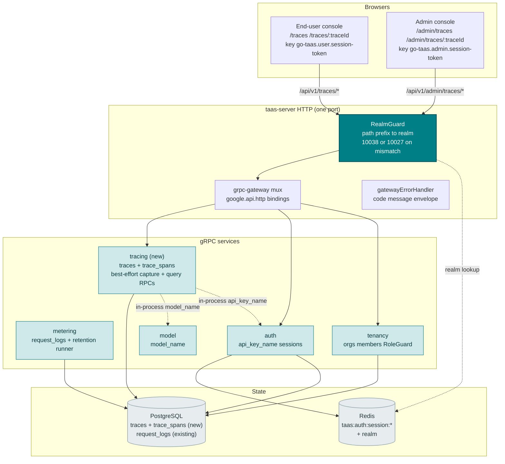
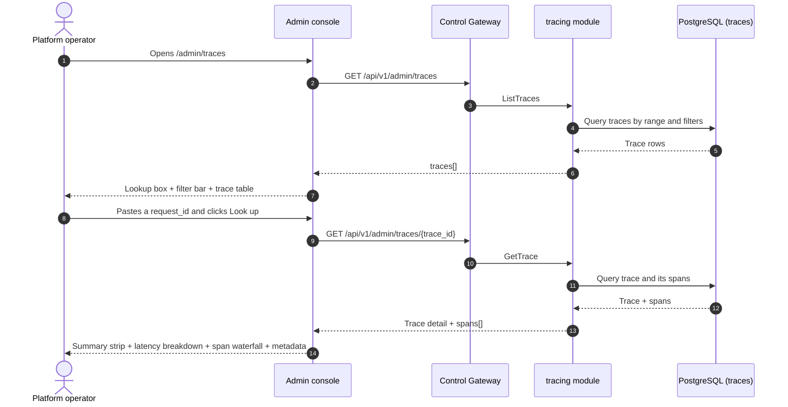
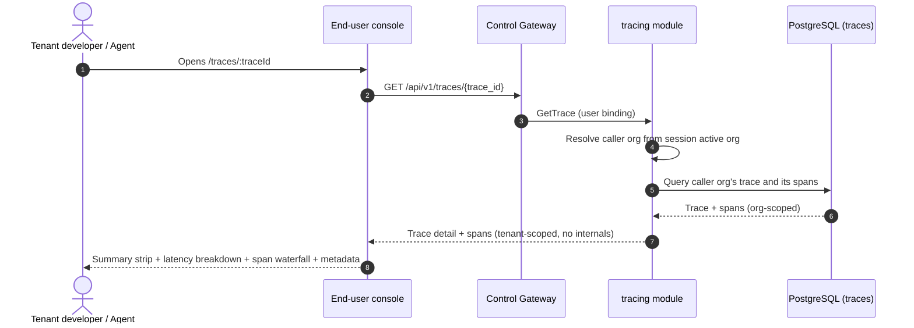
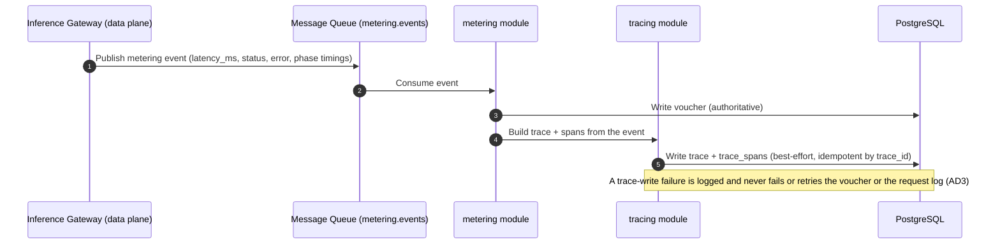

# Request Tracing & Latency Breakdown — Architecture and Detailed Design

| Attribute | Content |
| --- | --- |
| Feature point | Request tracing & latency breakdown — drill into individual inference requests end-to-end (request → gateway → inference service) with a trace detail view, per-phase latency breakdown (TTFT, generation, total), status/error attribution, and request-id lookup (backlog row 27) |
| Document scope | Architecture and detailed design for feature-27: a new `tracing` module owning the `traces` and `trace_spans` tables and the read-only query RPCs; the `taas.tracing.v1.TracingService` proto with `ListTraces` and `GetTrace` dual-bound to the admin and user prefixes; the admin Traces pages (`/admin/traces`, `/admin/traces/:traceId`) and the end-user Traces pages (`/traces`, `/traces/:traceId`); plus error handling, configuration, security, rollout, and function-level design per layer |
| Owning modules | New `tracing` module (`services/tracing`): the `traces` + `trace_spans` tables, the best-effort capture alongside the request log, and the read-only query RPCs; `metering` (the request-log write point the trace capture extends); `model` (read-only: `model_name` resolution); `auth` (read-only: `api_key_name` resolution, session realm, session active org); `tenancy` (RoleGuard, read-only); `pkg/server` gateway (admin-prefix and user-prefix bindings); console web app (admin `TracesPage`/`TraceDetailPage`, end-user `UserTracesPage`/`UserTraceDetailPage`) |
| Related documents | [Requirement Analysis and UI/UX Design](../design/request-tracing.md) · [Architecture Design](../design/architecture.md) §2.5 (`metering`), §3.1 (admin/user surface separation) · [Request Logs & API Playground](./request-logs-playground.md) (the `request_logs` table, its `request_id`/`latency_ms`/`status`/`error` fields, and the best-effort non-fatal write pattern this feature extends with per-phase timing) · [Model Observability Dashboard](./model-observability.md) (the sibling read-only aggregation over `request_logs`, its inline-SVG chart, freshness, and range conventions) · [Console Surface Separation](./console-surface-separation.md) (the two surfaces this feature spans, the `UserShell`/`AdminShell` conventions, the masked-projection rule) |
| Status | Architecture complete, handed to the Developer agent |

---

## 1. Overview and Goals

go-taas records every inference request's metadata — latency, status, error, and token counts — in `request_logs` (feature #12), and the model observability dashboard (feature #24) aggregates that metadata into per-model latency / throughput / error-rate / token-throughput time-series. What the console still cannot answer is the operator's and tenant's debugging question: *what actually happened inside this one request?* The observability dashboard shows aggregates, not individual requests; request logs (feature #12) show a single total `latency_ms` but no breakdown of where that time went — how much was time-to-first-token (TTFT, the prefill phase) versus generation (the decode phase), and how much was spent in the gateway versus the inference service. And when an operator or tenant has a `request_id` from an error message or a client log, there is no way to jump straight to that request's full trace.

This feature adds **request tracing & latency breakdown**: drill into individual inference requests end-to-end (request → gateway → inference service) with a trace detail view, a per-phase latency breakdown (TTFT, generation, total), status/error attribution, and request-id lookup. It is the smallest independently valuable increment of Phase 4's productionization roadmap item: it turns "this request failed" into "this request spent 800 ms in TTFT, 1200 ms in generation, and failed in the inference service with error X".

**Goals**: a new `tracing` module owning the `traces` and `trace_spans` tables and the read-only query RPCs; a `taas.tracing.v1.TracingService` with two RPCs — `ListTraces` (dual-bound: admin fleet-wide trace explorer and end-user tenant-scoped explorer, each with request-id lookup and filters) and `GetTrace` (dual-bound: admin any-trace detail and end-user tenant-scoped detail, each with summary + spans); an admin Traces page (`/admin/traces`) and per-trace detail (`/admin/traces/:traceId`), and an end-user Traces page (`/traces`) and detail (`/traces/:traceId`); new error code 11101 `CodeTraceNotFound`; the page → route → API-prefix table with exact prefixes; per-page interactive states including empty, error, lookup-not-found, and permission-denied; and numbered acceptance criteria testable in Nightwatch against the compose stack.

**Non-goals** (deferred, design §8): request/response body capture (D4 — privacy/storage); real-time streaming trace updates (the request-log cadence stands); distributed tracing across external services (v1 traces the gateway and inference service only); trace sampling or retention filters (v1 retains all traces for 30 days, D5); anomaly detection or threshold alerts (feature #26 consumes observability events in-console — out of scope here); exposing service ids, replica counts, or other operator internals to tenants (D8); any change to the voucher, settlement, or charging pipelines (read-only extension of the inference path); new audit events (D9).

### 1.1 Reading order of this document

Section 2 records the architecture decisions (AD1–AD9, mirroring the design's D1–D9). Sections 3–5 are the component view, data model, and API design. Section 6 is the frontend architecture (page → route → API-prefix table for both consoles, auth guard per surface). Sections 7–8 are the sequence flows and error handling. Sections 9–11 are configuration, security, and rollout. Sections 12–14 are the acceptance-criteria traceability, the function-level detailed design, and the ordered implementation task list.

---

## 2. Architecture Decisions

| # | Decision | Rationale |
| --- | --- | --- |
| AD1 | **New `tracing` module** (`services/tracing`) owning the `traces` and `trace_spans` tables, the best-effort capture alongside the request log, and the read-only query RPCs, with its own error block **111xx** | The trace needs a dedicated capture (phase split + span structure) that `request_logs` does not carry; a dedicated module keeps the phase and span concern out of `metering`'s raw-log surface and gives it one home (design D2) |
| AD2 | **The tracing error block is 11101–11199, the next free block after notification's 110xx.** The notification module owns 11001–11005 (feature #26). The design's "fresh block after the notification block (110xx)" intent is honored by taking the next free block after 110xx | Each module has its own error block (`pkg/errors/codes.go`); notification took 110xx, so tracing takes 111xx. This is the interpretation most consistent with the existing architecture (design D9, confirmed) |
| AD3 | **Trace capture is best-effort and non-fatal, written alongside the request log in the same idempotent handler, keyed by `trace_id` (== `request_id`).** A trace-write failure is logged and never fails or retries the voucher or the request log. Idempotency by `trace_id` applies exactly as to the request log — a duplicate event writes no second trace | Tracing is diagnostic, not billing evidence; a trace write must never jeopardize the authoritative voucher or block ingestion. This mirrors the request-logs AD2 pattern (feature #12) (design D3) |
| AD4 | **No request/response bodies in v1** — the trace captures metadata and phase timings only (identity, model, service, token counts, TTFT, generation, total, status, error, spans) | Bodies are a privacy and storage liability and are not needed to answer "what happened inside this request"; metadata-only keeps the rows small and the 30-day retention cheap (design D4) |
| AD5 | **Trace retention aligns with request logs: 30 days**, enforced by the same periodic cleanup runner (feature #12) extended to the `traces` and `trace_spans` tables | Traces are diagnostic and lose value fast; 30 days bounds storage while covering the debugging window, and reusing the existing runner avoids a new scheduler (design D5) |
| AD6 | **The trace detail renders a waterfall of spans plus a latency-breakdown card.** The waterfall shows the gateway span and the inference span as start/duration bars (inline SVG, no new charting dependency); the latency-breakdown card shows TTFT, generation, and total with a stacked bar. Status/error is attributed per span | Datadog's waterfall is the canonical way to show request → gateway → inference service; the TTFT/generation/total breakdown is the LLM-specific number (vLLM TTFT/TPOT). Inline SVG matches the observability AD9 decision (design D6) |
| AD7 | **Request-id lookup is a first-class control on the trace list page** — paste a `request_id` into a lookup box to jump straight to that trace's detail (or see a not-found state) | The fastest path from an error message or client log to the trace is a direct request-id lookup; this is the feature's headline interaction (design D7) |
| AD8 | **The end-user surface is tenant-scoped and masked**: `ListTraces`/`GetTrace` on the user prefix return only the tenant's own traces, with no service ids, no replica counts, and no other tenants' data. The admin surface is fleet-wide by default with an optional `organization_id` filter | Follows feature #17's masked-projection rule and the observability AD4 pattern: tenants get their own request traces, not operator internals (design D8) |
| AD9 | **The admin tracing RPCs are fleet-wide by default, not org-scoped.** `ListTraces` and the admin binding of `GetTrace` aggregate across all orgs, with an optional `organization_id` filter read from `X-Organization-Id`. They are gated by `tenancy.RoleGuard` (admin role, 10036). The user binding of `GetTrace` is hard-scoped to the caller's org (session active org authoritative, `X-Organization-Id` ignored) | The operator needs a cross-org fleet view to debug platform-wide failures and latency; the tenant needs only their own traces. This is the one deliberate deviation from the "admin queries resolve the org" pattern — the fleet view is the point of the admin surface, and RoleGuard keeps it admin-only (design D1, D8) |

---

## 3. Component View

### 3.1 Ownership

| Layer / component | Owns | Changes in this feature |
| --- | --- | --- |
| **Control Gateway (`grpc-gateway`)** | HTTP/JSON facade for the tracing RPCs; realm guard (feature #17) already rejects a wrong-realm session with 10038; passes `X-Organization-Id` through as gRPC metadata | New bindings for the two HTTP tracing RPCs (Section 5); no change to the realm guard |
| **`tracing` module (`services/tracing`)** | The `traces` + `trace_spans` tables, the best-effort capture alongside the request log, the read-only query RPCs, the range validation, the retention extension | **New module** (AD1) |
| **`metering` module** | The request-log write point the trace capture extends; the request-log retention runner | Read-only: the tracing module hooks the same idempotent handler to write the trace best-effort (AD3); the retention runner is extended to the trace tables (AD5) |
| **`model` module** | Model metadata (`model_id` → `model_name`) | Read-only: the tracing module resolves `model_name` in-process (AD3) |
| **`auth` module** | API key identity (`api_key_id` → `api_key_name`), session realm, session active org | Read-only: the tracing module resolves `api_key_name` in-process and the session active org for the user binding (AD8, AD9) |
| **`tenancy` module** | Organizations, members, roles, RoleGuard | Read-only: `RoleGuard` gates the admin tracing RPCs by the caller's role (10036) |
| **PostgreSQL** | `traces` + `trace_spans` tables (new); `request_logs` untouched | Two new tables via AutoMigrate (Section 4) |
| **Console** | Admin Traces pages and end-user Traces pages | Four new pages on the two surfaces (Section 6) |

### 3.2 Runtime component view



### 3.3 Request identity chain

The tracing RPCs reuse the established identity chain (console-surface-separation §3.3), with one deliberate difference for the admin fleet view (AD9):

1. `RealmGuard` (HTTP, `pkg/server/realm.go`) — path prefix decides the expected realm. `/api/v1/admin/traces/*` expects `admin`; `/api/v1/traces/*` expects `user`. With no `Authorization` header: pass through (transitional, AD4 of feature #17). With a header: resolve the session realm from Redis; mismatch → 10038, unknown/expired/realm-less → 10027.
2. grpc-gateway mux — routes by the annotated path and forwards `authorization` and `x-organization-id`.
3. Service handler — **admin binding**: the fleet view is cross-org by default; `organization_id` is an optional filter read from `X-Organization-Id` (or the session active org when the caller wants to scope to their own org). **User binding**: `SessionActiveOrg` makes the session's active organization authoritative and ignores `X-Organization-Id`; without a session, `resolveOrganizationID` reads the transitional header and returns 10001 when it is absent or empty.
4. `tenancy.RoleGuard` — gates the admin tracing RPCs by the caller's role in the resolved org context (10036). The end-user tracing RPCs are hard-scoped to the caller's org and need no role check.

---

## 4. Data Model

### 4.1 New Tables

The tracing feature owns two new tables (AD1, design D2). Both are written best-effort alongside the request log (AD3) and retained for 30 days by the extended cleanup runner (AD5).

**`traces`** — one row per inference request, keyed by `trace_id` (== `request_id`):

| Column | Type | Notes |
| --- | --- | --- |
| `id` | uuid PK | Server-generated UUID v4, exposed as `trace_id` |
| `trace_id` | varchar(128) unique | The inference request id — the idempotency key (shared with the request log and voucher) |
| `organization_id` | varchar(64) not null | Owning organization |
| `api_key_id` | varchar(64) not null | The API key that made the request |
| `model_id` | varchar(128) not null | The model that served the request |
| `service_id` | varchar(64) nullable | The inference service (operator-internal; masked on the user surface) |
| `status` | varchar(16) not null | `success` / `error` / `streaming` |
| `error` | varchar(512) not null default '' | The failure reason; empty on success |
| `total_latency_ms` | bigint not null | End-to-end latency |
| `ttft_ms` | bigint not null | Time-to-first-token (prefill phase) |
| `generation_ms` | bigint not null | Generation (decode phase) |
| `prompt_tokens` / `completion_tokens` / `cached_tokens` / `reasoning_tokens` | bigint not null default 0 | The four token counts |
| `created_at` | timestamptz not null | The trace write time (UTC) |

Indexes: `idx_traces_org_created (organization_id, created_at)` for the user-scoped range scan; `idx_traces_created (created_at)` for the fleet-wide range scan (AD9); `idx_traces_key_created (api_key_id, created_at)` for the API-key filter; `idx_traces_model_created (model_id, created_at)` for the model filter.

**`trace_spans`** — one row per span of a trace:

| Column | Type | Notes |
| --- | --- | --- |
| `id` | uuid PK | Server-generated UUID v4, exposed as `span_id` |
| `trace_id` | varchar(128) not null | The owning trace (FK to `traces.trace_id`) |
| `parent_span_id` | varchar(128) nullable | The parent span; null for the root (gateway) span |
| `name` | varchar(64) not null | `gateway` or `inference` |
| `kind` | varchar(32) not null | The span kind (e.g. `server`, `internal`) |
| `start_offset_ms` | bigint not null | Offset from the trace start |
| `duration_ms` | bigint not null | Span duration |
| `status` | varchar(16) not null | `success` / `error` |
| `error` | varchar(512) not null default '' | The span's failure reason; empty on success |
| `attributes` | jsonb not null default '{}' | A JSON object, e.g. `{"model_id": "...", "service_id": "..."}` |

Indexes: `idx_trace_spans_trace (trace_id)` for the detail lookup.

### 4.2 Migration Notes

- Both tables are created by GORM `AutoMigrate` on `taas-server` startup (additive; no data migration). `Migrate`/`MigrateSchemaForFVT` gain the `Trace` and `TraceSpan` models.
- No init-SQL upgrade path is needed: the tables are created automatically on startup.
- The request-log retention runner (feature #12) is extended to delete `traces` (and their `trace_spans`) older than the 30-day TTL (AD5). The trace tables are written only by the best-effort capture (AD3); the retention runner is the only deleter.

---

## 5. API Design

All tracing RPCs belong to a new **`taas.tracing.v1.TracingService`** (`proto/taas/tracing/v1/tracing.proto`), served as HTTP via the Control Gateway. Both RPCs are dual-bound (admin + user). The surface is derived from the request path (Section 3.3).

| RPC | HTTP (admin) | HTTP (user) | Status | Purpose |
| --- | --- | --- | --- | --- |
| `ListTraces` | `GET /api/v1/admin/traces` | `GET /api/v1/traces` | **new** | Trace explorer list with request-id lookup and filters (admin: fleet-wide; user: tenant-scoped) |
| `GetTrace` | `GET /api/v1/admin/traces/{trace_id}` | `GET /api/v1/traces/{trace_id}` | **new** | Trace detail with summary + spans (admin: any trace; user: tenant-scoped) |

### 5.1 Proto contract

```protobuf
syntax = "proto3";

package taas.tracing.v1;

import "google/api/annotations.proto";
import "taas/common/v1/common.proto";

option go_package = "github.com/go-taas/go-taas/proto/taas/tracing/v1;tracingv1";

// TracingService serves read-only inference request traces. ListTraces
// and GetTrace are dual-bound: the admin binding is a fleet-wide trace
// explorer (all orgs, optional organization_id filter); the user binding
// is tenant-scoped and masks operator internals.
service TracingService {
  // ListTraces returns the trace explorer list for a time range and
  // optional filters. When request_id is set, at most one trace is
  // returned (the exact match). Admin-surface API: served under
  // /api/v1/admin; user-surface API: served under /api/v1.
  rpc ListTraces(ListTracesRequest) returns (ListTracesResponse) {
    option (google.api.http) = {
      get: "/api/v1/admin/traces"
      additional_bindings: {get: "/api/v1/traces"}
    };
  }

  // GetTrace returns one trace's full detail: the summary fields plus
  // its spans. The admin binding covers any trace; the user binding is
  // tenant-scoped.
  rpc GetTrace(GetTraceRequest) returns (GetTraceResponse) {
    option (google.api.http) = {
      get: "/api/v1/admin/traces/{trace_id}"
      additional_bindings: {get: "/api/v1/traces/{trace_id}"}
    };
  }
}

message ListTracesRequest {
  // organization_id is an optional fleet filter. On the admin surface
  // it is read from X-Organization-Id (or the session active org);
  // absent means fleet-wide (AD9).
  string organization_id = 1;
  // request_id is an exact lookup; when set, at most one trace is
  // returned (AD7).
  string request_id = 2;
  // model_id / api_key_id / status are optional filters.
  string model_id = 3;
  string api_key_id = 4;
  string status = 5;
  // since/until bound the range, unix seconds. Defaults: until = now,
  // since = until - 24h. A range > 92 days is rejected (10404).
  int64 since = 6;
  int64 until = 7;
  // page_token / page_size for dotted pagination (default 20, cap 100).
  string page_token = 8;
  int32 page_size = 9;
}

message ListTracesResponse {
  taas.common.v1.Response response = 1;
  repeated TraceSummary traces = 2;
  string next_page_token = 3;
}

message GetTraceRequest {
  // organization_id is derived from the session active org (user
  // binding) or X-Organization-Id (admin binding); the field exists for
  // gRPC-direct callers.
  string organization_id = 1;
  // trace_id is the path parameter.
  string trace_id = 2;
}

message GetTraceResponse {
  taas.common.v1.Response response = 1;
  TraceDetail trace = 2;
}

// TraceSummary is one row of the trace explorer list.
message TraceSummary {
  string trace_id = 1;
  string organization_id = 2;
  string api_key_id = 3;
  string api_key_name = 4;
  string model_id = 5;
  string model_name = 6;
  // service_id is masked to a phase label (gateway / inference) on the
  // user surface (AD8); the admin surface carries the operator id.
  string service_id = 7;
  string status = 8;
  string error = 9;
  int64 total_latency_ms = 10;
  int64 ttft_ms = 11;
  int64 generation_ms = 12;
  int64 created_at = 13;
}

// TraceDetail is one trace's full detail: the summary fields plus its
// spans.
message TraceDetail {
  string trace_id = 1;
  string organization_id = 2;
  string api_key_id = 3;
  string api_key_name = 4;
  string model_id = 5;
  string model_name = 6;
  string service_id = 7;
  string status = 8;
  string error = 9;
  int64 total_latency_ms = 10;
  int64 ttft_ms = 11;
  int64 generation_ms = 12;
  int64 prompt_tokens = 13;
  int64 completion_tokens = 14;
  int64 cached_tokens = 15;
  int64 reasoning_tokens = 16;
  int64 created_at = 17;
  repeated TraceSpan spans = 18;
}

// TraceSpan is one span of a trace, ordered by start_offset_ms ascending.
message TraceSpan {
  string span_id = 1;
  string trace_id = 2;
  string parent_span_id = 3;
  string name = 4;
  string kind = 5;
  int64 start_offset_ms = 6;
  int64 duration_ms = 7;
  string status = 8;
  string error = 9;
  string attributes = 10;
}
```

### 5.2 Contract notes (pinned for the Developer agent)

1. `ListTraces` validates `since`/`until` (int64 unix seconds; defaults `until = now`, `since = until − 24h`); `since > until` or a range > 92 days returns 10404 (AD2). `request_id`, `model_id`, `api_key_id`, and `status` are optional filters. When `request_id` is set, at most one trace is returned (the exact match); an unknown `request_id` returns an empty list (the page shows the lookup-not-found state, §6.5).
2. `GetTrace` validates the trace id; an unknown `trace_id` returns 11101 `CodeTraceNotFound` (AD2). On the user prefix it is scoped to the caller's organization (AD8) and exposes no service ids or operator internals.
3. The `traces` table carries `trace_id` (== `request_id`, unique), `organization_id`, `api_key_id`, `model_id`, `service_id`, `status`, `error`, `total_latency_ms`, `ttft_ms`, `generation_ms`, the four token counts, and `created_at`. The `trace_spans` table carries `span_id`, `trace_id`, `parent_span_id`, `name`, `kind`, `start_offset_ms`, `duration_ms`, `status`, `error`, and `attributes` (JSON) (Section 4).
4. Capture is best-effort and non-fatal, written alongside the request log in the same idempotent handler, keyed by `trace_id` (AD3). No bodies are captured (AD4). Retention is 30 days via the extended cleanup runner (AD5).
5. Wire conventions unchanged: dotted pagination where lists apply, HTTP 200 on success, business errors as `{"code": <int>, "message": "..."}`, int64 fields serialized as JSON strings.

### 5.3 Error codes

Error codes (tracing block 11101–11199, `pkg/errors/codes.go`):

| Condition | Code | Constant | Notes |
| --- | --- | --- | --- |
| An unknown `trace_id` | 11101 | `CodeTraceNotFound` | **New** (AD2) |
| A malformed or over-long range | 10404 | `CodeMeteringRangeInvalid` | Reused (AD2) — the metering range contract |
| Database / infrastructure failure | 500 | `CodeInternal` | Via error normalization |

---

## 6. Frontend Architecture

### 6.1 Page → Route → API-prefix table

| Page / component | Surface | Web route | API prefix | Auth guard |
| --- | --- | --- | --- | --- |
| **Traces page** | admin | `/admin/traces` | `/api/v1/admin/traces` | admin session; RoleGuard (admin role) |
| **Trace Detail page** | admin | `/admin/traces/:traceId` | `/api/v1/admin/traces/{trace_id}` | admin session; RoleGuard (admin role) |
| **Traces page** | end-user | `/traces` | `/api/v1/traces` | user session; hard-scoped to caller's org |
| **Trace Detail page** | end-user | `/traces/:traceId` | `/api/v1/traces/{trace_id}` | user session; hard-scoped to caller's org |

> The admin Traces pages call only `/api/v1/admin/traces/*`; the end-user Traces pages call only `/api/v1/traces/*`. The two surfaces never share a session token (feature #17).

### 6.2 Navigation placement

- **Admin console**: a new **Traces** item (`/admin/traces`, testid `nav-traces`) in the admin nav, in the operations group alongside Inference Services, Observability, and Autoscaling.
- **End-user console**: a new **Traces** item (`/traces`, testid `user-nav-traces`) in the user nav, alongside Usage and Cost.

### 6.3 Shared components and state to reuse

- **API client** (`web/src/api.ts`): the realm-scoped client (`createApi(realm)`) already sends `Authorization: Bearer <realm>.session-token` and `X-Organization-Id` (only when the realm token key is empty). The tracing pages reuse it unchanged; no new client is added.
- **Inline-SVG waterfall**: a new shared `TraceWaterfall.tsx` component (one start/duration bar per span), following the usage-dashboard `UsageChart.tsx` pattern (AD6). The latency-breakdown card uses a stacked bar (TTFT + generation = total).
- **Time-range filter**: the preset control (24 h / 7 d / 30 d / custom with a date-time picker) is shared with the Usage, Request Logs, and Observability pages.
- **Status badge**: the status badge (success / error) reuses the observability status-badge styling.
- **Empty state / data-freshness note**: the Request Logs page pattern (a note that traces appear within the ingestion window) is reused.

### 6.4 Auth guard per surface

- **Admin Traces pages** (`/admin/traces`, `/admin/traces/:traceId`): rendered inside `AdminShell`, which runs the admin session guard when `go-taas.admin.session-token` is non-empty; a missing/expired session redirects to `/admin/login?reason=expired`; a wrong-realm session is rejected by the gateway with 10038. The pages' API calls go to `/api/v1/admin/traces/*`. A session without the required role receives 10036 and the page shows the standard permission-denied state (feature #17).
- **End-user Traces pages** (`/traces`, `/traces/:traceId`): rendered inside `UserShell`, which runs the user session guard when `go-taas.user.session-token` is non-empty; a missing/expired session redirects to `/login?reason=expired`. The pages' API calls go to `/api/v1/traces/*`. The pages expose no service ids or operator internals (AD8).
- **Unauthenticated visitors**: an unauthenticated visitor to either page is redirected to the correct login (`/admin/login` vs `/login`) by the shell guard.

### 6.5 Console contract (pinned for the Developer agent)

**Traces page** (`/admin/traces`): a page header ("Traces", subtitle "Inference request traces end-to-end") with a **Refresh** action (`traces-refresh`). Below: a **request-id lookup box** (`traces-lookup-input` + `traces-lookup-button`) — pasting a `request_id` and submitting jumps to `/admin/traces/:traceId`; an unknown id shows a lookup-not-found banner (`traces-lookup-notfound`). A **filter bar** — a **Time range** control (`traces-filter-range`, presets 24 h / 7 d / 30 d / custom), a **Model** filter (`traces-filter-model`, dropdown, "All models" default), an **API key** filter (`traces-filter-key`, dropdown, "All keys" default), and a **Status** filter (`traces-filter-status`, dropdown: All / Success / Error). A **trace table** (`traces-table`, `traces-row-{trace_id}`) with columns Trace ID (link to the detail), Time, Model, API key, Status (badge), Total latency, TTFT, Generation, Error (truncated). Sortable by Time, Total latency, TTFT, and Generation; filterable by the Model / API key / Status dropdowns; paginated. Empty state: "No traces in this range." with a hint that traces appear after the first inference calls. Error state: an error banner with a Retry button and a "Showing stale data" banner. Permission-denied: the standard state with a link back to the admin home.

**Trace Detail page** (`/admin/traces/:traceId`): a back link to the explorer, a header with the trace id and a status badge. Below: a **summary strip** (trace id, model, API key, service, created_at, total latency, status badge, error), a **latency-breakdown card** (`trace-latency-card`) showing TTFT, Generation, and Total with a stacked bar, a **span waterfall** (`trace-waterfall`) of the spans as start/duration bars, and a **metadata table** (`trace-metadata`) with the four token counts, status, error, and span attributes. Not-found state (11101) shows the standard not-found state with a link back to the explorer.

**End-user Traces page** (`/traces`): identical to the admin page, scoped to the tenant's own traces. The **Service** column is masked to a phase label (`gateway` / `inference`) rather than an operator service id (AD8). Empty copy "No traces in this range." and the tenant's own permission-denied copy (10005 org gone / 10017 org disabled from feature #17 §8.2).

**End-user Trace Detail page** (`/traces/:traceId`): identical to the admin detail, scoped to the tenant's own trace, with the service masked to a phase label (AD8). Not-found copy for an unknown `trace_id` (11101) and the tenant's own permission-denied copy (10005/10017).

---

## 7. Sequence Flows

### 7.1 Admin fleet trace explorer load and request-id lookup



### 7.2 End-user tenant-scoped trace detail load



### 7.3 Best-effort trace capture alongside the request log



---

## 8. Error Handling

All errors are `pkg/errors` business codes in the unified envelope (Section 5.3). The tracing module is read-only on the query path; the capture path is best-effort and non-fatal (AD3), so a capture failure is logged and never surfaces to the caller. A database failure on the query path is normalized to 500 `CodeInternal`.

The console branches on the body `code` (as `web/src/api.ts` already does), never on the HTTP status. Each new code renders a specific inline message: 11101 "trace not found", 10404 "invalid range" (the metering range contract). The admin pages map 10036 to the standard permission-denied state; the end-user pages map 10005/10017 to the tenant's permission-denied copy (feature #17 §8.2).

---

## 9. Configuration Additions

| Key | Default | Description |
| --- | --- | --- |
| `tracing.retention.traceTTL` | `720h` (30 d) | Traces (and their spans) older than this are deleted by the extended request-log retention runner (AD5) |

The `tracing` config block is new in `pkg/config` (`TracingConfig`), following the `metering.retention` block pattern. `applyDefaults`/`Validate` set the default above. The tracing module reads `traceTTL` in the retention runner. No other config keys, runners, or MQ subjects are added — the feature is read-only over its own tables plus the existing request-log write point (AD3).

---

## 10. Security Considerations

- **Surface separation**: the admin Traces pages call only `/api/v1/admin/traces/*`; the end-user Traces pages call only `/api/v1/traces/*`. The realm guard rejects a wrong-realm session with 10038 before any handler runs (feature #17).
- **Admin fleet view gated by role**: the admin tracing RPCs are fleet-wide by default (AD9) and gated by `tenancy.RoleGuard` — only a caller with the required admin role can see the cross-org fleet view; an inaccessible org returns 10036.
- **End-user hard scoping**: the user bindings of `ListTraces`/`GetTrace` are hard-scoped to the caller's org (session active org authoritative, `X-Organization-Id` ignored); a caller can never see another tenant's traces.
- **Masked projection**: the end-user surface exposes no service ids, replica counts, or other operator orchestration internals (AD8). The `service_id` field is masked to a phase label (`gateway` / `inference`) on the user surface. The admin surface is operator-scoped.
- **No bodies captured**: the trace captures metadata and phase timings only (AD4); no request/response bodies are stored, avoiding a privacy and storage liability.
- **Read-only by construction**: the tracing query RPCs issue only `SELECT`s; the capture path writes only the trace tables best-effort and never touches the voucher or request log (AD3). No new audit events are needed — the underlying request-log writes are already audited (feature #15).

---

## 11. Rollout / Upgrade Notes

- **Two new tables** (`traces`, `trace_spans`) via AutoMigrate on `taas-server` startup; deploy `taas-server` alone. No data migration, no init-SQL upgrade path.
- **The proto change is additive**: a new `taas.tracing.v1.TracingService` with two new RPCs; no existing RPC or message changes. The gateway mux gains the new bindings; the realm guard is unchanged.
- **The capture is additive**: the metering event already carries `latency_ms`/`status`/`error`; the trace capture reads the same event and additionally the phase timings (TTFT/generation) and span structure. The request-log write point is extended to also write the trace best-effort (AD3).
- **Console**: the four new pages are added to the existing bundle; the admin nav gains Traces, the end-user nav gains Traces. No existing route changes.
- **Backward compatibility**: the transitional (session-less, `X-Organization-Id`) path is preserved for the CLI, FVT, and e2e suites; the realm guard passes through requests without an `Authorization` header (feature #17 AD4).
- **Empty until data exists**: the tracing RPCs return empty lists/details until traces exist; the pages render the empty state with a hint to widen the range.

---

## 12. Acceptance-Criteria Traceability

| # | Criterion | Where addressed |
| --- | --- | --- |
| AC1 | `ListTraces` with a valid range returns trace rows; a range > 92 days or `since > until` returns 10404 | §5.1, §5.2, §5.3 |
| AC2 | `ListTraces` with a `request_id` returns at most one trace (the exact match); an unknown `request_id` returns an empty list | §5.1, §5.2, §7.1 |
| AC3 | `GetTrace` (admin) returns one trace's summary plus its spans; an unknown `trace_id` returns 11101 | §5.1, §5.2, §5.3 |
| AC4 | `GetTrace` (user) returns only the caller's organization's trace, with no service ids or operator internals | §3.3, §6.4, §10 |
| AC5 | The spans are ordered by `start_offset_ms` ascending; the trace detail carries the four token counts | §5.1, §5.2 |
| AC6 | The `/admin/traces` page renders the lookup box, filter bar, and trace table from the first successful load, with a last-updated timestamp | §6.5 |
| AC7 | A request-id lookup navigates to the trace detail; an unknown id shows the lookup-not-found banner | §6.5, §7.1 |
| AC8 | The `/admin/traces/:traceId` page renders the summary strip, latency-breakdown card, span waterfall, and metadata table; an unknown trace shows the not-found state | §6.5 |
| AC9 | The `/traces` and `/traces/:traceId` pages render the tenant's own traces, with no service ids or operator internals visible | §6.5, §10 |
| AC10 | The admin tracing pages are reachable only on the admin surface: routes `/admin/traces` and `/admin/traces/:traceId`, every API call uses the `/api/v1/admin/traces/*` prefix with no `/api/v1/traces/*` string | §6.1, §6.4, §10 |
| AC11 | The end-user tracing pages are reachable only on the end-user surface: routes `/traces` and `/traces/:traceId`, every API call uses the `/api/v1/traces/*` prefix with no `/api/v1/admin/*` string | §6.1, §6.4, §10 |
| AC12 | A session without the required role receives 10036 on the admin tracing pages and the page shows the standard permission-denied state | §3.3, §6.4, §10 |

---

## 13. Detailed Design (function-level responsibilities per layer)

### 13.1 Proto → service → repository → controller

| Layer | File | Responsibilities |
| --- | --- | --- |
| `proto/taas/tracing/v1` | `tracing.proto` | New `TracingService` with the two RPCs (Section 5.1); messages `ListTracesRequest/Response`, `GetTraceRequest/Response`, `TraceSummary`, `TraceDetail`, `TraceSpan`. Regenerate `tracing.pb.go`/`tracing_grpc.pb.go`/`tracing.pb.gw.go` via `buf generate` |
| `services/tracing` | `tracing_model.go` | The GORM models `Trace` and `TraceSpan` + `TableName` (Section 4) |
| | `tracing_repository.go` | `InsertTrace(ctx, trace, spans)` — idempotent INSERT ON CONFLICT (trace_id) DO NOTHING, mirroring `IngestRequestLog` (AD3); `ListTraces(ctx, filter)` — org/key/model/status/range, newest first, paginated; `FindTraceByID(ctx, orgFilter, traceID)` — the trace + its spans (11101 when absent); `DeleteTracesBefore(ctx, cutoff, batch)` — the retention extension (AD5) |
| | `service.go` | New RPCs `ListTraces`, `GetTrace`; the range validation (10404, AD2); the admin fleet scope vs user hard-scope resolution (AD9); the `SessionActiveOrg`/`resolveOrganizationID` seam; the `RoleGuard` seam for admin org scoping; the in-process `model_name`/`api_key_name` resolution (AD3); the `service_id` masking on the user surface (AD8); `Migrate`/`MigrateSchemaForFVT` gain the `Trace`/`TraceSpan` models (Section 4.2) |
| | `capture.go` | `CaptureTrace(ctx, event)` — builds the trace + spans from the metering event and writes them best-effort (AD3); called from the metering handler after the request-log write |
| `services/metering` | `service.go` | The request-log write point is extended to call the tracing `CaptureTrace` best-effort after the request-log write (AD3); the retention runner is extended to delete `traces`/`trace_spans` older than `traceTTL` (AD5) |
| `services/model` | `service.go` | Read-only: expose a `ModelName(ctx, modelID) (string, error)` seam (or reuse `GetModel`) for the tracing module to resolve `model_name` in-process (AD3) |
| `services/auth` | `service.go` | Read-only: expose an `APIKeyName(ctx, apiKeyID) (string, error)` seam for the tracing module to resolve `api_key_name` in-process (AD3) |
| `pkg/errors` | `codes.go`/`messages.go` | `CodeTraceNotFound` (11101) constant + canonical message "trace not found" (AD2) |
| `pkg/config` | `api.go`/`configuration.go` | `TracingConfig` + `retention.traceTTL` (Section 9) + `applyDefaults`/`Validate` |
| `apps/taas-server` | `main.go` | Register the `TracingService` with the gRPC server and gateway mux; wire the `model`/`auth` name-resolution seams and the `tenancy` RoleGuard into the tracing service; register the extended retention runner |
| `web/src` | `pages/TracesPage.tsx`, `pages/TraceDetailPage.tsx`, `pages/user/UserTracesPage.tsx`, `pages/user/UserTraceDetailPage.tsx`, `components/TraceWaterfall.tsx`, `App.tsx`, `api.ts`, `shells/AdminShell.tsx`, `shells/UserShell.tsx` | Routes `/admin/traces`, `/admin/traces/:traceId`, `/traces`, `/traces/:traceId`; `ListTraces`/`GetTrace` API types and calls; nav items and the request-id lookup (Section 6.5) |
| `test` | `fvt/tracing_fvt_test.go`, `e2e/tests/tracing.js` | Section 14 |

### 13.2 Which React page/module implements each screen

| Screen | React module | Route | API calls |
| --- | --- | --- | --- |
| Traces page (admin) | `web/src/pages/TracesPage.tsx` | `/admin/traces` | `ListTraces` |
| Trace Detail page (admin) | `web/src/pages/TraceDetailPage.tsx` | `/admin/traces/:traceId` | `GetTrace` |
| Traces page (end-user) | `web/src/pages/user/UserTracesPage.tsx` | `/traces` | `ListTraces` |
| Trace Detail page (end-user) | `web/src/pages/user/UserTraceDetailPage.tsx` | `/traces/:traceId` | `GetTrace` |
| Span waterfall | `web/src/components/TraceWaterfall.tsx` (shared) | (on both detail pages) | (client-side; renders the returned spans) |

---

## 14. Testing Strategy

- **Unit** (`services/tracing`, sqlite in-memory): `tracing_repository_test.go` — `InsertTrace` is idempotent by `trace_id` (AC3), `ListTraces` returns correct rows for the filters and range (AC1, AC2), `FindTraceByID` returns the trace + spans and 11101 when absent (AC3), `DeleteTracesBefore` removes old traces (AC5). `service_test.go` — range validation returns 10404 for `since > until` and a range > 92 days (AC1); an unknown `trace_id` returns 11101 (AC3); the user binding is hard-scoped to the caller's org and masks `service_id` (AC4); admin org scoping returns 10036 (AC12). Coverage ≥ 80% on the new files.
- **FVT** (`test/fvt/tracing_fvt_test.go`, the metering FVT pattern: file-backed sqlite + `MigrateSchemaForFVT` + `NewForFVT` + gRPC server with the production interceptor + gateway mux with `FVTHeaderMatcher`): seed `traces`/`trace_spans` rows across orgs/models/keys, then assert `ListTraces` rows and the `request_id` exact match (AC1, AC2), `GetTrace` admin detail + spans and 11101 (AC3), the user binding returns only the caller org's trace with `service_id` masked (AC4), span ordering and token counts (AC5), and 10404 inline (AC1).
- **E2E** (`test/e2e/tests/tracing.js`, the `usageDashboard.js` pattern): against the compose stack — the admin `/admin/traces` page renders `traces-table` and the lookup box from the first successful load (AC6); a request-id lookup navigates to the detail and an unknown id shows the lookup-not-found banner (AC7); the admin drill-down renders the summary strip, latency card, waterfall, and metadata (AC8); the end-user `/traces` and `/traces/:traceId` pages render the tenant's own traces with no service ids (AC9); each page calls only its own prefix and an unauthenticated visitor is redirected to the correct login (AC10/AC11); a session without the required role receives 10036 and shows the permission-denied state (AC12).