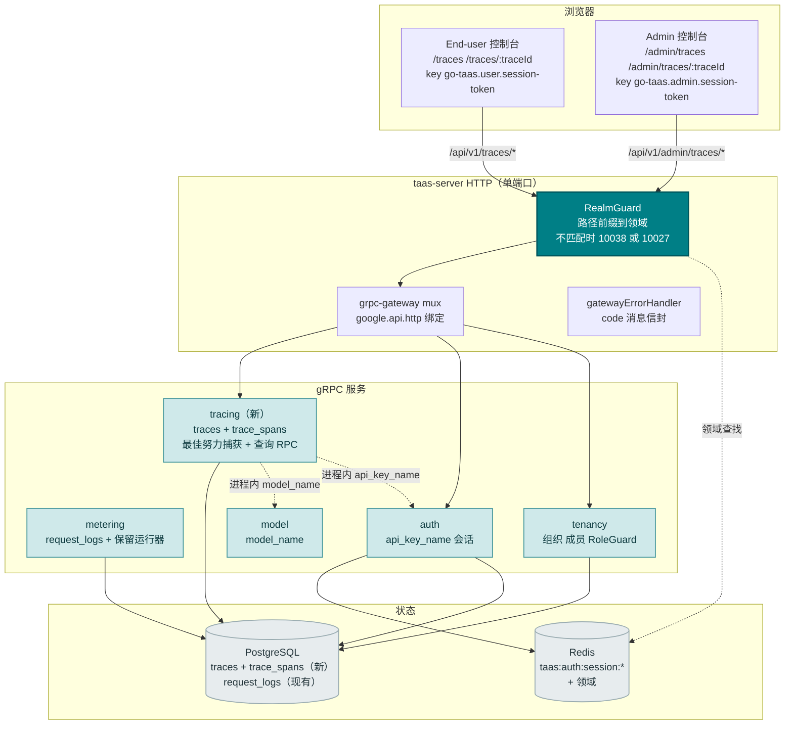
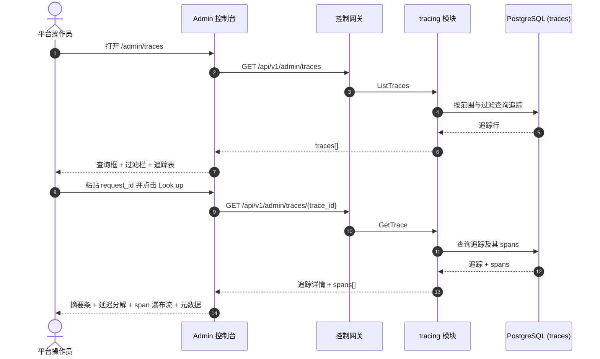
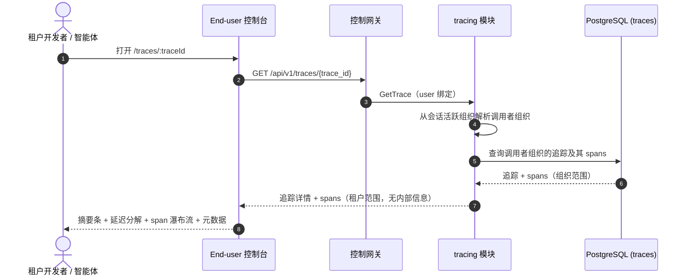
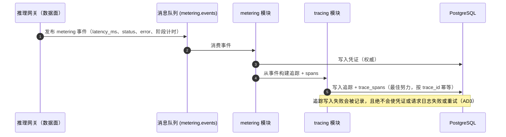

# 请求追踪与延迟分解 — 架构与详细设计

| 属性 | 内容 |
| --- | --- |
| 功能点 | 请求追踪与延迟分解 — 端到端钻取单个推理请求（请求 → 网关 → 推理服务），提供追踪详情视图、分阶段延迟分解（TTFT、生成、总延迟）、状态/错误归因，以及请求 ID 查询（backlog 第 27 行） |
| 文档范围 | 功能 27 的架构与详细设计：新的 `tracing` 模块拥有 `traces` 与 `trace_spans` 表以及只读查询 RPC；`taas.tracing.v1.TracingService` proto 提供 `ListTraces` 与 `GetTrace`，双绑定到 admin 与 user 前缀；admin 追踪页面（`/admin/traces`、`/admin/traces/:traceId`）与 end-user 追踪页面（`/traces`、`/traces/:traceId`）；以及错误处理、配置、安全、上线与逐层函数级设计 |
| 拥有模块 | 新 `tracing` 模块（`services/tracing`）：`traces` + `trace_spans` 表、随请求日志一起的最佳努力捕获、只读查询 RPC；`metering`（追踪捕获所扩展的请求日志写入点）；`model`（只读：`model_name` 解析）；`auth`（只读：`api_key_name` 解析、会话领域、会话活跃组织）；`tenancy`（RoleGuard，只读）；`pkg/server` 网关（admin 前缀与 user 前缀绑定）；控制台 Web 应用（admin `TracesPage`/`TraceDetailPage`，end-user `UserTracesPage`/`UserTraceDetailPage`） |
| 相关文档 | [需求分析与 UI/UX 设计](../design/request-tracing.md) · [架构设计](../design/architecture.md) §2.5（`metering`）、§3.1（admin/user 表面分离）· [请求日志与 API 游乐场](./request-logs-playground.md)（`request_logs` 表、其 `request_id`/`latency_ms`/`status`/`error` 字段，以及本功能以分阶段计时扩展的最佳努力非致命写入模式）· [模型可观测性仪表盘](./model-observability.md)（对 `request_logs` 的同类只读聚合、其内联 SVG 图表、新鲜度与范围约定）· [控制台表面分离](./console-surface-separation.md)（本功能跨越的两个表面、`UserShell`/`AdminShell` 约定、掩码投影规则） |
| 状态 | 架构完成，已移交给 Developer 智能体 |

---

## 1. 概述与目标

go-taas 将每个推理请求的元数据 — 延迟、状态、错误与 token 计数 — 记录在 `request_logs`（功能 #12）中，模型可观测性仪表盘（功能 #24）将该元数据聚合为按模型的延迟 / 吞吐 / 错误率 / token 吞吐时间序列。控制台仍无法回答的是操作员与租户的调试问题：*这个请求内部到底发生了什么？* 可观测性仪表盘展示聚合而非单个请求；请求日志（功能 #12）展示单个总 `latency_ms`，但不分解时间花在了哪里 — 多少是首 token 时间（TTFT，prefill 阶段）对生成（decode 阶段），以及多少花在网关对推理服务。当操作员或租户从错误消息或客户端日志拿到一个 `request_id` 时，也没有办法直接跳到该请求的完整追踪。

本功能新增**请求追踪与延迟分解**：端到端钻取单个推理请求（请求 → 网关 → 推理服务），提供追踪详情视图、分阶段延迟分解（TTFT、生成、总延迟）、状态/错误归因，以及请求 ID 查询。它是 Phase 4 生产化路线图条目中最小且有独立价值的增量：它将"此请求失败"变成"此请求在 TTFT 花费 800 ms、在生成花费 1200 ms，并在推理服务中以错误 X 失败"。

**目标**：新的 `tracing` 模块拥有 `traces` 与 `trace_spans` 表以及只读查询 RPC；`taas.tracing.v1.TracingService` 提供两个 RPC — `ListTraces`（双绑定：admin 全舰队追踪浏览器与 end-user 租户范围浏览器，均支持请求 ID 查询与过滤）与 `GetTrace`（双绑定：admin 任意追踪详情与 end-user 租户范围详情，均含摘要 + spans）；admin 追踪页面（`/admin/traces`）与逐追踪详情（`/admin/traces/:traceId`），以及 end-user 追踪页面（`/traces`）与详情（`/traces/:traceId`）；新错误码 11101 `CodeTraceNotFound`；页面 → 路由 → API 前缀表，含精确前缀；各页面交互状态，包括空、错误、查询未找到与权限拒绝；以及可在 compose 栈上以 Nightwatch 测试的编号验收标准。

**非目标**（延后，设计 §8）：请求/响应体捕获（D4 — 隐私/存储）；实时流式追踪更新（请求日志节奏不变）；跨外部服务的分布式追踪（v1 仅追踪网关与推理服务）；追踪采样或保留过滤（v1 保留全部追踪 30 天，D5）；异常检测或阈值告警（功能 #26 在控制台内消费可观测性事件 — 此处不在范围内）；向租户暴露服务 ID、副本数或其他操作员编排内部信息（D8）；对凭证、结算或计费管线的任何更改（推理路径的只读扩展）；新审计事件（D9）。

### 1.1 本文档的阅读顺序

第 2 节记录架构决策（AD1–AD9，对应设计的 D1–D9）。第 3–5 节是组件视图、数据模型与 API 设计。第 6 节是前端架构（两个控制台的页面 → 路由 → API 前缀表，各表面的认证守卫）。第 7–8 节是时序流与错误处理。第 9–11 节是配置、安全与上线。第 12–14 节是验收标准追溯、函数级详细设计与有序实现任务清单。

---

## 2. 架构决策

| # | 决策 | 理由 |
| --- | --- | --- |
| AD1 | **新 `tracing` 模块**（`services/tracing`）拥有 `traces` 与 `trace_spans` 表、随请求日志一起的最佳努力捕获、只读查询 RPC，并使用自己的错误块 **111xx** | 追踪需要 `request_logs` 未携带的专用捕获（阶段分解 + span 结构）；专用模块将阶段与 span 关注点从 `metering` 的原始日志表面分离，并给它一个归属（设计 D2） |
| AD2 | **追踪错误块为 11101–11199，即 notification 110xx 之后的下一个空闲块。** notification 模块拥有 11001–11005（功能 #26）。设计"notification 块（110xx）之后的新块"的意图通过取 110xx 之后的下一个空闲块来实现 | 每个模块有自己的错误块（`pkg/errors/codes.go`）；notification 占用 110xx，因此 tracing 占用 111xx。这是与现有架构最一致的解读（设计 D9，已确认） |
| AD3 | **追踪捕获是最佳努力且非致命的，在同一个幂等处理器中随请求日志一起写入，以 `trace_id`（== `request_id`）为键。** 追踪写入失败会被记录，且绝不会使凭证或请求日志失败或重试。按 `trace_id` 的幂等性与请求日志完全一致 — 重复事件不会写入第二条追踪 | 追踪是诊断性的，而非计费证据；追踪写入绝不能危及权威凭证或阻塞摄取。这镜像了请求日志的 AD2 模式（功能 #12）（设计 D3） |
| AD4 | **v1 不捕获请求/响应体** — 追踪仅捕获元数据与阶段计时（身份、模型、服务、token 计数、TTFT、生成、总延迟、状态、错误、spans） | 请求体是隐私与存储负担，且不需要回答"此请求内部发生了什么"；仅元数据使行保持小、30 天保留便宜（设计 D4） |
| AD5 | **追踪保留与请求日志一致：30 天**，由同一周期清理运行器（功能 #12）扩展到 `traces` 与 `trace_spans` 表强制执行 | 追踪是诊断性的，价值快速衰减；30 天在覆盖调试窗口的同时约束存储，且复用现有运行器避免新调度器（设计 D5） |
| AD6 | **追踪详情渲染 span 瀑布流加延迟分解卡片。** 瀑布流以起始/持续条（内联 SVG，无新图表依赖）展示网关 span 与推理 span；延迟分解卡片以堆叠条展示 TTFT、生成与总延迟。状态/错误按 span 归因 | Datadog 的瀑布流是展示请求 → 网关 → 推理服务的规范方式；TTFT/生成/总延迟分解是 LLM 操作员真正关心的数字（vLLM TTFT/TPOT）。内联 SVG 匹配可观测性 AD9 决策（设计 D6） |
| AD7 | **请求 ID 查询是追踪列表页面的一等控件** — 将 `request_id` 粘贴到查询框以直接跳到该追踪的详情（或看到未找到状态） | 从错误消息或客户端日志到追踪的最快路径是直接请求 ID 查询；这是本功能的头条交互（设计 D7） |
| AD8 | **end-user 表面是租户范围且掩码的**：user 前缀上的 `ListTraces`/`GetTrace` 仅返回租户自己的追踪，无服务 ID、无副本数、无其他租户数据。admin 表面默认全舰队，带可选 `organization_id` 过滤 | 遵循功能 #17 的掩码投影规则与可观测性 AD4 模式：租户获得自己的请求追踪，而非操作员内部信息（设计 D8） |
| AD9 | **admin 追踪 RPC 默认全舰队，而非组织范围。** `ListTraces` 与 `GetTrace` 的 admin 绑定跨所有组织聚合，带从 `X-Organization-Id` 读取的可选 `organization_id` 过滤。它们由 `tenancy.RoleGuard`（admin 角色，10036）门控。`GetTrace` 的 user 绑定硬性限定到调用者组织（会话活跃组织权威，忽略 `X-Organization-Id`） | 操作员需要跨组织舰队视图来调试平台级失败与延迟；租户只需要自己的追踪。这是对"admin 查询解析组织"模式的刻意偏离 — 舰队视图是 admin 表面的要点，RoleGuard 使其保持 admin 专属（设计 D1、D8） |

---

## 3. 组件视图

### 3.1 归属

| 层 / 组件 | 拥有 | 本功能的变更 |
| --- | --- | --- |
| **控制网关（`grpc-gateway`）** | 追踪 RPC 的 HTTP/JSON 门面；领域守卫（功能 #17）已以 10038 拒绝错误领域会话；将 `X-Organization-Id` 作为 gRPC 元数据传递 | 两个 HTTP 追踪 RPC 的新绑定（第 5 节）；领域守卫无变更 |
| **`tracing` 模块（`services/tracing`）** | `traces` + `trace_spans` 表、随请求日志一起的最佳努力捕获、只读查询 RPC、范围验证、保留扩展 | **新模块**（AD1） |
| **`metering` 模块** | 追踪捕获所扩展的请求日志写入点；请求日志保留运行器 | 只读：tracing 模块挂接同一幂等处理器以最佳努力写入追踪（AD3）；保留运行器扩展到追踪表（AD5） |
| **`model` 模块** | 模型元数据（`model_id` → `model_name`） | 只读：tracing 模块进程内解析 `model_name`（AD3） |
| **`auth` 模块** | API 密钥身份（`api_key_id` → `api_key_name`）、会话领域、会话活跃组织 | 只读：tracing 模块进程内解析 `api_key_name` 以及 user 绑定的会话活跃组织（AD8、AD9） |
| **`tenancy` 模块** | 组织、成员、角色、RoleGuard | 只读：`RoleGuard` 按调用者角色门控 admin 追踪 RPC（10036） |
| **PostgreSQL** | `traces` + `trace_spans` 表（新）；`request_logs` 不变 | 通过 AutoMigrate 新增两张表（第 4 节） |
| **控制台** | admin 追踪页面与 end-user 追踪页面 | 两个表面上的四个新页面（第 6 节） |

### 3.2 运行时组件视图



### 3.3 请求身份链

追踪 RPC 复用已建立的身份链（console-surface-separation §3.3），admin 舰队视图有一处刻意差异（AD9）：

1. `RealmGuard`（HTTP，`pkg/server/realm.go`）— 路径前缀决定期望领域。`/api/v1/admin/traces/*` 期望 `admin`；`/api/v1/traces/*` 期望 `user`。无 `Authorization` 头：放行（过渡，功能 #17 的 AD4）。有头：从 Redis 解析会话领域；不匹配 → 10038，未知/过期/无领域 → 10027。
2. grpc-gateway mux — 按注解路径路由并转发 `authorization` 与 `x-organization-id`。
3. 服务处理器 — **admin 绑定**：舰队视图默认跨组织；`organization_id` 是从 `X-Organization-Id`（或调用者想限定到自己组织时的会话活跃组织）读取的可选过滤。**user 绑定**：`SessionActiveOrg` 使会话活跃组织权威并忽略 `X-Organization-Id`；无会话时，`resolveOrganizationID` 读取过渡头，缺失或为空时返回 10001。
4. `tenancy.RoleGuard` — 按调用者在已解析组织上下文中的角色门控 admin 追踪 RPC（10036）。end-user 追踪 RPC 硬性限定到调用者组织，无需角色检查。

---

## 4. 数据模型

### 4.1 新表

追踪功能拥有两张新表（AD1，设计 D2）。两者都随请求日志最佳努力写入（AD3），并由扩展的清理运行器保留 30 天（AD5）。

**`traces`** — 每个推理请求一行，以 `trace_id`（== `request_id`）为键：

| 列 | 类型 | 说明 |
| --- | --- | --- |
| `id` | uuid 主键 | 服务端生成的 UUID v4，暴露为 `trace_id` |
| `trace_id` | varchar(128) 唯一 | 推理请求 ID — 幂等键（与请求日志和凭证共享） |
| `organization_id` | varchar(64) 非空 | 所属组织 |
| `api_key_id` | varchar(64) 非空 | 发起请求的 API 密钥 |
| `model_id` | varchar(128) 非空 | 服务请求的模型 |
| `service_id` | varchar(64) 可空 | 推理服务（操作员内部；在 user 表面掩码） |
| `status` | varchar(16) 非空 | `success` / `error` / `streaming` |
| `error` | varchar(512) 非空 默认 '' | 失败原因；成功时为空 |
| `total_latency_ms` | bigint 非空 | 端到端延迟 |
| `ttft_ms` | bigint 非空 | 首 token 时间（prefill 阶段） |
| `generation_ms` | bigint 非空 | 生成（decode 阶段） |
| `prompt_tokens` / `completion_tokens` / `cached_tokens` / `reasoning_tokens` | bigint 非空 默认 0 | 四个 token 计数 |
| `created_at` | timestamptz 非空 | 追踪写入时间（UTC） |

索引：`idx_traces_org_created (organization_id, created_at)` 用于 user 范围范围扫描；`idx_traces_created (created_at)` 用于全舰队范围扫描（AD9）；`idx_traces_key_created (api_key_id, created_at)` 用于 API 密钥过滤；`idx_traces_model_created (model_id, created_at)` 用于模型过滤。

**`trace_spans`** — 一个追踪的每个 span 一行：

| 列 | 类型 | 说明 |
| --- | --- | --- |
| `id` | uuid 主键 | 服务端生成的 UUID v4，暴露为 `span_id` |
| `trace_id` | varchar(128) 非空 | 所属追踪（外键到 `traces.trace_id`） |
| `parent_span_id` | varchar(128) 可空 | 父 span；根（网关）span 为 null |
| `name` | varchar(64) 非空 | `gateway` 或 `inference` |
| `kind` | varchar(32) 非空 | span 种类（如 `server`、`internal`） |
| `start_offset_ms` | bigint 非空 | 距追踪开始的偏移 |
| `duration_ms` | bigint 非空 | span 持续 |
| `status` | varchar(16) 非空 | `success` / `error` |
| `error` | varchar(512) 非空 默认 '' | span 的失败原因；成功时为空 |
| `attributes` | jsonb 非空 默认 '{}' | JSON 对象，如 `{"model_id": "...", "service_id": "..."}` |

索引：`idx_trace_spans_trace (trace_id)` 用于详情查找。

### 4.2 迁移说明

- 两张表由 GORM `AutoMigrate` 在 `taas-server` 启动时创建（增量；无数据迁移）。`Migrate`/`MigrateSchemaForFVT` 增加 `Trace` 与 `TraceSpan` 模型。
- 无需 init-SQL 升级路径：表在启动时自动创建。
- 请求日志保留运行器（功能 #12）被扩展为删除早于 30 天 TTL 的 `traces`（及其 `trace_spans`）（AD5）。追踪表仅由最佳努力捕获写入（AD3）；保留运行器是唯一删除者。

---

## 5. API 设计

所有追踪 RPC 属于新的 **`taas.tracing.v1.TracingService`**（`proto/taas/tracing/v1/tracing.proto`），通过控制网关以 HTTP 服务。两个 RPC 均双绑定（admin + user）。表面由请求路径派生（第 3.3 节）。

| RPC | HTTP（admin） | HTTP（user） | 状态 | 用途 |
| --- | --- | --- | --- | --- |
| `ListTraces` | `GET /api/v1/admin/traces` | `GET /api/v1/traces` | **新** | 追踪浏览器列表，带请求 ID 查询与过滤（admin：全舰队；user：租户范围） |
| `GetTrace` | `GET /api/v1/admin/traces/{trace_id}` | `GET /api/v1/traces/{trace_id}` | **新** | 追踪详情，含摘要 + spans（admin：任意追踪；user：租户范围） |

### 5.1 Proto 契约

```protobuf
syntax = "proto3";

package taas.tracing.v1;

import "google/api/annotations.proto";
import "taas/common/v1/common.proto";

option go_package = "github.com/go-taas/go-taas/proto/taas/tracing/v1;tracingv1";

// TracingService 提供只读推理请求追踪。ListTraces 与 GetTrace 双绑定：
// admin 绑定是全舰队追踪浏览器（所有组织，可选 organization_id 过滤）；
// user 绑定是租户范围并掩码操作员内部信息。
service TracingService {
  // ListTraces 返回时间范围与可选过滤的追踪浏览器列表。设置 request_id
  // 时，最多返回一条追踪（精确匹配）。Admin 表面 API：在 /api/v1/admin
  // 下服务；user 表面 API：在 /api/v1 下服务。
  rpc ListTraces(ListTracesRequest) returns (ListTracesResponse) {
    option (google.api.http) = {
      get: "/api/v1/admin/traces"
      additional_bindings: {get: "/api/v1/traces"}
    };
  }

  // GetTrace 返回一条追踪的完整详情：摘要字段加其 spans。admin 绑定覆盖
  // 任意追踪；user 绑定是租户范围。
  rpc GetTrace(GetTraceRequest) returns (GetTraceResponse) {
    option (google.api.http) = {
      get: "/api/v1/admin/traces/{trace_id}"
      additional_bindings: {get: "/api/v1/traces/{trace_id}"}
    };
  }
}

message ListTracesRequest {
  // organization_id 是可选舰队过滤。在 admin 表面从 X-Organization-Id
  // （或会话活跃组织）读取；缺失表示全舰队（AD9）。
  string organization_id = 1;
  // request_id 是精确查找；设置时最多返回一条追踪（AD7）。
  string request_id = 2;
  // model_id / api_key_id / status 是可选过滤。
  string model_id = 3;
  string api_key_id = 4;
  string status = 5;
  // since/until 界定范围，unix 秒。默认：until = now，since = until - 24h。
  // 范围 > 92 天被拒绝（10404）。
  int64 since = 6;
  int64 until = 7;
  // page_token / page_size 用于点分分页（默认 20，上限 100）。
  string page_token = 8;
  int32 page_size = 9;
}

message ListTracesResponse {
  taas.common.v1.Response response = 1;
  repeated TraceSummary traces = 2;
  string next_page_token = 3;
}

message GetTraceRequest {
  // organization_id 从会话活跃组织（user 绑定）或 X-Organization-Id
  // （admin 绑定）派生；该字段为 gRPC 直连调用者存在。
  string organization_id = 1;
  // trace_id 是路径参数。
  string trace_id = 2;
}

message GetTraceResponse {
  taas.common.v1.Response response = 1;
  TraceDetail trace = 2;
}

// TraceSummary 是追踪浏览器列表的一行。
message TraceSummary {
  string trace_id = 1;
  string organization_id = 2;
  string api_key_id = 3;
  string api_key_name = 4;
  string model_id = 5;
  string model_name = 6;
  // service_id 在 user 表面掩码为阶段标签（gateway / inference）（AD8）；
  // admin 表面携带操作员 ID。
  string service_id = 7;
  string status = 8;
  string error = 9;
  int64 total_latency_ms = 10;
  int64 ttft_ms = 11;
  int64 generation_ms = 12;
  int64 created_at = 13;
}

// TraceDetail 是一条追踪的完整详情：摘要字段加其 spans。
message TraceDetail {
  string trace_id = 1;
  string organization_id = 2;
  string api_key_id = 3;
  string api_key_name = 4;
  string model_id = 5;
  string model_name = 6;
  string service_id = 7;
  string status = 8;
  string error = 9;
  int64 total_latency_ms = 10;
  int64 ttft_ms = 11;
  int64 generation_ms = 12;
  int64 prompt_tokens = 13;
  int64 completion_tokens = 14;
  int64 cached_tokens = 15;
  int64 reasoning_tokens = 16;
  int64 created_at = 17;
  repeated TraceSpan spans = 18;
}

// TraceSpan 是一个追踪的一个 span，按 start_offset_ms 升序排列。
message TraceSpan {
  string span_id = 1;
  string trace_id = 2;
  string parent_span_id = 3;
  string name = 4;
  string kind = 5;
  int64 start_offset_ms = 6;
  int64 duration_ms = 7;
  string status = 8;
  string error = 9;
  string attributes = 10;
}
```

### 5.2 契约说明（为 Developer 智能体固定）

1. `ListTraces` 验证 `since`/`until`（int64 unix 秒；默认 `until = now`，`since = until − 24h`）；`since > until` 或范围 > 92 天返回 10404（AD2）。`request_id`、`model_id`、`api_key_id` 与 `status` 是可选过滤。设置 `request_id` 时，最多返回一条追踪（精确匹配）；未知 `request_id` 返回空列表（页面显示查询未找到状态，§6.5）。
2. `GetTrace` 验证追踪 ID；未知 `trace_id` 返回 11101 `CodeTraceNotFound`（AD2）。在 user 前缀上限定到调用者组织（AD8），且不暴露服务 ID 或操作员内部信息。
3. `traces` 表携带 `trace_id`（== `request_id`，唯一）、`organization_id`、`api_key_id`、`model_id`、`service_id`、`status`、`error`、`total_latency_ms`、`ttft_ms`、`generation_ms`、四个 token 计数与 `created_at`。`trace_spans` 表携带 `span_id`、`trace_id`、`parent_span_id`、`name`、`kind`、`start_offset_ms`、`duration_ms`、`status`、`error` 与 `attributes`（JSON）（第 4 节）。
4. 捕获是最佳努力且非致命的，在同一个幂等处理器中随请求日志一起写入，以 `trace_id` 为键（AD3）。不捕获请求体（AD4）。保留 30 天，由扩展的清理运行器执行（AD5）。
5. 线上约定不变：列表适用点分分页，成功 HTTP 200，业务错误为 `{"code": <int>, "message": "..."}`，int64 字段序列化为 JSON 字符串。

### 5.3 错误码

错误码（tracing 块 11101–11199，`pkg/errors/codes.go`）：

| 条件 | 码 | 常量 | 说明 |
| --- | --- | --- | --- |
| 未知 `trace_id` | 11101 | `CodeTraceNotFound` | **新**（AD2） |
| 格式错误或超长范围 | 10404 | `CodeMeteringRangeInvalid` | 复用（AD2）— metering 范围契约 |
| 数据库 / 基础设施失败 | 500 | `CodeInternal` | 经错误归一化 |

---

## 6. 前端架构

### 6.1 页面 → 路由 → API 前缀表

| 页面 / 组件 | 表面 | Web 路由 | API 前缀 | 认证守卫 |
| --- | --- | --- | --- | --- |
| **追踪页面** | admin | `/admin/traces` | `/api/v1/admin/traces` | admin 会话；RoleGuard（admin 角色） |
| **追踪详情页面** | admin | `/admin/traces/:traceId` | `/api/v1/admin/traces/{trace_id}` | admin 会话；RoleGuard（admin 角色） |
| **追踪页面** | end-user | `/traces` | `/api/v1/traces` | user 会话；硬性限定到调用者组织 |
| **追踪详情页面** | end-user | `/traces/:traceId` | `/api/v1/traces/{trace_id}` | user 会话；硬性限定到调用者组织 |

> admin 追踪页面仅调用 `/api/v1/admin/traces/*`；end-user 追踪页面仅调用 `/api/v1/traces/*`。两个表面绝不共享会话 token（功能 #17）。

### 6.2 导航位置

- **Admin 控制台**：admin 导航中新增 **Traces** 项（`/admin/traces`，testid `nav-traces`），位于操作组，与 Inference Services、Observability 和 Autoscaling 并列。
- **End-user 控制台**：user 导航中新增 **Traces** 项（`/traces`，testid `user-nav-traces`），与 Usage 和 Cost 并列。

### 6.3 复用共享组件与状态

- **API 客户端**（`web/src/api.ts`）：领域范围客户端（`createApi(realm)`）已发送 `Authorization: Bearer <realm>.session-token` 与 `X-Organization-Id`（仅当领域 token 键为空时）。追踪页面原样复用；不新增客户端。
- **内联 SVG 瀑布流**：新的共享 `TraceWaterfall.tsx` 组件（每个 span 一个起始/持续条），遵循 usage-dashboard `UsageChart.tsx` 模式（AD6）。延迟分解卡片使用堆叠条（TTFT + 生成 = 总延迟）。
- **时间范围过滤**：预设控件（24 h / 7 d / 30 d / 自定义日期时间选择器）与 Usage、Request Logs 和 Observability 页面共享。
- **状态徽章**：状态徽章（success / error）复用可观测性状态徽章样式。
- **空状态 / 数据新鲜度说明**：复用 Request Logs 页面模式（说明追踪在摄取窗口内出现）。

### 6.4 各表面认证守卫

- **Admin 追踪页面**（`/admin/traces`、`/admin/traces/:traceId`）：在 `AdminShell` 内渲染，当 `go-taas.admin.session-token` 非空时运行 admin 会话守卫；缺失/过期会话重定向到 `/admin/login?reason=expired`；错误领域会话被网关以 10038 拒绝。页面 API 调用发往 `/api/v1/admin/traces/*`。无所需角色的会话收到 10036，页面显示标准权限拒绝状态（功能 #17）。
- **End-user 追踪页面**（`/traces`、`/traces/:traceId`）：在 `UserShell` 内渲染，当 `go-taas.user.session-token` 非空时运行 user 会话守卫；缺失/过期会话重定向到 `/login?reason=expired`。页面 API 调用发往 `/api/v1/traces/*`。页面不暴露服务 ID 或操作员内部信息（AD8）。
- **未认证访客**：任一页面的未认证访客由 shell 守卫重定向到正确的登录页（`/admin/login` 对 `/login`）。

### 6.5 控制台契约（为 Developer 智能体固定）

**追踪页面**（`/admin/traces`）：页面头部（"Traces"，副标题 "Inference request traces end-to-end"）带 **Refresh** 动作（`traces-refresh`）。下方：**请求 ID 查询框**（`traces-lookup-input` + `traces-lookup-button`）— 粘贴 `request_id` 并提交跳到 `/admin/traces/:traceId`；未知 ID 显示查询未找到横幅（`traces-lookup-notfound`）。**过滤栏** — **时间范围**控件（`traces-filter-range`，预设 24 h / 7 d / 30 d / 自定义）、**模型**过滤（`traces-filter-model`，下拉，"All models" 默认）、**API 密钥**过滤（`traces-filter-key`，下拉，"All keys" 默认）与**状态**过滤（`traces-filter-status`，下拉：All / Success / Error）。**追踪表**（`traces-table`，`traces-row-{trace_id}`）列：Trace ID（链接到详情）、Time、Model、API key、Status（徽章）、Total latency、TTFT、Generation、Error（截断）。可按 Time、Total latency、TTFT 与 Generation 排序；可按 Model / API key / Status 下拉过滤；分页。空状态："No traces in this range."，提示追踪在首次推理调用后出现。错误状态：错误横幅带 Retry 按钮与 "Showing stale data" 横幅。权限拒绝：标准状态，带返回 admin 首页的链接。

**追踪详情页面**（`/admin/traces/:traceId`）：返回浏览器的链接、带追踪 ID 与状态徽章的头部。下方：**摘要条**（追踪 ID、模型、API 密钥、服务、created_at、总延迟、状态徽章、错误）、**延迟分解卡片**（`trace-latency-card`）以堆叠条展示 TTFT、Generation 与 Total、**span 瀑布流**（`trace-waterfall`）以起始/持续条展示 spans、**元数据表**（`trace-metadata`）展示四个 token 计数、状态、错误与 span 属性。未找到状态（11101）显示标准未找到状态，带返回浏览器的链接。

**End-user 追踪页面**（`/traces`）：与 admin 页面相同，限定到租户自己的追踪。**Service** 列掩码为阶段标签（`gateway` / `inference`）而非操作员服务 ID（AD8）。空文案 "No traces in this range." 与租户自己的权限拒绝文案（10005 组织消失 / 10017 组织禁用，来自功能 #17 §8.2）。

**End-user 追踪详情页面**（`/traces/:traceId`）：与 admin 详情相同，限定到租户自己的追踪，服务掩码为阶段标签（AD8）。未知 `trace_id`（11101）的未找到文案与租户自己的权限拒绝文案（10005/10017）。

---

## 7. 时序流

### 7.1 Admin 全舰队追踪浏览器加载与请求 ID 查询



### 7.2 End-user 租户范围追踪详情加载



### 7.3 随请求日志的最佳努力追踪捕获



---

## 8. 错误处理

所有错误都是统一信封中的 `pkg/errors` 业务码（第 5.3 节）。tracing 模块在查询路径上只读；捕获路径是最佳努力且非致命的（AD3），因此捕获失败被记录且绝不会向调用者浮现。查询路径上的数据库失败归一化为 500 `CodeInternal`。

控制台按 body `code` 分支（`web/src/api.ts` 已如此），绝不按 HTTP 状态。每个新码渲染特定内联消息：11101 "trace not found"、10404 "invalid range"（metering 范围契约）。admin 页面将 10036 映射到标准权限拒绝状态；end-user 页面将 10005/10017 映射到租户的权限拒绝文案（功能 #17 §8.2）。

---

## 9. 配置新增

| 键 | 默认 | 描述 |
| --- | --- | --- |
| `tracing.retention.traceTTL` | `720h`（30 天） | 早于此的追踪（及其 spans）由扩展的请求日志保留运行器删除（AD5） |

`tracing` 配置块在 `pkg/config`（`TracingConfig`）中新增，遵循 `metering.retention` 块模式。`applyDefaults`/`Validate` 设置上述默认值。tracing 模块在保留运行器中读取 `traceTTL`。不新增其他配置键、运行器或 MQ 主题 — 该功能对其自有表加上现有请求日志写入点只读（AD3）。

---

## 10. 安全考量

- **表面分离**：admin 追踪页面仅调用 `/api/v1/admin/traces/*`；end-user 追踪页面仅调用 `/api/v1/traces/*`。领域守卫在任何处理器运行前以 10038 拒绝错误领域会话（功能 #17）。
- **admin 舰队视图按角色门控**：admin 追踪 RPC 默认全舰队（AD9），由 `tenancy.RoleGuard` 门控 — 只有具备所需 admin 角色的调用者能看跨组织舰队视图；不可访问组织返回 10036。
- **end-user 硬性限定**：`ListTraces`/`GetTrace` 的 user 绑定硬性限定到调用者组织（会话活跃组织权威，忽略 `X-Organization-Id`）；调用者绝不可能看到另一租户的追踪。
- **掩码投影**：end-user 表面不暴露服务 ID、副本数或其他操作员编排内部信息（AD8）。`service_id` 字段在 user 表面掩码为阶段标签（`gateway` / `inference`）。admin 表面是操作员范围。
- **不捕获请求体**：追踪仅捕获元数据与阶段计时（AD4）；不存储请求/响应体，避免隐私与存储负担。
- **构造上只读**：追踪查询 RPC 仅发出 `SELECT`；捕获路径仅最佳努力写入追踪表，绝不触碰凭证或请求日志（AD3）。无需新审计事件 — 底层请求日志写入已被审计（功能 #15）。

---

## 11. 上线 / 升级说明

- **两张新表**（`traces`、`trace_spans`）在 `taas-server` 启动时经 AutoMigrate；单独部署 `taas-server`。无数据迁移，无 init-SQL 升级路径。
- **proto 变更是增量的**：新的 `taas.tracing.v1.TracingService` 带两个新 RPC；无现有 RPC 或消息变更。网关 mux 增加新绑定；领域守卫不变。
- **捕获是增量的**：metering 事件已携带 `latency_ms`/`status`/`error`；追踪捕获读取同一事件并额外读取阶段计时（TTFT/生成）与 span 结构。请求日志写入点被扩展为同时最佳努力写入追踪（AD3）。
- **控制台**：四个新页面加入现有 bundle；admin 导航增加 Traces，end-user 导航增加 Traces。无现有路由变更。
- **向后兼容**：过渡（无会话、`X-Organization-Id`）路径为 CLI、FVT 与 e2e 套件保留；领域守卫放行无 `Authorization` 头的请求（功能 #17 AD4）。
- **数据存在前为空**：追踪 RPC 在追踪存在前返回空列表/详情；页面渲染空状态，提示扩大范围。

---

## 12. 验收标准追溯

| # | 标准 | 覆盖位置 |
| --- | --- | --- |
| AC1 | `ListTraces` 带有效范围返回追踪行；范围 > 92 天或 `since > until` 返回 10404 | §5.1、§5.2、§5.3 |
| AC2 | `ListTraces` 带 `request_id` 最多返回一条追踪（精确匹配）；未知 `request_id` 返回空列表 | §5.1、§5.2、§7.1 |
| AC3 | `GetTrace`（admin）返回一条追踪的摘要加其 spans；未知 `trace_id` 返回 11101 | §5.1、§5.2、§5.3 |
| AC4 | `GetTrace`（user）仅返回调用者组织的追踪，无服务 ID 或操作员内部信息 | §3.3、§6.4、§10 |
| AC5 | spans 按 `start_offset_ms` 升序排列；追踪详情携带四个 token 计数 | §5.1、§5.2 |
| AC6 | `/admin/traces` 页面从首次成功加载渲染查询框、过滤栏与追踪表，带最后更新时间戳 | §6.5 |
| AC7 | 请求 ID 查询导航到追踪详情；未知 ID 显示查询未找到横幅 | §6.5、§7.1 |
| AC8 | `/admin/traces/:traceId` 页面渲染摘要条、延迟分解卡片、span 瀑布流与元数据表；未知追踪显示未找到状态 | §6.5 |
| AC9 | `/traces` 与 `/traces/:traceId` 页面渲染租户自己的追踪，无服务 ID 或操作员内部信息可见 | §6.5、§10 |
| AC10 | admin 追踪页面仅在 admin 表面可达：路由 `/admin/traces` 与 `/admin/traces/:traceId`，每个 API 调用使用 `/api/v1/admin/traces/*` 前缀且无 `/api/v1/traces/*` 字符串 | §6.1、§6.4、§10 |
| AC11 | end-user 追踪页面仅在 end-user 表面可达：路由 `/traces` 与 `/traces/:traceId`，每个 API 调用使用 `/api/v1/traces/*` 前缀且无 `/api/v1/admin/*` 字符串 | §6.1、§6.4、§10 |
| AC12 | 无所需角色的会话在 admin 追踪页面收到 10036，页面显示标准权限拒绝状态 | §3.3、§6.4、§10 |

---

## 13. 详细设计（逐层函数级职责）

### 13.1 Proto → 服务 → 仓库 → 控制器

| 层 | 文件 | 职责 |
| --- | --- | --- |
| `proto/taas/tracing/v1` | `tracing.proto` | 新 `TracingService` 带两个 RPC（第 5.1 节）；消息 `ListTracesRequest/Response`、`GetTraceRequest/Response`、`TraceSummary`、`TraceDetail`、`TraceSpan`。经 `buf generate` 重新生成 `tracing.pb.go`/`tracing_grpc.pb.go`/`tracing.pb.gw.go` |
| `services/tracing` | `tracing_model.go` | GORM 模型 `Trace` 与 `TraceSpan` + `TableName`（第 4 节） |
| | `tracing_repository.go` | `InsertTrace(ctx, trace, spans)` — 幂等 INSERT ON CONFLICT (trace_id) DO NOTHING，镜像 `IngestRequestLog`（AD3）；`ListTraces(ctx, filter)` — 组织/密钥/模型/状态/范围，最新优先，分页；`FindTraceByID(ctx, orgFilter, traceID)` — 追踪及其 spans（缺失时 11101）；`DeleteTracesBefore(ctx, cutoff, batch)` — 保留扩展（AD5） |
| | `service.go` | 新 RPC `ListTraces`、`GetTrace`；范围验证（10404，AD2）；admin 舰队范围对 user 硬性限定解析（AD9）；`SessionActiveOrg`/`resolveOrganizationID` 接缝；admin 组织限定的 `RoleGuard` 接缝；进程内 `model_name`/`api_key_name` 解析（AD3）；user 表面的 `service_id` 掩码（AD8）；`Migrate`/`MigrateSchemaForFVT` 增加 `Trace`/`TraceSpan` 模型（第 4.2 节） |
| | `capture.go` | `CaptureTrace(ctx, event)` — 从 metering 事件构建追踪 + spans 并最佳努力写入（AD3）；在请求日志写入后由 metering 处理器调用 |
| `services/metering` | `service.go` | 请求日志写入点被扩展为在请求日志写入后最佳努力调用 tracing `CaptureTrace`（AD3）；保留运行器被扩展为删除早于 `traceTTL` 的 `traces`/`trace_spans`（AD5） |
| `services/model` | `service.go` | 只读：为 tracing 模块暴露 `ModelName(ctx, modelID) (string, error)` 接缝（或复用 `GetModel`）以进程内解析 `model_name`（AD3） |
| `services/auth` | `service.go` | 只读：为 tracing 模块暴露 `APIKeyName(ctx, apiKeyID) (string, error)` 接缝以进程内解析 `api_key_name`（AD3） |
| `pkg/errors` | `codes.go`/`messages.go` | `CodeTraceNotFound`（11101）常量 + 规范消息 "trace not found"（AD2） |
| `pkg/config` | `api.go`/`configuration.go` | `TracingConfig` + `retention.traceTTL`（第 9 节）+ `applyDefaults`/`Validate` |
| `apps/taas-server` | `main.go` | 将 `TracingService` 注册到 gRPC 服务器与网关 mux；将 `model`/`auth` 名称解析接缝与 `tenancy` RoleGuard 接入 tracing 服务；注册扩展的保留运行器 |
| `web/src` | `pages/TracesPage.tsx`、`pages/TraceDetailPage.tsx`、`pages/user/UserTracesPage.tsx`、`pages/user/UserTraceDetailPage.tsx`、`components/TraceWaterfall.tsx`、`App.tsx`、`api.ts`、`shells/AdminShell.tsx`、`shells/UserShell.tsx` | 路由 `/admin/traces`、`/admin/traces/:traceId`、`/traces`、`/traces/:traceId`；`ListTraces`/`GetTrace` API 类型与调用；导航项与请求 ID 查询（第 6.5 节） |
| `test` | `fvt/tracing_fvt_test.go`、`e2e/tests/tracing.js` | 第 14 节 |

### 13.2 哪个 React 页面/模块实现每个屏幕

| 屏幕 | React 模块 | 路由 | API 调用 |
| --- | --- | --- | --- |
| 追踪页面（admin） | `web/src/pages/TracesPage.tsx` | `/admin/traces` | `ListTraces` |
| 追踪详情页面（admin） | `web/src/pages/TraceDetailPage.tsx` | `/admin/traces/:traceId` | `GetTrace` |
| 追踪页面（end-user） | `web/src/pages/user/UserTracesPage.tsx` | `/traces` | `ListTraces` |
| 追踪详情页面（end-user） | `web/src/pages/user/UserTraceDetailPage.tsx` | `/traces/:traceId` | `GetTrace` |
| span 瀑布流 | `web/src/components/TraceWaterfall.tsx`（共享） | （两个详情页面） | （客户端；渲染返回的 spans） |

---

## 14. 测试策略

- **单元**（`services/tracing`，sqlite 内存）：`tracing_repository_test.go` — `InsertTrace` 按 `trace_id` 幂等（AC3），`ListTraces` 为过滤与范围返回正确行（AC1、AC2），`FindTraceByID` 返回追踪 + spans 且缺失时 11101（AC3），`DeleteTracesBefore` 删除旧追踪（AC5）。`service_test.go` — 范围验证对 `since > until` 与范围 > 92 天返回 10404（AC1）；未知 `trace_id` 返回 11101（AC3）；user 绑定硬性限定到调用者组织并掩码 `service_id`（AC4）；admin 组织限定返回 10036（AC12）。新文件覆盖率 ≥ 80%。
- **FVT**（`test/fvt/tracing_fvt_test.go`，metering FVT 模式：文件支持 sqlite + `MigrateSchemaForFVT` + `NewForFVT` + 带生产拦截器的 gRPC 服务器 + 带 `FVTHeaderMatcher` 的网关 mux）：跨组织/模型/密钥种子 `traces`/`trace_spans` 行，然后断言 `ListTraces` 行与 `request_id` 精确匹配（AC1、AC2）、`GetTrace` admin 详情 + spans 与 11101（AC3）、user 绑定仅返回调用者组织的追踪且 `service_id` 掩码（AC4）、span 排序与 token 计数（AC5）、以及内联 10404（AC1）。
- **E2E**（`test/e2e/tests/tracing.js`，`usageDashboard.js` 模式）：针对 compose 栈 — admin `/admin/traces` 页面从首次成功加载渲染 `traces-table` 与查询框（AC6）；请求 ID 查询导航到详情且未知 ID 显示查询未找到横幅（AC7）；admin 钻取渲染摘要条、延迟卡片、瀑布流与元数据（AC8）；end-user `/traces` 与 `/traces/:traceId` 页面渲染租户自己的追踪且无服务 ID（AC9）；每个页面仅调用自己的前缀且未认证访客被重定向到正确登录页（AC10/AC11）；无所需角色的会话收到 10036 并显示权限拒绝状态（AC12）。