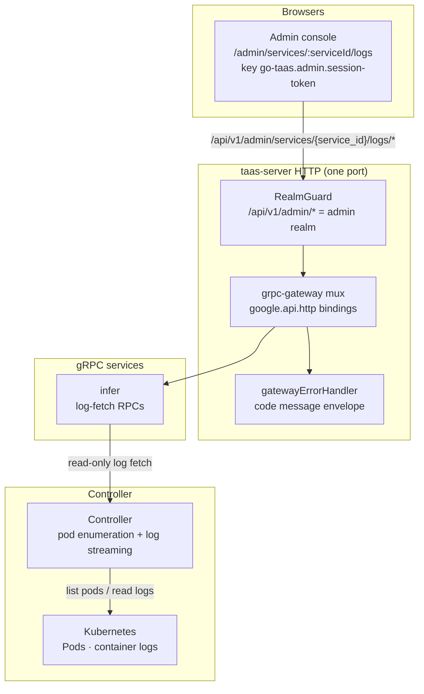
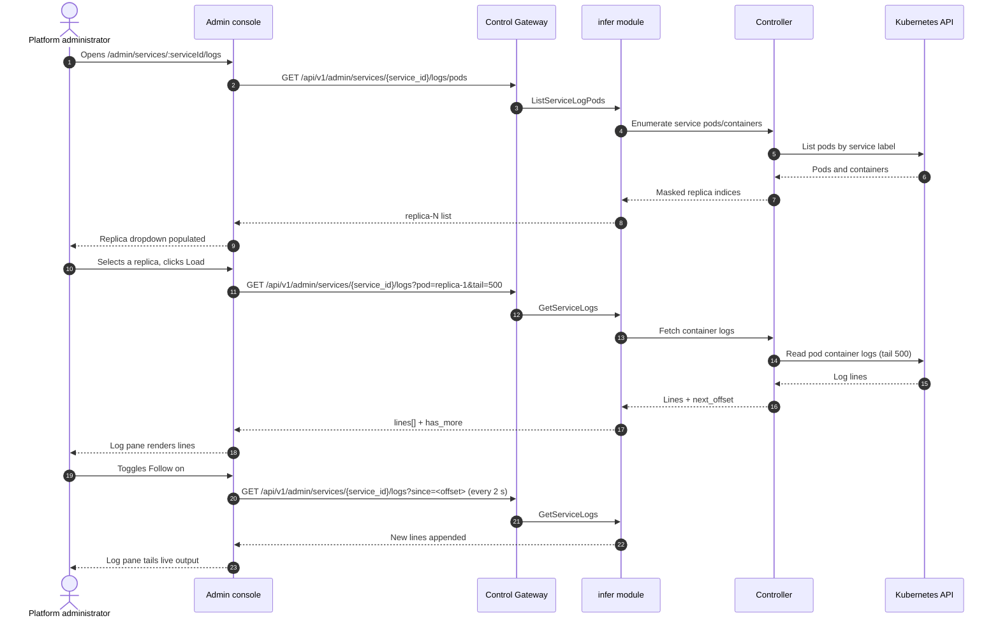

# Inference Service Logs Viewer — Architecture and Detailed Design

| Attribute | Content |
| --- | --- |
| Feature point | Inference service logs viewer — view inference service logs in the console with level/time filters, tailing, and log search (backlog row 33) |
| Document scope | Architecture and detailed design for feature-33: the `ListServiceLogPods` and `GetServiceLogs` RPCs on `InferServiceService`, the read-only pod/container enumeration and log streaming from the Kubernetes API through the Controller, the admin Service Logs page (`/admin/services/:serviceId/logs`), plus error handling, configuration, security, rollout, and function-level design per layer |
| Owning modules | `infer` (log-fetch RPCs over the service's pods), `internal/controller` (read-only: pod/container enumeration and log streaming from the Kubernetes API), `pkg/server` gateway (admin-prefix bindings), `web` admin console (`ServiceLogsPage`) |
| Related documents | [Requirement Analysis and UI/UX Design](../design/service-logs-viewer.md) · [Architecture Design](../design/architecture.md) §2.4 (`infer`), §2.7 Controller, §4.2 one-click deployment flow · [Model Catalog & One-Click Deployment](./model-catalog-deployment.md) (the inference-service lifecycle and the `inference_services` table) · [Console Surface Separation](./console-surface-separation.md) (the two surfaces, the `AdminShell` conventions, the masked-projection rule) · [Request Tracing & Latency Breakdown](./request-tracing.md) (the sibling diagnostic surface this feature complements with raw container logs) |
| Status | Architecture complete, handed to the Developer agent |

---

## 1. Overview and Goals

go-taas runs inference services as Kubernetes Deployments (model-catalog-deployment §4.2): the Controller creates the Deployment and Service, and the inference engine (vLLM, etc.) writes its logs to the container's stdout/stderr. The request-tracing feature (row 27) explains *what happened inside a request* (TTFT, generation, spans), but it cannot answer the operator's raw question: *what did the inference engine print?* When a deployment fails to converge, a request errors, or the engine logs a warning, the operator must leave the console and run `kubectl logs` against the pod — an operator-orchestration escape hatch that the console should own.

This feature adds an **inference service logs viewer**: view the container logs of an inference service's pods in the console, with level/time filters, tailing, and log search.

**Goals**:

- A `ListServiceLogPods` RPC returning the service's pods/containers masked as replica indices (never raw pod names).
- A `GetServiceLogs` RPC returning a bounded window of log lines with `tail`/`since`/`level` filters and a `next_offset` cursor.
- Logs read directly from the Kubernetes API through the Controller (no log store).
- Live tailing as a bounded poll driven by the console.
- Client-side search over the fetched window.
- An admin Service Logs page (`/admin/services/:serviceId/logs`).
- New error codes in a service-logs block (117xx).
- The page → route → API-prefix table with the exact admin prefix; per-page interactive states including empty, error, and permission-denied; numbered acceptance criteria testable in Nightwatch against the compose stack.

**Non-goals** (deferred, design §8): request-level traces and latency breakdown (#27); a log-aggregation store or LogQL-style query language (deliberately absent, D2); log retention/archival; a user-realm logs surface (deliberately absent, D1).

### 1.1 Reading order of this document

Section 2 records the architecture decisions (AD1–AD8, mirroring the design's D1–D8). Sections 3–5 are the component view, data model, and API design. Section 6 is the frontend architecture (page → route → API-prefix table, auth guard). Sections 7–8 are the sequence flows and error handling. Sections 9–11 are configuration, security, and rollout. Sections 12–14 are the acceptance-criteria traceability, the function-level detailed design, and the ordered implementation task list.

---

## 2. Architecture Decisions

| # | Decision | Rationale |
| --- | --- | --- |
| AD1 | **The logs viewer lives on the admin surface only**: `/admin/services/:serviceId/logs` + `/api/v1/admin/services/{service_id}/logs/*`. There is **no end-user surface** — container logs are operator-orchestration internals (feature #17's masked-projection rule); tenants get request traces (row 27), not raw engine stdout | Design D1. The operator needs raw logs to debug deployments and engine behavior; tenants need per-request traces, not pod internals. Consistent with the admin-only accelerator inventory (feature #18) and system status (feature #30) |
| AD2 | **Logs are read directly from the Kubernetes API through the Controller**, not from a new log store. The Controller enumerates the service's pods/containers and streams their stdout/stderr, exactly as `kubectl logs` does | Design D2. Standing up Loki/Datadog/CloudWatch is out of scope and heavy; the Controller already owns the Deployment/Pod lifecycle (model-catalog §4.2), so reading logs from the Kubernetes API is the natural, dependency-light path |
| AD3 | **A new `ListServiceLogPods` RPC** returns the service's pods/containers (masked as replica indices, not raw pod names) so the console can offer a pod selector | Design D3. The console must let the operator pick which replica's logs to view without leaking raw pod names (D1); a masked replica index is the product-safe projection |
| AD4 | **A new `GetServiceLogs` RPC** returns a bounded window of log lines for a chosen pod/container, with `tail` (default 500), `since` (time range), and `level` filters; the response carries the lines plus a `next_offset` for pagination | Design D4. Bounding the fetch (tail + time range) avoids unbounded reads (pitfall); `next_offset` enables "load more" without a log store |
| AD5 | **Live tailing is a bounded poll, not a blocking stream**: the console's "Follow" toggle polls `GetServiceLogs` with a `since` offset on a short interval (e.g. 2 s) while active | Design D5. A blocking stream would tie up the HTTP call and complicate the gateway; a bounded poll matches the existing console polling pattern (deployment state, observability) and is easy to test |
| AD6 | **Level filtering is best-effort**: the console filters by level when the engine emits structured levels (e.g. `[ERROR]`, `[WARN]`, `[INFO]`, `[DEBUG]`), and shows all lines otherwise | Design D6. Engines vary in whether they emit structured levels; a best-effort level filter degrades gracefully to "show all" without a parsing contract |
| AD7 | **Search is client-side over the fetched window** — a search box filters the already-fetched lines; it does not query a log store | Design D7. With no log store (D2), search must operate on the fetched window; this keeps the feature dependency-light and testable |
| AD8 | **The page is read-only and audited only for access** — it writes nothing and mutates nothing; the page is reachable only by authenticated admin sessions | Design D8. The feature is a pure read of container logs; the audit trail (feature #15) already covers the underlying service writes. No new audit events are needed |

---

## 3. Component View

### 3.1 Ownership

| Layer / component | Owns | Changes in this feature |
| --- | --- | --- |
| **Control Gateway (`grpc-gateway`)** | HTTP/JSON facade for the two log RPCs; realm guard (feature #17) already rejects a wrong-realm session with 10038; passes `X-Organization-Id` through as gRPC metadata | New bindings for `ListServiceLogPods` and `GetServiceLogs` (Section 5); no change to the realm guard |
| **`infer` module (`services/infer`)** | The two log RPCs: resolve the service, delegate pod/container enumeration and log streaming to the Controller, mask pod names to replica indices, build the bounded window and `next_offset` | New RPCs on the existing `InferServiceService` (AD3, AD4) |
| **`controller`** | Read-only: enumerate the service's pods/containers and stream their stdout/stderr from the Kubernetes API, exactly as `kubectl logs` does | New read-only log-fetch interface on the Controller (AD2) |
| **`pkg/k8s`** | The Kubernetes client (clientset) | Read-only: the Controller uses the existing clientset to list pods and read container logs |
| **PostgreSQL** | `inference_services` (unchanged) | No new tables |
| **Console** | Admin Service Logs page | One new page on the admin surface (Section 6) |

### 3.2 Runtime component view



### 3.3 Request identity chain

The log RPCs are **admin-surface** (AD1). The chain is:

1. `RealmGuard` (HTTP, `pkg/server/realm.go`) — path prefix `/api/v1/admin/services/*` decides the expected realm `admin`. With no `Authorization` header: pass through (transitional, feature-17 AD4). With a header: resolve the session realm from Redis; mismatch → 10038, unknown/expired/realm-less → 10027.
2. grpc-gateway mux — routes by the annotated path and forwards `authorization` and `x-organization-id`.
3. Service handler — the `infer` module resolves the service by `service_id` (the service carries its own `organization_id`), then delegates the pod/container enumeration and log streaming to the Controller.
4. `tenancy.RoleGuard` — gates the admin log RPCs by the caller's role (10036). The permission-denied state (design FR5.1, AC9) is produced by the role check.

---

## 4. Data Model

### 4.1 No New Tables

The service-logs feature is a pure read of container logs from the Kubernetes API through the Controller (AD2, design D8). No new tables, no new MQ subjects, no new runners, and no writes on any path. The `inference_services` table is read to resolve the service and its pods' labels; the log lines themselves are never persisted.

---

## 5. API Design

### 5.1 RPC Surface

Two new RPCs on `taas.infer.v1.InferServiceService`. Both are served as HTTP via the Control Gateway on the **admin prefix** `/api/v1/admin/services/{service_id}/logs/*` (AD1). There is **no user-prefix binding** (AD1).

| Service | RPC | HTTP | Status | Purpose |
| --- | --- | --- | --- | --- |
| `taas.infer.v1` | `ListServiceLogPods` | `GET /api/v1/admin/services/{service_id}/logs/pods` | **new** | Enumerate the service's pods/containers, masked as replica indices |
| `taas.infer.v1` | `GetServiceLogs` | `GET /api/v1/admin/services/{service_id}/logs` | **new** | Fetch a bounded window of log lines with tail/time/level filters and a `next_offset` cursor |

### 5.2 Proto Messages

```proto
// infer.proto (additive)

// ListServiceLogPods returns the service's pods/containers masked as
// replica indices (never raw pod names).
// Admin-surface API: served under /api/v1/admin.
rpc ListServiceLogPods(ListServiceLogPodsRequest) returns (ListServiceLogPodsResponse) {
  option (google.api.http) = {get: "/api/v1/admin/services/{service_id}/logs/pods"};
}

message ListServiceLogPodsRequest {
  string service_id = 1; // path
}

message ServiceLogPod {
  // replica_index is the masked replica index, e.g. "replica-1".
  string replica_index = 1;
  // container is the container name.
  string container = 2;
  // state is the pod's phase (Running, Pending, etc.).
  string state = 3;
}

message ListServiceLogPodsResponse {
  taas.common.v1.Response response = 1;
  repeated ServiceLogPod pods = 2;
}

// GetServiceLogs returns a bounded window of log lines for a chosen
// pod/container, with tail/time/level filters and a next_offset cursor.
// Admin-surface API: served under /api/v1/admin.
rpc GetServiceLogs(GetServiceLogsRequest) returns (GetServiceLogsResponse) {
  option (google.api.http) = {get: "/api/v1/admin/services/{service_id}/logs"};
}

message GetServiceLogsRequest {
  string service_id = 1; // path
  // pod is the replica index (e.g. "replica-1").
  string pod = 2;
  // container is optional; when empty the first container is used.
  string container = 3;
  // tail is the number of most-recent lines, default 500, max 5000.
  int32 tail = 4;
  // since is an RFC3339 time; optional.
  string since = 5;
  // level is best-effort: error / warn / info / debug.
  string level = 6;
  // next_offset is the cursor for "load more"; empty on the first call.
  string next_offset = 7;
}

message ServiceLogLine {
  int64 timestamp = 1;
  // level is best-effort, empty when not detected.
  string level = 2;
  string message = 3;
}

message GetServiceLogsResponse {
  taas.common.v1.Response response = 1;
  repeated ServiceLogLine lines = 2;
  // next_offset is the cursor for the next older window.
  string next_offset = 3;
  bool has_more = 4;
}
```

### 5.3 Wire Format (established conventions)

- Query parameters bind by name (`pod`, `container`, `tail`, `since`, `level`, `next_offset`).
- Success responses are HTTP 200 (grpc-gateway default for unary RPCs).
- Business errors render as `{"code": <int>, "message": "..."}` with HTTP 500 for out-of-range codes (platform-wide status quo).
- int64 fields serialize as JSON strings.

### 5.4 Validation Matrix

`ListServiceLogPods` validates: `service_id` exists (10301). `GetServiceLogs` validates, in order:

| # | Check | Failure code | Canonical message |
| --- | --- | --- | --- |
| 1 | `service_id` exists | 10301 `CodeInferServiceNotFound` | inference service not found |
| 2 | `pod`/`container` is a known replica/container of the service | 10304 `CodeInferEndpointNotFound` | inference endpoint not found |
| 3 | `tail` in 1–5000 and `since` is a valid RFC3339 time | 10404 `CodeMeteringRangeInvalid` | metering range invalid |

### 5.5 Controller Log-Fetch Interface

The `infer` module delegates to the Controller through a read-only interface. The Controller:

- `ListServiceLogPods(ctx, serviceID)` — lists the service's pods by the service label, returns each pod's containers and phase, masked as `replica-N` indices (AD3).
- `GetServiceLogs(ctx, serviceID, pod, container, tail, since)` — reads the container's stdout/stderr from the Kubernetes API (the `PodLogs` API, exactly as `kubectl logs` does), bounded by `tail` and `since`, returns the lines and a `next_offset` cursor (AD4).

The `next_offset` cursor is an opaque string encoding the pod/container identity and the oldest line timestamp read so far; the `infer` module passes it back to the Controller on the next "load more" call. The Controller does not persist logs.

---

## 6. Frontend Architecture

### 6.1 Page → Route → API-Prefix Table

| Page | Surface | Web route | API prefix |
| --- | --- | --- | --- |
| Service Logs page | admin | `/admin/services/:serviceId/logs` | `/api/v1/admin/services/{service_id}/logs/pods` |
| Service Logs page | admin | `/admin/services/:serviceId/logs` | `/api/v1/admin/services/{service_id}/logs` |

Every page and API call is on the **admin surface**; there is no end-user surface (AD1). Admin pages never call a `/api/v1/*` route, and the admin session realm is used throughout.

### 6.2 Navigation Placement

The Service Logs page is reached from the Service Detail page (`/admin/services/:serviceId`) via a "Logs" link/tab. It renders inside `AdminShell` (feature #17). The nav item is not a top-level entry; it is a drill-down from the service detail.

### 6.3 Shared Components and State

- `AdminShell` (feature #17) — the page shell, session guard, and permission-denied state.
- The shared time-range preset control (24 h / 7 d / 30 d / custom) from the Usage/Observability pages.
- The existing `usePolling` pattern for the Follow toggle (AD5).
- Standard dropdown, toggle, search-box, and skeleton components from the existing admin pages.

### 6.4 Auth Guard per Surface

The page is admin-surface. The `RealmGuard` (feature #17) rejects a wrong-realm session with 10038 and an unknown/expired/realm-less session with 10027. `tenancy.RoleGuard` gates the RPCs by the caller's role (10036). The page's permission-denied handling is the standard feature-17 state.

### 6.5 Page: `/admin/services/:serviceId/logs` — Service Logs (admin)

**Purpose**: give the platform administrator a single surface to read an inference service's container logs — pick a replica, filter by level and time, tail live output, and search the fetched window.

**Layout**: rendered inside `AdminShell`. A page header ("Service Logs", subtitle with the service name and `service_id`) with a **Back to Service** link (secondary). Below:

1. **Filter bar** — a **Replica** dropdown (from `ListServiceLogPods`, masked as `replica-N`), a **Level** dropdown (All / Error / Warn / Info / Debug), a **Time range** control (the shared preset: 24 h / 7 d / 30 d / custom), a **Follow** toggle, and a **Search** box.
2. **Log view** — a monospace, scrollable log pane showing the fetched lines, each with a timestamp, a level badge (when detected), and the message. A **Load more** action at the top appends older lines.

**Interactive states**:

| State | Behaviour |
| --- | --- |
| Default | Filter bar + log pane render from the first successful load (default tail 500, All levels, 24 h range, replica 1) |
| Loading | Skeleton log pane; Follow and Load more are disabled |
| Empty | "No log lines in this window." with a hint to widen the time range or tail; the filter bar stays visible |
| Error | An error banner with the message and a Retry button; the page keeps its last good lines with a "Showing stale data" banner |
| Disabled | Follow is disabled while the service has no running pods; Load more is disabled while a fetch is in flight or `has_more` is false |
| Permission-denied | A session without the required role receives 10036 and the page shows the standard permission-denied state (feature #17) with a link back to the admin home |

**Filter bar controls**: Replica dropdown (from `ListServiceLogPods`), Level dropdown (All / Error / Warn / Info / Debug), Time range (shared preset control), Follow toggle, Search box. Changing Replica, Level, or Time range refetches the window; Search filters client-side; Follow polls on a 2 s interval.

**Log view**: monospace pane, each line `[timestamp] [level] message` with a level badge. **Load more** fetches the next window via `next_offset` and prepends older lines. The pane auto-scrolls to the bottom when Follow is active.

---

## 7. Sequence Flows

### 7.1 Load and tail logs



---

## 8. Error Handling

| Condition | Code | Constant | Notes |
| --- | --- | --- | --- |
| Unknown `service_id` | 10301 | `CodeInferServiceNotFound` | `ListServiceLogPods`, `GetServiceLogs` |
| Unknown pod/container | 10304 | `CodeInferEndpointNotFound` | Reused for an unknown replica/container (FR2.3) |
| Invalid `tail` (0 or > 5000) or malformed `since` | 10404 | `CodeMeteringRangeInvalid` | Reused — the metering range contract (FR2.3) |
| Wrong-realm session | 10038 | `CodeRealmMismatch` | gateway realm guard |
| Unknown/expired/realm-less session | 10027 | `CodeSessionInvalid` | gateway realm guard |
| Insufficient role | 10036 | `CodeForbidden` | `tenancy.RoleGuard` |

The design doc allocates a **service-logs error block 117xx** for this feature. The existing codes above (10301/10304/10404) already cover every failure mode the design names; the 117xx block is reserved for any future service-logs-specific code the Developer agent needs. If a new code is required, it must be added to `pkg/errors/codes.go` in the 117xx block with a comment naming this feature.

---

## 9. Configuration

New configuration in the `infer` section of `pkg/config`:

| Key | Default | Description |
| --- | --- | --- |
| `infer.logs.tail_default` | 500 | Default `tail` for `GetServiceLogs` |
| `infer.logs.tail_max` | 5000 | Maximum `tail` for `GetServiceLogs` |
| `infer.logs.follow_interval_ms` | 2000 | The console's Follow poll interval (a console constant, not a server value; listed here for documentation) |

The Controller's log-fetch uses the existing Kubernetes client configuration; no new config is required on the Controller side.

---

## 10. Security Considerations

- **Admin-only surface** (AD1): container logs are operator-orchestration internals; tenants never see them. The `RealmGuard` and `RoleGuard` enforce the surface and role.
- **Masked replica indices** (AD3): raw pod names never leak to the console; the product-safe projection is `replica-N`.
- **Bounded fetches** (AD4): `tail` is capped at 5000 and `since` bounds the window, preventing unbounded reads of long-running services.
- **Read-only** (AD8): the feature writes nothing and mutates nothing; no new audit events are needed.

---

## 11. Rollout / Upgrade Notes

- No schema changes; no new tables.
- The new RPCs bind under the existing admin prefix; the realm guard already treats that prefix as the admin surface.
- The Controller must expose the read-only log-fetch interface; the `infer` module calls it in-process (single-Deployment topology).
- The feature is additive; existing deployments and pages are unaffected.

---

## 12. Acceptance-Criteria Traceability

| AC | Design | Architecture section | Level |
| --- | --- | --- | --- |
| AC1 | `ListServiceLogPods` returns pods/containers masked as replica indices (never raw pod names); unknown service_id → 10301 | §5.1, §5.2, §5.4 | FVT |
| AC2 | `GetServiceLogs` returns a bounded window with timestamp/level/message plus next_offset/has_more; invalid tail or malformed since → validation error | §5.1, §5.2, §5.4 | FVT |
| AC3 | `GetServiceLogs` with a next_offset returns the next older window; has_more is false at the end | §5.2, §5.5 | FVT |
| AC4 | `/admin/services/:serviceId/logs` renders filter bar + log pane from first load, replica dropdown from `ListServiceLogPods` | §6.5 | E2E |
| AC5 | Changing replica/level/time refetches; level filter shows only matching lines and degrades to "show all" when no level detected | §6.5 | E2E |
| AC6 | Follow polls on a short interval and appends new lines; turning off stops the poll; Follow disabled when no running pods | §6.5, §7.1 | E2E |
| AC7 | Search filters fetched lines client-side; Load more fetches next window via next_offset and prepends older lines | §6.5 | E2E |
| AC8 | Admin surface only: route `/admin/services/:serviceId/logs`, every API call uses `/api/v1/admin/services/{service_id}/logs/*` with no `/api/v1/*` string | §6.1 | E2E (surface separation) |
| AC9 | A session without the required role receives 10036 and the page shows the standard permission-denied state | §6.4, §8 | E2E |

---

## 13. Function-Level Detailed Design

### 13.1 `infer` module (`services/infer`)

| File | Function | Responsibility |
| --- | --- | --- |
| `service.go` | `ListServiceLogPods(ctx, req)` | Validate `service_id` (10301); delegate to the Controller's pod enumeration; return the masked replica indices |
| | `GetServiceLogs(ctx, req)` | Validate `service_id` (10301), `pod`/`container` (10304), `tail`/`since` (10404); delegate to the Controller's log fetch; build the bounded window + `next_offset` + `has_more` |
| `log_fetch.go` (new) | `LogFetcher` interface | The read-only seam the `infer` module calls into the Controller: `ListServiceLogPods(ctx, serviceID)` and `GetServiceLogs(ctx, serviceID, pod, container, tail, since, nextOffset)` |

### 13.2 `controller` (`internal/controller`)

| File | Function | Responsibility |
| --- | --- | --- |
| `log_fetch.go` (new) | `ListServiceLogPods(ctx, serviceID)` | List the service's pods by the service label via the clientset; return each pod's containers and phase, masked as `replica-N` indices (AD3) |
| | `GetServiceLogs(ctx, serviceID, pod, container, tail, since, nextOffset)` | Read the container's stdout/stderr via the Kubernetes `PodLogs` API (exactly as `kubectl logs`), bounded by `tail` and `since`; return the lines and a `next_offset` cursor (AD4) |

### 13.3 `web` admin console

| File | Page | Responsibility |
| --- | --- | --- |
| `pages/ServiceLogsPage.tsx` | `/admin/services/:serviceId/logs` | Filter bar (replica/level/time/follow/search), log pane, load-more pagination, follow polling (AD5) |
| `App.tsx` / `router.tsx` | route registration | Register `/admin/services/:serviceId/logs` on the admin surface |

---

## 14. Ordered Implementation Task List

1. `pkg/errors/codes.go` — reserve the 117xx block comment for service-logs (no new code needed unless a failure mode requires it).
2. `proto/taas/infer/v1/infer.proto` — add `ListServiceLogPods` + `GetServiceLogs` RPCs and messages; regenerate.
3. `internal/controller/log_fetch.go` — the read-only pod enumeration and log streaming from the Kubernetes API.
4. `services/infer/log_fetch.go` — the `LogFetcher` seam; wire it to the Controller.
5. `services/infer/service.go` — `ListServiceLogPods`, `GetServiceLogs`.
6. `pkg/config` — the `infer.logs` section.
7. `web/src/pages/ServiceLogsPage.tsx` — the page; register the route.
8. FVT + E2E tests for AC1–AC9.