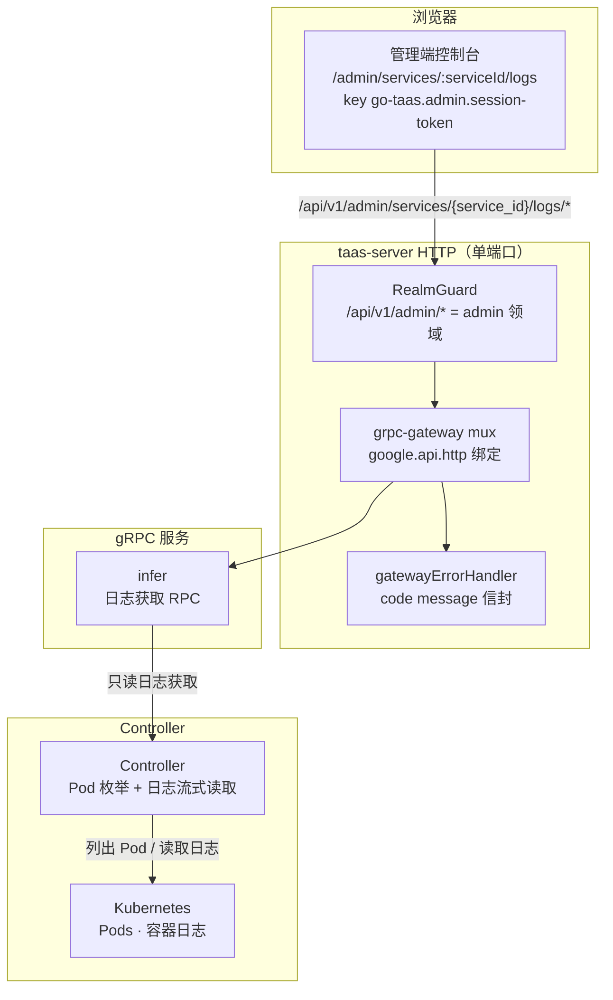
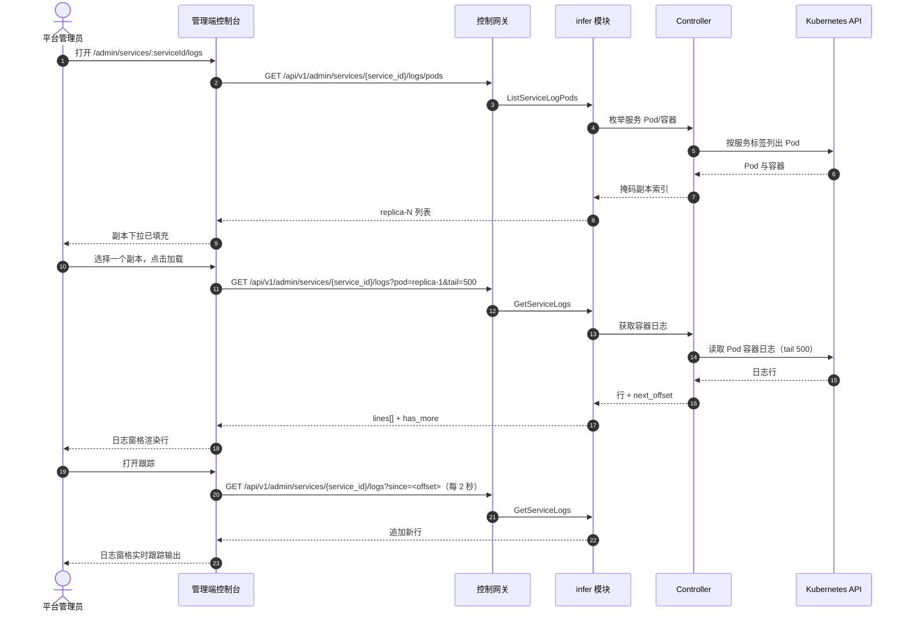

# 推理服务日志查看器 —— 架构与详细设计

| 属性 | 内容 |
| --- | --- |
| 功能点 | 推理服务日志查看器 —— 在控制台中查看推理服务日志，带级别/时间过滤、实时跟踪与日志搜索（backlog 第 33 行） |
| 文档范围 | 功能点 33 的架构与详细设计：`InferServiceService` 上的 `ListServiceLogPods` 与 `GetServiceLogs` RPC、通过 Controller 从 Kubernetes API 只读枚举 Pod/容器与流式读取日志、管理端服务日志页面（`/admin/services/:serviceId/logs`），以及错误处理、配置、安全、上线与各层函数级设计 |
| 所属模块 | `infer`（服务 Pod 上的日志获取 RPC）、`internal/controller`（只读：从 Kubernetes API 枚举 Pod/容器与流式读取日志）、`pkg/server` 网关（管理端前缀绑定）、`web` 管理端控制台（`ServiceLogsPage`） |
| 相关文档 | [需求分析与 UI/UX 设计](../design/service-logs-viewer.md) · [架构设计](../design/architecture.md) §2.4（`infer`）、§2.7 Controller、§4.2 一键部署流程 · [模型目录与一键部署](./model-catalog-deployment.md)（推理服务生命周期与 `inference_services` 表）· [控制台表面分离](./console-surface-separation.md)（两个表面、`AdminShell` 约定、掩码投影规则）· [请求追踪与延迟分解](./request-tracing.md)（本功能用原始容器日志补充的同级诊断表面） |
| 状态 | 架构完成，已移交给开发智能体 |

---

## 1. 概述与目标

go-taas 将推理服务作为 Kubernetes Deployment 运行（model-catalog-deployment §4.2）：Controller 创建 Deployment 与 Service，推理引擎（vLLM 等）将其日志写入容器的 stdout/stderr。请求追踪功能（第 27 行）解释*请求内部发生了什么*（TTFT、生成、span），但它无法回答操作员的原始问题：*推理引擎打印了什么？* 当部署无法收敛、请求出错或引擎记录警告时，操作员必须离开控制台对 Pod 运行 `kubectl logs` —— 这是控制台应该拥有的操作员编排逃生舱。

本功能新增**推理服务日志查看器**：在控制台中查看推理服务 Pod 的容器日志，带级别/时间过滤、实时跟踪与日志搜索。

**目标**：

- 一个 `ListServiceLogPods` RPC，返回服务的 Pod/容器，掩码为副本索引（绝不返回原始 Pod 名）。
- 一个 `GetServiceLogs` RPC，返回带 `tail`/`since`/`level` 过滤与 `next_offset` 游标的有界日志行窗口。
- 通过 Controller 直接从 Kubernetes API 读取日志（无日志存储）。
- 由控制台驱动的有界轮询实时跟踪。
- 对已获取窗口的客户端搜索。
- 一个管理端服务日志页面（`/admin/services/:serviceId/logs`）。
- 服务日志错误块（117xx）中的新错误码。
- 页面 → 路由 → API 前缀表，带精确的管理端前缀；包括空、错误、权限拒绝在内的各页面交互状态；可在 compose 栈上通过 Nightwatch 测试的编号验收标准。

**非目标**（延后，设计 §8）：请求级追踪与延迟分解（#27）；日志聚合存储或 LogQL 风格查询语言（刻意缺失，D2）；日志保留/归档；用户端日志表面（刻意缺失，D1）。

### 1.1 本文档阅读顺序

第 2 节记录架构决策（AD1–AD8，对应设计的 D1–D8）。第 3–5 节是组件视图、数据模型与 API 设计。第 6 节是前端架构（页面 → 路由 → API 前缀表、认证守卫）。第 7–8 节是时序流程与错误处理。第 9–11 节是配置、安全与上线。第 12–14 节是验收标准可追溯性、函数级详细设计与有序实现任务清单。

---

## 2. 架构决策

| # | 决策 | 理由 |
| --- | --- | --- |
| AD1 | **日志查看器仅存在于管理端表面**：`/admin/services/:serviceId/logs` + `/api/v1/admin/services/{service_id}/logs/*`。**没有用户端表面** —— 容器日志是操作员编排内部信息（功能点 #17 的掩码投影规则）；租户获得请求追踪（第 27 行），而非原始引擎 stdout | 设计 D1。操作员需要原始日志来调试部署与引擎行为；租户需要每请求追踪，而非 Pod 内部信息。与仅管理端的加速器清单（功能点 #18）和系统状态（功能点 #30）一致 |
| AD2 | **日志通过 Controller 直接从 Kubernetes API 读取**，而非从新的日志存储。Controller 枚举服务的 Pod/容器并流式读取其 stdout/stderr，与 `kubectl logs` 完全一致 | 设计 D2。搭建 Loki/Datadog/CloudWatch 超出范围且沉重；Controller 已拥有 Deployment/Pod 生命周期（model-catalog §4.2），因此从 Kubernetes API 读取日志是自然、依赖轻的路径 |
| AD3 | **新增 `ListServiceLogPods` RPC**，返回服务的 Pod/容器（掩码为副本索引，而非原始 Pod 名），以便控制台提供 Pod 选择器 | 设计 D3。控制台必须让操作员选择查看哪个副本的日志，而不泄露原始 Pod 名（D1）；掩码副本索引是产品安全的投影 |
| AD4 | **新增 `GetServiceLogs` RPC**，返回所选 Pod/容器的有界日志行窗口，带 `tail`（默认 500）、`since`（时间范围）与 `level` 过滤；响应携带行与用于分页的 `next_offset` | 设计 D4。有界获取（tail + 时间范围）避免无界读取（陷阱）；`next_offset` 无需日志存储即可"加载更多" |
| AD5 | **实时跟踪是有界轮询，而非阻塞流**：控制台的"跟踪"开关在激活时以短间隔（如 2 秒）用 `since` 偏移轮询 `GetServiceLogs` | 设计 D5。阻塞流会占用 HTTP 调用并使网关复杂化；有界轮询匹配现有控制台轮询模式（部署状态、可观测性）且易于测试 |
| AD6 | **级别过滤是尽力而为**：当引擎发出结构化级别（如 `[ERROR]`、`[WARN]`、`[INFO]`、`[DEBUG]`）时控制台按级别过滤，否则显示所有行 | 设计 D6。引擎在是否发出结构化级别上各不相同；尽力而为的级别过滤优雅地降级为"显示全部"，无需解析契约 |
| AD7 | **搜索是对已获取窗口的客户端搜索** —— 搜索框过滤已获取的行；它不查询日志存储 | 设计 D7。无日志存储（D2）时，搜索必须作用于已获取窗口；这使功能依赖轻且可测试 |
| AD8 | **页面是只读的，仅对访问进行审计** —— 它不写入也不变更任何内容；页面仅可由已认证的管理端会话访问 | 设计 D8。该功能是对容器日志的纯读取；审计轨迹（功能点 #15）已覆盖底层服务写入。无需新审计事件 |

---

## 3. 组件视图

### 3.1 职责归属

| 层 / 组件 | 拥有 | 本功能的变更 |
| --- | --- | --- |
| **控制网关（`grpc-gateway`）** | 两个日志 RPC 的 HTTP/JSON 门面；领域守卫（功能点 #17）已用 10038 拒绝错误领域的会话；将 `X-Organization-Id` 作为 gRPC 元数据传递 | `ListServiceLogPods` 与 `GetServiceLogs` 的新绑定（第 5 节）；领域守卫无变更 |
| **`infer` 模块（`services/infer`）** | 两个日志 RPC：解析服务、将 Pod/容器枚举与日志流式读取委托给 Controller、将 Pod 名掩码为副本索引、构建有界窗口与 `next_offset` | 现有 `InferServiceService` 上的新 RPC（AD3、AD4） |
| **`controller`** | 只读：枚举服务的 Pod/容器并从 Kubernetes API 流式读取其 stdout/stderr，与 `kubectl logs` 完全一致 | Controller 上新的只读日志获取接口（AD2） |
| **`pkg/k8s`** | Kubernetes 客户端（clientset） | 只读：Controller 使用现有 clientset 列出 Pod 并读取容器日志 |
| **PostgreSQL** | `inference_services`（不变） | 无新表 |
| **控制台** | 管理端服务日志页面 | 管理端表面上的一个新页面（第 6 节） |

### 3.2 运行时组件视图



### 3.3 请求身份链

日志 RPC 是**管理端表面**（AD1）。链路为：

1. `RealmGuard`（HTTP，`pkg/server/realm.go`）—— 路径前缀 `/api/v1/admin/services/*` 决定期望领域 `admin`。无 `Authorization` 头：放行（过渡期，功能点-17 AD4）。有头：从 Redis 解析会话领域；不匹配 → 10038，未知/过期/无领域 → 10027。
2. grpc-gateway mux —— 按注解路径路由并转发 `authorization` 与 `x-organization-id`。
3. 服务处理器 —— `infer` 模块按 `service_id` 解析服务（服务自带 `organization_id`），然后将 Pod/容器枚举与日志流式读取委托给 Controller。
4. `tenancy.RoleGuard` —— 按调用者角色门控管理端日志 RPC（10036）。权限拒绝状态（设计 FR5.1、AC9）由角色检查产生。

---

## 4. 数据模型

### 4.1 无新表

服务日志功能是通过 Controller 从 Kubernetes API 对容器日志的纯读取（AD2、设计 D8）。无新表、无新 MQ 主题、无新 runner、任何路径上无写入。读取 `inference_services` 表以解析服务及其 Pod 的标签；日志行本身从不持久化。

---

## 5. API 设计

### 5.1 RPC 表面

`taas.infer.v1.InferServiceService` 上两个新 RPC。两者都通过控制网关在**管理端前缀** `/api/v1/admin/services/{service_id}/logs/*` 上以 HTTP 提供（AD1）。**没有用户前缀绑定**（AD1）。

| 服务 | RPC | HTTP | 状态 | 用途 |
| --- | --- | --- | --- | --- |
| `taas.infer.v1` | `ListServiceLogPods` | `GET /api/v1/admin/services/{service_id}/logs/pods` | **新** | 枚举服务的 Pod/容器，掩码为副本索引 |
| `taas.infer.v1` | `GetServiceLogs` | `GET /api/v1/admin/services/{service_id}/logs` | **新** | 带 tail/time/level 过滤与 `next_offset` 游标的有界日志行窗口 |

### 5.2 Proto 消息

```proto
// infer.proto（加性）

// ListServiceLogPods 返回服务的 Pod/容器，掩码为副本索引（绝不返回原始 Pod 名）。
// 管理端表面 API：在 /api/v1/admin 下提供。
rpc ListServiceLogPods(ListServiceLogPodsRequest) returns (ListServiceLogPodsResponse) {
  option (google.api.http) = {get: "/api/v1/admin/services/{service_id}/logs/pods"};
}

message ListServiceLogPodsRequest {
  string service_id = 1; // path
}

message ServiceLogPod {
  // replica_index 是掩码副本索引，如 "replica-1"。
  string replica_index = 1;
  // container 是容器名。
  string container = 2;
  // state 是 Pod 的阶段（Running、Pending 等）。
  string state = 3;
}

message ListServiceLogPodsResponse {
  taas.common.v1.Response response = 1;
  repeated ServiceLogPod pods = 2;
}

// GetServiceLogs 返回所选 Pod/容器的有界日志行窗口，带 tail/time/level 过滤与 next_offset 游标。
// 管理端表面 API：在 /api/v1/admin 下提供。
rpc GetServiceLogs(GetServiceLogsRequest) returns (GetServiceLogsResponse) {
  option (google.api.http) = {get: "/api/v1/admin/services/{service_id}/logs"};
}

message GetServiceLogsRequest {
  string service_id = 1; // path
  // pod 是副本索引（如 "replica-1"）。
  string pod = 2;
  // container 可选；为空时使用第一个容器。
  string container = 3;
  // tail 是最近行数，默认 500，最大 5000。
  int32 tail = 4;
  // since 是 RFC3339 时间；可选。
  string since = 5;
  // level 是尽力而为：error / warn / info / debug。
  string level = 6;
  // next_offset 是"加载更多"的游标；首次调用为空。
  string next_offset = 7;
}

message ServiceLogLine {
  int64 timestamp = 1;
  // level 是尽力而为，未检测到时为空。
  string level = 2;
  string message = 3;
}

message GetServiceLogsResponse {
  taas.common.v1.Response response = 1;
  repeated ServiceLogLine lines = 2;
  // next_offset 是下一个更早窗口的游标。
  string next_offset = 3;
  bool has_more = 4;
}
```

### 5.3 线上格式（既定约定）

- 查询参数按名称绑定（`pod`、`container`、`tail`、`since`、`level`、`next_offset`）。
- 成功响应为 HTTP 200（grpc-gateway 对一元 RPC 的默认）。
- 业务错误渲染为 `{"code": <int>, "message": "..."}`，越界码为 HTTP 500（平台现状）。
- int64 字段序列化为 JSON 字符串。

### 5.4 校验矩阵

`ListServiceLogPods` 校验：`service_id` 存在（10301）。`GetServiceLogs` 按顺序校验：

| # | 检查 | 失败码 | 规范消息 |
| --- | --- | --- | --- |
| 1 | `service_id` 存在 | 10301 `CodeInferServiceNotFound` | inference service not found |
| 2 | `pod`/`container` 是服务的已知副本/容器 | 10304 `CodeInferEndpointNotFound` | inference endpoint not found |
| 3 | `tail` 在 1–5000 且 `since` 是有效的 RFC3339 时间 | 10404 `CodeMeteringRangeInvalid` | metering range invalid |

### 5.5 Controller 日志获取接口

`infer` 模块通过只读接口委托给 Controller。Controller：

- `ListServiceLogPods(ctx, serviceID)` —— 按服务标签列出服务的 Pod，返回每个 Pod 的容器与阶段，掩码为 `replica-N` 索引（AD3）。
- `GetServiceLogs(ctx, serviceID, pod, container, tail, since)` —— 从 Kubernetes API（`PodLogs` API，与 `kubectl logs` 完全一致）读取容器的 stdout/stderr，受 `tail` 与 `since` 约束，返回行与 `next_offset` 游标（AD4）。

`next_offset` 游标是编码 Pod/容器身份与已读取最旧行时间戳的不透明字符串；`infer` 模块在下次"加载更多"调用时将其传回 Controller。Controller 不持久化日志。

---

## 6. 前端架构

### 6.1 页面 → 路由 → API 前缀表

| 页面 | 表面 | Web 路由 | API 前缀 |
| --- | --- | --- | --- |
| 服务日志页面 | admin | `/admin/services/:serviceId/logs` | `/api/v1/admin/services/{service_id}/logs/pods` |
| 服务日志页面 | admin | `/admin/services/:serviceId/logs` | `/api/v1/admin/services/{service_id}/logs` |

每个页面和 API 调用都在**管理端表面**上；没有用户端表面（AD1）。管理端页面从不调用 `/api/v1/*` 路由，全程使用管理端会话领域。

### 6.2 导航位置

服务日志页面从服务详情页面（`/admin/services/:serviceId`）通过"日志"链接/标签页到达。它在 `AdminShell`（功能点 #17）内渲染。导航项不是顶层入口；它是从服务详情下钻的。

### 6.3 共享组件与状态

- `AdminShell`（功能点 #17）—— 页面外壳、会话守卫与权限拒绝状态。
- 来自使用/可观测性页面的共享时间范围预设控件（24 小时 / 7 天 / 30 天 / 自定义）。
- 用于跟踪开关的现有 `usePolling` 模式（AD5）。
- 来自现有管理端页面的标准下拉、开关、搜索框与骨架组件。

### 6.4 各表面认证守卫

页面是管理端表面。`RealmGuard`（功能点 #17）用 10038 拒绝错误领域的会话，用 10027 拒绝未知/过期/无领域会话。`tenancy.RoleGuard` 按调用者角色门控 RPC（10036）。页面的权限拒绝处理是标准的功能点-17 状态。

### 6.5 页面：`/admin/services/:serviceId/logs` —— 服务日志（admin）

**用途**：为平台管理员提供读取推理服务容器日志的单一表面 —— 选择副本、按级别与时间过滤、实时跟踪输出、搜索已获取窗口。

**布局**：在 `AdminShell` 内渲染。页面头部（"服务日志"，副标题带服务名与 `service_id`），带**返回服务**链接（次要）。下方：

1. **过滤栏** —— **副本**下拉（来自 `ListServiceLogPods`，掩码为 `replica-N`）、**级别**下拉（全部/错误/警告/信息/调试）、**时间范围**控件（共享预设：24 小时 / 7 天 / 30 天 / 自定义）、**跟踪**开关与**搜索**框。
2. **日志视图** —— 等宽、可滚动的日志窗格，显示已获取的行，每行带时间戳、级别徽章（检测到时）与消息。顶部有**加载更多**操作，追加更旧的行。

**交互状态**：

| 状态 | 行为 |
| --- | --- |
| 默认 | 过滤栏 + 日志窗格在首次成功加载时渲染（默认 tail 500、全部级别、24 小时范围、副本 1） |
| 加载中 | 骨架日志窗格；跟踪与加载更多被禁用 |
| 空 | "此窗口内没有日志行。"并提示加宽时间范围或 tail；过滤栏保持可见 |
| 错误 | 带消息的错误横幅与重试按钮；页面保留最后的好行并显示"显示过期数据"横幅 |
| 禁用 | 服务无运行中 Pod 时跟踪被禁用；获取进行中或 `has_more` 为 false 时加载更多被禁用 |
| 权限拒绝 | 无所需角色的会话收到 10036，页面显示标准权限拒绝状态（功能点 #17），带返回管理端首页的链接 |

**过滤栏控件**：副本下拉（来自 `ListServiceLogPods`）、级别下拉（全部/错误/警告/信息/调试）、时间范围（共享预设控件）、跟踪开关、搜索框。更改副本、级别或时间范围会重新获取窗口；搜索在客户端过滤；跟踪以 2 秒间隔轮询。

**日志视图**：等宽窗格，每行 `[timestamp] [level] message`，带级别徽章。**加载更多**通过 `next_offset` 获取下一个窗口并前置更旧的行。跟踪激活时窗格自动滚动到底部。

---

## 7. 时序流程

### 7.1 加载与跟踪日志



---

## 8. 错误处理

| 条件 | 码 | 常量 | 说明 |
| --- | --- | --- | --- |
| 未知 `service_id` | 10301 | `CodeInferServiceNotFound` | `ListServiceLogPods`、`GetServiceLogs` |
| 未知 Pod/容器 | 10304 | `CodeInferEndpointNotFound` | 复用于未知副本/容器（FR2.3） |
| 无效 `tail`（0 或 > 5000）或格式错误的 `since` | 10404 | `CodeMeteringRangeInvalid` | 复用 —— 计量范围契约（FR2.3） |
| 错误领域会话 | 10038 | `CodeRealmMismatch` | 网关领域守卫 |
| 未知/过期/无领域会话 | 10027 | `CodeSessionInvalid` | 网关领域守卫 |
| 角色不足 | 10036 | `CodeForbidden` | `tenancy.RoleGuard` |

设计文档为本功能分配**服务日志错误块 117xx**。上述现有码（10301/10304/10404）已覆盖设计命名的每个失败模式；117xx 块保留给开发智能体未来可能需要的任何服务日志特定码。如需新码，必须将其添加到 `pkg/errors/codes.go` 的 117xx 块中，并带命名本功能的注释。

---

## 9. 配置

`pkg/config` 的 `infer` 部分中的新配置：

| 键 | 默认 | 描述 |
| --- | --- | --- |
| `infer.logs.tail_default` | 500 | `GetServiceLogs` 的默认 `tail` |
| `infer.logs.tail_max` | 5000 | `GetServiceLogs` 的最大 `tail` |
| `infer.logs.follow_interval_ms` | 2000 | 控制台跟踪轮询间隔（控制台常量，非服务器值；此处列出用于文档） |

Controller 的日志获取使用现有 Kubernetes 客户端配置；Controller 侧无需新配置。

---

## 10. 安全考虑

- **仅管理端表面**（AD1）：容器日志是操作员编排内部信息；租户从不看到它们。`RealmGuard` 与 `RoleGuard` 强制表面与角色。
- **掩码副本索引**（AD3）：原始 Pod 名绝不泄露到控制台；产品安全投影是 `replica-N`。
- **有界获取**（AD4）：`tail` 上限为 5000，`since` 约束窗口，防止对长期运行服务进行无界读取。
- **只读**（AD8）：功能不写入也不变更任何内容；无需新审计事件。

---

## 11. 上线/升级说明

- 无模式变更；无新表。
- 新 RPC 绑定在现有管理端前缀下；领域守卫已将该前缀视为管理端表面。
- Controller 必须暴露只读日志获取接口；`infer` 模块在进程内调用它（单 Deployment 拓扑）。
- 功能是加性的；现有部署与页面不受影响。

---

## 12. 验收标准可追溯性

| AC | 设计 | 架构章节 | 级别 |
| --- | --- | --- | --- |
| AC1 | `ListServiceLogPods` 返回掩码为副本索引的 Pod/容器（绝不返回原始 Pod 名）；未知 service_id → 10301 | §5.1、§5.2、§5.4 | FVT |
| AC2 | `GetServiceLogs` 返回带 timestamp/level/message 与 next_offset/has_more 的有界窗口；无效 tail 或格式错误的 since → 校验错误 | §5.1、§5.2、§5.4 | FVT |
| AC3 | 带 next_offset 的 `GetServiceLogs` 返回下一个更早窗口；日志末尾 has_more 为 false | §5.2、§5.5 | FVT |
| AC4 | `/admin/services/:serviceId/logs` 在首次加载时渲染过滤栏 + 日志窗格，副本下拉来自 `ListServiceLogPods` | §6.5 | E2E |
| AC5 | 更改副本/级别/时间重新获取；级别过滤仅显示匹配行，未检测到级别时降级为"显示全部" | §6.5 | E2E |
| AC6 | 跟踪以短间隔轮询并追加新行；关闭停止轮询；无运行中 Pod 时跟踪被禁用 | §6.5、§7.1 | E2E |
| AC7 | 搜索在客户端过滤已获取行；加载更多通过 next_offset 获取下一个窗口并前置更旧的行 | §6.5 | E2E |
| AC8 | 仅管理端表面：路由 `/admin/services/:serviceId/logs`，每个 API 调用使用 `/api/v1/admin/services/{service_id}/logs/*`，无 `/api/v1/*` 字符串 | §6.1 | E2E（表面分离） |
| AC9 | 无所需角色的会话收到 10036，页面显示标准权限拒绝状态 | §6.4、§8 | E2E |

---

## 13. 函数级详细设计

### 13.1 `infer` 模块（`services/infer`）

| 文件 | 函数 | 职责 |
| --- | --- | --- |
| `service.go` | `ListServiceLogPods(ctx, req)` | 校验 `service_id`（10301）；委托给 Controller 的 Pod 枚举；返回掩码副本索引 |
| | `GetServiceLogs(ctx, req)` | 校验 `service_id`（10301）、`pod`/`container`（10304）、`tail`/`since`（10404）；委托给 Controller 的日志获取；构建有界窗口 + `next_offset` + `has_more` |
| `log_fetch.go`（新） | `LogFetcher` 接口 | `infer` 模块调用进 Controller 的只读接缝：`ListServiceLogPods(ctx, serviceID)` 与 `GetServiceLogs(ctx, serviceID, pod, container, tail, since, nextOffset)` |

### 13.2 `controller`（`internal/controller`）

| 文件 | 函数 | 职责 |
| --- | --- | --- |
| `log_fetch.go`（新） | `ListServiceLogPods(ctx, serviceID)` | 通过 clientset 按服务标签列出服务的 Pod；返回每个 Pod 的容器与阶段，掩码为 `replica-N` 索引（AD3） |
| | `GetServiceLogs(ctx, serviceID, pod, container, tail, since, nextOffset)` | 通过 Kubernetes `PodLogs` API（与 `kubectl logs` 完全一致）读取容器的 stdout/stderr，受 `tail` 与 `since` 约束；返回行与 `next_offset` 游标（AD4） |

### 13.3 `web` 管理端控制台

| 文件 | 页面 | 职责 |
| --- | --- | --- |
| `pages/ServiceLogsPage.tsx` | `/admin/services/:serviceId/logs` | 过滤栏（副本/级别/时间/跟踪/搜索）、日志窗格、加载更多分页、跟踪轮询（AD5） |
| `App.tsx` / `router.tsx` | 路由注册 | 在管理端表面注册 `/admin/services/:serviceId/logs` |

---

## 14. 有序实现任务清单

1. `pkg/errors/codes.go` —— 为服务日志保留 117xx 块注释（除非失败模式需要，否则无需新码）。
2. `proto/taas/infer/v1/infer.proto` —— 添加 `ListServiceLogPods` + `GetServiceLogs` RPC 与消息；重新生成。
3. `internal/controller/log_fetch.go` —— 从 Kubernetes API 只读枚举 Pod 与流式读取日志。
4. `services/infer/log_fetch.go` —— `LogFetcher` 接缝；将其接入 Controller。
5. `services/infer/service.go` —— `ListServiceLogPods`、`GetServiceLogs`。
6. `pkg/config` —— `infer.logs` 部分。
7. `web/src/pages/ServiceLogsPage.tsx` —— 页面；注册路由。
8. AC1–AC9 的 FVT + E2E 测试。