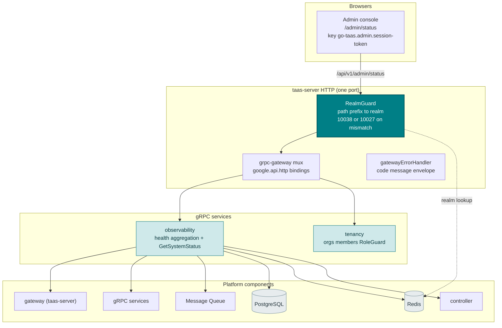
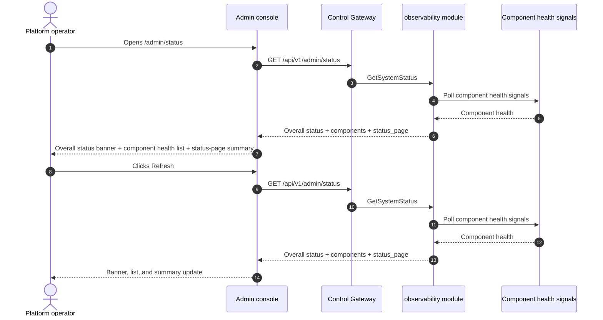
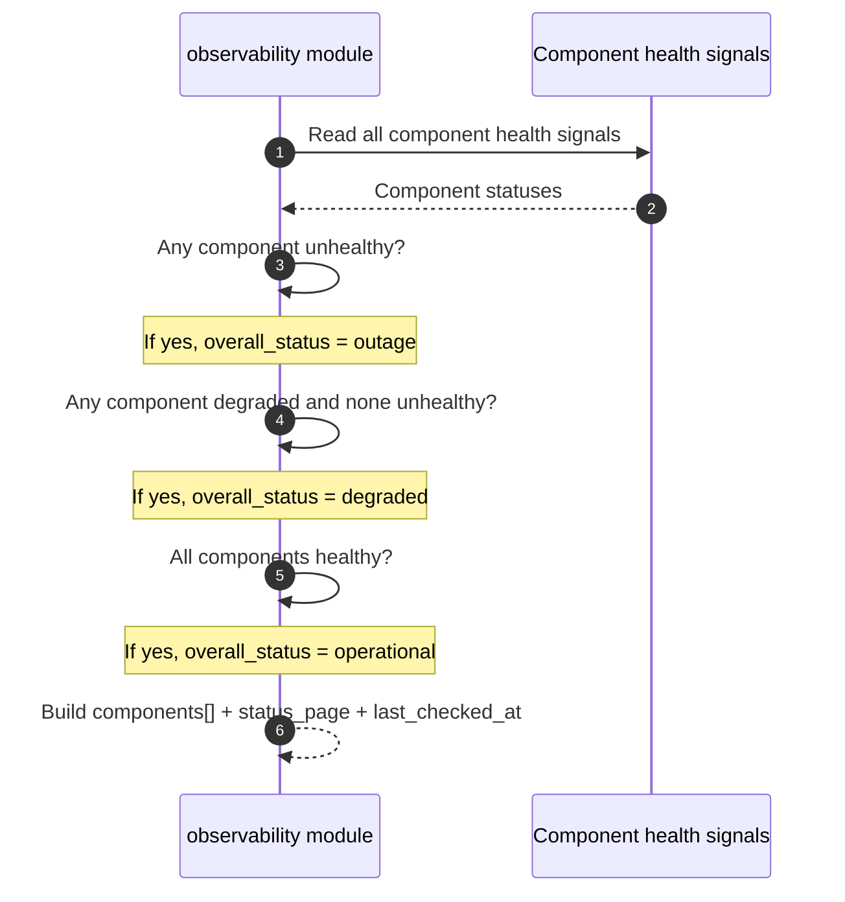

# System Health & Service Status — Architecture and Detailed Design

| Attribute | Content |
| --- | --- |
| Feature point | System health & service status — platform component health (gateway, gRPC services, MQ, PostgreSQL, Redis, controller), uptime, dependency status, and a status page (backlog row 30) |
| Document scope | Architecture and detailed design for feature-30: a new `GetSystemStatus` RPC in the `observability` module aggregating the existing component health signals into a single admin-only endpoint; the admin System Status page (`/admin/status`); plus error handling, configuration, security, rollout, and function-level design per layer |
| Owning modules | `observability` (new read-only health aggregation over the existing component health signals, plus the `GetSystemStatus` RPC), `pkg/server` gateway (admin-prefix bindings), `controller` (read-only: controller health), `web` admin console (`SystemStatusPage`) |
| Related documents | [Requirement Analysis and UI/UX Design](../design/system-health-status.md) · [Architecture Design](../design/architecture.md) §2.5 (`metering`), §3.1 (admin/user surface separation) · [Model Observability Dashboard](./model-observability.md) (the sibling read-only aggregation and its freshness conventions) · [Accelerator Inventory & Health](./accelerator-inventory.md) (the sibling health surface for GPU nodes) · [Console Surface Separation](./console-surface-separation.md) (the two surfaces this feature spans, the `AdminShell` conventions, the masked-projection rule) |
| Status | Architecture complete, handed to the Developer agent |

---

## 1. Overview and Goals

go-taas runs a set of platform components — the control gateway (`taas-server`), the gRPC services (auth, tenancy, model, metering, billing, infer, observability, notification, webhook, etc.), the message queue (MQ), PostgreSQL, Redis, and the controller. Each component already exposes a health signal (a readiness/liveness check), and the accelerator inventory feature (feature #18) surfaces GPU-node health. What the console still cannot answer is the operator's first question: *is the platform healthy right now?* There is no single surface that aggregates the health of every component, shows uptime, and reports dependency status. The operator must check each service's logs or health endpoint individually.

This feature adds a **system health & service status** page: platform component health (gateway, gRPC services, MQ, PostgreSQL, Redis, controller), uptime, dependency status, and a status page. It is a **read-only** aggregation layer — nothing in the inference, metering, or billing pipelines changes. It is the smallest independently valuable increment of Phase 4's productionization roadmap item: it turns "is the platform up?" into "the gateway is healthy, PostgreSQL is healthy, Redis is degraded, and the controller has been up for 14 days".

**Goals**: a `GetSystemStatus` RPC in the `observability` module returning the overall status, a per-component health list, uptime, dependency status, and a status-page summary in a single call; an admin System Status page (`/admin/status`); new error code 11401 `CodeStatusComponentNotFound`; the page → route → API-prefix table with the exact admin prefix; per-page interactive states including empty, error, and permission-denied; and numbered acceptance criteria testable in Nightwatch against the compose stack.

**Non-goals** (deferred, design §8): real-time streaming health (the poll cadence stands); incident management or incident timelines (statuspage.io's incident workflow is out of scope); alerting or threshold notifications (feature #26 consumes observability events in-console — out of scope here); a public/end-user status page (D1 — tenants do not see platform internals); exposing pod names, replica counts, or other operator-orchestration internals (D1); any change to the inference, metering, or billing pipelines (read-only feature); new audit events (D8).

### 1.1 Reading order of this document

Section 2 records the architecture decisions (AD1–AD8, mirroring the design's D1–D8). Sections 3–5 are the component view, data model, and API design. Section 6 is the frontend architecture (page → route → API-prefix table, auth guard). Sections 7–8 are the sequence flows and error handling. Sections 9–11 are configuration, security, and rollout. Sections 12–14 are the acceptance-criteria traceability, the function-level detailed design, and the ordered implementation task list.

---

## 2. Architecture Decisions

| # | Decision | Rationale |
| --- | --- | --- |
| AD1 | **System status exists on the admin surface only.** The admin surface (`/admin/status`, `/api/v1/admin/status/*`) is the platform operator's health surface — component health, uptime, dependency status, and a status page. There is **no end-user surface**: tenants do not see platform component health (it is operator-orchestration internals, feature #17's masked-projection rule) | The operator needs a single health surface to answer "is the platform up?"; tenants need their own usage and cost, not platform internals. This is a deliberate admin-only feature, consistent with the accelerator inventory (feature #18) being admin-only (design D1) |
| AD2 | **Component health is aggregated from the existing health signals** — each component's readiness/liveness check — into a single read-only endpoint. The components are the gateway (`taas-server`), the gRPC services (auth, tenancy, model, metering, billing, infer, observability, notification, webhook), MQ, PostgreSQL, Redis, and the controller. Each component reports `status` (`healthy` / `degraded` / `unhealthy`), `uptime_seconds`, `last_checked_at`, and `dependencies[]` | The components already expose health signals; aggregating them server-side into one endpoint keeps the payload small and the client dependency-light, and avoids the N+1 slow console (design D2) |
| AD3 | **One new RPC `GetSystemStatus`** in the `observability` module rather than extending an existing RPC — it returns the component health list, uptime, dependency status, and a status-page summary in a single call | The status page needs several shapes at once (component list, uptime, dependencies, status-page summary); a dedicated RPC keeps the health concern out of the observability aggregation surface and gives it one home (design D3) |
| AD4 | **The status page is a summary of the component health** — an overall status (`operational` / `degraded` / `outage`), a per-component status list, and a last-checked timestamp. It is a read-only view of the same data `GetSystemStatus` returns; there is no separate status-page data store | statuspage.io's component status is the canonical pattern; deriving the status page from the same health data avoids a second source of truth (design D4) |
| AD5 | **Freshness is explicit**: every response carries `last_checked_at` (the most recent health poll) and the console shows a "last checked <time>" note plus a stale marker when the poll is older than a threshold (default 60 seconds) | Health signals are polled, not streamed; the last-checked timestamp keeps the freshness story honest with zero new pipeline work (design D5) |
| AD6 | **The status page renders with inline SVG** — a status badge per component and a simple uptime bar — no new charting dependency | The console is deliberately dependency-light; a small, testable SVG component matches the usage-dashboard AD8 decision (design D6) |
| AD7 | **New error codes in a status block (11401–11499)**: **11401 `CodeStatusComponentNotFound`** (an unknown component id). No range validation is needed (the status page is a point-in-time snapshot, not a time series) | System status is a new concern (AD3), so its codes live in a fresh block after the cost block (113xx); distinct not-found keeps "unknown component" actionable (design D7) |
| AD8 | **System status is read-only and audited only for access** — it writes no data and mutates nothing; the page is reachable only by authenticated admin sessions, and no status mutation is audited (there is nothing to mutate) | The feature is a pure aggregation over existing health signals; the audit trail (feature #15) already covers the underlying component writes. No new audit events are needed (design D8) |

---

## 3. Component View

### 3.1 Ownership

| Layer / component | Owns | Changes in this feature |
| --- | --- | --- |
| **Control Gateway (`grpc-gateway`)** | HTTP/JSON facade for the `GetSystemStatus` RPC; realm guard (feature #17) already rejects a wrong-realm session with 10038; passes `X-Organization-Id` through as gRPC metadata | New binding for the HTTP status RPC (Section 5); no change to the realm guard |
| **`observability` module (`services/observability`)** | The read-only health aggregation over the existing component health signals, the `GetSystemStatus` RPC, the overall-status derivation, the component health list, the uptime, the dependency status, the status-page summary | New RPC on the existing `ObservabilityService` (AD3) |
| **`controller`** | Controller health | Read-only: the observability module reads the controller's health signal (AD2) |
| **`tenancy` module** | Organizations, members, roles, RoleGuard | Read-only: `RoleGuard` gates the admin status RPC by the caller's role (10036) |
| **PostgreSQL / Redis / MQ** | The platform dependencies | Read-only: the observability module reads their health signals (AD2) |
| **Console** | Admin System Status page | One new page on the admin surface (Section 6) |

### 3.2 Runtime component view



### 3.3 Request identity chain

The status RPC reuses the established identity chain (console-surface-separation §3.3), with the admin-only surface (AD1):

1. `RealmGuard` (HTTP, `pkg/server/realm.go`) — path prefix decides the expected realm. `/api/v1/admin/status` expects `admin`. With no `Authorization` header: pass through (transitional, AD4 of feature #17). With a header: resolve the session realm from Redis; mismatch → 10038, unknown/expired/realm-less → 10027.
2. grpc-gateway mux — routes by the annotated path and forwards `authorization` and `x-organization-id`.
3. Service handler — the status RPC is admin-only (AD1); it resolves the caller's role via `tenancy.RoleGuard` (10036). There is no user binding and no org scoping — the status page is a platform-wide snapshot.
4. `tenancy.RoleGuard` — gates the admin status RPC by the caller's role (10036).

---

## 4. Data Model

### 4.1 No New Tables

The system status feature is a pure read-only aggregation over the existing component health signals (AD2, design D8). No new tables, no new MQ subjects, no new runners, and no writes on any path. The health signals are read in-process from the platform components (gateway, gRPC services, MQ, PostgreSQL, Redis, controller); there is no persisted status store.

### 4.2 Migration Notes

- No schema change, no data migration, and no init-SQL upgrade path. The feature is a pure read-only aggregation over existing health signals (AD2, design D8).

---

## 5. API Design

The status RPC belongs to the existing **`taas.observability.v1.ObservabilityService`** (`proto/taas/observability/v1/observability.proto`), served as HTTP via the Control Gateway. It is admin-only (AD1); there is **no user-prefix binding**.

| RPC | HTTP (admin) | HTTP (user) | Status | Purpose |
| --- | --- | --- | --- | --- |
| `GetSystemStatus` | `GET /api/v1/admin/status` | — | **new** | Overall status + component health list + uptime + dependencies + status-page summary |

### 5.1 Proto contract

```protobuf
syntax = "proto3";

package taas.observability.v1;

import "google/api/annotations.proto";
import "taas/common/v1/common.proto";

// (Additive to the existing ObservabilityService.)

// GetSystemStatus returns the platform component health: an overall
// status, a per-component health list, uptime, dependency status, and a
// status-page summary. It is admin-only (no user binding) and takes no
// range parameters (it is a point-in-time snapshot).
rpc GetSystemStatus(GetSystemStatusRequest) returns (GetSystemStatusResponse) {
  option (google.api.http) = {get: "/api/v1/admin/status"};
}

message GetSystemStatusRequest {}

message GetSystemStatusResponse {
  taas.common.v1.Response response = 1;
  // overall_status is operational / degraded / outage, derived
  // server-side (AD2).
  string overall_status = 2;
  repeated SystemComponent components = 3;
  SystemStatusPage status_page = 4;
  // last_checked_at is the most recent health poll (AD5).
  int64 last_checked_at = 5;
}

// SystemComponent is one platform component's health.
message SystemComponent {
  string component_id = 1;
  string component_name = 2;
  // component_type is gateway / grpc_service / mq / postgresql / redis /
  // controller.
  string component_type = 3;
  // status is healthy / degraded / unhealthy.
  string status = 4;
  int64 uptime_seconds = 5;
  int64 last_checked_at = 6;
  repeated SystemDependency dependencies = 7;
}

// SystemDependency is one dependency of a component.
message SystemDependency {
  string dependency_id = 1;
  string dependency_name = 2;
  // status is healthy / degraded / unhealthy.
  string status = 3;
}

// SystemStatusPage is the status-page summary (AD4).
message SystemStatusPage {
  string overall_status = 1;
  int64 last_checked_at = 2;
  int64 component_count = 3;
}
```

### 5.2 Contract notes (pinned for the Developer agent)

1. `GetSystemStatus` takes no range parameters (it is a point-in-time snapshot, AD7). It returns `overall_status`, `components[]`, `status_page`, and `last_checked_at`.
2. Each component carries `component_id`, `component_name`, `component_type`, `status`, `uptime_seconds`, `last_checked_at`, and `dependencies[]`. `overall_status` is derived server-side: `operational` if all components are `healthy`, `degraded` if any component is `degraded` and none is `unhealthy`, `outage` if any component is `unhealthy` (AD2).
3. The `status_page` carries `overall_status`, `last_checked_at`, and `component_count` (AD4).
4. Every response carries `last_checked_at` for the freshness marker (AD5).
5. Aggregation reads the existing component health signals (readiness/liveness checks); it writes nothing (AD8).
6. Wire conventions unchanged: HTTP 200 on success, business errors as `{"code": <int>, "message": "..."}`, int64 fields serialized as JSON strings.

### 5.3 Error codes

Error codes (status block 11401–11499, `pkg/errors/codes.go`):

| Condition | Code | Constant | Notes |
| --- | --- | --- | --- |
| An unknown component id | 11401 | `CodeStatusComponentNotFound` | **New** (AD7) |
| Database / infrastructure failure | 500 | `CodeInternal` | Via error normalization |

---

## 6. Frontend Architecture

### 6.1 Page → Route → API-prefix table

| Page / component | Surface | Web route | API prefix | Auth guard |
| --- | --- | --- | --- | --- |
| **System Status page** | admin | `/admin/status` | `/api/v1/admin/status` | admin session; RoleGuard (admin role) |

> The admin System Status page calls only `/api/v1/admin/status`; there is no end-user surface (AD1). The page contains no `/api/v1/*` string (feature #17).

### 6.2 Navigation placement

- **Admin console**: a new **Status** item (`/admin/status`, testid `nav-status`) in the admin nav, in the operations group alongside Inference Services, Observability, and Accelerators.

### 6.3 Shared components and state to reuse

- **API client** (`web/src/api.ts`): the realm-scoped client (`createApi(realm)`) already sends `Authorization: Bearer <realm>.session-token` and `X-Organization-Id` (only when the realm token key is empty). The status page reuses it unchanged; no new client is added.
- **Status badge**: a new shared `StatusBadge.tsx` component rendering the healthy / degraded / unhealthy badge, following the accelerator-inventory health-badge pattern (AD6).
- **Uptime bar**: a new shared `UptimeBar.tsx` component rendering a simple inline-SVG uptime bar (AD6).
- **Status / freshness badge**: the stale marker past the `last_checked_at` threshold reuses the usage-dashboard pending-badge styling (AD5).
- **Empty state / data-freshness note**: the Request Logs page pattern (a note that health signals appear after the platform starts) is reused.

### 6.4 Auth guard per surface

- **Admin System Status page** (`/admin/status`): rendered inside `AdminShell`, which runs the admin session guard when `go-taas.admin.session-token` is non-empty; a missing/expired session redirects to `/admin/login?reason=expired`; a wrong-realm session is rejected by the gateway with 10038. The page's API call goes to `/api/v1/admin/status`. A session without the required role receives 10036 and the page shows the standard permission-denied state (feature #17).
- **Unauthenticated visitors**: an unauthenticated visitor to the page is redirected to `/admin/login` by the shell guard.

### 6.5 Console contract (pinned for the Developer agent)

**System Status page** (`/admin/status`): a page header ("System Status", subtitle "Platform component health") with a **Refresh** action (`status-refresh`). Below: an **overall status banner** (`status-overall`) showing the overall status (`Operational` / `Degraded` / `Outage`) with a color-coded badge and a "last checked <time>" freshness note (`status-last-checked`); a **component health list** (`status-components`, `status-component-{component_id}`) with columns Component (name), Type (gateway / gRPC service / MQ / PostgreSQL / Redis / controller), Status (badge), Uptime, Last checked, Dependencies (a compact list of dependency names with status badges); and a **status-page summary** card (`status-page-summary`) showing the overall status, last checked, and component count. Sortable by Component, Type, Status, and Uptime; not filterable (the list is the full platform); paginated if the component count exceeds the page size. Empty state: "No component health data." with a hint that health signals appear after the platform starts. Error state: an error banner with a Retry button and a "Showing stale data" banner. Permission-denied: the standard state with a link back to the admin home.

---

## 7. Sequence Flows

### 7.1 Admin system status load



### 7.2 Overall-status derivation



---

## 8. Error Handling

All errors are `pkg/errors` business codes in the unified envelope (Section 5.3). The status module is read-only, so there are no runner-side failures and no writes to fail. A database failure is normalized to 500 `CodeInternal`.

The console branches on the body `code` (as `web/src/api.ts` already does), never on the HTTP status. The new code 11401 "component not found" renders a specific inline message. The admin page maps 10036 to the standard permission-denied state (feature #17 §8.2).

---

## 9. Configuration Additions

| Key | Default | Description |
| --- | --- | --- |
| `observability.status.staleAfterSeconds` | `60` | The health poll is considered stale when `last_checked_at` is older than this threshold; the console shows a stale marker past it (AD5) |

The `observability.status` config block is new in `pkg/config` (`ObservabilityStatusConfig`), following the `observability` block pattern. `applyDefaults`/`Validate` set the default above. The observability module reads `staleAfterSeconds` in the status RPC. No other config keys, runners, or MQ subjects are added — the feature is read-only over existing health signals (AD2, design D8).

---

## 10. Security Considerations

- **Admin-only surface**: the System Status page lives on the admin surface only (AD1); there is no end-user surface. The realm guard rejects a wrong-realm session with 10038 before any handler runs (feature #17).
- **Admin role gated**: the status RPC is gated by `tenancy.RoleGuard` — only a caller with the required admin role can see the platform health; an inaccessible org returns 10036.
- **Masked projection**: the status page exposes component health, not pod names, replica counts, or other operator-orchestration internals (AD1). Tenants never see platform internals.
- **Read-only by construction**: the status module issues only reads of the existing health signals; no writes on any path (AD8). No new audit events are needed — the underlying component writes are already audited (feature #15).

---

## 11. Rollout / Upgrade Notes

- **No schema change**: the feature reads existing health signals only; deploy `taas-server` alone. No new tables, no new indexes, no data migration, no init-SQL upgrade path.
- **The proto change is additive**: one new RPC on the existing `ObservabilityService`; no existing RPC or message changes. The gateway mux gains the new binding; the realm guard is unchanged.
- **Console**: the new page is added to the existing bundle; the admin nav gains Status. No existing route changes.
- **Backward compatibility**: the transitional (session-less, `X-Organization-Id`) path is preserved for the CLI, FVT, and e2e suites; the realm guard passes through requests without an `Authorization` header (feature #17 AD4).
- **Empty until data exists**: the status RPC returns an empty component list until health signals exist; the page renders the empty state with a hint that health signals appear after the platform starts.

---

## 12. Acceptance-Criteria Traceability

| # | Criterion | Where addressed |
| --- | --- | --- |
| AC1 | `GetSystemStatus` returns an overall status, a component health list, and a status-page summary; `overall_status` is `operational` when all components are healthy, `degraded` when any is degraded and none unhealthy, and `outage` when any is unhealthy | §5.1, §5.2, §7.2 |
| AC2 | Each component carries `component_id`, `component_name`, `component_type`, `status`, `uptime_seconds`, `last_checked_at`, and `dependencies[]` | §5.1, §5.2 |
| AC3 | The `status_page` carries `overall_status`, `last_checked_at`, and `component_count` | §5.1, §5.2 |
| AC4 | The `/admin/status` page renders the overall status banner, the component health list, and the status-page summary from the first successful load, with a last-updated timestamp | §6.5 |
| AC5 | Clicking Refresh refetches and re-renders the banner, list, and summary; the "last checked <time>" freshness note updates | §6.5, §7.1 |
| AC6 | The empty state ("No component health data.") renders when no data matches; a failed load keeps the last good data with a "Showing stale data" banner and a Retry action | §6.5 |
| AC7 | The system status page is reachable only on the admin surface: route `/admin/status`, every API call uses the `/api/v1/admin/status/*` prefix with no `/api/v1/*` string | §6.1, §6.4, §10 |
| AC8 | A session without the required role receives 10036 on the admin status page and the page shows the standard permission-denied state | §3.3, §6.4, §10 |

---

## 13. Detailed Design (function-level responsibilities per layer)

### 13.1 Proto → service → repository → controller

| Layer | File | Responsibilities |
| --- | --- | --- |
| `proto/taas/observability/v1` | `observability.proto` | Additive: `GetSystemStatus` RPC + `GetSystemStatusRequest/Response`, `SystemComponent`, `SystemDependency`, `SystemStatusPage` messages (Section 5.1). Regenerate `observability.pb.go`/`observability_grpc.pb.go`/`observability.pb.gw.go` via `buf generate` |
| `services/observability` | `status_model.go` | The health row structs (`SystemComponentRow`, `SystemDependencyRow`) and the `overallStatusFor` helper (operational / degraded / outage, AD2) |
| | `status_repository.go` | `ReadComponentHealth(ctx)` — reads the existing component health signals (gateway, gRPC services, MQ, PostgreSQL, Redis, controller) in-process (AD2); `ReadDependencies(ctx, componentID)` — reads a component's dependency status |
| | `service.go` | New RPC `GetSystemStatus`; the overall-status derivation (AD2); the component health list, uptime, dependency status, and status-page summary assembly (AD4); the `last_checked_at` freshness marker (AD5); the `RoleGuard` seam for admin org scoping (10036) |
| `internal/controller` | `service.go` | Read-only: expose a `ControllerHealth(ctx)` seam for the observability module to read the controller's health signal (AD2) |
| `pkg/errors` | `codes.go`/`messages.go` | `CodeStatusComponentNotFound` (11401) constant + canonical message "status component not found" (AD7) |
| `pkg/config` | `api.go`/`configuration.go` | `ObservabilityStatusConfig` + `staleAfterSeconds` (Section 9) + `applyDefaults`/`Validate` |
| `apps/taas-server` | `main.go` | No change — the status RPC rides the existing observability service registration; wire the `tenancy` RoleGuard into the observability service |
| `web/src` | `pages/SystemStatusPage.tsx`, `components/StatusBadge.tsx`, `components/UptimeBar.tsx`, `App.tsx`, `api.ts`, `shells/AdminShell.tsx` | Route `/admin/status`; `GetSystemStatus` API types and calls; nav item (Section 6.5) |
| `test` | `fvt/system_status_fvt_test.go`, `e2e/tests/systemStatus.js` | Section 14 |

### 13.2 Which React page/module implements each screen

| Screen | React module | Route | API calls |
| --- | --- | --- | --- |
| System Status page (admin) | `web/src/pages/SystemStatusPage.tsx` | `/admin/status` | `GetSystemStatus` |
| Status badge | `web/src/components/StatusBadge.tsx` (shared) | (on the page) | (client-side; renders the returned status) |
| Uptime bar | `web/src/components/UptimeBar.tsx` (shared) | (on the page) | (client-side; renders the returned uptime) |

---

## 14. Testing Strategy

- **Unit** (`services/observability`, sqlite in-memory): `status_repository_test.go` — `ReadComponentHealth` returns the component health signals (AC2), `ReadDependencies` returns the dependency status (AC2). `service_test.go` — `overallStatusFor` returns `operational` when all healthy, `degraded` when any degraded and none unhealthy, and `outage` when any unhealthy (AC1); the response carries `last_checked_at` (AC5); admin org scoping returns 10036 (AC8). Coverage ≥ 80% on the new files.
- **FVT** (`test/fvt/system_status_fvt_test.go`, the observability FVT pattern: file-backed sqlite + `MigrateSchemaForFVT` + `NewForFVT` + gRPC server with the production interceptor + gateway mux with `FVTHeaderMatcher`): seed the component health signals, then assert `GetSystemStatus` returns the overall status, components, and status_page (AC1), each component carries the full field set (AC2), the status_page carries the summary (AC3), and the response carries `last_checked_at` (AC5).
- **E2E** (`test/e2e/tests/systemStatus.js`, the `accelerators.js` pattern): against the compose stack — the admin `/admin/status` page renders `status-overall`, `status-components`, and `status-page-summary` from the first successful load (AC4); clicking Refresh refetches and the "last checked <time>" note updates (AC5); the empty state and stale-data banner render (AC6); the page calls only `/api/v1/admin/status` and an unauthenticated visitor is redirected to `/admin/login` (AC7); a session without the required role receives 10036 and shows the permission-denied state (AC8).