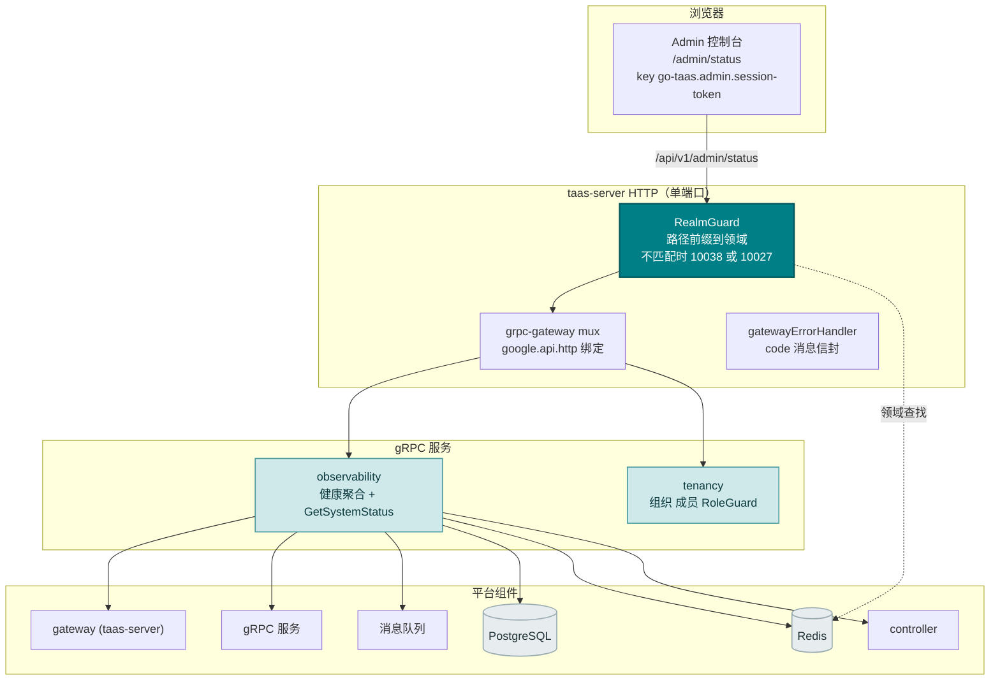
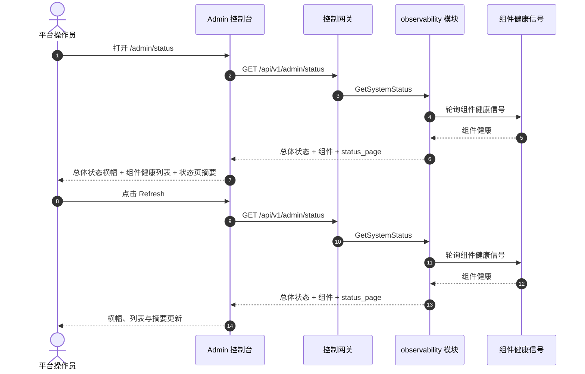
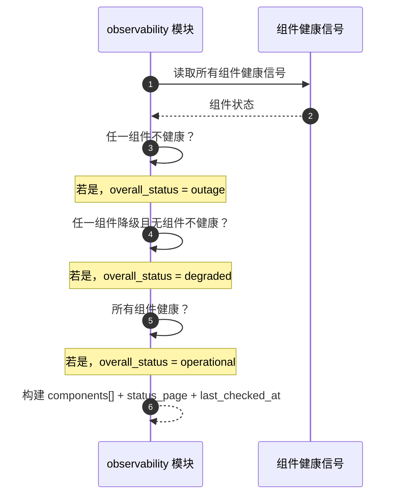

# 系统健康与服务状态 — 架构与详细设计

| 属性 | 内容 |
| --- | --- |
| 功能点 | 系统健康与服务状态 — 平台组件健康（网关、gRPC 服务、MQ、PostgreSQL、Redis、控制器）、运行时长、依赖状态与状态页（backlog 第 30 行） |
| 文档范围 | 功能 30 的架构与详细设计：`observability` 模块中新的 `GetSystemStatus` RPC，将现有组件健康信号聚合为单个仅 admin 的端点；admin 系统状态页面（`/admin/status`）；以及错误处理、配置、安全、上线与逐层函数级设计 |
| 拥有模块 | `observability`（对现有组件健康信号的新只读健康聚合，以及 `GetSystemStatus` RPC）、`pkg/server` 网关（admin 前缀绑定）、`controller`（只读：控制器健康）、`web` admin 控制台（`SystemStatusPage`） |
| 相关文档 | [需求分析与 UI/UX 设计](../design/system-health-status.md) · [架构设计](../design/architecture.md) §2.5（`metering`）、§3.1（admin/user 表面分离）· [模型可观测性仪表盘](./model-observability.md)（同类只读聚合及其新鲜度约定）· [加速器清单与健康](./accelerator-inventory.md)（GPU 节点的同类健康表面）· [控制台表面分离](./console-surface-separation.md)（本功能跨越的两个表面、`AdminShell` 约定、掩码投影规则） |
| 状态 | 架构完成，已移交给 Developer 智能体 |

---

## 1. 概述与目标

go-taas 运行一组平台组件 — 控制网关（`taas-server`）、gRPC 服务（auth、tenancy、model、metering、billing、infer、observability、notification、webhook 等）、消息队列（MQ）、PostgreSQL、Redis 与控制器。每个组件已暴露健康信号（就绪/存活检查），加速器清单功能（功能 #18）展示 GPU 节点健康。控制台仍无法回答的是操作员的第一个问题：*平台现在健康吗？* 没有单一表面聚合每个组件的健康、展示运行时长并报告依赖状态。操作员必须逐个检查每个服务的日志或健康端点。

本功能新增**系统健康与服务状态**页面：平台组件健康（网关、gRPC 服务、MQ、PostgreSQL、Redis、控制器）、运行时长、依赖状态与状态页。它是**只读**聚合层 — 推理、计量或计费管线均无变化。它是 Phase 4 生产化路线图条目中最小且有独立价值的增量：它将"平台起来了吗？"变成"网关健康、PostgreSQL 健康、Redis 降级、控制器已运行 14 天"。

**目标**：`observability` 模块中的 `GetSystemStatus` RPC，单次调用返回总体状态、逐组件健康列表、运行时长、依赖状态与状态页摘要；admin 系统状态页面（`/admin/status`）；新错误码 11401 `CodeStatusComponentNotFound`；页面 → 路由 → API 前缀表，含精确 admin 前缀；各页面交互状态，包括空、错误与权限拒绝；以及可在 compose 栈上以 Nightwatch 测试的编号验收标准。

**非目标**（延后，设计 §8）：实时流式健康（轮询节奏不变）；事件管理或事件时间线（statuspage.io 的事件工作流不在范围内）；告警或阈值通知（功能 #26 在控制台内消费可观测性事件 — 此处不在范围内）；公共/end-user 状态页（D1 — 租户看不到平台内部信息）；暴露 pod 名称、副本数或其他操作员编排内部信息（D1）；对推理、计量或计费管线的任何更改（只读功能）；新审计事件（D8）。

### 1.1 本文档的阅读顺序

第 2 节记录架构决策（AD1–AD8，对应设计的 D1–D8）。第 3–5 节是组件视图、数据模型与 API 设计。第 6 节是前端架构（页面 → 路由 → API 前缀表、认证守卫）。第 7–8 节是时序流与错误处理。第 9–11 节是配置、安全与上线。第 12–14 节是验收标准追溯、函数级详细设计与有序实现任务清单。

---

## 2. 架构决策

| # | 决策 | 理由 |
| --- | --- | --- |
| AD1 | **系统状态仅存在于 admin 表面。** admin 表面（`/admin/status`、`/api/v1/admin/status/*`）是平台操作员的健康表面 — 组件健康、运行时长、依赖状态与状态页。**无 end-user 表面**：租户看不到平台组件健康（它是操作员编排内部信息，功能 #17 的掩码投影规则） | 操作员需要单一健康表面来回答"平台起来了吗？"；租户需要自己的用量与成本，而非平台内部信息。这是刻意的仅 admin 功能，与加速器清单（功能 #18）仅 admin 一致（设计 D1） |
| AD2 | **组件健康从现有健康信号聚合** — 每个组件的就绪/存活检查 — 到单个只读端点。组件为网关（`taas-server`）、gRPC 服务（auth、tenancy、model、metering、billing、infer、observability、notification、webhook）、MQ、PostgreSQL、Redis 与控制器。每个组件报告 `status`（`healthy` / `degraded` / `unhealthy`）、`uptime_seconds`、`last_checked_at` 与 `dependencies[]` | 组件已暴露健康信号；在服务端聚合到一个端点保持负载小、客户端依赖轻，并避免 N+1 慢控制台（设计 D2） |
| AD3 | **`observability` 模块中一个 RPC `GetSystemStatus`**，而非扩展现有 RPC — 它单次调用返回组件健康列表、运行时长、依赖状态与状态页摘要 | 状态页需要同时多个形状（组件列表、运行时长、依赖、状态页摘要）；专用 RPC 将健康关注点从可观测性聚合表面分离，并给它一个归属（设计 D3） |
| AD4 | **状态页是组件健康的摘要** — 总体状态（`operational` / `degraded` / `outage`）、逐组件状态列表与最后检查时间戳。它是 `GetSystemStatus` 返回的同一数据的只读视图；无独立状态页数据存储 | statuspage.io 的组件状态是规范模式；从同一健康数据派生状态页避免第二个真相来源（设计 D4） |
| AD5 | **新鲜度是显式的**：每个响应携带 `last_checked_at`（最近一次健康轮询），控制台在轮询早于阈值（默认 60 秒）时显示"last checked <time>"说明加陈旧标记 | 健康信号是轮询而非流式的；最后检查时间戳以零新管线工作保持新鲜度故事诚实（设计 D5） |
| AD6 | **状态页以内联 SVG 渲染** — 每个组件一个状态徽章与简单运行时长条 — 无新图表依赖 | 控制台刻意依赖轻；小型可测试 SVG 组件匹配 usage-dashboard AD8 决策（设计 D6） |
| AD7 | **status 块（11401–11499）中的新错误码**：**11401 `CodeStatusComponentNotFound`**（未知组件 ID）。无需范围验证（状态页是时间点快照，而非时间序列） | 系统状态是新关注点（AD3），因此其码位于 cost 块（113xx）之后的新块；不同的未找到使"未知组件"可操作（设计 D7） |
| AD8 | **系统状态只读且仅对访问审计** — 它不写入数据、不改变任何内容；页面仅可由已认证 admin 会话访问，且无状态变更被审计（无内容可变更） | 该功能是对现有健康信号的纯聚合；审计轨迹（功能 #15）已覆盖底层组件写入。无需新审计事件（设计 D8） |

---

## 3. 组件视图

### 3.1 归属

| 层 / 组件 | 拥有 | 本功能的变更 |
| --- | --- | --- |
| **控制网关（`grpc-gateway`）** | `GetSystemStatus` RPC 的 HTTP/JSON 门面；领域守卫（功能 #17）已以 10038 拒绝错误领域会话；将 `X-Organization-Id` 作为 gRPC 元数据传递 | HTTP 状态 RPC 的新绑定（第 5 节）；领域守卫无变更 |
| **`observability` 模块（`services/observability`）** | 对现有组件健康信号的只读健康聚合、`GetSystemStatus` RPC、总体状态派生、组件健康列表、运行时长、依赖状态、状态页摘要 | 现有 `ObservabilityService` 上的新 RPC（AD3） |
| **`controller`** | 控制器健康 | 只读：observability 模块读取控制器的健康信号（AD2） |
| **`tenancy` 模块** | 组织、成员、角色、RoleGuard | 只读：`RoleGuard` 按调用者角色门控 admin 状态 RPC（10036） |
| **PostgreSQL / Redis / MQ** | 平台依赖 | 只读：observability 模块读取其健康信号（AD2） |
| **控制台** | admin 系统状态页面 | admin 表面上的一个新页面（第 6 节） |

### 3.2 运行时组件视图



### 3.3 请求身份链

状态 RPC 复用已建立的身份链（console-surface-separation §3.3），仅 admin 表面（AD1）：

1. `RealmGuard`（HTTP，`pkg/server/realm.go`）— 路径前缀决定期望领域。`/api/v1/admin/status` 期望 `admin`。无 `Authorization` 头：放行（过渡，功能 #17 的 AD4）。有头：从 Redis 解析会话领域；不匹配 → 10038，未知/过期/无领域 → 10027。
2. grpc-gateway mux — 按注解路径路由并转发 `authorization` 与 `x-organization-id`。
3. 服务处理器 — 状态 RPC 仅 admin（AD1）；它通过 `tenancy.RoleGuard` 解析调用者角色（10036）。无 user 绑定、无组织限定 — 状态页是平台级快照。
4. `tenancy.RoleGuard` — 按调用者角色门控 admin 状态 RPC（10036）。

---

## 4. 数据模型

### 4.1 无新表

系统状态功能是对现有组件健康信号的纯只读聚合（AD2，设计 D8）。无新表、无新 MQ 主题、无新运行器、任何路径上无写入。健康信号从平台组件（网关、gRPC 服务、MQ、PostgreSQL、Redis、控制器）进程内读取；无持久化状态存储。

### 4.2 迁移说明

- 无模式变更、无数据迁移、无 init-SQL 升级路径。该功能是对现有健康信号的纯只读聚合（AD2，设计 D8）。

---

## 5. API 设计

状态 RPC 属于现有 **`taas.observability.v1.ObservabilityService`**（`proto/taas/observability/v1/observability.proto`），通过控制网关以 HTTP 服务。它仅 admin（AD1）；**无 user 前缀绑定**。

| RPC | HTTP（admin） | HTTP（user） | 状态 | 用途 |
| --- | --- | --- | --- | --- |
| `GetSystemStatus` | `GET /api/v1/admin/status` | — | **新** | 总体状态 + 组件健康列表 + 运行时长 + 依赖 + 状态页摘要 |

### 5.1 Proto 契约

```protobuf
syntax = "proto3";

package taas.observability.v1;

import "google/api/annotations.proto";
import "taas/common/v1/common.proto";

// （对现有 ObservabilityService 的增量。）

// GetSystemStatus 返回平台组件健康：总体状态、逐组件健康列表、运行时长、
// 依赖状态与状态页摘要。它仅 admin（无 user 绑定），且不带范围参数
// （它是时间点快照）。
rpc GetSystemStatus(GetSystemStatusRequest) returns (GetSystemStatusResponse) {
  option (google.api.http) = {get: "/api/v1/admin/status"};
}

message GetSystemStatusRequest {}

message GetSystemStatusResponse {
  taas.common.v1.Response response = 1;
  // overall_status 是 operational / degraded / outage，服务端派生（AD2）。
  string overall_status = 2;
  repeated SystemComponent components = 3;
  SystemStatusPage status_page = 4;
  // last_checked_at 是最近一次健康轮询（AD5）。
  int64 last_checked_at = 5;
}

// SystemComponent 是一个平台组件的健康。
message SystemComponent {
  string component_id = 1;
  string component_name = 2;
  // component_type 是 gateway / grpc_service / mq / postgresql / redis /
  // controller。
  string component_type = 3;
  // status 是 healthy / degraded / unhealthy。
  string status = 4;
  int64 uptime_seconds = 5;
  int64 last_checked_at = 6;
  repeated SystemDependency dependencies = 7;
}

// SystemDependency 是一个组件的依赖。
message SystemDependency {
  string dependency_id = 1;
  string dependency_name = 2;
  // status 是 healthy / degraded / unhealthy。
  string status = 3;
}

// SystemStatusPage 是状态页摘要（AD4）。
message SystemStatusPage {
  string overall_status = 1;
  int64 last_checked_at = 2;
  int64 component_count = 3;
}
```

### 5.2 契约说明（为 Developer 智能体固定）

1. `GetSystemStatus` 不带范围参数（它是时间点快照，AD7）。它返回 `overall_status`、`components[]`、`status_page` 与 `last_checked_at`。
2. 每个组件携带 `component_id`、`component_name`、`component_type`、`status`、`uptime_seconds`、`last_checked_at` 与 `dependencies[]`。`overall_status` 服务端派生：所有组件 `healthy` 时为 `operational`，任一组件 `degraded` 且无 `unhealthy` 时为 `degraded`，任一组件 `unhealthy` 时为 `outage`（AD2）。
3. `status_page` 携带 `overall_status`、`last_checked_at` 与 `component_count`（AD4）。
4. 每个响应携带 `last_checked_at` 用于新鲜度标记（AD5）。
5. 聚合读取现有组件健康信号（就绪/存活检查）；它不写入任何内容（AD8）。
6. 线上约定不变：成功 HTTP 200，业务错误为 `{"code": <int>, "message": "..."}`，int64 字段序列化为 JSON 字符串。

### 5.3 错误码

错误码（status 块 11401–11499，`pkg/errors/codes.go`）：

| 条件 | 码 | 常量 | 说明 |
| --- | --- | --- | --- |
| 未知组件 ID | 11401 | `CodeStatusComponentNotFound` | **新**（AD7） |
| 数据库 / 基础设施失败 | 500 | `CodeInternal` | 经错误归一化 |

---

## 6. 前端架构

### 6.1 页面 → 路由 → API 前缀表

| 页面 / 组件 | 表面 | Web 路由 | API 前缀 | 认证守卫 |
| --- | --- | --- | --- | --- |
| **系统状态页面** | admin | `/admin/status` | `/api/v1/admin/status` | admin 会话；RoleGuard（admin 角色） |

> admin 系统状态页面仅调用 `/api/v1/admin/status`；无 end-user 表面（AD1）。页面不含 `/api/v1/*` 字符串（功能 #17）。

### 6.2 导航位置

- **Admin 控制台**：admin 导航中新增 **Status** 项（`/admin/status`，testid `nav-status`），位于操作组，与 Inference Services、Observability 和 Accelerators 并列。

### 6.3 复用共享组件与状态

- **API 客户端**（`web/src/api.ts`）：领域范围客户端（`createApi(realm)`）已发送 `Authorization: Bearer <realm>.session-token` 与 `X-Organization-Id`（仅当领域 token 键为空时）。状态页面原样复用；不新增客户端。
- **状态徽章**：新的共享 `StatusBadge.tsx` 组件渲染 healthy / degraded / unhealthy 徽章，遵循 accelerator-inventory 健康徽章模式（AD6）。
- **运行时长条**：新的共享 `UptimeBar.tsx` 组件渲染简单内联 SVG 运行时长条（AD6）。
- **状态 / 新鲜度徽章**：`last_checked_at` 阈值之后的陈旧标记复用 usage-dashboard 待处理徽章样式（AD5）。
- **空状态 / 数据新鲜度说明**：复用 Request Logs 页面模式（说明健康信号在平台启动后出现）。

### 6.4 各表面认证守卫

- **Admin 系统状态页面**（`/admin/status`）：在 `AdminShell` 内渲染，当 `go-taas.admin.session-token` 非空时运行 admin 会话守卫；缺失/过期会话重定向到 `/admin/login?reason=expired`；错误领域会话被网关以 10038 拒绝。页面 API 调用发往 `/api/v1/admin/status`。无所需角色的会话收到 10036，页面显示标准权限拒绝状态（功能 #17）。
- **未认证访客**：页面的未认证访客由 shell 守卫重定向到 `/admin/login`。

### 6.5 控制台契约（为 Developer 智能体固定）

**系统状态页面**（`/admin/status`）：页面头部（"System Status"，副标题 "Platform component health"）带 **Refresh** 动作（`status-refresh`）。下方：**总体状态横幅**（`status-overall`）展示总体状态（`Operational` / `Degraded` / `Outage`），带彩色徽章与 "last checked <time>" 新鲜度说明（`status-last-checked`）；**组件健康列表**（`status-components`，`status-component-{component_id}`）列：Component（名称）、Type（gateway / gRPC service / MQ / PostgreSQL / Redis / controller）、Status（徽章）、Uptime、Last checked、Dependencies（带状态徽章的依赖名称紧凑列表）；以及**状态页摘要**卡片（`status-page-summary`）展示总体状态、最后检查与组件计数。可按 Component、Type、Status 与 Uptime 排序；不可过滤（列表是完整平台）；组件计数超过页面大小时分页。空状态："No component health data."，提示健康信号在平台启动后出现。错误状态：错误横幅带 Retry 按钮与 "Showing stale data" 横幅。权限拒绝：标准状态，带返回 admin 首页的链接。

---

## 7. 时序流

### 7.1 Admin 系统状态加载



### 7.2 总体状态派生



---

## 8. 错误处理

所有错误都是统一信封中的 `pkg/errors` 业务码（第 5.3 节）。状态模块只读，因此无运行器侧失败、无写入可失败。数据库失败归一化为 500 `CodeInternal`。

控制台按 body `code` 分支（`web/src/api.ts` 已如此），绝不按 HTTP 状态。新码 11401 "component not found" 渲染特定内联消息。admin 页面将 10036 映射到标准权限拒绝状态（功能 #17 §8.2）。

---

## 9. 配置新增

| 键 | 默认 | 描述 |
| --- | --- | --- |
| `observability.status.staleAfterSeconds` | `60` | 当 `last_checked_at` 早于此阈值时，健康轮询被视为陈旧；控制台在其后显示陈旧标记（AD5） |

`observability.status` 配置块在 `pkg/config`（`ObservabilityStatusConfig`）中新增，遵循 `observability` 块模式。`applyDefaults`/`Validate` 设置上述默认值。observability 模块在状态 RPC 中读取 `staleAfterSeconds`。不新增其他配置键、运行器或 MQ 主题 — 该功能对现有健康信号只读（AD2，设计 D8）。

---

## 10. 安全考量

- **仅 admin 表面**：系统状态页面仅存在于 admin 表面（AD1）；无 end-user 表面。领域守卫在任何处理器运行前以 10038 拒绝错误领域会话（功能 #17）。
- **admin 角色门控**：状态 RPC 由 `tenancy.RoleGuard` 门控 — 只有具备所需 admin 角色的调用者能看平台健康；不可访问组织返回 10036。
- **掩码投影**：状态页暴露组件健康，而非 pod 名称、副本数或其他操作员编排内部信息（AD1）。租户绝不可能看到平台内部信息。
- **构造上只读**：状态模块仅读取现有健康信号；任何路径上无写入（AD8）。无需新审计事件 — 底层组件写入已被审计（功能 #15）。

---

## 11. 上线 / 升级说明

- **无模式变更**：该功能仅读取现有健康信号；单独部署 `taas-server`。无新表、无新索引、无数据迁移、无 init-SQL 升级路径。
- **proto 变更是增量的**：现有 `ObservabilityService` 上一个新 RPC；无现有 RPC 或消息变更。网关 mux 增加新绑定；领域守卫不变。
- **控制台**：新页面加入现有 bundle；admin 导航增加 Status。无现有路由变更。
- **向后兼容**：过渡（无会话、`X-Organization-Id`）路径为 CLI、FVT 与 e2e 套件保留；领域守卫放行无 `Authorization` 头的请求（功能 #17 AD4）。
- **数据存在前为空**：状态 RPC 在健康信号存在前返回空组件列表；页面渲染空状态，提示健康信号在平台启动后出现。

---

## 12. 验收标准追溯

| # | 标准 | 覆盖位置 |
| --- | --- | --- |
| AC1 | `GetSystemStatus` 返回总体状态、组件健康列表与状态页摘要；所有组件健康时 `overall_status` 为 `operational`，任一降级且无组件不健康时为 `degraded`，任一不健康时为 `outage` | §5.1、§5.2、§7.2 |
| AC2 | 每个组件携带 `component_id`、`component_name`、`component_type`、`status`、`uptime_seconds`、`last_checked_at` 与 `dependencies[]` | §5.1、§5.2 |
| AC3 | `status_page` 携带 `overall_status`、`last_checked_at` 与 `component_count` | §5.1、§5.2 |
| AC4 | `/admin/status` 页面从首次成功加载渲染总体状态横幅、组件健康列表与状态页摘要，带最后更新时间戳 | §6.5 |
| AC5 | 点击 Refresh 会重新获取并重新渲染横幅、列表与摘要；"last checked <time>" 新鲜度说明更新 | §6.5、§7.1 |
| AC6 | 无数据匹配时渲染空状态（"No component health data."）；失败加载保留最后好数据，带 "Showing stale data" 横幅与 Retry 动作 | §6.5 |
| AC7 | 系统状态页面仅在 admin 表面可达：路由 `/admin/status`，每个 API 调用使用 `/api/v1/admin/status/*` 前缀且无 `/api/v1/*` 字符串 | §6.1、§6.4、§10 |
| AC8 | 无所需角色的会话在 admin 状态页面收到 10036，页面显示标准权限拒绝状态 | §3.3、§6.4、§10 |

---

## 13. 详细设计（逐层函数级职责）

### 13.1 Proto → 服务 → 仓库 → 控制器

| 层 | 文件 | 职责 |
| --- | --- | --- |
| `proto/taas/observability/v1` | `observability.proto` | 增量：`GetSystemStatus` RPC + `GetSystemStatusRequest/Response`、`SystemComponent`、`SystemDependency`、`SystemStatusPage` 消息（第 5.1 节）。经 `buf generate` 重新生成 `observability.pb.go`/`observability_grpc.pb.go`/`observability.pb.gw.go` |
| `services/observability` | `status_model.go` | 健康行结构体（`SystemComponentRow`、`SystemDependencyRow`）与 `overallStatusFor` 辅助函数（operational / degraded / outage，AD2） |
| | `status_repository.go` | `ReadComponentHealth(ctx)` — 进程内读取现有组件健康信号（网关、gRPC 服务、MQ、PostgreSQL、Redis、控制器）（AD2）；`ReadDependencies(ctx, componentID)` — 读取组件的依赖状态 |
| | `service.go` | 新 RPC `GetSystemStatus`；总体状态派生（AD2）；组件健康列表、运行时长、依赖状态与状态页摘要组装（AD4）；`last_checked_at` 新鲜度标记（AD5）；admin 组织限定的 `RoleGuard` 接缝（10036） |
| `internal/controller` | `service.go` | 只读：为 observability 模块暴露 `ControllerHealth(ctx)` 接缝以读取控制器的健康信号（AD2） |
| `pkg/errors` | `codes.go`/`messages.go` | `CodeStatusComponentNotFound`（11401）常量 + 规范消息 "status component not found"（AD7） |
| `pkg/config` | `api.go`/`configuration.go` | `ObservabilityStatusConfig` + `staleAfterSeconds`（第 9 节）+ `applyDefaults`/`Validate` |
| `apps/taas-server` | `main.go` | 无变更 — 状态 RPC 搭乘现有 observability 服务注册；将 `tenancy` RoleGuard 接入 observability 服务 |
| `web/src` | `pages/SystemStatusPage.tsx`、`components/StatusBadge.tsx`、`components/UptimeBar.tsx`、`App.tsx`、`api.ts`、`shells/AdminShell.tsx` | 路由 `/admin/status`；`GetSystemStatus` API 类型与调用；导航项（第 6.5 节） |
| `test` | `fvt/system_status_fvt_test.go`、`e2e/tests/systemStatus.js` | 第 14 节 |

### 13.2 哪个 React 页面/模块实现每个屏幕

| 屏幕 | React 模块 | 路由 | API 调用 |
| --- | --- | --- | --- |
| 系统状态页面（admin） | `web/src/pages/SystemStatusPage.tsx` | `/admin/status` | `GetSystemStatus` |
| 状态徽章 | `web/src/components/StatusBadge.tsx`（共享） | （页面上） | （客户端；渲染返回的状态） |
| 运行时长条 | `web/src/components/UptimeBar.tsx`（共享） | （页面上） | （客户端；渲染返回的运行时长） |

---

## 14. 测试策略

- **单元**（`services/observability`，sqlite 内存）：`status_repository_test.go` — `ReadComponentHealth` 返回组件健康信号（AC2），`ReadDependencies` 返回依赖状态（AC2）。`service_test.go` — `overallStatusFor` 在所有健康时返回 `operational`、任一降级且无组件不健康时返回 `degraded`、任一不健康时返回 `outage`（AC1）；响应携带 `last_checked_at`（AC5）；admin 组织限定返回 10036（AC8）。新文件覆盖率 ≥ 80%。
- **FVT**（`test/fvt/system_status_fvt_test.go`，observability FVT 模式：文件支持 sqlite + `MigrateSchemaForFVT` + `NewForFVT` + 带生产拦截器的 gRPC 服务器 + 带 `FVTHeaderMatcher` 的网关 mux）：种子组件健康信号，然后断言 `GetSystemStatus` 返回总体状态、组件与 status_page（AC1）、每个组件携带完整字段集（AC2）、status_page 携带摘要（AC3）、响应携带 `last_checked_at`（AC5）。
- **E2E**（`test/e2e/tests/systemStatus.js`，`accelerators.js` 模式）：针对 compose 栈 — admin `/admin/status` 页面从首次成功加载渲染 `status-overall`、`status-components` 与 `status-page-summary`（AC4）；点击 Refresh 会重新获取且 "last checked <time>" 说明更新（AC5）；空状态与陈旧数据横幅渲染（AC6）；页面仅调用 `/api/v1/admin/status` 且未认证访客被重定向到 `/admin/login`（AC7）；无所需角色的会话收到 10036 并显示权限拒绝状态（AC8）。