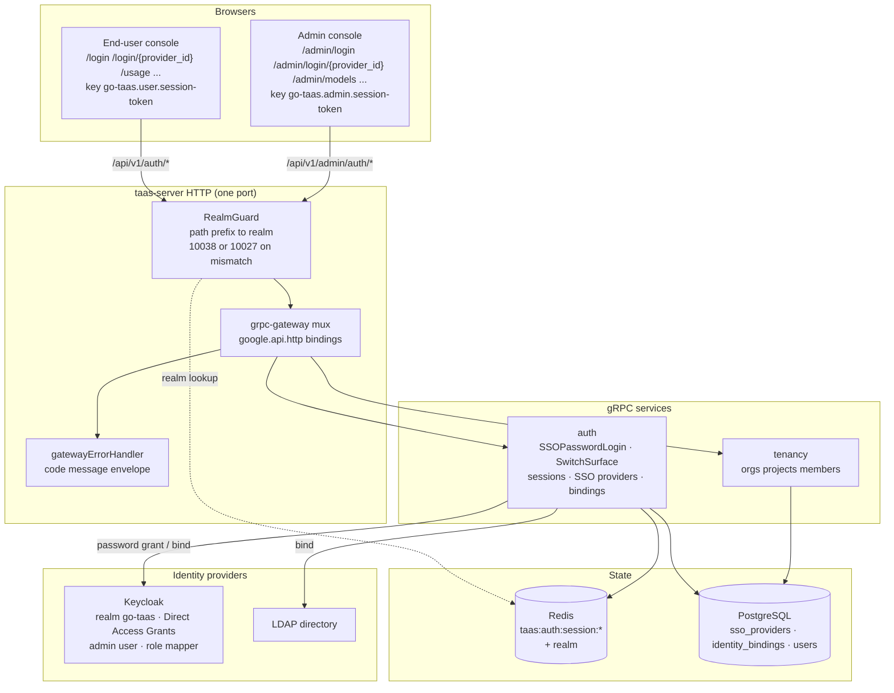

# Unified Login & Role-Based Routing — Architecture and Detailed Design

| Attribute | Content |
| --- | --- |
| Feature point | Unified login & role-based routing — a TaaS custom login page (username/password against the selected provider via OIDC password grant / LDAP bind), role-derived session realm and role-based landing, an admin switch button on user pages and a symmetric switch-to-user on admin pages, and a Keycloak provider + `admin`/`admin` user seeded on compose startup (backlog row 22) |
| Document scope | Architecture and detailed design for feature-22: the two new `AuthService` RPCs (`SSOPasswordLogin`, `SwitchSurface`) with their exact `google.api.http` bindings per surface, the role-derived session realm, the configurable admin-role set, the compose Keycloak realm-export.json + provider/binding seeding, the frontend custom login page and role-based landing and switch buttons for both consoles, the page → route → API-prefix mapping, error handling, configuration, security, rollout, and a function-level task list per layer |
| Owning modules | `services/auth` (password-grant login, role-derived realm, switch-surface session minting, provider/binding seeding), `pkg/server` (gateway realm guard — unchanged), `deploy/compose` (Keycloak realm-export.json seeding, provider seeding), `web/` (custom login pages, role-based landing, switch buttons), `pkg/config` (admin-role set), `pkg/errors` (reused codes) |
| Related documents | [Requirement Analysis and UI/UX Design](../design/unified-login-role-routing.md) · [Architecture Design](../design/architecture.md) §2.1 `auth` and §3.1 admin/user surface separation · [SSO Federation & Account Binding](./sso-federation.md) (the IdP framework, `SSOAuthorize`/`SSOCallback`, identity binding, attribute-to-role mapping, sessions) · [Console Surface Separation](./console-surface-separation.md) (the two surfaces, realm-pinned sessions, the realm guard, the login pages this feature replaces, the `10038 REALM_MISMATCH` rule) · [Organization Members, Roles & Invitations](./org-members-rbac.md) (the roles the session carries and this feature routes on) |
| Status | Architecture complete, handed to the Developer agent |

---

## 1. Overview and Goals

Features #7 and #17 shipped the platform's authentication spine: a pluggable IdP framework (`SSOAuthorize`/`SSOCallback`), sessions with a realm, and two console surfaces (`/...` user, `/admin/...` admin) with realm-pinned sessions. But the login experience still has three gaps that this feature closes:

1. **The login page is not TaaS-branded.** Today `/login` and `/admin/login` list SSO providers and redirect to the IdP-hosted login page (Keycloak). The console cannot style, validate, or localize that page, and the user leaves the product to authenticate.
2. **The landing surface is pinned by the entry point, not by the role.** The session realm is derived from the login route (feature #17 D3), so an administrator who signs in at `/login` lands on the user console and has no way to reach the admin console without signing in again at `/admin/login`.
3. **There is no surface switch after login.** An administrator who wants to use the user console (their own API keys, usage, playground) and then return to the admin console must sign in twice.

This feature adds: a **TaaS custom login page** (username/password against the selected provider, never the IdP-hosted page), **role-based routing** (after login the console lands on the user or admin surface by the user's role), an **admin switch button** on user pages and a symmetric switch-to-user on admin pages, and a **Keycloak provider + `admin`/`admin` user seeded on compose startup** so the whole flow is verifiable end to end.

**Goals**:

- A TaaS custom login page on both surfaces that authenticates a username/password against the selected provider (design D1): `SSOPasswordLogin` performs the OIDC resource-owner password grant (Keycloak Direct Access Grants) or the LDAP bind; SAML providers keep the redirect flow.
- A role-derived session realm and role-based landing (design D2, D3): the realm is derived from the authenticated role, never from a request field; after login the console routes `admin` → `/admin/models`, `user` → `/usage`.
- An admin switch button on user pages and a symmetric switch-to-user on admin pages (design D4): `SwitchSurface` mints a session for the target realm, validated against the role.
- Keycloak provider + `admin`/`admin` user seeded on compose startup (design D5): the realm-export.json gains the admin user, Direct Access Grants, and a role protocol mapper; a seed mechanism creates the provider row and the admin user's identity binding idempotently.
- The page → API surface table with exact prefixes; per-page interactive states; numbered acceptance criteria testable in Nightwatch against the compose stack, including negative ones.

**Non-goals** (from the design, restated): SAML password grant (SAML has no such flow; SAML providers keep the redirect flow); self-service registration or password reset; full RBAC enforcement across admin APIs; token rotation and Single Logout; requiring a session on the admin prefix (transitional access stays, feature #17 D6); a first-party local username/password account store (`Login`/`CreateUser` remain stubs — the custom login page authenticates against the selected IdP, not a local store); changing any data-plane (inference gateway) behaviour.

### 1.1 Reading order

Section 2 records the architecture decisions (including the points where the architecture refines the UI/UX design, each with its rationale). Sections 3–5 are the component view, the request identity chain, and the API contract. Sections 6–8 are the frontend architecture, the key sequences, and error handling. Sections 9–11 are configuration, security, and rollout. Sections 12–14 are the acceptance-criteria traceability, the function-level detailed design, and the ordered implementation task list.

---

## 2. Architecture Decisions

AD1–AD7 restate the UI/UX design's decisions as implementation-level rules. **AD8–AD10 are refinements** the architecture adds, each marked as such with the design decision it refines; they preserve the design's intent and are recorded here so the Developer and Test agents implement one reading.

| # | Decision | Rationale |
| --- | --- | --- |
| AD1 | **`SSOPasswordLogin` is a new RPC on `taas.auth.v1.AuthService`, dual-bound to both surfaces.** The user binding is `POST /api/v1/auth/sso/{provider_id}/login`; the admin binding is `POST /api/v1/admin/auth/sso/{provider_id}/login` via `additional_bindings`. Both share one handler; the realm is **role-derived**, not binding-derived (AD2), so the two bindings behave identically | Design D1/FR1.1. The login flow is the same on both surfaces; only the HTTP prefix differs. A single handler with two bindings avoids duplicating the password-grant logic (the `GetSession` dual-binding pattern, feature #17 AD6) |
| AD2 | **The session realm is derived from the authenticated role, not from the login binding.** After `SSOPasswordLogin` resolves the identity and maps roles, the realm is `admin` if any session role is in the configured admin-role set (AD3), otherwise `user`. This supersedes feature #17 D3 for the login flow: `SSOCallback`/`AdminSSOCallback` keep their binding-derived realm, but `SSOPasswordLogin` derives the realm from the role | Design D2/FR2.1. The requirement is that the landing follows the role. Deriving the realm from the authenticated role is still auditable and still enforces surface separation, and it removes the "signed in at the wrong entry point" trap. There is no request field that selects a realm |
| AD3 | **The admin-role set is a config value, not a constant.** `auth.adminRoles` (default `platform-admin`, `org-admin`, `admin`, `owner`) is the set of session roles that make a user an administrator. A user is an admin iff any session role is in the set | Design D6. The roles come from feature #10's membership resolver and feature #7's attribute mapping; which roles count as "admin" is deployment policy, so it must be configurable. The default covers the tenancy role vocabulary (`owner`/`admin`) and the platform roles (`platform-admin`/`org-admin`) |
| AD4 | **`SwitchSurface` is a new RPC on `taas.auth.v1.AuthService`, realm-pinned to the surface that hosts the button.** `POST /api/v1/auth/session:switch-to-admin` (user prefix) mints an admin-realm session; `POST /api/v1/admin/auth/session:switch-to-user` (admin prefix) mints a user-realm session. Each binding requires an authenticated session of its own realm (enforced by the gateway realm guard) and returns a session token for the target realm | Design D4/FR3.2/FR3.3. The switch is the escape hatch that makes role-based landing usable. Each surface keeps its own session (feature #17 D4), so the switch mints a new session for the target realm rather than reusing the source token. The two bindings are separate RPCs (not `additional_bindings`) because they mint different realms and validate different roles |
| AD5 | **`switch-to-admin` validates the caller has an admin role; `switch-to-user` does not.** A user without an admin role who calls `switch-to-admin` receives 10036 `CodeForbidden`. `switch-to-user` is available to any admin-realm session (an admin is always allowed to use the user console) | Design FR3.4. The admin switch is a privilege escalation (user → admin), so it must be gated on the role; the user switch is a de-escalation and needs no gate. The button is not rendered for a non-admin (FR3.1), and a direct call without the role returns 10036 |
| AD6 | **The compose seeding is a two-part mechanism: a static realm-export.json change and a runtime seed in the `auth` module's `Migrate` hook.** The realm-export.json gains the `admin` user, `directAccessGrantsEnabled`, and a role protocol mapper; the `Migrate` hook creates the Keycloak OIDC provider row and the admin user's identity binding if they do not exist (idempotent) | Design D5/FR4.1–FR4.4. The realm-export.json is the Keycloak-side truth (imported by Keycloak on first start); the provider row and binding are TaaS-side truth (seeded by the `auth` module, the established `Migrator` pattern). Splitting them keeps each side's source of truth in its own layer |
| AD7 | **The custom login page is offered only for OIDC and LDAP providers; SAML keeps the redirect flow.** The login page's provider list marks each provider's type; selecting an OIDC/LDAP provider navigates to `/login/{provider_id}` (or `/admin/login/{provider_id}`), selecting a SAML provider calls `SSOAuthorize` and redirects to the IdP | Design D1/FR1.3/FR5.2. SAML 2.0 has no password grant, so a SAML provider cannot authenticate through a username/password form. The provider's `type` is already in the public projection (`ListPublicSSOProviders` returns `type`), so the console can branch without a new field |
| AD8 | **REFINEMENT of design D2 — the realm is derived from the *mapped* session roles, which are authoritative.** When the membership resolver is wired (feature #10), roles come from `org_members`; otherwise they come from the IdP attribute mapping. `SSOPasswordLogin` reuses the existing `mapAttributes`/`mapMembership` path, so the realm decision sees exactly the roles the session will carry | The design (D2) says "derived from the user's role". The session's roles are produced by the existing `mapAttributes`/`mapMembership` functions (feature #7 D7, feature #10 AD2/AD11); deriving the realm from that same output guarantees the realm and the session's roles never disagree |
| AD9 | **REFINEMENT of design D4 — the switch mints a *fresh* session with the same identity but the target realm, and does not copy the source session's token.** `SwitchSurface` resolves the current session, re-derives the target realm's session from the same user/roles/orgs, and issues a new session id + access token under the target realm. The source session is left intact (the user can switch back) | The design (D4) says "mints a session for the target realm". A fresh session id keeps the two realms' sessions independent (feature #17 D4) and lets the user hold both simultaneously — which is exactly what the switch-to-admin / switch-to-user round trip needs. The source session is not revoked, so the user can return without re-authenticating |
| AD10 | **REFINEMENT of design D5 — the admin user's identity binding is seeded by the `auth` module's `Migrate` hook, not by JIT provisioning alone.** The seed creates the Keycloak provider row, then creates the `admin` platform user and its identity binding (`external_subject = issuer + ":" + sub` for the Keycloak admin subject) if they do not exist. JIT provisioning remains the fallback for other users | The design (FR4.3) allows "binding or JIT provisioning". A seeded binding is deterministic and idempotent (FR4.4) and does not depend on the first login racing the role mapping; it also guarantees the `admin` user exists with the `admin` role before any e2e assertion runs. JIT stays on for everyone else |

---

## 3. Component View

### 3.1 Ownership

| Layer / component | Owns | Changes in this feature |
| --- | --- | --- |
| **Static bundle (SPA)** | One Vite bundle (`web/dist`), embedded into `taas-server` at `pkg/server/console/`; served by the gateway's SPA fallback | The custom login pages (`/login/{provider_id}`, `/admin/login/{provider_id}`), the role-based landing, the switch buttons in the shells, and the route registrations in `App.tsx` |
| **Gateway (`pkg/server`)** | HTTP composition: `RealmGuard` → `withConsole` → `runtime.ServeMux`; the unified error renderer; the SPA fallback | **No change** — the new RPCs bind under `/api/v1/auth/*` (user) and `/api/v1/admin/auth/*` (admin), and the realm guard already treats those prefixes as their surfaces |
| **grpc-gateway mux** | Path → RPC routing from `google.api.http` annotations | New bindings for the two new RPCs (Section 5) |
| **`auth`** | Users, SSO providers, identity bindings, API keys, Redis sessions, session identity for other services | `SSOPasswordLogin` (OIDC password grant + LDAP bind), `SwitchSurface` (realm-pinned session minting), the role-derived realm, the admin-role set, and the compose provider/binding seeding in `Migrate` |
| **`tenancy`** | Organizations, projects, members, invitations, `OrgGuard`, `MembershipResolver`, `SessionResolver` | Unchanged — the membership resolver already feeds the session roles the realm decision reads |
| **`pkg/errors`** | Code blocks per module | No new codes — all reused (Section 7) |
| **`pkg/config`** | The merged configuration tree | New `auth.adminRoles` list (AD3) |
| **`deploy/compose`** | The compose stack and the Keycloak realm import | `realm-export.json` gains the `admin` user, `directAccessGrantsEnabled`, and a role protocol mapper (Section 5.4) |

### 3.2 Runtime component view



| Component | Responsibility in this feature |
| --- | --- |
| Control Gateway (`grpc-gateway`) | HTTP/JSON facade for the two new `AuthService` RPCs; the realm guard is unchanged and already routes `/api/v1/auth/*` → user realm, `/api/v1/admin/auth/*` → admin realm |
| `auth` module (`services/auth`) | `SSOPasswordLogin` (OIDC password grant + LDAP bind), `SwitchSurface` (realm-pinned session minting), the role-derived realm, the admin-role set, and the compose provider/binding seeding in `Migrate` |
| `tenancy` module (`services/tenancy`) | Unchanged — the membership resolver feeds the session roles the realm decision reads |
| PostgreSQL | `sso_providers`, `identity_bindings`, `users` tables (existing, feature #7); no schema change |
| Redis | Sessions (existing keyspace `taas:auth:session:*`); no change |
| Keycloak | The local OIDC IdP: realm `go-taas`, the `go-taas-console` client with Direct Access Grants enabled, the `admin` user with an admin role, and a role protocol mapper so the admin role appears in the ID token |
| LDAP | The directory bind target for LDAP providers (unchanged) |
| Message Queue | **Unchanged** — the login and switch flows are RPC-only; no new subjects, no consumers, no runners |
| Console | The custom login pages, role-based landing, and the switch buttons (contract in Section 6) |

---

## 4. Request Identity Chain

There is no per-RPC authentication interceptor chain in this codebase; identity is resolved inside the handlers from gRPC metadata that the gateway forwards. The chain for the two new RPCs is:

1. **`RealmGuard`** (HTTP, `pkg/server/realm.go`) — path prefix decides the expected realm. `SSOPasswordLogin` is **anonymous** (no session required — the caller is authenticating), so the guard passes it through with no `Authorization` header (transitional, feature #17 AD4). `SwitchSurface` is **session-bearing**: `switch-to-admin` on `/api/v1/auth/*` expects a user-realm session, `switch-to-user` on `/api/v1/admin/auth/*` expects an admin-realm session. A wrong-realm session → 10038, an unknown/expired/realm-less session → 10027.
2. **grpc-gateway mux** — routes by the annotated path and forwards `authorization`.
3. **`auth` handler** — `SSOPasswordLogin` resolves the identity from the IdP exchange/bind and mints a role-derived-realm session; `SwitchSurface` resolves the current session from the metadata, validates the role (for `switch-to-admin`), and mints a target-realm session.

Because the realm guard already rejected a wrong-realm session on `SwitchSurface`, the handler does not need to know which binding it was reached through: `switch-to-admin` is only reachable with a user-realm session, `switch-to-user` only with an admin-realm session.

---

## 5. API Contract

### 5.1 RPC Surface

All APIs belong to the existing **`taas.auth.v1.AuthService`** (proto: `proto/taas/auth/v1/auth.proto`), served as HTTP via the Control Gateway. Two RPCs are new; the rest are reused. Proto changes are additive.

| RPC | HTTP | Prefix | Status | Purpose |
| --- | --- | --- | --- | --- |
| `SSOPasswordLogin` | `POST /api/v1/auth/sso/{provider_id}/login` | user | **new** | Authenticate username/password (user binding); OIDC password grant / LDAP bind; mints a role-derived-realm session |
| `SSOPasswordLogin` | `POST /api/v1/admin/auth/sso/{provider_id}/login` | admin | **new** | Same handler and behaviour; the realm is still role-derived (AD2) |
| `SwitchSurface` | `POST /api/v1/auth/session:switch-to-admin` | user | **new** | Mint an admin-realm session for the current user; 10036 without an admin role |
| `SwitchSurface` | `POST /api/v1/admin/auth/session:switch-to-user` | admin | **new** | Mint a user-realm session for the current user; symmetric to switch-to-admin |
| `ListPublicSSOProviders` | `GET /api/v1/auth/sso/providers` | user | existing | The user login page's provider list (reused, feature #17 D16) |
| `ListSSOProviders` | `GET /api/v1/admin/auth/sso/providers` | admin | existing | The admin login page's provider list (reused) |
| `SSOAuthorize` / `SSOCallback` | `GET /api/v1/auth/sso/{provider_id}/authorize, callback` | user | existing | SAML redirect flow (reused for SAML providers, FR1.3) |
| `AdminSSOAuthorize` / `AdminSSOCallback` | `GET /api/v1/admin/auth/sso/{provider_id}/authorize, callback` | admin | existing | SAML redirect flow on the admin surface (reused) |
| `GetSession` | `GET /api/v1/auth/session`, `/api/v1/admin/auth/session` | both | existing | The shell's session validation; returns the realm (reused) |
| `Logout` | `POST /api/v1/auth/logout`, `/api/v1/admin/auth/logout` | both | existing | Revoke a session (reused) |

### 5.2 Proto contract

```proto
// Additive additions to proto/taas/auth/v1/auth.proto, on AuthService.

  // SSOPasswordLogin authenticates a username/password against a
  // selected provider: the OIDC resource-owner password grant (Keycloak
  // Direct Access Grants) or the LDAP bind. The realm is derived from
  // the authenticated role (feature-22 AD2), never from a request field.
  // The password is used only for the exchange/bind and is never
  // persisted or echoed. SAML providers cannot use this flow and keep
  // the redirect flow (SSOAuthorize/SSOCallback).
  // User-surface API: served under /api/v1; the admin binding is an
  // additional_bindings with identical behaviour.
  rpc SSOPasswordLogin(SSOPasswordLoginRequest) returns (SSOPasswordLoginResponse) {
    option (google.api.http) = {
      post: "/api/v1/auth/sso/{provider_id}/login"
      body: "*"
      additional_bindings: {
        post: "/api/v1/admin/auth/sso/{provider_id}/login"
        body: "*"
      }
    };
  }

  // SwitchSurface mints a session for the target realm for the current
  // user. switch-to-admin (user prefix) validates the caller has an
  // admin role (10036 otherwise) and mints an admin-realm session;
  // switch-to-user (admin prefix) mints a user-realm session. Each
  // binding requires an authenticated session of its own realm (the
  // gateway realm guard enforces this). The source session is left
  // intact so the user can switch back.
  // User-surface API: served under /api/v1.
  rpc SwitchSurface(SwitchSurfaceRequest) returns (SwitchSurfaceResponse) {
    option (google.api.http) = {
      post: "/api/v1/auth/session:switch-to-admin"
      body: "*"
    };
  }

  // SwitchSurface mints a user-realm session for the current user.
  // Admin-surface API: served under /api/v1/admin.
  rpc SwitchSurfaceAdmin(SwitchSurfaceRequest) returns (SwitchSurfaceResponse) {
    option (google.api.http) = {
      post: "/api/v1/admin/auth/session:switch-to-user"
      body: "*"
    };
  }

message SSOPasswordLoginRequest {
  string provider_id = 1;   // path
  string username = 2;      // required, 1-128 chars, trimmed
  string password = 3;      // required, 1-256 chars; never persisted or echoed
}
message SSOPasswordLoginResponse {
  taas.common.v1.Response response = 1;
  string session_token = 2; // the session id, stored under the realm-matching key
  string realm = 3;         // user | admin, derived from the role (AD2)
  int64 expires_at = 4;     // unix seconds
}

message SwitchSurfaceRequest {}
message SwitchSurfaceResponse {
  taas.common.v1.Response response = 1;
  string session_token = 2; // the target-realm session id
  string realm = 3;         // the target realm (admin for switch-to-admin, user for switch-to-user)
  int64 expires_at = 4;     // unix seconds
}
```

Design notes:

- **`SSOPasswordLogin` uses `additional_bindings`** (AD1) because the two bindings share one handler and the realm is role-derived, not binding-derived. This mirrors the `GetSession` dual-binding pattern (feature #17 AD6).
- **`SwitchSurface` uses two separate RPCs** (`SwitchSurface` + `SwitchSurfaceAdmin`, AD4) because the two bindings mint different realms and validate different roles. A single RPC with `additional_bindings` would force the handler to infer the target realm from the path, which is exactly the spoofable-marker pattern the architecture avoids.
- The `SSOPasswordLoginResponse` carries `realm` so the console can store the token under the realm-matching key and route by realm (FR2.2/FR2.3) without a second `GetSession` call.
- The `SwitchSurfaceResponse` carries `realm` so the console knows which key to store the returned token under (FR3.2/FR3.3).

### 5.3 Wire format (established conventions)

- Success responses are HTTP 200; business errors render as `{"code": <int>, "message": "..."}`.
- int64 fields serialize as JSON strings (established convention).
- The password is never echoed in any response or error message.

### 5.4 Compose Keycloak seeding

**`deploy/compose/keycloak/realm-export.json`** (Keycloak-side truth, AD6):

| Change | Detail |
| --- | --- |
| `admin` user | `username: "admin"`, `enabled: true`, `email: "admin@example.com"`, `emailVerified: true`, a password credential `admin`/`admin` (non-temporary), and a realm role `admin` |
| `directAccessGrantsEnabled` | Set `true` on the `go-taas-console` client (so the OIDC password grant works) |
| Role protocol mapper | A client-scope protocol mapper that maps the `admin` realm role into the ID token as a claim (so the role appears in the ID token the password grant returns) |

**`auth` module `Migrate` hook** (TaaS-side truth, AD6/AD10): after `AutoMigrate`, the seed runs idempotently:

1. If no provider with `provider_id = "keycloak"` exists, create it: `type = "oidc"`, `display_name = "Keycloak"`, `issuer = "http://keycloak:8080/realms/go-taas"`, `client_id = "go-taas-console"`, `client_secret = "go-taas-console-secret"`, `redirect_uri = "http://localhost:9091/api/v1/auth/sso/*"`, `enabled = true`, `allow_auto_provision = true`, and an `attribute_mapping` that maps the Keycloak admin role claim to the TaaS `admin` role (e.g. `{"username":"preferred_username","email":"email","role":"realm_access.roles"}`).
2. If no platform user with `username = "admin"` exists, create it.
3. If no identity binding for `(provider_id = "keycloak", external_subject = issuer + ":" + admin_subject)` exists, create it bound to the `admin` user.

The seed is idempotent (FR4.4): each step checks existence before inserting, so re-running compose startup does not duplicate the provider, the user, or the binding. The `admin` user's `external_subject` is the Keycloak subject of the `admin` user; the seed resolves it from the Keycloak admin user's `sub` (the realm-export.json does not fix the subject, so the seed reads it from the IdP at first boot, or the binding is created on the first successful login via JIT provisioning — see AD10).

---

## 6. Frontend Architecture

### 6.1 Module plan

| Concern | File | Notes |
| --- | --- | --- |
| Realm type, storage keys, realm-scoped API client | `web/src/api.ts` (unchanged) | `Realm`, `tokenKey`, `orgKey`, `apiPrefix`, `createApi(realm)`; the client already refuses a path whose prefix does not belong to its realm |
| Surface context | `web/src/surface.tsx` (unchanged) | `SurfaceProvider({realm})`, `useApi()`, `useRealm()` |
| Pure routing rules | `web/src/surface-routes.ts` (extended) | Add `realmCustomLoginPath(realm, providerId)`; `realmHome`/`realmLoginPath` unchanged |
| Surface router, route trees | `web/src/App.tsx` (extended) | Add the `/login/{provider_id}` and `/admin/login/{provider_id}` routes |
| Shells | `web/src/shells/UserShell.tsx`, `web/src/shells/AdminShell.tsx` (extended) | Add the switch button to the account block; the switch handler calls `SwitchSurface` and navigates |
| Custom login pages | `web/src/pages/user/UserCustomLoginPage.tsx`, `web/src/pages/AdminCustomLoginPage.tsx` (new) | The username/password form against the realm's `SSOPasswordLogin` binding |
| Login pages | `web/src/pages/user/UserLoginPage.tsx`, `web/src/pages/AdminLoginPage.tsx` (extended) | Branch on provider `type`: OIDC/LDAP → navigate to the custom login page, SAML → `SSOAuthorize` redirect |
| Shared components | `web/src/components.tsx`, `web/src/components/*` | Reuse `ErrorBanner`, the notice slot, and the `data-testid` conventions |

### 6.2 End-user console: page → route → API

| Route | Component | Purpose | API prefix (exact calls) |
| --- | --- | --- | --- |
| `/login` | `pages/user/UserLoginPage.tsx` (shell-less) | provider selection | `GET /api/v1/auth/sso/providers` |
| `/login/{provider_id}` | `pages/user/UserCustomLoginPage.tsx` (shell-less) | TaaS custom login | `POST /api/v1/auth/sso/{provider_id}/login` |
| `/usage` | `pages/user/UsagePage.tsx` | role-based landing for `user` | (session realm, no new call) |
| `/api-keys`, `/request-logs`, `/playground`, `/billing`, `/models`, `/quickstart`, `/activity` | existing user pages | unchanged | `/api/v1/*` |
| anything else | `pages/NotFoundPage.tsx` inside `UserShell` | 404 | none |

Shell auxiliaries: `GET /api/v1/auth/session` on boot (only when the user token key is non-empty), `POST /api/v1/auth/session:switch-to-admin` on the switch button, `POST /api/v1/auth/logout` on sign-out.

### 6.3 Admin console: page → route → API

| Route | Component | Purpose | API prefix (exact calls) |
| --- | --- | --- | --- |
| `/admin/login` | `pages/AdminLoginPage.tsx` (shell-less) | provider selection | `GET /api/v1/admin/auth/sso/providers` |
| `/admin/login/{provider_id}` | `pages/AdminCustomLoginPage.tsx` (shell-less) | TaaS custom login | `POST /api/v1/admin/auth/sso/{provider_id}/login` |
| `/admin/models` | `pages/ModelsPage.tsx` | role-based landing for `admin` | (session realm, no new call) |
| `/admin/...` | existing admin pages | unchanged | `/api/v1/admin/*` |
| anything else | `pages/NotFoundPage.tsx` inside `AdminShell` | 404 | none |

Shell auxiliaries: `GET /api/v1/admin/auth/session` on boot, `POST /api/v1/admin/auth/session:switch-to-user` on the switch control, `POST /api/v1/admin/auth/logout` on sign-out.

### 6.4 Route registration in `web/src/App.tsx`

```tsx
function UserSurface({ path }: { path: string }) {
  return (
    <SurfaceProvider realm="user">
      <OrgProvider>
        {path === '/login' ? (
          <UserLoginPage />
        ) : path.startsWith('/login/') ? (
          <UserCustomLoginPage providerId={path.slice('/login/'.length)} />
        ) : (
          <UserShell>
            <Routes>
              {/* existing user routes */}
            </Routes>
          </UserShell>
        )}
      </OrgProvider>
    </SurfaceProvider>
  );
}
```

`AdminSurface` mirrors it with realm `admin`, `/admin/login`, `/admin/login/{provider_id}` and `AdminCustomLoginPage`. The custom login pages are shell-less (they must not render authenticated chrome), matching the login-page exception (feature #17 §7.4).

### 6.5 The custom login page

`UserCustomLoginPage` / `AdminCustomLoginPage` render the username/password form (`custom-login-form`) with `custom-login-username` and `custom-login-password` fields and a `custom-login-submit` button. On submit:

1. `POST <realm-prefix>/auth/sso/{provider_id}/login` with `{ username, password }`.
2. On success, store the returned `session_token` under the realm-matching key: `realm === 'admin'` → `go-taas.admin.session-token`, else `go-taas.user.session-token` (FR2.3). Clear the pending provider entry and `history.replaceState` the query away.
3. Route by the returned `realm`: `admin` → `/admin/models`, `user` → `/usage` (FR2.2).

The form's submit button is disabled until both fields are non-empty (AC6). Error copy maps business codes to sentences (FR6.3): 10022 → "This identity provider is disabled. Ask your platform operator."; 10024 → "The username or password is incorrect."; 10025 → "This identity is not linked to a go-taas account. Ask your organization administrator for an invitation."; 10027 → "Sign-in did not complete. Try again."

### 6.6 Role-based landing

After login the console reads the session realm and routes (FR2.2): `admin` → `/admin/models`, `user` → `/usage`. No separate role check is needed — the realm is the single source of truth (D3). The landing is driven by the `realm` field in the `SSOPasswordLoginResponse` (Section 5.2), so the console does not need a second `GetSession` call to know where to go.

### 6.7 The switch buttons

**`UserShell` account block** — a user whose session has an admin role sees a "Switch to admin" button (`switch-to-admin`). Clicking it:

1. `POST /api/v1/auth/session:switch-to-admin` with the user-realm session.
2. On success, store the returned `session_token` under `go-taas.admin.session-token` and navigate to `/admin/models` (FR3.2).

A non-admin user does not see the button (FR3.1); the button's visibility is driven by the session's roles (from `GetSession`), which the shell already loads on boot.

**`AdminShell` account block** — a "Switch to user console" control (`switch-to-user`). Clicking it:

1. `POST /api/v1/admin/auth/session:switch-to-user` with the admin-realm session.
2. On success, store the returned `session_token` under `go-taas.user.session-token` and navigate to `/usage` (FR3.3).

The switch buttons live in the account block (next to the signed-in username and role badge), not in the navigation arrays — the user nav has eight items and the admin nav has twenty, and the switch is an account action, not a navigation destination.

### 6.8 Per-surface auth guard

The guard is unchanged from feature #17 (§7.5): each shell reads its own realm's token key, validates via its own realm's `GetSession`, and redirects to its own realm's login page on 10027/10038. The custom login pages are shell-less and make no session call beyond the `SSOPasswordLogin` itself. The other realm's key is never read, written, cleared, or echoed.

### 6.9 `data-testid` hooks the Test agent can drive

New in this feature: `sso-login-{provider_id}` (existing), `custom-login-form`, `custom-login-username`, `custom-login-password`, `custom-login-submit`, `custom-login-back`, `custom-login-notice`, `custom-login-error`, `custom-login-submitting`, `switch-to-admin`, `switch-to-user`, `switch-in-flight`, `switch-notice`. The existing `sso-login-list`, `login-loading`, `login-no-providers`, `login-error`, `login-signing-in`, `user-account-block`, `admin-account-block` are preserved.

---

## 7. Error Handling

All errors are `pkg/errors` business codes in the unified envelope. **No new codes are allocated** — the feature reuses the existing auth-block codes.

| Condition | Code | Constant | Notes |
| --- | --- | --- | --- |
| Unknown provider | 10021 | `CodeSSOProviderNotFound` | Existing; reused |
| Disabled provider on login | 10022 | `CodeSSOProviderDisabled` | Existing; reused |
| IdP rejected the exchange/bind | 10024 | `CodeSSOAuthFailed` | Existing; reused for wrong credentials |
| JIT disabled, no binding | 10025 | `CodeSSONoAccount` | Existing; reused |
| Missing/expired/revoked session | 10027 | `CodeSessionInvalid` | Existing; reused for `SwitchSurface` without a valid source session |
| Role not permitted (switch) | 10036 | `CodeForbidden` | Existing; reused for a non-admin `switch-to-admin` |
| Realm mismatch | 10038 | `CodeRealmMismatch` | Existing; reused when a session is presented on the other realm's prefix (the gateway guard) |

`SSOPasswordLogin` validation order (synchronous): unknown provider → 10021; disabled provider → 10022; SAML provider → 10028 `CodeSSOProviderInvalid` (a SAML provider cannot use the password grant); empty username/password → 10024; IdP exchange/bind failure → 10024; JIT disabled + no binding → 10025. `SwitchSurface` validation order: no valid source session → 10027 (via the gateway guard or the handler); `switch-to-admin` without an admin role → 10036.

---

## 8. Configuration Additions

The existing `auth` config section gains one key (AD3):

| Key | Default | Description |
| --- | --- | --- |
| `auth.adminRoles` | `["platform-admin", "org-admin", "admin", "owner"]` | The set of session roles that make a user an administrator. A user is an admin iff any session role is in the set |

Rules:

- `Configuration.applyDefaults` fills the default when empty; `Validate` gains: `adminRoles` is a non-empty list of non-empty strings.
- `configs/server.yaml` and `configs/config.yaml` gain `auth.adminRoles` with the default list.
- The admin-role set is read by the `auth` module's realm-derivation and switch-validation logic. It is a config value, not a constant (AD3), so a deployment can add or remove roles without a code change.

---

## 9. Security Considerations

- **Role-derived realm, never a request field** (AD2): the realm is derived from the authenticated role server-side; there is no request field the browser could forge (the feature-#17 D3 lesson).
- **No credential storage** (D1): the custom login page exchanges the username/password with the IdP and never persists them. The password is used only for the OIDC password grant or the LDAP bind and is discarded (FR1.2).
- **No cross-realm session reuse** (AD9): the switch mints a fresh session for the target realm and never copies the source token (feature #17 D4). Each surface keeps its own session under its own key.
- **Privilege escalation is gated** (AD5): `switch-to-admin` validates the caller has an admin role (10036 otherwise); the button is not rendered for a non-admin. `switch-to-user` is a de-escalation and needs no gate.
- **Realm-pinned switch** (AD4): `switch-to-admin` is only reachable on the user prefix, `switch-to-user` only on the admin prefix, enforced by the gateway realm guard. A wrong-realm session → 10038.
- **SAML keeps the redirect flow** (AD7): a SAML provider cannot authenticate through a password form, so it never exposes a password field; the custom login page is offered only for OIDC and LDAP providers.
- **The admin-role set is configurable** (AD3): which roles count as "admin" is deployment policy, not a hard-coded constant, so a deployment can tighten or loosen the set without a code change.
- **Seeded credentials are compose-only**: the `admin`/`admin` user and the `go-taas-console-secret` client secret exist only in the compose realm-export.json; production deployments configure their own IdP and never import the compose realm.

---

## 10. Rollout Notes

- **Schema**: no change — the `sso_providers`, `identity_bindings`, and `users` tables already exist (feature #7). The compose seeding writes rows into them at startup (idempotent).
- **Proto**: `proto/taas/auth/v1/auth.proto` gains the two new RPCs and messages — `make pbgen` required; generated code is not committed.
- **Wiring**: `apps/taas-server/main.go` wires the Redis session store into the `auth` service (already done, feature #7); the `Migrate` hook gains the compose provider/binding seeding (AD6/AD10). No new service wiring.
- **Config**: `auth.adminRoles` is added to `configs/server.yaml` and `configs/config.yaml`; `applyDefaults`/`Validate` updated.
- **Upgrade compatibility**: the feature is purely additive — no MQ changes, no data-plane changes, no changes to existing RPC wire formats. `SSOCallback`/`AdminSSOCallback` keep their binding-derived realm; only the new `SSOPasswordLogin` derives the realm from the role. A rollback simply leaves the new RPCs and the seeded rows unused.
- **Rolling update order**: deploy `taas-server` alone; on boot the `Migrate` hook seeds the provider and binding. The compose stack must be recreated (`make compose-down && make compose-up`) to pick up the realm-export.json change (Keycloak imports the realm on first start).

---

## 11. Acceptance-Criteria Traceability

| AC | How the architecture satisfies it |
| --- | --- |
| AC1 | The realm-export.json gains the `admin` user (Section 5.4); the `Migrate` hook seeds the Keycloak provider (AD6); the login page lists it via `ListPublicSSOProviders` (Section 6.2) |
| AC2 | The login page branches on provider `type`: OIDC → navigate to `/login/keycloak` (AD7, Section 6.5); no redirect to the Keycloak-hosted page |
| AC3 | `SSOPasswordLogin` with `admin`/`admin` authenticates via the OIDC password grant, derives the `admin` realm (AD2), returns `realm=admin`; the console stores `go-taas.admin.session-token` and routes to `/admin/models` (Section 6.5) |
| AC4 | A non-admin user's credentials derive the `user` realm; the console stores `go-taas.user.session-token` and routes to `/usage` |
| AC5 | Wrong credentials → 10024 → the inline error "The username or password is incorrect."; the page stays on `/login/keycloak` (Section 6.5) |
| AC6 | The submit button is disabled until both fields are non-empty (Section 6.5) |
| AC7 | `UserShell` shows `switch-to-admin` for an admin; clicking it calls `SwitchSurface`, stores `go-taas.admin.session-token`, navigates to `/admin/models` (Section 6.7) |
| AC8 | A non-admin does not see `switch-to-admin` (FR3.1, Section 6.7) |
| AC9 | `AdminShell` shows `switch-to-user`; clicking it stores `go-taas.user.session-token` and navigates to `/usage` (Section 6.7) |
| AC10 | An admin who signs in at `/admin/login` derives the `admin` realm and lands on `/admin/models` (role-based, not entry-point-based) |
| AC11 | A non-admin who signs in at `/admin/login` derives the `user` realm and lands on `/usage` |
| AC12 | The user token is stored under `go-taas.user.session-token`, the admin token under `go-taas.admin.session-token`; no page reads the other realm's key (feature #17 D4, Section 6.8) |
| AC13 | A disabled provider is not listed (the public projection filters `enabled`); a provider disabled after load → 10022 → the "This identity provider is disabled." error |
| AC14 | The custom login page's footer states that credentials are verified by the provider and not stored by go-taas (Section 6.5) |

---

## 12. Detailed Design

### 12.1 File Layout

| Module | File | Contents |
| --- | --- | --- |
| `proto/taas/auth/v1` | `auth.proto` | The two new RPCs + request/response messages (Section 5.2) |
| `services/auth` | `sso_password_login.go` | `SSOPasswordLogin` (OIDC password grant + LDAP bind), the role-derived realm, and the shared session-minting helper |
| | `sso_switch_surface.go` | `SwitchSurface` + `SwitchSurfaceAdmin` (realm-pinned session minting) |
| | `sso_plugin_oidc.go` | Add a `PasswordGrant` method to `OIDCPlugin` (the OAuth2 resource-owner password grant) |
| | `sso_plugin_ldap.go` | Add a `PasswordBind` method to `LDAPPlugin` (the directory bind) |
| | `sso_plugin.go` | Extend the `IDPPlugin` interface with the password-grant/bind hook |
| | `sso_seed.go` | The compose provider/binding seeding (AD6/AD10) |
| | `service.go` | Wire the seed into `Migrate`; add the admin-role-set helper |
| `pkg/config` | `api.go`, `configuration.go` | `auth.adminRoles` field + default + validation |
| `apps/taas-server` | `main.go` | No change (the session store is already wired) |
| `web/src` | `pages/user/UserCustomLoginPage.tsx` | The user custom login page |
| | `pages/AdminCustomLoginPage.tsx` | The admin custom login page |
| | `pages/user/UserLoginPage.tsx`, `pages/AdminLoginPage.tsx` | Branch on provider `type` (OIDC/LDAP → custom login, SAML → redirect) |
| | `shells/UserShell.tsx`, `shells/AdminShell.tsx` | The switch buttons in the account block |
| | `App.tsx` | The `/login/{provider_id}` and `/admin/login/{provider_id}` routes |
| | `surface-routes.ts` | `realmCustomLoginPath(realm, providerId)` |
| `deploy/compose/keycloak` | `realm-export.json` | The `admin` user, `directAccessGrantsEnabled`, the role protocol mapper (Section 5.4) |
| `test/fvt` | `sso_password_login_fvt_test.go` | The password-login FVT (AC3–AC5, AC10–AC11) with a fake IdP |
| | `sso_switch_surface_fvt_test.go` | The switch-surface FVT (AC7–AC9) |
| `test/e2e` | `tests/unifiedLogin.js` | The unified-login e2e (AC1–AC14) against the compose stack |

### 12.2 The `auth` module — `SSOPasswordLogin`

The `IDPPlugin` interface gains a password-grant/bind hook:

```go
// PasswordGrant authenticates a username/password against the provider
// and returns the extracted external identity. OIDC uses the OAuth2
// resource-owner password grant; LDAP uses a directory bind. SAML
// returns CodeSSOProviderInvalid (no password grant exists).
PasswordGrant(ctx context.Context, p *SSOProvider, username, password string) (*Identity, error)
```

`SSOPasswordLogin` (in `sso_password_login.go`):

1. Load the provider; unknown → 10021, disabled → 10022.
2. If `prov.Type == ProviderTypeSAML` → 10028 (a SAML provider cannot use the password grant).
3. Validate `username` (1–128 chars, trimmed) and `password` (1–256 chars); empty → 10024.
4. Call `plugin.PasswordGrant(ctx, prov, username, password)`; a failure → 10024 (the IdP rejected the exchange/bind).
5. Resolve the identity via the existing `resolveIdentity` (binding or JIT provisioning; JIT disabled + no binding → 10025).
6. Map roles/orgs via the existing `mapAttributes`/`mapMembership` (feature #7 D7, feature #10 AD2/AD11).
7. Derive the realm: `admin` if any role is in the configured admin-role set, else `user` (AD2/AD3).
8. Mint the session via the existing `sessionStore.Create` with the derived realm (the `Session.Realm` field, feature #17 §4.1).
9. Return `session_token`, `realm`, `expires_at`.

**`OIDCPlugin.PasswordGrant`** (in `sso_plugin_oidc.go`): POST the OAuth2 resource-owner password grant to the provider's token endpoint (resolved via OIDC discovery, falling back to `{issuer}/token` for the fake IdP): `grant_type=password`, `client_id`, `client_secret`, `username`, `password`, `scope`. On success, decode the ID token (the existing `decodeIDTokenClaims`) and extract the identity exactly as `Callback` does (`ExternalSubject = issuer + ":" + sub`, mapped username/email, raw claims).

**`LDAPPlugin.PasswordBind`** (in `sso_plugin_ldap.go`): perform the directory bind with the submitted DN/password and search the base DN, exactly as `Callback` does (the fake LDAP responder is an HTTP server in tests). Extract the identity by DN.

### 12.3 The `auth` module — `SwitchSurface`

`SwitchSurface` (in `sso_switch_surface.go`):

1. Resolve the current session from the metadata via `sessionFromContext`; missing/expired/revoked → 10027.
2. For `switch-to-admin`: check the session's roles against the admin-role set; no admin role → 10036 (AD5). For `switch-to-user`: no role check.
3. Mint a fresh session with the same user/roles/orgs but the target realm (AD9): a new session id + access token, `Realm = "admin"` (switch-to-admin) or `"user"` (switch-to-user), via `sessionStore.Create`.
4. Return `session_token`, `realm`, `expires_at`. The source session is left intact.

`SwitchSurfaceAdmin` is the same handler reached via the admin binding; the target realm is fixed by the RPC (AD4), so the handler does not infer it from the path.

### 12.4 The `auth` module — compose seeding

`sso_seed.go` (AD6/AD10), called from `Migrate` after `AutoMigrate`:

1. `seedKeycloakProvider(ctx, repo)` — if no provider with `provider_id = "keycloak"` exists, insert the provider row (Section 5.4).
2. `seedAdminUser(ctx, repo)` — if no user with `username = "admin"` exists, insert it.
3. `seedAdminBinding(ctx, repo)` — if no binding for `(provider_id = "keycloak", external_subject = issuer + ":" + admin_subject)` exists, insert it bound to the `admin` user. The admin subject is resolved from the Keycloak IdP at first boot (the realm-export.json does not fix the subject); if it cannot be resolved, the binding is created on the first successful login via JIT provisioning (AD10).

Each step is existence-checked before insert, so the seed is idempotent (FR4.4).

### 12.5 The `auth` module — admin-role set

`adminRoles()` returns the configured `auth.adminRoles` list (AD3), defaulting to `["platform-admin", "org-admin", "admin", "owner"]`. `isAdminRole(roles []string) bool` returns true iff any role is in the set. Both the realm derivation (AD2) and the switch validation (AD5) use it.

### 12.6 The frontend

**`UserCustomLoginPage` / `AdminCustomLoginPage`** (Section 6.5): the username/password form; on submit, `POST <realm-prefix>/auth/sso/{provider_id}/login`; on success, store the token under the realm-matching key and route by the returned realm. The submit button is disabled until both fields are non-empty (AC6). Error copy maps codes to sentences (FR6.3).

**`UserLoginPage` / `AdminLoginPage`** (Section 6.2): branch on each provider's `type`. OIDC/LDAP → navigate to `realmCustomLoginPath(realm, providerId)`; SAML → call `SSOAuthorize` and redirect to the IdP (AD7).

**`UserShell` / `AdminShell`** (Section 6.7): the switch button in the account block. `UserShell` shows `switch-to-admin` only when the session has an admin role (from `GetSession`); clicking it calls `POST /api/v1/auth/session:switch-to-admin`, stores the returned token under `go-taas.admin.session-token`, and navigates to `/admin/models`. `AdminShell` shows `switch-to-user`; clicking it calls `POST /api/v1/admin/auth/session:switch-to-user`, stores the token under `go-taas.user.session-token`, and navigates to `/usage`.

**`App.tsx`** (Section 6.4): the `/login/{provider_id}` and `/admin/login/{provider_id}` routes, shell-less.

---

## 13. Ordered Implementation Task List

1. **Proto**: add `SSOPasswordLogin` (+ `additional_bindings`), `SwitchSurface`, `SwitchSurfaceAdmin`, and the request/response messages to `proto/taas/auth/v1/auth.proto`; run `make pbgen`.
2. **Config**: add `auth.adminRoles` to `pkg/config/api.go`, `configuration.go` (default + validation), and `configs/server.yaml` + `configs/config.yaml`.
3. **Plugin**: extend `IDPPlugin` with `PasswordGrant`; implement `OIDCPlugin.PasswordGrant` and `LDAPPlugin.PasswordBind`.
4. **Service**: implement `SSOPasswordLogin` (realm derivation) and `SwitchSurface`/`SwitchSurfaceAdmin` (session minting); add the admin-role-set helper.
5. **Seed**: implement `sso_seed.go` and wire it into `Migrate`.
6. **Compose**: update `deploy/compose/keycloak/realm-export.json` (admin user, Direct Access Grants, role mapper).
7. **Frontend**: add the custom login pages, the login-page provider-type branch, the switch buttons, and the routes.
8. **FVT**: `sso_password_login_fvt_test.go`, `sso_switch_surface_fvt_test.go`.
9. **E2E**: `test/e2e/tests/unifiedLogin.js` (AC1–AC14).
10. **Verify**: `make lint`, `make ut`, `make fvt`, `make compose-up` + the e2e suite.