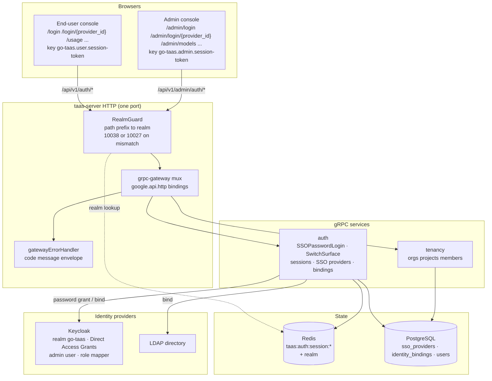

# 统一登录与基于角色的路由 — 架构与详细设计

| 属性 | 内容 |
| --- | --- |
| 功能点 | 统一登录与基于角色的路由 — 面向所选身份提供商的 TaaS 自定义登录页（通过 OIDC 密码授权 / LDAP bind 使用用户名/密码）、基于角色的会话 realm 与基于角色的落地、用户页上的管理端切换按钮与管理端上对称的切换到用户，以及在 compose 启动时预置的 Keycloak 提供商与 `admin`/`admin` 用户（backlog 第 22 行） |
| 文档范围 | 功能-22 的架构与详细设计：两个新的 `AuthService` RPC（`SSOPasswordLogin`、`SwitchSurface`）及其按表面的精确 `google.api.http` 绑定、基于角色的会话 realm、可配置的管理角色集合、compose 的 Keycloak realm-export.json 与提供商/绑定预置、两个控制台的前端自定义登录页与基于角色的落地和切换按钮、页面 → 路由 → API 前缀映射、错误处理、配置、安全、上线，以及按层的函数级任务清单 |
| 归属模块 | `services/auth`（密码授权登录、基于角色的 realm、切换表面的会话铸造、提供商/绑定预置）、`pkg/server`（网关 realm 守卫——不变）、`deploy/compose`（Keycloak realm-export.json 预置、提供商预置）、`web/`（自定义登录页、基于角色的落地、切换按钮）、`pkg/config`（管理角色集合）、`pkg/errors`（复用码） |
| 相关文档 | [需求分析与 UI/UX 设计](../design/unified-login-role-routing.md) · [架构设计](../design/architecture.md) §2.1 `auth` 与 §3.1 管理端/用户表面分离 · [SSO 联邦与账号绑定](./sso-federation.md)（IdP 框架、`SSOAuthorize`/`SSOCallback`、身份绑定、属性到角色映射、会话）· [控制台表面分离](./console-surface-separation.md)（两个表面、realm 固定的会话、realm 守卫、本功能替换的登录页、`10038 REALM_MISMATCH` 规则）· [组织成员、角色与邀请](./org-members-rbac.md)（会话携带的、本功能据此路由的角色） |
| 状态 | 架构完成，已移交给开发者智能体 |

---

## 1. 概述与目标

功能 #7 与 #17 交付了平台的身份认证主干：可插拔的 IdP 框架（`SSOAuthorize`/`SSOCallback`）、带 realm 的会话，以及两个控制台表面（`/...` 用户、`/admin/...` 管理端）与 realm 固定的会话。但登录体验仍有三个本功能要关闭的缺口：

1. **登录页不是 TaaS 品牌化的。** 今天 `/login` 与 `/admin/login` 列出 SSO 提供商并重定向到 IdP 托管的登录页（Keycloak）。控制台无法对该页做样式、校验或本地化，用户必须离开产品去认证。
2. **落地表面由入口点决定，而非由角色决定。** 会话 realm 由登录路由派生（功能 #17 D3），因此在 `/login` 登录的管理员会落到用户控制台，若不再次在 `/admin/login` 登录就无法到达管理端。
3. **登录后没有表面切换。** 想使用用户控制台（自己的 API Key、用量、Playground）再返回管理端的管理员必须登录两次。

本功能新增：**TaaS 自定义登录页**（针对所选提供商使用用户名/密码，绝不用 IdP 托管的页面）、**基于角色的路由**（登录后控制台按用户角色落到用户或管理端表面）、用户页上的**管理端切换按钮**与管理端上对称的**切换到用户**，以及在 compose 启动时预置的 **Keycloak 提供商与 `admin`/`admin` 用户**，使整个流程可端到端验证。

**目标**：

- 两个表面上的 TaaS 自定义登录页，针对所选提供商认证用户名/密码（设计 D1）：`SSOPasswordLogin` 执行 OIDC 资源所有者密码授权（Keycloak Direct Access Grants）或 LDAP bind；SAML 提供商保留重定向流程。
- 基于角色的会话 realm 与基于角色的落地（设计 D2、D3）：realm 由已认证角色派生，绝不来自请求字段；登录后控制台路由 `admin` → `/admin/models`、`user` → `/usage`。
- 用户页上的管理端切换按钮与管理端上对称的切换到用户（设计 D4）：`SwitchSurface` 为目标 realm 铸造会话，按角色校验。
- compose 启动时预置 Keycloak 提供商与 `admin`/`admin` 用户（设计 D5）：realm-export.json 新增 admin 用户、Direct Access Grants 与角色协议映射器；预置机制幂等地创建提供商行与 admin 用户的身份绑定。
- 带精确前缀的页面 → API 表面映射表；逐页交互状态；可在 Nightwatch 中针对 compose 栈验证的编号验收标准，含负向用例。

**非目标**（按设计重述）：SAML 密码授权（SAML 无此类流程；SAML 提供商保留重定向流程）；自助注册或密码重置；跨管理 API 的完整 RBAC 强制；token 轮换与单点登出；在管理端前缀上强制要求会话（过渡访问保留，功能 #17 D6）；第一方本地用户名/密码账号库（`Login`/`CreateUser` 仍是桩——自定义登录页针对所选 IdP 认证，而非本地库）；改变任何数据面（推理网关）行为。

### 1.1 阅读顺序

第 2 节记录架构决策（包括架构对 UI/UX 设计的细化点，各附理由）。第 3–5 节是组件视图、请求身份链与 API 契约。第 6–8 节是前端架构、关键时序与错误处理。第 9–11 节是配置、安全与上线。第 12–14 节是验收标准追溯、函数级详细设计与有序实现任务清单。

---

## 2. 架构决策

AD1–AD7 把 UI/UX 设计的决策重述为实现级规则。**AD8–AD10 是架构新增的细化**，各标记其细化的设计决策；它们保留设计意图，记录于此以便开发者与测试智能体按同一解读实现。

| # | 决策 | 理由 |
| --- | --- | --- |
| AD1 | **`SSOPasswordLogin` 是 `taas.auth.v1.AuthService` 上的新 RPC，双绑定到两个表面。** 用户绑定为 `POST /api/v1/auth/sso/{provider_id}/login`；管理端绑定通过 `additional_bindings` 为 `POST /api/v1/admin/auth/sso/{provider_id}/login`。两者共享一个 handler；realm 是**基于角色派生**的，而非基于绑定（AD2），因此两个绑定行为一致 | 设计 D1/FR1.1。两个表面的登录流程相同；只有 HTTP 前缀不同。单一 handler 加两个绑定避免了复制密码授权逻辑（`GetSession` 双绑定模式，功能 #17 AD6） |
| AD2 | **会话 realm 由已认证角色派生，而非由登录绑定派生。** `SSOPasswordLogin` 解析身份并映射角色后，若任一会话角色在配置的管理角色集合中（AD3），realm 为 `admin`，否则为 `user`。这取代了登录流程上的功能 #17 D3：`SSOCallback`/`AdminSSOCallback` 保留其基于绑定的 realm，但 `SSOPasswordLogin` 由角色派生 realm | 设计 D2/FR2.1。需求要求落地跟随角色。从已认证角色派生 realm 仍可审计、仍强制表面分离，并消除了「在错误的入口点登录」的陷阱。没有可伪造的请求字段来选择 realm |
| AD3 | **管理角色集合是配置值，不是常量。** `auth.adminRoles`（默认 `platform-admin`、`org-admin`、`admin`、`owner`）是使某用户成为管理员的会话角色集合。若任一会话角色在集合中，则该用户是管理员 | 设计 D6。角色来自功能 #10 的成员解析器与功能 #7 的属性映射；哪些角色算「管理」是部署策略，因此必须可配置。默认值覆盖租户角色词汇（`owner`/`admin`）与平台角色（`platform-admin`/`org-admin`） |
| AD4 | **`SwitchSurface` 是 `taas.auth.v1.AuthService` 上的新 RPC，固定到承载按钮的表面。** `POST /api/v1/auth/session:switch-to-admin`（用户前缀）铸造 admin realm 会话；`POST /api/v1/admin/auth/session:switch-to-user`（管理端前缀）铸造 user realm 会话。每个绑定要求其自身 realm 的已认证会话（由网关 realm 守卫强制），并返回目标 realm 的会话 token | 设计 D4/FR3.2/FR3.3。切换是让基于角色的落地可用的逃生口。每个表面保留自己的会话（功能 #17 D4），因此切换为目标 realm 铸造新会话，而非复用源 token。两个绑定是独立 RPC（而非 `additional_bindings`），因为它们铸造不同的 realm 并校验不同的角色 |
| AD5 | **`switch-to-admin` 校验调用者具有管理角色；`switch-to-user` 不校验。** 无管理角色却调用 `switch-to-admin` 的用户会收到 10036 `CodeForbidden`。`switch-to-user` 对任何 admin realm 会话可用（管理员总是被允许使用用户控制台） | 设计 FR3.4。管理端切换是权限提升（用户 → 管理端），因此必须按角色门控；用户切换是降权，无需门控。按钮本就不会为非管理员渲染（FR3.1），无角色直接调用返回 10036 |
| AD6 | **compose 预置是两部分机制：静态的 realm-export.json 变更与 `auth` 模块 `Migrate` 钩子中的运行时预置。** realm-export.json 新增 `admin` 用户、`directAccessGrantsEnabled` 与角色协议映射器；`Migrate` 钩子在不存在时创建 Keycloak OIDC 提供商行与 admin 用户的身份绑定（幂等） | 设计 D5/FR4.1–FR4.4。realm-export.json 是 Keycloak 侧的事实来源（首次启动时由 Keycloak 导入）；提供商行与绑定是 TaaS 侧的事实来源（由 `auth` 模块预置，既有的 `Migrator` 模式）。拆分使每侧的事实来源留在自己的层 |
| AD7 | **自定义登录页仅对 OIDC 与 LDAP 提供商提供；SAML 保留重定向流程。** 登录页的提供商列表标记每个提供商的类型；选择 OIDC/LDAP 提供商时导航到 `/login/{provider_id}`（或 `/admin/login/{provider_id}`），选择 SAML 提供商时调用 `SSOAuthorize` 并重定向到 IdP | 设计 D1/FR1.3/FR5.2。SAML 2.0 没有密码授权，因此 SAML 提供商无法通过用户名/密码表单认证。提供商的 `type` 已在公开投影中（`ListPublicSSOProviders` 返回 `type`），因此控制台无需新字段即可分支 |
| AD8 | **细化设计 D2 —— realm 由*映射后的*会话角色派生，这些角色是权威的。** 当成员解析器已接线时（功能 #10），角色来自 `org_members`；否则来自 IdP 属性映射。`SSOPasswordLogin` 复用既有的 `mapAttributes`/`mapMembership` 路径，因此 realm 决策看到的正是会话将携带的角色 | 设计（D2）说「由用户角色派生」。会话角色由既有的 `mapAttributes`/`mapMembership` 函数产生（功能 #7 D7、功能 #10 AD2/AD11）；从同一输出派生 realm 保证 realm 与会话角色永不一致 |
| AD9 | **细化设计 D4 —— 切换铸造一个*全新*会话，身份相同但为目标 realm，且不复制源会话的 token。** `SwitchSurface` 解析当前会话，从同一用户/角色/组织重新派生目标 realm 的会话，并在目标 realm 下签发新的会话 id 与访问 token。源会话保持原样（用户可切回） | 设计（D4）说「为目标 realm 铸造会话」。全新会话 id 使两个 realm 的会话保持独立（功能 #17 D4），并让用户同时持有两者——这正是切换到管理端/切换到用户往返所需的。源会话不被吊销，因此用户无需重新认证即可返回 |
| AD10 | **细化设计 D5 —— admin 用户的身份绑定由 `auth` 模块的 `Migrate` 钩子预置，而非仅靠 JIT 预置。** 预置创建 Keycloak 提供商行，然后在不存在时创建 `admin` 平台用户及其身份绑定（`external_subject = issuer + ":" + sub`，即 Keycloak admin 主体）。JIT 预置仍是其他用户的回退 | 设计（FR4.3）允许「绑定或 JIT 预置」。预置的绑定是确定且幂等的（FR4.4），不依赖首次登录与角色映射竞争；它还保证在任何 e2e 断言运行前 `admin` 用户已存在并带 `admin` 角色。JIT 对其他人保持开启 |

---

## 3. 组件视图

### 3.1 归属

| 层 / 组件 | 拥有 | 本功能的变更 |
| --- | --- | --- |
| **静态包（SPA）** | 一个 Vite 包（`web/dist`），嵌入 `taas-server` 的 `pkg/server/console/`；由网关的 SPA 回退提供 | 自定义登录页（`/login/{provider_id}`、`/admin/login/{provider_id}`）、基于角色的落地、外壳中的切换按钮，以及 `App.tsx` 中的路由注册 |
| **网关（`pkg/server`）** | HTTP 组合：`RealmGuard` → `withConsole` → `runtime.ServeMux`；统一错误渲染器；SPA 回退 | **无变更** —— 新 RPC 绑定在 `/api/v1/auth/*`（用户）与 `/api/v1/admin/auth/*`（管理端）下，realm 守卫已把这些前缀当作其表面 |
| **grpc-gateway mux** | 从 `google.api.http` 注解做路径 → RPC 路由 | 两个新 RPC 的新绑定（第 5 节） |
| **`auth`** | 用户、SSO 提供商、身份绑定、API Key、Redis 会话、供其他服务使用的会话身份 | `SSOPasswordLogin`（OIDC 密码授权 + LDAP bind）、`SwitchSurface`（固定 realm 的会话铸造）、基于角色的 realm、管理角色集合，以及 `Migrate` 中的 compose 提供商/绑定预置 |
| **`tenancy`** | 组织、项目、成员、邀请、`OrgGuard`、`MembershipResolver`、`SessionResolver` | 不变 —— 成员解析器已为 realm 决策读取的会话角色供数 |
| **`pkg/errors`** | 每模块的码块 | 无新码 —— 全部复用（第 7 节） |
| **`pkg/config`** | 合并的配置树 | 新的 `auth.adminRoles` 列表（AD3） |
| **`deploy/compose`** | compose 栈与 Keycloak realm 导入 | `realm-export.json` 新增 `admin` 用户、`directAccessGrantsEnabled` 与角色协议映射器（第 5.4 节） |

### 3.2 运行时组件视图



| 组件 | 本功能的职责 |
| --- | --- |
| 控制网关（`grpc-gateway`） | 两个新 `AuthService` RPC 的 HTTP/JSON 门面；realm 守卫不变，已把 `/api/v1/auth/*` 路由到用户 realm、`/api/v1/admin/auth/*` 路由到管理端 realm |
| `auth` 模块（`services/auth`） | `SSOPasswordLogin`（OIDC 密码授权 + LDAP bind）、`SwitchSurface`（固定 realm 的会话铸造）、基于角色的 realm、管理角色集合，以及 `Migrate` 中的 compose 提供商/绑定预置 |
| `tenancy` 模块（`services/tenancy`） | 不变 —— 成员解析器为 realm 决策读取的会话角色供数 |
| PostgreSQL | `sso_providers`、`identity_bindings`、`users` 表（既有，功能 #7）；无 schema 变更 |
| Redis | 会话（既有 keyspace `taas:auth:session:*`）；无变更 |
| Keycloak | 本地 OIDC IdP：realm `go-taas`、启用 Direct Access Grants 的 `go-taas-console` 客户端、带管理角色的 `admin` 用户，以及使管理角色出现在 ID token 中的角色协议映射器 |
| LDAP | LDAP 提供商的目录 bind 目标（不变） |
| 消息队列 | **不变** —— 登录与切换流程仅 RPC；无新 subject、无消费者、无 runner |
| 控制台 | 自定义登录页、基于角色的落地与切换按钮（契约见第 6 节） |

---

## 4. 请求身份链

本代码库没有逐 RPC 的认证拦截器链；身份在 handler 内从网关转发的 gRPC metadata 解析。两个新 RPC 的链为：

1. **`RealmGuard`**（HTTP，`pkg/server/realm.go`）—— 路径前缀决定期望 realm。`SSOPasswordLogin` 是**匿名**的（无需会话——调用者正在认证），因此守卫在无 `Authorization` 头时放行（过渡，功能 #17 AD4）。`SwitchSurface` 是**携带会话**的：`switch-to-admin` 在 `/api/v1/auth/*` 上期望 user realm 会话，`switch-to-user` 在 `/api/v1/admin/auth/*` 上期望 admin realm 会话。错误 realm 会话 → 10038，未知/过期/无 realm 会话 → 10027。
2. **grpc-gateway mux** —— 按注解路径路由并转发 `authorization`。
3. **`auth` handler** —— `SSOPasswordLogin` 从 IdP 交换/bind 解析身份并铸造基于角色的 realm 会话；`SwitchSurface` 从 metadata 解析当前会话、校验角色（对 `switch-to-admin`），并铸造目标 realm 会话。

因为 realm 守卫已在 `SwitchSurface` 上拒绝了错误 realm 会话，handler 无需知道它经由哪个绑定到达：`switch-to-admin` 仅以 user realm 会话可达，`switch-to-user` 仅以 admin realm 会话可达。

---

## 5. API 契约

### 5.1 RPC 表面

所有 API 都属于现有 **`taas.auth.v1.AuthService`**（proto：`proto/taas/auth/v1/auth.proto`），经控制网关以 HTTP 提供。两个 RPC 是新增的；其余复用。Proto 变更是增量的。

| RPC | HTTP | 前缀 | 状态 | 用途 |
| --- | --- | --- | --- | --- |
| `SSOPasswordLogin` | `POST /api/v1/auth/sso/{provider_id}/login` | 用户 | **新增** | 认证用户名/密码（用户绑定）；OIDC 密码授权 / LDAP bind；铸造基于角色的 realm 会话 |
| `SSOPasswordLogin` | `POST /api/v1/admin/auth/sso/{provider_id}/login` | 管理端 | **新增** | 同一 handler 与行为；realm 仍基于角色（AD2） |
| `SwitchSurface` | `POST /api/v1/auth/session:switch-to-admin` | 用户 | **新增** | 为当前用户铸造 admin realm 会话；无管理角色返回 10036 |
| `SwitchSurface` | `POST /api/v1/admin/auth/session:switch-to-user` | 管理端 | **新增** | 为当前用户铸造 user realm 会话；与 switch-to-admin 对称 |
| `ListPublicSSOProviders` | `GET /api/v1/auth/sso/providers` | 用户 | 现有 | 用户登录页的提供商列表（复用，功能 #17 D16） |
| `ListSSOProviders` | `GET /api/v1/admin/auth/sso/providers` | 管理端 | 现有 | 管理端登录页的提供商列表（复用） |
| `SSOAuthorize` / `SSOCallback` | `GET /api/v1/auth/sso/{provider_id}/authorize, callback` | 用户 | 现有 | SAML 重定向流程（对 SAML 提供商复用，FR1.3） |
| `AdminSSOAuthorize` / `AdminSSOCallback` | `GET /api/v1/admin/auth/sso/{provider_id}/authorize, callback` | 管理端 | 现有 | 管理端表面上的 SAML 重定向流程（复用） |
| `GetSession` | `GET /api/v1/auth/session`、`/api/v1/admin/auth/session` | 两者 | 现有 | 外壳的会话校验；返回 realm（复用） |
| `Logout` | `POST /api/v1/auth/logout`、`/api/v1/admin/auth/logout` | 两者 | 现有 | 吊销会话（复用） |

### 5.2 Proto 契约

```proto
// Additive additions to proto/taas/auth/v1/auth.proto, on AuthService.

  // SSOPasswordLogin authenticates a username/password against a
  // selected provider: the OIDC resource-owner password grant (Keycloak
  // Direct Access Grants) or the LDAP bind. The realm is derived from
  // the authenticated role (feature-22 AD2), never from a request field.
  // The password is used only for the exchange/bind and is never
  // persisted or echoed. SAML providers cannot use this flow and keep
  // the redirect flow (SSOAuthorize/SSOCallback).
  // User-surface API: served under /api/v1; the admin binding is an
  // additional_bindings with identical behaviour.
  rpc SSOPasswordLogin(SSOPasswordLoginRequest) returns (SSOPasswordLoginResponse) {
    option (google.api.http) = {
      post: "/api/v1/auth/sso/{provider_id}/login"
      body: "*"
      additional_bindings: {
        post: "/api/v1/admin/auth/sso/{provider_id}/login"
        body: "*"
      }
    };
  }

  // SwitchSurface mints a session for the target realm for the current
  // user. switch-to-admin (user prefix) validates the caller has an
  // admin role (10036 otherwise) and mints an admin-realm session;
  // switch-to-user (admin prefix) mints a user-realm session. Each
  // binding requires an authenticated session of its own realm (the
  // gateway realm guard enforces this). The source session is left
  // intact so the user can switch back.
  // User-surface API: served under /api/v1.
  rpc SwitchSurface(SwitchSurfaceRequest) returns (SwitchSurfaceResponse) {
    option (google.api.http) = {
      post: "/api/v1/auth/session:switch-to-admin"
      body: "*"
    };
  }

  // SwitchSurface mints a user-realm session for the current user.
  // Admin-surface API: served under /api/v1/admin.
  rpc SwitchSurfaceAdmin(SwitchSurfaceRequest) returns (SwitchSurfaceResponse) {
    option (google.api.http) = {
      post: "/api/v1/admin/auth/session:switch-to-user"
      body: "*"
    };
  }

message SSOPasswordLoginRequest {
  string provider_id = 1;   // path
  string username = 2;      // required, 1-128 chars, trimmed
  string password = 3;      // required, 1-256 chars; never persisted or echoed
}
message SSOPasswordLoginResponse {
  taas.common.v1.Response response = 1;
  string session_token = 2; // the session id, stored under the realm-matching key
  string realm = 3;         // user | admin, derived from the role (AD2)
  int64 expires_at = 4;     // unix seconds
}

message SwitchSurfaceRequest {}
message SwitchSurfaceResponse {
  taas.common.v1.Response response = 1;
  string session_token = 2; // the target-realm session id
  string realm = 3;         // the target realm (admin for switch-to-admin, user for switch-to-user)
  int64 expires_at = 4;     // unix seconds
}
```

设计说明：

- **`SSOPasswordLogin` 使用 `additional_bindings`**（AD1），因为两个绑定共享一个 handler，且 realm 基于角色派生而非基于绑定。这镜像了 `GetSession` 双绑定模式（功能 #17 AD6）。
- **`SwitchSurface` 使用两个独立 RPC**（`SwitchSurface` + `SwitchSurfaceAdmin`，AD4），因为两个绑定铸造不同的 realm 并校验不同的角色。带 `additional_bindings` 的单一 RPC 会迫使 handler 从路径推断目标 realm，这正是架构要避免的可伪造标记模式。
- `SSOPasswordLoginResponse` 携带 `realm`，使控制台无需二次 `GetSession` 调用即可把 token 存入与 realm 匹配的 key 并按 realm 路由（FR2.2/FR2.3）。
- `SwitchSurfaceResponse` 携带 `realm`，使控制台知道把返回的 token 存入哪个 key（FR3.2/FR3.3）。

### 5.3 线上格式（既定约定）

- 成功响应为 HTTP 200；业务错误渲染为 `{"code": <int>, "message": "..."}`。
- int64 字段序列化为 JSON 字符串（既定约定）。
- 密码绝不在任何响应或错误消息中回显。

### 5.4 compose 的 Keycloak 预置

**`deploy/compose/keycloak/realm-export.json`**（Keycloak 侧事实来源，AD6）：

| 变更 | 详情 |
| --- | --- |
| `admin` 用户 | `username: "admin"`、`enabled: true`、`email: "admin@example.com"`、`emailVerified: true`、密码凭据 `admin`/`admin`（非临时）、以及 realm 角色 `admin` |
| `directAccessGrantsEnabled` | 在 `go-taas-console` 客户端上设为 `true`（使 OIDC 密码授权可用） |
| 角色协议映射器 | 一个把 `admin` realm 角色映射进 ID token 作为声明的客户端 scope 协议映射器（使角色出现在密码授权返回的 ID token 中） |

**`auth` 模块 `Migrate` 钩子**（TaaS 侧事实来源，AD6/AD10）：在 `AutoMigrate` 之后，预置幂等地运行：

1. 若不存在 `provider_id = "keycloak"` 的提供商，则创建它：`type = "oidc"`、`display_name = "Keycloak"`、`issuer = "http://keycloak:8080/realms/go-taas"`、`client_id = "go-taas-console"`、`client_secret = "go-taas-console-secret"`、`redirect_uri = "http://localhost:9091/api/v1/auth/sso/*"`、`enabled = true`、`allow_auto_provision = true`，以及把 Keycloak 管理角色声明映射到 TaaS `admin` 角色的 `attribute_mapping`（例如 `{"username":"preferred_username","email":"email","role":"realm_access.roles"}`）。
2. 若不存在 `username = "admin"` 的平台用户，则创建它。
3. 若不存在 `(provider_id = "keycloak", external_subject = issuer + ":" + admin_subject)` 的身份绑定，则创建它并绑定到 `admin` 用户。

预置是幂等的（FR4.4）：每一步在插入前检查存在性，因此重复运行 compose 启动不会重复创建提供商、用户或绑定。`admin` 用户的 `external_subject` 是 Keycloak `admin` 用户的主体；预置在首次启动时从 IdP 读取它（realm-export.json 不固定主体），或通过 JIT 预置在首次成功登录时创建绑定（见 AD10）。

---

## 6. 前端架构

### 6.1 模块计划

| 关注点 | 文件 | 备注 |
| --- | --- | --- |
| Realm 类型、存储 key、realm 作用域的 API 客户端 | `web/src/api.ts`（不变） | `Realm`、`tokenKey`、`orgKey`、`apiPrefix`、`createApi(realm)`；客户端已拒绝前缀不属于其 realm 的路径 |
| 表面上下文 | `web/src/surface.tsx`（不变） | `SurfaceProvider({realm})`、`useApi()`、`useRealm()` |
| 纯路由规则 | `web/src/surface-routes.ts`（扩展） | 新增 `realmCustomLoginPath(realm, providerId)`；`realmHome`/`realmLoginPath` 不变 |
| 表面路由器、路由树 | `web/src/App.tsx`（扩展） | 新增 `/login/{provider_id}` 与 `/admin/login/{provider_id}` 路由 |
| 外壳 | `web/src/shells/UserShell.tsx`、`web/src/shells/AdminShell.tsx`（扩展） | 在账号块新增切换按钮；切换 handler 调用 `SwitchSurface` 并导航 |
| 自定义登录页 | `web/src/pages/user/UserCustomLoginPage.tsx`、`web/src/pages/AdminCustomLoginPage.tsx`（新增） | 针对该 realm 的 `SSOPasswordLogin` 绑定的用户名/密码表单 |
| 登录页 | `web/src/pages/user/UserLoginPage.tsx`、`web/src/pages/AdminLoginPage.tsx`（扩展） | 按提供商 `type` 分支：OIDC/LDAP → 导航到自定义登录页，SAML → `SSOAuthorize` 重定向 |
| 共享组件 | `web/src/components.tsx`、`web/src/components/*` | 复用 `ErrorBanner`、通知槽与 `data-testid` 约定 |

### 6.2 用户控制台：页面 → 路由 → API

| 路由 | 组件 | 用途 | API 前缀（精确调用） |
| --- | --- | --- | --- |
| `/login` | `pages/user/UserLoginPage.tsx`（无外壳） | 提供商选择 | `GET /api/v1/auth/sso/providers` |
| `/login/{provider_id}` | `pages/user/UserCustomLoginPage.tsx`（无外壳） | TaaS 自定义登录 | `POST /api/v1/auth/sso/{provider_id}/login` |
| `/usage` | `pages/user/UsagePage.tsx` | `user` 的基于角色落地 | （会话 realm，无新调用） |
| `/api-keys`、`/request-logs`、`/playground`、`/billing`、`/models`、`/quickstart`、`/activity` | 既有用户页 | 不变 | `/api/v1/*` |
| 其他 | `pages/NotFoundPage.tsx`（`UserShell` 内） | 404 | 无 |

外壳辅助：启动时 `GET /api/v1/auth/session`（仅当用户 token key 非空）、切换按钮 `POST /api/v1/auth/session:switch-to-admin`、登出 `POST /api/v1/auth/logout`。

### 6.3 管理端控制台：页面 → 路由 → API

| 路由 | 组件 | 用途 | API 前缀（精确调用） |
| --- | --- | --- | --- |
| `/admin/login` | `pages/AdminLoginPage.tsx`（无外壳） | 提供商选择 | `GET /api/v1/admin/auth/sso/providers` |
| `/admin/login/{provider_id}` | `pages/AdminCustomLoginPage.tsx`（无外壳） | TaaS 自定义登录 | `POST /api/v1/admin/auth/sso/{provider_id}/login` |
| `/admin/models` | `pages/ModelsPage.tsx` | `admin` 的基于角色落地 | （会话 realm，无新调用） |
| `/admin/...` | 既有管理端页 | 不变 | `/api/v1/admin/*` |
| 其他 | `pages/NotFoundPage.tsx`（`AdminShell` 内） | 404 | 无 |

外壳辅助：启动时 `GET /api/v1/admin/auth/session`、切换控件 `POST /api/v1/admin/auth/session:switch-to-user`、登出 `POST /api/v1/admin/auth/logout`。

### 6.4 `web/src/App.tsx` 中的路由注册

```tsx
function UserSurface({ path }: { path: string }) {
  return (
    <SurfaceProvider realm="user">
      <OrgProvider>
        {path === '/login' ? (
          <UserLoginPage />
        ) : path.startsWith('/login/') ? (
          <UserCustomLoginPage providerId={path.slice('/login/'.length)} />
        ) : (
          <UserShell>
            <Routes>
              {/* existing user routes */}
            </Routes>
          </UserShell>
        )}
      </OrgProvider>
    </SurfaceProvider>
  );
}
```

`AdminSurface` 以 realm `admin`、`/admin/login`、`/admin/login/{provider_id}` 与 `AdminCustomLoginPage` 镜像它。自定义登录页无外壳（不得渲染已认证的 chrome），与登录页例外一致（功能 #17 §7.4）。

### 6.5 自定义登录页

`UserCustomLoginPage` / `AdminCustomLoginPage` 渲染用户名/密码表单（`custom-login-form`），含 `custom-login-username` 与 `custom-login-password` 字段及 `custom-login-submit` 按钮。提交时：

1. 以 `{ username, password }` 调用 `POST <realm-prefix>/auth/sso/{provider_id}/login`。
2. 成功后，把返回的 `session_token` 存入与 realm 匹配的 key：`realm === 'admin'` → `go-taas.admin.session-token`，否则 `go-taas.user.session-token`（FR2.3）。清除待处理的提供商条目并用 `history.replaceState` 清掉查询串。
3. 按返回的 `realm` 路由：`admin` → `/admin/models`，`user` → `/usage`（FR2.2）。

表单的提交按钮在两个字段都非空之前保持禁用（AC6）。错误文案把业务码映射为句子（FR6.3）：10022 →「This identity provider is disabled. Ask your platform operator.」；10024 →「The username or password is incorrect.」；10025 →「This identity is not linked to a go-taas account. Ask your organization administrator for an invitation.」；10027 →「Sign-in did not complete. Try again.」

### 6.6 基于角色的落地

登录后控制台读取会话 realm 并路由（FR2.2）：`admin` → `/admin/models`，`user` → `/usage`。无需单独的二次角色检查——realm 是唯一事实来源（D3）。落地由 `SSOPasswordLoginResponse` 中的 `realm` 字段驱动（第 5.2 节），因此控制台无需二次 `GetSession` 调用即可知道去向。

### 6.7 切换按钮

**`UserShell` 账号块** —— 会话具有管理角色的用户会看到「Switch to admin」按钮（`switch-to-admin`）。点击时：

1. 以 user realm 会话调用 `POST /api/v1/auth/session:switch-to-admin`。
2. 成功后，把返回的 `session_token` 存入 `go-taas.admin.session-token` 并导航到 `/admin/models`（FR3.2）。

非管理员用户看不到该按钮（FR3.1）；按钮可见性由会话角色（来自 `GetSession`）驱动，外壳启动时已加载。

**`AdminShell` 账号块** —— 「Switch to user console」控件（`switch-to-user`）。点击时：

1. 以 admin realm 会话调用 `POST /api/v1/admin/auth/session:switch-to-user`。
2. 成功后，把返回的 `session_token` 存入 `go-taas.user.session-token` 并导航到 `/usage`（FR3.3）。

切换按钮位于账号块（已登录用户名与角色徽章旁），而非导航数组——用户导航有八项、管理端导航有二十项，切换是账号动作，不是导航目的地。

### 6.8 逐表面认证守卫

守卫与功能 #17（§7.5）不变：每个外壳读取自己 realm 的 token key，通过自己 realm 的 `GetSession` 校验，并在 10027/10038 时重定向到自己 realm 的登录页。自定义登录页无外壳，除 `SSOPasswordLogin` 本身外不做任何会话调用。另一 realm 的 key 绝不被读取、写入、清除或回显。

### 6.9 测试智能体可驱动的 `data-testid` 钩子

本功能新增：`sso-login-{provider_id}`（既有）、`custom-login-form`、`custom-login-username`、`custom-login-password`、`custom-login-submit`、`custom-login-back`、`custom-login-notice`、`custom-login-error`、`custom-login-submitting`、`switch-to-admin`、`switch-to-user`、`switch-in-flight`、`switch-notice`。既有的 `sso-login-list`、`login-loading`、`login-no-providers`、`login-error`、`login-signing-in`、`user-account-block`、`admin-account-block` 保留。

---

## 7. 错误处理

所有错误都是统一信封中的 `pkg/errors` 业务码。**不分配新码** —— 本功能复用既有的 auth 块码。

| 条件 | 码 | 常量 | 备注 |
| --- | --- | --- | --- |
| 未知提供商 | 10021 | `CodeSSOProviderNotFound` | 现有；复用 |
| 登录时提供商被禁用 | 10022 | `CodeSSOProviderDisabled` | 现有；复用 |
| IdP 拒绝交换/bind | 10024 | `CodeSSOAuthFailed` | 现有；复用于凭据错误 |
| JIT 关闭、无绑定 | 10025 | `CodeSSONoAccount` | 现有；复用 |
| 缺失/过期/已吊销会话 | 10027 | `CodeSessionInvalid` | 现有；复用于 `SwitchSurface` 无有效源会话 |
| 角色不允许（切换） | 10036 | `CodeForbidden` | 现有；复用于非管理员 `switch-to-admin` |
| realm 不匹配 | 10038 | `CodeRealmMismatch` | 现有；会话出现在另一 realm 前缀时复用（网关守卫） |

`SSOPasswordLogin` 校验顺序（同步）：未知提供商 → 10021；提供商被禁用 → 10022；SAML 提供商 → 10028 `CodeSSOProviderInvalid`（SAML 提供商无法使用密码授权）；用户名/密码为空 → 10024；IdP 交换/bind 失败 → 10024；JIT 关闭且无绑定 → 10025。`SwitchSurface` 校验顺序：无有效源会话 → 10027（经网关守卫或 handler）；`switch-to-admin` 无管理角色 → 10036。

---

## 8. 配置新增

既有 `auth` 配置段新增一个 key（AD3）：

| Key | 默认 | 描述 |
| --- | --- | --- |
| `auth.adminRoles` | `["platform-admin", "org-admin", "admin", "owner"]` | 使某用户成为管理员的会话角色集合。若任一会话角色在集合中，则该用户是管理员 |

规则：

- `Configuration.applyDefaults` 在为空时填充默认值；`Validate` 新增：`adminRoles` 是非空字符串的非空列表。
- `configs/server.yaml` 与 `configs/config.yaml` 新增带默认列表的 `auth.adminRoles`。
- 管理角色集合由 `auth` 模块的 realm 派生与切换校验逻辑读取。它是配置值，不是常量（AD3），因此部署无需改代码即可增删角色。

---

## 9. 安全考量

- **基于角色的 realm，绝无请求字段**（AD2）：realm 由服务端从已认证角色派生；没有浏览器可伪造的请求字段（功能 #17 D3 的教训）。
- **不存储凭据**（D1）：自定义登录页把用户名/密码交给 IdP 交换，绝不持久化。密码仅用于 OIDC 密码授权或 LDAP bind，随后丢弃（FR1.2）。
- **不跨 realm 复用会话**（AD9）：切换为目标 realm 铸造全新会话，绝不复制源 token（功能 #17 D4）。每个表面在自己的 key 下保留自己的会话。
- **权限提升被门控**（AD5）：`switch-to-admin` 校验调用者具有管理角色（否则 10036）；按钮本就不会为非管理员渲染。`switch-to-user` 是降权，无需门控。
- **切换固定到 realm**（AD4）：`switch-to-admin` 仅在用户前缀可达，`switch-to-user` 仅在管理端前缀可达，由网关 realm 守卫强制。错误 realm 会话 → 10038。
- **SAML 保留重定向流程**（AD7）：SAML 提供商无法通过密码表单认证，因此绝不暴露密码字段；自定义登录页仅对 OIDC 与 LDAP 提供商提供。
- **管理角色集合可配置**（AD3）：哪些角色算「管理」是部署策略，而非硬编码常量，因此部署无需改代码即可收紧或放宽集合。
- **预置凭据仅限 compose**：`admin`/`admin` 用户与 `go-taas-console-secret` 客户端密钥仅存在于 compose 的 realm-export.json；生产部署配置自己的 IdP，绝不导入 compose realm。

---

## 10. 上线说明

- **Schema**：无变更 —— `sso_providers`、`identity_bindings`、`users` 表已存在（功能 #7）。compose 预置在启动时向它们写入行（幂等）。
- **Proto**：`proto/taas/auth/v1/auth.proto` 新增两个 RPC 与消息 —— 需要 `make pbgen`；生成代码不提交。
- **接线**：`apps/taas-server/main.go` 把 Redis 会话存储接入 `auth` 服务（已完成，功能 #7）；`Migrate` 钩子新增 compose 提供商/绑定预置（AD6/AD10）。无新服务接线。
- **配置**：`auth.adminRoles` 加入 `configs/server.yaml` 与 `configs/config.yaml`；更新 `applyDefaults`/`Validate`。
- **升级兼容性**：本功能纯增量 —— 无 MQ 变更、无数据面变更、无既有 RPC 线上格式变更。`SSOCallback`/`AdminSSOCallback` 保留其基于绑定的 realm；只有新的 `SSOPasswordLogin` 由角色派生 realm。回滚只需留下未用的新 RPC 与预置行。
- **滚动更新顺序**：单独部署 `taas-server`；启动时 `Migrate` 钩子预置提供商与绑定。compose 栈必须重建（`make compose-down && make compose-up`）以拾取 realm-export.json 变更（Keycloak 在首次启动时导入 realm）。

---

## 11. 验收标准追溯

| AC | 架构如何满足它 |
| --- | --- |
| AC1 | realm-export.json 新增 `admin` 用户（第 5.4 节）；`Migrate` 钩子预置 Keycloak 提供商（AD6）；登录页经 `ListPublicSSOProviders` 列出它（第 6.2 节） |
| AC2 | 登录页按提供商 `type` 分支：OIDC → 导航到 `/login/keycloak`（AD7，第 6.5 节）；不重定向到 Keycloak 托管的页面 |
| AC3 | `SSOPasswordLogin` 以 `admin`/`admin` 经 OIDC 密码授权认证、派生 `admin` realm（AD2）、返回 `realm=admin`；控制台存入 `go-taas.admin.session-token` 并路由到 `/admin/models`（第 6.5 节） |
| AC4 | 非管理员用户的凭据派生 `user` realm；控制台存入 `go-taas.user.session-token` 并路由到 `/usage` |
| AC5 | 错误凭据 → 10024 → 内联错误「The username or password is incorrect.」；页面停留在 `/login/keycloak`（第 6.5 节） |
| AC6 | 提交按钮在两个字段都非空之前保持禁用（第 6.5 节） |
| AC7 | `UserShell` 对管理员显示 `switch-to-admin`；点击调用 `SwitchSurface`、存入 `go-taas.admin.session-token`、导航到 `/admin/models`（第 6.7 节） |
| AC8 | 非管理员看不到 `switch-to-admin`（FR3.1，第 6.7 节） |
| AC9 | `AdminShell` 显示 `switch-to-user`；点击存入 `go-taas.user.session-token` 并导航到 `/usage`（第 6.7 节） |
| AC10 | 在 `/admin/login` 登录的管理员派生 `admin` realm 并落到 `/admin/models`（基于角色，而非基于入口点） |
| AC11 | 在 `/admin/login` 登录的非管理员派生 `user` realm 并落到 `/usage` |
| AC12 | 用户 token 存于 `go-taas.user.session-token`，管理端 token 存于 `go-taas.admin.session-token`；没有页面读取另一 realm 的 key（功能 #17 D4，第 6.8 节） |
| AC13 | 被禁用的提供商不会列出（公开投影过滤 `enabled`）；页面加载后被禁用的提供商 → 10022 →「This identity provider is disabled.」错误 |
| AC14 | 自定义登录页的页脚声明凭据由提供商验证、不由 go-taas 存储（第 6.5 节） |

---

## 12. 详细设计

### 12.1 文件布局

| 模块 | 文件 | 内容 |
| --- | --- | --- |
| `proto/taas/auth/v1` | `auth.proto` | 两个新 RPC + 请求/响应消息（第 5.2 节） |
| `services/auth` | `sso_password_login.go` | `SSOPasswordLogin`（OIDC 密码授权 + LDAP bind）、基于角色的 realm，以及共享的会话铸造辅助 |
| | `sso_switch_surface.go` | `SwitchSurface` + `SwitchSurfaceAdmin`（固定 realm 的会话铸造） |
| | `sso_plugin_oidc.go` | 为 `OIDCPlugin` 新增 `PasswordGrant` 方法（OAuth2 资源所有者密码授权） |
| | `sso_plugin_ldap.go` | 为 `LDAPPlugin` 新增 `PasswordBind` 方法（目录 bind） |
| | `sso_plugin.go` | 用密码授权/bind 钩子扩展 `IDPPlugin` 接口 |
| | `sso_seed.go` | compose 提供商/绑定预置（AD6/AD10） |
| | `service.go` | 把预置接入 `Migrate`；新增管理角色集合辅助 |
| `pkg/config` | `api.go`、`configuration.go` | `auth.adminRoles` 字段 + 默认 + 校验 |
| `apps/taas-server` | `main.go` | 无变更（会话存储已接线） |
| `web/src` | `pages/user/UserCustomLoginPage.tsx` | 用户自定义登录页 |
| | `pages/AdminCustomLoginPage.tsx` | 管理端自定义登录页 |
| | `pages/user/UserLoginPage.tsx`、`pages/AdminLoginPage.tsx` | 按提供商 `type` 分支（OIDC/LDAP → 自定义登录，SAML → 重定向） |
| | `shells/UserShell.tsx`、`shells/AdminShell.tsx` | 账号块中的切换按钮 |
| | `App.tsx` | `/login/{provider_id}` 与 `/admin/login/{provider_id}` 路由 |
| | `surface-routes.ts` | `realmCustomLoginPath(realm, providerId)` |
| `deploy/compose/keycloak` | `realm-export.json` | `admin` 用户、`directAccessGrantsEnabled`、角色协议映射器（第 5.4 节） |
| `test/fvt` | `sso_password_login_fvt_test.go` | 密码登录 FVT（AC3–AC5、AC10–AC11），用假 IdP |
| | `sso_switch_surface_fvt_test.go` | 切换表面 FVT（AC7–AC9） |
| `test/e2e` | `tests/unifiedLogin.js` | 针对 compose 栈的统一登录 e2e（AC1–AC14） |

### 12.2 `auth` 模块 —— `SSOPasswordLogin`

`IDPPlugin` 接口新增密码授权/bind 钩子：

```go
// PasswordGrant authenticates a username/password against the provider
// and returns the extracted external identity. OIDC uses the OAuth2
// resource-owner password grant; LDAP uses a directory bind. SAML
// returns CodeSSOProviderInvalid (no password grant exists).
PasswordGrant(ctx context.Context, p *SSOProvider, username, password string) (*Identity, error)
```

`SSOPasswordLogin`（在 `sso_password_login.go`）：

1. 加载提供商；未知 → 10021，被禁用 → 10022。
2. 若 `prov.Type == ProviderTypeSAML` → 10028（SAML 提供商无法使用密码授权）。
3. 校验 `username`（1–128 字符，去首尾空白）与 `password`（1–256 字符）；为空 → 10024。
4. 调用 `plugin.PasswordGrant(ctx, prov, username, password)`；失败 → 10024（IdP 拒绝交换/bind）。
5. 经既有 `resolveIdentity` 解析身份（绑定或 JIT 预置；JIT 关闭且无绑定 → 10025）。
6. 经既有 `mapAttributes`/`mapMembership` 映射角色/组织（功能 #7 D7、功能 #10 AD2/AD11）。
7. 派生 realm：若任一角色在配置的管理角色集合中，realm 为 `admin`，否则为 `user`（AD2/AD3）。
8. 经既有 `sessionStore.Create` 以派生的 realm 铸造会话（`Session.Realm` 字段，功能 #17 §4.1）。
9. 返回 `session_token`、`realm`、`expires_at`。

**`OIDCPlugin.PasswordGrant`**（在 `sso_plugin_oidc.go`）：向提供商的 token 端点（经 OIDC discovery 解析，回退到 `{issuer}/token` 供假 IdP 使用）POST OAuth2 资源所有者密码授权：`grant_type=password`、`client_id`、`client_secret`、`username`、`password`、`scope`。成功后解码 ID token（既有 `decodeIDTokenClaims`）并完全像 `Callback` 那样提取身份（`ExternalSubject = issuer + ":" + sub`、映射的用户名/邮箱、原始声明）。

**`LDAPPlugin.PasswordBind`**（在 `sso_plugin_ldap.go`）：用提交的 DN/密码执行目录 bind 并搜索 base DN，完全像 `Callback` 那样（测试中的假 LDAP 响应器是 HTTP 服务器）。按 DN 提取身份。

### 12.3 `auth` 模块 —— `SwitchSurface`

`SwitchSurface`（在 `sso_switch_surface.go`）：

1. 经 `sessionFromContext` 从 metadata 解析当前会话；缺失/过期/已吊销 → 10027。
2. 对 `switch-to-admin`：对照管理角色集合检查会话角色；无管理角色 → 10036（AD5）。对 `switch-to-user`：无角色检查。
3. 以相同用户/角色/组织但目标 realm 铸造全新会话（AD9）：新会话 id + 访问 token，`Realm = "admin"`（switch-to-admin）或 `"user"`（switch-to-user），经 `sessionStore.Create`。
4. 返回 `session_token`、`realm`、`expires_at`。源会话保持原样。

`SwitchSurfaceAdmin` 是经管理端绑定到达的同一 handler；目标 realm 由 RPC 固定（AD4），因此 handler 不从路径推断它。

### 12.4 `auth` 模块 —— compose 预置

`sso_seed.go`（AD6/AD10），在 `AutoMigrate` 之后从 `Migrate` 调用：

1. `seedKeycloakProvider(ctx, repo)` —— 若不存在 `provider_id = "keycloak"` 的提供商，则插入提供商行（第 5.4 节）。
2. `seedAdminUser(ctx, repo)` —— 若不存在 `username = "admin"` 的用户，则插入它。
3. `seedAdminBinding(ctx, repo)` —— 若不存在 `(provider_id = "keycloak", external_subject = issuer + ":" + admin_subject)` 的绑定，则插入它并绑定到 `admin` 用户。admin 主体在首次启动时从 Keycloak IdP 解析（realm-export.json 不固定主体）；若无法解析，则经 JIT 预置在首次成功登录时创建绑定（AD10）。

每一步在插入前检查存在性，因此预置是幂等的（FR4.4）。

### 12.5 `auth` 模块 —— 管理角色集合

`adminRoles()` 返回配置的 `auth.adminRoles` 列表（AD3），默认 `["platform-admin", "org-admin", "admin", "owner"]`。`isAdminRole(roles []string) bool` 在任一角色在集合中时返回 true。realm 派生（AD2）与切换校验（AD5）都使用它。

### 12.6 前端

**`UserCustomLoginPage` / `AdminCustomLoginPage`**（第 6.5 节）：用户名/密码表单；提交时 `POST <realm-prefix>/auth/sso/{provider_id}/login`；成功后把 token 存入与 realm 匹配的 key 并按返回的 realm 路由。提交按钮在两个字段都非空之前保持禁用（AC6）。错误文案把码映射为句子（FR6.3）。

**`UserLoginPage` / `AdminLoginPage`**（第 6.2 节）：按每个提供商的 `type` 分支。OIDC/LDAP → 导航到 `realmCustomLoginPath(realm, providerId)`；SAML → 调用 `SSOAuthorize` 并重定向到 IdP（AD7）。

**`UserShell` / `AdminShell`**（第 6.7 节）：账号块中的切换按钮。`UserShell` 仅当会话具有管理角色时显示 `switch-to-admin`（来自 `GetSession`）；点击调用 `POST /api/v1/auth/session:switch-to-admin`、把返回的 token 存入 `go-taas.admin.session-token` 并导航到 `/admin/models`。`AdminShell` 显示 `switch-to-user`；点击调用 `POST /api/v1/admin/auth/session:switch-to-user`、把 token 存入 `go-taas.user.session-token` 并导航到 `/usage`。

**`App.tsx`**（第 6.4 节）：`/login/{provider_id}` 与 `/admin/login/{provider_id}` 路由，无外壳。

---

## 13. 有序实现任务清单

1. **Proto**：向 `proto/taas/auth/v1/auth.proto` 新增 `SSOPasswordLogin`（+ `additional_bindings`）、`SwitchSurface`、`SwitchSurfaceAdmin` 及请求/响应消息；运行 `make pbgen`。
2. **配置**：向 `pkg/config/api.go`、`configuration.go`（默认 + 校验）及 `configs/server.yaml` + `configs/config.yaml` 新增 `auth.adminRoles`。
3. **插件**：用 `PasswordGrant` 扩展 `IDPPlugin`；实现 `OIDCPlugin.PasswordGrant` 与 `LDAPPlugin.PasswordBind`。
4. **服务**：实现 `SSOPasswordLogin`（realm 派生）与 `SwitchSurface`/`SwitchSurfaceAdmin`（会话铸造）；新增管理角色集合辅助。
5. **预置**：实现 `sso_seed.go` 并接入 `Migrate`。
6. **Compose**：更新 `deploy/compose/keycloak/realm-export.json`（admin 用户、Direct Access Grants、角色映射器）。
7. **前端**：新增自定义登录页、登录页提供商类型分支、切换按钮与路由。
8. **FVT**：`sso_password_login_fvt_test.go`、`sso_switch_surface_fvt_test.go`。
9. **E2E**：`test/e2e/tests/unifiedLogin.js`（AC1–AC14）。
10. **验证**：`make lint`、`make ut`、`make fvt`、`make compose-up` + e2e 套件。