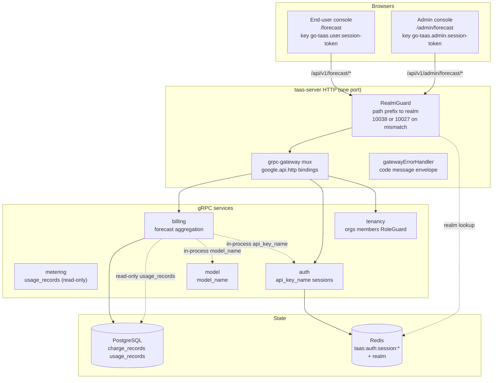
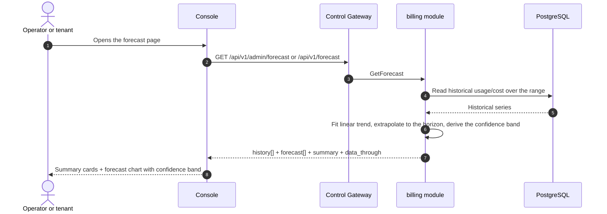

# Usage & Cost Forecasting — Architecture and Detailed Design

| Attribute | Content |
| --- | --- |
| Feature point | Usage & cost forecasting — predict future token usage and cost based on historical trends, with forecast charts and confidence bands (backlog row 36) |
| Document scope | Architecture and detailed design for feature-36: the `GetForecast` RPC on `BillingService` (dual-bound: admin fleet-wide and user tenant-scoped), the deterministic linear-trend forecast with a confidence band, the admin Forecast page (`/admin/forecast`) and the end-user Forecast page (`/forecast`), plus error handling, configuration, security, rollout, and function-level design per layer |
| Owning modules | `billing` (read-only forecast aggregation over `charge_records`/`usage_records` historical trends, plus the `GetForecast` RPC), `metering` (read-only: token totals from `usage_records`), `model` (read-only: `model_name` resolution), `auth` (read-only: `api_key_name` resolution, session realm, session active org), `tenancy` (RoleGuard, read-only), `pkg/server` gateway (admin-prefix and user-prefix bindings), console web app (admin `ForecastPage`, end-user `UserForecastPage`) |
| Related documents | [Requirement Analysis and UI/UX Design](../design/usage-cost-forecasting.md) · [Architecture Design](../design/architecture.md) §2.5 (`metering`), §2.6 (`billing`), §3.1 (admin/user surface separation) · [Cost Analytics Dashboard](./cost-analytics-dashboard.md) (the sibling read-only aggregation this feature extends with a forecast, and its range/bucket/freshness conventions) · [Usage Dashboards & Per-Request Cost Attribution](./usage-dashboard.md) (the sibling dashboard and its inline-SVG chart, freshness, range, and group-by conventions) · [Console Surface Separation](./console-surface-separation.md) (the two surfaces, the `AdminShell`/`UserShell` conventions, the masked-projection rule) |
| Status | Architecture complete, handed to the Developer agent |

---

## 1. Overview and Goals

The cost analytics dashboard (feature #29) answers *where is my money going, and how is cost trending?* — summary cards, a dimension breakdown, a cost trend, and cost-per-token over a time range. What it explicitly deferred is the forward-looking question: *what will my usage and cost be next week or next month?* The operator and the tenant both need to plan — capacity, budget, and quota — but the console has no forecast. AWS Cost Explorer's 18-month forecast was named out of scope in feature #29; this feature delivers it.

This feature adds a **usage & cost forecasting** surface: predict future token usage and cost based on historical trends, with forecast charts and confidence bands. It is a **read-only** aggregation layer — nothing in the inference, metering, or billing pipelines changes.

**Goals**:

- A `GetForecast` RPC returning the forecast for a time range and optional dimension filter: the historical series, the forecast series, and the confidence band, in a single call.
- A deterministic linear-trend forecast over the selected historical range, extrapolated forward to a bounded horizon (default 30 days, max 90 days).
- The horizon bounded relative to the history; the confidence band derived from the historical variance.
- Explicit freshness (`data_through` watermark).
- An admin Forecast page (`/admin/forecast`, fleet-wide) and an end-user Forecast page (`/forecast`, tenant-scoped).
- New error codes in a usage-cost-forecasting block (120xx).
- The page → route → API-prefix table with exact prefixes; per-page interactive states including empty, error, and permission-denied; numbered acceptance criteria testable in Nightwatch against the compose stack.

**Non-goals** (deferred, design §8): the cost analytics dashboard (#29); anomaly detection or threshold alerts (#26); a full time-series ML forecasting stack (deliberately absent, D3); comparing dimensions side-by-side in a chart (v1 shows a single-dimension forecast).

### 1.1 Reading order of this document

Section 2 records the architecture decisions (AD1–AD8, mirroring the design's D1–D8). Sections 3–5 are the component view, data model, and API design. Section 6 is the frontend architecture (page → route → API-prefix table for both consoles, auth guard per surface). Sections 7–8 are the sequence flows and error handling. Sections 9–11 are configuration, security, and rollout. Sections 12–14 are the acceptance-criteria traceability, the function-level detailed design, and the ordered implementation task list.

---

## 2. Architecture Decisions

| # | Decision | Rationale |
| --- | --- | --- |
| AD1 | **Forecasting lives on both surfaces**: the admin surface (`/admin/forecast`, `/api/v1/admin/forecast/*`) is a **fleet-wide forecast** (all orgs, models, keys), and the end-user surface (`/forecast`, `/api/v1/forecast/*`) is a **tenant-scoped forecast** (the caller's own org). Both are read-only | Design D1. The operator forecasts platform capacity and spend; the tenant forecasts its own budget and quota. The two-console split (feature #17) is binding, and both audiences need the planning surface |
| AD2 | **A new `GetForecast` RPC** returns the forecast for a time range and optional dimension filter: the historical series, the forecast series, and the confidence band, in a single call | Design D2. The forecast needs history + forecast + band at once; a dedicated RPC keeps the forecasting concern out of the cost-analytics surface and gives it one home |
| AD3 | **The forecast method is a deterministic linear trend** over the selected historical range, extrapolated forward to a bounded horizon (default 30 days, max 90 days). The response states the method and horizon | Design D3. A simple, deterministic extrapolation is enough for a planning surface and is testable; a heavy time-series ML stack is out of scope (pitfall). Stating the method keeps the forecast honest (pitfall) |
| AD4 | **The horizon is bounded relative to the history** — the forecast horizon cannot exceed the historical range length (e.g. a 30-day forecast needs at least 30 days of history; otherwise the horizon is clamped to the history length) | Design D4. An over-long horizon from short history is meaningless (pitfall); clamping keeps the extrapolation honest |
| AD5 | **The confidence band is derived from the historical variance** — the band widens with the forecast distance and the historical volatility, giving an upper/lower bound around the forecast line | Design D5. AWS and Datadog both show confidence bands (pattern 1); a variance-derived band communicates uncertainty without a heavy stack |
| AD6 | **Freshness is explicit** — every response carries `data_through` (the last complete bucket covered by the history) and the console shows a "data through `<time>`" note, reusing the cost-analytics convention | Design D6. The forecast is only as good as its history; the watermark keeps the freshness story honest (pitfall) |
| AD7 | **The forecast chart is inline SVG** — a historical line, a forecast line, and a shaded confidence band, with a metric switcher (Tokens / Cost) | Design D7. The console is deliberately dependency-light (usage-dashboard D7); a small, testable SVG chart matches the cost-analytics D6 decision |
| AD8 | **Forecasting is read-only and audited only for access** — it writes no data and mutates nothing; the pages are reachable only by authenticated sessions with the appropriate role | Design D8. The feature is a pure aggregation over existing data; the audit trail (feature #15) already covers the underlying charge-record writes. No new audit events are needed |

---

## 3. Component View

### 3.1 Ownership

| Layer / component | Owns | Changes in this feature |
| --- | --- | --- |
| **Control Gateway (`grpc-gateway`)** | HTTP/JSON facade for the `GetForecast` RPC on both prefixes; realm guard (feature #17) already rejects a wrong-realm session with 10038; passes `X-Organization-Id` through as gRPC metadata | New bindings for the two HTTP forecast RPCs (Section 5); no change to the realm guard |
| **`billing` module (`services/billing`)** | The read-only forecast aggregation over `charge_records`/`usage_records`, the `GetForecast` RPC, the dimension validation, the range validation, the linear-trend fit, the confidence band, the `data_through` watermark | New RPC on the existing `BillingService` (AD1, AD2) |
| **`metering` module** | `usage_records` (the token totals) | Read-only: the billing module reads `usage_records` over the shared database (AD1); no code change |
| **`model` module** | Model metadata (`model_id` → `model_name`) | Read-only: the billing module resolves `model_name` in-process (AD3) |
| **`auth` module** | API key identity (`api_key_id` → `api_key_name`), session realm, session active org | Read-only: the billing module resolves `api_key_name` in-process and the session active org for the user binding (AD1, AD9) |
| **`tenancy` module** | Organizations, members, roles, RoleGuard | Read-only: `RoleGuard` gates the admin forecast RPC by the caller's role (10036) |
| **PostgreSQL** | `charge_records`, `usage_records` (existing) | No new tables; the existing indexes serve the range scans (Section 4) |
| **Console** | Admin Forecast page and end-user Forecast page | Two new pages on the two surfaces (Section 6) |

### 3.2 Runtime component view



### 3.3 Request identity chain

The forecast RPC is **dual-bound** (AD1). The chain is:

1. `RealmGuard` (HTTP, `pkg/server/realm.go`) — path prefix decides the expected realm. `/api/v1/admin/forecast/*` expects `admin`; `/api/v1/forecast/*` expects `user`. With no `Authorization` header: pass through (transitional, feature-17 AD4). With a header: resolve the session realm from Redis; mismatch → 10038, unknown/expired/realm-less → 10027.
2. grpc-gateway mux — routes by the annotated path and forwards `authorization` and `x-organization-id`.
3. Service handler — the admin binding is fleet-wide by default (all orgs, models, keys), with an optional `organization_id` filter read from `X-Organization-Id`; the user binding is hard-scoped to the caller's org (session active org authoritative, `X-Organization-Id` ignored).
4. `tenancy.RoleGuard` — gates the admin forecast RPC by the caller's role (10036). The permission-denied state (design FR5.1, AC9) is produced by the role check.

---

## 4. Data Model

### 4.1 No New Tables

The forecasting feature is a pure read-only aggregation over the existing `charge_records` and `usage_records` (AD1, design D8). No new tables, no new MQ subjects, no new runners, and no writes on any path. The existing indexes on `charge_records` and `usage_records` serve the range scans.

---

## 5. API Design

### 5.1 RPC Surface

One new RPC on `taas.billing.v1.BillingService`, dual-bound on **both** prefixes: `/api/v1/admin/forecast/*` (admin, fleet-wide) and `/api/v1/forecast/*` (user, tenant-scoped) (AD1).

| Service | RPC | HTTP | Status | Purpose |
| --- | --- | --- | --- | --- |
| `taas.billing.v1` | `GetForecast` | `GET /api/v1/admin/forecast` · `GET /api/v1/forecast` | **new** | Historical series + forecast series + confidence band (admin: fleet; user: tenant-scoped) |

### 5.2 Proto Messages

```proto
// billing.proto (additive)

// GetForecast returns the forecast for a time range and optional
// dimension filter: the historical series, the forecast series, and the
// confidence band. The admin binding is fleet-wide; the user binding is
// tenant-scoped.
// Admin-surface API: served under /api/v1/admin.
// User-surface API: served under /api/v1.
rpc GetForecast(GetForecastRequest) returns (GetForecastResponse) {
  option (google.api.http) = {
    get: "/api/v1/admin/forecast"
    additional_bindings: {
      get: "/api/v1/forecast"
    }
  };
}

message GetForecastRequest {
  // since / until are unix seconds; defaults until = now, since = until - 30d.
  int64 since = 1;
  int64 until = 2;
  // dimension is one of organization/model/api_key (admin) or
  // model/api_key (user).
  string dimension = 3;
  // dimension_value is optional; when empty the forecast spans the whole
  // dimension.
  string dimension_value = 4;
  // horizon_days defaults to 30, max 90.
  int32 horizon_days = 5;
}

message ForecastBucket {
  int64 bucket = 1;
  int64 total_tokens = 2;
  int64 total_cost_cents = 3;
}

message ForecastPoint {
  int64 bucket = 1;
  int64 total_tokens = 2;
  int64 total_cost_cents = 3;
  int64 lower_tokens = 4;
  int64 upper_tokens = 5;
  int64 lower_cost_cents = 6;
  int64 upper_cost_cents = 7;
}

message ForecastSummary {
  int64 total_tokens = 1;
  int64 total_cost_cents = 2;
}

message GetForecastResponse {
  taas.common.v1.Response response = 1;
  // method is the forecast method, always "linear_trend".
  string method = 2;
  int32 horizon_days = 3;
  // data_through is the last complete bucket covered by the history.
  int64 data_through = 4;
  repeated ForecastBucket history = 5;
  repeated ForecastPoint forecast = 6;
  ForecastSummary summary = 7;
}
```

### 5.3 Wire Format (established conventions)

- Query parameters bind by name (`since`, `until`, `dimension`, `dimension_value`, `horizon_days`).
- Success responses are HTTP 200 (grpc-gateway default for unary RPCs).
- Business errors render as `{"code": <int>, "message": "..."}` with HTTP 500 for out-of-range codes (platform-wide status quo).
- int64 fields serialize as JSON strings.

### 5.4 Validation Matrix

`GetForecast` validates, in order:

| # | Check | Failure code | Canonical message |
| --- | --- | --- | --- |
| 1 | `since`/`until` form a valid range (`since <= until`, range ≤ 92 days) | 10404 `CodeMeteringRangeInvalid` | metering range invalid |
| 2 | `dimension` is supported for the surface (`organization`/`model`/`api_key` on admin; `model`/`api_key` on user) | 11301 `CodeCostDimensionInvalid` | cost dimension invalid |
| 3 | `dimension_value` (when present) exists | 11302 `CodeCostDimensionValueNotFound` | cost dimension value not found |
| 4 | `horizon_days` ≤ 90 | 10404 `CodeMeteringRangeInvalid` | metering range invalid |

### 5.5 Forecast Algorithm

The forecast is a deterministic linear trend (AD3):

1. **Bucketing**: hourly buckets for ranges ≤ 7 days, daily buckets for ranges > 7 days (the cost-analytics AD6 convention). Each bucket carries `total_tokens` and `total_cost_cents`.
2. **Linear fit**: fit a least-squares linear trend to the historical `total_tokens` and `total_cost_cents` series over the selected range.
3. **Horizon**: extrapolate forward to `horizon_days` (default 30, max 90), clamped to the historical range length when it exceeds it (AD4).
4. **Confidence band**: derive the band from the historical variance — the band widens with the forecast distance and the historical volatility (AD5). The Developer agent must implement a deterministic formula (e.g. a standard-error-based band scaled by the forecast distance) so the FVT can assert the band widens with distance and volatility.
5. **Freshness**: `data_through` is the last complete bucket covered by the history (AD6).

---

## 6. Frontend Architecture

### 6.1 Page → Route → API-Prefix Table

| Page | Surface | Web route | API prefix |
| --- | --- | --- | --- |
| Forecast page | admin | `/admin/forecast` | `/api/v1/admin/forecast/*` |
| Forecast page | end-user | `/forecast` | `/api/v1/forecast/*` |

Every page and API call is on its own surface: the admin page calls only `/api/v1/admin/forecast/*`, the end-user page only `/api/v1/forecast/*`. Admin pages never call a `/api/v1/*` route, and end-user pages never call a `/api/v1/admin/*` route (feature #17).

### 6.2 Navigation Placement

The Forecast page is a top-level nav item on both surfaces: admin "Forecast" under the operations group, end-user "Forecast" under the usage group. Both render inside their respective shells (`AdminShell` / `UserShell`, feature #17).

### 6.3 Shared Components and State

- `AdminShell` / `UserShell` (feature #17) — the page shells, session guards, and permission-denied states.
- The shared time-range preset control (24 h / 7 d / 30 d / custom) from the Usage/Observability pages.
- The inline-SVG chart component (the cost-analytics AD7 / usage-dashboard AD8 pattern) with a metric switcher.
- Standard dropdown, card, and skeleton components from the existing pages.

### 6.4 Auth Guard per Surface

The admin page is admin-surface; the end-user page is end-user surface. The `RealmGuard` (feature #17) rejects a wrong-realm session with 10038 and an unknown/expired/realm-less session with 10027. `tenancy.RoleGuard` gates the admin RPC by the caller's role (10036). The pages' permission-denied handling is the standard feature-17 state.

### 6.5 Page: `/admin/forecast` — Forecast (admin)

**Purpose**: give the platform operator a fleet-wide forecast of token usage and cost — the historical trend, the forecast line, and the confidence band — to plan capacity and spend.

**Layout**: rendered inside `AdminShell`. A page header ("Forecast", subtitle "Predicted token usage and cost") with a **Refresh** action (secondary). Below:

1. **Filter bar** — a **Time range** control (presets 24 h / 7 d / 30 d / custom), a **Dimension** control (dropdown: Organization / Model / API key; default Organization), a **Dimension value** filter (dropdown, shown when a dimension is selected), and a **Horizon** control (7 / 30 / 90 days; default 30).
2. **Summary cards** — a row of cards: **Forecast tokens** (over the horizon), **Forecast cost**, **Confidence** (the band width at the horizon), and a "data through `<time>`" freshness note (AD6).
3. **Forecast chart** — an inline-SVG chart (AD7) with a **metric switcher** (Tokens / Cost): a historical line, a forecast line, and a shaded confidence band.

**Interactive states**:

| State | Behaviour |
| --- | --- |
| Default | Filter bar + summary cards + forecast chart render from the first successful load; last-updated shows the load time |
| Loading | Skeleton chart; Refresh is disabled |
| Empty | "No usage data to forecast from." with a hint to widen the range; the filter bar stays visible |
| Error | An error banner with the message and a Retry button; the page keeps its last good data with a "Showing stale data" banner |
| Disabled | Refresh is disabled while a load is in flight; the Horizon control is disabled while a load is in flight |
| Permission-denied | A session without the required role receives 10036 and the page shows the standard permission-denied state (feature #17) with a link back to the admin home |

**Filter bar controls**: Time range (shared preset control), Dimension (Organization / Model / API key), Dimension value (dropdown, shown when a dimension is selected), Horizon (7 / 30 / 90 days). Changing any refetches.

**Summary cards**: Forecast tokens, Forecast cost, Confidence (band width at the horizon), and a "data through `<time>`" freshness note.

**Forecast chart**: inline SVG with a metric switcher (Tokens / Cost); a historical line, a forecast line, and a shaded confidence band.

### 6.6 Page: `/forecast` — Forecast (end-user)

**Purpose**: give a tenant finance / capacity planner a forecast of their own token usage and cost — the historical trend, the forecast line, and the confidence band — to plan budget and quota.

**Layout**: rendered inside `UserShell`. A page header ("Forecast", subtitle "Predicted token usage and cost") with a **Refresh** action (secondary). Below:

1. **Filter bar** — a **Time range** control (presets 24 h / 7 d / 30 d / custom), a **Dimension** control (dropdown: Model / API key; default Model), a **Dimension value** filter (dropdown, shown when a dimension is selected), and a **Horizon** control (7 / 30 / 90 days; default 30).
2. **Summary cards** — a row of cards: **Forecast tokens**, **Forecast cost**, **Confidence**, and a "data through `<time>`" freshness note.
3. **Forecast chart** — the inline-SVG chart with the metric switcher, scoped to the tenant's own usage.

**Interactive states**: identical to §6.5, with the empty copy "No usage data to forecast from." and the permission-denied copy for the tenant's own errors (10005 org gone / 10017 org disabled from feature #17 §8.2). The page exposes no service ids or operator internals (AD1).

---

## 7. Sequence Flows

### 7.1 Load the forecast



---

## 8. Error Handling

| Condition | Code | Constant | Notes |
| --- | --- | --- | --- |
| A malformed or over-long range | 10404 | `CodeMeteringRangeInvalid` | Reused — the metering range contract (FR1.3) |
| Unsupported `dimension` | 11301 | `CodeCostDimensionInvalid` | Reused from cost analytics (FR1.3) |
| Unknown dimension value | 11302 | `CodeCostDimensionValueNotFound` | Reused from cost analytics (FR1.3) |
| `horizon_days` > 90 | 10404 | `CodeMeteringRangeInvalid` | Reused for the horizon validation (FR1.3) |
| Wrong-realm session | 10038 | `CodeRealmMismatch` | gateway realm guard |
| Unknown/expired/realm-less session | 10027 | `CodeSessionInvalid` | gateway realm guard |
| Insufficient role | 10036 | `CodeForbidden` | `tenancy.RoleGuard` |

The design doc allocates a **usage-cost-forecasting error block 120xx** for this feature. The existing codes above (10404/11301/11302) already cover every failure mode the design names; the 120xx block is reserved for any future forecasting-specific code the Developer agent needs. If a new code is required, it must be added to `pkg/errors/codes.go` in the 120xx block with a comment naming this feature.

---

## 9. Configuration

New configuration in the `billing` section of `pkg/config`:

| Key | Default | Description |
| --- | --- | --- |
| `billing.forecast.horizon_default_days` | 30 | Default `horizon_days` |
| `billing.forecast.horizon_max_days` | 90 | Maximum `horizon_days` |
| `billing.forecast.range_max_days` | 92 | Maximum range length (reuses the metering range contract) |

---

## 10. Security Considerations

- **Dual-surface with correct scoping** (AD1): the admin binding is fleet-wide and gated by `RoleGuard` (10036); the user binding is hard-scoped to the caller's org and exposes no service ids or operator internals.
- **Read-only** (AD8): the feature writes no data and mutates nothing; no new audit events are needed.
- **Masked projection** (AD1): the end-user forecast exposes only the tenant's own usage and cost, never other tenants' data or operator internals.

---

## 11. Rollout / Upgrade Notes

- No schema changes; no new tables.
- The new RPC binds under both prefixes; the realm guard already treats each prefix as its surface.
- The feature is additive; existing deployments and pages are unaffected.

---

## 12. Acceptance-Criteria Traceability

| AC | Design | Architecture section | Level |
| --- | --- | --- | --- |
| AC1 | `GetForecast` with a valid range returns method/horizon_days/data_through/history[]/forecast[] (with the confidence band)/summary; a range > 92 days or since > until returns 10404 | §5.1, §5.2, §5.4 | FVT |
| AC2 | `GetForecast` with an unsupported dimension returns 11301, an unknown dimension value returns 11302, and horizon_days > 90 returns a validation error | §5.1, §5.4 | FVT |
| AC3 | The horizon is clamped to the historical range length when it exceeds it; the confidence band widens with the forecast distance and the historical volatility | §5.5 | FVT |
| AC4 | `/admin/forecast` renders filter bar, summary cards, and forecast chart (historical line + forecast line + confidence band) from first load with a last-updated timestamp | §6.5 | E2E |
| AC5 | Changing time range/dimension/dimension value/horizon refetches and re-renders cards and chart; the metric switcher toggles the chart metric (Tokens / Cost) | §6.5 | E2E |
| AC6 | The empty state ("No usage data to forecast from.") renders when no data matches; a failed load keeps the last good data with a "Showing stale data" banner and a Retry action | §6.5 | E2E |
| AC7 | `/forecast` renders the tenant's own forecast with no service ids or operator internals visible | §6.6 | E2E |
| AC8 | The forecast pages are reachable only on their own surfaces: admin route `/admin/forecast` calls only `/api/v1/admin/forecast/*`, end-user route `/forecast` calls only `/api/v1/forecast/*`, with no cross-prefix string | §6.1 | E2E (surface separation) |
| AC9 | A session without the required role receives 10036 on the forecast pages and the page shows the standard permission-denied state | §6.4, §8 | E2E |

---

## 13. Function-Level Detailed Design

### 13.1 `billing` module (`services/billing`)

| File | Function | Responsibility |
| --- | --- | --- |
| `service.go` | `GetForecast(ctx, req)` | Validate `since`/`until` (10404), `dimension` (11301), `dimension_value` (11302), `horizon_days` (10404); resolve the scope (admin fleet-wide or user tenant-scoped); read the historical series; fit the linear trend; extrapolate to the horizon; derive the confidence band; build the response |
| `forecast.go` (new) | `readHistory(ctx, scope, since, until)` | Read `charge_records`/`usage_records` over the range, bucketed hourly (≤ 7 days) or daily (> 7 days), returning `total_tokens` and `total_cost_cents` per bucket |
| | `fitLinearTrend(history)` | Fit a least-squares linear trend to the historical series (AD3) |
| | `extrapolate(trend, horizonDays, historyLen)` | Extrapolate forward to the horizon, clamped to the history length (AD4) |
| | `deriveConfidenceBand(history, forecast)` | Derive the band from the historical variance, widening with the forecast distance and volatility (AD5) |
| | `computeDataThrough(history)` | Return the last complete bucket covered by the history (AD6) |

### 13.2 `web` console

| File | Page | Responsibility |
| --- | --- | --- |
| `pages/ForecastPage.tsx` | `/admin/forecast` | Filter bar (time range/dimension/dimension value/horizon), summary cards, inline-SVG forecast chart with metric switcher (AD7) |
| `pages/user/UserForecastPage.tsx` | `/forecast` | Same, tenant-scoped (AD1) |
| `App.tsx` / `router.tsx` | route registration | Register `/admin/forecast` on the admin surface and `/forecast` on the end-user surface |

---

## 14. Ordered Implementation Task List

1. `pkg/errors/codes.go` — reserve the 120xx block comment for usage-cost-forecasting (no new code needed unless a failure mode requires it).
2. `proto/taas/billing/v1/billing.proto` — add `GetForecast` RPC and messages; regenerate.
3. `services/billing/forecast.go` — `readHistory`, `fitLinearTrend`, `extrapolate`, `deriveConfidenceBand`, `computeDataThrough`.
4. `services/billing/service.go` — `GetForecast`.
5. `pkg/config` — the `billing.forecast` section.
6. `web/src/pages/ForecastPage.tsx` and `web/src/pages/user/UserForecastPage.tsx` — the pages; register the routes.
7. FVT + E2E tests for AC1–AC9.