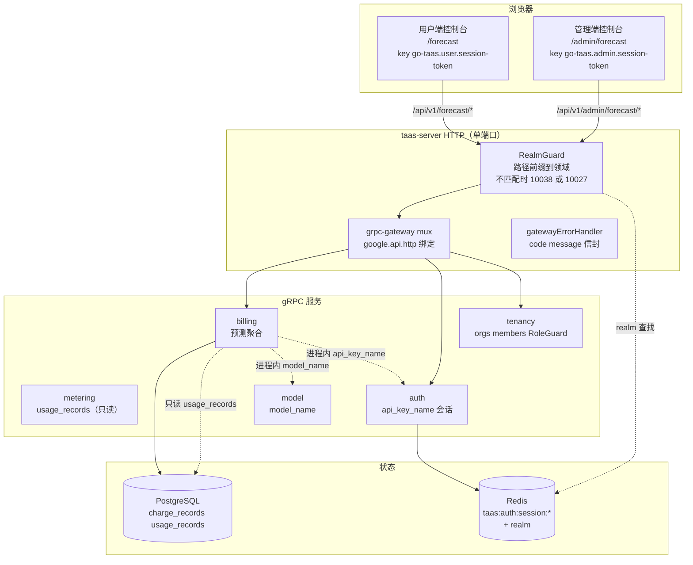
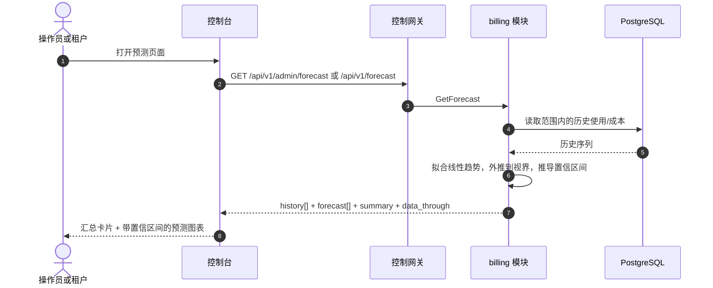

# 使用与成本预测 —— 架构与详细设计

| 属性 | 内容 |
| --- | --- |
| 功能点 | 使用与成本预测 —— 基于历史趋势预测未来的令牌用量与成本，带预测图表与置信区间（backlog 第 36 行） |
| 文档范围 | 功能点 36 的架构与详细设计：`BillingService` 上的 `GetForecast` RPC（双绑定：管理端全平台与用户端租户范围）、带置信区间的确定性线性趋势预测、管理端预测页面（`/admin/forecast`）与用户端预测页面（`/forecast`），以及错误处理、配置、安全、上线与各层函数级设计 |
| 所属模块 | `billing`（对 `charge_records`/`usage_records` 历史趋势的只读预测聚合，以及 `GetForecast` RPC）、`metering`（只读：来自 `usage_records` 的令牌总量）、`model`（只读：`model_name` 解析）、`auth`（只读：`api_key_name` 解析、会话领域、会话活动组织）、`tenancy`（RoleGuard，只读）、`pkg/server` 网关（管理端前缀与用户端前缀绑定）、控制台 web 应用（管理端 `ForecastPage`、用户端 `UserForecastPage`） |
| 相关文档 | [需求分析与 UI/UX 设计](../design/usage-cost-forecasting.md) · [架构设计](../design/architecture.md) §2.5（`metering`）、§2.6（`billing`）、§3.1（管理端/用户端分离）· [成本分析仪表盘](./cost-analytics-dashboard.md)（本功能用预测扩展的同级只读聚合，及其范围/桶/新鲜度约定）· [使用仪表盘与每请求成本归属](./usage-dashboard.md)（同级仪表盘及其内联 SVG 图表、新鲜度、范围与分组约定）· [控制台表面分离](./console-surface-separation.md)（两个表面、`AdminShell`/`UserShell` 约定、掩码投影规则） |
| 状态 | 架构完成，已移交给开发智能体 |

---

## 1. 概述与目标

成本分析仪表盘（功能点 #29）回答*我的钱花到哪里去了，成本趋势如何？* —— 汇总卡片、维度分解、成本趋势与一段时间范围内的每令牌成本。它明确延后的是前瞻性问题：*下周或下个月我的使用与成本会是多少？* 操作员与租户都需要规划 —— 容量、预算与配额 —— 但控制台没有预测。AWS Cost Explorer 的 18 个月预测在功能点 #29 中被列为超出范围；本功能交付它。

本功能新增**使用与成本预测**表面：基于历史趋势预测未来的令牌用量与成本，带预测图表与置信区间。它是**只读**聚合层 —— 推理、计量或计费管道中没有任何变化。

**目标**：

- 一个 `GetForecast` RPC，返回一段时间范围与可选维度过滤的预测：历史序列、预测序列与置信区间，单次调用。
- 对所选历史范围进行确定性线性趋势预测，外推到有界视界（默认 30 天，最大 90 天）。
- 视界相对于历史有界；置信区间由历史方差推导。
- 显式新鲜度（`data_through` 水印）。
- 一个管理端预测页面（`/admin/forecast`，全平台）与一个用户端预测页面（`/forecast`，租户范围）。
- 使用与成本预测错误块（120xx）中的新错误码。
- 页面 → 路由 → API 前缀表，带精确前缀；包括空、错误、权限拒绝在内的各页面交互状态；可在 compose 栈上通过 Nightwatch 测试的编号验收标准。

**非目标**（延后，设计 §8）：成本分析仪表盘（#29）；异常检测或阈值告警（#26）；完整时间序列 ML 预测栈（刻意缺失，D3）；在图表中并排比较维度（v1 显示单维度预测）。

### 1.1 本文档阅读顺序

第 2 节记录架构决策（AD1–AD8，对应设计的 D1–D8）。第 3–5 节是组件视图、数据模型与 API 设计。第 6 节是前端架构（两个控制台的页面 → 路由 → API 前缀表、各表面认证守卫）。第 7–8 节是时序流程与错误处理。第 9–11 节是配置、安全与上线。第 12–14 节是验收标准可追溯性、函数级详细设计与有序实现任务清单。

---

## 2. 架构决策

| # | 决策 | 理由 |
| --- | --- | --- |
| AD1 | **预测存在于两个表面**：管理端表面（`/admin/forecast`、`/api/v1/admin/forecast/*`）是**全平台预测**（所有组织、模型、密钥），用户端表面（`/forecast`、`/api/v1/forecast/*`）是**租户范围预测**（调用者自己的组织）。两者都是只读的 | 设计 D1。操作员预测平台容量与支出；租户预测自己的预算与配额。双控制台分离（功能点 #17）是强制的，两个受众都需要规划表面 |
| AD2 | **新增 `GetForecast` RPC**，返回一段时间范围与可选维度过滤的预测：历史序列、预测序列与置信区间，单次调用 | 设计 D2。预测需要一次获得历史 + 预测 + 区间；专用 RPC 将预测关注点排除在成本分析表面之外，并给它一个归属 |
| AD3 | **预测方法是确定性线性趋势**，对所选历史范围进行，外推到有界视界（默认 30 天，最大 90 天）。响应声明方法与视界 | 设计 D3。简单、确定性的外推对规划表面足够且可测试；重型时间序列 ML 栈超出范围（陷阱）。声明方法使预测诚实（陷阱） |
| AD4 | **视界相对于历史有界** —— 预测视界不能超过历史范围长度（如 30 天预测需要至少 30 天历史；否则视界被钳制到历史长度） | 设计 D4。从短历史得出过长视界无意义（陷阱）；钳制使外推诚实 |
| AD5 | **置信区间由历史方差推导** —— 区间随预测距离与历史波动性加宽，在预测线周围给出上/下界 | 设计 D5。AWS 与 Datadog 都显示置信区间（模式 1）；方差推导的区间无需重型栈即可传达不确定性 |
| AD6 | **新鲜度是显式的** —— 每个响应携带 `data_through`（历史覆盖的最后一个完整桶），控制台显示"数据截至 `<time>`"注释，复用成本分析约定 | 设计 D6。预测的好坏取决于其历史；水印使新鲜度故事诚实（陷阱） |
| AD7 | **预测图表是内联 SVG** —— 历史线、预测线与阴影置信区间，带指标切换器（令牌/成本） | 设计 D7。控制台刻意依赖轻（usage-dashboard D7）；小型、可测试的 SVG 图表匹配 cost-analytics D6 决策 |
| AD8 | **预测是只读的，仅对访问进行审计** —— 它不写入任何数据也不变更任何内容；页面仅可由带适当角色的已认证会话访问 | 设计 D8。该功能是对现有数据的纯聚合；审计轨迹（功能点 #15）已覆盖底层计费记录写入。无需新审计事件 |

---

## 3. 组件视图

### 3.1 职责归属

| 层 / 组件 | 拥有 | 本功能的变更 |
| --- | --- | --- |
| **控制网关（`grpc-gateway`）** | 两个前缀上 `GetForecast` RPC 的 HTTP/JSON 门面；领域守卫（功能点 #17）已用 10038 拒绝错误领域的会话；将 `X-Organization-Id` 作为 gRPC 元数据传递 | 两个 HTTP 预测 RPC 的新绑定（第 5 节）；领域守卫无变更 |
| **`billing` 模块（`services/billing`）** | 对 `charge_records`/`usage_records` 的只读预测聚合、`GetForecast` RPC、维度校验、范围校验、线性趋势拟合、置信区间、`data_through` 水印 | 现有 `BillingService` 上的新 RPC（AD1、AD2） |
| **`metering` 模块** | `usage_records`（令牌总量） | 只读：billing 模块通过共享数据库读取 `usage_records`（AD1）；无代码变更 |
| **`model` 模块** | 模型元数据（`model_id` → `model_name`） | 只读：billing 模块在进程内解析 `model_name`（AD3） |
| **`auth` 模块** | API 密钥身份（`api_key_id` → `api_key_name`）、会话领域、会话活动组织 | 只读：billing 模块在进程内解析 `api_key_name`，并为用户绑定解析会话活动组织（AD1、AD9） |
| **`tenancy` 模块** | 组织、成员、角色、RoleGuard | 只读：`RoleGuard` 按调用者角色门控管理端预测 RPC（10036） |
| **PostgreSQL** | `charge_records`、`usage_records`（现有） | 无新表；现有索引服务范围扫描（第 4 节） |
| **控制台** | 管理端预测页面与用户端预测页面 | 两个表面上的两个新页面（第 6 节） |

### 3.2 运行时组件视图



### 3.3 请求身份链

预测 RPC 是**双绑定**（AD1）。链路为：

1. `RealmGuard`（HTTP，`pkg/server/realm.go`）—— 路径前缀决定期望领域。`/api/v1/admin/forecast/*` 期望 `admin`；`/api/v1/forecast/*` 期望 `user`。无 `Authorization` 头：放行（过渡期，功能点-17 AD4）。有头：从 Redis 解析会话领域；不匹配 → 10038，未知/过期/无领域 → 10027。
2. grpc-gateway mux —— 按注解路径路由并转发 `authorization` 与 `x-organization-id`。
3. 服务处理器 —— 管理端绑定默认全平台（所有组织、模型、密钥），带从 `X-Organization-Id` 读取的可选 `organization_id` 过滤；用户绑定硬性限定到调用者的组织（会话活动组织权威，忽略 `X-Organization-Id`）。
4. `tenancy.RoleGuard` —— 按调用者角色门控管理端预测 RPC（10036）。权限拒绝状态（设计 FR5.1、AC9）由角色检查产生。

---

## 4. 数据模型

### 4.1 无新表

预测功能是对现有 `charge_records` 与 `usage_records` 的纯只读聚合（AD1、设计 D8）。无新表、无新 MQ 主题、无新 runner、任何路径上无写入。`charge_records` 与 `usage_records` 上的现有索引服务范围扫描。

---

## 5. API 设计

### 5.1 RPC 表面

`taas.billing.v1.BillingService` 上一个新 RPC，在**两个**前缀上双绑定：`/api/v1/admin/forecast/*`（管理端，全平台）与 `/api/v1/forecast/*`（用户端，租户范围）（AD1）。

| 服务 | RPC | HTTP | 状态 | 用途 |
| --- | --- | --- | --- | --- |
| `taas.billing.v1` | `GetForecast` | `GET /api/v1/admin/forecast` · `GET /api/v1/forecast` | **新** | 历史序列 + 预测序列 + 置信区间（管理端：全平台；用户端：租户范围） |

### 5.2 Proto 消息

```proto
// billing.proto（加性）

// GetForecast 返回一段时间范围与可选维度过滤的预测：历史序列、预测序列与置信区间。
// 管理端绑定是全平台的；用户端绑定是租户范围的。
// 管理端表面 API：在 /api/v1/admin 下提供。
// 用户端表面 API：在 /api/v1 下提供。
rpc GetForecast(GetForecastRequest) returns (GetForecastResponse) {
  option (google.api.http) = {
    get: "/api/v1/admin/forecast"
    additional_bindings: {
      get: "/api/v1/forecast"
    }
  };
}

message GetForecastRequest {
  // since / until 是 unix 秒；默认 until = now，since = until - 30d。
  int64 since = 1;
  int64 until = 2;
  // dimension 是 organization/model/api_key（管理端）或 model/api_key（用户端）之一。
  string dimension = 3;
  // dimension_value 可选；为空时预测跨整个维度。
  string dimension_value = 4;
  // horizon_days 默认 30，最大 90。
  int32 horizon_days = 5;
}

message ForecastBucket {
  int64 bucket = 1;
  int64 total_tokens = 2;
  int64 total_cost_cents = 3;
}

message ForecastPoint {
  int64 bucket = 1;
  int64 total_tokens = 2;
  int64 total_cost_cents = 3;
  int64 lower_tokens = 4;
  int64 upper_tokens = 5;
  int64 lower_cost_cents = 6;
  int64 upper_cost_cents = 7;
}

message ForecastSummary {
  int64 total_tokens = 1;
  int64 total_cost_cents = 2;
}

message GetForecastResponse {
  taas.common.v1.Response response = 1;
  // method 是预测方法，始终为 "linear_trend"。
  string method = 2;
  int32 horizon_days = 3;
  // data_through 是历史覆盖的最后一个完整桶。
  int64 data_through = 4;
  repeated ForecastBucket history = 5;
  repeated ForecastPoint forecast = 6;
  ForecastSummary summary = 7;
}
```

### 5.3 线上格式（既定约定）

- 查询参数按名称绑定（`since`、`until`、`dimension`、`dimension_value`、`horizon_days`）。
- 成功响应为 HTTP 200（grpc-gateway 对一元 RPC 的默认）。
- 业务错误渲染为 `{"code": <int>, "message": "..."}`，越界码为 HTTP 500（平台现状）。
- int64 字段序列化为 JSON 字符串。

### 5.4 校验矩阵

`GetForecast` 按顺序校验：

| # | 检查 | 失败码 | 规范消息 |
| --- | --- | --- | --- |
| 1 | `since`/`until` 构成有效范围（`since <= until`，范围 ≤ 92 天） | 10404 `CodeMeteringRangeInvalid` | metering range invalid |
| 2 | `dimension` 对该表面受支持（管理端为 `organization`/`model`/`api_key`；用户端为 `model`/`api_key`） | 11301 `CodeCostDimensionInvalid` | cost dimension invalid |
| 3 | `dimension_value`（存在时）存在 | 11302 `CodeCostDimensionValueNotFound` | cost dimension value not found |
| 4 | `horizon_days` ≤ 90 | 10404 `CodeMeteringRangeInvalid` | metering range invalid |

### 5.5 预测算法

预测是确定性线性趋势（AD3）：

1. **分桶**：范围 ≤ 7 天时按小时桶，范围 > 7 天时按天桶（cost-analytics AD6 约定）。每个桶携带 `total_tokens` 与 `total_cost_cents`。
2. **线性拟合**：对所选范围内的历史 `total_tokens` 与 `total_cost_cents` 序列拟合最小二乘线性趋势。
3. **视界**：外推到 `horizon_days`（默认 30，最大 90），超过历史范围长度时钳制到历史长度（AD4）。
4. **置信区间**：从历史方差推导区间 —— 区间随预测距离与历史波动性加宽（AD5）。开发智能体必须实现确定性公式（如基于标准误差、按预测距离缩放的区间），使 FVT 能断言区间随距离与波动性加宽。
5. **新鲜度**：`data_through` 是历史覆盖的最后一个完整桶（AD6）。

---

## 6. 前端架构

### 6.1 页面 → 路由 → API 前缀表

| 页面 | 表面 | Web 路由 | API 前缀 |
| --- | --- | --- | --- |
| 预测页面 | admin | `/admin/forecast` | `/api/v1/admin/forecast/*` |
| 预测页面 | end-user | `/forecast` | `/api/v1/forecast/*` |

每个页面和 API 调用都在自己的表面上：管理端页面仅调用 `/api/v1/admin/forecast/*`，用户端页面仅调用 `/api/v1/forecast/*`。管理端页面从不调用 `/api/v1/*` 路由，用户端页面从不调用 `/api/v1/admin/*` 路由（功能点 #17）。

### 6.2 导航位置

预测页面是两个表面上的顶层导航项：管理端"预测"在操作组下，用户端"预测"在使用组下。两者都在各自的外壳（`AdminShell` / `UserShell`，功能点 #17）内渲染。

### 6.3 共享组件与状态

- `AdminShell` / `UserShell`（功能点 #17）—— 页面外壳、会话守卫与权限拒绝状态。
- 来自使用/可观测性页面的共享时间范围预设控件（24 小时 / 7 天 / 30 天 / 自定义）。
- 带指标切换器的内联 SVG 图表组件（cost-analytics AD7 / usage-dashboard AD8 模式）。
- 来自现有页面的标准下拉、卡片与骨架组件。

### 6.4 各表面认证守卫

管理端页面是管理端表面；用户端页面是用户端表面。`RealmGuard`（功能点 #17）用 10038 拒绝错误领域的会话，用 10027 拒绝未知/过期/无领域会话。`tenancy.RoleGuard` 按调用者角色门控管理端 RPC（10036）。页面的权限拒绝处理是标准的功能点-17 状态。

### 6.5 页面：`/admin/forecast` —— 预测（admin）

**用途**：为平台操作员提供令牌用量与成本的全平台预测 —— 历史趋势、预测线与置信区间 —— 以规划容量与支出。

**布局**：在 `AdminShell` 内渲染。页面头部（"预测"，副标题"预测的令牌用量与成本"），带**刷新**操作（次要）。下方：

1. **过滤栏** —— **时间范围**控件（预设 24 小时 / 7 天 / 30 天 / 自定义）、**维度**控件（下拉：组织/模型/API 密钥；默认组织）、**维度值**过滤（下拉，选择维度时显示）与**视界**控件（7 / 30 / 90 天；默认 30）。
2. **汇总卡片** —— 一行卡片：**预测令牌**（视界内）、**预测成本**、**置信度**（视界处的区间宽度）与"数据截至 `<time>`"新鲜度注释（AD6）。
3. **预测图表** —— 带**指标切换器**（令牌/成本）的内联 SVG 图表（AD7）：历史线、预测线与阴影置信区间。

**交互状态**：

| 状态 | 行为 |
| --- | --- |
| 默认 | 过滤栏 + 汇总卡片 + 预测图表在首次成功加载时渲染；最后更新显示加载时间 |
| 加载中 | 骨架图表；刷新被禁用 |
| 空 | "没有可预测的使用数据。"并提示加宽范围；过滤栏保持可见 |
| 错误 | 带消息的错误横幅与重试按钮；页面保留最后的好数据并显示"显示过期数据"横幅 |
| 禁用 | 加载进行中时刷新被禁用；加载进行中时视界控件被禁用 |
| 权限拒绝 | 无所需角色的会话收到 10036，页面显示标准权限拒绝状态（功能点 #17），带返回管理端首页的链接 |

**过滤栏控件**：时间范围（共享预设控件）、维度（组织/模型/API 密钥）、维度值（下拉，选择维度时显示）、视界（7 / 30 / 90 天）。更改任一重新获取。

**汇总卡片**：预测令牌、预测成本、置信度（视界处的区间宽度）与"数据截至 `<time>`"新鲜度注释。

**预测图表**：带指标切换器（令牌/成本）的内联 SVG；历史线、预测线与阴影置信区间。

### 6.6 页面：`/forecast` —— 预测（end-user）

**用途**：为租户财务/容量规划者提供其自身令牌用量与成本的预测 —— 历史趋势、预测线与置信区间 —— 以规划预算与配额。

**布局**：在 `UserShell` 内渲染。页面头部（"预测"，副标题"预测的令牌用量与成本"），带**刷新**操作（次要）。下方：

1. **过滤栏** —— **时间范围**控件（预设 24 小时 / 7 天 / 30 天 / 自定义）、**维度**控件（下拉：模型/API 密钥；默认模型）、**维度值**过滤（下拉，选择维度时显示）与**视界**控件（7 / 30 / 90 天；默认 30）。
2. **汇总卡片** —— 一行卡片：**预测令牌**、**预测成本**、**置信度**与"数据截至 `<time>`"新鲜度注释。
3. **预测图表** —— 带指标切换器的内联 SVG 图表，限定到租户自己的使用。

**交互状态**：与 §6.5 相同，空文案为"没有可预测的使用数据。"，权限拒绝文案为租户自己的错误（功能点 #17 §8.2 的 10005 组织消失 / 10017 组织禁用）。页面不暴露任何服务 id 或操作员内部信息（AD1）。

---

## 7. 时序流程

### 7.1 加载预测



---

## 8. 错误处理

| 条件 | 码 | 常量 | 说明 |
| --- | --- | --- | --- |
| 格式错误或过长的范围 | 10404 | `CodeMeteringRangeInvalid` | 复用 —— 计量范围契约（FR1.3） |
| 不支持的 `dimension` | 11301 | `CodeCostDimensionInvalid` | 从成本分析复用（FR1.3） |
| 未知维度值 | 11302 | `CodeCostDimensionValueNotFound` | 从成本分析复用（FR1.3） |
| `horizon_days` > 90 | 10404 | `CodeMeteringRangeInvalid` | 复用于视界校验（FR1.3） |
| 错误领域会话 | 10038 | `CodeRealmMismatch` | 网关领域守卫 |
| 未知/过期/无领域会话 | 10027 | `CodeSessionInvalid` | 网关领域守卫 |
| 角色不足 | 10036 | `CodeForbidden` | `tenancy.RoleGuard` |

设计文档为本功能分配**使用与成本预测错误块 120xx**。上述现有码（10404/11301/11302）已覆盖设计命名的每个失败模式；120xx 块保留给开发智能体未来可能需要的任何预测特定码。如需新码，必须将其添加到 `pkg/errors/codes.go` 的 120xx 块中，并带命名本功能的注释。

---

## 9. 配置

`pkg/config` 的 `billing` 部分中的新配置：

| 键 | 默认 | 描述 |
| --- | --- | --- |
| `billing.forecast.horizon_default_days` | 30 | 默认 `horizon_days` |
| `billing.forecast.horizon_max_days` | 90 | 最大 `horizon_days` |
| `billing.forecast.range_max_days` | 92 | 最大范围长度（复用计量范围契约） |

---

## 10. 安全考虑

- **带正确范围的双表面**（AD1）：管理端绑定是全平台的，由 `RoleGuard`（10036）门控；用户端绑定硬性限定到调用者的组织，不暴露任何服务 id 或操作员内部信息。
- **只读**（AD8）：功能不写入任何数据也不变更任何内容；无需新审计事件。
- **掩码投影**（AD1）：用户端预测仅暴露租户自己的使用与成本，绝不暴露其他租户的数据或操作员内部信息。

---

## 11. 上线/升级说明

- 无模式变更；无新表。
- 新 RPC 绑定在两个前缀下；领域守卫已将每个前缀视为其表面。
- 功能是加性的；现有部署与页面不受影响。

---

## 12. 验收标准可追溯性

| AC | 设计 | 架构章节 | 级别 |
| --- | --- | --- | --- |
| AC1 | 带有效范围的 `GetForecast` 返回 method/horizon_days/data_through/history[]/forecast[]（带置信区间）/summary；范围 > 92 天或 since > until 返回 10404 | §5.1、§5.2、§5.4 | FVT |
| AC2 | 带不支持维度的 `GetForecast` 返回 11301，未知维度值返回 11302，horizon_days > 90 返回校验错误 | §5.1、§5.4 | FVT |
| AC3 | 视界超过历史范围长度时被钳制到历史长度；置信区间随预测距离与历史波动性加宽 | §5.5 | FVT |
| AC4 | `/admin/forecast` 在首次加载时渲染过滤栏、汇总卡片与预测图表（历史线 + 预测线 + 置信区间），带最后更新时间戳 | §6.5 | E2E |
| AC5 | 更改时间范围/维度/维度值/视界重新获取并重新渲染卡片与图表；指标切换器切换图表指标（令牌/成本） | §6.5 | E2E |
| AC6 | 无数据匹配时渲染空状态（"没有可预测的使用数据。"）；加载失败保留最后的好数据，带"显示过期数据"横幅与重试操作 | §6.5 | E2E |
| AC7 | `/forecast` 渲染租户自己的预测，不显示任何服务 id 或操作员内部信息 | §6.6 | E2E |
| AC8 | 预测页面仅可在各自表面上访问：管理端路由 `/admin/forecast` 仅调用 `/api/v1/admin/forecast/*`，用户端路由 `/forecast` 仅调用 `/api/v1/forecast/*`，无跨前缀字符串 | §6.1 | E2E（表面分离） |
| AC9 | 无所需角色的会话在预测页面上收到 10036，页面显示标准权限拒绝状态 | §6.4、§8 | E2E |

---

## 13. 函数级详细设计

### 13.1 `billing` 模块（`services/billing`）

| 文件 | 函数 | 职责 |
| --- | --- | --- |
| `service.go` | `GetForecast(ctx, req)` | 校验 `since`/`until`（10404）、`dimension`（11301）、`dimension_value`（11302）、`horizon_days`（10404）；解析范围（管理端全平台或用户端租户范围）；读取历史序列；拟合线性趋势；外推到视界；推导置信区间；构建响应 |
| `forecast.go`（新） | `readHistory(ctx, scope, since, until)` | 读取范围内的 `charge_records`/`usage_records`，按小时桶（≤ 7 天）或天桶（> 7 天），每桶返回 `total_tokens` 与 `total_cost_cents` |
| | `fitLinearTrend(history)` | 对历史序列拟合最小二乘线性趋势（AD3） |
| | `extrapolate(trend, horizonDays, historyLen)` | 外推到视界，钳制到历史长度（AD4） |
| | `deriveConfidenceBand(history, forecast)` | 从历史方差推导区间，随预测距离与波动性加宽（AD5） |
| | `computeDataThrough(history)` | 返回历史覆盖的最后一个完整桶（AD6） |

### 13.2 `web` 控制台

| 文件 | 页面 | 职责 |
| --- | --- | --- |
| `pages/ForecastPage.tsx` | `/admin/forecast` | 过滤栏（时间范围/维度/维度值/视界）、汇总卡片、带指标切换器的内联 SVG 预测图表（AD7） |
| `pages/user/UserForecastPage.tsx` | `/forecast` | 相同，租户范围（AD1） |
| `App.tsx` / `router.tsx` | 路由注册 | 在管理端表面注册 `/admin/forecast`，在用户端表面注册 `/forecast` |

---

## 14. 有序实现任务清单

1. `pkg/errors/codes.go` —— 为使用与成本预测保留 120xx 块注释（除非失败模式需要，否则无需新码）。
2. `proto/taas/billing/v1/billing.proto` —— 添加 `GetForecast` RPC 与消息；重新生成。
3. `services/billing/forecast.go` —— `readHistory`、`fitLinearTrend`、`extrapolate`、`deriveConfidenceBand`、`computeDataThrough`。
4. `services/billing/service.go` —— `GetForecast`。
5. `pkg/config` —— `billing.forecast` 部分。
6. `web/src/pages/ForecastPage.tsx` 与 `web/src/pages/user/UserForecastPage.tsx` —— 页面；注册路由。
7. AC1–AC9 的 FVT + E2E 测试。