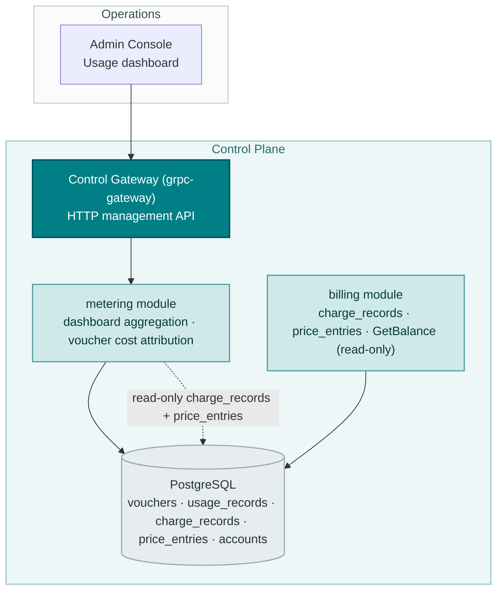
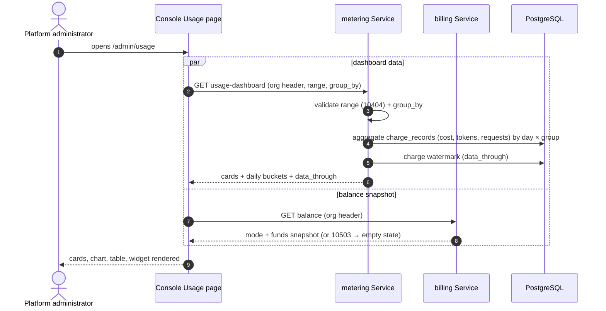
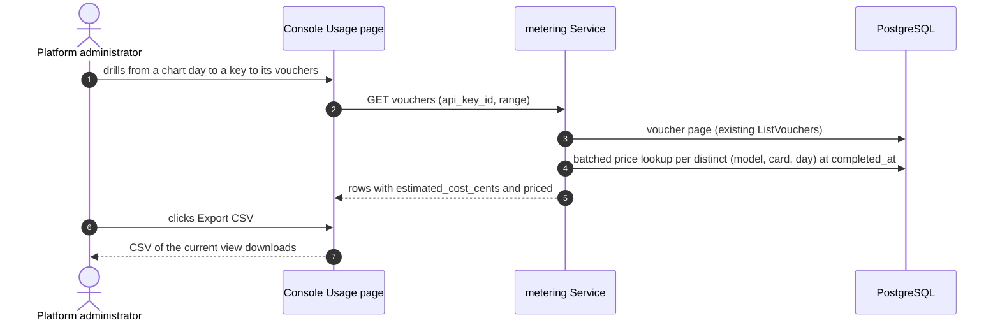

# Usage Dashboards & Per-Request Cost Attribution — Architecture and Detailed Design

| Attribute | Content |
| --- | --- |
| Feature point | Usage dashboards & per-request cost attribution |
| Document scope | Architecture and detailed design for the unified usage × cost view: the `GetUsageDashboard` RPC (summary cards + daily buckets × group-by), per-request estimated cost on vouchers, the console `/admin/usage` dashboard upgrade (inline-SVG chart, metric toggle, group-by, CSV export, balance/quota widget), error handling, configuration, and function-level design per layer |
| Owning modules | `metering` (dashboard aggregation, voucher cost attribution), reading `billing` charge records and `GetBalance` read-only; console web app; no changes to settlement, charging, or account pipelines |
| Related documents | [Requirement Analysis and UI/UX Design](../design/usage-dashboard.md) · [Architecture Design](../design/architecture.md) Section 2.5 (`metering`), Section 2.6 (`billing`) · [Token Metering Vouchers & Async Settlement](./metering.md) (the usage data and voucher surface being extended) · [Model × Card-Type Price Matrix & Tiered Pricing](./pricing.md) (the D2 charge formula and effective-dated prices behind every cost figure) · [Balance (Prepaid) & Quota (Postpaid) Account Modes](./balance-quota.md) (the `GetBalance` snapshot the widget shows) · [Multi-Tenancy Isolation](./multi-tenancy.md) (org scoping) |
| Status | Architecture complete, handed to the Developer agent |

---

## 1. Overview and Goals

Features #1–#8 closed the accounting loop: keys identify callers, every inference request leaves a tamper-evident voucher that settles hourly, the price matrix turns settled usage into charge records and monthly bills, and billing accounts gate inference with a prepaid balance or a postpaid quota. What the console still cannot answer is the operator's first question — *what is this usage costing, and which requests drove it?* This feature unifies usage × cost into one read-only dashboard: summary cards, a daily chart with metric and group-by toggles, per-request estimated cost on vouchers, CSV export, and the org's balance/quota snapshot beside it. Nothing in the settlement, charging, or account pipelines changes.

**Goals**: one `GetUsageDashboard` RPC (cards + daily buckets × group-by, org-scoped, range ≤ 92 days, 10404 reuse); per-request `estimated_cost_cents` + `priced` on `ListVouchers`/`GetVoucher`, computed on read; the `/admin/usage` upgrade — summary cards, inline-SVG chart with metric toggle and group-by, cost columns on the existing tables and voucher list, CSV export of the current view, and the balance/quota widget reusing `GetBalance`; pending-hour and unpriced labeling at every level.

**Non-goals** (deferred): real-time streaming usage (the hourly cadence stands); forecasts and anomaly alerts; saved custom views; hourly buckets for short ranges; server-side full-range export APIs; per-tenant self-service dashboards (#6/#7); payments, invoices, receipts (#14); request logs & playground metadata (#12); any change to settlement, charging, or account pipelines (read-only feature); new error codes.

## 2. Architecture Decisions

| # | Decision | Rationale |
| --- | --- | --- |
| AD1 | **`GetUsageDashboard` lives in `MeteringService`** (owns vouchers/usage_records) and **reads `billing`'s `charge_records` directly over the shared database** — no cross-service RPC | Both modules resolve the same `server.Components` PostgreSQL handle (`s.components.DB().GormDB()`), so a direct SQL read is the established pattern; a cross-service RPC would add latency, a new gRPC surface, and coupling for a read-only aggregation. The design doc's "same cross-module read pricing #5 established in reverse" is honored: modules share one PostgreSQL and read each other's tables read-only |
| AD2 | **Aggregation is SQL `GROUP BY` over `charge_records` LEFT JOIN `usage_records`**, computed per request; `data_through` is the charge watermark | One source answers all three group-bys and both metric families (D4); the reconciliation against `usage_records` surfaces settled-but-uncharged hours as pending rather than silently missing. The existing `idx_charge_records_org_period (organization_id, period_start)` index serves the org-scoped range scan — **no new index required** |
| AD3 | **Per-request cost is computed on read, never stored on vouchers** — `estimated_cost_cents` mirrors pricing's `computeAmount` (D2 formula) against the effective-dated price at `completed_at`, with the `(model, default)` fallback | Vouchers stay immutable audit atoms (metering D1); effective-dated prices make flat-rate recomputation exact and retro-correct when prices are fixed; storing cost at settlement would couple vouchers to pricing and freeze wrong values on price corrections (D2) |
| AD4 | **The estimate mirrors the shipped `computeAmount` exactly** — `prompt×in + completion×out + cached×cache`, ÷ 1M, rounded to 2 decimals — which **omits reasoning tokens** | The design doc's FR2.2 lists `reasoning×out`, but the shipped `services/billing/pricing.go` `computeAmount` has no reasoning term. Mirroring the shipped code keeps per-request estimates byte-consistent with actual charge records; adding a reasoning term would make estimates diverge from charges |
| AD5 | **Tiered requests are labeled estimates** — when the org's month-to-date volume for `(model, card)` crossed into a tier, the per-request flat-rate cost diverges from the actual charge (tier rates live on charge records); the console labels the column "Est. cost" everywhere | A per-request tier split is at best pro-rata; honesty beats false precision (D3) |
| AD6 | **`group_by` is server-side** (`api_key` default | `model` | `accelerator_type`); **the metric toggle (cost / tokens / requests) is client-side** because every bucket carries all three metrics | Payload stays one group-by wide; the toggle feels instant (D5) |
| AD7 | **Daily UTC buckets, one per day in the range** (empty on quiet days), range capped at **92 days**; validation reuses **10404** | Daily granularity matches every surveyed dashboard and keeps the payload ≤ 92 points; the cap and code reuse keep the metering range contract uniform (D6) |
| AD8 | **The chart renders with inline SVG** — one bar per day, stacked by group — no new charting dependency | The console is deliberately dependency-light; a daily bar chart is a small, testable SVG component (D7) |
| AD9 | **The balance/quota widget reuses `GetBalance` unchanged** — prepaid shows balance, postpaid shows month-to-date spend vs quota; an org without an account renders a muted "No billing account" state | Spend context next to usage is the Anthropic pattern; no new API and no billing changes (D8) |
| AD10 | **CSV export is generated client-side from the current table view** — UTF-8, header row, cost columns included | Auditors get offline data without a new export API; picks up metering's deferred voucher-export item (D9) |
| AD11 | **No new error codes** — 10404 covers dashboard range validation; 10403 stays on voucher lookups; the widget treats 10503 as an empty state, not an error | A uniform range contract across metering queries; the balance feature already owns the 105xx block (D10) |

## 3. Component Design



| Component | Responsibility in this feature |
| --- | --- |
| Control Gateway (`grpc-gateway`) | HTTP/JSON facade for `GetUsageDashboard` under `/api/v1/admin/metering`; passes `X-Organization-Id` through as gRPC metadata (the established pattern) |
| `metering` module (`services/metering`) | `GetUsageDashboard` aggregation (reads `charge_records` + `usage_records` over the shared DB), per-request cost attribution on `ListVouchers`/`GetVoucher` (reads `price_entries` over the shared DB) |
| `billing` module (`services/billing`) | **Unchanged** — its `charge_records` and `price_entries` are read read-only by metering; `GetBalance` is reused unchanged by the widget |
| PostgreSQL | No new tables; the existing `idx_charge_records_org_period` index already serves the dashboard scan |
| Console | `/admin/usage` upgraded in place — cards, chart, metric toggle, group-by, cost columns, CSV export, balance/quota widget |

### 3.1 File Layout and Function-Level Responsibilities

| Module | File | Contents |
| --- | --- | --- |
| `proto/taas/metering/v1` | `metering.proto` | Additive: `GetUsageDashboard` RPC + `GetUsageDashboardRequest`/`Response`, `DashboardCard`, `DailyBucket`, `DashboardGroup` messages; `VoucherSummary` gains `estimated_cost_cents` (10), `priced` (11) (Section 5) |
| `services/metering` | `dashboard.go` | `GetUsageDashboard` RPC implementation: org resolution, range validation (10404), group-by switch, aggregation orchestration, `data_through` watermark |
| | `dashboard_repository.go` | `DashboardRepository` (the `Repository` pattern): `DashboardAggregate(ctx, orgID, since, until, groupBy)` — the Section 4.2 SQL; `ChargeWatermark(ctx, orgID)` — the max charged hour |
| | `cost_attribution.go` | `CostAttributor` — per-voucher estimated cost: accelerator resolution (event field → `service_id` lookup → `default`), effective price lookup at `completed_at` with the `(model, default)` fallback, `computeAmount`-mirroring formula, batched per-page caching (FR2.4) |
| | `metering_repository.go` | `ListVouchers`/`FindByID` unchanged; the service layer attaches cost attribution after the page is fetched |
| | `service.go` | `ListVouchers`/`GetVoucher` extended to call the `CostAttributor` per page; `summarizeVoucher` gains the two additive fields |
| `services/billing` | `pricing.go` | **Unchanged** — `computeAmount` is the formula the metering `CostAttributor` mirrors (AD4); no code change |
| `web/src` | `pages/UsagePage.tsx` | Dashboard upgrade: cards row, inline-SVG chart, metric toggle, group-by select, cost columns, CSV export, balance/quota widget, pending/unpriced badges |
| | `api.ts` | `GetUsageDashboard` types (`DashboardCard`, `DailyBucket`, `DashboardGroup`), `VoucherSummary` gains `estimatedCostCents`/`priced`, `GetBalance` types |
| | `components/` | New `UsageChart.tsx` (inline-SVG stacked bars) and `BalanceWidget.tsx` (reuses `GetBalance`) |
| `apps/taas-server` | `main.go` | No change — the dashboard RPC rides the existing metering service registration |
| `test` | `fvt/usage_dashboard_fvt_test.go` / `e2e/tests/usageDashboard.js` | Section 8 |

### 3.2 Configuration Additions

None. The dashboard is read-only over existing tables and reuses the metering range contract (10404) and the billing `GetBalance` surface. No new config keys, runners, or MQ subjects.

### 3.3 Console Contract (pinned for the Developer agent)

Nav: **Usage** (`/admin/usage`) is upgraded in place — no new nav item. The header renders the balance/quota widget (`usage-balance-widget`); the cards row (`usage-dashboard-cards`) shows total cost, tokens in/out, requests, and avg cost per request (derived client-side), with the unpriced badge (`usage-unpriced-badge`) when `unpriced_request_count > 0`. The chart (`usage-chart`) renders one bar per day stacked by group, with the metric toggle (`usage-metric-toggle`) switching cost/tokens/requests client-side and the group-by select (`usage-groupby-select`) refetching. The existing per-key table (`usage-table`, `usage-row-{api_key_id}`) gains a **Cost** column; the voucher drill-down (`voucher-cost-{voucher_id}`) shows **Est. cost** and an "Unpriced" badge when `priced = false`. **Export CSV** (`usage-export-csv`) downloads the current view. The pending badge (`usage-pending-badge`) shows whenever the range extends past `data_through`. Empty states: "No usage in this range" (existing) and "No billing account" (widget). Color language: chart series use a fixed group palette; the widget inherits #8 — prepaid blue, postpaid purple, over-quota amber, blocked red; unpriced is a gray badge, never red.

### 3.4 Security and Rollout Notes

- **Org scoping**: every dashboard query resolves the org from `X-Organization-Id` (10001 when missing) and scopes the SQL to it — one org's header never returns another org's charge records, vouchers, or balance (the `resolveOrganizationID` + `checkOrg` pattern).
- **Read-only by construction**: the dashboard and cost attribution issue only `SELECT`s; no new writes on any path (AD2/AD3). Charge records, price entries, and vouchers remain immutable.
- **Rollout**: additive proto fields and one new RPC; deploy `taas-server` alone. Existing consumers ignore the new voucher fields safely; the dashboard returns empty cards/buckets until charge records exist. No schema migration (no new tables, no new index).

## 4. Data Model

### 4.1 No New Tables

The dashboard reads existing tables only: `charge_records` (the aggregation source), `usage_records` (the reconciliation source for the pending watermark), `price_entries` (the per-request cost lookup), and `accounts` (via `GetBalance`). Vouchers gain **no stored cost column** — `estimated_cost_cents` is computed on read (AD3).

### 4.2 The Dashboard Aggregation Query

The core query aggregates `charge_records` grouped by UTC day × group dimension, org-scoped and range-bounded:

```sql
SELECT
  date_trunc('day', to_timestamp(period_start)) AS day,
  <group_col> AS group_key,
  SUM(amount) * 100 AS cost_cents,          -- float amount → integer cents
  SUM(prompt_tokens)   AS prompt_tokens,
  SUM(completion_tokens) AS completion_tokens,
  SUM(cached_tokens)   AS cached_tokens,
  SUM(reasoning_tokens) AS reasoning_tokens,
  SUM(request_count)   AS request_count,
  bool_and(priced)     AS priced            -- false when any contributing record is unpriced
FROM charge_records
WHERE organization_id = ?
  AND period_start >= ? AND period_start < ?
GROUP BY day, <group_col>
ORDER BY day, group_key
```

where `<group_col>` is `api_key_id` (default), `model_id`, or `accelerator_type`. The `cost_cents` conversion uses `SUM(amount) * 100` rounded to integer cents — the same `centsFromAmount` rounding the charge boundary uses (AD2). The `priced` flag is `bool_and(priced)` so an understated cost is never silent (FR1.3).

**Index requirements**: the `WHERE organization_id = ? AND period_start >= ? AND period_start < ?` predicate is served by the existing `idx_charge_records_org_period (organization_id, period_start)` — **no new index required** (verified against `billing_model.go`). The `GROUP BY` is a post-scan aggregation over the range's rows (≤ 92 days of hourly records), well within the p95 ≤ 500 ms budget.

**Reconciliation**: `data_through` is the max `period_start` of the org's charge records (the charge watermark). Hours that settled (a `usage_records` row exists) but have not yet charged (no `charge_records` row) surface through the pending badge rather than being half-counted — no model/card split exists for them until charging runs (FR1.4). The dashboard does not join `usage_records` into the cost numbers; it only compares the watermark to the requested range to decide the pending badge.

### 4.3 Per-Request Cost Lookup

For each voucher, the `CostAttributor` resolves the accelerator type (event field → `service_id` lookup → `default`), then queries `price_entries`:

```sql
SELECT * FROM price_entries
WHERE model_id = ? AND accelerator_type = ? AND effective_from <= ?
ORDER BY effective_from DESC LIMIT 1
```

with the `(model, default)` fallback on a miss (the D6 chain, mirroring `chargeGroup`). With no entry, `priced = false` and cost 0; otherwise `priced = true` and cost = `computeAmount`-mirroring formula (AD4). Lookups are batched and cached per result page — one lookup per distinct `(model, card, day)`, not per row (FR2.4).

## 5. API Design

All APIs belong to **`taas.metering.v1.MeteringService`** (`proto/taas/metering/v1/metering.proto`), served as HTTP via the Control Gateway, org-scoped via `X-Organization-Id`. Proto changes are additive; int64 cents fields serialize as JSON strings.

| RPC | HTTP | Status | Purpose |
| --- | --- | --- | --- |
| `GetUsageDashboard` | `GET /api/v1/admin/metering/usage-dashboard` | **new** | Cards + daily buckets × group-by in one call (AD1) |
| `ListVouchers` | `GET /api/v1/admin/metering/vouchers` | extended | + `estimated_cost_cents`, `priced` (AD3) |
| `GetVoucher` | `GET /api/v1/admin/metering/vouchers/{voucher_id}` | extended | + `estimated_cost_cents`, `priced` |
| `GetBalance` | `GET /api/v1/admin/billing/balance` | reused, unchanged | Widget funds snapshot (#8) |

Message sketches (new; field numbers continue each message's sequence):

```protobuf
enum DashboardGroupBy {
  DASHBOARD_GROUP_BY_UNSPECIFIED = 0;
  DASHBOARD_GROUP_BY_API_KEY = 1;        // default
  DASHBOARD_GROUP_BY_MODEL = 2;
  DASHBOARD_GROUP_BY_ACCELERATOR_TYPE = 3;
}

message GetUsageDashboardRequest {
  string organization_id = 1;            // derived from X-Organization-Id by the gateway
  int64 since = 2;                       // unix seconds; default until - 24h
  int64 until = 3;                       // unix seconds; default now
  DashboardGroupBy group_by = 4;         // default api_key
}

message DashboardCard {
  int64 total_cost_cents = 1;            // JSON string
  string currency = 2;
  int64 prompt_tokens = 3;
  int64 completion_tokens = 4;
  int64 cached_tokens = 5;
  int64 reasoning_tokens = 6;
  int64 request_count = 7;
  int64 unpriced_request_count = 8;
  int64 data_through = 9;                // last complete hour covered by charging
}

message DashboardGroup {
  string group_key = 1;                  // api_key_id / model_id / accelerator_type
  int64 cost_cents = 2;                  // JSON string
  int64 prompt_tokens = 3;
  int64 completion_tokens = 4;
  int64 cached_tokens = 5;
  int64 reasoning_tokens = 6;
  int64 request_count = 7;
  bool priced = 8;                       // false when any contributing charge record is unpriced
}

message DailyBucket {
  int64 date = 1;                        // UTC day start, unix seconds
  repeated DashboardGroup groups = 2;
}

message GetUsageDashboardResponse {
  taas.common.v1.Response response = 1;
  DashboardCard cards = 2;
  repeated DailyBucket daily_buckets = 3;
}
```

`VoucherSummary` gains `estimated_cost_cents` (10, int64, JSON string) and `priced` (11, bool).

Constraints on the contract:

1. `GetUsageDashboard` validates `since`/`until` (int64 unix seconds; defaults `until = now`, `since = until − 24h`) and `group_by` (enum; default `api_key`). `since > until` or a range > 92 days returns 10404; an unrecognized `group_by` value fails standard request validation — no new code (AD11).
2. `cards`: integer cents only — averages are derived client-side (FR1.2).
3. `daily_buckets`: one per UTC day in range; every bucket carries all metrics so the metric toggle never refetches (AD6).
4. `estimated_cost_cents` / `priced` on vouchers are computed per Section 4.3 at query time and are additive — existing consumers ignore them safely.
5. Group display names (key names, model names) are resolved by the console from existing list APIs, matching the established pattern; the response carries ids only.
6. Wire conventions unchanged: HTTP 200 on success, business errors as `{"code": <int>, "message": "..."}`, int64 cents as JSON strings.

## 6. Sequence Flows

### 6.1 Dashboard Load (cards + chart + widget)



### 6.2 Voucher Drill-Down with Cost Attribution



## 7. Error Handling

All errors are `pkg/errors` business codes in the unified envelope. No new codes (AD11).

| Condition | Code | Constant | Notes |
| --- | --- | --- | --- |
| Malformed time range on `GetUsageDashboard` (`since > until`, range > 92 days) | 10404 | `CodeMeteringRangeInvalid` | **Reused** — the dashboard joins the uniform metering range contract |
| Malformed time range on `ListVouchers` (existing behavior) | 10404 | `CodeMeteringRangeInvalid` | Unchanged |
| Unknown `voucher_id` on `GetVoucher` | 10403 | `CodeMeteringVoucherNotFound` | Existing |
| Org has no billing account (widget's `GetBalance`) | 10503 | `CodeAccountNotFound` | Existing; the console renders the empty state, not an error |
| Missing `X-Organization-Id` on admin APIs | 10001 | `CodeUnauthorized` | The `resolveOrganizationID` pattern |
| Database / MQ infrastructure failure | 500 | `CodeInternal` | Via error normalization |

## 8. Testing Strategy

- **Unit** (`services/metering`, sqlite in-memory): `dashboard_repository_test.go` — the aggregation SQL (group-by × day, cost cents rounding, `bool_and(priced)`, org scoping, empty days render gaps); `cost_attribution_test.go` — the D2 formula mirroring `computeAmount` (AC4), the `(model, default)` fallback, `priced = false` with cost 0 on a miss, batched per-page caching (FR2.4); `service_test.go` — range validation 10404 (AC7), group-by enum validation, additive voucher fields. Coverage ≥ 80% on the new files.
- **FVT** (`test/fvt/usage_dashboard_fvt_test.go`, the metering FVT pattern: file-backed sqlite + `MigrateSchemaForFVT` + `NewForFVT` + gRPC server with the production interceptor + gateway mux with `FVTHeaderMatcher`): seed price entries + usage lines, run `PriceOnce`, then assert `GetUsageDashboard` cards equal the summed charge records (AC1), group-by regroups and per-group sums total the cards (AC2), `data_through` watermark and pending badge logic (AC8), voucher cost attribution through the gateway (AC4), 10404 inline (AC7), a second org never sees the first org's data.
- **E2E** (`test/e2e/tests/usageDashboard.js`, the `usageMetering.js` pattern): against the compose stack — the dashboard renders `usage-dashboard-cards` and `usage-chart` (AC1), the metric toggle re-renders with no additional API call (AC3), group-by refetches (AC2), the voucher list shows `voucher-cost-{id}` labeled "Est. cost" (AC4), Export CSV downloads the current view (AC5), the widget shows balance/quota/no-account states (AC6), the pending badge appears past `data_through` (AC8).
- **Regression**: the existing e2e suites stay green; the charge path and `GetBalance` are untouched (read-only feature).

## 9. Open Questions

| Question | Leaning |
| --- | --- |
| Hourly buckets when the range ≤ 48 h (short ranges render a single daily bar) | Future refinement — daily v1 matches every surveyed dashboard |
| Server-side CSV/JSON export of full ranges for large audits | Future console enhancement — v1 exports the current view (AD10) |
| Store per-request cost at settlement for exact tier attribution | Stay computed-on-read (AD3); revisit only if estimate disputes recur |
| Forecasts and anomaly alerts (the Cost Explorer pattern) | Future feature — needs more history than v1 will have |
| Tenant self-service dashboards and per-tenant scoping | Features #6/#7 first |