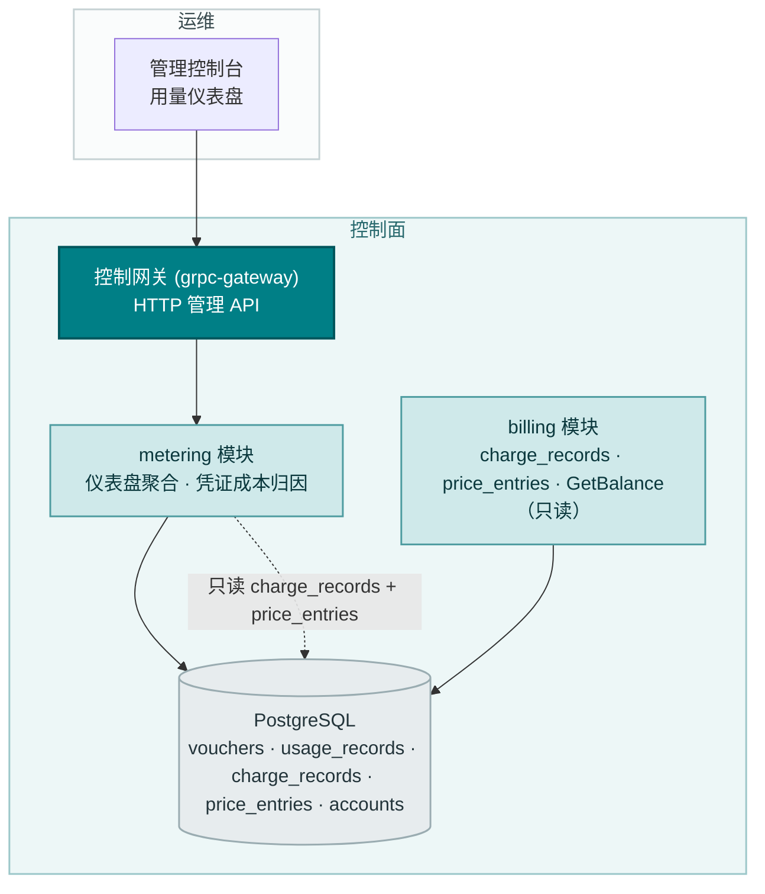
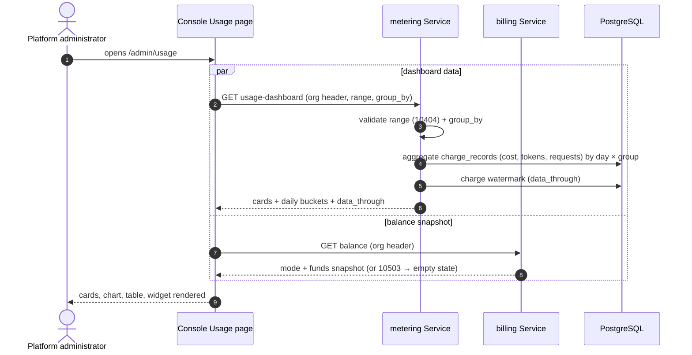
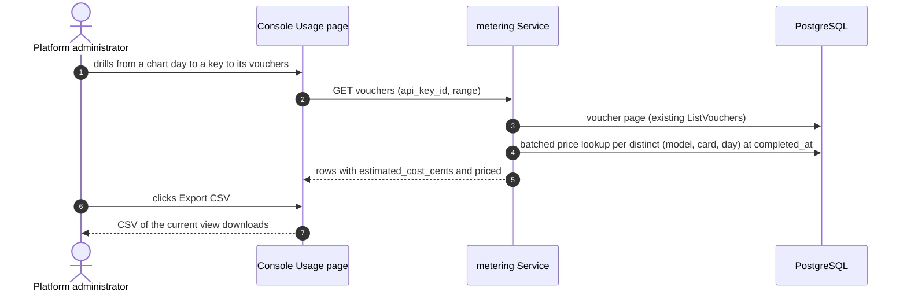

# 用量仪表盘与按请求成本归因 — 架构与详细设计

| 属性 | 内容 |
| --- | --- |
| 特性点 | 用量仪表盘与按请求成本归因 |
| 文档范围 | 统一用量 × 成本视图的架构与详细设计：`GetUsageDashboard` RPC（汇总卡片 + 按日分桶 × 分组维度）、凭证上的按请求预估成本、控制台 `/admin/usage` 仪表盘升级（内联 SVG 图表、指标切换、分组、CSV 导出、余额/配额组件）、错误处理、配置，以及各层的函数级设计 |
| 归属模块 | `metering`（仪表盘聚合、凭证成本归因），只读读取 `billing` 计费记录与 `GetBalance`；控制台 Web 应用；结算、计费或账户管道无任何变更 |
| 相关文档 | [需求分析与 UI/UX 设计](../design/usage-dashboard.zh-cn.md) · [架构设计](../design/architecture.zh-cn.md) 第 2.5 节（`metering`）、第 2.6 节（`billing`） · [Token 计量凭证与异步结算](./metering.zh-cn.md)（本特性扩展的用量数据与凭证表面） · [模型 × 卡类型价格矩阵与阶梯定价](./pricing.zh-cn.md)（每项成本数字背后的 D2 计费公式与生效日期价格） · [余额（预付费）与配额（后付费）账户模式](./balance-quota.zh-cn.md)（组件展示的 `GetBalance` 快照） · [多租户隔离](./multi-tenancy.zh-cn.md)（组织范围界定） |
| 状态 | 架构完成，已移交开发代理 |

---

## 1. 概述与目标

特性 #1–#8 闭环了账务链路：Key 标识调用方，每次推理请求留下防篡改凭证并按小时结算，价格矩阵把已结算用量转换为计费记录与月度账单，计费账户以预付费余额或后付费配额管控推理。但控制台仍无法回答运营者的第一个问题 — *这些用量花了多少钱，是哪些请求驱动的？* 本特性把用量 × 成本统一进一个只读仪表盘：汇总卡片、带指标与分组切换的每日图表、凭证上的按请求预估成本、CSV 导出，以及并排展示的组织余额/配额快照。结算、计费或账户管道没有任何变更。

**目标**：一个 `GetUsageDashboard` RPC（卡片 + 按日分桶 × 分组，组织范围界定，范围 ≤ 92 天，复用 10404）；`ListVouchers`/`GetVoucher` 上的按请求 `estimated_cost_cents` + `priced`，读取时计算；`/admin/usage` 升级 — 汇总卡片、带指标切换与分组的内联 SVG 图表、既有表格与凭证列表上的成本列、当前视图的 CSV 导出，以及复用 `GetBalance` 的余额/配额组件；每一层都标注待结算小时与未定价。

**非目标**（延后）：实时流式用量（按小时节奏保持不变）；预测与异常告警；保存的自定义视图；短范围的按小时分桶；服务端全范围导出 API；租户自助仪表盘（#6/#7）；支付、发票、回执（#14）；请求日志与 playground 元数据（#12）；结算、计费或账户管道的任何变更（只读特性）；新增错误码。

## 2. 架构决策

| # | 决策 | 理由 |
| --- | --- | --- |
| AD1 | **`GetUsageDashboard` 位于 `MeteringService`**（拥有凭证/usage_records），并**经共享数据库直接读取 `billing` 的 `charge_records`** — 无跨服务 RPC | 两个模块解析同一个 `server.Components` PostgreSQL 句柄（`s.components.DB().GormDB()`），因此直接 SQL 读取是既定模式；跨服务 RPC 会为只读聚合增加延迟、新的 gRPC 表面与耦合。设计文档「与 #5 建立的跨模块只读定价反向呼应」得到兑现：模块共享一个 PostgreSQL，并只读地读取彼此的只读表 |
| AD2 | **聚合是对 `charge_records` LEFT JOIN `usage_records` 的 SQL `GROUP BY`**，按请求计算；`data_through` 是计费水位 | 单一数据源回答全部三种分组与两个指标族（D4）；对 `usage_records` 的对账把已结算但未计费的小时呈现为待结算而非静默缺失。既有 `idx_charge_records_org_period (organization_id, period_start)` 索引服务于组织范围的范围扫描 — **无需新索引** |
| AD3 | **按请求成本在读取时计算，绝不存储在凭证上** — `estimated_cost_cents` 镜像 pricing 的 `computeAmount`（D2 公式），针对 `completed_at` 时的生效日期价格，带 `(model, default)` 回退 | 凭证保持不可变的审计原子（metering D1）；生效日期价格让固定费率重算精确，并在价格修正时回溯正确；在结算时存储成本会把凭证耦合到定价，并在价格修正时冻结错误值（D2） |
| AD4 | **预估镜像已上线的 `computeAmount` 完全一致** — `prompt×in + completion×out + cached×cache`，÷ 1M，四舍五入到 2 位小数 — **该公式省略了推理 token** | 设计文档的 FR2.2 列出 `reasoning×out`，但已上线的 `services/billing/pricing.go` `computeAmount` 没有推理项。镜像已上线代码让按请求预估与实际计费记录逐字节一致；加入推理项会让预估与计费产生偏差 |
| AD5 | **阶梯请求被标注为预估** — 当组织在 `(model, card)` 上的月至今量跨入某个阶梯时，按请求固定费率成本与实际计费产生偏差（阶梯费率存在于计费记录上）；控制台在所有位置把该列标注为「预估成本」 | 按请求的阶梯拆分至多是按比例分摊；诚实优于虚假精度（D3） |
| AD6 | **`group_by` 在服务端**（`api_key` 默认 \| `model` \| `accelerator_type`）；**指标切换（成本 / token / 请求）在客户端**，因为每个分桶都携带全部三个指标 | 载荷保持单一分组宽度；切换感觉即时（D5） |
| AD7 | **每日 UTC 分桶，范围内每天一个**（安静日为空），范围上限 **92 天**；校验复用 **10404** | 每日粒度匹配所有调研过的仪表盘，并让载荷 ≤ 92 个点；上限与代码复用让 metering 范围契约保持统一（D6） |
| AD8 | **图表以内联 SVG 渲染** — 每天一根柱，按分组堆叠 — 无新图表依赖 | 控制台刻意依赖精简；每日柱状图是一个小巧、可测试的 SVG 组件（D7） |
| AD9 | **余额/配额组件原样复用 `GetBalance`** — 预付费展示余额，后付费展示月至今用量对配额；无账户的组织渲染一个弱化的「暂无计费账户」状态 | 用量旁的支出上下文是 Anthropic 模式；无新 API、无计费变更（D8） |
| AD10 | **CSV 导出在客户端从当前表格视图生成** — UTF-8、表头行、含成本列 | 审计者无需新导出 API 即可获得离线数据；承接 metering 延后的凭证导出项（D9） |
| AD11 | **无新增错误码** — 10404 覆盖仪表盘范围校验；10403 保留在凭证查找上；组件把 10503 视为空态而非错误 | 跨 metering 查询的统一范围契约；余额特性已拥有 105xx 块（D10） |

## 3. 组件设计



| 组件 | 本特性中的职责 |
| --- | --- |
| 控制网关（`grpc-gateway`） | `GetUsageDashboard` 在 `/api/v1/admin/metering` 下的 HTTP/JSON 门面；将 `X-Organization-Id` 作为 gRPC metadata 透传（既定模式） |
| `metering` 模块（`services/metering`） | `GetUsageDashboard` 聚合（经共享 DB 读取 `charge_records` + `usage_records`），`ListVouchers`/`GetVoucher` 上的按请求成本归因（经共享 DB 读取 `price_entries`） |
| `billing` 模块（`services/billing`） | **不变** — 其 `charge_records` 与 `price_entries` 被 metering 只读读取；`GetBalance` 被组件原样复用 |
| PostgreSQL | 无新表；既有 `idx_charge_records_org_period` 索引已服务仪表盘扫描 |
| 控制台 | `/admin/usage` 就地升级 — 卡片、图表、指标切换、分组、成本列、CSV 导出、余额/配额组件 |

### 3.1 文件布局与函数级职责

| 模块 | 文件 | 内容 |
| --- | --- | --- |
| `proto/taas/metering/v1` | `metering.proto` | 增量：`GetUsageDashboard` RPC + `GetUsageDashboardRequest`/`Response`、`DashboardCard`、`DailyBucket`、`DashboardGroup` 消息；`VoucherSummary` 新增 `estimated_cost_cents`（10）、`priced`（11）（第 5 节） |
| `services/metering` | `dashboard.go` | `GetUsageDashboard` RPC 实现：组织解析、范围校验（10404）、分组切换、聚合编排、`data_through` 水位 |
| | `dashboard_repository.go` | `DashboardRepository`（`Repository` 模式）：`DashboardAggregate(ctx, orgID, since, until, groupBy)` — 第 4.2 节 SQL；`ChargeWatermark(ctx, orgID)` — 最大已计费小时 |
| | `cost_attribution.go` | `CostAttributor` — 按凭证预估成本：加速器解析（事件字段 → `service_id` 查找 → `default`）、`completed_at` 时的生效价格查找带 `(model, default)` 回退、`computeAmount` 镜像公式、按页批量缓存（FR2.4） |
| | `metering_repository.go` | `ListVouchers`/`FindByID` 不变；服务层在页面取回后附加成本归因 |
| | `service.go` | `ListVouchers`/`GetVoucher` 扩展为每页调用 `CostAttributor`；`summarizeVoucher` 新增两个增量字段 |
| `services/billing` | `pricing.go` | **不变** — `computeAmount` 是 metering `CostAttributor` 镜像的公式（AD4）；无代码变更 |
| `web/src` | `pages/UsagePage.tsx` | 仪表盘升级：卡片行、内联 SVG 图表、指标切换、分组下拉、成本列、CSV 导出、余额/配额组件、待结算/未定价徽标 |
| | `api.ts` | `GetUsageDashboard` 类型（`DashboardCard`、`DailyBucket`、`DashboardGroup`），`VoucherSummary` 新增 `estimatedCostCents`/`priced`，`GetBalance` 类型 |
| | `components/` | 新增 `UsageChart.tsx`（内联 SVG 堆叠柱）与 `BalanceWidget.tsx`（复用 `GetBalance`） |
| `apps/taas-server` | `main.go` | 无变更 — 仪表盘 RPC 搭载既有 metering 服务注册 |
| `test` | `fvt/usage_dashboard_fvt_test.go` / `e2e/tests/usageDashboard.js` | 第 8 节 |

### 3.2 配置增量

无。仪表盘在既有表上只读，并复用 metering 范围契约（10404）与 billing `GetBalance` 表面。无新配置键、runner 或 MQ subject。

### 3.3 控制台契约（为开发代理钉死）

导航：**用量**（`/admin/usage`）就地升级 — 无新导航项。头部渲染余额/配额组件（`usage-balance-widget`）；卡片行（`usage-dashboard-cards`）展示总成本、进出 token、请求数，以及每请求平均成本（客户端推导），当 `unpriced_request_count > 0` 时显示未定价徽标（`usage-unpriced-badge`）。图表（`usage-chart`）每天一根柱、按分组堆叠，指标切换（`usage-metric-toggle`）在客户端切换成本/token/请求，分组下拉（`usage-groupby-select`）触发重新拉取。既有按 Key 表格（`usage-table`、`usage-row-{api_key_id}`）新增**成本**列；凭证下钻（`voucher-cost-{voucher_id}`）展示**预估成本**，并在 `priced = false` 时显示「未定价」徽标。**导出 CSV**（`usage-export-csv`）下载当前视图。待结算徽标（`usage-pending-badge`）在范围延伸过 `data_through` 时显示。空态：「该范围内暂无用量」（既有）与「暂无计费账户」（组件）。颜色语言：图表系列使用固定分组调色板；组件继承 #8 — 预付费蓝、后付费紫、超额琥珀、阻断红；未定价是灰色徽标，绝不使用红色。

### 3.4 安全与发布说明

- **组织范围界定**：每个仪表盘查询从 `X-Organization-Id` 解析组织（缺失时 10001）并将 SQL 限定于该组织 — 一个组织的请求头绝不能返回另一个组织的计费记录、凭证或余额（`resolveOrganizationID` + `checkOrg` 模式）。
- **构造上只读**：仪表盘与成本归因只发出 `SELECT`；任何路径都无新写入（AD2/AD3）。计费记录、价格条目与凭证保持不可变。
- **发布**：增量 proto 字段与一个新 RPC；只部署 `taas-server`。既有消费者安全地忽略新凭证字段；在计费记录存在前，仪表盘返回空卡片/分桶。无 schema 迁移（无新表、无新索引）。

## 4. 数据模型

### 4.1 无新表

仪表盘只读取既有表：`charge_records`（聚合源）、`usage_records`（待结算水位的对账源）、`price_entries`（按请求成本查找）、`accounts`（经 `GetBalance`）。凭证**不新增存储成本列** — `estimated_cost_cents` 在读取时计算（AD3）。

### 4.2 仪表盘聚合查询

核心查询按 UTC 日 × 分组维度对 `charge_records` 聚合，组织范围界定且范围受限：

```sql
SELECT
  date_trunc('day', to_timestamp(period_start)) AS day,
  <group_col> AS group_key,
  SUM(amount) * 100 AS cost_cents,          -- float amount → integer cents
  SUM(prompt_tokens)   AS prompt_tokens,
  SUM(completion_tokens) AS completion_tokens,
  SUM(cached_tokens)   AS cached_tokens,
  SUM(reasoning_tokens) AS reasoning_tokens,
  SUM(request_count)   AS request_count,
  bool_and(priced)     AS priced            -- false when any contributing record is unpriced
FROM charge_records
WHERE organization_id = ?
  AND period_start >= ? AND period_start < ?
GROUP BY day, <group_col>
ORDER BY day, group_key
```

其中 `<group_col>` 是 `api_key_id`（默认）、`model_id` 或 `accelerator_type`。`cost_cents` 换算使用 `SUM(amount) * 100` 四舍五入到整数分 — 与计费边界使用的 `centsFromAmount` 舍入一致（AD2）。`priced` 标志是 `bool_and(priced)`，因此低估的成本绝不静默（FR1.3）。

**索引需求**：`WHERE organization_id = ? AND period_start >= ? AND period_start < ?` 谓词由既有 `idx_charge_records_org_period (organization_id, period_start)` 服务 — **无需新索引**（已对照 `billing_model.go` 验证）。`GROUP BY` 是对范围内行（≤ 92 天的小时记录）的扫描后聚合，远在 p95 ≤ 500 ms 预算内。

**对账**：`data_through` 是组织计费记录的最大 `period_start`（计费水位）。已结算（存在 `usage_records` 行）但尚未计费（无 `charge_records` 行）的小时通过待结算徽标呈现，而非被半计数 — 在计费运行前它们不存在模型/卡拆分（FR1.4）。仪表盘不把 `usage_records` 连接进成本数字；它只把水位与请求范围比较以决定待结算徽标。

### 4.3 按请求成本查找

对每个凭证，`CostAttributor` 解析加速器类型（事件字段 → `service_id` 查找 → `default`），然后查询 `price_entries`：

```sql
SELECT * FROM price_entries
WHERE model_id = ? AND accelerator_type = ? AND effective_from <= ?
ORDER BY effective_from DESC LIMIT 1
```

未命中时带 `(model, default)` 回退（D6 链，镜像 `chargeGroup`）。无条目时 `priced = false` 且成本 0；否则 `priced = true` 且成本 = `computeAmount` 镜像公式（AD4）。查找按结果页批量并缓存 — 每个不同的 `(model, card, day)` 一次查找，而非每行一次（FR2.4）。

## 5. API 设计

所有 API 属于 **`taas.metering.v1.MeteringService`**（`proto/taas/metering/v1/metering.proto`），经控制网关以 HTTP 提供，经 `X-Organization-Id` 组织范围界定。Proto 变更为增量；int64 分字段序列化为 JSON 字符串。

| RPC | HTTP | 状态 | 用途 |
| --- | --- | --- | --- |
| `GetUsageDashboard` | `GET /api/v1/admin/metering/usage-dashboard` | **新增** | 一次调用返回卡片 + 按日分桶 × 分组（AD1） |
| `ListVouchers` | `GET /api/v1/admin/metering/vouchers` | 扩展 | + `estimated_cost_cents`、`priced`（AD3） |
| `GetVoucher` | `GET /api/v1/admin/metering/vouchers/{voucher_id}` | 扩展 | + `estimated_cost_cents`、`priced` |
| `GetBalance` | `GET /api/v1/admin/billing/balance` | 复用，不变 | 组件资金快照（#8） |

消息草图（新增；字段编号延续各消息的序列）：

```protobuf
enum DashboardGroupBy {
  DASHBOARD_GROUP_BY_UNSPECIFIED = 0;
  DASHBOARD_GROUP_BY_API_KEY = 1;        // default
  DASHBOARD_GROUP_BY_MODEL = 2;
  DASHBOARD_GROUP_BY_ACCELERATOR_TYPE = 3;
}

message GetUsageDashboardRequest {
  string organization_id = 1;            // derived from X-Organization-Id by the gateway
  int64 since = 2;                       // unix seconds; default until - 24h
  int64 until = 3;                       // unix seconds; default now
  DashboardGroupBy group_by = 4;         // default api_key
}

message DashboardCard {
  int64 total_cost_cents = 1;            // JSON string
  string currency = 2;
  int64 prompt_tokens = 3;
  int64 completion_tokens = 4;
  int64 cached_tokens = 5;
  int64 reasoning_tokens = 6;
  int64 request_count = 7;
  int64 unpriced_request_count = 8;
  int64 data_through = 9;                // last complete hour covered by charging
}

message DashboardGroup {
  string group_key = 1;                  // api_key_id / model_id / accelerator_type
  int64 cost_cents = 2;                  // JSON string
  int64 prompt_tokens = 3;
  int64 completion_tokens = 4;
  int64 cached_tokens = 5;
  int64 reasoning_tokens = 6;
  int64 request_count = 7;
  bool priced = 8;                       // false when any contributing charge record is unpriced
}

message DailyBucket {
  int64 date = 1;                        // UTC day start, unix seconds
  repeated DashboardGroup groups = 2;
}

message GetUsageDashboardResponse {
  taas.common.v1.Response response = 1;
  DashboardCard cards = 2;
  repeated DailyBucket daily_buckets = 3;
}
```

`VoucherSummary` 新增 `estimated_cost_cents`（10，int64，JSON 字符串）与 `priced`（11，bool）。

契约约束：

1. `GetUsageDashboard` 校验 `since`/`until`（int64 unix 秒；默认 `until = now`、`since = until − 24h`）与 `group_by`（枚举；默认 `api_key`）。`since > until` 或范围 > 92 天返回 10404；无法识别的 `group_by` 值走标准请求校验失败 — 无新代码（AD11）。
2. `cards`：仅整数分 — 平均值在客户端推导（FR1.2）。
3. `daily_buckets`：范围内每个 UTC 日一个；每个分桶携带全部指标，因此指标切换永不重新拉取（AD6）。
4. 凭证上的 `estimated_cost_cents` / `priced` 按第 4.3 节在查询时计算且为增量 — 既有消费者安全地忽略它们。
5. 分组显示名（Key 名、模型名）由控制台从既有列表 API 解析，沿用既定模式；响应只携带 id。
6. 线上约定不变：成功时 HTTP 200，业务错误为 `{"code": <int>, "message": "..."}`，int64 分作为 JSON 字符串。

## 6. 时序流程

### 6.1 仪表盘加载（卡片 + 图表 + 组件）



### 6.2 带成本归因的凭证下钻



## 7. 错误处理

所有错误都是统一信封中的 `pkg/errors` 业务码。无新增错误码（AD11）。

| 条件 | 码 | 常量 | 备注 |
| --- | --- | --- | --- |
| `GetUsageDashboard` 上格式错误的时间范围（`since > until`、范围 > 92 天） | 10404 | `CodeMeteringRangeInvalid` | **复用** — 仪表盘加入统一 metering 范围契约 |
| `ListVouchers` 上格式错误的时间范围（既有行为） | 10404 | `CodeMeteringRangeInvalid` | 不变 |
| `GetVoucher` 上未知的 `voucher_id` | 10403 | `CodeMeteringVoucherNotFound` | 既有 |
| 组织无计费账户（组件的 `GetBalance`） | 10503 | `CodeAccountNotFound` | 既有；控制台渲染空态而非错误 |
| 管理 API 上缺失 `X-Organization-Id` | 10001 | `CodeUnauthorized` | `resolveOrganizationID` 模式 |
| 数据库 / MQ 基础设施故障 | 500 | `CodeInternal` | 经错误归一化 |

## 8. 测试策略

- **单元**（`services/metering`，内存 sqlite）：`dashboard_repository_test.go` — 聚合 SQL（分组 × 日、成本分舍入、`bool_and(priced)`、组织范围界定、空日渲染缺口）；`cost_attribution_test.go` — 镜像 `computeAmount` 的 D2 公式（AC4）、`(model, default)` 回退、未命中时 `priced = false` 且成本 0、按页批量缓存（FR2.4）；`service_test.go` — 范围校验 10404（AC7）、分组枚举校验、增量凭证字段。新文件覆盖率 ≥ 80%。
- **FVT**（`test/fvt/usage_dashboard_fvt_test.go`，metering FVT 模式：文件支撑 sqlite + `MigrateSchemaForFVT` + `NewForFVT` + 带生产拦截器的 gRPC 服务器 + 带 `FVTHeaderMatcher` 的网关 mux）：播种价格条目与用量行，运行 `PriceOnce`，然后断言 `GetUsageDashboard` 卡片等于求和后的计费记录（AC1）、分组重新分组且各组之和等于卡片（AC2）、`data_through` 水位与待结算徽标逻辑（AC8）、经网关的凭证成本归因（AC4）、内联 10404（AC7）、第二个组织绝看不到第一个组织的数据。
- **E2E**（`test/e2e/tests/usageDashboard.js`，`usageMetering.js` 模式）：针对 compose 栈 — 仪表盘渲染 `usage-dashboard-cards` 与 `usage-chart`（AC1）、指标切换无额外 API 调用即重新渲染（AC3）、分组重新拉取（AC2）、凭证列表显示标注「预估成本」的 `voucher-cost-{id}`（AC4）、导出 CSV 下载当前视图（AC5）、组件显示余额/配额/无账户状态（AC6）、待结算徽标在 `data_through` 之后出现（AC8）。
- **回归**：既有 e2e 套件保持绿色；计费路径与 `GetBalance` 不受触碰（只读特性）。

## 9. 开放问题

| 问题 | 倾向 |
| --- | --- |
| 范围 ≤ 48 h 时的按小时分桶（短范围渲染单个每日柱） | 未来细化 — 每日 v1 匹配所有调研过的仪表盘 |
| 面向大型审计的全范围服务端 CSV/JSON 导出 | 未来控制台增强 — v1 导出当前视图（AD10） |
| 在结算时存储按请求成本以获得精确阶梯归因 | 保持读取时计算（AD3）；仅在预估争议复发时重访 |
| 预测与异常告警（Cost Explorer 模式） | 未来特性 — 需要比 v1 更多的历史 |
| 租户自助仪表盘与按租户范围界定 | 先做特性 #6/#7 |