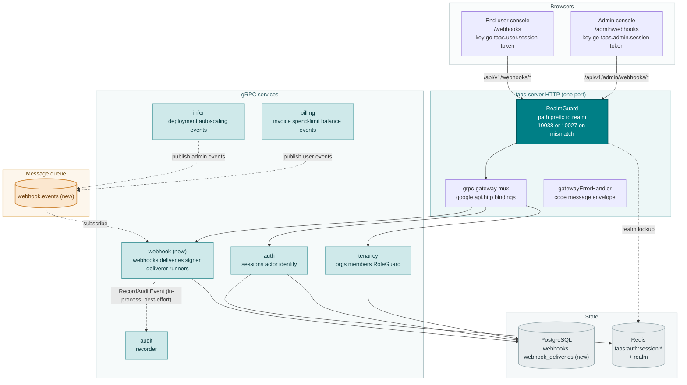
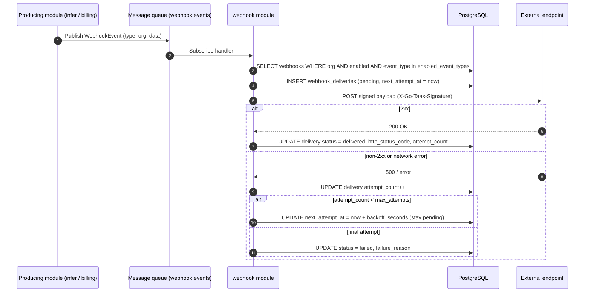
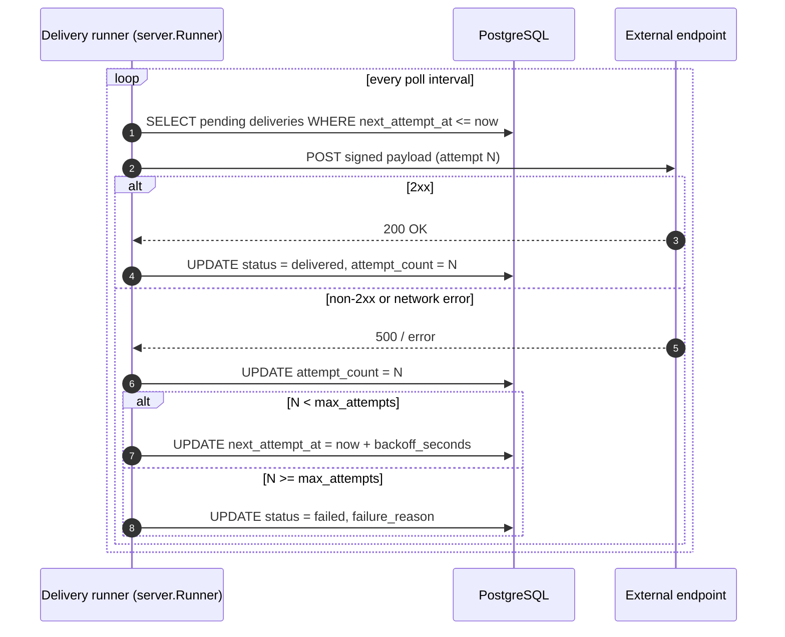
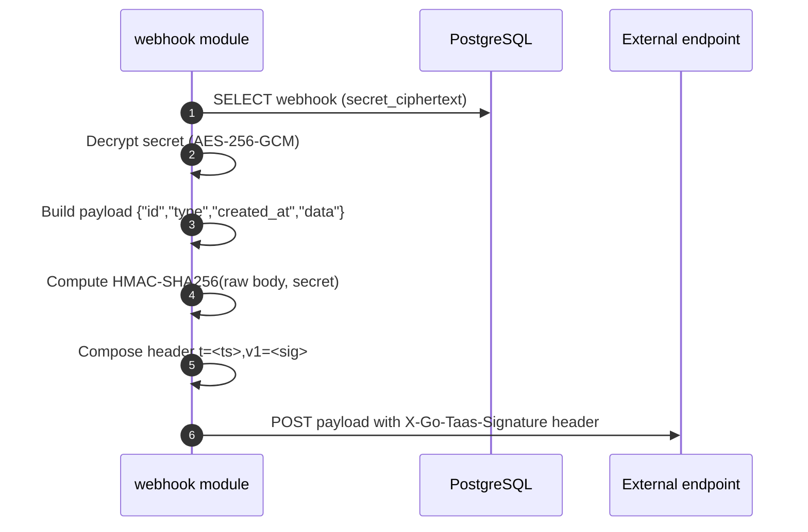
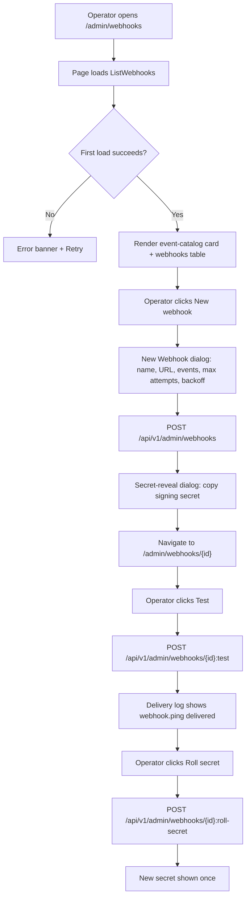

# Webhook Notifications & Event Subscriptions — Architecture and Detailed Design

| Attribute | Content |
| --- | --- |
| Feature point | Webhook notifications & event subscriptions — configure outbound webhooks to receive platform events (deployment status, autoscaling, billing/invoice, spend-limit breach, balance-low) with per-event-type enablement, signing secret, retry policy and delivery log (backlog row 23) |
| Document scope | Architecture and detailed design for feature-23: a new `webhook` module owning webhook endpoint CRUD, event subscription, HMAC signing, retry and the delivery log; the `webhooks` and `webhook_deliveries` tables; the `taas.webhook.v1.WebhookService` proto with dual admin/user HTTP bindings; the `webhook.events` MQ subject and the producing-module publish points; the admin Webhooks pages (`/admin/webhooks`, `/admin/webhooks/:webhookId`) and the end-user Webhooks pages (`/webhooks`, `/webhooks/:webhookId`); plus error handling, configuration, security, rollout, and function-level design per layer |
| Owning modules | New `webhook` module (`services/webhook`): `webhooks` + `webhook_deliveries` tables, CRUD/query RPCs, event subscription, signer, deliverer, delivery runner, retention runner; `infer` and `billing` (publish the event catalog to `webhook.events`); `audit` (webhook mutations are audited); `pkg/mq` (new `WebhookEvents` subject); `pkg/server` gateway (admin-prefix and user-prefix bindings); console web app (admin `WebhooksPage`/`WebhookDetailPage`, end-user `UserWebhooksPage`/`UserWebhookDetailPage`) |
| Related documents | [Requirement Analysis and UI/UX Design](../design/webhook-notifications.md) · [Architecture Design](../design/architecture.md) §1.2 (message queue), §2 (module responsibilities), §3.1 (admin/user surface separation) · [Console Surface Separation](./console-surface-separation.md) (the two-console split this feature spans; realm guard, 10038) · [Audit Logging](./audit-logging.md) (the audit recorder webhook mutations must invoke) · [Inference Autoscaling](./inference-autoscaling.md) (the autoscaling events this feature subscribes to) · [Payments, Invoices & Auto-Recharge](./payments-invoices-auto-recharge.md) (the billing/invoice events) · [Balance & Quota](./balance-quota.md) (the balance-low and spend-limit events) |
| Status | Architecture complete, handed to the Developer agent |

---

## 1. Overview and Goals

go-taas is a Token-as-a-Service platform: it deploys inference services (feature #2), autoscales them (feature #16), meters and bills usage (features #4, #5, #8, #14), and enforces spend limits (feature #11). Today all of this state is **pull-only**: an operator or tenant must open the console and poll to learn that a deployment failed, a service scaled, an invoice was issued, a spend limit was breached, or a balance ran low. There is no way for an external system — an ops tool like Slack or PagerDuty, a tenant's own billing integration, or a CI pipeline — to be **pushed** the events it cares about as they happen.

This feature adds **outbound webhooks**: the operator or tenant registers an HTTPS endpoint, subscribes it to a subset of the platform's event catalog, and the platform delivers a signed JSON payload to that endpoint whenever a subscribed event occurs. Each webhook carries a per-event-type enablement, a signing secret for authenticity, a retry policy for resilience, and a delivery log for observability and manual resend. It is the smallest independently valuable increment of Phase 4's event-integration roadmap item: it turns "the platform changed state" into "the platform told my system about it".

**Goals**: a new `webhook` module owning the `webhooks` and `webhook_deliveries` tables and their lifecycle; a `taas.webhook.v1.WebhookService` with ten RPCs, each dual-bound to the admin prefix `/api/v1/admin/webhooks/*` and the user prefix `/api/v1/webhooks/*`; a `webhook.events` MQ subject carrying the event catalog, with `infer` publishing the admin events and `billing` publishing the end-user events; HMAC-SHA256 signing of every delivery with a per-endpoint secret stored encrypted at rest; a bounded retry policy (`max_attempts` × `backoff_seconds`) applied by a delivery runner; a 90-day delivery log with manual resend; new error codes 10701–10705; an admin Webhooks page (`/admin/webhooks`) and detail page (`/admin/webhooks/:webhookId`), and an end-user Webhooks page (`/webhooks`) and detail page (`/webhooks/:webhookId`).

**Non-goals** (deferred, design §8): webhook event versioning (v1 ships a fixed event schema); IP allowlisting of delivery sources; a 3-day retry window (v1 uses a bounded configurable policy); delivery to non-HTTP sinks (EventBridge/Event Grid); a webhook event replay API beyond manual resend; tenant visibility of operator orchestration events and operator visibility of tenant account events (the surface split is binding); an in-console notification center (feature #26 consumes these events in-console).

### 1.1 Reading order of this document

Section 2 records the architecture decisions (AD1–AD12, mirroring the design's D1–D10 plus the two refinements the Architect made). Sections 3–5 are the component view, data model, and API design. Section 6 is the frontend architecture (page → route → API-prefix table for both consoles, auth guard per surface). Sections 7–8 are the sequence flows and error handling. Sections 9–11 are configuration, security, and rollout. Sections 12–14 are the acceptance-criteria traceability, the function-level detailed design, and the ordered implementation task list.

---

## 2. Architecture Decisions

| # | Decision | Rationale |
| --- | --- | --- |
| AD1 | **New `webhook` module** (`services/webhook`) owning the `webhooks` and `webhook_deliveries` tables, the CRUD/query RPCs, the event subscription, the signer, the deliverer, the delivery runner, and the retention runner, with its own error block **107xx** | Webhooks consume events from `infer` and `billing`; a dedicated module keeps the delivery concern out of the producing modules and gives it one home, mirroring how `metering` owns settlement (design D8) |
| AD2 | **The webhook error block is 10701–10799, not 10601–10699.** The audit module already owns 10601–10603 (feature #15). The design's "fresh block after the billing block (105xx)" intent is honored by taking the next free block after audit's 106xx | Each module has its own error block (architecture §2, `pkg/errors/codes.go`); audit took 106xx, so webhook takes 107xx. This is the interpretation most consistent with the existing architecture (design D9, refined) |
| AD3 | **The signing secret is stored encrypted at rest (AES-256-GCM with a master key from config), not hashed.** HMAC-SHA256 signing requires the plaintext secret to compute the signature; a hash cannot sign. Encryption protects the secret at rest while still enabling signing | The design's "stored only as a hash" (D3) is incompatible with HMAC signing. Encryption satisfies the security intent — the plaintext is not recoverable from the DB by a casual reader — while keeping the module able to sign. The plaintext is shown once at creation and on explicit reveal/roll (design D3, refined) |
| AD4 | **A webhook is an endpoint URL + a set of enabled event types + a signing secret + a retry policy.** The URL is required and must be a valid `https://` (or `http://` for local testing) URL; the event types are a non-empty subset of the surface's catalog; the signing secret is auto-generated per endpoint and shown once at creation; the retry policy is `max_attempts` (1–10, default 5) and `backoff_seconds` (1–3600, default 60) | Mirrors the Stripe/GitHub model in the smallest field list (design D2) |
| AD5 | **Every delivery is signed with HMAC-SHA256** using the endpoint's secret, over the raw JSON body, with a timestamp and a signature in a `X-Go-Taas-Signature` header (`t=<ts>,v1=<sig>`) | HMAC-SHA256 over the raw body with a timestamp is the Stripe/GitHub standard and prevents tampering and replay (design D3) |
| AD6 | **A webhook can be enabled or disabled (paused).** A disabled webhook stops receiving deliveries but keeps its config, secret, and delivery log; re-enabling resumes delivery. Deleting a webhook removes it and its delivery log | Pausing is the low-risk way to stop a misbehaving endpoint without losing configuration (design D4) |
| AD7 | **A webhook has a test/ping action** that sends a synthetic `webhook.ping` event to the endpoint and records it in the delivery log | GitHub's ping and Stripe's trigger are the canonical way to verify an endpoint before real events flow (design D5) |
| AD8 | **The delivery log lists every delivery** with its event type, status (`delivered` / `failed` / `pending`), HTTP status code, attempt count, and timestamps. A failed delivery can be **resent** manually; the log is retained for 90 days | The delivery log is the debugging surface; manual resend recovers a lost event without waiting for the retry policy; 90-day retention matches the request-log retention (design D6) |
| AD9 | **The signing secret can be rolled** (regenerated) at any time; the old secret is invalidated immediately and the new secret is shown once | Secret roll is a Stripe best practice for a suspected compromise; immediate invalidation is the simplest safe default for v1 (design D7) |
| AD10 | **The event catalog flows over a single new MQ subject `webhook.events`.** The producing modules (`infer` for the admin events, `billing` for the end-user events) publish a canonical `WebhookEvent` envelope; the `webhook` module subscribes and routes each event to the matching enabled webhooks | The single-Deployment topology (architecture §1.2) means modules share one broker; a single subject with the event type in the envelope keeps the subscription surface small and the routing logic in one place (design D8, refined) |
| AD11 | **Delivery is asynchronous via a delivery runner** (a `server.Runner`). When an event matches a webhook, the module writes a `pending` delivery row and the runner attempts it, applying the retry policy (`max_attempts` × `backoff_seconds`) and marking it `delivered` or `failed`. `TestWebhook` and `ResendWebhookDelivery` reuse the same deliverer synchronously | A runner decouples delivery from the RPC path and the MQ consumer, so a slow endpoint never blocks the gateway or the event consumer; the retry policy is applied in one place (design D2, D6) |
| AD12 | **Webhook mutations are audited** (feature #15): create, update, enable/disable, delete, roll-secret, test, and resend each write an audit event via the audit recorder | Webhook endpoints are a security-sensitive surface (they can trigger external actions); the audit trail must record who changed what (design D10) |

---

## 3. Component View

### 3.1 Ownership

| Layer / component | Owns | Changes in this feature |
| --- | --- | --- |
| **Control Gateway (`grpc-gateway`)** | HTTP/JSON facade for the webhook RPCs; realm guard (feature #17) already rejects a wrong-realm session with 10038; passes `X-Organization-Id` through as gRPC metadata | New bindings for the 10 HTTP webhook RPCs (Section 5); no change to the realm guard |
| **`webhook` module (`services/webhook`)** | `webhooks` + `webhook_deliveries` tables, the CRUD/query RPCs, the event subscription, the signer, the deliverer, the delivery runner, the retention runner | **New module** (AD1) |
| **`infer` module** | The admin event catalog (`deployment.status_changed`, `autoscaling.scaled`, `autoscaling.scale_to_zero`) | Publishes these events to `webhook.events` at the status-change and autoscaling points (AD10) |
| **`billing` module** | The end-user event catalog (`billing.invoice_created`, `billing.invoice_paid`, `billing.spend_limit_breached`, `billing.balance_low`) | Publishes these events to `webhook.events` at the invoice, spend-limit, and balance points (AD10) |
| **`audit` module** | The audit recorder | Read-only: the webhook module calls `RecordAuditEvent` after each mutation (AD12) |
| **`auth` module** | Actor identity, session realm, session active org | Read-only: the webhook module resolves the org from the session; `SessionActiveOrg` supplies the org for session-bearing calls |
| **`tenancy` module** | Organizations, members, roles, RoleGuard | Read-only: `RoleGuard` gates the admin webhook RPCs by the caller's role in the resolved org context (10036) |
| **PostgreSQL** | `webhooks` + `webhook_deliveries` tables (new); all other tables untouched | Two new tables via AutoMigrate (Section 4) |
| **Console** | Admin Webhooks pages and end-user Webhooks pages | Four new pages on the two surfaces (Section 6) |

### 3.2 Runtime component view



### 3.3 Request identity chain

The webhook RPCs reuse the established identity chain (console-surface-separation §3.3):

1. `RealmGuard` (HTTP, `pkg/server/realm.go`) — path prefix decides the expected realm. `/api/v1/admin/webhooks/*` expects `admin`; `/api/v1/webhooks/*` expects `user`. With no `Authorization` header: pass through (transitional, AD4 of feature #17). With a header: resolve the session realm from Redis; mismatch → 10038, unknown/expired/realm-less → 10027.
2. grpc-gateway mux — routes by the annotated path and forwards `authorization` and `x-organization-id`.
3. Service handler — for a session-bearing call, `SessionActiveOrg` makes the session's active organization authoritative and ignores `X-Organization-Id`; without a session, `resolveOrganizationID` reads the transitional header and returns 10001 when it is absent or empty.
4. `tenancy.RoleGuard` — gates the admin webhook RPCs by the caller's role in the resolved org context (10036). The end-user webhook RPCs are hard-scoped to the caller's org and need no role check.

### 3.4 The event catalog and its surface split

The catalog is split by surface (design D1, feature #17's masked-projection rule):

| Surface | Event types | Producing module | Webhook `surface` |
| --- | --- | --- | --- |
| admin | `deployment.status_changed`, `autoscaling.scaled`, `autoscaling.scale_to_zero` | `infer` | `admin` |
| end-user | `billing.invoice_created`, `billing.invoice_paid`, `billing.spend_limit_breached`, `billing.balance_low` | `billing` | `user` |

A webhook's `surface` is derived from the request path (admin prefix → `admin`, user prefix → `user`) and constrains which event types are valid at creation: an admin webhook may only subscribe to the three admin events, a user webhook only to the four user events. An event type outside the surface's catalog returns 10705. The surface is never a request field — it is a property of the binding, exactly like the session realm.

---

## 4. Data Model

### 4.1 The `webhooks` Table

| Column | PostgreSQL type | Constraints | Description |
| --- | --- | --- | --- |
| `webhook_id` | `uuid` | PRIMARY KEY | Server-generated UUID v4, exposed as `webhook_id` |
| `organization_id` | `varchar(64)` | NOT NULL, index (composite) | Owning organization |
| `surface` | `varchar(16)` | NOT NULL | `admin` / `user` — which surface's catalog this webhook subscribes to (Section 3.4) |
| `name` | `varchar(64)` | NOT NULL | Display name (≤ 64 chars) |
| `url` | `varchar(2048)` | NOT NULL | Endpoint URL (valid `https://` or `http://`, ≤ 2048 chars) |
| `enabled` | `boolean` | NOT NULL DEFAULT true | Paused or active (AD6) |
| `enabled_event_types` | `jsonb` | NOT NULL | Array of event type strings (non-empty subset of the surface's catalog) |
| `secret_ciphertext` | `bytea` | NOT NULL | The signing secret encrypted at rest (AES-256-GCM, AD3) |
| `max_attempts` | `int` | NOT NULL DEFAULT 5 | Retry policy: max attempts (1–10) |
| `backoff_seconds` | `int` | NOT NULL DEFAULT 60 | Retry policy: seconds between attempts (1–3600) |
| `created_at` | `timestamptz` | NOT NULL, index (composite) | Creation time (UTC) |
| `updated_at` | `timestamptz` | NOT NULL | Last update time (UTC) |

Design notes:

- Composite index `idx_webhooks_org_created (organization_id, created_at)` for org-scoped lists; `surface` indexed for the surface-scoped catalog check.
- `secret_ciphertext` holds the AES-256-GCM ciphertext of the plaintext secret (AD3). The plaintext is never stored; it is decrypted in memory only to sign a delivery and is shown once at creation and on explicit reveal/roll.
- No foreign keys to `organizations` / `inference_services` / `accounts`: a webhook must outlive a deleted org or service so its delivery log remains debuggable (mirrors the audit-event reasoning).
- Deleting a webhook cascades to its `webhook_deliveries` rows (AD6).

### 4.2 The `webhook_deliveries` Table

| Column | PostgreSQL type | Constraints | Description |
| --- | --- | --- | --- |
| `delivery_id` | `uuid` | PRIMARY KEY | Server-generated UUID v4, exposed as `delivery_id` |
| `webhook_id` | `uuid` | NOT NULL, index (composite) | Owning webhook (cascade delete) |
| `organization_id` | `varchar(64)` | NOT NULL, index (composite) | Owning organization |
| `event_id` | `varchar(128)` | NOT NULL | The source event id (or the synthetic `webhook.ping` id) |
| `event_type` | `varchar(64)` | NOT NULL, index | The event type delivered |
| `status` | `varchar(16)` | NOT NULL, index | `delivered` / `failed` / `pending` (AD8) |
| `http_status_code` | `int` | NULL | The last HTTP response status; NULL before the first attempt |
| `attempt_count` | `int` | NOT NULL DEFAULT 0 | Number of attempts made |
| `failure_reason` | `varchar(512)` | NOT NULL DEFAULT '' | Last failure reason (non-2xx status or network error) |
| `payload` | `jsonb` | NOT NULL | The signed payload sent (`{"id","type","created_at","data"}`) |
| `next_attempt_at` | `timestamptz` | NULL | When the next retry is due (pending); NULL when delivered/failed |
| `created_at` | `timestamptz` | NOT NULL, index (composite) | First attempt time (UTC) |
| `last_attempt_at` | `timestamptz` | NULL | Last attempt time (UTC) |

Design notes:

- Composite index `idx_webhook_deliveries_webhook_created (webhook_id, created_at)` for the per-webhook delivery log; `status` and `event_type` indexed for filtering (FR3.2).
- `status` is a closed enum (`delivered` / `failed` / `pending`); `pending` means the delivery runner still owes attempts (AD11).
- The delivery log is retained for 90 days (AD8); the webhook retention runner is the only deleter, and it never touches request logs, vouchers, usage records, charge records, or audit events.

### 4.3 Migration Notes

- Both tables are created by GORM `AutoMigrate` on `taas-server` startup (additive; no data migration). `Migrate`/`MigrateSchemaForFVT` gain the `Webhook` and `WebhookDelivery` models.
- No init-SQL upgrade path is needed: both tables are new and empty at rollout; the delivery runner and the producing-module publishers start filling them as soon as events flow.
- The webhook retention runner is the only deleter of `webhook_deliveries`; deleting a webhook cascades to its deliveries.

---

## 5. API Design

All webhook RPCs belong to a new **`taas.webhook.v1.WebhookService`** (`proto/taas/webhook/v1/webhook.proto`), served as HTTP via the Control Gateway. Every RPC is dual-bound: an admin binding under `/api/v1/admin/webhooks/*` and a user binding under `/api/v1/webhooks/*`. The surface is derived from the request path (Section 3.3).

| RPC | HTTP (admin) | HTTP (user) | Status | Purpose |
| --- | --- | --- | --- | --- |
| `CreateWebhook` | `POST /api/v1/admin/webhooks` | `POST /api/v1/webhooks` | **new** | Register an endpoint + event subscription; returns `webhook_id` + plaintext secret once |
| `ListWebhooks` | `GET /api/v1/admin/webhooks` | `GET /api/v1/webhooks` | **new** | List with name search, enabled filter, pagination, delivery summary |
| `GetWebhook` | `GET /api/v1/admin/webhooks/{webhook_id}` | `GET /api/v1/webhooks/{webhook_id}` | **new** | Full config; missing → 10701 |
| `UpdateWebhook` | `PATCH /api/v1/admin/webhooks/{webhook_id}` | `PATCH /api/v1/webhooks/{webhook_id}` | **new** | Update name/URL/events/retry; bad config → 10702, bad event → 10705 |
| `DeleteWebhook` | `DELETE /api/v1/admin/webhooks/{webhook_id}` | `DELETE /api/v1/webhooks/{webhook_id}` | **new** | Delete webhook + delivery log; missing → 10701 |
| `SetWebhookEnabled` | `POST /api/v1/admin/webhooks/{webhook_id}:set-enabled` | `POST /api/v1/webhooks/{webhook_id}:set-enabled` | **new** | Enable/disable (pause) a webhook |
| `RollWebhookSecret` | `POST /api/v1/admin/webhooks/{webhook_id}:roll-secret` | `POST /api/v1/webhooks/{webhook_id}:roll-secret` | **new** | Regenerate signing secret; returns new plaintext once |
| `TestWebhook` | `POST /api/v1/admin/webhooks/{webhook_id}:test` | `POST /api/v1/webhooks/{webhook_id}:test` | **new** | Send `webhook.ping`; disabled → 10703 |
| `ListWebhookDeliveries` | `GET /api/v1/admin/webhooks/{webhook_id}/deliveries` | `GET /api/v1/webhooks/{webhook_id}/deliveries` | **new** | Delivery log with status/event filters, pagination |
| `ResendWebhookDelivery` | `POST /api/v1/admin/webhooks/{webhook_id}/deliveries/{delivery_id}:resend` | `POST /api/v1/webhooks/{webhook_id}/deliveries/{delivery_id}:resend` | **new** | Resend a failed/delivered delivery; missing → 10704, pending → 10703 |

### 5.1 Proto contract

```protobuf
syntax = "proto3";

package taas.webhook.v1;

import "google/api/annotations.proto";
import "taas/common/v1/common.proto";

option go_package = "github.com/go-taas/go-taas/proto/taas/webhook/v1;webhookv1";

// WebhookService manages outbound webhooks and their delivery log. Every
// RPC is dual-bound: an admin binding under /api/v1/admin/webhooks/* and
// a user binding under /api/v1/webhooks/*. The surface is derived from
// the request path (console-surface-separation §3.3).
service WebhookService {
  // CreateWebhook registers an endpoint + event subscription and returns
  // the webhook with the plaintext signing secret shown once.
  rpc CreateWebhook(CreateWebhookRequest) returns (CreateWebhookResponse) {
    option (google.api.http) = {
      post: "/api/v1/admin/webhooks"
      additional_bindings { post: "/api/v1/webhooks" }
    };
  }

  // ListWebhooks returns the surface's webhooks, searchable by name,
  // filterable by enabled state, and paginated.
  rpc ListWebhooks(ListWebhooksRequest) returns (ListWebhooksResponse) {
    option (google.api.http) = {
      get: "/api/v1/admin/webhooks"
      additional_bindings { get: "/api/v1/webhooks" }
    };
  }

  // GetWebhook returns the full config of one webhook.
  rpc GetWebhook(GetWebhookRequest) returns (GetWebhookResponse) {
    option (google.api.http) = {
      get: "/api/v1/admin/webhooks/{webhook_id}"
      additional_bindings { get: "/api/v1/webhooks/{webhook_id}" }
    };
  }

  // UpdateWebhook updates name/url/events/retry.
  rpc UpdateWebhook(UpdateWebhookRequest) returns (UpdateWebhookResponse) {
    option (google.api.http) = {
      patch: "/api/v1/admin/webhooks/{webhook_id}"
      additional_bindings { patch: "/api/v1/webhooks/{webhook_id}" }
    };
  }

  // DeleteWebhook deletes the webhook and its delivery log.
  rpc DeleteWebhook(DeleteWebhookRequest) returns (DeleteWebhookResponse) {
    option (google.api.http) = {
      delete: "/api/v1/admin/webhooks/{webhook_id}"
      additional_bindings { delete: "/api/v1/webhooks/{webhook_id}" }
    };
  }

  // SetWebhookEnabled enables or disables (pauses) a webhook.
  rpc SetWebhookEnabled(SetWebhookEnabledRequest) returns (SetWebhookEnabledResponse) {
    option (google.api.http) = {
      post: "/api/v1/admin/webhooks/{webhook_id}:set-enabled"
      additional_bindings { post: "/api/v1/webhooks/{webhook_id}:set-enabled" }
    };
  }

  // RollWebhookSecret regenerates the signing secret and returns the new
  // plaintext once.
  rpc RollWebhookSecret(RollWebhookSecretRequest) returns (RollWebhookSecretResponse) {
    option (google.api.http) = {
      post: "/api/v1/admin/webhooks/{webhook_id}:roll-secret"
      additional_bindings { post: "/api/v1/webhooks/{webhook_id}:roll-secret" }
    };
  }

  // TestWebhook sends a synthetic webhook.ping event and records it in
  // the delivery log.
  rpc TestWebhook(TestWebhookRequest) returns (TestWebhookResponse) {
    option (google.api.http) = {
      post: "/api/v1/admin/webhooks/{webhook_id}:test"
      additional_bindings { post: "/api/v1/webhooks/{webhook_id}:test" }
    };
  }

  // ListWebhookDeliveries returns the delivery log, filterable by status
  // and event type, and paginated.
  rpc ListWebhookDeliveries(ListWebhookDeliveriesRequest) returns (ListWebhookDeliveriesResponse) {
    option (google.api.http) = {
      get: "/api/v1/admin/webhooks/{webhook_id}/deliveries"
      additional_bindings { get: "/api/v1/webhooks/{webhook_id}/deliveries" }
    };
  }

  // ResendWebhookDelivery resends a failed or delivered delivery.
  rpc ResendWebhookDelivery(ResendWebhookDeliveryRequest) returns (ResendWebhookDeliveryResponse) {
    option (google.api.http) = {
      post: "/api/v1/admin/webhooks/{webhook_id}/deliveries/{delivery_id}:resend"
      additional_bindings { post: "/api/v1/webhooks/{webhook_id}/deliveries/{delivery_id}:resend" }
    };
  }
}

enum WebhookDeliveryStatus {
  WEBHOOK_DELIVERY_STATUS_UNSPECIFIED = 0;
  WEBHOOK_DELIVERY_STATUS_DELIVERED = 1;
  WEBHOOK_DELIVERY_STATUS_FAILED = 2;
  WEBHOOK_DELIVERY_STATUS_PENDING = 3;
}

message Webhook {
  string webhook_id = 1;
  string organization_id = 2;
  string surface = 3;             // "admin" / "user"
  string name = 4;
  string url = 5;
  bool enabled = 6;
  repeated string enabled_event_types = 7;
  int32 max_attempts = 8;
  int32 backoff_seconds = 9;
  int64 created_at = 10;          // unix seconds
  int64 updated_at = 11;          // unix seconds
  int64 total_deliveries = 12;
  int64 delivered_count = 13;
  int64 failed_count = 14;
}

message WebhookDelivery {
  string delivery_id = 1;
  string webhook_id = 2;
  string event_id = 3;
  string event_type = 4;
  WebhookDeliveryStatus status = 5;
  int32 http_status_code = 6;
  int32 attempt_count = 7;
  string failure_reason = 8;
  int64 created_at = 9;           // unix seconds
  int64 last_attempt_at = 10;     // unix seconds
}

message CreateWebhookRequest {
  string name = 1;
  string url = 2;
  repeated string enabled_event_types = 3;
  int32 max_attempts = 4;         // 0 = default 5
  int32 backoff_seconds = 5;      // 0 = default 60
}

message CreateWebhookResponse {
  taas.common.v1.Response response = 1;
  Webhook webhook = 2;
  string plaintext_secret = 3;    // shown once
}

message ListWebhooksRequest {
  taas.common.v1.PageRequest page = 1;
  string name = 2;                // search
  bool enabled_filter = 3;        // set to filter by enabled state
  bool enabled = 4;               // the enabled state to filter by
}

message ListWebhooksResponse {
  taas.common.v1.Response response = 1;
  repeated Webhook webhooks = 2;
  taas.common.v1.PageMeta page_meta = 3;
}

message GetWebhookRequest { string webhook_id = 1; }

message GetWebhookResponse {
  taas.common.v1.Response response = 1;
  Webhook webhook = 2;
}

message UpdateWebhookRequest {
  string webhook_id = 1;
  string name = 2;
  string url = 3;
  repeated string enabled_event_types = 4;
  int32 max_attempts = 5;
  int32 backoff_seconds = 6;
}

message UpdateWebhookResponse {
  taas.common.v1.Response response = 1;
  Webhook webhook = 2;
}

message DeleteWebhookRequest { string webhook_id = 1; }

message DeleteWebhookResponse {
  taas.common.v1.Response response = 1;
}

message SetWebhookEnabledRequest {
  string webhook_id = 1;
  bool enabled = 2;
}

message SetWebhookEnabledResponse {
  taas.common.v1.Response response = 1;
  Webhook webhook = 2;
}

message RollWebhookSecretRequest { string webhook_id = 1; }

message RollWebhookSecretResponse {
  taas.common.v1.Response response = 1;
  string plaintext_secret = 2;    // shown once
}

message TestWebhookRequest { string webhook_id = 1; }

message TestWebhookResponse {
  taas.common.v1.Response response = 1;
  WebhookDelivery delivery = 2;
}

message ListWebhookDeliveriesRequest {
  string webhook_id = 1;
  taas.common.v1.PageRequest page = 2;
  WebhookDeliveryStatus status = 3;  // filter; UNSPECIFIED = all
  string event_type = 4;             // filter
}

message ListWebhookDeliveriesResponse {
  taas.common.v1.Response response = 1;
  repeated WebhookDelivery deliveries = 2;
  taas.common.v1.PageMeta page_meta = 3;
}

message ResendWebhookDeliveryRequest {
  string webhook_id = 1;
  string delivery_id = 2;
}

message ResendWebhookDeliveryResponse {
  taas.common.v1.Response response = 1;
  WebhookDelivery delivery = 2;
}
```

### 5.2 Contract constraints

1. **Surface separation**: every RPC is dual-bound — an admin binding under `/api/v1/admin/webhooks/*` and a user binding under `/api/v1/webhooks/*`. The admin binding requires an admin session; the user binding requires a user session. The realm guard rejects a wrong-realm session with 10038 before any handler runs (feature #17). The `surface` of a webhook is derived from the request path, never from a request field.
2. **Wire-format conventions unchanged**: dotted pagination (`?page.offset=0&page.limit=20`), success HTTP 200, business errors as `{"code": <int>, "message": "..."}`, int64 fields as JSON strings.
3. **`CreateWebhook` validation**: `name` (non-empty, ≤ 64 chars), `url` (valid `https://` or `http://`, ≤ 2048 chars), `enabled_event_types` (non-empty subset of the surface's catalog, else 10705), `max_attempts` (1–10, default 5), `backoff_seconds` (1–3600, default 60). An invalid config returns 10702. It generates a signing secret, stores it encrypted (AD3), and returns the plaintext once.
4. **Secret handling**: the plaintext secret is returned only by `CreateWebhook` and `RollWebhookSecret`. `GetWebhook` never returns it. `RollWebhookSecret` invalidates the old secret immediately and returns the new plaintext once (AD9).
5. **`ListWebhookDeliveries`**: returns `delivery_id`, `event_type`, `status` (closed enum), `http_status_code`, `attempt_count`, `created_at`, `last_attempt_at`. A `failed` delivery carries a `failure_reason`. A missing webhook returns 10701.
6. **Delivery (FR4.2)**: the payload is `{"id", "type", "created_at", "data"}`; the signature is HMAC-SHA256 over the raw JSON body with the endpoint secret, sent in the `X-Go-Taas-Signature` header as `t=<ts>,v1=<sig>` (AD5). The retry policy applies up to `max_attempts` with `backoff_seconds` between attempts; a non-`2xx` response or a network error is a failed attempt (FR4.3).
7. **Webhook mutations are audited** (AD12, feature #15): create, update, enable/disable, delete, roll-secret, test, and resend each write an audit event.

### 5.3 Error codes

All errors are `pkg/errors` business codes in the unified envelope. Five new codes are allocated in the webhook block **10701–10705** (AD2); the rest already exist.

| Condition | Code | Constant | Notes |
| --- | --- | --- | --- |
| Unknown `webhook_id` on `GetWebhook`/`UpdateWebhook`/`DeleteWebhook`/`SetWebhookEnabled`/`RollWebhookSecret`/`TestWebhook`/`ListWebhookDeliveries`/`ResendWebhookDelivery` | 10701 | `CodeWebhookNotFound` | **New** (AD2) |
| Invalid webhook config (bad name/URL/retry) on `CreateWebhook`/`UpdateWebhook` | 10702 | `CodeWebhookConfigInvalid` | **New** |
| Invalid state transition (test/resend on a disabled/pending webhook) | 10703 | `CodeWebhookStateInvalid` | **New** |
| Unknown `delivery_id` on `ResendWebhookDelivery` | 10704 | `CodeWebhookDeliveryNotFound` | **New** |
| An event type not in the surface's catalog on `CreateWebhook`/`UpdateWebhook` | 10705 | `CodeWebhookEventTypeInvalid` | **New** |
| Caller's role below the required role (admin org scope) | 10036 | `CodeForbidden` | Existing (feature #10) |
| Missing/expired/revoked session | 10027 | `CodeSessionInvalid` | Existing (feature #7) |
| Wrong-realm session on the other prefix | 10038 | `CodeRealmMismatch` | Existing (feature #17) |
| Missing `X-Organization-Id` on admin APIs (transitional) | 10001 | `CodeUnauthorized` | The `resolveOrganizationID` pattern |
| Database / MQ infrastructure failure | 500 | `CodeInternal` | Via error normalization |

---

## 6. Frontend Architecture

### 6.1 Page → Route → API-prefix table

| Page / component | Surface | Web route | API prefix | Auth guard |
| --- | --- | --- | --- | --- |
| **Webhooks page** | admin | `/admin/webhooks` | `/api/v1/admin/webhooks` | admin session; RoleGuard org-scoped |
| **New Webhook dialog** | admin | (on Webhooks page) | `/api/v1/admin/webhooks` | admin session |
| **Webhook detail page** | admin | `/admin/webhooks/:webhookId` | `/api/v1/admin/webhooks/{id}` | admin session |
| **Delivery log** | admin | (on Webhook detail page) | `/api/v1/admin/webhooks/{id}/deliveries` | admin session |
| **Webhooks page** | end-user | `/webhooks` | `/api/v1/webhooks` | user session; hard-scoped to caller's org |
| **New Webhook dialog** | end-user | (on Webhooks page) | `/api/v1/webhooks` | user session |
| **Webhook detail page** | end-user | `/webhooks/:webhookId` | `/api/v1/webhooks/{id}` | user session |
| **Delivery log** | end-user | (on Webhook detail page) | `/api/v1/webhooks/{id}/deliveries` | user session |

> The admin Webhooks pages call only `/api/v1/admin/webhooks/*`; the end-user Webhooks pages call only `/api/v1/webhooks/*`. The two surfaces never share a session token (feature #17).

### 6.2 Navigation placement

- **Admin console**: a new **Webhooks** item (`/admin/webhooks`, testid `nav-webhooks`) in the admin nav, in the operations group alongside Inference Services and Autoscaling.
- **End-user console**: a new **Webhooks** item (`/webhooks`, testid `user-nav-webhooks`) in the user nav, alongside Billing and Activity.

### 6.3 Shared components and state to reuse

- **API client** (`web/src/api.ts`): the realm-scoped client (`createApi(realm)`) already sends `Authorization: Bearer <realm>.session-token` and `X-Organization-Id` (only when the realm token key is empty). The webhook pages reuse it unchanged; no new client is added.
- **Status badge**: the `enabled`/`disabled` and `delivered`/`failed`/`pending` badge styling is shared with the Inference Services and Request Logs status badges.
- **Secret-reveal dialog**: a small shared component that shows a plaintext secret once with a Copy action; reused by the create flow and the roll-secret flow.
- **Empty state / data-freshness note**: the Request Logs page pattern (a note that deliveries appear within the ingestion window, a 60-second poll while visible) is reused for the delivery log.
- **Filter bar**: the status/event-type filter control is shared with the Request Logs page.

### 6.4 Auth guard per surface

- **Admin Webhooks pages** (`/admin/webhooks`, `/admin/webhooks/:webhookId`): rendered inside `AdminShell`, which runs the admin session guard when `go-taas.admin.session-token` is non-empty; a missing/expired session redirects to `/admin/login?reason=expired`; a wrong-realm session is rejected by the gateway with 10038. The pages' API calls go to `/api/v1/admin/webhooks/*`.
- **End-user Webhooks pages** (`/webhooks`, `/webhooks/:webhookId`): rendered inside `UserShell`, which runs the user session guard when `go-taas.user.session-token` is non-empty; a missing/expired session redirects to `/login?reason=expired`. The pages' API calls go to `/api/v1/webhooks/*`.
- **Unauthenticated visitors**: an unauthenticated visitor to either page is redirected to the correct login (`/admin/login` vs `/login`) by the shell guard (AC14/AC15).

### 6.5 Console contract (pinned for the Developer agent)

**Webhooks page** (`/admin/webhooks`): an event-catalog card listing the three admin event types with a one-line description each, and a webhooks table — Name (link), URL, Events (count), Status (badge), Deliveries (delivered / failed), Created (relative time). A "New webhook" button (`webhook-new`) opens the create dialog; a "Refresh" button (`webhook-refresh`) reloads. Row actions: View, Edit, Enable/Disable, Delete. Sortable by Name, Created, Deliveries; filterable by Status (all/enabled/disabled); searchable by name; paginated. Empty state: "No webhooks yet — create one to receive platform events." Error state: an error banner with a Retry button and a "Showing stale data" banner. Testids: `webhook-table`, `webhook-row-{id}`, `webhook-new`, `webhook-refresh`, `webhook-filter-status`, `webhook-search`.

**New Webhook dialog** (admin): fields Name, Endpoint URL, Events (checkbox group of the three admin event types, at least one), Max attempts (default 5), Backoff (seconds) (default 60), Cancel / Create webhook. Validation per design §5.2. On success, a secret-reveal dialog (`webhook-secret-reveal`) shows the plaintext secret with Copy and Done; Done navigates to `/admin/webhooks/{id}`. Testids: `webhook-dialog-name`, `webhook-dialog-url`, `webhook-dialog-events`, `webhook-dialog-max-attempts`, `webhook-dialog-backoff`, `webhook-dialog-submit`, `webhook-secret-reveal`.

**Webhook detail page** (`/admin/webhooks/:webhookId`): a back link to the list, a header with the webhook name, URL, and status badge, and three sections: Config (name, URL, enabled event types as chips, max attempts, backoff, created; actions Edit, Enable/Disable, Roll secret, Test, Delete), Signing secret (masked `whsec_••••••••` with Reveal and Roll secret), and Delivery log (Event type, Status badge, HTTP status, Attempts, Created; row action Resend for failed/delivered rows). Testids: `webhook-detail-config`, `webhook-secret-masked`, `webhook-secret-reveal`, `webhook-secret-roll`, `webhook-test`, `webhook-delivery-table`, `webhook-delivery-row-{id}`, `webhook-resend-{id}`.

**End-user Webhooks pages** (`/webhooks`, `/webhooks/:webhookId`): identical structure under `UserShell`, with the four end-user event types in the catalog card and the tenant's permission-denied copy. The delivery log shows only the tenant's own deliveries.

---

## 7. Sequence Flows

### 7.1 Webhook Delivery (event-driven)



### 7.2 Webhook Delivery Retry (delivery runner)



### 7.3 Webhook Signing



### 7.4 Webhook Management Page Flow (admin)



---

## 8. Error Handling

All errors are `pkg/errors` business codes in the unified envelope (Section 5.3). Runner-side failures are not RPC errors: a delivery attempt failure is recorded on the delivery row and retried per the policy; a retention delete failure is logged and retried on the next tick (the voucher retention pattern). A producing-module publish failure to `webhook.events` is logged and never fails the producing mutation (the audit best-effort pattern).

The console branches on the body `code` (as `web/src/api.ts` already does), never on the HTTP status. Each new code renders a specific inline message: 10701 "webhook not found", 10702 "invalid webhook config", 10703 "invalid webhook state", 10704 "delivery not found", 10705 "invalid event type".

---

## 9. Configuration Additions

| Key | Default | Description |
| --- | --- | --- |
| `webhook.delivery.workers` | `4` | Concurrent delivery attempts by the delivery runner |
| `webhook.delivery.pollInterval` | `5s` | How often the delivery runner polls for due pending deliveries |
| `webhook.delivery.timeout` | `10s` | Per-attempt HTTP client timeout |
| `webhook.retention.enabled` | `true` | Turns the delivery-log retention runner on or off (incident-triage kill switch) |
| `webhook.retention.deliveryTTL` | `2160h` (90 d) | Deliveries older than this are deleted by the retention runner (AD8) |
| `webhook.retention.batchSize` | `1000` | Rows deleted per retention pass |
| `webhook.retention.interval` | `1h` | Ticker period between retention passes |
| `webhook.secretEncryptionKey` | `""` | The AES-256-GCM master key for secret-at-rest encryption (AD3). Empty falls back to a dev-only key derived from the MQ namespace; production must set it |

The `webhook` config block is new in `pkg/config` (`WebhookConfig` + `WebhookDeliveryConfig` + `WebhookRetentionConfig`), following the `audit.retention` pattern. `applyDefaults`/`Validate` set the defaults above. The delivery runner reads `workers`/`pollInterval`/`timeout`; the retention runner reads `enabled`/`deliveryTTL`/`batchSize`/`interval`; the signer reads `secretEncryptionKey`.

---

## 10. Security Considerations

- **Surface separation**: the admin Webhooks pages call only `/api/v1/admin/webhooks/*`; the end-user Webhooks pages call only `/api/v1/webhooks/*`. The realm guard rejects a wrong-realm session with 10038 before any handler runs (feature #17).
- **Admin org scoping**: every admin webhook query resolves the org from the session active org (or the transitional `X-Organization-Id`) and is gated by `tenancy.RoleGuard` — a caller can only manage webhooks for orgs they can access; an inaccessible org returns 10036.
- **End-user hard scoping**: the end-user webhook RPCs are hard-scoped to the caller's org; a caller can never see or manage another tenant's webhooks or deliveries.
- **Secret at rest**: the signing secret is stored encrypted (AES-256-GCM, AD3), never in plaintext. The plaintext is shown once at creation and on explicit reveal/roll. `GetWebhook` never returns it. The master key comes from `webhook.secretEncryptionKey`; production must set it (the dev fallback is derived from the MQ namespace and is not a production secret).
- **HMAC signing**: every delivery is signed with HMAC-SHA256 over the raw body with a timestamp (`X-Go-Taas-Signature: t=<ts>,v1=<sig>`), preventing tampering and replay (AD5).
- **Required secret**: every webhook has a signing secret; there is no optional-secret path (design D1's pitfall avoided).
- **Bounded retry**: the retry policy is bounded (`max_attempts` 1–10, `backoff_seconds` 1–3600), so a misbehaving endpoint cannot cause unbounded outbound traffic (design D2's pitfall avoided).
- **Audit trail**: webhook mutations are audited (AD12) — create, update, enable/disable, delete, roll-secret, test, and resend each write an audit event, so who changed a security-sensitive endpoint is recorded.
- **No SSRF hardening in v1**: the endpoint URL is validated as a syntactically valid `https://`/`http://` URL but not allowlisted; SSRF hardening (IP allowlisting) is a documented non-goal (design §8).

---

## 11. Rollout / Upgrade Notes

- **Two new tables** via AutoMigrate (additive); deploy `taas-server` alone. The delivery runner and retention runner idle until the first pass; queries return empty until webhooks and deliveries exist.
- **The producing-module publishers are additive**: `infer` and `billing` publish to `webhook.events` at their event points; until a publisher is wired, no events of that type are delivered. The webhook module subscribes to `webhook.events` and delivers to matching webhooks.
- **The proto change is additive**: a new `taas.webhook.v1.WebhookService` with new RPCs; no existing RPC or message changes. The gateway mux gains the new bindings; the realm guard is unchanged.
- **Console**: the four new pages are added to the existing bundle; the admin nav gains Webhooks, the user nav gains Webhooks. No existing route changes.
- **No data migration**: both tables are new and empty at rollout; no init-SQL upgrade path is needed.
- **Backward compatibility**: the transitional (session-less, `X-Organization-Id`) path is preserved for the CLI, FVT, and e2e suites; the realm guard passes through requests without an `Authorization` header (feature #17 AD4).
- **Secret encryption key**: production must set `webhook.secretEncryptionKey` before rollout; the dev fallback is not a production secret (Section 10).

---

## 12. Acceptance-Criteria Traceability

| # | Criterion | Where addressed |
| --- | --- | --- |
| AC1 | `CreateWebhook` with a valid config returns `webhook_id` and a plaintext signing secret shown once; the secret is not returned by any later `GetWebhook` | §5.1, §5.2, §10 |
| AC2 | `CreateWebhook` with an invalid URL/name/retry returns 10702; with an event type outside the surface's catalog returns 10705 | §5.2, §5.3 |
| AC3 | `ListWebhooks` returns the surface's webhooks with name search, enabled filter, pagination, and a delivery summary | §5.1, §5.2 |
| AC4 | `UpdateWebhook` updates name/URL/events/retry; `SetWebhookEnabled` pauses and resumes delivery; `DeleteWebhook` removes the webhook and its delivery log | §5.1, §4.1 |
| AC5 | `RollWebhookSecret` regenerates the secret, invalidates the old one, and returns the new plaintext once | §5.1, §5.2, §10 |
| AC6 | `TestWebhook` sends a `webhook.ping` and records a `delivered` delivery; testing a disabled webhook returns 10703 | §5.1, §7.4 |
| AC7 | `ListWebhookDeliveries` returns the delivery log with status/event filters and pagination; `ResendWebhookDelivery` resends a failed delivery and returns 10704 for an unknown delivery | §5.1, §5.2 |
| AC8 | A subscribed event (e.g. `deployment.status_changed` on the admin surface) produces a signed delivery to the endpoint with the `X-Go-Taas-Signature` header; a non-`2xx` response retries per the policy and then marks the delivery `failed` | §7.1, §7.2, §7.3 |
| AC9 | The `/admin/webhooks` page renders the event-catalog card and the webhooks table from the first successful load, with a last-updated timestamp | §6.5 |
| AC10 | The New Webhook dialog validates each field with the specified rules and error copy; a valid submit shows the secret-reveal dialog and navigates to the detail page | §6.5 |
| AC11 | The webhook detail page shows the config, the masked signing secret with Reveal/Roll, and the delivery log; Test records a `delivered` row; a failed delivery shows a Resend action | §6.5 |
| AC12 | The empty state ("No webhooks yet…") renders when the list is empty; a failed load keeps the last good data with a "Showing stale data" banner and a Retry action | §6.5 |
| AC13 | The `/webhooks` page renders the end-user event catalog (only the four tenant events) and the tenant's webhooks; the admin event catalog is never shown on this surface | §3.4, §6.5 |
| AC14 | The admin webhook pages are reachable only on the admin surface: routes `/admin/webhooks` and `/admin/webhooks/:webhookId`, every API call uses the `/api/v1/admin/webhooks/*` prefix with no `/api/v1/webhooks/*` string | §6.1, §6.4, §10 |
| AC15 | The end-user webhook pages are reachable only on the end-user surface: routes `/webhooks` and `/webhooks/:webhookId`, every API call uses the `/api/v1/webhooks/*` prefix with no `/api/v1/admin/*` string | §6.1, §6.4, §10 |
| AC16 | A session without the required role receives 10036 on the admin webhook pages and the page shows the standard permission-denied state | §5.3, §6.4, §10 |

---

## 13. Detailed Design (function-level responsibilities per layer)

### 13.1 Proto → service → repository → controller

| Layer | File | Responsibilities |
| --- | --- | --- |
| `proto/taas/webhook/v1` | `webhook.proto` | New `WebhookService` with the 10 dual-bound RPCs (Section 5.1); enum `WebhookDeliveryStatus`; messages `Webhook`, `WebhookDelivery`, `CreateWebhookRequest/Response`, `ListWebhooksRequest/Response`, `GetWebhookRequest/Response`, `UpdateWebhookRequest/Response`, `DeleteWebhookRequest/Response`, `SetWebhookEnabledRequest/Response`, `RollWebhookSecretRequest/Response`, `TestWebhookRequest/Response`, `ListWebhookDeliveriesRequest/Response`, `ResendWebhookDeliveryRequest/Response`. Regenerate `webhook.pb.go`/`webhook_grpc.pb.go`/`webhook.pb.gw.go` via `buf generate` |
| `services/webhook` | `webhook_model.go` | New GORM models `Webhook` + `WebhookDelivery` + `TableName` (Section 4.1, 4.2) |
| | `webhook_repository.go` | `InsertWebhook(ctx, wh)` — INSERT, returns the generated id; `FindWebhookByID(ctx, orgID, webhookID)` (10701 on unknown); `ListWebhooks(ctx, orgID, filter)` (name search, enabled filter, paginated, with delivery summary); `UpdateWebhook(ctx, wh)`; `DeleteWebhook(ctx, orgID, webhookID)` (cascade to deliveries); `SetWebhookEnabled(ctx, orgID, webhookID, enabled)`; `FindWebhooksForEvent(ctx, orgID, eventType)` (enabled + event type in `enabled_event_types`); `InsertDelivery(ctx, d)`; `FindDeliveryByID(ctx, orgID, webhookID, deliveryID)` (10704 on unknown); `ListDeliveries(ctx, orgID, webhookID, filter)` (status/event filters, paginated); `UpdateDelivery(ctx, d)`; `FindDueDeliveries(ctx, now, limit)` (pending + `next_attempt_at <= now`); `DeleteDeliveriesBefore(ctx, cutoff, batch)` |
| | `secret.go` | `GenerateSecret()` — random 32-byte secret, base64url-encoded with a `whsec_` prefix; `EncryptSecret(plaintext, key)` / `DecryptSecret(ciphertext, key)` — AES-256-GCM (AD3); `HashSecret` not used (the secret is encrypted, not hashed) |
| | `signer.go` | `Sign(body []byte, secret string, ts int64) string` — HMAC-SHA256 over the raw body, returns `t=<ts>,v1=<sig>` (AD5); `BuildPayload(event)` — the `{"id","type","created_at","data"}` envelope |
| | `deliverer.go` | `Deliver(ctx, webhook, event) (status, httpCode, err)` — decrypt the secret, build the payload, sign it, POST to the URL with the `X-Go-Taas-Signature` header and a `webhook.delivery.timeout` client; returns the outcome for the caller to persist (AD11) |
| | `event_consumer.go` | `EventConsumer` (server.Runner) — subscribes to `webhook.events`, parses the `WebhookEvent` envelope, calls `FindWebhooksForEvent`, and for each match inserts a `pending` delivery row (AD10, AD11) |
| | `delivery_runner.go` | `DeliveryRunner` (server.Runner) — polls `FindDueDeliveries`, calls `Deliver`, and persists the outcome per the retry policy (AD11); `DeliverOnce(ctx)` extracted for tests |
| | `webhook_retention_runner.go` | `WebhookRetentionRunner` (server.Runner) + `RetainOnce(ctx)` — deletes `webhook_deliveries` older than `deliveryTTL` in batches (AD8) |
| | `service.go` | New RPCs `CreateWebhook`, `ListWebhooks`, `GetWebhook`, `UpdateWebhook`, `DeleteWebhook`, `SetWebhookEnabled`, `RollWebhookSecret`, `TestWebhook`, `ListWebhookDeliveries`, `ResendWebhookDelivery`; `Migrate`/`MigrateSchemaForFVT` gain `Webhook` + `WebhookDelivery`; the `SessionActiveOrg`/`resolveOrganizationID` seam for org resolution; the `RoleGuard` seam for admin org scoping; the audit-recorder seam (AD12) |
| `services/infer` | `status_consumer.go`, `autoscaling` | Publish `deployment.status_changed` (on a service state transition) and `autoscaling.scaled` / `autoscaling.scale_to_zero` (on an autoscaling replica change) to `webhook.events` (AD10) |
| `services/billing` | `service.go`, `payment_service.go`, `account_service.go` | Publish `billing.invoice_created` (on `GenerateInvoice`), `billing.invoice_paid` (on a paid payment intent), `billing.spend_limit_breached` (on a spend-limit breach), `billing.balance_low` (on a balance below threshold) to `webhook.events` (AD10) |
| `services/audit` | `recorder.go` | Read-only: the webhook module calls `Recorder.Record` after each mutation (AD12) |
| `pkg/mq` | `mq.go` | Add `WebhookEvents string` to `Subjects` + `DefaultSubjects()` returns `"webhook.events"` (AD10) |
| `pkg/errors` | `codes.go`/`messages.go` | `CodeWebhookNotFound` (10701), `CodeWebhookConfigInvalid` (10702), `CodeWebhookStateInvalid` (10703), `CodeWebhookDeliveryNotFound` (10704), `CodeWebhookEventTypeInvalid` (10705) constants + canonical messages (AD2) |
| `pkg/config` | `api.go`/`configuration.go` | `WebhookConfig` + `WebhookDeliveryConfig` + `WebhookRetentionConfig` (Section 9) + `applyDefaults`/`Validate` |
| `apps/taas-server` | `main.go` | Register the `WebhookService` with the gRPC server and gateway mux; register the `EventConsumer`, `DeliveryRunner`, and `WebhookRetentionRunner` after `srv.Init()`; wire the audit recorder into the webhook service |
| `web/src` | `pages/WebhooksPage.tsx`, `pages/WebhookDetailPage.tsx`, `pages/user/UserWebhooksPage.tsx`, `pages/user/UserWebhookDetailPage.tsx`, `App.tsx`, `api.ts`, `shells/AdminShell.tsx`, `shells/UserShell.tsx` | Routes `/admin/webhooks`, `/admin/webhooks/:webhookId`, `/webhooks`, `/webhooks/:webhookId`; `Webhook`/`WebhookDelivery`/`CreateWebhook`/`ListWebhooks`/`GetWebhook`/`UpdateWebhook`/`DeleteWebhook`/`SetWebhookEnabled`/`RollWebhookSecret`/`TestWebhook`/`ListWebhookDeliveries`/`ResendWebhookDelivery` API types and calls; nav items (Section 6.5) |
| `test` | `fvt/webhook_notifications_fvt_test.go`, `e2e/tests/webhookNotifications.js` | Section 14 |

### 13.2 Which React page/module implements each screen

| Screen | React module | Route | API calls |
| --- | --- | --- | --- |
| Webhooks page (admin) | `web/src/pages/WebhooksPage.tsx` | `/admin/webhooks` | `ListWebhooks`, `CreateWebhook`, `SetWebhookEnabled`, `DeleteWebhook` |
| New Webhook dialog (admin) | `web/src/pages/WebhooksPage.tsx` (dialog component) | (on Webhooks page) | `CreateWebhook` |
| Webhook detail page (admin) | `web/src/pages/WebhookDetailPage.tsx` | `/admin/webhooks/:webhookId` | `GetWebhook`, `UpdateWebhook`, `SetWebhookEnabled`, `RollWebhookSecret`, `TestWebhook`, `DeleteWebhook`, `ListWebhookDeliveries`, `ResendWebhookDelivery` |
| Secret-reveal dialog | `web/src/components/SecretRevealDialog.tsx` (shared) | (on create/detail) | (client-side; shows the returned plaintext) |
| Webhooks page (end-user) | `web/src/pages/user/UserWebhooksPage.tsx` | `/webhooks` | `ListWebhooks`, `CreateWebhook`, `SetWebhookEnabled`, `DeleteWebhook` |
| Webhook detail page (end-user) | `web/src/pages/user/UserWebhookDetailPage.tsx` | `/webhooks/:webhookId` | `GetWebhook`, `UpdateWebhook`, `SetWebhookEnabled`, `RollWebhookSecret`, `TestWebhook`, `DeleteWebhook`, `ListWebhookDeliveries`, `ResendWebhookDelivery` |

---

## 14. Testing Strategy

- **Unit** (`services/webhook`, sqlite in-memory): `webhook_repository_test.go` — `InsertWebhook` round-trip (AC1), `FindWebhookByID` (10701 on unknown), `ListWebhooks` filters (name/enabled/pagination/delivery summary, AC3), `FindWebhooksForEvent` (org + enabled + event-type match), `InsertDelivery`/`FindDeliveryByID` (10704 on unknown), `ListDeliveries` filters (status/event, AC7), `FindDueDeliveries` (pending + due), `DeleteDeliveriesBefore` batching (AC8). `service_test.go` — `CreateWebhook` returns the plaintext secret once and `GetWebhook` never returns it (AC1); validation returns 10702/10705 (AC2); `RollWebhookSecret` invalidates the old secret and returns the new plaintext once (AC5); `TestWebhook` records a `delivered` delivery and a disabled webhook returns 10703 (AC6); `ResendWebhookDelivery` resends a failed delivery and returns 10704 for an unknown delivery (AC7); admin org scoping returns 10036 (AC16); each mutation writes an audit event (AD12). `signer_test.go` — `Sign` produces the `t=<ts>,v1=<sig>` header and verifies against the raw body (AC8). `deliverer_test.go` — a 2xx marks delivered, a non-2xx/network error is a failed attempt, and the retry policy is applied (AC8). Coverage ≥ 80% on the new files.
- **FVT** (`test/fvt/webhook_notifications_fvt_test.go`, the metering FVT pattern: file-backed sqlite + `MigrateSchemaForFVT` + `NewForFVT` + gRPC server with the production interceptor + gateway mux with `FVTHeaderMatcher`): create a webhook through the gateway and assert the row and the plaintext secret (AC1); `ListWebhooks` filters and pagination (AC3); `UpdateWebhook`/`SetWebhookEnabled`/`DeleteWebhook` (AC4); `RollWebhookSecret` (AC5); `TestWebhook` (AC6); `ListWebhookDeliveries`/`ResendWebhookDelivery` (AC7); publish a `deployment.status_changed` event on `webhook.events` and assert a signed delivery with the `X-Go-Taas-Signature` header, and a non-2xx response retries then marks `failed` (AC8); a second org never sees the first org's webhooks and an inaccessible org returns 10036 (AC16).
- **E2E** (`test/e2e/tests/webhookNotifications.js`, the `auditLogging.js` pattern): against the compose stack — the admin Webhooks page renders `webhook-row-{id}`, the New Webhook dialog validates and shows `webhook-secret-reveal`, the detail page shows config/secret/delivery log, Test records a `delivered` row, and a failed delivery shows a Resend action (AC9–AC11); the empty state and stale-data banner render (AC12); the end-user `/webhooks` page shows only the four tenant events and the tenant's webhooks (AC13); each page calls only its own prefix and an unauthenticated visitor is redirected to the correct login (AC14/AC15); a session without the required role receives 10036 and shows the permission-denied state (AC16).
- **Regression**: the existing e2e suites stay green; the data plane is unchanged — request logs (feature #12) still capture per-inference diagnostics and webhook delivery does not gate inference traffic.

---

## 15. Open Questions

| Question | Leaning |
| --- | --- |
| Webhook event versioning | Deferred (design §8) — v1 ships a fixed event schema |
| IP allowlisting of delivery sources | Deferred (design §8) — SSRF hardening is a follow-up |
| A 3-day retry window | Deliberately absent — v1 uses a bounded configurable policy (AD4) |
| Delivery to non-HTTP sinks (EventBridge / Event Grid) | Future integration |
| A webhook event replay API beyond manual resend | Future refinement |
| Tenant visibility of operator orchestration events / operator visibility of tenant account events | Deliberately absent (Section 3.4) |
| In-console notification center | Feature #26 consumes these events in-console — out of scope here |
| Secret encryption key management (KMS/HSM) | Future — v1 uses a config-supplied AES-256-GCM master key (AD3) |