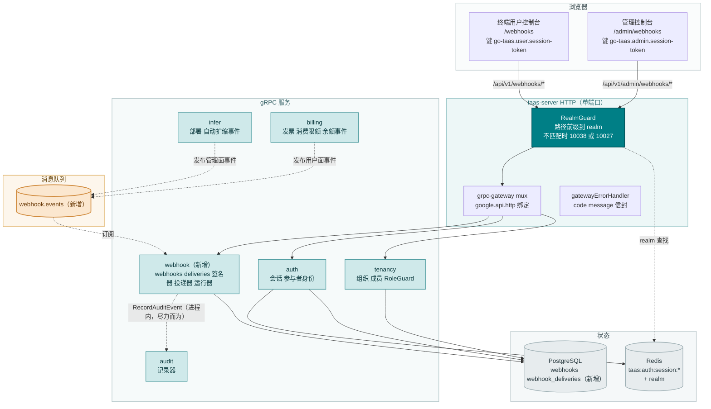
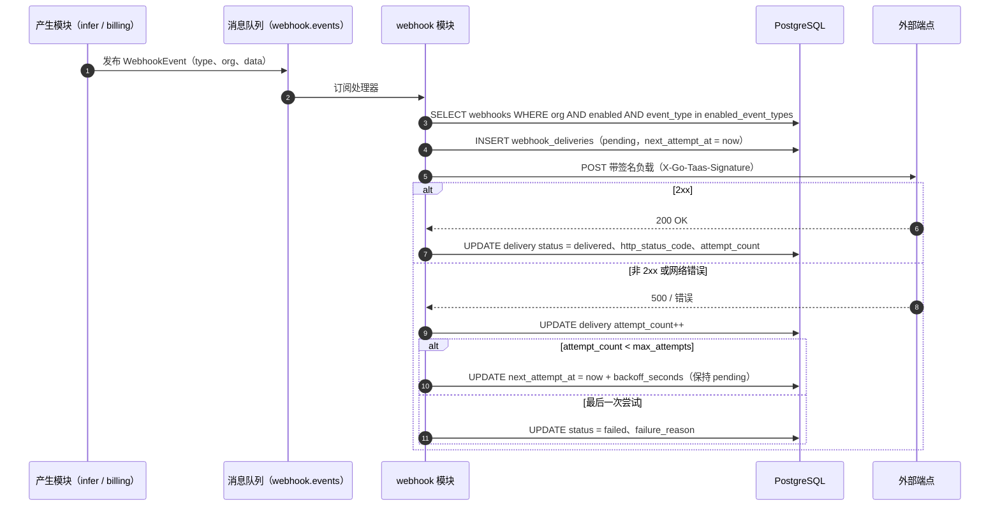
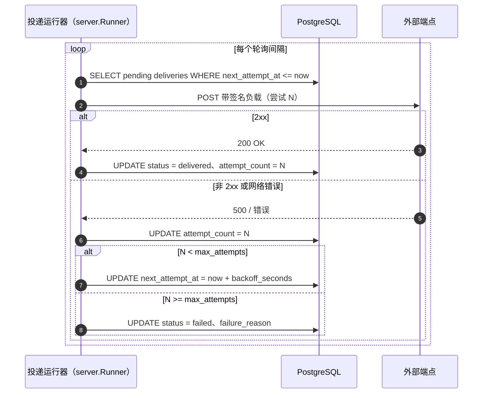
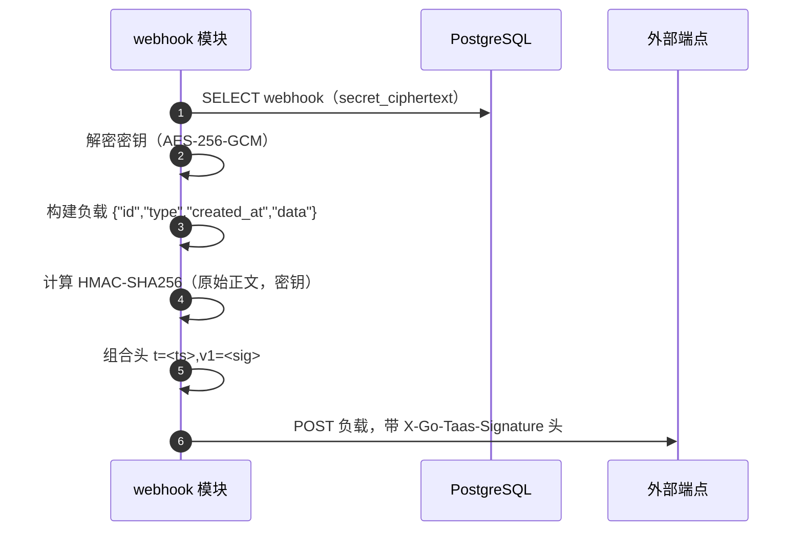
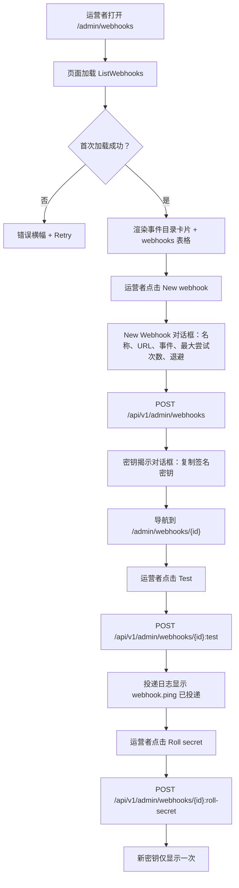

# Webhook 通知与事件订阅 — 架构与详细设计

| 属性 | 内容 |
| --- | --- |
| 特性点 | Webhook 通知与事件订阅 — 配置出站 webhook 以接收平台事件（部署状态、自动扩缩、账单/发票、消费限额超限、余额不足），支持按事件类型启用、签名密钥、重试策略与投递日志（backlog 第 23 行） |
| 文档范围 | 特性-23 的架构与详细设计：新增 `webhook` 模块，拥有 webhook 端点 CRUD、事件订阅、HMAC 签名、重试与投递日志；`webhooks` 与 `webhook_deliveries` 表；`taas.webhook.v1.WebhookService` proto，带管理面/用户面双 HTTP 绑定；`webhook.events` MQ 主题与产生模块的发布点；管理面 Webhooks 页面（`/admin/webhooks`、`/admin/webhooks/:webhookId`）与终端用户面 Webhooks 页面（`/webhooks`、`/webhooks/:webhookId`）；以及错误处理、配置、安全、上线与逐层函数级设计 |
| 归属模块 | 新增 `webhook` 模块（`services/webhook`）：`webhooks` + `webhook_deliveries` 表、CRUD/查询 RPC、事件订阅、签名器、投递器、投递运行器、保留运行器；`infer` 与 `billing`（向 `webhook.events` 发布事件目录）；`audit`（webhook 变更被审计）；`pkg/mq`（新增 `WebhookEvents` 主题）；`pkg/server` 网关（管理前缀与用户前缀绑定）；控制台 web 应用（管理面 `WebhooksPage`/`WebhookDetailPage`，终端用户面 `UserWebhooksPage`/`UserWebhookDetailPage`） |
| 相关文档 | [需求分析与 UI/UX 设计](../design/webhook-notifications.zh-cn.md) · [架构设计](../design/architecture.zh-cn.md) 第 1.2 节（消息队列）、第 2 节（模块职责）、第 3.1 节（管理面/用户面分离）· [控制台面分离](./console-surface-separation.zh-cn.md)（本特性横跨的两个面；realm 守卫，10038）· [审计日志](./audit-logging.zh-cn.md)（webhook 变更必须调用的审计记录器）· [推理自动扩缩](./inference-autoscaling.zh-cn.md)（本特性订阅的自动扩缩事件）· [支付、发票与自动充值](./payments-invoices-auto-recharge.zh-cn.md)（账单/发票事件）· [余额与配额](./balance-quota.zh-cn.md)（余额不足与消费限额事件） |
| 状态 | 架构完成，已移交开发者代理 |

---

## 1. 概述与目标

go-taas 是一个 Token-as-a-Service 平台：它部署推理服务（特性 #2）、自动扩缩（特性 #16）、计量与计费（特性 #4、#5、#8、#14），并执行消费限额（特性 #11）。今天所有这些状态都是**仅拉取**的：运营者或租户必须打开控制台并轮询，才能得知部署失败、服务扩缩、发票开出、消费限额超限或余额不足。外部系统 — 像 Slack 或 PagerDuty 这样的运维工具、租户自己的计费集成或 CI 流水线 — 没有任何办法在事件发生时被**推送**它所关心的事件。

本特性新增**出站 webhook**：运营者或租户注册一个 HTTPS 端点，将其订阅到平台事件目录的一个子集，平台在订阅事件发生时向该端点投递一个带签名的 JSON 负载。每个 webhook 携带按事件类型启用、用于真实性的签名密钥、用于韧性的重试策略，以及用于可观测性与手动重发的投递日志。这是 Phase 4 事件集成路线图项中最小可独立交付的增量：它把「平台改变了状态」变成「平台告诉了我的系统」。

**目标**：新增 `webhook` 模块，拥有 `webhooks` 与 `webhook_deliveries` 表及其生命周期；`taas.webhook.v1.WebhookService`，含十个 RPC，每个都双绑定到管理前缀 `/api/v1/admin/webhooks/*` 与用户前缀 `/api/v1/webhooks/*`；`webhook.events` MQ 主题承载事件目录，`infer` 发布管理面事件、`billing` 发布终端用户面事件；每次投递都用每端点密钥做 HMAC-SHA256 签名，密钥在静态时加密存储；由投递运行器应用有界重试策略（`max_attempts` × `backoff_seconds`）；90 天投递日志，支持手动重发；新增错误码 10701–10705；管理面 Webhooks 页面（`/admin/webhooks`）与详情页（`/admin/webhooks/:webhookId`），以及终端用户面 Webhooks 页面（`/webhooks`）与详情页（`/webhooks/:webhookId`）。

**非目标**（延后，设计第 8 节）：webhook 事件版本化（v1 提供固定事件模式）；投递来源的 IP 白名单；3 天重试窗口（v1 使用有界可配置策略）；投递到非 HTTP 接收端（EventBridge/Event Grid）；超出手动重发的 webhook 事件重放 API；租户可见运营者编排事件与运营者可见租户账户事件（面拆分是强制的）；控制台内通知中心（特性 #26 在控制台内消费这些事件）。

### 1.1 本文档的阅读顺序

第 2 节记录架构决策（AD1–AD12，镜像设计的 D1–D10 加上架构师做的两处细化）。第 3–5 节是组件视图、数据模型与 API 设计。第 6 节是前端架构（两个控制台的页面 → 路由 → API 前缀表，每面认证守卫）。第 7–8 节是时序流程与错误处理。第 9–11 节是配置、安全与上线。第 12–14 节是验收标准追溯、函数级详细设计与有序实现任务清单。

---

## 2. 架构决策

| # | 决策 | 依据 |
| --- | --- | --- |
| AD1 | **新增 `webhook` 模块**（`services/webhook`），拥有 `webhooks` 与 `webhook_deliveries` 表、CRUD/查询 RPC、事件订阅、签名器、投递器、投递运行器与保留运行器，并使用自己的错误块 **107xx** | webhook 消费来自 `infer` 与 `billing` 的事件；专用模块把投递关注点从产生模块中分离出来并给它一个归属，镜像 `metering` 拥有结算的方式（设计 D8） |
| AD2 | **webhook 错误块为 10701–10799，而非 10601–10699。** 审计模块已占用 10601–10603（特性 #15）。设计「计费块（105xx）之后的全新块」的意图通过取审计 106xx 之后的下一个空闲块来满足 | 每个模块都有自己的错误块（架构第 2 节，`pkg/errors/codes.go`）；审计占了 106xx，所以 webhook 取 107xx。这是与现有架构最一致的解读（设计 D9，已细化） |
| AD3 | **签名密钥在静态时加密存储（AES-256-GCM，主密钥来自配置），而非哈希。** HMAC-SHA256 签名需要明文密钥来计算签名；哈希无法签名。加密在静态时保护密钥，同时仍允许签名 | 设计的「仅以哈希存储」（D3）与 HMAC 签名不兼容。加密满足安全意图 — 明文无法被普通读者从数据库恢复 — 同时让模块仍能签名。明文在创建时与显式揭示/轮换时各显示一次（设计 D3，已细化） |
| AD4 | **一个 webhook = 端点 URL + 一组启用的事件类型 + 签名密钥 + 重试策略。** URL 必填且必须是合法 `https://`（本地测试可用 `http://`）URL；事件类型是面目录的非空子集；签名密钥按端点自动生成并在创建时仅显示一次；重试策略为 `max_attempts`（1–10，默认 5）与 `backoff_seconds`（1–3600，默认 60） | 以最小字段列表镜像 Stripe/GitHub 模型（设计 D2） |
| AD5 | **每次投递都用 HMAC-SHA256 签名**，使用端点密钥，对原始 JSON 正文签名，时间戳与签名放在 `X-Go-Taas-Signature` 头中（`t=<ts>,v1=<sig>`） | 对原始正文带时间戳的 HMAC-SHA256 是 Stripe/GitHub 标准，可防止篡改与重放（设计 D3） |
| AD6 | **webhook 可启用或禁用（暂停）。** 禁用的 webhook 停止接收投递，但保留其配置、密钥与投递日志；重新启用后恢复投递。删除 webhook 会移除它及其投递日志 | 暂停是停止行为异常端点而不丢失配置的低风险方式（设计 D4） |
| AD7 | **webhook 有测试/ping 操作**，向端点发送合成 `webhook.ping` 事件并将其记录到投递日志 | GitHub 的 ping 与 Stripe 的 trigger 是在真实事件流动前验证端点的标准方式（设计 D5） |
| AD8 | **投递日志列出每次投递**，含事件类型、状态（`delivered` / `failed` / `pending`）、HTTP 状态码、尝试次数与时间戳。失败的投递可**手动重发**；日志保留 90 天 | 投递日志是调试面；手动重发无需等待重试策略即可恢复丢失事件；90 天保留与请求日志保留一致（设计 D6） |
| AD9 | **签名密钥可随时轮换**（重新生成）；旧密钥立即失效，新密钥仅显示一次 | 密钥轮换是 Stripe 针对疑似泄露的最佳实践；立即失效是 v1 最简单安全的默认（设计 D7） |
| AD10 | **事件目录通过单一新 MQ 主题 `webhook.events` 流动。** 产生模块（`infer` 发布管理面事件，`billing` 发布终端用户面事件）发布规范 `WebhookEvent` 信封；`webhook` 模块订阅并将每个事件路由到匹配的已启用 webhook | 单 Deployment 拓扑（架构第 1.2 节）意味着模块共享一个 broker；单一主题、事件类型放在信封中，使订阅面保持小、路由逻辑集中在一处（设计 D8，已细化） |
| AD11 | **投递通过投递运行器异步进行**（一个 `server.Runner`）。当事件匹配 webhook 时，模块写入 `pending` 投递行，运行器尝试投递，应用重试策略（`max_attempts` × `backoff_seconds`）并将其标记为 `delivered` 或 `failed`。`TestWebhook` 与 `ResendWebhookDelivery` 同步复用同一投递器 | 运行器把投递从 RPC 路径与 MQ 消费者中解耦，使慢端点永远不会阻塞网关或事件消费者；重试策略在一处应用（设计 D2、D6） |
| AD12 | **webhook 变更被审计**（特性 #15）：创建、更新、启用/禁用、删除、轮换密钥、测试与重发各通过审计记录器写一条审计事件 | webhook 端点是安全敏感面（它们可触发外部动作）；审计轨迹必须记录谁改了什么（设计 D10） |

---

## 3. 组件视图

### 3.1 归属

| 层 / 组件 | 拥有 | 本特性的变更 |
| --- | --- | --- |
| **控制网关（`grpc-gateway`）** | webhook RPC 的 HTTP/JSON 门面；realm 守卫（特性 #17）已用 10038 拒绝错误 realm 会话；将 `X-Organization-Id` 作为 gRPC 元数据透传 | 新增 10 个 HTTP webhook RPC 的绑定（第 5 节）；realm 守卫不变 |
| **`webhook` 模块（`services/webhook`）** | `webhooks` + `webhook_deliveries` 表、CRUD/查询 RPC、事件订阅、签名器、投递器、投递运行器、保留运行器 | **新增模块**（AD1） |
| **`infer` 模块** | 管理面事件目录（`deployment.status_changed`、`autoscaling.scaled`、`autoscaling.scale_to_zero`） | 在状态变更与自动扩缩点向 `webhook.events` 发布这些事件（AD10） |
| **`billing` 模块** | 终端用户面事件目录（`billing.invoice_created`、`billing.invoice_paid`、`billing.spend_limit_breached`、`billing.balance_low`） | 在发票、消费限额与余额点向 `webhook.events` 发布这些事件（AD10） |
| **`audit` 模块** | 审计记录器 | 只读：webhook 模块在每次变更后调用 `RecordAuditEvent`（AD12） |
| **`auth` 模块** | 参与者身份、会话 realm、会话活动组织 | 只读：webhook 模块从会话解析组织；`SessionActiveOrg` 为带会话的调用提供组织 |
| **`tenancy` 模块** | 组织、成员、角色、RoleGuard | 只读：`RoleGuard` 按解析出的组织上下文中调用者的角色门控管理面 webhook RPC（10036） |
| **PostgreSQL** | `webhooks` + `webhook_deliveries` 表（新增）；所有其他表不变 | 通过 AutoMigrate 新增两张表（第 4 节） |
| **控制台** | 管理面 Webhooks 页面与终端用户面 Webhooks 页面 | 两个面上共四个新页面（第 6 节） |

### 3.2 运行时组件视图



### 3.3 请求身份链

webhook RPC 复用既有的身份链（console-surface-separation 第 3.3 节）：

1. `RealmGuard`（HTTP，`pkg/server/realm.go`）— 路径前缀决定期望的 realm。`/api/v1/admin/webhooks/*` 期望 `admin`；`/api/v1/webhooks/*` 期望 `user`。无 `Authorization` 头：透传（过渡，特性 #17 的 AD4）。带头：从 Redis 解析会话 realm；不匹配 → 10038，未知/过期/无 realm → 10027。
2. grpc-gateway mux — 按注解路径路由并转发 `authorization` 与 `x-organization-id`。
3. 服务处理器 — 对带会话的调用，`SessionActiveOrg` 使会话的活动组织具有权威性并忽略 `X-Organization-Id`；无会话时，`resolveOrganizationID` 读取过渡头，缺失或为空时返回 10001。
4. `tenancy.RoleGuard` — 按解析出的组织上下文中调用者的角色门控管理面 webhook RPC（10036）。终端用户面 webhook RPC 硬作用域到调用者的组织，无需角色检查。

### 3.4 事件目录及其面拆分

目录按面拆分（设计 D1，特性 #17 的掩码投影规则）：

| 面 | 事件类型 | 产生模块 | webhook `surface` |
| --- | --- | --- | --- |
| admin | `deployment.status_changed`、`autoscaling.scaled`、`autoscaling.scale_to_zero` | `infer` | `admin` |
| end-user | `billing.invoice_created`、`billing.invoice_paid`、`billing.spend_limit_breached`、`billing.balance_low` | `billing` | `user` |

webhook 的 `surface` 从请求路径派生（管理前缀 → `admin`，用户前缀 → `user`），并约束创建时哪些事件类型有效：管理面 webhook 只能订阅三个管理面事件，用户面 webhook 只能订阅四个用户面事件。面目录之外的事件类型返回 10705。`surface` 绝不是请求字段 — 它是绑定的属性，与会话 realm 完全一样。

---

## 4. 数据模型

### 4.1 `webhooks` 表

| 列 | PostgreSQL 类型 | 约束 | 描述 |
| --- | --- | --- | --- |
| `webhook_id` | `uuid` | PRIMARY KEY | 服务器生成的 UUID v4，暴露为 `webhook_id` |
| `organization_id` | `varchar(64)` | NOT NULL，索引（复合） | 所属组织 |
| `surface` | `varchar(16)` | NOT NULL | `admin` / `user` — 该 webhook 订阅哪个面的事件目录（第 3.4 节） |
| `name` | `varchar(64)` | NOT NULL | 显示名称（≤ 64 字符） |
| `url` | `varchar(2048)` | NOT NULL | 端点 URL（合法 `https://` 或 `http://`，≤ 2048 字符） |
| `enabled` | `boolean` | NOT NULL DEFAULT true | 暂停或激活（AD6） |
| `enabled_event_types` | `jsonb` | NOT NULL | 事件类型字符串数组（面目录的非空子集） |
| `secret_ciphertext` | `bytea` | NOT NULL | 静态加密的签名密钥（AES-256-GCM，AD3） |
| `max_attempts` | `int` | NOT NULL DEFAULT 5 | 重试策略：最大尝试次数（1–10） |
| `backoff_seconds` | `int` | NOT NULL DEFAULT 60 | 重试策略：尝试之间秒数（1–3600） |
| `created_at` | `timestamptz` | NOT NULL，索引（复合） | 创建时间（UTC） |
| `updated_at` | `timestamptz` | NOT NULL | 最后更新时间（UTC） |

设计说明：

- 复合索引 `idx_webhooks_org_created (organization_id, created_at)` 用于组织作用域列表；`surface` 索引用于面作用域目录检查。
- `secret_ciphertext` 保存明文密钥的 AES-256-GCM 密文（AD3）。明文绝不存储；仅在签名投递时在内存中解密，并在创建时与显式揭示/轮换时各显示一次。
- 对 `organizations` / `inference_services` / `accounts` 无外键：webhook 必须比已删除的组织或服务存活更久，使其投递日志保持可调试（镜像审计事件的理由）。
- 删除 webhook 级联删除其 `webhook_deliveries` 行（AD6）。

### 4.2 `webhook_deliveries` 表

| 列 | PostgreSQL 类型 | 约束 | 描述 |
| --- | --- | --- | --- |
| `delivery_id` | `uuid` | PRIMARY KEY | 服务器生成的 UUID v4，暴露为 `delivery_id` |
| `webhook_id` | `uuid` | NOT NULL，索引（复合） | 所属 webhook（级联删除） |
| `organization_id` | `varchar(64)` | NOT NULL，索引（复合） | 所属组织 |
| `event_id` | `varchar(128)` | NOT NULL | 源事件 id（或合成 `webhook.ping` 的 id） |
| `event_type` | `varchar(64)` | NOT NULL，索引 | 投递的事件类型 |
| `status` | `varchar(16)` | NOT NULL，索引 | `delivered` / `failed` / `pending`（AD8） |
| `http_status_code` | `int` | NULL | 最后一次 HTTP 响应状态；首次尝试前为 NULL |
| `attempt_count` | `int` | NOT NULL DEFAULT 0 | 已进行的尝试次数 |
| `failure_reason` | `varchar(512)` | NOT NULL DEFAULT '' | 最后失败原因（非 2xx 状态或网络错误） |
| `payload` | `jsonb` | NOT NULL | 发送的签名负载（`{"id","type","created_at","data"}`） |
| `next_attempt_at` | `timestamptz` | NULL | 下次重试到期时间（pending）；delivered/failed 时为 NULL |
| `created_at` | `timestamptz` | NOT NULL，索引（复合） | 首次尝试时间（UTC） |
| `last_attempt_at` | `timestamptz` | NULL | 最后尝试时间（UTC） |

设计说明：

- 复合索引 `idx_webhook_deliveries_webhook_created (webhook_id, created_at)` 用于每 webhook 投递日志；`status` 与 `event_type` 索引用于过滤（FR3.2）。
- `status` 是封闭枚举（`delivered` / `failed` / `pending`）；`pending` 表示投递运行器仍欠尝试（AD11）。
- 投递日志保留 90 天（AD8）；webhook 保留运行器是唯一删除者，它绝不触碰请求日志、凭证、用量记录、计费记录或审计事件。

### 4.3 迁移说明

- 两张表都由 GORM `AutoMigrate` 在 `taas-server` 启动时创建（增量；无数据迁移）。`Migrate`/`MigrateSchemaForFVT` 增加 `Webhook` 与 `WebhookDelivery` 模型。
- 无需 init-SQL 升级路径：两张表在上线时都是新的且为空；投递运行器与产生模块发布器在事件流动后开始填充它们。
- webhook 保留运行器是 `webhook_deliveries` 的唯一删除者；删除 webhook 级联删除其投递。

---

## 5. API 设计

所有 webhook RPC 都属于新的 **`taas.webhook.v1.WebhookService`**（`proto/taas/webhook/v1/webhook.proto`），通过控制网关以 HTTP 提供。每个 RPC 都双绑定：管理面绑定在 `/api/v1/admin/webhooks/*` 下，用户面绑定在 `/api/v1/webhooks/*` 下。面从请求路径派生（第 3.3 节）。

| RPC | HTTP（管理面） | HTTP（用户面） | 状态 | 目的 |
| --- | --- | --- | --- | --- |
| `CreateWebhook` | `POST /api/v1/admin/webhooks` | `POST /api/v1/webhooks` | **新增** | 注册端点 + 事件订阅；返回 `webhook_id` + 明文密钥（仅一次） |
| `ListWebhooks` | `GET /api/v1/admin/webhooks` | `GET /api/v1/webhooks` | **新增** | 带名称搜索、启用过滤、分页与投递摘要的列表 |
| `GetWebhook` | `GET /api/v1/admin/webhooks/{webhook_id}` | `GET /api/v1/webhooks/{webhook_id}` | **新增** | 完整配置；缺失 → 10701 |
| `UpdateWebhook` | `PATCH /api/v1/admin/webhooks/{webhook_id}` | `PATCH /api/v1/webhooks/{webhook_id}` | **新增** | 更新名称/URL/事件/重试；配置错误 → 10702，事件错误 → 10705 |
| `DeleteWebhook` | `DELETE /api/v1/admin/webhooks/{webhook_id}` | `DELETE /api/v1/webhooks/{webhook_id}` | **新增** | 删除 webhook + 投递日志；缺失 → 10701 |
| `SetWebhookEnabled` | `POST /api/v1/admin/webhooks/{webhook_id}:set-enabled` | `POST /api/v1/webhooks/{webhook_id}:set-enabled` | **新增** | 启用/禁用（暂停）webhook |
| `RollWebhookSecret` | `POST /api/v1/admin/webhooks/{webhook_id}:roll-secret` | `POST /api/v1/webhooks/{webhook_id}:roll-secret` | **新增** | 重新生成签名密钥；返回新明文（仅一次） |
| `TestWebhook` | `POST /api/v1/admin/webhooks/{webhook_id}:test` | `POST /api/v1/webhooks/{webhook_id}:test` | **新增** | 发送 `webhook.ping`；禁用 → 10703 |
| `ListWebhookDeliveries` | `GET /api/v1/admin/webhooks/{webhook_id}/deliveries` | `GET /api/v1/webhooks/{webhook_id}/deliveries` | **新增** | 带状态/事件过滤与分页的投递日志 |
| `ResendWebhookDelivery` | `POST /api/v1/admin/webhooks/{webhook_id}/deliveries/{delivery_id}:resend` | `POST /api/v1/webhooks/{webhook_id}/deliveries/{delivery_id}:resend` | **新增** | 重发失败/已投递投递；缺失 → 10704，pending → 10703 |

### 5.1 Proto 契约

```protobuf
syntax = "proto3";

package taas.webhook.v1;

import "google/api/annotations.proto";
import "taas/common/v1/common.proto";

option go_package = "github.com/go-taas/go-taas/proto/taas/webhook/v1;webhookv1";

// WebhookService 管理出站 webhook 及其投递日志。每个 RPC 都双绑定：
// 管理面绑定在 /api/v1/admin/webhooks/* 下，用户面绑定在
// /api/v1/webhooks/* 下。面从请求路径派生（console-surface-separation 第 3.3 节）。
service WebhookService {
  // CreateWebhook 注册端点 + 事件订阅，并返回带仅显示一次明文签名密钥的 webhook。
  rpc CreateWebhook(CreateWebhookRequest) returns (CreateWebhookResponse) {
    option (google.api.http) = {
      post: "/api/v1/admin/webhooks"
      additional_bindings { post: "/api/v1/webhooks" }
    };
  }

  // ListWebhooks 返回该面的 webhook，可按名称搜索、按启用状态过滤、分页。
  rpc ListWebhooks(ListWebhooksRequest) returns (ListWebhooksResponse) {
    option (google.api.http) = {
      get: "/api/v1/admin/webhooks"
      additional_bindings { get: "/api/v1/webhooks" }
    };
  }

  // GetWebhook 返回一个 webhook 的完整配置。
  rpc GetWebhook(GetWebhookRequest) returns (GetWebhookResponse) {
    option (google.api.http) = {
      get: "/api/v1/admin/webhooks/{webhook_id}"
      additional_bindings { get: "/api/v1/webhooks/{webhook_id}" }
    };
  }

  // UpdateWebhook 更新名称/URL/事件/重试。
  rpc UpdateWebhook(UpdateWebhookRequest) returns (UpdateWebhookResponse) {
    option (google.api.http) = {
      patch: "/api/v1/admin/webhooks/{webhook_id}"
      additional_bindings { patch: "/api/v1/webhooks/{webhook_id}" }
    };
  }

  // DeleteWebhook 删除 webhook 及其投递日志。
  rpc DeleteWebhook(DeleteWebhookRequest) returns (DeleteWebhookResponse) {
    option (google.api.http) = {
      delete: "/api/v1/admin/webhooks/{webhook_id}"
      additional_bindings { delete: "/api/v1/webhooks/{webhook_id}" }
    };
  }

  // SetWebhookEnabled 启用或禁用（暂停）webhook。
  rpc SetWebhookEnabled(SetWebhookEnabledRequest) returns (SetWebhookEnabledResponse) {
    option (google.api.http) = {
      post: "/api/v1/admin/webhooks/{webhook_id}:set-enabled"
      additional_bindings { post: "/api/v1/webhooks/{webhook_id}:set-enabled" }
    };
  }

  // RollWebhookSecret 重新生成签名密钥并仅返回一次新明文。
  rpc RollWebhookSecret(RollWebhookSecretRequest) returns (RollWebhookSecretResponse) {
    option (google.api.http) = {
      post: "/api/v1/admin/webhooks/{webhook_id}:roll-secret"
      additional_bindings { post: "/api/v1/webhooks/{webhook_id}:roll-secret" }
    };
  }

  // TestWebhook 发送合成 webhook.ping 事件并将其记录到投递日志。
  rpc TestWebhook(TestWebhookRequest) returns (TestWebhookResponse) {
    option (google.api.http) = {
      post: "/api/v1/admin/webhooks/{webhook_id}:test"
      additional_bindings { post: "/api/v1/webhooks/{webhook_id}:test" }
    };
  }

  // ListWebhookDeliveries 返回投递日志，可按状态与事件类型过滤、分页。
  rpc ListWebhookDeliveries(ListWebhookDeliveriesRequest) returns (ListWebhookDeliveriesResponse) {
    option (google.api.http) = {
      get: "/api/v1/admin/webhooks/{webhook_id}/deliveries"
      additional_bindings { get: "/api/v1/webhooks/{webhook_id}/deliveries" }
    };
  }

  // ResendWebhookDelivery 重发失败或已投递的投递。
  rpc ResendWebhookDelivery(ResendWebhookDeliveryRequest) returns (ResendWebhookDeliveryResponse) {
    option (google.api.http) = {
      post: "/api/v1/admin/webhooks/{webhook_id}/deliveries/{delivery_id}:resend"
      additional_bindings { post: "/api/v1/webhooks/{webhook_id}/deliveries/{delivery_id}:resend" }
    };
  }
}

enum WebhookDeliveryStatus {
  WEBHOOK_DELIVERY_STATUS_UNSPECIFIED = 0;
  WEBHOOK_DELIVERY_STATUS_DELIVERED = 1;
  WEBHOOK_DELIVERY_STATUS_FAILED = 2;
  WEBHOOK_DELIVERY_STATUS_PENDING = 3;
}

message Webhook {
  string webhook_id = 1;
  string organization_id = 2;
  string surface = 3;             // "admin" / "user"
  string name = 4;
  string url = 5;
  bool enabled = 6;
  repeated string enabled_event_types = 7;
  int32 max_attempts = 8;
  int32 backoff_seconds = 9;
  int64 created_at = 10;          // unix 秒
  int64 updated_at = 11;          // unix 秒
  int64 total_deliveries = 12;
  int64 delivered_count = 13;
  int64 failed_count = 14;
}

message WebhookDelivery {
  string delivery_id = 1;
  string webhook_id = 2;
  string event_id = 3;
  string event_type = 4;
  WebhookDeliveryStatus status = 5;
  int32 http_status_code = 6;
  int32 attempt_count = 7;
  string failure_reason = 8;
  int64 created_at = 9;           // unix 秒
  int64 last_attempt_at = 10;     // unix 秒
}

message CreateWebhookRequest {
  string name = 1;
  string url = 2;
  repeated string enabled_event_types = 3;
  int32 max_attempts = 4;         // 0 = 默认 5
  int32 backoff_seconds = 5;      // 0 = 默认 60
}

message CreateWebhookResponse {
  taas.common.v1.Response response = 1;
  Webhook webhook = 2;
  string plaintext_secret = 3;    // 仅显示一次
}

message ListWebhooksRequest {
  taas.common.v1.PageRequest page = 1;
  string name = 2;                // 搜索
  bool enabled_filter = 3;        // 设置以按启用状态过滤
  bool enabled = 4;               // 要过滤的启用状态
}

message ListWebhooksResponse {
  taas.common.v1.Response response = 1;
  repeated Webhook webhooks = 2;
  taas.common.v1.PageMeta page_meta = 3;
}

message GetWebhookRequest { string webhook_id = 1; }

message GetWebhookResponse {
  taas.common.v1.Response response = 1;
  Webhook webhook = 2;
}

message UpdateWebhookRequest {
  string webhook_id = 1;
  string name = 2;
  string url = 3;
  repeated string enabled_event_types = 4;
  int32 max_attempts = 5;
  int32 backoff_seconds = 6;
}

message UpdateWebhookResponse {
  taas.common.v1.Response response = 1;
  Webhook webhook = 2;
}

message DeleteWebhookRequest { string webhook_id = 1; }

message DeleteWebhookResponse {
  taas.common.v1.Response response = 1;
}

message SetWebhookEnabledRequest {
  string webhook_id = 1;
  bool enabled = 2;
}

message SetWebhookEnabledResponse {
  taas.common.v1.Response response = 1;
  Webhook webhook = 2;
}

message RollWebhookSecretRequest { string webhook_id = 1; }

message RollWebhookSecretResponse {
  taas.common.v1.Response response = 1;
  string plaintext_secret = 2;    // 仅显示一次
}

message TestWebhookRequest { string webhook_id = 1; }

message TestWebhookResponse {
  taas.common.v1.Response response = 1;
  WebhookDelivery delivery = 2;
}

message ListWebhookDeliveriesRequest {
  string webhook_id = 1;
  taas.common.v1.PageRequest page = 2;
  WebhookDeliveryStatus status = 3;  // 过滤；UNSPECIFIED = 全部
  string event_type = 4;             // 过滤
}

message ListWebhookDeliveriesResponse {
  taas.common.v1.Response response = 1;
  repeated WebhookDelivery deliveries = 2;
  taas.common.v1.PageMeta page_meta = 3;
}

message ResendWebhookDeliveryRequest {
  string webhook_id = 1;
  string delivery_id = 2;
}

message ResendWebhookDeliveryResponse {
  taas.common.v1.Response response = 1;
  WebhookDelivery delivery = 2;
}
```

### 5.2 契约约束

1. **面分离**：每个 RPC 都双绑定 — 管理面绑定在 `/api/v1/admin/webhooks/*` 下，用户面绑定在 `/api/v1/webhooks/*` 下。管理面绑定需要管理面会话；用户面绑定需要用户面会话。realm 守卫在任何处理器运行前用 10038 拒绝错误 realm 会话（特性 #17）。webhook 的 `surface` 从请求路径派生，绝不来自请求字段。
2. **线上约定不变**：点分页（`?page.offset=0&page.limit=20`），成功返回 HTTP 200，业务错误为 `{"code": <int>, "message": "..."}`，int64 字段为 JSON 字符串。
3. **`CreateWebhook` 校验**：`name`（非空，≤ 64 字符）、`url`（合法 `https://` 或 `http://`，≤ 2048 字符）、`enabled_event_types`（面目录的非空子集，否则 10705）、`max_attempts`（1–10，默认 5）、`backoff_seconds`（1–3600，默认 60）。无效配置返回 10702。它生成签名密钥、加密存储（AD3），并仅返回一次明文。
4. **密钥处理**：明文密钥仅由 `CreateWebhook` 与 `RollWebhookSecret` 返回。`GetWebhook` 绝不返回它。`RollWebhookSecret` 立即使旧密钥失效并仅返回一次新明文（AD9）。
5. **`ListWebhookDeliveries`**：返回 `delivery_id`、`event_type`、`status`（封闭枚举）、`http_status_code`、`attempt_count`、`created_at`、`last_attempt_at`。`failed` 投递携带 `failure_reason`。缺失 webhook 返回 10701。
6. **投递（FR4.2）**：负载为 `{"id", "type", "created_at", "data"}`；签名是对原始 JSON 正文用端点密钥做 HMAC-SHA256，放在 `X-Go-Taas-Signature` 头中，格式 `t=<ts>,v1=<sig>`（AD5）。重试策略最多 `max_attempts` 次，之间间隔 `backoff_seconds`；非 `2xx` 响应或网络错误为失败尝试（FR4.3）。
7. **webhook 变更被审计**（AD12，特性 #15）：创建、更新、启用/禁用、删除、轮换密钥、测试与重发各写一条审计事件。

### 5.3 错误码

所有错误都是统一信封中的 `pkg/errors` 业务码。在 webhook 块 **10701–10705** 中分配五个新码（AD2）；其余已存在。

| 条件 | 代码 | 常量 | 说明 |
| --- | --- | --- | --- |
| `GetWebhook`/`UpdateWebhook`/`DeleteWebhook`/`SetWebhookEnabled`/`RollWebhookSecret`/`TestWebhook`/`ListWebhookDeliveries`/`ResendWebhookDelivery` 上未知 `webhook_id` | 10701 | `CodeWebhookNotFound` | **新增**（AD2） |
| `CreateWebhook`/`UpdateWebhook` 上无效 webhook 配置（名称/URL/重试错误） | 10702 | `CodeWebhookConfigInvalid` | **新增** |
| 无效状态转换（对禁用/pending webhook 测试或重发） | 10703 | `CodeWebhookStateInvalid` | **新增** |
| `ResendWebhookDelivery` 上未知 `delivery_id` | 10704 | `CodeWebhookDeliveryNotFound` | **新增** |
| `CreateWebhook`/`UpdateWebhook` 上事件类型不在面的目录中 | 10705 | `CodeWebhookEventTypeInvalid` | **新增** |
| 调用者角色低于所需角色（管理面组织作用域） | 10036 | `CodeForbidden` | 已有（特性 #10） |
| 缺失/过期/撤销的会话 | 10027 | `CodeSessionInvalid` | 已有（特性 #7） |
| 在另一个前缀上的错误 realm 会话 | 10038 | `CodeRealmMismatch` | 已有（特性 #17） |
| 管理面 API 上缺失 `X-Organization-Id`（过渡） | 10001 | `CodeUnauthorized` | `resolveOrganizationID` 模式 |
| 数据库 / MQ 基础设施故障 | 500 | `CodeInternal` | 经错误归一化 |

---

## 6. 前端架构

### 6.1 页面 → 路由 → API 前缀表

| 页面 / 组件 | 面 | Web 路由 | API 前缀 | 认证守卫 |
| --- | --- | --- | --- | --- |
| **Webhooks 页面** | admin | `/admin/webhooks` | `/api/v1/admin/webhooks` | 管理面会话；RoleGuard 组织作用域 |
| **New Webhook 对话框** | admin | （在 Webhooks 页面上） | `/api/v1/admin/webhooks` | 管理面会话 |
| **Webhook 详情页** | admin | `/admin/webhooks/:webhookId` | `/api/v1/admin/webhooks/{id}` | 管理面会话 |
| **投递日志** | admin | （在 Webhook 详情页上） | `/api/v1/admin/webhooks/{id}/deliveries` | 管理面会话 |
| **Webhooks 页面** | end-user | `/webhooks` | `/api/v1/webhooks` | 用户面会话；硬作用域到调用者组织 |
| **New Webhook 对话框** | end-user | （在 Webhooks 页面上） | `/api/v1/webhooks` | 用户面会话 |
| **Webhook 详情页** | end-user | `/webhooks/:webhookId` | `/api/v1/webhooks/{id}` | 用户面会话 |
| **投递日志** | end-user | （在 Webhook 详情页上） | `/api/v1/webhooks/{id}/deliveries` | 用户面会话 |

> 管理面 Webhooks 页面只调用 `/api/v1/admin/webhooks/*`；终端用户面 Webhooks 页面只调用 `/api/v1/webhooks/*`。两个面绝不共享会话令牌（特性 #17）。

### 6.2 导航位置

- **管理控制台**：在管理面导航中新增 **Webhooks** 项（`/admin/webhooks`，testid `nav-webhooks`），放在 Inference Services 与 Autoscaling 所在的运维组。
- **终端用户控制台**：在用户面导航中新增 **Webhooks** 项（`/webhooks`，testid `user-nav-webhooks`），放在 Billing 与 Activity 旁边。

### 6.3 复用的共享组件与状态

- **API 客户端**（`web/src/api.ts`）：realm 作用域客户端（`createApi(realm)`）已发送 `Authorization: Bearer <realm>.session-token` 与 `X-Organization-Id`（仅当 realm 令牌键为空时）。webhook 页面原样复用；不新增客户端。
- **状态徽章**：`enabled`/`disabled` 与 `delivered`/`failed`/`pending` 徽章样式与 Inference Services 和 Request Logs 状态徽章共享。
- **密钥揭示对话框**：一个小的共享组件，显示一次明文密钥并带 Copy 操作；创建流程与轮换密钥流程复用。
- **空状态 / 数据新鲜度说明**：Request Logs 页面模式（说明投递在摄取窗口内出现，可见时 60 秒轮询）复用于投递日志。
- **过滤栏**：状态/事件类型过滤控件与 Request Logs 页面共享。

### 6.4 每面认证守卫

- **管理面 Webhooks 页面**（`/admin/webhooks`、`/admin/webhooks/:webhookId`）：在 `AdminShell` 内渲染，当 `go-taas.admin.session-token` 非空时运行管理面会话守卫；缺失/过期会话重定向到 `/admin/login?reason=expired`；错误 realm 会话被网关以 10038 拒绝。页面 API 调用发往 `/api/v1/admin/webhooks/*`。
- **终端用户面 Webhooks 页面**（`/webhooks`、`/webhooks/:webhookId`）：在 `UserShell` 内渲染，当 `go-taas.user.session-token` 非空时运行用户面会话守卫；缺失/过期会话重定向到 `/login?reason=expired`。页面 API 调用发往 `/api/v1/webhooks/*`。
- **未认证访客**：任一页面的未认证访客被 shell 守卫重定向到正确的登录页（`/admin/login` vs `/login`）（AC14/AC15）。

### 6.5 控制台契约（为开发者代理钉死）

**Webhooks 页面**（`/admin/webhooks`）：一个事件目录卡片，列出三个管理面事件类型，各带一行描述；一个 webhooks 表格 — Name（链接）、URL、Events（数量）、Status（徽章）、Deliveries（已投递 / 失败）、Created（相对时间）。「New webhook」按钮（`webhook-new`）打开创建对话框；「Refresh」按钮（`webhook-refresh`）重新加载。行操作：View、Edit、Enable/Disable、Delete。可按 Name、Created、Deliveries 排序；可按 Status（全部/启用/禁用）过滤；可按名称搜索；分页。空状态：「No webhooks yet — create one to receive platform events.」错误状态：带 Retry 按钮的错误横幅与「Showing stale data」横幅。Testids：`webhook-table`、`webhook-row-{id}`、`webhook-new`、`webhook-refresh`、`webhook-filter-status`、`webhook-search`。

**New Webhook 对话框**（admin）：字段 Name、Endpoint URL、Events（三个管理面事件类型的复选框组，至少一个）、Max attempts（默认 5）、Backoff (seconds)（默认 60）、Cancel / Create webhook。按设计第 5.2 节校验。成功后，密钥揭示对话框（`webhook-secret-reveal`）显示明文密钥，带 Copy 与 Done；Done 导航到 `/admin/webhooks/{id}`。Testids：`webhook-dialog-name`、`webhook-dialog-url`、`webhook-dialog-events`、`webhook-dialog-max-attempts`、`webhook-dialog-backoff`、`webhook-dialog-submit`、`webhook-secret-reveal`。

**Webhook 详情页**（`/admin/webhooks/:webhookId`）：返回列表的返回链接，头部含 webhook 名称、URL 与状态徽章，以及三个区块：Config（名称、URL、启用的事件类型 chips、最大尝试次数、退避、创建时间；操作 Edit、Enable/Disable、Roll secret、Test、Delete）、Signing secret（掩码 `whsec_••••••••`，带 Reveal 与 Roll secret）、Delivery log（Event type、Status 徽章、HTTP status、Attempts、Created；failed/delivered 行的 Resend 操作）。Testids：`webhook-detail-config`、`webhook-secret-masked`、`webhook-secret-reveal`、`webhook-secret-roll`、`webhook-test`、`webhook-delivery-table`、`webhook-delivery-row-{id}`、`webhook-resend-{id}`。

**终端用户面 Webhooks 页面**（`/webhooks`、`/webhooks/:webhookId`）：在 `UserShell` 下结构相同，目录卡片列出四个终端用户面事件类型，并使用租户的权限拒绝文案。投递日志只显示租户自己的投递。

---

## 7. 时序流程

### 7.1 Webhook 投递（事件驱动）



### 7.2 Webhook 投递重试（投递运行器）



### 7.3 Webhook 签名



### 7.4 Webhook 管理页面流程（管理面）



---

## 8. 错误处理

所有错误都是统一信封中的 `pkg/errors` 业务码（第 5.3 节）。运行器侧失败不是 RPC 错误：投递尝试失败记录在投递行上并按策略重试；保留删除失败被记录并在下一个 tick 重试（凭证保留模式）。产生模块向 `webhook.events` 的发布失败被记录，绝不使产生变更失败（审计尽力而为模式）。

控制台按正文 `code` 分支（`web/src/api.ts` 已如此），绝不按 HTTP 状态。每个新码渲染特定内联消息：10701「webhook not found」、10702「invalid webhook config」、10703「invalid webhook state」、10704「delivery not found」、10705「invalid event type」。

---

## 9. 配置新增

| 键 | 默认 | 描述 |
| --- | --- | --- |
| `webhook.delivery.workers` | `4` | 投递运行器的并发投递尝试数 |
| `webhook.delivery.pollInterval` | `5s` | 投递运行器轮询到期 pending 投递的频率 |
| `webhook.delivery.timeout` | `10s` | 每次尝试的 HTTP 客户端超时 |
| `webhook.retention.enabled` | `true` | 打开或关闭投递日志保留运行器（事件分诊 kill switch） |
| `webhook.retention.deliveryTTL` | `2160h`（90 天） | 早于此的投递被保留运行器删除（AD8） |
| `webhook.retention.batchSize` | `1000` | 每次保留删除的行数 |
| `webhook.retention.interval` | `1h` | 保留轮次之间的 ticker 周期 |
| `webhook.secretEncryptionKey` | `""` | 静态密钥加密的 AES-256-GCM 主密钥（AD3）。为空时回退到从 MQ 命名空间派生的仅开发密钥；生产必须设置它 |

`webhook` 配置块在 `pkg/config` 中新增（`WebhookConfig` + `WebhookDeliveryConfig` + `WebhookRetentionConfig`），遵循 `audit.retention` 模式。`applyDefaults`/`Validate` 设置上述默认值。投递运行器读取 `workers`/`pollInterval`/`timeout`；保留运行器读取 `enabled`/`deliveryTTL`/`batchSize`/`interval`；签名器读取 `secretEncryptionKey`。

---

## 10. 安全考量

- **面分离**：管理面 Webhooks 页面只调用 `/api/v1/admin/webhooks/*`；终端用户面 Webhooks 页面只调用 `/api/v1/webhooks/*`。realm 守卫在任何处理器运行前用 10038 拒绝错误 realm 会话（特性 #17）。
- **管理面组织作用域**：每个管理面 webhook 查询从会话活动组织（或过渡 `X-Organization-Id`）解析组织，并由 `tenancy.RoleGuard` 门控 — 调用者只能管理其可访问组织的 webhook；不可访问组织返回 10036。
- **终端用户面硬作用域**：终端用户面 webhook RPC 硬作用域到调用者的组织；调用者绝不可能看到或管理其他租户的 webhook 或投递。
- **静态密钥**：签名密钥加密存储（AES-256-GCM，AD3），绝不明文。明文在创建时与显式揭示/轮换时各显示一次。`GetWebhook` 绝不返回它。主密钥来自 `webhook.secretEncryptionKey`；生产必须设置它（开发回退从 MQ 命名空间派生，不是生产密钥）。
- **HMAC 签名**：每次投递都用带时间戳的 HMAC-SHA256 对原始正文签名（`X-Go-Taas-Signature: t=<ts>,v1=<sig>`），防止篡改与重放（AD5）。
- **必填密钥**：每个 webhook 都有签名密钥；没有可选密钥路径（设计 D1 的陷阱已避免）。
- **有界重试**：重试策略有界（`max_attempts` 1–10，`backoff_seconds` 1–3600），因此行为异常的端点不会导致无界出站流量（设计 D2 的陷阱已避免）。
- **审计轨迹**：webhook 变更被审计（AD12）— 创建、更新、启用/禁用、删除、轮换密钥、测试与重发各写一条审计事件，因此谁改了安全敏感端点会被记录。
- **v1 无 SSRF 加固**：端点 URL 被校验为语法合法的 `https://`/`http://` URL，但不做白名单；SSRF 加固（IP 白名单）是文档化的非目标（设计第 8 节）。

---

## 11. 上线 / 升级说明

- **两张新表**通过 AutoMigrate（增量）；单独部署 `taas-server`。投递运行器与保留运行器在首次轮次前空闲；在 webhook 与投递存在前查询返回空。
- **产生模块发布器是增量的**：`infer` 与 `billing` 在其事件点向 `webhook.events` 发布；在发布器接线前，该类型的事件不会被投递。webhook 模块订阅 `webhook.events` 并向匹配的 webhook 投递。
- **proto 变更是增量的**：新增 `taas.webhook.v1.WebhookService` 与新 RPC；无既有 RPC 或消息变更。网关 mux 增加新绑定；realm 守卫不变。
- **控制台**：四个新页面加入既有 bundle；管理面导航增加 Webhooks，用户面导航增加 Webhooks。无既有路由变更。
- **无数据迁移**：两张表在上线时都是新的且为空；无需 init-SQL 升级路径。
- **向后兼容**：过渡（无会话、`X-Organization-Id`）路径为 CLI、FVT 与 e2e 套件保留；realm 守卫透传无 `Authorization` 头的请求（特性 #17 AD4）。
- **密钥加密密钥**：生产必须在上线前设置 `webhook.secretEncryptionKey`；开发回退不是生产密钥（第 10 节）。

---

## 12. 验收标准追溯

| # | 标准 | 处理位置 |
| --- | --- | --- |
| AC1 | `CreateWebhook` 用有效配置返回 `webhook_id` 与仅显示一次的明文签名密钥；后续任何 `GetWebhook` 都不返回该密钥 | §5.1、§5.2、§10 |
| AC2 | `CreateWebhook` 用无效 URL/名称/重试返回 10702；用面目录之外的事件类型返回 10705 | §5.2、§5.3 |
| AC3 | `ListWebhooks` 返回该面的 webhook，带名称搜索、启用过滤、分页与投递摘要 | §5.1、§5.2 |
| AC4 | `UpdateWebhook` 更新名称/URL/事件/重试；`SetWebhookEnabled` 暂停并恢复投递；`DeleteWebhook` 删除 webhook 及其投递日志 | §5.1、§4.1 |
| AC5 | `RollWebhookSecret` 重新生成密钥、使旧密钥失效，并仅返回一次新明文 | §5.1、§5.2、§10 |
| AC6 | `TestWebhook` 发送 `webhook.ping` 并记录 `delivered` 投递；测试禁用 webhook 返回 10703 | §5.1、§7.4 |
| AC7 | `ListWebhookDeliveries` 返回带状态/事件过滤与分页的投递日志；`ResendWebhookDelivery` 重发失败投递，未知投递返回 10704 | §5.1、§5.2 |
| AC8 | 订阅事件（如管理面的 `deployment.status_changed`）产生带 `X-Go-Taas-Signature` 头的签名投递到端点；非 `2xx` 响应按策略重试然后标记投递为 `failed` | §7.1、§7.2、§7.3 |
| AC9 | `/admin/webhooks` 页面在首次成功加载后渲染事件目录卡片与 webhooks 表格，带 last-updated 时间戳 | §6.5 |
| AC10 | New Webhook 对话框按指定规则与错误文案校验每个字段；有效提交显示密钥揭示对话框并导航到详情页 | §6.5 |
| AC11 | webhook 详情页显示配置、带 Reveal/Roll 的掩码签名密钥与投递日志；Test 记录 `delivered` 行；失败投递显示 Resend 操作 | §6.5 |
| AC12 | 列表为空时渲染空状态（「No webhooks yet…」）；加载失败保留最后的好数据并显示「Showing stale data」横幅与 Retry 操作 | §6.5 |
| AC13 | `/webhooks` 页面渲染终端用户面事件目录（仅四个租户事件）与租户的 webhook；管理面事件目录绝不在该面显示 | §3.4、§6.5 |
| AC14 | 管理面 webhook 页面仅在管理面可达：路由 `/admin/webhooks` 与 `/admin/webhooks/:webhookId`，每个 API 调用使用 `/api/v1/admin/webhooks/*` 前缀且不含 `/api/v1/webhooks/*` 字符串 | §6.1、§6.4、§10 |
| AC15 | 终端用户面 webhook 页面仅在终端用户面可达：路由 `/webhooks` 与 `/webhooks/:webhookId`，每个 API 调用使用 `/api/v1/webhooks/*` 前缀且不含 `/api/v1/admin/*` 字符串 | §6.1、§6.4、§10 |
| AC16 | 无所需角色的会话在管理面 webhook 页面收到 10036，页面显示标准权限拒绝状态 | §5.3、§6.4、§10 |

---

## 13. 详细设计（逐层函数级职责）

### 13.1 Proto → 服务 → 仓库 → 控制器

| 层 | 文件 | 职责 |
| --- | --- | --- |
| `proto/taas/webhook/v1` | `webhook.proto` | 新增 `WebhookService`，含 10 个双绑定 RPC（第 5.1 节）；枚举 `WebhookDeliveryStatus`；消息 `Webhook`、`WebhookDelivery`、`CreateWebhookRequest/Response`、`ListWebhooksRequest/Response`、`GetWebhookRequest/Response`、`UpdateWebhookRequest/Response`、`DeleteWebhookRequest/Response`、`SetWebhookEnabledRequest/Response`、`RollWebhookSecretRequest/Response`、`TestWebhookRequest/Response`、`ListWebhookDeliveriesRequest/Response`、`ResendWebhookDeliveryRequest/Response`。通过 `buf generate` 重新生成 `webhook.pb.go`/`webhook_grpc.pb.go`/`webhook.pb.gw.go` |
| `services/webhook` | `webhook_model.go` | 新增 GORM 模型 `Webhook` + `WebhookDelivery` + `TableName`（第 4.1、4.2 节） |
| | `webhook_repository.go` | `InsertWebhook(ctx, wh)` — INSERT，返回生成的 id；`FindWebhookByID(ctx, orgID, webhookID)`（未知时 10701）；`ListWebhooks(ctx, orgID, filter)`（名称搜索、启用过滤、分页、带投递摘要）；`UpdateWebhook(ctx, wh)`；`DeleteWebhook(ctx, orgID, webhookID)`（级联删除投递）；`SetWebhookEnabled(ctx, orgID, webhookID, enabled)`；`FindWebhooksForEvent(ctx, orgID, eventType)`（启用 + 事件类型在 `enabled_event_types` 中）；`InsertDelivery(ctx, d)`；`FindDeliveryByID(ctx, orgID, webhookID, deliveryID)`（未知时 10704）；`ListDeliveries(ctx, orgID, webhookID, filter)`（状态/事件过滤、分页）；`UpdateDelivery(ctx, d)`；`FindDueDeliveries(ctx, now, limit)`（pending + `next_attempt_at <= now`）；`DeleteDeliveriesBefore(ctx, cutoff, batch)` |
| | `secret.go` | `GenerateSecret()` — 随机 32 字节密钥，base64url 编码并加 `whsec_` 前缀；`EncryptSecret(plaintext, key)` / `DecryptSecret(ciphertext, key)` — AES-256-GCM（AD3）；不使用 `HashSecret`（密钥是加密的，不是哈希的） |
| | `signer.go` | `Sign(body []byte, secret string, ts int64) string` — 对原始正文做 HMAC-SHA256，返回 `t=<ts>,v1=<sig>`（AD5）；`BuildPayload(event)` — `{"id","type","created_at","data"}` 信封 |
| | `deliverer.go` | `Deliver(ctx, webhook, event) (status, httpCode, err)` — 解密密钥、构建负载、签名、用 `X-Go-Taas-Signature` 头与 `webhook.delivery.timeout` 客户端 POST 到 URL；返回结果供调用方持久化（AD11） |
| | `event_consumer.go` | `EventConsumer`（server.Runner）— 订阅 `webhook.events`，解析 `WebhookEvent` 信封，调用 `FindWebhooksForEvent`，对每个匹配插入 `pending` 投递行（AD10、AD11） |
| | `delivery_runner.go` | `DeliveryRunner`（server.Runner）— 轮询 `FindDueDeliveries`，调用 `Deliver`，并按重试策略持久化结果（AD11）；为测试提取 `DeliverOnce(ctx)` |
| | `webhook_retention_runner.go` | `WebhookRetentionRunner`（server.Runner）+ `RetainOnce(ctx)` — 分批删除早于 `deliveryTTL` 的 `webhook_deliveries`（AD8） |
| | `service.go` | 新 RPC `CreateWebhook`、`ListWebhooks`、`GetWebhook`、`UpdateWebhook`、`DeleteWebhook`、`SetWebhookEnabled`、`RollWebhookSecret`、`TestWebhook`、`ListWebhookDeliveries`、`ResendWebhookDelivery`；`Migrate`/`MigrateSchemaForFVT` 增加 `Webhook` + `WebhookDelivery`；`SessionActiveOrg`/`resolveOrganizationID` 接缝用于组织解析；`RoleGuard` 接缝用于管理面组织作用域；审计记录器接缝（AD12） |
| `services/infer` | `status_consumer.go`、`autoscaling` | 在服务状态转换时向 `webhook.events` 发布 `deployment.status_changed`，在自动扩缩副本变更时发布 `autoscaling.scaled` / `autoscaling.scale_to_zero`（AD10） |
| `services/billing` | `service.go`、`payment_service.go`、`account_service.go` | 在 `GenerateInvoice` 时发布 `billing.invoice_created`，在支付意图已支付时发布 `billing.invoice_paid`，在消费限额超限时发布 `billing.spend_limit_breached`，在余额低于阈值时发布 `billing.balance_low` 到 `webhook.events`（AD10） |
| `services/audit` | `recorder.go` | 只读：webhook 模块在每次变更后调用 `Recorder.Record`（AD12） |
| `pkg/mq` | `mq.go` | 在 `Subjects` 中增加 `WebhookEvents string`，`DefaultSubjects()` 返回 `"webhook.events"`（AD10） |
| `pkg/errors` | `codes.go`/`messages.go` | `CodeWebhookNotFound`（10701）、`CodeWebhookConfigInvalid`（10702）、`CodeWebhookStateInvalid`（10703）、`CodeWebhookDeliveryNotFound`（10704）、`CodeWebhookEventTypeInvalid`（10705）常量 + 规范消息（AD2） |
| `pkg/config` | `api.go`/`configuration.go` | `WebhookConfig` + `WebhookDeliveryConfig` + `WebhookRetentionConfig`（第 9 节）+ `applyDefaults`/`Validate` |
| `apps/taas-server` | `main.go` | 将 `WebhookService` 注册到 gRPC 服务器与网关 mux；在 `srv.Init()` 后注册 `EventConsumer`、`DeliveryRunner` 与 `WebhookRetentionRunner`；将审计记录器接入 webhook 服务 |
| `web/src` | `pages/WebhooksPage.tsx`、`pages/WebhookDetailPage.tsx`、`pages/user/UserWebhooksPage.tsx`、`pages/user/UserWebhookDetailPage.tsx`、`App.tsx`、`api.ts`、`shells/AdminShell.tsx`、`shells/UserShell.tsx` | 路由 `/admin/webhooks`、`/admin/webhooks/:webhookId`、`/webhooks`、`/webhooks/:webhookId`；`Webhook`/`WebhookDelivery`/`CreateWebhook`/`ListWebhooks`/`GetWebhook`/`UpdateWebhook`/`DeleteWebhook`/`SetWebhookEnabled`/`RollWebhookSecret`/`TestWebhook`/`ListWebhookDeliveries`/`ResendWebhookDelivery` API 类型与调用；导航项（第 6.5 节） |
| `test` | `fvt/webhook_notifications_fvt_test.go`、`e2e/tests/webhookNotifications.js` | 第 14 节 |

### 13.2 哪个 React 页面/模块实现每个屏幕

| 屏幕 | React 模块 | 路由 | API 调用 |
| --- | --- | --- | --- |
| Webhooks 页面（管理面） | `web/src/pages/WebhooksPage.tsx` | `/admin/webhooks` | `ListWebhooks`、`CreateWebhook`、`SetWebhookEnabled`、`DeleteWebhook` |
| New Webhook 对话框（管理面） | `web/src/pages/WebhooksPage.tsx`（对话框组件） | （在 Webhooks 页面上） | `CreateWebhook` |
| Webhook 详情页（管理面） | `web/src/pages/WebhookDetailPage.tsx` | `/admin/webhooks/:webhookId` | `GetWebhook`、`UpdateWebhook`、`SetWebhookEnabled`、`RollWebhookSecret`、`TestWebhook`、`DeleteWebhook`、`ListWebhookDeliveries`、`ResendWebhookDelivery` |
| 密钥揭示对话框 | `web/src/components/SecretRevealDialog.tsx`（共享） | （在创建/详情上） | （客户端；显示返回的明文） |
| Webhooks 页面（终端用户面） | `web/src/pages/user/UserWebhooksPage.tsx` | `/webhooks` | `ListWebhooks`、`CreateWebhook`、`SetWebhookEnabled`、`DeleteWebhook` |
| Webhook 详情页（终端用户面） | `web/src/pages/user/UserWebhookDetailPage.tsx` | `/webhooks/:webhookId` | `GetWebhook`、`UpdateWebhook`、`SetWebhookEnabled`、`RollWebhookSecret`、`TestWebhook`、`DeleteWebhook`、`ListWebhookDeliveries`、`ResendWebhookDelivery` |

---

## 14. 测试策略

- **单元**（`services/webhook`，sqlite 内存）：`webhook_repository_test.go` — `InsertWebhook` 往返（AC1）、`FindWebhookByID`（未知时 10701）、`ListWebhooks` 过滤（名称/启用/分页/投递摘要，AC3）、`FindWebhooksForEvent`（组织 + 启用 + 事件类型匹配）、`InsertDelivery`/`FindDeliveryByID`（未知时 10704）、`ListDeliveries` 过滤（状态/事件，AC7）、`FindDueDeliveries`（pending + 到期）、`DeleteDeliveriesBefore` 分批（AC8）。`service_test.go` — `CreateWebhook` 仅返回一次明文密钥且 `GetWebhook` 绝不返回它（AC1）；校验返回 10702/10705（AC2）；`RollWebhookSecret` 使旧密钥失效并仅返回一次新明文（AC5）；`TestWebhook` 记录 `delivered` 投递且禁用 webhook 返回 10703（AC6）；`ResendWebhookDelivery` 重发失败投递且未知投递返回 10704（AC7）；管理面组织作用域返回 10036（AC16）；每次变更写一条审计事件（AD12）。`signer_test.go` — `Sign` 产生 `t=<ts>,v1=<sig>` 头并对照原始正文验证（AC8）。`deliverer_test.go` — 2xx 标记已投递，非 2xx/网络错误为失败尝试，并应用重试策略（AC8）。新文件覆盖率 ≥ 80%。
- **FVT**（`test/fvt/webhook_notifications_fvt_test.go`，计量 FVT 模式：文件 sqlite + `MigrateSchemaForFVT` + `NewForFVT` + 带生产拦截器的 gRPC 服务器 + 带 `FVTHeaderMatcher` 的网关 mux）：通过网关创建 webhook 并断言行与明文密钥（AC1）；`ListWebhooks` 过滤与分页（AC3）；`UpdateWebhook`/`SetWebhookEnabled`/`DeleteWebhook`（AC4）；`RollWebhookSecret`（AC5）；`TestWebhook`（AC6）；`ListWebhookDeliveries`/`ResendWebhookDelivery`（AC7）；在 `webhook.events` 上发布 `deployment.status_changed` 事件并断言带 `X-Go-Taas-Signature` 头的签名投递，且非 2xx 响应重试后标记 `failed`（AC8）；第二个组织绝看不到第一个组织的 webhook，且不可访问组织返回 10036（AC16）。
- **E2E**（`test/e2e/tests/webhookNotifications.js`，`auditLogging.js` 模式）：针对 compose 栈 — 管理面 Webhooks 页面渲染 `webhook-row-{id}`，New Webhook 对话框校验并显示 `webhook-secret-reveal`，详情页显示配置/密钥/投递日志，Test 记录 `delivered` 行，失败投递显示 Resend 操作（AC9–AC11）；空状态与陈旧数据横幅渲染（AC12）；终端用户面 `/webhooks` 页面只显示四个租户事件与租户的 webhook（AC13）；每个页面只调用自己的前缀且未认证访客被重定向到正确的登录页（AC14/AC15）；无所需角色的会话收到 10036 并显示权限拒绝状态（AC16）。
- **回归**：既有 e2e 套件保持绿色；数据面不变 — 请求日志（特性 #12）仍捕获每次推理诊断，webhook 投递不门控推理流量。

---

## 15. 未决问题

| 问题 | 倾向 |
| --- | --- |
| Webhook 事件版本化 | 延后（设计第 8 节）— v1 提供固定事件模式 |
| 投递来源的 IP 白名单 | 延后（设计第 8 节）— SSRF 加固是后续项 |
| 3 天重试窗口 | 刻意省略 — v1 使用有界可配置策略（AD4） |
| 投递到非 HTTP 接收端（EventBridge / Event Grid） | 未来集成 |
| 超出手动重发的 webhook 事件重放 API | 未来细化 |
| 租户可见运营者编排事件 / 运营者可见租户账户事件 | 刻意省略（第 3.4 节） |
| 控制台内通知中心 | 特性 #26 在控制台内消费这些事件 — 此处不在范围内 |
| 密钥加密密钥管理（KMS/HSM） | 未来 — v1 使用配置提供的 AES-256-GCM 主密钥（AD3） |