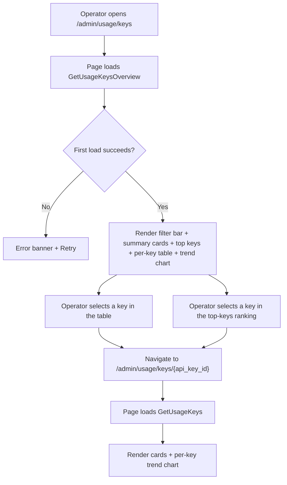
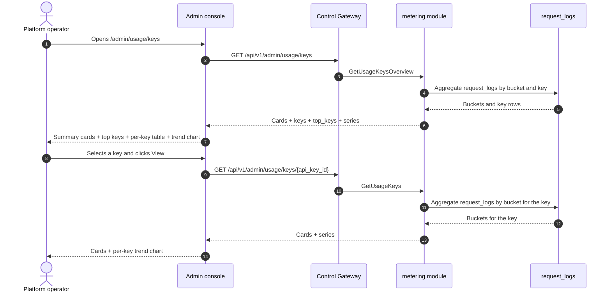

# API Key Usage Analytics — Requirement Analysis and UI/UX Design

| Attribute | Content |
| --- | --- |
| Feature point | API key usage analytics — per-API-key usage and cost breakdown over time (requests, tokens, cost, error rate), top keys, and per-key trend charts (backlog row 28) |
| Document scope | Requirement analysis, competitive research, the admin-surface analytics page for `/admin/usage/keys` (fleet-wide per-key breakdown + top keys + per-key trend), the end-user-surface analytics page for `/usage/keys` (tenant-scoped per-key breakdown + top keys + per-key trend), the page → API surface table, and numbered acceptance criteria |
| Owning modules | `metering` (read-only aggregation over `request_logs` and `usage_records` for per-key metrics), `billing` (read-only: per-key cost from `charge_records`), `web` admin console (`UsageKeysPage`) and end-user console (`UserUsageKeysPage`), `pkg/server` gateway (admin-prefix and user-prefix bindings) |
| Related documents | [Architecture Design](./architecture.md) — §2.5 `metering`, §2.6 `billing` · [Usage Dashboards & Per-Request Cost Attribution](./usage-dashboard.md) — the sibling read-only dashboard and its inline-SVG chart, freshness, range, and group-by conventions · [Model Observability Dashboard](./model-observability.md) — the sibling read-only aggregation over `request_logs` and its per-key breakdown · [Request Logs & API Playground](./request-logs-playground.md) — the `request_logs` table and its `api_key_id` / `status` / `error` / token fields this feature aggregates · [Console Surface Separation](./console-surface-separation.md) — the two surfaces this feature spans, the `UserShell`/`AdminShell` conventions, the masked-projection rule |
| Status | Design complete, handed to the Architect agent |

---

## 1. Background

go-taas records every inference request's metadata — latency, status, error, and token counts — in `request_logs` (feature #12), settles usage into `usage_records` per key per hour (feature #4), and turns settled usage into `charge_records` with amounts per key × model × card × hour (feature #5). The usage dashboard (feature #9) shows cost and token counts with a group-by toggle, and the model observability dashboard (feature #24) shows per-key breakdowns within a single model. What the console still cannot answer is the operator's and tenant's question: *which API key is driving my usage and cost, and how is each key trending?* The usage dashboard groups by key but does not lead with a per-key ranking; the observability dashboard shows per-key breakdowns only within one model; and neither shows a per-key error rate or a per-key trend chart. There is no surface that ranks keys by usage and cost, shows each key's trend over time, and attributes error rate per key.

This feature adds **API key usage analytics**: per-API-key usage and cost breakdown over time (requests, tokens, cost, error rate), top keys, and per-key trend charts. It is a **read-only** aggregation layer — nothing in the inference, metering, or billing pipelines changes. It is the smallest independently valuable increment of Phase 4's productionization roadmap item: it turns "usage is high" into "key `prod-app` drove 60% of this month's cost, with a rising error rate".

### 1.1 How Comparable Products Expose Per-Key Usage Analytics

| Product | Per-key surface | Metrics | Trend / ranking | Notable pitfalls |
| --- | --- | --- | --- | --- |
| **OpenAI Platform** | Usage page per project/key/model: day-granularity cost and token charts | Tokens, cost; latency/error only in per-request logs | Per-key cost/token charts; no explicit ranking | Usage lag (minutes) confuses debugging; no per-key error rate; the "today (partial)" marker needs explaining |
| **Anthropic Console** | Per-day, per-model usage with costs; per-request usage viewer | Tokens, cost | Per-day charts; no per-key ranking | The per-request viewer is admin-only; members see aggregates |
| **Langfuse** | Cost tracking dashboard: cost by model, cost over time, top users and use cases by cost | Tokens, cost per usage type | Top users/keys by cost; cost-over-time charts | Heavy third-party stack; per-key error rate not surfaced in the cost dashboard |
| **Helicone** | Per-key usage and cost breakdown | Requests, tokens, cost, error rate | Per-key trend charts; top keys | Third-party SaaS; some features gated |
| **Together AI** | Usage dashboard per model/key against prepaid credits | Tokens, cost | Key → usage history | Freshness (call → usage visible) is undocumented |
| **SiliconFlow** | Per-model, per-day token usage plus balance history | Tokens, cost | None exposed | No per-request audit; a disputed charge cannot be traced to requests |

### 1.2 Distilled Patterns and Decisions

Patterns worth adopting: (1) **summary cards above a per-key table and a trend chart** — the LLM-gateway dashboards (Langfuse, Helicone) lead with headline cards (requests, tokens, cost, error rate) above a per-key table and a cost-over-time chart, and one dashboard endpoint serving cards + table + series avoids the N+1-call slow console (usage-dashboard D1); (2) **top keys by cost** — Langfuse's "top users and use cases by cost" ranking is the canonical way to answer "which key drives spend"; (3) **per-key trend charts** — Helicone's per-key trend charts show how each key's usage and cost evolve; (4) **per-key error rate** — attributing error rate per key lets the operator spot a misbehaving client; (5) **freshness labeling** — a data-through timestamp and a pending/partial marker, because usage-lag confusion is the most consistently recorded pitfall (OpenAI, usage-dashboard D3); (6) **inline SVG charts** — the console is deliberately dependency-light (usage-dashboard D7).

Pitfalls to avoid: a blocking N+1 dashboard (the slow-console pitfall) — one endpoint returns cards + table + series; averages without a per-key ranking — the ranking is the headline; silently missing pending hours — the freshness marker must be explicit; heavy chart libraries in a dependency-light console; and exposing operator-orchestration internals (service ids, replica counts) to tenants — the tenant surface shows only key-level performance.

**Decisions for go-taas**:

| # | Decision | Rationale |
| --- | --- | --- |
| D1 | **API key analytics exists on both surfaces, with a clean scope split.** The admin surface (`/admin/usage/keys`, `/api/v1/admin/usage/keys/*`) is a **fleet-wide per-key breakdown** — all keys across all orgs, with a top-keys ranking, a per-key table, and a per-key trend chart. The end-user surface (`/usage/keys`, `/api/v1/usage/keys/*`) is a **tenant-scoped per-key breakdown** — the tenant's own keys only, with the same ranking, table, and trend, and no service ids or operator internals | The operator needs cross-org key analytics to spot a misbehaving or dominant key; the tenant needs their own key analytics to attribute usage and cost to their own API keys. Splitting by surface follows feature #17's masked-projection rule: a tenant must not see operator orchestration internals, and an operator's fleet view is operator-scoped. Both surfaces share the same card, table, and chart components |
| D2 | **Metrics are derived from `request_logs` and `usage_records`** (which carry `api_key_id`, `status`, `error`, and the four token counts per request, feature #12), aggregated server-side per key. The metric families are **requests** (count), **tokens** (input + output + cached + reasoning), **cost** (from `charge_records`, integer cents), and **error rate** (error requests ÷ total requests). | `request_logs` already captures everything needed and is written alongside the voucher in the same idempotent handler (feature #12); `charge_records` carry the authoritative per-key cost (feature #5). Aggregating server-side keeps the payload small and the client dependency-light |
| D3 | **One new RPC per surface shape** rather than extending `GetUsageDashboard`: `GetUsageKeysOverview` (admin fleet: cards + top-keys ranking + per-key table + per-key trend) and `GetUsageKeys` (admin per-key drill-down and end-user per-key view: cards + trend for one key). The end-user surface reuses `GetUsageKeys` scoped to the tenant's own keys | The analytics page needs several shapes at once (headline cards, a ranking, a table, a trend); bolting them onto `GetUsageDashboard` would break its established group-by semantics, while separate calls recreate the N+1 slow console. A dedicated pair of RPCs keeps the per-key concern out of the usage dashboard's group-by surface |
| D4 | **Time buckets adapt to the range**: hourly buckets for ranges ≤ 7 days, daily buckets for ranges > 7 days. The range is capped at **92 days** and validation reuses **10404** (the metering range contract) | Hourly granularity for short ranges shows intra-day spikes (the per-key signal); daily for long ranges keeps the payload small. The 92-day cap and 10404 reuse keep the range contract uniform with every metering query (usage-dashboard D6) |
| D5 | **The chart renders with inline SVG** — one bar (or line) per bucket, with a metric switcher (requests / tokens / cost / error rate) — no new charting dependency | The console is deliberately dependency-light; a small, testable SVG component matches the usage-dashboard D7 decision |
| D6 | **Freshness is explicit**: every response carries `data_through` (the last complete bucket covered by request logs) and the console shows a "data through <time>" note plus a pending/partial marker when the selected range extends past it | Usage-lag confusion is the most consistently recorded pitfall (OpenAI, usage-dashboard D3); the marker keeps the freshness story honest with zero new pipeline work |
| D7 | **The end-user surface is tenant-scoped and masked**: `GetUsageKeys` on the user prefix returns only the tenant's own keys, with no service ids, no replica counts, and no other tenants' data | Follows feature #17's masked-projection rule and the observability D7 pattern: tenants get their own key analytics, not operator internals |
| D8 | **New error codes in a usage-keys block (11201–11299)**: **11201 `CodeUsageKeyNotFound`** (unknown `api_key_id`). Range validation reuses **10404** | Usage-keys analytics is a new concern (D3), so its codes live in a fresh block after the tracing block (111xx); distinct not-found keeps "unknown key" actionable, while the range contract stays uniform with metering (D4) |
| D9 | **Usage-keys analytics is read-only and audited only for access** — it writes no data and mutates nothing; the pages are reachable only by authenticated sessions with the appropriate role, and no analytics mutation is audited (there is nothing to mutate) | The feature is a pure aggregation over existing data; the audit trail (feature #15) already covers the underlying request-log and charge-record writes. No new audit events are needed |

## 2. Goals and Non-goals

**Goals**: an admin page `/admin/usage/keys` that shows fleet-wide summary cards, a top-keys ranking, a per-key table, and a per-key trend chart with a metric switcher, plus a per-key drill-down `/admin/usage/keys/:apiKeyId` (D1, D2, D3, D4, D5, D6); an end-user page `/usage/keys` showing the tenant's own cards, ranking, table, and trend, plus a per-key drill-down `/usage/keys/:apiKeyId` (D1, D7); the page → API surface table with exact prefixes (D1); per-page interactive states including empty, error, and permission-denied; numbered acceptance criteria testable in Nightwatch against the compose stack.

**Non-goals**: real-time streaming metrics (the request-log cadence stands); anomaly detection or threshold alerts (feature #26 consumes observability events in-console — out of scope here); saved custom views or dashboards; comparing keys side-by-side in a chart (v1 shows a per-key table and a single-key chart; a comparison chart is future work); exposing service ids, replica counts, or other operator internals to tenants (D7); any change to the inference, metering, or billing pipelines (read-only feature); new audit events (D9).

## 3. Personas and Journeys

| Role | Surface | Journey |
| --- | --- | --- |
| **Platform operator** | admin | Opens `/admin/usage/keys` → sees fleet-wide summary cards and the top-keys ranking → spots a key driving 60% of cost → filters the trend chart to that key → drills into `/admin/usage/keys/:apiKeyId` → sees the key's trend over time → investigates the client |
| **Platform operator (reliability)** | admin | A key's error rate spikes → the operator filters the per-key table by error rate → sees the failing key → drills into request logs (feature #12) to find the failing requests |
| **Tenant developer / Agent** | end-user | Opens `/usage/keys` → sees their own summary cards and top-keys ranking → drills into `/usage/keys/:apiKeyId` → sees the key's trend → attributes usage and cost to their own API keys |
| **Tenant finance / capacity planner** | end-user | Watches per-key cost and token trends over a month → plans capacity and budget → sees the per-key ranking to attribute usage to their own API keys |

> Terminology: the consumer-side caller is an **Agent** in English and 「智能体」 in Chinese, consistent with the repository convention.

## 4. Feature Requirements

### FR1 — Admin fleet-wide per-key overview

- **FR1.1** `GetUsageKeysOverview` (`GET /api/v1/admin/usage/keys`) returns the fleet-wide per-key analytics for a time range and optional filters: summary cards, a top-keys ranking, a per-key table, and a per-key trend. It takes `since`/`until` (unix seconds; defaults `until = now`, `since = until − 24h`), `model_id` (optional), and `organization_id` (optional, via `X-Organization-Id`). `since > until` or a range > 92 days returns **10404** (D4).
- **FR1.2** The response's `cards` carry `request_count`, `error_count`, `error_rate` (derived client-side as error ÷ requests), `total_tokens`, `total_cost_cents`, `avg_latency_ms`, `p95_latency_ms`, and `data_through` (the last complete bucket covered by request logs) (D2, D6).
- **FR1.3** The response's `keys[]` carry one row per API key in the range: `api_key_id`, `api_key_name`, `organization_id`, `request_count`, `error_rate`, `total_tokens`, `total_cost_cents`, `avg_latency_ms`, `p95_latency_ms`, and `data_through`. The table is sorted by `total_cost_cents` descending by default.
- **FR1.4** The response's `top_keys[]` carry the top N keys (default 5) by `total_cost_cents` in the range: `api_key_id`, `api_key_name`, `total_cost_cents`, `request_count`, `total_tokens`, and `share_pct` (the key's share of the range's total cost, derived client-side as key cost ÷ total cost).
- **FR1.5** The response's `series[]` carry one entry per time bucket (hourly for ranges ≤ 7 days, daily otherwise, D4): `bucket` (unix seconds), `request_count`, `error_count`, `error_rate`, `total_tokens`, `total_cost_cents`, `avg_latency_ms`, `p95_latency_ms`. When `api_key_id` is set, the series is for that key; otherwise it is fleet-wide.

### FR2 — Admin per-key drill-down

- **FR2.1** `GetUsageKeys` (`GET /api/v1/admin/usage/keys/{api_key_id}`) returns the single-key analytics for a time range: summary cards and a per-key trend. It takes `since`/`until` (same defaults and 10404 range rule as FR1.1). An unknown `api_key_id` returns **11201 `CodeUsageKeyNotFound`** (D8).
- **FR2.2** The response's `cards` and `series[]` mirror FR1.2/FR1.5 scoped to the key.

### FR3 — End-user per-key view

- **FR3.1** `GetUsageKeys` (`GET /api/v1/usage/keys/{api_key_id}`) returns the **tenant's own** single-key analytics for a time range: summary cards and a per-key trend. It takes `since`/`until` (same defaults and 10404 range rule). An unknown `api_key_id` returns **11201** (D8).
- **FR3.2** The response is scoped to the caller's organization (D7): it aggregates only the tenant's own `request_logs` and `charge_records` for the key, and exposes **no** service ids, replica counts, or other tenants' data (D7).

### FR4 — Surface and API binding

- **FR4.1** The admin usage-keys pages live on the **admin surface**: routes `/admin/usage/keys` and `/admin/usage/keys/:apiKeyId`, API prefix `/api/v1/admin/usage/keys/*`. They are added to the `AdminShell` navigation (feature #17) as "Usage Keys" (or under a "Usage" group).
- **FR4.2** The end-user usage-keys pages live on the **end-user surface**: routes `/usage/keys` and `/usage/keys/:apiKeyId`, API prefix `/api/v1/usage/keys/*`. They are added to the `UserShell` navigation (feature #17) as "Usage Keys".
- **FR4.3** The admin pages call only `/api/v1/admin/usage/keys/*` routes; the end-user pages call only `/api/v1/usage/keys/*`. Neither contains the other surface's prefix string (feature #17, D1).
- **FR4.4** The end-user pages never expose operator internals (service ids, replica counts) and never aggregate other tenants' data (D7).

## 5. UI Design

### 5.1 Page: `/admin/usage/keys` — Usage Keys (admin)

**Purpose**: give the platform operator a fleet-wide per-key analytics view — summary cards, a top-keys ranking, a per-key table, and a per-key trend chart — to spot a dominant or misbehaving key.

**Surface**: admin — route `/admin/usage/keys`, API `/api/v1/admin/usage/keys/*`.

**Layout**: rendered inside `AdminShell` (feature #17). A page header ("Usage Keys", subtitle "Per-API-key usage and cost over time") with a **Refresh** action (secondary). Below:

1. **Filter bar** — a **Time range** control (presets 24 h / 7 d / 30 d / custom with a date-time picker) and a **Model** filter (dropdown, "All models" default). Changing either refetches.
2. **Summary cards** — a row of cards: **Requests**, **Error rate**, **Total tokens**, **Total cost**, **Avg latency**, **p95 latency**. Each card shows the value for the selected range and model filter, with a "data through <time>" freshness note (D6).
3. **Top keys** — a ranked list of the top N keys (default 5) by cost, each showing the key name, cost, request count, token count, and a share bar (share of the range's total cost). Clicking a key opens its drill-down.
4. **Per-key table** — the fleet's keys with columns: **API key** (link to the drill-down), **Organization**, **Requests**, **Error rate**, **Total tokens**, **Total cost**, **Avg latency**, **p95 latency**, **Data through**. Row action **View** opens the drill-down.
5. **Per-key trend chart** — an inline-SVG chart (D5) with a **metric switcher** (Requests / Tokens / Cost / Error rate). One bar (or line) per bucket; when a key is selected the series is that key, otherwise fleet-wide.

**Interactive states**:

| State | Behaviour |
| --- | --- |
| Default | Filter bar + summary cards + top keys + per-key table + trend chart render from the first successful load; last-updated shows the load time |
| Loading | Skeleton cards and table; Refresh is disabled |
| Empty | "No usage data in this range." with a hint to widen the range; the filter bar stays visible |
| Error | An error banner with the message and a Retry button; the page keeps its last good data with a "Showing stale data" banner |
| Disabled | Refresh is disabled while a load is in flight; the metric switcher is disabled while a refetch is in flight |
| Permission-denied | A session without the required role receives 10036 and the page shows the standard permission-denied state (feature #17) with a link back to the admin home |

**Per-key table columns**: API key (link), Organization, Requests, Error rate, Total tokens, Total cost, Avg latency, p95 latency, Data through. Sortable by Requests, Error rate, Total tokens, Total cost, Avg latency, and p95 latency. Filterable by the Model dropdown; paginated.

### 5.2 Page: `/admin/usage/keys/:apiKeyId` — Usage Key Detail (admin)

**Purpose**: show one key's usage and cost over time — cards and a per-key trend — so the operator can investigate a single key's requests, tokens, cost, and error rate.

**Surface**: admin — route `/admin/usage/keys/:apiKeyId`, API `/api/v1/admin/usage/keys/{api_key_id}`.

**Layout**: a detail page under `AdminShell` with a back link to the overview. A header with the key name. Below:

1. **Filter bar** — a **Time range** control (presets 24 h / 7 d / 30 d / custom).
2. **Summary cards** — the same card set as §5.1, scoped to the key.
3. **Per-key trend chart** — the inline-SVG chart with the metric switcher, scoped to the key.

**Interactive states**: identical to §5.1, with the empty copy "No usage data for this key in this range." and the not-found state for an unknown `api_key_id` (11201) showing the standard not-found state with a link back to the overview.

### 5.3 Page: `/usage/keys` — Usage Keys (end-user)

**Purpose**: give a tenant developer / Agent a view of their own per-key usage and cost — summary cards, a top-keys ranking, a per-key table, and a per-key trend chart — to attribute usage and cost to their own API keys.

**Surface**: end-user — route `/usage/keys`, API `/api/v1/usage/keys/*`.

**Layout**: rendered inside `UserShell` (feature #17). A page header ("Usage Keys", subtitle "Your per-API-key usage and cost over time") with a **Refresh** action (secondary). Below:

1. **Filter bar** — a **Time range** control (presets 24 h / 7 d / 30 d / custom) and a **Model** filter (dropdown, "All models" default).
2. **Summary cards** — the same card set as §5.1, scoped to the tenant's own usage (D7).
3. **Top keys** — the tenant's own top N keys by cost, with the same share bars as §5.1.
4. **Per-key table** — the tenant's own keys with the same columns as §5.1, scoped to the tenant's own keys. No Organization column (the tenant sees only their own org).
5. **Per-key trend chart** — the inline-SVG chart with the metric switcher, scoped to the tenant's own usage.

**Interactive states**: identical to §5.1, with the empty copy "No usage data in this range." and the permission-denied copy for the tenant's own errors (10005 org gone / 10017 org disabled from §8.2 of feature #17, 10027/10038 redirect per FR4.3). The page exposes no service ids or operator internals (D7).

**Per-key table columns**: API key (link), Requests, Error rate, Total tokens, Total cost, Avg latency, p95 latency, Data through. Sortable and paginated as in §5.1.

### 5.4 Page: `/usage/keys/:apiKeyId` — Usage Key Detail (end-user)

**Purpose**: give a tenant developer / Agent a view of one of their own keys' usage and cost over time — cards and a per-key trend — to attribute usage and cost to their own API keys.

**Surface**: end-user — route `/usage/keys/:apiKeyId`, API `/api/v1/usage/keys/{api_key_id}`.

**Layout**: a detail page under `UserShell` with a back link to the overview. A header with the key name. Below:

1. **Filter bar** — a **Time range** control (presets 24 h / 7 d / 30 d / custom).
2. **Summary cards** — the same card set as §5.1, scoped to the tenant's own usage of the key (D7).
3. **Per-key trend chart** — the inline-SVG chart with the metric switcher, scoped to the tenant's own usage.

**Interactive states**: identical to §5.2, with the empty copy "No usage data for this key in this range." and the permission-denied copy for the tenant's own errors (10005/10017 from feature #17 §8.2). The page exposes no service ids or operator internals (D7).

### 5.5 Flow

## 6. API Surface Implications

All usage-keys RPCs belong to the **`metering` module** (D3), served as HTTP via the Control Gateway. Admin routes are on the **admin prefix** `/api/v1/admin/usage/keys/*` (D1); the end-user routes are on the **user prefix** `/api/v1/usage/keys/*` (D1).

| RPC | Route | Prefix | Status | Purpose |
| --- | --- | --- | --- | --- |
| `GetUsageKeysOverview` | `GET /api/v1/admin/usage/keys` | admin | **new** | Fleet cards + top-keys ranking + per-key table + per-key trend |
| `GetUsageKeys` | `GET /api/v1/admin/usage/keys/{api_key_id}` · `GET /api/v1/usage/keys/{api_key_id}` | admin · user | **new** | Single-key cards + per-key trend (admin: any key; user: tenant-scoped) |

**Contract notes for the Architect agent**:

1. `GetUsageKeysOverview` validates `since`/`until` (int64 unix seconds; defaults `until = now`, `since = until − 24h`); `since > until` or a range > 92 days returns 10404 (D4). `model_id` and `organization_id` are optional filters.
2. `GetUsageKeys` validates the same range contract; an unknown `api_key_id` returns 11201 (D8). On the user prefix it is scoped to the caller's organization (D7) and exposes no service ids or operator internals.
3. Buckets are hourly for ranges ≤ 7 days and daily otherwise (D4); each bucket carries `bucket`, `request_count`, `error_count`, `error_rate`, `total_tokens`, `total_cost_cents`, `avg_latency_ms`, `p95_latency_ms`. `error_rate` and `share_pct` are derived client-side; the wire carries integer counts, integer milliseconds, and integer cents only.
4. Every response carries `data_through` (the last complete bucket covered by request logs) for the freshness marker (D6).
5. Aggregation reads `request_logs` (feature #12) — `api_key_id`, `status`, `error`, and the four token counts per request — and `charge_records` (feature #5) for per-key cost; it writes nothing (D9).
6. Wire conventions unchanged: dotted pagination where lists apply, HTTP 200 on success, business errors as `{"code": <int>, "message": "..."}`, int64 fields serialized as JSON strings.

Error codes (usage-keys block 11201–11299, `pkg/errors/codes.go`):

| Condition | Code | Constant | Notes |
| --- | --- | --- | --- |
| An unknown `api_key_id` | 11201 | `CodeUsageKeyNotFound` | **New** (D8) |
| A malformed or over-long range | 10404 | `CodeRequestLogRangeInvalid` | Reused (D4) — the metering range contract |
| Database / infrastructure failure | 500 | `CodeInternal` | Via error normalization |

## 7. Acceptance Criteria

| # | Criterion | Level |
| --- | --- | --- |
| AC1 | `GetUsageKeysOverview` with a valid range returns summary cards, a top-keys ranking, a per-key table, and a time-series; a range > 92 days or `since > until` returns 10404 | FVT |
| AC2 | `GetUsageKeysOverview` returns `top_keys[]` sorted by cost descending with a client-derived `share_pct` | FVT |
| AC3 | `GetUsageKeys` (admin) returns single-key cards and a per-key trend; an unknown `api_key_id` returns 11201 | FVT |
| AC4 | `GetUsageKeys` (user) returns only the caller's organization's usage of the key, with no service ids or operator internals | FVT |
| AC5 | Buckets are hourly for ranges ≤ 7 days and daily for ranges > 7 days; every response carries `data_through` | FVT |
| AC6 | The `/admin/usage/keys` page renders the filter bar, summary cards, the top-keys ranking, the per-key table, and the inline-SVG trend chart from the first successful load, with a last-updated timestamp | E2E |
| AC7 | Changing the time range or model filter refetches and re-renders the cards, table, and chart; the metric switcher toggles the chart metric | E2E |
| AC8 | The empty state ("No usage data in this range.") renders when no data matches; a failed load keeps the last good data with a "Showing stale data" banner and a Retry action | E2E |
| AC9 | The `/admin/usage/keys/:apiKeyId` page renders the key's cards and per-key trend chart; an unknown key shows the not-found state | E2E |
| AC10 | The `/usage/keys` and `/usage/keys/:apiKeyId` pages render the tenant's own cards, ranking, table, and trend, with no service ids or operator internals visible | E2E |
| AC11 | The admin usage-keys pages are reachable only on the admin surface: routes `/admin/usage/keys` and `/admin/usage/keys/:apiKeyId`, every API call uses the `/api/v1/admin/usage/keys/*` prefix with no `/api/v1/usage/keys/*` string | E2E (surface separation) |
| AC12 | The end-user usage-keys pages are reachable only on the end-user surface: routes `/usage/keys` and `/usage/keys/:apiKeyId`, every API call uses the `/api/v1/usage/keys/*` prefix with no `/api/v1/admin/*` string | E2E (surface separation) |
| AC13 | A session without the required role receives 10036 on the admin usage-keys pages and the page shows the standard permission-denied state | E2E |

## 8. Out of Scope (tracked elsewhere)

| Item | Where |
| --- | --- |
| Real-time streaming metrics | Future refinement — the request-log cadence stands |
| Anomaly detection / threshold alerts | Feature #26 consumes observability events in-console — out of scope here |
| Saved custom views / dashboards | Future refinement |
| Comparing keys side-by-side in a chart | Future refinement — v1 shows a per-key table and a single-key chart |
| Tenant visibility of operator orchestration internals (service ids, replica counts) | Deliberately absent (D7) |
| Any change to the inference, metering, or billing pipelines | Deliberately absent — read-only feature (D9) |
| New audit events for usage-keys analytics access | Deliberately absent — nothing to mutate (D9) |