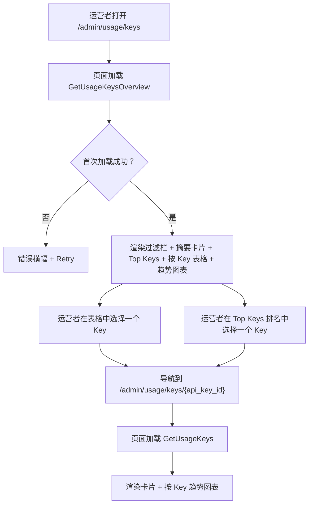
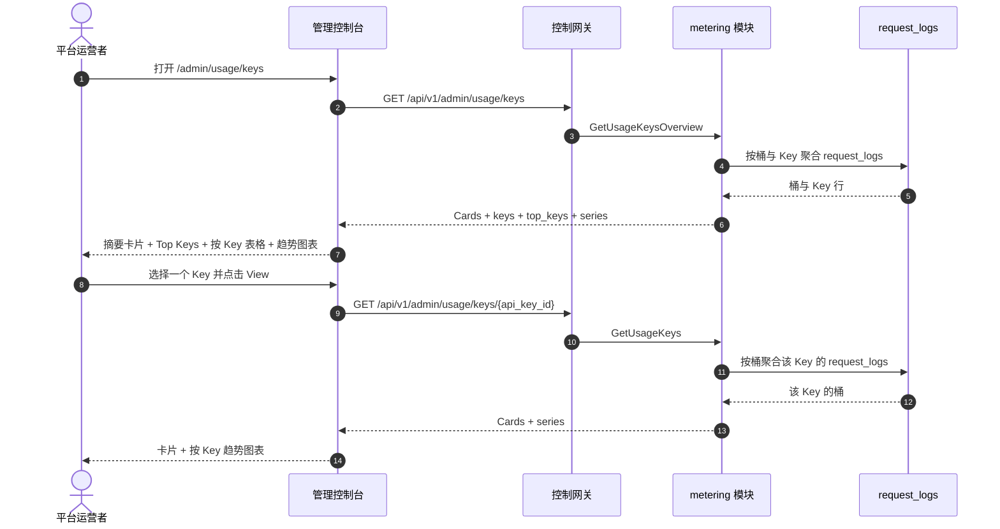

# API Key 用量分析 — 需求分析与 UI/UX 设计

| 属性 | 内容 |
| --- | --- |
| 特性点 | API Key 用量分析 — 按 API Key 展示随时间变化的用量与成本拆解（请求数、token、成本、错误率）、Top Keys 与按 Key 趋势图表（backlog 第 28 行） |
| 文档范围 | 需求分析与 UI/UX 设计：`/admin/usage/keys` 管理面分析页面（集群级按 Key 拆解 + Top Keys + 按 Key 趋势），`/usage/keys` 终端用户面分析页面（租户作用域按 Key 拆解 + Top Keys + 按 Key 趋势），页面 → API 面映射表，以及编号验收标准 |
| 归属模块 | `metering`（对 `request_logs` 与 `usage_records` 的只读聚合，用于按 Key 指标），`billing`（只读：来自 `charge_records` 的按 Key 成本），`web` 管理控制台（`UsageKeysPage`）与终端用户控制台（`UserUsageKeysPage`），`pkg/server` 网关（管理前缀与用户前缀绑定） |
| 相关文档 | [架构设计](./architecture.md) — 第 2.5 节 `metering`、第 2.6 节 `billing` · [用量仪表盘与按请求成本归因](./usage-dashboard.zh-cn.md) — 姊妹只读仪表盘及其内联 SVG 图表、新鲜度、范围与 group-by 约定 · [模型可观测性仪表盘](./model-observability.zh-cn.md) — 对 `request_logs` 的姊妹只读聚合及其按 Key 拆分 · [请求日志与 API 游乐场](./request-logs-playground.zh-cn.md) — 本特性聚合的 `request_logs` 表及其 `api_key_id` / `status` / `error` / token 字段 · [控制台面分离](./console-surface-separation.zh-cn.md) — 本特性横跨的两个面、`UserShell`/`AdminShell` 约定、掩码投影规则 |
| 状态 | 设计完成，已移交架构师代理 |

---

## 1. 背景与竞品调研

go-taas 在 `request_logs` 中记录每个推理请求的元数据 — 延迟、状态、错误与 token 计数（特性 #12），把用量按 Key 每小时结算进 `usage_records`（特性 #4），并把已结算用量转成带金额的 `charge_records`（按 Key × 模型 × 卡型 × 小时，特性 #5）。用量仪表盘（特性 #9）显示成本与 token 计数，带 group-by 切换；模型可观测性仪表盘（特性 #24）在单个模型内显示按 Key 拆分。控制台仍然无法回答运营者与租户反复提出的问题：*哪个 API Key 在驱动我的用量与成本，每个 Key 如何随时间变化？* 用量仪表盘按 Key 分组但不以按 Key 排名开场；可观测性仪表盘只在单个模型内显示按 Key 拆分；两者都不显示按 Key 错误率或按 Key 趋势图表。没有任何面按用量与成本对 Key 排名、显示每个 Key 随时间变化的趋势，并按 Key 归因错误率。

本特性新增**API Key 用量分析**：按 API Key 展示随时间变化的用量与成本拆解（请求数、token、成本、错误率）、Top Keys 与按 Key 趋势图表。它是**只读**聚合层 — 推理、计量或计费流水线没有任何变化。这是 Phase 4 生产化路线图项中最小可独立交付的增量：它把「用量很高」变成「Key `prod-app` 驱动了本月 60% 的成本，且错误率在上升」。

### 1.1 竞品的按 Key 用量分析呈现

| 产品 | 按 Key 面 | 指标 | 趋势 / 排名 | 主要陷阱 |
| --- | --- | --- | --- | --- |
| **OpenAI Platform** | 每个项目/密钥/模型的 Usage 页面：日粒度成本与 token 图表 | Token、成本；延迟/错误仅在按请求日志中呈现 | 按 Key 成本/token 图表；无显式排名 | 用量滞后（分钟级）困扰调试；无按 Key 错误率；「today (partial)」标记需要解释 |
| **Anthropic Console** | 按日、按模型的用量与成本；按请求用量查看器 | Token、成本 | 按日图表；无按 Key 排名 | 按请求查看器仅管理员可用；成员只见聚合 |
| **Langfuse** | 成本追踪仪表盘：按模型成本、随时间成本、按成本 Top 用户与用例 | 每用量类型 token、成本 | 按成本 Top 用户/Key；成本随时间图表 | 重型第三方栈；成本仪表盘不呈现按 Key 错误率 |
| **Helicone** | 按 Key 用量与成本拆解 | 请求数、token、成本、错误率 | 按 Key 趋势图表；Top Keys | 第三方 SaaS；部分功能受限 |
| **Together AI** | 按模型/Key 的用量仪表盘，对照预付额度 | Token、成本 | Key → 用量历史 | 新鲜度（调用 → 用量可见）未记录 |
| **SiliconFlow** | 按模型、按日的 token 用量加余额历史 | Token、成本 | 无暴露 | 无按请求审计；争议费用无法追溯到请求 |

### 1.2 提炼出的模式与决策

值得采纳的模式：(1) **按 Key 表格与趋势图表上方的摘要卡片** — LLM 网关仪表盘（Langfuse、Helicone）都以头部卡片（请求数、token、成本、错误率）加按 Key 表格与成本随时间图表开场，一个仪表盘端点同时返回卡片 + 表格 + 序列避免了 N+1 慢控制台（usage-dashboard D1）；(2) **按成本 Top Keys** — Langfuse 的「按成本 Top 用户与用例」排名是回答「哪个 Key 驱动支出」的规范方式；(3) **按 Key 趋势图表** — Helicone 的按 Key 趋势图表显示每个 Key 的用量与成本如何演变；(4) **按 Key 错误率** — 按 Key 归因错误率让运营者发现行为异常的客户端；(5) **新鲜度标注** — data-through 时间戳与 pending/partial 标记，因为用量滞后困惑是最常被记录的陷阱（OpenAI、usage-dashboard D3）；(6) **内联 SVG 图表** — 控制台刻意依赖精简（usage-dashboard D7）。

需要避免的陷阱：阻塞式 N+1 仪表盘（慢控制台陷阱）— 一个端点返回卡片 + 表格 + 序列；只有平均值没有按 Key 排名 — 排名是头条；静默缺失 pending 小时 — 新鲜度标记必须显式；在依赖精简的控制台中使用重型图表库；以及向租户暴露运营者编排内部信息（服务 id、副本数）— 租户面只显示 Key 级性能。

**go-taas 的决策**：

| # | 决策 | 依据 |
| --- | --- | --- |
| D1 | **API Key 分析存在于两个面，作用域清晰拆分。** 管理面（`/admin/usage/keys`、`/api/v1/admin/usage/keys/*`）是**集群级按 Key 拆解** — 跨所有组织的所有 Key，带 Top Keys 排名、按 Key 表格与按 Key 趋势图表。终端用户面（`/usage/keys`、`/api/v1/usage/keys/*`）是**租户作用域按 Key 拆解** — 仅租户自己的 Key，带相同的排名、表格与趋势，且无服务 id 或运营者内部信息 | 运营者需要跨组织 Key 分析来发现行为异常或占主导的 Key；租户需要自己的 Key 分析来把用量与成本归因到自己的 API Key。按面拆分遵循特性 #17 的掩码投影规则：租户绝不能看到运营者编排内部信息，运营者的集群视图也是运营者作用域。两个面共享相同的卡片、表格与图表组件 |
| D2 | **指标由 `request_logs` 与 `usage_records` 派生**（每请求携带 `api_key_id`、`status`、`error` 与四个 token 计数，特性 #12），在服务端按 Key 聚合。指标族为**请求数**（计数）、**token**（输入 + 输出 + 缓存 + 推理）、**成本**（来自 `charge_records`，整数分）与**错误率**（错误请求 ÷ 总请求）。 | `request_logs` 已捕获所需的一切，并在同一幂等处理器中与 voucher 一起写入（特性 #12）；`charge_records` 携带权威的按 Key 成本（特性 #5）。服务端聚合保持负载小且客户端依赖精简 |
| D3 | **每个面形状一个 RPC**，而非扩展 `GetUsageDashboard`：`GetUsageKeysOverview`（管理面集群：卡片 + Top Keys 排名 + 按 Key 表格 + 按 Key 趋势）与 `GetUsageKeys`（管理面按 Key 下钻与终端用户面按 Key 视图：单 Key 卡片 + 趋势）。终端用户面复用 `GetUsageKeys`，作用域到租户自己的 Key | 分析页面需要多种形状（头部卡片、排名、表格、趋势）；把它们塞进 `GetUsageDashboard` 会破坏其既有的 group-by 语义，而分开调用会重现 N+1 慢控制台。专用 RPC 对把按 Key 关注点从用量仪表盘的 group-by 面中分离出来 |
| D4 | **时间桶随范围自适应**：范围 ≤ 7 天用小时桶，范围 > 7 天用日桶。范围上限 **92 天**，校验复用 **10404**（计量范围契约） | 短范围的小时粒度显示日内尖峰（按 Key 信号）；长范围的日粒度保持负载小。92 天上限与 10404 复用让范围契约与每个计量查询统一（usage-dashboard D6） |
| D5 | **图表用内联 SVG 渲染** — 每桶一个柱（或线），带指标切换器（请求数 / token / 成本 / 错误率）— 无新图表依赖 | 控制台刻意依赖精简；小而可测试的 SVG 组件与 usage-dashboard D7 决策一致 |
| D6 | **新鲜度显式**：每个响应携带 `data_through`（请求日志覆盖的最后一个完整桶），控制台显示「data through <time>」说明，并在所选范围超出它时显示 pending/partial 标记 | 用量滞后困惑是最常被记录的陷阱（OpenAI、usage-dashboard D3）；标记以零新流水线工作保持新鲜度故事诚实 |
| D7 | **终端用户面是租户作用域且掩码**：用户前缀的 `GetUsageKeys` 只返回租户自己的 Key，无服务 id、无副本数、无其他租户数据 | 遵循特性 #17 的掩码投影规则与 observability D7 模式：租户得到自己的 Key 分析，而非运营者内部信息 |
| D8 | **usage-keys 块（11201–11299）新增错误码**：**11201 `CodeUsageKeyNotFound`**（未知 `api_key_id`）。范围校验复用 **10404** | usage-keys 分析是新关注点（D3），因此其错误码放在 tracing 块（111xx）之后的全新块中；不同的 not-found 让「未知 Key」可操作，而范围契约与计量保持统一（D4） |
| D9 | **usage-keys 分析是只读且仅对访问审计** — 它不写数据、不改变任何东西；页面仅对具有相应角色的已认证会话可达，且无分析变更被审计（没有可变更的东西） | 该特性是对既有数据的纯聚合；审计轨迹（特性 #15）已覆盖底层请求日志与 charge-record 写入。无需新增审计事件 |

## 2. 目标与非目标

**目标**：一个管理面页面 `/admin/usage/keys`，显示集群级摘要卡片、Top Keys 排名、按 Key 表格与带指标切换器的按 Key 趋势图表，外加按 Key 下钻 `/admin/usage/keys/:apiKeyId`（D1、D2、D3、D4、D5、D6）；一个终端用户面页面 `/usage/keys`，显示租户自己的卡片、排名、表格与趋势，外加按 Key 下钻 `/usage/keys/:apiKeyId`（D1、D7）；页面 → API 面映射表，含精确前缀（D1）；每页交互状态，包括空、错误与权限拒绝；可在 Nightwatch 中针对 compose 栈测试的编号验收标准。

**非目标**：实时流式指标（请求日志节奏不变）；异常检测或阈值告警（特性 #26 在控制台内消费可观测性事件 — 此处不在范围内）；保存的自定义视图或仪表盘；在图表中并排比较 Key（v1 显示按 Key 表格与单 Key 图表；比较图表是未来工作）；向租户暴露服务 id、副本数或其他运营者内部信息（D7）；对推理、计量或计费流水线的任何更改（只读特性）；新增审计事件（D9）。

## 3. 角色与旅程

| 角色 | 面 | 旅程 |
| --- | --- | --- |
| **平台运营者** | admin | 打开 `/admin/usage/keys` → 看到集群级摘要卡片与 Top Keys 排名 → 发现一个驱动 60% 成本的 Key → 把趋势图表过滤到该 Key → 下钻到 `/admin/usage/keys/:apiKeyId` → 看到该 Key 随时间变化的趋势 → 调查客户端 |
| **平台运营者（可靠性）** | admin | 一个 Key 的错误率飙升 → 运营者按错误率过滤按 Key 表格 → 看到失败的 Key → 下钻到请求日志（特性 #12）找到失败请求 |
| **租户开发者 / 智能体** | end-user | 打开 `/usage/keys` → 看到自己的摘要卡片与 Top Keys 排名 → 下钻到 `/usage/keys/:apiKeyId` → 看到该 Key 的趋势 → 把用量与成本归因到自己的 API Key |
| **租户财务 / 容量规划者** | end-user | 观察一个月的按 Key 成本与 token 趋势 → 规划容量与预算 → 看到按 Key 排名以把用量归因到自己的 API Key |

> 术语：消费侧调用方在英文中为 **Agent**，中文为「智能体」，与仓库约定一致。

## 4. 功能需求

### FR1 — 管理面集群级按 Key 总览

- **FR1.1** `GetUsageKeysOverview`（`GET /api/v1/admin/usage/keys`）返回时间范围与可选过滤下的集群级按 Key 分析：摘要卡片、Top Keys 排名、按 Key 表格与按 Key 趋势。它接收 `since`/`until`（unix 秒；默认 `until = now`、`since = until − 24h`）、`model_id`（可选）与 `organization_id`（可选，经 `X-Organization-Id`）。`since > until` 或范围 > 92 天返回 **10404**（D4）。
- **FR1.2** 响应的 `cards` 携带 `request_count`、`error_count`、`error_rate`（客户端派生为 error ÷ requests）、`total_tokens`、`total_cost_cents`、`avg_latency_ms`、`p95_latency_ms` 与 `data_through`（请求日志覆盖的最后一个完整桶）（D2、D6）。
- **FR1.3** 响应的 `keys[]` 携带范围内每个 API Key 一行：`api_key_id`、`api_key_name`、`organization_id`、`request_count`、`error_rate`、`total_tokens`、`total_cost_cents`、`avg_latency_ms`、`p95_latency_ms` 与 `data_through`。表格默认按 `total_cost_cents` 降序排序。
- **FR1.4** 响应的 `top_keys[]` 携带范围内按 `total_cost_cents` 的 Top N 个 Key（默认 5）：`api_key_id`、`api_key_name`、`total_cost_cents`、`request_count`、`total_tokens` 与 `share_pct`（该 Key 占范围内总成本的份额，客户端派生为 Key 成本 ÷ 总成本）。
- **FR1.5** 响应的 `series[]` 携带每个时间桶一项（范围 ≤ 7 天为小时，否则为日，D4）：`bucket`（unix 秒）、`request_count`、`error_count`、`error_rate`、`total_tokens`、`total_cost_cents`、`avg_latency_ms`、`p95_latency_ms`。当设置 `api_key_id` 时，序列针对该 Key；否则为集群级。

### FR2 — 管理面按 Key 下钻

- **FR2.1** `GetUsageKeys`（`GET /api/v1/admin/usage/keys/{api_key_id}`）返回时间范围下的单 Key 分析：摘要卡片与按 Key 趋势。它接收 `since`/`until`（默认与 10404 范围规则同 FR1.1）。未知 `api_key_id` 返回 **11201 `CodeUsageKeyNotFound`**（D8）。
- **FR2.2** 响应的 `cards` 与 `series[]` 镜像 FR1.2/FR1.5，作用域为该 Key。

### FR3 — 终端用户面按 Key 视图

- **FR3.1** `GetUsageKeys`（`GET /api/v1/usage/keys/{api_key_id}`）返回**租户自己**的时间范围下的单 Key 分析：摘要卡片与按 Key 趋势。它接收 `since`/`until`（默认与 10404 范围规则同 FR1.1）。未知 `api_key_id` 返回 **11201**（D8）。
- **FR3.2** 响应作用域到调用者的组织（D7）：它只聚合租户自己对 Key 的 `request_logs` 与 `charge_records`，且暴露**无**服务 id、副本数或其他租户数据（D7）。

### FR4 — 面与 API 绑定

- **FR4.1** 管理面 usage-keys 页面位于**管理面**：路由 `/admin/usage/keys` 与 `/admin/usage/keys/:apiKeyId`，API 前缀 `/api/v1/admin/usage/keys/*`。它们被加入 `AdminShell` 导航（特性 #17），名为「Usage Keys」（或归入「Usage」组）。
- **FR4.2** 终端用户面 usage-keys 页面位于**终端用户面**：路由 `/usage/keys` 与 `/usage/keys/:apiKeyId`，API 前缀 `/api/v1/usage/keys/*`。它们被加入 `UserShell` 导航（特性 #17），名为「Usage Keys」。
- **FR4.3** 管理面页面只调用 `/api/v1/admin/usage/keys/*` 路由；终端用户面页面只调用 `/api/v1/usage/keys/*`。两者都不包含对方面的前缀字符串（特性 #17、D1）。
- **FR4.4** 终端用户面页面绝不暴露运营者内部信息（服务 id、副本数），绝不聚合其他租户数据（D7）。

## 5. UI 设计

### 5.1 页面：`/admin/usage/keys` — Usage Keys（管理面）

**目的**：给平台运营者一个集群级按 Key 分析视图 — 摘要卡片、Top Keys 排名、按 Key 表格与按 Key 趋势图表 — 以发现占主导或行为异常的 Key。

**面**：admin — 路由 `/admin/usage/keys`，API `/api/v1/admin/usage/keys/*`。

**布局**：在 `AdminShell`（特性 #17）内渲染。页面头部（「Usage Keys」，副标题「Per-API-key usage and cost over time」）带 **Refresh** 动作（次要）。下方：

1. **过滤栏** — **时间范围**控件（预设 24 h / 7 d / 30 d / custom，带日期时间选择器）与**模型**过滤（下拉，「All models」默认）。更改任一即重新拉取。
2. **摘要卡片** — 一行卡片：**Requests**、**Error rate**、**Total tokens**、**Total cost**、**Avg latency**、**p95 latency**。每张卡片显示所选范围与模型过滤下的值，带「data through <time>」新鲜度说明（D6）。
3. **Top Keys** — 按成本排序的 Top N 个 Key（默认 5）排名列表，每个显示 Key 名、成本、请求数、token 数与份额条（占范围内总成本的份额）。点击 Key 打开其下钻。
4. **按 Key 表格** — 集群的 Key，列：**API key**（下钻链接）、**Organization**、**Requests**、**Error rate**、**Total tokens**、**Total cost**、**Avg latency**、**p95 latency**、**Data through**。行动作 **View** 打开下钻。
5. **按 Key 趋势图表** — 内联 SVG 图表（D5）带**指标切换器**（Requests / Tokens / Cost / Error rate）。每桶一个柱（或线）；当选择 Key 时序列针对该 Key，否则为集群级。

**交互状态**：

| 状态 | 行为 |
| --- | --- |
| 默认 | 过滤栏 + 摘要卡片 + Top Keys + 按 Key 表格 + 趋势图表从首次成功加载渲染；last-updated 显示加载时间 |
| 加载中 | 骨架卡片与表格；Refresh 禁用 |
| 空 | 「No usage data in this range.」并提示扩大范围；过滤栏保持可见 |
| 错误 | 错误横幅带消息与 Retry 按钮；页面保留最后的好数据并显示「Showing stale data」横幅 |
| 禁用 | 加载进行中 Refresh 禁用；重新拉取进行中指标切换器禁用 |
| 权限拒绝 | 无所需角色的会话收到 10036，页面显示标准权限拒绝状态（特性 #17）带返回管理首页的链接 |

**按 Key 表格列**：API key（链接）、Organization、Requests、Error rate、Total tokens、Total cost、Avg latency、p95 latency、Data through。可按 Requests、Error rate、Total tokens、Total cost、Avg latency 与 p95 latency 排序。可按 Model 下拉过滤；分页。

### 5.2 页面：`/admin/usage/keys/:apiKeyId` — Usage Key Detail（管理面）

**目的**：显示一个 Key 随时间变化的用量与成本 — 卡片与按 Key 趋势 — 让运营者调查单个 Key 的请求数、token、成本与错误率。

**面**：admin — 路由 `/admin/usage/keys/:apiKeyId`，API `/api/v1/admin/usage/keys/{api_key_id}`。

**布局**：`AdminShell` 下的详情页，带返回总览的返回链接。头部带 Key 名。下方：

1. **过滤栏** — **时间范围**控件（预设 24 h / 7 d / 30 d / custom）。
2. **摘要卡片** — 同 §5.1 的卡片集，作用域为该 Key。
3. **按 Key 趋势图表** — 带指标切换器的内联 SVG 图表，作用域为该 Key。

**交互状态**：同 §5.1，空文案「No usage data for this key in this range.」，未知 `api_key_id`（11201）的 not-found 状态显示标准 not-found 状态带返回总览的链接。

### 5.3 页面：`/usage/keys` — Usage Keys（终端用户面）

**目的**：给租户开发者 / 智能体一个自己按 Key 用量与成本的视图 — 摘要卡片、Top Keys 排名、按 Key 表格与按 Key 趋势图表 — 以把用量与成本归因到自己的 API Key。

**面**：end-user — 路由 `/usage/keys`，API `/api/v1/usage/keys/*`。

**布局**：在 `UserShell`（特性 #17）内渲染。页面头部（「Usage Keys」，副标题「Your per-API-key usage and cost over time」）带 **Refresh** 动作（次要）。下方：

1. **过滤栏** — **时间范围**控件（预设 24 h / 7 d / 30 d / custom）与**模型**过滤（下拉，「All models」默认）。
2. **摘要卡片** — 同 §5.1 的卡片集，作用域到租户自己的用量（D7）。
3. **Top Keys** — 租户自己按成本的 Top N 个 Key，带同 §5.1 的份额条。
4. **按 Key 表格** — 租户自己的 Key，列同 §5.1，作用域到租户自己的 Key。无 Organization 列（租户只见自己的组织）。
5. **按 Key 趋势图表** — 带指标切换器的内联 SVG 图表，作用域到租户自己的用量。

**交互状态**：同 §5.1，空文案「No usage data in this range.」，权限拒绝文案为租户自己的错误（特性 #17 §8.2 的 10005 组织消失 / 10017 组织禁用，FR4.3 的 10027/10038 重定向）。页面暴露无服务 id 或运营者内部信息（D7）。

**按 Key 表格列**：API key（链接）、Requests、Error rate、Total tokens、Total cost、Avg latency、p95 latency、Data through。排序与分页同 §5.1。

### 5.4 页面：`/usage/keys/:apiKeyId` — Usage Key Detail（终端用户面）

**目的**：给租户开发者 / 智能体一个自己某个 Key 随时间变化的用量与成本视图 — 卡片与按 Key 趋势 — 以把用量与成本归因到自己的 API Key。

**面**：end-user — 路由 `/usage/keys/:apiKeyId`，API `/api/v1/usage/keys/{api_key_id}`。

**布局**：`UserShell` 下的详情页，带返回总览的返回链接。头部带 Key 名。下方：

1. **过滤栏** — **时间范围**控件（预设 24 h / 7 d / 30 d / custom）。
2. **摘要卡片** — 同 §5.1 的卡片集，作用域到租户自己对 Key 的用量（D7）。
3. **按 Key 趋势图表** — 带指标切换器的内联 SVG 图表，作用域到租户自己的用量。

**交互状态**：同 §5.2，空文案「No usage data for this key in this range.」，权限拒绝文案为租户自己的错误（特性 #17 §8.2 的 10005/10017）。页面暴露无服务 id 或运营者内部信息（D7）。

### 5.5 流程

## 6. API 面影响

所有 usage-keys RPC 属于 **`metering` 模块**（D3），经控制网关以 HTTP 提供。管理面路由在**管理前缀** `/api/v1/admin/usage/keys/*`（D1）；终端用户面路由在**用户前缀** `/api/v1/usage/keys/*`（D1）。

| RPC | 路由 | 前缀 | 状态 | 目的 |
| --- | --- | --- | --- | --- |
| `GetUsageKeysOverview` | `GET /api/v1/admin/usage/keys` | admin | **新增** | 集群卡片 + Top Keys 排名 + 按 Key 表格 + 按 Key 趋势 |
| `GetUsageKeys` | `GET /api/v1/admin/usage/keys/{api_key_id}` · `GET /api/v1/usage/keys/{api_key_id}` | admin · user | **新增** | 单 Key 卡片 + 按 Key 趋势（admin：任意 Key；user：租户作用域） |

**给架构师代理的契约说明**：

1. `GetUsageKeysOverview` 校验 `since`/`until`（int64 unix 秒；默认 `until = now`、`since = until − 24h`）；`since > until` 或范围 > 92 天返回 10404（D4）。`model_id` 与 `organization_id` 为可选过滤。
2. `GetUsageKeys` 校验同一范围契约；未知 `api_key_id` 返回 11201（D8）。在用户前缀上它作用域到调用者的组织（D7），且暴露无服务 id 或运营者内部信息。
3. 桶在范围 ≤ 7 天为小时、否则为日（D4）；每个桶携带 `bucket`、`request_count`、`error_count`、`error_rate`、`total_tokens`、`total_cost_cents`、`avg_latency_ms`、`p95_latency_ms`。`error_rate` 与 `share_pct` 客户端派生；线上只携带整数计数、整数毫秒与整数分。
4. 每个响应携带 `data_through`（请求日志覆盖的最后一个完整桶）用于新鲜度标记（D6）。
5. 聚合读取 `request_logs`（特性 #12）— 每请求的 `api_key_id`、`status`、`error` 与四个 token 计数 — 以及 `charge_records`（特性 #5）用于按 Key 成本；它不写任何东西（D9）。
6. 线上约定不变：列表用点分页，成功 HTTP 200，业务错误为 `{"code": <int>, "message": "..."}`，int64 字段序列化为 JSON 字符串。

错误码（usage-keys 块 11201–11299，`pkg/errors/codes.go`）：

| 条件 | 码 | 常量 | 说明 |
| --- | --- | --- | --- |
| 未知 `api_key_id` | 11201 | `CodeUsageKeyNotFound` | **新增**（D8） |
| 畸形或超长范围 | 10404 | `CodeRequestLogRangeInvalid` | 复用（D4）— 计量范围契约 |
| 数据库 / 基础设施失败 | 500 | `CodeInternal` | 经错误归一化 |

## 7. 验收标准

| # | 标准 | 级别 |
| --- | --- | --- |
| AC1 | `GetUsageKeysOverview` 在有效范围内返回摘要卡片、Top Keys 排名、按 Key 表格与时间序列；范围 > 92 天或 `since > until` 返回 10404 | FVT |
| AC2 | `GetUsageKeysOverview` 返回按成本降序的 `top_keys[]`，带客户端派生的 `share_pct` | FVT |
| AC3 | `GetUsageKeys`（admin）返回单 Key 卡片与按 Key 趋势；未知 `api_key_id` 返回 11201 | FVT |
| AC4 | `GetUsageKeys`（user）只返回调用者组织对该 Key 的用量，无服务 id 或运营者内部信息 | FVT |
| AC5 | 桶在范围 ≤ 7 天为小时、范围 > 7 天为日；每个响应携带 `data_through` | FVT |
| AC6 | `/admin/usage/keys` 页面从首次成功加载渲染过滤栏、摘要卡片、Top Keys 排名、按 Key 表格与内联 SVG 趋势图表，带 last-updated 时间戳 | E2E |
| AC7 | 更改时间范围或模型过滤会重新拉取并重新渲染卡片、表格与图表；指标切换器切换图表指标 | E2E |
| AC8 | 无数据匹配时渲染空状态（「No usage data in this range.」）；失败加载保留最后的好数据并显示「Showing stale data」横幅与 Retry 动作 | E2E |
| AC9 | `/admin/usage/keys/:apiKeyId` 页面渲染该 Key 的卡片与按 Key 趋势图表；未知 Key 显示 not-found 状态 | E2E |
| AC10 | `/usage/keys` 与 `/usage/keys/:apiKeyId` 页面渲染租户自己的卡片、排名、表格与趋势，无服务 id 或运营者内部信息可见 | E2E |
| AC11 | 管理面 usage-keys 页面只在管理面可达：路由 `/admin/usage/keys` 与 `/admin/usage/keys/:apiKeyId`，每个 API 调用使用 `/api/v1/admin/usage/keys/*` 前缀且无 `/api/v1/usage/keys/*` 字符串 | E2E（面分离） |
| AC12 | 终端用户面 usage-keys 页面只在终端用户面可达：路由 `/usage/keys` 与 `/usage/keys/:apiKeyId`，每个 API 调用使用 `/api/v1/usage/keys/*` 前缀且无 `/api/v1/admin/*` 字符串 | E2E（面分离） |
| AC13 | 无所需角色的会话在管理面 usage-keys 页面收到 10036，页面显示标准权限拒绝状态 | E2E |

## 8. 范围外（在别处跟踪）

| 项 | 位置 |
| --- | --- |
| 实时流式指标 | 未来细化 — 请求日志节奏不变 |
| 异常检测 / 阈值告警 | 特性 #26 在控制台内消费可观测性事件 — 此处不在范围内 |
| 保存的自定义视图 / 仪表盘 | 未来细化 |
| 在图表中并排比较 Key | 未来细化 — v1 显示按 Key 表格与单 Key 图表 |
| 租户可见运营者编排内部信息（服务 id、副本数） | 刻意缺失（D7） |
| 对推理、计量或计费流水线的任何更改 | 刻意缺失 — 只读特性（D9） |
| usage-keys 分析访问的新增审计事件 | 刻意缺失 — 没有可变更的东西（D9） |