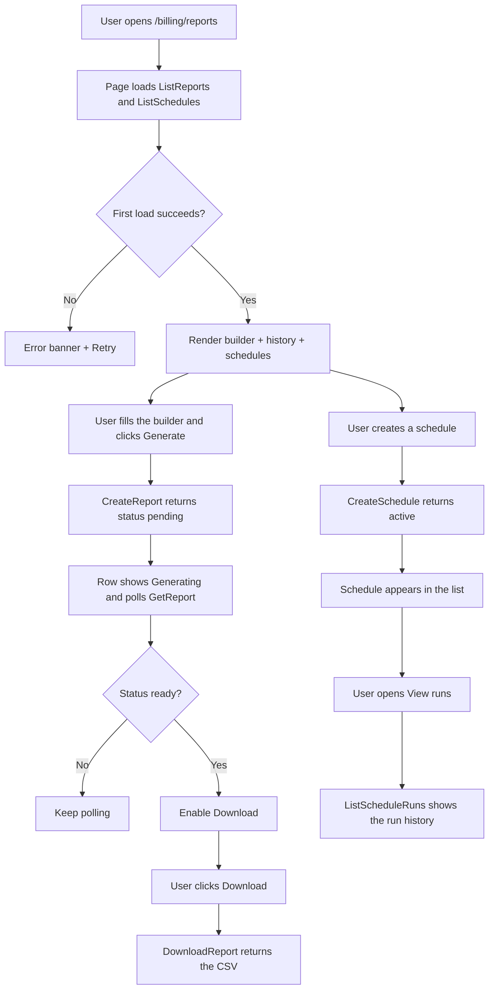
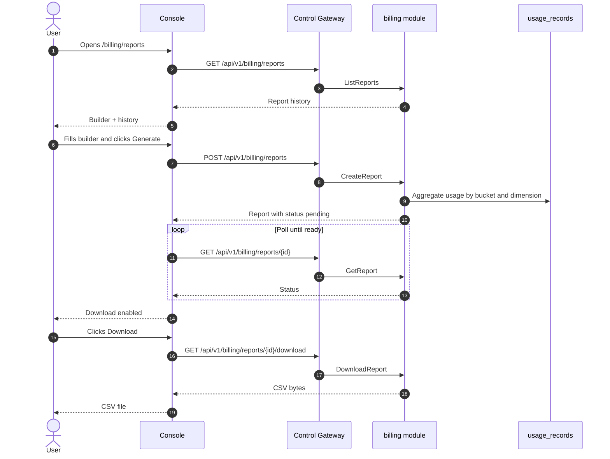

# Billing Reports & CSV Export — Requirement Analysis and UI/UX Design

| Attribute | Content |
| --- | --- |
| Feature point | Billing reports & CSV export — generate and download usage/billing reports (per org, per API key, per model, per time range) as CSV, with scheduled report history (backlog row 25) |
| Document scope | Requirement analysis, competitive research, the admin-surface billing reports page for `/admin/billing/reports`, the end-user-surface billing reports page for `/billing/reports`, the page → API surface table, and numbered acceptance criteria |
| Owning modules | `billing` (extended — owns report generation, CSV rendering, and schedule execution over `usage_records` and `request_logs`), `web` admin console (`AdminBillingReportsPage`) and end-user console (`UserBillingReportsPage`), `pkg/server` gateway (admin-prefix and user-prefix bindings) |
| Related documents | [Architecture Design](./architecture.md) — §2.5 `metering`, §2.6 `billing` · [Usage Dashboards & Per-Request Cost Attribution](./usage-dashboard.md) — the sibling read-only dashboard and its range, freshness, and inline-SVG conventions · [Payments, Invoices & Auto-Recharge](./payments-invoices-auto-recharge.md) — the invoice and cost-currency model this feature reports on · [Metering Vouchers & Async Settlement](./metering.md) — the `usage_records` this feature aggregates · [Request Logs & API Playground](./request-logs-playground.md) — the `request_logs` table this feature can aggregate per request · [Console Surface Separation](./console-surface-separation.md) — the two surfaces this feature spans, the `UserShell`/`AdminShell` conventions, the masked-projection rule |
| Status | Design complete, handed to the Architect agent |

---

## 1. Background

go-taas meters and bills every inference request (features #4, #5, #8, #14), records per-request metadata in `request_logs` (feature #12), and shows live cost and token dashboards (feature #9). What the console still cannot do is turn that accumulated usage into a **downloadable, shareable billing report** — a CSV a tenant can hand to their finance team, or an operator can use to reconcile a tenant's bill. The usage dashboard (feature #9) is a live, in-browser view with no export; request logs (feature #12) are a raw per-request table with no aggregation; and invoices (feature #14) are a fixed billing artifact, not an ad-hoc report. There is no surface that lets a user pick a dimension (org / API key / model), a time range, and a granularity, and get back a CSV — nor one that runs that report on a schedule and keeps a history of the runs.

This feature adds a **billing reports & CSV export** capability: generate and download usage/billing reports (per org, per API key, per model, per time range) as CSV, with scheduled report history. It is a **read-only** aggregation and export layer over the `usage_records` and `request_logs` the platform already writes — nothing in the inference, metering, or billing pipelines changes. It is the smallest independently valuable increment of Phase 4's productionization roadmap item: it turns "the tenant spent X" into "here is the CSV that proves it, on demand or on a schedule".

### 1.1 How Comparable Products Expose Billing Reports & CSV Export

| Product | Report surface | Dimensions | Export / schedule | Notable pitfalls |
| --- | --- | --- | --- | --- |
| **OpenAI Platform** | Usage page with per-day cost/token charts; per-project/key/model breakdown | Project, API key, model, day | CSV export of usage; scheduled weekly/monthly email usage reports | Usage lag (minutes) confuses reconciliation; the "today (partial)" marker needs explaining; export is a single flat table, not a configurable report builder |
| **Anthropic Console** | Usage page per-day, per-model with costs; admin-only per-request viewer | Model, day, workspace | CSV export; no user-facing scheduled reports | Per-request viewer is admin-only; no configurable report builder or schedule |
| **Together AI** | Billing page with usage, cost, balance | Model, endpoint, day | CSV export of usage | Export is a flat dump; no scheduled reports; no per-key breakdown in the export |
| **SiliconFlow** | Billing center with balance, usage records, invoices | Model, day | CSV export; invoice download | Export is a flat dump; no report builder or schedule |
| **Baidu Qianfan** | Billing center with usage statistics and cost reports | Model, day, project | CSV export; scheduled cost reports | Report builder is buried in the billing center; schedule configuration is verbose |
| **Aliyun Bailian** | Billing center with usage statistics, cost, and export | Model, day, project | CSV export; scheduled reports | Export and schedule are separate flows; timezone handling is inconsistent |
| **Volcengine Ark** | Billing center with usage reports and export | Model, day, project | CSV export; scheduled reports | Report builder and schedule are separate; no per-key breakdown in the export |

### 1.2 Distilled Patterns and Decisions

Patterns worth adopting: (1) **a report builder, not just a flat export** — the leading platforms (OpenAI, Baidu Qianfan, Aliyun Bailian, Volcengine Ark) all let the user pick a dimension, a time range, and a granularity before exporting, rather than dumping one fixed table; (2) **async, job-based generation** — large ranges take time, so the report is generated as a job with a status (pending → ready / failed) and the download appears when ready, avoiding a blocking request; (3) **a report history list** — every generated report (on-demand or scheduled) lands in a history list with a download link, so a user can re-download a past report; (4) **scheduled reports with a run history** — daily / weekly / monthly schedules that each produce a run in the history, the pattern OpenAI's scheduled usage emails and the Chinese platforms' scheduled cost reports establish; (5) **Excel-friendly CSV** — a UTF-8 BOM and quoted fields so the CSV opens correctly in Excel, the most common consumer of a billing export; (6) **explicit timezone** — the report's timezone is shown and applied consistently, because billing reconciliation across timezones is a consistently recorded pitfall; (7) **cost + token columns together** — a billing report carries both the token counts and the cost per row, so finance and engineering can both use it.

Pitfalls to avoid: a single flat export with no builder (Together, SiliconFlow) — the user cannot choose a dimension or range; a blocking synchronous export for large ranges — the request times out; silently missing pending hours — the freshness / data-through marker must be explicit (usage-dashboard D4); inconsistent timezone handling (Aliyun) — the timezone must be explicit and uniform; and exposing other tenants' data in an export — the end-user surface is tenant-scoped (feature #17's masked-projection rule).

**Decisions for go-taas**:

| # | Decision | Rationale |
| --- | --- | --- |
| D1 | **Billing reports exist on both surfaces, with a clean scope split.** The admin surface (`/admin/billing/reports`, `/api/v1/admin/billing/reports/*`) is a **fleet-wide** report builder — any org, any API key, any model, across all tenants — for reconciliation and billing. The end-user surface (`/billing/reports`, `/api/v1/billing/reports/*`) is a **tenant-scoped** report builder — the tenant's own org, own API keys, own usage — for finance and capacity planning | The operator needs cross-tenant reports to reconcile bills (features #8, #14); the tenant needs their own usage report to hand to finance. Splitting by surface follows feature #17's masked-projection rule: a tenant must not see other tenants' data, and an operator's fleet report is operator-scoped. Both surfaces share the same report builder, CSV format, and schedule machinery |
| D2 | **Reports are generated asynchronously as jobs.** `CreateReport` returns a report with status `pending`; the report becomes `ready` (with a downloadable CSV) or `failed`. The console polls `GetReport` until `ready`, then enables the download | Large ranges take time to aggregate; a synchronous export would block or time out. Job-based generation is the universal pattern (OpenAI, the Chinese platforms) and keeps the client responsive |
| D3 | **A report is defined by a dimension, a time range, and a granularity.** The dimension is one of `organization` (per-org rows), `api_key` (per-key rows), or `model` (per-model rows); the range is `since`/`until` (unix seconds, capped at **366 days**); the granularity is `daily` or `hourly`. The CSV carries one row per (bucket × dimension-value) with request count, input/output/total tokens, and cost | The three dimensions are exactly the ones the comparable products expose (per org / per key / per model), and the range + granularity pair is the universal report shape. Cost and tokens together make the report usable by both finance and engineering |
| D4 | **Scheduled reports reuse the same report definition plus a frequency.** A schedule holds a report definition (dimension, granularity, and a **relative** range such as "last 7 days" or "last month") and a frequency (`daily` / `weekly` / `monthly`). Each scheduled run produces a report in the same history list, with its own status and download | A schedule is just a report definition that runs on a cadence; reusing the definition keeps the builder and the schedule consistent, and the run history is the same report history the user already knows |
| D5 | **The CSV is Excel-friendly and timezone-explicit.** The CSV is UTF-8 with a BOM, quoted fields, a header row, and a `timezone` column or a timezone note in the filename; the report's timezone is chosen at build time and applied to every bucket | Excel is the most common consumer of a billing export; a BOM and quoted fields prevent mojibake and comma-splitting. An explicit timezone avoids the reconciliation pitfall (Aliyun) |
| D6 | **The end-user surface is tenant-scoped and masked.** `CreateReport` on the user prefix accepts only the caller's own organization and own API keys; the `organization` dimension on the user prefix yields a single row for the caller's org. No other tenants' data ever appears in a user report | Follows feature #17's masked-projection rule: a tenant's report must never leak another tenant's usage. The admin surface is the only place a cross-tenant report can be built |
| D7 | **New error codes in a billing-reports block (10801–10899).** **10801 `CodeReportNotFound`** (unknown `report_id`), **10802 `CodeScheduleNotFound`** (unknown `schedule_id`), **10803 `CodeReportInvalidDimension`**, **10804 `CodeReportInvalidGranularity`**, **10805 `CodeReportInvalidFrequency`**, **10806 `CodeReportNameConflict`** (duplicate schedule name), **10807 `CodeReportNotReady`** (download before ready). Range validation reuses **10404** (the metering range contract) with a report-specific cap of 366 days | Billing reports is a new capability, so its codes live in a fresh block after the observability block (107xx); distinct codes keep each failure actionable, while the range contract stays uniform with metering (D3) |
| D8 | **Billing reports are read-only and audited for access and generation.** Report generation and schedule changes are audited (feature #15) as `report.generated` / `schedule.created` / `schedule.updated` / `schedule.deleted`; the underlying usage is already audited by the metering writes. No billing pipeline changes | The feature aggregates existing data and writes only report artifacts and schedules; the audit trail (feature #15) already covers the underlying usage writes, so only the new report/schedule actions need new audit events |

## 2. Goals and Non-goals

**Goals**: an admin page `/admin/billing/reports` that builds fleet-wide reports (any org / key / model), lists report history with download links, and manages scheduled reports with a run history (D1, D2, D3, D4, D5); an end-user page `/billing/reports` that builds tenant-scoped reports and manages the tenant's own schedules (D1, D6); the page → API surface table with exact prefixes (D1); per-page interactive states including loading, empty, error, disabled, and permission-denied; numbered acceptance criteria testable in Nightwatch against the compose stack.

**Non-goals**: PDF or XLSX export (v1 is CSV only); email delivery of scheduled reports (v1 schedules generate reports in the console history; email delivery is future work); report templates or saved custom views beyond schedules; comparing dimensions side-by-side in one report (v1 is one dimension per report); real-time streaming of report progress (v1 polls status); any change to the inference, metering, or billing pipelines (read-only feature); cross-tenant reports on the end-user surface (D6).

## 3. Personas and Journeys

| Role | Surface | Journey |
| --- | --- | --- |
| **Platform operator (billing)** | admin | Opens `/admin/billing/reports` → builds a per-org report for the last month → downloads the CSV → reconciles each tenant's bill against invoices (feature #14) |
| **Platform operator (finance)** | admin | Creates a monthly per-org schedule → the schedule runs each month → opens the run history → downloads each month's report for the ledger |
| **Tenant finance / capacity planner** | end-user | Opens `/billing/reports` → builds a per-model report for the last 30 days → downloads the CSV → hands it to finance; creates a weekly per-key schedule to track spend |
| **Tenant developer / Agent** | end-user | Opens `/billing/reports` → builds a per-API-key report for the last 7 days → downloads the CSV → attributes cost to their own keys |

> Terminology: the consumer-side caller is an **Agent** in English and 「智能体」 in Chinese, consistent with the repository convention.

## 4. Feature Requirements

### FR1 — Report builder (both surfaces)

- **FR1.1** `CreateReport` (`POST /api/v1/billing/reports` user · `POST /api/v1/admin/billing/reports` admin) creates an on-demand report from a report definition: `dimension` (`organization` / `api_key` / `model`), `since`/`until` (unix seconds; defaults `until = now`, `since = until − 30d`), `granularity` (`daily` / `hourly`), and `timezone` (IANA name, default `UTC`). It returns a report with `status = pending` (D2, D3).
- **FR1.2** `since > until` or a range > 366 days returns **10404** (D7). An invalid `dimension` returns **10803**, an invalid `granularity` returns **10804** (D7).
- **FR1.3** On the user prefix, `CreateReport` is tenant-scoped (D6): the `organization` dimension yields a single row for the caller's org, and the report aggregates only the caller's own API keys and usage. It accepts no `organization_id` filter (the caller's org is implicit).
- **FR1.4** On the admin prefix, `CreateReport` accepts an optional `organization_id` filter (via `X-Organization-Id` or a body field) to scope a fleet report to one org; without it the report spans all orgs.

### FR2 — Report lifecycle & download (both surfaces)

- **FR2.1** `GetReport` (`GET /api/v1/billing/reports/{report_id}` user · `GET /api/v1/admin/billing/reports/{report_id}` admin) returns the report's status (`pending` / `ready` / `failed`), definition, row count, and `data_through`. An unknown `report_id` returns **10801** (D7).
- **FR2.2** `ListReports` (`GET /api/v1/billing/reports` user · `GET /api/v1/admin/billing/reports` admin) returns the report history, newest first, with dotted pagination. Each row carries `report_id`, `name`, `dimension`, `since`/`until`, `granularity`, `status`, `created_at`, and `row_count`.
- **FR2.3** `DownloadReport` (`GET /api/v1/billing/reports/{report_id}/download` user · `GET /api/v1/admin/billing/reports/{report_id}/download` admin) returns the CSV when `status = ready`. A download before `ready` returns **10807** (D7). The response is `text/csv` with a UTF-8 BOM and a `Content-Disposition` filename like `billing-report-<report_id>.csv` (D5).
- **FR2.4** The CSV has a header row and one row per (bucket × dimension-value): `bucket`, `timezone`, `organization_id`, `organization_name`, `api_key_id`, `api_key_name`, `model_id`, `model_name`, `request_count`, `input_tokens`, `output_tokens`, `total_tokens`, `cost`, `currency`. Columns not relevant to the chosen dimension are empty (D3, D5).

### FR3 — Scheduled reports (both surfaces)

- **FR3.1** `CreateSchedule` (`POST /api/v1/billing/reports/schedules` user · `POST /api/v1/admin/billing/reports/schedules` admin) creates a schedule from a report definition plus a `frequency` (`daily` / `weekly` / `monthly`) and a **relative** range (`last_7_days` / `last_30_days` / `last_month`). It returns the schedule with `status = active`. A duplicate `name` returns **10806**, an invalid `frequency` returns **10805** (D7).
- **FR3.2** `ListSchedules` (`GET /api/v1/billing/reports/schedules` user · `GET /api/v1/admin/billing/reports/schedules` admin) returns the caller's schedules (user: the tenant's own; admin: all schedules, optionally filtered by `organization_id`).
- **FR3.3** `UpdateSchedule` (`PATCH /api/v1/billing/reports/schedules/{schedule_id}` user · `PATCH /api/v1/admin/billing/reports/schedules/{schedule_id}` admin) updates the schedule's `name`, `frequency`, or relative range. An unknown `schedule_id` returns **10802** (D7).
- **FR3.4** `DeleteSchedule` (`DELETE /api/v1/billing/reports/schedules/{schedule_id}` user · `DELETE /api/v1/admin/billing/reports/schedules/{schedule_id}` admin) deletes the schedule. An unknown `schedule_id` returns **10802** (D7).
- **FR3.5** `ListScheduleRuns` (`GET /api/v1/billing/reports/schedules/{schedule_id}/runs` user · `GET /api/v1/admin/billing/reports/schedules/{schedule_id}/runs` admin) returns the runs a schedule has produced, newest first, with dotted pagination. Each run is a report in the same history list with its own `status`, `created_at`, and `row_count` (D4).

### FR4 — Surface and API binding

- **FR4.1** The admin billing reports page lives on the **admin surface**: route `/admin/billing/reports`, API prefix `/api/v1/admin/billing/reports/*`. It is added to the `AdminShell` navigation (feature #17) as "Billing reports".
- **FR4.2** The end-user billing reports page lives on the **end-user surface**: route `/billing/reports`, API prefix `/api/v1/billing/reports/*`. It is added to the `UserShell` navigation (feature #17) as "Billing reports".
- **FR4.3** The admin page calls only `/api/v1/admin/billing/reports/*` routes; the end-user page calls only `/api/v1/billing/reports/*`. Neither contains the other surface's prefix string (feature #17, D1).
- **FR4.4** The end-user page never exposes other tenants' data and never builds a cross-tenant report (D6).

### FR5 — Audit

- **FR5.1** Report generation and schedule changes are audited (feature #15): `report.generated` (on-demand and scheduled runs), `schedule.created`, `schedule.updated`, `schedule.deleted`. Each audit event records the actor, the report/schedule id, and the definition (D8).

## 5. UI Design

### 5.1 Page: `/admin/billing/reports` — Billing Reports (admin)

**Purpose**: let the platform operator build fleet-wide billing reports (any org / key / model), download CSVs, and manage scheduled reports with a run history — for reconciliation and billing.

**Surface**: admin — route `/admin/billing/reports`, API `/api/v1/admin/billing/reports/*`.

**Layout**: rendered inside `AdminShell` (feature #17). A page header ("Billing reports", subtitle "Generate and download usage and cost reports") with a **New report** primary action. Below the header, two tabs:

1. **Reports tab** — the report history list and the report builder.
2. **Schedules tab** — the scheduled-report list and the schedule builder.

**Reports tab**:

1. **Report builder** — a collapsible panel (open by default when the history is empty) with fields: **Name** (text, required), **Dimension** (radio: Organization / API key / Model), **Organization** (dropdown, admin-only, "All organizations" default), **Time range** (presets 24 h / 7 d / 30 d / 90 d / custom with a date-time picker), **Granularity** (radio: Daily / Hourly), **Timezone** (dropdown, default UTC). A **Generate report** primary action and a **Cancel** secondary action.
2. **Report history** — a table with columns: **Name**, **Dimension**, **Range**, **Granularity**, **Status**, **Rows**, **Created**, **Actions**. Row actions: **Download** (enabled when `status = ready`), **View** (opens a detail drawer). A **Refresh** action above the table.

**Schedules tab**:

1. **Schedule builder** — a panel with fields: **Name** (text, required, unique), **Dimension** (radio), **Organization** (dropdown, admin-only), **Relative range** (dropdown: Last 7 days / Last 30 days / Last month), **Granularity** (radio), **Frequency** (radio: Daily / Weekly / Monthly), **Timezone** (dropdown). A **Create schedule** primary action and a **Cancel** secondary action.
2. **Schedule list** — a table with columns: **Name**, **Dimension**, **Relative range**, **Frequency**, **Status**, **Last run**, **Actions**. Row actions: **View runs** (opens the run history), **Edit**, **Delete**.

**Interactive states**:

| State | Behaviour |
| --- | --- |
| Default | The builder panel and the history/schedule table render from the first successful load; last-updated shows the load time |
| Loading | Skeleton table rows; the Generate / Create actions are disabled |
| Empty | Reports tab: "No reports yet." with a hint to generate one; Schedules tab: "No schedules yet." with a hint to create one; the builder stays visible |
| Error | An error banner with the message and a Retry button; the page keeps its last good data with a "Showing stale data" banner |
| Disabled | Generate / Create are disabled while a request is in flight; Download is disabled while `status != ready`; the builder fields are disabled while a report is generating |
| Permission-denied | A session without the required role receives 10036 and the page shows the standard permission-denied state (feature #17) with a link back to the admin home |

**Report history table columns**: Name, Dimension, Range, Granularity, Status, Rows, Created, Actions. Sortable by Name, Status, Rows, and Created. Filterable by Dimension and Status. Paginated (dotted pagination).

**Schedule list table columns**: Name, Dimension, Relative range, Frequency, Status, Last run, Actions. Sortable by Name, Frequency, and Last run. Paginated.

**Dialogs and confirmation flows**:

- **Generate report**: submitting the builder shows a progress state on the row ("Generating…") and polls `GetReport` until `status = ready`, then enables **Download**. A failed generation shows "Generation failed" with a **Retry** action.
- **Delete schedule**: a confirmation dialog "Delete schedule <name>? This does not delete past reports." with **Cancel** / **Delete** (danger). Deleting calls `DeleteSchedule` and removes the row.
- **View runs**: a drawer listing the schedule's runs (from `ListScheduleRuns`) with **Download** per ready run.

### 5.2 Page: `/billing/reports` — Billing Reports (end-user)

**Purpose**: let a tenant developer / Agent / finance user build tenant-scoped billing reports (their own org, own API keys, own usage), download CSVs, and manage their own schedules — for finance and capacity planning.

**Surface**: end-user — route `/billing/reports`, API `/api/v1/billing/reports/*`.

**Layout**: rendered inside `UserShell` (feature #17). A page header ("Billing reports", subtitle "Generate and download your usage and cost reports") with a **New report** primary action. Below the header, the same two tabs as §5.1.

**Reports tab**:

1. **Report builder** — the same fields as §5.1, except the **Organization** dropdown is absent (the caller's org is implicit, D6). The **Dimension** radio offers Organization / API key / Model; choosing Organization yields a single-row report for the caller's org.
2. **Report history** — the same table as §5.1, scoped to the tenant's own reports.

**Schedules tab**:

1. **Schedule builder** — the same fields as §5.1, without the **Organization** dropdown (D6).
2. **Schedule list** — the same table as §5.1, scoped to the tenant's own schedules.

**Interactive states**: identical to §5.1, with the empty copy "No reports yet." / "No schedules yet." and the permission-denied copy for the tenant's own errors (10005 org gone / 10017 org disabled from §8.2 of feature #17, 10027/10038 redirect per FR4.3). The page exposes no other tenants' data (D6).

**Report history table columns**: identical to §5.1, scoped to the tenant's own reports. Sortable and paginated as in §5.1.

**Schedule list table columns**: identical to §5.1, scoped to the tenant's own schedules. Sortable and paginated as in §5.1.

**Dialogs and confirmation flows**: identical to §5.1 (Generate progress, Delete-schedule confirmation, View-runs drawer).

### 5.3 Flow

## 6. API Surface Implications

All billing-report RPCs belong to the **`billing` module** (extended, D1), served as HTTP via the Control Gateway. Admin routes are on the **admin prefix** `/api/v1/admin/billing/reports/*` (D1); the end-user routes are on the **user prefix** `/api/v1/billing/reports/*` (D1).

| RPC | Route | Prefix | Status | Purpose |
| --- | --- | --- | --- | --- |
| `CreateReport` | `POST /api/v1/billing/reports` · `POST /api/v1/admin/billing/reports` | user · admin | **new** | Create an on-demand report job |
| `GetReport` | `GET /api/v1/billing/reports/{report_id}` · `GET /api/v1/admin/billing/reports/{report_id}` | user · admin | **new** | Report status and definition |
| `ListReports` | `GET /api/v1/billing/reports` · `GET /api/v1/admin/billing/reports` | user · admin | **new** | Report history |
| `DownloadReport` | `GET /api/v1/billing/reports/{report_id}/download` · `GET /api/v1/admin/billing/reports/{report_id}/download` | user · admin | **new** | CSV download |
| `CreateSchedule` | `POST /api/v1/billing/reports/schedules` · `POST /api/v1/admin/billing/reports/schedules` | user · admin | **new** | Create a scheduled report |
| `ListSchedules` | `GET /api/v1/billing/reports/schedules` · `GET /api/v1/admin/billing/reports/schedules` | user · admin | **new** | List schedules |
| `UpdateSchedule` | `PATCH /api/v1/billing/reports/schedules/{schedule_id}` · `PATCH /api/v1/admin/billing/reports/schedules/{schedule_id}` | user · admin | **new** | Update a schedule |
| `DeleteSchedule` | `DELETE /api/v1/billing/reports/schedules/{schedule_id}` · `DELETE /api/v1/admin/billing/reports/schedules/{schedule_id}` | user · admin | **new** | Delete a schedule |
| `ListScheduleRuns` | `GET /api/v1/billing/reports/schedules/{schedule_id}/runs` · `GET /api/v1/admin/billing/reports/schedules/{schedule_id}/runs` | user · admin | **new** | Schedule run history |

**Contract notes for the Architect agent**:

1. `CreateReport` validates `since`/`until` (int64 unix seconds; defaults `until = now`, `since = until − 30d`); `since > until` or a range > 366 days returns 10404 (D7). `dimension` must be `organization` / `api_key` / `model` (else 10803); `granularity` must be `daily` / `hourly` (else 10804). `timezone` is an IANA name, default `UTC`.
2. On the user prefix, `CreateReport` is tenant-scoped (D6): no `organization_id` filter is accepted, and the report aggregates only the caller's org and own API keys. On the admin prefix, an optional `organization_id` scopes a fleet report to one org.
3. Reports are async (D2): `CreateReport` returns `status = pending`; the report becomes `ready` (with a downloadable CSV) or `failed`. `DownloadReport` before `ready` returns 10807 (D7).
4. The CSV is UTF-8 with a BOM, quoted fields, a header row, and one row per (bucket × dimension-value) with `bucket`, `timezone`, `organization_id`, `organization_name`, `api_key_id`, `api_key_name`, `model_id`, `model_name`, `request_count`, `input_tokens`, `output_tokens`, `total_tokens`, `cost`, `currency` (D3, D5). Columns not relevant to the chosen dimension are empty.
5. Schedules hold a report definition plus `frequency` (`daily` / `weekly` / `monthly`, else 10805) and a relative range (`last_7_days` / `last_30_days` / `last_month`). A duplicate schedule `name` returns 10806 (D7). Each scheduled run produces a report in the same history list (D4).
6. Aggregation reads `usage_records` (feature #4) and `request_logs` (feature #12) for token and cost totals; it writes only report artifacts and schedules (D8). Report generation and schedule changes are audited (feature #15) as `report.generated` / `schedule.created` / `schedule.updated` / `schedule.deleted`.
7. Wire conventions unchanged: dotted pagination where lists apply, HTTP 200 on success, business errors as `{"code": <int>, "message": "..."}`, int64 fields serialized as JSON strings.

Error codes (billing-reports block 10801–10899, `pkg/errors/codes.go`):

| Condition | Code | Constant | Notes |
| --- | --- | --- | --- |
| An unknown `report_id` | 10801 | `CodeReportNotFound` | **New** (D7) |
| An unknown `schedule_id` | 10802 | `CodeScheduleNotFound` | **New** (D7) |
| An invalid `dimension` | 10803 | `CodeReportInvalidDimension` | **New** (D7) |
| An invalid `granularity` | 10804 | `CodeReportInvalidGranularity` | **New** (D7) |
| An invalid `frequency` | 10805 | `CodeReportInvalidFrequency` | **New** (D7) |
| A duplicate schedule `name` | 10806 | `CodeReportNameConflict` | **New** (D7) |
| A download before `ready` | 10807 | `CodeReportNotReady` | **New** (D7) |
| A malformed or over-long range | 10404 | `CodeRequestLogRangeInvalid` | Reused (D7) — the metering range contract, capped at 366 days for reports |
| Database / infrastructure failure | 500 | `CodeInternal` | Via error normalization |

## 7. Acceptance Criteria

| # | Criterion | Level |
| --- | --- | --- |
| AC1 | `CreateReport` with a valid definition returns a report with `status = pending`; a range > 366 days or `since > until` returns 10404; an invalid `dimension` returns 10803 and an invalid `granularity` returns 10804 | FVT |
| AC2 | `GetReport` returns the report's status, definition, row count, and `data_through`; an unknown `report_id` returns 10801 | FVT |
| AC3 | `DownloadReport` returns a UTF-8-BOM CSV with the header row and one row per (bucket × dimension-value) when `status = ready`; a download before `ready` returns 10807 | FVT |
| AC4 | `CreateSchedule` with a valid definition and frequency returns an active schedule; a duplicate `name` returns 10806 and an invalid `frequency` returns 10805; `UpdateSchedule` and `DeleteSchedule` work and an unknown `schedule_id` returns 10802 | FVT |
| AC5 | `ListScheduleRuns` returns the runs a schedule has produced, each a report in the same history list | FVT |
| AC6 | `CreateReport` on the user prefix is tenant-scoped: it accepts no `organization_id` filter and aggregates only the caller's org and own API keys | FVT |
| AC7 | The `/admin/billing/reports` page renders the builder, the report history, and the schedule list from the first successful load, with a last-updated timestamp | E2E |
| AC8 | Generating a report shows a "Generating…" progress state, polls until `ready`, then enables **Download**; clicking **Download** fetches the CSV | E2E |
| AC9 | The empty states ("No reports yet." / "No schedules yet.") render when no data matches; a failed load keeps the last good data with a "Showing stale data" banner and a Retry action | E2E |
| AC10 | Creating a schedule adds it to the schedule list; deleting a schedule shows the confirmation dialog and removes the row without deleting past reports; **View runs** shows the run history with **Download** per ready run | E2E |
| AC11 | The `/billing/reports` page renders the tenant-scoped builder, history, and schedules, with no other tenants' data and no organization dropdown | E2E |
| AC12 | The admin billing reports page is reachable only on the admin surface: route `/admin/billing/reports`, every API call uses the `/api/v1/admin/billing/reports/*` prefix with no `/api/v1/billing/reports/*` string | E2E (surface separation) |
| AC13 | The end-user billing reports page is reachable only on the end-user surface: route `/billing/reports`, every API call uses the `/api/v1/billing/reports/*` prefix with no `/api/v1/admin/*` string | E2E (surface separation) |
| AC14 | A session without the required role receives 10036 on the admin billing reports page and the page shows the standard permission-denied state | E2E |

## 8. Out of Scope (tracked elsewhere)

| Item | Where |
| --- | --- |
| PDF or XLSX export | Future refinement — v1 is CSV only |
| Email delivery of scheduled reports | Future refinement — v1 schedules generate reports in the console history |
| Report templates / saved custom views beyond schedules | Future refinement |
| Comparing dimensions side-by-side in one report | Future refinement — v1 is one dimension per report |
| Real-time streaming of report progress | Future refinement — v1 polls status |
| Cross-tenant reports on the end-user surface | Deliberately absent (D6) |
| Any change to the inference, metering, or billing pipelines | Deliberately absent — read-only feature (D8) |