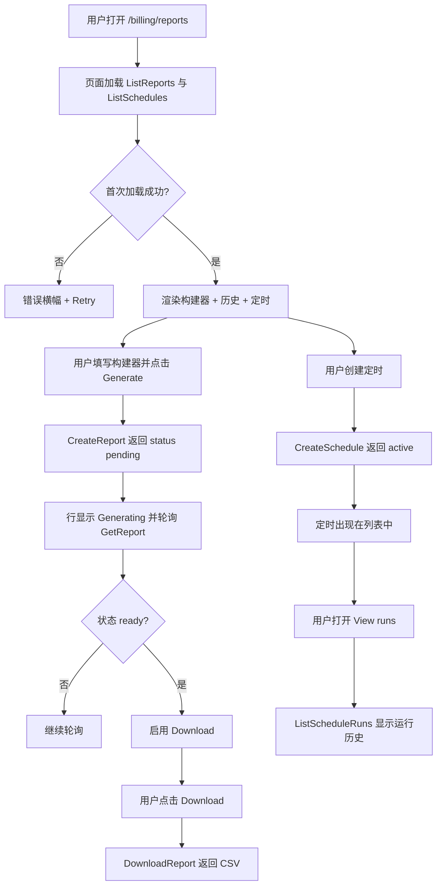
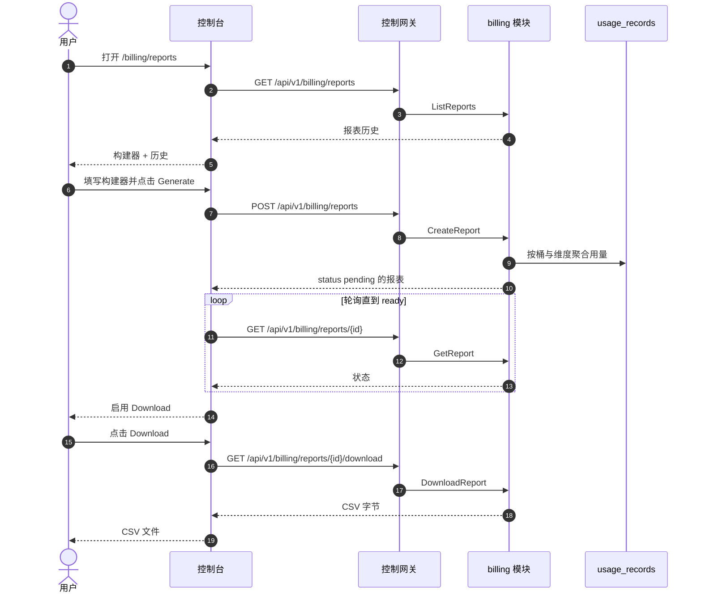

# 计费报表与 CSV 导出 — 需求分析与 UI/UX 设计

| 属性 | 内容 |
| --- | --- |
| 特性点 | 计费报表与 CSV 导出 — 生成并下载用量/计费报表（按组织、按 API 密钥、按模型、按时间范围）为 CSV，带定时报表历史（backlog 第 25 行） |
| 文档范围 | 需求分析与 UI/UX 设计：`/admin/billing/reports` 管理面计费报表页面，`/billing/reports` 终端用户面计费报表页面，页面 → API 面映射表，以及编号验收标准 |
| 归属模块 | `billing`（扩展 — 拥有对 `usage_records` 与 `request_logs` 的报表生成、CSV 渲染与定时执行），`web` 管理控制台（`AdminBillingReportsPage`）与终端用户控制台（`UserBillingReportsPage`），`pkg/server` 网关（管理前缀与用户前缀绑定） |
| 相关文档 | [架构设计](./architecture.zh-cn.md) — 第 2.5 节 `metering`、第 2.6 节 `billing` · [用量仪表盘与按请求成本归因](./usage-dashboard.zh-cn.md) — 姊妹只读仪表盘及其范围、新鲜度与内联 SVG 约定 · [支付、发票与自动充值](./payments-invoices-auto-recharge.zh-cn.md) — 本特性报告的发票与成本货币模型 · [计量凭证与异步结算](./metering.zh-cn.md) — 本特性聚合的 `usage_records` · [请求日志与 API 游乐场](./request-logs-playground.zh-cn.md) — 本特性可按请求聚合的 `request_logs` 表 · [控制台面分离](./console-surface-separation.zh-cn.md) — 本特性横跨的两个面、`UserShell`/`AdminShell` 约定、掩码投影规则 |
| 状态 | 设计完成，已移交架构师代理 |

---

## 1. 背景与竞品调研

go-taas 对每个推理请求进行计量与计费（特性 #4、#5、#8、#14），在 `request_logs` 中记录每个请求的元数据（特性 #12），并展示实时成本与 token 仪表盘（特性 #9）。控制台仍然无法把累积的用量转化为**可下载、可分享的计费报表** — 租户可以交给财务团队的 CSV，或运营者用来对账租户账单的 CSV。用量仪表盘（特性 #9）是实时、浏览器内的视图，没有导出；请求日志（特性 #12）是原始、按请求的表格，没有聚合；发票（特性 #14）是固定的计费产物，而非临时报表。没有任何面让用户选择维度（组织 / API 密钥 / 模型）、时间范围与粒度，并拿回一份 CSV — 也没有一个面能按计划运行该报表并保留运行历史。

本特性新增**计费报表与 CSV 导出**能力：生成并下载用量/计费报表（按组织、按 API 密钥、按模型、按时间范围）为 CSV，带定时报表历史。它是平台已写入的 `usage_records` 与 `request_logs` 之上的**只读**聚合与导出层 — 推理、计量或计费流水线没有任何变化。这是 Phase 4 生产化路线图项中最小可独立交付的增量：它把「租户花了 X」变成「这是证明它的 CSV，按需或按计划」。

### 1.1 竞品的计费报表与 CSV 导出呈现

| 产品 | 报表面 | 维度 | 导出 / 定时 | 主要陷阱 |
| --- | --- | --- | --- | --- |
| **OpenAI Platform** | Usage 页面：按日成本/token 图表；按项目/密钥/模型拆分 | 项目、API 密钥、模型、日 | CSV 导出用量；定时周/月邮件用量报表 | 用量滞后（分钟级）困扰对账；「today (partial)」标记需要解释；导出是单一扁平表，非可配置报表构建器 |
| **Anthropic Console** | 按日、按模型的用量与成本；仅管理员的按请求查看器 | 模型、日、工作区 | CSV 导出；无用户可见的定时报表 | 按请求查看器仅管理员可用；无可配置报表构建器或定时 |
| **Together AI** | Billing 页面：用量、成本、余额 | 模型、端点、日 | CSV 导出用量 | 导出是扁平转储；无定时报表；导出中无按密钥拆分 |
| **SiliconFlow** | 计费中心：余额、用量记录、发票 | 模型、日 | CSV 导出；发票下载 | 导出是扁平转储；无报表构建器或定时 |
| **百度千帆** | 计费中心：用量统计与成本报表 | 模型、日、项目 | CSV 导出；定时成本报表 | 报表构建器深埋在计费中心；定时配置冗长 |
| **阿里云百炼** | 计费中心：用量统计、成本与导出 | 模型、日、项目 | CSV 导出；定时报表 | 导出与定时是分离流程；时区处理不一致 |
| **火山方舟** | 计费中心：用量报表与导出 | 模型、日、项目 | CSV 导出；定时报表 | 报表构建器与定时分离；导出中无按密钥拆分 |

### 1.2 提炼出的模式与决策

值得采纳的模式：(1) **报表构建器，而非仅扁平导出** — 领先平台（OpenAI、百度千帆、阿里云百炼、火山方舟）都让用户在导出前选择维度、时间范围与粒度，而非转储一个固定表；(2) **异步、基于任务的生成** — 大范围耗时，因此报表作为带状态（pending → ready / failed）的任务生成，就绪后出现下载，避免阻塞请求；(3) **报表历史列表** — 每个生成的报表（按需或定时）都进入带下载链接的历史列表，用户可重新下载过去的报表；(4) **带运行历史的定时报表** — 日 / 周 / 月定时各自在历史中产生一次运行，这是 OpenAI 定时用量邮件与中国平台定时成本报表确立的模式；(5) **Excel 友好的 CSV** — UTF-8 BOM 与带引号字段，使 CSV 在 Excel 中正确打开，这是计费导出的最常见消费者；(6) **显式时区** — 报表时区被显示并一致应用，因为跨时区计费对账是常被记录的陷阱；(7) **成本与 token 列并存** — 计费报表每行同时携带 token 计数与成本，使财务与工程都能使用。

需要避免的陷阱：无构建器的单一扁平导出（Together、SiliconFlow）— 用户无法选择维度或范围；大范围的阻塞式同步导出 — 请求超时；静默缺失 pending 小时 — 新鲜度 / data-through 标记必须显式（usage-dashboard D4）；时区处理不一致（阿里云）— 时区必须显式且统一；以及在导出中暴露其他租户数据 — 终端用户面是租户作用域（特性 #17 的掩码投影规则）。

**go-taas 的决策**：

| # | 决策 | 依据 |
| --- | --- | --- |
| D1 | **计费报表存在于两个面，作用域清晰拆分。** 管理面（`/admin/billing/reports`、`/api/v1/admin/billing/reports/*`）是**集群级**报表构建器 — 任意组织、任意 API 密钥、任意模型，跨所有租户 — 用于对账与计费。终端用户面（`/billing/reports`、`/api/v1/billing/reports/*`）是**租户作用域**报表构建器 — 租户自己的组织、自己的 API 密钥、自己的用量 — 用于财务与容量规划 | 运营者需要跨租户报表来对账账单（特性 #8、#14）；租户需要自己的用量报表交给财务。按面拆分遵循特性 #17 的掩码投影规则：租户绝不能看到其他租户数据，运营者的集群报表也是运营者作用域。两个面共享相同的报表构建器、CSV 格式与定时机制 |
| D2 | **报表异步生成为任务。** `CreateReport` 返回 `status = pending` 的报表；报表变为 `ready`（带可下载 CSV）或 `failed`。控制台轮询 `GetReport` 直到 `ready`，然后启用下载 | 大范围聚合耗时；同步导出会阻塞或超时。基于任务的生成是通用模式（OpenAI、中国平台），并保持客户端响应 |
| D3 | **报表由维度、时间范围与粒度定义。** 维度为 `organization`（按组织行）、`api_key`（按密钥行）或 `model`（按模型行）之一；范围为 `since`/`until`（unix 秒，上限 **366 天**）；粒度为 `daily` 或 `hourly`。CSV 每（桶 × 维度值）一行，携带请求数、输入/输出/总 token 与成本 | 三个维度正是竞品暴露的维度（按组织 / 按密钥 / 按模型），范围 + 粒度对是通用报表形态。成本与 token 并存使报表对财务与工程都可用 |
| D4 | **定时报表复用相同的报表定义加频率。** 定时持有报表定义（维度、粒度与**相对**范围，如「最近 7 天」或「上月」）与频率（`daily` / `weekly` / `monthly`）。每次定时运行在相同的历史列表中产生一份报表，带自己的状态与下载 | 定时只是按节奏运行的报表定义；复用定义使构建器与定时保持一致，运行历史就是用户已知的同一报表历史 |
| D5 | **CSV 对 Excel 友好且时区显式。** CSV 为带 BOM 的 UTF-8、带引号字段、有表头行，并有 `timezone` 列或文件名中的时区说明；报表时区在构建时选择并应用于每个桶 | Excel 是计费导出最常见的消费者；BOM 与带引号字段防止乱码与逗号拆分。显式时区避免对账陷阱（阿里云） |
| D6 | **终端用户面是租户作用域且掩码。** 用户前缀的 `CreateReport` 只接受调用者自己的组织与自己的 API 密钥；用户前缀的 `organization` 维度为调用者组织产生单行。用户报表中绝不出现其他租户数据 | 遵循特性 #17 的掩码投影规则：租户报表绝不能泄露另一租户的用量。管理面是唯一可构建跨租户报表之处 |
| D7 | **计费报表块（10801–10899）中的新错误码。** **10801 `CodeReportNotFound`**（未知 `report_id`）、**10802 `CodeScheduleNotFound`**（未知 `schedule_id`）、**10803 `CodeReportInvalidDimension`**、**10804 `CodeReportInvalidGranularity`**、**10805 `CodeReportInvalidFrequency`**、**10806 `CodeReportNameConflict`**（定时名称重复）、**10807 `CodeReportNotReady`**（就绪前下载）。范围校验复用 **10404**（计量范围契约），报表上限为 366 天 | 计费报表是新能力，因此其错误码位于可观测性块（107xx）之后的新块；不同错误码使每个失败可操作，而范围契约与计量保持一致（D3） |
| D8 | **计费报表只读，且对访问与生成审计。** 报表生成与定时变更被审计（特性 #15）为 `report.generated` / `schedule.created` / `schedule.updated` / `schedule.deleted`；底层用量已由计量写入审计。计费流水线无变化 | 该特性聚合现有数据，仅写入报表产物与定时；审计追踪（特性 #15）已覆盖底层用量写入，因此只需为新的报表/定时动作新增审计事件 |

## 2. 目标与非目标

**目标**：管理页面 `/admin/billing/reports` 构建集群级报表（任意组织 / 密钥 / 模型）、列出带下载链接的报表历史、并管理带运行历史的定时报表（D1、D2、D3、D4、D5）；终端用户页面 `/billing/reports` 构建租户作用域报表并管理租户自己的定时（D1、D6）；页面 → API 面映射表，带精确前缀（D1）；每个页面的交互状态，包括加载、空、错误、禁用与权限拒绝；可在 Nightwatch 中针对 compose 栈测试的编号验收标准。

**非目标**：PDF 或 XLSX 导出（v1 仅 CSV）；定时报表的邮件投递（v1 定时在控制台历史中生成报表；邮件投递是未来工作）；超出定时的报表模板或已保存自定义视图；在一份报表中并排比较维度（v1 每份报表一个维度）；报表进度的实时流式（v1 轮询状态）；对推理、计量或计费流水线的任何变更（只读特性）；终端用户面上的跨租户报表（D6）。

## 3. 角色与旅程

| 角色 | 面 | 旅程 |
| --- | --- | --- |
| **平台运营者（计费）** | 管理 | 打开 `/admin/billing/reports` → 构建上月按组织报表 → 下载 CSV → 对照发票（特性 #14）对账每个租户的账单 |
| **平台运营者（财务）** | 管理 | 创建每月按组织定时 → 定时每月运行 → 打开运行历史 → 下载每月报表入账 |
| **租户财务 / 容量规划** | 终端用户 | 打开 `/billing/reports` → 构建最近 30 天按模型报表 → 下载 CSV → 交给财务；创建每周按密钥定时以跟踪支出 |
| **租户开发者 / 智能体** | 终端用户 | 打开 `/billing/reports` → 构建最近 7 天按 API 密钥报表 → 下载 CSV → 将成本归因到自己的密钥 |

> 术语：消费侧调用方在英文中为 **Agent**，中文为「智能体」，与仓库约定一致。

## 4. 特性需求

### FR1 — 报表构建器（两个面）

- **FR1.1** `CreateReport`（用户 `POST /api/v1/billing/reports` · 管理 `POST /api/v1/admin/billing/reports`）从报表定义创建按需报表：`dimension`（`organization` / `api_key` / `model`）、`since`/`until`（unix 秒；默认 `until = now`、`since = until − 30d`）、`granularity`（`daily` / `hourly`）与 `timezone`（IANA 名称，默认 `UTC`）。返回 `status = pending` 的报表（D2、D3）。
- **FR1.2** `since > until` 或范围 > 366 天返回 **10404**（D7）。无效 `dimension` 返回 **10803**，无效 `granularity` 返回 **10804**（D7）。
- **FR1.3** 在用户前缀上，`CreateReport` 是租户作用域（D6）：`organization` 维度为调用者组织产生单行，报表只聚合调用者自己的 API 密钥与用量。不接受 `organization_id` 过滤（调用者组织是隐式的）。
- **FR1.4** 在管理前缀上，`CreateReport` 接受可选的 `organization_id` 过滤（通过 `X-Organization-Id` 或请求体字段）将集群报表限定到一个组织；无过滤时报表跨所有组织。

### FR2 — 报表生命周期与下载（两个面）

- **FR2.1** `GetReport`（用户 `GET /api/v1/billing/reports/{report_id}` · 管理 `GET /api/v1/admin/billing/reports/{report_id}`）返回报表状态（`pending` / `ready` / `failed`）、定义、行数与 `data_through`。未知 `report_id` 返回 **10801**（D7）。
- **FR2.2** `ListReports`（用户 `GET /api/v1/billing/reports` · 管理 `GET /api/v1/admin/billing/reports`）返回报表历史，最新在前，带点分页。每行携带 `report_id`、`name`、`dimension`、`since`/`until`、`granularity`、`status`、`created_at` 与 `row_count`。
- **FR2.3** `DownloadReport`（用户 `GET /api/v1/billing/reports/{report_id}/download` · 管理 `GET /api/v1/admin/billing/reports/{report_id}/download`）在 `status = ready` 时返回 CSV。就绪前下载返回 **10807**（D7）。响应为带 UTF-8 BOM 的 `text/csv`，`Content-Disposition` 文件名如 `billing-report-<report_id>.csv`（D5）。
- **FR2.4** CSV 有表头行，每（桶 × 维度值）一行：`bucket`、`timezone`、`organization_id`、`organization_name`、`api_key_id`、`api_key_name`、`model_id`、`model_name`、`request_count`、`input_tokens`、`output_tokens`、`total_tokens`、`cost`、`currency`。与所选维度无关的列为空（D3、D5）。

### FR3 — 定时报表（两个面）

- **FR3.1** `CreateSchedule`（用户 `POST /api/v1/billing/reports/schedules` · 管理 `POST /api/v1/admin/billing/reports/schedules`）从报表定义加 `frequency`（`daily` / `weekly` / `monthly`）与**相对**范围（`last_7_days` / `last_30_days` / `last_month`）创建定时。返回 `status = active` 的定时。重复 `name` 返回 **10806**，无效 `frequency` 返回 **10805**（D7）。
- **FR3.2** `ListSchedules`（用户 `GET /api/v1/billing/reports/schedules` · 管理 `GET /api/v1/admin/billing/reports/schedules`）返回调用者的定时（用户：租户自己的；管理：所有定时，可选按 `organization_id` 过滤）。
- **FR3.3** `UpdateSchedule`（用户 `PATCH /api/v1/billing/reports/schedules/{schedule_id}` · 管理 `PATCH /api/v1/admin/billing/reports/schedules/{schedule_id}`）更新定时的 `name`、`frequency` 或相对范围。未知 `schedule_id` 返回 **10802**（D7）。
- **FR3.4** `DeleteSchedule`（用户 `DELETE /api/v1/billing/reports/schedules/{schedule_id}` · 管理 `DELETE /api/v1/admin/billing/reports/schedules/{schedule_id}`）删除定时。未知 `schedule_id` 返回 **10802**（D7）。
- **FR3.5** `ListScheduleRuns`（用户 `GET /api/v1/billing/reports/schedules/{schedule_id}/runs` · 管理 `GET /api/v1/admin/billing/reports/schedules/{schedule_id}/runs`）返回定时产生的运行，最新在前，带点分页。每次运行是相同历史列表中的一份报表，带自己的 `status`、`created_at` 与 `row_count`（D4）。

### FR4 — 面与 API 绑定

- **FR4.1** 管理计费报表页面位于**管理面**：路由 `/admin/billing/reports`，API 前缀 `/api/v1/admin/billing/reports/*`。加入 `AdminShell` 导航（特性 #17）为「Billing reports」。
- **FR4.2** 终端用户计费报表页面位于**终端用户面**：路由 `/billing/reports`，API 前缀 `/api/v1/billing/reports/*`。加入 `UserShell` 导航（特性 #17）为「Billing reports」。
- **FR4.3** 管理页面只调用 `/api/v1/admin/billing/reports/*` 路由；终端用户页面只调用 `/api/v1/billing/reports/*`。两者都不包含对方面的前缀字符串（特性 #17、D1）。
- **FR4.4** 终端用户页面绝不暴露其他租户数据，绝不构建跨租户报表（D6）。

### FR5 — 审计

- **FR5.1** 报表生成与定时变更被审计（特性 #15）：`report.generated`（按需与定时运行）、`schedule.created`、`schedule.updated`、`schedule.deleted`。每个审计事件记录操作者、报表/定时 id 与定义（D8）。

## 5. UI 设计

### 5.1 页面：`/admin/billing/reports` — 计费报表（管理）

**目的**：让平台运营者构建集群级计费报表（任意组织 / 密钥 / 模型）、下载 CSV、并管理带运行历史的定时报表 — 用于对账与计费。

**面**：管理 — 路由 `/admin/billing/reports`，API `/api/v1/admin/billing/reports/*`。

**布局**：在 `AdminShell`（特性 #17）内渲染。页面头部（「Billing reports」，副标题「Generate and download usage and cost reports」）带 **New report** 主操作。头部下方两个标签页：

1. **Reports 标签页** — 报表历史列表与报表构建器。
2. **Schedules 标签页** — 定时报表列表与定时构建器。

**Reports 标签页**：

1. **报表构建器** — 可折叠面板（历史为空时默认展开），字段：**Name**（文本，必填）、**Dimension**（单选：Organization / API key / Model）、**Organization**（下拉，仅管理，默认「All organizations」）、**Time range**（预设 24 h / 7 d / 30 d / 90 d / custom 带日期时间选择器）、**Granularity**（单选：Daily / Hourly）、**Timezone**（下拉，默认 UTC）。**Generate report** 主操作与 **Cancel** 次操作。
2. **报表历史** — 表格，列：**Name**、**Dimension**、**Range**、**Granularity**、**Status**、**Rows**、**Created**、**Actions**。行操作：**Download**（`status = ready` 时启用）、**View**（打开详情抽屉）。表格上方 **Refresh** 操作。

**Schedules 标签页**：

1. **定时构建器** — 面板，字段：**Name**（文本，必填，唯一）、**Dimension**（单选）、**Organization**（下拉，仅管理）、**Relative range**（下拉：Last 7 days / Last 30 days / Last month）、**Granularity**（单选）、**Frequency**（单选：Daily / Weekly / Monthly）、**Timezone**（下拉）。**Create schedule** 主操作与 **Cancel** 次操作。
2. **定时列表** — 表格，列：**Name**、**Dimension**、**Relative range**、**Frequency**、**Status**、**Last run**、**Actions**。行操作：**View runs**（打开运行历史）、**Edit**、**Delete**。

**交互状态**：

| 状态 | 行为 |
| --- | --- |
| 默认 | 构建器面板与历史/定时表格从首次成功加载渲染；last-updated 显示加载时间 |
| 加载中 | 骨架表格行；Generate / Create 操作禁用 |
| 空 | Reports 标签页：「No reports yet.」带生成提示；Schedules 标签页：「No schedules yet.」带创建提示；构建器保持可见 |
| 错误 | 错误横幅带消息与 Retry 按钮；页面保留最后的好数据并显示「Showing stale data」横幅 |
| 禁用 | 请求进行中时 Generate / Create 禁用；`status != ready` 时 Download 禁用；报表生成中构建器字段禁用 |
| 权限拒绝 | 无所需角色的会话收到 10036，页面显示标准权限拒绝状态（特性 #17）带返回管理首页的链接 |

**报表历史表格列**：Name、Dimension、Range、Granularity、Status、Rows、Created、Actions。可按 Name、Status、Rows、Created 排序。可按 Dimension 与 Status 过滤。分页（点分页）。

**定时列表表格列**：Name、Dimension、Relative range、Frequency、Status、Last run、Actions。可按 Name、Frequency、Last run 排序。分页。

**对话框与确认流程**：

- **生成报表**：提交构建器后行上显示进度状态（「Generating…」）并轮询 `GetReport` 直到 `status = ready`，然后启用 **Download**。生成失败显示「Generation failed」带 **Retry** 操作。
- **删除定时**：确认对话框「Delete schedule <name>? This does not delete past reports.」带 **Cancel** / **Delete**（危险）。删除调用 `DeleteSchedule` 并移除该行。
- **查看运行**：抽屉列出定时的运行（来自 `ListScheduleRuns`），每个就绪运行带 **Download**。

### 5.2 页面：`/billing/reports` — 计费报表（终端用户）

**目的**：让租户开发者 / 智能体 / 财务用户构建租户作用域计费报表（自己的组织、自己的 API 密钥、自己的用量）、下载 CSV、并管理自己的定时 — 用于财务与容量规划。

**面**：终端用户 — 路由 `/billing/reports`，API `/api/v1/billing/reports/*`。

**布局**：在 `UserShell`（特性 #17）内渲染。页面头部（「Billing reports」，副标题「Generate and download your usage and cost reports」）带 **New report** 主操作。头部下方与 §5.1 相同的两个标签页。

**Reports 标签页**：

1. **报表构建器** — 与 §5.1 相同的字段，但**无 Organization 下拉**（调用者组织是隐式的，D6）。**Dimension** 单选提供 Organization / API key / Model；选择 Organization 为调用者组织产生单行报表。
2. **报表历史** — 与 §5.1 相同的表格，限定到租户自己的报表。

**Schedules 标签页**：

1. **定时构建器** — 与 §5.1 相同的字段，无 **Organization 下拉**（D6）。
2. **定时列表** — 与 §5.1 相同的表格，限定到租户自己的定时。

**交互状态**：与 §5.1 相同，空文案为「No reports yet.」/「No schedules yet.」，权限拒绝文案为租户自己的错误（特性 #17 第 8.2 节的 10005 组织消失 / 10017 组织禁用，FR4.3 的 10027/10038 重定向）。页面不暴露其他租户数据（D6）。

**报表历史表格列**：与 §5.1 相同，限定到租户自己的报表。排序与分页同 §5.1。

**定时列表表格列**：与 §5.1 相同，限定到租户自己的定时。排序与分页同 §5.1。

**对话框与确认流程**：与 §5.1 相同（生成进度、删除定时确认、查看运行抽屉）。

### 5.3 流程

## 6. API 面影响

所有计费报表 RPC 属于 **`billing` 模块**（扩展，D1），经控制网关以 HTTP 提供。管理路由位于**管理前缀** `/api/v1/admin/billing/reports/*`（D1）；终端用户路由位于**用户前缀** `/api/v1/billing/reports/*`（D1）。

| RPC | 路由 | 前缀 | 状态 | 用途 |
| --- | --- | --- | --- | --- |
| `CreateReport` | `POST /api/v1/billing/reports` · `POST /api/v1/admin/billing/reports` | 用户 · 管理 | **新增** | 创建按需报表任务 |
| `GetReport` | `GET /api/v1/billing/reports/{report_id}` · `GET /api/v1/admin/billing/reports/{report_id}` | 用户 · 管理 | **新增** | 报表状态与定义 |
| `ListReports` | `GET /api/v1/billing/reports` · `GET /api/v1/admin/billing/reports` | 用户 · 管理 | **新增** | 报表历史 |
| `DownloadReport` | `GET /api/v1/billing/reports/{report_id}/download` · `GET /api/v1/admin/billing/reports/{report_id}/download` | 用户 · 管理 | **新增** | CSV 下载 |
| `CreateSchedule` | `POST /api/v1/billing/reports/schedules` · `POST /api/v1/admin/billing/reports/schedules` | 用户 · 管理 | **新增** | 创建定时报表 |
| `ListSchedules` | `GET /api/v1/billing/reports/schedules` · `GET /api/v1/admin/billing/reports/schedules` | 用户 · 管理 | **新增** | 列出定时 |
| `UpdateSchedule` | `PATCH /api/v1/billing/reports/schedules/{schedule_id}` · `PATCH /api/v1/admin/billing/reports/schedules/{schedule_id}` | 用户 · 管理 | **新增** | 更新定时 |
| `DeleteSchedule` | `DELETE /api/v1/billing/reports/schedules/{schedule_id}` · `DELETE /api/v1/admin/billing/reports/schedules/{schedule_id}` | 用户 · 管理 | **新增** | 删除定时 |
| `ListScheduleRuns` | `GET /api/v1/billing/reports/schedules/{schedule_id}/runs` · `GET /api/v1/admin/billing/reports/schedules/{schedule_id}/runs` | 用户 · 管理 | **新增** | 定时运行历史 |

**给架构师代理的契约说明**：

1. `CreateReport` 校验 `since`/`until`（int64 unix 秒；默认 `until = now`、`since = until − 30d`）；`since > until` 或范围 > 366 天返回 10404（D7）。`dimension` 必须为 `organization` / `api_key` / `model`（否则 10803）；`granularity` 必须为 `daily` / `hourly`（否则 10804）。`timezone` 为 IANA 名称，默认 `UTC`。
2. 在用户前缀上，`CreateReport` 是租户作用域（D6）：不接受 `organization_id` 过滤，报表只聚合调用者自己的组织与自己的 API 密钥。在管理前缀上，可选的 `organization_id` 将集群报表限定到一个组织。
3. 报表是异步的（D2）：`CreateReport` 返回 `status = pending`；报表变为 `ready`（带可下载 CSV）或 `failed`。就绪前 `DownloadReport` 返回 10807（D7）。
4. CSV 为带 BOM 的 UTF-8、带引号字段、有表头行，每（桶 × 维度值）一行，含 `bucket`、`timezone`、`organization_id`、`organization_name`、`api_key_id`、`api_key_name`、`model_id`、`model_name`、`request_count`、`input_tokens`、`output_tokens`、`total_tokens`、`cost`、`currency`（D3、D5）。与所选维度无关的列为空。
5. 定时持有报表定义加 `frequency`（`daily` / `weekly` / `monthly`，否则 10805）与相对范围（`last_7_days` / `last_30_days` / `last_month`）。重复定时 `name` 返回 10806（D7）。每次定时运行在相同的历史列表中产生一份报表（D4）。
6. 聚合读取 `usage_records`（特性 #4）与 `request_logs`（特性 #12）的 token 与成本总计；仅写入报表产物与定时（D8）。报表生成与定时变更被审计（特性 #15）为 `report.generated` / `schedule.created` / `schedule.updated` / `schedule.deleted`。
7. 线上约定不变：列表用点分页，成功 HTTP 200，业务错误为 `{"code": <int>, "message": "..."}`，int64 字段序列化为 JSON 字符串。

错误码（计费报表块 10801–10899，`pkg/errors/codes.go`）：

| 条件 | 码 | 常量 | 说明 |
| --- | --- | --- | --- |
| 未知 `report_id` | 10801 | `CodeReportNotFound` | **新增**（D7） |
| 未知 `schedule_id` | 10802 | `CodeScheduleNotFound` | **新增**（D7） |
| 无效 `dimension` | 10803 | `CodeReportInvalidDimension` | **新增**（D7） |
| 无效 `granularity` | 10804 | `CodeReportInvalidGranularity` | **新增**（D7） |
| 无效 `frequency` | 10805 | `CodeReportInvalidFrequency` | **新增**（D7） |
| 定时 `name` 重复 | 10806 | `CodeReportNameConflict` | **新增**（D7） |
| 就绪前下载 | 10807 | `CodeReportNotReady` | **新增**（D7） |
| 格式错误或超长范围 | 10404 | `CodeRequestLogRangeInvalid` | 复用（D7）— 计量范围契约，报表上限 366 天 |
| 数据库 / 基础设施故障 | 500 | `CodeInternal` | 经错误归一化 |

## 7. 验收标准

| # | 标准 | 级别 |
| --- | --- | --- |
| AC1 | `CreateReport` 带有效定义返回 `status = pending` 的报表；范围 > 366 天或 `since > until` 返回 10404；无效 `dimension` 返回 10803，无效 `granularity` 返回 10804 | FVT |
| AC2 | `GetReport` 返回报表状态、定义、行数与 `data_through`；未知 `report_id` 返回 10801 | FVT |
| AC3 | `DownloadReport` 在 `status = ready` 时返回带 UTF-8 BOM 的 CSV，含表头行与每（桶 × 维度值）一行；就绪前下载返回 10807 | FVT |
| AC4 | `CreateSchedule` 带有效定义与频率返回 active 定时；重复 `name` 返回 10806，无效 `frequency` 返回 10805；`UpdateSchedule` 与 `DeleteSchedule` 生效，未知 `schedule_id` 返回 10802 | FVT |
| AC5 | `ListScheduleRuns` 返回定时产生的运行，每次运行是相同历史列表中的一份报表 | FVT |
| AC6 | 用户前缀的 `CreateReport` 是租户作用域：不接受 `organization_id` 过滤，只聚合调用者自己的组织与自己的 API 密钥 | FVT |
| AC7 | `/admin/billing/reports` 页面从首次成功加载渲染构建器、报表历史与定时列表，带 last-updated 时间戳 | E2E |
| AC8 | 生成报表显示「Generating…」进度状态，轮询直到 `ready`，然后启用 **Download**；点击 **Download** 获取 CSV | E2E |
| AC9 | 空状态（「No reports yet.」/「No schedules yet.」）在无数据匹配时渲染；失败加载保留最后的好数据并显示「Showing stale data」横幅与 Retry 操作 | E2E |
| AC10 | 创建定时将其加入定时列表；删除定时显示确认对话框并移除该行而不删除过去的报表；**View runs** 显示运行历史，每个就绪运行带 **Download** | E2E |
| AC11 | `/billing/reports` 页面渲染租户作用域的构建器、历史与定时，无其他租户数据且无组织下拉 | E2E |
| AC12 | 管理计费报表页面仅在管理面可达：路由 `/admin/billing/reports`，每个 API 调用使用 `/api/v1/admin/billing/reports/*` 前缀，无 `/api/v1/billing/reports/*` 字符串 | E2E（面分离） |
| AC13 | 终端用户计费报表页面仅在终端用户面可达：路由 `/billing/reports`，每个 API 调用使用 `/api/v1/billing/reports/*` 前缀，无 `/api/v1/admin/*` 字符串 | E2E（面分离） |
| AC14 | 无所需角色的会话在管理计费报表页面收到 10036，页面显示标准权限拒绝状态 | E2E |

## 8. 范围外（在其他处跟踪）

| 项 | 位置 |
| --- | --- |
| PDF 或 XLSX 导出 | 未来细化 — v1 仅 CSV |
| 定时报表的邮件投递 | 未来细化 — v1 定时在控制台历史中生成报表 |
| 超出定时的报表模板 / 已保存自定义视图 | 未来细化 |
| 在一份报表中并排比较维度 | 未来细化 — v1 每份报表一个维度 |
| 报表进度的实时流式 | 未来细化 — v1 轮询状态 |
| 终端用户面上的跨租户报表 | 刻意缺失（D6） |
| 对推理、计量或计费流水线的任何变更 | 刻意缺失 — 只读特性（D8） |