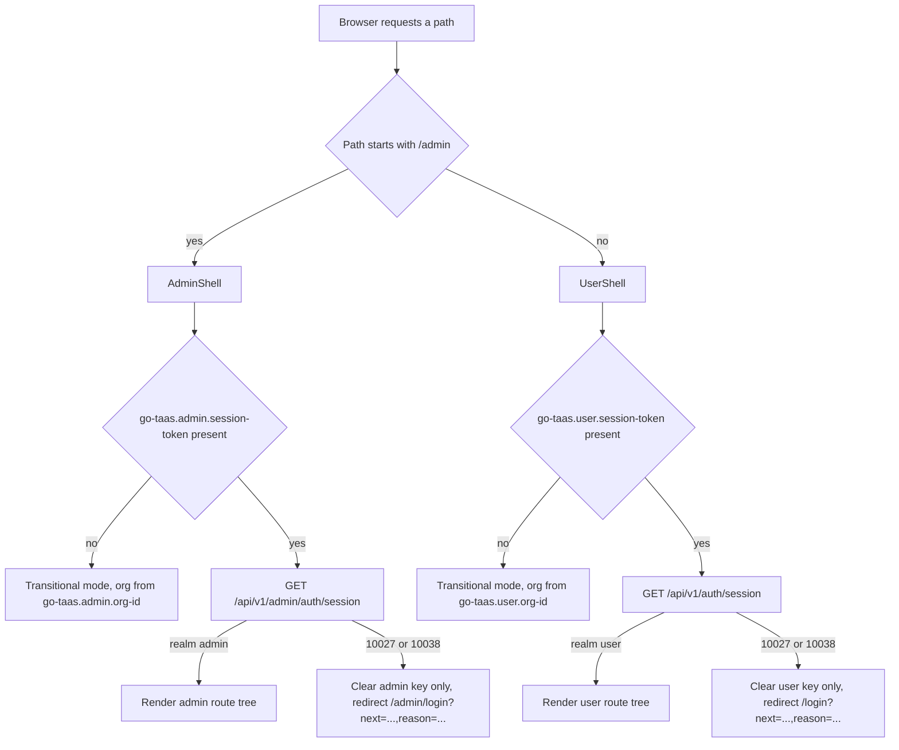
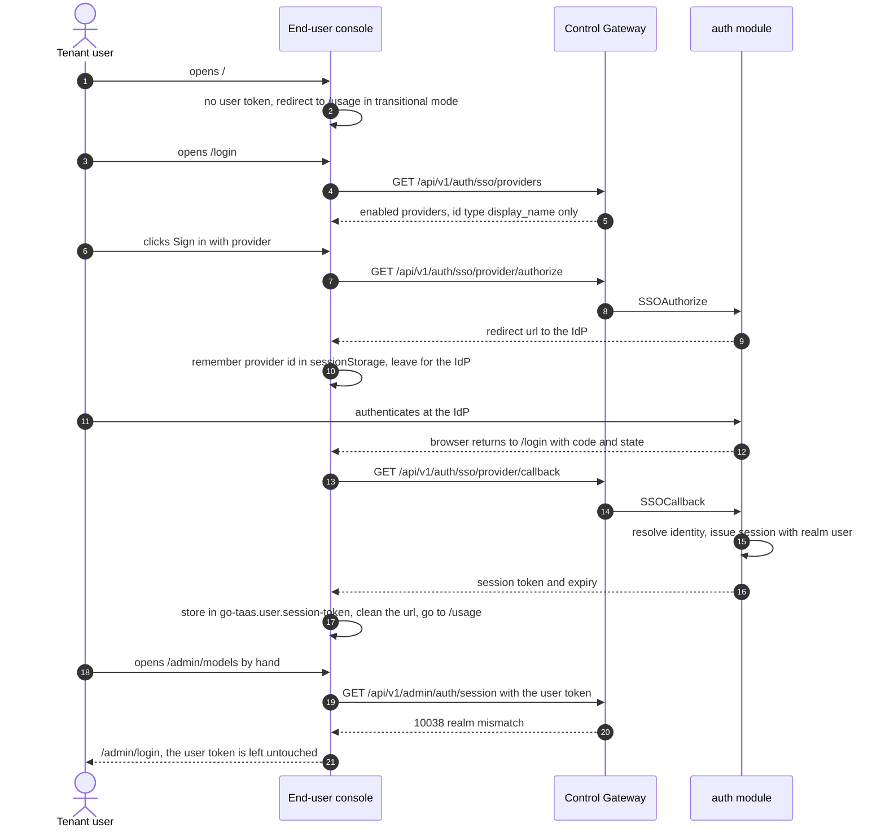

# Console Surface Separation (End-User Console and Admin Console) — Requirement Analysis and UI/UX Design

| Attribute | Content |
| --- | --- |
| Feature point | Console surface separation — end-user console at `/` (API `/api/v1/*`) split out of the admin console at `/admin` (API `/api/v1/admin/*`), with independent sessions (backlog row 17) |
| Document scope | Requirement analysis, competitive research, the page-by-page surface assignment for every page in `web/src/pages/`, the full UI design of the end-user console, the admin console's information-architecture changes, the routing/redirect migration plan, the page → API surface table, and numbered acceptance criteria |
| Owning modules | `web` console (route trees, shells, session storage, all pages), `pkg/server` gateway (realm gate, public provider projection), `auth` (session realm, realm-pinned login bindings), `metering`/`billing` (user-prefix bindings, optional admin organization filter), `tenancy` (unchanged) |
| Related documents | [Architecture Design](./architecture.md) — §3.1 Control Gateway, "Admin/user surface separation" · [SSO Federation & Account Binding](./sso-federation.md) — login entry, session issuance, `GetSession` · [Request Logs & API Playground](./request-logs-playground.md) — the two pages that move to the end-user console · [Usage Dashboards & Per-Request Cost Attribution](./usage-dashboard.md) — the page that exists on both surfaces · [Balance (Prepaid) & Quota (Postpaid) Account Modes](./balance-quota.md) — accounts and the balance snapshot · [Organization Members, Roles & Invitations](./org-members-rbac.md) — the roles the console renders · [Per-Tenant Model Authorization](./model-authorization.md) — the dependency behind the user-realm model list |
| Status | Design complete, handed to the Architect agent |

---

## 1. Background

go-taas ships **one** web console. `web/src/App.tsx` registers every route under `/admin/...` (`/admin/models`, `/admin/api-keys`, `/admin/usage`, `/admin/playground`, …), one sidebar lists all sixteen pages regardless of audience, and every page calls a `/api/v1/admin/...` route. The platform's own architecture document already states the target split — the control gateway serves management APIs under `/api/v1/admin/*`, user-facing account APIs under `/api/v1/auth/*`, and the admin web console under the `/admin` path prefix, "keeping the regular-user surface cleanly separated" — but no end-user surface exists, so the tenant-facing capabilities (own API keys, own usage, own request logs, playground, own bills) are only reachable inside the operator console.

That single-console shape has four concrete defects, all of them visible in the source today:

1. **Surface mixing by construction.** `ApiKeysPage`, `UsagePage`, `RequestLogsPage`, `PlaygroundPage` and `BillsPage` are tenant self-service pages living under `/admin`, so a tenant user who needs a key lands in the operator's navigation tree — with organization, project, member, SSO and image-registry administration one click away.
2. **Session mixing.** `web/src/api.ts` keeps one token key (`go-taas.session-token`) and one `Authorization: Bearer` header for every page, so any page can act with the credential of any other page. `Sessions` carry no realm at all (`services/auth/session_store.go`), so a session minted at the admin login page is indistinguishable from any other session.
3. **Entry point.** `/` redirects into `/admin` (`NavigateToAdmin`), i.e. the product's front door is the operator console.
4. **API prefix.** Every page in `web/src/App.tsx` calls `/api/v1/admin/...`, including the tenant-facing ones, so an audit of "who called what" cannot be done by prefix at all.

This feature splits the console cleanly: an **end-user console** at `/...` calling `/api/v1/*`, and an **admin console** at `/admin/...` calling `/api/v1/admin/*`, with independent sessions that never cross. It is a UI/IA and API-binding feature: it adds no new business capability, it moves capabilities to the surface where their audience lives.

### 1.1 How Comparable Products Separate a User/Workspace Surface from an Admin/Org Surface

| Product | End-user / workspace surface | Admin / organization surface | Session model | Notable pitfalls |
| --- | --- | --- | --- | --- |
| **OpenAI Platform** | `platform.openai.com`: Dashboard, API keys, Usage, Billing, Playground — one workspace-scoped console | Organization administration (Members, Roles, Projects, Limits, SSO, Audit logs) inside the same console, visible only to owner/admin roles, plus a separate organization API prefix (`/v1/organization/...`) | **One** login and **one** session for both; the surface is chosen by role, not by entry point | A member with a stale role sees admin entries it cannot use; there is no way to prove from a request which surface produced it; tenant self-service and org administration share one navigation tree |
| **Anthropic Console** | `console.anthropic.com`: Workbench, Usage, API keys, Billing — workspace-scoped | Organization administration (Members, SSO, Audit logs, Workspaces) with role gates (owner / admin / developer / billing / user) | **One** session per organization, surface again chosen by role | Role names collide with tenant roles; the admin-only request viewer is invisible to members, so support cannot be delegated without granting administration |
| **Together AI** | One console: Playground, Models, Usage, Billing, API keys | Organization settings for members, invitations and billing; the platform-side model catalog and deployment are not exposed at all | One session, org-scoped | The operator surface is a settings tab, so operator-only capabilities have no home of their own |
| **SiliconFlow** | Console for keys, usage, balance and playground | A separate management entry point (管理后台) for organizations, users, models and pricing, with its **own** sign-in | **Two** entry points, two sessions | The two consoles historically drift in look and terminology, and features get implemented twice with different behaviour |
| **Aliyun Bailian / Volcengine Ark** | Product console for models, keys and usage | Platform administration through the cloud account (RAM) and a separate operator view | Two identity systems | The user cannot see billing hierarchy; support tooling lives in a third place |
| **Stripe / Cloudflare** (for contrast) | Dashboard (single audience) | Separate admin surfaces with **separate origins and separate credentials** | Separate credentials by construction | Maximum isolation, highest operating cost (two builds, two origins, two navigation systems) |

### 1.2 Distilled Patterns and Decisions

Patterns worth adopting: (1) **a separate entry point per audience** — SiliconFlow's 管理后台 and Stripe's admin surfaces show that the entry point, not a role check, is the cheapest way to keep two audiences apart; (2) **path-prefixed API surfaces** — OpenAI's `/v1/organization/...` prefix proves the value of being able to audit a page's calls by prefix alone; (3) **different information architecture per audience** — task-oriented for API consumers (keys → usage → logs → try it), operations-oriented for operators (organizations → projects → members → catalog → orchestration → money); (4) **an explicit denial path** — cross-surface navigation must land on the other surface's sign-in page with a reason, never silently render a broken page.

Pitfalls to avoid: one session shared by two audiences (OpenAI, Anthropic) because the surface then has no identity of its own; admin capability reachable only through a role check inside one navigation tree (Together AI); duplicating behaviour in two hand-maintained consoles with drifting terminology (SiliconFlow); and hiding a tenant-facing capability behind an operator-only API prefix, which is exactly go-taas's current state for keys, usage, logs, playground and bills.

**Decisions for go-taas**:

| # | Decision | Rationale |
| --- | --- | --- |
| D1 | **One SPA bundle, two route trees.** The surface is determined by the path prefix: `/admin/*` is the admin console, everything else is the end-user console | Both consoles are static assets served publicly by the same gateway (no isolation comes from a second bundle), while a second build doubles the build/deploy/navigation surface. The isolation that matters is *tokens and API prefixes*, and the shared component library (`Dialog`, `Pagination`, `StateBadge`, `ErrorBanner`, `usePolling`) stays in one place |
| D2 | **Two shells, no shared navigation.** `UserShell` (user nav) and `AdminShell` (admin nav) are distinct components with distinct navigation arrays; no page renders outside a shell | The navigation tree is the most user-visible statement of the surface split, and a shared nav array is how the two surfaces silently re-merge |
| D3 | **Realm-pinned sessions.** A session carries `realm` ∈ {user, admin}. The realm is determined by **the prefix the login call was made on** — there is no request field to spoof: `/api/v1/auth/sso/{id}/authorize, callback` mints `user`, `/api/v1/admin/auth/sso/{id}/authorize, callback` mints `admin` | A request parameter that chooses its own realm is an authorization bypass; deriving it from the pinned login route makes the realm a property of the entry point, and makes it trivially auditable (`GetSession` on the user prefix can only ever return `user`) |
| D4 | **Separate browser storage per surface**: `go-taas.user.session-token` + `go-taas.user.org-id`, and `go-taas.admin.session-token` + `go-taas.admin.org-id`. No key is read by both surfaces | Token isolation must be a storage-key fact, not a convention — a page that cannot read the other realm's key cannot leak it, and a Nightwatch assertion on `localStorage` can prove it |
| D5 | **Cross-realm requests are rejected with a new code, 10038 `REALM_MISMATCH`.** A session presented on the other realm's prefix fails; a **realm-less** session (minted before this feature) fails with the existing 10027 `SESSION_INVALID`, forcing one re-login | Three different operator problems must not collapse into one code: "expired session" (10027), "you are signed into the other console" (10038, new), "your role does not permit this" (10036). 10038 tells the operator to switch consoles; 10036 tells the tenant admin to grant a role |
| D6 | **Transitional no-session access is preserved on both prefixes** (organization supplied by `X-Organization-Id`), exactly as today | Sessions exist for console users, but the CLI, FVT and the existing Nightwatch suites call the control plane without any session. Removing that path in the same iteration as the route split would break ten e2e suites at once. The browsers always send their realm's token once signed in, so signed-in cross-surface access is closed; *requiring* sessions on the admin prefix is a follow-up hardening row |
| D7 | **Tenant-self-service endpoints gain a user-prefix binding** (grpc-gateway `additional_bindings`), while the existing admin-prefix bindings stay functional but **deprecated** | A hard rename would invalidate every existing suite, FVT and CLI call in the same commit. Dual bindings give the canonical prefix immediately and a migration window; the admin bindings are reachable only by transitional (session-less) callers, because a *user-realm* session on the admin prefix is rejected by D5 |
| D8 | **Every page's API calls are auditable by prefix.** A user page must contain no `/api/v1/admin/` string, an admin page no `/api/v1/*` string | The one check that makes the split enforceable by a test rather than by review |
| D9 | **The end-user console's home is `/usage`** and `/` redirects there | The first question a tenant has is what its calls cost and whether they are flowing; the balance/quota widget on that page also answers "why did my agent stop" |
| D10 | **The admin console's home stays `/admin/models`** and `/admin` redirects there | Unchanged behaviour from before the split — an operator's first job is the catalog |
| D11 | **Three pages leave the admin navigation** (API Keys, Request Logs, Playground — they are tenant self-service), and the admin console gains no new nav items; Usage and Bills stay on both surfaces as organization-wide variants | One page, one surface: a capability with two audiences gets two pages (the surface rule), and the operator's version of usage/billing is organization-wide, which is what "all-org bills and accounts" means |
| D12 | **Moved pages keep their old admin URLs as client-side redirects** (`/admin/api-keys` → `/api-keys`, `/admin/request-logs` → `/request-logs`, `/admin/playground` → `/playground`). A redirect transfers no token | Bookmarks, runbooks and the existing e2e suites keep working, and because the target page enforces its own realm, a redirect can never move a credential between surfaces |
| D13 | **No new role gate on API keys.** Write controls are not disabled by role, because no key-level role rule exists today (feature #10 gates member and invitation APIs only) | A UI-only role gate that the API does not enforce is false security. The permission-denied states this design specifies are the ones the backend actually produces: 10036 (role), 10105 (model not authorized), 10017 (organization disabled), 10005 (organization gone), 10038/10027 (realm/session). Role-gating key management is recorded as an open question |
| D14 | **The end-user playground is model-based** — the tenant picks a *model*, never an inference service: `POST /api/v1/models/{model_id}:playground` (new). The operator's service-based playground stays on the admin prefix as an API with no console page | Inference services are operator-internal orchestration artifacts (replicas, images, card types). A tenant consumes models over the OpenAI-compatible endpoint, so the tenant playground must model the same contract |
| D15 | **A user-prefix binding is not merely a re-prefix** — the user-realm model list is a **masked projection** (no `weight_path`, no image or service identifiers) | Re-prefixing a response that carries operator fields would leak the cluster's internal shape while claiming a surface split |
| D16 | **`GET /api/v1/auth/sso/providers` is a new anonymous, user-realm projection** of enabled providers (id, type, display name only) | The login page must call its own realm's prefix (D8), and the admin provider directory returns operator fields (issuer, client id, default org, JIT flags) that a sign-in page must not receive |
| D17 | **The 404 view belongs to a shell, not to a surface**: an unmatched non-admin path renders inside `UserShell`, an unmatched `/admin/...` path inside `AdminShell`, each linking back to its own home, and neither makes an API call | A 404 that escapes both shells is how a user console ends up rendering admin chrome |

## 2. Goals and Non-goals

**Goals**: two shells and two route trees in one bundle (D1, D2); realm-pinned sessions with separate browser storage and a new 10038 rejection (D3–D5); realm-pinned login pages `/login` and `/admin/login` that call only their own prefix (D16); the end-user console's navigation, page inventory and default landing page (D9); every page in `web/src/pages/` assigned to exactly one surface with its full route and API prefix (D8, D11, §6); user-prefix bindings for the tenant-self-service APIs and masked projections where operator fields exist (D7, D15); the three moved pages with redirects (D12); organization-wide variants of the Usage and Bills pages on the admin surface (D11); guards that turn a cross-realm or expired session into a redirect to the right sign-in page with a `next` parameter; per-page interactive states including permission-denied; numbered acceptance criteria testable in Nightwatch against the compose stack, including negative ones.

**Non-goals**: first-party username/password accounts (`Login` and `CreateUser` are still stubs returning "auth: not implemented" — implementing credential accounts is a separate feature); platform-administrator entitlement for the admin realm (any authenticated principal may use either entry point, exactly as today's role check-free control plane, and what a session may *do* stays governed by the existing organization roles); requiring a session on the admin prefix (D6 hardening, follow-up row); retiring the deprecated admin-prefix bindings (D7 window); a tenant-facing model catalog and price page (a future user-surface variant of features #2/#5); self-service payments, invoices and auto-recharge (#14); a surface switcher linking the user console to the admin console (deliberately absent, see AC4); duplicating the shared component library per surface; changing any data-plane (inference gateway) behaviour.

## 3. Personas and Journeys

| Role | Surface | Journey |
| --- | --- | --- |
| **Tenant developer** (consumes models from an Agent) | end-user | Signs in at `/login` → creates an API key on `/api-keys` and copies the one-time secret → tries the model with own key on `/playground` → watches tokens and cost on `/usage` → debugs a failed call on `/request-logs` |
| **Tenant billing owner** (pays for usage) | end-user | Signs in → `/usage` shows the prepaid balance or postpaid spend against quota → `/billing` shows the month's bill and its charge rows |
| **Tenant administrator** (adds people, grants access) | admin | Signs in at `/admin/login` → `/admin/members` and `/admin/invitations` manage people → `/admin/organizations` and `/admin/projects` own the resources → `/admin/models` grants the organization its models |
| **Platform operator** | admin | Catalog and deployment (`/admin/models`, `/admin/images`, `/admin/inference-services`) → federation (`/admin/sso`, `/admin/identity-bindings`) → money (`/admin/pricing`, `/admin/billing`, `/admin/billing/accounts`) → organization-wide usage on `/admin/usage` |
| **Agent / SDK** | neither | Calls the inference endpoint with an API key; touches no control-plane page. It generates the usage, logs and cost both consoles display |
| **Support engineer** | end-user | Impersonates the tenant's view by asking the tenant to read `/request-logs` and `/usage` — the reason those pages are tenant pages, not operator pages |

> Terminology: the consumer-side caller is an **Agent** in English and 「智能体」 in Chinese, consistent with the repository convention.

## 4. Current-State Audit (derived from source)

Routes in `web/src/App.tsx` (today): `/` → redirect `/admin`, `/admin/login`, `/admin` → redirect `/admin/models`, plus `organizations`, `projects`, `members`, `invitations`, `sso`, `identity-bindings`, `api-keys`, `models`, `models/:id`, `images`, `images/:id`, `inference-services`, `inference-services/:id`, `usage`, `request-logs`, `playground`, `pricing`, `billing`, `billing/accounts`, and `*` → `NotFoundPage`. Every one of them is wrapped in the single `Layout` with `NAV_ITEMS` listing all sixteen destinations, and `Sidebar` signs out by calling `/api/v1/auth/logout` with the single token key.

API usage per page (derived by scanning `web/src/**` for `/api/v1`):

| Page | Routes called today | Belongs to |
| --- | --- | --- |
| `ApiKeysPage` | `/api/v1/admin/auth/api-keys` (+ `/{id}`, `/{id}:revoke`) | tenant |
| `UsagePage` | `/api/v1/admin/metering/usage-summary`, `usage-dashboard`, `vouchers` | tenant (and operator, organization-wide) |
| `RequestLogsPage` | `/api/v1/admin/metering/request-logs` | tenant |
| `PlaygroundPage` | `/api/v1/admin/inference-services?page.limit=100`, `/api/v1/admin/auth/api-keys?page.limit=100`, `/api/v1/admin/inference-services/{id}:playground` | tenant |
| `BillsPage` | `/api/v1/admin/billing/bills`, `charges` | tenant (and operator) |
| `BalanceWidget` (component) | `/api/v1/admin/billing/balance` | tenant |
| `LoginPage` | `/api/v1/admin/auth/sso/providers` for the provider list, `/api/v1/auth/sso/{id}/authorize, callback` for the flow | both realms |
| `LoginPage` (LDAP) | Uses `window.prompt` for username and password | both realms |
| All other pages | `/api/v1/admin/...` only | operator |

Defects this feature closes, in addition to the four in §1: the login page reads the **operator** provider directory (issuer, client id, default org) before the user is authenticated; the LDAP flow uses `window.prompt`, which is not styleable, not validatable and not reliably automatable; the org switcher falls back to the operator tenancy API (`/api/v1/admin/tenancy/organizations`) when no session exists; and there is no `next`-parameter handling anywhere, so a session expiry drops the user on a login page with no way back to where they were.

## 5. Feature Requirements

### FR1 — Routing and shells

- **FR1.1** The route table contains two disjoint trees: end-user routes at `/`, `/login`, `/usage`, `/api-keys`, `/request-logs`, `/playground`, `/billing`; admin routes at `/admin` and `/admin/*` exactly as listed in §6. `/` redirects to `/usage` (D9), `/admin` to `/admin/models` (D10).
- **FR1.2** End-user routes render inside `UserShell`, admin routes inside `AdminShell` (D2). The shells own their navigation array, their organization selector and their sign-out control; a page never renders outside a shell.
- **FR1.3** `UserShell` navigation contains exactly: Usage (`/usage`), API Keys (`/api-keys`), Request Logs (`/request-logs`), Playground (`/playground`), Billing (`/billing`) — five items, no `/admin` link of any kind (D2, AC7).
- **FR1.4** `AdminShell` navigation contains exactly: Organizations, Projects, Members, Invitations, SSO Providers, Identity Bindings, Models, Inference Services, Images, Usage, Bills, Accounts — thirteen items. API Keys, Request Logs and Playground are **removed** (D11).

### FR2 — Sessions, realms and isolation

- **FR2.1** `Session` gains a `realm` field (`user` | `admin`), set at issuance from the login route's prefix (D3). `GetSessionResponse` gains `realm`.
- **FR2.2** Realm-pinned session routes: `GET /api/v1/auth/session`, `POST /api/v1/auth/session/org`, `POST /api/v1/auth/logout` require `realm = user`; `GET /api/v1/admin/auth/session`, `POST /api/v1/admin/auth/session/org`, `POST /api/v1/admin/auth/logout` (all new) require `realm = admin`.
- **FR2.3** The browser stores each realm's token under its own key (D4): `go-taas.user.session-token`, `go-taas.admin.session-token`. Each surface also keeps its own organization context (`go-taas.user.org-id`, `go-taas.admin.org-id`).
- **FR2.4** A session presented on the other realm's prefix fails with the new **10038 `REALM_MISMATCH`**; a session without a realm fails with **10027 `SESSION_INVALID`** (D5).
- **FR2.5** Session-less (transitional) access with `X-Organization-Id` keeps working on both prefixes (D6), and each console's boot sequence deletes the legacy single-realm keys `go-taas.session-token` and `go-taas.org-id` so no page can fall back to them.

### FR3 — Login pages

- **FR3.1** `/login` (user realm) lists enabled providers from the new anonymous `GET /api/v1/auth/sso/providers` (id, type, display name only — D16) and signs in through `GET /api/v1/auth/sso/{provider_id}/authorize` + `GET /api/v1/auth/sso/{provider_id}/callback`. `/admin/login` (admin realm) lists providers from the existing `GET /api/v1/admin/auth/sso/providers` and signs in through the new admin-prefix `authorize`/`callback` bindings. Neither page calls the other realm's routes (D8).
- **FR3.2** An LDAP provider opens an **inline username/password form** inside the page (no `window.prompt`): both fields required, the submit control disabled until both are non-empty, and the credentials posted to the realm's `callback` binding as `username`/`password` (matching feature #7's LDAP bind contract).
- **FR3.3** The provider id pending a redirect is remembered in `sessionStorage` (`go-taas.user.sso-provider` / `go-taas.admin.sso-provider`) before leaving for the IdP, and consumed on return; the pending entry is deleted once the session is stored.
- **FR3.4** On success the token is written to the realm's key, the URL fragment/query is cleaned with `history.replaceState`, and the browser lands on the realm's home (`/usage`, `/admin/models`) or on the `next` path recorded by a guard (FR4.3).
- **FR3.5** Visiting a login page while holding a valid session of that realm redirects to that realm's home without showing the form.

### FR4 — Guards, redirects and denial behaviour

- **FR4.1** Each shell validates the session on boot **only when its own token key is non-empty**: `GET /api/v1/auth/session` for the user shell, `GET /api/v1/admin/auth/session` for the admin shell.
- **FR4.2** When no token exists in the shell's key, the shell renders in **transitional mode** with a dismissible notice (`user-console-transitional-banner` / `admin-console-transitional-banner`) and uses the realm's organization key (default `org-default`) — the browser behaviour of every existing suite is preserved (D6, AC20).
- **FR4.3** When a token exists but the session call fails with 10038 or 10027, the shell clears **only its own** token key, clears the pending path, and redirects to its own login page with `?next=<path>&reason=realm, expired`; the login page shows the matching notice ("You were signed in to the other console." / "Your session expired. Sign in again."). The other realm's token is never read, cleared or echoed.
- **FR4.4** Navigating to an admin route while holding only a user-realm session lands on `/admin/login` (FR4.3), and navigating to a user route while holding only an admin-realm session lands on `/login`.
- **FR4.5** The moved admin URLs redirect client-side to the end-user URLs (D12) before any API call, without carrying a token.

### FR5 — Surface-conformant API usage

- **FR5.1** No file implementing an end-user page or the user shell contains the string `/api/v1/admin/`; no file implementing an admin page or the admin shell contains the string `/api/v1/` outside `/api/v1/admin/` (D8).
- **FR5.2** Tenant-self-service RPCs gain user-prefix bindings and keep deprecated admin-prefix bindings (D7): API keys, metering usage/logs/vouchers, billing balance/bills/charges. New user-realm reads: the provider projection (D16), the masked model list (D15), the model-based playground (D14).
- **FR5.3** End-user pages take the organization from the session's active org; any `X-Organization-Id` header is ignored on a user-realm session (the feature-#7 D6 rule), so a user page cannot be pointed at another organization from the browser.
- **FR5.4** Admin Usage and Bills gain an organization dimension: an organization filter with an "All organizations" option (default: the working organization) and, on the dashboard, an `organization` group-by value; the user-realm bindings reject nothing but simply ignore an organization parameter, staying session-scoped (FR5.3).

### FR6 — Interactive states, copy and test hooks

- **FR6.1** Every end-user page implements the six interactive states named in §12 (default, loading, empty, error, disabled, permission-denied) with the copy given per page in §8.
- **FR6.2** Every page, control, table and dialog carries a `data-testid` in the `kebab-case` style already used by the console (`create-api-key`, `api-keys-table`, `request-log-filters`, `playground-send`, …), and the new shell/guard/notice elements carry the ids named in this document.
- **FR6.3** Error copy maps business codes to sentences (never a bare code): the mapping table in §13 is binding for both consoles.

## 6. Surface Assignment — Every Page in `web/src/pages/`

Enumerated from source (`web/src/pages/`, twenty-one files, including `NotFoundPage.tsx`). One page, one surface; a capability with two audiences becomes two pages (the surface rule).

| # | Page (source file) | Surface | Target route | Target API prefix | Rationale |
| --- | --- | --- | --- | --- | --- |
| 1 | `AccountsPage` | **admin** | `/admin/billing/accounts` | `/api/v1/admin/billing/*` | Billing accounts (prepaid/quota mode, spend limit, recharge, refund, transaction ledger) are money movement across the tenant base. Self-service payments are feature #14, so recharge stays an operator action |
| 2 | `ApiKeysPage` | **end-user** | `/api-keys` | `/api/v1/auth/api-keys*` | Keys are the tenant's own credentials for its Agents. The operator does not issue a tenant's keys. The operator still sees per-organization key **counts** on `/admin/organizations` |
| 3 | `BillsPage` | **both** (two pages) | end-user `/billing`, admin `/admin/billing` | end-user `/api/v1/billing/*`, admin `/api/v1/admin/billing/*` | The tenant reads its own monthly bill and its charge rows. The operator reads bills across organizations (organization column + filter, FR5.4) |
| 4 | `IdentityBindingsPage` | **admin** | `/admin/identity-bindings` | `/api/v1/admin/auth/identity-bindings*` | Pre-assigning an external identity to a platform account is federation administration |
| 5 | `ImageDetailPage` | **admin** | `/admin/images/:id` | `/api/v1/admin/images/*` | Registry digests, in-use services and node-level pre-pull results are cluster operations |
| 6 | `ImagesPage` | **admin** | `/admin/images` | `/api/v1/admin/images*` | Inference image registry and pre-pull mapping — the operator owns which binaries run on which nodes |
| 7 | `InferenceServicesPage` | **admin** | `/admin/inference-services` | `/api/v1/admin/inference-services*` | Replica counts, states and scaling are orchestration. The tenant consumes models, never services (D14) |
| 8 | `InvitationsPage` | **admin** | `/admin/invitations` | `/api/v1/admin/tenancy/...invitations*` | Inviting people into an organization is membership administration |
| 9 | `LoginPage` | **both** (two pages) | end-user `/login`, admin `/admin/login` | end-user `/api/v1/auth/*`, admin `/api/v1/admin/auth/*` | The realm **is** the entry point (D3). Each page lists providers and completes the flow on its own prefix (D8, D16) |
| 10 | `MembersPage` | **admin** | `/admin/members` | `/api/v1/admin/tenancy/organizations/{org_id}/members*` | Role assignment inside an organization is administration, and it is the only place the backend enforces a role gate today (10036) |
| 11 | `ModelDetailPage` | **admin** | `/admin/models/:id` | `/api/v1/admin/models/{model_id}` | Version and weight-path management plus per-tenant authorization grants (feature #13) are catalog administration |
| 12 | `ModelsPage` | **admin** | `/admin/models` | `/api/v1/admin/models*` | The catalog, its weight paths and one-click deployment are operator capabilities. The end-user console gets no catalog page; it consumes the **masked** model list only as the playground's selector source (`GET /api/v1/models`, D15) |
| 13 | `OrganizationsPage` | **admin** | `/admin/organizations` | `/api/v1/admin/tenancy/organizations*` | Creating and disabling tenants is the platform operator's job |
| 14 | `PlaygroundPage` | **end-user** | `/playground` | `/api/v1/models`, `/api/v1/auth/api-keys`, `/api/v1/models/{model_id}:playground` | Trying a model with your own key before integrating it is the tenant's workflow. The tenant selects a model, never a service (D14) |
| 15 | `PricingPage` | **admin** | `/admin/pricing` | `/api/v1/admin/billing/prices` | The price matrix, tiers and effective dates are commercial policy |
| 16 | `ProjectsPage` | **admin** | `/admin/projects` | `/api/v1/admin/tenancy/projects*` | Projects are the operator's isolation unit inside an organization |
| 17 | `RequestLogsPage` | **end-user** | `/request-logs` | `/api/v1/metering/request-logs` | A tenant debugs its own failed or slow calls with its own key. An operator-facing request-log view is deliberately not part of this feature (Open Questions) |
| 18 | `SSOProvidersPage` | **admin** | `/admin/sso` | `/api/v1/admin/auth/sso/providers*` | IdP configuration carries secrets, issuer and default-organization policy — operator-only fields |
| 19 | `ServiceDetailPage` | **admin** | `/admin/inference-services/:id` | `/api/v1/admin/inference-services/{service_id}` | Service internals (image, replicas, endpoints) are orchestration |
| 20 | `UsagePage` | **both** (two pages) | end-user `/usage`, admin `/admin/usage` | end-user `/api/v1/metering/*` + `/api/v1/billing/balance`, admin `/api/v1/admin/metering/*` + `/api/v1/admin/billing/balance` | The tenant watches its own spend and its balance/quota; the operator watches usage across organizations (organization filter and `organization` group-by, FR5.4) |
| 21 | `NotFoundPage` | **shell-level** (no surface of its own) | any unmatched path | **none** (makes no API call) | The only page without a surface: it renders inside the shell that owns the prefix (D17), so a user never sees admin chrome. It is the single, documented exception to "one page, one surface" |

**Operator concerns → admin console**: organizations, projects, members, invitations, SSO providers, identity bindings, pricing, the image registry, the model catalog, inference-service orchestration, all-organization bills and billing accounts.

**Tenant self-service concerns → end-user console**: own API keys, own usage, own request logs, playground, own billing, own balance/quota snapshot.

## 7. End-User Console Information Architecture

**Navigation** (five items, in this order — the order follows the tenant's own task flow, not the operator's): Usage · API Keys · Request Logs · Playground · Billing. Chinese labels: 用量 · API Key · 请求日志 · API Playground · 账单.

**Default landing page**: `/usage`. Signing in lands there, and `/` redirects there (D9). Rationale: the page answers the two questions that bring a tenant back ("is my traffic flowing", "what is it costing") and it carries the balance/quota widget, which also explains a blocked organization.

**Page inventory**:

| Route | Page | Purpose | API prefix |
| --- | --- | --- | --- |
| `/usage` | Own usage and cost | Tokens, requests and cost for the active organization, balance/quota snapshot, drill-down to vouchers, CSV export | `/api/v1/metering/*`, `/api/v1/billing/balance` |
| `/api-keys` | API keys | Create, rename, rate-limit and revoke the organization's keys, reveal a one-time secret, show the inference endpoint | `/api/v1/auth/api-keys*` |
| `/request-logs` | Request logs | Per-request metadata for the organization's own calls, filterable and drillable | `/api/v1/metering/request-logs` |
| `/playground` | API Playground | Send a test inference to a model with one of the organization's keys, metered and logged like any other call | `/api/v1/models`, `/api/v1/auth/api-keys`, `/api/v1/models/{model_id}:playground` |
| `/billing` | Billing | Monthly bills of the organization with a charge-row drill-down (read-only) | `/api/v1/billing/bills`, `/api/v1/billing/charges` |
| `/login` | Sign-in | Realm-pinned sign-in through the configured identity providers | `/api/v1/auth/*` |

**Sign-in flow**: `/login` is the user realm (session realm `user`), `/admin/login` is the admin realm (session realm `admin`); both use the same providers but write different sessions and different storage keys (FR2.3, FR3). Neither page reads the other's provider directory (D16).

**Session storage and isolation**:

| Key | Written by | Read by | Contents |
| --- | --- | --- | --- |
| `go-taas.user.session-token` | `/login` (after callback) | user shell, user pages | user-realm session id, sent as `Authorization: Bearer` on `/api/v1/*` |
| `go-taas.user.org-id` | user shell organization selector | user shell, user pages | active organization for transitional mode |
| `go-taas.admin.session-token` | `/admin/login` (after callback) | admin shell, admin pages | admin-realm session id, sent as `Authorization: Bearer` on `/api/v1/admin/*` |
| `go-taas.admin.org-id` | admin shell organization selector | admin shell, admin pages | working organization context for org-scoped admin pages |
| `go-taas.user.sso-provider` / `go-taas.admin.sso-provider` (sessionStorage) | login pages | login pages | provider id pending an IdP redirect |
| `go-taas.session-token`, `go-taas.org-id` (legacy) | nobody | nobody | **deleted on boot** by both shells (FR2.5) |

No key is read by both surfaces (D4) — that is the property a test can assert, and the reason a redirect (D12) can never carry a credential across.

## 8. Full UI Design — End-User Console

### 8.0 `UserShell` (all end-user routes)

- **Route**: every path not starting with `/admin`.
- **Layout regions**: (1) left sidebar — brand block "go-taas"; navigation (the five items of §7, each `data-testid="user-nav-{slug}"` where slug is `usage`, `api-keys`, `request-logs`, `playground`, `billing`); organization selector at the bottom (`org-switcher-select`, options from the session's accessible organizations, switching posts `/api/v1/auth/session/org`); account block showing the signed-in username and the active organization role badge (`user-account-block`); sign-out control (`user-menu-logout`). (2) main area — a page header (`h1` + subtitle, the existing `page-header` pattern) plus the page content.
- **Primary actions**: navigation; organization switching. **Secondary**: sign out.
- **States**: *default* — sidebar with a highlighted active item (exact match or path-prefix match, the existing `isActive` rule); *loading* — the session call is in flight, pages render their own loading state and the account block shows a skeleton; *empty* — n/a; *error* — a session failure is a redirect (FR4.3), not a banner, and a failed organization switch shows the notice `org-switcher-notice` while keeping the previous organization; *disabled* — the organization selector is disabled while a switch is in flight; *permission-denied* — the transitional notice (`user-console-transitional-banner`, "You are not signed in. This console is in transitional mode and uses the organization id stored in this browser. Sign in.") with a link to `/login`, plus a realm notice (`signin-notice`) with the copy of FR4.3 when redirected with `?reason=`.
- **Deliberately absent**: any link, breadcrumb or menu entry pointing at `/admin` (D2, AC7). Operators know their own URL; the user console never advertises the operator surface.

### 8.1 `/login` — user-realm sign-in

- **Purpose**: authenticate into the end-user console and start a user-realm session.
- **Route**: `/login`. **API**: `GET /api/v1/auth/sso/providers` (new projection), `GET /api/v1/auth/sso/{provider_id}/authorize`, `GET /api/v1/auth/sso/{provider_id}/callback`, and `GET /api/v1/auth/session` for the "already signed in" check.
- **Layout regions**: centered card — brand; `h1` "Sign in"; subtitle "Access your API keys, usage, request logs and billing."; notice slot (`signin-notice`); provider button list (`sso-login-list`, one `sso-login-{provider_id}` button per enabled provider, label "Sign in with {display_name}"); LDAP inline form slot; footer hint "Signed-in sessions expire after 24 hours." (the configured `sessionTTL`).
- **Primary action**: "Sign in with {provider}" (`sso-login-{provider_id}`); for LDAP, the form's "Sign in" (`ldap-submit`). **Secondary**: none (no self-service signup in this feature).
- **Interactive states**:

| State | Trigger | Rendering |
| --- | --- | --- |
| default | providers loaded, not signed in | Provider buttons; the first enabled provider is focused |
| loading | provider list in flight | `Loading…` inside the card (`login-loading`) |
| empty | zero enabled providers | `login-no-providers`: "No sign-in providers are enabled. Ask your platform operator to configure one." |
| error | provider list failed | `ErrorBanner` (`login-error`) with the mapped copy from §13 and a "Retry" control |
| disabled | a sign-in is in flight, or LDAP fields incomplete | Buttons show "Signing in…" and are disabled (`login-signing-in`); the LDAP submit stays disabled until both fields are non-empty |
| permission-denied | not applicable to a sign-in page, but the *realm* states are explicit: a stored **admin** token is never read here (D4), and a callback that returns no session shows "Sign-in did not complete. Try again." | — |

- **Form fields (LDAP inline form, FR3.2)**:

| Field | Control | Validation | Error copy |
| --- | --- | --- | --- |
| `ldap-username` | text, `autocomplete="username"` | required, 1–128 characters, trimmed | "Username is required." / "Username must be at most 128 characters." |
| `ldap-password` | password, `autocomplete="current-password"` | required, 1–256 characters | "Password is required." |

- **Error copy by code**: 10002/10012 → "The username or password is incorrect."; 10022 → "This identity provider is disabled. Ask your platform operator."; 10023 → "The sign-in response was rejected (invalid state). Start again."; 10024 → "The identity provider rejected the sign-in."; 10025 → "This identity is not linked to a go-taas account. Ask your organization administrator for an invitation."; 10027 → "Sign-in did not complete. Try again."; 10038 → "You were signed in to the other console. Sign in here instead."
- **Return handling** (FR3.3–FR3.4): on mount with `?code=` and the remembered provider id, the page calls the realm's `callback`, stores the token in `go-taas.user.session-token`, clears the pending provider entry, `history.replaceState`s the query away, and navigates to `next` (validated to be a non-`/admin` path) or `/usage`.
- **Already signed in**: a valid user session redirects to `/usage` without rendering the form (FR3.5).

### 8.2 `/usage` — own usage and cost

- **Purpose**: what the organization consumed and what it cost, with the funding context that explains a blocked caller.
- **Route**: `/usage`. **API**: `GET /api/v1/metering/usage-summary`, `GET /api/v1/metering/usage-dashboard`, `GET /api/v1/metering/vouchers`, `GET /api/v1/billing/balance`.
- **Layout regions**: header (`h1` "Usage", subtitle "Tokens, requests and cost for **{organization}**, newest first."); balance/quota widget row (`usage-balance-widget`); summary cards row (`usage-dashboard-cards`: cost, tokens in/out, requests, average cost per request, plus `usage-unpriced-badge` when `unpriced_request_count > 0`); daily chart with metric toggle (`usage-metric-toggle`) and group-by select (`usage-groupby-select`); controls row (range presets 24 h / 7 d / 30 d / custom, `usage-export-csv`); usage table (`usage-table`); drill-down dialogs.
- **Primary actions**: change range, group by model or key, click a chart day to filter the table, drill into vouchers, export CSV, follow the widget to `/billing`. **Secondary**: refresh (the page polls every 60 s while visible).
- **Group-by options (user surface)**: `api_key` (default) and `model`. The operator's `accelerator_type` dimension is not offered here (a tenant does not choose GPU SKUs) — the admin variant of the same page offers all three plus `organization` (FR5.4).
- **Table columns**: API Key · Input tokens · Output tokens · Cached tokens · Requests · Cost · Settled (the feature-#9 columns plus the Cost column) · Actions ("By model", "Vouchers"). Pagination 20 rows per page, server-side (`page.offset`/`page.limit`). Sorting: fixed server order (group key ascending) — the page documents that it is not sortable, rather than pretending.
- **Dialogs**: *By model* — the same range and key, grouped by model with cost; *Vouchers* — per-request rows: Request · Model · In/Out/Cached tokens · Est. cost · Settled, with the "Est. cost" label and the tier tooltip from feature #9.
- **Interactive states**:

| State | Rendering |
| --- | --- |
| default | Cards, chart, table and widget rendered for the default 24 h range |
| loading | `Loading…` in the panel; metric toggle and export disabled |
| empty | `usage-empty`: "No usage in this range yet. Usage appears within an hour of your first inference call." |
| error | `ErrorBanner` with the mapped copy and a "Retry" control that refetches both the dashboard and the widget |
| disabled | Export disabled while no rows are loaded; metric toggle disabled while loading; the widget's action link disabled while the balance call is in flight |
| permission-denied | 10005 → "Your active organization no longer exists. Choose another organization in the sidebar."; 10017 → "This organization is disabled. Ask your platform operator."; 10503 → the widget shows the muted "No billing account" state, never an error banner; 10027/10038 → redirect per FR4.3 |

- **Difference from the admin variant**: see §9 — the user page is session-scoped (the organization comes from the session, FR5.3), offers two group-by dimensions, and its widget links to `/billing` instead of the operator's `/admin/billing/accounts`.

### 8.3 `/api-keys` — own API keys

- **Purpose**: issue and govern the credentials the organization's Agents use.
- **Route**: `/api-keys`. **API**: `GET /api/v1/auth/api-keys?page.offset=&page.limit=`, `POST /api/v1/auth/api-keys`, `PUT /api/v1/auth/api-keys/{key_id}`, `POST /api/v1/auth/api-keys/{key_id}:revoke`.
- **Layout regions**: header (`h1` "API Keys", subtitle, plus an **Endpoint** line: base URL `{origin}/v1/chat/completions` with a copy control `api-keys-endpoint-copy` — the tenant's next action after creating a key); toolbar (`Create API Key`, `create-api-key`); keys table (`api-keys-table`); pagination; dialogs.
- **Primary action**: Create API Key. **Secondary**: Edit (rename, expiry, rate limits), Revoke, copy the endpoint.
- **Table columns**: Name · Key (`prefix…` in monospace, never the secret) · Status (`StateBadge`: active / revoked / expired) · Rate limit (`{rpm}/min · {tpm}/min`, "unlimited" when both are 0 — feature #11) · Created · Expires ("never" when unset) · Actions (Edit, Revoke). Pagination 20 per page; the status filter maps to the API's server-side `active_only` (`api-keys-filter-status`: All / Active only); the name search filters the **loaded page** and says so in its placeholder ("Filter loaded page").
- **Dialogs**:
  - *Create API Key* (`create-dialog`): fields Name (`key-name-input`, required, 1–64 characters, unique per organization → 10004-style duplicate copy "A key with this name already exists."), Expiry (`key-expiry-select`: Never / 30 days / 90 days / 365 days), Rate limit RPM (`rate-limit-rpm`, optional non-negative integer, "0 = unlimited"), Rate limit TPM (`rate-limit-tpm`, same). Submit disabled while the request is in flight and while Name is empty.
  - *Created secret* (`created-dialog`): the plaintext key once (`created-secret`), a copy control (`created-copy`), and a confirmation gate — Close stays disabled until "I have saved this key" (`created-confirm`) is checked; the dialog warns "This key is shown only once."
  - *Edit* (`edit-dialog`): Name and rate limits (the expiry is not editable after creation), same validation as Create.
  - *Revoke* (`revoke-dialog`): confirmation naming the key and warning "Agents using this key start failing with 10009 immediately. This cannot be undone."
- **Interactive states**: *default* — table with the first page; *loading* — `Loading…`; *empty* — `api-keys-empty`: "No API keys yet. Create one to let your Agents call the API."; *error* — banner with mapped copy and Retry; *disabled* — Revoke hidden for already-revoked rows, Create disabled while submitting, created-secret copy disabled until the dialog is confirmed; *permission-denied* — 10036 → "Your role in this organization does not permit this action." (defensive: no key-level role gate exists yet, D13), 10007 → "This key no longer exists. Refresh the list.", 10038/10027 → redirect per FR4.3.

### 8.4 `/request-logs` — own request logs

- **Purpose**: answer "why did my call fail or take 4 s" for the organization's own traffic.
- **Route**: `/request-logs`. **API**: `GET /api/v1/metering/request-logs`, plus `GET /api/v1/auth/api-keys?page.limit=100` and `GET /api/v1/models` to populate the filter selects.
- **Layout regions**: header (`h1` "Request Logs", subtitle "Per-request metadata for this organization. Logs are kept for 30 days and appear within minutes of the call."); filter toolbar (`request-log-filters`: range presets `request-log-range-24h, 7d, 30d`, status select `request-log-filter-status`, API key select `request-log-filter-key`, model select `request-log-filter-model`, "Clear filters" `request-log-clear-filters`); logs table (`request-logs-table`); pagination; detail dialog.
- **Primary action**: filter and drill into a request. **Secondary**: clear filters, change range.
- **Table columns**: Time · Request (`request_id`) · Key · Model · Tokens (in / out) · Latency (ms) · Status (`StateBadge`: success / error / streaming) · Actions (Detail). Pagination 20 per page; filters are server-side (status, key, model, range) — the key and model selects exist precisely because free-text ids (today's inputs) are unusable.
- **Detail dialog** (`request-log-detail-{request_log_id}`): Request ID · Status · Model · API Key · Latency · Tokens (in / out / cached / reasoning) · Created · Error (when present). The operator's internal `service_id` is **not** shown on this surface (D15's masking principle: the tenant sees the model it called, not the platform's routing).
- **Interactive states**: *default* — last 24 h; *loading* — `Loading…`; *empty* — `request-logs-empty`: "No request logs in this range. Logs appear after the first inference calls."; *error* — banner with mapped copy and Retry; *disabled* — pagination disabled while loading, "Detail" unavailable for rows still streaming? no — *disabled* applies to the model/key selects while their option lists are loading; *permission-denied* — 10404 → "The selected range is invalid (maximum 92 days)."; 10005/10017 → organization copy from §8.2; 10027/10038 → redirect per FR4.3.

### 8.5 `/playground` — API Playground (model-based)

- **Purpose**: prove a model works with the organization's own key before writing integration code.
- **Route**: `/playground`. **API**: `GET /api/v1/models` (masked catalog, D15), `GET /api/v1/auth/api-keys?page.limit=100&active_only=true`, `POST /api/v1/models/{model_id}:playground`.
- **Layout regions**: header (`h1` "API Playground", subtitle "Send a test inference with one of your keys. The call is metered and logged like any other request."); form row — Model select (`playground-model-select`, options "name (latest_version)"), API Key select (`playground-key-select`, active keys only), Prompt textarea (`playground-prompt-input`, 1–8000 characters with a counter), Send button (`playground-send`); parameter row — Temperature (`playground-temperature`, 0–2, step 0.1, default 0.7) and Max tokens (`playground-max-tokens`, 1–4096, default 512) — sent only when the backend accepts them, otherwise the row is omitted (the RPC contract decides, see §11); response pane (`playground-response`) showing the completion text, prompt/completion tokens and total latency, plus "Copy as curl" (`playground-copy-curl`) producing a snippet with `Authorization: Bearer sk-…` placeholders.
- **Primary action**: Send (`playground-send`, enabled only when a model, a key and a non-empty prompt are present). **Secondary**: copy the curl snippet.
- **Interactive states**:

| State | Rendering |
| --- | --- |
| default | Selectors populated, prompt empty, Send disabled with the hint "Select a model and a key, then enter a prompt." |
| loading | Selects disabled and showing "Loading…" while the catalog and key list resolve |
| empty | No models: `playground-no-models` "No models are available to your organization yet. Ask your platform operator."; no active keys: `playground-no-keys` "You have no active API keys. Create one first." with a link to `/api-keys` |
| error | `ErrorBanner` with mapped copy; the previous response pane is preserved so a comparison is still possible |
| disabled | Send while sending ("Sending…"), temperature/max-tokens while sending, Copy-as-curl until a response exists |
| permission-denied | 10105 → "This organization is not authorized for this model."; 10301/10303 → "This model has no ready inference service right now. Try another model or try again shortly."; 10037 → "Rate limit exceeded for this key. Wait a moment."; 10027/10038 → redirect per FR4.3 |

- **Note**: the tenant never selects an inference service (D14). Selecting a model and letting the platform route it is exactly the contract the OpenAI-compatible endpoint offers, so the playground cannot teach a wrong mental model.

### 8.6 `/billing` — own bills

- **Purpose**: the organization's monthly bills with charge-level evidence, read-only.
- **Route**: `/billing`. **API**: `GET /api/v1/billing/bills`, `GET /api/v1/billing/charges`.
- **Layout regions**: header (`h1` "Billing", subtitle "Monthly bills for **{organization}**, computed from charge records. Recharge is handled by your platform operator until self-service payments ship."); bills table (`bills-table`); pagination; charges dialog.
- **Primary action**: open a bill's charges. **Secondary**: none (read-only — no recharge, no account edit, no spend-limit control on this surface).
- **Table columns**: Bill · Month (`YYYY-MM`) · Amount (`{amount} {currency}`) · Charges · Unpriced (`StateBadge` when > 0) · Actions (Charges). Pagination 20 per page; no filters beyond pagination (a tenant has one organization and one bill series) — the admin variant adds the organization column and filter instead.
- **Charges dialog** (`bill-charges-{bill_id}`): rows Hour · API Key · Model · Accelerator · In / Out tokens · Requests · Amount · Tier · Charged at. The accelerator column stays visible: price depends on the card type (feature #5), and a bill the tenant cannot explain is a support ticket.
- **Interactive states**: *default* — current-page bills; *loading* — `Loading…`; *empty* — `bills-empty`: "No bills yet. Your first bill appears after the month's usage is charged."; *error* — banner with mapped copy and Retry; *disabled* — "Charges" disabled for a bill whose `chargeCount` is 0; *permission-denied* — 10503 → "This organization has no billing account. Ask your platform operator."; 10504 → "This bill no longer exists."; 10027/10038 → redirect per FR4.3.

### 8.7 Unmatched paths

`NotFoundPage` renders inside the shell that owns the prefix (D17): for a non-admin path, `UserShell` with "Back to Usage" (`not-found-home`); for `/admin/...`, `AdminShell` with "Back to Models". It makes no API call and renders no page content. Copy: "This page does not exist." plus the attempted path.

### 8.8 Realm routing of the sign-in and guard flow

## 9. Admin Console Changes

- **Routes**: unchanged except the three moved pages, which keep redirects (§10). `/admin` still redirects to `/admin/models` (D10).
- **Navigation**: thirteen items (FR1.4). **Removed**: API Keys, Request Logs, Playground — the admin console no longer exposes the tenant's credentials or its own traffic, and the operator who needs to inspect a single key uses the API or asks the tenant to look at `/request-logs`. **Kept and upgraded in place**: Usage and Bills as organization-wide variants (below). **No new nav items** are added by this feature.
- **Login**: `/admin/login` renders the same card as `/login` with the admin copy ("Platform and organization administration.") and calls only the admin prefix: `GET /api/v1/admin/auth/sso/providers` (existing), `GET /api/v1/admin/auth/sso/{provider_id}/authorize, callback` (new), `GET /api/v1/admin/auth/session` (new), `POST /api/v1/admin/auth/logout` (new). The LDAP inline form replaces `window.prompt` here too (FR3.2).
- **Guard**: `AdminShell` validates `go-taas.admin.session-token` (FR4.1–FR4.3); the transitional notice is `admin-console-transitional-banner`.
- **Organization context**: the sidebar organization selector keeps its role (the working organization for org-scoped admin pages) and now reads/writes `go-taas.admin.org-id`, listing organizations from the admin session's accessible organizations (falling back to the tenancy list in transitional mode, as today).
- **Usage and Bills, organization-wide** (FR5.4):

| Aspect | End-user `/usage`, `/billing` | Admin `/admin/usage`, `/admin/billing` |
| --- | --- | --- |
| Scope | The session's active organization, always | The working organization by default, **All organizations** selectable (`admin-org-filter`) |
| Organization column | none | Bills table gains an Organization column, the usage table gains an Organization group key |
| Group-by dimensions | `api_key`, `model` | `api_key`, `model`, `accelerator_type`, `organization` |
| Drill-downs | Vouchers (Est. cost) | Vouchers (Est. cost) and the Accounts entry point for recharge/quota changes |
| Money actions | none (read-only) | Accounts page: recharge, refund, spend limit, mode |
| API | `/api/v1/metering/*`, `/api/v1/billing/balance`, `/api/v1/billing/bills, charges` | `/api/v1/admin/metering/*`, `/api/v1/admin/billing/balance`, `/api/v1/admin/billing/bills, charges` with the optional `organization_id` parameter |

## 10. Routing and Migration Plan

| Old path | New behaviour | Notes |
| --- | --- | --- |
| `/` | End-user console; redirects to `/usage` | Was a redirect to `/admin` (the front door was the operator console) |
| `/admin` | Redirects to `/admin/models` | Unchanged |
| `/admin/login` | Admin realm sign-in | Same URL, session realm `admin`, LDAP form instead of `window.prompt` |
| `/admin/api-keys` | Redirects to `/api-keys` | Bookmark/runbook compatibility (D12) |
| `/admin/request-logs` | Redirects to `/request-logs` | idem |
| `/admin/playground` | Redirects to `/playground` | idem; the page is now model-based (D14) |
| `/admin/usage`, `/admin/billing`, `/admin/billing/accounts` | Unchanged paths, usage/billing upgraded to the organization-wide variant | Admin nav keeps all three |
| All other `/admin/...` | Unchanged | Organizations, projects, members, invitations, SSO, bindings, models, images, services, pricing |
| `/login`, `/usage`, `/api-keys`, `/request-logs`, `/playground`, `/billing` | New end-user routes | No previous URL existed |
| Any other non-admin path | `UserShell` 404 | Was the admin-shell 404 |
| Any other `/admin/...` path | `AdminShell` 404 | |

Migration rules: redirects are client-side and run before any API call, so a transitional caller keeps the data it used to see; no redirect copies a token (D12); the deprecated admin-prefix API bindings stay functional until the follow-up row (D7); both shells delete the legacy storage keys on boot (FR2.5), so a stale `go-taas.session-token` can never act as a session on either surface.

## 11. API Surface — Page → Endpoint

Prefixes: **user** = `/api/v1/*`, **admin** = `/api/v1/admin/*`. Status legend: **reused** (unchanged), **new** (must be added), **dual-bound** (existing handler plus a new user-prefix binding; the admin binding becomes deprecated), **extended** (existing route gains fields or parameters).

| Page | Endpoint (exact) | Prefix | Status |
| --- | --- | --- | --- |
| `/login` | `GET /api/v1/auth/sso/providers` | user | **new** — anonymous, enabled providers only, masked to `provider_id`/`type`/`display_name` (D16) |
| `/login` | `GET /api/v1/auth/sso/{provider_id}/authorize` | user | reused (mints realm `user`) |
| `/login` | `GET /api/v1/auth/sso/{provider_id}/callback` | user | reused (mints realm `user`) |
| `/login`, `/usage`, `/api-keys`, `/request-logs`, `/playground`, `/billing` (shell) | `GET /api/v1/auth/session` | user | extended (+ `realm`, requires realm `user`) |
| shell (organization switch) | `POST /api/v1/auth/session/org` | user | extended (requires realm `user`) |
| shell (sign out) | `POST /api/v1/auth/logout` | user | extended (requires realm `user`) |
| `/usage` | `GET /api/v1/metering/usage-summary` | user | **dual-bound** (from `/api/v1/admin/metering/usage-summary`) |
| `/usage` | `GET /api/v1/metering/usage-dashboard` | user | **dual-bound**, group-by limited to `api_key`/`model` in the UI |
| `/usage` | `GET /api/v1/metering/vouchers` | user | **dual-bound** |
| `/usage` | `GET /api/v1/billing/balance` | user | **dual-bound** (from `/api/v1/admin/billing/balance`) |
| `/api-keys` | `GET /api/v1/auth/api-keys` | user | **dual-bound** (from `/api/v1/admin/auth/api-keys`) |
| `/api-keys` | `POST /api/v1/auth/api-keys` | user | **dual-bound** |
| `/api-keys` | `PUT /api/v1/auth/api-keys/{key_id}` | user | **dual-bound** |
| `/api-keys` | `POST /api/v1/auth/api-keys/{key_id}:revoke` | user | **dual-bound** |
| `/request-logs` | `GET /api/v1/metering/request-logs` | user | **dual-bound** (from `/api/v1/admin/metering/request-logs`) |
| `/request-logs` | `GET /api/v1/auth/api-keys?page.limit=100` (filter options) | user | dual-bound, as above |
| `/request-logs` | `GET /api/v1/models` (filter options) | user | **new** (masked, D15) |
| `/playground` | `GET /api/v1/models` | user | **new** — masked projection (`model_id`, `name`, `latest_version`; no `weight_path`, no image/service identifiers) |
| `/playground` | `GET /api/v1/auth/api-keys?page.limit=100&active_only=true` | user | dual-bound, as above |
| `/playground` | `POST /api/v1/models/{model_id}:playground` | user | **new** — resolves a ready service for the model, infers with the selected key, metered and logged on the normal path (D14) |
| `/billing` | `GET /api/v1/billing/bills` | user | **dual-bound** (from `/api/v1/admin/billing/bills`) |
| `/billing` | `GET /api/v1/billing/charges` | user | **dual-bound** (from `/api/v1/admin/billing/charges`) |
| `/admin/login` | `GET /api/v1/admin/auth/sso/providers` | admin | reused (anonymous allow-list for the login page) |
| `/admin/login` | `GET /api/v1/admin/auth/sso/{provider_id}/authorize` | admin | **new** (mints realm `admin`) |
| `/admin/login` | `GET /api/v1/admin/auth/sso/{provider_id}/callback` | admin | **new** (mints realm `admin`) |
| admin shell | `GET /api/v1/admin/auth/session` | admin | **new** (requires realm `admin`, returns `realm`) |
| admin shell | `POST /api/v1/admin/auth/session/org` | admin | **new** |
| admin shell | `POST /api/v1/admin/auth/logout` | admin | **new** |
| `/admin/organizations` | `GET, POST /api/v1/admin/tenancy/organizations`, `PATCH /api/v1/admin/tenancy/organizations/{org_id}`, `POST /api/v1/admin/tenancy/organizations/{org_id}:{action}` | admin | reused |
| `/admin/projects` | `GET /api/v1/admin/tenancy/organizations?page.limit=100`, `GET, POST /api/v1/admin/tenancy/projects`, `PATCH /api/v1/admin/tenancy/projects/{project_id}`, `POST /api/v1/admin/tenancy/projects/{project_id}:{action}` | admin | reused |
| `/admin/members` | `GET, POST /api/v1/admin/tenancy/organizations/{org_id}/members`, `PATCH, DELETE /api/v1/admin/tenancy/organizations/{org_id}/members/{user_id}` | admin | reused |
| `/admin/invitations` | `GET, POST /api/v1/admin/tenancy/organizations/{org_id}/invitations`, `POST /api/v1/admin/tenancy/invitations/{invitation_id}:resend`, `POST /api/v1/admin/tenancy/invitations/{invitation_id}:revoke` | admin | reused |
| `/admin/sso` | `GET, POST /api/v1/admin/auth/sso/providers`, `PATCH, DELETE /api/v1/admin/auth/sso/providers/{provider_id}`, `POST /api/v1/admin/auth/sso/providers/{provider_id}:{action}` | admin | reused |
| `/admin/identity-bindings` | `GET, POST /api/v1/admin/auth/identity-bindings`, `DELETE /api/v1/admin/auth/identity-bindings/{binding_id}` | admin | reused |
| `/admin/models`, `/admin/models/:id` | `GET, POST /api/v1/admin/models`, `GET /api/v1/admin/models/{model_id}` | admin | reused |
| `/admin/images`, `/admin/images/:id` | `GET, POST, PATCH, DELETE /api/v1/admin/images[/{image_id}]`, `POST /api/v1/admin/images/{image_id}:warmup`, `GET /api/v1/admin/images/{image_id}/warmup-tasks` | admin | reused |
| `/admin/inference-services`, `/admin/inference-services/:id` | `GET, POST /api/v1/admin/inference-services`, `POST /api/v1/admin/inference-services/{service_id}:scale`, `DELETE /api/v1/admin/inference-services/{service_id}`, `POST /api/v1/admin/inference-services/{service_id}:playground` | admin | reused (the `:playground` binding keeps working for CLI and tests but has no console page after this feature) |
| `/admin/usage` | `GET /api/v1/admin/metering/usage-summary`, `usage-dashboard`, `vouchers`, `GET /api/v1/admin/billing/balance` | admin | **extended** — optional `organization_id` (absent = all organizations), `group_by` gains `organization` |
| `/admin/billing` | `GET /api/v1/admin/billing/bills`, `charges` | admin | **extended** — optional `organization_id`, rows gain `organization_id` for the Organization column |
| `/admin/pricing` | `GET, PUT /api/v1/admin/billing/prices` | admin | reused |
| `/admin/billing/accounts` | `GET, POST /api/v1/admin/billing/accounts`, `PUT /api/v1/admin/billing/accounts/{account_id}`, `POST /api/v1/admin/billing/accounts/{account_id}/recharge`, `GET /api/v1/admin/billing/transactions` | admin | reused |
| `NotFoundPage` | none | — | — |

Contract notes: proto changes are additive (new bindings via `additional_bindings`, new `realm` field, new optional parameters, new response fields); the user-realm bindings ignore `X-Organization-Id` when a session is present and derive the organization from the session (FR5.3, feature-#7 D6); the handler bodies are shared between bindings, so dual binding adds no business logic.

## 12. Interactive State Matrix

`●` implemented on that page, `–` not applicable (with the reason).

| Page | default | loading | empty | error | disabled | permission-denied |
| --- | --- | --- | --- | --- | --- | --- |
| `/login` | ● | ● | ● no providers | ● | ● sign-in in flight, LDAP incomplete | – (realm notices instead) |
| `/usage` | ● | ● | ● no usage | ● | ● export/toggle while loading | ● 10005, 10017, 10503 (widget), 10038/10027 |
| `/api-keys` | ● | ● | ● no keys | ● | ● revoke hidden, create in flight, secret unconfirmed | ● 10007, 10036 (defensive), 10038/10027 |
| `/request-logs` | ● | ● | ● no logs in range | ● | ● selects loading, pagination in flight | ● 10404, 10005, 10017, 10038/10027 |
| `/playground` | ● | ● | ● no models, ● no active keys | ● | ● send in flight, selects loading | ● 10105, 10301/10303, 10037, 10038/10027 |
| `/billing` | ● | ● | ● no bills | ● | ● charges disabled for zero-charge bills | ● 10503, 10504, 10038/10027 |
| `UserShell` | ● active nav | ● session skeleton | – | ● redirect, not a banner | ● org switch in flight | ● transitional notice, realm notice |
| `AdminShell` | ● | ● | – | ● redirect | ● org switch in flight | ● transitional notice, realm notice, 10036 pages keep their own banner |

## 13. Error Codes

No new code except one, in the auth block (`pkg/errors/codes.go`, auth = 10001–10099):

| Condition | Code | Constant | Notes |
| --- | --- | --- | --- |
| A session of the other realm is presented on this prefix | **10038** | `CodeRealmMismatch` (**new**) | New code, not a reuse: "you are signed into the other console" is a different operator problem from "your session expired" and from "your role does not permit this". The console maps it to "You were signed in to the other console. Sign in here instead." and clears only its own token |
| No session, unknown session, expired session, or a realm-less session minted before this feature | 10027 | `CodeSessionInvalid` | The realm-less case deliberately lands here (D5): one re-login, no ambiguity about which realm an old token belongs to |
| Missing `Authorization` on the transitional path | 10001 | `CodeUnauthorized` | Unchanged |
| Valid session and realm, insufficient organization role | 10036 | `CodeForbidden` | Unchanged (member and invitation APIs) |
| Organization gone / disabled | 10005 / 10017 | `CodeOrganizationNotFound` / `CodeOrganizationDisabled` | Reused by the user pages' copy |
| Model not authorized for the organization | 10105 | `CodeModelUnauthorized` | Reused — the playground's permission-denied state |
| No ready inference service for the model | 10301 / 10303 | `CodeInferServiceNotFound` / `CodeInferServiceStateInvalid` | Reused |
| Malformed metering range | 10404 | `CodeMeteringRangeInvalid` | Reused |
| No billing account / unknown bill | 10503 / 10504 | `CodeAccountNotFound` / `CodeBillNotFound` | Reused — none of them is a crash state |

Error copy is centralized: both consoles map code → sentence through the §13 mapping, and no page renders a bare numeric code.

## 14. Acceptance Criteria

Every criterion is testable against the compose stack's real UI (`E2E` = Nightwatch, `FVT` = Go integration tests wired to the gateway, `static` = repository check).

| # | Criterion | Verification |
| --- | --- | --- |
| AC1 | **Two entry points** — Given a browser with no session, When it opens `/`, Then it lands on `/usage` inside `UserShell` (no `/admin` in the path), and When it opens `/admin`, Then it lands on `/admin/models` inside `AdminShell` | E2E |
| AC2 | **Shell and navigation inventory** — Given each surface, When it renders, Then `UserShell` shows exactly the five `user-nav-*` items (usage, api-keys, request-logs, playground, billing) and `AdminShell` shows exactly the thirteen `nav-*` items, and no `nav-api-keys`, `nav-request-logs` or `nav-playground` element exists on the admin surface | E2E |
| AC3 | **Admin console loses the tenant pages** — Given the admin console, When its navigation renders, Then a link to the API Keys, Request Logs or Playground page is absent, and the pages are absent from the admin route tree | E2E |
| AC4 | **Admin surface not reachable from the user console** — Given any user-console page, When the DOM is inspected, Then no anchor, button or form target resolves to a path starting with `/admin` (the only exceptions are none: the redirect targets of AC9 are not links) | E2E |
| AC5 | **Prefix conformance (runtime)** — Given a user-console page with `window.fetch` instrumented before navigation, When the user navigates the five user pages, Then no request URL contains `/api/v1/admin/`, and the same instrumentation on the admin pages records no request URL matching `/api/v1/` outside `/api/v1/admin/` | E2E |
| AC6 | **Prefix conformance (static)** — Given the repository, When `grep -r "/api/v1/admin/" web/src` is restricted to the end-user page/shell sources, Then it returns nothing, and the admin sources contain no non-admin `/api/v1/` route string | static |
| AC7 | **Separate storage keys** — Given a fresh browser, When a user signs in on `/login`, Then `go-taas.user.session-token` is non-empty and `go-taas.admin.session-token` is absent, and the legacy `go-taas.session-token` is absent, and When an admin signs in on `/admin/login`, Then the reverse holds | E2E |
| AC8 | **Sessions do not cross over** — Given `go-taas.user.session-token` seeded with a well-formed but unknown value, When the browser opens `/admin/models`, Then the admin shell redirects to `/admin/login`, the seeded user token is still present and byte-identical, and `go-taas.admin.session-token` is absent | E2E |
| AC9 | **Cross-realm rejection at the API (negative)** — Given a valid **user-realm** session token, When it is sent as `Authorization: Bearer` to `GET /api/v1/admin/models`, Then the response body carries `code` 10038; Given a valid **admin-realm** token, When it is sent to `GET /api/v1/metering/request-logs`, Then the body carries 10038; Given a token with no realm, Then the body carries 10027 | FVT |
| AC10 | **Realm-pinned session routes** — Given a user-realm session, When `GET /api/v1/admin/auth/session` is called with it, Then 10038 is returned, and `GET /api/v1/auth/session` returns `realm = "user"`; for an admin-realm session the mirror holds, and `GET /api/v1/admin/auth/session` returns `realm = "admin"` | FVT |
| AC11 | **Realm-pinned login bindings** — Given an enabled LDAP provider, When `GET /api/v1/auth/sso/{provider_id}/callback` completes a bind, Then the issued session's realm is `user`, and When the same flow runs on `GET /api/v1/admin/auth/sso/{provider_id}/callback`, Then the issued session's realm is `admin` | FVT |
| AC12 | **Login page uses its own prefix** — Given `/login` with `window.fetch` instrumented, When the provider list loads, Then only `GET /api/v1/auth/sso/providers` is called (no `/api/v1/admin/...` request), the response exposes only `provider_id`, `type` and `display_name`, and `/admin/login` conversely calls only `/api/v1/admin/auth/sso/providers` | E2E |
| AC13 | **LDAP sign-in form** — Given an enabled LDAP provider, When the user selects it, Then an inline form with `ldap-username` and `ldap-password` renders, the submit control is disabled until both are non-empty, submitting an incorrect credential shows "The username or password is incorrect.", and no `window.prompt` is invoked (`window.prompt` replaced by a spy that fails the test) | E2E |
| AC14 | **Guard redirect with return path** — Given the user surface with a token that the server rejects with 10027, When `/usage` is opened, Then the browser lands on `/login?next=%2Fusage&reason=expired`, the notice `signin-notice` explains the expiry, and only `go-taas.user.session-token` was cleared; the admin token (if seeded) is untouched | E2E |
| AC15 | **Transitional compatibility** — Given a browser with no session, When `/usage` and `/api-keys` are opened, Then both render with the `user-console-transitional-banner` and show the organization's data through the transitional header path, and the legacy admin URL `/admin/api-keys` redirects to `/api-keys` and still renders `api-keys-table` or `api-keys-empty` | E2E |
| AC16 | **Moved-page redirects** — Given a browser, When it opens `/admin/api-keys`, `/admin/request-logs` and `/admin/playground`, Then the address bar shows `/api-keys`, `/request-logs` and `/playground` respectively, the pages render inside `UserShell`, and no token is written by the redirect | E2E |
| AC17 | **User-page states** — Given each of the five user pages with an empty organization, When it loads, Then its loading fragment precedes its empty state (`usage-empty`, `api-keys-empty`, `request-logs-empty`, `playground-no-models`/`playground-no-keys`, `bills-empty`), and When the API is forced to fail, Then `ErrorBanner` shows the mapped copy and a working Retry | E2E + FVT |
| AC18 | **User-surface API keys are session-scoped** — Given a user-realm session whose active organization is A, When `GET /api/v1/auth/api-keys` is called with `X-Organization-Id: B`, Then the response lists A's keys (the header is ignored), and a key created for A via the user binding is listed by the admin binding for A only | FVT |
| AC19 | **Model-based playground is metered and logged** — Given an authorized model with a ready service and an active key, When the playground sends a prompt through `POST /api/v1/models/{model_id}:playground`, Then the response carries completion text and token counts, and the call appears afterwards in `GET /api/v1/metering/request-logs` and in the usage dashboard for the same organization and key | E2E + FVT |
| AC20 | **Playground permission-denied** — Given an organization that is not authorized for a model, When the playground targets it, Then 10105 is surfaced as "This organization is not authorized for this model." and the response pane keeps the previous result | E2E |
| AC21 | **Usage and billing differ by surface** — Given the same organization, When `/usage` renders, Then `usage-groupby-select` offers only API key and model, and When `/admin/usage` renders, Then it also offers accelerator type, `admin-org-filter` exists with an "All organizations" option, and `/admin/billing` shows an Organization column that `/billing` does not | E2E |
| AC22 | **404 belongs to a shell** — Given a browser, When it opens `/no-such-page`, Then the 404 renders inside `UserShell` with `not-found-home` pointing at `/usage`, and When it opens `/admin/no-such-page`, Then it renders inside `AdminShell` with the same test id pointing at `/admin/models` | E2E |
| AC23 | **No regression in the existing console behaviour** — Given the pre-existing suites, When `npm run test:auth`, `test:request-logs-playground`, `test:rate-limits-spend-limits`, `test:usage-dashboard`, `test:pricing` and `test:sso` run unchanged, Then they pass, proving the redirects (AC16) and transitional mode (AC15) kept the old URLs and the old session-less API paths working | E2E regression |
| AC24 | **Realm-less legacy sessions are rejected** — Given a session created without a realm (as before this feature), When it is used on either prefix, Then 10027 is returned, and the console's guard redirects to its own login page (AC14) | FVT + E2E |

## 15. Testability Notes

- **Sessions in FVT**: `Service.CreateSessionForTest` (already exported for FVT) seeds sessions directly in the Redis store — create one with `realm = user` and one with `realm = admin`, then assert AC9/AC10/AC18/AC24 through the real gateway.
- **Sessions in E2E**: the compose stack ships no identity provider, so Nightwatch cannot complete a real IdP login. E2E therefore covers the *session-independent* half of the isolation: separate storage keys (AC7), guard redirects with seeded tokens (AC8/AC14), redirects and transitional mode (AC15/AC16), prefix conformance (AC5), and the UI states (AC2–AC4, AC17, AC21, AC22). The cross-realm rejection itself is FVT-verified (AC9–AC11). This split is deliberate: it keeps every criterion verifiable with the infrastructure that exists.
- **Fetch instrumentation**: patch `window.fetch` from the page context, drive client-side navigation through the router (`history.pushState` plus a `popstate` event, which the console's router already listens to) so the app is not reloaded, then read the recorded URLs. The page-object helper in `test/e2e/page-objects/api.js` already shows the pattern of executing inside the page.
- **Suites affected**: `rateLimitsSpendLimits.js` and `requestLogsPlayground.js` navigate to `/admin/api-keys`, `/admin/request-logs` and `/admin/playground`. They keep passing through the redirects (AC23) and their API-level assertions are unaffected by the dual bindings. Re-pointing their UI navigation at the canonical end-user routes is recommended but not required by any criterion.
- **New suite**: `test/e2e/tests/consoleSurfaces.js` with the tag `console-surfaces` and a `test:console-surfaces` script, covering AC1–AC5, AC7, AC8, AC12–AC17, AC21–AC23.

## 16. Open Questions

| Question | Leaning |
| --- | --- |
| Two SPA bundles (one per surface) instead of one bundle with two route trees | Stay with one bundle (D1). Revisit only if the surfaces need different release cadences or different origins |
| Platform-administrator entitlement for the admin realm (who may sign in at `/admin/login`) | Follow-up row: define a platform role or allow-list, then gate the admin realm. Today both entry points accept any authenticated principal, and behaviour inside a realm is governed by the existing organization roles |
| Requiring a session on `/api/v1/admin/*` and retiring the transitional header there | Follow-up row after the CLI and the suites can mint sessions; this feature keeps the transitional path (D6) so the split can land without breaking ten running suites |
| Retiring the deprecated admin-prefix bindings for tenant-self-service RPCs | Follow-up row once `test/e2e`, FVT and the CLI have moved to the user prefix (D7) |
| Role-gating API key management (viewer read-only) | Follow-up row: the API has no key-level role rule yet, and a UI-only gate would be false security (D13) |
| A tenant-facing model catalog and price page (user-surface variants of feature #2 and #5) | Future row: the tenant currently learns prices from usage and bills; a read-only catalog page is the natural next tenant capability |
| An operator request-log view (for support) | Future row: deliberately absent from the admin nav here, because request logs are the tenant's own debugging surface and an operator view needs an audited impersonation story first |
| A "switch to admin console" link for users who are also operators | Keep absent (D2, AC4): the surfaces are separated by entry point, not by a switcher |
