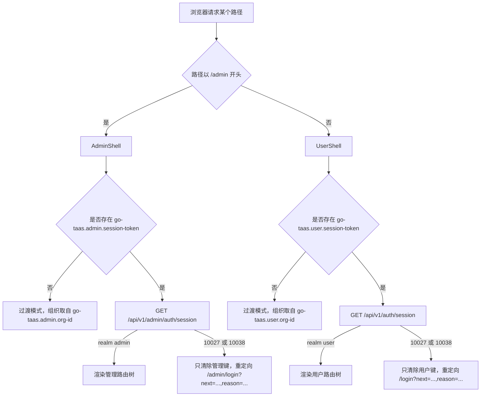
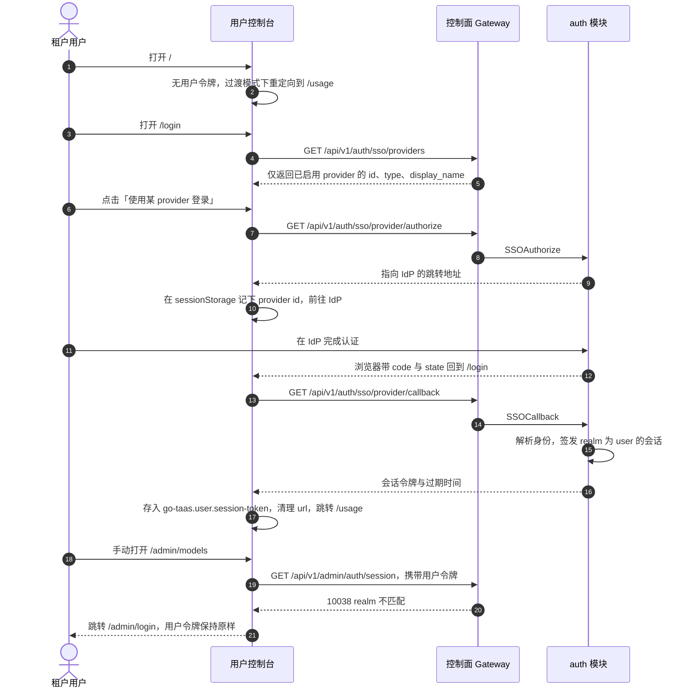

# 控制台面分离（用户控制台与管理控制台）— 需求分析与 UI/UX 设计

| 属性 | 内容 |
| --- | --- |
| 特性点 | 控制台面分离 —— 位于 `/` 的终端用户控制台（API `/api/v1/*`）从位于 `/admin` 的管理控制台（API `/api/v1/admin/*`）中拆分出来，二者会话相互独立（backlog 第 17 行） |
| 文档范围 | 需求分析、竞品调研、`web/src/pages/` 中每一个页面的逐页面归属判定、用户控制台的完整 UI 设计、管理控制台的信息架构变更、路由与重定向迁移方案、页面 → API 面对照表，以及编号可测的验收标准 |
| 归属模块 | `web` 控制台（路由树、外壳、会话存储、全部页面）、`pkg/server` 网关（realm 校验、公开 provider 投影）、`auth`（会话 realm、按 realm 固定的登录路由绑定）、`metering`/`billing`（用户前缀绑定、管理侧可选组织过滤）、`tenancy`（不变） |
| 相关文档 | [架构设计](./architecture.zh-cn.md) — 第 3.1 节控制面 Gateway、「管理员/用户面分离」 · [SSO 联邦登录与账号绑定](./sso-federation.zh-cn.md) — 登录入口、会话签发、`GetSession` · [请求日志与 API Playground](./request-logs-playground.zh-cn.md) — 迁移到用户控制台的两个页面 · [用量仪表盘与按请求成本归因](./usage-dashboard.zh-cn.md) — 两个面都存在的页面 · [余额（预付费）与配额（后付费）账户模式](./balance-quota.zh-cn.md) — 账户与余额快照 · [组织成员、角色与邀请（RBAC）](./org-members-rbac.zh-cn.md) — 控制台渲染的角色 · [按租户的模型授权](./model-authorization.zh-cn.md) — 用户面模型列表所依赖的特性 |
| 状态 | 设计完成，已交付架构师智能体 |

---

## 1. 背景

go-taas 目前只有**一个** Web 控制台。`web/src/App.tsx` 把所有路由都注册在 `/admin/...` 之下（`/admin/models`、`/admin/api-keys`、`/admin/usage`、`/admin/playground` 等），一个侧边栏不分受众地列出全部十六个页面，每个页面都调用 `/api/v1/admin/...` 路由。平台自己的架构文档其实已经写明了目标拆分 —— 控制面网关把管理类 API 放在 `/api/v1/admin/*`、把用户账户类 API 放在 `/api/v1/auth/*`，管理控制台的 Web 页面位于 `/admin` 路径前缀下「与普通用户面清晰分离」—— 但用户面从未真正存在，因此面向租户的能力（自己的 API Key、自己的用量、自己的请求日志、Playground、自己的账单）只能在运维控制台里访问。

这种单控制台形态带来四个具体缺陷，且都能在今天源码里直接看到：

1. **面混合是结构性的。** `ApiKeysPage`、`UsagePage`、`RequestLogsPage`、`PlaygroundPage`、`BillsPage` 是租户自助页面，却住在 `/admin` 之下：一个只想拿个 Key 的租户用户，落在运维的导航树里，而组织、项目、成员、SSO 与镜像仓库管理都只有一次点击之遥。
2. **会话混合。** `web/src/api.ts` 只有一个 token 键（`go-taas.session-token`）和一个 `Authorization: Bearer` 头，任何页面都能拿着别的页面的凭证行动。会话本身完全没有 realm 字段（`services/auth/session_store.go`），因此在管理登录页签发的会话与其它任何会话无从区分。
3. **入口点。** `/` 重定向进 `/admin`（`NavigateToAdmin`）—— 产品的大门就是运维控制台。
4. **API 前缀。** `web/src/App.tsx` 里所有页面（含面向租户的那些）都调用 `/api/v1/admin/...`，因此「谁调用了什么」根本无法按前缀审计。

本特性把控制台清晰拆开：位于 `/...`、调用 `/api/v1/*` 的**用户控制台**，与位于 `/admin/...`、调用 `/api/v1/admin/*` 的**管理控制台**，两者会话独立、互不交叉。这是一个 UI/信息架构与 API 绑定层面的特性：它不新增任何业务能力，只是把能力搬到其受众所在的那一面。

### 1.1 竞品如何分离「用户/工作区面」与「管理/组织面」

| 产品 | 用户/工作区面 | 管理/组织面 | 会话模型 | 主要陷阱 |
| --- | --- | --- | --- | --- |
| **OpenAI Platform** | `platform.openai.com`：Dashboard、API keys、Usage、Billing、Playground —— 单一工作区控制台 | 组织管理（Members、Roles、Projects、Limits、SSO、Audit logs）位于同一控制台内，仅 owner/admin 角色可见，另有组织级 API 前缀（`/v1/organization/...`） | 两面**共用一次登录、一个会话**，由角色而非入口点决定看到哪一面 | 角色过期的成员仍看到自己无法使用的管理入口；无法从请求本身证明它来自哪一面；租户自助与组织管理共处同一导航树 |
| **Anthropic Console** | `console.anthropic.com`：Workbench、Usage、API keys、Billing —— 工作区维度 | 组织管理（Members、SSO、Audit logs、Workspaces），带角色门（owner / admin / developer / billing / user） | 每组织**一个**会话，同样由角色决定面 | 角色命名与租户角色冲突；管理专用的按请求查看器对成员不可见，因此无法在不授予管理权的前提下委派支持工作 |
| **Together AI** | 单一控制台：Playground、Models、Usage、Billing、API keys | 组织设置中的成员、邀请与计费；平台侧模型目录与部署完全不暴露 | 一个会话，按组织隔离 | 运维面只是一个设置标签页，因此运维专属能力没有自己的归宿 |
| **SiliconFlow** | 控制台：Key、用量、余额、Playground | 独立的**管理后台**入口，管理组织、用户、模型与价格，且**有各自的登录** | **两个**入口、两个会话 | 两个控制台在外观与术语上长期漂移，功能被各写一遍且行为不同 |
| **阿里云百炼 / 火山方舟** | 产品控制台：模型、Key、用量 | 通过云账号（RAM）与独立的运维视图进行平台管理 | 两套身份体系 | 用户看不到计费层级；支持工具住在第三个地方 |
| **Stripe / Cloudflare**（对照） | Dashboard（单一受众） | 独立的管理面，**独立来源与独立凭证** | 结构上完全分离 | 隔离最强，运维成本最高（两套构建、两个来源、两套导航） |

### 1.2 归纳出的模式与决策

值得采纳的模式：(1) **每个受众一个独立入口点** —— SiliconFlow 的管理后台与 Stripe 的管理面都表明：把两类受众分开最便宜的手段是入口点，而不是角色判断；(2) **API 按路径前缀分面** —— OpenAI 的 `/v1/organization/...` 前缀证明了「仅凭前缀即可审计一个页面的调用」的价值；(3) **每个受众一套信息架构** —— 面向 API 消费者的是任务导向（Key → 用量 → 日志 → 试一下），面向运维的是运营导向（组织 → 项目 → 成员 → 目录 → 编排 → 钱）；(4) **明确的拒绝路径** —— 跨面导航必须落到另一面的登录页并给出原因，绝不静默渲染一个坏掉的页面。

需要避免的陷阱：两个受众共用一个会话（OpenAI、Anthropic），因为这样一面就没有自己的身份；管理能力只能靠单棵导航树里的角色判断抵达（Together AI）；两个手工维护的控制台行为漂移、术语分裂（SiliconFlow）；以及把面向租户的能力藏在运维专属的 API 前缀之后 —— 这正是 go-taas 当前在 Key、用量、日志、Playground 与账单上的状态。

**go-taas 的决策**：

| # | 决策 | 理由 |
| --- | --- | --- |
| D1 | **单一 SPA 产物，两棵路由树。** 面由路径前缀决定：`/admin/*` 是管理控制台，其余全部是用户控制台 | 两个控制台都是由同一网关公开提供的静态资源（第二份产物不带来任何隔离），而第二套构建会把构建/部署/导航的维护面翻倍。真正需要隔离的是*令牌与 API 前缀*；共用组件库（`Dialog`、`Pagination`、`StateBadge`、`ErrorBanner`、`usePolling`）集中一处 |
| D2 | **两个外壳，不共用导航。** `UserShell`（用户导航）与 `AdminShell`（管理导航）是两个不同组件、两套不同导航数组；任何页面都不得在外壳之外渲染 | 导航树是「面已分离」最直观的表达，而共用的导航数组正是两个面悄悄重新合并的方式 |
| D3 | **按 realm 固定的会话。** 会话携带 `realm` ∈ {user, admin}，realm 由**发起登录调用所在的前缀**决定 —— 没有可伪造的请求字段：`/api/v1/auth/sso/{id}/authorize, callback` 签发 `user`，`/api/v1/admin/auth/sso/{id}/authorize, callback` 签发 `admin` | 让请求参数自选 realm 等于授权绕过；由固定登录路由推导 realm，使 realm 成为入口点的属性，并且可被平凡地审计（用户前缀上的 `GetSession` 只可能返回 `user`） |
| D4 | **每个面独立的浏览器存储**：`go-taas.user.session-token` + `go-taas.user.org-id`，以及 `go-taas.admin.session-token` + `go-taas.admin.org-id`。任何键都不被两个面共读 | 令牌隔离必须是存储键层面的事实，而不是约定 —— 读不到另一面键的页面不可能泄漏它，而一条 `localStorage` 断言即可证明这一点 |
| D5 | **跨 realm 请求被拒绝，使用新错误码 10038 `REALM_MISMATCH`。** 在另一面的前缀上出示的会话失败；**无 realm 的会话**（本特性之前签发）以既有的 10027 `SESSION_INVALID` 失败，强制重新登录一次 | 三个不同的运维问题不能塌缩成一个码：「会话过期」（10027）、「你登录的是另一个控制台」（10038，新增）、「你的角色不允许」（10036）。10038 告诉运维去切换控制台；10036 告诉租户管理员去授予角色 |
| D6 | **两个前缀上保留过渡期的无会话访问**（组织由 `X-Organization-Id` 提供），与今天一致 | 会话是给控制台用户用的，而 CLI、FVT 与既有 Nightwatch 套件都在无会话情况下调用控制面。若在拆路由的同一迭代里移除该路径，会一次性打断十个 e2e 套件。浏览器在登录后总是发送本面令牌，因此已登录状态的跨面访问是关闭的；在管理前缀上*强制要求*会话属于后续加固行 |
| D7 | **租户自助端点新增用户前缀绑定**（grpc-gateway `additional_bindings`），既有管理前缀绑定保持可用但**标记为弃用** | 硬性改名会让所有既有套件、FVT 与 CLI 调用在同一次提交里失效。双绑定立即给出正式前缀并提供迁移窗口；而管理绑定只能被过渡期（无会话）调用方使用，因为管理前缀上的*用户 realm* 会话会被 D5 拒绝 |
| D8 | **每个页面的 API 调用可按前缀审计。** 用户页面不得包含 `/api/v1/admin/` 字符串，管理页面不得包含 `/api/v1/*` 字符串 | 这条检查让分离可以被测试强制，而不是靠评审 |
| D9 | **用户控制台的主页是 `/usage`**，`/` 重定向到那里 | 租户最关心的问题是自己的调用花了多少钱、是否还在流动；该页上的余额/配额挂件同时回答了「我的智能体为什么停了」 |
| D10 | **管理控制台的主页仍是 `/admin/models`**，`/admin` 重定向到那里 | 与拆分前行为一致 —— 运维的第一件事是模型目录 |
| D11 | **三个页面离开管理导航**（API Key、请求日志、Playground —— 它们是租户自助能力），管理控制台不新增任何导航项；用量与账单在两个面都保留，管理侧是组织维度变体 | 一个页面一个面：同时服务两类受众的能力就做成两个页面（面规则）；运维侧的用量/账单是跨组织的，这正是「全部组织的账单与账户」的含义 |
| D12 | **被迁移的页面保留旧管理 URL 作为客户端重定向**（`/admin/api-keys` → `/api-keys`、`/admin/request-logs` → `/request-logs`、`/admin/playground` → `/playground`）。重定向不传递任何令牌 | 书签、运维手册与既有 e2e 套件继续可用；又因为目标页面强制自己的 realm，重定向永远不可能把凭证搬过面 |
| D13 | **API Key 不引入新的角色门。** 写操作不按角色禁用，因为今天根本不存在 Key 级别的角色规则（特性 #10 只对成员与邀请 API 设门） | 一条 API 并不强制的纯前端角色门是虚假安全。本设计规定的权限拒绝状态都是后端真实会产出的：10036（角色）、10105（模型未授权）、10017（组织已禁用）、10005（组织不存在）、10038/10027（realm/会话）。Key 管理的角色门记录为待定问题 |
| D14 | **用户控制台的 Playground 以模型为维度** —— 租户选择*模型*，永远看不到推理服务：`POST /api/v1/models/{model_id}:playground`（新增）。运维侧以服务为维度的 Playground 保留在管理前缀上，但不再有控制台页面 | 推理服务属于运维内部的编排产物（副本数、镜像、卡型）。租户是通过 OpenAI 兼容端点消费模型的，因此租户 Playground 必须建模同一个契约 |
| D15 | **用户前缀绑定不是简单的改前缀** —— 用户面的模型列表是**掩码投影**（不含 `weight_path`，不含镜像或服务标识） | 把一个携带运维字段的响应改个前缀，等于一边宣称面分离、一边泄漏集群内部结构 |
| D16 | **`GET /api/v1/auth/sso/providers` 是新增的匿名用户 realm 投影**，仅返回已启用的 provider（id、type、display name） | 登录页必须调用自己面的前缀（D8），而管理侧的 provider 目录会返回运维字段（issuer、client id、默认组织、JIT 开关），登录页不应收到这些 |
| D17 | **404 视图归属于外壳，而不是某个面**：未匹配的非管理路径在 `UserShell` 内渲染，未匹配的 `/admin/...` 路径在 `AdminShell` 内渲染，各自链接回自己的主页，且两者都不发起 API 调用 | 逃出两个外壳的 404，正是用户控制台渲染出管理侧外壳的原因 |

## 2. 目标与非目标

**目标**：单产物内的两个外壳与两棵路由树（D1、D2）；按 realm 固定、浏览器存储分离、并新增 10038 拒绝的会话（D3–D5）；只调用自己前缀的 `/login` 与 `/admin/login`（D16）；用户控制台的导航、页面清单与默认落地页（D9）；`web/src/pages/` 中每个页面归属恰好一个面，并给出完整路由与 API 前缀（D8、D11、第 6 节）；为租户自助 API 增加用户前缀绑定，并在存在运维字段处做掩码投影（D7、D15）；三个迁移页面及其重定向（D12）；管理侧用量与账单页的组织维度变体（D11）；把跨 realm 或过期会话转化为带 `next` 参数、指向正确登录页的重定向守卫；含权限拒绝在内的逐页面交互状态；可在 compose 栈上以 Nightwatch 验证的编号验收标准，其中包含负面标准。

**非目标**：自有的用户名/密码账号（`Login` 与 `CreateUser` 至今仍是返回 "auth: not implemented" 的桩函数 —— 实现凭证账号是另一个特性）；管理 realm 的平台管理员准入（任何已认证主体都可使用两个入口点，与今天不含角色校验的控制面一致；会话*能做什么*仍由既有组织角色约束）；在管理前缀上强制要求会话（D6 加固，后续行）；退役弃用的管理前缀绑定（D7 窗口）；面向租户的模型目录与价格页（特性 #2/#5 的未来用户面变体）；自助支付、发票与自动充值（#14）；从用户控制台指向管理控制台的面切换器（刻意不提供，见 AC4）；按面复制共用组件库；任何数据面（推理网关）行为的改动。

## 3. 角色与旅程

| 角色 | 所在面 | 旅程 |
| --- | --- | --- |
| **租户开发者**（用智能体消费模型） | 用户 | 在 `/login` 登录 → 在 `/api-keys` 创建 API Key 并复制一次性密钥 → 在 `/playground` 用自己的 Key 试模型 → 在 `/usage` 观察 token 与成本 → 在 `/request-logs` 排查失败调用 |
| **租户计费负责人**（为用量付费） | 用户 | 登录 → `/usage` 显示预付费余额或后付费已用额度与配额 → `/billing` 显示本月账单及其扣费明细 |
| **租户管理员**（加人、授权） | 管理 | 在 `/admin/login` 登录 → `/admin/members` 与 `/admin/invitations` 管理人员 → `/admin/organizations` 与 `/admin/projects` 管理资源 → `/admin/models` 为组织授予模型 |
| **平台运维** | 管理 | 目录与部署（`/admin/models`、`/admin/images`、`/admin/inference-services`）→ 联邦（`/admin/sso`、`/admin/identity-bindings`）→ 钱（`/admin/pricing`、`/admin/billing`、`/admin/billing/accounts`）→ 组织维度用量 `/admin/usage` |
| **智能体 / SDK** | 两者皆非 | 用 API Key 调用推理端点，不触碰任何控制面页面。它产生两个控制台都展示的用量、日志与成本 |
| **支持工程师** | 用户 | 通过请租户自读 `/request-logs` 与 `/usage` 来复现租户视角 —— 这正是这两个页面属于租户面的原因 |

> 术语：消费侧调用方英文称 **Agent**、中文称「**智能体**」，与仓库约定一致。

## 4. 现状审计（由源码推导）

今天 `web/src/App.tsx` 中的路由：`/` → 重定向 `/admin`、`/admin/login`、`/admin` → 重定向 `/admin/models`，以及 `organizations`、`projects`、`members`、`invitations`、`sso`、`identity-bindings`、`api-keys`、`models`、`models/:id`、`images`、`images/:id`、`inference-services`、`inference-services/:id`、`usage`、`request-logs`、`playground`、`pricing`、`billing`、`billing/accounts`，以及 `*` → `NotFoundPage`。它们全部被同一个 `Layout` 包住，而 `NAV_ITEMS` 列出全部十六个目的地，`Sidebar` 用单一 token 键调用 `/api/v1/auth/logout` 退出登录。

逐页面的 API 使用（扫描 `web/src/**` 中的 `/api/v1` 得到）：

| 页面 | 今天调用的路由 | 应归属 |
| --- | --- | --- |
| `ApiKeysPage` | `/api/v1/admin/auth/api-keys`（含 `/{id}`、`/{id}:revoke`） | 租户 |
| `UsagePage` | `/api/v1/admin/metering/usage-summary`、`usage-dashboard`、`vouchers` | 租户（以及运维的组织维度） |
| `RequestLogsPage` | `/api/v1/admin/metering/request-logs` | 租户 |
| `PlaygroundPage` | `/api/v1/admin/inference-services?page.limit=100`、`/api/v1/admin/auth/api-keys?page.limit=100`、`/api/v1/admin/inference-services/{id}:playground` | 租户 |
| `BillsPage` | `/api/v1/admin/billing/bills`、`charges` | 租户（以及运维） |
| `BalanceWidget`（组件） | `/api/v1/admin/billing/balance` | 租户 |
| `LoginPage` | provider 列表用 `/api/v1/admin/auth/sso/providers`，流程用 `/api/v1/auth/sso/{id}/authorize, callback` | 两个 realm |
| `LoginPage`（LDAP） | 用户名与密码使用 `window.prompt` | 两个 realm |
| 其它全部页面 | 仅 `/api/v1/admin/...` | 运维 |

除第 1 节的四个缺陷外，本特性还要关闭的缺陷：登录页在用户尚未认证前就读取**运维** provider 目录（issuer、client id、默认组织）；LDAP 流程使用 `window.prompt`，既不可样式化、不可校验，也难以稳定自动化；组织切换器在无会话时回落到运维 tenancy API（`/api/v1/admin/tenancy/organizations`）；以及全仓没有任何 `next` 参数处理，会话过期后用户被丢到登录页且无法回到原处。

## 5. 功能需求

### FR1 — 路由与外壳

- **FR1.1** 路由表包含两棵互不重叠的树：用户路由位于 `/`、`/login`、`/usage`、`/api-keys`、`/request-logs`、`/playground`、`/billing`；管理路由位于 `/admin` 与 `/admin/*`，与第 6 节完全一致。`/` 重定向到 `/usage`（D9），`/admin` 重定向到 `/admin/models`（D10）。
- **FR1.2** 用户路由在 `UserShell` 内渲染，管理路由在 `AdminShell` 内渲染（D2）。外壳各自持有导航数组、组织选择器与退出控件；页面不得在外壳之外渲染。
- **FR1.3** `UserShell` 导航恰好包含：用量（`/usage`）、API Key（`/api-keys`）、请求日志（`/request-logs`）、API Playground（`/playground`）、账单（`/billing`）—— 五项，且不含任何 `/admin` 链接（D2、AC4）。
- **FR1.4** `AdminShell` 导航恰好包含：组织、项目、成员、邀请、SSO Providers、身份绑定、模型、推理服务、镜像、用量、账单、账户 —— 十三项。API Key、请求日志、Playground 被**移除**（D11）。

### FR2 — 会话、realm 与隔离

- **FR2.1** `Session` 新增 `realm` 字段（`user` | `admin`），在签发时由登录路由的前缀决定（D3）。`GetSessionResponse` 新增 `realm`。
- **FR2.2** 按 realm 固定的会话路由：`GET /api/v1/auth/session`、`POST /api/v1/auth/session/org`、`POST /api/v1/auth/logout` 要求 `realm = user`；`GET /api/v1/admin/auth/session`、`POST /api/v1/admin/auth/session/org`、`POST /api/v1/admin/auth/logout`（均为新增）要求 `realm = admin`。
- **FR2.3** 浏览器把每个 realm 的令牌存到各自的键（D4）：`go-taas.user.session-token`、`go-taas.admin.session-token`。每个面也各自保存组织上下文（`go-taas.user.org-id`、`go-taas.admin.org-id`）。
- **FR2.4** 在另一面前缀上出示的会话以新增的 **10038 `REALM_MISMATCH`** 失败；不带 realm 的会话以 **10027 `SESSION_INVALID`** 失败（D5）。
- **FR2.5** 带 `X-Organization-Id` 的无会话（过渡期）访问在两个前缀上继续可用（D6）；两个控制台的启动流程都会删除旧的单 realm 键 `go-taas.session-token` 与 `go-taas.org-id`，使任何页面都无法回落到它们。

### FR3 — 登录页

- **FR3.1** `/login`（用户 realm）从新增的匿名 `GET /api/v1/auth/sso/providers` 列出已启用 provider（仅有 id、type、display name —— D16），并通过 `GET /api/v1/auth/sso/{provider_id}/authorize` + `GET /api/v1/auth/sso/{provider_id}/callback` 登录。`/admin/login`（管理 realm）从既有的 `GET /api/v1/admin/auth/sso/providers` 列出 provider，并通过新增的管理前缀 `authorize`/`callback` 绑定登录。两个页面都不调用另一面的路由（D8）。
- **FR3.2** LDAP provider 在页面内打开**内联用户名/密码表单**（不再使用 `window.prompt`）：两个字段均必填，两者非空前提交控件禁用，凭证以 `username`/`password` 提交到本 realm 的 `callback` 绑定（与特性 #7 的 LDAP bind 契约一致）。
- **FR3.3** 跳转 IdP 之前，待处理的 provider id 记入 `sessionStorage`（`go-taas.user.sso-provider` / `go-taas.admin.sso-provider`），返回时读取；会话写入后删除该待处理项。
- **FR3.4** 成功后令牌写入本 realm 的键，URL 查询串以 `history.replaceState` 清理，浏览器落到本面主页（`/usage`、`/admin/models`）或守卫记录的 `next` 路径（FR4.3）。
- **FR3.5** 持有本 realm 有效会话时访问登录页，直接跳转本面主页，不渲染表单。

### FR4 — 守卫、重定向与拒绝行为

- **FR4.1** 各外壳**仅在自己面的令牌键非空时**才在启动时校验会话：用户外壳调用 `GET /api/v1/auth/session`，管理外壳调用 `GET /api/v1/admin/auth/session`。
- **FR4.2** 当外壳的键中没有令牌时，外壳以**过渡模式**渲染并显示可关闭的提示（`user-console-transitional-banner` / `admin-console-transitional-banner`），使用本 realm 的组织键（默认 `org-default`）—— 从而保留全部既有套件所依赖的浏览器行为（D6、AC15）。
- **FR4.3** 当令牌存在但会话调用以 10038 或 10027 失败时，外壳**只清除自己**的令牌键与待处理路径，并重定向到自己的登录页，带上 `?next=<path>&reason=realm, expired`；登录页显示对应提示（「你登录的是另一个控制台。」/「登录状态已过期，请重新登录。」）。另一面的令牌永不被读取、清除或回显。
- **FR4.4** 仅持有用户 realm 会话时访问管理路由会落到 `/admin/login`（FR4.3）；仅持有管理 realm 会话时访问用户路由会落到 `/login`。
- **FR4.5** 被迁移的管理 URL 在任何 API 调用之前即客户端重定向到用户 URL（D12），且不携带令牌。

### FR5 — 面合规的 API 使用

- **FR5.1** 任何实现用户页面或用户外壳的文件都不包含字符串 `/api/v1/admin/`；任何实现管理页面或管理外壳的文件都不包含 `/api/v1/` 之外的（即非 `/api/v1/admin/` 的）字符串（D8）。
- **FR5.2** 租户自助 RPC 新增用户前缀绑定，并保留弃用的管理前缀绑定（D7）：API Key、计量用量/日志/凭证、计费余额/账单/扣费。新增用户 realm 读接口：provider 投影（D16）、掩码模型列表（D15）、以模型为维度的 Playground（D14）。
- **FR5.3** 用户页面从会话的活动组织取组织；用户 realm 会话下任何 `X-Organization-Id` 头都被忽略（特性 #7 D6 规则），因此浏览器无法把用户页面指向另一个组织。
- **FR5.4** 管理侧的用量与账单获得组织维度：带「全组织」选项的组织过滤器（默认使用工作组织），以及看板上的 `organization` group-by 取值；用户 realm 绑定不做任何拒绝，只是忽略组织参数，保持会话范围（FR5.3）。

### FR6 — 交互状态、文案与测试钩子

- **FR6.1** 每个用户页面实现第 12 节列出的六种交互状态（默认、加载、空、错误、禁用、权限拒绝），并按第 8 节给出的逐页面文案渲染。
- **FR6.2** 每个页面、控件、表格与对话框都带有控制台既有的 `kebab-case` 风格 `data-testid`（`create-api-key`、`api-keys-table`、`request-log-filters`、`playground-send` 等），新增的外壳/守卫/提示元素使用本文档给出的 id。
- **FR6.3** 错误文案把业务码映射为句子（绝不裸显示数字码）：第 13 节的映射表对两个控制台都是强制的。

## 6. 面归属 —— `web/src/pages/` 中的每一个页面

由源码枚举（`web/src/pages/`，共二十一个文件，含 `NotFoundPage.tsx`）。一个页面一个面；同时服务两类受众的能力拆成两个页面（面规则）。

| # | 页面（源文件） | 面 | 目标路由 | 目标 API 前缀 | 理由 |
| --- | --- | --- | --- | --- | --- |
| 1 | `AccountsPage` | **管理** | `/admin/billing/accounts` | `/api/v1/admin/billing/*` | 计费账户（预付费/配额模式、消费上限、充值、退款、交易流水）是面向全部租户的资金操作。自助支付属于特性 #14，因此充值是运维动作 |
| 2 | `ApiKeysPage` | **用户** | `/api-keys` | `/api/v1/auth/api-keys*` | Key 是租户自己给智能体用的凭证。运维不代租户签发密钥。运维依然可在 `/admin/organizations` 看到按组织的 Key **数量** |
| 3 | `BillsPage` | **两者**（两个页面） | 用户 `/billing`，管理 `/admin/billing` | 用户 `/api/v1/billing/*`，管理 `/api/v1/admin/billing/*` | 租户读自己的月账单与扣费明细。运维跨组织读账单（组织列 + 过滤器，FR5.4） |
| 4 | `IdentityBindingsPage` | **管理** | `/admin/identity-bindings` | `/api/v1/admin/auth/identity-bindings*` | 预先把外部身份绑定到平台账号属于联邦管理 |
| 5 | `ImageDetailPage` | **管理** | `/admin/images/:id` | `/api/v1/admin/images/*` | 仓库 digest、占用中的服务与节点级预拉取结果都是集群运维 |
| 6 | `ImagesPage` | **管理** | `/admin/images` | `/api/v1/admin/images*` | 推理镜像仓库与预拉取映射 —— 哪个二进制跑在哪个节点由运维决定 |
| 7 | `InferenceServicesPage` | **管理** | `/admin/inference-services` | `/api/v1/admin/inference-services*` | 副本数、状态与扩缩容属于编排。租户消费的是模型，永远不是服务（D14） |
| 8 | `InvitationsPage` | **管理** | `/admin/invitations` | `/api/v1/admin/tenancy/...invitations*` | 邀请人加入组织属于成员管理 |
| 9 | `LoginPage` | **两者**（两个页面） | 用户 `/login`，管理 `/admin/login` | 用户 `/api/v1/auth/*`，管理 `/api/v1/admin/auth/*` | realm **就是**入口点（D3）。各页只在自己前缀上列 provider 并完成流程（D8、D16） |
| 10 | `MembersPage` | **管理** | `/admin/members` | `/api/v1/admin/tenancy/organizations/{org_id}/members*` | 组织内角色分配属于管理，且这是后端今天唯一强制角色门（10036）的地方 |
| 11 | `ModelDetailPage` | **管理** | `/admin/models/:id` | `/api/v1/admin/models/{model_id}` | 版本与权重路径管理、按租户授权（特性 #13）都属于目录管理 |
| 12 | `ModelsPage` | **管理** | `/admin/models` | `/api/v1/admin/models*` | 目录、权重路径与一键部署都是运维能力。用户控制台不设目录页；它只在 Playground 的选择器里消费**掩码**模型列表（`GET /api/v1/models`，D15） |
| 13 | `OrganizationsPage` | **管理** | `/admin/organizations` | `/api/v1/admin/tenancy/organizations*` | 创建与禁用租户是平台运维的职责 |
| 14 | `PlaygroundPage` | **用户** | `/playground` | `/api/v1/models`、`/api/v1/auth/api-keys`、`/api/v1/models/{model_id}:playground` | 集成之前用自己的 Key 试模型是租户的工作流。租户选择模型，永远不选择服务（D14） |
| 15 | `PricingPage` | **管理** | `/admin/pricing` | `/api/v1/admin/billing/prices` | 价格矩阵、阶梯与生效日期属于商务策略 |
| 16 | `ProjectsPage` | **管理** | `/admin/projects` | `/api/v1/admin/tenancy/projects*` | 项目是运维在组织内的隔离单元 |
| 17 | `RequestLogsPage` | **用户** | `/request-logs` | `/api/v1/metering/request-logs` | 租户用自己的 Key 排查自己的失败或慢调用。面向运维的请求日志视图刻意不在本特性范围内（见待定问题） |
| 18 | `SSOProvidersPage` | **管理** | `/admin/sso` | `/api/v1/admin/auth/sso/providers*` | IdP 配置携带密钥、issuer 与默认组织策略 —— 纯运维字段 |
| 19 | `ServiceDetailPage` | **管理** | `/admin/inference-services/:id` | `/api/v1/admin/inference-services/{service_id}` | 服务内部（镜像、副本、端点）属于编排 |
| 20 | `UsagePage` | **两者**（两个页面） | 用户 `/usage`，管理 `/admin/usage` | 用户 `/api/v1/metering/*` + `/api/v1/billing/balance`，管理 `/api/v1/admin/metering/*` + `/api/v1/admin/billing/balance` | 租户关注自己的花费与余额/配额；运维关注跨组织的用量（组织过滤器与 `organization` group-by，FR5.4） |
| 21 | `NotFoundPage` | **外壳级**（自身无面） | 任意未匹配路径 | **无**（不发起任何 API 调用） | 唯一没有面的页面：它在拥有该前缀的外壳内渲染（D17），因此用户永远看不到管理侧外壳。它是「一个页面一个面」的唯一、已记录的例外 |

**运维关注点 → 管理控制台**：组织、项目、成员、邀请、SSO Providers、身份绑定、定价、镜像仓库、模型目录、推理服务编排、全部组织的账单与计费账户。

**租户自助关注点 → 用户控制台**：自己的 API Key、自己的用量、自己的请求日志、Playground、自己的账单、自己的余额/配额快照。

## 7. 用户控制台信息架构

**导航**（五项，按此顺序 —— 顺序遵循租户自己的任务流，而非运维的）：用量 · API Key · 请求日志 · API Playground · 账单（英文：Usage · API Keys · Request Logs · Playground · Billing）。

**默认落地页**：`/usage`。登录后落在这里，`/` 也重定向到这里（D9）。理由：该页回答了让租户反复回来的两个问题（「流量还在跑吗」「花了多少钱」），并且它带有余额/配额挂件，能解释组织被拦截的原因。

**页面清单**：

| 路由 | 页面 | 用途 | API 前缀 |
| --- | --- | --- | --- |
| `/usage` | 自己的用量与成本 | 活动组织的 token、请求与成本、余额/配额快照、凭证下钻、CSV 导出 | `/api/v1/metering/*`、`/api/v1/billing/balance` |
| `/api-keys` | API Key | 创建、改名、限流与吊销组织 Key，一次性显示密钥，展示推理端点 | `/api/v1/auth/api-keys*` |
| `/request-logs` | 请求日志 | 组织自身调用的按请求元数据，可过滤、可下钻 | `/api/v1/metering/request-logs` |
| `/playground` | API Playground | 用组织的一个 Key 向模型发一次测试推理，与其它调用一样计量并记日志 | `/api/v1/models`、`/api/v1/auth/api-keys`、`/api/v1/models/{model_id}:playground` |
| `/billing` | 账单 | 组织的月账单与扣费明细下钻（只读） | `/api/v1/billing/bills`、`/api/v1/billing/charges` |
| `/login` | 登录 | 通过已配置的身份提供方进行按 realm 固定的登录 | `/api/v1/auth/*` |

**登录流程**：`/login` 是用户 realm（会话 realm 为 `user`），`/admin/login` 是管理 realm（会话 realm 为 `admin`）；两者使用同一批 provider，但写入不同会话与不同存储键（FR2.3、FR3）。两者都不读取对方的 provider 目录（D16）。

**会话存储与隔离**：

| 键 | 写入方 | 读取方 | 内容 |
| --- | --- | --- | --- |
| `go-taas.user.session-token` | `/login`（回调后） | 用户外壳、用户页面 | 用户 realm 会话 id，以 `Authorization: Bearer` 发送到 `/api/v1/*` |
| `go-taas.user.org-id` | 用户外壳的组织选择器 | 用户外壳、用户页面 | 过渡模式下的活动组织 |
| `go-taas.admin.session-token` | `/admin/login`（回调后） | 管理外壳、管理页面 | 管理 realm 会话 id，以 `Authorization: Bearer` 发送到 `/api/v1/admin/*` |
| `go-taas.admin.org-id` | 管理外壳的组织选择器 | 管理外壳、管理页面 | 组织范围管理页面的工作组织上下文 |
| `go-taas.user.sso-provider` / `go-taas.admin.sso-provider`（sessionStorage） | 登录页 | 登录页 | 等待 IdP 跳转的 provider id |
| `go-taas.session-token`、`go-taas.org-id`（旧键） | 无人 | 无人 | 两个外壳启动时**删除**（FR2.5） |

没有任何键被两个面共读（D4）—— 这既是测试可断言的属性，也是重定向（D12）永远无法把凭证带过面的原因。

## 8. 用户控制台完整 UI 设计

### 8.0 `UserShell`（全部用户路由）

- **路由**：所有不以 `/admin` 开头的路径。
- **布局区域**：(1) 左侧边栏 —— 品牌块 "go-taas"；导航（第 7 节的五项，各自 `data-testid="user-nav-{slug}"`，slug 为 `usage`、`api-keys`、`request-logs`、`playground`、`billing`）；底部组织选择器（`org-switcher-select`，选项来自会话的可访问组织，切换时调用 `/api/v1/auth/session/org`）；账号块显示已登录用户名与活动组织角色徽标（`user-account-block`）；退出控件（`user-menu-logout`）。(2) 主区域 —— 页面头部（`h1` + 副标题，沿用既有 `page-header` 模式）与页面内容。
- **主操作**：导航；切换组织。**次操作**：退出登录。
- **状态**：*默认* —— 侧边栏高亮当前项（精确匹配或路径前缀匹配，沿用既有 `isActive` 规则）；*加载* —— 会话调用进行中，各页面渲染自己的加载态，账号块显示骨架；*空* —— 不适用；*错误* —— 会话失败走重定向（FR4.3）而不是横幅，组织切换失败时显示 `org-switcher-notice` 并保留原组织；*禁用* —— 切换进行中组织选择器禁用；*权限拒绝* —— 过渡提示（`user-console-transitional-banner`：「你尚未登录。本控制台处于过渡模式，使用本浏览器中保存的组织 id。请登录。」）并附 `/login` 链接，以及带 FR4.3 文案的 realm 提示（`signin-notice`）。
- **刻意不存在**：任何指向 `/admin` 的链接、面包屑或菜单项（D2、AC4）。运维自己知道地址；用户控制台从不宣传运维面。

### 8.1 `/login` —— 用户 realm 登录

- **用途**：认证进入用户控制台并开启用户 realm 会话。
- **路由**：`/login`。**API**：`GET /api/v1/auth/sso/providers`（新增投影）、`GET /api/v1/auth/sso/{provider_id}/authorize`、`GET /api/v1/auth/sso/{provider_id}/callback`，以及用于「已登录」判断的 `GET /api/v1/auth/session`。
- **布局区域**：居中卡片 —— 品牌；`h1`「登录」；副标题「访问你的 API Key、用量、请求日志与账单。」；提示槽（`signin-notice`）；provider 按钮区（`sso-login-list`，每个已启用 provider 一个 `sso-login-{provider_id}` 按钮，文案「使用 {display_name} 登录」）；LDAP 内联表单槽；底部说明「登录会话将在 24 小时后过期。」（即配置的 `sessionTTL`）。
- **主操作**：「使用 {provider} 登录」（`sso-login-{provider_id}`）；LDAP 情况下为表单的「登录」（`ldap-submit`）。**次操作**：无（本特性不含自助注册）。
- **交互状态**：

| 状态 | 触发 | 渲染 |
| --- | --- | --- |
| 默认 | provider 已加载、未登录 | 渲染 provider 按钮；聚焦第一个已启用 provider |
| 加载 | provider 列表请求中 | 卡片内显示 `Loading…`（`login-loading`） |
| 空 | 无已启用 provider | `login-no-providers`：「没有已启用的登录提供方。请联系平台运维配置。」 |
| 错误 | provider 列表失败 | `ErrorBanner`（`login-error`），文案取自第 13 节映射，并提供「重试」控件 |
| 禁用 | 登录进行中，或 LDAP 字段不完整 | 按钮显示「登录中…」并禁用（`login-signing-in`）；LDAP 提交在两字段非空前保持禁用 |
| 权限拒绝 | 登录页本身不适用，但 realm 相关状态是显式的：此处永不读取已保存的**管理**令牌（D4）；回调未返回会话时显示「登录未完成，请重试。」 | — |

- **表单字段（LDAP 内联表单，FR3.2）**：

| 字段 | 控件 | 校验 | 错误文案 |
| --- | --- | --- | --- |
| `ldap-username` | 文本，`autocomplete="username"` | 必填，1–128 字符，去除首尾空白 | 「请输入用户名。」/「用户名不得超过 128 个字符。」 |
| `ldap-password` | 密码，`autocomplete="current-password"` | 必填，1–256 字符 | 「请输入密码。」 |

- **按错误码的文案**：10002/10012 → 「用户名或密码不正确。」；10022 → 「该身份提供方已禁用，请联系平台运维。」；10023 → 「登录响应被拒绝（state 无效），请重新开始。」；10024 → 「身份提供方拒绝了本次登录。」；10025 → 「该身份尚未绑定到 go-taas 账号，请向组织管理员索取邀请。」；10027 → 「登录未完成，请重试。」；10038 → 「你登录的是另一个控制台，请在这里重新登录。」
- **回跳处理**（FR3.3–FR3.4）：挂载时若带 `?code=` 且存在记下的 provider id，页面调用本 realm 的 `callback`，把令牌写入 `go-taas.user.session-token`，清除待处理 provider 项，用 `history.replaceState` 清掉查询串，然后跳转到 `next`（校验为非 `/admin` 路径）或 `/usage`。
- **已登录**：存在有效用户会话时不渲染表单，直接跳转 `/usage`（FR3.5）。

### 8.2 `/usage` —— 自己的用量与成本

- **用途**：组织消耗了什么、花了多少钱，并给出解释调用方被拦截的资金上下文。
- **路由**：`/usage`。**API**：`GET /api/v1/metering/usage-summary`、`GET /api/v1/metering/usage-dashboard`、`GET /api/v1/metering/vouchers`、`GET /api/v1/billing/balance`。
- **布局区域**：头部（`h1`「用量」，副标题「**{组织}** 的 token、请求与成本，新的在前。」）；余额/配额挂件行（`usage-balance-widget`）；汇总卡片行（`usage-dashboard-cards`：成本、输入/输出 token、请求数、平均每请求成本，`unpriced_request_count > 0` 时显示 `usage-unpriced-badge`）；带指标切换（`usage-metric-toggle`）与 group-by 选择（`usage-groupby-select`）的每日图表；控件行（范围预设 24 小时 / 7 天 / 30 天 / 自定义，`usage-export-csv`）；用量表（`usage-table`）；下钻对话框。
- **主操作**：切换范围、按模型或 Key 分组、点击图表某天筛选表格、下钻凭证、导出 CSV、经挂件跳转到 `/billing`。**次操作**：刷新（页面可见时每 60 秒轮询）。
- **group-by 选项（用户面）**：`api_key`（默认）与 `model`。不提供运维侧的 `accelerator_type` 维度（租户不选 GPU 卡型）—— 管理侧同名页面提供全部三项并额外提供 `organization`（FR5.4）。
- **表格列**：API Key · 输入 tokens · 输出 tokens · 缓存 tokens · 请求数 · 成本 · 结算状态（特性 #9 的列加上成本列）· 操作（「按模型」「凭证」）。分页每页 20 行，服务端分页（`page.offset`/`page.limit`）。排序：沿用服务端固定顺序（group key 升序）—— 页面明确说明不支持排序，而不是假装支持。
- **对话框**：*按模型* —— 同一范围与 Key，按模型分组并给出成本；*凭证* —— 按请求行：请求 · 模型 · 输入/输出/缓存 tokens · 预估成本 · 结算状态，沿用特性 #9 的「预估成本」标签与阶梯 tooltip。
- **交互状态**：

| 状态 | 渲染 |
| --- | --- |
| 默认 | 默认 24 小时范围内渲染卡片、图表、表格与挂件 |
| 加载 | 面板内 `Loading…`；指标切换与导出禁用 |
| 空 | `usage-empty`：「该范围内暂无用量。首次推理调用后一小时内出现。」 |
| 错误 | `ErrorBanner` 显示映射文案，并提供同时重取看板与挂件的「重试」控件 |
| 禁用 | 无数据行时导出禁用；加载中指标切换禁用；余额请求进行中挂件的操作链接禁用 |
| 权限拒绝 | 10005 → 「当前活动组织已不存在，请在侧边栏选择其它组织。」；10017 → 「该组织已被禁用，请联系平台运维。」；10503 → 挂件显示灰显的「无计费账户」空状态，绝不显示错误横幅；10027/10038 → 按 FR4.3 重定向 |

- **与管理侧变体的差异**：见第 9 节 —— 用户页是会话范围的（组织来自会话，FR5.3），只提供两个 group-by 维度，挂件链接到 `/billing` 而非运维的 `/admin/billing/accounts`。

### 8.3 `/api-keys` —— 自己的 API Key

- **用途**：签发并治理组织智能体使用的凭证。
- **路由**：`/api-keys`。**API**：`GET /api/v1/auth/api-keys?page.offset=&page.limit=`、`POST /api/v1/auth/api-keys`、`PUT /api/v1/auth/api-keys/{key_id}`、`POST /api/v1/auth/api-keys/{key_id}:revoke`。
- **布局区域**：头部（`h1`「API Key」、副标题，以及一行 **Endpoint**：基础 URL `{origin}/v1/chat/completions` 与复制控件 `api-keys-endpoint-copy` —— 这是租户创建 Key 之后的下一个动作）；工具栏（「创建 API Key」，`create-api-key`）；Key 表格（`api-keys-table`）；分页；对话框。
- **主操作**：创建 API Key。**次操作**：编辑（改名、有效期、限流）、吊销、复制端点。
- **表格列**：名称 · Key（`prefix…` 等宽字体，永不显示密钥）· 状态（`StateBadge`：active / revoked / expired）· 限流（`{rpm}/分钟 · {tpm}/分钟`，两者为 0 时显示「不限」—— 特性 #11）· 创建时间 · 过期时间（未设置时显示「永不过期」）· 操作（编辑、吊销）。每页 20 行分页；状态过滤器映射到 API 的服务端 `active_only`（`api-keys-filter-status`：全部 / 仅有效）；名称搜索只过滤**已加载页**，并在占位符中写明（「过滤当前页」）。
- **对话框**：
  - *创建 API Key*（`create-dialog`）：字段 名称（`key-name-input`，必填，1–64 字符，同组织内唯一 → 重复文案「同名 Key 已存在。」）、有效期（`key-expiry-select`：永不过期 / 30 天 / 90 天 / 365 天）、限流 RPM（`rate-limit-rpm`，可选非负整数，「0 = 不限」）、限流 TPM（`rate-limit-tpm`，同上）。请求进行中或名称为空时提交禁用。
  - *密钥展示*（`created-dialog`）：仅此一次展示明文密钥（`created-secret`）、复制控件（`created-copy`），以及确认门 —— 勾选「我已保存该 Key」（`created-confirm`）前关闭按钮保持禁用；对话框提示「该 Key 仅显示一次。」
  - *编辑*（`edit-dialog`）：名称与限流（创建后不可修改有效期），校验同创建。
  - *吊销*（`revoke-dialog`）：确认中列出 Key 名称并警告「使用该 Key 的智能体会立即开始以 10009 失败。此操作不可撤销。」
- **交互状态**：*默认* —— 首页表格；*加载* —— `Loading…`；*空* —— `api-keys-empty`：「暂无 API Key。创建一个，让你的智能体调用 API。」；*错误* —— 横幅显示映射文案与重试；*禁用* —— 已吊销行隐藏吊销按钮，提交中创建禁用，密钥复制在确认前禁用；*权限拒绝* —— 10036 → 「你在该组织中的角色不允许此操作。」（防御性：目前尚无 Key 级角色门，D13）；10007 → 「该 Key 已不存在，请刷新列表。」；10038/10027 → 按 FR4.3 重定向。

### 8.4 `/request-logs` —— 自己的请求日志

- **用途**：回答「我这次调用为什么失败或耗时 4 秒」，范围是组织自身的流量。
- **路由**：`/request-logs`。**API**：`GET /api/v1/metering/request-logs`，以及用于填充过滤选择器的 `GET /api/v1/auth/api-keys?page.limit=100` 与 `GET /api/v1/models`。
- **布局区域**：头部（`h1`「请求日志」，副标题「本组织的按请求元数据。日志保留 30 天，调用后数分钟内出现。」）；过滤工具栏（`request-log-filters`：范围预设 `request-log-range-24h, 7d, 30d`、状态选择 `request-log-filter-status`、API Key 选择 `request-log-filter-key`、模型选择 `request-log-filter-model`、「清除过滤」`request-log-clear-filters`）；日志表（`request-logs-table`）；分页；详情对话框。
- **主操作**：过滤并下钻单条请求。**次操作**：清除过滤、切换范围。
- **表格列**：时间 · 请求（`request_id`）· Key · 模型 · Tokens（输入 / 输出）· 延迟（毫秒）· 状态（`StateBadge`：success / error / streaming）· 操作（详情）。每页 20 行；过滤在服务端进行（状态、Key、模型、范围）—— Key 与模型选择器的存在正是因为今天的自由文本 id 输入不可用。
- **详情对话框**（`request-log-detail-{request_log_id}`）：请求 ID · 状态 · 模型 · API Key · 延迟 · Tokens（输入/输出/缓存/推理）· 创建时间 · 错误（存在时）。本面**不**展示运维内部的 `service_id`（D15 的掩码原则：租户看到它调用的模型，而不是平台的路由细节）。
- **交互状态**：*默认* —— 最近 24 小时；*加载* —— `Loading…`；*空* —— `request-logs-empty`：「该范围内暂无请求日志。首次推理调用后出现。」；*错误* —— 横幅显示映射文案与重试；*禁用* —— 加载中分页禁用、模型/Key 选择器在选项加载时禁用；*权限拒绝* —— 10404 → 「所选范围无效（最长 92 天）。」；10005/10017 → 见 8.2 的组织文案；10027/10038 → 按 FR4.3 重定向。

### 8.5 `/playground` —— API Playground（以模型为维度）

- **用途**：在写集成代码之前，用组织自己的 Key 证明某个模型可用。
- **路由**：`/playground`。**API**：`GET /api/v1/models`（掩码目录，D15）、`GET /api/v1/auth/api-keys?page.limit=100&active_only=true`、`POST /api/v1/models/{model_id}:playground`。
- **布局区域**：头部（`h1`「API Playground」，副标题「用你的一个 Key 发一次测试推理。该调用与其它请求一样被计量并记录。」）；表单行 —— 模型选择（`playground-model-select`，选项为「名称（最新版本）」）、API Key 选择（`playground-key-select`，仅有效 Key）、提示词文本域（`playground-prompt-input`，1–8000 字符并带计数器）、发送按钮（`playground-send`）；参数行 —— 温度（`playground-temperature`，0–2，步长 0.1，默认 0.7）与最大 tokens（`playground-max-tokens`，1–4096，默认 512）（仅在后端接受时发送，否则省略该行，由 RPC 契约决定，见第 11 节）；响应面板（`playground-response`）显示补全文本、prompt/completion token 数与总延迟，并有「复制为 curl」（`playground-copy-curl`）生成带 `Authorization: Bearer sk-…` 占位符的片段。
- **主操作**：发送（`playground-send`，仅在已选模型、已选 Key 且提示词非空时可用）。**次操作**：复制 curl 片段。
- **交互状态**：

| 状态 | 渲染 |
| --- | --- |
| 默认 | 选择器已填充、提示词为空，发送禁用并提示「先选择模型与 Key，再输入提示词。」 |
| 加载 | 目录与 Key 列表解析期间选择器禁用并显示「加载中…」 |
| 空 | 无模型：`playground-no-models`「你的组织暂无可用模型，请联系平台运维。」；无有效 Key：`playground-no-keys`「你还没有有效的 API Key，请先创建一个。」并附 `/api-keys` 链接 |
| 错误 | `ErrorBanner` 显示映射文案；保留上一次响应面板，便于对比 |
| 禁用 | 发送中（「发送中…」）、发送中禁用温度与最大 tokens、无响应时禁用复制 curl |
| 权限拒绝 | 10105 → 「本组织未被授权使用该模型。」；10301/10303 → 「该模型当前没有就绪的推理服务，请换一个模型或稍后重试。」；10037 → 「该 Key 触发限流，请稍候。」；10027/10038 → 按 FR4.3 重定向 |

- **说明**：租户永远不选择推理服务（D14）。选择模型、由平台路由，正是 OpenAI 兼容端点提供的契约，因此 Playground 不会教给用户错误的心智模型。

### 8.6 `/billing` —— 自己的账单

- **用途**：展示组织的月账单及扣费级证据，只读。
- **路由**：`/billing`。**API**：`GET /api/v1/billing/bills`、`GET /api/v1/billing/charges`。
- **布局区域**：头部（`h1`「账单」，副标题「**{组织}** 的月账单，由扣费记录计算。在自助支付上线前，充值由平台运维处理。」）；账单表（`bills-table`）；分页；扣费对话框。
- **主操作**：打开某张账单的扣费明细。**次操作**：无（本面只读 —— 无充值、无账户编辑、无消费上限控制）。
- **表格列**：账单 · 月份（`YYYY-MM`）· 金额（`{amount} {currency}`）· 扣费数 · 未定价（大于 0 时显示 `StateBadge`）· 操作（扣费）。每页 20 行分页；除分页外无过滤器（租户只有一个组织与一条账单序列）—— 组织列与过滤器属于管理侧变体。
- **扣费对话框**（`bill-charges-{bill_id}`）：行为 小时 · API Key · 模型 · 加速卡 · 输入 / 输出 tokens · 请求数 · 金额 · 阶梯 · 扣费时间。加速卡列保留可见：价格依赖卡型（特性 #5），而租户无法解释的账单会变成工单。
- **交互状态**：*默认* —— 当前页账单；*加载* —— `Loading…`；*空* —— `bills-empty`：「暂无账单。当月用量完成扣费后出现首张账单。」；*错误* —— 横幅显示映射文案与重试；*禁用* —— `chargeCount` 为 0 的账单禁用「扣费」；*权限拒绝* —— 10503 → 「该组织没有计费账户，请联系平台运维。」；10504 → 「该账单已不存在。」；10027/10038 → 按 FR4.3 重定向。

### 8.7 未匹配路径

`NotFoundPage` 在拥有该前缀的外壳内渲染（D17）：非管理路径渲染在 `UserShell` 内，附「返回用量」（`not-found-home`）；`/admin/...` 渲染在 `AdminShell` 内，附「返回模型」。它不发起 API 调用、不渲染页面内容。文案：「该页面不存在。」并给出所尝试的路径。

### 8.8 登录与守卫的 realm 路由

## 9. 管理控制台变更

- **路由**：除三个被迁移页面外不变，被迁移页面保留重定向（第 10 节）。`/admin` 仍重定向到 `/admin/models`（D10）。
- **导航**：十三项（FR1.4）。**移除**：API Key、请求日志、Playground —— 管理控制台不再暴露租户的凭证或租户自身的流量；需要查看某个 Key 的运维应使用 API，或请租户查看 `/request-logs`。**保留并原地升级**：用量与账单作为组织维度变体（见下表）。本特性**不新增**任何导航项。
- **登录**：`/admin/login` 渲染与 `/login` 相同的卡片，但文案为管理侧（「平台与组织管理。」），且只调用管理前缀：`GET /api/v1/admin/auth/sso/providers`（既有）、`GET /api/v1/admin/auth/sso/{provider_id}/authorize, callback`（新增）、`GET /api/v1/admin/auth/session`（新增）、`POST /api/v1/admin/auth/logout`（新增）。LDAP 内联表单在此同样取代 `window.prompt`（FR3.2）。
- **守卫**：`AdminShell` 校验 `go-taas.admin.session-token`（FR4.1–FR4.3）；过渡提示为 `admin-console-transitional-banner`。
- **组织上下文**：侧边栏组织选择器保留其职责（组织范围管理页面的工作组织），但改为读写 `go-taas.admin.org-id`，并从管理会话的可访问组织列出（过渡模式下回落到 tenancy 列表，与今天一致）。
- **用量与账单的组织维度**（FR5.4）：

| 方面 | 用户 `/usage`、`/billing` | 管理 `/admin/usage`、`/admin/billing` |
| --- | --- | --- |
| 范围 | 永远是会话的活动组织 | 默认工作组织，可选**全部组织**（`admin-org-filter`） |
| 组织列 | 无 | 账单表新增「组织」列，用量表新增组织 group key |
| group-by 维度 | `api_key`、`model` | `api_key`、`model`、`accelerator_type`、`organization` |
| 下钻 | 凭证（预估成本） | 凭证（预估成本），以及用于充值/配额调整的账户入口 |
| 资金操作 | 无（只读） | 账户页：充值、退款、消费上限、账户模式 |
| API | `/api/v1/metering/*`、`/api/v1/billing/balance`、`/api/v1/billing/bills, charges` | `/api/v1/admin/metering/*`、`/api/v1/admin/billing/balance`、`/api/v1/admin/billing/bills, charges`，并带可选 `organization_id` 参数 |

## 10. 路由与迁移方案

| 旧路径 | 新行为 | 说明 |
| --- | --- | --- |
| `/` | 用户控制台；重定向到 `/usage` | 原为跳转 `/admin`（大门曾是运维控制台） |
| `/admin` | 重定向到 `/admin/models` | 不变 |
| `/admin/login` | 管理 realm 登录 | 同一 URL，会话 realm 为 `admin`，LDAP 表单取代 `window.prompt` |
| `/admin/api-keys` | 重定向到 `/api-keys` | 书签/运维手册兼容（D12） |
| `/admin/request-logs` | 重定向到 `/request-logs` | 同上 |
| `/admin/playground` | 重定向到 `/playground` | 同上；该页现在以模型为维度（D14） |
| `/admin/usage`、`/admin/billing`、`/admin/billing/accounts` | 路径不变，用量/账单升级为组织维度变体 | 管理导航保留三者 |
| 其它全部 `/admin/...` | 不变 | 组织、项目、成员、邀请、SSO、身份绑定、模型、镜像、服务、定价 |
| `/login`、`/usage`、`/api-keys`、`/request-logs`、`/playground`、`/billing` | 新增用户路由 | 之前不存在这些 URL |
| 其它非管理路径 | `UserShell` 的 404 | 原为管理外壳的 404 |
| 其它 `/admin/...` 路径 | `AdminShell` 的 404 | |

迁移规则：重定向在客户端、在任何 API 调用之前执行，因此过渡期调用方看到的数据与之前一致；重定向不复制任何令牌（D12）；弃用的管理前缀 API 绑定在后续行之前保持可用（D7）；两个外壳启动时都删除旧存储键（FR2.5），因此残留的 `go-taas.session-token` 永远无法在任一面充当会话。

## 11. API 面对照 —— 页面 → 端点

前缀：**用户** = `/api/v1/*`，**管理** = `/api/v1/admin/*`。状态图例：**复用**（不变）、**新增**（必须添加）、**双绑定**（既有处理函数 + 新增用户前缀绑定；管理前缀绑定转为弃用）、**扩展**（既有路由新增字段或参数）。

| 页面 | 端点（精确） | 前缀 | 状态 |
| --- | --- | --- | --- |
| `/login` | `GET /api/v1/auth/sso/providers` | 用户 | **新增** —— 匿名，仅已启用 provider，掩码为 `provider_id`/`type`/`display_name`（D16） |
| `/login` | `GET /api/v1/auth/sso/{provider_id}/authorize` | 用户 | 复用（签发 realm `user`） |
| `/login` | `GET /api/v1/auth/sso/{provider_id}/callback` | 用户 | 复用（签发 realm `user`） |
| `/login`、`/usage`、`/api-keys`、`/request-logs`、`/playground`、`/billing`（外壳） | `GET /api/v1/auth/session` | 用户 | 扩展（新增 `realm`，要求 realm `user`） |
| 外壳（切换组织） | `POST /api/v1/auth/session/org` | 用户 | 扩展（要求 realm `user`） |
| 外壳（退出） | `POST /api/v1/auth/logout` | 用户 | 扩展（要求 realm `user`） |
| `/usage` | `GET /api/v1/metering/usage-summary` | 用户 | **双绑定**（来自 `/api/v1/admin/metering/usage-summary`） |
| `/usage` | `GET /api/v1/metering/usage-dashboard` | 用户 | **双绑定**，UI 中 group-by 仅 `api_key`/`model` |
| `/usage` | `GET /api/v1/metering/vouchers` | 用户 | **双绑定** |
| `/usage` | `GET /api/v1/billing/balance` | 用户 | **双绑定**（来自 `/api/v1/admin/billing/balance`） |
| `/api-keys` | `GET /api/v1/auth/api-keys` | 用户 | **双绑定**（来自 `/api/v1/admin/auth/api-keys`） |
| `/api-keys` | `POST /api/v1/auth/api-keys` | 用户 | **双绑定** |
| `/api-keys` | `PUT /api/v1/auth/api-keys/{key_id}` | 用户 | **双绑定** |
| `/api-keys` | `POST /api/v1/auth/api-keys/{key_id}:revoke` | 用户 | **双绑定** |
| `/request-logs` | `GET /api/v1/metering/request-logs` | 用户 | **双绑定**（来自 `/api/v1/admin/metering/request-logs`） |
| `/request-logs` | `GET /api/v1/auth/api-keys?page.limit=100`（过滤选项） | 用户 | 双绑定，同上 |
| `/request-logs` | `GET /api/v1/models`（过滤选项） | 用户 | **新增**（掩码，D15） |
| `/playground` | `GET /api/v1/models` | 用户 | **新增** —— 掩码投影（`model_id`、`name`、`latest_version`；不含 `weight_path`，不含镜像/服务标识） |
| `/playground` | `GET /api/v1/auth/api-keys?page.limit=100&active_only=true` | 用户 | 双绑定，同上 |
| `/playground` | `POST /api/v1/models/{model_id}:playground` | 用户 | **新增** —— 为该模型解析就绪服务，用所选 Key 推理，走正常计量与日志路径（D14） |
| `/billing` | `GET /api/v1/billing/bills` | 用户 | **双绑定**（来自 `/api/v1/admin/billing/bills`） |
| `/billing` | `GET /api/v1/billing/charges` | 用户 | **双绑定**（来自 `/api/v1/admin/billing/charges`） |
| `/admin/login` | `GET /api/v1/admin/auth/sso/providers` | 管理 | 复用（登录页的匿名白名单） |
| `/admin/login` | `GET /api/v1/admin/auth/sso/{provider_id}/authorize` | 管理 | **新增**（签发 realm `admin`） |
| `/admin/login` | `GET /api/v1/admin/auth/sso/{provider_id}/callback` | 管理 | **新增**（签发 realm `admin`） |
| 管理外壳 | `GET /api/v1/admin/auth/session` | 管理 | **新增**（要求 realm `admin`，返回 `realm`） |
| 管理外壳 | `POST /api/v1/admin/auth/session/org` | 管理 | **新增** |
| 管理外壳 | `POST /api/v1/admin/auth/logout` | 管理 | **新增** |
| `/admin/organizations` | `GET, POST /api/v1/admin/tenancy/organizations`、`PATCH /api/v1/admin/tenancy/organizations/{org_id}`、`POST /api/v1/admin/tenancy/organizations/{org_id}:{action}` | 管理 | 复用 |
| `/admin/projects` | `GET /api/v1/admin/tenancy/organizations?page.limit=100`、`GET, POST /api/v1/admin/tenancy/projects`、`PATCH /api/v1/admin/tenancy/projects/{project_id}`、`POST /api/v1/admin/tenancy/projects/{project_id}:{action}` | 管理 | 复用 |
| `/admin/members` | `GET, POST /api/v1/admin/tenancy/organizations/{org_id}/members`、`PATCH, DELETE /api/v1/admin/tenancy/organizations/{org_id}/members/{user_id}` | 管理 | 复用 |
| `/admin/invitations` | `GET, POST /api/v1/admin/tenancy/organizations/{org_id}/invitations`、`POST /api/v1/admin/tenancy/invitations/{invitation_id}:resend`、`POST /api/v1/admin/tenancy/invitations/{invitation_id}:revoke` | 管理 | 复用 |
| `/admin/sso` | `GET, POST /api/v1/admin/auth/sso/providers`、`PATCH, DELETE /api/v1/admin/auth/sso/providers/{provider_id}`、`POST /api/v1/admin/auth/sso/providers/{provider_id}:{action}` | 管理 | 复用 |
| `/admin/identity-bindings` | `GET, POST /api/v1/admin/auth/identity-bindings`、`DELETE /api/v1/admin/auth/identity-bindings/{binding_id}` | 管理 | 复用 |
| `/admin/models`、`/admin/models/:id` | `GET, POST /api/v1/admin/models`、`GET /api/v1/admin/models/{model_id}` | 管理 | 复用 |
| `/admin/images`、`/admin/images/:id` | `GET, POST, PATCH, DELETE /api/v1/admin/images[/{image_id}]`、`POST /api/v1/admin/images/{image_id}:warmup`、`GET /api/v1/admin/images/{image_id}/warmup-tasks` | 管理 | 复用 |
| `/admin/inference-services`、`/admin/inference-services/:id` | `GET, POST /api/v1/admin/inference-services`、`POST /api/v1/admin/inference-services/{service_id}:scale`、`DELETE /api/v1/admin/inference-services/{service_id}`、`POST /api/v1/admin/inference-services/{service_id}:playground` | 管理 | 复用（`:playground` 绑定对 CLI 与测试继续可用，但本特性之后没有控制台页面） |
| `/admin/usage` | `GET /api/v1/admin/metering/usage-summary`、`usage-dashboard`、`vouchers`、`GET /api/v1/admin/billing/balance` | 管理 | **扩展** —— 可选 `organization_id`（缺省即全部组织），`group_by` 新增 `organization` |
| `/admin/billing` | `GET /api/v1/admin/billing/bills`、`charges` | 管理 | **扩展** —— 可选 `organization_id`，行内新增 `organization_id` 以渲染组织列 |
| `/admin/pricing` | `GET, PUT /api/v1/admin/billing/prices` | 管理 | 复用 |
| `/admin/billing/accounts` | `GET, POST /api/v1/admin/billing/accounts`、`PUT /api/v1/admin/billing/accounts/{account_id}`、`POST /api/v1/admin/billing/accounts/{account_id}/recharge`、`GET /api/v1/admin/billing/transactions` | 管理 | 复用 |
| `NotFoundPage` | 无 | — | — |

契约说明：proto 改动皆为增量（新绑定通过 `additional_bindings`，新增 `realm` 字段、新增可选参数与新增响应字段）；用户 realm 绑定在存在会话时忽略 `X-Organization-Id`，从会话推导组织（FR5.3，特性 #7 D6）；各绑定共用同一处理函数体，因此双绑定不引入任何业务逻辑。

## 12. 交互状态矩阵

`●` 表示该页面实现，`–` 表示不适用（并给出原因）。

| 页面 | 默认 | 加载 | 空 | 错误 | 禁用 | 权限拒绝 |
| --- | --- | --- | --- | --- | --- | --- |
| `/login` | ● | ● | ● 无 provider | ● | ● 登录进行中、LDAP 不完整 | – （改用 realm 提示） |
| `/usage` | ● | ● | ● 无用量 | ● | ● 加载中禁用导出/切换 | ● 10005、10017、10503（挂件）、10038/10027 |
| `/api-keys` | ● | ● | ● 无 Key | ● | ● 已吊销隐藏、提交中、密钥未确认 | ● 10007、10036（防御性）、10038/10027 |
| `/request-logs` | ● | ● | ● 范围内无日志 | ● | ● 选择器加载中、分页请求中 | ● 10404、10005、10017、10038/10027 |
| `/playground` | ● | ● | ● 无模型、● 无有效 Key | ● | ● 发送中、选择器加载中 | ● 10105、10301/10303、10037、10038/10027 |
| `/billing` | ● | ● | ● 无账单 | ● | ● 零扣费账单禁用「扣费」 | ● 10503、10504、10038/10027 |
| `UserShell` | ● 导航高亮 | ● 会话骨架 | – | ● 走重定向，非横幅 | ● 组织切换中 | ● 过渡提示、realm 提示 |
| `AdminShell` | ● | ● | – | ● 走重定向 | ● 组织切换中 | ● 过渡提示、realm 提示，10036 页面保留自身横幅 |

## 13. 错误码

除一个新增码外不引入新码，位于 auth 段（`pkg/errors/codes.go`，auth = 10001–10099）：

| 条件 | 码 | 常量 | 说明 |
| --- | --- | --- | --- |
| 在本前缀上出示了另一面的会话 | **10038** | `CodeRealmMismatch`（**新增**） | 新增而非复用：「你登录的是另一个控制台」与「会话过期」、「你的角色不允许」是三个不同的运维问题。控制台将其映射为「你登录的是另一个控制台，请在这里重新登录。」并且只清除自己的令牌 |
| 无会话、未知会话、过期会话，或本特性之前签发的无 realm 会话 | 10027 | `CodeSessionInvalid` | 无 realm 的情况刻意落在此处（D5）：重新登录一次，且旧令牌归属哪个 realm 不存在歧义 |
| 过渡路径上缺少 `Authorization` | 10001 | `CodeUnauthorized` | 不变 |
| 会话与 realm 均有效，但组织角色不足 | 10036 | `CodeForbidden` | 不变（成员与邀请 API） |
| 组织不存在 / 已禁用 | 10005 / 10017 | `CodeOrganizationNotFound` / `CodeOrganizationDisabled` | 用户页面文案复用 |
| 组织未获该模型授权 | 10105 | `CodeModelUnauthorized` | 复用 —— Playground 的权限拒绝状态 |
| 该模型没有就绪的推理服务 | 10301 / 10303 | `CodeInferServiceNotFound` / `CodeInferServiceStateInvalid` | 复用 |
| 计量范围不合法 | 10404 | `CodeMeteringRangeInvalid` | 复用 |
| 无计费账户 / 账单不存在 | 10503 / 10504 | `CodeAccountNotFound` / `CodeBillNotFound` | 复用 —— 它们都不是崩溃态 |

错误文案集中管理：两个控制台都通过第 13 节的映射把码翻译成句子，任何页面都不得渲染裸数字码。

## 14. 验收标准

每条标准都可在 compose 栈的真实 UI 上验证（`E2E` = Nightwatch，`FVT` = 接入网关的 Go 集成测试，`static` = 仓库静态检查）。

| # | 标准 | 验证方式 |
| --- | --- | --- |
| AC1 | **两个入口点** —— 给定无会话浏览器，当打开 `/`，则落在 `UserShell` 内的 `/usage`（路径不含 `/admin`）；当打开 `/admin`，则落在 `AdminShell` 内的 `/admin/models` | E2E |
| AC2 | **外壳与导航清单** —— 给定各面，当渲染时，则 `UserShell` 恰好显示五个 `user-nav-*` 项（usage、api-keys、request-logs、playground、billing），`AdminShell` 恰好显示十三个 `nav-*` 项，且管理面不存在 `nav-api-keys`、`nav-request-logs`、`nav-playground` | E2E |
| AC3 | **管理控制台失去租户页面** —— 给定管理控制台，当导航渲染时，则不出现指向 API Key、请求日志、Playground 页面的链接，且这些页面不在管理路由树中 | E2E |
| AC4 | **用户控制台无法抵达管理面** —— 给定任一用户控制台页面，当检查 DOM 时，则没有任何锚点、按钮或表单目标解析为以 `/admin` 开头的路径（无例外 —— AC16 的重定向目标不是链接） | E2E |
| AC5 | **前缀合规（运行时）** —— 给定在导航前已插桩 `window.fetch` 的用户页面，当用户遍历五个用户页面，则没有任何请求 URL 包含 `/api/v1/admin/`；同样的插桩在管理页面上不记录任何非 `/api/v1/admin/` 的 `/api/v1/` 请求 URL | E2E |
| AC6 | **前缀合规（静态）** —— 给定仓库，当把 `grep -r "/api/v1/admin/" web/src` 限定到用户页面/外壳源码，则无结果；管理侧源码中不含任何非管理前缀的 `/api/v1/` 路由字符串 | static |
| AC7 | **存储键分离** —— 给定全新浏览器，当在 `/login` 登录，则 `go-taas.user.session-token` 非空、`go-taas.admin.session-token` 不存在、旧键 `go-taas.session-token` 不存在；当在 `/admin/login` 登录，则反之 | E2E |
| AC8 | **会话不交叉** —— 给定在 `go-taas.user.session-token` 中预置一个格式合法但未知的值，当浏览器打开 `/admin/models`，则管理外壳重定向到 `/admin/login`，预置的用户令牌仍然存在且字节一致，`go-taas.admin.session-token` 不存在 | E2E |
| AC9 | **API 层跨 realm 拒绝（负面）** —— 给定有效的**用户 realm** 会话令牌，当它以 `Authorization: Bearer` 发往 `GET /api/v1/admin/models`，则响应体 `code` 为 10038；给定有效的**管理 realm** 令牌，当发往 `GET /api/v1/metering/request-logs`，则响应体为 10038；给定无 realm 的令牌，则为 10027 | FVT |
| AC10 | **按 realm 固定的会话路由** —— 给定用户 realm 会话，当用它调用 `GET /api/v1/admin/auth/session`，则返回 10038，而 `GET /api/v1/auth/session` 返回 `realm = "user"`；管理 realm 会话对应对称成立，`GET /api/v1/admin/auth/session` 返回 `realm = "admin"` | FVT |
| AC11 | **按 realm 固定的登录绑定** —— 给定已启用 LDAP provider，当 `GET /api/v1/auth/sso/{provider_id}/callback` 完成 bind，则签发的会话 realm 为 `user`；当同一流程在 `GET /api/v1/admin/auth/sso/{provider_id}/callback` 上运行，则签发会话 realm 为 `admin` | FVT |
| AC12 | **登录页使用自己的前缀** —— 给定插入 fetch 插桩的 `/login`，当 provider 列表加载，则只调用 `GET /api/v1/auth/sso/providers`（无 `/api/v1/admin/...` 请求），且响应仅暴露 `provider_id`、`type`、`display_name`；`/admin/login` 反之只调用 `/api/v1/admin/auth/sso/providers` | E2E |
| AC13 | **LDAP 登录表单** —— 给定已启用 LDAP provider，当用户选中它，则渲染含 `ldap-username` 与 `ldap-password` 的内联表单，两字段非空前提交控件禁用，提交错误凭证显示「用户名或密码不正确。」，且不调用 `window.prompt`（用会令测试失败的 spy 替换 `window.prompt`） | E2E |
| AC14 | **守卫带返回路径重定向** —— 给定用户面且服务端以 10027 拒绝的令牌，当打开 `/usage`，则浏览器落在 `/login?next=%2Fusage&reason=expired`，提示 `signin-notice` 说明过期，且只清除了 `go-taas.user.session-token`（若预置了管理令牌则保持原样） | E2E |
| AC15 | **过渡期兼容** —— 给定无会话浏览器，当打开 `/usage` 与 `/api-keys`，则两者都渲染并显示 `user-console-transitional-banner`，并通过过渡头路径展示该组织的数据；旧管理 URL `/admin/api-keys` 重定向到 `/api-keys` 且仍渲染 `api-keys-table` 或 `api-keys-empty` | E2E |
| AC16 | **迁移页面重定向** —— 给定浏览器，当打开 `/admin/api-keys`、`/admin/request-logs`、`/admin/playground`，则地址栏分别显示 `/api-keys`、`/request-logs`、`/playground`，页面在 `UserShell` 内渲染，且重定向不写入任何令牌 | E2E |
| AC17 | **用户页面状态** —— 给定空组织的五个用户页面，当加载时，则加载片段先于空状态出现（`usage-empty`、`api-keys-empty`、`request-logs-empty`、`playground-no-models`/`playground-no-keys`、`bills-empty`）；当强制 API 失败，则 `ErrorBanner` 显示映射文案且「重试」可用 | E2E + FVT |
| AC18 | **用户面 API Key 是会话范围的** —— 给定活动组织为 A 的用户 realm 会话，当以 `X-Organization-Id: B` 调用 `GET /api/v1/auth/api-keys`，则响应列出 A 的 Key（该头被忽略）；且经用户绑定为 A 创建的 Key，只能被管理绑定按 A 检索到 | FVT |
| AC19 | **以模型为维度的 Playground 被计量并记录** —— 给定已授权且服务就绪的模型与有效 Key，当 Playground 通过 `POST /api/v1/models/{model_id}:playground` 发送提示词，则响应携带补全文本与 token 数，且该调用随后出现在同一组织与 Key 的 `GET /api/v1/metering/request-logs` 与用量看板中 | E2E + FVT |
| AC20 | **Playground 权限拒绝** —— 给定未被授权某模型的组织，当 Playground 指向它，则 10105 呈现为「本组织未被授权使用该模型。」，且响应面板保留上一次结果 | E2E |
| AC21 | **用量与账单按面不同** —— 给定同一组织，当 `/usage` 渲染，则 `usage-groupby-select` 只提供 API Key 与模型；当 `/admin/usage` 渲染，则还提供加速卡类型，`admin-org-filter` 存在且有「全部组织」选项，且 `/admin/billing` 显示 `/billing` 没有的组织列 | E2E |
| AC22 | **404 归属外壳** —— 给定浏览器，当打开 `/no-such-page`，则 404 在 `UserShell` 内渲染且 `not-found-home` 指向 `/usage`；当打开 `/admin/no-such-page`，则在 `AdminShell` 内渲染且同名 test id 指向 `/admin/models` | E2E |
| AC23 | **既有控制台行为无回归** —— 给定既有套件，当 `npm run test:auth`、`test:request-logs-playground`、`test:rate-limits-spend-limits`、`test:usage-dashboard`、`test:pricing`、`test:sso` 未经修改运行，则全部通过，证明重定向（AC16）与过渡模式（AC15）保住了旧 URL 与旧的无会话 API 路径 | E2E 回归 |
| AC24 | **无 realm 的历史会话被拒绝** —— 给定未带 realm 创建的会话（本特性之前的形式），当它在任一前缀上使用，则返回 10027，且控制台守卫重定向到自己的登录页（AC14） | FVT + E2E |

## 15. 可测试性说明

- **FVT 中的会话**：`Service.CreateSessionForTest`（已为 FVT 导出）直接向 Redis 会话存储写入会话 —— 分别创建一个 `realm = user` 与一个 `realm = admin` 的会话，然后经真实网关断言 AC9/AC10/AC18/AC24。
- **E2E 中的会话**：compose 栈不附带任何身份提供方，因此 Nightwatch 无法完成真实的 IdP 登录。E2E 因此覆盖隔离中**与会话无关**的那一半：存储键分离（AC7）、预置令牌的守卫重定向（AC8/AC14）、重定向与过渡模式（AC15/AC16）、前缀合规（AC5）与 UI 状态（AC2–AC4、AC17、AC21、AC22）。跨 realm 拒绝本身由 FVT 验证（AC9–AC11）。这一分工是刻意的：它让每条标准都能用现有基础设施验证。
- **fetch 插桩**：在页面上下文里替换 `window.fetch`，通过路由做客户端导航（`history.pushState` 加一个 `popstate` 事件，控制台路由本就监听它）以避免重新加载页面，然后读取记录的 URL。`test/e2e/page-objects/api.js` 已经展示了在页面内执行代码的模式。
- **受影响的套件**：`rateLimitsSpendLimits.js` 与 `requestLogsPlayground.js` 会访问 `/admin/api-keys`、`/admin/request-logs`、`/admin/playground`。它们经由重定向继续通过（AC23），其 API 层断言不受双绑定影响。把它们的 UI 导航改为正式用户路由是建议动作，但不是任何标准的必要条件。
- **新增套件**：`test/e2e/tests/consoleSurfaces.js`，tag 为 `console-surfaces`，脚本为 `test:console-surfaces`，覆盖 AC1–AC5、AC7、AC8、AC12–AC17、AC21–AC23。

## 16. 待定问题

| 问题 | 倾向 |
| --- | --- |
| 是否改成两套 SPA 产物（每面一套），而非单产物两棵路由树 | 维持单产物（D1）。仅当两面需要不同发布节奏或不同来源时再考虑 |
| 管理 realm 的平台管理员准入（谁可以在 `/admin/login` 登录） | 后续行：先定义平台角色或白名单，再对管理 realm 设门。今天两个入口点接受任何已认证主体，面内行为由既有组织角色约束 |
| 在 `/api/v1/admin/*` 上强制要求会话并退役过渡头 | 待 CLI 与套件能签发会话后的后续行；本特性保留过渡路径（D6），使拆分可以在不打断十个在跑套件的前提下落地 |
| 退役租户自助 RPC 的弃用管理前缀绑定 | 待 `test/e2e`、FVT 与 CLI 迁到用户前缀后的后续行（D7） |
| 为 API Key 管理引入角色门（viewer 只读） | 后续行：API 尚无 Key 级角色规则，纯前端门是虚假安全（D13） |
| 面向租户的模型目录与价格页（特性 #2 与 #5 的用户面变体） | 未来行：租户目前从用量与账单了解价格；一个只读目录页是最自然的下一项租户能力 |
| 面向运维的请求日志视图（用于支持） | 未来行：本特性刻意不放进管理导航，因为请求日志是租户自己的调试面，运维视图需要先有可审计的模拟登录（impersonation）方案 |
| 为同时是运维的用户提供「切换到管理控制台」链接 | 保持不提供（D2、AC4）：两个面由入口点分离，而不是由切换器分离 |
