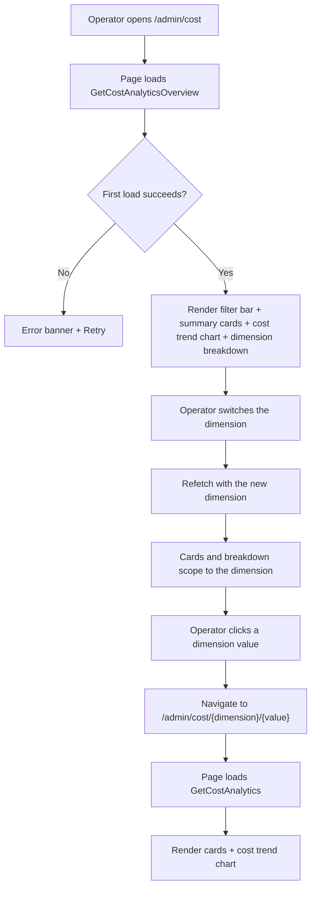
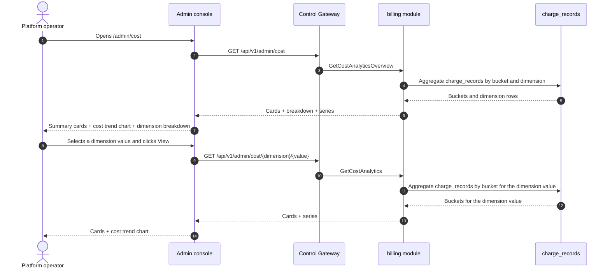

# Cost Analytics Dashboard — Requirement Analysis and UI/UX Design

| Attribute | Content |
| --- | --- |
| Feature point | Cost analytics dashboard — per-org / per-model / per-key cost attribution with trends, cost-per-token, and cost breakdown by dimension over a time range (backlog row 29) |
| Document scope | Requirement analysis, competitive research, the admin-surface cost analytics page for `/admin/cost` (fleet-wide cost attribution by dimension + trends + cost-per-token), the end-user-surface cost analytics page for `/cost` (tenant-scoped cost attribution by dimension + trends + cost-per-token), the page → API surface table, and numbered acceptance criteria |
| Owning modules | `billing` (read-only aggregation over `charge_records` for cost attribution), `metering` (read-only: token totals from `usage_records` for cost-per-token), `web` admin console (`CostAnalyticsPage`) and end-user console (`UserCostAnalyticsPage`), `pkg/server` gateway (admin-prefix and user-prefix bindings) |
| Related documents | [Architecture Design](./architecture.md) — §2.6 `billing` · [Usage Dashboards & Per-Request Cost Attribution](./usage-dashboard.md) — the sibling read-only dashboard and its inline-SVG chart, freshness, range, and group-by conventions · [API Key Usage Analytics](./api-key-usage-analytics.md) — the sibling per-key analytics and its top-keys ranking · [Model × Card-Type Price Matrix & Tiered Pricing](./pricing.md) — the charge formula and effective-dated prices behind every cost figure · [Console Surface Separation](./console-surface-separation.md) — the two surfaces this feature spans, the `UserShell`/`AdminShell` conventions, the masked-projection rule |
| Status | Design complete, handed to the Architect agent |

---

## 1. Background

go-taas turns settled usage into `charge_records` with amounts per key × model × card × hour (feature #5), and the usage dashboard (feature #9) and API key usage analytics (feature #28) attribute cost per key. What the console still cannot answer is the operator's and tenant's question: *where is my money going, and how is cost trending?* The usage dashboard shows cost with a group-by toggle but does not lead with a cost attribution by dimension; the API key analytics page ranks keys by cost but does not break cost down by model or org; and neither shows cost-per-token or a cost trend chart. There is no surface that attributes cost by dimension (org, model, key), shows cost trends over time, and reports cost-per-token.

This feature adds a **cost analytics dashboard**: per-org / per-model / per-key cost attribution with trends, cost-per-token, and cost breakdown by dimension over a time range. It is a **read-only** aggregation layer — nothing in the inference, metering, or billing pipelines changes. It is the smallest independently valuable increment of Phase 4's productionization roadmap item: it turns "cost is high" into "this month's cost is 60% model X, 40% org Y, with a rising cost-per-token".

### 1.1 How Comparable Products Expose Cost Analytics

| Product | Cost surface | Dimensions | Trends / cost-per-token | Notable pitfalls |
| --- | --- | --- | --- | --- |
| **AWS Cost Explorer** | Cost and usage reports with a main graph; group-by dimensions; forecasts | Service, region, account, tag, etc. | Cost trends; top drivers; forecasts; no cost-per-token | 24-hour data lag; up to 13 months history; forecasts add complexity |
| **OpenAI Platform** | Usage page per project/key/model: day-granularity cost and token charts | Project, key, model | Cost/token charts; no cost-per-token | Usage lag (minutes) confuses debugging; the "today (partial)" marker needs explaining |
| **Langfuse** | Cost dashboard: cost by model, cost over time, top users and use cases by cost | Model, user, use case | Cost-over-time charts; cost per user/model | Heavy third-party stack; cost-per-token not a headline metric |
| **Helicone** | Per-key usage and cost breakdown | Key, model | Per-key trend charts | Third-party SaaS; some features gated |
| **Anthropic Console** | Per-day, per-model usage with costs | Model | Per-day charts | The per-request viewer is admin-only; members see aggregates |
| **SiliconFlow** | Per-model, per-day token usage plus balance history | Model | None exposed | No per-request audit; a disputed charge cannot be traced to requests |

### 1.2 Distilled Patterns and Decisions

Patterns worth adopting: (1) **summary cards above a cost trend chart and a dimension breakdown** — AWS Cost Explorer and Langfuse lead with headline cards (total cost, cost-per-token, top dimension) above a cost-over-time chart and a breakdown by dimension, and one dashboard endpoint serving cards + series + breakdown avoids the N+1-call slow console (usage-dashboard D1); (2) **group-by dimension** — AWS Cost Explorer's group-by dimensions (service, account, tag) map exactly onto org / model / key; (3) **cost trends** — AWS's cost-over-time graph and Langfuse's cost-over-time charts show how cost evolves; (4) **cost-per-token** — dividing total cost by total tokens gives the unit-economics number an operator and tenant care about; (5) **top drivers** — AWS's "top drivers" and Langfuse's "top users by cost" ranking answer "where is money going"; (6) **freshness labeling** — a data-through timestamp and a pending/partial marker, because cost-lag confusion is the most consistently recorded pitfall (AWS 24-hour lag, OpenAI usage lag); (7) **inline SVG charts** — the console is deliberately dependency-light (usage-dashboard D7).

Pitfalls to avoid: a blocking N+1 dashboard (the slow-console pitfall) — one endpoint returns cards + series + breakdown; cost without a dimension breakdown (the "where is money going" dead-end); silently missing pending hours — the freshness marker must be explicit; heavy chart libraries in a dependency-light console; and exposing operator-orchestration internals (service ids, replica counts) to tenants — the tenant surface shows only cost attribution.

**Decisions for go-taas**:

| # | Decision | Rationale |
| --- | --- | --- |
| D1 | **Cost analytics exists on both surfaces, with a clean scope split.** The admin surface (`/admin/cost`, `/api/v1/admin/cost/*`) is a **fleet-wide cost attribution** — all orgs, models, and keys, with a dimension breakdown, a cost trend, and cost-per-token. The end-user surface (`/cost`, `/api/v1/cost/*`) is a **tenant-scoped cost attribution** — the tenant's own models and keys, with the same breakdown, trend, and cost-per-token, and no service ids or operator internals | The operator needs cross-org cost attribution to manage platform spend; the tenant needs their own cost attribution to manage their budget. Splitting by surface follows feature #17's masked-projection rule: a tenant must not see operator orchestration internals, and an operator's fleet view is operator-scoped. Both surfaces share the same card, chart, and breakdown components |
| D2 | **Cost is derived from `charge_records`** (which carry amounts per key × model × card × hour, feature #5), aggregated server-side by dimension. The metric families are **cost** (integer cents), **tokens** (from `usage_records`, input + output + cached + reasoning), and **cost-per-token** (derived client-side as cost ÷ tokens). | `charge_records` carry the authoritative per-key cost (feature #5); `usage_records` carry the token totals (feature #4). Aggregating server-side keeps the payload small and the client dependency-light |
| D3 | **One new RPC per surface shape** rather than extending `GetUsageDashboard`: `GetCostAnalyticsOverview` (admin fleet: cards + dimension breakdown + cost trend + cost-per-token) and `GetCostAnalytics` (admin per-dimension drill-down and end-user per-dimension view: cards + trend for one dimension value). The end-user surface reuses `GetCostAnalytics` scoped to the tenant's own org | The cost page needs several shapes at once (headline cards, a dimension breakdown, a trend); bolting them onto `GetUsageDashboard` would break its established group-by semantics, while separate calls recreate the N+1 slow console. A dedicated pair of RPCs keeps the cost concern out of the usage dashboard's surface |
| D4 | **`dimension` is server-side** — `organization` (admin only), `model`, `api_key` — and switching it refetches. **The metric toggle (cost / tokens / cost-per-token) is client-side** because every bucket carries all three metrics | Payload stays one dimension wide; the toggle feels instant (the AWS/OpenAI pattern). The admin surface supports the `organization` dimension; the end-user surface supports `model` and `api_key` only (the tenant sees only their own org) |
| D5 | **Time buckets adapt to the range**: hourly buckets for ranges ≤ 7 days, daily buckets for ranges > 7 days. The range is capped at **92 days** and validation reuses **10404** (the metering range contract) | Hourly granularity for short ranges shows intra-day cost spikes; daily for long ranges keeps the payload small. The 92-day cap and 10404 reuse keep the range contract uniform with every metering query (usage-dashboard D6) |
| D6 | **The chart renders with inline SVG** — one bar (or line) per bucket, with a metric switcher (cost / tokens / cost-per-token) — no new charting dependency | The console is deliberately dependency-light; a small, testable SVG component matches the usage-dashboard D7 decision |
| D7 | **Freshness is explicit**: every response carries `data_through` (the last complete bucket covered by charge records) and the console shows a "data through <time>" note plus a pending/partial marker when the selected range extends past it | Cost-lag confusion is the most consistently recorded pitfall (AWS 24-hour lag, OpenAI usage lag); the marker keeps the freshness story honest with zero new pipeline work |
| D8 | **The end-user surface is tenant-scoped and masked**: `GetCostAnalytics` on the user prefix returns only the tenant's own org's cost, with no service ids, no replica counts, and no other tenants' data | Follows feature #17's masked-projection rule and the observability D7 pattern: tenants get their own cost attribution, not operator internals |
| D9 | **New error codes in a cost block (11301–11399)**: **11301 `CodeCostDimensionInvalid`** (an unsupported `dimension` value) and **11302 `CodeCostDimensionValueNotFound`** (an unknown dimension value, e.g. `model_id`). Range validation reuses **10404** | Cost analytics is a new concern (D3), so its codes live in a fresh block after the usage-keys block (112xx); distinct invalid-dimension and not-found codes keep API consumers' handling precise, while the range contract stays uniform with metering (D5) |
| D10 | **Cost analytics is read-only and audited only for access** — it writes no data and mutates nothing; the pages are reachable only by authenticated sessions with the appropriate role, and no analytics mutation is audited (there is nothing to mutate) | The feature is a pure aggregation over existing data; the audit trail (feature #15) already covers the underlying charge-record writes. No new audit events are needed |

## 2. Goals and Non-goals

**Goals**: an admin page `/admin/cost` that shows fleet-wide summary cards, a dimension breakdown (org / model / key), a cost trend chart with a metric switcher, and cost-per-token, plus a per-dimension drill-down `/admin/cost/:dimension/:value` (D1, D2, D3, D4, D5, D6, D7); an end-user page `/cost` showing the tenant's own cards, breakdown (model / key), trend, and cost-per-token, plus a per-dimension drill-down `/cost/:dimension/:value` (D1, D8); the page → API surface table with exact prefixes (D1); per-page interactive states including empty, error, and permission-denied; numbered acceptance criteria testable in Nightwatch against the compose stack.

**Non-goals**: real-time streaming metrics (the charge-record cadence stands); forecasts (AWS's 18-month forecast is out of scope); anomaly detection or threshold alerts (feature #26 consumes observability events in-console — out of scope here); saved custom views or dashboards; comparing dimensions side-by-side in a chart (v1 shows a dimension breakdown and a single-dimension trend; a comparison chart is future work); exposing service ids, replica counts, or other operator internals to tenants (D8); any change to the inference, metering, or billing pipelines (read-only feature); new audit events (D10).

## 3. Personas and Journeys

| Role | Surface | Journey |
| --- | --- | --- |
| **Platform operator** | admin | Opens `/admin/cost` → sees fleet-wide summary cards and the dimension breakdown → switches the dimension to `organization` → sees which org drives cost → drills into `/admin/cost/organization/:orgId` → sees the org's cost trend → investigates |
| **Platform operator (finance)** | admin | Watches cost-per-token over a month → sees it rising → switches the dimension to `model` → sees which model's cost-per-token rose → drills into `/admin/cost/model/:modelId` → tunes pricing or capacity |
| **Tenant developer / Agent** | end-user | Opens `/cost` → sees their own summary cards and the dimension breakdown → switches the dimension to `model` → sees which model drives their cost → drills into `/cost/model/:modelId` → sees the model's cost trend |
| **Tenant finance / capacity planner** | end-user | Watches cost-per-token and cost trends over a month → plans capacity and budget → sees the per-model and per-key breakdown to attribute cost to their own usage |

> Terminology: the consumer-side caller is an **Agent** in English and 「智能体」 in Chinese, consistent with the repository convention.

## 4. Feature Requirements

### FR1 — Admin fleet-wide cost overview

- **FR1.1** `GetCostAnalyticsOverview` (`GET /api/v1/admin/cost`) returns the fleet-wide cost analytics for a time range and optional filters: summary cards, a dimension breakdown, a cost trend, and cost-per-token. It takes `since`/`until` (unix seconds; defaults `until = now`, `since = until − 24h`), `dimension` (one of `organization`, `model`, `api_key`; default `organization`), and `organization_id` (optional, via `X-Organization-Id`). `since > until` or a range > 92 days returns **10404** (D5). An unsupported `dimension` returns **11301** (D9).
- **FR1.2** The response's `cards` carry `total_cost_cents`, `total_tokens`, `cost_per_token` (derived client-side as cost ÷ tokens), `top_dimension_value`, `top_dimension_share_pct`, and `data_through` (the last complete bucket covered by charge records) (D2, D7).
- **FR1.3** The response's `breakdown[]` carry one row per dimension value in the range: `dimension_value`, `dimension_name`, `total_cost_cents`, `total_tokens`, `cost_per_token`, and `share_pct` (the value's share of the range's total cost, derived client-side as value cost ÷ total cost). The breakdown is sorted by `total_cost_cents` descending by default.
- **FR1.4** The response's `series[]` carry one entry per time bucket (hourly for ranges ≤ 7 days, daily otherwise, D5): `bucket` (unix seconds), `total_cost_cents`, `total_tokens`, `cost_per_token`. When a dimension value is set, the series is for that value; otherwise it is fleet-wide.

### FR2 — Admin per-dimension drill-down

- **FR2.1** `GetCostAnalytics` (`GET /api/v1/admin/cost/{dimension}/{value}`) returns the single-dimension-value cost analytics for a time range: summary cards and a cost trend. It takes `since`/`until` (same defaults and 10404 range rule as FR1.1). An unsupported `dimension` returns **11301**; an unknown dimension value returns **11302 `CodeCostDimensionValueNotFound`** (D9).
- **FR2.2** The response's `cards` and `series[]` mirror FR1.2/FR1.4 scoped to the dimension value.

### FR3 — End-user cost view

- **FR3.1** `GetCostAnalytics` (`GET /api/v1/cost/{dimension}/{value}`) returns the **tenant's own** single-dimension-value cost analytics for a time range: summary cards and a cost trend. It takes `since`/`until` (same defaults and 10404 range rule). The supported `dimension` values are `model` and `api_key` only (the tenant sees only their own org, D8). An unsupported `dimension` returns **11301**; an unknown dimension value returns **11302** (D9).
- **FR3.2** The response is scoped to the caller's organization (D8): it aggregates only the tenant's own `charge_records` and `usage_records`, and exposes **no** service ids, replica counts, or other tenants' data (D8).

### FR4 — Surface and API binding

- **FR4.1** The admin cost pages live on the **admin surface**: routes `/admin/cost` and `/admin/cost/:dimension/:value`, API prefix `/api/v1/admin/cost/*`. They are added to the `AdminShell` navigation (feature #17) as "Cost".
- **FR4.2** The end-user cost pages live on the **end-user surface**: routes `/cost` and `/cost/:dimension/:value`, API prefix `/api/v1/cost/*`. They are added to the `UserShell` navigation (feature #17) as "Cost".
- **FR4.3** The admin pages call only `/api/v1/admin/cost/*` routes; the end-user pages call only `/api/v1/cost/*`. Neither contains the other surface's prefix string (feature #17, D1).
- **FR4.4** The end-user pages never expose operator internals (service ids, replica counts) and never aggregate other tenants' data (D8).

## 5. UI Design

### 5.1 Page: `/admin/cost` — Cost Analytics (admin)

**Purpose**: give the platform operator a fleet-wide cost attribution view — summary cards, a dimension breakdown, a cost trend chart, and cost-per-token — to manage platform spend.

**Surface**: admin — route `/admin/cost`, API `/api/v1/admin/cost/*`.

**Layout**: rendered inside `AdminShell` (feature #17). A page header ("Cost", subtitle "Cost attribution by dimension over time") with a **Refresh** action (secondary). Below:

1. **Filter bar** — a **Time range** control (presets 24 h / 7 d / 30 d / custom with a date-time picker), a **Dimension** control (dropdown: Organization / Model / API key; default Organization), and a **Model** filter (dropdown, "All models" default, shown when the dimension is not Model). Changing any refetches.
2. **Summary cards** — a row of cards: **Total cost**, **Total tokens**, **Cost per token**, **Top dimension** (the top dimension value with its share). Each card shows the value for the selected range and dimension, with a "data through <time>" freshness note (D7).
3. **Cost trend chart** — an inline-SVG chart (D6) with a **metric switcher** (Cost / Tokens / Cost per token). One bar (or line) per bucket; when a dimension value is selected the series is that value, otherwise fleet-wide.
4. **Dimension breakdown** — a table of the dimension values with columns: **Dimension value** (link to the drill-down), **Cost**, **Tokens**, **Cost per token**, **Share**. Row action **View** opens the drill-down.

**Interactive states**:

| State | Behaviour |
| --- | --- |
| Default | Filter bar + summary cards + cost trend chart + dimension breakdown render from the first successful load; last-updated shows the load time |
| Loading | Skeleton cards and table; Refresh is disabled |
| Empty | "No cost data in this range." with a hint to widen the range; the filter bar stays visible |
| Error | An error banner with the message and a Retry button; the page keeps its last good data with a "Showing stale data" banner |
| Disabled | Refresh is disabled while a load is in flight; the metric switcher is disabled while a refetch is in flight |
| Permission-denied | A session without the required role receives 10036 and the page shows the standard permission-denied state (feature #17) with a link back to the admin home |

**Dimension breakdown columns**: Dimension value (link), Cost, Tokens, Cost per token, Share. Sortable by Cost, Tokens, Cost per token, and Share. Filterable by the Model dropdown (when applicable); paginated.

### 5.2 Page: `/admin/cost/:dimension/:value` — Cost Detail (admin)

**Purpose**: show one dimension value's cost over time — cards and a cost trend — so the operator can investigate a single org's, model's, or key's cost.

**Surface**: admin — route `/admin/cost/:dimension/:value`, API `/api/v1/admin/cost/{dimension}/{value}`.

**Layout**: a detail page under `AdminShell` with a back link to the overview. A header with the dimension name and value. Below:

1. **Filter bar** — a **Time range** control (presets 24 h / 7 d / 30 d / custom).
2. **Summary cards** — the same card set as §5.1, scoped to the dimension value.
3. **Cost trend chart** — the inline-SVG chart with the metric switcher, scoped to the dimension value.

**Interactive states**: identical to §5.1, with the empty copy "No cost data for this dimension value in this range." and the not-found state for an unknown dimension value (11302) showing the standard not-found state with a link back to the overview.

### 5.3 Page: `/cost` — Cost Analytics (end-user)

**Purpose**: give a tenant developer / Agent a view of their own cost attribution — summary cards, a dimension breakdown, a cost trend chart, and cost-per-token — to manage their budget.

**Surface**: end-user — route `/cost`, API `/api/v1/cost/*`.

**Layout**: rendered inside `UserShell` (feature #17). A page header ("Cost", subtitle "Your cost attribution by dimension over time") with a **Refresh** action (secondary). Below:

1. **Filter bar** — a **Time range** control (presets 24 h / 7 d / 30 d / custom) and a **Dimension** control (dropdown: Model / API key; default Model). Changing any refetches.
2. **Summary cards** — the same card set as §5.1, scoped to the tenant's own usage (D8).
3. **Cost trend chart** — the inline-SVG chart with the metric switcher, scoped to the tenant's own usage.
4. **Dimension breakdown** — the tenant's own dimension values with the same columns as §5.1, scoped to the tenant's own models and keys.

**Interactive states**: identical to §5.1, with the empty copy "No cost data in this range." and the permission-denied copy for the tenant's own errors (10005 org gone / 10017 org disabled from §8.2 of feature #17, 10027/10038 redirect per FR4.3). The page exposes no service ids or operator internals (D8).

**Dimension breakdown columns**: identical to §5.1, scoped to the tenant's own models and keys. Sortable and paginated as in §5.1.

### 5.4 Page: `/cost/:dimension/:value` — Cost Detail (end-user)

**Purpose**: give a tenant developer / Agent a view of one of their own dimension values' cost over time — cards and a cost trend — to attribute cost to their own models and keys.

**Surface**: end-user — route `/cost/:dimension/:value`, API `/api/v1/cost/{dimension}/{value}`.

**Layout**: a detail page under `UserShell` with a back link to the overview. A header with the dimension name and value. Below:

1. **Filter bar** — a **Time range** control (presets 24 h / 7 d / 30 d / custom).
2. **Summary cards** — the same card set as §5.1, scoped to the tenant's own usage of the dimension value (D8).
3. **Cost trend chart** — the inline-SVG chart with the metric switcher, scoped to the tenant's own usage.

**Interactive states**: identical to §5.2, with the empty copy "No cost data for this dimension value in this range." and the permission-denied copy for the tenant's own errors (10005/10017 from feature #17 §8.2). The page exposes no service ids or operator internals (D8).

### 5.5 Flow

## 6. API Surface Implications

All cost RPCs belong to the **`billing` module** (D3), served as HTTP via the Control Gateway. Admin routes are on the **admin prefix** `/api/v1/admin/cost/*` (D1); the end-user routes are on the **user prefix** `/api/v1/cost/*` (D1).

| RPC | Route | Prefix | Status | Purpose |
| --- | --- | --- | --- | --- |
| `GetCostAnalyticsOverview` | `GET /api/v1/admin/cost` · `GET /api/v1/cost` | admin · user | **new** | Cards + dimension breakdown + cost trend + cost-per-token (admin: fleet; user: tenant-scoped) |
| `GetCostAnalytics` | `GET /api/v1/admin/cost/{dimension}/{value}` · `GET /api/v1/cost/{dimension}/{value}` | admin · user | **new** | Single-dimension-value cards + cost trend (admin: any value; user: tenant-scoped) |

**Contract notes for the Architect agent**:

1. `GetCostAnalyticsOverview` validates `since`/`until` (int64 unix seconds; defaults `until = now`, `since = until − 24h`); `since > until` or a range > 92 days returns 10404 (D5). `dimension` is one of `organization`, `model`, `api_key` (admin) or `model`, `api_key` (user); an unsupported value returns 11301 (D9). `organization_id` is an optional filter on the admin prefix.
2. `GetCostAnalytics` validates the same range contract; an unsupported `dimension` returns 11301 and an unknown dimension value returns 11302 (D9). On the user prefix it is scoped to the caller's organization (D8) and exposes no service ids or operator internals.
3. Buckets are hourly for ranges ≤ 7 days and daily otherwise (D5); each bucket carries `bucket`, `total_cost_cents`, `total_tokens`, `cost_per_token`. `cost_per_token` and `share_pct` are derived client-side; the wire carries integer counts and integer cents only.
4. Every response carries `data_through` (the last complete bucket covered by charge records) for the freshness marker (D7).
5. Aggregation reads `charge_records` (feature #5) — amounts per key × model × card × hour — and `usage_records` (feature #4) for token totals; it writes nothing (D10).
6. Wire conventions unchanged: dotted pagination where lists apply, HTTP 200 on success, business errors as `{"code": <int>, "message": "..."}`, int64 fields serialized as JSON strings.

Error codes (cost block 11301–11399, `pkg/errors/codes.go`):

| Condition | Code | Constant | Notes |
| --- | --- | --- | --- |
| An unsupported `dimension` | 11301 | `CodeCostDimensionInvalid` | **New** (D9) |
| An unknown dimension value | 11302 | `CodeCostDimensionValueNotFound` | **New** (D9) |
| A malformed or over-long range | 10404 | `CodeRequestLogRangeInvalid` | Reused (D5) — the metering range contract |
| Database / infrastructure failure | 500 | `CodeInternal` | Via error normalization |

## 7. Acceptance Criteria

| # | Criterion | Level |
| --- | --- | --- |
| AC1 | `GetCostAnalyticsOverview` with a valid range returns summary cards, a dimension breakdown, and a time-series; a range > 92 days or `since > until` returns 10404 | FVT |
| AC2 | `GetCostAnalyticsOverview` with an unsupported `dimension` returns 11301; the breakdown is sorted by cost descending with a client-derived `share_pct` | FVT |
| AC3 | `GetCostAnalytics` (admin) returns single-dimension-value cards and a cost trend; an unknown dimension value returns 11302 | FVT |
| AC4 | `GetCostAnalytics` (user) returns only the caller's organization's cost, with no service ids or operator internals | FVT |
| AC5 | Buckets are hourly for ranges ≤ 7 days and daily for ranges > 7 days; every response carries `data_through` | FVT |
| AC6 | The `/admin/cost` page renders the filter bar, summary cards, the inline-SVG cost trend chart, and the dimension breakdown from the first successful load, with a last-updated timestamp | E2E |
| AC7 | Changing the time range, dimension, or model filter refetches and re-renders the cards, chart, and breakdown; the metric switcher toggles the chart metric | E2E |
| AC8 | The empty state ("No cost data in this range.") renders when no data matches; a failed load keeps the last good data with a "Showing stale data" banner and a Retry action | E2E |
| AC9 | The `/admin/cost/:dimension/:value` page renders the dimension value's cards and cost trend chart; an unknown dimension value shows the not-found state | E2E |
| AC10 | The `/cost` and `/cost/:dimension/:value` pages render the tenant's own cards, breakdown, and trend, with no service ids or operator internals visible | E2E |
| AC11 | The admin cost pages are reachable only on the admin surface: routes `/admin/cost` and `/admin/cost/:dimension/:value`, every API call uses the `/api/v1/admin/cost/*` prefix with no `/api/v1/cost/*` string | E2E (surface separation) |
| AC12 | The end-user cost pages are reachable only on the end-user surface: routes `/cost` and `/cost/:dimension/:value`, every API call uses the `/api/v1/cost/*` prefix with no `/api/v1/admin/*` string | E2E (surface separation) |
| AC13 | A session without the required role receives 10036 on the admin cost pages and the page shows the standard permission-denied state | E2E |

## 8. Out of Scope (tracked elsewhere)

| Item | Where |
| --- | --- |
| Real-time streaming metrics | Future refinement — the charge-record cadence stands |
| Cost forecasts | Future refinement — AWS's 18-month forecast is out of scope |
| Anomaly detection / threshold alerts | Feature #26 consumes observability events in-console — out of scope here |
| Saved custom views / dashboards | Future refinement |
| Comparing dimensions side-by-side in a chart | Future refinement — v1 shows a dimension breakdown and a single-dimension trend |
| Tenant visibility of operator orchestration internals (service ids, replica counts) | Deliberately absent (D8) |
| Any change to the inference, metering, or billing pipelines | Deliberately absent — read-only feature (D10) |
| New audit events for cost analytics access | Deliberately absent — nothing to mutate (D10) |