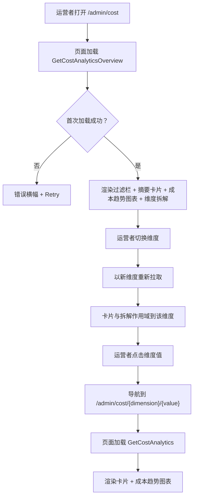
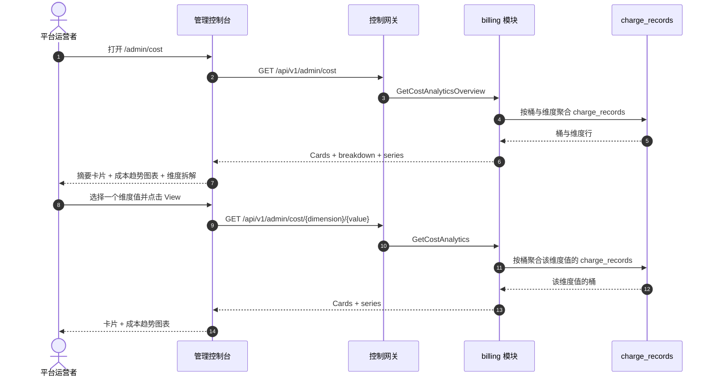

# 成本分析仪表盘 — 需求分析与 UI/UX 设计

| 属性 | 内容 |
| --- | --- |
| 特性点 | 成本分析仪表盘 — 按组织 / 模型 / Key 的成本归因，带趋势、每 token 成本与按维度的时间范围成本拆解（backlog 第 29 行） |
| 文档范围 | 需求分析与 UI/UX 设计：`/admin/cost` 管理面成本分析页面（集群级按维度成本归因 + 趋势 + 每 token 成本），`/cost` 终端用户面成本分析页面（租户作用域按维度成本归因 + 趋势 + 每 token 成本），页面 → API 面映射表，以及编号验收标准 |
| 归属模块 | `billing`（对 `charge_records` 的只读聚合，用于成本归因），`metering`（只读：来自 `usage_records` 的 token 总数，用于每 token 成本），`web` 管理控制台（`CostAnalyticsPage`）与终端用户控制台（`UserCostAnalyticsPage`），`pkg/server` 网关（管理前缀与用户前缀绑定） |
| 相关文档 | [架构设计](./architecture.md) — 第 2.6 节 `billing` · [用量仪表盘与按请求成本归因](./usage-dashboard.zh-cn.md) — 姊妹只读仪表盘及其内联 SVG 图表、新鲜度、范围与 group-by 约定 · [API Key 用量分析](./api-key-usage-analytics.zh-cn.md) — 姊妹按 Key 分析及其 Top Keys 排名 · [模型 × 卡型价格矩阵与阶梯定价](./pricing.zh-cn.md) — 每个成本数字背后的计费公式与生效日期价格 · [控制台面分离](./console-surface-separation.zh-cn.md) — 本特性横跨的两个面、`UserShell`/`AdminShell` 约定、掩码投影规则 |
| 状态 | 设计完成，已移交架构师代理 |

---

## 1. 背景与竞品调研

go-taas 把已结算用量转成带金额的 `charge_records`（按 Key × 模型 × 卡型 × 小时，特性 #5），用量仪表盘（特性 #9）与 API Key 用量分析（特性 #28）按 Key 归因成本。控制台仍然无法回答运营者与租户反复提出的问题：*我的钱花在哪里，成本如何随时间变化？* 用量仪表盘显示成本，带 group-by 切换，但不以按维度成本归因开场；API Key 分析页面按成本对 Key 排名，但不按模型或组织拆解成本；两者都不显示每 token 成本或成本趋势图表。没有任何面按维度（组织、模型、Key）归因成本、显示随时间变化的成本趋势并报告每 token 成本。

本特性新增**成本分析仪表盘**：按组织 / 模型 / Key 的成本归因，带趋势、每 token 成本与按维度的时间范围成本拆解。它是**只读**聚合层 — 推理、计量或计费流水线没有任何变化。这是 Phase 4 生产化路线图项中最小可独立交付的增量：它把「成本很高」变成「本月成本 60% 是模型 X、40% 是组织 Y，且每 token 成本在上升」。

### 1.1 竞品的成本分析呈现

| 产品 | 成本面 | 维度 | 趋势 / 每 token 成本 | 主要陷阱 |
| --- | --- | --- | --- | --- |
| **AWS Cost Explorer** | 带主图表的成本与用量报告；group-by 维度；预测 | 服务、区域、账户、标签等 | 成本趋势；Top 驱动因素；预测；无每 token 成本 | 24 小时数据滞后；最多 13 个月历史；预测增加复杂度 |
| **OpenAI Platform** | 每个项目/密钥/模型的 Usage 页面：日粒度成本与 token 图表 | 项目、密钥、模型 | 成本/token 图表；无每 token 成本 | 用量滞后（分钟级）困扰调试；「today (partial)」标记需要解释 |
| **Langfuse** | 成本仪表盘：按模型成本、随时间成本、按成本 Top 用户与用例 | 模型、用户、用例 | 成本随时间图表；每用户/模型成本 | 重型第三方栈；每 token 成本非头条指标 |
| **Helicone** | 按 Key 用量与成本拆解 | Key、模型 | 按 Key 趋势图表 | 第三方 SaaS；部分功能受限 |
| **Anthropic Console** | 按日、按模型的用量与成本 | 模型 | 按日图表 | 按请求查看器仅管理员可用；成员只见聚合 |
| **SiliconFlow** | 按模型、按日的 token 用量加余额历史 | 模型 | 无暴露 | 无按请求审计；争议费用无法追溯到请求 |

### 1.2 提炼出的模式与决策

值得采纳的模式：(1) **成本趋势图表与维度拆解上方的摘要卡片** — AWS Cost Explorer 与 Langfuse 都以头部卡片（总成本、每 token 成本、Top 维度）加成本随时间图表与按维度拆解开场，一个仪表盘端点同时返回卡片 + 序列 + 拆解避免了 N+1 慢控制台（usage-dashboard D1）；(2) **group-by 维度** — AWS Cost Explorer 的 group-by 维度（服务、账户、标签）正好映射到组织 / 模型 / Key；(3) **成本趋势** — AWS 的成本随时间图表与 Langfuse 的成本随时间图表显示成本如何演变；(4) **每 token 成本** — 总成本除以总 token 给出运营者与租户关心的单位经济数字；(5) **Top 驱动因素** — AWS 的「Top 驱动因素」与 Langfuse 的「按成本 Top 用户」排名回答「钱花在哪里」；(6) **新鲜度标注** — data-through 时间戳与 pending/partial 标记，因为成本滞后困惑是最常被记录的陷阱（AWS 24 小时滞后、OpenAI 用量滞后）；(7) **内联 SVG 图表** — 控制台刻意依赖精简（usage-dashboard D7）。

需要避免的陷阱：阻塞式 N+1 仪表盘（慢控制台陷阱）— 一个端点返回卡片 + 序列 + 拆解；没有维度拆解的成本（「钱花在哪里」死胡同）；静默缺失 pending 小时 — 新鲜度标记必须显式；在依赖精简的控制台中使用重型图表库；以及向租户暴露运营者编排内部信息（服务 id、副本数）— 租户面只显示成本归因。

**go-taas 的决策**：

| # | 决策 | 依据 |
| --- | --- | --- |
| D1 | **成本分析存在于两个面，作用域清晰拆分。** 管理面（`/admin/cost`、`/api/v1/admin/cost/*`）是**集群级成本归因** — 所有组织、模型与 Key，带维度拆解、成本趋势与每 token 成本。终端用户面（`/cost`、`/api/v1/cost/*`）是**租户作用域成本归因** — 租户自己的模型与 Key，带相同的拆解、趋势与每 token 成本，且无服务 id 或运营者内部信息 | 运营者需要跨组织成本归因来管理平台支出；租户需要自己的成本归因来管理预算。按面拆分遵循特性 #17 的掩码投影规则：租户绝不能看到运营者编排内部信息，运营者的集群视图也是运营者作用域。两个面共享相同的卡片、图表与拆解组件 |
| D2 | **成本由 `charge_records` 派生**（每 Key × 模型 × 卡型 × 小时携带金额，特性 #5），在服务端按维度聚合。指标族为**成本**（整数分）、**token**（来自 `usage_records`，输入 + 输出 + 缓存 + 推理）与**每 token 成本**（客户端派生为成本 ÷ token）。 | `charge_records` 携带权威的按 Key 成本（特性 #5）；`usage_records` 携带 token 总数（特性 #4）。服务端聚合保持负载小且客户端依赖精简 |
| D3 | **每个面形状一个 RPC**，而非扩展 `GetUsageDashboard`：`GetCostAnalyticsOverview`（管理面集群：卡片 + 维度拆解 + 成本趋势 + 每 token 成本）与 `GetCostAnalytics`（管理面按维度下钻与终端用户面按维度视图：单维度值卡片 + 趋势）。终端用户面复用 `GetCostAnalytics`，作用域到租户自己的组织 | 成本页面需要多种形状（头部卡片、维度拆解、趋势）；把它们塞进 `GetUsageDashboard` 会破坏其既有的 group-by 语义，而分开调用会重现 N+1 慢控制台。专用 RPC 对把成本关注点从用量仪表盘的面中分离出来 |
| D4 | **`dimension` 是服务端** — `organization`（仅管理面）、`model`、`api_key` — 切换它即重新拉取。**指标切换（成本 / token / 每 token 成本）是客户端**，因为每个桶携带全部三个指标 | 负载保持一个维度宽；切换感觉即时（AWS/OpenAI 模式）。管理面支持 `organization` 维度；终端用户面只支持 `model` 与 `api_key`（租户只见自己的组织） |
| D5 | **时间桶随范围自适应**：范围 ≤ 7 天用小时桶，范围 > 7 天用日桶。范围上限 **92 天**，校验复用 **10404**（计量范围契约） | 短范围的小时粒度显示日内成本尖峰；长范围的日粒度保持负载小。92 天上限与 10404 复用让范围契约与每个计量查询统一（usage-dashboard D6） |
| D6 | **图表用内联 SVG 渲染** — 每桶一个柱（或线），带指标切换器（成本 / token / 每 token 成本）— 无新图表依赖 | 控制台刻意依赖精简；小而可测试的 SVG 组件与 usage-dashboard D7 决策一致 |
| D7 | **新鲜度显式**：每个响应携带 `data_through`（charge records 覆盖的最后一个完整桶），控制台显示「data through <time>」说明，并在所选范围超出它时显示 pending/partial 标记 | 成本滞后困惑是最常被记录的陷阱（AWS 24 小时滞后、OpenAI 用量滞后）；标记以零新流水线工作保持新鲜度故事诚实 |
| D8 | **终端用户面是租户作用域且掩码**：用户前缀的 `GetCostAnalytics` 只返回租户自己组织的成本，无服务 id、无副本数、无其他租户数据 | 遵循特性 #17 的掩码投影规则与 observability D7 模式：租户得到自己的成本归因，而非运营者内部信息 |
| D9 | **cost 块（11301–11399）新增错误码**：**11301 `CodeCostDimensionInvalid`**（不支持的 `dimension` 值）与 **11302 `CodeCostDimensionValueNotFound`**（未知维度值，如 `model_id`）。范围校验复用 **10404** | 成本分析是新关注点（D3），因此其错误码放在 usage-keys 块（112xx）之后的全新块中；不同的 invalid-dimension 与 not-found 码让 API 消费者的处理精确，而范围契约与计量保持统一（D5） |
| D10 | **成本分析是只读且仅对访问审计** — 它不写数据、不改变任何东西；页面仅对具有相应角色的已认证会话可达，且无分析变更被审计（没有可变更的东西） | 该特性是对既有数据的纯聚合；审计轨迹（特性 #15）已覆盖底层 charge-record 写入。无需新增审计事件 |

## 2. 目标与非目标

**目标**：一个管理面页面 `/admin/cost`，显示集群级摘要卡片、维度拆解（组织 / 模型 / Key）、带指标切换器的成本趋势图表与每 token 成本，外加按维度下钻 `/admin/cost/:dimension/:value`（D1、D2、D3、D4、D5、D6、D7）；一个终端用户面页面 `/cost`，显示租户自己的卡片、拆解（模型 / Key）、趋势与每 token 成本，外加按维度下钻 `/cost/:dimension/:value`（D1、D8）；页面 → API 面映射表，含精确前缀（D1）；每页交互状态，包括空、错误与权限拒绝；可在 Nightwatch 中针对 compose 栈测试的编号验收标准。

**非目标**：实时流式指标（charge-record 节奏不变）；成本预测（AWS 的 18 个月预测不在范围内）；异常检测或阈值告警（特性 #26 在控制台内消费可观测性事件 — 此处不在范围内）；保存的自定义视图或仪表盘；在图表中并排比较维度（v1 显示维度拆解与单维度趋势；比较图表是未来工作）；向租户暴露服务 id、副本数或其他运营者内部信息（D8）；对推理、计量或计费流水线的任何更改（只读特性）；新增审计事件（D10）。

## 3. 角色与旅程

| 角色 | 面 | 旅程 |
| --- | --- | --- |
| **平台运营者** | admin | 打开 `/admin/cost` → 看到集群级摘要卡片与维度拆解 → 把维度切换到 `organization` → 看到哪个组织驱动成本 → 下钻到 `/admin/cost/organization/:orgId` → 看到该组织的成本趋势 → 调查 |
| **平台运营者（财务）** | admin | 观察一个月的每 token 成本 → 看到它在上升 → 把维度切换到 `model` → 看到哪个模型的每 token 成本上升 → 下钻到 `/admin/cost/model/:modelId` → 调优定价或容量 |
| **租户开发者 / 智能体** | end-user | 打开 `/cost` → 看到自己的摘要卡片与维度拆解 → 把维度切换到 `model` → 看到哪个模型驱动自己的成本 → 下钻到 `/cost/model/:modelId` → 看到该模型的成本趋势 |
| **租户财务 / 容量规划者** | end-user | 观察一个月的每 token 成本与成本趋势 → 规划容量与预算 → 看到按模型与按 Key 拆解以把成本归因到自己的用量 |

> 术语：消费侧调用方在英文中为 **Agent**，中文为「智能体」，与仓库约定一致。

## 4. 功能需求

### FR1 — 管理面集群级成本总览

- **FR1.1** `GetCostAnalyticsOverview`（`GET /api/v1/admin/cost`）返回时间范围与可选过滤下的集群级成本分析：摘要卡片、维度拆解、成本趋势与每 token 成本。它接收 `since`/`until`（unix 秒；默认 `until = now`、`since = until − 24h`）、`dimension`（`organization`、`model`、`api_key` 之一；默认 `organization`）与 `organization_id`（可选，经 `X-Organization-Id`）。`since > until` 或范围 > 92 天返回 **10404**（D5）。不支持的 `dimension` 返回 **11301**（D9）。
- **FR1.2** 响应的 `cards` 携带 `total_cost_cents`、`total_tokens`、`cost_per_token`（客户端派生为成本 ÷ token）、`top_dimension_value`、`top_dimension_share_pct` 与 `data_through`（charge records 覆盖的最后一个完整桶）（D2、D7）。
- **FR1.3** 响应的 `breakdown[]` 携带范围内每个维度值一行：`dimension_value`、`dimension_name`、`total_cost_cents`、`total_tokens`、`cost_per_token` 与 `share_pct`（该值占范围内总成本的份额，客户端派生为值成本 ÷ 总成本）。拆解默认按 `total_cost_cents` 降序排序。
- **FR1.4** 响应的 `series[]` 携带每个时间桶一项（范围 ≤ 7 天为小时，否则为日，D5）：`bucket`（unix 秒）、`total_cost_cents`、`total_tokens`、`cost_per_token`。当设置维度值时，序列针对该值；否则为集群级。

### FR2 — 管理面按维度下钻

- **FR2.1** `GetCostAnalytics`（`GET /api/v1/admin/cost/{dimension}/{value}`）返回时间范围下的单维度值成本分析：摘要卡片与成本趋势。它接收 `since`/`until`（默认与 10404 范围规则同 FR1.1）。不支持的 `dimension` 返回 **11301**；未知维度值返回 **11302 `CodeCostDimensionValueNotFound`**（D9）。
- **FR2.2** 响应的 `cards` 与 `series[]` 镜像 FR1.2/FR1.4，作用域为该维度值。

### FR3 — 终端用户面成本视图

- **FR3.1** `GetCostAnalytics`（`GET /api/v1/cost/{dimension}/{value}`）返回**租户自己**的时间范围下的单维度值成本分析：摘要卡片与成本趋势。它接收 `since`/`until`（默认与 10404 范围规则同 FR1.1）。支持的 `dimension` 值仅为 `model` 与 `api_key`（租户只见自己的组织，D8）。不支持的 `dimension` 返回 **11301**；未知维度值返回 **11302**（D9）。
- **FR3.2** 响应作用域到调用者的组织（D8）：它只聚合租户自己的 `charge_records` 与 `usage_records`，且暴露**无**服务 id、副本数或其他租户数据（D8）。

### FR4 — 面与 API 绑定

- **FR4.1** 管理面成本页面位于**管理面**：路由 `/admin/cost` 与 `/admin/cost/:dimension/:value`，API 前缀 `/api/v1/admin/cost/*`。它们被加入 `AdminShell` 导航（特性 #17），名为「Cost」。
- **FR4.2** 终端用户面成本页面位于**终端用户面**：路由 `/cost` 与 `/cost/:dimension/:value`，API 前缀 `/api/v1/cost/*`。它们被加入 `UserShell` 导航（特性 #17），名为「Cost」。
- **FR4.3** 管理面页面只调用 `/api/v1/admin/cost/*` 路由；终端用户面页面只调用 `/api/v1/cost/*`。两者都不包含对方面的前缀字符串（特性 #17、D1）。
- **FR4.4** 终端用户面页面绝不暴露运营者内部信息（服务 id、副本数），绝不聚合其他租户数据（D8）。

## 5. UI 设计

### 5.1 页面：`/admin/cost` — Cost Analytics（管理面）

**目的**：给平台运营者一个集群级成本归因视图 — 摘要卡片、维度拆解、成本趋势图表与每 token 成本 — 以管理平台支出。

**面**：admin — 路由 `/admin/cost`，API `/api/v1/admin/cost/*`。

**布局**：在 `AdminShell`（特性 #17）内渲染。页面头部（「Cost」，副标题「Cost attribution by dimension over time」）带 **Refresh** 动作（次要）。下方：

1. **过滤栏** — **时间范围**控件（预设 24 h / 7 d / 30 d / custom，带日期时间选择器）、**维度**控件（下拉：Organization / Model / API key；默认 Organization）与**模型**过滤（下拉，「All models」默认，当维度不是 Model 时显示）。更改任一即重新拉取。
2. **摘要卡片** — 一行卡片：**Total cost**、**Total tokens**、**Cost per token**、**Top dimension**（Top 维度值及其份额）。每张卡片显示所选范围与维度下的值，带「data through <time>」新鲜度说明（D7）。
3. **成本趋势图表** — 内联 SVG 图表（D6）带**指标切换器**（Cost / Tokens / Cost per token）。每桶一个柱（或线）；当选择维度值时序列针对该值，否则为集群级。
4. **维度拆解** — 维度值表格，列：**Dimension value**（下钻链接）、**Cost**、**Tokens**、**Cost per token**、**Share**。行动作 **View** 打开下钻。

**交互状态**：

| 状态 | 行为 |
| --- | --- |
| 默认 | 过滤栏 + 摘要卡片 + 成本趋势图表 + 维度拆解从首次成功加载渲染；last-updated 显示加载时间 |
| 加载中 | 骨架卡片与表格；Refresh 禁用 |
| 空 | 「No cost data in this range.」并提示扩大范围；过滤栏保持可见 |
| 错误 | 错误横幅带消息与 Retry 按钮；页面保留最后的好数据并显示「Showing stale data」横幅 |
| 禁用 | 加载进行中 Refresh 禁用；重新拉取进行中指标切换器禁用 |
| 权限拒绝 | 无所需角色的会话收到 10036，页面显示标准权限拒绝状态（特性 #17）带返回管理首页的链接 |

**维度拆解列**：Dimension value（链接）、Cost、Tokens、Cost per token、Share。可按 Cost、Tokens、Cost per token 与 Share 排序。可按 Model 下拉过滤（如适用）；分页。

### 5.2 页面：`/admin/cost/:dimension/:value` — Cost Detail（管理面）

**目的**：显示一个维度值随时间变化的成本 — 卡片与成本趋势 — 让运营者调查单个组织、模型或 Key 的成本。

**面**：admin — 路由 `/admin/cost/:dimension/:value`，API `/api/v1/admin/cost/{dimension}/{value}`。

**布局**：`AdminShell` 下的详情页，带返回总览的返回链接。头部带维度名与值。下方：

1. **过滤栏** — **时间范围**控件（预设 24 h / 7 d / 30 d / custom）。
2. **摘要卡片** — 同 §5.1 的卡片集，作用域为该维度值。
3. **成本趋势图表** — 带指标切换器的内联 SVG 图表，作用域为该维度值。

**交互状态**：同 §5.1，空文案「No cost data for this dimension value in this range.」，未知维度值（11302）的 not-found 状态显示标准 not-found 状态带返回总览的链接。

### 5.3 页面：`/cost` — Cost Analytics（终端用户面）

**目的**：给租户开发者 / 智能体一个自己成本归因的视图 — 摘要卡片、维度拆解、成本趋势图表与每 token 成本 — 以管理预算。

**面**：end-user — 路由 `/cost`，API `/api/v1/cost/*`。

**布局**：在 `UserShell`（特性 #17）内渲染。页面头部（「Cost」，副标题「Your cost attribution by dimension over time」）带 **Refresh** 动作（次要）。下方：

1. **过滤栏** — **时间范围**控件（预设 24 h / 7 d / 30 d / custom）与**维度**控件（下拉：Model / API key；默认 Model）。更改任一即重新拉取。
2. **摘要卡片** — 同 §5.1 的卡片集，作用域到租户自己的用量（D8）。
3. **成本趋势图表** — 带指标切换器的内联 SVG 图表，作用域到租户自己的用量。
4. **维度拆解** — 租户自己的维度值，列同 §5.1，作用域到租户自己的模型与 Key。

**交互状态**：同 §5.1，空文案「No cost data in this range.」，权限拒绝文案为租户自己的错误（特性 #17 §8.2 的 10005 组织消失 / 10017 组织禁用，FR4.3 的 10027/10038 重定向）。页面暴露无服务 id 或运营者内部信息（D8）。

**维度拆解列**：同 §5.1，作用域到租户自己的模型与 Key。排序与分页同 §5.1。

### 5.4 页面：`/cost/:dimension/:value` — Cost Detail（终端用户面）

**目的**：给租户开发者 / 智能体一个自己某个维度值随时间变化的成本视图 — 卡片与成本趋势 — 以把成本归因到自己的模型与 Key。

**面**：end-user — 路由 `/cost/:dimension/:value`，API `/api/v1/cost/{dimension}/{value}`。

**布局**：`UserShell` 下的详情页，带返回总览的返回链接。头部带维度名与值。下方：

1. **过滤栏** — **时间范围**控件（预设 24 h / 7 d / 30 d / custom）。
2. **摘要卡片** — 同 §5.1 的卡片集，作用域到租户自己对维度值的用量（D8）。
3. **成本趋势图表** — 带指标切换器的内联 SVG 图表，作用域到租户自己的用量。

**交互状态**：同 §5.2，空文案「No cost data for this dimension value in this range.」，权限拒绝文案为租户自己的错误（特性 #17 §8.2 的 10005/10017）。页面暴露无服务 id 或运营者内部信息（D8）。

### 5.5 流程

## 6. API 面影响

所有成本 RPC 属于 **`billing` 模块**（D3），经控制网关以 HTTP 提供。管理面路由在**管理前缀** `/api/v1/admin/cost/*`（D1）；终端用户面路由在**用户前缀** `/api/v1/cost/*`（D1）。

| RPC | 路由 | 前缀 | 状态 | 目的 |
| --- | --- | --- | --- | --- |
| `GetCostAnalyticsOverview` | `GET /api/v1/admin/cost` · `GET /api/v1/cost` | admin · user | **新增** | 卡片 + 维度拆解 + 成本趋势 + 每 token 成本（admin：集群；user：租户作用域） |
| `GetCostAnalytics` | `GET /api/v1/admin/cost/{dimension}/{value}` · `GET /api/v1/cost/{dimension}/{value}` | admin · user | **新增** | 单维度值卡片 + 成本趋势（admin：任意值；user：租户作用域） |

**给架构师代理的契约说明**：

1. `GetCostAnalyticsOverview` 校验 `since`/`until`（int64 unix 秒；默认 `until = now`、`since = until − 24h`）；`since > until` 或范围 > 92 天返回 10404（D5）。`dimension` 为 `organization`、`model`、`api_key`（管理面）或 `model`、`api_key`（用户面）之一；不支持的值返回 11301（D9）。`organization_id` 是管理前缀上的可选过滤。
2. `GetCostAnalytics` 校验同一范围契约；不支持的 `dimension` 返回 11301，未知维度值返回 11302（D9）。在用户前缀上它作用域到调用者的组织（D8），且暴露无服务 id 或运营者内部信息。
3. 桶在范围 ≤ 7 天为小时、否则为日（D5）；每个桶携带 `bucket`、`total_cost_cents`、`total_tokens`、`cost_per_token`。`cost_per_token` 与 `share_pct` 客户端派生；线上只携带整数计数与整数分。
4. 每个响应携带 `data_through`（charge records 覆盖的最后一个完整桶）用于新鲜度标记（D7）。
5. 聚合读取 `charge_records`（特性 #5）— 每 Key × 模型 × 卡型 × 小时的金额 — 以及 `usage_records`（特性 #4）用于 token 总数；它不写任何东西（D10）。
6. 线上约定不变：列表用点分页，成功 HTTP 200，业务错误为 `{"code": <int>, "message": "..."}`，int64 字段序列化为 JSON 字符串。

错误码（cost 块 11301–11399，`pkg/errors/codes.go`）：

| 条件 | 码 | 常量 | 说明 |
| --- | --- | --- | --- |
| 不支持的 `dimension` | 11301 | `CodeCostDimensionInvalid` | **新增**（D9） |
| 未知维度值 | 11302 | `CodeCostDimensionValueNotFound` | **新增**（D9） |
| 畸形或超长范围 | 10404 | `CodeRequestLogRangeInvalid` | 复用（D5）— 计量范围契约 |
| 数据库 / 基础设施失败 | 500 | `CodeInternal` | 经错误归一化 |

## 7. 验收标准

| # | 标准 | 级别 |
| --- | --- | --- |
| AC1 | `GetCostAnalyticsOverview` 在有效范围内返回摘要卡片、维度拆解与时间序列；范围 > 92 天或 `since > until` 返回 10404 | FVT |
| AC2 | `GetCostAnalyticsOverview` 带不支持的 `dimension` 返回 11301；拆解按成本降序排序，带客户端派生的 `share_pct` | FVT |
| AC3 | `GetCostAnalytics`（admin）返回单维度值卡片与成本趋势；未知维度值返回 11302 | FVT |
| AC4 | `GetCostAnalytics`（user）只返回调用者组织的成本，无服务 id 或运营者内部信息 | FVT |
| AC5 | 桶在范围 ≤ 7 天为小时、范围 > 7 天为日；每个响应携带 `data_through` | FVT |
| AC6 | `/admin/cost` 页面从首次成功加载渲染过滤栏、摘要卡片、内联 SVG 成本趋势图表与维度拆解，带 last-updated 时间戳 | E2E |
| AC7 | 更改时间范围、维度或模型过滤会重新拉取并重新渲染卡片、图表与拆解；指标切换器切换图表指标 | E2E |
| AC8 | 无数据匹配时渲染空状态（「No cost data in this range.」）；失败加载保留最后的好数据并显示「Showing stale data」横幅与 Retry 动作 | E2E |
| AC9 | `/admin/cost/:dimension/:value` 页面渲染该维度值的卡片与成本趋势图表；未知维度值显示 not-found 状态 | E2E |
| AC10 | `/cost` 与 `/cost/:dimension/:value` 页面渲染租户自己的卡片、拆解与趋势，无服务 id 或运营者内部信息可见 | E2E |
| AC11 | 管理面成本页面只在管理面可达：路由 `/admin/cost` 与 `/admin/cost/:dimension/:value`，每个 API 调用使用 `/api/v1/admin/cost/*` 前缀且无 `/api/v1/cost/*` 字符串 | E2E（面分离） |
| AC12 | 终端用户面成本页面只在终端用户面可达：路由 `/cost` 与 `/cost/:dimension/:value`，每个 API 调用使用 `/api/v1/cost/*` 前缀且无 `/api/v1/admin/*` 字符串 | E2E（面分离） |
| AC13 | 无所需角色的会话在管理面成本页面收到 10036，页面显示标准权限拒绝状态 | E2E |

## 8. 范围外（在别处跟踪）

| 项 | 位置 |
| --- | --- |
| 实时流式指标 | 未来细化 — charge-record 节奏不变 |
| 成本预测 | 未来细化 — AWS 的 18 个月预测不在范围内 |
| 异常检测 / 阈值告警 | 特性 #26 在控制台内消费可观测性事件 — 此处不在范围内 |
| 保存的自定义视图 / 仪表盘 | 未来细化 |
| 在图表中并排比较维度 | 未来细化 — v1 显示维度拆解与单维度趋势 |
| 租户可见运营者编排内部信息（服务 id、副本数） | 刻意缺失（D8） |
| 对推理、计量或计费流水线的任何更改 | 刻意缺失 — 只读特性（D10） |
| 成本分析访问的新增审计事件 | 刻意缺失 — 没有可变更的东西（D10） |